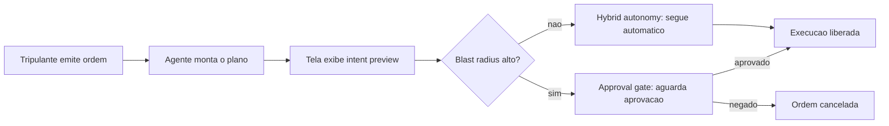
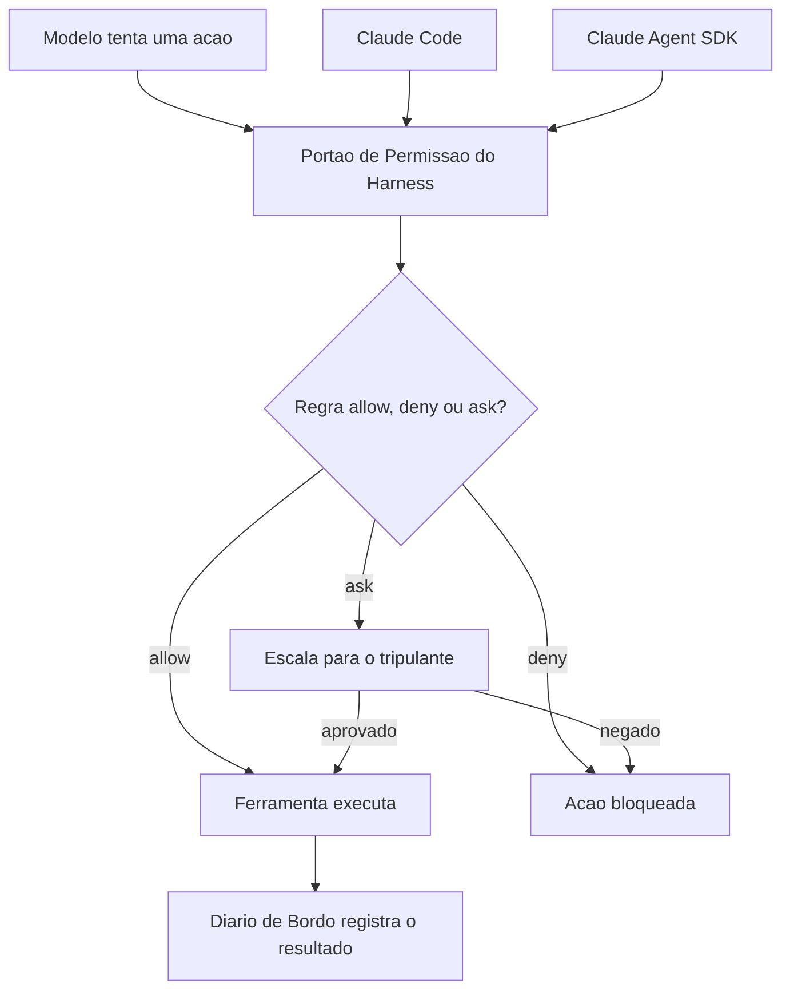
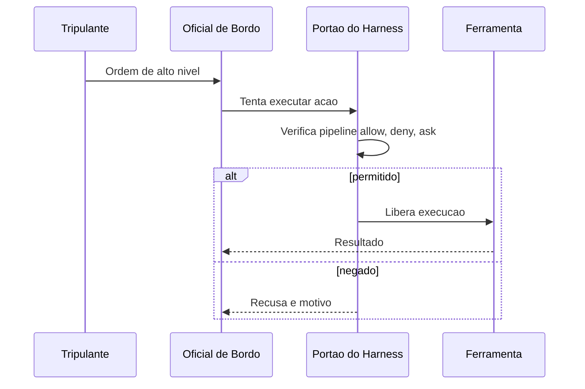

# Camada Tela e Camada Harness: Intent Preview e o Runtime do Agente

No capítulo anterior, você desenhou a planta baixa do casco: quatro camadas com contratos distintos — a Tela decide o que aprovar, o Harness decide o que é permitido, o LLM decide o que tentar, e as Tools executam. Ficou um mapa. Agora começa a construção de verdade.

Neste capítulo você desce da prancheta para o convés e para a sala de máquinas, e aprofunda exatamente as duas primeiras camadas desse mapa: a ponte de comando, onde o risco é negociado com o humano antes de qualquer coisa acontecer, e o motor do casco, o harness, que decide o que é fisicamente permitido rodar.

Ao final deste capítulo, você vai conseguir explicar — e projetar — o exato ponto do sistema em que uma intenção de um modelo de linguagem se transforma (ou não) em ação real no mundo. Você vai reconhecer o vocabulário de 2026 que separa uma interface amadora de uma interface de produção — *intent preview*, *approval gates*, *hybrid autonomy*, *blast radius* — e vai entender por que o mesmo motor de permissão que roda dentro do Claude Code também está disponível, peça por peça, no Claude Agent SDK, para você montar o seu próprio casco.

## A Interface Que Negocia Risco

Até pouco tempo, a interface de um assistente de código respondia a um pedido simples: "ajude-me a escrever isso". O padrão de interação que se consolidou em 2026 é outro, mais maduro: "revise o que eu fiz antes de eu fazer de verdade". Essa virada não é estética — é estrutural, e nasce da constatação de que delegar geração de código é seguro, mas delegar *execução* sem visibilidade prévia não é. Relatórios de mercado sobre a consolidação de agentes orquestrados no ciclo de vida de desenvolvimento de software documentam exatamente essa mudança de postura das ferramentas líderes, migrando de assistentes pontuais para agentes que expõem cada decisão antes de tomá-la.

Quatro padrões de interface sustentam essa postura, e você precisa dominar os quatro juntos — nenhum funciona isolado.

**Intent preview** é o resumo do plano de ação antes da execução: o agente narra, em linguagem natural, o que pretende fazer, antes de fazer.

**Approval gates** são os pontos de bloqueio deliberado — ações classificadas como de alto risco simplesmente não avançam sem uma confirmação humana explícita.

**Hybrid autonomy** é o meio-termo que evita fadiga de aprovação: decisões de baixo risco seguem automáticas, e só as consequentes sobem para o humano.

**Blast radius** é a estimativa explícita do raio de impacto de uma ação — quantos arquivos, quantos ambientes, quantos usuários uma operação afeta — exibida *antes* do pedido de aprovação, não depois do estrago.

## A Nuance que Devolve Ceticismo Saudável

Vale marcar uma nuance que a literatura de segurança de agentes já documenta com casos concretos: o resumo do plano só é confiável na medida em que os dados que o alimentam também forem. Se um servidor MCP comprometido, ou um conteúdo externo malicioso — uma issue do GitHub, um comentário de PR, um trecho de log de build — injeta instruções escondidas no contexto que o modelo processa, o próprio intent preview pode reportar fielmente um plano que já nasceu manipulado.

Análises dedicadas a esse vetor chamam esse padrão de *tool poisoning*: a carga maliciosa não está no julgamento do modelo, está nos dados ou na ferramenta que alimentam esse julgamento, e a Tela repassa essa carga ao humano como se fosse intenção legítima do agente. Documentação de segurança independente do próprio ecossistema MCP chega à mesma conclusão por outro ângulo, tratando qualquer conteúdo externo consumido por uma ferramenta como potencialmente hostil até prova em contrário.

Um capítulo mais adiante nesta obra retoma esse vetor em profundidade, mas já vale reter aqui a lição de arquitetura: intent preview reduz risco de execução opaca, mas não substitui a validação da proveniência do dado que chega até a Tela.

Pesquisa recente sobre supervisão humana graduada em geração agêntica de código para domínios regulados chama esse arranjo de "oversight graduado": o nível de fricção humana escala com o risco real da ação, não com uma régua fixa de "sempre pergunte" ou "nunca pergunte". É esse gradiente — e não um interruptor binário de autonomia — que faz uma tela de agente parecer confiável o suficiente para produção.

O framework dos 12 fatores para agentes LLM formaliza a mesma ideia sob outro nome: tratar "contatar um humano" como uma chamada de ferramenta de primeira classe do fluxo do agente, não como uma exceção ao fluxo. Essa distinção entre automatizar sempre e automatizar seletivamente é a mesma que separa um fluxo de trabalho fixo (*workflow*) de um agente de verdade: um agente só merece esse nome quando decide, caso a caso, se delega a etapa ao humano ou segue sozinho.

## O Motor Por Trás do Convés

Se a Tela é onde o risco é *negociado*, o Harness é onde o risco é *aplicado*. Harness, aqui, não é metáfora vaga — é o termo técnico exato para o runtime que envolve o modelo de linguagem e o transforma em um agente de codificação capaz: ele fornece as ferramentas, gerencia o contexto e constitui o ambiente de execução em que o modelo opera.

O Claude Code é o harness de referência dessa arquitetura, e sua característica definidora não é a interface de terminal — é o fato de que cada uma de suas quase vinte ferramentas embutidas passa por um portão de permissão próprio antes de qualquer execução.

Esse portão não é um detalhe de implementação: é o mecanismo que separa um harness de produção de um script que só finge ter governança. Análises de arquitetura descrevem esse portão como um pipeline de regras verificado a cada tentativa de chamada de ferramenta — não uma checagem opcional, mas um passo obrigatório entre a intenção e o efeito. Levantamentos comparativos de harnesses de agentes chegam à mesma conclusão observando concorrentes lado a lado: o que diferencia harnesses maduros de wrappers simples em torno de uma API de modelo é exatamente a presença (ou ausência) desse portão de permissão granular por ferramenta.

E esse motor não está preso ao Claude Code. O Claude Agent SDK expõe as mesmas primitivas de harness — ferramentas, gerenciamento de contexto, portão de permissão — para você construir agentes customizados embutidos na sua própria aplicação. É a mesma sala de máquinas, montada em outro casco. Uma implementação independente de harness em Go, publicada como projeto aberto, reproduz esse mesmo padrão fora do ecossistema oficial da Anthropic — evidência de que o conceito de portão de permissão não é peculiaridade de um produto, é um requisito arquitetural de qualquer agente que se pretenda seguro em produção.

Vale reforçar por que esse motor precisa ser tão rígido: a literatura sobre harnesses para agentes de execução longa mostra que, quanto mais uma tarefa se estende no tempo — mais chamadas de ferramenta, mais contexto acumulado —, maior a chance de o modelo tentar algo fora do escopo original sem perceber que se afastou dele. O portão de permissão é o que contém esse desvio, independentemente de quantas horas o agente já esteja rodando.

Essa mesma disciplina de portão se estende para além da chamada isolada de ferramenta. A documentação oficial de *programmatic tool calling* descreve um padrão em que o próprio modelo pode compor múltiplas chamadas de ferramenta dentro de um único bloco de código executado pelo runtime, em vez de emitir uma chamada por vez e esperar o resultado voltar antes de decidir a próxima. Isso parece, à primeira vista, dar mais autonomia ao modelo — e dá, no sentido de reduzir round-trips e latência. Mas o portão de permissão não perde poder de veto nesse arranjo: cada chamada individual dentro do bloco composto ainda passa pelo mesmo pipeline `allow`/`deny`/`ask`, só que agora verificado em lote antes de o bloco inteiro ser liberado para execução. O harness continua sendo a única autoridade sobre o que roda; o que muda é a granularidade da negociação, não quem decide.

## O Contrato Que Sustenta Tudo

Chegamos à cláusula que amarra as duas camadas anteriores. O contrato é simples de enunciar e profundo em consequência: o harness decide o que é *permitido*; o modelo decide o que *tentar*. O modelo de linguagem — por mais capaz que seja — nunca é a autoridade final sobre o que roda no seu ambiente. Ele propõe. O harness dispõe.

A documentação oficial de uso de ferramentas do Claude formaliza esse ciclo como um contrato de três atos: o modelo emite um `tool_use`, o ambiente de execução decide se e como processa aquele pedido, e devolve um `tool_result` — o modelo nunca pula essa mediação para agir diretamente sobre o mundo.

Essa separação de responsabilidades é o que torna o sistema auditável mesmo quando o modelo erra. Se o modelo "alucina" uma intenção perigosa — pedir para forçar um push na branch principal, por exemplo —, isso não é, por si só, uma falha de segurança: é uma tentativa registrada, que o portão de permissão intercepta antes de virar efeito real. Levantamentos acadêmicos sobre design de sistemas de agentes e harnesses reforçam esse ponto: harnesses bem projetados tratam toda saída do modelo como *não confiável por padrão* até passar pela verificação do runtime. É esse pressuposto — desconfiar do modelo por arquitetura, não por vigilância manual constante — que permite escalar autonomia sem escalar risco proporcionalmente.

Essa mesma premissa de desconfiança arquitetural explica por que o contrato falha de um jeito específico quando é rompido: não porque o modelo decide agir mal, mas porque alguém manipula o que o modelo *acredita* estar tentando fazer. Catalogações de vulnerabilidades de ferramentas MCP documentam esse padrão sob o nome de *tool poisoning* — uma ferramenta (ou os metadados que a descrevem para o modelo) é adulterada para que o modelo emita, de boa-fé, um `tool_use` que na verdade serve a um objetivo diferente do que o tripulante pediu.

O ponto crucial é que, nesse cenário, o portão de permissão continua funcionando exatamente como projetado — ele intercepta a chamada, avalia contra o pipeline de regras e decide allow/deny/ask normalmente. O que falha é a camada anterior: a integridade da própria definição da ferramenta que chega até o modelo.

## A Ponte de Comando: Onde o Risco Vira Conversa

Lembre do Estaleiro Agêntico: você não constrói uma embarcação inteira de uma vez. No capítulo anterior, você olhou a planta baixa das quatro camadas. Agora você sobe até a **ponte de comando** e desce até a **sala de máquinas** — as duas primeiras peças que ganham corpo físico no casco.

Na ponte de comando de um navio real, o comandante não executa manobras às cegas — ele recebe relatórios de rota, estimativas de risco e só então autoriza a manobra. É exatamente esse o papel da camada Tela. Antes de qualquer ordem virar movimento do casco, a ponte de comando exibe o *intent preview* — o plano da manobra — e classifica o *blast radius* de cada ação: uma correção de rota de meio grau é hybrid autonomy (segue sozinha); uma guinada brusca perto de rochas exige o approval gate (o comandante confirma).



Como Engenheiro Agêntico, você não está mais lendo linha a linha o que o agente escreveu — você está lendo o raio de impacto que ele estima, e decidindo onde vale a pena gastar sua atenção de comandante.

## A Sala de Máquinas: O Portão de Permissão do Harness

Aqui o pilar é denso o bastante para merecer duas lentes. A primeira lente é mecânica geral: pense no harness como o quadro de disjuntores da sala de máquinas. Cada comando que chega do convés — "acender o motor de bombordo", "abrir a válvula de combustível" — passa por um disjuntor específico daquele sistema. O disjuntor não julga se a manobra é *sensata*; ele só verifica se aquele comando, para aquele sistema, está na lista de permitido, proibido, ou "perguntar antes". É esse o pipeline `allow` / `deny` / `ask` que o portão de permissão do harness aplica a cada chamada de ferramenta.

A segunda lente ataca o ponto mais contraintuitivo: o motor é o mesmo, mas o casco pode ser outro. O quadro de disjuntores instalado num cargueiro padrão (o Claude Code, pronto para uso no terminal) é fisicamente o mesmo projeto de engenharia elétrica instalado num navio de apoio construído sob encomenda (uma aplicação sua, montada com o Claude Agent SDK). Você não reinventa o disjuntor a cada casco novo — você reaproveita o motor de permissão e apenas monta um casco diferente ao redor dele.



## O Contrato Entre o Oficial de Bordo e o Motor

O terceiro pilar amarra os dois anteriores numa sequência única: o tripulante dá a ordem, o oficial de bordo (o modelo) planeja a manobra e a submete ao motor, e é o motor — nunca o oficial — quem decide se ela sai do papel.



Um giro final na cena, que vale a pena imaginar antes de descer ao maquinário de verdade: e se alguém trocar a etiqueta de uma válvula na sala de máquinas — fizer o disjuntor que deveria "abrir válvula de combustível auxiliar" na verdade acionar a válvula de despejo no costado? O oficial de bordo continua emitindo a ordem de boa-fé, o quadro de disjuntores continua aplicando exatamente as mesmas regras allow/deny/ask de sempre — e ainda assim o resultado sai errado, porque a peça de informação que chegou até o oficial (o nome da válvula, o que ela supostamente faz) foi adulterada antes de entrar no fluxo.

Esse é o mesmo golpe que a literatura de segurança chama de *tool poisoning* aplicado a servidores MCP: o defeito não mora na decisão do oficial nem no disjuntor, mora na etiqueta. Guarde essa imagem — ela volta com força total quando você construir suas próprias ferramentas e servidores MCP mais adiante na obra.

## Construindo a Tela: Classificador de Risco e Intent Preview

A camada Tela não é mágica de produto — é uma função de classificação com uma interface honesta em cima. O bloco abaixo mostra o núcleo desse classificador: cada ação planejada pelo agente entra com um nível de risco e uma estimativa de raio de impacto, e sai com a decisão de exigir ou não um approval gate.

```typescript
type NivelRisco = "leitura" | "escrita_local" | "escrita_remota";

interface AcaoPlanejada {
  ferramenta: string;
  descricao: string;
  nivelRisco: NivelRisco;
  raioImpacto: string;
}

interface DecisaoTela {
  acao: AcaoPlanejada;
  requerApprovalGate: boolean;
  motivo: string;
}

function classificarRisco(acao: AcaoPlanejada): DecisaoTela {
  const riscosAltos: NivelRisco[] = ["escrita_remota"];
  const requerGate = riscosAltos.includes(acao.nivelRisco);

  return {
    acao,
    requerApprovalGate: requerGate,
    motivo: requerGate
      ? `Blast radius estimado (${acao.raioImpacto}) exige aprovacao humana explicita.`
      : "Hybrid autonomy: risco baixo, execucao automatica liberada.",
  };
}

function renderizarIntentPreview(acoes: AcaoPlanejada[]): DecisaoTela[] {
  return acoes.map(classificarRisco);
}

const planoDoAgente: AcaoPlanejada[] = [
  {
    ferramenta: "ler_arquivo",
    descricao: "Ler config_obra.json para validar parametros",
    nivelRisco: "leitura",
    raioImpacto: "nenhum efeito colateral",
  },
  {
    ferramenta: "git_push_force",
    descricao: "Forcar push na branch main compartilhada",
    nivelRisco: "escrita_remota",
    raioImpacto: "historico de commits de toda a tripulacao",
  },
];

const decisoes = renderizarIntentPreview(planoDoAgente);
```

Note que a função não decide sozinha se a ação é *boa* — ela decide se a ação precisa de olhos humanos antes de virar efeito. Essa distinção é o que separa uma tela decorativa de uma tela que realmente participa da negociação de risco.

O classificador acima simplifica para dois desfechos — approval gate ou hybrid autonomy —, mas a maturidade real de um pipeline de risco costuma introduzir um terceiro balde intermediário, para não forçar toda ação de risco médio a virar approval gate friccionado. O bloco a seguir estende o classificador original com uma faixa `escrita_local_sensivel`, tratada como hybrid autonomy com log reforçado, em vez de bloqueio:

```typescript
type NivelRiscoEstendido = NivelRisco | "escrita_local_sensivel";

interface DecisaoTelaEstendida extends DecisaoTela {
  exigeLogReforcado: boolean;
}

function classificarRiscoEstendido(
  acao: AcaoPlanejada & { nivelRisco: NivelRiscoEstendido }
): DecisaoTelaEstendida {
  const base = classificarRisco(acao as AcaoPlanejada);
  const exigeLogReforcado = acao.nivelRisco === "escrita_local_sensivel";

  return {
    ...base,
    exigeLogReforcado,
    motivo: exigeLogReforcado
      ? "Hybrid autonomy com log reforcado: risco medio, execucao automatica mas auditada em detalhe."
      : base.motivo,
  };
}
```

A diferença prática: `escrita_remota` sempre para no approval gate; `escrita_local_sensivel` — por exemplo, sobrescrever um arquivo de configuração local que não afeta ninguém além do próprio ambiente do desenvolvedor — segue automática, mas seu registro no diário de bordo é mais detalhado do que o de uma leitura trivial. Esse terceiro balde é o que, na prática, evita que hybrid autonomy vire ou tudo automático ou tudo com fricção; ele preserva o gradiente de oversight que a seção anterior descreveu como o real diferencial de uma tela madura.

## Construindo o Harness: o Portão de Permissão em Código

Do lado do motor, o padrão do Claude Agent SDK expõe exatamente o mesmo pipeline `allow` / `deny` / `ask` documentado para o Claude Code, inclusive na forma como o modelo customiza o próprio prompt de sistema dentro desse runtime. A documentação oficial de modificação de prompts de sistema confirma que essa customização acontece por cima do mesmo motor de permissão, nunca substituindo-o. O bloco a seguir implementa esse portão de forma independente de fornecedor — o mesmo desenho que sustenta tanto o CLI oficial quanto uma aplicação própria construída sobre o SDK.

```python
from dataclasses import dataclass
from typing import Callable, Literal

Decisao = Literal["allow", "deny", "ask"]


@dataclass
class SolicitacaoDeFerramenta:
    nome_ferramenta: str
    argumentos: dict
    nivel_risco: str


def pipeline_de_regras(solicitacao: SolicitacaoDeFerramenta) -> Decisao:
    regras_deny = {"rm_recursivo", "git_push_force_main"}
    regras_ask = {"escrever_arquivo_producao", "executar_migracao"}

    if solicitacao.nome_ferramenta in regras_deny:
        return "deny"
    if solicitacao.nome_ferramenta in regras_ask:
        return "ask"
    return "allow"


def portao_de_permissao(
    solicitacao: SolicitacaoDeFerramenta,
    aprovador_humano: Callable[[SolicitacaoDeFerramenta], bool],
) -> bool:
    decisao = pipeline_de_regras(solicitacao)

    if decisao == "deny":
        return False
    if decisao == "ask":
        return aprovador_humano(solicitacao)
    return True


def executar_com_harness(
    solicitacao: SolicitacaoDeFerramenta,
    aprovador_humano: Callable[[SolicitacaoDeFerramenta], bool],
) -> str:
    liberado = portao_de_permissao(solicitacao, aprovador_humano)
    if not liberado:
        return f"Bloqueado pelo harness: {solicitacao.nome_ferramenta}"
    return f"Executado: {solicitacao.nome_ferramenta}"
```

## Fechando o Ciclo: o Diário de Bordo e Chamadas Compostas

Os dois diagramas mermaid anteriores já previam uma peça que o esqueleto acima ainda não implementa: o "Diário de Bordo" que registra o resultado de cada decisão do portão. O bloco abaixo fecha essa lacuna e, de quebra, implementa em miniatura o padrão de *programmatic tool calling* — várias solicitações chegando agrupadas, cada uma ainda verificada individualmente:

```python
from dataclasses import dataclass
from datetime import datetime, timezone


@dataclass
class RegistroDeAuditoria:
    ferramenta: str
    decisao: Decisao
    timestamp: str
    aprovado_por_humano: bool | None = None


diario_de_bordo: list[RegistroDeAuditoria] = []


def executar_com_diario(
    solicitacao: SolicitacaoDeFerramenta,
    aprovador_humano: Callable[[SolicitacaoDeFerramenta], bool],
) -> str:
    decisao = pipeline_de_regras(solicitacao)
    aprovado_humano = None

    if decisao == "ask":
        aprovado_humano = aprovador_humano(solicitacao)
        liberado = aprovado_humano
    else:
        liberado = decisao == "allow"

    diario_de_bordo.append(
        RegistroDeAuditoria(
            ferramenta=solicitacao.nome_ferramenta,
            decisao=decisao,
            timestamp=datetime.now(timezone.utc).isoformat(),
            aprovado_por_humano=aprovado_humano,
        )
    )

    if not liberado:
        return f"Bloqueado pelo harness: {solicitacao.nome_ferramenta}"
    return f"Executado: {solicitacao.nome_ferramenta}"


def executar_lote_composto(
    solicitacoes: list[SolicitacaoDeFerramenta],
    aprovador_humano: Callable[[SolicitacaoDeFerramenta], bool],
) -> list[str]:
    """Simula uma chamada de ferramenta programatica: varias
    solicitacoes compostas num unico bloco, cada uma ainda
    verificada individualmente pelo mesmo portao de permissao."""
    return [
        executar_com_diario(solicitacao, aprovador_humano)
        for solicitacao in solicitacoes
    ]


def resumir_diario_de_bordo() -> dict[str, int]:
    resumo = {"allow": 0, "deny": 0, "ask_aprovado": 0, "ask_negado": 0}
    for registro in diario_de_bordo:
        if registro.decisao == "allow":
            resumo["allow"] += 1
        elif registro.decisao == "deny":
            resumo["deny"] += 1
        elif registro.aprovado_por_humano:
            resumo["ask_aprovado"] += 1
        else:
            resumo["ask_negado"] += 1
    return resumo
```

Duas peças novas aqui fecham o ciclo iniciado nos diagramas anteriores. Primeiro, `diario_de_bordo` — cada decisão do portão, aprovada ou não, vira um registro com timestamp e, quando aplicável, com o rastro explícito de que um humano aprovou. Segundo, `executar_lote_composto` — múltiplas solicitações chegam agrupadas, mas cada uma continua passando individualmente pelo mesmo `pipeline_de_regras`, sem atalho. Note o que não muda: mesmo numa chamada composta, nenhuma solicitação escapa do portão só por estar viajando em lote com outras.

A função `resumir_diario_de_bordo` não é enfeite de dashboard: é o material bruto que sustenta uma auditoria posterior — quantas ações passaram direto, quantas foram negadas de saída, e, principalmente, quantas dependeram de um humano ter clicado "aprovado" sob pressão de prazo. Se `ask_aprovado` cresce muito mais rápido que `deny`, é sinal de que as regras do pipeline estão subclassificando risco.

Esse esqueleto de três funções é, em essência, o mesmo que sustenta o arquivo `settings.json` do Claude Code na prática: arrays de permissão com padrões como `Bash(git add:*)` resolvidos exatamente neste tipo de pipeline antes de qualquer comando de shell rodar. Ganha-se ainda mais granularidade quando esse portão é combinado com *hooks* — manipuladores acionados em eventos específicos do ciclo de vida do agente (por exemplo, `PreToolUse`), com um filtro de correspondência que restringe quando disparam.

## Por Que Isso Não é Frescura de Interface

Vale a pena situar essa engenharia num pano de fundo maior. Frameworks de ciclo de vida de desenvolvimento orientado a agentes — cobrindo planejamento, codificação, teste e deploy de ponta a ponta — só se tornam seguros para produção quando cada etapa autônoma tem um portão de verificação equivalente ao que você acabou de construir. Implementações corporativas de ciclo de vida agêntico em escala, como a que a Microsoft documenta integrando Azure e GitHub, repetem o mesmo padrão em nível de pipeline inteiro: cada estágio automatizado tem seu próprio ponto de verificação antes de liberar o próximo.

## Sexta-Feira à Noite, de Novo: O Approval Gate Virado Teatro

Imagine a cena. Você está sob pressão de prazo, seu agente está configurado com Claude Code no repositório de um cliente, e uma tarefa simples de refatoração vira uma sequência de dez chamadas de ferramenta seguidas. A cada approval gate que aparece na tela, você aperta "aprovar" no automático, sem ler o intent preview. Numa dessas aprovações, o agente decide que a forma mais rápida de "limpar o histórico de commits confusos" é um `git push --force` na branch principal, compartilhada com o resto da tripulação. Você aprova. Vinte minutos depois, dois colegas perderam trabalho não commitado em cima daquele histórico reescrito.

O diagnóstico é direto à luz do que você acabou de estudar: você não desativou o approval gate — pior, você o transformou em teatro. O gate só protege alguma coisa se o blast radius exibido for realmente lido antes do clique, e se as regras `deny`/`ask` do harness estiverem calibradas para tratar `push --force` em branch compartilhada como risco alto por padrão, não como "mais uma pergunta chata". Análises de exploração de chamadas de função em agentes LLM mostram exatamente esse padrão de falha: o problema raramente é o modelo tentar algo malicioso — é o operador humano ou o harness mal configurado tratando um approval gate de alto risco como uma formalidade. Um estudo comparativo de vulnerabilidades em diferentes paradigmas de implantação de agentes chega à mesma conclusão sob outro ângulo: harnesses tecnicamente corretos falham na prática quando a camada humana da hybrid autonomy é treinada, por fadiga, a aprovar sem examinar.

A correção prática tem duas partes, e as duas moram no harness, não na sua disciplina pessoal — o que é o ponto. Primeiro: mova `git_push_force_main` da categoria "ask" para "deny" no pipeline de regras, como fizemos no código da seção anterior — uma ação com esse raio de impacto não deveria depender de você estar atento às 23h. Segundo: adote hooks de `PreToolUse` que registrem e bloqueiem automaticamente comandos destrutivos contra branches protegidas, independentemente do que o approval gate da Tela decidir. Guias de segurança dedicados ao Claude Code em produção recomendam exatamente essa dupla camada — permissões mais hooks mais sandboxing combinados — como configuração mínima de qualquer ambiente real, nunca como reforço opcional.

Vale generalizar o risco: o mesmo vetor de falha aparece, em escala maior, quando harnesses agênticos são conectados a pipelines de CI/CD sem verificação de conteúdo externo — pesquisas recentes documentam ataques de injeção de prompt via issues, PRs e logs de build que manipulam o agente a executar ações não autorizadas dentro do próprio pipeline. O princípio de defesa é idêntico ao da cena acima: nunca deixe o approval gate ser a única linha de defesa contra uma ação de alto raio de impacto.

Existe uma variante ainda mais traiçoeira dessa mesma cena, que não depende de fadiga humana nenhuma: e se o approval gate for lido com atenção total, mas a informação que ele exibe já estiver corrompida antes de chegar à Tela? Imagine que o agente usa uma ferramenta MCP de terceiros para consultar o status de um ambiente de staging, e essa ferramenta — ou os dados que ela retorna — foi adulterada para descrever uma ação de alto raio de impacto como se fosse rotina de baixo risco. Você lê o intent preview com cuidado, o texto parece plausível, e aprova uma ação que na verdade é muito mais perigosa do que o resumo deixou transparecer.

Catálogos de vulnerabilidade de ferramentas MCP descrevem exatamente esse padrão como *tool poisoning*, e frameworks de segurança do próprio ecossistema recomendam tratá-lo como classe de risco distinta de erro de julgamento humano. A correção aqui não mora na disciplina de leitura — mora em nunca conectar uma ferramenta MCP de origem não auditada a um agente com permissões de escrita, e em validar a saída de ferramentas externas antes de deixá-la alimentar qualquer decisão de approval gate.

**Armadilhas comuns:**
- Tratar approval gates como formalidade e aprovar sem ler o intent preview.
- Deixar ações de blast radius alto na categoria `ask` em vez de `deny` quando o risco é inaceitável em qualquer cenário.
- Confiar só na Tela, sem hooks de harness reforçando a mesma regra numa segunda camada.
- Não distinguir, na configuração do harness, entre ambiente de desenvolvimento local e branch/ambiente compartilhado.
- Confiar no texto do intent preview sem validar a proveniência da ferramenta ou do dado que o alimentou (tool poisoning).

## O Que Fica Deste Capítulo

Você saiu de um mapa de quatro camadas e chegou a duas peças construídas: a ponte de comando, que negocia risco com intent preview, approval gates, hybrid autonomy e blast radius; e a sala de máquinas, o harness, cujo portão de permissão aplica o pipeline `allow`/`deny`/`ask` antes de qualquer ferramenta rodar — seja dentro do Claude Code, seja dentro de uma aplicação sua construída com o Claude Agent SDK.

E você amarrou as duas com o contrato que sustenta a arquitetura inteira: o harness decide o permitido, o modelo decide o tentado. Ao dominar esse contrato, você para de tratar o comportamento do agente como uma caixa-preta de sorte e passa a enxergá-lo como um sistema com um ponto de controle específico, auditável e seu.

Como desafio, revise agora um agente que você já usa — Claude Code ou outro — e liste três ações que hoje caem em "ask" no seu fluxo, mas que, pelo raio de impacto real, deveriam estar em "deny". A seguir, você desce mais um nível: vai abrir o motor de raciocínio do Oficial de Bordo e a camada de Tools, entendendo por que o modelo nunca executa nada diretamente e como esse par converte raciocínio em ação auditável.
