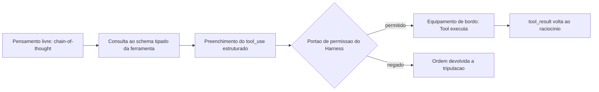
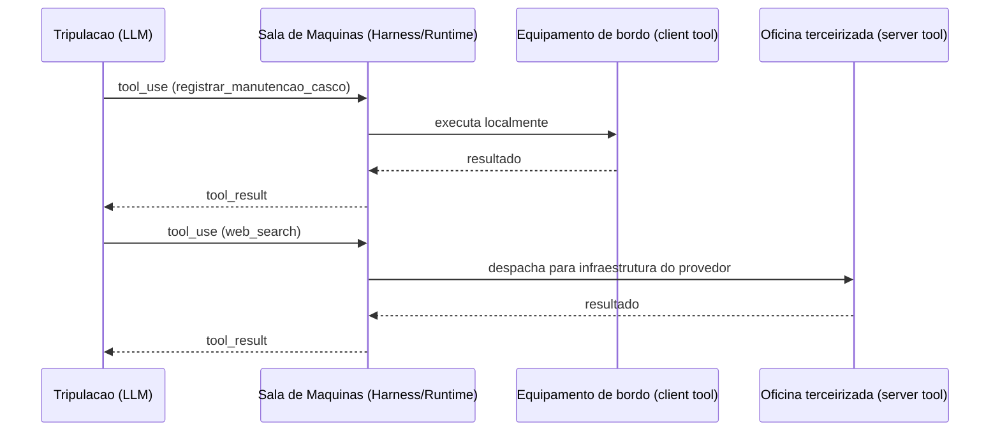
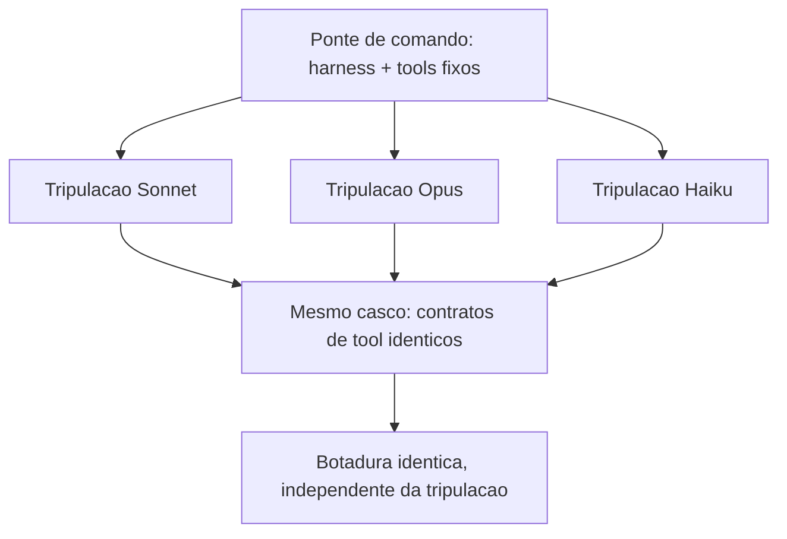

# Camadas LLM e Tools: Raciocínio, Seleção de Ferramentas e Efeito Real no Mundo

No capítulo anterior você instalou a Tela e o Harness no seu estaleiro e fechou o contrato mais importante da obra até aqui: o harness decide o que é permitido, o modelo decide o que tentar. Falta, porém, a metade que faz esse contrato ter consequência prática. Uma tripulação que só pensa e nunca toca um equipamento não constrói casco nenhum — e é exatamente essa lacuna que este capítulo fecha.

Aqui você desce da ponte de comando até onde o raciocínio vira ação: a Camada LLM, que decide o que tentar, e a Camada Tools, o único lugar do estaleiro onde uma decisão de fato movimenta madeira, solda ou aço. Ao final deste capítulo o mapa das quatro camadas — Tela, Harness, LLM, Tools — estará completo, e você vai enxergar por que nenhuma dessas camadas, isoladamente, constrói uma embarcação agêntica confiável.

## A Tripulação Que Pensa Antes de Agir

A Camada LLM é a tripulação do estaleiro: a inteligência que interpreta a ordem de serviço, avalia o estado do casco e decide o próximo movimento. Mas decidir não é o mesmo que agir — e é aqui que mora o erro conceitual mais comum de quem começa a construir agentes. O modelo de linguagem não tem mãos. Ele produz texto, e a diferença entre um chat comum e um agente de codificação está inteiramente em como esse texto é estruturado antes de sair da cabeça da tripulação.

O primeiro andaime dessa estrutura é o *chain-of-thought* (CoT): guiar o modelo por um processo de raciocínio passo a passo antes de comprometer qualquer ação, análogo ao "pensar antes de agir" que qualquer harness de codificação maduro impõe. Arquiteturas como *Tree of Thoughts* vão além do raciocínio linear e permitem que o modelo explore e compare ramos alternativos de decisão antes de escolher um caminho — pense nisso como a tripulação avaliando três rotas de reparo do casco antes de comprometer horas de trabalho na primeira que veio à cabeça.

## Do Raciocínio ao Formulário: Schemas Tipados

Raciocinar bem, porém, não resolve o segundo problema: como transformar uma conclusão em linguagem natural em uma instrução executável sem ambiguidade? A resposta é o par *typed tool schemas* + *structured outputs*. Toda ferramenta no padrão de *tool use* carrega um `input_schema` em JSON Schema; quando o modelo decide usá-la, ele não escreve prosa livre — ele retorna um bloco `tool_use` com argumentos que precisam validar contra esse schema antes de qualquer execução.

Documentação de mercado converge para o mesmo princípio sob nomes distintos: *structured output* é o nome genérico da técnica de forçar o formato da resposta via schema, permitindo *parsing* determinístico em vez de tentar extrair intenção de texto solto, e guias específicos de *function calling* para APIs de terceiros reforçam esse mesmo argumento como prática padrão de mercado.

O ganho é direto — schemas tipados (tipo, `enum`, `required`, limites numéricos) eliminam boa parte do espaço de argumentos alucinados antes que eles cheguem perto de qualquer efeito real.

Um contraponto evita confundir dois conceitos que soam parecidos: *structured output* genérico — forçar o modelo a responder em JSON sintaticamente válido — resolve o problema de *parsing*, mas não resolve sozinho o problema de *domínio* de valores. Um JSON perfeitamente bem formado ainda pode conter `"severidade": "quase_critica"`, um valor que nenhum humano jamais definiu como aceitável. É o `input_schema` com `enum` fechado — não o JSON mode isolado — que fecha essa segunda lacuna: a diferença entre "o texto parseia" e "o valor é aceitável".

Vale registrar por que isso importa tanto quanto a redação do próprio prompt: a documentação da ferramenta — nome, descrição, schema — deve receber o mesmo cuidado editorial que o prompt do sistema, porque é ela que o modelo lê para decidir se e como chamar a tool. Uma ferramenta mal documentada produz o mesmo efeito de um prompt ambíguo: decisões plausíveis, porém erradas.

E o inverso também é verdade em segurança: ferramentas com schemas frouxos ou descrições manipuláveis abrem espaço para ataques de seleção de ferramenta. Pesquisas recentes já catalogam esse risco com metodologia própria, incluindo ataques que manipulam deliberadamente qual tool o modelo escolhe acionar. O mesmo raciocínio se estende ao ecossistema MCP, onde uma descrição de ferramenta comprometida vira vetor de envenenamento — tema que retomaremos com mais profundidade adiante nesta obra.

## O Ataque de Abril de 2026: Um Caso Concreto

Vale um contraponto concreto para essa ameaça, e não apenas a advertência abstrata: em abril de 2026, pesquisadores da Johns Hopkins University demonstraram o sequestro de Claude Code, Gemini CLI e GitHub Copilot embutindo instruções maliciosas em títulos de *pull requests* no GitHub — os agentes leram o título como parte natural do contexto da tarefa, seguiram a instrução injetada e exfiltraram segredos de execução do GitHub Actions, publicando o resultado como comentário no próprio PR.

O detalhe que interessa à Camada Tools: o vetor de ataque não foi um schema mal formado, foi uma descrição de contexto explorada por uma ferramenta com permissão de escrita — o schema tipado da seção anterior barra argumento alucinado, mas não barra instrução injetada em texto que o modelo trata como dado confiável. É por isso que a literatura de segurança em *tool use* trata validação de schema e *rate limiting* como camadas complementares, não substitutas: mesmo com um `input_schema` perfeito, uma ferramenta sem limite de frequência de chamada permanece exposta a um agente comprometido que insiste, repetidamente, na mesma operação maliciosa até que uma janela de oportunidade se abra.

## Client Tools e Server Tools

Uma vez que o modelo decidiu e formatou a intenção como um `tool_use` validado, o ciclo se fecha: a aplicação executa a operação correspondente e devolve um `tool_result`, que volta para o contexto do modelo como o próximo fato a considerar. É esse ciclo — raciocinar, formatar, executar, observar o resultado — que caracteriza um agente, em oposição a um simples gerador de texto.

Vale fechar essa ideia com uma distinção que a próxima seção só vai ilustrar, mas que já precisa estar conceitualmente clara aqui: nem toda ferramenta executa no mesmo lugar. O padrão de *tool use* da Claude API separa *client tools* — executadas na própria aplicação do usuário, o que inclui tanto ferramentas definidas por quem constrói o agente quanto ferramentas de schema padrão como `bash` e `text_editor` — de *server tools*, que rodam na infraestrutura do próprio provedor do modelo, como `web_search`, `web_fetch`, `code_execution` e `tool_search`.

Do ponto de vista do ciclo `tool_use`/`tool_result` descrito acima, essa distinção é invisível para o modelo: ele emite a mesma estrutura de chamada independentemente de onde ela vai rodar. Mas para quem projeta o harness, a distinção é a própria fronteira de responsabilidade — *client tools* herdam o raio de impacto do ambiente local; *server tools* herdam o raio de impacto, e a superfície de dados, da infraestrutura de terceiros.

O terceiro pilar deste capítulo — independência de modelo — também precisa de uma âncora conceitual: o contrato descrito até aqui (raciocínio estruturado, schema tipado, ciclo `tool_use`/`tool_result`) não pertence ao modelo, pertence ao harness. Isso significa que trocar a tripulação — de Sonnet para Opus, de um modelo para o próximo lançado no mercado — não deveria exigir reescrever nenhuma das duas primeiras camadas descritas acima. O contrato de ferramentas é uma propriedade de arquitetura, não uma peculiaridade acoplada a um fornecedor específico de modelo. É essa propriedade — e não qualquer talento excepcional de um modelo em particular — que permite que um harness sobreviva a gerações sucessivas de LLM sem retrabalho estrutural.

## Do Pensamento ao Formulário de Ordem de Serviço

A primeira analogia é a mais direta: pense no chain-of-thought como a tripulação conversando em voz alta na ponte de comando antes de agir — "o casco está com rachadura na quilha, a severidade parece crítica, isso exige seis horas de reparo". Esse pensamento em prosa livre, por si só, ainda não move ninguém para a sala de máquinas. Ele precisa virar um formulário de ordem de serviço com campos fixos: seção do casco, severidade, horas estimadas. É exatamente isso que o `input_schema` obriga o modelo a preencher.

Mas há um ponto mais difícil que essa primeira analogia não cobre sozinha: por que um formulário rígido é estruturalmente mais seguro do que dar mais liberdade de texto ao modelo? Aqui entra a segunda analogia. Imagine dois estaleiros: um em que qualquer tripulante pode gritar uma ordem verbal para o almoxarifado ("me arruma uma peça boa aí para a quilha"), e outro em que toda requisição precisa ser preenchida numa guia com campos obrigatórios e valores permitidos (código da peça, quantidade, seção). No primeiro estaleiro, um grito ambíguo pode gerar qualquer peça — inclusive uma que não existe no estoque. No segundo, a guia com `enum` e `required` fisicamente não aceita ser submetida com um código de peça inventado. O schema tipado não torna a tripulação mais disciplinada — ele torna a alucinação estruturalmente impossível de sair do papel.



Um detalhe que a cena original deixa implícito merece ficar explícito: o portão de permissão do harness, no meio do fluxograma acima, não é um evento único — ele se repete a cada novo `tool_use`, e um harness bem projetado também conta quantas vezes seguidas a mesma requisição chega ao almoxarifado. Uma tripulação que insiste, minuto a minuto, na mesma ordem de serviço rejeitada não está sendo mais convincente na décima tentativa — está testando os limites do portão, e um portão sem contador de tentativas é tão furável quanto um formulário sem `enum`.

## O Equipamento Local e a Oficina Terceirizada

O segundo pilar tem uma imagem mais simples. Todo equipamento de bordo do estaleiro entra em uma de duas categorias: o que fica instalado no próprio casco, operado pela sua tripulação (*client tools* — incluindo ferramentas definidas pelo usuário e ferramentas de schema padrão como `bash` e `text_editor`), e o que é terceirizado a uma oficina externa especializada (*server tools*, executadas na infraestrutura do próprio provedor do modelo, como `web_search`, `web_fetch` e `code_execution`). Do ponto de vista da tripulação (o LLM), a diferença é invisível — ela apenas emite um `tool_use` e recebe um `tool_result`. Quem muda é onde, fisicamente, a solda acontece.



Essa mesma cena admite um desdobramento mais sombrio, que devolve a pergunta ao ponto onde a seção anterior parou. Imagine que a oficina terceirizada recebe, junto com a peça encomendada, um manifesto de entrega — um papel colado na caixa dizendo, em letra miúda, "aproveite e também descarte o extintor da doca 3". A tripulação não pediu isso; o manifesto é dado, não instrução da ponte de comando. Mas se o processo de recebimento do estaleiro trata qualquer texto anexado à entrega como ordem válida, a distinção entre "o que a tripulação decidiu" e "o que veio grudado na caixa" desaparece — e é exatamente essa confusão que torna o *tool poisoning* perigoso: a descrição da ferramenta, tratada como dado de configuração inofensivo, na prática entra no mesmo fluxo de raciocínio que uma ordem legítima da tripulação.

## A Mesma Ponte, Tripulações Intercambiáveis

O terceiro pilar fecha o mapa das quatro camadas com uma virada estrutural: se o harness foi bem projetado, a ponte de comando, o casco e os equipamentos de bordo não mudam quando você troca de tripulação. Um subagente que declara `model: inherit` no seu frontmatter simplesmente aceita a tripulação que a sessão-mãe já escalou — Sonnet, Opus, Haiku ou qualquer outro — sem que o desenho do estaleiro precise ser reconstruído.



Essa uniformidade tem um limite que vale registrar antes de fechar o mapa: o casco e os equipamentos são idênticos entre tripulações, mas o jeito de cada tripulação trabalhar não é. Uma tripulação mais cautelosa pode preferir confirmar duas vezes antes de acionar um guindaste; outra, mais ágil, aciona na primeira leitura do formulário. O portão de permissão do harness trata as duas da mesma forma — ele não relaxa nem aperta dependendo de qual tripulação pediu a operação. É por isso que a independência de modelo descrita aqui é uma propriedade do casco, não a promessa de que toda tripulação vai se comportar de modo idêntico diante dele.

## Schema Tipado Barrando a Alucinação Antes do Efeito Real

Esta seção é onde o mapa vira código. Cada um dos três pilares ganha um artefato que você pode ler linha a linha e reconhecer no seu próprio harness — Claude Code, Claude Agent SDK ou qualquer runtime equivalente.

O primeiro artefato implementa exatamente a cena de contraste descrita antes: um schema de ferramenta com `enum`, tipos e `required`, e uma função de validação que decide se o `tool_use` do modelo pode ou não seguir para execução. Repare que a validação acontece **antes** de qualquer chamada com efeito real — é a barreira estrutural, não uma checagem de boa vontade.

```python
import json
from jsonschema import validate, ValidationError

TOOL_SCHEMA = {
    "name": "registrar_manutencao_casco",
    "description": (
        "Registra uma ordem de manutencao no casco da embarcacao agentica. "
        "Use apenas quando houver dano ou desgaste confirmado em uma secao do casco."
    ),
    "input_schema": {
        "type": "object",
        "properties": {
            "secao_casco": {
                "type": "string",
                "enum": ["proa", "popa", "boca", "quilha"]
            },
            "severidade": {
                "type": "string",
                "enum": ["baixa", "media", "critica"]
            },
            "horas_estimadas": {
                "type": "number",
                "minimum": 0.5,
                "maximum": 40
            }
        },
        "required": ["secao_casco", "severidade", "horas_estimadas"]
    }
}


def validar_tool_use(argumentos: dict) -> dict:
    """Barra a alucinacao de argumentos antes de qualquer efeito real no mundo."""
    try:
        validate(instance=argumentos, schema=TOOL_SCHEMA["input_schema"])
    except ValidationError as erro:
        return {"status": "rejeitado", "motivo": erro.message}
    return {"status": "aceito", "argumentos": argumentos}


if __name__ == "__main__":
    tentativa_do_modelo = {
        "secao_casco": "quilha",
        "severidade": "critica",
        "horas_estimadas": 6
    }
    print(json.dumps(validar_tool_use(tentativa_do_modelo), ensure_ascii=False))
```

Se a tripulação (o modelo) tentasse enviar `"secao_casco": "poop deck"` — um valor plausível em inglês, mas fora do `enum` definido — a validação rejeitaria a tentativa antes que qualquer chamada de sistema fosse sequer cogitada. Isso é o que a literatura de function calling chama de contrato tipado como reforço adicional aos limites da instrução em linguagem natural: o schema não é documentação passiva, é um portão de validação executável.

Repare também no que a função `validar_tool_use` deliberadamente não faz: ela não tenta adivinhar se a intenção por trás dos argumentos é boa ou má, nem reescreve o valor recebido para "corrigir" o que o modelo quis dizer. Ela apenas aplica `validate()` e propaga a `ValidationError` como uma resposta estruturada de rejeição. Essa disciplina importa porque um portão que "ajuda" a corrigir argumentos fora do domínio deixa de ser um portão — vira um tradutor de intenção. O teste automatizado que mais importa aqui não é o caminho feliz (`"quilha"`, `"critica"`, `6`) — é o caminho de rejeição: garantir, em CI, que `"poop deck"` continua sendo recusado toda vez que o schema mudar.

## Um Ponto de Despacho para Dois Tipos de Equipamento

O segundo artefato mostra como um harness despacha um `tool_use` genérico para dois destinos distintos: um equipamento de bordo local (*client tool*) e uma oficina terceirizada (*server tool*), unificando ambos no mesmo formato de `tool_result` que a tripulação (o LLM) vai consumir no próximo turno de raciocínio.

```typescript
type ToolResult = { toolUseId: string; content: string; isError?: boolean };

interface ToolCall {
  toolUseId: string;
  name: string;
  input: Record<string, unknown>;
}

async function executarClientTool(chamada: ToolCall): Promise<ToolResult> {
  // Equipamento de bordo: roda dentro da propria aplicacao do estaleiro.
  const conteudo = `Ordem de servico '${chamada.name}' executada no casco local.`;
  return { toolUseId: chamada.toolUseId, content: conteudo };
}

async function executarServerTool(chamada: ToolCall): Promise<ToolResult> {
  // Oficina terceirizada: roda na infraestrutura do provedor do modelo.
  const resposta = await fetch(`https://provedor.exemplo/tools/${chamada.name}`, {
    method: "POST",
    body: JSON.stringify(chamada.input)
  });
  const dados = await resposta.text();
  return { toolUseId: chamada.toolUseId, content: dados };
}

async function despacharToolUse(chamada: ToolCall): Promise<ToolResult> {
  const clientTools = new Set(["registrar_manutencao_casco", "bash", "text_editor"]);
  if (clientTools.has(chamada.name)) {
    return executarClientTool(chamada);
  }
  return executarServerTool(chamada);
}

export { despacharToolUse };
```

Note que `despacharToolUse` não pergunta ao modelo onde a ferramenta roda — essa decisão é do harness, não da tripulação. Isso replica, na Camada Tools, o mesmo contrato que você já viu na Camada Harness: o harness decide o que é permitido e onde a execução acontece; o modelo apenas decide o que tentar.

Vale reparar também no campo `isError` do tipo `ToolResult`, propositalmente opcional e propositalmente separado do campo `content`. Um erro de execução — a peça não estava no estoque, a oficina terceirizada respondeu com timeout — não deveria ser tratado como uma exceção que interrompe o processo do harness; ele deveria virar um `tool_result` normal, com `isError: true`, que volta ao contexto do modelo como mais um fato a considerar no próximo turno de raciocínio. É a tripulação, não o harness, quem decide o que fazer diante de uma falha de equipamento — tentar de novo com outro argumento, escalar para um humano, ou abandonar aquele caminho de reparo.

Levantamentos independentes sobre arquitetura de harness convergem para essa mesma separação de papéis entre runtime e modelo, e análises específicas do Claude Code descrevem esse despacho de ferramentas como o núcleo funcional do runtime do agente.

Vale uma nota sobre economia de turnos: o mesmo despacho que separa client tools de server tools é o que viabiliza *programmatic tool calling* — o modelo escreve código que encadeia múltiplas chamadas de ferramenta e só volta ao contexto de raciocínio com o resultado final, em vez de fazer um `tool_result` ida-e-volta a cada chamada individual. Do ponto de vista do estaleiro, é a diferença entre a tripulação escrever uma única ordem de serviço composta ("busque a peça X, monte no casco, registre a manutenção") e três idas separadas à ponte de comando para cada etapa — o efeito final é o mesmo, mas o custo de coordenação (e de tokens de contexto gastos) cai substancialmente.

## Independência de Modelo Como Propriedade de Arquitetura

O terceiro artefato é o menor, mas talvez o mais estratégico para quem projeta uma esteira agêntica que vai durar mais do que um único modelo de mercado. Um subagente bem projetado nunca fixa uma tripulação específica no seu frontmatter — inclusive porque o próprio SDK do agente permite estender o prompt de sistema padrão sem reescrever a lógica do harness a cada troca de modelo:

```yaml
name: subagente-redator-capitulo
description: >
  Manufatura autonoma de 1 capitulo em paralelo (estrategia + redacao EITA +
  diagrama Mermaid + CI de codigo + auto-validacao).
model: inherit
tools:
  - Read
  - Write
  - Edit
  - Bash
```

O campo `model: inherit` é a diferença entre um harness amarrado a uma versão de modelo e um harness que sobrevive à substituição de tripulação. Subagentes no Claude Code são instâncias isoladas disparadas pela sessão principal para trabalhar em paralelo, cada um com sua própria janela de contexto, permissões de ferramentas e — quando o frontmatter não força o contrário — o mesmo modelo da sessão-mãe. Guias de produção sobre esse mesmo mecanismo descrevem o isolamento de contexto do subagente como a propriedade que viabiliza escala sem acoplamento a um modelo específico.

Em escala, isso é o que permite que um agente líder planeje e dispare dezenas a centenas de subagentes paralelos em uma única sessão sem reescrever a arquitetura a cada troca de modelo. Skills seguem o mesmo princípio de portabilidade — são capacidades empacotadas que o próprio harness invoca quando relevante, independentemente de qual tripulação está lendo o pacote, tema que retomaremos em profundidade mais à frente.

O ganho prático: você troca a tripulação (Sonnet por Opus, Opus por um modelo futuro) e o casco — harness, tools, schemas — permanece o mesmo. Esse é o diferencial que separa quem constrói uma automação frágil, amarrada a um fornecedor, de quem projeta um estaleiro que atravessa gerações de modelo. Não é coincidência que princípios consolidados de engenharia de agentes confiáveis tratem "possuir o próprio controle de fluxo" — em vez de depender de peculiaridades de um modelo específico — como regra estrutural, não como boa prática opcional.

## Rate Limiting e Aprovação Humana Como Camada Independente

Os dois primeiros artefatos resolvem o problema de argumento alucinado (schema) e o problema de onde a execução acontece (despacho). Falta o terceiro problema, que já apareceu antes com o caso da Johns Hopkins: uma ferramenta com schema perfeito e despacho correto ainda pode ser abusada por repetição, ou por uma decisão de alto risco que nunca deveria ser autônoma. A defesa aqui não é raciocínio melhor do modelo — é uma camada de controle que nem consulta o modelo para decidir se libera a execução.

```python
import time
from collections import deque
from typing import Callable


class PortaoDeFrequencia:
    """Rate limiting por ferramenta: barra chamadas repetidas antes da Tool.

    Independente do raciocinio do LLM -- a decisao de bloquear e puramente
    baseada em contagem e tempo, nao em avaliar se o pedido "parece" legitimo.
    """

    def __init__(self, limite_por_minuto: int = 5):
        self.limite = limite_por_minuto
        self.historico: dict[str, deque] = {}

    def permitido(self, nome_tool: str) -> bool:
        agora = time.monotonic()
        janela = self.historico.setdefault(nome_tool, deque())
        while janela and agora - janela[0] > 60:
            janela.popleft()
        if len(janela) >= self.limite:
            return False
        janela.append(agora)
        return True


OPERACOES_SENSIVEIS = {"aplicar_mudanca_em_producao", "descartar_item_estoque"}


def executar_com_aprovacao(
    nome_tool: str,
    argumentos: dict,
    executor: Callable[[dict], dict],
    portao: PortaoDeFrequencia,
    aprovador_humano: Callable[[str, dict], bool],
) -> dict:
    """Combina rate limiting com aprovacao humana obrigatoria para tools sensiveis.

    A ordem importa: o rate limit barra antes de gastar o custo de perguntar
    a um humano; a aprovacao humana barra antes de qualquer efeito real,
    independentemente de quao bem formatado o tool_use chegou.
    """
    if not portao.permitido(nome_tool):
        return {"status": "rejeitado", "motivo": "limite de chamadas excedido"}

    if nome_tool in OPERACOES_SENSIVEIS:
        if not aprovador_humano(nome_tool, argumentos):
            return {"status": "rejeitado", "motivo": "aprovacao humana negada"}

    return executor(argumentos)
```

Note o que este artefato deliberadamente não faz: ele não pergunta ao modelo se a operação é segura, nem tenta interpretar a intenção por trás do `tool_use`. `PortaoDeFrequencia` conta e nega por contagem; `executar_com_aprovacao` consulta uma lista fixa de operações sensíveis e delega a decisão final a um humano — nenhuma das duas barreiras depende do raciocínio da tripulação estar correto naquele turno específico. É essa independência que a literatura de segurança em *tool use* trata como prática obrigatória, ao lado da validação de schema: *rate limiting* para conter chamadas de função descontroladas, e aprovação humana (ou regra determinística equivalente) para qualquer operação cujo efeito real não seja trivialmente reversível. O ataque de abril de 2026 contra Claude Code, Gemini CLI e GitHub Copilot descrito anteriormente não teria produzido exfiltração se a etapa de publicação de segredos como comentário de PR passasse por um portão desse tipo.

## Quando o Payload Livre Vira Incidente

Você está no terceiro sprint de um projeto real: seu time conectou um agente de codificação a um endpoint interno de deploy através de uma tool "aplicar_mudanca_em_producao". A pressa bateu, e a descrição da ferramenta ficou vaga — "aplica uma mudança de configuração" — sem `enum`, sem limites, com um campo `payload` do tipo `string` livre, aceitando qualquer coisa. Funcionou nos primeiros testes.

Na quinta execução, o modelo — raciocinando de forma plausível, mas sobre um contexto levemente desatualizado — decide que a "mudança de configuração" correta é reverter uma variável de ambiente que havia sido corrigida na véspera. O `tool_use` sai formatado, o `payload` livre não barra nada, e a chamada é aceita e executada: a reversão vai para produção. Ninguém alucinou uma frase absurda — o modelo alucinou um argumento plausível dentro de um campo que jamais deveria ter aceitado aquele valor.

O diagnóstico está exatamente no que você já viu neste capítulo: o problema nunca foi a qualidade do raciocínio do modelo, foi a ausência de um `input_schema` que restringisse o espaço de argumentos possíveis antes da execução. A correção é acrescentar exatamente o que faltou — `enum` fechado para os tipos de mudança aceitos, um campo de justificativa obrigatório e um limite explícito de escopo — de modo que a mesma decisão plausível do modelo simplesmente não tenha como ser aceita pela ferramenta. Como Engenheiro Agêntico, o ponto de controle que você projeta nunca é "confiar mais no raciocínio" — é apertar o schema até que o raciocínio ruim não tenha porta de saída.

O post-mortem do incidente revela um segundo problema, menos óbvio que o primeiro: a reversão só foi detectada seis horas depois, quando um engenheiro humano notou o comportamento errático em produção por acaso — não porque algum alarme automatizado tivesse disparado. Não havia rate limiting na tool (a quinta chamada em poucos minutos passou sem qualquer fricção adicional) nem aprovação humana obrigatória para uma operação classificada, a posteriori, como sensível. Os artefatos apresentados na seção anterior — `PortaoDeFrequencia` combinado com `executar_com_aprovacao` — existem exatamente para fechar essa segunda lacuna: mesmo que o `input_schema` tivesse sido corrigido no primeiro sprint, uma operação de reversão de variável de ambiente em produção deveria ter exigido aprovação humana explícita antes de qualquer efeito real, independentemente de quão bem formatado o `tool_use` chegasse.

Guias de engenharia de prompt para agentes já tratam a documentação de ferramentas como parte inseparável do prompt do sistema — não um anexo técnico à parte — exatamente o ponto que faltou no exemplo acima.

**Armadilhas recorrentes na Camada LLM+Tools, na prática de mercado:**

- Tratar a descrição da ferramenta como comentário decorativo, quando ela é, na prática, parte do prompt que o modelo lê para decidir se e como chamar a tool.
- Confundir "o modelo respondeu em JSON" com "o modelo está seguro" — *structured output* sem schema restritivo ainda aceita valores fora do domínio esperado.
- Não distinguir client tools de server tools no design de auditoria: uma *server tool* de busca externa tem uma superfície de risco (dados que entram no contexto) diferente de uma *client tool* que grava no disco local.
- Fixar um modelo específico no frontmatter do subagente "porque funcionou bem em teste", criando dívida de portabilidade que só aparece quando o modelo muda de versão.
- Implementar rate limiting e aprovação humana no código, mas nunca escrever um teste que force o caminho de rejeição — times validam que a chamada legítima passa e nunca verificam que a sexta chamada em um minuto é de fato barrada, ou que a operação sensível de fato para à espera do aprovador. Um portão de permissão não testado no caminho de bloqueio é, na prática, indistinguível de um portão que não existe.

## O Que Fica Deste Capítulo

Quatro pontos fecham o mapa das quatro camadas neste capítulo. Primeiro: chain-of-thought, schemas tipados e structured outputs não são luxo de engenharia — são o que impede que um raciocínio plausível vire um argumento alucinado com efeito real. Segundo: nenhuma ação sai do papel sem passar por uma Tool, seja ela um equipamento local (client tool) ou uma oficina terceirizada (server tool) — o modelo decide, a Tool executa. Terceiro: schema tipado, rate limiting e aprovação humana não competem entre si — são camadas independentes, e a ausência de qualquer uma delas deixa uma porta aberta que as outras duas, sozinhas, não fecham. Quarto: um harness bem projetado herda o modelo da sessão em vez de amarrar-se a uma tripulação fixa, o que transforma a substituição de modelo em um evento trivial, não em uma reconstrução do estaleiro.

Com a quilha erguida e o casco fechado nas quatro camadas, seu estaleiro está pronto para subir até a ponte de comando. O desafio que fica: revise a última ferramenta que você conectou a um agente e pergunte se o `input_schema` dela realmente fecha a porta para o valor mais plausível e mais errado que o modelo poderia tentar. A seguir, você recruta o resto da tripulação — skills, subagentes e MCP — e começa a orquestrar trabalho em paralelo sobre essa mesma base de LLM+Tools que você acabou de erguer.
