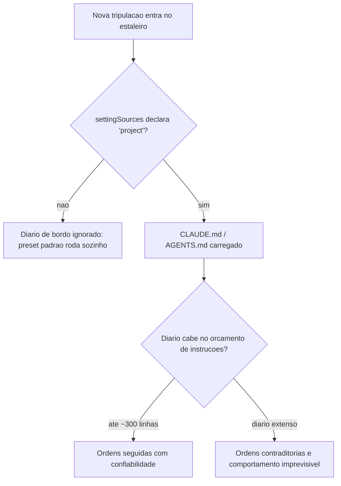
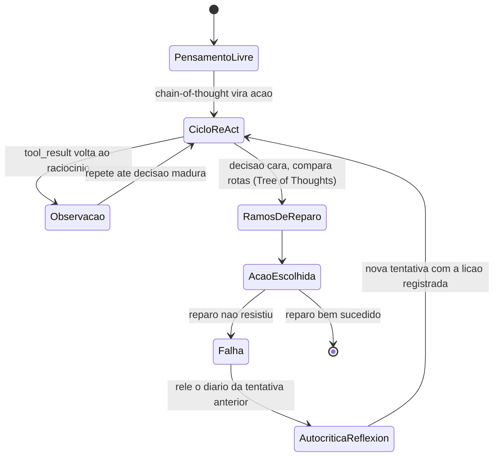
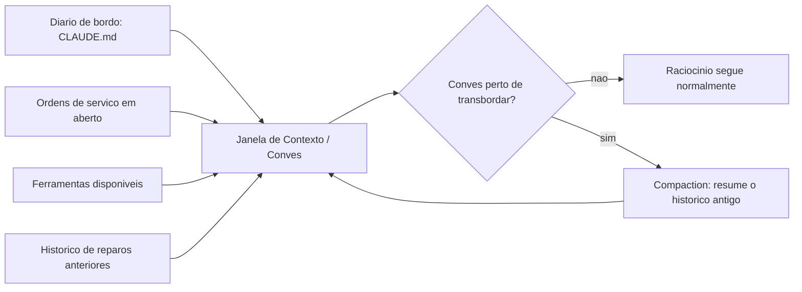

# CLAUDE.md, AGENTS.md e Engenharia de Prompt: o Contrato entre Humano e Agente

Você já recrutou a tripulação do seu estaleiro: skills como capacidades modulares empacotadas, subagentes rodando em contexto isolado, e o MCP como protocolo universal que conecta qualquer ferramenta ao seu agente. Falta o documento que faz essa tripulação inteira remar na mesma direção.

Um estaleiro com dezenas de tripulantes competentes, mas sem um diário de bordo comum, não constrói um casco — constrói pedaços desconexos, cada um a partir de uma interpretação diferente da ordem de serviço.

Este capítulo fecha esse contrato. Você vai ver como o CLAUDE.md e o AGENTS.md funcionam como o diário de bordo que todo tripulante — humano ou agente — consulta antes de agir. Vai entender como chain-of-thought, ReAct, Tree of Thoughts e Reflexion dão ao seu agente um andaime confiável de raciocínio. E vai descobrir como context engineering amplia a antiga engenharia de prompt para a disciplina de curar tudo que chega à janela de contexto.

O fio condutor é sempre o mesmo: regras e prompts só funcionam quando não entram em rota de colisão com o comportamento que já vem embutido no harness.

## O documento que a tripulação lê antes de agir

CLAUDE.md é o arquivo que fornece contexto e instruções específicas de projeto, lido automaticamente pelo Claude Code sempre que o agente opera dentro daquele diretório. Mas há uma armadilha estrutural nessa frase: "lido automaticamente" descreve o comportamento do CLI, não do Agent SDK.

Quando você constrói seu próprio harness sobre o SDK, o preset de system prompt padrão não carrega CLAUDE.md sozinho — é preciso declarar `settingSources` explicitamente (ou o equivalente em Python) para que o diário de bordo entre na leitura da tripulação.

Times que já foram surpreendidos por um agente "ignorando" instruções óbvias do projeto quase sempre encontram a causa raiz aqui: a fonte de settings nunca foi declarada, então o diário de bordo nunca chegou a ser aberto. Levantamentos sobre a superfície de configuração do Claude Code documentam esse mesmo comportamento de carregamento condicional, e os próprios guias de customização do Agent SDK mostram como estender o prompt padrão em vez de reescrevê-lo do zero — a lógica é complementar o harness, não competir com ele.

AGENTS.md resolve um problema adjacente: o de uma equipe que roda múltiplas IDEs e CLIs agênticas ao mesmo tempo. Quando não há CLAUDE.md no diretório, o Claude Code lê AGENTS.md como *fallback* — o que permite manter um único arquivo de regras compatível com dezenas de ferramentas agênticas diferentes, numa convenção já adotada por um número crescente de assistentes de codificação.

## Quando a tripulação se multiplica, o diário de bordo também

Há uma dimensão do problema que só aparece quando o estaleiro para de operar com um único tripulante e passa a instanciar vários ao mesmo tempo. Cada subagente roda em contexto isolado, o que significa que ele também lê seu próprio diário de bordo do zero, do início ao fim, a cada instanciação.

Um CLAUDE.md de 280 linhas pode ser perfeitamente administrável para uma sessão longa e única do agente principal. Mas o mesmo arquivo, multiplicado por quatro subagentes despachados em paralelo num mesmo lote, consome quatro vezes o orçamento de instruções agregado do estaleiro — não porque o conteúdo mudou, mas porque cada tripulante paralelo começa sua própria leitura sem herdar o desconto de já ter lido antes.

Isso muda o cálculo de custo de um diário de bordo extenso: não é só "esse arquivo cabe na janela de um agente", é "esse arquivo cabe multiplicado pelo grau de paralelismo que sua operação pratica".

## O orçamento de instruções que ninguém calcula

O ponto mais fácil de subestimar é o orçamento de instruções. Pesquisas sobre LLMs de fronteira sugerem que eles seguem de forma confiável algo entre 150 e 200 instruções simultâneas — e o próprio system prompt embutido do harness já consome cerca de 50 dessas antes de o diário de bordo do projeto entrar em cena.

Isso muda a pergunta que você deveria fazer ao escrever um CLAUDE.md: não é "o que mais eu poderia documentar aqui", é "o que, se eu não documentar, vai gerar um comportamento errado que o harness não corrige sozinho". Guias de boas práticas convergem no mesmo limite: um diário de bordo conciso, idealmente abaixo de 300 linhas, é seguido com muito mais confiabilidade do que um manual exaustivo que ninguém consegue reter por inteiro.

## Quatro andaimes de raciocínio que sua IA já usa

O segundo pilar desloca o olhar do documento estático para o raciocínio em tempo real. Chain-of-thought (CoT) guia o modelo por um processo de pensamento passo a passo antes de comprometer qualquer ação. ReAct estende essa ideia intercalando pensamento com ação e observação: a tripulação pensa, age, lê o resultado da ação e só então decide o próximo pensamento — um ciclo, não uma única passada.

Tree of Thoughts (ToT) vai além do raciocínio linear ao permitir que o modelo explore e compare ramos alternativos de decisão antes de se comprometer com um deles. Panoramas recentes de prompt engineering para sistemas agênticos tratam esse repertório — CoT, ReAct e ToT — como parte do vocabulário básico que todo engenheiro agêntico deveria dominar.

Reflexion fecha o quarteto adicionando uma camada de autocrítica: o agente relê sua própria tentativa anterior — especialmente uma que falhou — e usa esse histórico como sinal de aprendizado dentro da mesma sessão, sem qualquer ajuste de peso do modelo. Nenhum desses quatro andaimes substitui os outros; eles são complementares, escolhidos conforme o risco e o custo de errar em cada decisão.

Vale o contraponto que a literatura costuma deixar implícito: cada andaime tem um custo de token proporcional à sua sofisticação, e nenhum deles é "grátis". Chain-of-thought já dobra ou triplica a saída de texto antes da ação em si. ReAct multiplica isso pelo número de ciclos até a decisão madura. Tree of Thoughts multiplica de novo pelo número de ramos comparados — e é por isso que ToT se justifica para decisões caras e difíceis de reverter, mas é desperdício aplicá-lo a uma decisão de baixo risco que uma única passada de chain-of-thought já resolveria com segurança suficiente.

Escolher o andaime errado para o risco errado não é um erro de raciocínio do modelo — é um erro de dimensionamento seu.

Reflexion também tem um limite estrutural: a autocrítica vive dentro da sessão corrente e desaparece com ela, porque nenhum peso do modelo é ajustado. Se a lição aprendida não for externalizada para um artefato persistente — uma entrada no diário de bordo, um registro em arquivo —, a próxima sessão começa do zero e corre o risco de repetir a mesma falha, ainda que com palavras diferentes. Memória de curto prazo (a sessão) e memória de longo prazo (o diário de bordo do projeto) resolvem problemas diferentes, e confundir uma com a outra é a origem de boa parte da frustração de "o agente já errou isso antes e errou de novo".

## Context engineering: curar o que entra no convés

O terceiro pilar é onde a engenharia de prompt amadurece. A Anthropic descreve *context engineering* como a evolução necessária além da engenharia de prompt: o conjunto de estratégias para curar e manter o conjunto ótimo de tokens que chegam à janela de contexto durante a inferência — não apenas o texto do prompt em si, mas todo o system prompt, as ferramentas disponíveis, o histórico da conversa e qualquer dado recuperado.

A pergunta que orienta essa disciplina não é "quais são as palavras certas", é "qual configuração de contexto tem maior probabilidade de gerar o comportamento desejado do modelo".

Isso ecoa um princípio mais amplo de design de agentes eficazes: simplicidade deliberada na composição de padrões supera complexidade agêntica desnecessária, e curar contexto é parte dessa simplicidade. Importa também porque o processamento de contexto domina o custo em fluxos de agente estendidos — e quando a janela se aproxima do limite, um harness maduro aplica *compaction*: sumariza o histórico da tarefa, preservando decisões críticas e descartando resultados de ferramentas redundantes e raciocínio já superado.

O contraponto que times menos experientes descobrem tarde é que o problema raramente é o transbordamento abrupto — é a degradação silenciosa antes disso, um fenômeno conhecido como *context rot*: a qualidade do raciocínio cai de forma gradual à medida que o histórico cresce, muito antes de a janela estourar de fato.

Um agente que ainda "cabe" na janela de contexto não é garantia de um agente que ainda raciocina bem dentro dela — tokens redundantes competem por atenção do modelo mesmo sem violar limite algum. Por isso *compaction* reativa é apenas a última linha de defesa; a primeira, mais barata e mais eficaz, é nunca deixar entrar no convés o que não precisa estar lá: retrieval ranqueado que só recupera os poucos trechos mais relevantes de um dossiê, e filtragem de redundância semântica que descarta versões repetidas da mesma informação antes mesmo de cogitar resumi-las depois. Curar o que entra é sempre mais barato do que comprimir o que já entrou.

## O diário de bordo que só abre com a ordem certa

Pense no CLAUDE.md/AGENTS.md como o diário de bordo físico do estaleiro, guardado num compartimento lacrado na ponte de comando. Qualquer tripulante novo — humano contratado ou subagente instanciado — deveria consultá-lo antes de tocar em qualquer equipamento. Mas o compartimento só é destrancado se alguém, na configuração do próprio estaleiro, declarar explicitamente onde a chave fica: é isso que `settingSources` representa. Sem essa declaração, a tripulação entra, opera de memória com o que já sabe por padrão, e o diário de bordo mais detalhado do mundo permanece lacrado e inútil.



Um exemplo curto ilustra a concisão que vale a pena buscar — poucas linhas, regras que não competem com o comportamento padrão do harness, e nada que o preset do sistema já resolva sozinho:

```markdown
# Diario de Bordo do Estaleiro

- Nunca faca `git push --force` sem aprovacao explicita do mestre do estaleiro.
- Rode a suite de testes antes de qualquer commit de reparo no casco.
- Prefira editar arquivos existentes a criar novos, salvo pedido explicito.
```

## Uma ponte, quatro andaimes de raciocínio

Imagine o Oficial de Rota na ponte de comando enfrentando uma rachadura na quilha. Chain-of-thought é ele pensando em voz alta antes de agir. ReAct é ele agindo, sentindo a reação do casco, e só então decidindo o próximo movimento — um ciclo, não um monólogo único. Tree of Thoughts é ele comparando mentalmente três rotas de reparo diferentes antes de comprometer horas de trabalho na primeira ideia que veio à cabeça.

Por que Reflexion não é apenas "tentar de novo"? A diferença é que, numa nova tentativa comum, a tripulação esquece por que a tentativa anterior falhou e repete o mesmo raciocínio com uma variação aleatória. Em Reflexion, antes de agir de novo, o Oficial de Rota abre o diário de bordo da própria sessão, relê a entrada da tentativa fracassada — "o reparo cedeu porque a pressão na quilha era maior do que o previsto" — e usa essa entrada como parte do contexto da próxima decisão. É essa leitura deliberada do próprio histórico de falha, e não a repetição cega, que separa um agente que aprende dentro da sessão de um agente que apenas insiste.



## O convés disputado da janela de contexto

O convés do estaleiro tem espaço físico limitado. O diário de bordo, as ordens de serviço em aberto, os equipamentos disponíveis e o histórico de reparos anteriores competem pelo mesmo espaço finito — a janela de contexto. Context engineering é o trabalho de decidir, a cada momento, o que fica no convés e o que é guardado no porão (fora da janela) ou resumido em uma nota mais curta antes que o convés transborde.



## O diário de bordo não desce sozinho até a sala de máquinas

Imagine o Oficial de Rota, satisfeito com o diário de bordo recém-escrito, descendo até a Sala de Máquinas para verificar se a nova regra — "nunca aplicar reparo definitivo sem antes drenar a água do compartimento" — está de fato sendo obedecida. Ele encontra uma válvula qualquer, sem etiqueta, sem disjuntor associado, e nenhum registro de que alguém tenha configurado a Sala de Máquinas para impor aquela regra especificamente. O diário de bordo diz o que deveria acontecer; a Sala de Máquinas, por padrão, não lê Markdown — ela só reage a válvulas e disjuntores previamente instalados.

Essa é a lacuna estrutural que fecha o capítulo: um diário de bordo bem escrito orienta a intenção de qualquer tripulante que o leia, mas não substitui a instalação física de uma válvula que bloqueie a ação errada antes que ela aconteça. O diário de bordo atua *antes* da ação, moldando o raciocínio que a antecede; a Sala de Máquinas atua *no instante* da ação, independentemente de qual raciocínio a produziu. Um estaleiro maduro nunca aposta tudo numa só camada.

Note que isso reforça o que já vimos sobre o orçamento de instruções: se toda regra crítica de segurança pudesse ser garantida só por texto bem escrito no diário de bordo, não haveria motivo para a próxima etapa existir. A razão pela qual a Sala de Máquinas precisa de válvulas próprias, independentes da qualidade do diário de bordo, é a mesma razão pela qual nenhum LLM de fronteira segue com perfeição as duzentas instruções mais bem escritas do mundo. Regra em prosa é orientação; válvula é imposição.

## Declarando a fonte do diário de bordo no Agent SDK

Cada pilar deste capítulo ganha um artefato de código que você pode adaptar diretamente ao seu próprio harness. O primeiro resolve exatamente a armadilha descrita acima: um harness construído sobre o Agent SDK que esquece de declarar `setting_sources` simplesmente nunca lê o CLAUDE.md do projeto. O segundo trecho audita o tamanho do arquivo contra o orçamento de instruções discutido acima.

```python
from pathlib import Path
from dataclasses import dataclass

LIMITE_LINHAS_DIARIO_DE_BORDO = 300


@dataclass
class OpcoesDoAgente:
    diretorio_projeto: str
    setting_sources: list


def montar_opcoes_do_agente(diretorio_projeto: str) -> OpcoesDoAgente:
    """Configura o harness para carregar o diario de bordo do projeto.

    Sem 'setting_sources' explicito, o preset de system prompt padrao
    NAO carrega CLAUDE.md/AGENTS.md automaticamente.
    """
    return OpcoesDoAgente(
        diretorio_projeto=diretorio_projeto,
        setting_sources=["project"],
    )


def auditar_diario_de_bordo(caminho_claude_md: str) -> dict:
    """Alerta quando o diario de bordo estoura o orcamento de instrucoes
    que um LLM de fronteira segue com confiabilidade."""
    arquivo = Path(caminho_claude_md)
    if not arquivo.exists():
        return {"status": "ausente", "linhas": 0}

    linhas = arquivo.read_text(encoding="utf-8").splitlines()
    total = len(linhas)
    status = "dentro_do_orcamento" if total <= LIMITE_LINHAS_DIARIO_DE_BORDO else "estourado"
    return {"status": status, "linhas": total, "limite": LIMITE_LINHAS_DIARIO_DE_BORDO}


if __name__ == "__main__":
    opcoes = montar_opcoes_do_agente(".")
    relatorio = auditar_diario_de_bordo("CLAUDE.md")
    print(opcoes, relatorio)
```

## Um ciclo ReAct com autocrítica de Reflexion

O segundo artefato implementa o andaime de raciocínio: pensamento, ação, observação, e — quando a tentativa anterior falhou — uma autocrítica que relê o histórico antes de comprometer a próxima ação. O ciclo ação-observação aqui é, na prática, o mesmo ciclo `tool_use`/`tool_result` que sustenta qualquer chamada de ferramenta no padrão de tool use — ReAct é a camada de raciocínio que decide quando esse ciclo se repete.

```python
from dataclasses import dataclass, field
from typing import Optional


@dataclass
class TentativaDeReparo:
    pensamento: str
    acao: str
    observacao: str
    sucesso: bool


@dataclass
class HistoricoDeBordo:
    tentativas: list = field(default_factory=list)

    def registrar(self, tentativa: TentativaDeReparo) -> None:
        self.tentativas.append(tentativa)

    def ultima_falha(self) -> Optional[TentativaDeReparo]:
        for tentativa in reversed(self.tentativas):
            if not tentativa.sucesso:
                return tentativa
        return None


def ciclo_react_com_reflexion(
    estado_do_casco: str,
    historico: HistoricoDeBordo,
    max_tentativas: int = 3,
) -> TentativaDeReparo:
    """Executa pensamento -> acao -> observacao (ReAct), com autocritica
    (Reflexion) sempre que a tentativa anterior tiver falhado."""
    for numero in range(1, max_tentativas + 1):
        falha_anterior = historico.ultima_falha()

        if falha_anterior is None:
            pensamento = f"Estado do casco: {estado_do_casco}. Primeira tentativa de reparo."
            acao = "aplicar_reparo_padrao"
        else:
            pensamento = (
                f"A tentativa anterior falhou porque '{falha_anterior.observacao}'. "
                "Ajustando a acao para nao repetir o mesmo erro."
            )
            acao = "aplicar_reparo_reforcado"

        observacao = "reparo_estavel" if numero >= 2 else "reparo_cedeu_sob_pressao"
        sucesso = observacao == "reparo_estavel"

        tentativa = TentativaDeReparo(pensamento, acao, observacao, sucesso)
        historico.registrar(tentativa)

        if sucesso:
            return tentativa

    return historico.tentativas[-1]


if __name__ == "__main__":
    historico = HistoricoDeBordo()
    resultado = ciclo_react_com_reflexion("rachadura na quilha", historico)
    print(resultado)
```

## Compaction: curando o convés antes do transbordamento

O terceiro artefato mostra uma função de *compaction* simplificada: quando o histórico se aproxima do limite de tokens da janela, turnos críticos permanecem intactos e o restante é resumido em uma única entrada — o mesmo princípio de curadoria que sustenta o context engineering.

```python
from dataclasses import dataclass


@dataclass
class TurnoDeContexto:
    autor: str
    conteudo: str
    tokens: int
    critico: bool = False


def estimar_tokens(turnos: list) -> int:
    return sum(turno.tokens for turno in turnos)


def compactar_janela_de_contexto(
    turnos: list,
    limite_tokens: int,
    reserva_para_resposta: int = 2000,
) -> list:
    """Aplica compaction quando o conves (janela de contexto) esta perto
    de transbordar: mantem turnos criticos, resume o restante."""
    orcamento_disponivel = limite_tokens - reserva_para_resposta

    if estimar_tokens(turnos) <= orcamento_disponivel:
        return turnos

    criticos = [turno for turno in turnos if turno.critico]
    descartaveis = [turno for turno in turnos if not turno.critico]

    resumo_tokens = max(200, len(descartaveis) * 15)
    resumo = TurnoDeContexto(
        autor="sistema",
        conteudo=f"Resumo de {len(descartaveis)} turnos anteriores do diario de bordo desta sessao.",
        tokens=resumo_tokens,
        critico=True,
    )

    return [resumo] + criticos


if __name__ == "__main__":
    turnos = [
        TurnoDeContexto("humano", "Reparar a quilha na secao de boca", 40, critico=True),
        TurnoDeContexto("agente", "resultado de busca redundante 1", 900),
        TurnoDeContexto("agente", "resultado de busca redundante 2", 900),
    ]
    janela = compactar_janela_de_contexto(turnos, limite_tokens=1500)
    print([turno.conteudo for turno in janela])
```

## Filtrando redundância antes do convés lotar

O quarto artefato ataca o *context rot*: em vez de esperar o convés quase transbordar para então comprimir, ele evita que trechos redundantes cheguem a subir a bordo. A função abaixo ranqueia candidatos por relevância a uma consulta e descarta duplicatas semânticas antes de qualquer *compaction* entrar em cena.

```python
from dataclasses import dataclass


@dataclass
class TrechoCandidato:
    origem: str
    conteudo: str
    relevancia: float
    assinatura_semantica: str


def filtrar_redundancia_semantica(candidatos: list) -> list:
    """Mantem apenas a versao mais relevante de cada assinatura semantica
    repetida, descartando copias que veiculam a mesma informacao."""
    melhor_por_assinatura = {}
    for candidato in candidatos:
        atual = melhor_por_assinatura.get(candidato.assinatura_semantica)
        if atual is None or candidato.relevancia > atual.relevancia:
            melhor_por_assinatura[candidato.assinatura_semantica] = candidato
    return list(melhor_por_assinatura.values())


def selecionar_top_k_por_relevancia(candidatos: list, k: int) -> list:
    """Retrieval ranqueado: so os k trechos mais relevantes sobem ao conves,
    antes mesmo de cogitar compaction sobre o que ja esta la."""
    unicos = filtrar_redundancia_semantica(candidatos)
    ordenados = sorted(unicos, key=lambda c: c.relevancia, reverse=True)
    return ordenados[:k]


if __name__ == "__main__":
    candidatos = [
        TrechoCandidato("dossie_bloco_12", "hooks tem tres niveis", 0.81, "hooks_definicao"),
        TrechoCandidato("dossie_bloco_13", "hooks: evento, matcher, handler", 0.77, "hooks_definicao"),
        TrechoCandidato("dossie_bloco_08", "CLAUDE.md exige settingSources", 0.64, "claude_md_carregamento"),
    ]
    conves_curado = selecionar_top_k_por_relevancia(candidatos, k=2)
    print([c.origem for c in conves_curado])
```

Repare que o segundo candidato (mesma assinatura semântica do primeiro, relevância menor) nunca chega a competir por espaço no convés — ele é descartado na curadoria, não na compressão tardia. É essa disciplina de entrada, e não apenas a de saída via *compaction*, que funciona como primeira linha de defesa contra a degradação silenciosa do raciocínio.

Compaction é apenas uma entre várias técnicas complementares de gestão de janela de contexto — ao lado de retrieval ranqueado e filtragem de redundância semântica, que priorizam o que entra no convés antes mesmo de cogitar resumir o que já está lá. Guias de infraestrutura para aplicações de produção documentam o mesmo sintoma sob o nome de *context window overflow*, recomendando monitoramento contínuo do consumo de tokens antes que o transbordamento degrade a qualidade da resposta. Sumarização incremental já é tratada como padrão de mercado para aplicações LLM de sessão longa, não como recurso de última hora.

## Quando a regra do CLAUDE.md briga com o harness

Você acabou de escrever o CLAUDE.md do seu projeto e ficou orgulhoso: trinta e cinco regras, cobrindo tudo — desde estilo de commit até uma instrução para "sempre confirmar cada arquivo criado com o usuário antes de salvar". O harness que você usa, porém, já tem embutido em seu comportamento padrão um fluxo de aprovação prévia para escrita de arquivo em diretórios sensíveis. Sua regra número vinte e nove diz o oposto: "salve arquivos de configuração sem pedir confirmação, para acelerar o fluxo".

Na prática, o agente passa a hesitar de forma inconsistente: às vezes pede aprovação, às vezes não, dependendo de qual das cinquenta instruções do preset do sistema e de qual das suas trinta e cinco regras o modelo pondera com mais peso naquele turno específico. Você culpa o modelo por "não seguir instruções". O diagnóstico real é outro: você ultrapassou o orçamento de instruções que um LLM de fronteira segue com confiabilidade e, pior, escreveu uma regra que entra em rota de colisão direta com um comportamento já embutido no harness.

A correção não é escrever a regra com letras maiúsculas ou repeti-la em três lugares do arquivo. É remover a contradição: ou você aceita o fluxo de aprovação padrão do harness (removendo a regra vinte e nove), ou você configura explicitamente o comportamento de aprovação na camada de permissões do harness — nunca tentando sobrescrever, via prompt, um comportamento que a própria arquitetura do sistema já decidiu em outro nível. O diário de bordo eficaz não compete com o harness; ele preenche exatamente as lacunas que o harness deixa em aberto.

O mesmo erro, em escala maior, aparece quando o CLAUDE.md problemático é herdado por um lote inteiro de subagentes despachados em paralelo. A regra contraditória não gera um comportamento inconsistente isolado — ela gera comportamento inconsistente multiplicado por quatro, cinco, seis tripulantes simultâneos, cada um resolvendo o mesmo conflito de um jeito ligeiramente diferente. Auditar o diário de bordo antes de despachar um lote não é burocracia — é a diferença entre um defeito e um defeito que se replica por subagente.

Armadilhas recorrentes na escrita de CLAUDE.md/AGENTS.md e no design do andaime de raciocínio, na prática de mercado:

- Tratar o CLAUDE.md como um manual exaustivo de todas as preferências do time, em vez de um documento enxuto com o que realmente muda o comportamento do agente.
- Esquecer de declarar `settingSources`/`setting_sources` ao construir um harness próprio sobre o Agent SDK, e concluir erroneamente que "o agente não lê o arquivo do projeto".
- Usar apenas chain-of-thought em decisões de alto custo que exigiriam comparar alternativas explícitas antes de agir.
- Rodar ciclos de tentativa e erro sem qualquer componente de Reflexion, perdendo a chance de o agente aprender com a própria falha na mesma sessão.
- Deixar a janela de contexto crescer sem uma estratégia de compaction, aceitando degradação silenciosa de raciocínio à medida que o histórico se acumula.
- Confundir concisão do diário de bordo com omissão de regra crítica: cortar peso do CLAUDE.md até abaixo do orçamento de instruções, mas cortando justamente a única regra que evitaria o próximo incidente.

## O que fica deste capítulo

Três pontos fecham o contrato entre humano e agente. Primeiro: CLAUDE.md e AGENTS.md só funcionam como diário de bordo confiável quando a fonte de settings é declarada explicitamente e o conteúdo cabe no orçamento real de instruções que o modelo segue com confiabilidade — conciso é mais forte do que exaustivo.

Segundo: chain-of-thought, ReAct, Tree of Thoughts e Reflexion não competem entre si; são andaimes de raciocínio complementares que você escolhe conforme o risco e o custo de errar em cada decisão.

Terceiro: context engineering trata o prompt como apenas uma fatia do problema — o que realmente determina o comportamento do agente é a configuração inteira do que chega à janela de contexto, curada e comprimida antes que o convés transborde.

Vale revisitar seu próprio CLAUDE.md com uma pergunta simples: existe alguma regra ali que contradiz um comportamento que o harness já garante sozinho? Se existir, é ruído, não contrato. No próximo capítulo, você desce até a sala de máquinas e configura o harness na prática — `settings.json`, hooks e permissions — dando forma concreta ao portão de permissão que este capítulo já pressupôs em cada diagrama.

## Checklist rápido antes de fechar o diário de bordo

Antes de considerar seu CLAUDE.md/AGENTS.md pronto para produção, vale passar por uma checagem rápida, direta o suficiente para caber em qualquer revisão de sprint:

- O harness que você usa declara `setting_sources`/`settingSources` explicitamente, ou você está assumindo que o CLI carrega o arquivo sozinho sem verificar se isso é verdade no seu caso?
- O arquivo está abaixo de ~300 linhas? Se não está, quais regras ali só repetem o que o harness já garante por padrão, e poderiam sair sem perda real?
- Existe alguma regra escrita em prosa que tenta reverter um comportamento de segurança que o próprio harness impõe — como pedir para "nunca confirmar antes de salvar" quando o harness já tem um fluxo de aprovação embutido?
- Ao usar chain-of-thought, ReAct, Tree of Thoughts ou Reflexion, você está escolhendo o andaime pelo custo real da decisão, ou aplicando o mesmo padrão a toda situação por hábito?
- Alguma lição aprendida por Reflexion nesta sessão já foi registrada num artefato persistente, ou ela vai desaparecer assim que a sessão terminar?
- Se você despacha subagentes em lote, o CLAUDE.md que cada um herda já foi pensado para ser lido múltiplas vezes em paralelo, ou foi escrito pensando apenas numa sessão única?

Nenhuma dessas perguntas exige ferramenta nova — só a disciplina de tratar o diário de bordo como parte do controle de fluxo que você possui, não como um texto que se escreve uma vez e nunca mais se revisita.
