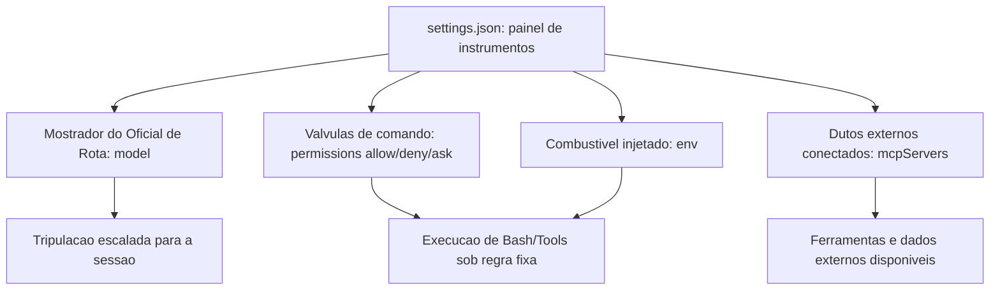
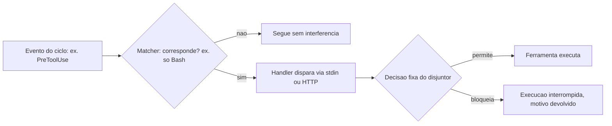
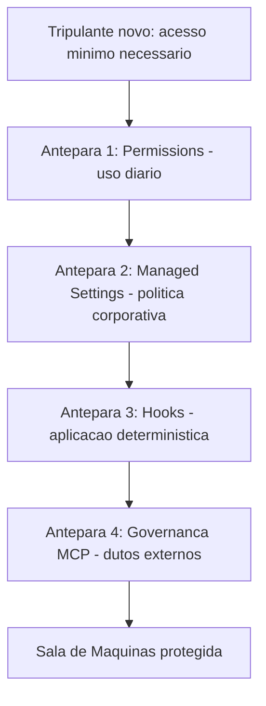
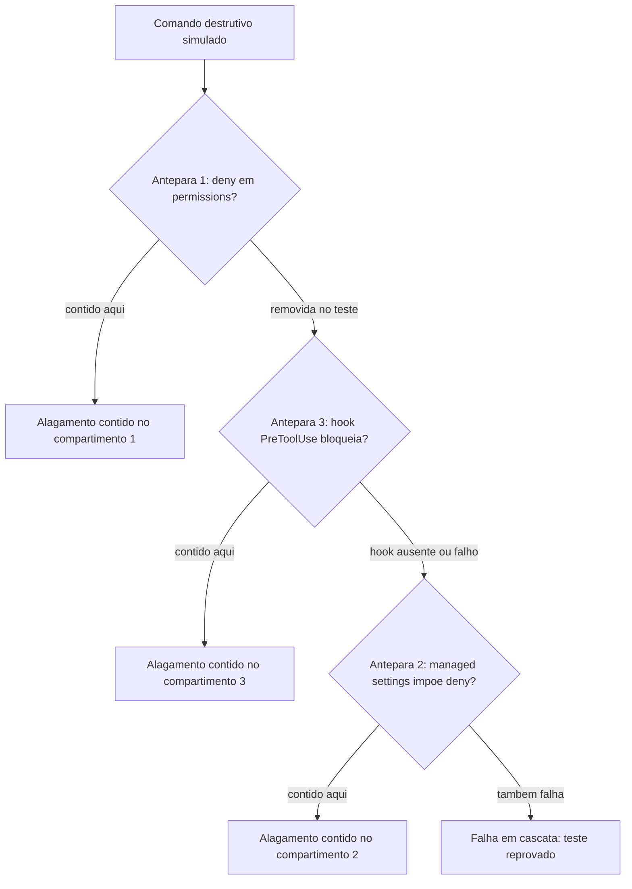

# Configurando o Harness na Prática: settings.json, Hooks e Permissions

Você redigiu o diário de bordo do seu estaleiro — o CLAUDE.md/AGENTS.md como contrato escrito entre humano e agente — e aprendeu que context engineering é a curadoria do conjunto ótimo de tokens que chega até a tripulação. Um diário de bordo bem escrito, porém, é só metade do contrato: ele diz o que a tripulação *deveria* fazer.

Falta a metade que o harness de fato *impõe* — e é para essa metade que você desce agora, da ponte de comando para a Sala de Máquinas.

Este capítulo é a inspeção técnica da Sala de Máquinas do seu estaleiro: cada válvula (permission), cada disjuntor (hook) e cada trava de segurança (managed settings) que separam um harness configurado de improviso de um harness pronto para produção. Você vai sair daqui sabendo ler e escrever um `settings.json` real, montar um pipeline de hooks determinístico e enxergar a segurança do seu agente como um sistema de camadas — não como uma promessa de bom comportamento do modelo.

## O arquivo que decide o raio de ação da sua tripulação

Todo harness agêntico precisa de um lugar único onde o operador declara o que é permitido antes de qualquer sessão começar. No Claude Code, esse lugar é o `settings.json`: ele controla qual modelo roda, quais comandos de shell são permitidos, quais servidores MCP se conectam, quais hooks disparam e quais variáveis de ambiente são injetadas em toda chamada bash. Guias de referência completos sobre o arquivo o descrevem como a fonte única de configuração de comportamento do agente, e não um detalhe opcional de conveniência.

As permissões dentro desse arquivo não são um interruptor único de "ligado/desligado" — são três arrays distintos: `allow`, `deny` e `ask`, cada um aceitando padrões granulares como `Bash(git add:*)`, `WebSearch` ou `SlashCommand(/run-prompt:*)`. Essa granularidade importa: dizer "permitido rodar git" é uma decisão completamente diferente de dizer "permitido rodar `git add`, mas nunca `git push --force`". Guias de configuração recentes reforçam que a maior parte dos incidentes de harness mal configurado nasce exatamente dessa confusão entre permitir uma ferramenta e permitir *qualquer* uso dela.

Comparativos independentes entre Claude Code, Codex e ferramentas concorrentes apontam a superfície de configuração explicitamente declarada — e não o tamanho do modelo por trás — como o fator que mais explica diferenças de confiabilidade entre harnesses de mercado. Análises de arquitetura chegam a um diagnóstico semelhante ao descrever o runtime do agente como uma composição de camadas de configuração, contexto e ferramentas que precisam ser inspecionáveis uma a uma.

## O limite do "string matching" e por que ele não basta sozinho

Há uma nuance sobre granularidade que a própria estrutura em arrays só resolve parcialmente. Um padrão como `Bash(git push:*)` em `ask` cobre a *forma* mais comum do comando — mas string matching sobre uma linha de shell tem limite conhecido: variações de espaçamento, encadeamento via `&&`, substituição de variável ou um alias previamente definido na sessão podem, em tese, produzir um comando funcionalmente equivalente que não bate exatamente com o padrão declarado.

Isso não invalida a camada de permissions — invalida a ideia de que permissions sozinha é suficiente. É exatamente a lacuna que justifica a segunda camada deste capítulo: um `deny` ou `ask` bem escrito reduz a superfície de risco, mas só um hook, que inspeciona o comando resolvido no momento da execução, fecha o que o casamento de padrão por si só deixa passar. Documentação de engenharia sobre agentes de longa duração reforça o mesmo ponto por um terceiro ângulo: a robustez desse tipo de sistema vem da configuração explícita de permissões e contexto, não de um prompt mais persuasivo.

## Hooks: onde a regra deixa de depender do raciocínio do modelo

O segundo pilar do harness são os hooks — e aqui mora uma distinção que separa quem configura harness por instinto de quem configura por engenharia. Um hook não pergunta ao modelo se ele "deveria" fazer algo; ele intercepta um evento do ciclo de execução e aplica uma regra fixa, goste o modelo ou não.

Hooks são definidos com três níveis de aninhamento: um evento ao qual responder (`PreToolUse`, `PostToolUse`, `Stop`, entre outros), um matcher que filtra quando o hook dispara (por exemplo, "somente para a ferramenta Bash") e um ou mais handlers que executam quando há correspondência — para hooks de comando, a entrada chega via stdin; para hooks HTTP, chega como corpo de requisição POST.

Vale distinguir o momento de cada evento: `PreToolUse` intercepta *antes* da execução, com poder de bloqueio real; `PostToolUse` roda *depois*, útil para auditoria e registro, mas incapaz de desfazer o que já aconteceu; `Stop` dispara ao fim da sessão, servindo para consolidar histórico, não para prevenir dano. Escolher o evento errado — auditar com `PostToolUse` uma ação que precisava de bloqueio com `PreToolUse` — é confundir o disjuntor com o relatório do disjuntor.

Esse desenho não é peculiaridade do Claude Code — é um princípio mais amplo de engenharia de agentes confiáveis. Guias consolidados de arquitetura tratam "possuir o próprio controle de fluxo", em vez de terceirizar cada decisão de segurança ao julgamento do modelo a cada turno, como regra estrutural para produção, não boa prática opcional.

O contraponto que você precisa pesar antes de instalar um hook em todo evento possível é o custo de latência. Um matcher amplo demais — por exemplo, um hook `PreToolUse` sem filtro de ferramenta, disparando um script externo a cada chamada de qualquer tool — soma tempo de execução a cada passo do agente, mesmo quando a esmagadora maioria das chamadas é inofensiva. A engenharia correta de hooks não é "colocar disjuntor em tudo"; é mapear, evento por evento, onde o custo de uma checagem determinística supera o custo de uma checagem ausente — um `git push --force` merece o disjuntor; um `ls` de rotina normalmente não precisa de um.

## Segurança como sistema de camadas, não como promessa

O terceiro pilar amarra os dois primeiros em um modelo de segurança explícito. A abordagem de segurança do Claude Code é descrita como multicamadas: permissions como camada de aplicação diária, managed settings como camada de política corporativa, hooks como camada de aplicação determinística, e controles MCP como camada de governança de ferramentas. Uma analogia recorrente na literatura de segurança de agentes trata um agente de IA como "um novo funcionário júnior com acesso root": dar apenas o acesso necessário, observar o que ele faz, e checar duas vezes quando ele tenta algo arriscado.

Essa metáfora não é decorativa — ela explica por que nenhuma camada isolada é suficiente. Permissions cobrem o uso diário, mas um usuário mal-intencionado ou um projeto comprometido pode tentar reescrevê-las; é para isso que existe managed settings, uma camada de política que o administrador de TI impõe e que o usuário final não pode sobrescrever. Análises de segurança do Claude Code tratam essa hierarquia — permissions, hooks, MCP e sandboxing operando em conjunto — como o desenho de referência para operação em ambiente corporativo, não como uma lista de recursos opcionais.

A camada de governança MCP existe porque, no momento em que você conecta um servidor externo, a superfície de risco deixa de ser só "o que o comando faz" e passa a incluir "o que a descrição da ferramenta pode induzir o modelo a fazer" — tema que o próximo capítulo aprofunda com o conceito de tool poisoning. Levantamentos práticos sobre incidentes reais de segurança em MCP convergem para o mesmo diagnóstico: a maioria das falhas nasce de servidores conectados sem revisão prévia, não de sofisticação do ataque em si.

Vale registrar que as quatro anteparas descritas aqui — permissions, managed settings, hooks e governança MCP — não esgotam a lista de controles que guias de segurança dedicados ao Claude Code recomendam para produção: eles tratam sandboxing de execução, isolando o processo do agente do restante do sistema operacional, como um quinto controle que opera num nível ainda mais baixo, contendo o dano mesmo se as quatro camadas de configuração falharem simultaneamente. Este capítulo se concentra nas quatro anteparas configuráveis via arquivo, porque são elas que você escreve e versiona diretamente — mas nenhuma delas substitui a camada de isolamento de sistema operacional quando o ambiente de execução permite configurá-la.

Esse risco já tem nome e catálogo próprios na literatura de segurança. Pesquisadores documentaram cenários concretos de injeção indireta de prompt embutida em descrições de ferramentas MCP, capazes de alterar o comportamento do agente sem que o usuário digite nada malicioso. O conceito de "raio de impacto" (blast radius) de uma ferramenta comprometida — quanto dano um único servidor MCP mal configurado pode causar antes de ser contido — já é tratado como métrica de projeto, não como abstração.

## O painel de instrumentos da Sala de Máquinas

Pense no `settings.json` como o painel de instrumentos que você instala antes de autorizar qualquer tripulação a entrar na Sala de Máquinas. Cada mostrador do painel controla um sistema diferente: um escala qual modelo está de plantão, outro abre ou fecha válvulas específicas de comando, um terceiro conecta dutos externos (servidores MCP) ao casco, e um quarto injeta combustível — as variáveis de ambiente — em cada operação. Nenhum tripulante entra na sala e decide sozinho quais válvulas estão abertas; o painel decide isso antes.



## O disjuntor determinístico

Um hook é, na mecânica geral, um disjuntor elétrico instalado na fiação da Sala de Máquinas: quando um evento específico passa por um ponto de corte (o matcher), o disjuntor age — corta ou libera a passagem — sem consultar ninguém no momento do disparo. Você instala o disjuntor antes da operação; ele age depois, sozinho, toda vez que a condição bate.

Por que essa aplicação precisa ser determinística — isto é, por que não basta instruir o modelo, em prosa, a "sempre pedir confirmação antes de comandos destrutivos"? Pense num posto de fiscalização alfandegária na entrada do estaleiro: o fiscal não pergunta à carga o que ela *pretende* ser — ele aplica uma checklist fixa, sempre na mesma ordem, independentemente de quão convincente é o motorista. Um hook é esse fiscal, não um conselho educado. O `PreToolUse` intercepta a intenção antes da execução e aplica a mesma regra sempre — inclusive nas 999 vezes em que o raciocínio do modelo estaria certo, e sobretudo na milésima vez em que ele erraria de forma plausível.



## As anteparas do casco

Pense na Sala de Máquinas protegida não por uma única parede, mas por anteparas (bulkheads) empilhadas, como num navio real projetado para não afundar mesmo se um compartimento alagar. Permissions é a primeira antepara, a mais próxima do dia a dia. Managed settings é a segunda, imposta pelo estaleiro-matriz, imune a alterações do tripulante comum. Hooks formam a terceira, aplicando regra fixa independentemente de as duas primeiras terem sido bem configuradas. E a governança MCP é a quarta, controlando quais dutos externos têm permissão de atracar no casco.



## O teste de alagamento controlado

Um estaleiro que nunca testa suas anteparas não sabe se elas seguram água até o dia em que uma antepara real precisa segurar. É prática corrente em navios reais simular o alagamento de um compartimento isolado, de propósito, para confirmar que as anteparas vizinhas contêm a água antes que ela se espalhe pelo casco inteiro — e é essa mesma disciplina que separa um harness configurado "por escrito" de um harness configurado "por evidência".

Imagine simular, antes do cais de lançamento, uma tentativa deliberada de `rm -rf` disfarçada de comando legítimo de limpeza. Se a Antepara 1 (permissions) tiver um `deny` correspondente, o comando já para ali, sem sequer acionar as demais. Remova esse `deny` de propósito no teste, e a água deveria ser contida pela Antepara 3 (o hook `PreToolUse`), que não depende de o padrão ter sido declarado em `permissions`. Se as duas primeiras anteparas falharem juntas, a Antepara 2 (managed settings) deveria ainda impor o `deny` que nenhuma sessão de projeto pode remover. Um estaleiro que só descobre, na produção, que as três anteparas falharam ao mesmo tempo não fez um teste de alagamento — fez um incidente real.



O resultado desse teste não é binário — é um mapa de quais anteparas de fato seguram água e quais existem só no papel. É esse mapa, e não a suposição de que "configuramos tudo direito", que deveria decidir se o estaleiro está pronto para o cais de lançamento.

## Um settings.json completo, válvula por válvula

Esta seção é onde o painel de instrumentos, o disjuntor e as anteparas viram arquivos de configuração reais — os mesmos que você vai versionar no repositório do seu estaleiro. O primeiro artefato é um `settings.json` funcional, cobrindo os quatro sistemas do painel: modelo, permissões granulares, servidores MCP e variáveis de ambiente.

```json
{
  "model": "claude-sonnet-5",
  "permissions": {
    "allow": [
      "Bash(git add:*)",
      "Bash(git commit:*)",
      "Bash(npm test:*)",
      "WebSearch",
      "SlashCommand(/run-prompt:*)"
    ],
    "deny": [
      "Bash(git push --force:*)",
      "Bash(rm -rf:*)",
      "Bash(curl:*)"
    ],
    "ask": [
      "Bash(git push:*)",
      "Bash(npm publish:*)"
    ]
  },
  "hooks": {
    "PreToolUse": [
      {
        "matcher": "Bash",
        "hooks": [
          {
            "type": "command",
            "command": "python scripts/hooks/checar_comando_bash.py"
          }
        ]
      }
    ]
  },
  "mcpServers": {
    "indexador-dossie": {
      "command": "python",
      "args": ["scripts/mcp_dossie_server.py"],
      "env": {
        "DOSSIE_ROOT": "output/livros"
      }
    }
  },
  "env": {
    "NODE_ENV": "development",
    "AGENT_LOG_LEVEL": "info"
  }
}
```

Repare que `deny` vem antes de qualquer intenção plausível: `Bash(rm -rf:*)` não está ali porque o modelo "provavelmente" tentaria isso — está ali porque, se ele tentar, a resposta já está decidida antes da tentativa. É a mesma lógica de schema tipado que sustenta a camada de shell: a regra existe antes do argumento chegar, não depois. Referências de configuração completas do `settings.json` documentam exatamente essa combinação de model, permissions, hooks, mcpServers e env como os cinco blocos que todo harness de produção deveria declarar explicitamente, em vez de depender dos padrões de instalação.

## O disjuntor em código: hook PreToolUse completo

O segundo artefato implementa o disjuntor determinístico: um hook `PreToolUse` que intercepta toda chamada de Bash, lê o payload via stdin e decide, com regra fixa, se a execução segue.

```json
{
  "hooks": {
    "PreToolUse": [
      {
        "matcher": "Bash",
        "hooks": [
          {
            "type": "command",
            "command": "python scripts/hooks/checar_comando_bash.py",
            "timeout": 5
          }
        ]
      }
    ],
    "Stop": [
      {
        "hooks": [
          {
            "type": "command",
            "command": "python scripts/hooks/registrar_fim_sessao.py"
          }
        ]
      }
    ]
  }
}
```

O handler é um script comum, sem nenhum SDK especial — ele só precisa saber ler JSON de stdin e devolver uma decisão pelo código de saída:

```python
import json
import re
import sys

PADROES_BLOQUEADOS = [
    r"rm\s+-rf\s+/",
    r"git\s+push\s+--force",
    r":\(\)\{\s*:\|:&\s*\};:",  # fork bomb
]


def extrair_comando(payload: dict) -> str:
    """Le o comando de Bash do payload de PreToolUse recebido via stdin."""
    tool_input = payload.get("tool_input", {})
    return tool_input.get("command", "")


def main() -> int:
    bruto = sys.stdin.read()
    payload = json.loads(bruto) if bruto.strip() else {}
    comando = extrair_comando(payload)

    for padrao in PADROES_BLOQUEADOS:
        if re.search(padrao, comando):
            resposta = {
                "decision": "block",
                "reason": f"Comando bloqueado pelo disjuntor: padrao '{padrao}' detectado."
            }
            print(json.dumps(resposta, ensure_ascii=False))
            return 2  # codigo 2 = bloqueio, motivo volta ao raciocinio do modelo

    print(json.dumps({"decision": "allow"}, ensure_ascii=False))
    return 0


if __name__ == "__main__":
    sys.exit(main())
```

O ponto central deste script não é a lista de regex — é o código de saída. Um handler de hook que retorna o código de bloqueio interrompe a execução da ferramenta e devolve o motivo ao contexto do modelo, independentemente de quão convincente fosse o raciocínio que produziu aquele comando. É a mesma distinção da fiscalização alfandegária: o fiscal não avalia a intenção da tripulação, ele aplica a checklist e corta a passagem quando ela não bate.

## Managed settings: a antepara que o usuário não reescreve

O terceiro artefato mostra a camada de política corporativa. Um `managed-settings.json`, aplicado pelo time de segurança/TI fora do alcance de escrita do usuário final, tem o mesmo formato de um `settings.json` comum — mas com um efeito diferente: ele vence qualquer configuração de projeto ou de usuário que tente afrouxar a regra.

```json
{
  "permissions": {
    "deny": [
      "Bash(rm -rf:*)",
      "Bash(sudo:*)",
      "Bash(curl:* | sh)",
      "WebFetch(domain:*.internal-nao-autorizado.com)"
    ]
  },
  "mcpServers": {
    "servidores-nao-aprovados": {
      "enabled": false
    }
  }
}
```

A regra de precedência é o que dá sentido à antepara: um `settings.json` de projeto pode tentar remover `Bash(sudo:*)` do próprio `deny` local, mas a entrada correspondente em managed settings continua valendo, porque essa camada foi desenhada para não ser sobrescrita por quem opera a sessão do dia a dia. Guias de segurança dedicados ao Claude Code descrevem managed settings, hooks e sandboxing operando como um conjunto único de controles de produção — não como recursos que se escolhe usar isoladamente.

## Resolvendo a precedência: o que vence quando duas anteparas discordam

Quando o `settings.json` de projeto e o `managed-settings.json` corporativo discordam sobre a mesma regra, qual vence? A função abaixo simula essa resolução de precedência — managed settings sempre por cima, projeto no meio, preferências locais do usuário por baixo — antes de qualquer sessão real começar.

```python
from dataclasses import dataclass, field


@dataclass
class ConfiguracaoDePermissoes:
    origem: str
    deny: list = field(default_factory=list)
    allow: list = field(default_factory=list)


def resolver_precedencia(
    managed: ConfiguracaoDePermissoes,
    projeto: ConfiguracaoDePermissoes,
    local: ConfiguracaoDePermissoes,
) -> dict:
    """Managed settings vence qualquer tentativa de afrouxar uma regra:
    um padrao em managed.deny nao pode ser reaberto por projeto ou local."""
    deny_efetivo = set(managed.deny) | set(projeto.deny) | set(local.deny)

    allow_bruto = set(managed.allow) | set(projeto.allow) | set(local.allow)
    allow_efetivo = allow_bruto - deny_efetivo  # managed.deny sempre prevalece

    tentativas_de_afrouxamento = allow_bruto & set(managed.deny)

    return {
        "deny_efetivo": sorted(deny_efetivo),
        "allow_efetivo": sorted(allow_efetivo),
        "afrouxamentos_bloqueados": sorted(tentativas_de_afrouxamento),
    }


if __name__ == "__main__":
    managed = ConfiguracaoDePermissoes("managed", deny=["Bash(sudo:*)", "Bash(rm -rf:*)"])
    projeto = ConfiguracaoDePermissoes("projeto", allow=["Bash(sudo:*)"], deny=["Bash(curl:*)"])
    local = ConfiguracaoDePermissoes("local", allow=["Bash(npm run dev:*)"])

    efetivo = resolver_precedencia(managed, projeto, local)
    print(efetivo)
    # afrouxamentos_bloqueados mostra que o projeto tentou liberar 'sudo',
    # mas managed settings nunca perde essa disputa.
```

O campo `afrouxamentos_bloqueados` é o mais importante do retorno: ele não é um erro silencioso, é evidência auditável de que alguém, em algum nível da configuração, tentou afrouxar uma regra que a política corporativa proíbe. Um harness de produção deveria logar esse campo a cada resolução de sessão — não para punir quem escreveu o `settings.json` de projeto, mas para expor, com dado e não com suposição, onde a intenção de configuração diverge da política vigente.

## Checklist de auditoria das quatro camadas

Fecha o pilar de segurança um script simples que você pode rodar antes de liberar um harness para produção: uma auditoria que confirma se as quatro anteparas existem, em vez de assumir que existem.

```bash
#!/usr/bin/env bash
set -euo pipefail

echo "Auditoria das quatro anteparas de seguranca do harness"

if [ -f ".claude/settings.json" ]; then
  echo "[OK] Antepara 1 (Permissions): settings.json de projeto encontrado."
else
  echo "[FALHA] Antepara 1 ausente: nenhum settings.json de projeto."
fi

if [ -f "/etc/claude-code/managed-settings.json" ] || [ -f "$HOME/.claude/managed-settings.json" ]; then
  echo "[OK] Antepara 2 (Managed Settings): politica corporativa presente."
else
  echo "[ALERTA] Antepara 2 ausente: nenhuma politica corporativa aplicada."
fi

if grep -q '"PreToolUse"' .claude/settings.json 2>/dev/null; then
  echo "[OK] Antepara 3 (Hooks): pelo menos um hook PreToolUse configurado."
else
  echo "[ALERTA] Antepara 3 ausente: nenhum hook PreToolUse configurado."
fi

if grep -q '"mcpServers"' .claude/settings.json 2>/dev/null; then
  echo "[OK] Antepara 4 (Governanca MCP): servidores MCP declarados explicitamente."
else
  echo "[INFO] Antepara 4: nenhum servidor MCP declarado (pode ser esperado)."
fi
```

Esse tipo de checklist determinístico é o que separa uma configuração de harness feita "de cabeça" de uma que passa por revisão antes do cais de lançamento.

## Quando "liberar tudo" vira incidente

Você acabou de herdar um projeto de um time que estava com prazo apertado. O `settings.json` deles tem uma única linha em `permissions.allow`: `"Bash(*)"`. Alguém, num sprint corrido, decidiu que era mais rápido "liberar tudo e confiar no bom senso do modelo" do que desenhar os padrões granulares. Funcionou por três semanas — o agente rodava testes, fazia commits, instalava dependências, tudo dentro do esperado.

Na quarta semana, um agente em uma sessão de limpeza de branch recebeu a instrução "remova os arquivos temporários de build que não são mais necessários". O raciocínio foi plausível: identificar uma pasta `dist/` antiga e removê-la recursivamente. O problema é que, sem `deny` explícito e sem hook algum interceptando `PreToolUse`, o comando gerado — um `rm -rf` com um caminho relativo mal resolvido a partir do diretório de trabalho errado — varreu também uma pasta de dados de teste que não deveria ter sido tocada. Nada nisso foi um "bug" do modelo: foi uma decisão plausível, sem nenhuma antepara entre a decisão e o disco.

O agravante que só aparece quando você olha o incidente em escala de fábrica: esse mesmo `settings.json` com `"Bash(*)"` solto em `allow` não protegia um único agente — protegia (ou desprotegia) todo lote de subagentes despachados em paralelo. Se quatro subagentes de redação estivessem rodando naquele exato momento, os quatro herdariam a mesma ausência de antepara, e a probabilidade de pelo menos um deles produzir um comando plausível-porém-destrutivo sobe com o número de tripulantes simultâneos, não permanece constante. Uma antepara ausente não é um risco fixo por sessão; é um risco que se multiplica pelo grau de paralelismo do estaleiro.

O diagnóstico está exatamente nas seções anteriores: o problema nunca foi a qualidade do raciocínio — foi a ausência de duas das quatro anteparas. Faltou um `deny` granular cobrindo padrões destrutivos de `rm`. E faltou, sobretudo, um hook `PreToolUse` que aplicasse essa regra de forma determinística, independentemente de qual raciocínio levou até ali. A correção não é "pedir para o modelo ter mais cuidado" — é reescrever o `settings.json` com `allow`/`deny`/`ask` granulares e acrescentar exatamente o hook mostrado acima, testado antes de qualquer sessão real tocar o repositório.

Armadilhas recorrentes na configuração de harness, na prática de mercado:

- Usar `Bash(*)` em `allow` "para não travar o fluxo", eliminando de um só golpe a única camada que distingue permissão de confiança cega.
- Configurar hooks apenas em ambiente local, sem levar a configuração para managed settings: qualquer clone do repositório perde a proteção.
- Escrever um handler de hook que sempre retorna sucesso "para não quebrar nada durante o desenvolvimento" e esquecer de reativar o bloqueio antes de produção.
- Conectar um servidor MCP de terceiros sem revisar suas ferramentas expostas, tratando a governança MCP como um passo opcional em vez da quarta antepara.
- Confundir "está documentado no CLAUDE.md" com "está aplicado" — o diário de bordo orienta a intenção; só permissions, managed settings, hooks e governança MCP de fato impedem o desvio.
- Confiar em `deny` de string exata como se fosse a antepara final, sem considerar que variações de espaçamento, encadeamento de comandos ou um alias de shell podem produzir um comando funcionalmente idêntico que não bate com o padrão declarado.

## O que fica deste capítulo

Três pontos fecham a inspeção da Sala de Máquinas. Primeiro: `settings.json` é o painel único que decide modelo, comandos permitidos, servidores MCP e variáveis de ambiente antes de qualquer sessão começar — configuração implícita é configuração de risco.

Segundo: hooks transformam evento, matcher e handler em um pipeline determinístico que intercepta a execução independentemente do raciocínio do modelo — a diferença entre confiar e verificar.

Terceiro: segurança de harness nunca é uma camada só — permissions, managed settings, hooks e governança MCP formam anteparas que cobrem a falha umas das outras, na mesma lógica de "acesso mínimo, observação constante, dupla checagem" com que você trataria um tripulante novo com acesso root.

Guarde essa disciplina de anteparas para além da sessão interativa: quando o mesmo harness passar a rodar dentro de um pipeline de CI/CD, permissions e hooks mal configurados deixam de ser um risco de sessão isolada e viram um vetor de ataque documentado contra o próprio pipeline de entrega. E guarde também a lição do teste de alagamento controlado: um estaleiro só sabe que uma antepara segura água quando a testa deliberadamente, antes do incidente real — nunca depois dele.

Com as válvulas, disjuntores e anteparas da Sala de Máquinas configurados, seu estaleiro está pronto para o próximo desafio: as ferramentas que essas válvulas controlam. No próximo capítulo, você constrói suas próprias tools e servidores MCP, tratando a documentação de cada ferramenta com o mesmo rigor de engenharia que você acabou de aplicar ao `settings.json`.

## Checklist rápido das quatro anteparas

Antes de liberar qualquer harness para produção, vale rodar mentalmente — ou literalmente, com o script de auditoria mostrado acima — esta checagem:

- Seu `settings.json` de projeto tem `deny` granular cobrindo os comandos destrutivos mais óbvios (`rm -rf`, `git push --force`), ou você está confiando só no bom senso do modelo para nunca tentá-los?
- Existe pelo menos um hook `PreToolUse` interceptando chamadas de Bash antes da execução, ou toda a sua proteção depende só de padrões de string em `permissions`?
- Um `managed-settings.json` corporativo existe fora do alcance de escrita do usuário comum, garantindo que a política de segurança sobreviva mesmo que alguém tente afrouxar o `settings.json` local?
- Você já simulou deliberadamente um comando destrutivo disfarçado de rotina para ver qual antepara realmente o barra, ou está apenas assumindo que as quatro camadas funcionam porque estão configuradas no papel?
- Servidores MCP conectados ao seu estaleiro passaram por alguma revisão das ferramentas que expõem, ou foram simplesmente adicionados porque resolviam um problema imediato?

Cada "não" nessa lista é uma antepara que só existe no papel — e um estaleiro maduro prefere descobrir isso num teste controlado, não num incidente real.
