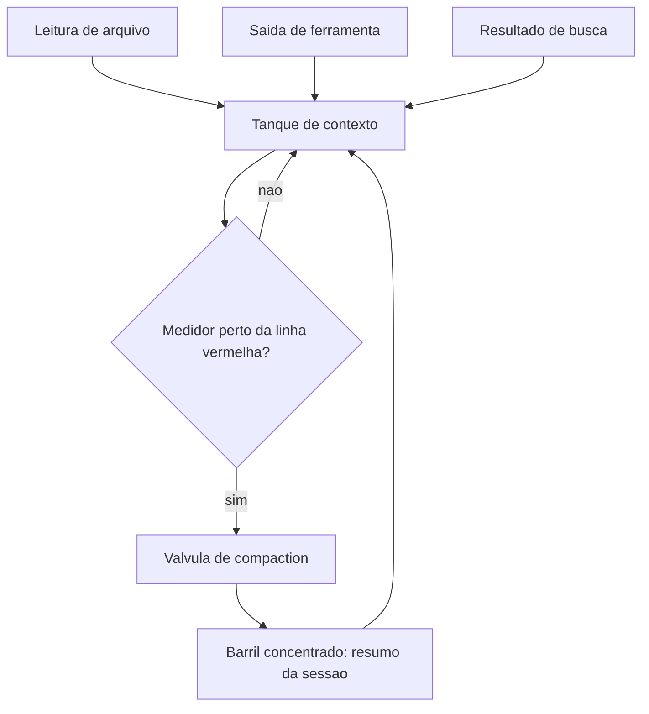
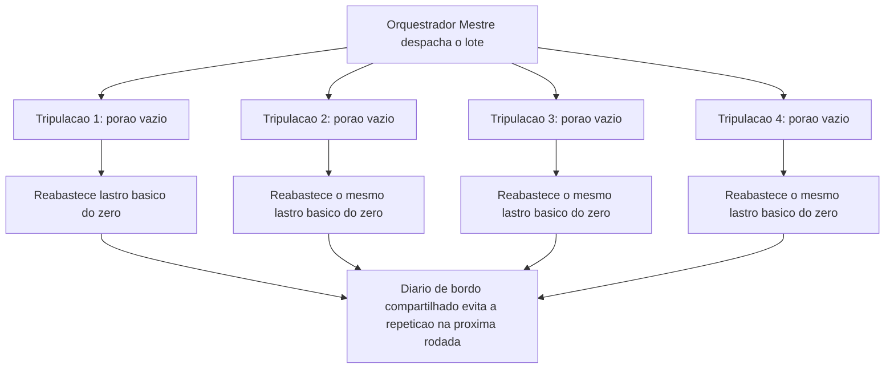

# Economia Severa de Tokens: Caveman, RTK-Memory, Lean-CTX e Headroom

Você blindou os Guindastes do Cais por fora — schema como manual de operação, e três anteparas contra um manual adulterado por sabotagem. Seu estaleiro agora resiste a ataque. Mas um estaleiro pode estar perfeitamente seguro e ainda assim afundar por um motivo mais silencioso: falta de combustível, ou pior, combustível queimado sem necessidade. É disso que trata este capítulo.

Todo guindaste que opera, todo oficial de rota que decide, toda tripulação que investiga um problema — tudo isso consome o mesmo recurso finito: tokens. Você já aprendeu a proteger seu estaleiro de sabotagem externa. Agora você aprende a protegê-lo de si mesmo, da própria voracidade de um agente que lê mais do que precisa, busca do jeito mais caro possível e esquece no turno seguinte o que descobriu com esforço no turno anterior.

## O combustível que domina o custo real

Em qualquer fluxo de agente que se estende por múltiplos turnos — exploração de código, investigação de um bug, orquestração de subagentes — existe um fato que a maioria dos operadores subestima: o processamento de contexto, não a geração da resposta final, domina o custo total da operação. Cada arquivo lido, cada saída de ferramenta despejada de volta na janela, cada resultado de busca intermediário é combustível que o modelo precisa processar e sobre o qual precisa raciocinar antes de chegar à próxima decisão — e esse combustível é cobrado independentemente de ter sido útil ou não.

Esse é o fundamento por trás do princípio de *context engineering*: tratar o gerenciamento da janela de contexto como disciplina de engenharia central, não como detalhe de implementação. Na prática, isso se materializa em algumas técnicas complementares. Retrieval ranqueado e filtragem de distintividade semântica selecionam apenas os poucos trechos mais relevantes para uma tarefa específica, descartando redundância entre documentos que dizem a mesma coisa de formas diferentes. *Few-shot* dinâmico trata exemplos como dados recuperáveis, escolhendo apenas os mais similares à consulta atual em vez de anexar um catálogo fixo de exemplos a cada chamada.

E quando o histórico de uma sessão longa se aproxima do limite da janela, entra em cena a *compaction*: o histórico de conversa e tarefa é sumarizado, preservando decisões críticas e descartando saídas de ferramenta redundantes e raciocínio já superado — a mesma abordagem que a própria equipe de engenharia por trás do Claude Code usa internamente em sessões longas de codificação.

## O ponto de virada que chega antes do limite físico

Há um corpo crescente de pesquisa formalizando o problema: frameworks recentes propõem otimizar explicitamente as *skills* de agentes LLM para eficiência de token, tratando a economia de contexto como parte do próprio design da skill, não como otimização posterior. Outros formalizam um framework unificado de otimização custo-desempenho, situando *compaction*, retrieval seletivo e compressão de saída como pontos de uma mesma curva de trade-off entre precisão e custo. Mais contexto quase sempre melhora a qualidade da resposta, até o ponto em que o ganho marginal deixa de compensar o custo marginal — e esse ponto de virada chega muito antes do limite físico da janela.

Vale um contraponto que a disciplina de economia de tokens não pode ignorar: cortar contexto agressivamente demais também tem custo, só que ele aparece depois, não no momento da chamada. Um agente que recebe menos contexto do que precisa não fica "mais barato" — fica mal-informado, e um agente mal-informado tende a errar a primeira tentativa, gerar uma segunda rodada de investigação para compensar a lacuna, e terminar consumindo mais tokens no total do que teria consumido se o contexto certo tivesse sido fornecido de uma vez.

A meta nunca é o menor contexto possível; é o contexto mínimo suficiente para a tarefa específica — um alvo que se desloca conforme a complexidade da tarefa muda, e que nenhuma regra fixa de corte substitui por completo. Janelas de contexto estouradas não falham graciosamente: elas produzem respostas truncadas, erros silenciosos de aplicação e, em pipelines de agente, decisões tomadas sobre um histórico incompleto sem que nada avise o operador. A recomendação central converge sempre para o mesmo ponto: instrumentar o gatilho de estouro antes que ele aconteça, não depois.

A própria *compaction* carrega um risco simétrico ao do porão que transborda: comprimir cedo demais, ou de forma grosseira demais, pode descartar um detalhe que só se revela importante turnos depois — um valor específico de configuração, uma decisão de arquitetura mencionada de passagem, um número de versão citado uma única vez. É por isso que a distinção entre turno crítico e turno descartável precisa ser uma decisão explícita, tomada no momento em que o fato entra no porão, não recuperada às cegas no momento em que a válvula de compaction já está prestes a agir.

## Quando o estaleiro despacha vários guindastes ao mesmo tempo

Essa disciplina deixa de ser opcional no momento em que o estaleiro passa a operar vários guindastes em paralelo — quando você despacha um lote de subagentes para trabalhar simultaneamente em partes distintas do casco, o mesmo desperdício de contexto que era incômodo em uma sessão única se multiplica pelo número de tripulações trabalhando ao mesmo tempo.

Cada subagente do lote deve carregar apenas o contexto mínimo da sua própria tarefa, nunca o histórico completo do orquestrador — e relatos de operação em escala mostram que o ganho de paralelismo desaparece rapidamente se cada tripulação do lote reabrir o mesmo porão de arquivos que a anterior já vasculhou.

Isso não significa que lotear sempre em mais subagentes seja a resposta certa: cada subagente adicional soma seu próprio custo fixo de inicialização de contexto — instruções do sistema, ferramentas disponíveis, formato de retorno esperado — antes mesmo de tocar na tarefa real, e um lote grande demais para uma tarefa pequena demais paga esse custo fixo várias vezes sem ganho proporcional de paralelismo.

A pergunta correta nunca é "quantos subagentes o estaleiro consegue despachar de uma vez", é "quantos tarefas independentes o lote realmente tem para dividir sem que a coordenação entre elas custe mais do que economiza". É por isso que a economia severa de tokens não vive apenas na disciplina individual de um agente — ela também pode e deve ser aplicada automaticamente, via configuração persistente do harness (`settings.json`) e via *hooks* que disparam compressão ou bloqueiam leitura redundante em pontos fixos do ciclo de execução, sem depender da lembrança do operador a cada sessão. A disciplina que funciona só quando o operador se lembra de aplicá-la não escala — a que é fixada em configuração e hook, escala.

## Um portfólio de quatro disciplinas, não uma métrica única

Economia severa de tokens não é uma métrica única a maximizar, é um portfólio de quatro disciplinas complementares, cada uma cobrindo uma fase diferente do ciclo do combustível. Compaction atua sobre o que já está no porão, decidindo o que permanece e o que é resumido; retrieval seletivo e filtragem de redundância semântica trabalham lado a lado com ela, reduzindo o que entra no resumo antes mesmo de ele ser gerado.

Lean-ctx atua antes disso, na admissão: decide o que sequer entra no porão, preferindo o sonar barato do grep à leitura cara de arquivo inteiro sempre que a tarefa permitir, reservando o instrumento mais caro — busca semântica, LSP — para o resíduo de casos que realmente exigem precisão cirúrgica.

Headroom atua na saída do outro lado do pipeline, comprimindo o que a tripulação devolve à ponte de comando depois de executar um comando, para que um log de quatrocentas linhas não vire, ele mesmo, um novo barril de lastro morto. E caveman, por fim, atua na própria comunicação entre tripulação e oficial de rota — cada instrução, cada relatório de status, cada confirmação de tarefa concluída consome tokens que competem pelo mesmo porão, e reduzir esse volume sem perder precisão técnica libera espaço que, de outra forma, seria ocupado por cortesia verbal sem função.

Tratar essas quatro disciplinas como intercambiáveis — "já fiz compaction, não preciso de mais nada" — é o erro mais comum de quem aplica economia de tokens pela metade: elas atuam em pontos diferentes do mesmo pipeline, e a ausência de qualquer uma deixa uma fresta por onde o desperdício volta a entrar. Um estaleiro maduro nesta disciplina não escolhe uma técnica favorita; instrumenta as quatro, cada uma no ponto do pipeline onde ela é mais barata de aplicar, e revisita periodicamente se alguma delas ficou desatualizada em relação ao volume real de tráfego que o harness processa em produção.

Nenhuma dessas quatro disciplinas exige reescrever o harness do zero — todas cabem como configuração incremental sobre o que o estaleiro já tem instalado. Adotá-las cedo é sempre mais barato do que esperar a primeira fatura de token que doer o suficiente para justificar a mudança.

## O porão de combustível do estaleiro

Pense na janela de contexto como o porão de combustível do seu estaleiro. Cada leitura de arquivo, cada saída de comando, cada resultado de busca que sobe da Sala de Máquinas para a Ponte de Comando é um barril despejado nesse porão. O porão tem um medidor de nível visível — e, diferente de um tanque de combustível comum, aqui todo litro carregado já foi pago no momento em que entrou, esteja ele sendo usado ou apenas ocupando espaço como lastro morto.

Quando o medidor se aproxima da linha vermelha, uma válvula de compactação entra em ação: em vez de deixar o porão transbordar, ela drena o conteúdo bruto para um barril concentrado — um resumo que preserva as decisões que importam e descarta o que já foi processado e superado.



O custo de um litro de combustível não é uniforme. Um barril despejado no porão logo no início do turno, quando a tripulação ainda vai raciocinar sobre ele dez vezes ao longo da investigação, tem um custo por uso muito menor do que um barril despejado por engano — um arquivo lido inteiro quando bastava uma linha, um log de 400 linhas quando bastavam sete. O segundo barril paga o mesmo preço de admissão no porão, mas devolve zero valor de raciocínio.

A implicação prática é que dois estaleiros podem gastar exatamente o mesmo número de tokens numa mesma tarefa e ainda assim ter desempenhos muito diferentes: o que separa um do outro não é o volume total de combustível queimado, é a proporção de barris de alto valor — aqueles que efetivamente mudaram uma decisão — dentro desse total.

## Vários porões, um mesmo estaleiro

Quando você despacha um lote de tripulações para trabalhar em paralelo — cada uma em seu próprio guindaste, seu próprio compartimento do casco — cada tripulação chega com o porão vazio e precisa reabastecer sozinha os fatos básicos que qualquer trabalho no estaleiro exige. Se quatro tripulações trabalham ao mesmo tempo e cada uma reabastece esse mesmo lastro básico do zero, o estaleiro paga quatro vezes por um combustível que poderia ter sido carregado uma única vez e compartilhado.

Pior ainda: se a primeira tripulação já vasculhou um compartimento do casco em busca de um padrão e não deixou registro no diário de bordo, a segunda tripulação do mesmo lote pode reabrir exatamente o mesmo compartimento sem saber que o trabalho já foi feito — o paralelismo, nesse caso, não multiplica a velocidade do estaleiro, multiplica o desperdício.



## O medidor de combustível e a válvula de compaction

Esta seção fabrica, em código, os três instrumentos que colocam a economia de contexto em prática: um medidor de combustível com válvula de compaction automática, um pipeline de busca que varre o porão antes de abrir qualquer compartimento, e o diário de bordo que impede a tripulação de redescobrir o mesmo erro em todo turno.

O primeiro artefato estima o consumo de tokens de um histórico de sessão e decide, de forma determinística, quando disparar a compactação — sem depender do modelo perceber sozinho que está perto do limite.

```python
from dataclasses import dataclass, field

CARACTERES_POR_TOKEN_APROX = 4
LIMITE_TOKENS_JANELA = 20000
LIMIAR_COMPACTACAO = 0.75  # dispara compaction ao atingir 75% da janela


@dataclass
class TurnoSessao:
    origem: str          # ex.: "leitura_arquivo", "saida_ferramenta", "raciocinio"
    conteudo: str
    critico: bool = False  # decisao/fato que a compaction nao pode descartar


@dataclass
class MedidorDeCombustivel:
    historico: list = field(default_factory=list)

    def registrar(self, turno: TurnoSessao) -> None:
        self.historico.append(turno)

    def tokens_estimados(self) -> int:
        total_caracteres = sum(len(t.conteudo) for t in self.historico)
        return total_caracteres // CARACTERES_POR_TOKEN_APROX

    def nivel_do_medidor(self) -> float:
        return self.tokens_estimados() / LIMITE_TOKENS_JANELA

    def precisa_compactar(self) -> bool:
        return self.nivel_do_medidor() >= LIMIAR_COMPACTACAO

    def compactar(self) -> str:
        """Drena o porao: mantem turnos criticos, resume o resto em uma linha."""
        criticos = [t.conteudo for t in self.historico if t.critico]
        descartaveis = len(self.historico) - len(criticos)
        resumo = (
            f"[Compaction aplicada: {descartaveis} turnos nao-criticos condensados] "
            + " | ".join(criticos)
        )
        self.historico = [TurnoSessao(origem="compaction", conteudo=resumo, critico=True)]
        return resumo


if __name__ == "__main__":
    medidor = MedidorDeCombustivel()
    medidor.registrar(TurnoSessao("leitura_arquivo", "conteudo grande de log " * 500))
    medidor.registrar(TurnoSessao("raciocinio", "decisao: usar cache semantico", critico=True))
    if medidor.precisa_compactar():
        print(medidor.compactar())
```

Note que `critico=True` é uma decisão explícita de arquitetura, não uma heurística do modelo — o barril de decisão ("usar cache semântico") sobrevive à drenagem, o log bruto de 500 repetições não. Esse é o mesmo espírito da *compaction*: perder o registro literal, nunca perder o fato que orienta a próxima decisão.

## Grep antes de read: o sonar antes do bisturi

O segundo artefato demonstra o pipeline lean-ctx na prática: uma varredura ampla e barata (grep/ripgrep) antes de qualquer leitura completa de arquivo — reservando a leitura integral, o instrumento caro, apenas para o candidato que a varredura já apontou como mais provável.

```bash
#!/usr/bin/env bash
# lean-ctx: varre o porao (grep) antes de abrir qualquer compartimento (read)
set -euo pipefail

TERMO_BUSCA="$1"
DIRETORIO="${2:-.}"

echo "Fase 1 - sonar de largo espectro (ripgrep, so nomes de arquivo e linha):"
CANDIDATOS=$(rg --files-with-matches --ignore-case "$TERMO_BUSCA" "$DIRETORIO" || true)

if [ -z "$CANDIDATOS" ]; then
  echo "Nenhum candidato encontrado no porao. Encerrando sem leitura completa."
  exit 0
fi

echo "Candidatos localizados pelo sonar:"
echo "$CANDIDATOS"

MELHOR_CANDIDATO=$(echo "$CANDIDATOS" | head -n 1)
echo ""
echo "Fase 2 - bisturi de precisao (read completo, so no melhor candidato):"
echo "Abrindo compartimento: $MELHOR_CANDIDATO"
grep -n "$TERMO_BUSCA" "$MELHOR_CANDIDATO"
```

Vale um contraponto: grep não é infalível, e tratá-lo como sonar universal seria trocar um exagero pelo outro. Uma busca textual não encontra uma função renomeada por sinônimo semântico, não segue um alias de importação, e não entende que duas strings diferentes descrevem o mesmo conceito de negócio — é exatamente aí que uma camada de busca semântica ou o LSP entram como complemento, nunca como primeira tentativa. A disciplina lean-ctx não escolhe grep por dogma; escolhe grep primeiro porque, na distribuição real de tarefas de exploração, a maioria das buscas tem uma pista textual literal suficiente.

O porquê disso não é estilístico. Grep retorna um cluster de conceitos — a partir do qual o próprio modelo já infere organização de repositório, convenções de nomenclatura e distribuição de arquivos relacionados — a um custo de token próximo de zero, sem exigir índice vetorial nem etapa de embedding. O LSP (Language Server Protocol) entra depois, como camada de operação de precisão cirúrgica sobre um símbolo já localizado — não como substituto da varredura ampla. É por isso que, mesmo com a maturidade atual de busca semântica, agentes de codificação de produção continuam usando grep como espinha dorsal da fase exploratória.

A skill `headroom`, por sua vez, aplica o mesmo princípio do outro lado do pipeline — não na busca, mas na leitura: qualquer saída de comando com mais de sete linhas é comprimida, mantendo as três primeiras e as quatro últimas, porque a informação que decide o próximo passo quase sempre mora nas bordas de um output longo, não no meio.

## O diário de bordo que impede retrabalho: rtk-memory

O terceiro artefato formaliza o schema de uma entrada de diário de bordo no padrão rtk-memory: um registro estruturado de erro/padrão, pronto para ser consultado por um agente futuro sem repetir a investigação do zero.

```json
{
  "$schema": "http://json-schema.org/draft-07/schema#",
  "title": "EntradaDiarioDeBordoRTK",
  "type": "object",
  "required": ["data", "sintoma", "causa_raiz", "correcao", "arquivos_afetados"],
  "properties": {
    "data": {
      "type": "string",
      "format": "date",
      "description": "Data em que o padrao ou erro foi descoberto pela tripulacao."
    },
    "sintoma": {
      "type": "string",
      "description": "O que foi observado, em termos telegraficos (modo caveman)."
    },
    "causa_raiz": {
      "type": "string",
      "description": "Explicacao direta da causa, sem prosa desnecessaria."
    },
    "correcao": {
      "type": "string",
      "description": "O que resolveu, de forma reaplicavel por outro agente."
    },
    "arquivos_afetados": {
      "type": "array",
      "items": { "type": "string" },
      "description": "Caminhos absolutos tocados pela correcao."
    },
    "reincidencia_evitada": {
      "type": "boolean",
      "default": true,
      "description": "Marca se este registro ja evitou retrabalho em turno posterior."
    }
  }
}
```

Uma entrada real preenchida contra esse schema soa como o próprio modo caveman recomenda: "build quebra em X. causa: import circular. fix: mover Y pra modulo Z. arquivos: a.py, b.py." — nenhuma palavra sobra, nenhum dado falta. É essa combinação — comunicação telegráfica na saída, registro estruturado persistente na memória — que corta o supérfluo da comunicação de turno a turno sem cortar o dado que decide a próxima ação, e ancora esse corte em um mecanismo de memória que evita que o custo de descoberta seja pago duas vezes pela mesma causa raiz.

Um detalhe de manutenção que costuma ser negligenciado: um diário de bordo que só cresce, sem nunca ser podado, acaba recriando o mesmo problema que resolve — em algum momento, encontrar a entrada certa entre centenas de registros antigos custa quase tanto quanto reinvestigar do zero. A disciplina completa do rtk-memory inclui também arquivar ou consolidar entradas obsoletas, mantendo o diário pequeno o suficiente para ser varrido por um grep rápido, e não ele mesmo virar um novo porão que precisa de compaction.

## Dimensionando o lote: quando mais tripulações custam mais do que economizam

O quarto artefato formaliza o cálculo informal descrito acima: uma função que decide, a partir do custo fixo de inicialização por tripulação e do número de tarefas realmente independentes, se vale a pena despachar mais um subagente ou se o lote já passou do ponto em que paralelismo adicional deixa de compensar.

```python
from dataclasses import dataclass

CUSTO_FIXO_INICIALIZACAO_TOKENS = 1500  # lastro basico por tripulacao despachada


@dataclass
class EstimativaLote:
    tarefas_independentes: int
    custo_medio_por_tarefa_tokens: int
    tamanho_lote_proposto: int

    def custo_total_sequencial(self) -> int:
        return self.tarefas_independentes * self.custo_medio_por_tarefa_tokens

    def custo_total_em_lote(self) -> int:
        overhead_lote = self.tamanho_lote_proposto * CUSTO_FIXO_INICIALIZACAO_TOKENS
        return self.custo_total_sequencial() + overhead_lote

    def vale_a_pena_lotear(self) -> bool:
        """Compara o overhead fixo do lote contra o ganho estimado de paralelismo.

        Regra simples e deterministica: lotear so compensa quando o numero de
        tarefas independentes e maior que o tamanho do proprio lote proposto -
        caso contrario, o custo fixo por tripulacao supera qualquer ganho real.
        """
        return self.tarefas_independentes > self.tamanho_lote_proposto


if __name__ == "__main__":
    lote_pequeno_demais = EstimativaLote(
        tarefas_independentes=2, custo_medio_por_tarefa_tokens=8000, tamanho_lote_proposto=4
    )
    print("Vale lotear 4 tripulacoes para 2 tarefas?", lote_pequeno_demais.vale_a_pena_lotear())

    lote_adequado = EstimativaLote(
        tarefas_independentes=12, custo_medio_por_tarefa_tokens=8000, tamanho_lote_proposto=4
    )
    print("Vale lotear 4 tripulacoes para 12 tarefas?", lote_adequado.vale_a_pena_lotear())
```

O primeiro cenário retorna `False`: despachar quatro tripulações para apenas duas tarefas independentes paga o custo fixo de inicialização duas vezes a mais do que o necessário. O segundo cenário retorna `True`: doze tarefas independentes diluem o mesmo custo fixo por tripulação o suficiente para o paralelismo compensar. Nenhum número aqui é universal — cada estaleiro deve calibrar `CUSTO_FIXO_INICIALIZACAO_TOKENS` contra o próprio harness em uso —, mas o princípio de comparar overhead fixo contra ganho real de paralelismo, em vez de lotear por hábito, vale como prática permanente.

## Quando o mesmo bug custa a fatura três vezes

Você está investigando, pela terceira vez neste mês, o mesmo erro de timeout em um deploy — só que da última vez que isso aconteceu, o agente que resolveu o problema simplesmente encerrou a sessão sem deixar rastro do que descobriu. Você abre uma sessão nova, pede para o agente investigar, e ele faz exatamente o que fez nas duas vezes anteriores: lê o arquivo de configuração inteiro, depois o arquivo de deploy inteiro, depois três logs de execução completos, procurando por um padrão que — você vai descobrir de novo, em vinte minutos — está numa única variável de ambiente mal configurada.

O diagnóstico correto não é "o agente raciocinou mal" — o agente fez exatamente o que qualquer busca sem disciplina faria: preferiu ler tudo a arriscar não ler o suficiente. O problema estrutural é que não existia diário de bordo entre a primeira investigação e esta. Se essa mesma investigação tivesse sido delegada a um lote de subagentes "para ir mais rápido", sem calcular se havia de fato tarefas independentes o suficiente para justificar o lote, o estaleiro teria pago o custo fixo de inicialização de cada tripulação extra em cima do próprio desperdício de releitura.

A correção é dupla e segue exatamente os instrumentos acima: primeiro, antes de qualquer leitura completa, um grep direcionado no arquivo de configuração pelo nome da variável suspeita — sonar antes de bisturi; segundo, e mais importante, a primeira vez que esse erro for resolvido, uma entrada no diário de bordo no formato rtk-memory registra sintoma, causa raiz e correção, para que a próxima sessão comece consultando o diário em vez de reabrindo o porão inteiro.

Armadilhas recorrentes na prática de economia de tokens, no mercado:

- Tratar `compaction` como algo que só acontece quando o modelo "decide" resumir, em vez de instrumentar um gatilho determinístico de limiar.
- Usar busca semântica como primeira e única ferramenta de exploração, pagando custo de embedding e latência onde um grep resolveria com um décimo do custo.
- Deixar saídas de comando de centenas de linhas subirem inteiras ao contexto, sem aplicar a compressão de bordas que a skill `headroom` automatiza.
- Encerrar uma sessão de investigação sem registrar o padrão descoberto, condenando a próxima sessão a pagar de novo o mesmo custo de descoberta.
- Deixar o diário de bordo crescer indefinidamente sem podar entradas obsoletas, até que consultá-lo custe quase tanto quanto reinvestigar do zero.
- Lotear um número fixo de subagentes por hábito, sem calcular se o número de tarefas realmente independentes justifica aquele tamanho de lote.

## O que fica deste capítulo

Três pontos fecham este capítulo. Primeiro: em qualquer fluxo de agente estendido, o processamento de contexto — não a resposta final — domina o custo, e por isso o porão de combustível precisa de um medidor com gatilho determinístico de compaction, nunca de bom senso esperado do modelo.

Segundo: grep antes de busca semântica não é economia de preguiça, é o fundamento técnico correto para exploração ampla — o sonar de largo espectro que barateia tudo o que vem depois, com o LSP reservado para o corte de precisão que ele realmente faz bem.

Terceiro, e talvez o mais estratégico a longo prazo: comunicação telegráfica (caveman) e memória persistente de padrões (rtk-memory) não são economia cosmética — são o que impede seu estaleiro de pagar a mesma fatura de descoberta em cada turno, sessão após sessão.

Um quarto fio amarra os três: nenhuma dessas disciplinas se aplica de graça quando o estaleiro passa a despachar tripulações em lote — o mesmo cálculo de custo-benefício que evita desperdício num agente único precisa ser recalculado, explicitamente, toda vez que a unidade de trabalho passa de "um agente investigando" para "N agentes despachados ao mesmo tempo", sob pena de o paralelismo custar mais do que economiza.

Com o combustível sob disciplina, seu estaleiro está pronto para o desafio final: a botadura, o lançamento em produção da embarcação inteira, do zero ao deploy. Vale levar adiante uma última constatação: segurança de ferramenta e economia de contexto parecem preocupações distintas, mas convergem no mesmo tipo de solução — controles determinísticos, fixados fora do raciocínio do modelo, que não dependem de o modelo "perceber" sozinho nem o ataque nem o desperdício.

## Checklist rápido de economia de contexto

Antes de considerar seu harness eficiente o suficiente para escalar, vale confirmar as quatro disciplinas separadamente:

- Existe um gatilho determinístico de compaction — um limiar numérico de tokens — ou você está confiando que o modelo "vai perceber" quando o histórico estiver ficando grande demais?
- Antes de qualquer leitura completa de arquivo, sua rotina de exploração passa primeiro por um grep direcionado, reservando a leitura integral para o candidato mais provável?
- Saídas de comando longas são comprimidas nas bordas antes de subir ao contexto, ou logs de centenas de linhas continuam entrando inteiros na conversa?
- Cada padrão de erro já resolvido uma vez fica registrado num diário de bordo persistente, ou cada nova sessão começa investigando do zero o mesmo sintoma?
- Ao decidir despachar um lote de subagentes, você calcula se o número de tarefas independentes realmente compensa o custo fixo de inicialização de cada tripulação extra, ou lotea por hábito?

Cada "não" nessa lista é um ponto por onde o desperdício volta a entrar — e, diferente da segurança, aqui o custo nunca aparece como um incidente dramático: aparece devagar, na fatura do mês seguinte.
