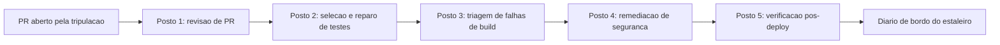
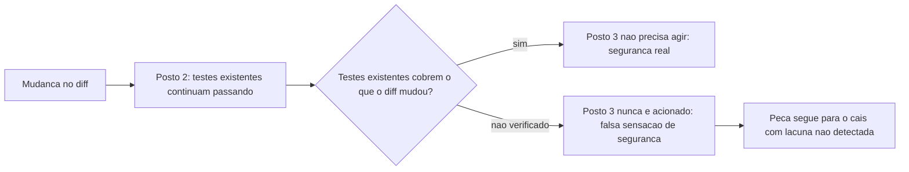
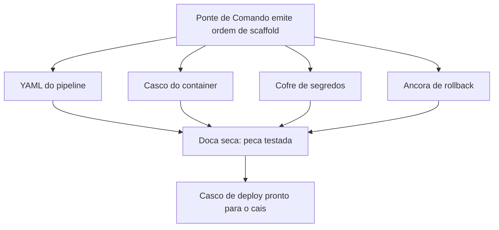
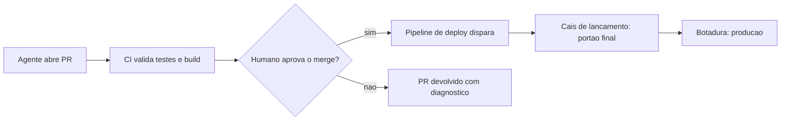
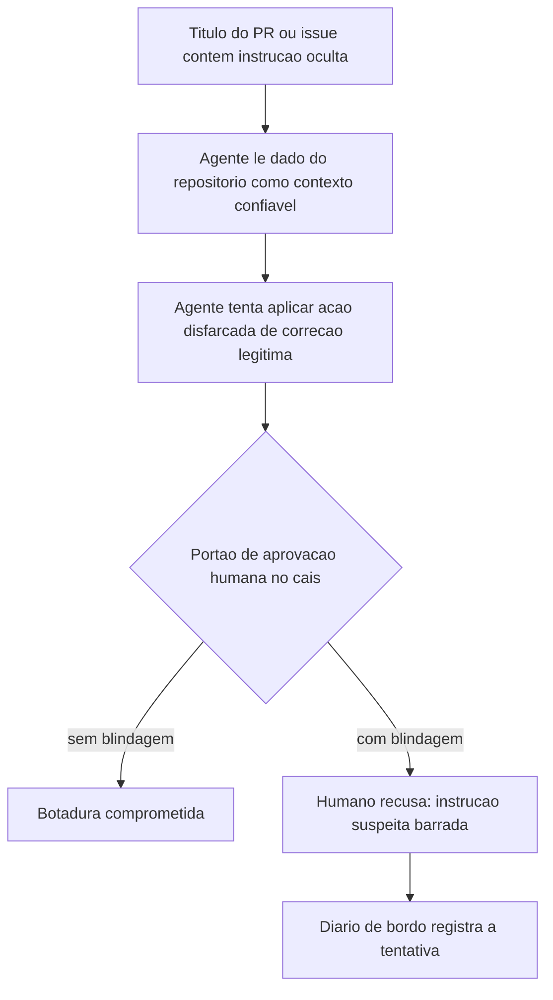

# Do Zero ao Deploy: Integrando Agentes no CI/CD com Portão de Aprovação Humana

Você desceu ao porão do estaleiro e aprendeu a disciplina de combustível: grep antes de busca semântica, compaction de contexto e comunicação telegráfica para operar uma tripulação inteira sem afundar em custo e latência. Essa disciplina não foi um assunto isolado sobre economia — foi o combustível que permite rodar agentes em cada pull request, em cada build, em cada verificação pós-deploy, sem que o orçamento de tokens da sua esteira exploda antes mesmo de o código chegar à água.

Este é o capítulo final, e ele fecha o arco que abriu na doca seca. Da quilha assentada ao casco erguido, da ponte de comando à sala de máquinas, sua embarcação agêntica está pronta para deixar o estaleiro. Falta apenas a etapa mais delicada de toda a jornada — a botadura, o momento em que o que você construiu toca a água da produção. Este capítulo projeta o pipeline completo de CI/CD conduzido por agentes, do scaffold ao deploy, e resolve a pergunta que resume tudo o que veio antes: quem, exatamente, autoriza a botadura?

## Cinco postos, cinco problemas distintos

A literatura técnica mais recente mapeia cinco pontos de integração de agentes de IA em pipelines de CI/CD, e cada um resolve um problema distinto do ciclo de entrega: revisão de pull request, seleção e reparo de testes, triagem de falhas de build, remediação de segurança e verificação pós-deploy. Não é um único agente genérico "que cuida do CI/CD" — é uma sequência de postos especializados, cada um com escopo e critério de aceite próprios, que juntos substituem o que antes era trabalho manual disperso entre times diferentes.

Times técnicos que já rodam essa esteira em produção descrevem um padrão recorrente: o agente de revisão comenta inline no diff e responde perguntas sobre impacto a jusante, o agente de testes prioriza o que o diff realmente afeta antes de rodar a suíte inteira, e o agente de build produz diagnóstico estruturado assim que uma etapa falha, em vez de apenas repetir a tentativa. Essa especialização por posto reflete uma migração de mercado mais ampla, já descrita como a passagem definitiva de assistentes pontuais de código para agentes orquestrados de SDLC completo.

Vale um contraponto que a euforia em torno de "cinco postos automatizados" costuma esconder: especializar cada posto reduz o escopo de raciocínio que cada agente precisa cobrir, mas também multiplica o número de pontos de falha coordenados que a esteira inteira precisa monitorar. Cinco agentes bem calibrados individualmente ainda podem produzir um resultado ruim coletivamente se o posto de testes aprovar rápido demais o que o posto de build deveria ter rejeitado, ou se o posto de segurança rodar em paralelo com o de build em vez de depois dele. A especialização por posto não é grátis; ela troca o risco de um agente genérico sobrecarregado pelo risco, mais sutil, de lacunas na transição entre postos que ninguém desenhou para cobrir.

## A doca onde o casco de deploy é soldado

Na fase de scaffolding — a construção material do casco de deploy — agentes geram os quatro artefatos que sustentam qualquer entrega moderna: o arquivo YAML do pipeline, a definição de containers, a configuração de gerenciamento de segredos e os gatilhos de rollback automático. O scaffold gerado precisa ser tão auditável quanto o código de aplicação que ele empacota, porque um pipeline mal desenhado é, na prática, uma nova superfície de ataque.

Essa exigência tem um custo real que equipes sob pressão de prazo tendem a subestimar: revisar um YAML de pipeline linha a linha, com a mesma atenção que se dedica a um pull request de lógica de negócio, consome tempo humano que a promessa de "scaffold automático" prometia eliminar. A resposta correta não é dispensar a revisão — é reconhecer que o scaffold gerado por agente desloca o esforço humano, não o elimina: menos tempo escrevendo YAML repetitivo, mais tempo revisando o que foi gerado antes de ele ganhar permissão de tocar produção.

## Onde a esteira deixa de ser conveniência e vira risco gerido

O terceiro ponto é onde a esteira deixa de ser conveniência e passa a ser risco gerido com rigor. Práticas de segurança recomendadas para agentes em CI/CD incluem credenciais de curta duração e privilégio mínimo, limite de gasto de tokens por execução, testes em sandbox isolado e limiares de confiança antes de qualquer ação consequente. Riscos documentados incluem alucinação de correções — o agente propõe um patch sintaticamente plausível que não resolve a causa raiz —, repetição de ações e comportamento não-determinístico entre execuções idênticas.

Um trabalho de pesquisa recente, conhecido como "GitInject", formaliza o risco mais contraintuitivo de todos: ataques reais de injeção de prompt embutidos em títulos de pull request, descrições de issue e comentários de código, que sequestram o raciocínio do agente já dentro do próprio pipeline de build, sem que nenhuma "conversa suspeita" tenha ocorrido. A OWASP documenta o mesmo padrão estrutural em servidores MCP — dado de origem tratado como confiável vira vetor de ataque —, e guias de segurança da Microsoft descrevem esse mesmo vetor de injeção indireta especificamente para integrações MCP.

Pesquisadores independentes já demonstraram publicamente esse vetor em ferramentas conectadas via protocolo aberto, mostrando que a descrição de uma tool ou o corpo de um PR podem instruir um agente a agir sem que o usuário perceba qualquer desvio na conversa. Onde o efeito real acontece é o que define o que precisa ser validado, nunca o quanto o modelo "parece" confiável.

Essa graduação de risco importa porque nem toda mudança carrega o mesmo peso: um ajuste de texto em um arquivo de documentação não exige o mesmo escrutínio que uma alteração em política de rotação de segredos, e tratar as duas com o mesmo nível de aprovação humana tem um custo real — ou a esteira fica lenta demais para mudanças triviais, ou a equipe humana, sobrecarregada de aprovações de baixo risco, começa a aprovar por hábito em vez de examinar de fato, o que devolve na prática o mesmo risco que o portão deveria eliminar. A graduação correta calibra o rigor da checagem pelo que a mudança realmente toca — segredos, infraestrutura crítica, dados de produção —, não pela confiança abstrata que se deposita no agente que a propôs.

Por isso a literatura converge, sem exceção, para um único desenho de controle: o agente abre o PR, o CI valida testes e build, um humano aprova o merge, e só então o pipeline de deploy dispara automaticamente — o agente nunca faz deploy direto em produção sem revisão humana.

## Os cinco postos de guarda do cais

Imagine o cais de lançamento do seu estaleiro dividido em cinco postos de guarda, dispostos em sequência entre a doca e a água. No primeiro posto, um agente-vigia lê cada peça de casco recém-soldada — o pull request — e deixa suas observações registradas antes de liberar passagem. No segundo, outro vigia confere se os testes de integridade da junta ainda se sustentam ou precisam de reparo. No terceiro, um vigia examina qualquer falha na linha de montagem e escreve um diagnóstico, não apenas um alarme. No quarto, um vigia de segurança rascunha o reparo de qualquer trinca encontrada. No quinto e último posto, já com a peça na água, um vigia final confere se ela realmente flutua como projetado.



## A lacuna entre os postos de guarda

Um posto de guarda bem treinado, sozinho, não garante que a peça de casco chegue inteira à água. Imagine que o segundo posto — o que confere se os testes de integridade da junta ainda se sustentam — aprova a peça porque, isoladamente, todos os testes que ele conhece continuam passando; o terceiro posto nunca chega a ser acionado, porque, do ponto de vista dele, não houve nenhuma falha de build para triar.

Nenhum dos dois postos errou a própria tarefa. O problema mora no intervalo entre eles: nenhum dos dois foi desenhado para perguntar "os testes que continuam passando cobrem de fato o que esta mudança alterou, ou só cobrem o que já cobriam antes dela?" Esse tipo de lacuna só aparece quando alguém audita explicitamente a costura entre dois postos consecutivos.



## A doca onde o casco de deploy é soldado, em imagem

Imagine a doca onde a tripulação de agentes solda as quatro peças do casco de deploy antes de qualquer coisa se mover em direção ao cais. Uma peça é o YAML do pipeline — o roteiro que a esteira inteira vai seguir. Outra é o próprio casco do container, empacotando a aplicação de forma reproduzível. A terceira é o cofre de segredos, que nunca fica exposto na superfície do casco. A quarta é a âncora de rollback, presa ao casco antes mesmo da botadura, pronta para puxar a embarcação de volta se algo falhar na água.

Nenhuma dessas quatro peças segue para o cais sem antes ser testada na doca seca. E as quatro peças não são independentes entre si: o cofre de segredos precisa ser referenciado corretamente pelo YAML do pipeline, a âncora de rollback precisa saber exatamente qual health-check do casco do container consultar, e um erro de acoplamento entre duas dessas peças é o tipo de falha que só aparece quando a doca seca testa o conjunto soldado, nunca quando testa cada peça isolada.



## O portão do cais: fluxo saudável e fluxo sabotado

O fluxo saudável: o agente abre o PR, o CI confere testes e build, um humano no cais examina o que está prestes a tocar a água e só então autoriza — a botadura acontece depois, nunca antes, do sinal humano.



O ponto realmente contraintuitivo: o mesmo fluxo pode ser sabotado sem que nenhum alarme convencional dispare. Imagine que uma instrução maliciosa não chega pela ponte de comando nem por nenhuma conversa da tripulação — ela chega embutida na própria etiqueta de carga afixada na peça de casco, escrita por quem submeteu o pull request. O agente lê essa etiqueta como faria com qualquer especificação legítima de carga, porque, do ponto de vista do seu raciocínio, ler dados do próprio repositório é um passo esperado do fluxo. Sem um portão determinístico no cais, a peça sabotada segue direto para a água. Com o portão, o humano que inspeciona a carga antes da botadura é a última barreira capaz de reconhecer que aquela etiqueta nunca fez parte da ordem de serviço original.



## Os cinco postos de guarda em YAML

Esta seção fabrica, em código, as três peças descritas acima: o YAML dos cinco postos de guarda, o script de scaffold que solda as quatro peças do casco de deploy, e o portão de aprovação humana como função de política executável.

```yaml
name: Esteira do Estaleiro - CI/CD com Agentes

on:
  pull_request:
    branches: [main]

jobs:
  revisao_pr:
    runs-on: ubuntu-latest
    steps:
      - uses: actions/checkout@v4
      - name: Agente revisa o diff
        run: |
          echo "Agente inspeciona o PR, deixa comentarios inline e sinaliza risco de regressao a jusante"
          python scripts/agente_revisor.py --pr "${{ github.event.pull_request.number }}"

  testes:
    needs: revisao_pr
    runs-on: ubuntu-latest
    steps:
      - uses: actions/checkout@v4
      - name: Agente seleciona e repara testes
        run: |
          echo "Agente prioriza testes afetados pelo diff; nunca apaga teste que falha para o build ficar verde"
          pytest --maxfail=1 --disable-warnings

  build:
    needs: testes
    runs-on: ubuntu-latest
    steps:
      - uses: actions/checkout@v4
      - name: Triagem de falha de build pelo agente
        run: |
          echo "Se o build falhar, o agente redige diagnostico estruturado antes de qualquer nova tentativa"
          docker build -t estaleiro-app:${{ github.sha }} .

  remediacao_seguranca:
    needs: build
    runs-on: ubuntu-latest
    steps:
      - uses: actions/checkout@v4
      - name: Scanner de seguranca e patch do agente
        run: |
          echo "Agente rascunha patch; scanner reexecuta no branch do patch para confirmar a correcao"
          trivy image estaleiro-app:${{ github.sha }}

  verificacao_pos_deploy:
    needs: remediacao_seguranca
    runs-on: ubuntu-latest
    environment:
      name: producao
    steps:
      - uses: actions/checkout@v4
      - name: Portao de aprovacao humana antes da botadura
        run: echo "Aguardando aprovacao humana registrada no ambiente 'producao' do GitHub Actions"
      - name: Verificacao pos-deploy
        run: |
          echo "Agente confere health-check, taxa de erro e latencia apos a botadura"
          curl -f https://app.estaleiro.exemplo/health
```

Repare que `verificacao_pos_deploy` está condicionado ao ambiente `producao` do GitHub Actions, o mecanismo nativo de "environment protection rule" que já impõe um humano registrado antes de qualquer job avançar. Cada posto deve poder ser auditado isoladamente, sem depender do posto anterior ter "confiado" corretamente. Note também que a cadeia de `needs` entre os cinco jobs é o que torna a lacuna descrita acima visível em vez de invisível: se um posto precisasse produzir apenas um sinal binário de "passou/falhou" sem que o próximo posto pudesse inspecionar o que exatamente foi verificado, a costura entre `testes` e `build` seria opaca por construção.

## Soldando o casco de deploy na doca

O segundo artefato gera, programaticamente, as quatro peças descritas acima: Dockerfile, workflow de CI com segredos geridos pelo provedor (nunca em texto plano) e o gatilho de rollback condicionado a falha de health-check.

```python
import os
import textwrap


def gerar_dockerfile(caminho: str = "Dockerfile") -> None:
    """Gera o casco do container: imagem minima e reproduzivel."""
    conteudo = textwrap.dedent("""\
        FROM python:3.12-slim
        WORKDIR /app
        COPY requirements.txt .
        RUN pip install --no-cache-dir -r requirements.txt
        COPY . .
        HEALTHCHECK CMD curl -f http://localhost:8000/health || exit 1
        CMD ["python", "app.py"]
    """)
    with open(caminho, "w", encoding="utf-8") as arquivo:
        arquivo.write(conteudo)


def gerar_workflow_ci(caminho: str = ".github/workflows/estaleiro.yml") -> None:
    """Gera o YAML do pipeline com segredos via cofre do provedor de CI."""
    os.makedirs(os.path.dirname(caminho), exist_ok=True)
    conteudo = textwrap.dedent("""\
        name: Esteira do Estaleiro
        on:
          push:
            branches: [main]
        jobs:
          deploy:
            runs-on: ubuntu-latest
            steps:
              - uses: actions/checkout@v4
              - name: Login no registro de containers
                env:
                  REGISTRY_TOKEN: ${{ secrets.REGISTRY_TOKEN }}
                run: echo "Autenticando com token injetado pelo cofre de segredos, nunca em texto plano"
              - name: Build e push da imagem
                run: docker build -t estaleiro-app . && docker push estaleiro-app
              - name: Rollback condicionado a falha de health-check
                run: bash scripts/rollback_se_falha.sh
    """)
    with open(caminho, "w", encoding="utf-8") as arquivo:
        arquivo.write(conteudo)


def gerar_gatilho_rollback(caminho: str = "scripts/rollback_se_falha.sh") -> None:
    """Gera a ancora de rollback: reverte a botadura se o health-check falhar."""
    os.makedirs(os.path.dirname(caminho), exist_ok=True)
    conteudo = textwrap.dedent("""\
        #!/usr/bin/env bash
        set -euo pipefail
        if ! curl -sf https://app.estaleiro.exemplo/health; then
          echo "Health-check pos-deploy falhou: revertendo para a ultima versao estavel"
          kubectl rollout undo deployment/estaleiro-app
          exit 1
        fi
        echo "Health-check aprovado: botadura mantida"
    """)
    with open(caminho, "w", encoding="utf-8") as arquivo:
        arquivo.write(conteudo)


if __name__ == "__main__":
    gerar_dockerfile()
    gerar_workflow_ci()
    gerar_gatilho_rollback()
```

Cada função tem uma única responsabilidade e escreve um único artefato — o mesmo princípio de simplicidade deliberada já defendido para orquestração de agentes se aplica, ponto a ponto, à geração de scaffold: cobrir a tarefa real sem multiplicar peças que ninguém vai auditar de fato.

## O portão de lançamento como função de política

O terceiro artefato é o mais crítico do capítulo: a função que decide, de forma determinística, se uma solicitação de deploy pode avançar até a botadura — independentemente de quão convincente tenha sido o raciocínio do agente que a originou.

```python
from dataclasses import dataclass
from datetime import datetime
from typing import Optional


@dataclass
class SolicitacaoDeploy:
    autor: str
    toca_infraestrutura_critica: bool
    toca_segredos: bool
    testes_passaram: bool
    aprovacao_humana_token: Optional[str] = None


class PortaoBarradoError(Exception):
    """Levantada quando a botadura e recusada pelo portao de aprovacao humana."""


def portao_de_lancamento(solicitacao: SolicitacaoDeploy, diario_de_bordo: list) -> dict:
    """Unico ponto de decisao entre o pipeline de CI e a botadura em producao.

    Nenhuma mudanca que toque infraestrutura critica ou segredos avanca sem um
    token de aprovacao humana explicito, mesmo que todos os testes tenham
    passado: alucinacao de correcao e comportamento nao-deterministico do
    agente nao sao filtrados por nenhum teste automatizado.
    """
    exige_aprovacao = solicitacao.toca_infraestrutura_critica or solicitacao.toca_segredos

    if exige_aprovacao and not solicitacao.aprovacao_humana_token:
        registro = {
            "autor": solicitacao.autor,
            "decisao": "bloqueado",
            "motivo": "mudanca sensivel sem token de aprovacao humana",
            "timestamp": datetime.utcnow().isoformat(),
        }
        diario_de_bordo.append(registro)
        raise PortaoBarradoError("Botadura recusada: aprovacao humana obrigatoria e ausente")

    if not solicitacao.testes_passaram:
        registro = {
            "autor": solicitacao.autor,
            "decisao": "bloqueado",
            "motivo": "testes nao passaram",
            "timestamp": datetime.utcnow().isoformat(),
        }
        diario_de_bordo.append(registro)
        raise PortaoBarradoError("Botadura recusada: testes falharam")

    registro = {
        "autor": solicitacao.autor,
        "decisao": "liberado",
        "aprovador": solicitacao.aprovacao_humana_token or "automatico_baixo_risco",
        "timestamp": datetime.utcnow().isoformat(),
    }
    diario_de_bordo.append(registro)
    return registro


if __name__ == "__main__":
    diario = []
    tentativa = SolicitacaoDeploy(
        autor="agente-scaffold-01",
        toca_infraestrutura_critica=True,
        toca_segredos=False,
        testes_passaram=True,
        aprovacao_humana_token=None,
    )
    try:
        portao_de_lancamento(tentativa, diario)
    except PortaoBarradoError as erro:
        print(f"Bloqueado como esperado: {erro}")
    print(diario)
```

Nenhuma linha desta função consulta o raciocínio do agente para decidir se confia nele — a decisão depende apenas de três fatos verificáveis: o que a mudança toca, se os testes passaram e se existe um token de aprovação humana registrado. É exatamente essa independência do raciocínio do modelo que a literatura de segurança de agentes recomenda como controle real contra alucinação e comportamento não-determinístico, e é o mesmo padrão arquitetural já defendido para servidores MCP: controles eficazes vivem fora do contexto do modelo, nunca dentro dele.

## Fechando a lacuna entre postos: verificação de cobertura real do diff

O quarto artefato materializa o sexto papel, implícito na Ilustra: uma checagem explícita de que os arquivos alterados pelo diff estão de fato cobertos pelos testes que "continuaram passando" — em vez de assumir que teste verde equivale a mudança verificada.

```python
from dataclasses import dataclass, field


@dataclass
class VerificacaoCoberturaDiff:
    arquivos_alterados: list = field(default_factory=list)
    arquivos_cobertos_por_teste: list = field(default_factory=list)

    def lacunas(self) -> list:
        """Retorna arquivos alterados sem nenhum teste que os exercite."""
        return [
            arquivo for arquivo in self.arquivos_alterados
            if arquivo not in self.arquivos_cobertos_por_teste
        ]

    def cobertura_suficiente(self) -> bool:
        """Barra a transicao 'testes passaram' -> 'seguro para build' quando
        existe arquivo alterado que nenhum teste conhecido exercita."""
        return len(self.lacunas()) == 0


def gate_pos_testes(verificacao: VerificacaoCoberturaDiff) -> dict:
    if not verificacao.cobertura_suficiente():
        return {
            "decisao": "bloqueado",
            "motivo": "arquivos alterados sem cobertura de teste",
            "arquivos_sem_cobertura": verificacao.lacunas(),
        }
    return {"decisao": "liberado_para_build"}


if __name__ == "__main__":
    verificacao = VerificacaoCoberturaDiff(
        arquivos_alterados=["politica_rotacao_segredos.py", "health_check.py"],
        arquivos_cobertos_por_teste=["health_check.py"],
    )
    print(gate_pos_testes(verificacao))
```

O exemplo acima bloqueia deliberadamente: `politica_rotacao_segredos.py` foi alterado, mas nenhum teste conhecido o exercita, então o gate recusa a transição automática para o próximo posto mesmo que a suíte existente esteja inteiramente verde. Essa checagem não substitui os cinco postos — ela audita a costura entre dois deles.

## Quando a classificação de risco vem do próprio suspeito

Você lidera a squad de plataforma do estaleiro digital e configurou, semanas atrás, uma regra de conveniência: pull requests marcados pelo próprio agente de revisão como `risco: baixo` pulam a fila de aprovação humana e disparam deploy automático assim que o CI fica verde. Um pull request chega com o título "fix: corrige timeout intermitente no health-check (baixo risco, apenas config)". O agente de revisão lê o título, concorda com a classificação, aplica a label `risco: baixo`, o CI passa, e o deploy dispara sozinho — exatamente como você configurou.

O erro só aparece no diário de bordo horas depois: a mudança "de baixo risco" alterava também a política de rotação de segredos do serviço, e o título do PR foi escrito deliberadamente para convencer o próprio agente classificador de que aquilo era uma configuração trivial. Nada na conversa com o usuário foi suspeito — a instrução veio embutida no dado de repositório que o agente trata como contexto legítimo desde o momento em que o PR foi aberto, o mesmo vetor documentado em pipelines reais de CI/CD.

O diagnóstico correto não é "o agente raciocinou mal" — é que você deixou o mesmo agente que lê dados não confiáveis do repositório decidir, sozinho, se uma mudança sensível merecia ou não passar pelo portão humano. Confiança circular: quem classifica o risco não pode ser quem dispensa a checagem daquele risco.

A correção é estrutural, não um ajuste de prompt: a label de risco gerada pelo agente vira apenas um sinal informativo no diário de bordo, nunca um insumo da decisão de aprovação. O `portao_de_lancamento` visto acima passa a decidir com base em fatos verificáveis sobre o que o diff realmente toca — segredos, infraestrutura crítica — e não com base na etiqueta que o próprio agente afixou na carga. A verificação de cobertura de diff fecha o segundo ângulo do mesmo incidente: mesmo que a política de rotação de segredos tivesse sido classificada corretamente como sensível, nada garantiria que os testes existentes de fato exercitassem aquele arquivo.

O erro de configuração original — pular a fila de aprovação humana para PRs marcados como `risco: baixo` — nasceu de uma intenção legítima: reduzir atrito para mudanças genuinamente triviais. O problema nunca foi essa intenção, foi delegar a própria classificação de risco ao mesmo agente cuja leitura de dados de repositório não confiáveis é, estruturalmente, um vetor de ataque documentado. Qualquer atalho de conveniência que reduza fricção de aprovação precisa nascer amarrado a uma fonte de decisão que o próprio dado manipulável não consegue influenciar.

Armadilhas recorrentes na integração de agentes em CI/CD, na prática de mercado:

- Deixar o mesmo agente que lê título, issue e comentários do PR também decidir, sem checagem externa, se aquela mudança é sensível o suficiente para exigir aprovação humana.
- Tratar "os testes passaram" como sinônimo de "seguro para produção" — testes automatizados não capturam alucinação de correção nem comportamento não-determinístico entre execuções.
- Gerar YAML de pipeline e Dockerfile via agente sem revisão, assumindo que scaffold é território de baixo risco por não ser "lógica de negócio".
- Medir sucesso da esteira agêntica apenas por velocidade de merge, ignorando que a esmagadora maioria das organizações já usa IA ativamente em desenvolvimento — e a maioria delas ainda está calibrando exatamente esse equilíbrio entre velocidade e portão de aprovação.
- Assumir que "os cinco postos estão todos configurados" equivale a "a esteira está segura", sem auditar a costura entre postos consecutivos.

## O fecho da jornada

Três pontos fecham este capítulo. Primeiro: CI/CD agêntico não é um agente genérico solto na esteira — são cinco postos de guarda especializados, cada um com escopo e critério de aceite próprios, do PR à verificação pós-deploy.

Segundo: o scaffold que sustenta o deploy — pipeline, container, segredos, rollback — precisa da mesma auditabilidade que você já exige do código de aplicação, porque um scaffold mal desenhado é, ele mesmo, superfície de ataque.

Terceiro, e mais urgente: nenhum deploy é 100% autônomo, porque os riscos documentados — injeção via dado de repositório, alucinação de correção, comportamento não-determinístico — não são filtrados por teste automatizado nenhum. O portão de aprovação humana no cais de lançamento não é resquício de um mundo pré-IA; é a peça de engenharia que torna a autonomia do resto da esteira segura o suficiente para existir.

E este ponto fecha também a jornada inteira que este ebook percorreu. Você entendeu a diferença entre um agente que só lê configuração e um que de fato a impõe. Equipou a ponte de comando com um diário de bordo que não compete com o harness. Blindou a sala de máquinas com permissões, hooks e anteparas em camadas. Fabricou ferramentas resistentes a manual adulterado. Aprendeu a operar tudo isso sem afundar em custo de contexto. E agora entende por que autonomia agêntica madura não é ausência de humano — é autonomia supervisionada, com guardrails em cada camada e um humano no portão final entre o que o agente construiu e a água.

## Checklist rápido antes da botadura

Antes de considerar sua esteira de CI/CD pronta para operar com agentes de ponta a ponta, vale confirmar cinco pontos, na ordem em que o pull request percorre o cais:

- Cada um dos cinco postos — revisão de PR, testes, build, remediação de segurança, verificação pós-deploy — tem escopo e critério de aceite próprios, ou existe um único agente genérico tentando cobrir tudo de uma vez?
- A costura entre dois postos consecutivos foi auditada explicitamente — por exemplo, os testes que "continuam passando" de fato exercitam os arquivos que o diff alterou, ou isso nunca foi verificado?
- O scaffold gerado por agente (YAML de pipeline, Dockerfile, configuração de segredos, gatilho de rollback) passa pela mesma revisão humana que você dedicaria a um pull request de lógica de negócio?
- A classificação de risco de uma mudança vem de uma fonte independente do agente que lê os dados manipuláveis do próprio pull request, ou o mesmo agente que pode ser enganado por um título também decide se merece checagem humana?
- Nenhum deploy em produção acontece sem um token de aprovação humana explícito para mudanças que tocam segredos ou infraestrutura crítica, mesmo quando todos os testes automatizados passaram?

Se alguma resposta for "não", essa é exatamente a lacuna que um ataque como o descrito neste capítulo — ou simplesmente um erro humano de configuração — vai explorar mais cedo ou mais tarde. O portão de aprovação humana não é o último recurso da sua esteira; é a peça que torna segura toda a autonomia que veio antes dele.

Vale reforçar um último ponto antes de fechar de vez este ebook: nenhuma das cinco perguntas acima exige desconfiar do agente em abstrato, ou reduzir a autonomia que ele já demonstrou merecer em produção. Exige apenas posicionar o ponto de verificação fora do raciocínio que você está tentando verificar — a mesma lição que atravessou cada capítulo deste material, do diário de bordo à sala de máquinas, das ferramentas blindadas ao próprio portão de lançamento. Um agente que decide bem continua precisando de uma antepara que não dependa de ele ter decidido bem daquela vez específica.
