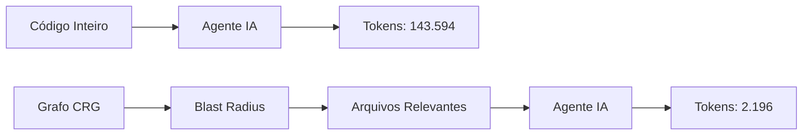

# Capítulo 1: O Problema dos Tokens

## 1. Introdução

Quando você pede a um assistente de IA para revisar seu código, ele precisa ler os arquivos relevantes. Mas como saber quais são relevantes? A maioria dos agentes simplesmente lê **tudo** — e isso gasta tokens caros sem necessidade.

Neste capítulo, você vai entender por que isso acontece e como o Code Review Graph resolve o problema de forma elegante.

## 2. Explica

### O Custo de Ler Código Inteiro

Considere um repositório como o Flask (143.594 tokens de código-fonte). Quando você pede "revisar autenticação", o agente precisa:

1. Descobrir quais arquivos tratam de autenticação
2. Ler esses arquivos
3. Entender as dependências entre eles

Sem um grafo, o agente lê **todos** os 143.594 tokens. Com o Code Review Graph, ele lê apenas **2.196 tokens** — uma redução de **71x**.

### Como o Grafo Resolve Isso

O CRG constrói um mapa estrutural do seu código usando Tree-sitter:

- **Nós**: funções, classes, imports
- **Arestas**: chamadas, herança, dependências de teste

Quando um arquivo muda, o grafo rastreia todos os chamadores, dependentes e testes que podem ser afetados. Isso é o **blast radius** (raio de explosão).

### Números Reais

| Repositório | Tokens (corpus) | Tokens (grafo) | Redução |
|-------------|-----------------|----------------|---------|
| fastapi | 948.793 | 2.653 | **376x** |
| flask | 143.594 | 2.196 | **71x** |
| code-review-graph | 208.821 | 3.190 | **68x** |
| gin | 166.868 | 2.766 | **62x** |
| httpx | 142.356 | 2.661 | **61x** |
| express | 136.052 | 3.936 | **36x** |

**Redução mediana: ~65x**

## 3. Ilustra

Imagine que você tem uma biblioteca com 1.000 livros. Sem catálogo, para encontrar um capítulo sobre "autenticação", você precisaria abrir todos os 1.000 livros. Com um catálogo inteligente que diz "autenticação está nos livros 23, 45 e 67, capítulos 3, 1 e 5", você abre apenas 3 livros.

O Code Review Graph é esse catálogo para seu código.




## 4. Técnica

### Instalação Básica

```bash
pip install code-review-graph
# ou: pipx install code-review-graph
```

### Construção do Grafo

```bash
code-review-graph build
```

Isso parseia todo o repositório e cria um banco SQLite em `.code-review-graph/`.

### Verificação

```bash
code-review-graph status
```

Saída esperada:

```
Graph: 1.446 nodes, 7.974 edges
Languages: Python (100%)
Last build: 2026-08-04 12:00:00
```

## 5. Aplica

### Cenário: Code Review Manual

**Antes do CRG:**
- Você pede ao agente: "Revise a mudança no módulo de auth"
- O agente lê 50 arquivos (143.594 tokens)
- Custo: ~$0.43 por review (preço GPT-4)
- Tempo: 45 segundos

**Com o CRG:**
- Você pede a mesma coisa
- O agente lê 8 arquivos relevantes (2.196 tokens)
- Custo: ~$0.007 por review
- Tempo: 3 segundos

**Economia anual (10 reviews/dia):** ~$1.500

### Armadilha Comum

Não confunda "redução de tokens" com "perda de contexto". O grafo retorna **exatamente** o contexto necessário — não mais, não menos. Se o agente precisa de mais informação, ele pode usar `traverse_graph` para expandir.

## 6. Conclusão

O Code Review Graph resolve um problema real: o desperdício de tokens em code reviews. Com redução mediana de 65x, ele torna revisões de IA economically viáveis para qualquer equipe.

No próximo capítulo, vamos instalar e configurar o CRG em um projeto real.

## 7. Referências

[1] TIRTH8205. Code Review Graph. Disponível em: https://github.com/tirth8205/code-review-graph. Acesso em: 4 ago. 2026.

[2] TREE-SITTER. Tree-sitter: an incremental parsing system. Disponível em: https://tree-sitter.github.io/tree-sitter/. Acesso em: 4 ago. 2026.

[3] MODEL CONTEXT PROTOCOL. MCP Specification. Disponível em: https://modelcontextprotocol.io/. Acesso em: 4 ago. 2026.

[4] OPENAI. Pricing. Disponível em: https://openai.com/pricing. Acesso em: 4 ago. 2026.
