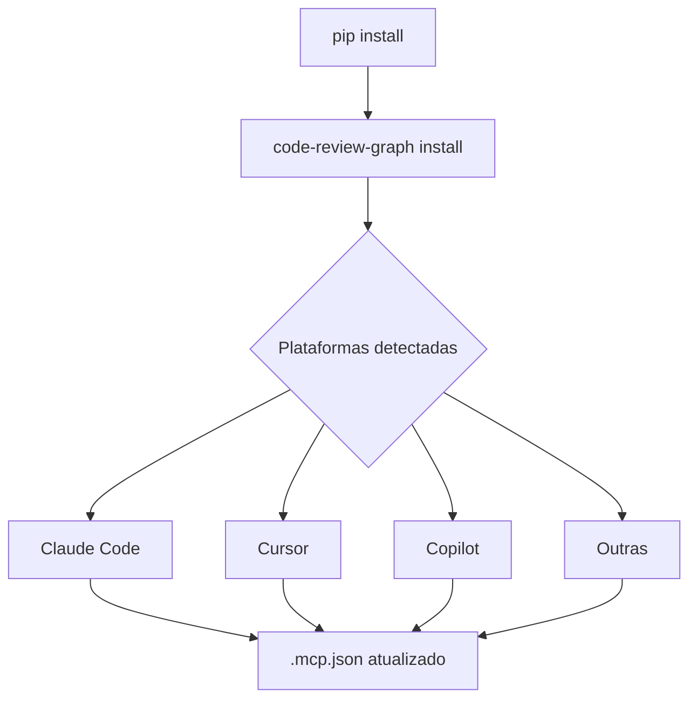

# Capítulo 2: Instalação e Configuração

## 1. Introdução

Neste capítulo, você vai instalar o Code Review Graph e configurá-lo para seu projeto. O processo é simples: um comando instala, outro constrói o grafo.

## 2. Explica

### Pré-requisitos

- Python 3.10 ou superior
- pip ou pipx instalado
- Git (para repositórios versionados)

### Métodos de Instalação

**Via pip (recomendado para desenvolvimento):**

```bash
pip install code-review-graph
```

**Via pipx (recomendado para uso global):**

```bash
pipx install code-review-graph
```

**Via uv (mais rápido):**

```bash
uv tool install code-review-graph
```

### Auto-detecção de Plataformas

O comando `install` detecta automaticamente quais ferramentas de IA você usa e configura cada uma:

```bash
code-review-graph install
```

Plataformas suportadas: Claude Code, Cursor, Windsurf, Copilot, Gemini CLI, Zed, Continue, OpenCode, Antigravity, Qwen, Qoder, Kiro, CodeBuddy.

## 3. Ilustra

O processo de instalação é como montar um quebra-cabeça: você fornece as peças (código), o CRG monta o mapa (grafo), e a ferramenta de IA usa o mapa para navegar.




## 4. Técnica

### Passo 1: Instalar

```bash
pip install code-review-graph
```

### Passo 2: Configurar

```bash
cd meu-projeto
code-review-graph install
```

Saída esperada:

```
Detectando plataformas...
✓ Claude Code detectado
✓ Cursor detectado

Configurando MCP servers...
✓ Claude Code: ~/.claude/mcp.json atualizado
✓ Cursor: .cursor/mcp.json atualizado

Instalando hooks...
✓ pre-commit hook instalado

Concluído! Reinicie seu editor.
```

### Passo 3: Construir o Grafo

```bash
code-review-graph build
```

### Passo 4: Verificar

```bash
code-review-graph status
```

### Configuração Manual (se necessário)

Se a auto-detecção falhar, configure manualmente editando `.mcp.json`:

```json
{
  "mcpServers": {
    "code-review-graph": {
      "command": "code-review-graph",
      "args": ["serve"]
    }
  }
}
```

### Exclusão Segura

Para remover o CRG de um projeto:

```bash
code-review-graph uninstall --dry-run  # prévia
code-review-graph uninstall            # confirma e aplica
```

## 5. Aplica

### Cenário: Time com Múltiplas Ferramentas

Um time usa Claude Code para programação e Cursor para navegação. O `install` configura ambos automaticamente:

```bash
code-review-graph install
# Detecta e configura Claude Code E Cursor
# Um único comando para todo o time
```

### Dica de Produção

Em ambientes CI/CD, use o GitHub Action para reviews automáticos:

```yaml
- uses: tirth8205/code-review-graph@v2.3.6
  with:
    github-token: ${{ secrets.GITHUB_TOKEN }}
```

## 6. Conclusão

Instalar o CRG leva menos de 1 minuto. O `install` auto-detecta e configura tudo. O `build` constrói o grafo em ~10 segundos para projetos com 500 arquivos.

No próximo capítulo, vamos explorar o blast radius e a análise de impacto.

## 7. Referências

[1] TIRTH8205. Code Review Graph - Usage. Disponível em: https://github.com/tirth8205/code-review-graph/blob/main/docs/USAGE.md. Acesso em: 4 ago. 2026.

[2] TIRTH8205. Code Review Graph - Commands. Disponível em: https://github.com/tirth8205/code-review-graph/blob/main/docs/COMMANDS.md. Acesso em: 4 ago. 2026.
