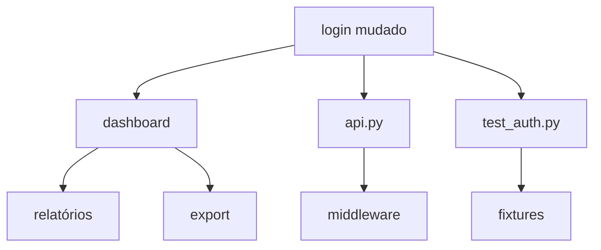

# Capítulo 3: Blast Radius e Impact Analysis

## 1. Introdução

Quando você muda uma função, quais outras partes do código são afetadas? Essa é a pergunta que o **blast radius** responde. Neste capítulo, você vai aprender a usar essa funcionalidade poderosa do CRG.

## 2. Explica

### O que é Blast Radius?

Blast radius (raio de explosão) é o conjunto de todos os arquivos, funções e testes que podem ser afetados por uma mudança. O CRG calcula isso usando o grafo de dependências.

### Como Funciona

1. Você muda `login()` no módulo `auth`
2. O grafo rastreia quem chama `login()` → `dashboard()`, `api.py`, `tests/test_auth.py`
3. O agente lê apenas esses arquivos
4. Review focado e eficiente

### Ferramentas MCP

| Ferramenta | Função |
|------------|--------|
| `get_impact_radius` | Raio de explosão de arquivos modificados |
| `detect_changes` | Análise de impacto com pontuação de risco |
| `get_review_context` | Contexto otimizado para tokens |

## 3. Ilustra

Imagine que você está reformulando a cozinha de uma casa. Sem o plano elétrico, você pode acidentalmente cortar um fio que alimenta toda a casa. Com o plano, você sabe exatamente quais cômodos são afetados.

O blast radius é esse plano elétrico para seu código.




## 4. Técnica

### Uso via CLI

```bash
# Análise de mudanças atuais
code-review-graph detect-changes --brief

# Atualizar grafo + análise
code-review-graph update --brief
```

### Uso via MCP

```python
# No seu agente de IA
context = mcp.get_review_context(
    changed_files=["auth/login.py", "auth/models.py"]
)
# Retorna: arquivos relevantes + resumo estrutural + pontuação de risco
```

### Exemplo de Saída

```
┌─────────────────────── Token Savings ────────────────────────┐
│ Full context would be:     12,921 tokens                     │
│ Graph context used:           762 tokens                     │
│ Saved:                     12,159 tokens (~94%)              │
│ Breakdown: Functions 244 · Tests 191 · Risk 244 · Other 83   │
└──────────────────────────────────────────────────────────────┘
```

### Verificação com tiktoken

```bash
code-review-graph detect-changes --brief --verify
```

Cruza os números com o tokenizer real do GPT-4 (precisa de `pip install tiktoken`).

## 5. Aplica

### Cenário: PR Grande

Você tem um PR com 15 arquivos modificados. Sem CRG, o agente lê todos. Com CRG:

```bash
code-review-graph detect-changes --brief
```

Saída:
- 15 arquivos → 8 realmente afetados
- Tokens: 45.000 → 3.200 (redução de 14x)
- Risco: 2 funções críticas identificadas

### Cenário: Code Review em CI

```yaml
# .github/workflows/review.yml
- name: Review PR
  uses: tirth8205/code-review-graph@v2.3.6
  with:
    fail-on-risk: high  # Falha se houver risco alto
```

## 6. Conclusão

Blast radius é a funcionalidade mais valiosa do CRG. Ele transforma reviews genéricos em reviews focados, economizando tokens e tempo.

No próximo capítulo, vamos ver como integrar o CRG com ferramentas de IA.

## 7. Referências

[1] TIRTH8205. Blast Radius Analysis. Disponível em: https://github.com/tirth8205/code-review-graph#blast-radius-analysis. Acesso em: 4 ago. 2026.

[2] TIRTH8205. GitHub Action. Disponível em: https://github.com/tirth8205/code-review-graph/blob/main/docs/GITHUB_ACTION.md. Acesso em: 4 ago. 2026.
