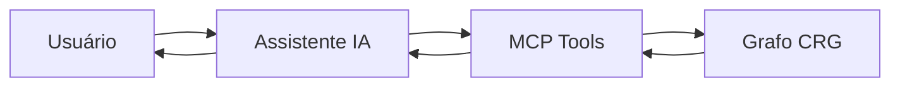

# Capítulo 4: MCP Tools e Integração com IA

## 1. Introdução

O Code Review Graph expõe 30 ferramentas MCP que seu assistente de IA usa automaticamente. Neste capítulo, você vai entender como essas ferramentas funcionam e como integrá-las ao seu fluxo de trabalho.

## 2. Explica

### O que é MCP?

MCP (Model Context Protocol) é um padrão que permite ferramentas externas se comunicarem com assistentes de IA. O CRG implementa MCP para fornecer contexto de código estruturado.

### As 30 Ferramentas Principais

| Categoria | Ferramentas |
|-----------|-------------|
| **Contexto** | `get_minimal_context`, `get_review_context`, `get_impact_radius` |
| **Busca** | `query_graph`, `semantic_search_nodes`, `traverse_graph` |
| **Análise** | `detect_changes`, `get_architecture_overview`, `find_large_functions` |
| **Comunidades** | `list_communities`, `get_community`, `get_hub_nodes` |
| **Refactoring** | `refactor_tool`, `apply_refactor` |

### Prompts de Workflow

O CRG inclui 5 prompts prontos:

1. **review_changes** — revisão de mudanças
2. **architecture_map** — mapa de arquitetura
3. **debug_issue** — depuração de bugs
4. **onboard_developer** — integração de novos devs
5. **pre_merge_check** — verificação pré-merge

## 3. Ilustra

O MCP é como um tradutor entre o código e o assistente de IA. O código fala "funções e dependências", o assistente fala "linguagem natural", e o MCP traduz.




## 4. Técnica

### Uso via Claude Code

```bash
# Instalar
code-review-graph install --platform claude-code

# Reiniciar Claude Code

# Usar
/code-review-graph:review-delta
```

### Uso via Cursor

```bash
# Instalar
code-review-graph install --platform cursor

# Reiniciar Cursor

# Usar no chat
"Revise as mudanças no módulo de auth"
```

### Uso via API Python

```python
from code_review_graph import CodeReviewGraph

graph = CodeReviewGraph()

# Busca semântica
results = graph.semantic_search("autenticação JWT")

# Blast radius
impact = graph.get_impact_radius(["auth/login.py"])

# Resumo de arquitetura
overview = graph.get_architecture_overview()
```

### Configuração de Embeddings

Para busca semântica vetorial:

```bash
# Local (gratuito)
pip install "code-review-graph[embeddings]"

# Google Gemini
export GOOGLE_API_KEY=sua-chave
pip install "code-review-graph[google-embeddings]"

# OpenAI
export OPENAI_API_KEY=sua-chave
```

## 5. Aplica

### Cenário: Onboarding de Novo Dev

Novo dev pergunta: "Como funciona o sistema de autenticação?"

Com CRG:
```bash
/code-review-graph:architecture_map
```

Saída: mapa visual + lista de arquivos + fluxo de execução.

### Cenário: Debug de Bug

Bug reportado: "Login falha em 5% dos casos"

Com CRG:
```bash
/code-review-graph:debug_issue
```

Saída: funções envolvidas, testes existentes, gaps de cobertura.

## 6. Conclusão

As ferramentas MCP do CRG transformam a forma como você interage com código. Em vez de adivinar onde está o problema, o grafo mostra o caminho.

No próximo capítulo, vamos explorar visualização e exportação.

## 7. Referências

[1] TIRTH8205. MCP Tools. Disponível em: https://github.com/tirth8205/code-review-graph#30-mcp-tools. Acesso em: 4 ago. 2026.

[2] MODEL CONTEXT PROTOCOL. Tools. Disponível em: https://modelcontextprotocol.io/docs/concepts/tools. Acesso em: 4 ago. 2026.
