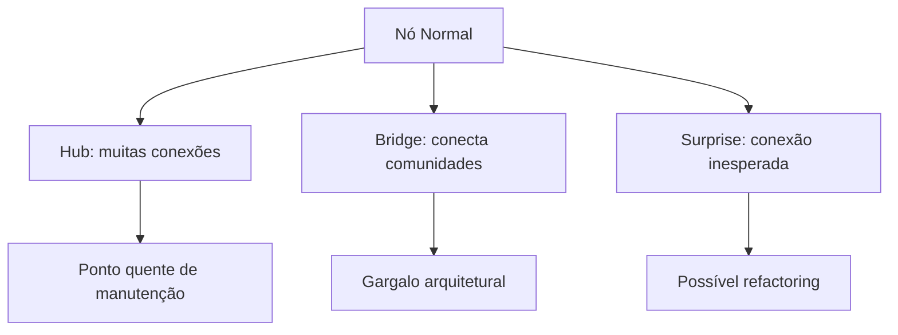

# Capítulo 5: Visualização e Exportação

## 1. Introdução

Ver o grafo é entender o código. Neste capítulo, você vai aprender a visualizar o grafo de múltiplas formas e exportá-lo para outras ferramentas.

## 2. Explica

### Tipos de Visualização

| Formato | Ferramenta | Uso |
|---------|-----------|-----|
| HTML interativo | D3.js | Exploração no navegador |
| GraphML | Gephi/yEd | Análise em ferramentas desktop |
| Neo4j Cypher | Neo4j | Consultas em banco de dados |
| Obsidian | Obsidian | Documentação com wikilinks |
| SVG | Qualquer | Imagens estáticas |

### Detecção de Padrões

O CRG identifica automaticamente:

- **Hubs**: nós mais conectados (pontos quentes)
- **Bridges**: gargalos arquiteturais (betweenness centrality)
- **Surprises**: acoplamentos inesperados entre comunidades

## 3. Ilustra

Visualizar o grafo é como ver uma cidade de cima: você vê os prédios altos (hubs), as pontes (bridges) e os bairros isolados (comunidades).




## 4. Técnica

### Visualização Interativa

```bash
code-review-graph visualize
```

Abre o navegador com grafo D3.js interativo.

### Exportação

```bash
# GraphML (para Gephi)
code-review-graph visualize --format graphml

# Neo4j
code-review-graph visualize --format cypher

# Obsidian
code-review-graph visualize --format obsidian

# SVG
code-review-graph visualize --format svg

# JSON
code-review-graph visualize --format json
```

### Wiki Automática

```bash
# Gerar wiki em Markdown
code-review-graph wiki

# Acessar página específica
code-review-graph wiki --page "auth-module"
```

### Análise de Comunidades

```bash
# Listar comunidades
code-review-graph status --communities

# Detalhar comunidade
code-review-graph visualize --community 3
```

### Detecção de Hubs e Bridges

```python
from code_review_graph import CodeReviewGraph

graph = CodeReviewGraph()

# Hubs (nós mais conectados)
hubs = graph.get_hub_nodes(limit=10)

# Bridges (gargalos)
bridges = graph.get_bridge_nodes(limit=10)

# Knowledge gaps
gaps = graph.get_knowledge_gaps()
```

## 5. Aplica

### Cenário: Refactoring

O CRG identifica que o módulo `auth` é um hub com 45 conexões. Isso sugere que está muito acoplado — considere dividir em sub-módulos.

### Cenário: Documentação

O time precisa de documentação da arquitetura. O CRG gera automaticamente:

```bash
code-review-graph wiki --output docs/architecture.md
```

### Cenário: Apresentação para Stakeholders

Exporte como SVG para incluir em apresentações:

```bash
code-review-graph visualize --format svg --output architecture.svg
```

## 6. Conclusão

Visualização e exportação tornam o grafo acessível para todo o time — de desenvolvedores a gestores. O CRG não apenas analisa código, comunica descobertas.

### Resumo do Ebook

1. **Tokens**: redução de 65x mediana
2. **Instalação**: um comando
3. **Blast Radius**: reviews focados
4. **MCP**: 30 ferramentas integradas
5. **Visualização**: múltiplos formatos

## 7. Referências

[1] TIRTH8205. Visualization. Disponível em: https://github.com/tirth8205/code-review-graph#interactive-visualisation. Acesso em: 4 ago. 2026.

[2] TIRTH8205. Export Formats. Disponível em: https://github.com/tirth8205/code-review-graph#export-formats. Acesso em: 4 ago. 2026.

[3] TIRTH8205. Wiki Generation. Disponível em: https://github.com/tirth8205/code-review-graph#wiki-generation. Acesso em: 4 ago. 2026.
