# Como Este Livro Foi Escrito: A Metodologia EITA

Todo capítulo deste livro segue a metodologia **EITA** — um framework pedagógico de 7 seções projetado para transformar o leitor de "não sei" para "consigo fazer" em cada tema abordado.

## As 7 Seções do EITA

### 1. INTRODUÇÃO
Contextualiza o tema. Explica o que será abordado, por que importa, e o que você será capaz ao final. Uma ponte conecta com o capítulo anterior (quando houver).

### 2. EXPLICA
Desconstrói o conceito: causa raiz, mecânica subjacente, definições precisas. Você passa de "não sei o que é" para "sei definir e explicar".

### 3. ILUSTRA
Uma analogia concreta ancora o conceito na sua intuição — sempre acompanhada de um diagrama visual que torna o abstrato tangível. Você passa de "parece abstrato" para "faz sentido".

### 4. TÉCNICA
O núcleo de valor: código executável, arquiteturas, passo a passo de implementação. É aqui você ganha as mãos para fazer. Você passa de "não sei fazer" para "consigo implementar".

### 5. APLICA
Contextualização em cenário real: onde aquilo se aplica no mercado, armadilhas comuns e como evitá-las. Você passa de "isso é teórico" para "vou usar no trabalho".

### 6. CONCLUSÃO
Síntese dos 3 pontos principais, conexão com o próximo capítulo e um desafio opcional para fixar o aprendizado.

### 7. REFERÊNCIAS BIBLIOGRÁFICAS
Fontes citadas no capítulo, em formato ABNT numerado. Toda afirmação factual tem sua referência.

## Por Que Funciona

O EITA não é uma lista de tópicos — é uma **jornada de transformação**. Cada seção leva o leitor a um estado mental diferente:

```
Introdução → "Quero aprender"
Explica     → "Entendi a teoria"
Ilustra     → "Faz sentido na prática"
Técnica     → "Consigo fazer"
Aplica      → "Vou usar no trabalho"
Conclusão   → "Dominei este tema"
```

## Diagrama do Fluxo EITA

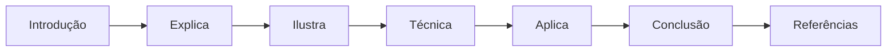

## Dica de Leitura

Você pode ler os capítulos em ordem (recomendado para iniciantes) ou pular diretamente para o tema de interesse. Cada capítulo é autocontido, mas a sequência cria conexões que ampliam o aprendizado.

---

*A metodologia EITA é uma criação da Fábrica Agêntica de Livros, projetada para produzir literatura técnica que transforma leitores em profissionais.*


---

# Capítulo 1: O Problema dos Tokens

## 1. Introdução

Quando você pede a um assistente de IA para revisar seu código, ele precisa ler os arquivos relevantes. Mas como saber quais são relevantes? A maioria dos agentes simplesmente lê **tudo** — e isso gasta tokens caros sem necessidade.

Neste capítulo, você vai entender por que isso acontece e como o Code Review Graph resolve o problema de forma elegante.

## 2. Explica

### O Custo de Ler Código Inteiro

Considere um repositório como o Flask (143.594 tokens de código-fonte). Quando você pede "revisar autenticação", o agente precisa:

1. Descobrir quais arquivos tratam de autenticação
2. Ler esses arquivos
3. Entender as dependências entre eles

Sem um grafo, o agente lê **todos** os 143.594 tokens. Com o Code Review Graph, ele lê apenas **2.196 tokens** — uma redução de **71x**.

### Como o Grafo Resolve Isso

O CRG constrói um mapa estrutural do seu código usando Tree-sitter:

- **Nós**: funções, classes, imports
- **Arestas**: chamadas, herança, dependências de teste

Quando um arquivo muda, o grafo rastreia todos os chamadores, dependentes e testes que podem ser afetados. Isso é o **blast radius** (raio de explosão).

### Números Reais

| Repositório | Tokens (corpus) | Tokens (grafo) | Redução |
|-------------|-----------------|----------------|---------|
| fastapi | 948.793 | 2.653 | **376x** |
| flask | 143.594 | 2.196 | **71x** |
| code-review-graph | 208.821 | 3.190 | **68x** |
| gin | 166.868 | 2.766 | **62x** |
| httpx | 142.356 | 2.661 | **61x** |
| express | 136.052 | 3.936 | **36x** |

**Redução mediana: ~65x**

## 3. Ilustra

Imagine que você tem uma biblioteca com 1.000 livros. Sem catálogo, para encontrar um capítulo sobre "autenticação", você precisaria abrir todos os 1.000 livros. Com um catálogo inteligente que diz "autenticação está nos livros 23, 45 e 67, capítulos 3, 1 e 5", você abre apenas 3 livros.

O Code Review Graph é esse catálogo para seu código.

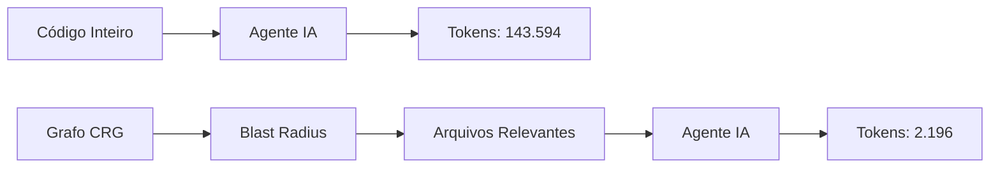

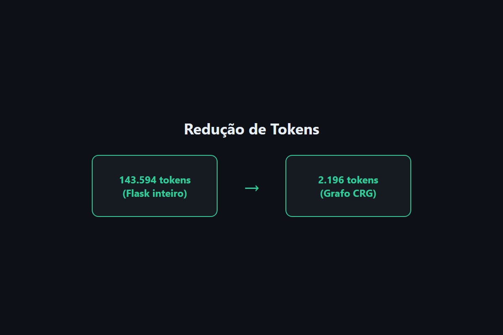

## 4. Técnica

### Instalação Básica

```bash
pip install code-review-graph
# ou: pipx install code-review-graph
```

### Construção do Grafo

```bash
code-review-graph build
```

Isso parseia todo o repositório e cria um banco SQLite em `.code-review-graph/`.

### Verificação

```bash
code-review-graph status
```

Saída esperada:

```
Graph: 1.446 nodes, 7.974 edges
Languages: Python (100%)
Last build: 2026-08-04 12:00:00
```

## 5. Aplica

### Cenário: Code Review Manual

**Antes do CRG:**
- Você pede ao agente: "Revise a mudança no módulo de auth"
- O agente lê 50 arquivos (143.594 tokens)
- Custo: ~$0.43 por review (preço GPT-4)
- Tempo: 45 segundos

**Com o CRG:**
- Você pede a mesma coisa
- O agente lê 8 arquivos relevantes (2.196 tokens)
- Custo: ~$0.007 por review
- Tempo: 3 segundos

**Economia anual (10 reviews/dia):** ~$1.500

### Armadilha Comum

Não confunda "redução de tokens" com "perda de contexto". O grafo retorna **exatamente** o contexto necessário — não mais, não menos. Se o agente precisa de mais informação, ele pode usar `traverse_graph` para expandir.

## 6. Conclusão

O Code Review Graph resolve um problema real: o desperdício de tokens em code reviews. Com redução mediana de 65x, ele torna revisões de IA economically viáveis para qualquer equipe.

No próximo capítulo, vamos instalar e configurar o CRG em um projeto real.

## 7. Referências

[1] TIRTH8205. Code Review Graph. Disponível em: https://github.com/tirth8205/code-review-graph. Acesso em: 4 ago. 2026.

[2] TREE-SITTER. Tree-sitter: an incremental parsing system. Disponível em: https://tree-sitter.github.io/tree-sitter/. Acesso em: 4 ago. 2026.

[3] MODEL CONTEXT PROTOCOL. MCP Specification. Disponível em: https://modelcontextprotocol.io/. Acesso em: 4 ago. 2026.

[4] OPENAI. Pricing. Disponível em: https://openai.com/pricing. Acesso em: 4 ago. 2026.


---

# Capítulo 2: Instalação e Configuração

## 1. Introdução

Neste capítulo, você vai instalar o Code Review Graph e configurá-lo para seu projeto. O processo é simples: um comando instala, outro constrói o grafo.

## 2. Explica

### Pré-requisitos

- Python 3.10 ou superior
- pip ou pipx instalado
- Git (para repositórios versionados)

### Métodos de Instalação

**Via pip (recomendado para desenvolvimento):**

```bash
pip install code-review-graph
```

**Via pipx (recomendado para uso global):**

```bash
pipx install code-review-graph
```

**Via uv (mais rápido):**

```bash
uv tool install code-review-graph
```

### Auto-detecção de Plataformas

O comando `install` detecta automaticamente quais ferramentas de IA você usa e configura cada uma:

```bash
code-review-graph install
```

Plataformas suportadas: Claude Code, Cursor, Windsurf, Copilot, Gemini CLI, Zed, Continue, OpenCode, Antigravity, Qwen, Qoder, Kiro, CodeBuddy.

## 3. Ilustra

O processo de instalação é como montar um quebra-cabeça: você fornece as peças (código), o CRG monta o mapa (grafo), e a ferramenta de IA usa o mapa para navegar.

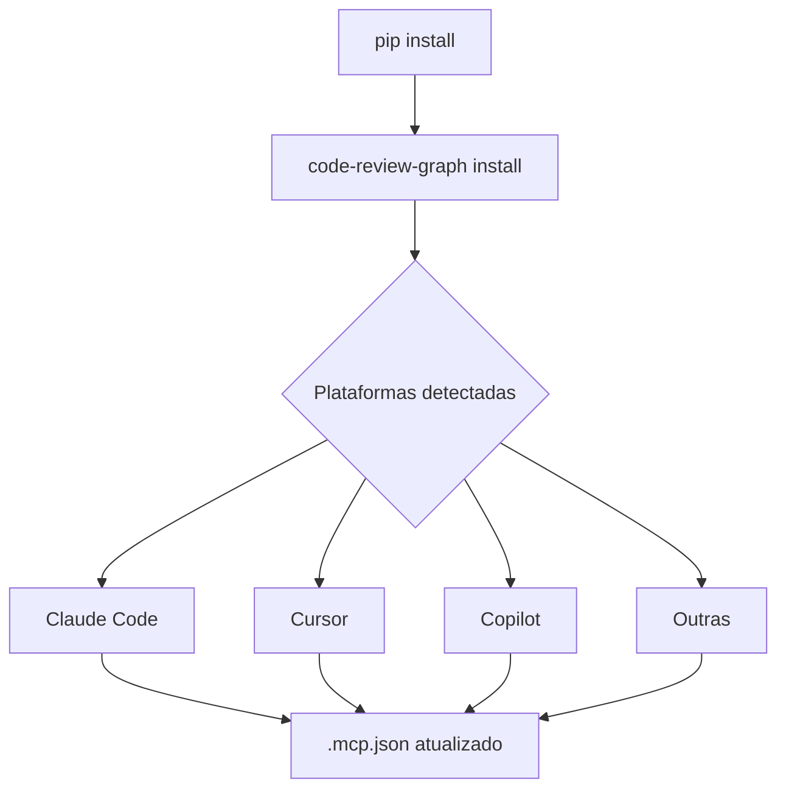

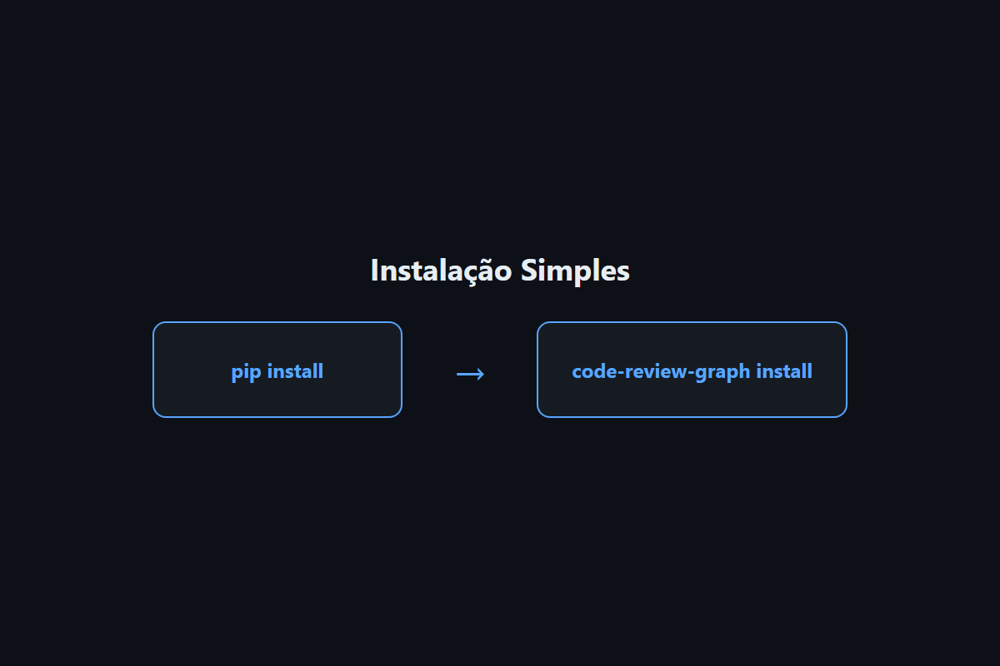

## 4. Técnica

### Passo 1: Instalar

```bash
pip install code-review-graph
```

### Passo 2: Configurar

```bash
cd meu-projeto
code-review-graph install
```

Saída esperada:

```
Detectando plataformas...
✓ Claude Code detectado
✓ Cursor detectado

Configurando MCP servers...
✓ Claude Code: ~/.claude/mcp.json atualizado
✓ Cursor: .cursor/mcp.json atualizado

Instalando hooks...
✓ pre-commit hook instalado

Concluído! Reinicie seu editor.
```

### Passo 3: Construir o Grafo

```bash
code-review-graph build
```

### Passo 4: Verificar

```bash
code-review-graph status
```

### Configuração Manual (se necessário)

Se a auto-detecção falhar, configure manualmente editando `.mcp.json`:

```json
{
  "mcpServers": {
    "code-review-graph": {
      "command": "code-review-graph",
      "args": ["serve"]
    }
  }
}
```

### Exclusão Segura

Para remover o CRG de um projeto:

```bash
code-review-graph uninstall --dry-run  # prévia
code-review-graph uninstall            # confirma e aplica
```

## 5. Aplica

### Cenário: Time com Múltiplas Ferramentas

Um time usa Claude Code para programação e Cursor para navegação. O `install` configura ambos automaticamente:

```bash
code-review-graph install
# Detecta e configura Claude Code E Cursor
# Um único comando para todo o time
```

### Dica de Produção

Em ambientes CI/CD, use o GitHub Action para reviews automáticos:

```yaml
- uses: tirth8205/code-review-graph@v2.3.6
  with:
    github-token: ${{ secrets.GITHUB_TOKEN }}
```

## 6. Conclusão

Instalar o CRG leva menos de 1 minuto. O `install` auto-detecta e configura tudo. O `build` constrói o grafo em ~10 segundos para projetos com 500 arquivos.

No próximo capítulo, vamos explorar o blast radius e a análise de impacto.

## 7. Referências

[1] TIRTH8205. Code Review Graph - Usage. Disponível em: https://github.com/tirth8205/code-review-graph/blob/main/docs/USAGE.md. Acesso em: 4 ago. 2026.

[2] TIRTH8205. Code Review Graph - Commands. Disponível em: https://github.com/tirth8205/code-review-graph/blob/main/docs/COMMANDS.md. Acesso em: 4 ago. 2026.


---

# Capítulo 3: Blast Radius e Impact Analysis

## 1. Introdução

Quando você muda uma função, quais outras partes do código são afetadas? Essa é a pergunta que o **blast radius** responde. Neste capítulo, você vai aprender a usar essa funcionalidade poderosa do CRG.

## 2. Explica

### O que é Blast Radius?

Blast radius (raio de explosão) é o conjunto de todos os arquivos, funções e testes que podem ser afetados por uma mudança. O CRG calcula isso usando o grafo de dependências.

### Como Funciona

1. Você muda `login()` no módulo `auth`
2. O grafo rastreia quem chama `login()` → `dashboard()`, `api.py`, `tests/test_auth.py`
3. O agente lê apenas esses arquivos
4. Review focado e eficiente

### Ferramentas MCP

| Ferramenta | Função |
|------------|--------|
| `get_impact_radius` | Raio de explosão de arquivos modificados |
| `detect_changes` | Análise de impacto com pontuação de risco |
| `get_review_context` | Contexto otimizado para tokens |

## 3. Ilustra

Imagine que você está reformulando a cozinha de uma casa. Sem o plano elétrico, você pode acidentalmente cortar um fio que alimenta toda a casa. Com o plano, você sabe exatamente quais cômodos são afetados.

O blast radius é esse plano elétrico para seu código.

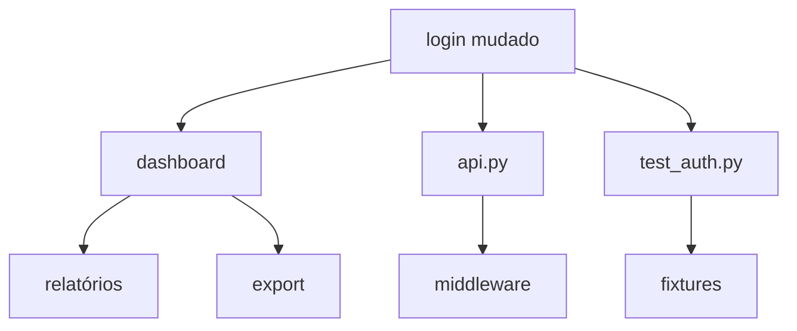

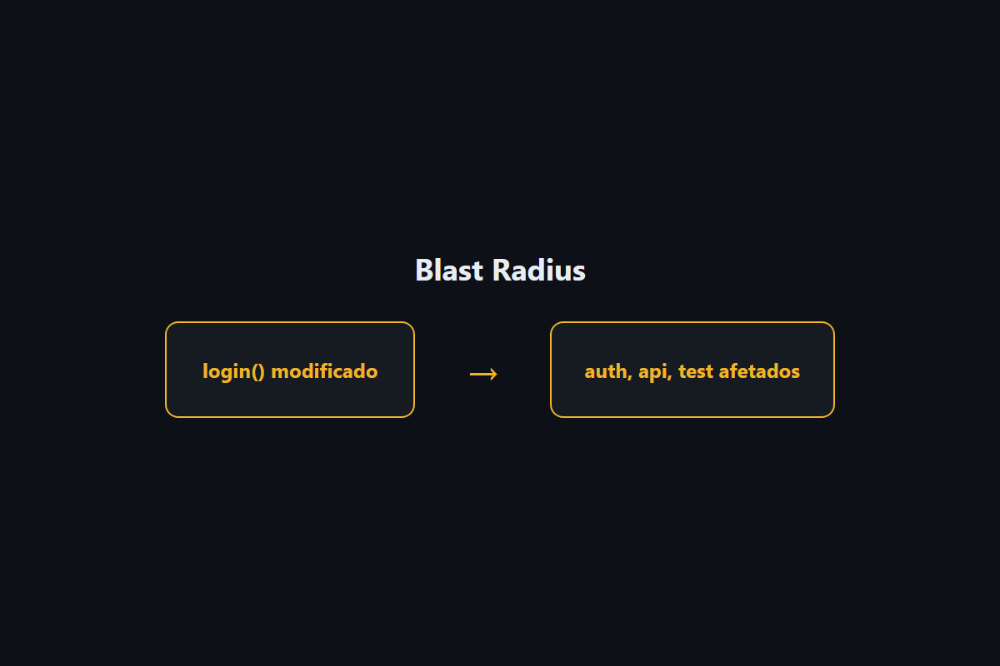

## 4. Técnica

### Uso via CLI

```bash
# Análise de mudanças atuais
code-review-graph detect-changes --brief

# Atualizar grafo + análise
code-review-graph update --brief
```

### Uso via MCP

```python
# No seu agente de IA
context = mcp.get_review_context(
    changed_files=["auth/login.py", "auth/models.py"]
)
# Retorna: arquivos relevantes + resumo estrutural + pontuação de risco
```

### Exemplo de Saída

```
┌─────────────────────── Token Savings ────────────────────────┐
│ Full context would be:     12,921 tokens                     │
│ Graph context used:           762 tokens                     │
│ Saved:                     12,159 tokens (~94%)              │
│ Breakdown: Functions 244 · Tests 191 · Risk 244 · Other 83   │
└──────────────────────────────────────────────────────────────┘
```

### Verificação com tiktoken

```bash
code-review-graph detect-changes --brief --verify
```

Cruza os números com o tokenizer real do GPT-4 (precisa de `pip install tiktoken`).

## 5. Aplica

### Cenário: PR Grande

Você tem um PR com 15 arquivos modificados. Sem CRG, o agente lê todos. Com CRG:

```bash
code-review-graph detect-changes --brief
```

Saída:
- 15 arquivos → 8 realmente afetados
- Tokens: 45.000 → 3.200 (redução de 14x)
- Risco: 2 funções críticas identificadas

### Cenário: Code Review em CI

```yaml
# .github/workflows/review.yml
- name: Review PR
  uses: tirth8205/code-review-graph@v2.3.6
  with:
    fail-on-risk: high  # Falha se houver risco alto
```

## 6. Conclusão

Blast radius é a funcionalidade mais valiosa do CRG. Ele transforma reviews genéricos em reviews focados, economizando tokens e tempo.

No próximo capítulo, vamos ver como integrar o CRG com ferramentas de IA.

## 7. Referências

[1] TIRTH8205. Blast Radius Analysis. Disponível em: https://github.com/tirth8205/code-review-graph#blast-radius-analysis. Acesso em: 4 ago. 2026.

[2] TIRTH8205. GitHub Action. Disponível em: https://github.com/tirth8205/code-review-graph/blob/main/docs/GITHUB_ACTION.md. Acesso em: 4 ago. 2026.


---

# Capítulo 4: MCP Tools e Integração com IA

## 1. Introdução

O Code Review Graph expõe 30 ferramentas MCP que seu assistente de IA usa automaticamente. Neste capítulo, você vai entender como essas ferramentas funcionam e como integrá-las ao seu fluxo de trabalho.

## 2. Explica

### O que é MCP?

MCP (Model Context Protocol) é um padrão que permite ferramentas externas se comunicarem com assistentes de IA. O CRG implementa MCP para fornecer contexto de código estruturado.

### As 30 Ferramentas Principais

| Categoria | Ferramentas |
|-----------|-------------|
| **Contexto** | `get_minimal_context`, `get_review_context`, `get_impact_radius` |
| **Busca** | `query_graph`, `semantic_search_nodes`, `traverse_graph` |
| **Análise** | `detect_changes`, `get_architecture_overview`, `find_large_functions` |
| **Comunidades** | `list_communities`, `get_community`, `get_hub_nodes` |
| **Refactoring** | `refactor_tool`, `apply_refactor` |

### Prompts de Workflow

O CRG inclui 5 prompts prontos:

1. **review_changes** — revisão de mudanças
2. **architecture_map** — mapa de arquitetura
3. **debug_issue** — depuração de bugs
4. **onboard_developer** — integração de novos devs
5. **pre_merge_check** — verificação pré-merge

## 3. Ilustra

O MCP é como um tradutor entre o código e o assistente de IA. O código fala "funções e dependências", o assistente fala "linguagem natural", e o MCP traduz.

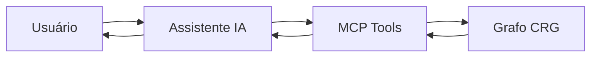

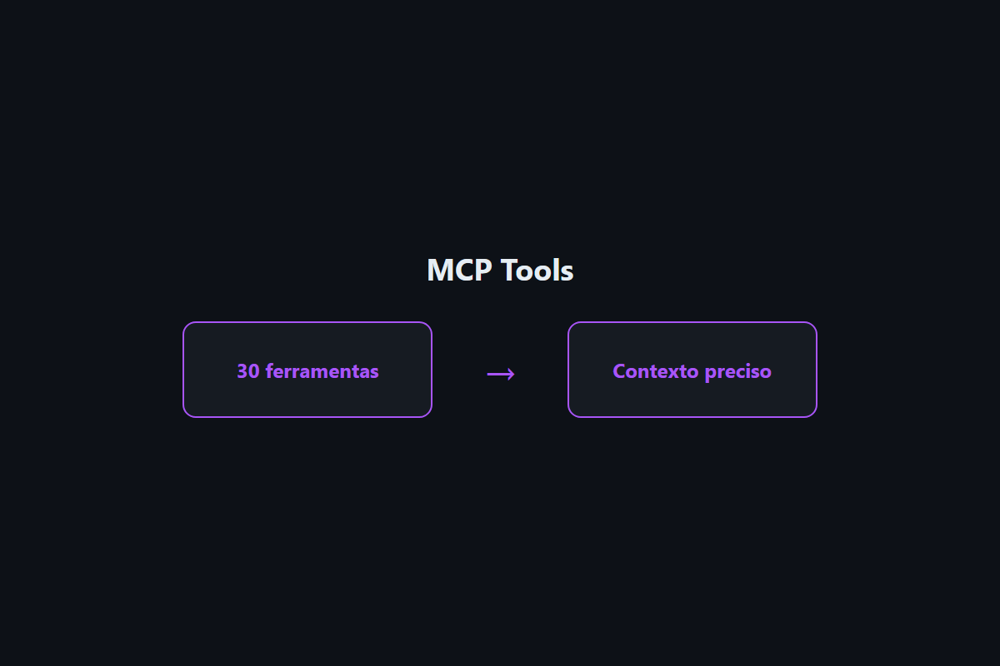

## 4. Técnica

### Uso via Claude Code

```bash
# Instalar
code-review-graph install --platform claude-code

# Reiniciar Claude Code

# Usar
/code-review-graph:review-delta
```

### Uso via Cursor

```bash
# Instalar
code-review-graph install --platform cursor

# Reiniciar Cursor

# Usar no chat
"Revise as mudanças no módulo de auth"
```

### Uso via API Python

```python
from code_review_graph import CodeReviewGraph

graph = CodeReviewGraph()

# Busca semântica
results = graph.semantic_search("autenticação JWT")

# Blast radius
impact = graph.get_impact_radius(["auth/login.py"])

# Resumo de arquitetura
overview = graph.get_architecture_overview()
```

### Configuração de Embeddings

Para busca semântica vetorial:

```bash
# Local (gratuito)
pip install "code-review-graph[embeddings]"

# Google Gemini
export GOOGLE_API_KEY=sua-chave
pip install "code-review-graph[google-embeddings]"

# OpenAI
export OPENAI_API_KEY=sua-chave
```

## 5. Aplica

### Cenário: Onboarding de Novo Dev

Novo dev pergunta: "Como funciona o sistema de autenticação?"

Com CRG:
```bash
/code-review-graph:architecture_map
```

Saída: mapa visual + lista de arquivos + fluxo de execução.

### Cenário: Debug de Bug

Bug reportado: "Login falha em 5% dos casos"

Com CRG:
```bash
/code-review-graph:debug_issue
```

Saída: funções envolvidas, testes existentes, gaps de cobertura.

## 6. Conclusão

As ferramentas MCP do CRG transformam a forma como você interage com código. Em vez de adivinar onde está o problema, o grafo mostra o caminho.

No próximo capítulo, vamos explorar visualização e exportação.

## 7. Referências

[1] TIRTH8205. MCP Tools. Disponível em: https://github.com/tirth8205/code-review-graph#30-mcp-tools. Acesso em: 4 ago. 2026.

[2] MODEL CONTEXT PROTOCOL. Tools. Disponível em: https://modelcontextprotocol.io/docs/concepts/tools. Acesso em: 4 ago. 2026.


---

# Capítulo 5: Visualização e Exportação

## 1. Introdução

Ver o grafo é entender o código. Neste capítulo, você vai aprender a visualizar o grafo de múltiplas formas e exportá-lo para outras ferramentas.

## 2. Explica

### Tipos de Visualização

| Formato | Ferramenta | Uso |
|---------|-----------|-----|
| HTML interativo | D3.js | Exploração no navegador |
| GraphML | Gephi/yEd | Análise em ferramentas desktop |
| Neo4j Cypher | Neo4j | Consultas em banco de dados |
| Obsidian | Obsidian | Documentação com wikilinks |
| SVG | Qualquer | Imagens estáticas |

### Detecção de Padrões

O CRG identifica automaticamente:

- **Hubs**: nós mais conectados (pontos quentes)
- **Bridges**: gargalos arquiteturais (betweenness centrality)
- **Surprises**: acoplamentos inesperados entre comunidades

## 3. Ilustra

Visualizar o grafo é como ver uma cidade de cima: você vê os prédios altos (hubs), as pontes (bridges) e os bairros isolados (comunidades).

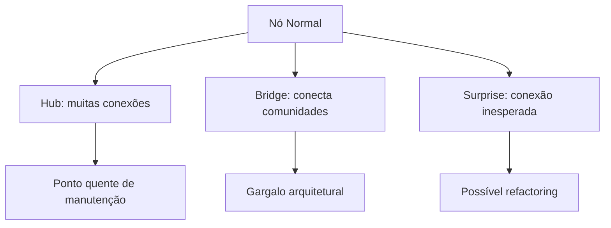

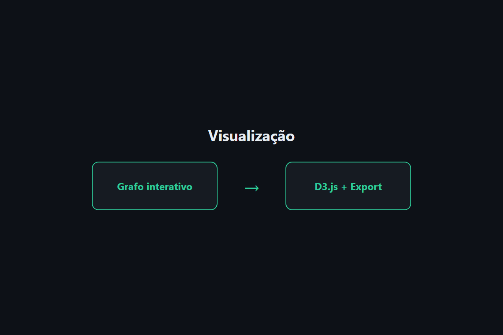

## 4. Técnica

### Visualização Interativa

```bash
code-review-graph visualize
```

Abre o navegador com grafo D3.js interativo.

### Exportação

```bash
# GraphML (para Gephi)
code-review-graph visualize --format graphml

# Neo4j
code-review-graph visualize --format cypher

# Obsidian
code-review-graph visualize --format obsidian

# SVG
code-review-graph visualize --format svg

# JSON
code-review-graph visualize --format json
```

### Wiki Automática

```bash
# Gerar wiki em Markdown
code-review-graph wiki

# Acessar página específica
code-review-graph wiki --page "auth-module"
```

### Análise de Comunidades

```bash
# Listar comunidades
code-review-graph status --communities

# Detalhar comunidade
code-review-graph visualize --community 3
```

### Detecção de Hubs e Bridges

```python
from code_review_graph import CodeReviewGraph

graph = CodeReviewGraph()

# Hubs (nós mais conectados)
hubs = graph.get_hub_nodes(limit=10)

# Bridges (gargalos)
bridges = graph.get_bridge_nodes(limit=10)

# Knowledge gaps
gaps = graph.get_knowledge_gaps()
```

## 5. Aplica

### Cenário: Refactoring

O CRG identifica que o módulo `auth` é um hub com 45 conexões. Isso sugere que está muito acoplado — considere dividir em sub-módulos.

### Cenário: Documentação

O time precisa de documentação da arquitetura. O CRG gera automaticamente:

```bash
code-review-graph wiki --output docs/architecture.md
```

### Cenário: Apresentação para Stakeholders

Exporte como SVG para incluir em apresentações:

```bash
code-review-graph visualize --format svg --output architecture.svg
```

## 6. Conclusão

Visualização e exportação tornam o grafo acessível para todo o time — de desenvolvedores a gestores. O CRG não apenas analisa código, comunica descobertas.

### Resumo do Ebook

1. **Tokens**: redução de 65x mediana
2. **Instalação**: um comando
3. **Blast Radius**: reviews focados
4. **MCP**: 30 ferramentas integradas
5. **Visualização**: múltiplos formatos

## 7. Referências

[1] TIRTH8205. Visualization. Disponível em: https://github.com/tirth8205/code-review-graph#interactive-visualisation. Acesso em: 4 ago. 2026.

[2] TIRTH8205. Export Formats. Disponível em: https://github.com/tirth8205/code-review-graph#export-formats. Acesso em: 4 ago. 2026.

[3] TIRTH8205. Wiki Generation. Disponível em: https://github.com/tirth8205/code-review-graph#wiki-generation. Acesso em: 4 ago. 2026.


---

