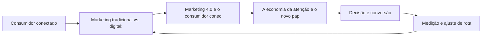

Do Marketing Tradicional ao Digital: A Mudança de Paradigma

## Introdução
Bem-vindo a uma nova etapa da sua navegação pelo marketing digital. Este capítulo — *Do Marketing Tradicional ao Digital: A Mudança de Paradigma* — integra a Parte I, *Fundamentos — O Novo Território*, e responde a uma pergunta prática: **marketing tradicional vs. digital: outbound, canais de massa, interrupção** — na prática, como isso se traduz em decisão e resultado?

Ao final, você será capaz de ntende a evolução do marketing de massa (outbound, 4ps) para o marketing digital centrado em dados e relacionamento, e por que o consumidor assumiu o controle da jornada.. Mais do que decorar conceitos, você vai enxergar o consumidor como viajante que decide o destino — e converter essa visão em plano, experimento e métrica.

O capítulo segue a estrutura das sete seções que organizam esta obra: primeiro a exposição conceitual, depois a ilustração, a técnica aplicada, o exercício de aplicação e a conclusão operacional.

## Entendendo o Assunto
### Marketing tradicional vs. digital: outbound, canais de massa, interrupção

Quando o tema é *Do Marketing Tradicional ao Digital: A Mudança de Paradigma*, o primeiro pilar — marketing tradicional vs. digital: outbound, canais de massa, interrupção — define o território conceitual. O relatório Digital 2026 registra mais de 5,5 bilhões de usuários de internet — dois terços da humanidade com acesso a canais que não existiam quando o marketing de massa foi desenhado.

Na prática, marketing tradicional vs. digital: outbound, canais de massa, interrupção significa transformar a teoria em rotina operacional — exatamente o que *Do Marketing Tradicional ao Digital: A Mudança de Paradigma* exige no dia a dia. A literatura de gestão é enfática: sem operacionalizar o conceito em checklist, responsável e métrica, ele permanece slide de apresentação. Por isso a Parte I propõe sempre o mesmo movimento: entender, traduzir em critério observável e decidir com dado.

### Marketing 4.0 e o consumidor conectado: o caminho dos 5As

O segundo pilar — marketing 4.0 e o consumidor conectado: o caminho dos 5as — conecta a estratégia à operação diária. Kotler e Keller definem administração de marketing como a arte e a ciência de escolher mercados-alvo e construir relacionamentos lucrativos com eles — definição que ganha potência quando cada interação é rastreável e mensurável. A experiência do consumidor se constrói na consistência entre canais e mensagens, e é essa consistência que transforma contato em relacionamento. Organizações que tratam cada canal como silo perdem o fio condutor da jornada; as que operam o pilar com disciplina reduzem atrito e aumentam a taxa de avanço entre etapas.

### A economia da atenção e o novo papel da marca no ambiente digital

Fechando o tripé, a economia da atenção e o novo papel da marca no ambiente digital é o que transforma a Parte I em vantagem mensurável. O Marketing 4.0 propõe acompanhar o consumidor no caminho dos 5As — assimilação, atração, arguição, ação e defesa — substituindo o funil rígido por um percurso controlado pelo próprio consumidor. O relato da indústria mostra que as empresas que sustentam resultado não são as que têm mais ferramentas, mas as que conseguem medir e ajustar a rota com frequência. A métrica certa, escolhida antes da campanha, vale mais do que qualquer ferramenta cara instalada depois do fato.

### O Eixo Transversal do Capítulo

A mudança do custo dominante — de distribuição e mídia para atenção e confiança — reordena o orçamento: empresas que migram do outbound para o inbound relatam custos de aquisição menores e relacionamentos mais longos. Esse eixo conecta os três pilares e explica por que o capítulo os trata como um sistema, não como uma lista: cada pilar reforça o outro, e a omissão de qualquer um deles produz estratégia manca. O capítulo seguinte retomará esse eixo com novas ferramentas, agora com o vocabulário já estabelecido aqui.

Em síntese, o capítulo opera em três níveis: o conceitual (Marketing tradicional vs. digital: outbound, canais de massa, interrupção), o operacional (Marketing 4.0 e o consumidor conectado: o caminho dos 5As) e o estratégico (A economia da atenção e o novo papel da marca no ambiente digital). O leitor que dominar os três estará apto a aplicar a Parte I com autonomia. A evidência reunida nesta seção sustenta cada recomendação prática das seções seguintes.

## Na Prática
Vamos traduzir o capítulo em uma cena concreta, no contexto de *Do Marketing Tradicional ao Digital: A Mudança de Paradigma*. Uma empresa de porte médio, com equipe enxuta e orçamento limitado, decide operar a Parte I desta obra, *Fundamentos — O Novo Território*. Na primeira semana, a equipe testa o conceito central do capítulo em um caso real: um cliente que pesquisou, comparou e decidiu comprar. O primeiro pilar — marketing tradicional vs. digital: outbound, canais de massa, interrupção — orienta o entendimento inicial do público; o segundo — marketing 4.0 e o consumidor conectado: o caminho dos 5as — guia a escolha da rota de comunicação; e o terceiro fecha com a medição do resultado.

O diagrama abaixo representa o fluxo operacional proposto pelo capítulo — do consumidor conectado à decisão e ao ajuste contínuo de rota, com o público e a plataforma específicos do tema no centro da navegação:



Observe o laço de retorno: a medição alimenta o próximo ciclo de campanha. Essa é a diferença estrutural entre campanha e sistema — a campanha termina quando o orçamento acaba; o sistema aprende e se ajusta a cada ciclo. No caso do tema *Do Marketing Tradicional ao Digital: A Mudança de Paradigma*, esse laço é o que converte o investimento inicial em aprendizado acumulado para as próximas decisões.

## Ferramentas e Técnicas
### O Diagnóstico do Mix Digital em Código

Para aplicar os fundamentos, nada melhor que um diagnóstico programático do mix. O código abaixo avalia a maturidade digital de cada um dos 4Ps a partir de critérios simples — transformando intuição em checklist executável.

```python
import json

def diagnosticar_mix(produto: dict, preco: dict, praca: dict, promocao: dict) -> dict:
    """Pontua a maturidade digital de cada P (0-100)."""
    def nota(crit: dict) -> float:
        soma = sum(1 for v in crit.values() if v)
        return round(100 * soma / max(len(crit), 1), 1)

    return {
        "produto": nota(produto),
        "preco": nota(preco),
        "praca": nota(praca),
        "promocao": nota(promocao),
    }

mix = diagnosticar_mix(
    produto={"personalizavel": True, "digital": True, "feedback": True},
    preco={"dinamico": False, "freemium": True, "transparente": True},
    praca={"multicanal": True, "marketplace": False, "d2c": True},
    promocao={"segmentada": True, "conteudo": True, "mensuravel": True},
)
print(json.dumps(mix, indent=2))
```

O resultado alimenta a priorização: o P com menor nota é o primeiro candidato a experimento. A disciplina de medir antes de mudar é o que separa o diagnóstico do achismo.

O código acima é o núcleo técnico de *Do Marketing Tradicional ao Digital: A Mudança de Paradigma*: validável, executável e adaptável ao contexto real do leitor. A prática recomendada é rodá-lo com dados próprios e usar a saída como insumo da próxima reunião de planejamento. Documentação oficial das plataformas reforça cada passo — da estrutura de campanhas à configuração de eventos. A leitura técnica deste capítulo complementa a exposição conceitual das seções anteriores e prepara os exercícios da seção seguinte.

## Exercício Rápido
Conhecimento sem aplicação é conteúdo; aplicação sem reflexão é rotina. No contexto de *Do Marketing Tradicional ao Digital: A Mudança de Paradigma*, os exercícios abaixo fecham o capítulo e preparam o terreno do próximo:

1. Diagnostique seu atual mix: liste os 4Ps da sua oferta e como cada um mudaria se o canal fosse 100% digital.
2. Mapeie o caminho dos 5As de um cliente real e marque onde sua marca está presente e onde perde o contato.
3. Classifique suas ações atuais como outbound ou inbound e estime o custo relativo de atenção de cada uma.
4. Defina uma métrica única para cada um dos 4Ps e meça a linha de base antes de qualquer mudança.

Dedique ao menos 30 minutos a um dos exercícios antes de avançar. O aprendizado desta obra é cumulativo: o mapa desenhado aqui será usado nos capítulos seguintes da Parte I e nas partes subsequentes.

## Para Levar daqui
O capítulo percorreu o território da Parte I, *Fundamentos — O Novo Território*, e deixou três aprendizados operacionais. Primeiro, o conceito central — *Do Marketing Tradicional ao Digital: A Mudança de Paradigma* — é menos uma novidade e mais uma disciplina de execução. Segundo, a aplicação exige a tríade conceito, rota e métrica, sem pular etapas. Terceiro, o ajuste contínuo de rota, ilustrado no laço de retorno do diagrama, é o que separa campanhas pontuais de operações sustentáveis. No próximo capítulo, *O Mix Digital: Produto, Preço, Praça e Promoção no Ambiente Online*, você avançará sobre o território vizinho levando as ferramentas exercitadas aqui.

Como navegador de marketing digital, você não decorou uma fórmula — incorporou um modo de operar: ler o território, escolher a rota com dados e ajustar o percurso quando o vento muda.
