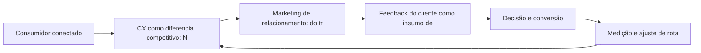

Experiência do Cliente (CX) e o Marketing de Relacionamento

## Introdução
Bem-vindo a uma nova etapa da sua navegação pelo marketing digital. Este capítulo — *Experiência do Cliente (CX) e o Marketing de Relacionamento* — integra a Parte II, *A Jornada do Consumidor — Mapeando a Navegação*, e responde a uma pergunta prática: **cx como diferencial competitivo: nps, csat e fricção** — na prática, como isso se traduz em decisão e resultado?

Ao final, você será capaz de aplica princípios de experiência do cliente ao marketing: jornada sem atritos, satisfação mensurável e relacionamento que gera recompra e recomendação.. Mais do que decorar conceitos, você vai enxergar a jornada como mapa com etapas, atalhos e momentos de verdade — e converter essa visão em plano, experimento e métrica.

No capítulo anterior, *Touchpoints e Momentos de Verdade: A Experiência Multicanal*, você aprendeu os conceitos que servem de plataforma para o que vem agora. Este capítulo retoma esse repertório e o aplica a um território novo — sem repetir o que já foi estabelecido, apenas usando como base.

O capítulo segue a estrutura das sete seções que organizam esta obra: primeiro a exposição conceitual, depois a ilustração, a técnica aplicada, o exercício de aplicação e a conclusão operacional.

## Entendendo o Assunto
### CX como diferencial competitivo: NPS, CSAT e fricção

Quando o tema é *Experiência do Cliente (CX) e o Marketing de Relacionamento*, o primeiro pilar — cx como diferencial competitivo: nps, csat e fricção — define o território conceitual. Lemon e Verhoef demonstram que a experiência do cliente se constrói na soma dos encontros ao longo da jornada — avaliar cada ponto isolado engana tanto quanto ignorar a jornada inteira.

Na prática, cx como diferencial competitivo: nps, csat e fricção significa transformar a teoria em rotina operacional — exatamente o que *Experiência do Cliente (CX) e o Marketing de Relacionamento* exige no dia a dia. A literatura de gestão é enfática: sem operacionalizar o conceito em checklist, responsável e métrica, ele permanece slide de apresentação. Por isso a Parte II propõe sempre o mesmo movimento: entender, traduzir em critério observável e decidir com dado.

### Marketing de relacionamento: do transacional ao recorrente

O segundo pilar — marketing de relacionamento: do transacional ao recorrente — conecta a estratégia à operação diária. A jornada do consumidor moderno raramente é linear: a decisão se fragmenta em micro-momentos de pesquisa, comparação e validação antes de qualquer contato com a marca. A experiência do consumidor se constrói na consistência entre canais e mensagens, e é essa consistência que transforma contato em relacionamento. Organizações que tratam cada canal como silo perdem o fio condutor da jornada; as que operam o pilar com disciplina reduzem atrito e aumentam a taxa de avanço entre etapas.

### Feedback do cliente como insumo de estratégia

Fechando o tripé, feedback do cliente como insumo de estratégia é o que transforma a Parte II em vantagem mensurável. Personas construídas com dados quantitativos e qualitativos reduzem o desperdício de mídia porque alinham a mensagem ao contexto real de decisão de cada segmento. O relato da indústria mostra que as empresas que sustentam resultado não são as que têm mais ferramentas, mas as que conseguem medir e ajustar a rota com frequência. A métrica certa, escolhida antes da campanha, vale mais do que qualquer ferramenta cara instalada depois do fato.

### O Eixo Transversal do Capítulo

A experiência percebida supera o produto em influência sobre a recomendação: clientes que vivenciam jornadas sem atrito relatam intenção de recompra e advocacy significativamente maior. Esse eixo conecta os três pilares e explica por que o capítulo os trata como um sistema, não como uma lista: cada pilar reforça o outro, e a omissão de qualquer um deles produz estratégia manca. O capítulo seguinte retomará esse eixo com novas ferramentas, agora com o vocabulário já estabelecido aqui.

Em síntese, o capítulo opera em três níveis: o conceitual (CX como diferencial competitivo: NPS, CSAT e fricção), o operacional (Marketing de relacionamento: do transacional ao recorrente) e o estratégico (Feedback do cliente como insumo de estratégia). O leitor que dominar os três estará apto a aplicar a Parte II com autonomia. A evidência reunida nesta seção sustenta cada recomendação prática das seções seguintes.

## Na Prática
Vamos traduzir o capítulo em uma cena concreta, no contexto de *Experiência do Cliente (CX) e o Marketing de Relacionamento*. Uma empresa de porte médio, com equipe enxuta e orçamento limitado, decide operar a Parte II desta obra, *A Jornada do Consumidor — Mapeando a Navegação*. Na primeira semana, a equipe testa o conceito central do capítulo em um caso real: um cliente que pesquisou, comparou e decidiu comprar. O primeiro pilar — cx como diferencial competitivo: nps, csat e fricção — orienta o entendimento inicial do público; o segundo — marketing de relacionamento: do transacional ao recorrente — guia a escolha da rota de comunicação; e o terceiro fecha com a medição do resultado.

O diagrama abaixo representa o fluxo operacional proposto pelo capítulo — do consumidor conectado à decisão e ao ajuste contínuo de rota, com o público e a plataforma específicos do tema no centro da navegação:



Observe o laço de retorno: a medição alimenta o próximo ciclo de campanha. Essa é a diferença estrutural entre campanha e sistema — a campanha termina quando o orçamento acaba; o sistema aprende e se ajusta a cada ciclo. No caso do tema *Experiência do Cliente (CX) e o Marketing de Relacionamento*, esse laço é o que converte o investimento inicial em aprendizado acumulado para as próximas decisões.

## Ferramentas e Técnicas
### O Mapa de Jornada em Estrutura de Dados

A jornada vira dado quando cada etapa ganha evento, métrica e dono. O modelo abaixo representa a jornada como uma lista de estágios com conversão acumulada — a base para identificar o maior vazamento do funil.

```python
from dataclasses import dataclass

@dataclass
class Estagio:
    nome: str
    contato: int
    conversao: float  # fração que avança

def funil(estagios):
    """Calcula conversão por estágio e vazamento acumulado."""
    acumulado = estagios.contato
    resultado = []
    for e in estagios:
        resultado.append({"estagio": e.nome, "pessoas": acumulado,
                          "conversao_etapa": round(e.conversao, 3)})
        acumulado = round(acumulado * e.conversao)
    return resultado

jornada = [
    Estagio("Reconhecimento", 100_000, 0.30),
    Estagio("Consideração", 0, 0.40),
    Estagio("Decisão", 0, 0.25),
    Estagio("Compra", 0, 1.0),
]
for etapa in funil(jornada):
    print(etapa)
```

O maior vazamento entre etapas é a prioridade da estratégia — cada ponto recuperado se multiplica ao longo do funil. O mapa é também o documento de alinhamento entre marketing e vendas.

O código acima é o núcleo técnico de *Experiência do Cliente (CX) e o Marketing de Relacionamento*: validável, executável e adaptável ao contexto real do leitor. A prática recomendada é rodá-lo com dados próprios e usar a saída como insumo da próxima reunião de planejamento. Documentação oficial das plataformas reforça cada passo — da estrutura de campanhas à configuração de eventos. A leitura técnica deste capítulo complementa a exposição conceitual das seções anteriores e prepara os exercícios da seção seguinte.

## Exercício Rápido
Conhecimento sem aplicação é conteúdo; aplicação sem reflexão é rotina. No contexto de *Experiência do Cliente (CX) e o Marketing de Relacionamento*, os exercícios abaixo fecham o capítulo e preparam o terreno do próximo:

1. Desenhe o mapa de touchpoints da jornada do seu cliente, do reconhecimento à defesa.
2. Crie uma persona com nome, dores, canais e gatilhos de decisão baseada em dados reais de sua audiência.
3. Identifique os três momentos de verdade da sua jornada e o que o cliente avalia em cada um.
4. Escolha um cliente perdido recentemente e reconstrua a jornada dele para localizar o ponto de ruptura.

Dedique ao menos 30 minutos a um dos exercícios antes de avançar. O aprendizado desta obra é cumulativo: o mapa desenhado aqui será usado nos capítulos seguintes da Parte II e nas partes subsequentes.

## Para Levar daqui
O capítulo percorreu o território da Parte II, *A Jornada do Consumidor — Mapeando a Navegação*, e deixou três aprendizados operacionais. Primeiro, o conceito central — *Experiência do Cliente (CX) e o Marketing de Relacionamento* — é menos uma novidade e mais uma disciplina de execução. Segundo, a aplicação exige a tríade conceito, rota e métrica, sem pular etapas. Terceiro, o ajuste contínuo de rota, ilustrado no laço de retorno do diagrama, é o que separa campanhas pontuais de operações sustentáveis. O caminho percorrido desde *Touchpoints e Momentos de Verdade: A Experiência Multicanal* até aqui forma a base que o próximo passo vai usar. No próximo capítulo, *Neuromarketing e a Psicologia da Decisão de Compra Online*, você avançará sobre o território vizinho levando as ferramentas exercitadas aqui.

Como navegador de marketing digital, você não decorou uma fórmula — incorporou um modo de operar: ler o território, escolher a rota com dados e ajustar o percurso quando o vento muda.
