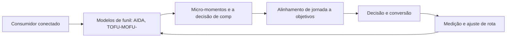
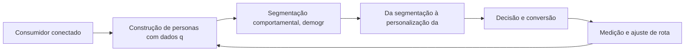
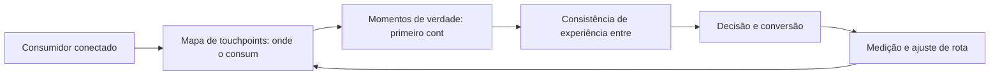
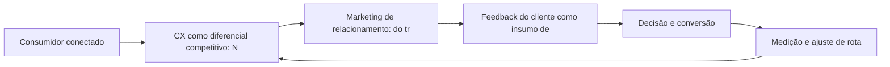
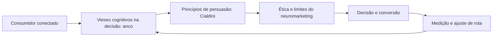

# A Jornada do Consumidor

Bem-vindo ao seu guia prático de marketing digital. Este e-book condensa, em linguagem direta e acionável, o que você precisa saber para navegar com confiança pelo território digital — conceitos, plataformas e estratégias que geram resultado.

Funil de Vendas e Jornada do Cliente: Mapeando a Navegação

## Introdução
Bem-vindo a uma nova etapa da sua navegação pelo marketing digital. Este capítulo — *Funil de Vendas e Jornada do Cliente: Mapeando a Navegação* — integra a Parte II, *A Jornada do Consumidor — Mapeando a Navegação*, e responde a uma pergunta prática: **modelos de funil: aida, tofu-mofu-bofu e o caminho dos 5as** — na prática, como isso se traduz em decisão e resultado?

Ao final, você será capaz de aprende a mapear a jornada do consumidor — do reconhecimento à defesa — e a alinhar cada etapa a objetivos e métricas específicas.. Mais do que decorar conceitos, você vai enxergar a jornada como mapa com etapas, atalhos e momentos de verdade — e converter essa visão em plano, experimento e métrica.

No capítulo anterior, *Marketing Digital na Prática: Aplicação em Diferentes Portes de Negócio*, você aprendeu os conceitos que servem de plataforma para o que vem agora. Este capítulo retoma esse repertório e o aplica a um território novo — sem repetir o que já foi estabelecido, apenas usando como base.

O capítulo segue a estrutura das sete seções que organizam esta obra: primeiro a exposição conceitual, depois a ilustração, a técnica aplicada, o exercício de aplicação e a conclusão operacional.

## Entendendo o Assunto
### Modelos de funil: AIDA, TOFU-MOFU-BOFU e o caminho dos 5As

Quando o tema é *Funil de Vendas e Jornada do Cliente: Mapeando a Navegação*, o primeiro pilar — modelos de funil: aida, tofu-mofu-bofu e o caminho dos 5as — define o território conceitual. A confiança construída ao longo da jornada é o ativo intangível que mais correlaciona com recompra e recomendação espontânea.

Na prática, modelos de funil: aida, tofu-mofu-bofu e o caminho dos 5as significa transformar a teoria em rotina operacional — exatamente o que *Funil de Vendas e Jornada do Cliente: Mapeando a Navegação* exige no dia a dia. A literatura de gestão é enfática: sem operacionalizar o conceito em checklist, responsável e métrica, ele permanece slide de apresentação. Por isso a Parte II propõe sempre o mesmo movimento: entender, traduzir em critério observável e decidir com dado.

### Micro-momentos e a decisão de compra fragmentada

O segundo pilar — micro-momentos e a decisão de compra fragmentada — conecta a estratégia à operação diária. Lemon e Verhoef demonstram que a experiência do cliente se constrói na soma dos encontros ao longo da jornada — avaliar cada ponto isolado engana tanto quanto ignorar a jornada inteira. A experiência do consumidor se constrói na consistência entre canais e mensagens, e é essa consistência que transforma contato em relacionamento. Organizações que tratam cada canal como silo perdem o fio condutor da jornada; as que operam o pilar com disciplina reduzem atrito e aumentam a taxa de avanço entre etapas.

### Alinhamento de jornada a objetivos e KPIs por etapa

Fechando o tripé, alinhamento de jornada a objetivos e kpis por etapa é o que transforma a Parte II em vantagem mensurável. A jornada do consumidor moderno raramente é linear: a decisão se fragmenta em micro-momentos de pesquisa, comparação e validação antes de qualquer contato com a marca. O relato da indústria mostra que as empresas que sustentam resultado não são as que têm mais ferramentas, mas as que conseguem medir e ajustar a rota com frequência. A métrica certa, escolhida antes da campanha, vale mais do que qualquer ferramenta cara instalada depois do fato.

### O Eixo Transversal do Capítulo

Personas construídas com dados quantitativos e qualitativos reduzem o desperdício de mídia porque alinham a mensagem ao contexto real de decisão de cada segmento. Esse eixo conecta os três pilares e explica por que o capítulo os trata como um sistema, não como uma lista: cada pilar reforça o outro, e a omissão de qualquer um deles produz estratégia manca. O capítulo seguinte retomará esse eixo com novas ferramentas, agora com o vocabulário já estabelecido aqui.

Em síntese, o capítulo opera em três níveis: o conceitual (Modelos de funil: AIDA, TOFU-MOFU-BOFU e o caminho dos 5As), o operacional (Micro-momentos e a decisão de compra fragmentada) e o estratégico (Alinhamento de jornada a objetivos e KPIs por etapa). O leitor que dominar os três estará apto a aplicar a Parte II com autonomia. A evidência reunida nesta seção sustenta cada recomendação prática das seções seguintes.

## Na Prática
Vamos traduzir o capítulo em uma cena concreta, no contexto de *Funil de Vendas e Jornada do Cliente: Mapeando a Navegação*. Uma empresa de porte médio, com equipe enxuta e orçamento limitado, decide operar a Parte II desta obra, *A Jornada do Consumidor — Mapeando a Navegação*. Na primeira semana, a equipe testa o conceito central do capítulo em um caso real: um cliente que pesquisou, comparou e decidiu comprar. O primeiro pilar — modelos de funil: aida, tofu-mofu-bofu e o caminho dos 5as — orienta o entendimento inicial do público; o segundo — micro-momentos e a decisão de compra fragmentada — guia a escolha da rota de comunicação; e o terceiro fecha com a medição do resultado.

O diagrama abaixo representa o fluxo operacional proposto pelo capítulo — do consumidor conectado à decisão e ao ajuste contínuo de rota, com o público e a plataforma específicos do tema no centro da navegação:



Observe o laço de retorno: a medição alimenta o próximo ciclo de campanha. Essa é a diferença estrutural entre campanha e sistema — a campanha termina quando o orçamento acaba; o sistema aprende e se ajusta a cada ciclo. No caso do tema *Funil de Vendas e Jornada do Cliente: Mapeando a Navegação*, esse laço é o que converte o investimento inicial em aprendizado acumulado para as próximas decisões.

## Ferramentas e Técnicas
### O Mapa de Jornada em Estrutura de Dados

A jornada vira dado quando cada etapa ganha evento, métrica e dono. O modelo abaixo representa a jornada como uma lista de estágios com conversão acumulada — a base para identificar o maior vazamento do funil.

```python
from dataclasses import dataclass

@dataclass
class Estagio:
    nome: str
    contato: int
    conversao: float  # fração que avança

def funil(estagios):
    """Calcula conversão por estágio e vazamento acumulado."""
    acumulado = estagios.contato
    resultado = []
    for e in estagios:
        resultado.append({"estagio": e.nome, "pessoas": acumulado,
                          "conversao_etapa": round(e.conversao, 3)})
        acumulado = round(acumulado * e.conversao)
    return resultado

jornada = [
    Estagio("Reconhecimento", 100_000, 0.30),
    Estagio("Consideração", 0, 0.40),
    Estagio("Decisão", 0, 0.25),
    Estagio("Compra", 0, 1.0),
]
for etapa in funil(jornada):
    print(etapa)
```

O maior vazamento entre etapas é a prioridade da estratégia — cada ponto recuperado se multiplica ao longo do funil. O mapa é também o documento de alinhamento entre marketing e vendas.

O código acima é o núcleo técnico de *Funil de Vendas e Jornada do Cliente: Mapeando a Navegação*: validável, executável e adaptável ao contexto real do leitor. A prática recomendada é rodá-lo com dados próprios e usar a saída como insumo da próxima reunião de planejamento. Documentação oficial das plataformas reforça cada passo — da estrutura de campanhas à configuração de eventos. A leitura técnica deste capítulo complementa a exposição conceitual das seções anteriores e prepara os exercícios da seção seguinte.

## Exercício Rápido
Conhecimento sem aplicação é conteúdo; aplicação sem reflexão é rotina. No contexto de *Funil de Vendas e Jornada do Cliente: Mapeando a Navegação*, os exercícios abaixo fecham o capítulo e preparam o terreno do próximo:

1. Defina uma métrica de satisfação (CSAT ou NPS) e colete a primeira rodada de respostas.
2. Desenhe o mapa de touchpoints da jornada do seu cliente, do reconhecimento à defesa.
3. Crie uma persona com nome, dores, canais e gatilhos de decisão baseada em dados reais de sua audiência.
4. Identifique os três momentos de verdade da sua jornada e o que o cliente avalia em cada um.

Dedique ao menos 30 minutos a um dos exercícios antes de avançar. O aprendizado desta obra é cumulativo: o mapa desenhado aqui será usado nos capítulos seguintes da Parte II e nas partes subsequentes.

## Para Levar daqui
O capítulo percorreu o território da Parte II, *A Jornada do Consumidor — Mapeando a Navegação*, e deixou três aprendizados operacionais. Primeiro, o conceito central — *Funil de Vendas e Jornada do Cliente: Mapeando a Navegação* — é menos uma novidade e mais uma disciplina de execução. Segundo, a aplicação exige a tríade conceito, rota e métrica, sem pular etapas. Terceiro, o ajuste contínuo de rota, ilustrado no laço de retorno do diagrama, é o que separa campanhas pontuais de operações sustentáveis. O caminho percorrido desde *Marketing Digital na Prática: Aplicação em Diferentes Portes de Negócio* até aqui forma a base que o próximo passo vai usar. No próximo capítulo, *Personas e Segmentação: Conhecendo o Viajante*, você avançará sobre o território vizinho levando as ferramentas exercitadas aqui.

Como navegador de marketing digital, você não decorou uma fórmula — incorporou um modo de operar: ler o território, escolher a rota com dados e ajustar o percurso quando o vento muda.

Personas e Segmentação: Conhecendo o Viajante

## Introdução
Bem-vindo a uma nova etapa da sua navegação pelo marketing digital. Este capítulo — *Personas e Segmentação: Conhecendo o Viajante* — integra a Parte II, *A Jornada do Consumidor — Mapeando a Navegação*, e responde a uma pergunta prática: **construção de personas com dados quantitativos e qualitativos** — na prática, como isso se traduz em decisão e resultado?

Ao final, você será capaz de constrói personas orientadas a dados, segmenta audiências por comportamento e intenção, e usa essa base para personalizar a comunicação.. Mais do que decorar conceitos, você vai enxergar a jornada como mapa com etapas, atalhos e momentos de verdade — e converter essa visão em plano, experimento e métrica.

No capítulo anterior, *Funil de Vendas e Jornada do Cliente: Mapeando a Navegação*, você aprendeu os conceitos que servem de plataforma para o que vem agora. Este capítulo retoma esse repertório e o aplica a um território novo — sem repetir o que já foi estabelecido, apenas usando como base.

O capítulo segue a estrutura das sete seções que organizam esta obra: primeiro a exposição conceitual, depois a ilustração, a técnica aplicada, o exercício de aplicação e a conclusão operacional.

## Entendendo o Assunto
### Construção de personas com dados quantitativos e qualitativos

Quando o tema é *Personas e Segmentação: Conhecendo o Viajante*, o primeiro pilar — construção de personas com dados quantitativos e qualitativos — define o território conceitual. Personas construídas com dados quantitativos e qualitativos reduzem o desperdício de mídia porque alinham a mensagem ao contexto real de decisão de cada segmento.

Na prática, construção de personas com dados quantitativos e qualitativos significa transformar a teoria em rotina operacional — exatamente o que *Personas e Segmentação: Conhecendo o Viajante* exige no dia a dia. A literatura de gestão é enfática: sem operacionalizar o conceito em checklist, responsável e métrica, ele permanece slide de apresentação. Por isso a Parte II propõe sempre o mesmo movimento: entender, traduzir em critério observável e decidir com dado.

### Segmentação comportamental, demográfica e por intenção

O segundo pilar — segmentação comportamental, demográfica e por intenção — conecta a estratégia à operação diária. A experiência percebida supera o produto em influência sobre a recomendação: clientes que vivenciam jornadas sem atrito relatam intenção de recompra e advocacy significativamente maior. A experiência do consumidor se constrói na consistência entre canais e mensagens, e é essa consistência que transforma contato em relacionamento. Organizações que tratam cada canal como silo perdem o fio condutor da jornada; as que operam o pilar com disciplina reduzem atrito e aumentam a taxa de avanço entre etapas.

### Da segmentação à personalização da experiência

Fechando o tripé, da segmentação à personalização da experiência é o que transforma a Parte II em vantagem mensurável. O cliente conectado pesquisa antes de comprar: o número médio de fontes consultadas antes da decisão cresce a cada ano, e a marca ausente das fases iniciais perde a corrida cedo. O relato da indústria mostra que as empresas que sustentam resultado não são as que têm mais ferramentas, mas as que conseguem medir e ajustar a rota com frequência. A métrica certa, escolhida antes da campanha, vale mais do que qualquer ferramenta cara instalada depois do fato.

### O Eixo Transversal do Capítulo

O conceito de customer journey consolidou-se como unidade de análise: mapas de jornada viraram instrumento padrão de planejamento em empresas orientadas a experiência. Esse eixo conecta os três pilares e explica por que o capítulo os trata como um sistema, não como uma lista: cada pilar reforça o outro, e a omissão de qualquer um deles produz estratégia manca. O capítulo seguinte retomará esse eixo com novas ferramentas, agora com o vocabulário já estabelecido aqui.

Em síntese, o capítulo opera em três níveis: o conceitual (Construção de personas com dados quantitativos e qualitativos), o operacional (Segmentação comportamental, demográfica e por intenção) e o estratégico (Da segmentação à personalização da experiência). O leitor que dominar os três estará apto a aplicar a Parte II com autonomia. A evidência reunida nesta seção sustenta cada recomendação prática das seções seguintes.

## Na Prática
Vamos traduzir o capítulo em uma cena concreta, no contexto de *Personas e Segmentação: Conhecendo o Viajante*. Uma empresa de porte médio, com equipe enxuta e orçamento limitado, decide operar a Parte II desta obra, *A Jornada do Consumidor — Mapeando a Navegação*. Na primeira semana, a equipe testa o conceito central do capítulo em um caso real: um cliente que pesquisou, comparou e decidiu comprar. O primeiro pilar — construção de personas com dados quantitativos e qualitativos — orienta o entendimento inicial do público; o segundo — segmentação comportamental, demográfica e por intenção — guia a escolha da rota de comunicação; e o terceiro fecha com a medição do resultado.

O diagrama abaixo representa o fluxo operacional proposto pelo capítulo — do consumidor conectado à decisão e ao ajuste contínuo de rota, com o público e a plataforma específicos do tema no centro da navegação:



Observe o laço de retorno: a medição alimenta o próximo ciclo de campanha. Essa é a diferença estrutural entre campanha e sistema — a campanha termina quando o orçamento acaba; o sistema aprende e se ajusta a cada ciclo. No caso do tema *Personas e Segmentação: Conhecendo o Viajante*, esse laço é o que converte o investimento inicial em aprendizado acumulado para as próximas decisões.

## Ferramentas e Técnicas
### O Mapa de Jornada em Estrutura de Dados

A jornada vira dado quando cada etapa ganha evento, métrica e dono. O modelo abaixo representa a jornada como uma lista de estágios com conversão acumulada — a base para identificar o maior vazamento do funil.

```python
from dataclasses import dataclass

@dataclass
class Estagio:
    nome: str
    contato: int
    conversao: float  # fração que avança

def funil(estagios):
    """Calcula conversão por estágio e vazamento acumulado."""
    acumulado = estagios.contato
    resultado = []
    for e in estagios:
        resultado.append({"estagio": e.nome, "pessoas": acumulado,
                          "conversao_etapa": round(e.conversao, 3)})
        acumulado = round(acumulado * e.conversao)
    return resultado

jornada = [
    Estagio("Reconhecimento", 100_000, 0.30),
    Estagio("Consideração", 0, 0.40),
    Estagio("Decisão", 0, 0.25),
    Estagio("Compra", 0, 1.0),
]
for etapa in funil(jornada):
    print(etapa)
```

O maior vazamento entre etapas é a prioridade da estratégia — cada ponto recuperado se multiplica ao longo do funil. O mapa é também o documento de alinhamento entre marketing e vendas.

O código acima é o núcleo técnico de *Personas e Segmentação: Conhecendo o Viajante*: validável, executável e adaptável ao contexto real do leitor. A prática recomendada é rodá-lo com dados próprios e usar a saída como insumo da próxima reunião de planejamento. Documentação oficial das plataformas reforça cada passo — da estrutura de campanhas à configuração de eventos. A leitura técnica deste capítulo complementa a exposição conceitual das seções anteriores e prepara os exercícios da seção seguinte.

## Exercício Rápido
Conhecimento sem aplicação é conteúdo; aplicação sem reflexão é rotina. No contexto de *Personas e Segmentação: Conhecendo o Viajante*, os exercícios abaixo fecham o capítulo e preparam o terreno do próximo:

1. Identifique os três momentos de verdade da sua jornada e o que o cliente avalia em cada um.
2. Escolha um cliente perdido recentemente e reconstrua a jornada dele para localizar o ponto de ruptura.
3. Entreviste três clientes e registre as palavras que eles usam para descrever sua oferta.
4. Liste as cinco perguntas mais frequentes da sua base e mapeie em qual etapa da jornada surgem.

Dedique ao menos 30 minutos a um dos exercícios antes de avançar. O aprendizado desta obra é cumulativo: o mapa desenhado aqui será usado nos capítulos seguintes da Parte II e nas partes subsequentes.

## Para Levar daqui
O capítulo percorreu o território da Parte II, *A Jornada do Consumidor — Mapeando a Navegação*, e deixou três aprendizados operacionais. Primeiro, o conceito central — *Personas e Segmentação: Conhecendo o Viajante* — é menos uma novidade e mais uma disciplina de execução. Segundo, a aplicação exige a tríade conceito, rota e métrica, sem pular etapas. Terceiro, o ajuste contínuo de rota, ilustrado no laço de retorno do diagrama, é o que separa campanhas pontuais de operações sustentáveis. O caminho percorrido desde *Funil de Vendas e Jornada do Cliente: Mapeando a Navegação* até aqui forma a base que o próximo passo vai usar. No próximo capítulo, *Touchpoints e Momentos de Verdade: A Experiência Multicanal*, você avançará sobre o território vizinho levando as ferramentas exercitadas aqui.

Como navegador de marketing digital, você não decorou uma fórmula — incorporou um modo de operar: ler o território, escolher a rota com dados e ajustar o percurso quando o vento muda.

Touchpoints e Momentos de Verdade: A Experiência Multicanal

## Introdução
Bem-vindo a uma nova etapa da sua navegação pelo marketing digital. Este capítulo — *Touchpoints e Momentos de Verdade: A Experiência Multicanal* — integra a Parte II, *A Jornada do Consumidor — Mapeando a Navegação*, e responde a uma pergunta prática: **mapa de touchpoints: onde o consumidor encontra a marca** — na prática, como isso se traduz em decisão e resultado?

Ao final, você será capaz de dentifica os pontos de contato da jornada, entende os momentos de verdade que definem percepção e projeta experiências integradas entre canais.. Mais do que decorar conceitos, você vai enxergar a jornada como mapa com etapas, atalhos e momentos de verdade — e converter essa visão em plano, experimento e métrica.

No capítulo anterior, *Personas e Segmentação: Conhecendo o Viajante*, você aprendeu os conceitos que servem de plataforma para o que vem agora. Este capítulo retoma esse repertório e o aplica a um território novo — sem repetir o que já foi estabelecido, apenas usando como base.

O capítulo segue a estrutura das sete seções que organizam esta obra: primeiro a exposição conceitual, depois a ilustração, a técnica aplicada, o exercício de aplicação e a conclusão operacional.

## Entendendo o Assunto
### Mapa de touchpoints: onde o consumidor encontra a marca

Quando o tema é *Touchpoints e Momentos de Verdade: A Experiência Multicanal*, o primeiro pilar — mapa de touchpoints: onde o consumidor encontra a marca — define o território conceitual. O conceito de customer journey consolidou-se como unidade de análise: mapas de jornada viraram instrumento padrão de planejamento em empresas orientadas a experiência.

Na prática, mapa de touchpoints: onde o consumidor encontra a marca significa transformar a teoria em rotina operacional — exatamente o que *Touchpoints e Momentos de Verdade: A Experiência Multicanal* exige no dia a dia. A literatura de gestão é enfática: sem operacionalizar o conceito em checklist, responsável e métrica, ele permanece slide de apresentação. Por isso a Parte II propõe sempre o mesmo movimento: entender, traduzir em critério observável e decidir com dado.

### Momentos de verdade: primeiro contato, avaliação e pós-compra

O segundo pilar — momentos de verdade: primeiro contato, avaliação e pós-compra — conecta a estratégia à operação diária. A segmentação por intenção — em vez de apenas por demografia — é o que permite personalizar a comunicação no momento exato em que o consumidor decide. A experiência do consumidor se constrói na consistência entre canais e mensagens, e é essa consistência que transforma contato em relacionamento. Organizações que tratam cada canal como silo perdem o fio condutor da jornada; as que operam o pilar com disciplina reduzem atrito e aumentam a taxa de avanço entre etapas.

### Consistência de experiência entre canais online e offline

Fechando o tripé, consistência de experiência entre canais online e offline é o que transforma a Parte II em vantagem mensurável. A confiança construída ao longo da jornada é o ativo intangível que mais correlaciona com recompra e recomendação espontânea. O relato da indústria mostra que as empresas que sustentam resultado não são as que têm mais ferramentas, mas as que conseguem medir e ajustar a rota com frequência. A métrica certa, escolhida antes da campanha, vale mais do que qualquer ferramenta cara instalada depois do fato.

### O Eixo Transversal do Capítulo

Lemon e Verhoef demonstram que a experiência do cliente se constrói na soma dos encontros ao longo da jornada — avaliar cada ponto isolado engana tanto quanto ignorar a jornada inteira. Esse eixo conecta os três pilares e explica por que o capítulo os trata como um sistema, não como uma lista: cada pilar reforça o outro, e a omissão de qualquer um deles produz estratégia manca. O capítulo seguinte retomará esse eixo com novas ferramentas, agora com o vocabulário já estabelecido aqui.

Em síntese, o capítulo opera em três níveis: o conceitual (Mapa de touchpoints: onde o consumidor encontra a marca), o operacional (Momentos de verdade: primeiro contato, avaliação e pós-compra) e o estratégico (Consistência de experiência entre canais online e offline). O leitor que dominar os três estará apto a aplicar a Parte II com autonomia. A evidência reunida nesta seção sustenta cada recomendação prática das seções seguintes.

## Na Prática
Vamos traduzir o capítulo em uma cena concreta, no contexto de *Touchpoints e Momentos de Verdade: A Experiência Multicanal*. Uma empresa de porte médio, com equipe enxuta e orçamento limitado, decide operar a Parte II desta obra, *A Jornada do Consumidor — Mapeando a Navegação*. Na primeira semana, a equipe testa o conceito central do capítulo em um caso real: um cliente que pesquisou, comparou e decidiu comprar. O primeiro pilar — mapa de touchpoints: onde o consumidor encontra a marca — orienta o entendimento inicial do público; o segundo — momentos de verdade: primeiro contato, avaliação e pós-compra — guia a escolha da rota de comunicação; e o terceiro fecha com a medição do resultado.

O diagrama abaixo representa o fluxo operacional proposto pelo capítulo — do consumidor conectado à decisão e ao ajuste contínuo de rota, com o público e a plataforma específicos do tema no centro da navegação:



Observe o laço de retorno: a medição alimenta o próximo ciclo de campanha. Essa é a diferença estrutural entre campanha e sistema — a campanha termina quando o orçamento acaba; o sistema aprende e se ajusta a cada ciclo. No caso do tema *Touchpoints e Momentos de Verdade: A Experiência Multicanal*, esse laço é o que converte o investimento inicial em aprendizado acumulado para as próximas decisões.

## Ferramentas e Técnicas
### O Mapa de Jornada em Estrutura de Dados

A jornada vira dado quando cada etapa ganha evento, métrica e dono. O modelo abaixo representa a jornada como uma lista de estágios com conversão acumulada — a base para identificar o maior vazamento do funil.

```python
from dataclasses import dataclass

@dataclass
class Estagio:
    nome: str
    contato: int
    conversao: float  # fração que avança

def funil(estagios):
    """Calcula conversão por estágio e vazamento acumulado."""
    acumulado = estagios.contato
    resultado = []
    for e in estagios:
        resultado.append({"estagio": e.nome, "pessoas": acumulado,
                          "conversao_etapa": round(e.conversao, 3)})
        acumulado = round(acumulado * e.conversao)
    return resultado

jornada = [
    Estagio("Reconhecimento", 100_000, 0.30),
    Estagio("Consideração", 0, 0.40),
    Estagio("Decisão", 0, 0.25),
    Estagio("Compra", 0, 1.0),
]
for etapa in funil(jornada):
    print(etapa)
```

O maior vazamento entre etapas é a prioridade da estratégia — cada ponto recuperado se multiplica ao longo do funil. O mapa é também o documento de alinhamento entre marketing e vendas.

O código acima é o núcleo técnico de *Touchpoints e Momentos de Verdade: A Experiência Multicanal*: validável, executável e adaptável ao contexto real do leitor. A prática recomendada é rodá-lo com dados próprios e usar a saída como insumo da próxima reunião de planejamento. Documentação oficial das plataformas reforça cada passo — da estrutura de campanhas à configuração de eventos. A leitura técnica deste capítulo complementa a exposição conceitual das seções anteriores e prepara os exercícios da seção seguinte.

## Exercício Rápido
Conhecimento sem aplicação é conteúdo; aplicação sem reflexão é rotina. No contexto de *Touchpoints e Momentos de Verdade: A Experiência Multicanal*, os exercícios abaixo fecham o capítulo e preparam o terreno do próximo:

1. Liste as cinco perguntas mais frequentes da sua base e mapeie em qual etapa da jornada surgem.
2. Compare a experiência percebida entre dois concorrentes e aponte onde um supera o outro em atrito.
3. Defina uma métrica de satisfação (CSAT ou NPS) e colete a primeira rodada de respostas.
4. Desenhe o mapa de touchpoints da jornada do seu cliente, do reconhecimento à defesa.

Dedique ao menos 30 minutos a um dos exercícios antes de avançar. O aprendizado desta obra é cumulativo: o mapa desenhado aqui será usado nos capítulos seguintes da Parte II e nas partes subsequentes.

## Para Levar daqui
O capítulo percorreu o território da Parte II, *A Jornada do Consumidor — Mapeando a Navegação*, e deixou três aprendizados operacionais. Primeiro, o conceito central — *Touchpoints e Momentos de Verdade: A Experiência Multicanal* — é menos uma novidade e mais uma disciplina de execução. Segundo, a aplicação exige a tríade conceito, rota e métrica, sem pular etapas. Terceiro, o ajuste contínuo de rota, ilustrado no laço de retorno do diagrama, é o que separa campanhas pontuais de operações sustentáveis. O caminho percorrido desde *Personas e Segmentação: Conhecendo o Viajante* até aqui forma a base que o próximo passo vai usar. No próximo capítulo, *Experiência do Cliente (CX) e o Marketing de Relacionamento*, você avançará sobre o território vizinho levando as ferramentas exercitadas aqui.

Como navegador de marketing digital, você não decorou uma fórmula — incorporou um modo de operar: ler o território, escolher a rota com dados e ajustar o percurso quando o vento muda.

Experiência do Cliente (CX) e o Marketing de Relacionamento

## Introdução
Bem-vindo a uma nova etapa da sua navegação pelo marketing digital. Este capítulo — *Experiência do Cliente (CX) e o Marketing de Relacionamento* — integra a Parte II, *A Jornada do Consumidor — Mapeando a Navegação*, e responde a uma pergunta prática: **cx como diferencial competitivo: nps, csat e fricção** — na prática, como isso se traduz em decisão e resultado?

Ao final, você será capaz de aplica princípios de experiência do cliente ao marketing: jornada sem atritos, satisfação mensurável e relacionamento que gera recompra e recomendação.. Mais do que decorar conceitos, você vai enxergar a jornada como mapa com etapas, atalhos e momentos de verdade — e converter essa visão em plano, experimento e métrica.

No capítulo anterior, *Touchpoints e Momentos de Verdade: A Experiência Multicanal*, você aprendeu os conceitos que servem de plataforma para o que vem agora. Este capítulo retoma esse repertório e o aplica a um território novo — sem repetir o que já foi estabelecido, apenas usando como base.

O capítulo segue a estrutura das sete seções que organizam esta obra: primeiro a exposição conceitual, depois a ilustração, a técnica aplicada, o exercício de aplicação e a conclusão operacional.

## Entendendo o Assunto
### CX como diferencial competitivo: NPS, CSAT e fricção

Quando o tema é *Experiência do Cliente (CX) e o Marketing de Relacionamento*, o primeiro pilar — cx como diferencial competitivo: nps, csat e fricção — define o território conceitual. Lemon e Verhoef demonstram que a experiência do cliente se constrói na soma dos encontros ao longo da jornada — avaliar cada ponto isolado engana tanto quanto ignorar a jornada inteira.

Na prática, cx como diferencial competitivo: nps, csat e fricção significa transformar a teoria em rotina operacional — exatamente o que *Experiência do Cliente (CX) e o Marketing de Relacionamento* exige no dia a dia. A literatura de gestão é enfática: sem operacionalizar o conceito em checklist, responsável e métrica, ele permanece slide de apresentação. Por isso a Parte II propõe sempre o mesmo movimento: entender, traduzir em critério observável e decidir com dado.

### Marketing de relacionamento: do transacional ao recorrente

O segundo pilar — marketing de relacionamento: do transacional ao recorrente — conecta a estratégia à operação diária. A jornada do consumidor moderno raramente é linear: a decisão se fragmenta em micro-momentos de pesquisa, comparação e validação antes de qualquer contato com a marca. A experiência do consumidor se constrói na consistência entre canais e mensagens, e é essa consistência que transforma contato em relacionamento. Organizações que tratam cada canal como silo perdem o fio condutor da jornada; as que operam o pilar com disciplina reduzem atrito e aumentam a taxa de avanço entre etapas.

### Feedback do cliente como insumo de estratégia

Fechando o tripé, feedback do cliente como insumo de estratégia é o que transforma a Parte II em vantagem mensurável. Personas construídas com dados quantitativos e qualitativos reduzem o desperdício de mídia porque alinham a mensagem ao contexto real de decisão de cada segmento. O relato da indústria mostra que as empresas que sustentam resultado não são as que têm mais ferramentas, mas as que conseguem medir e ajustar a rota com frequência. A métrica certa, escolhida antes da campanha, vale mais do que qualquer ferramenta cara instalada depois do fato.

### O Eixo Transversal do Capítulo

A experiência percebida supera o produto em influência sobre a recomendação: clientes que vivenciam jornadas sem atrito relatam intenção de recompra e advocacy significativamente maior. Esse eixo conecta os três pilares e explica por que o capítulo os trata como um sistema, não como uma lista: cada pilar reforça o outro, e a omissão de qualquer um deles produz estratégia manca. O capítulo seguinte retomará esse eixo com novas ferramentas, agora com o vocabulário já estabelecido aqui.

Em síntese, o capítulo opera em três níveis: o conceitual (CX como diferencial competitivo: NPS, CSAT e fricção), o operacional (Marketing de relacionamento: do transacional ao recorrente) e o estratégico (Feedback do cliente como insumo de estratégia). O leitor que dominar os três estará apto a aplicar a Parte II com autonomia. A evidência reunida nesta seção sustenta cada recomendação prática das seções seguintes.

## Na Prática
Vamos traduzir o capítulo em uma cena concreta, no contexto de *Experiência do Cliente (CX) e o Marketing de Relacionamento*. Uma empresa de porte médio, com equipe enxuta e orçamento limitado, decide operar a Parte II desta obra, *A Jornada do Consumidor — Mapeando a Navegação*. Na primeira semana, a equipe testa o conceito central do capítulo em um caso real: um cliente que pesquisou, comparou e decidiu comprar. O primeiro pilar — cx como diferencial competitivo: nps, csat e fricção — orienta o entendimento inicial do público; o segundo — marketing de relacionamento: do transacional ao recorrente — guia a escolha da rota de comunicação; e o terceiro fecha com a medição do resultado.

O diagrama abaixo representa o fluxo operacional proposto pelo capítulo — do consumidor conectado à decisão e ao ajuste contínuo de rota, com o público e a plataforma específicos do tema no centro da navegação:



Observe o laço de retorno: a medição alimenta o próximo ciclo de campanha. Essa é a diferença estrutural entre campanha e sistema — a campanha termina quando o orçamento acaba; o sistema aprende e se ajusta a cada ciclo. No caso do tema *Experiência do Cliente (CX) e o Marketing de Relacionamento*, esse laço é o que converte o investimento inicial em aprendizado acumulado para as próximas decisões.

## Ferramentas e Técnicas
### O Mapa de Jornada em Estrutura de Dados

A jornada vira dado quando cada etapa ganha evento, métrica e dono. O modelo abaixo representa a jornada como uma lista de estágios com conversão acumulada — a base para identificar o maior vazamento do funil.

```python
from dataclasses import dataclass

@dataclass
class Estagio:
    nome: str
    contato: int
    conversao: float  # fração que avança

def funil(estagios):
    """Calcula conversão por estágio e vazamento acumulado."""
    acumulado = estagios.contato
    resultado = []
    for e in estagios:
        resultado.append({"estagio": e.nome, "pessoas": acumulado,
                          "conversao_etapa": round(e.conversao, 3)})
        acumulado = round(acumulado * e.conversao)
    return resultado

jornada = [
    Estagio("Reconhecimento", 100_000, 0.30),
    Estagio("Consideração", 0, 0.40),
    Estagio("Decisão", 0, 0.25),
    Estagio("Compra", 0, 1.0),
]
for etapa in funil(jornada):
    print(etapa)
```

O maior vazamento entre etapas é a prioridade da estratégia — cada ponto recuperado se multiplica ao longo do funil. O mapa é também o documento de alinhamento entre marketing e vendas.

O código acima é o núcleo técnico de *Experiência do Cliente (CX) e o Marketing de Relacionamento*: validável, executável e adaptável ao contexto real do leitor. A prática recomendada é rodá-lo com dados próprios e usar a saída como insumo da próxima reunião de planejamento. Documentação oficial das plataformas reforça cada passo — da estrutura de campanhas à configuração de eventos. A leitura técnica deste capítulo complementa a exposição conceitual das seções anteriores e prepara os exercícios da seção seguinte.

## Exercício Rápido
Conhecimento sem aplicação é conteúdo; aplicação sem reflexão é rotina. No contexto de *Experiência do Cliente (CX) e o Marketing de Relacionamento*, os exercícios abaixo fecham o capítulo e preparam o terreno do próximo:

1. Desenhe o mapa de touchpoints da jornada do seu cliente, do reconhecimento à defesa.
2. Crie uma persona com nome, dores, canais e gatilhos de decisão baseada em dados reais de sua audiência.
3. Identifique os três momentos de verdade da sua jornada e o que o cliente avalia em cada um.
4. Escolha um cliente perdido recentemente e reconstrua a jornada dele para localizar o ponto de ruptura.

Dedique ao menos 30 minutos a um dos exercícios antes de avançar. O aprendizado desta obra é cumulativo: o mapa desenhado aqui será usado nos capítulos seguintes da Parte II e nas partes subsequentes.

## Para Levar daqui
O capítulo percorreu o território da Parte II, *A Jornada do Consumidor — Mapeando a Navegação*, e deixou três aprendizados operacionais. Primeiro, o conceito central — *Experiência do Cliente (CX) e o Marketing de Relacionamento* — é menos uma novidade e mais uma disciplina de execução. Segundo, a aplicação exige a tríade conceito, rota e métrica, sem pular etapas. Terceiro, o ajuste contínuo de rota, ilustrado no laço de retorno do diagrama, é o que separa campanhas pontuais de operações sustentáveis. O caminho percorrido desde *Touchpoints e Momentos de Verdade: A Experiência Multicanal* até aqui forma a base que o próximo passo vai usar. No próximo capítulo, *Neuromarketing e a Psicologia da Decisão de Compra Online*, você avançará sobre o território vizinho levando as ferramentas exercitadas aqui.

Como navegador de marketing digital, você não decorou uma fórmula — incorporou um modo de operar: ler o território, escolher a rota com dados e ajustar o percurso quando o vento muda.

Neuromarketing e a Psicologia da Decisão de Compra Online

## Introdução
Bem-vindo a uma nova etapa da sua navegação pelo marketing digital. Este capítulo — *Neuromarketing e a Psicologia da Decisão de Compra Online* — integra a Parte II, *A Jornada do Consumidor — Mapeando a Navegação*, e responde a uma pergunta prática: **vieses cognitivos na decisão: ancoragem, escassez e aversão à perda** — na prática, como isso se traduz em decisão e resultado?

Ao final, você será capaz de conhece os vieses cognitivos e princípios de persuasão que influenciam a decisão online, aplicando-os com ética em mensagens, preços e design.. Mais do que decorar conceitos, você vai enxergar a jornada como mapa com etapas, atalhos e momentos de verdade — e converter essa visão em plano, experimento e métrica.

No capítulo anterior, *Experiência do Cliente (CX) e o Marketing de Relacionamento*, você aprendeu os conceitos que servem de plataforma para o que vem agora. Este capítulo retoma esse repertório e o aplica a um território novo — sem repetir o que já foi estabelecido, apenas usando como base.

O capítulo segue a estrutura das sete seções que organizam esta obra: primeiro a exposição conceitual, depois a ilustração, a técnica aplicada, o exercício de aplicação e a conclusão operacional.

## Entendendo o Assunto
### Vieses cognitivos na decisão: ancoragem, escassez e aversão à perda

Quando o tema é *Neuromarketing e a Psicologia da Decisão de Compra Online*, o primeiro pilar — vieses cognitivos na decisão: ancoragem, escassez e aversão à perda — define o território conceitual. A experiência percebida supera o produto em influência sobre a recomendação: clientes que vivenciam jornadas sem atrito relatam intenção de recompra e advocacy significativamente maior.

Na prática, vieses cognitivos na decisão: ancoragem, escassez e aversão à perda significa transformar a teoria em rotina operacional — exatamente o que *Neuromarketing e a Psicologia da Decisão de Compra Online* exige no dia a dia. A literatura de gestão é enfática: sem operacionalizar o conceito em checklist, responsável e métrica, ele permanece slide de apresentação. Por isso a Parte II propõe sempre o mesmo movimento: entender, traduzir em critério observável e decidir com dado.

### Princípios de persuasão: Cialdini aplicado ao digital

O segundo pilar — princípios de persuasão: cialdini aplicado ao digital — conecta a estratégia à operação diária. O cliente conectado pesquisa antes de comprar: o número médio de fontes consultadas antes da decisão cresce a cada ano, e a marca ausente das fases iniciais perde a corrida cedo. A experiência do consumidor se constrói na consistência entre canais e mensagens, e é essa consistência que transforma contato em relacionamento. Organizações que tratam cada canal como silo perdem o fio condutor da jornada; as que operam o pilar com disciplina reduzem atrito e aumentam a taxa de avanço entre etapas.

### Ética e limites do neuromarketing na experiência do usuário

Fechando o tripé, ética e limites do neuromarketing na experiência do usuário é o que transforma a Parte II em vantagem mensurável. O conceito de customer journey consolidou-se como unidade de análise: mapas de jornada viraram instrumento padrão de planejamento em empresas orientadas a experiência. O relato da indústria mostra que as empresas que sustentam resultado não são as que têm mais ferramentas, mas as que conseguem medir e ajustar a rota com frequência. A métrica certa, escolhida antes da campanha, vale mais do que qualquer ferramenta cara instalada depois do fato.

### O Eixo Transversal do Capítulo

A segmentação por intenção — em vez de apenas por demografia — é o que permite personalizar a comunicação no momento exato em que o consumidor decide. Esse eixo conecta os três pilares e explica por que o capítulo os trata como um sistema, não como uma lista: cada pilar reforça o outro, e a omissão de qualquer um deles produz estratégia manca. O capítulo seguinte retomará esse eixo com novas ferramentas, agora com o vocabulário já estabelecido aqui.

Em síntese, o capítulo opera em três níveis: o conceitual (Vieses cognitivos na decisão: ancoragem, escassez e aversão à perda), o operacional (Princípios de persuasão: Cialdini aplicado ao digital) e o estratégico (Ética e limites do neuromarketing na experiência do usuário). O leitor que dominar os três estará apto a aplicar a Parte II com autonomia. A evidência reunida nesta seção sustenta cada recomendação prática das seções seguintes.

## Na Prática
Vamos traduzir o capítulo em uma cena concreta, no contexto de *Neuromarketing e a Psicologia da Decisão de Compra Online*. Uma empresa de porte médio, com equipe enxuta e orçamento limitado, decide operar a Parte II desta obra, *A Jornada do Consumidor — Mapeando a Navegação*. Na primeira semana, a equipe testa o conceito central do capítulo em um caso real: um cliente que pesquisou, comparou e decidiu comprar. O primeiro pilar — vieses cognitivos na decisão: ancoragem, escassez e aversão à perda — orienta o entendimento inicial do público; o segundo — princípios de persuasão: cialdini aplicado ao digital — guia a escolha da rota de comunicação; e o terceiro fecha com a medição do resultado.

O diagrama abaixo representa o fluxo operacional proposto pelo capítulo — do consumidor conectado à decisão e ao ajuste contínuo de rota, com o público e a plataforma específicos do tema no centro da navegação:



Observe o laço de retorno: a medição alimenta o próximo ciclo de campanha. Essa é a diferença estrutural entre campanha e sistema — a campanha termina quando o orçamento acaba; o sistema aprende e se ajusta a cada ciclo. No caso do tema *Neuromarketing e a Psicologia da Decisão de Compra Online*, esse laço é o que converte o investimento inicial em aprendizado acumulado para as próximas decisões.

## Ferramentas e Técnicas
### O Mapa de Jornada em Estrutura de Dados

A jornada vira dado quando cada etapa ganha evento, métrica e dono. O modelo abaixo representa a jornada como uma lista de estágios com conversão acumulada — a base para identificar o maior vazamento do funil.

```python
from dataclasses import dataclass

@dataclass
class Estagio:
    nome: str
    contato: int
    conversao: float  # fração que avança

def funil(estagios):
    """Calcula conversão por estágio e vazamento acumulado."""
    acumulado = estagios.contato
    resultado = []
    for e in estagios:
        resultado.append({"estagio": e.nome, "pessoas": acumulado,
                          "conversao_etapa": round(e.conversao, 3)})
        acumulado = round(acumulado * e.conversao)
    return resultado

jornada = [
    Estagio("Reconhecimento", 100_000, 0.30),
    Estagio("Consideração", 0, 0.40),
    Estagio("Decisão", 0, 0.25),
    Estagio("Compra", 0, 1.0),
]
for etapa in funil(jornada):
    print(etapa)
```

O maior vazamento entre etapas é a prioridade da estratégia — cada ponto recuperado se multiplica ao longo do funil. O mapa é também o documento de alinhamento entre marketing e vendas.

O código acima é o núcleo técnico de *Neuromarketing e a Psicologia da Decisão de Compra Online*: validável, executável e adaptável ao contexto real do leitor. A prática recomendada é rodá-lo com dados próprios e usar a saída como insumo da próxima reunião de planejamento. Documentação oficial das plataformas reforça cada passo — da estrutura de campanhas à configuração de eventos. A leitura técnica deste capítulo complementa a exposição conceitual das seções anteriores e prepara os exercícios da seção seguinte.

## Exercício Rápido
Conhecimento sem aplicação é conteúdo; aplicação sem reflexão é rotina. No contexto de *Neuromarketing e a Psicologia da Decisão de Compra Online*, os exercícios abaixo fecham o capítulo e preparam o terreno do próximo:

1. Escolha um cliente perdido recentemente e reconstrua a jornada dele para localizar o ponto de ruptura.
2. Entreviste três clientes e registre as palavras que eles usam para descrever sua oferta.
3. Liste as cinco perguntas mais frequentes da sua base e mapeie em qual etapa da jornada surgem.
4. Compare a experiência percebida entre dois concorrentes e aponte onde um supera o outro em atrito.

Dedique ao menos 30 minutos a um dos exercícios antes de avançar. O aprendizado desta obra é cumulativo: o mapa desenhado aqui será usado nos capítulos seguintes da Parte II e nas partes subsequentes.

## Para Levar daqui
O capítulo percorreu o território da Parte II, *A Jornada do Consumidor — Mapeando a Navegação*, e deixou três aprendizados operacionais. Primeiro, o conceito central — *Neuromarketing e a Psicologia da Decisão de Compra Online* — é menos uma novidade e mais uma disciplina de execução. Segundo, a aplicação exige a tríade conceito, rota e métrica, sem pular etapas. Terceiro, o ajuste contínuo de rota, ilustrado no laço de retorno do diagrama, é o que separa campanhas pontuais de operações sustentáveis. O caminho percorrido desde *Experiência do Cliente (CX) e o Marketing de Relacionamento* até aqui forma a base que o próximo passo vai usar. No próximo capítulo, *Google Ads e SEM: A Rota da Intenção de Compra*, você avançará sobre o território vizinho levando as ferramentas exercitadas aqui.

Como navegador de marketing digital, você não decorou uma fórmula — incorporou um modo de operar: ler o território, escolher a rota com dados e ajustar o percurso quando o vento muda.


## Sua Próxima Parada

Você chegou ao fim deste e-book, mas a navegação continua. Se este guia te ajudou a enxergar o território com mais clareza, siga explorando os demais volumes desta coleção e coloque em prática, ainda esta semana, pelo menos um dos exercícios que você leu. Compartilhe o que funcionou, corrija o que não funcionou e mantenha o hábito de decidir com dados. O melhor marketing digital é o que se aprende fazendo.
