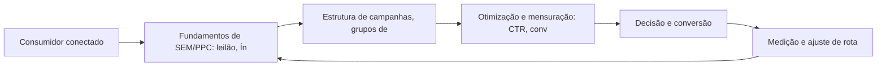

Google Ads e SEM: A Rota da Intenção de Compra

## Introdução
Bem-vindo a uma nova etapa da sua navegação pelo marketing digital. Este capítulo — *Google Ads e SEM: A Rota da Intenção de Compra* — integra a Parte III, *Busca — A Rota da Intenção*, e responde a uma pergunta prática: **fundamentos de sem/ppc: leilão, índice de qualidade e lances** — na prática, como isso se traduz em decisão e resultado?

Ao final, você será capaz de pera campanhas de busca (ppc): estrutura de conta, palavras-chave, lances, qualidade do anúncio e mensuração de roi.. Mais do que decorar conceitos, você vai enxergar a busca como rota de intenção declarada — e converter essa visão em plano, experimento e métrica.

No capítulo anterior, *Neuromarketing e a Psicologia da Decisão de Compra Online*, você aprendeu os conceitos que servem de plataforma para o que vem agora. Este capítulo retoma esse repertório e o aplica a um território novo — sem repetir o que já foi estabelecido, apenas usando como base.

O capítulo segue a estrutura das sete seções que organizam esta obra: primeiro a exposição conceitual, depois a ilustração, a técnica aplicada, o exercício de aplicação e a conclusão operacional.

## Entendendo o Assunto
### Fundamentos de SEM/PPC: leilão, Índice de Qualidade e lances

Quando o tema é *Google Ads e SEM: A Rota da Intenção de Compra*, o primeiro pilar — fundamentos de sem/ppc: leilão, índice de qualidade e lances — define o território conceitual. A otimização para mecanismos de busca começa pelo usuário: páginas rápidas, claras e úteis são a base sobre a qual qualquer técnica se apoia.

Na prática, fundamentos de sem/ppc: leilão, índice de qualidade e lances significa transformar a teoria em rotina operacional — exatamente o que *Google Ads e SEM: A Rota da Intenção de Compra* exige no dia a dia. A literatura de gestão é enfática: sem operacionalizar o conceito em checklist, responsável e métrica, ele permanece slide de apresentação. Por isso a Parte III propõe sempre o mesmo movimento: entender, traduzir em critério observável e decidir com dado.

### Estrutura de campanhas, grupos de anúncios e palavras-chave

O segundo pilar — estrutura de campanhas, grupos de anúncios e palavras-chave — conecta a estratégia à operação diária. Ferramentas de pesquisa de palavras-chave transformam volume em estratégia: dados de demanda sustentam a arquitetura de conteúdo e a alocação de verba. A experiência do consumidor se constrói na consistência entre canais e mensagens, e é essa consistência que transforma contato em relacionamento. Organizações que tratam cada canal como silo perdem o fio condutor da jornada; as que operam o pilar com disciplina reduzem atrito e aumentam a taxa de avanço entre etapas.

### Otimização e mensuração: CTR, conversões e ROI

Fechando o tripé, otimização e mensuração: ctr, conversões e roi é o que transforma a Parte III em vantagem mensurável. A busca segue como o canal de maior intenção do ambiente digital: quem pesquisa já declarou necessidade, e a SERP organiza a oferta por relevância algorítmica. O relato da indústria mostra que as empresas que sustentam resultado não são as que têm mais ferramentas, mas as que conseguem medir e ajustar a rota com frequência. A métrica certa, escolhida antes da campanha, vale mais do que qualquer ferramenta cara instalada depois do fato.

### O Eixo Transversal do Capítulo

O Google Ads opera em leilão: o Índice de Qualidade combina relevância, expectativa de CTR e experiência da página de destino — um ponto a mais reduz o custo por clique de forma mensurável. Esse eixo conecta os três pilares e explica por que o capítulo os trata como um sistema, não como uma lista: cada pilar reforça o outro, e a omissão de qualquer um deles produz estratégia manca. O capítulo seguinte retomará esse eixo com novas ferramentas, agora com o vocabulário já estabelecido aqui.

Em síntese, o capítulo opera em três níveis: o conceitual (Fundamentos de SEM/PPC: leilão, Índice de Qualidade e lances), o operacional (Estrutura de campanhas, grupos de anúncios e palavras-chave) e o estratégico (Otimização e mensuração: CTR, conversões e ROI). O leitor que dominar os três estará apto a aplicar a Parte III com autonomia. A evidência reunida nesta seção sustenta cada recomendação prática das seções seguintes.

## Na Prática
Vamos traduzir o capítulo em uma cena concreta, no contexto de *Google Ads e SEM: A Rota da Intenção de Compra*. Uma empresa de porte médio, com equipe enxuta e orçamento limitado, decide operar a Parte III desta obra, *Busca — A Rota da Intenção*. Na primeira semana, a equipe testa o conceito central do capítulo em um caso real: um cliente que pesquisou, comparou e decidiu comprar. O primeiro pilar — fundamentos de sem/ppc: leilão, índice de qualidade e lances — orienta o entendimento inicial do público; o segundo — estrutura de campanhas, grupos de anúncios e palavras-chave — guia a escolha da rota de comunicação; e o terceiro fecha com a medição do resultado.

O diagrama abaixo representa o fluxo operacional proposto pelo capítulo — do consumidor conectado à decisão e ao ajuste contínuo de rota, com o público e a plataforma específicos do tema no centro da navegação:



Observe o laço de retorno: a medição alimenta o próximo ciclo de campanha. Essa é a diferença estrutural entre campanha e sistema — a campanha termina quando o orçamento acaba; o sistema aprende e se ajusta a cada ciclo. No caso do tema *Google Ads e SEM: A Rota da Intenção de Compra*, esse laço é o que converte o investimento inicial em aprendizado acumulado para as próximas decisões.

## Ferramentas e Técnicas
### O Leilão de Busca em Números

Entender o leilão do Google Ads é entender um jogo de relevância e lance. O cálculo abaixo simula o custo real por clique a partir do Índice de Qualidade — mostrando por que qualidade barateia o clique.

```python
def custo_por_clique(ranking_seu: float, ranking_abaixo: float) -> float:
    """CPC = ranking do concorrente de baixo / seu ranking + R$0,01."""
    return round(ranking_abaixo / ranking_seu + 0.01, 2)

def ranking(qualidade: int, lance: float) -> float:
    """AdRank: qualidade x lance."""
    return qualidade * lance

# Mesmo lance, qualidades diferentes
for q in (4, 7, 10):
    rank = ranking(q, 2.00)
    cpc = custo_por_clique(rank, ranking(5, 2.00))
    print(f"Qualidade {q}: rank {rank:.0f} -> CPC R$ {cpc}")
```

O exercício demonstra o princípio central do SEM: melhorar o Índice de Qualidade reduz o custo por clique mais rápido do que reduzir o lance. A relevância é a estratégia de longo prazo do leilão.

O código acima é o núcleo técnico de *Google Ads e SEM: A Rota da Intenção de Compra*: validável, executável e adaptável ao contexto real do leitor. A prática recomendada é rodá-lo com dados próprios e usar a saída como insumo da próxima reunião de planejamento. Documentação oficial das plataformas reforça cada passo — da estrutura de campanhas à configuração de eventos. A leitura técnica deste capítulo complementa a exposição conceitual das seções anteriores e prepara os exercícios da seção seguinte.

## Exercício Rápido
Conhecimento sem aplicação é conteúdo; aplicação sem reflexão é rotina. No contexto de *Google Ads e SEM: A Rota da Intenção de Compra*, os exercícios abaixo fecham o capítulo e preparam o terreno do próximo:

1. Compare o CPC estimado de três palavras-chave transacionais do seu mercado em uma ferramenta de lances.
2. Escreva um snippet de anúncio com promessa, prova e CTA e avalie o Índice de Qualidade esperado.
3. Pesquise 20 palavras-chave do seu mercado e classifique cada uma por intenção (informacional, navegacional, transacional).
4. Audite a página inicial com o checklist de SEO on-page: title, meta description, headings e velocidade.

Dedique ao menos 30 minutos a um dos exercícios antes de avançar. O aprendizado desta obra é cumulativo: o mapa desenhado aqui será usado nos capítulos seguintes da Parte III e nas partes subsequentes.

## Para Levar daqui
O capítulo percorreu o território da Parte III, *Busca — A Rota da Intenção*, e deixou três aprendizados operacionais. Primeiro, o conceito central — *Google Ads e SEM: A Rota da Intenção de Compra* — é menos uma novidade e mais uma disciplina de execução. Segundo, a aplicação exige a tríade conceito, rota e métrica, sem pular etapas. Terceiro, o ajuste contínuo de rota, ilustrado no laço de retorno do diagrama, é o que separa campanhas pontuais de operações sustentáveis. O caminho percorrido desde *Neuromarketing e a Psicologia da Decisão de Compra Online* até aqui forma a base que o próximo passo vai usar. No próximo capítulo, *SEO: Conquistando Visibilidade Orgânica*, você avançará sobre o território vizinho levando as ferramentas exercitadas aqui.

Como navegador de marketing digital, você não decorou uma fórmula — incorporou um modo de operar: ler o território, escolher a rota com dados e ajustar o percurso quando o vento muda.
