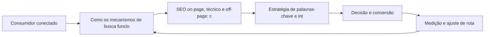

SEO: Conquistando Visibilidade Orgânica

## Introdução
Bem-vindo a uma nova etapa da sua navegação pelo marketing digital. Este capítulo — *SEO: Conquistando Visibilidade Orgânica* — integra a Parte III, *Busca — A Rota da Intenção*, e responde a uma pergunta prática: **como os mecanismos de busca funcionam: rastreamento, indexação e ranqueamento** — na prática, como isso se traduz em decisão e resultado?

Ao final, você será capaz de domina otimização para mecanismos de busca: intenção de busca, seo on-page e técnico, autoridade e conteúdo.. Mais do que decorar conceitos, você vai enxergar a busca como rota de intenção declarada — e converter essa visão em plano, experimento e métrica.

No capítulo anterior, *Google Ads e SEM: A Rota da Intenção de Compra*, você aprendeu os conceitos que servem de plataforma para o que vem agora. Este capítulo retoma esse repertório e o aplica a um território novo — sem repetir o que já foi estabelecido, apenas usando como base.

O capítulo segue a estrutura das sete seções que organizam esta obra: primeiro a exposição conceitual, depois a ilustração, a técnica aplicada, o exercício de aplicação e a conclusão operacional.

## Entendendo o Assunto
### Como os mecanismos de busca funcionam: rastreamento, indexação e ranqueamento

Quando o tema é *SEO: Conquistando Visibilidade Orgânica*, o primeiro pilar — como os mecanismos de busca funcionam: rastreamento, indexação e ranqueamento — define o território conceitual. O Google Ads opera em leilão: o Índice de Qualidade combina relevância, expectativa de CTR e experiência da página de destino — um ponto a mais reduz o custo por clique de forma mensurável.

Na prática, como os mecanismos de busca funcionam: rastreamento, indexação e ranqueamento significa transformar a teoria em rotina operacional — exatamente o que *SEO: Conquistando Visibilidade Orgânica* exige no dia a dia. A literatura de gestão é enfática: sem operacionalizar o conceito em checklist, responsável e métrica, ele permanece slide de apresentação. Por isso a Parte III propõe sempre o mesmo movimento: entender, traduzir em critério observável e decidir com dado.

### SEO on-page, técnico e off-page: conteúdo, Core Web Vitals e backlinks

O segundo pilar — seo on-page, técnico e off-page: conteúdo, core web vitals e backlinks — conecta a estratégia à operação diária. Mais da metade do tráfego qualificado dos sites vem de resultados orgânicos, tornando o SEO um ativo de longo prazo em vez de despesa pontual. A experiência do consumidor se constrói na consistência entre canais e mensagens, e é essa consistência que transforma contato em relacionamento. Organizações que tratam cada canal como silo perdem o fio condutor da jornada; as que operam o pilar com disciplina reduzem atrito e aumentam a taxa de avanço entre etapas.

### Estratégia de palavras-chave e intenção de busca

Fechando o tripé, estratégia de palavras-chave e intenção de busca é o que transforma a Parte III em vantagem mensurável. A busca generativa está reorganizando a SERP: o objetivo deixa de ser apenas ranquear e passa a ser citado como fonte pelas respostas sintetizadas por IA. O relato da indústria mostra que as empresas que sustentam resultado não são as que têm mais ferramentas, mas as que conseguem medir e ajustar a rota com frequência. A métrica certa, escolhida antes da campanha, vale mais do que qualquer ferramenta cara instalada depois do fato.

### O Eixo Transversal do Capítulo

A intenção de busca pode ser informacional, navegacional ou transacional — e cada tipo exige uma página, uma mensagem e uma métrica diferentes. Esse eixo conecta os três pilares e explica por que o capítulo os trata como um sistema, não como uma lista: cada pilar reforça o outro, e a omissão de qualquer um deles produz estratégia manca. O capítulo seguinte retomará esse eixo com novas ferramentas, agora com o vocabulário já estabelecido aqui.

Em síntese, o capítulo opera em três níveis: o conceitual (Como os mecanismos de busca funcionam: rastreamento, indexação e ranqueamento), o operacional (SEO on-page, técnico e off-page: conteúdo, Core Web Vitals e backlinks) e o estratégico (Estratégia de palavras-chave e intenção de busca). O leitor que dominar os três estará apto a aplicar a Parte III com autonomia. A evidência reunida nesta seção sustenta cada recomendação prática das seções seguintes.

## Na Prática
Vamos traduzir o capítulo em uma cena concreta, no contexto de *SEO: Conquistando Visibilidade Orgânica*. Uma empresa de porte médio, com equipe enxuta e orçamento limitado, decide operar a Parte III desta obra, *Busca — A Rota da Intenção*. Na primeira semana, a equipe testa o conceito central do capítulo em um caso real: um cliente que pesquisou, comparou e decidiu comprar. O primeiro pilar — como os mecanismos de busca funcionam: rastreamento, indexação e ranqueamento — orienta o entendimento inicial do público; o segundo — seo on-page, técnico e off-page: conteúdo, core web vitals e backlinks — guia a escolha da rota de comunicação; e o terceiro fecha com a medição do resultado.

O diagrama abaixo representa o fluxo operacional proposto pelo capítulo — do consumidor conectado à decisão e ao ajuste contínuo de rota, com o público e a plataforma específicos do tema no centro da navegação:



Observe o laço de retorno: a medição alimenta o próximo ciclo de campanha. Essa é a diferença estrutural entre campanha e sistema — a campanha termina quando o orçamento acaba; o sistema aprende e se ajusta a cada ciclo. No caso do tema *SEO: Conquistando Visibilidade Orgânica*, esse laço é o que converte o investimento inicial em aprendizado acumulado para as próximas decisões.

## Ferramentas e Técnicas
### O Leilão de Busca em Números

Entender o leilão do Google Ads é entender um jogo de relevância e lance. O cálculo abaixo simula o custo real por clique a partir do Índice de Qualidade — mostrando por que qualidade barateia o clique.

```python
def custo_por_clique(ranking_seu: float, ranking_abaixo: float) -> float:
    """CPC = ranking do concorrente de baixo / seu ranking + R$0,01."""
    return round(ranking_abaixo / ranking_seu + 0.01, 2)

def ranking(qualidade: int, lance: float) -> float:
    """AdRank: qualidade x lance."""
    return qualidade * lance

# Mesmo lance, qualidades diferentes
for q in (4, 7, 10):
    rank = ranking(q, 2.00)
    cpc = custo_por_clique(rank, ranking(5, 2.00))
    print(f"Qualidade {q}: rank {rank:.0f} -> CPC R$ {cpc}")
```

O exercício demonstra o princípio central do SEM: melhorar o Índice de Qualidade reduz o custo por clique mais rápido do que reduzir o lance. A relevância é a estratégia de longo prazo do leilão.

O código acima é o núcleo técnico de *SEO: Conquistando Visibilidade Orgânica*: validável, executável e adaptável ao contexto real do leitor. A prática recomendada é rodá-lo com dados próprios e usar a saída como insumo da próxima reunião de planejamento. Documentação oficial das plataformas reforça cada passo — da estrutura de campanhas à configuração de eventos. A leitura técnica deste capítulo complementa a exposição conceitual das seções anteriores e prepara os exercícios da seção seguinte.

## Exercício Rápido
Conhecimento sem aplicação é conteúdo; aplicação sem reflexão é rotina. No contexto de *SEO: Conquistando Visibilidade Orgânica*, os exercícios abaixo fecham o capítulo e preparam o terreno do próximo:

1. Audite a página inicial com o checklist de SEO on-page: title, meta description, headings e velocidade.
2. Rode uma campanha de busca com 3 grupos de anúncios e compare CTR e custo por clique entre eles.
3. Monte um mapa de palavras-chave por etapa do funil e aponte as lacunas de conteúdo da sua operação.
4. Teste uma busca no celular por um termo do seu mercado e registre o que aparece acima da dobra.

Dedique ao menos 30 minutos a um dos exercícios antes de avançar. O aprendizado desta obra é cumulativo: o mapa desenhado aqui será usado nos capítulos seguintes da Parte III e nas partes subsequentes.

## Para Levar daqui
O capítulo percorreu o território da Parte III, *Busca — A Rota da Intenção*, e deixou três aprendizados operacionais. Primeiro, o conceito central — *SEO: Conquistando Visibilidade Orgânica* — é menos uma novidade e mais uma disciplina de execução. Segundo, a aplicação exige a tríade conceito, rota e métrica, sem pular etapas. Terceiro, o ajuste contínuo de rota, ilustrado no laço de retorno do diagrama, é o que separa campanhas pontuais de operações sustentáveis. O caminho percorrido desde *Google Ads e SEM: A Rota da Intenção de Compra* até aqui forma a base que o próximo passo vai usar. No próximo capítulo, *Pesquisa de Palavras-Chave: Mapeando a Intenção do Viajante*, você avançará sobre o território vizinho levando as ferramentas exercitadas aqui.

Como navegador de marketing digital, você não decorou uma fórmula — incorporou um modo de operar: ler o território, escolher a rota com dados e ajustar o percurso quando o vento muda.
