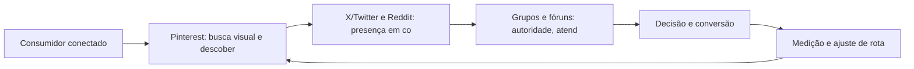

Plataformas de Nicho e Comunidades: Pinterest, X/Twitter, Reddit e Grupos

## Introdução
Bem-vindo a uma nova etapa da sua navegação pelo marketing digital. Este capítulo — *Plataformas de Nicho e Comunidades: Pinterest, X/Twitter, Reddit e Grupos* — integra a Parte IV, *Redes Sociais — Territórios de Comunidade*, e responde a uma pergunta prática: **pinterest: busca visual e descoberta de intenção** — na prática, como isso se traduz em decisão e resultado?

Ao final, você será capaz de xplora plataformas e espaços de comunidade como canais de alta intenção e engajamento profundo para públicos específicos.. Mais do que decorar conceitos, você vai enxergar cada plataforma como território com geografia própria — e converter essa visão em plano, experimento e métrica.

No capítulo anterior, *Tráfego Pago em Escala: Estrutura, Teste e Otimização de Campanhas*, você aprendeu os conceitos que servem de plataforma para o que vem agora. Este capítulo retoma esse repertório e o aplica a um território novo — sem repetir o que já foi estabelecido, apenas usando como base.

O capítulo segue a estrutura das sete seções que organizam esta obra: primeiro a exposição conceitual, depois a ilustração, a técnica aplicada, o exercício de aplicação e a conclusão operacional.

## Entendendo o Assunto
### Pinterest: busca visual e descoberta de intenção

Quando o tema é *Plataformas de Nicho e Comunidades: Pinterest, X/Twitter, Reddit e Grupos*, o primeiro pilar — pinterest: busca visual e descoberta de intenção — define o território conceitual. A Meta opera um dos maiores ecossistemas de anúncios do mundo, com segmentação por interesse, comportamento e públicos personalizados a partir de dados first-party.

Na prática, pinterest: busca visual e descoberta de intenção significa transformar a teoria em rotina operacional — exatamente o que *Plataformas de Nicho e Comunidades: Pinterest, X/Twitter, Reddit e Grupos* exige no dia a dia. A literatura de gestão é enfática: sem operacionalizar o conceito em checklist, responsável e métrica, ele permanece slide de apresentação. Por isso a Parte IV propõe sempre o mesmo movimento: entender, traduzir em critério observável e decidir com dado.

### X/Twitter e Reddit: presença em conversas e comunidades

O segundo pilar — x/twitter e reddit: presença em conversas e comunidades — conecta a estratégia à operação diária. O vídeo curto redefiniu o engajamento: plataformas de recomendação verticalizada distribuem conteúdo com base em retenção e loops de visualização. A experiência do consumidor se constrói na consistência entre canais e mensagens, e é essa consistência que transforma contato em relacionamento. Organizações que tratam cada canal como silo perdem o fio condutor da jornada; as que operam o pilar com disciplina reduzem atrito e aumentam a taxa de avanço entre etapas.

### Grupos e fóruns: autoridade, atendimento e escuta social

Fechando o tripé, grupos e fóruns: autoridade, atendimento e escuta social é o que transforma a Parte IV em vantagem mensurável. Para o B2B, o LinkedIn consolidou-se como o território de decisores: thought leadership, conteúdo de autoridade e campanhas por cargo e empresa. O relato da indústria mostra que as empresas que sustentam resultado não são as que têm mais ferramentas, mas as que conseguem medir e ajustar a rota com frequência. A métrica certa, escolhida antes da campanha, vale mais do que qualquer ferramenta cara instalada depois do fato.

### O Eixo Transversal do Capítulo

O social media marketing profissional opera com calendário editorial, tom de voz e métricas por publicação — não com postagens improvisadas. Esse eixo conecta os três pilares e explica por que o capítulo os trata como um sistema, não como uma lista: cada pilar reforça o outro, e a omissão de qualquer um deles produz estratégia manca. O capítulo seguinte retomará esse eixo com novas ferramentas, agora com o vocabulário já estabelecido aqui.

Em síntese, o capítulo opera em três níveis: o conceitual (Pinterest: busca visual e descoberta de intenção), o operacional (X/Twitter e Reddit: presença em conversas e comunidades) e o estratégico (Grupos e fóruns: autoridade, atendimento e escuta social). O leitor que dominar os três estará apto a aplicar a Parte IV com autonomia. A evidência reunida nesta seção sustenta cada recomendação prática das seções seguintes.

## Na Prática
Vamos traduzir o capítulo em uma cena concreta, no contexto de *Plataformas de Nicho e Comunidades: Pinterest, X/Twitter, Reddit e Grupos*. Uma empresa de porte médio, com equipe enxuta e orçamento limitado, decide operar a Parte IV desta obra, *Redes Sociais — Territórios de Comunidade*. Na primeira semana, a equipe testa o conceito central do capítulo em um caso real: um cliente que pesquisou, comparou e decidiu comprar. O primeiro pilar — pinterest: busca visual e descoberta de intenção — orienta o entendimento inicial do público; o segundo — x/twitter e reddit: presença em conversas e comunidades — guia a escolha da rota de comunicação; e o terceiro fecha com a medição do resultado.

O diagrama abaixo representa o fluxo operacional proposto pelo capítulo — do consumidor conectado à decisão e ao ajuste contínuo de rota, com o público e a plataforma específicos do tema no centro da navegação:



Observe o laço de retorno: a medição alimenta o próximo ciclo de campanha. Essa é a diferença estrutural entre campanha e sistema — a campanha termina quando o orçamento acaba; o sistema aprende e se ajusta a cada ciclo. No caso do tema *Plataformas de Nicho e Comunidades: Pinterest, X/Twitter, Reddit e Grupos*, esse laço é o que converte o investimento inicial em aprendizado acumulado para as próximas decisões.

## Ferramentas e Técnicas
### A Matriz de Criativos e Audiências

A operação de tráfego pago em escala é uma matriz: combinar criativos e audiências, medir e descartar o que não performa. O código abaixo simula a matriz e ordena os vencedores.

```python
import itertools

def matriz_planejamento(criativos, audiencias):
    """Retorna combinações com custo por conversão estimado."""
    celulas = []
    for c, a in itertools.product(criativos, audiencias):
        # CTR e CVR simulados: variam por combinação
        ctr = 0.01 + (hash(c) % 30) / 1000
        cvr = 0.02 + (hash(a) % 20) / 1000
        cpc = 1.20
        custo_conv = cpc / (ctr * cvr)
        celulas.append({"criativo": c, "audiencia": a,
                        "custo_conversao": round(custo_conv, 2)})
    return sorted(celulas, key=lambda x: x["custo_conversao"])

criativos = ["hook_beneficio", "hook_prova", "hook_historico"]
audiencias = ["novos", "engajados", "lookalike"]
for top in matriz_planejamento(criativos, audiencias)[:3]:
    print(top)
```

A matriz evita o erro mais comum: investir todo o orçamento na primeira combinação antes de deixar o algoritmo aprender. A disciplina vale para qualquer plataforma social.

O código acima é o núcleo técnico de *Plataformas de Nicho e Comunidades: Pinterest, X/Twitter, Reddit e Grupos*: validável, executável e adaptável ao contexto real do leitor. A prática recomendada é rodá-lo com dados próprios e usar a saída como insumo da próxima reunião de planejamento. Documentação oficial das plataformas reforça cada passo — da estrutura de campanhas à configuração de eventos. A leitura técnica deste capítulo complementa a exposição conceitual das seções anteriores e prepara os exercícios da seção seguinte.

## Exercício Rápido
Conhecimento sem aplicação é conteúdo; aplicação sem reflexão é rotina. No contexto de *Plataformas de Nicho e Comunidades: Pinterest, X/Twitter, Reddit e Grupos*, os exercícios abaixo fecham o capítulo e preparam o terreno do próximo:

1. Estruture uma campanha Meta com um público personalizado e um criativo de vídeo vertical.
2. Escolha uma plataforma de nicho do seu mercado e observe as conversas por uma semana antes de publicar.
3. Compare seu engajamento por plataforma na última quinzena e decida onde dobrar a aposta.
4. Produza um vídeo vertical de até 30 segundos com um hook nos primeiros 3 segundos.

Dedique ao menos 30 minutos a um dos exercícios antes de avançar. O aprendizado desta obra é cumulativo: o mapa desenhado aqui será usado nos capítulos seguintes da Parte IV e nas partes subsequentes.

## Para Levar daqui
O capítulo percorreu o território da Parte IV, *Redes Sociais — Territórios de Comunidade*, e deixou três aprendizados operacionais. Primeiro, o conceito central — *Plataformas de Nicho e Comunidades: Pinterest, X/Twitter, Reddit e Grupos* — é menos uma novidade e mais uma disciplina de execução. Segundo, a aplicação exige a tríade conceito, rota e métrica, sem pular etapas. Terceiro, o ajuste contínuo de rota, ilustrado no laço de retorno do diagrama, é o que separa campanhas pontuais de operações sustentáveis. O caminho percorrido desde *Tráfego Pago em Escala: Estrutura, Teste e Otimização de Campanhas* até aqui forma a base que o próximo passo vai usar. No próximo capítulo, *E-mail Marketing e Automação: O Relacionamento de Longo Prazo*, você avançará sobre o território vizinho levando as ferramentas exercitadas aqui.

Como navegador de marketing digital, você não decorou uma fórmula — incorporou um modo de operar: ler o território, escolher a rota com dados e ajustar o percurso quando o vento muda.
