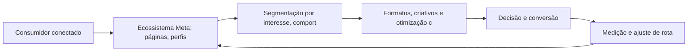
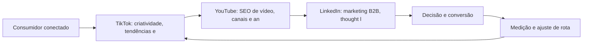
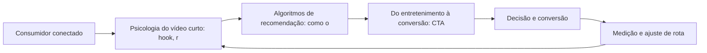
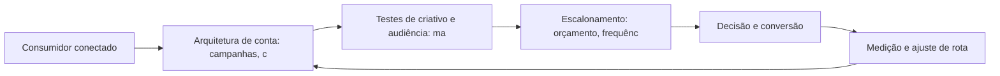
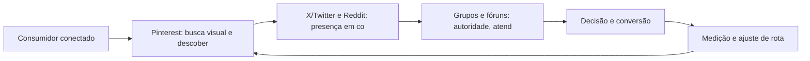

# Redes Sociais

Bem-vindo ao seu guia prático de marketing digital. Este e-book condensa, em linguagem direta e acionável, o que você precisa saber para navegar com confiança pelo território digital — conceitos, plataformas e estratégias que geram resultado.

Meta: Facebook e Instagram como Ecossistema de Negócio

## Introdução
Bem-vindo a uma nova etapa da sua navegação pelo marketing digital. Este capítulo — *Meta: Facebook e Instagram como Ecossistema de Negócio* — integra a Parte IV, *Redes Sociais — Territórios de Comunidade*, e responde a uma pergunta prática: **ecossistema meta: páginas, perfis e o pixel de conversão** — na prática, como isso se traduz em decisão e resultado?

Ao final, você será capaz de pera o gerenciador de anúncios da meta: segmentação, formatos, advantage+ e conversões no facebook e instagram.. Mais do que decorar conceitos, você vai enxergar cada plataforma como território com geografia própria — e converter essa visão em plano, experimento e métrica.

No capítulo anterior, *O Futuro da Busca: SGE e a Otimização para Respostas de IA*, você aprendeu os conceitos que servem de plataforma para o que vem agora. Este capítulo retoma esse repertório e o aplica a um território novo — sem repetir o que já foi estabelecido, apenas usando como base.

O capítulo segue a estrutura das sete seções que organizam esta obra: primeiro a exposição conceitual, depois a ilustração, a técnica aplicada, o exercício de aplicação e a conclusão operacional.

## Entendendo o Assunto
### Ecossistema Meta: páginas, perfis e o pixel de conversão

Quando o tema é *Meta: Facebook e Instagram como Ecossistema de Negócio*, o primeiro pilar — ecossistema meta: páginas, perfis e o pixel de conversão — define o território conceitual. A segmentação por interesse da Meta permite alcançar audiências que ainda não conhecem a marca, enquanto os públicos personalizados ativam quem já interagiu.

Na prática, ecossistema meta: páginas, perfis e o pixel de conversão significa transformar a teoria em rotina operacional — exatamente o que *Meta: Facebook e Instagram como Ecossistema de Negócio* exige no dia a dia. A literatura de gestão é enfática: sem operacionalizar o conceito em checklist, responsável e métrica, ele permanece slide de apresentação. Por isso a Parte IV propõe sempre o mesmo movimento: entender, traduzir em critério observável e decidir com dado.

### Segmentação por interesse, comportamento e públicos personalizados

O segundo pilar — segmentação por interesse, comportamento e públicos personalizados — conecta a estratégia à operação diária. No TikTok, a criatividade nativa supera a produção cara: vídeos autênticos com hooks fortes performam melhor que anúncios polidos sem contexto da plataforma. A experiência do consumidor se constrói na consistência entre canais e mensagens, e é essa consistência que transforma contato em relacionamento. Organizações que tratam cada canal como silo perdem o fio condutor da jornada; as que operam o pilar com disciplina reduzem atrito e aumentam a taxa de avanço entre etapas.

### Formatos, criativos e otimização com Advantage+

Fechando o tripé, formatos, criativos e otimização com advantage+ é o que transforma a Parte IV em vantagem mensurável. Plataformas de nicho oferecem densidade de audiência: em comunidades pequenas e engajadas, cada publicação alcança uma proporção muito maior do público-alvo. O relato da indústria mostra que as empresas que sustentam resultado não são as que têm mais ferramentas, mas as que conseguem medir e ajustar a rota com frequência. A métrica certa, escolhida antes da campanha, vale mais do que qualquer ferramenta cara instalada depois do fato.

### O Eixo Transversal do Capítulo

As redes sociais concentram o maior tempo de atenção diário do consumidor conectado, e as plataformas transformaram esse tempo em infraestrutura de anúncios com segmentação granular. Esse eixo conecta os três pilares e explica por que o capítulo os trata como um sistema, não como uma lista: cada pilar reforça o outro, e a omissão de qualquer um deles produz estratégia manca. O capítulo seguinte retomará esse eixo com novas ferramentas, agora com o vocabulário já estabelecido aqui.

Em síntese, o capítulo opera em três níveis: o conceitual (Ecossistema Meta: páginas, perfis e o pixel de conversão), o operacional (Segmentação por interesse, comportamento e públicos personalizados) e o estratégico (Formatos, criativos e otimização com Advantage+). O leitor que dominar os três estará apto a aplicar a Parte IV com autonomia. A evidência reunida nesta seção sustenta cada recomendação prática das seções seguintes.

## Na Prática
Vamos traduzir o capítulo em uma cena concreta, no contexto de *Meta: Facebook e Instagram como Ecossistema de Negócio*. Uma empresa de porte médio, com equipe enxuta e orçamento limitado, decide operar a Parte IV desta obra, *Redes Sociais — Territórios de Comunidade*. Na primeira semana, a equipe testa o conceito central do capítulo em um caso real: um cliente que pesquisou, comparou e decidiu comprar. O primeiro pilar — ecossistema meta: páginas, perfis e o pixel de conversão — orienta o entendimento inicial do público; o segundo — segmentação por interesse, comportamento e públicos personalizados — guia a escolha da rota de comunicação; e o terceiro fecha com a medição do resultado.

O diagrama abaixo representa o fluxo operacional proposto pelo capítulo — do consumidor conectado à decisão e ao ajuste contínuo de rota, com o público e a plataforma específicos do tema no centro da navegação:



Observe o laço de retorno: a medição alimenta o próximo ciclo de campanha. Essa é a diferença estrutural entre campanha e sistema — a campanha termina quando o orçamento acaba; o sistema aprende e se ajusta a cada ciclo. No caso do tema *Meta: Facebook e Instagram como Ecossistema de Negócio*, esse laço é o que converte o investimento inicial em aprendizado acumulado para as próximas decisões.

## Ferramentas e Técnicas
### A Matriz de Criativos e Audiências

A operação de tráfego pago em escala é uma matriz: combinar criativos e audiências, medir e descartar o que não performa. O código abaixo simula a matriz e ordena os vencedores.

```python
import itertools

def matriz_planejamento(criativos, audiencias):
    """Retorna combinações com custo por conversão estimado."""
    celulas = []
    for c, a in itertools.product(criativos, audiencias):
        # CTR e CVR simulados: variam por combinação
        ctr = 0.01 + (hash(c) % 30) / 1000
        cvr = 0.02 + (hash(a) % 20) / 1000
        cpc = 1.20
        custo_conv = cpc / (ctr * cvr)
        celulas.append({"criativo": c, "audiencia": a,
                        "custo_conversao": round(custo_conv, 2)})
    return sorted(celulas, key=lambda x: x["custo_conversao"])

criativos = ["hook_beneficio", "hook_prova", "hook_historico"]
audiencias = ["novos", "engajados", "lookalike"]
for top in matriz_planejamento(criativos, audiencias)[:3]:
    print(top)
```

A matriz evita o erro mais comum: investir todo o orçamento na primeira combinação antes de deixar o algoritmo aprender. A disciplina vale para qualquer plataforma social.

O código acima é o núcleo técnico de *Meta: Facebook e Instagram como Ecossistema de Negócio*: validável, executável e adaptável ao contexto real do leitor. A prática recomendada é rodá-lo com dados próprios e usar a saída como insumo da próxima reunião de planejamento. Documentação oficial das plataformas reforça cada passo — da estrutura de campanhas à configuração de eventos. A leitura técnica deste capítulo complementa a exposição conceitual das seções anteriores e prepara os exercícios da seção seguinte.

## Exercício Rápido
Conhecimento sem aplicação é conteúdo; aplicação sem reflexão é rotina. No contexto de *Meta: Facebook e Instagram como Ecossistema de Negócio*, os exercícios abaixo fecham o capítulo e preparam o terreno do próximo:

1. Liste três criadores do seu segmento e analise o que eles fazem no primeiro segundo dos vídeos.
2. Defina a frequência de publicação ideal para a sua capacidade real de produção de conteúdo.
3. Responda a comentários de clientes nas redes por uma semana e registre as perguntas recorrentes.
4. Defina o tom de voz da sua marca e produza 5 posts de teste em uma única plataforma.

Dedique ao menos 30 minutos a um dos exercícios antes de avançar. O aprendizado desta obra é cumulativo: o mapa desenhado aqui será usado nos capítulos seguintes da Parte IV e nas partes subsequentes.

## Para Levar daqui
O capítulo percorreu o território da Parte IV, *Redes Sociais — Territórios de Comunidade*, e deixou três aprendizados operacionais. Primeiro, o conceito central — *Meta: Facebook e Instagram como Ecossistema de Negócio* — é menos uma novidade e mais uma disciplina de execução. Segundo, a aplicação exige a tríade conceito, rota e métrica, sem pular etapas. Terceiro, o ajuste contínuo de rota, ilustrado no laço de retorno do diagrama, é o que separa campanhas pontuais de operações sustentáveis. O caminho percorrido desde *O Futuro da Busca: SGE e a Otimização para Respostas de IA* até aqui forma a base que o próximo passo vai usar. No próximo capítulo, *TikTok, YouTube e LinkedIn: Territórios Especializados*, você avançará sobre o território vizinho levando as ferramentas exercitadas aqui.

Como navegador de marketing digital, você não decorou uma fórmula — incorporou um modo de operar: ler o território, escolher a rota com dados e ajustar o percurso quando o vento muda.

TikTok, YouTube e LinkedIn: Territórios Especializados

## Introdução
Bem-vindo a uma nova etapa da sua navegação pelo marketing digital. Este capítulo — *TikTok, YouTube e LinkedIn: Territórios Especializados* — integra a Parte IV, *Redes Sociais — Territórios de Comunidade*, e responde a uma pergunta prática: **tiktok: criatividade, tendências e publicidade nativa** — na prática, como isso se traduz em decisão e resultado?

Ao final, você será capaz de ntende as particularidades de cada plataforma: vídeo curto (tiktok), vídeo longo e busca (youtube) e networking b2b (linkedin).. Mais do que decorar conceitos, você vai enxergar cada plataforma como território com geografia própria — e converter essa visão em plano, experimento e métrica.

No capítulo anterior, *Meta: Facebook e Instagram como Ecossistema de Negócio*, você aprendeu os conceitos que servem de plataforma para o que vem agora. Este capítulo retoma esse repertório e o aplica a um território novo — sem repetir o que já foi estabelecido, apenas usando como base.

O capítulo segue a estrutura das sete seções que organizam esta obra: primeiro a exposição conceitual, depois a ilustração, a técnica aplicada, o exercício de aplicação e a conclusão operacional.

## Entendendo o Assunto
### TikTok: criatividade, tendências e publicidade nativa

Quando o tema é *TikTok, YouTube e LinkedIn: Territórios Especializados*, o primeiro pilar — tiktok: criatividade, tendências e publicidade nativa — define o território conceitual. As redes sociais concentram o maior tempo de atenção diário do consumidor conectado, e as plataformas transformaram esse tempo em infraestrutura de anúncios com segmentação granular.

Na prática, tiktok: criatividade, tendências e publicidade nativa significa transformar a teoria em rotina operacional — exatamente o que *TikTok, YouTube e LinkedIn: Territórios Especializados* exige no dia a dia. A literatura de gestão é enfática: sem operacionalizar o conceito em checklist, responsável e métrica, ele permanece slide de apresentação. Por isso a Parte IV propõe sempre o mesmo movimento: entender, traduzir em critério observável e decidir com dado.

### YouTube: SEO de vídeo, canais e anúncios TrueView

O segundo pilar — youtube: seo de vídeo, canais e anúncios trueview — conecta a estratégia à operação diária. A Meta opera um dos maiores ecossistemas de anúncios do mundo, com segmentação por interesse, comportamento e públicos personalizados a partir de dados first-party. A experiência do consumidor se constrói na consistência entre canais e mensagens, e é essa consistência que transforma contato em relacionamento. Organizações que tratam cada canal como silo perdem o fio condutor da jornada; as que operam o pilar com disciplina reduzem atrito e aumentam a taxa de avanço entre etapas.

### LinkedIn: marketing B2B, thought leadership e campanhas

Fechando o tripé, linkedin: marketing b2b, thought leadership e campanhas é o que transforma a Parte IV em vantagem mensurável. O vídeo curto redefiniu o engajamento: plataformas de recomendação verticalizada distribuem conteúdo com base em retenção e loops de visualização. O relato da indústria mostra que as empresas que sustentam resultado não são as que têm mais ferramentas, mas as que conseguem medir e ajustar a rota com frequência. A métrica certa, escolhida antes da campanha, vale mais do que qualquer ferramenta cara instalada depois do fato.

### O Eixo Transversal do Capítulo

Para o B2B, o LinkedIn consolidou-se como o território de decisores: thought leadership, conteúdo de autoridade e campanhas por cargo e empresa. Esse eixo conecta os três pilares e explica por que o capítulo os trata como um sistema, não como uma lista: cada pilar reforça o outro, e a omissão de qualquer um deles produz estratégia manca. O capítulo seguinte retomará esse eixo com novas ferramentas, agora com o vocabulário já estabelecido aqui.

Em síntese, o capítulo opera em três níveis: o conceitual (TikTok: criatividade, tendências e publicidade nativa), o operacional (YouTube: SEO de vídeo, canais e anúncios TrueView) e o estratégico (LinkedIn: marketing B2B, thought leadership e campanhas). O leitor que dominar os três estará apto a aplicar a Parte IV com autonomia. A evidência reunida nesta seção sustenta cada recomendação prática das seções seguintes.

## Na Prática
Vamos traduzir o capítulo em uma cena concreta, no contexto de *TikTok, YouTube e LinkedIn: Territórios Especializados*. Uma empresa de porte médio, com equipe enxuta e orçamento limitado, decide operar a Parte IV desta obra, *Redes Sociais — Territórios de Comunidade*. Na primeira semana, a equipe testa o conceito central do capítulo em um caso real: um cliente que pesquisou, comparou e decidiu comprar. O primeiro pilar — tiktok: criatividade, tendências e publicidade nativa — orienta o entendimento inicial do público; o segundo — youtube: seo de vídeo, canais e anúncios trueview — guia a escolha da rota de comunicação; e o terceiro fecha com a medição do resultado.

O diagrama abaixo representa o fluxo operacional proposto pelo capítulo — do consumidor conectado à decisão e ao ajuste contínuo de rota, com o público e a plataforma específicos do tema no centro da navegação:



Observe o laço de retorno: a medição alimenta o próximo ciclo de campanha. Essa é a diferença estrutural entre campanha e sistema — a campanha termina quando o orçamento acaba; o sistema aprende e se ajusta a cada ciclo. No caso do tema *TikTok, YouTube e LinkedIn: Territórios Especializados*, esse laço é o que converte o investimento inicial em aprendizado acumulado para as próximas decisões.

## Ferramentas e Técnicas
### A Matriz de Criativos e Audiências

A operação de tráfego pago em escala é uma matriz: combinar criativos e audiências, medir e descartar o que não performa. O código abaixo simula a matriz e ordena os vencedores.

```python
import itertools

def matriz_planejamento(criativos, audiencias):
    """Retorna combinações com custo por conversão estimado."""
    celulas = []
    for c, a in itertools.product(criativos, audiencias):
        # CTR e CVR simulados: variam por combinação
        ctr = 0.01 + (hash(c) % 30) / 1000
        cvr = 0.02 + (hash(a) % 20) / 1000
        cpc = 1.20
        custo_conv = cpc / (ctr * cvr)
        celulas.append({"criativo": c, "audiencia": a,
                        "custo_conversao": round(custo_conv, 2)})
    return sorted(celulas, key=lambda x: x["custo_conversao"])

criativos = ["hook_beneficio", "hook_prova", "hook_historico"]
audiencias = ["novos", "engajados", "lookalike"]
for top in matriz_planejamento(criativos, audiencias)[:3]:
    print(top)
```

A matriz evita o erro mais comum: investir todo o orçamento na primeira combinação antes de deixar o algoritmo aprender. A disciplina vale para qualquer plataforma social.

O código acima é o núcleo técnico de *TikTok, YouTube e LinkedIn: Territórios Especializados*: validável, executável e adaptável ao contexto real do leitor. A prática recomendada é rodá-lo com dados próprios e usar a saída como insumo da próxima reunião de planejamento. Documentação oficial das plataformas reforça cada passo — da estrutura de campanhas à configuração de eventos. A leitura técnica deste capítulo complementa a exposição conceitual das seções anteriores e prepara os exercícios da seção seguinte.

## Exercício Rápido
Conhecimento sem aplicação é conteúdo; aplicação sem reflexão é rotina. No contexto de *TikTok, YouTube e LinkedIn: Territórios Especializados*, os exercícios abaixo fecham o capítulo e preparam o terreno do próximo:

1. Defina o tom de voz da sua marca e produza 5 posts de teste em uma única plataforma.
2. Estruture uma campanha Meta com um público personalizado e um criativo de vídeo vertical.
3. Escolha uma plataforma de nicho do seu mercado e observe as conversas por uma semana antes de publicar.
4. Compare seu engajamento por plataforma na última quinzena e decida onde dobrar a aposta.

Dedique ao menos 30 minutos a um dos exercícios antes de avançar. O aprendizado desta obra é cumulativo: o mapa desenhado aqui será usado nos capítulos seguintes da Parte IV e nas partes subsequentes.

## Para Levar daqui
O capítulo percorreu o território da Parte IV, *Redes Sociais — Territórios de Comunidade*, e deixou três aprendizados operacionais. Primeiro, o conceito central — *TikTok, YouTube e LinkedIn: Territórios Especializados* — é menos uma novidade e mais uma disciplina de execução. Segundo, a aplicação exige a tríade conceito, rota e métrica, sem pular etapas. Terceiro, o ajuste contínuo de rota, ilustrado no laço de retorno do diagrama, é o que separa campanhas pontuais de operações sustentáveis. O caminho percorrido desde *Meta: Facebook e Instagram como Ecossistema de Negócio* até aqui forma a base que o próximo passo vai usar. No próximo capítulo, *Estratégia de Vídeo Vertical: Reels, Shorts e Conteúdo de Formato Curto*, você avançará sobre o território vizinho levando as ferramentas exercitadas aqui.

Como navegador de marketing digital, você não decorou uma fórmula — incorporou um modo de operar: ler o território, escolher a rota com dados e ajustar o percurso quando o vento muda.

Estratégia de Vídeo Vertical: Reels, Shorts e Conteúdo de Formato Curto

## Introdução
Bem-vindo a uma nova etapa da sua navegação pelo marketing digital. Este capítulo — *Estratégia de Vídeo Vertical: Reels, Shorts e Conteúdo de Formato Curto* — integra a Parte IV, *Redes Sociais — Territórios de Comunidade*, e responde a uma pergunta prática: **psicologia do vídeo curto: hook, retenção e loop** — na prática, como isso se traduz em decisão e resultado?

Ao final, você será capaz de domina a produção e distribuição de vídeo vertical: formatos, hooks, algoritmos de recomendação e conversão dentro das plataformas.. Mais do que decorar conceitos, você vai enxergar cada plataforma como território com geografia própria — e converter essa visão em plano, experimento e métrica.

No capítulo anterior, *TikTok, YouTube e LinkedIn: Territórios Especializados*, você aprendeu os conceitos que servem de plataforma para o que vem agora. Este capítulo retoma esse repertório e o aplica a um território novo — sem repetir o que já foi estabelecido, apenas usando como base.

O capítulo segue a estrutura das sete seções que organizam esta obra: primeiro a exposição conceitual, depois a ilustração, a técnica aplicada, o exercício de aplicação e a conclusão operacional.

## Entendendo o Assunto
### Psicologia do vídeo curto: hook, retenção e loop

Quando o tema é *Estratégia de Vídeo Vertical: Reels, Shorts e Conteúdo de Formato Curto*, o primeiro pilar — psicologia do vídeo curto: hook, retenção e loop — define o território conceitual. Para o B2B, o LinkedIn consolidou-se como o território de decisores: thought leadership, conteúdo de autoridade e campanhas por cargo e empresa.

Na prática, psicologia do vídeo curto: hook, retenção e loop significa transformar a teoria em rotina operacional — exatamente o que *Estratégia de Vídeo Vertical: Reels, Shorts e Conteúdo de Formato Curto* exige no dia a dia. A literatura de gestão é enfática: sem operacionalizar o conceito em checklist, responsável e métrica, ele permanece slide de apresentação. Por isso a Parte IV propõe sempre o mesmo movimento: entender, traduzir em critério observável e decidir com dado.

### Algoritmos de recomendação: como o conteúdo viraliza

O segundo pilar — algoritmos de recomendação: como o conteúdo viraliza — conecta a estratégia à operação diária. O social media marketing profissional opera com calendário editorial, tom de voz e métricas por publicação — não com postagens improvisadas. A experiência do consumidor se constrói na consistência entre canais e mensagens, e é essa consistência que transforma contato em relacionamento. Organizações que tratam cada canal como silo perdem o fio condutor da jornada; as que operam o pilar com disciplina reduzem atrito e aumentam a taxa de avanço entre etapas.

### Do entretenimento à conversão: CTA e funil dentro da plataforma

Fechando o tripé, do entretenimento à conversão: cta e funil dentro da plataforma é o que transforma a Parte IV em vantagem mensurável. A segmentação por interesse da Meta permite alcançar audiências que ainda não conhecem a marca, enquanto os públicos personalizados ativam quem já interagiu. O relato da indústria mostra que as empresas que sustentam resultado não são as que têm mais ferramentas, mas as que conseguem medir e ajustar a rota com frequência. A métrica certa, escolhida antes da campanha, vale mais do que qualquer ferramenta cara instalada depois do fato.

### O Eixo Transversal do Capítulo

No TikTok, a criatividade nativa supera a produção cara: vídeos autênticos com hooks fortes performam melhor que anúncios polidos sem contexto da plataforma. Esse eixo conecta os três pilares e explica por que o capítulo os trata como um sistema, não como uma lista: cada pilar reforça o outro, e a omissão de qualquer um deles produz estratégia manca. O capítulo seguinte retomará esse eixo com novas ferramentas, agora com o vocabulário já estabelecido aqui.

Em síntese, o capítulo opera em três níveis: o conceitual (Psicologia do vídeo curto: hook, retenção e loop), o operacional (Algoritmos de recomendação: como o conteúdo viraliza) e o estratégico (Do entretenimento à conversão: CTA e funil dentro da plataforma). O leitor que dominar os três estará apto a aplicar a Parte IV com autonomia. A evidência reunida nesta seção sustenta cada recomendação prática das seções seguintes.

## Na Prática
Vamos traduzir o capítulo em uma cena concreta, no contexto de *Estratégia de Vídeo Vertical: Reels, Shorts e Conteúdo de Formato Curto*. Uma empresa de porte médio, com equipe enxuta e orçamento limitado, decide operar a Parte IV desta obra, *Redes Sociais — Territórios de Comunidade*. Na primeira semana, a equipe testa o conceito central do capítulo em um caso real: um cliente que pesquisou, comparou e decidiu comprar. O primeiro pilar — psicologia do vídeo curto: hook, retenção e loop — orienta o entendimento inicial do público; o segundo — algoritmos de recomendação: como o conteúdo viraliza — guia a escolha da rota de comunicação; e o terceiro fecha com a medição do resultado.

O diagrama abaixo representa o fluxo operacional proposto pelo capítulo — do consumidor conectado à decisão e ao ajuste contínuo de rota, com o público e a plataforma específicos do tema no centro da navegação:



Observe o laço de retorno: a medição alimenta o próximo ciclo de campanha. Essa é a diferença estrutural entre campanha e sistema — a campanha termina quando o orçamento acaba; o sistema aprende e se ajusta a cada ciclo. No caso do tema *Estratégia de Vídeo Vertical: Reels, Shorts e Conteúdo de Formato Curto*, esse laço é o que converte o investimento inicial em aprendizado acumulado para as próximas decisões.

## Ferramentas e Técnicas
### A Matriz de Criativos e Audiências

A operação de tráfego pago em escala é uma matriz: combinar criativos e audiências, medir e descartar o que não performa. O código abaixo simula a matriz e ordena os vencedores.

```python
import itertools

def matriz_planejamento(criativos, audiencias):
    """Retorna combinações com custo por conversão estimado."""
    celulas = []
    for c, a in itertools.product(criativos, audiencias):
        # CTR e CVR simulados: variam por combinação
        ctr = 0.01 + (hash(c) % 30) / 1000
        cvr = 0.02 + (hash(a) % 20) / 1000
        cpc = 1.20
        custo_conv = cpc / (ctr * cvr)
        celulas.append({"criativo": c, "audiencia": a,
                        "custo_conversao": round(custo_conv, 2)})
    return sorted(celulas, key=lambda x: x["custo_conversao"])

criativos = ["hook_beneficio", "hook_prova", "hook_historico"]
audiencias = ["novos", "engajados", "lookalike"]
for top in matriz_planejamento(criativos, audiencias)[:3]:
    print(top)
```

A matriz evita o erro mais comum: investir todo o orçamento na primeira combinação antes de deixar o algoritmo aprender. A disciplina vale para qualquer plataforma social.

O código acima é o núcleo técnico de *Estratégia de Vídeo Vertical: Reels, Shorts e Conteúdo de Formato Curto*: validável, executável e adaptável ao contexto real do leitor. A prática recomendada é rodá-lo com dados próprios e usar a saída como insumo da próxima reunião de planejamento. Documentação oficial das plataformas reforça cada passo — da estrutura de campanhas à configuração de eventos. A leitura técnica deste capítulo complementa a exposição conceitual das seções anteriores e prepara os exercícios da seção seguinte.

## Exercício Rápido
Conhecimento sem aplicação é conteúdo; aplicação sem reflexão é rotina. No contexto de *Estratégia de Vídeo Vertical: Reels, Shorts e Conteúdo de Formato Curto*, os exercícios abaixo fecham o capítulo e preparam o terreno do próximo:

1. Compare seu engajamento por plataforma na última quinzena e decida onde dobrar a aposta.
2. Produza um vídeo vertical de até 30 segundos com um hook nos primeiros 3 segundos.
3. Liste três criadores do seu segmento e analise o que eles fazem no primeiro segundo dos vídeos.
4. Defina a frequência de publicação ideal para a sua capacidade real de produção de conteúdo.

Dedique ao menos 30 minutos a um dos exercícios antes de avançar. O aprendizado desta obra é cumulativo: o mapa desenhado aqui será usado nos capítulos seguintes da Parte IV e nas partes subsequentes.

## Para Levar daqui
O capítulo percorreu o território da Parte IV, *Redes Sociais — Territórios de Comunidade*, e deixou três aprendizados operacionais. Primeiro, o conceito central — *Estratégia de Vídeo Vertical: Reels, Shorts e Conteúdo de Formato Curto* — é menos uma novidade e mais uma disciplina de execução. Segundo, a aplicação exige a tríade conceito, rota e métrica, sem pular etapas. Terceiro, o ajuste contínuo de rota, ilustrado no laço de retorno do diagrama, é o que separa campanhas pontuais de operações sustentáveis. O caminho percorrido desde *TikTok, YouTube e LinkedIn: Territórios Especializados* até aqui forma a base que o próximo passo vai usar. No próximo capítulo, *Tráfego Pago em Escala: Estrutura, Teste e Otimização de Campanhas*, você avançará sobre o território vizinho levando as ferramentas exercitadas aqui.

Como navegador de marketing digital, você não decorou uma fórmula — incorporou um modo de operar: ler o território, escolher a rota com dados e ajustar o percurso quando o vento muda.

Tráfego Pago em Escala: Estrutura, Teste e Otimização de Campanhas

## Introdução
Bem-vindo a uma nova etapa da sua navegação pelo marketing digital. Este capítulo — *Tráfego Pago em Escala: Estrutura, Teste e Otimização de Campanhas* — integra a Parte IV, *Redes Sociais — Territórios de Comunidade*, e responde a uma pergunta prática: **arquitetura de conta: campanhas, conjuntos e estrutura por objetivo** — na prática, como isso se traduz em decisão e resultado?

Ao final, você será capaz de strutura operação de mídia paga escalável: arquitetura de contas, testes de criativo, escalonamento de orçamento e regras de otimização.. Mais do que decorar conceitos, você vai enxergar cada plataforma como território com geografia própria — e converter essa visão em plano, experimento e métrica.

No capítulo anterior, *Estratégia de Vídeo Vertical: Reels, Shorts e Conteúdo de Formato Curto*, você aprendeu os conceitos que servem de plataforma para o que vem agora. Este capítulo retoma esse repertório e o aplica a um território novo — sem repetir o que já foi estabelecido, apenas usando como base.

O capítulo segue a estrutura das sete seções que organizam esta obra: primeiro a exposição conceitual, depois a ilustração, a técnica aplicada, o exercício de aplicação e a conclusão operacional.

## Entendendo o Assunto
### Arquitetura de conta: campanhas, conjuntos e estrutura por objetivo

Quando o tema é *Tráfego Pago em Escala: Estrutura, Teste e Otimização de Campanhas*, o primeiro pilar — arquitetura de conta: campanhas, conjuntos e estrutura por objetivo — define o território conceitual. No TikTok, a criatividade nativa supera a produção cara: vídeos autênticos com hooks fortes performam melhor que anúncios polidos sem contexto da plataforma.

Na prática, arquitetura de conta: campanhas, conjuntos e estrutura por objetivo significa transformar a teoria em rotina operacional — exatamente o que *Tráfego Pago em Escala: Estrutura, Teste e Otimização de Campanhas* exige no dia a dia. A literatura de gestão é enfática: sem operacionalizar o conceito em checklist, responsável e métrica, ele permanece slide de apresentação. Por isso a Parte IV propõe sempre o mesmo movimento: entender, traduzir em critério observável e decidir com dado.

### Testes de criativo e audiência: matriz e aprendizado

O segundo pilar — testes de criativo e audiência: matriz e aprendizado — conecta a estratégia à operação diária. Plataformas de nicho oferecem densidade de audiência: em comunidades pequenas e engajadas, cada publicação alcança uma proporção muito maior do público-alvo. A experiência do consumidor se constrói na consistência entre canais e mensagens, e é essa consistência que transforma contato em relacionamento. Organizações que tratam cada canal como silo perdem o fio condutor da jornada; as que operam o pilar com disciplina reduzem atrito e aumentam a taxa de avanço entre etapas.

### Escalonamento: orçamento, frequência e saturação

Fechando o tripé, escalonamento: orçamento, frequência e saturação é o que transforma a Parte IV em vantagem mensurável. As redes sociais concentram o maior tempo de atenção diário do consumidor conectado, e as plataformas transformaram esse tempo em infraestrutura de anúncios com segmentação granular. O relato da indústria mostra que as empresas que sustentam resultado não são as que têm mais ferramentas, mas as que conseguem medir e ajustar a rota com frequência. A métrica certa, escolhida antes da campanha, vale mais do que qualquer ferramenta cara instalada depois do fato.

### O Eixo Transversal do Capítulo

A Meta opera um dos maiores ecossistemas de anúncios do mundo, com segmentação por interesse, comportamento e públicos personalizados a partir de dados first-party. Esse eixo conecta os três pilares e explica por que o capítulo os trata como um sistema, não como uma lista: cada pilar reforça o outro, e a omissão de qualquer um deles produz estratégia manca. O capítulo seguinte retomará esse eixo com novas ferramentas, agora com o vocabulário já estabelecido aqui.

Em síntese, o capítulo opera em três níveis: o conceitual (Arquitetura de conta: campanhas, conjuntos e estrutura por objetivo), o operacional (Testes de criativo e audiência: matriz e aprendizado) e o estratégico (Escalonamento: orçamento, frequência e saturação). O leitor que dominar os três estará apto a aplicar a Parte IV com autonomia. A evidência reunida nesta seção sustenta cada recomendação prática das seções seguintes.

## Na Prática
Vamos traduzir o capítulo em uma cena concreta, no contexto de *Tráfego Pago em Escala: Estrutura, Teste e Otimização de Campanhas*. Uma empresa de porte médio, com equipe enxuta e orçamento limitado, decide operar a Parte IV desta obra, *Redes Sociais — Territórios de Comunidade*. Na primeira semana, a equipe testa o conceito central do capítulo em um caso real: um cliente que pesquisou, comparou e decidiu comprar. O primeiro pilar — arquitetura de conta: campanhas, conjuntos e estrutura por objetivo — orienta o entendimento inicial do público; o segundo — testes de criativo e audiência: matriz e aprendizado — guia a escolha da rota de comunicação; e o terceiro fecha com a medição do resultado.

O diagrama abaixo representa o fluxo operacional proposto pelo capítulo — do consumidor conectado à decisão e ao ajuste contínuo de rota, com o público e a plataforma específicos do tema no centro da navegação:



Observe o laço de retorno: a medição alimenta o próximo ciclo de campanha. Essa é a diferença estrutural entre campanha e sistema — a campanha termina quando o orçamento acaba; o sistema aprende e se ajusta a cada ciclo. No caso do tema *Tráfego Pago em Escala: Estrutura, Teste e Otimização de Campanhas*, esse laço é o que converte o investimento inicial em aprendizado acumulado para as próximas decisões.

## Ferramentas e Técnicas
### A Matriz de Criativos e Audiências

A operação de tráfego pago em escala é uma matriz: combinar criativos e audiências, medir e descartar o que não performa. O código abaixo simula a matriz e ordena os vencedores.

```python
import itertools

def matriz_planejamento(criativos, audiencias):
    """Retorna combinações com custo por conversão estimado."""
    celulas = []
    for c, a in itertools.product(criativos, audiencias):
        # CTR e CVR simulados: variam por combinação
        ctr = 0.01 + (hash(c) % 30) / 1000
        cvr = 0.02 + (hash(a) % 20) / 1000
        cpc = 1.20
        custo_conv = cpc / (ctr * cvr)
        celulas.append({"criativo": c, "audiencia": a,
                        "custo_conversao": round(custo_conv, 2)})
    return sorted(celulas, key=lambda x: x["custo_conversao"])

criativos = ["hook_beneficio", "hook_prova", "hook_historico"]
audiencias = ["novos", "engajados", "lookalike"]
for top in matriz_planejamento(criativos, audiencias)[:3]:
    print(top)
```

A matriz evita o erro mais comum: investir todo o orçamento na primeira combinação antes de deixar o algoritmo aprender. A disciplina vale para qualquer plataforma social.

O código acima é o núcleo técnico de *Tráfego Pago em Escala: Estrutura, Teste e Otimização de Campanhas*: validável, executável e adaptável ao contexto real do leitor. A prática recomendada é rodá-lo com dados próprios e usar a saída como insumo da próxima reunião de planejamento. Documentação oficial das plataformas reforça cada passo — da estrutura de campanhas à configuração de eventos. A leitura técnica deste capítulo complementa a exposição conceitual das seções anteriores e prepara os exercícios da seção seguinte.

## Exercício Rápido
Conhecimento sem aplicação é conteúdo; aplicação sem reflexão é rotina. No contexto de *Tráfego Pago em Escala: Estrutura, Teste e Otimização de Campanhas*, os exercícios abaixo fecham o capítulo e preparam o terreno do próximo:

1. Defina a frequência de publicação ideal para a sua capacidade real de produção de conteúdo.
2. Responda a comentários de clientes nas redes por uma semana e registre as perguntas recorrentes.
3. Defina o tom de voz da sua marca e produza 5 posts de teste em uma única plataforma.
4. Estruture uma campanha Meta com um público personalizado e um criativo de vídeo vertical.

Dedique ao menos 30 minutos a um dos exercícios antes de avançar. O aprendizado desta obra é cumulativo: o mapa desenhado aqui será usado nos capítulos seguintes da Parte IV e nas partes subsequentes.

## Para Levar daqui
O capítulo percorreu o território da Parte IV, *Redes Sociais — Territórios de Comunidade*, e deixou três aprendizados operacionais. Primeiro, o conceito central — *Tráfego Pago em Escala: Estrutura, Teste e Otimização de Campanhas* — é menos uma novidade e mais uma disciplina de execução. Segundo, a aplicação exige a tríade conceito, rota e métrica, sem pular etapas. Terceiro, o ajuste contínuo de rota, ilustrado no laço de retorno do diagrama, é o que separa campanhas pontuais de operações sustentáveis. O caminho percorrido desde *Estratégia de Vídeo Vertical: Reels, Shorts e Conteúdo de Formato Curto* até aqui forma a base que o próximo passo vai usar. No próximo capítulo, *Plataformas de Nicho e Comunidades: Pinterest, X/Twitter, Reddit e Grupos*, você avançará sobre o território vizinho levando as ferramentas exercitadas aqui.

Como navegador de marketing digital, você não decorou uma fórmula — incorporou um modo de operar: ler o território, escolher a rota com dados e ajustar o percurso quando o vento muda.

Plataformas de Nicho e Comunidades: Pinterest, X/Twitter, Reddit e Grupos

## Introdução
Bem-vindo a uma nova etapa da sua navegação pelo marketing digital. Este capítulo — *Plataformas de Nicho e Comunidades: Pinterest, X/Twitter, Reddit e Grupos* — integra a Parte IV, *Redes Sociais — Territórios de Comunidade*, e responde a uma pergunta prática: **pinterest: busca visual e descoberta de intenção** — na prática, como isso se traduz em decisão e resultado?

Ao final, você será capaz de xplora plataformas e espaços de comunidade como canais de alta intenção e engajamento profundo para públicos específicos.. Mais do que decorar conceitos, você vai enxergar cada plataforma como território com geografia própria — e converter essa visão em plano, experimento e métrica.

No capítulo anterior, *Tráfego Pago em Escala: Estrutura, Teste e Otimização de Campanhas*, você aprendeu os conceitos que servem de plataforma para o que vem agora. Este capítulo retoma esse repertório e o aplica a um território novo — sem repetir o que já foi estabelecido, apenas usando como base.

O capítulo segue a estrutura das sete seções que organizam esta obra: primeiro a exposição conceitual, depois a ilustração, a técnica aplicada, o exercício de aplicação e a conclusão operacional.

## Entendendo o Assunto
### Pinterest: busca visual e descoberta de intenção

Quando o tema é *Plataformas de Nicho e Comunidades: Pinterest, X/Twitter, Reddit e Grupos*, o primeiro pilar — pinterest: busca visual e descoberta de intenção — define o território conceitual. A Meta opera um dos maiores ecossistemas de anúncios do mundo, com segmentação por interesse, comportamento e públicos personalizados a partir de dados first-party.

Na prática, pinterest: busca visual e descoberta de intenção significa transformar a teoria em rotina operacional — exatamente o que *Plataformas de Nicho e Comunidades: Pinterest, X/Twitter, Reddit e Grupos* exige no dia a dia. A literatura de gestão é enfática: sem operacionalizar o conceito em checklist, responsável e métrica, ele permanece slide de apresentação. Por isso a Parte IV propõe sempre o mesmo movimento: entender, traduzir em critério observável e decidir com dado.

### X/Twitter e Reddit: presença em conversas e comunidades

O segundo pilar — x/twitter e reddit: presença em conversas e comunidades — conecta a estratégia à operação diária. O vídeo curto redefiniu o engajamento: plataformas de recomendação verticalizada distribuem conteúdo com base em retenção e loops de visualização. A experiência do consumidor se constrói na consistência entre canais e mensagens, e é essa consistência que transforma contato em relacionamento. Organizações que tratam cada canal como silo perdem o fio condutor da jornada; as que operam o pilar com disciplina reduzem atrito e aumentam a taxa de avanço entre etapas.

### Grupos e fóruns: autoridade, atendimento e escuta social

Fechando o tripé, grupos e fóruns: autoridade, atendimento e escuta social é o que transforma a Parte IV em vantagem mensurável. Para o B2B, o LinkedIn consolidou-se como o território de decisores: thought leadership, conteúdo de autoridade e campanhas por cargo e empresa. O relato da indústria mostra que as empresas que sustentam resultado não são as que têm mais ferramentas, mas as que conseguem medir e ajustar a rota com frequência. A métrica certa, escolhida antes da campanha, vale mais do que qualquer ferramenta cara instalada depois do fato.

### O Eixo Transversal do Capítulo

O social media marketing profissional opera com calendário editorial, tom de voz e métricas por publicação — não com postagens improvisadas. Esse eixo conecta os três pilares e explica por que o capítulo os trata como um sistema, não como uma lista: cada pilar reforça o outro, e a omissão de qualquer um deles produz estratégia manca. O capítulo seguinte retomará esse eixo com novas ferramentas, agora com o vocabulário já estabelecido aqui.

Em síntese, o capítulo opera em três níveis: o conceitual (Pinterest: busca visual e descoberta de intenção), o operacional (X/Twitter e Reddit: presença em conversas e comunidades) e o estratégico (Grupos e fóruns: autoridade, atendimento e escuta social). O leitor que dominar os três estará apto a aplicar a Parte IV com autonomia. A evidência reunida nesta seção sustenta cada recomendação prática das seções seguintes.

## Na Prática
Vamos traduzir o capítulo em uma cena concreta, no contexto de *Plataformas de Nicho e Comunidades: Pinterest, X/Twitter, Reddit e Grupos*. Uma empresa de porte médio, com equipe enxuta e orçamento limitado, decide operar a Parte IV desta obra, *Redes Sociais — Territórios de Comunidade*. Na primeira semana, a equipe testa o conceito central do capítulo em um caso real: um cliente que pesquisou, comparou e decidiu comprar. O primeiro pilar — pinterest: busca visual e descoberta de intenção — orienta o entendimento inicial do público; o segundo — x/twitter e reddit: presença em conversas e comunidades — guia a escolha da rota de comunicação; e o terceiro fecha com a medição do resultado.

O diagrama abaixo representa o fluxo operacional proposto pelo capítulo — do consumidor conectado à decisão e ao ajuste contínuo de rota, com o público e a plataforma específicos do tema no centro da navegação:



Observe o laço de retorno: a medição alimenta o próximo ciclo de campanha. Essa é a diferença estrutural entre campanha e sistema — a campanha termina quando o orçamento acaba; o sistema aprende e se ajusta a cada ciclo. No caso do tema *Plataformas de Nicho e Comunidades: Pinterest, X/Twitter, Reddit e Grupos*, esse laço é o que converte o investimento inicial em aprendizado acumulado para as próximas decisões.

## Ferramentas e Técnicas
### A Matriz de Criativos e Audiências

A operação de tráfego pago em escala é uma matriz: combinar criativos e audiências, medir e descartar o que não performa. O código abaixo simula a matriz e ordena os vencedores.

```python
import itertools

def matriz_planejamento(criativos, audiencias):
    """Retorna combinações com custo por conversão estimado."""
    celulas = []
    for c, a in itertools.product(criativos, audiencias):
        # CTR e CVR simulados: variam por combinação
        ctr = 0.01 + (hash(c) % 30) / 1000
        cvr = 0.02 + (hash(a) % 20) / 1000
        cpc = 1.20
        custo_conv = cpc / (ctr * cvr)
        celulas.append({"criativo": c, "audiencia": a,
                        "custo_conversao": round(custo_conv, 2)})
    return sorted(celulas, key=lambda x: x["custo_conversao"])

criativos = ["hook_beneficio", "hook_prova", "hook_historico"]
audiencias = ["novos", "engajados", "lookalike"]
for top in matriz_planejamento(criativos, audiencias)[:3]:
    print(top)
```

A matriz evita o erro mais comum: investir todo o orçamento na primeira combinação antes de deixar o algoritmo aprender. A disciplina vale para qualquer plataforma social.

O código acima é o núcleo técnico de *Plataformas de Nicho e Comunidades: Pinterest, X/Twitter, Reddit e Grupos*: validável, executável e adaptável ao contexto real do leitor. A prática recomendada é rodá-lo com dados próprios e usar a saída como insumo da próxima reunião de planejamento. Documentação oficial das plataformas reforça cada passo — da estrutura de campanhas à configuração de eventos. A leitura técnica deste capítulo complementa a exposição conceitual das seções anteriores e prepara os exercícios da seção seguinte.

## Exercício Rápido
Conhecimento sem aplicação é conteúdo; aplicação sem reflexão é rotina. No contexto de *Plataformas de Nicho e Comunidades: Pinterest, X/Twitter, Reddit e Grupos*, os exercícios abaixo fecham o capítulo e preparam o terreno do próximo:

1. Estruture uma campanha Meta com um público personalizado e um criativo de vídeo vertical.
2. Escolha uma plataforma de nicho do seu mercado e observe as conversas por uma semana antes de publicar.
3. Compare seu engajamento por plataforma na última quinzena e decida onde dobrar a aposta.
4. Produza um vídeo vertical de até 30 segundos com um hook nos primeiros 3 segundos.

Dedique ao menos 30 minutos a um dos exercícios antes de avançar. O aprendizado desta obra é cumulativo: o mapa desenhado aqui será usado nos capítulos seguintes da Parte IV e nas partes subsequentes.

## Para Levar daqui
O capítulo percorreu o território da Parte IV, *Redes Sociais — Territórios de Comunidade*, e deixou três aprendizados operacionais. Primeiro, o conceito central — *Plataformas de Nicho e Comunidades: Pinterest, X/Twitter, Reddit e Grupos* — é menos uma novidade e mais uma disciplina de execução. Segundo, a aplicação exige a tríade conceito, rota e métrica, sem pular etapas. Terceiro, o ajuste contínuo de rota, ilustrado no laço de retorno do diagrama, é o que separa campanhas pontuais de operações sustentáveis. O caminho percorrido desde *Tráfego Pago em Escala: Estrutura, Teste e Otimização de Campanhas* até aqui forma a base que o próximo passo vai usar. No próximo capítulo, *E-mail Marketing e Automação: O Relacionamento de Longo Prazo*, você avançará sobre o território vizinho levando as ferramentas exercitadas aqui.

Como navegador de marketing digital, você não decorou uma fórmula — incorporou um modo de operar: ler o território, escolher a rota com dados e ajustar o percurso quando o vento muda.


## Sua Próxima Parada

Você chegou ao fim deste e-book, mas a navegação continua. Se este guia te ajudou a enxergar o território com mais clareza, siga explorando os demais volumes desta coleção e coloque em prática, ainda esta semana, pelo menos um dos exercícios que você leu. Compartilhe o que funcionou, corrija o que não funcionou e mantenha o hábito de decidir com dados. O melhor marketing digital é o que se aprende fazendo.
