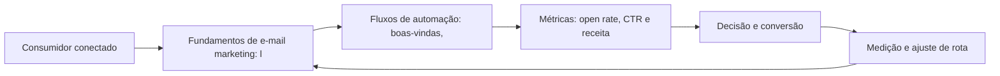

E-mail Marketing e Automação: O Relacionamento de Longo Prazo

## Introdução
Bem-vindo a uma nova etapa da sua navegação pelo marketing digital. Este capítulo — *E-mail Marketing e Automação: O Relacionamento de Longo Prazo* — integra a Parte V, *Relacionamento — A Rota da Retenção*, e responde a uma pergunta prática: **fundamentos de e-mail marketing: listas, entregabilidade e consentimento** — na prática, como isso se traduz em decisão e resultado?

Ao final, você será capaz de constrói estratégias de e-mail e lifecycle marketing: listas, segmentação, automação e métricas de entrega e conversão.. Mais do que decorar conceitos, você vai enxergar o relacionamento como rota de retenção e recompra — e converter essa visão em plano, experimento e métrica.

No capítulo anterior, *Plataformas de Nicho e Comunidades: Pinterest, X/Twitter, Reddit e Grupos*, você aprendeu os conceitos que servem de plataforma para o que vem agora. Este capítulo retoma esse repertório e o aplica a um território novo — sem repetir o que já foi estabelecido, apenas usando como base.

O capítulo segue a estrutura das sete seções que organizam esta obra: primeiro a exposição conceitual, depois a ilustração, a técnica aplicada, o exercício de aplicação e a conclusão operacional.

## Entendendo o Assunto
### Fundamentos de e-mail marketing: listas, entregabilidade e consentimento

Quando o tema é *E-mail Marketing e Automação: O Relacionamento de Longo Prazo*, o primeiro pilar — fundamentos de e-mail marketing: listas, entregabilidade e consentimento — define o território conceitual. A entregabilidade é a métrica que antecede todas as outras no e-mail: uma lista mal higienizada destrói reputação de remetente e enterra campanhas.

Na prática, fundamentos de e-mail marketing: listas, entregabilidade e consentimento significa transformar a teoria em rotina operacional — exatamente o que *E-mail Marketing e Automação: O Relacionamento de Longo Prazo* exige no dia a dia. A literatura de gestão é enfática: sem operacionalizar o conceito em checklist, responsável e métrica, ele permanece slide de apresentação. Por isso a Parte V propõe sempre o mesmo movimento: entender, traduzir em critério observável e decidir com dado.

### Fluxos de automação: boas-vindas, carrinho abandonado e nutrição

O segundo pilar — fluxos de automação: boas-vindas, carrinho abandonado e nutrição — conecta a estratégia à operação diária. Automação de marketing não é disparo em massa: é sequência condicional em que cada próximo passo depende do comportamento do assinante. A experiência do consumidor se constrói na consistência entre canais e mensagens, e é essa consistência que transforma contato em relacionamento. Organizações que tratam cada canal como silo perdem o fio condutor da jornada; as que operam o pilar com disciplina reduzem atrito e aumentam a taxa de avanço entre etapas.

### Métricas: open rate, CTR e receita por e-mail

Fechando o tripé, métricas: open rate, ctr e receita por e-mail é o que transforma a Parte V em vantagem mensurável. Conteúdo que educa reduz o custo de venda: o leitor que chega aquecido pelo material de apoio precisa de menos argumentação comercial no momento da decisão. O relato da indústria mostra que as empresas que sustentam resultado não são as que têm mais ferramentas, mas as que conseguem medir e ajustar a rota com frequência. A métrica certa, escolhida antes da campanha, vale mais do que qualquer ferramenta cara instalada depois do fato.

### O Eixo Transversal do Capítulo

Programas de fidelização bem desenhados aumentam a frequência de compra e transformam clientes satisfeitos em defensores ativos da marca. Esse eixo conecta os três pilares e explica por que o capítulo os trata como um sistema, não como uma lista: cada pilar reforça o outro, e a omissão de qualquer um deles produz estratégia manca. O capítulo seguinte retomará esse eixo com novas ferramentas, agora com o vocabulário já estabelecido aqui.

Em síntese, o capítulo opera em três níveis: o conceitual (Fundamentos de e-mail marketing: listas, entregabilidade e consentimento), o operacional (Fluxos de automação: boas-vindas, carrinho abandonado e nutrição) e o estratégico (Métricas: open rate, CTR e receita por e-mail). O leitor que dominar os três estará apto a aplicar a Parte V com autonomia. A evidência reunida nesta seção sustenta cada recomendação prática das seções seguintes.

## Na Prática
Vamos traduzir o capítulo em uma cena concreta, no contexto de *E-mail Marketing e Automação: O Relacionamento de Longo Prazo*. Uma empresa de porte médio, com equipe enxuta e orçamento limitado, decide operar a Parte V desta obra, *Relacionamento — A Rota da Retenção*. Na primeira semana, a equipe testa o conceito central do capítulo em um caso real: um cliente que pesquisou, comparou e decidiu comprar. O primeiro pilar — fundamentos de e-mail marketing: listas, entregabilidade e consentimento — orienta o entendimento inicial do público; o segundo — fluxos de automação: boas-vindas, carrinho abandonado e nutrição — guia a escolha da rota de comunicação; e o terceiro fecha com a medição do resultado.

O diagrama abaixo representa o fluxo operacional proposto pelo capítulo — do consumidor conectado à decisão e ao ajuste contínuo de rota, com o público e a plataforma específicos do tema no centro da navegação:



Observe o laço de retorno: a medição alimenta o próximo ciclo de campanha. Essa é a diferença estrutural entre campanha e sistema — a campanha termina quando o orçamento acaba; o sistema aprende e se ajusta a cada ciclo. No caso do tema *E-mail Marketing e Automação: O Relacionamento de Longo Prazo*, esse laço é o que converte o investimento inicial em aprendizado acumulado para as próximas decisões.

## Ferramentas e Técnicas
### A Segmentação do Relacionamento

O e-mail e a automação só performam com segmentação. O código abaixo classifica assinantes por engajamento e sugere a jornada de nutrição de cada grupo.

```python
def segmentar(aberturas: int, cliques: int, dias_ativos: int) -> str:
    """Classifica assinante por nível de engajamento."""
    if aberturas >= 5 and cliques >= 2:
        return "quente"      # prioridade: oferta e advocacy
    if aberturas >= 2:
        return "morno"       # prioridade: nutrição com conteúdo
    if dias_ativos > 60:
        return "frio"        # prioridade: reativação com incentivo
    return "novo"            # prioridade: onboarding e boas-vindas

for a, c, d in [(8, 3, 40), (3, 1, 90), (1, 0, 200), (0, 0, 5)]:
    print(segmentar(a, c, d))
```

Cada segmento recebe uma sequência diferente — o mesmo conteúdo enviado a todos é a definição operacional de spam irrelevante. O consentimento governa toda a operação.

O código acima é o núcleo técnico de *E-mail Marketing e Automação: O Relacionamento de Longo Prazo*: validável, executável e adaptável ao contexto real do leitor. A prática recomendada é rodá-lo com dados próprios e usar a saída como insumo da próxima reunião de planejamento. Documentação oficial das plataformas reforça cada passo — da estrutura de campanhas à configuração de eventos. A leitura técnica deste capítulo complementa a exposição conceitual das seções anteriores e prepara os exercícios da seção seguinte.

## Exercício Rápido
Conhecimento sem aplicação é conteúdo; aplicação sem reflexão é rotina. No contexto de *E-mail Marketing e Automação: O Relacionamento de Longo Prazo*, os exercícios abaixo fecham o capítulo e preparam o terreno do próximo:

1. Escreva um e-mail de reativação para assinantes inativos e defina o incentivo e a métrica de sucesso.
2. Mapeie os cinco gatilhos de automação de maior valor para o seu modelo de negócio.
3. Audite a entregabilidade: SPF, DKIM e a reputação do domínio remetente nos últimos 30 dias.
4. Produza um conteúdo pilar longo e derive dele 10 variações para outros canais.

Dedique ao menos 30 minutos a um dos exercícios antes de avançar. O aprendizado desta obra é cumulativo: o mapa desenhado aqui será usado nos capítulos seguintes da Parte V e nas partes subsequentes.

## Para Levar daqui
O capítulo percorreu o território da Parte V, *Relacionamento — A Rota da Retenção*, e deixou três aprendizados operacionais. Primeiro, o conceito central — *E-mail Marketing e Automação: O Relacionamento de Longo Prazo* — é menos uma novidade e mais uma disciplina de execução. Segundo, a aplicação exige a tríade conceito, rota e métrica, sem pular etapas. Terceiro, o ajuste contínuo de rota, ilustrado no laço de retorno do diagrama, é o que separa campanhas pontuais de operações sustentáveis. O caminho percorrido desde *Plataformas de Nicho e Comunidades: Pinterest, X/Twitter, Reddit e Grupos* até aqui forma a base que o próximo passo vai usar. No próximo capítulo, *Content Marketing e Inbound: Atração Baseada em Valor*, você avançará sobre o território vizinho levando as ferramentas exercitadas aqui.

Como navegador de marketing digital, você não decorou uma fórmula — incorporou um modo de operar: ler o território, escolher a rota com dados e ajustar o percurso quando o vento muda.
