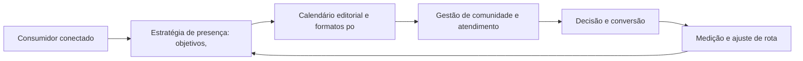
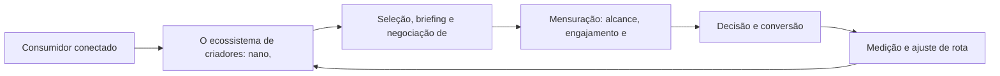
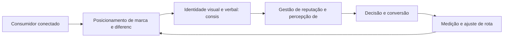
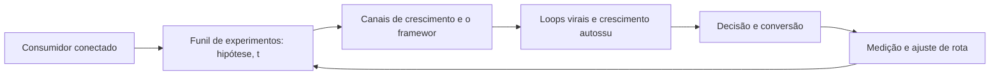
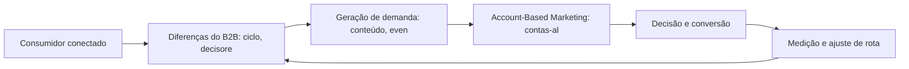

# Estratégias Sociais

Bem-vindo ao seu guia prático de marketing digital. Este e-book condensa, em linguagem direta e acionável, o que você precisa saber para navegar com confiança pelo território digital — conceitos, plataformas e estratégias que geram resultado.

Social Media Marketing: Construindo Comunidade e Autoridade

## Introdução
Bem-vindo a uma nova etapa da sua navegação pelo marketing digital. Este capítulo — *Social Media Marketing: Construindo Comunidade e Autoridade* — integra a Parte VI, *Estratégias Sociais — Rotas de Autoridade*, e responde a uma pergunta prática: **estratégia de presença: objetivos, plataformas e tom de voz** — na prática, como isso se traduz em decisão e resultado?

Ao final, você será capaz de pera presença social: estratégia por plataforma, calendário editorial, engajamento e gestão de comunidade.. Mais do que decorar conceitos, você vai enxergar a autoridade como moeda transferível e acumulável — e converter essa visão em plano, experimento e métrica.

No capítulo anterior, *Copywriting Digital: Escrevendo para Converter em Cada Canal*, você aprendeu os conceitos que servem de plataforma para o que vem agora. Este capítulo retoma esse repertório e o aplica a um território novo — sem repetir o que já foi estabelecido, apenas usando como base.

O capítulo segue a estrutura das sete seções que organizam esta obra: primeiro a exposição conceitual, depois a ilustração, a técnica aplicada, o exercício de aplicação e a conclusão operacional.

## Entendendo o Assunto
### Estratégia de presença: objetivos, plataformas e tom de voz

Quando o tema é *Social Media Marketing: Construindo Comunidade e Autoridade*, o primeiro pilar — estratégia de presença: objetivos, plataformas e tom de voz — define o território conceitual. No B2B, o Account-Based Marketing concentra esforço em contas-alvo com personalização de conteúdo e alinhamento comercial, encurtando o ciclo de venda.

Na prática, estratégia de presença: objetivos, plataformas e tom de voz significa transformar a teoria em rotina operacional — exatamente o que *Social Media Marketing: Construindo Comunidade e Autoridade* exige no dia a dia. A literatura de gestão é enfática: sem operacionalizar o conceito em checklist, responsável e métrica, ele permanece slide de apresentação. Por isso a Parte VI propõe sempre o mesmo movimento: entender, traduzir em critério observável e decidir com dado.

### Calendário editorial e formatos por plataforma

O segundo pilar — calendário editorial e formatos por plataforma — conecta a estratégia à operação diária. A marca é o resultado acumulado de todas as interações: branding digital exige coerência entre identidade, voz e comportamento em cada território. A experiência do consumidor se constrói na consistência entre canais e mensagens, e é essa consistência que transforma contato em relacionamento. Organizações que tratam cada canal como silo perdem o fio condutor da jornada; as que operam o pilar com disciplina reduzem atrito e aumentam a taxa de avanço entre etapas.

### Gestão de comunidade e atendimento social

Fechando o tripé, gestão de comunidade e atendimento social é o que transforma a Parte VI em vantagem mensurável. O social selling transforma vendedores em criadores: profissionais que publicam autoridade constroem pipelines mais previsíveis no B2B. O relato da indústria mostra que as empresas que sustentam resultado não são as que têm mais ferramentas, mas as que conseguem medir e ajustar a rota com frequência. A métrica certa, escolhida antes da campanha, vale mais do que qualquer ferramenta cara instalada depois do fato.

### O Eixo Transversal do Capítulo

Canais avaliados pelo mesmo critério — custo de aquisição e potencial de escala — permitem decidir onde dobrar a aposta e onde parar. Esse eixo conecta os três pilares e explica por que o capítulo os trata como um sistema, não como uma lista: cada pilar reforça o outro, e a omissão de qualquer um deles produz estratégia manca. O capítulo seguinte retomará esse eixo com novas ferramentas, agora com o vocabulário já estabelecido aqui.

Em síntese, o capítulo opera em três níveis: o conceitual (Estratégia de presença: objetivos, plataformas e tom de voz), o operacional (Calendário editorial e formatos por plataforma) e o estratégico (Gestão de comunidade e atendimento social). O leitor que dominar os três estará apto a aplicar a Parte VI com autonomia. A evidência reunida nesta seção sustenta cada recomendação prática das seções seguintes.

## Na Prática
Vamos traduzir o capítulo em uma cena concreta, no contexto de *Social Media Marketing: Construindo Comunidade e Autoridade*. Uma empresa de porte médio, com equipe enxuta e orçamento limitado, decide operar a Parte VI desta obra, *Estratégias Sociais — Rotas de Autoridade*. Na primeira semana, a equipe testa o conceito central do capítulo em um caso real: um cliente que pesquisou, comparou e decidiu comprar. O primeiro pilar — estratégia de presença: objetivos, plataformas e tom de voz — orienta o entendimento inicial do público; o segundo — calendário editorial e formatos por plataforma — guia a escolha da rota de comunicação; e o terceiro fecha com a medição do resultado.

O diagrama abaixo representa o fluxo operacional proposto pelo capítulo — do consumidor conectado à decisão e ao ajuste contínuo de rota, com o público e a plataforma específicos do tema no centro da navegação:



Observe o laço de retorno: a medição alimenta o próximo ciclo de campanha. Essa é a diferença estrutural entre campanha e sistema — a campanha termina quando o orçamento acaba; o sistema aprende e se ajusta a cada ciclo. No caso do tema *Social Media Marketing: Construindo Comunidade e Autoridade*, esse laço é o que converte o investimento inicial em aprendizado acumulado para as próximas decisões.

## Ferramentas e Técnicas
### A Priorização de Canais com Pontuação

Growth e estratégia social exigem escolha: não dá para operar todos os canais ao mesmo tempo. O código abaixo pontua canais por custo de aquisição, fit e escala potencial.

```python
def priorizar_canais(canais):
    """Pontua 0-10 em custo, fit e escala; ordena por score."""
    for c in canais:
        custo, fit, escala = c["custo"], c["fit"], c["escala"]
        c["score"] = round((10 - custo) * 0.4 + fit * 0.35 + escala * 0.25, 2)
    return sorted(canais, key=lambda c: c["score"], reverse=True)

canais = [
    {"nome": "SEO", "custo": 3, "fit": 9, "escala": 9},
    {"nome": "Influência", "custo": 6, "fit": 7, "escala": 5},
    {"nome": "Mídia paga", "custo": 7, "fit": 8, "escala": 8},
]
for c in priorizar_canais(canais):
    print(c)
```

A priorização não é definitiva — é hipótese a validar com experimento. Canal barato e com fit perfeito merece o primeiro ciclo de teste.

O código acima é o núcleo técnico de *Social Media Marketing: Construindo Comunidade e Autoridade*: validável, executável e adaptável ao contexto real do leitor. A prática recomendada é rodá-lo com dados próprios e usar a saída como insumo da próxima reunião de planejamento. Documentação oficial das plataformas reforça cada passo — da estrutura de campanhas à configuração de eventos. A leitura técnica deste capítulo complementa a exposição conceitual das seções anteriores e prepara os exercícios da seção seguinte.

## Exercício Rápido
Conhecimento sem aplicação é conteúdo; aplicação sem reflexão é rotina. No contexto de *Social Media Marketing: Construindo Comunidade e Autoridade*, os exercícios abaixo fecham o capítulo e preparam o terreno do próximo:

1. Defina o posicionamento da sua marca em uma frase e teste a coerência dele em 5 posts publicados.
2. Monte a lista de 20 contas-alvo B2B e escreva um conteúdo personalizado para as 3 prioritárias.
3. Formule uma hipótese de experimento de crescimento com métrica primária e prazo de 30 dias.
4. Defina o protocolo de resposta para críticas públicas: quem responde, com que tom e em quanto tempo.

Dedique ao menos 30 minutos a um dos exercícios antes de avançar. O aprendizado desta obra é cumulativo: o mapa desenhado aqui será usado nos capítulos seguintes da Parte VI e nas partes subsequentes.

## Para Levar daqui
O capítulo percorreu o território da Parte VI, *Estratégias Sociais — Rotas de Autoridade*, e deixou três aprendizados operacionais. Primeiro, o conceito central — *Social Media Marketing: Construindo Comunidade e Autoridade* — é menos uma novidade e mais uma disciplina de execução. Segundo, a aplicação exige a tríade conceito, rota e métrica, sem pular etapas. Terceiro, o ajuste contínuo de rota, ilustrado no laço de retorno do diagrama, é o que separa campanhas pontuais de operações sustentáveis. O caminho percorrido desde *Copywriting Digital: Escrevendo para Converter em Cada Canal* até aqui forma a base que o próximo passo vai usar. No próximo capítulo, *Marketing de Influência: Autoridade Transferida*, você avançará sobre o território vizinho levando as ferramentas exercitadas aqui.

Como navegador de marketing digital, você não decorou uma fórmula — incorporou um modo de operar: ler o território, escolher a rota com dados e ajustar o percurso quando o vento muda.

Marketing de Influência: Autoridade Transferida

## Introdução
Bem-vindo a uma nova etapa da sua navegação pelo marketing digital. Este capítulo — *Marketing de Influência: Autoridade Transferida* — integra a Parte VI, *Estratégias Sociais — Rotas de Autoridade*, e responde a uma pergunta prática: **o ecossistema de criadores: nano, micro, macro e mega influenciadores** — na prática, como isso se traduz em decisão e resultado?

Ao final, você será capaz de planeja campanhas com criadores de conteúdo: seleção, negociação, formato e mensuração de roi.. Mais do que decorar conceitos, você vai enxergar a autoridade como moeda transferível e acumulável — e converter essa visão em plano, experimento e métrica.

No capítulo anterior, *Social Media Marketing: Construindo Comunidade e Autoridade*, você aprendeu os conceitos que servem de plataforma para o que vem agora. Este capítulo retoma esse repertório e o aplica a um território novo — sem repetir o que já foi estabelecido, apenas usando como base.

O capítulo segue a estrutura das sete seções que organizam esta obra: primeiro a exposição conceitual, depois a ilustração, a técnica aplicada, o exercício de aplicação e a conclusão operacional.

## Entendendo o Assunto
### O ecossistema de criadores: nano, micro, macro e mega influenciadores

Quando o tema é *Marketing de Influência: Autoridade Transferida*, o primeiro pilar — o ecossistema de criadores: nano, micro, macro e mega influenciadores — define o território conceitual. Canais avaliados pelo mesmo critério — custo de aquisição e potencial de escala — permitem decidir onde dobrar a aposta e onde parar.

Na prática, o ecossistema de criadores: nano, micro, macro e mega influenciadores significa transformar a teoria em rotina operacional — exatamente o que *Marketing de Influência: Autoridade Transferida* exige no dia a dia. A literatura de gestão é enfática: sem operacionalizar o conceito em checklist, responsável e métrica, ele permanece slide de apresentação. Por isso a Parte VI propõe sempre o mesmo movimento: entender, traduzir em critério observável e decidir com dado.

### Seleção, briefing e negociação de parcerias

O segundo pilar — seleção, briefing e negociação de parcerias — conecta a estratégia à operação diária. A autoridade se acumula com consistência: poucos canais bem operados superam muitos canais mal operados em retorno sobre o esforço. A experiência do consumidor se constrói na consistência entre canais e mensagens, e é essa consistência que transforma contato em relacionamento. Organizações que tratam cada canal como silo perdem o fio condutor da jornada; as que operam o pilar com disciplina reduzem atrito e aumentam a taxa de avanço entre etapas.

### Mensuração: alcance, engajamento e conversão atribuída

Fechando o tripé, mensuração: alcance, engajamento e conversão atribuída é o que transforma a Parte VI em vantagem mensurável. A presença social consistente constrói autoridade: marcas com calendário editorial e tom de voz definidos geram mais engajamento por publicação e mais recall na decisão de compra. O relato da indústria mostra que as empresas que sustentam resultado não são as que têm mais ferramentas, mas as que conseguem medir e ajustar a rota com frequência. A métrica certa, escolhida antes da campanha, vale mais do que qualquer ferramenta cara instalada depois do fato.

### O Eixo Transversal do Capítulo

O marketing de influência transfere confiança: criadores de nicho com audiências menores e mais engajadas superam, em conversão atribuída, celebridades de alcance massivo. Esse eixo conecta os três pilares e explica por que o capítulo os trata como um sistema, não como uma lista: cada pilar reforça o outro, e a omissão de qualquer um deles produz estratégia manca. O capítulo seguinte retomará esse eixo com novas ferramentas, agora com o vocabulário já estabelecido aqui.

Em síntese, o capítulo opera em três níveis: o conceitual (O ecossistema de criadores: nano, micro, macro e mega influenciadores), o operacional (Seleção, briefing e negociação de parcerias) e o estratégico (Mensuração: alcance, engajamento e conversão atribuída). O leitor que dominar os três estará apto a aplicar a Parte VI com autonomia. A evidência reunida nesta seção sustenta cada recomendação prática das seções seguintes.

## Na Prática
Vamos traduzir o capítulo em uma cena concreta, no contexto de *Marketing de Influência: Autoridade Transferida*. Uma empresa de porte médio, com equipe enxuta e orçamento limitado, decide operar a Parte VI desta obra, *Estratégias Sociais — Rotas de Autoridade*. Na primeira semana, a equipe testa o conceito central do capítulo em um caso real: um cliente que pesquisou, comparou e decidiu comprar. O primeiro pilar — o ecossistema de criadores: nano, micro, macro e mega influenciadores — orienta o entendimento inicial do público; o segundo — seleção, briefing e negociação de parcerias — guia a escolha da rota de comunicação; e o terceiro fecha com a medição do resultado.

O diagrama abaixo representa o fluxo operacional proposto pelo capítulo — do consumidor conectado à decisão e ao ajuste contínuo de rota, com o público e a plataforma específicos do tema no centro da navegação:



Observe o laço de retorno: a medição alimenta o próximo ciclo de campanha. Essa é a diferença estrutural entre campanha e sistema — a campanha termina quando o orçamento acaba; o sistema aprende e se ajusta a cada ciclo. No caso do tema *Marketing de Influência: Autoridade Transferida*, esse laço é o que converte o investimento inicial em aprendizado acumulado para as próximas decisões.

## Ferramentas e Técnicas
### A Priorização de Canais com Pontuação

Growth e estratégia social exigem escolha: não dá para operar todos os canais ao mesmo tempo. O código abaixo pontua canais por custo de aquisição, fit e escala potencial.

```python
def priorizar_canais(canais):
    """Pontua 0-10 em custo, fit e escala; ordena por score."""
    for c in canais:
        custo, fit, escala = c["custo"], c["fit"], c["escala"]
        c["score"] = round((10 - custo) * 0.4 + fit * 0.35 + escala * 0.25, 2)
    return sorted(canais, key=lambda c: c["score"], reverse=True)

canais = [
    {"nome": "SEO", "custo": 3, "fit": 9, "escala": 9},
    {"nome": "Influência", "custo": 6, "fit": 7, "escala": 5},
    {"nome": "Mídia paga", "custo": 7, "fit": 8, "escala": 8},
]
for c in priorizar_canais(canais):
    print(c)
```

A priorização não é definitiva — é hipótese a validar com experimento. Canal barato e com fit perfeito merece o primeiro ciclo de teste.

O código acima é o núcleo técnico de *Marketing de Influência: Autoridade Transferida*: validável, executável e adaptável ao contexto real do leitor. A prática recomendada é rodá-lo com dados próprios e usar a saída como insumo da próxima reunião de planejamento. Documentação oficial das plataformas reforça cada passo — da estrutura de campanhas à configuração de eventos. A leitura técnica deste capítulo complementa a exposição conceitual das seções anteriores e prepara os exercícios da seção seguinte.

## Exercício Rápido
Conhecimento sem aplicação é conteúdo; aplicação sem reflexão é rotina. No contexto de *Marketing de Influência: Autoridade Transferida*, os exercícios abaixo fecham o capítulo e preparam o terreno do próximo:

1. Defina o protocolo de resposta para críticas públicas: quem responde, com que tom e em quanto tempo.
2. Compare o custo por lead entre duas estratégias sociais da última quinzena e escolha a próxima aposta.
3. Priorize 5 canais de crescimento para o seu negócio usando o critério de custo de aquisição e escala.
4. Selecione 3 criadores candidatos para uma parceria e avalie alcance real, engajamento e fit de audiência.

Dedique ao menos 30 minutos a um dos exercícios antes de avançar. O aprendizado desta obra é cumulativo: o mapa desenhado aqui será usado nos capítulos seguintes da Parte VI e nas partes subsequentes.

## Para Levar daqui
O capítulo percorreu o território da Parte VI, *Estratégias Sociais — Rotas de Autoridade*, e deixou três aprendizados operacionais. Primeiro, o conceito central — *Marketing de Influência: Autoridade Transferida* — é menos uma novidade e mais uma disciplina de execução. Segundo, a aplicação exige a tríade conceito, rota e métrica, sem pular etapas. Terceiro, o ajuste contínuo de rota, ilustrado no laço de retorno do diagrama, é o que separa campanhas pontuais de operações sustentáveis. O caminho percorrido desde *Social Media Marketing: Construindo Comunidade e Autoridade* até aqui forma a base que o próximo passo vai usar. No próximo capítulo, *Branding Digital: Identidade, Posicionamento e Presença de Marca*, você avançará sobre o território vizinho levando as ferramentas exercitadas aqui.

Como navegador de marketing digital, você não decorou uma fórmula — incorporou um modo de operar: ler o território, escolher a rota com dados e ajustar o percurso quando o vento muda.

Branding Digital: Identidade, Posicionamento e Presença de Marca

## Introdução
Bem-vindo a uma nova etapa da sua navegação pelo marketing digital. Este capítulo — *Branding Digital: Identidade, Posicionamento e Presença de Marca* — integra a Parte VI, *Estratégias Sociais — Rotas de Autoridade*, e responde a uma pergunta prática: **posicionamento de marca e diferenciação no digital** — na prática, como isso se traduz em decisão e resultado?

Ao final, você será capaz de constrói e gerencia marca no ambiente digital: identidade visual, posicionamento, voz e consistência em todos os pontos de contato.. Mais do que decorar conceitos, você vai enxergar a autoridade como moeda transferível e acumulável — e converter essa visão em plano, experimento e métrica.

No capítulo anterior, *Marketing de Influência: Autoridade Transferida*, você aprendeu os conceitos que servem de plataforma para o que vem agora. Este capítulo retoma esse repertório e o aplica a um território novo — sem repetir o que já foi estabelecido, apenas usando como base.

O capítulo segue a estrutura das sete seções que organizam esta obra: primeiro a exposição conceitual, depois a ilustração, a técnica aplicada, o exercício de aplicação e a conclusão operacional.

## Entendendo o Assunto
### Posicionamento de marca e diferenciação no digital

Quando o tema é *Branding Digital: Identidade, Posicionamento e Presença de Marca*, o primeiro pilar — posicionamento de marca e diferenciação no digital — define o território conceitual. O marketing de influência transfere confiança: criadores de nicho com audiências menores e mais engajadas superam, em conversão atribuída, celebridades de alcance massivo.

Na prática, posicionamento de marca e diferenciação no digital significa transformar a teoria em rotina operacional — exatamente o que *Branding Digital: Identidade, Posicionamento e Presença de Marca* exige no dia a dia. A literatura de gestão é enfática: sem operacionalizar o conceito em checklist, responsável e métrica, ele permanece slide de apresentação. Por isso a Parte VI propõe sempre o mesmo movimento: entender, traduzir em critério observável e decidir com dado.

### Identidade visual e verbal: consistência entre canais

O segundo pilar — identidade visual e verbal: consistência entre canais — conecta a estratégia à operação diária. O growth marketing sistematiza a experimentação: hipóteses priorizadas, testes rápidos e canais avaliados por custo de aquisição — em vez de apostas ancoradas em modismo. A experiência do consumidor se constrói na consistência entre canais e mensagens, e é essa consistência que transforma contato em relacionamento. Organizações que tratam cada canal como silo perdem o fio condutor da jornada; as que operam o pilar com disciplina reduzem atrito e aumentam a taxa de avanço entre etapas.

### Gestão de reputação e percepção de marca online

Fechando o tripé, gestão de reputação e percepção de marca online é o que transforma a Parte VI em vantagem mensurável. No B2B, o Account-Based Marketing concentra esforço em contas-alvo com personalização de conteúdo e alinhamento comercial, encurtando o ciclo de venda. O relato da indústria mostra que as empresas que sustentam resultado não são as que têm mais ferramentas, mas as que conseguem medir e ajustar a rota com frequência. A métrica certa, escolhida antes da campanha, vale mais do que qualquer ferramenta cara instalada depois do fato.

### O Eixo Transversal do Capítulo

A marca é o resultado acumulado de todas as interações: branding digital exige coerência entre identidade, voz e comportamento em cada território. Esse eixo conecta os três pilares e explica por que o capítulo os trata como um sistema, não como uma lista: cada pilar reforça o outro, e a omissão de qualquer um deles produz estratégia manca. O capítulo seguinte retomará esse eixo com novas ferramentas, agora com o vocabulário já estabelecido aqui.

Em síntese, o capítulo opera em três níveis: o conceitual (Posicionamento de marca e diferenciação no digital), o operacional (Identidade visual e verbal: consistência entre canais) e o estratégico (Gestão de reputação e percepção de marca online). O leitor que dominar os três estará apto a aplicar a Parte VI com autonomia. A evidência reunida nesta seção sustenta cada recomendação prática das seções seguintes.

## Na Prática
Vamos traduzir o capítulo em uma cena concreta, no contexto de *Branding Digital: Identidade, Posicionamento e Presença de Marca*. Uma empresa de porte médio, com equipe enxuta e orçamento limitado, decide operar a Parte VI desta obra, *Estratégias Sociais — Rotas de Autoridade*. Na primeira semana, a equipe testa o conceito central do capítulo em um caso real: um cliente que pesquisou, comparou e decidiu comprar. O primeiro pilar — posicionamento de marca e diferenciação no digital — orienta o entendimento inicial do público; o segundo — identidade visual e verbal: consistência entre canais — guia a escolha da rota de comunicação; e o terceiro fecha com a medição do resultado.

O diagrama abaixo representa o fluxo operacional proposto pelo capítulo — do consumidor conectado à decisão e ao ajuste contínuo de rota, com o público e a plataforma específicos do tema no centro da navegação:



Observe o laço de retorno: a medição alimenta o próximo ciclo de campanha. Essa é a diferença estrutural entre campanha e sistema — a campanha termina quando o orçamento acaba; o sistema aprende e se ajusta a cada ciclo. No caso do tema *Branding Digital: Identidade, Posicionamento e Presença de Marca*, esse laço é o que converte o investimento inicial em aprendizado acumulado para as próximas decisões.

## Ferramentas e Técnicas
### A Priorização de Canais com Pontuação

Growth e estratégia social exigem escolha: não dá para operar todos os canais ao mesmo tempo. O código abaixo pontua canais por custo de aquisição, fit e escala potencial.

```python
def priorizar_canais(canais):
    """Pontua 0-10 em custo, fit e escala; ordena por score."""
    for c in canais:
        custo, fit, escala = c["custo"], c["fit"], c["escala"]
        c["score"] = round((10 - custo) * 0.4 + fit * 0.35 + escala * 0.25, 2)
    return sorted(canais, key=lambda c: c["score"], reverse=True)

canais = [
    {"nome": "SEO", "custo": 3, "fit": 9, "escala": 9},
    {"nome": "Influência", "custo": 6, "fit": 7, "escala": 5},
    {"nome": "Mídia paga", "custo": 7, "fit": 8, "escala": 8},
]
for c in priorizar_canais(canais):
    print(c)
```

A priorização não é definitiva — é hipótese a validar com experimento. Canal barato e com fit perfeito merece o primeiro ciclo de teste.

O código acima é o núcleo técnico de *Branding Digital: Identidade, Posicionamento e Presença de Marca*: validável, executável e adaptável ao contexto real do leitor. A prática recomendada é rodá-lo com dados próprios e usar a saída como insumo da próxima reunião de planejamento. Documentação oficial das plataformas reforça cada passo — da estrutura de campanhas à configuração de eventos. A leitura técnica deste capítulo complementa a exposição conceitual das seções anteriores e prepara os exercícios da seção seguinte.

## Exercício Rápido
Conhecimento sem aplicação é conteúdo; aplicação sem reflexão é rotina. No contexto de *Branding Digital: Identidade, Posicionamento e Presença de Marca*, os exercícios abaixo fecham o capítulo e preparam o terreno do próximo:

1. Selecione 3 criadores candidatos para uma parceria e avalie alcance real, engajamento e fit de audiência.
2. Escreva um calendário social de 2 semanas com objetivo, formato e KPI por publicação.
3. Defina o posicionamento da sua marca em uma frase e teste a coerência dele em 5 posts publicados.
4. Monte a lista de 20 contas-alvo B2B e escreva um conteúdo personalizado para as 3 prioritárias.

Dedique ao menos 30 minutos a um dos exercícios antes de avançar. O aprendizado desta obra é cumulativo: o mapa desenhado aqui será usado nos capítulos seguintes da Parte VI e nas partes subsequentes.

## Para Levar daqui
O capítulo percorreu o território da Parte VI, *Estratégias Sociais — Rotas de Autoridade*, e deixou três aprendizados operacionais. Primeiro, o conceito central — *Branding Digital: Identidade, Posicionamento e Presença de Marca* — é menos uma novidade e mais uma disciplina de execução. Segundo, a aplicação exige a tríade conceito, rota e métrica, sem pular etapas. Terceiro, o ajuste contínuo de rota, ilustrado no laço de retorno do diagrama, é o que separa campanhas pontuais de operações sustentáveis. O caminho percorrido desde *Marketing de Influência: Autoridade Transferida* até aqui forma a base que o próximo passo vai usar. No próximo capítulo, *Growth Marketing: Experimentação e Canais de Crescimento*, você avançará sobre o território vizinho levando as ferramentas exercitadas aqui.

Como navegador de marketing digital, você não decorou uma fórmula — incorporou um modo de operar: ler o território, escolher a rota com dados e ajustar o percurso quando o vento muda.

Growth Marketing: Experimentação e Canais de Crescimento

## Introdução
Bem-vindo a uma nova etapa da sua navegação pelo marketing digital. Este capítulo — *Growth Marketing: Experimentação e Canais de Crescimento* — integra a Parte VI, *Estratégias Sociais — Rotas de Autoridade*, e responde a uma pergunta prática: **funil de experimentos: hipótese, teste e aprendizado** — na prática, como isso se traduz em decisão e resultado?

Ao final, você será capaz de adota mentalidade de growth: funil de experimentos, priorização de canais, loops virais e otimização contínua de baixo custo.. Mais do que decorar conceitos, você vai enxergar a autoridade como moeda transferível e acumulável — e converter essa visão em plano, experimento e métrica.

No capítulo anterior, *Branding Digital: Identidade, Posicionamento e Presença de Marca*, você aprendeu os conceitos que servem de plataforma para o que vem agora. Este capítulo retoma esse repertório e o aplica a um território novo — sem repetir o que já foi estabelecido, apenas usando como base.

O capítulo segue a estrutura das sete seções que organizam esta obra: primeiro a exposição conceitual, depois a ilustração, a técnica aplicada, o exercício de aplicação e a conclusão operacional.

## Entendendo o Assunto
### Funil de experimentos: hipótese, teste e aprendizado

Quando o tema é *Growth Marketing: Experimentação e Canais de Crescimento*, o primeiro pilar — funil de experimentos: hipótese, teste e aprendizado — define o território conceitual. A marca é o resultado acumulado de todas as interações: branding digital exige coerência entre identidade, voz e comportamento em cada território.

Na prática, funil de experimentos: hipótese, teste e aprendizado significa transformar a teoria em rotina operacional — exatamente o que *Growth Marketing: Experimentação e Canais de Crescimento* exige no dia a dia. A literatura de gestão é enfática: sem operacionalizar o conceito em checklist, responsável e métrica, ele permanece slide de apresentação. Por isso a Parte VI propõe sempre o mesmo movimento: entender, traduzir em critério observável e decidir com dado.

### Canais de crescimento e o framework de canais (Bullseye)

O segundo pilar — canais de crescimento e o framework de canais (bullseye) — conecta a estratégia à operação diária. O social selling transforma vendedores em criadores: profissionais que publicam autoridade constroem pipelines mais previsíveis no B2B. A experiência do consumidor se constrói na consistência entre canais e mensagens, e é essa consistência que transforma contato em relacionamento. Organizações que tratam cada canal como silo perdem o fio condutor da jornada; as que operam o pilar com disciplina reduzem atrito e aumentam a taxa de avanço entre etapas.

### Loops virais e crescimento autossustentável

Fechando o tripé, loops virais e crescimento autossustentável é o que transforma a Parte VI em vantagem mensurável. Canais avaliados pelo mesmo critério — custo de aquisição e potencial de escala — permitem decidir onde dobrar a aposta e onde parar. O relato da indústria mostra que as empresas que sustentam resultado não são as que têm mais ferramentas, mas as que conseguem medir e ajustar a rota com frequência. A métrica certa, escolhida antes da campanha, vale mais do que qualquer ferramenta cara instalada depois do fato.

### O Eixo Transversal do Capítulo

A autoridade se acumula com consistência: poucos canais bem operados superam muitos canais mal operados em retorno sobre o esforço. Esse eixo conecta os três pilares e explica por que o capítulo os trata como um sistema, não como uma lista: cada pilar reforça o outro, e a omissão de qualquer um deles produz estratégia manca. O capítulo seguinte retomará esse eixo com novas ferramentas, agora com o vocabulário já estabelecido aqui.

Em síntese, o capítulo opera em três níveis: o conceitual (Funil de experimentos: hipótese, teste e aprendizado), o operacional (Canais de crescimento e o framework de canais (Bullseye)) e o estratégico (Loops virais e crescimento autossustentável). O leitor que dominar os três estará apto a aplicar a Parte VI com autonomia. A evidência reunida nesta seção sustenta cada recomendação prática das seções seguintes.

## Na Prática
Vamos traduzir o capítulo em uma cena concreta, no contexto de *Growth Marketing: Experimentação e Canais de Crescimento*. Uma empresa de porte médio, com equipe enxuta e orçamento limitado, decide operar a Parte VI desta obra, *Estratégias Sociais — Rotas de Autoridade*. Na primeira semana, a equipe testa o conceito central do capítulo em um caso real: um cliente que pesquisou, comparou e decidiu comprar. O primeiro pilar — funil de experimentos: hipótese, teste e aprendizado — orienta o entendimento inicial do público; o segundo — canais de crescimento e o framework de canais (bullseye) — guia a escolha da rota de comunicação; e o terceiro fecha com a medição do resultado.

O diagrama abaixo representa o fluxo operacional proposto pelo capítulo — do consumidor conectado à decisão e ao ajuste contínuo de rota, com o público e a plataforma específicos do tema no centro da navegação:



Observe o laço de retorno: a medição alimenta o próximo ciclo de campanha. Essa é a diferença estrutural entre campanha e sistema — a campanha termina quando o orçamento acaba; o sistema aprende e se ajusta a cada ciclo. No caso do tema *Growth Marketing: Experimentação e Canais de Crescimento*, esse laço é o que converte o investimento inicial em aprendizado acumulado para as próximas decisões.

## Ferramentas e Técnicas
### A Priorização de Canais com Pontuação

Growth e estratégia social exigem escolha: não dá para operar todos os canais ao mesmo tempo. O código abaixo pontua canais por custo de aquisição, fit e escala potencial.

```python
def priorizar_canais(canais):
    """Pontua 0-10 em custo, fit e escala; ordena por score."""
    for c in canais:
        custo, fit, escala = c["custo"], c["fit"], c["escala"]
        c["score"] = round((10 - custo) * 0.4 + fit * 0.35 + escala * 0.25, 2)
    return sorted(canais, key=lambda c: c["score"], reverse=True)

canais = [
    {"nome": "SEO", "custo": 3, "fit": 9, "escala": 9},
    {"nome": "Influência", "custo": 6, "fit": 7, "escala": 5},
    {"nome": "Mídia paga", "custo": 7, "fit": 8, "escala": 8},
]
for c in priorizar_canais(canais):
    print(c)
```

A priorização não é definitiva — é hipótese a validar com experimento. Canal barato e com fit perfeito merece o primeiro ciclo de teste.

O código acima é o núcleo técnico de *Growth Marketing: Experimentação e Canais de Crescimento*: validável, executável e adaptável ao contexto real do leitor. A prática recomendada é rodá-lo com dados próprios e usar a saída como insumo da próxima reunião de planejamento. Documentação oficial das plataformas reforça cada passo — da estrutura de campanhas à configuração de eventos. A leitura técnica deste capítulo complementa a exposição conceitual das seções anteriores e prepara os exercícios da seção seguinte.

## Exercício Rápido
Conhecimento sem aplicação é conteúdo; aplicação sem reflexão é rotina. No contexto de *Growth Marketing: Experimentação e Canais de Crescimento*, os exercícios abaixo fecham o capítulo e preparam o terreno do próximo:

1. Monte a lista de 20 contas-alvo B2B e escreva um conteúdo personalizado para as 3 prioritárias.
2. Formule uma hipótese de experimento de crescimento com métrica primária e prazo de 30 dias.
3. Defina o protocolo de resposta para críticas públicas: quem responde, com que tom e em quanto tempo.
4. Compare o custo por lead entre duas estratégias sociais da última quinzena e escolha a próxima aposta.

Dedique ao menos 30 minutos a um dos exercícios antes de avançar. O aprendizado desta obra é cumulativo: o mapa desenhado aqui será usado nos capítulos seguintes da Parte VI e nas partes subsequentes.

## Para Levar daqui
O capítulo percorreu o território da Parte VI, *Estratégias Sociais — Rotas de Autoridade*, e deixou três aprendizados operacionais. Primeiro, o conceito central — *Growth Marketing: Experimentação e Canais de Crescimento* — é menos uma novidade e mais uma disciplina de execução. Segundo, a aplicação exige a tríade conceito, rota e métrica, sem pular etapas. Terceiro, o ajuste contínuo de rota, ilustrado no laço de retorno do diagrama, é o que separa campanhas pontuais de operações sustentáveis. O caminho percorrido desde *Branding Digital: Identidade, Posicionamento e Presença de Marca* até aqui forma a base que o próximo passo vai usar. No próximo capítulo, *Marketing B2B: Geração de Demanda e Account-Based Marketing*, você avançará sobre o território vizinho levando as ferramentas exercitadas aqui.

Como navegador de marketing digital, você não decorou uma fórmula — incorporou um modo de operar: ler o território, escolher a rota com dados e ajustar o percurso quando o vento muda.

Marketing B2B: Geração de Demanda e Account-Based Marketing

## Introdução
Bem-vindo a uma nova etapa da sua navegação pelo marketing digital. Este capítulo — *Marketing B2B: Geração de Demanda e Account-Based Marketing* — integra a Parte VI, *Estratégias Sociais — Rotas de Autoridade*, e responde a uma pergunta prática: **diferenças do b2b: ciclo, decisores e jornada de compra grupal** — na prática, como isso se traduz em decisão e resultado?

Ao final, você será capaz de pera marketing b2b: geração de demanda, abm, ciclos de venda longos e alinhamento com vendas.. Mais do que decorar conceitos, você vai enxergar a autoridade como moeda transferível e acumulável — e converter essa visão em plano, experimento e métrica.

No capítulo anterior, *Growth Marketing: Experimentação e Canais de Crescimento*, você aprendeu os conceitos que servem de plataforma para o que vem agora. Este capítulo retoma esse repertório e o aplica a um território novo — sem repetir o que já foi estabelecido, apenas usando como base.

O capítulo segue a estrutura das sete seções que organizam esta obra: primeiro a exposição conceitual, depois a ilustração, a técnica aplicada, o exercício de aplicação e a conclusão operacional.

## Entendendo o Assunto
### Diferenças do B2B: ciclo, decisores e jornada de compra grupal

Quando o tema é *Marketing B2B: Geração de Demanda e Account-Based Marketing*, o primeiro pilar — diferenças do b2b: ciclo, decisores e jornada de compra grupal — define o território conceitual. A autoridade se acumula com consistência: poucos canais bem operados superam muitos canais mal operados em retorno sobre o esforço.

Na prática, diferenças do b2b: ciclo, decisores e jornada de compra grupal significa transformar a teoria em rotina operacional — exatamente o que *Marketing B2B: Geração de Demanda e Account-Based Marketing* exige no dia a dia. A literatura de gestão é enfática: sem operacionalizar o conceito em checklist, responsável e métrica, ele permanece slide de apresentação. Por isso a Parte VI propõe sempre o mesmo movimento: entender, traduzir em critério observável e decidir com dado.

### Geração de demanda: conteúdo, eventos e webinars

O segundo pilar — geração de demanda: conteúdo, eventos e webinars — conecta a estratégia à operação diária. A presença social consistente constrói autoridade: marcas com calendário editorial e tom de voz definidos geram mais engajamento por publicação e mais recall na decisão de compra. A experiência do consumidor se constrói na consistência entre canais e mensagens, e é essa consistência que transforma contato em relacionamento. Organizações que tratam cada canal como silo perdem o fio condutor da jornada; as que operam o pilar com disciplina reduzem atrito e aumentam a taxa de avanço entre etapas.

### Account-Based Marketing: contas-alvo e personalização 1:1

Fechando o tripé, account-based marketing: contas-alvo e personalização 1:1 é o que transforma a Parte VI em vantagem mensurável. O marketing de influência transfere confiança: criadores de nicho com audiências menores e mais engajadas superam, em conversão atribuída, celebridades de alcance massivo. O relato da indústria mostra que as empresas que sustentam resultado não são as que têm mais ferramentas, mas as que conseguem medir e ajustar a rota com frequência. A métrica certa, escolhida antes da campanha, vale mais do que qualquer ferramenta cara instalada depois do fato.

### O Eixo Transversal do Capítulo

O growth marketing sistematiza a experimentação: hipóteses priorizadas, testes rápidos e canais avaliados por custo de aquisição — em vez de apostas ancoradas em modismo. Esse eixo conecta os três pilares e explica por que o capítulo os trata como um sistema, não como uma lista: cada pilar reforça o outro, e a omissão de qualquer um deles produz estratégia manca. O capítulo seguinte retomará esse eixo com novas ferramentas, agora com o vocabulário já estabelecido aqui.

Em síntese, o capítulo opera em três níveis: o conceitual (Diferenças do B2B: ciclo, decisores e jornada de compra grupal), o operacional (Geração de demanda: conteúdo, eventos e webinars) e o estratégico (Account-Based Marketing: contas-alvo e personalização 1:1). O leitor que dominar os três estará apto a aplicar a Parte VI com autonomia. A evidência reunida nesta seção sustenta cada recomendação prática das seções seguintes.

## Na Prática
Vamos traduzir o capítulo em uma cena concreta, no contexto de *Marketing B2B: Geração de Demanda e Account-Based Marketing*. Uma empresa de porte médio, com equipe enxuta e orçamento limitado, decide operar a Parte VI desta obra, *Estratégias Sociais — Rotas de Autoridade*. Na primeira semana, a equipe testa o conceito central do capítulo em um caso real: um cliente que pesquisou, comparou e decidiu comprar. O primeiro pilar — diferenças do b2b: ciclo, decisores e jornada de compra grupal — orienta o entendimento inicial do público; o segundo — geração de demanda: conteúdo, eventos e webinars — guia a escolha da rota de comunicação; e o terceiro fecha com a medição do resultado.

O diagrama abaixo representa o fluxo operacional proposto pelo capítulo — do consumidor conectado à decisão e ao ajuste contínuo de rota, com o público e a plataforma específicos do tema no centro da navegação:



Observe o laço de retorno: a medição alimenta o próximo ciclo de campanha. Essa é a diferença estrutural entre campanha e sistema — a campanha termina quando o orçamento acaba; o sistema aprende e se ajusta a cada ciclo. No caso do tema *Marketing B2B: Geração de Demanda e Account-Based Marketing*, esse laço é o que converte o investimento inicial em aprendizado acumulado para as próximas decisões.

## Ferramentas e Técnicas
### A Priorização de Canais com Pontuação

Growth e estratégia social exigem escolha: não dá para operar todos os canais ao mesmo tempo. O código abaixo pontua canais por custo de aquisição, fit e escala potencial.

```python
def priorizar_canais(canais):
    """Pontua 0-10 em custo, fit e escala; ordena por score."""
    for c in canais:
        custo, fit, escala = c["custo"], c["fit"], c["escala"]
        c["score"] = round((10 - custo) * 0.4 + fit * 0.35 + escala * 0.25, 2)
    return sorted(canais, key=lambda c: c["score"], reverse=True)

canais = [
    {"nome": "SEO", "custo": 3, "fit": 9, "escala": 9},
    {"nome": "Influência", "custo": 6, "fit": 7, "escala": 5},
    {"nome": "Mídia paga", "custo": 7, "fit": 8, "escala": 8},
]
for c in priorizar_canais(canais):
    print(c)
```

A priorização não é definitiva — é hipótese a validar com experimento. Canal barato e com fit perfeito merece o primeiro ciclo de teste.

O código acima é o núcleo técnico de *Marketing B2B: Geração de Demanda e Account-Based Marketing*: validável, executável e adaptável ao contexto real do leitor. A prática recomendada é rodá-lo com dados próprios e usar a saída como insumo da próxima reunião de planejamento. Documentação oficial das plataformas reforça cada passo — da estrutura de campanhas à configuração de eventos. A leitura técnica deste capítulo complementa a exposição conceitual das seções anteriores e prepara os exercícios da seção seguinte.

## Exercício Rápido
Conhecimento sem aplicação é conteúdo; aplicação sem reflexão é rotina. No contexto de *Marketing B2B: Geração de Demanda e Account-Based Marketing*, os exercícios abaixo fecham o capítulo e preparam o terreno do próximo:

1. Compare o custo por lead entre duas estratégias sociais da última quinzena e escolha a próxima aposta.
2. Priorize 5 canais de crescimento para o seu negócio usando o critério de custo de aquisição e escala.
3. Selecione 3 criadores candidatos para uma parceria e avalie alcance real, engajamento e fit de audiência.
4. Escreva um calendário social de 2 semanas com objetivo, formato e KPI por publicação.

Dedique ao menos 30 minutos a um dos exercícios antes de avançar. O aprendizado desta obra é cumulativo: o mapa desenhado aqui será usado nos capítulos seguintes da Parte VI e nas partes subsequentes.

## Para Levar daqui
O capítulo percorreu o território da Parte VI, *Estratégias Sociais — Rotas de Autoridade*, e deixou três aprendizados operacionais. Primeiro, o conceito central — *Marketing B2B: Geração de Demanda e Account-Based Marketing* — é menos uma novidade e mais uma disciplina de execução. Segundo, a aplicação exige a tríade conceito, rota e métrica, sem pular etapas. Terceiro, o ajuste contínuo de rota, ilustrado no laço de retorno do diagrama, é o que separa campanhas pontuais de operações sustentáveis. O caminho percorrido desde *Growth Marketing: Experimentação e Canais de Crescimento* até aqui forma a base que o próximo passo vai usar. No próximo capítulo, *CRO: Otimizando a Conversão no Porto Seguro*, você avançará sobre o território vizinho levando as ferramentas exercitadas aqui.

Como navegador de marketing digital, você não decorou uma fórmula — incorporou um modo de operar: ler o território, escolher a rota com dados e ajustar o percurso quando o vento muda.


## Sua Próxima Parada

Você chegou ao fim deste e-book, mas a navegação continua. Se este guia te ajudou a enxergar o território com mais clareza, siga explorando os demais volumes desta coleção e coloque em prática, ainda esta semana, pelo menos um dos exercícios que você leu. Compartilhe o que funcionou, corrija o que não funcionou e mantenha o hábito de decidir com dados. O melhor marketing digital é o que se aprende fazendo.
