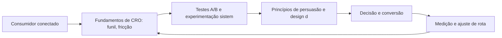

CRO: Otimizando a Conversão no Porto Seguro

## Introdução
Bem-vindo a uma nova etapa da sua navegação pelo marketing digital. Este capítulo — *CRO: Otimizando a Conversão no Porto Seguro* — integra a Parte VII, *Conversão — O Porto Seguro*, e responde a uma pergunta prática: **fundamentos de cro: funil, fricção e incentivo** — na prática, como isso se traduz em decisão e resultado?

Ao final, você será capaz de aplica otimização de conversão: análise de funil, testes a/b e princípios de persuasão em landing pages.. Mais do que decorar conceitos, você vai enxergar a conversão como chegada ao porto, não como ponto final — e converter essa visão em plano, experimento e métrica.

No capítulo anterior, *Marketing B2B: Geração de Demanda e Account-Based Marketing*, você aprendeu os conceitos que servem de plataforma para o que vem agora. Este capítulo retoma esse repertório e o aplica a um território novo — sem repetir o que já foi estabelecido, apenas usando como base.

O capítulo segue a estrutura das sete seções que organizam esta obra: primeiro a exposição conceitual, depois a ilustração, a técnica aplicada, o exercício de aplicação e a conclusão operacional.

## Entendendo o Assunto
### Fundamentos de CRO: funil, fricção e incentivo

Quando o tema é *CRO: Otimizando a Conversão no Porto Seguro*, o primeiro pilar — fundamentos de cro: funil, fricção e incentivo — define o território conceitual. O e-commerce redefiniu o varejo: modelos D2C, marketplaces e social commerce convivem, e o abandono de carrinho permanece o maior vazamento mensurável do funil.

Na prática, fundamentos de cro: funil, fricção e incentivo significa transformar a teoria em rotina operacional — exatamente o que *CRO: Otimizando a Conversão no Porto Seguro* exige no dia a dia. A literatura de gestão é enfática: sem operacionalizar o conceito em checklist, responsável e métrica, ele permanece slide de apresentação. Por isso a Parte VII propõe sempre o mesmo movimento: entender, traduzir em critério observável e decidir com dado.

### Testes A/B e experimentação sistemática

O segundo pilar — testes a/b e experimentação sistemática — conecta a estratégia à operação diária. A omnicanalidade integra online e offline: o cliente que pesquisa no celular, experimenta na loja e conclui no site espera uma experiência única. A experiência do consumidor se constrói na consistência entre canais e mensagens, e é essa consistência que transforma contato em relacionamento. Organizações que tratam cada canal como silo perdem o fio condutor da jornada; as que operam o pilar com disciplina reduzem atrito e aumentam a taxa de avanço entre etapas.

### Princípios de persuasão e design de landing pages

Fechando o tripé, princípios de persuasão e design de landing pages é o que transforma a Parte VII em vantagem mensurável. A taxa de conversão média dos funis digitais é baixa por natureza — o que separa times maduros é a taxa de melhoria contínua via experimento. O relato da indústria mostra que as empresas que sustentam resultado não são as que têm mais ferramentas, mas as que conseguem medir e ajustar a rota com frequência. A métrica certa, escolhida antes da campanha, vale mais do que qualquer ferramenta cara instalada depois do fato.

### O Eixo Transversal do Capítulo

Landing pages de alta conversão seguem hierarquia de mensagem: proposta de valor clara, prova e um único CTA dominante. Esse eixo conecta os três pilares e explica por que o capítulo os trata como um sistema, não como uma lista: cada pilar reforça o outro, e a omissão de qualquer um deles produz estratégia manca. O capítulo seguinte retomará esse eixo com novas ferramentas, agora com o vocabulário já estabelecido aqui.

Em síntese, o capítulo opera em três níveis: o conceitual (Fundamentos de CRO: funil, fricção e incentivo), o operacional (Testes A/B e experimentação sistemática) e o estratégico (Princípios de persuasão e design de landing pages). O leitor que dominar os três estará apto a aplicar a Parte VII com autonomia. A evidência reunida nesta seção sustenta cada recomendação prática das seções seguintes.

## Na Prática
Vamos traduzir o capítulo em uma cena concreta, no contexto de *CRO: Otimizando a Conversão no Porto Seguro*. Uma empresa de porte médio, com equipe enxuta e orçamento limitado, decide operar a Parte VII desta obra, *Conversão — O Porto Seguro*. Na primeira semana, a equipe testa o conceito central do capítulo em um caso real: um cliente que pesquisou, comparou e decidiu comprar. O primeiro pilar — fundamentos de cro: funil, fricção e incentivo — orienta o entendimento inicial do público; o segundo — testes a/b e experimentação sistemática — guia a escolha da rota de comunicação; e o terceiro fecha com a medição do resultado.

O diagrama abaixo representa o fluxo operacional proposto pelo capítulo — do consumidor conectado à decisão e ao ajuste contínuo de rota, com o público e a plataforma específicos do tema no centro da navegação:



Observe o laço de retorno: a medição alimenta o próximo ciclo de campanha. Essa é a diferença estrutural entre campanha e sistema — a campanha termina quando o orçamento acaba; o sistema aprende e se ajusta a cada ciclo. No caso do tema *CRO: Otimizando a Conversão no Porto Seguro*, esse laço é o que converte o investimento inicial em aprendizado acumulado para as próximas decisões.

## Ferramentas e Técnicas
### O Teste A/B com Significância

Conversão se otimiza com experimento, e experimento exige estatística. O código abaixo aplica um teste de proporção para decidir se a variação B realmente converte mais.

```python
import math

def teste_ab(conv_a: int, total_a: int, conv_b: int, total_b: int) -> dict:
    """Teste z de duas proporções para significância de 95%."""
    pa, pb = conv_a / total_a, conv_b / total_b
    p = (conv_a + conv_b) / (total_a + total_b)
    z = (pb - pa) / math.sqrt(p * (1 - p) * (1 / total_a + 1 / total_b))
    return {"taxa_a": round(pa, 4), "taxa_b": round(pb, 4),
            "z": round(z, 2), "significativo": abs(z) > 1.96}

print(teste_ab(conv_a=80, total_a=4000, conv_b=110, total_b=4000))
```

A disciplina do CRO é decidir com evidência: se o z não passa de 1,96, a diferença é ruído — e muda-se a hipótese, não a cor do botão. O rigor estatístico é o que diferencia otimização de superstição.

O código acima é o núcleo técnico de *CRO: Otimizando a Conversão no Porto Seguro*: validável, executável e adaptável ao contexto real do leitor. A prática recomendada é rodá-lo com dados próprios e usar a saída como insumo da próxima reunião de planejamento. Documentação oficial das plataformas reforça cada passo — da estrutura de campanhas à configuração de eventos. A leitura técnica deste capítulo complementa a exposição conceitual das seções anteriores e prepara os exercícios da seção seguinte.

## Exercício Rápido
Conhecimento sem aplicação é conteúdo; aplicação sem reflexão é rotina. No contexto de *CRO: Otimizando a Conversão no Porto Seguro*, os exercícios abaixo fecham o capítulo e preparam o terreno do próximo:

1. Rastreie a taxa de abandono do seu checkout e liste 3 ações para reduzi-la.
2. Mapeie seus canais de venda (D2C, marketplace, social commerce) e defina o papel de cada um no funil.
3. Reescreva a headline da sua página principal com a fórmula promessa, prova e ação.
4. Instrumente um evento de conversão no seu site e confirme a coleta em tempo real.

Dedique ao menos 30 minutos a um dos exercícios antes de avançar. O aprendizado desta obra é cumulativo: o mapa desenhado aqui será usado nos capítulos seguintes da Parte VII e nas partes subsequentes.

## Para Levar daqui
O capítulo percorreu o território da Parte VII, *Conversão — O Porto Seguro*, e deixou três aprendizados operacionais. Primeiro, o conceito central — *CRO: Otimizando a Conversão no Porto Seguro* — é menos uma novidade e mais uma disciplina de execução. Segundo, a aplicação exige a tríade conceito, rota e métrica, sem pular etapas. Terceiro, o ajuste contínuo de rota, ilustrado no laço de retorno do diagrama, é o que separa campanhas pontuais de operações sustentáveis. O caminho percorrido desde *Marketing B2B: Geração de Demanda e Account-Based Marketing* até aqui forma a base que o próximo passo vai usar. No próximo capítulo, *E-commerce e Omnicanalidade: Vendendo em Todos os Territórios*, você avançará sobre o território vizinho levando as ferramentas exercitadas aqui.

Como navegador de marketing digital, você não decorou uma fórmula — incorporou um modo de operar: ler o território, escolher a rota com dados e ajustar o percurso quando o vento muda.
