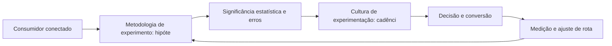

Experimentação em Escala: Metodologia de Testes A/B Confiável

## Introdução
Bem-vindo a uma nova etapa da sua navegação pelo marketing digital. Este capítulo — *Experimentação em Escala: Metodologia de Testes A/B Confiável* — integra a Parte VIII, *Métricas — O Radar de Navegação*, e responde a uma pergunta prática: **metodologia de experimento: hipótese, métrica e tamanho de amostra** — na prática, como isso se traduz em decisão e resultado?

Ao final, você será capaz de da testes a/b com rigor estatístico: hipóteses, amostragem, significância, segmentação de resultados e aprendizado organizacional.. Mais do que decorar conceitos, você vai enxergar o dado como radar que mostra posição e desvio de rota — e converter essa visão em plano, experimento e métrica.

No capítulo anterior, *Dashboards e BI de Marketing: Do Dado Bruto à Decisão*, você aprendeu os conceitos que servem de plataforma para o que vem agora. Este capítulo retoma esse repertório e o aplica a um território novo — sem repetir o que já foi estabelecido, apenas usando como base.

O capítulo segue a estrutura das sete seções que organizam esta obra: primeiro a exposição conceitual, depois a ilustração, a técnica aplicada, o exercício de aplicação e a conclusão operacional.

## Entendendo o Assunto
### Metodologia de experimento: hipótese, métrica e tamanho de amostra

Quando o tema é *Experimentação em Escala: Metodologia de Testes A/B Confiável*, o primeiro pilar — metodologia de experimento: hipótese, métrica e tamanho de amostra — define o território conceitual. Dashboards eficazes contam uma história por tela: hierarquia de métricas, contexto e próxima ação decidida — não tabelas infinitas.

Na prática, metodologia de experimento: hipótese, métrica e tamanho de amostra significa transformar a teoria em rotina operacional — exatamente o que *Experimentação em Escala: Metodologia de Testes A/B Confiável* exige no dia a dia. A literatura de gestão é enfática: sem operacionalizar o conceito em checklist, responsável e métrica, ele permanece slide de apresentação. Por isso a Parte VIII propõe sempre o mesmo movimento: entender, traduzir em critério observável e decidir com dado.

### Significância estatística e erros de interpretação

O segundo pilar — significância estatística e erros de interpretação — conecta a estratégia à operação diária. Benchmarks setoriais ajudam a calibrar metas, mas a régua final é a evolução da própria operação contra a sua linha de base. A experiência do consumidor se constrói na consistência entre canais e mensagens, e é essa consistência que transforma contato em relacionamento. Organizações que tratam cada canal como silo perdem o fio condutor da jornada; as que operam o pilar com disciplina reduzem atrito e aumentam a taxa de avanço entre etapas.

### Cultura de experimentação: cadência e documentação

Fechando o tripé, cultura de experimentação: cadência e documentação é o que transforma a Parte VIII em vantagem mensurável. A experimentação em escala exige cadência e documentação: o aprendizado acumulado de cada teste vale mais que o resultado isolado. O relato da indústria mostra que as empresas que sustentam resultado não são as que têm mais ferramentas, mas as que conseguem medir e ajustar a rota com frequência. A métrica certa, escolhida antes da campanha, vale mais do que qualquer ferramenta cara instalada depois do fato.

### O Eixo Transversal do Capítulo

O Google Analytics 4 mudou o modelo de dados: eventos em vez de pageviews, medição por usuário e machine learning para preencher lacunas de coleta. Esse eixo conecta os três pilares e explica por que o capítulo os trata como um sistema, não como uma lista: cada pilar reforça o outro, e a omissão de qualquer um deles produz estratégia manca. O capítulo seguinte retomará esse eixo com novas ferramentas, agora com o vocabulário já estabelecido aqui.

Em síntese, o capítulo opera em três níveis: o conceitual (Metodologia de experimento: hipótese, métrica e tamanho de amostra), o operacional (Significância estatística e erros de interpretação) e o estratégico (Cultura de experimentação: cadência e documentação). O leitor que dominar os três estará apto a aplicar a Parte VIII com autonomia. A evidência reunida nesta seção sustenta cada recomendação prática das seções seguintes.

## Na Prática
Vamos traduzir o capítulo em uma cena concreta, no contexto de *Experimentação em Escala: Metodologia de Testes A/B Confiável*. Uma empresa de porte médio, com equipe enxuta e orçamento limitado, decide operar a Parte VIII desta obra, *Métricas — O Radar de Navegação*. Na primeira semana, a equipe testa o conceito central do capítulo em um caso real: um cliente que pesquisou, comparou e decidiu comprar. O primeiro pilar — metodologia de experimento: hipótese, métrica e tamanho de amostra — orienta o entendimento inicial do público; o segundo — significância estatística e erros de interpretação — guia a escolha da rota de comunicação; e o terceiro fecha com a medição do resultado.

O diagrama abaixo representa o fluxo operacional proposto pelo capítulo — do consumidor conectado à decisão e ao ajuste contínuo de rota, com o público e a plataforma específicos do tema no centro da navegação:



Observe o laço de retorno: a medição alimenta o próximo ciclo de campanha. Essa é a diferença estrutural entre campanha e sistema — a campanha termina quando o orçamento acaba; o sistema aprende e se ajusta a cada ciclo. No caso do tema *Experimentação em Escala: Metodologia de Testes A/B Confiável*, esse laço é o que converte o investimento inicial em aprendizado acumulado para as próximas decisões.

## Ferramentas e Técnicas
### O Cálculo de ROI e Payback

Métricas sem fórmula viram opinião. O código abaixo padroniza o cálculo de ROI, ROAS e payback — o vocabulário comum entre marketing e finanças.

```python
def metricas(receita, custo_marketing, custo_fixo=0, margem=0.4):
    """Retorna ROI, ROAS e payback em meses."""
    lucro = receita * margem - custo_marketing - custo_fixo
    roi = lucro / (custo_marketing + custo_fixo)
    roas = receita / custo_marketing
    payback = (custo_marketing + custo_fixo) / (receita * margem / 12)
    return {"ROI": round(roi, 2), "ROAS": round(roas, 2),
            "payback_meses": round(payback, 1)}

print(metricas(receita=120_000, custo_marketing=30_000))
```

ROI positivo com payback longo ainda é risco: a régua executiva combina rentabilidade e velocidade de retorno. A instrumentação no GA4 fornece o insumo bruto desses números.

O código acima é o núcleo técnico de *Experimentação em Escala: Metodologia de Testes A/B Confiável*: validável, executável e adaptável ao contexto real do leitor. A prática recomendada é rodá-lo com dados próprios e usar a saída como insumo da próxima reunião de planejamento. Documentação oficial das plataformas reforça cada passo — da estrutura de campanhas à configuração de eventos. A leitura técnica deste capítulo complementa a exposição conceitual das seções anteriores e prepara os exercícios da seção seguinte.

## Exercício Rápido
Conhecimento sem aplicação é conteúdo; aplicação sem reflexão é rotina. No contexto de *Experimentação em Escala: Metodologia de Testes A/B Confiável*, os exercícios abaixo fecham o capítulo e preparam o terreno do próximo:

1. Compare a sessão por usuário e o tempo engajado entre duas fontes de tráfego principais.
2. Defina a linha de base de conversão de 90 dias antes de iniciar qualquer experimento.
3. Documente um aprendizado de teste recente e decida se ele muda a alocação de orçamento.
4. Defina 3 KPIs por objetivo de negócio (alcance, conversão, retenção) e a fórmula de cada um.

Dedique ao menos 30 minutos a um dos exercícios antes de avançar. O aprendizado desta obra é cumulativo: o mapa desenhado aqui será usado nos capítulos seguintes da Parte VIII e nas partes subsequentes.

## Para Levar daqui
O capítulo percorreu o território da Parte VIII, *Métricas — O Radar de Navegação*, e deixou três aprendizados operacionais. Primeiro, o conceito central — *Experimentação em Escala: Metodologia de Testes A/B Confiável* — é menos uma novidade e mais uma disciplina de execução. Segundo, a aplicação exige a tríade conceito, rota e métrica, sem pular etapas. Terceiro, o ajuste contínuo de rota, ilustrado no laço de retorno do diagrama, é o que separa campanhas pontuais de operações sustentáveis. O caminho percorrido desde *Dashboards e BI de Marketing: Do Dado Bruto à Decisão* até aqui forma a base que o próximo passo vai usar. No próximo capítulo, *CAC e LTV: A Matemática da Aquisição e Retenção*, você avançará sobre o território vizinho levando as ferramentas exercitadas aqui.

Como navegador de marketing digital, você não decorou uma fórmula — incorporou um modo de operar: ler o território, escolher a rota com dados e ajustar o percurso quando o vento muda.
