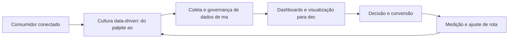

Data-Driven Marketing: Da Intuição ao Dado

## Introdução
Bem-vindo a uma nova etapa da sua navegação pelo marketing digital. Este capítulo — *Data-Driven Marketing: Da Intuição ao Dado* — integra a Parte IX, *Economia do Cliente — A Matemática do Negócio*, e responde a uma pergunta prática: **cultura data-driven: do palpite ao experimento** — na prática, como isso se traduz em decisão e resultado?

Ao final, você será capaz de adota uma cultura orientada a dados: coleta, higienização, visualização e decisão baseada em evidência.. Mais do que decorar conceitos, você vai enxergar a matemática do cliente como combustível da decisão — e converter essa visão em plano, experimento e métrica.

No capítulo anterior, *CAC e LTV: A Matemática da Aquisição e Retenção*, você aprendeu os conceitos que servem de plataforma para o que vem agora. Este capítulo retoma esse repertório e o aplica a um território novo — sem repetir o que já foi estabelecido, apenas usando como base.

O capítulo segue a estrutura das sete seções que organizam esta obra: primeiro a exposição conceitual, depois a ilustração, a técnica aplicada, o exercício de aplicação e a conclusão operacional.

## Entendendo o Assunto
### Cultura data-driven: do palpite ao experimento

Quando o tema é *Data-Driven Marketing: Da Intuição ao Dado*, o primeiro pilar — cultura data-driven: do palpite ao experimento — define o território conceitual. Customer success e retenção são o marketing pós-venda: reduzir churn em poucos pontos percentuais vale mais para o LTV do que dobrar o tráfego de topo de funil.

Na prática, cultura data-driven: do palpite ao experimento significa transformar a teoria em rotina operacional — exatamente o que *Data-Driven Marketing: Da Intuição ao Dado* exige no dia a dia. A literatura de gestão é enfática: sem operacionalizar o conceito em checklist, responsável e métrica, ele permanece slide de apresentação. Por isso a Parte IX propõe sempre o mesmo movimento: entender, traduzir em critério observável e decidir com dado.

### Coleta e governança de dados de marketing

O segundo pilar — coleta e governança de dados de marketing — conecta a estratégia à operação diária. O CAC esconde armadilhas: misturar gastos de marca com gastos de performance superestima o custo real de aquisição e distorce decisões. A experiência do consumidor se constrói na consistência entre canais e mensagens, e é essa consistência que transforma contato em relacionamento. Organizações que tratam cada canal como silo perdem o fio condutor da jornada; as que operam o pilar com disciplina reduzem atrito e aumentam a taxa de avanço entre etapas.

### Dashboards e visualização para decisão

Fechando o tripé, dashboards e visualização para decisão é o que transforma a Parte IX em vantagem mensurável. O churn é a variável que mais multiplica o LTV: pequenas melhorias na retenção produzem efeito composto sobre o valor do cliente. O relato da indústria mostra que as empresas que sustentam resultado não são as que têm mais ferramentas, mas as que conseguem medir e ajustar a rota com frequência. A métrica certa, escolhida antes da campanha, vale mais do que qualquer ferramenta cara instalada depois do fato.

### O Eixo Transversal do Capítulo

Modelos de receita recorrente transformam a matemática do cliente: assinaturas alteram payback, margem e as próprias regras de crescimento. Esse eixo conecta os três pilares e explica por que o capítulo os trata como um sistema, não como uma lista: cada pilar reforça o outro, e a omissão de qualquer um deles produz estratégia manca. O capítulo seguinte retomará esse eixo com novas ferramentas, agora com o vocabulário já estabelecido aqui.

Em síntese, o capítulo opera em três níveis: o conceitual (Cultura data-driven: do palpite ao experimento), o operacional (Coleta e governança de dados de marketing) e o estratégico (Dashboards e visualização para decisão). O leitor que dominar os três estará apto a aplicar a Parte IX com autonomia. A evidência reunida nesta seção sustenta cada recomendação prática das seções seguintes.

## Na Prática
Vamos traduzir o capítulo em uma cena concreta, no contexto de *Data-Driven Marketing: Da Intuição ao Dado*. Uma empresa de porte médio, com equipe enxuta e orçamento limitado, decide operar a Parte IX desta obra, *Economia do Cliente — A Matemática do Negócio*. Na primeira semana, a equipe testa o conceito central do capítulo em um caso real: um cliente que pesquisou, comparou e decidiu comprar. O primeiro pilar — cultura data-driven: do palpite ao experimento — orienta o entendimento inicial do público; o segundo — coleta e governança de dados de marketing — guia a escolha da rota de comunicação; e o terceiro fecha com a medição do resultado.

O diagrama abaixo representa o fluxo operacional proposto pelo capítulo — do consumidor conectado à decisão e ao ajuste contínuo de rota, com o público e a plataforma específicos do tema no centro da navegação:



Observe o laço de retorno: a medição alimenta o próximo ciclo de campanha. Essa é a diferença estrutural entre campanha e sistema — a campanha termina quando o orçamento acaba; o sistema aprende e se ajusta a cada ciclo. No caso do tema *Data-Driven Marketing: Da Intuição ao Dado*, esse laço é o que converte o investimento inicial em aprendizado acumulado para as próximas decisões.

## Ferramentas e Técnicas
### CAC, LTV e a Régua de Sustentabilidade

A economia do cliente é a matemática que separa crescimento saudável de queima de caixa. O código abaixo calcula as três grandezas centrais de qualquer negócio digital.

```python
def economia_cliente(gastos_mkt, gastos_vendas, clientes_novos,
                     ticket_medio, margem, churn_mensal):
    """Calcula CAC, LTV e relação CAC/LTV."""
    cac = (gastos_mkt + gastos_vendas) / clientes_novos
    ltv = (ticket_medio * margem) / churn_mensal
    return {"CAC": round(cac, 2), "LTV": round(ltv, 2),
            "relacao": round(ltv / cac, 2)}

print(economia_cliente(
    gastos_mkt=40_000, gastos_vendas=10_000, clientes_novos=500,
    ticket_medio=300, margem=0.6, churn_mensal=0.05))
```

Uma relação LTV/CAC acima de 3 com payback dentro do ciclo de receita é o sinal clássico de modelo sustentável. Abaixo de 1, o negócio perde dinheiro a cada cliente.

O código acima é o núcleo técnico de *Data-Driven Marketing: Da Intuição ao Dado*: validável, executável e adaptável ao contexto real do leitor. A prática recomendada é rodá-lo com dados próprios e usar a saída como insumo da próxima reunião de planejamento. Documentação oficial das plataformas reforça cada passo — da estrutura de campanhas à configuração de eventos. A leitura técnica deste capítulo complementa a exposição conceitual das seções anteriores e prepara os exercícios da seção seguinte.

## Exercício Rápido
Conhecimento sem aplicação é conteúdo; aplicação sem reflexão é rotina. No contexto de *Data-Driven Marketing: Da Intuição ao Dado*, os exercícios abaixo fecham o capítulo e preparam o terreno do próximo:

1. Teste uma variação de preço (pacote, trial ou assinatura) e meça o efeito sobre conversão e margem.
2. Calcule o CAC separado por canal e identifique qual canal entrega clientes mais baratos e mais retidos.
3. Simule o efeito de reduzir o churn em 2 pontos percentuais sobre o LTV da sua base.
4. Defina a meta de payback em meses e avalie se a atual política de investimento respeita essa régua.

Dedique ao menos 30 minutos a um dos exercícios antes de avançar. O aprendizado desta obra é cumulativo: o mapa desenhado aqui será usado nos capítulos seguintes da Parte IX e nas partes subsequentes.

## Para Levar daqui
O capítulo percorreu o território da Parte IX, *Economia do Cliente — A Matemática do Negócio*, e deixou três aprendizados operacionais. Primeiro, o conceito central — *Data-Driven Marketing: Da Intuição ao Dado* — é menos uma novidade e mais uma disciplina de execução. Segundo, a aplicação exige a tríade conceito, rota e métrica, sem pular etapas. Terceiro, o ajuste contínuo de rota, ilustrado no laço de retorno do diagrama, é o que separa campanhas pontuais de operações sustentáveis. O caminho percorrido desde *CAC e LTV: A Matemática da Aquisição e Retenção* até aqui forma a base que o próximo passo vai usar. No próximo capítulo, *Pricing e Monetização: Estratégias de Preço no Ambiente Digital*, você avançará sobre o território vizinho levando as ferramentas exercitadas aqui.

Como navegador de marketing digital, você não decorou uma fórmula — incorporou um modo de operar: ler o território, escolher a rota com dados e ajustar o percurso quando o vento muda.
