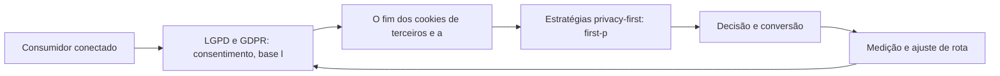

Privacy-First e o Futuro Sem Cookies: Navegando com LGPD e GDPR

## Introdução
Bem-vindo a uma nova etapa da sua navegação pelo marketing digital. Este capítulo — *Privacy-First e o Futuro Sem Cookies: Navegando com LGPD e GDPR* — integra a Parte X, *Futuro — A Previsão do Tempo*, e responde a uma pergunta prática: **lgpd e gdpr: consentimento, base legal e direitos do titular** — na prática, como isso se traduz em decisão e resultado?

Ao final, você será capaz de adapta suas estratégias ao ambiente privacy-first: consentimento, lgpd/gdpr, cookieless e medição sem cookies.. Mais do que decorar conceitos, você vai enxergar o futuro como previsão do tempo: prepara-se sem controlar — e converter essa visão em plano, experimento e métrica.

No capítulo anterior, *IA no Marketing: Automação, Personalização e Geração de Conteúdo*, você aprendeu os conceitos que servem de plataforma para o que vem agora. Este capítulo retoma esse repertório e o aplica a um território novo — sem repetir o que já foi estabelecido, apenas usando como base.

O capítulo segue a estrutura das sete seções que organizam esta obra: primeiro a exposição conceitual, depois a ilustração, a técnica aplicada, o exercício de aplicação e a conclusão operacional.

## Entendendo o Assunto
### LGPD e GDPR: consentimento, base legal e direitos do titular

Quando o tema é *Privacy-First e o Futuro Sem Cookies: Navegando com LGPD e GDPR*, o primeiro pilar — lgpd e gdpr: consentimento, base legal e direitos do titular — define o território conceitual. O ambiente privacy-first reescreveu as regras da medição: o fim dos cookies de terceiros força first-party data, consentimento explícito e contextual targeting.

Na prática, lgpd e gdpr: consentimento, base legal e direitos do titular significa transformar a teoria em rotina operacional — exatamente o que *Privacy-First e o Futuro Sem Cookies: Navegando com LGPD e GDPR* exige no dia a dia. A literatura de gestão é enfática: sem operacionalizar o conceito em checklist, responsável e métrica, ele permanece slide de apresentação. Por isso a Parte X propõe sempre o mesmo movimento: entender, traduzir em critério observável e decidir com dado.

### O fim dos cookies de terceiros e a medição cookieless

O segundo pilar — o fim dos cookies de terceiros e a medição cookieless — conecta a estratégia à operação diária. A confiança emergiu como o ativo de marketing mais caro e mais frágil da era digital: transparência virou posicionamento. A experiência do consumidor se constrói na consistência entre canais e mensagens, e é essa consistência que transforma contato em relacionamento. Organizações que tratam cada canal como silo perdem o fio condutor da jornada; as que operam o pilar com disciplina reduzem atrito e aumentam a taxa de avanço entre etapas.

### Estratégias privacy-first: first-party data e contexto

Fechando o tripé, estratégias privacy-first: first-party data e contexto é o que transforma a Parte X em vantagem mensurável. O stack MarTech cresceu exponencialmente: o desafio deixou de ser ter ferramentas e passou a ser integrá-las em torno de um dado de cliente único. O relato da indústria mostra que as empresas que sustentam resultado não são as que têm mais ferramentas, mas as que conseguem medir e ajustar a rota com frequência. A métrica certa, escolhida antes da campanha, vale mais do que qualquer ferramenta cara instalada depois do fato.

### O Eixo Transversal do Capítulo

A IA na publicidade automatiza criativos e otimização, mas a supervisão humana permanece como guarda de qualidade e de ética. Esse eixo conecta os três pilares e explica por que o capítulo os trata como um sistema, não como uma lista: cada pilar reforça o outro, e a omissão de qualquer um deles produz estratégia manca. O capítulo seguinte retomará esse eixo com novas ferramentas, agora com o vocabulário já estabelecido aqui.

Em síntese, o capítulo opera em três níveis: o conceitual (LGPD e GDPR: consentimento, base legal e direitos do titular), o operacional (O fim dos cookies de terceiros e a medição cookieless) e o estratégico (Estratégias privacy-first: first-party data e contexto). O leitor que dominar os três estará apto a aplicar a Parte X com autonomia. A evidência reunida nesta seção sustenta cada recomendação prática das seções seguintes.

## Na Prática
Vamos traduzir o capítulo em uma cena concreta, no contexto de *Privacy-First e o Futuro Sem Cookies: Navegando com LGPD e GDPR*. Uma empresa de porte médio, com equipe enxuta e orçamento limitado, decide operar a Parte X desta obra, *Futuro — A Previsão do Tempo*. Na primeira semana, a equipe testa o conceito central do capítulo em um caso real: um cliente que pesquisou, comparou e decidiu comprar. O primeiro pilar — lgpd e gdpr: consentimento, base legal e direitos do titular — orienta o entendimento inicial do público; o segundo — o fim dos cookies de terceiros e a medição cookieless — guia a escolha da rota de comunicação; e o terceiro fecha com a medição do resultado.

O diagrama abaixo representa o fluxo operacional proposto pelo capítulo — do consumidor conectado à decisão e ao ajuste contínuo de rota, com o público e a plataforma específicos do tema no centro da navegação:



Observe o laço de retorno: a medição alimenta o próximo ciclo de campanha. Essa é a diferença estrutural entre campanha e sistema — a campanha termina quando o orçamento acaba; o sistema aprende e se ajusta a cada ciclo. No caso do tema *Privacy-First e o Futuro Sem Cookies: Navegando com LGPD e GDPR*, esse laço é o que converte o investimento inicial em aprendizado acumulado para as próximas decisões.

## Ferramentas e Técnicas
### A Política de Dados Privacy-First em Código

O futuro do marketing é privacy-first, e privacidade se implementa — não se declara. O código abaixo modela o consentimento conforme a LGPD: finalidades explícitas, bases legais e direito de revogação.

```python
from dataclasses import dataclass, field

@dataclass
class Consentimento:
    titular: str
    finalidades: list = field(default_factory=list)
    base_legal: str = "consentimento"
    ativo: bool = True

    def conceder(self, finalidade: str):
        self.finalidades.append(finalidade)

    def revogar(self):
        self.ativo = False
        self.finalidades.clear()

c = Consentimento("cliente@exemplo.com")
c.conceder("newsletter_marketing")
c.conceder("analise_comportamental")
print(c)
c.revogar()  # direito de exclusão em ação
print(c)
```

O consentimento é a fundação do first-party data: sem ele, não há medição, segmentação ou personalização legítima. A IA generativa amplia a produção, mas a supervisão humana permanece.

O código acima é o núcleo técnico de *Privacy-First e o Futuro Sem Cookies: Navegando com LGPD e GDPR*: validável, executável e adaptável ao contexto real do leitor. A prática recomendada é rodá-lo com dados próprios e usar a saída como insumo da próxima reunião de planejamento. Documentação oficial das plataformas reforça cada passo — da estrutura de campanhas à configuração de eventos. A leitura técnica deste capítulo complementa a exposição conceitual das seções anteriores e prepara os exercícios da seção seguinte.

## Exercício Rápido
Conhecimento sem aplicação é conteúdo; aplicação sem reflexão é rotina. No contexto de *Privacy-First e o Futuro Sem Cookies: Navegando com LGPD e GDPR*, os exercícios abaixo fecham o capítulo e preparam o terreno do próximo:

1. Defina uma política de first-party data: o que você coleta, com qual consentimento e para qual finalidade.
2. Mapeie seu stack MarTech atual e identifique as duas integrações que mais reduziriam atrito operacional.
3. Revise os textos de consentimento dos seus formulários e simplifique a linguagem para o titular.
4. Desenhe um fluxo de personalização baseado em primeiro dado (first-party) sem depender de cookies.

Dedique ao menos 30 minutos a um dos exercícios antes de avançar. O aprendizado desta obra é cumulativo: o mapa desenhado aqui será usado nos capítulos seguintes da Parte X e nas partes subsequentes.

## Para Levar daqui
O capítulo percorreu o território da Parte X, *Futuro — A Previsão do Tempo*, e deixou três aprendizados operacionais. Primeiro, o conceito central — *Privacy-First e o Futuro Sem Cookies: Navegando com LGPD e GDPR* — é menos uma novidade e mais uma disciplina de execução. Segundo, a aplicação exige a tríade conceito, rota e métrica, sem pular etapas. Terceiro, o ajuste contínuo de rota, ilustrado no laço de retorno do diagrama, é o que separa campanhas pontuais de operações sustentáveis. O caminho percorrido desde *IA no Marketing: Automação, Personalização e Geração de Conteúdo* até aqui forma a base que o próximo passo vai usar. No próximo capítulo, *Automação e MarTech: O Stack Tecnológico do Marketing Moderno*, você avançará sobre o território vizinho levando as ferramentas exercitadas aqui.

Como navegador de marketing digital, você não decorou uma fórmula — incorporou um modo de operar: ler o território, escolher a rota com dados e ajustar o percurso quando o vento muda.
