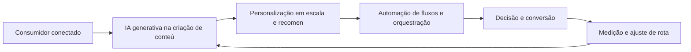
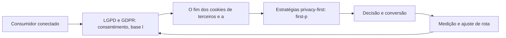
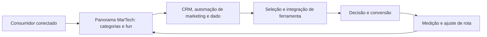
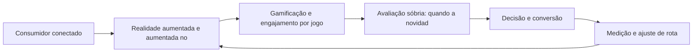
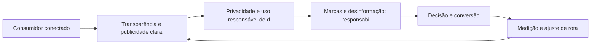

# Futuro

Bem-vindo ao seu guia prático de marketing digital. Este e-book condensa, em linguagem direta e acionável, o que você precisa saber para navegar com confiança pelo território digital — conceitos, plataformas e estratégias que geram resultado.

IA no Marketing: Automação, Personalização e Geração de Conteúdo

## Introdução
Bem-vindo a uma nova etapa da sua navegação pelo marketing digital. Este capítulo — *IA no Marketing: Automação, Personalização e Geração de Conteúdo* — integra a Parte X, *Futuro — A Previsão do Tempo*, e responde a uma pergunta prática: **ia generativa na criação de conteúdo e criativos** — na prática, como isso se traduz em decisão e resultado?

Ao final, você será capaz de aplica ia generativa e automação: conteúdo assistido, segmentação hiperpersonalizada e previsão de comportamento.. Mais do que decorar conceitos, você vai enxergar o futuro como previsão do tempo: prepara-se sem controlar — e converter essa visão em plano, experimento e métrica.

No capítulo anterior, *Planejamento e Orçamento de Marketing: Alocando Recursos com Inteligência*, você aprendeu os conceitos que servem de plataforma para o que vem agora. Este capítulo retoma esse repertório e o aplica a um território novo — sem repetir o que já foi estabelecido, apenas usando como base.

O capítulo segue a estrutura das sete seções que organizam esta obra: primeiro a exposição conceitual, depois a ilustração, a técnica aplicada, o exercício de aplicação e a conclusão operacional.

## Entendendo o Assunto
### IA generativa na criação de conteúdo e criativos

Quando o tema é *IA no Marketing: Automação, Personalização e Geração de Conteúdo*, o primeiro pilar — ia generativa na criação de conteúdo e criativos — define o território conceitual. A ética digital não é restrição, é vantagem competitiva: marcas confiáveis convertem melhor e retêm por mais tempo.

Na prática, ia generativa na criação de conteúdo e criativos significa transformar a teoria em rotina operacional — exatamente o que *IA no Marketing: Automação, Personalização e Geração de Conteúdo* exige no dia a dia. A literatura de gestão é enfática: sem operacionalizar o conceito em checklist, responsável e métrica, ele permanece slide de apresentação. Por isso a Parte X propõe sempre o mesmo movimento: entender, traduzir em critério observável e decidir com dado.

### Personalização em escala e recomendação

O segundo pilar — personalização em escala e recomendação — conecta a estratégia à operação diária. A IA generativa deslocou o gargalo da criação: o custo do conteúdo caiu, e o diferencial passou a ser curadoria, consistência de marca e supervisão humana. A experiência do consumidor se constrói na consistência entre canais e mensagens, e é essa consistência que transforma contato em relacionamento. Organizações que tratam cada canal como silo perdem o fio condutor da jornada; as que operam o pilar com disciplina reduzem atrito e aumentam a taxa de avanço entre etapas.

### Automação de fluxos e orquestração de campanhas

Fechando o tripé, automação de fluxos e orquestração de campanhas é o que transforma a Parte X em vantagem mensurável. A personalização em escala tornou-se operacional com machine learning: recomendação, segmentação dinâmica e previsão de comportamento rodam em tempo real. O relato da indústria mostra que as empresas que sustentam resultado não são as que têm mais ferramentas, mas as que conseguem medir e ajustar a rota com frequência. A métrica certa, escolhida antes da campanha, vale mais do que qualquer ferramenta cara instalada depois do fato.

### O Eixo Transversal do Capítulo

O ambiente privacy-first reescreveu as regras da medição: o fim dos cookies de terceiros força first-party data, consentimento explícito e contextual targeting. Esse eixo conecta os três pilares e explica por que o capítulo os trata como um sistema, não como uma lista: cada pilar reforça o outro, e a omissão de qualquer um deles produz estratégia manca. O capítulo seguinte retomará esse eixo com novas ferramentas, agora com o vocabulário já estabelecido aqui.

Em síntese, o capítulo opera em três níveis: o conceitual (IA generativa na criação de conteúdo e criativos), o operacional (Personalização em escala e recomendação) e o estratégico (Automação de fluxos e orquestração de campanhas). O leitor que dominar os três estará apto a aplicar a Parte X com autonomia. A evidência reunida nesta seção sustenta cada recomendação prática das seções seguintes.

## Na Prática
Vamos traduzir o capítulo em uma cena concreta, no contexto de *IA no Marketing: Automação, Personalização e Geração de Conteúdo*. Uma empresa de porte médio, com equipe enxuta e orçamento limitado, decide operar a Parte X desta obra, *Futuro — A Previsão do Tempo*. Na primeira semana, a equipe testa o conceito central do capítulo em um caso real: um cliente que pesquisou, comparou e decidiu comprar. O primeiro pilar — ia generativa na criação de conteúdo e criativos — orienta o entendimento inicial do público; o segundo — personalização em escala e recomendação — guia a escolha da rota de comunicação; e o terceiro fecha com a medição do resultado.

O diagrama abaixo representa o fluxo operacional proposto pelo capítulo — do consumidor conectado à decisão e ao ajuste contínuo de rota, com o público e a plataforma específicos do tema no centro da navegação:



Observe o laço de retorno: a medição alimenta o próximo ciclo de campanha. Essa é a diferença estrutural entre campanha e sistema — a campanha termina quando o orçamento acaba; o sistema aprende e se ajusta a cada ciclo. No caso do tema *IA no Marketing: Automação, Personalização e Geração de Conteúdo*, esse laço é o que converte o investimento inicial em aprendizado acumulado para as próximas decisões.

## Ferramentas e Técnicas
### A Política de Dados Privacy-First em Código

O futuro do marketing é privacy-first, e privacidade se implementa — não se declara. O código abaixo modela o consentimento conforme a LGPD: finalidades explícitas, bases legais e direito de revogação.

```python
from dataclasses import dataclass, field

@dataclass
class Consentimento:
    titular: str
    finalidades: list = field(default_factory=list)
    base_legal: str = "consentimento"
    ativo: bool = True

    def conceder(self, finalidade: str):
        self.finalidades.append(finalidade)

    def revogar(self):
        self.ativo = False
        self.finalidades.clear()

c = Consentimento("cliente@exemplo.com")
c.conceder("newsletter_marketing")
c.conceder("analise_comportamental")
print(c)
c.revogar()  # direito de exclusão em ação
print(c)
```

O consentimento é a fundação do first-party data: sem ele, não há medição, segmentação ou personalização legítima. A IA generativa amplia a produção, mas a supervisão humana permanece.

O código acima é o núcleo técnico de *IA no Marketing: Automação, Personalização e Geração de Conteúdo*: validável, executável e adaptável ao contexto real do leitor. A prática recomendada é rodá-lo com dados próprios e usar a saída como insumo da próxima reunião de planejamento. Documentação oficial das plataformas reforça cada passo — da estrutura de campanhas à configuração de eventos. A leitura técnica deste capítulo complementa a exposição conceitual das seções anteriores e prepara os exercícios da seção seguinte.

## Exercício Rápido
Conhecimento sem aplicação é conteúdo; aplicação sem reflexão é rotina. No contexto de *IA no Marketing: Automação, Personalização e Geração de Conteúdo*, os exercícios abaixo fecham o capítulo e preparam o terreno do próximo:

1. Escreva uma política pública de IA da sua equipe: o que a IA pode e não pode fazer sem revisão humana.
2. Audite seu uso de dados contra a LGPD: base legal, minimização e direitos do titular.
3. Teste uma ferramenta de IA generativa para criar 5 variações de criativo e avalie com um teste de campanha.
4. Defina uma política de first-party data: o que você coleta, com qual consentimento e para qual finalidade.

Dedique ao menos 30 minutos a um dos exercícios antes de avançar. O aprendizado desta obra é cumulativo: o mapa desenhado aqui será usado nos capítulos seguintes da Parte X e nas partes subsequentes.

## Para Levar daqui
O capítulo percorreu o território da Parte X, *Futuro — A Previsão do Tempo*, e deixou três aprendizados operacionais. Primeiro, o conceito central — *IA no Marketing: Automação, Personalização e Geração de Conteúdo* — é menos uma novidade e mais uma disciplina de execução. Segundo, a aplicação exige a tríade conceito, rota e métrica, sem pular etapas. Terceiro, o ajuste contínuo de rota, ilustrado no laço de retorno do diagrama, é o que separa campanhas pontuais de operações sustentáveis. O caminho percorrido desde *Planejamento e Orçamento de Marketing: Alocando Recursos com Inteligência* até aqui forma a base que o próximo passo vai usar. No próximo capítulo, *Privacy-First e o Futuro Sem Cookies: Navegando com LGPD e GDPR*, você avançará sobre o território vizinho levando as ferramentas exercitadas aqui.

Como navegador de marketing digital, você não decorou uma fórmula — incorporou um modo de operar: ler o território, escolher a rota com dados e ajustar o percurso quando o vento muda.

Privacy-First e o Futuro Sem Cookies: Navegando com LGPD e GDPR

## Introdução
Bem-vindo a uma nova etapa da sua navegação pelo marketing digital. Este capítulo — *Privacy-First e o Futuro Sem Cookies: Navegando com LGPD e GDPR* — integra a Parte X, *Futuro — A Previsão do Tempo*, e responde a uma pergunta prática: **lgpd e gdpr: consentimento, base legal e direitos do titular** — na prática, como isso se traduz em decisão e resultado?

Ao final, você será capaz de adapta suas estratégias ao ambiente privacy-first: consentimento, lgpd/gdpr, cookieless e medição sem cookies.. Mais do que decorar conceitos, você vai enxergar o futuro como previsão do tempo: prepara-se sem controlar — e converter essa visão em plano, experimento e métrica.

No capítulo anterior, *IA no Marketing: Automação, Personalização e Geração de Conteúdo*, você aprendeu os conceitos que servem de plataforma para o que vem agora. Este capítulo retoma esse repertório e o aplica a um território novo — sem repetir o que já foi estabelecido, apenas usando como base.

O capítulo segue a estrutura das sete seções que organizam esta obra: primeiro a exposição conceitual, depois a ilustração, a técnica aplicada, o exercício de aplicação e a conclusão operacional.

## Entendendo o Assunto
### LGPD e GDPR: consentimento, base legal e direitos do titular

Quando o tema é *Privacy-First e o Futuro Sem Cookies: Navegando com LGPD e GDPR*, o primeiro pilar — lgpd e gdpr: consentimento, base legal e direitos do titular — define o território conceitual. O ambiente privacy-first reescreveu as regras da medição: o fim dos cookies de terceiros força first-party data, consentimento explícito e contextual targeting.

Na prática, lgpd e gdpr: consentimento, base legal e direitos do titular significa transformar a teoria em rotina operacional — exatamente o que *Privacy-First e o Futuro Sem Cookies: Navegando com LGPD e GDPR* exige no dia a dia. A literatura de gestão é enfática: sem operacionalizar o conceito em checklist, responsável e métrica, ele permanece slide de apresentação. Por isso a Parte X propõe sempre o mesmo movimento: entender, traduzir em critério observável e decidir com dado.

### O fim dos cookies de terceiros e a medição cookieless

O segundo pilar — o fim dos cookies de terceiros e a medição cookieless — conecta a estratégia à operação diária. A confiança emergiu como o ativo de marketing mais caro e mais frágil da era digital: transparência virou posicionamento. A experiência do consumidor se constrói na consistência entre canais e mensagens, e é essa consistência que transforma contato em relacionamento. Organizações que tratam cada canal como silo perdem o fio condutor da jornada; as que operam o pilar com disciplina reduzem atrito e aumentam a taxa de avanço entre etapas.

### Estratégias privacy-first: first-party data e contexto

Fechando o tripé, estratégias privacy-first: first-party data e contexto é o que transforma a Parte X em vantagem mensurável. O stack MarTech cresceu exponencialmente: o desafio deixou de ser ter ferramentas e passou a ser integrá-las em torno de um dado de cliente único. O relato da indústria mostra que as empresas que sustentam resultado não são as que têm mais ferramentas, mas as que conseguem medir e ajustar a rota com frequência. A métrica certa, escolhida antes da campanha, vale mais do que qualquer ferramenta cara instalada depois do fato.

### O Eixo Transversal do Capítulo

A IA na publicidade automatiza criativos e otimização, mas a supervisão humana permanece como guarda de qualidade e de ética. Esse eixo conecta os três pilares e explica por que o capítulo os trata como um sistema, não como uma lista: cada pilar reforça o outro, e a omissão de qualquer um deles produz estratégia manca. O capítulo seguinte retomará esse eixo com novas ferramentas, agora com o vocabulário já estabelecido aqui.

Em síntese, o capítulo opera em três níveis: o conceitual (LGPD e GDPR: consentimento, base legal e direitos do titular), o operacional (O fim dos cookies de terceiros e a medição cookieless) e o estratégico (Estratégias privacy-first: first-party data e contexto). O leitor que dominar os três estará apto a aplicar a Parte X com autonomia. A evidência reunida nesta seção sustenta cada recomendação prática das seções seguintes.

## Na Prática
Vamos traduzir o capítulo em uma cena concreta, no contexto de *Privacy-First e o Futuro Sem Cookies: Navegando com LGPD e GDPR*. Uma empresa de porte médio, com equipe enxuta e orçamento limitado, decide operar a Parte X desta obra, *Futuro — A Previsão do Tempo*. Na primeira semana, a equipe testa o conceito central do capítulo em um caso real: um cliente que pesquisou, comparou e decidiu comprar. O primeiro pilar — lgpd e gdpr: consentimento, base legal e direitos do titular — orienta o entendimento inicial do público; o segundo — o fim dos cookies de terceiros e a medição cookieless — guia a escolha da rota de comunicação; e o terceiro fecha com a medição do resultado.

O diagrama abaixo representa o fluxo operacional proposto pelo capítulo — do consumidor conectado à decisão e ao ajuste contínuo de rota, com o público e a plataforma específicos do tema no centro da navegação:



Observe o laço de retorno: a medição alimenta o próximo ciclo de campanha. Essa é a diferença estrutural entre campanha e sistema — a campanha termina quando o orçamento acaba; o sistema aprende e se ajusta a cada ciclo. No caso do tema *Privacy-First e o Futuro Sem Cookies: Navegando com LGPD e GDPR*, esse laço é o que converte o investimento inicial em aprendizado acumulado para as próximas decisões.

## Ferramentas e Técnicas
### A Política de Dados Privacy-First em Código

O futuro do marketing é privacy-first, e privacidade se implementa — não se declara. O código abaixo modela o consentimento conforme a LGPD: finalidades explícitas, bases legais e direito de revogação.

```python
from dataclasses import dataclass, field

@dataclass
class Consentimento:
    titular: str
    finalidades: list = field(default_factory=list)
    base_legal: str = "consentimento"
    ativo: bool = True

    def conceder(self, finalidade: str):
        self.finalidades.append(finalidade)

    def revogar(self):
        self.ativo = False
        self.finalidades.clear()

c = Consentimento("cliente@exemplo.com")
c.conceder("newsletter_marketing")
c.conceder("analise_comportamental")
print(c)
c.revogar()  # direito de exclusão em ação
print(c)
```

O consentimento é a fundação do first-party data: sem ele, não há medição, segmentação ou personalização legítima. A IA generativa amplia a produção, mas a supervisão humana permanece.

O código acima é o núcleo técnico de *Privacy-First e o Futuro Sem Cookies: Navegando com LGPD e GDPR*: validável, executável e adaptável ao contexto real do leitor. A prática recomendada é rodá-lo com dados próprios e usar a saída como insumo da próxima reunião de planejamento. Documentação oficial das plataformas reforça cada passo — da estrutura de campanhas à configuração de eventos. A leitura técnica deste capítulo complementa a exposição conceitual das seções anteriores e prepara os exercícios da seção seguinte.

## Exercício Rápido
Conhecimento sem aplicação é conteúdo; aplicação sem reflexão é rotina. No contexto de *Privacy-First e o Futuro Sem Cookies: Navegando com LGPD e GDPR*, os exercícios abaixo fecham o capítulo e preparam o terreno do próximo:

1. Defina uma política de first-party data: o que você coleta, com qual consentimento e para qual finalidade.
2. Mapeie seu stack MarTech atual e identifique as duas integrações que mais reduziriam atrito operacional.
3. Revise os textos de consentimento dos seus formulários e simplifique a linguagem para o titular.
4. Desenhe um fluxo de personalização baseado em primeiro dado (first-party) sem depender de cookies.

Dedique ao menos 30 minutos a um dos exercícios antes de avançar. O aprendizado desta obra é cumulativo: o mapa desenhado aqui será usado nos capítulos seguintes da Parte X e nas partes subsequentes.

## Para Levar daqui
O capítulo percorreu o território da Parte X, *Futuro — A Previsão do Tempo*, e deixou três aprendizados operacionais. Primeiro, o conceito central — *Privacy-First e o Futuro Sem Cookies: Navegando com LGPD e GDPR* — é menos uma novidade e mais uma disciplina de execução. Segundo, a aplicação exige a tríade conceito, rota e métrica, sem pular etapas. Terceiro, o ajuste contínuo de rota, ilustrado no laço de retorno do diagrama, é o que separa campanhas pontuais de operações sustentáveis. O caminho percorrido desde *IA no Marketing: Automação, Personalização e Geração de Conteúdo* até aqui forma a base que o próximo passo vai usar. No próximo capítulo, *Automação e MarTech: O Stack Tecnológico do Marketing Moderno*, você avançará sobre o território vizinho levando as ferramentas exercitadas aqui.

Como navegador de marketing digital, você não decorou uma fórmula — incorporou um modo de operar: ler o território, escolher a rota com dados e ajustar o percurso quando o vento muda.

Automação e MarTech: O Stack Tecnológico do Marketing Moderno

## Introdução
Bem-vindo a uma nova etapa da sua navegação pelo marketing digital. Este capítulo — *Automação e MarTech: O Stack Tecnológico do Marketing Moderno* — integra a Parte X, *Futuro — A Previsão do Tempo*, e responde a uma pergunta prática: **panorama martech: categorias e funções do stack** — na prática, como isso se traduz em decisão e resultado?

Ao final, você será capaz de conhece e seleciona o stack de ferramentas de marketing (martech): crm, automação, cdp e integração como vantagem competitiva.. Mais do que decorar conceitos, você vai enxergar o futuro como previsão do tempo: prepara-se sem controlar — e converter essa visão em plano, experimento e métrica.

No capítulo anterior, *Privacy-First e o Futuro Sem Cookies: Navegando com LGPD e GDPR*, você aprendeu os conceitos que servem de plataforma para o que vem agora. Este capítulo retoma esse repertório e o aplica a um território novo — sem repetir o que já foi estabelecido, apenas usando como base.

O capítulo segue a estrutura das sete seções que organizam esta obra: primeiro a exposição conceitual, depois a ilustração, a técnica aplicada, o exercício de aplicação e a conclusão operacional.

## Entendendo o Assunto
### Panorama MarTech: categorias e funções do stack

Quando o tema é *Automação e MarTech: O Stack Tecnológico do Marketing Moderno*, o primeiro pilar — panorama martech: categorias e funções do stack — define o território conceitual. A IA na publicidade automatiza criativos e otimização, mas a supervisão humana permanece como guarda de qualidade e de ética.

Na prática, panorama martech: categorias e funções do stack significa transformar a teoria em rotina operacional — exatamente o que *Automação e MarTech: O Stack Tecnológico do Marketing Moderno* exige no dia a dia. A literatura de gestão é enfática: sem operacionalizar o conceito em checklist, responsável e métrica, ele permanece slide de apresentação. Por isso a Parte X propõe sempre o mesmo movimento: entender, traduzir em critério observável e decidir com dado.

### CRM, automação de marketing e dados de cliente (CDP)

O segundo pilar — crm, automação de marketing e dados de cliente (cdp) — conecta a estratégia à operação diária. O consentimento estruturado — finalidade, base legal e revogação — é a fundação do first-party data legítimo. A experiência do consumidor se constrói na consistência entre canais e mensagens, e é essa consistência que transforma contato em relacionamento. Organizações que tratam cada canal como silo perdem o fio condutor da jornada; as que operam o pilar com disciplina reduzem atrito e aumentam a taxa de avanço entre etapas.

### Seleção e integração de ferramentas: custo, aderência e escala

Fechando o tripé, seleção e integração de ferramentas: custo, aderência e escala é o que transforma a Parte X em vantagem mensurável. A ética digital não é restrição, é vantagem competitiva: marcas confiáveis convertem melhor e retêm por mais tempo. O relato da indústria mostra que as empresas que sustentam resultado não são as que têm mais ferramentas, mas as que conseguem medir e ajustar a rota com frequência. A métrica certa, escolhida antes da campanha, vale mais do que qualquer ferramenta cara instalada depois do fato.

### O Eixo Transversal do Capítulo

A IA generativa deslocou o gargalo da criação: o custo do conteúdo caiu, e o diferencial passou a ser curadoria, consistência de marca e supervisão humana. Esse eixo conecta os três pilares e explica por que o capítulo os trata como um sistema, não como uma lista: cada pilar reforça o outro, e a omissão de qualquer um deles produz estratégia manca. O capítulo seguinte retomará esse eixo com novas ferramentas, agora com o vocabulário já estabelecido aqui.

Em síntese, o capítulo opera em três níveis: o conceitual (Panorama MarTech: categorias e funções do stack), o operacional (CRM, automação de marketing e dados de cliente (CDP)) e o estratégico (Seleção e integração de ferramentas: custo, aderência e escala). O leitor que dominar os três estará apto a aplicar a Parte X com autonomia. A evidência reunida nesta seção sustenta cada recomendação prática das seções seguintes.

## Na Prática
Vamos traduzir o capítulo em uma cena concreta, no contexto de *Automação e MarTech: O Stack Tecnológico do Marketing Moderno*. Uma empresa de porte médio, com equipe enxuta e orçamento limitado, decide operar a Parte X desta obra, *Futuro — A Previsão do Tempo*. Na primeira semana, a equipe testa o conceito central do capítulo em um caso real: um cliente que pesquisou, comparou e decidiu comprar. O primeiro pilar — panorama martech: categorias e funções do stack — orienta o entendimento inicial do público; o segundo — crm, automação de marketing e dados de cliente (cdp) — guia a escolha da rota de comunicação; e o terceiro fecha com a medição do resultado.

O diagrama abaixo representa o fluxo operacional proposto pelo capítulo — do consumidor conectado à decisão e ao ajuste contínuo de rota, com o público e a plataforma específicos do tema no centro da navegação:



Observe o laço de retorno: a medição alimenta o próximo ciclo de campanha. Essa é a diferença estrutural entre campanha e sistema — a campanha termina quando o orçamento acaba; o sistema aprende e se ajusta a cada ciclo. No caso do tema *Automação e MarTech: O Stack Tecnológico do Marketing Moderno*, esse laço é o que converte o investimento inicial em aprendizado acumulado para as próximas decisões.

## Ferramentas e Técnicas
### A Política de Dados Privacy-First em Código

O futuro do marketing é privacy-first, e privacidade se implementa — não se declara. O código abaixo modela o consentimento conforme a LGPD: finalidades explícitas, bases legais e direito de revogação.

```python
from dataclasses import dataclass, field

@dataclass
class Consentimento:
    titular: str
    finalidades: list = field(default_factory=list)
    base_legal: str = "consentimento"
    ativo: bool = True

    def conceder(self, finalidade: str):
        self.finalidades.append(finalidade)

    def revogar(self):
        self.ativo = False
        self.finalidades.clear()

c = Consentimento("cliente@exemplo.com")
c.conceder("newsletter_marketing")
c.conceder("analise_comportamental")
print(c)
c.revogar()  # direito de exclusão em ação
print(c)
```

O consentimento é a fundação do first-party data: sem ele, não há medição, segmentação ou personalização legítima. A IA generativa amplia a produção, mas a supervisão humana permanece.

O código acima é o núcleo técnico de *Automação e MarTech: O Stack Tecnológico do Marketing Moderno*: validável, executável e adaptável ao contexto real do leitor. A prática recomendada é rodá-lo com dados próprios e usar a saída como insumo da próxima reunião de planejamento. Documentação oficial das plataformas reforça cada passo — da estrutura de campanhas à configuração de eventos. A leitura técnica deste capítulo complementa a exposição conceitual das seções anteriores e prepara os exercícios da seção seguinte.

## Exercício Rápido
Conhecimento sem aplicação é conteúdo; aplicação sem reflexão é rotina. No contexto de *Automação e MarTech: O Stack Tecnológico do Marketing Moderno*, os exercícios abaixo fecham o capítulo e preparam o terreno do próximo:

1. Desenhe um fluxo de personalização baseado em primeiro dado (first-party) sem depender de cookies.
2. Simule um cenário cookieless: escolha uma campanha e redefina a medição sem cookies de terceiros.
3. Escreva uma política pública de IA da sua equipe: o que a IA pode e não pode fazer sem revisão humana.
4. Audite seu uso de dados contra a LGPD: base legal, minimização e direitos do titular.

Dedique ao menos 30 minutos a um dos exercícios antes de avançar. O aprendizado desta obra é cumulativo: o mapa desenhado aqui será usado nos capítulos seguintes da Parte X e nas partes subsequentes.

## Para Levar daqui
O capítulo percorreu o território da Parte X, *Futuro — A Previsão do Tempo*, e deixou três aprendizados operacionais. Primeiro, o conceito central — *Automação e MarTech: O Stack Tecnológico do Marketing Moderno* — é menos uma novidade e mais uma disciplina de execução. Segundo, a aplicação exige a tríade conceito, rota e métrica, sem pular etapas. Terceiro, o ajuste contínuo de rota, ilustrado no laço de retorno do diagrama, é o que separa campanhas pontuais de operações sustentáveis. O caminho percorrido desde *Privacy-First e o Futuro Sem Cookies: Navegando com LGPD e GDPR* até aqui forma a base que o próximo passo vai usar. No próximo capítulo, *Experiências Imersivas: Metaverso, Realidade Aumentada e Novos Formatos*, você avançará sobre o território vizinho levando as ferramentas exercitadas aqui.

Como navegador de marketing digital, você não decorou uma fórmula — incorporou um modo de operar: ler o território, escolher a rota com dados e ajustar o percurso quando o vento muda.

Experiências Imersivas: Metaverso, Realidade Aumentada e Novos Formatos

## Introdução
Bem-vindo a uma nova etapa da sua navegação pelo marketing digital. Este capítulo — *Experiências Imersivas: Metaverso, Realidade Aumentada e Novos Formatos* — integra a Parte X, *Futuro — A Previsão do Tempo*, e responde a uma pergunta prática: **realidade aumentada e aumentada no varejo e em criativos** — na prática, como isso se traduz em decisão e resultado?

Ao final, você será capaz de xplora fronteiras de experiência: realidade aumentada, virtual, gamificação e formatos emergentes aplicados a campanhas e lojas.. Mais do que decorar conceitos, você vai enxergar o futuro como previsão do tempo: prepara-se sem controlar — e converter essa visão em plano, experimento e métrica.

No capítulo anterior, *Automação e MarTech: O Stack Tecnológico do Marketing Moderno*, você aprendeu os conceitos que servem de plataforma para o que vem agora. Este capítulo retoma esse repertório e o aplica a um território novo — sem repetir o que já foi estabelecido, apenas usando como base.

O capítulo segue a estrutura das sete seções que organizam esta obra: primeiro a exposição conceitual, depois a ilustração, a técnica aplicada, o exercício de aplicação e a conclusão operacional.

## Entendendo o Assunto
### Realidade aumentada e aumentada no varejo e em criativos

Quando o tema é *Experiências Imersivas: Metaverso, Realidade Aumentada e Novos Formatos*, o primeiro pilar — realidade aumentada e aumentada no varejo e em criativos — define o território conceitual. A IA generativa deslocou o gargalo da criação: o custo do conteúdo caiu, e o diferencial passou a ser curadoria, consistência de marca e supervisão humana.

Na prática, realidade aumentada e aumentada no varejo e em criativos significa transformar a teoria em rotina operacional — exatamente o que *Experiências Imersivas: Metaverso, Realidade Aumentada e Novos Formatos* exige no dia a dia. A literatura de gestão é enfática: sem operacionalizar o conceito em checklist, responsável e métrica, ele permanece slide de apresentação. Por isso a Parte X propõe sempre o mesmo movimento: entender, traduzir em critério observável e decidir com dado.

### Gamificação e engajamento por jogo

O segundo pilar — gamificação e engajamento por jogo — conecta a estratégia à operação diária. A personalização em escala tornou-se operacional com machine learning: recomendação, segmentação dinâmica e previsão de comportamento rodam em tempo real. A experiência do consumidor se constrói na consistência entre canais e mensagens, e é essa consistência que transforma contato em relacionamento. Organizações que tratam cada canal como silo perdem o fio condutor da jornada; as que operam o pilar com disciplina reduzem atrito e aumentam a taxa de avanço entre etapas.

### Avaliação sóbria: quando a novidade agrega valor real

Fechando o tripé, avaliação sóbria: quando a novidade agrega valor real é o que transforma a Parte X em vantagem mensurável. O ambiente privacy-first reescreveu as regras da medição: o fim dos cookies de terceiros força first-party data, consentimento explícito e contextual targeting. O relato da indústria mostra que as empresas que sustentam resultado não são as que têm mais ferramentas, mas as que conseguem medir e ajustar a rota com frequência. A métrica certa, escolhida antes da campanha, vale mais do que qualquer ferramenta cara instalada depois do fato.

### O Eixo Transversal do Capítulo

A confiança emergiu como o ativo de marketing mais caro e mais frágil da era digital: transparência virou posicionamento. Esse eixo conecta os três pilares e explica por que o capítulo os trata como um sistema, não como uma lista: cada pilar reforça o outro, e a omissão de qualquer um deles produz estratégia manca. O capítulo seguinte retomará esse eixo com novas ferramentas, agora com o vocabulário já estabelecido aqui.

Em síntese, o capítulo opera em três níveis: o conceitual (Realidade aumentada e aumentada no varejo e em criativos), o operacional (Gamificação e engajamento por jogo) e o estratégico (Avaliação sóbria: quando a novidade agrega valor real). O leitor que dominar os três estará apto a aplicar a Parte X com autonomia. A evidência reunida nesta seção sustenta cada recomendação prática das seções seguintes.

## Na Prática
Vamos traduzir o capítulo em uma cena concreta, no contexto de *Experiências Imersivas: Metaverso, Realidade Aumentada e Novos Formatos*. Uma empresa de porte médio, com equipe enxuta e orçamento limitado, decide operar a Parte X desta obra, *Futuro — A Previsão do Tempo*. Na primeira semana, a equipe testa o conceito central do capítulo em um caso real: um cliente que pesquisou, comparou e decidiu comprar. O primeiro pilar — realidade aumentada e aumentada no varejo e em criativos — orienta o entendimento inicial do público; o segundo — gamificação e engajamento por jogo — guia a escolha da rota de comunicação; e o terceiro fecha com a medição do resultado.

O diagrama abaixo representa o fluxo operacional proposto pelo capítulo — do consumidor conectado à decisão e ao ajuste contínuo de rota, com o público e a plataforma específicos do tema no centro da navegação:



Observe o laço de retorno: a medição alimenta o próximo ciclo de campanha. Essa é a diferença estrutural entre campanha e sistema — a campanha termina quando o orçamento acaba; o sistema aprende e se ajusta a cada ciclo. No caso do tema *Experiências Imersivas: Metaverso, Realidade Aumentada e Novos Formatos*, esse laço é o que converte o investimento inicial em aprendizado acumulado para as próximas decisões.

## Ferramentas e Técnicas
### A Política de Dados Privacy-First em Código

O futuro do marketing é privacy-first, e privacidade se implementa — não se declara. O código abaixo modela o consentimento conforme a LGPD: finalidades explícitas, bases legais e direito de revogação.

```python
from dataclasses import dataclass, field

@dataclass
class Consentimento:
    titular: str
    finalidades: list = field(default_factory=list)
    base_legal: str = "consentimento"
    ativo: bool = True

    def conceder(self, finalidade: str):
        self.finalidades.append(finalidade)

    def revogar(self):
        self.ativo = False
        self.finalidades.clear()

c = Consentimento("cliente@exemplo.com")
c.conceder("newsletter_marketing")
c.conceder("analise_comportamental")
print(c)
c.revogar()  # direito de exclusão em ação
print(c)
```

O consentimento é a fundação do first-party data: sem ele, não há medição, segmentação ou personalização legítima. A IA generativa amplia a produção, mas a supervisão humana permanece.

O código acima é o núcleo técnico de *Experiências Imersivas: Metaverso, Realidade Aumentada e Novos Formatos*: validável, executável e adaptável ao contexto real do leitor. A prática recomendada é rodá-lo com dados próprios e usar a saída como insumo da próxima reunião de planejamento. Documentação oficial das plataformas reforça cada passo — da estrutura de campanhas à configuração de eventos. A leitura técnica deste capítulo complementa a exposição conceitual das seções anteriores e prepara os exercícios da seção seguinte.

## Exercício Rápido
Conhecimento sem aplicação é conteúdo; aplicação sem reflexão é rotina. No contexto de *Experiências Imersivas: Metaverso, Realidade Aumentada e Novos Formatos*, os exercícios abaixo fecham o capítulo e preparam o terreno do próximo:

1. Audite seu uso de dados contra a LGPD: base legal, minimização e direitos do titular.
2. Teste uma ferramenta de IA generativa para criar 5 variações de criativo e avalie com um teste de campanha.
3. Defina uma política de first-party data: o que você coleta, com qual consentimento e para qual finalidade.
4. Mapeie seu stack MarTech atual e identifique as duas integrações que mais reduziriam atrito operacional.

Dedique ao menos 30 minutos a um dos exercícios antes de avançar. O aprendizado desta obra é cumulativo: o mapa desenhado aqui será usado nos capítulos seguintes da Parte X e nas partes subsequentes.

## Para Levar daqui
O capítulo percorreu o território da Parte X, *Futuro — A Previsão do Tempo*, e deixou três aprendizados operacionais. Primeiro, o conceito central — *Experiências Imersivas: Metaverso, Realidade Aumentada e Novos Formatos* — é menos uma novidade e mais uma disciplina de execução. Segundo, a aplicação exige a tríade conceito, rota e métrica, sem pular etapas. Terceiro, o ajuste contínuo de rota, ilustrado no laço de retorno do diagrama, é o que separa campanhas pontuais de operações sustentáveis. O caminho percorrido desde *Automação e MarTech: O Stack Tecnológico do Marketing Moderno* até aqui forma a base que o próximo passo vai usar. No próximo capítulo, *Ética e Confiança: O Marketing Responsável na Era Digital*, você avançará sobre o território vizinho levando as ferramentas exercitadas aqui.

Como navegador de marketing digital, você não decorou uma fórmula — incorporou um modo de operar: ler o território, escolher a rota com dados e ajustar o percurso quando o vento muda.

Ética e Confiança: O Marketing Responsável na Era Digital

## Introdução
Bem-vindo a uma nova etapa da sua navegação pelo marketing digital. Este capítulo — *Ética e Confiança: O Marketing Responsável na Era Digital* — integra a Parte X, *Futuro — A Previsão do Tempo*, e responde a uma pergunta prática: **transparência e publicidade clara: rótulos e disclosure** — na prática, como isso se traduz em decisão e resultado?

Ao final, você será capaz de aplica princípios éticos ao marketing digital: transparência, privacidade, combate à desinformação e construção de confiança sustentável.. Mais do que decorar conceitos, você vai enxergar o futuro como previsão do tempo: prepara-se sem controlar — e converter essa visão em plano, experimento e métrica.

No capítulo anterior, *Experiências Imersivas: Metaverso, Realidade Aumentada e Novos Formatos*, você aprendeu os conceitos que servem de plataforma para o que vem agora. Este capítulo retoma esse repertório e o aplica a um território novo — sem repetir o que já foi estabelecido, apenas usando como base.

O capítulo segue a estrutura das sete seções que organizam esta obra: primeiro a exposição conceitual, depois a ilustração, a técnica aplicada, o exercício de aplicação e a conclusão operacional.

## Entendendo o Assunto
### Transparência e publicidade clara: rótulos e disclosure

Quando o tema é *Ética e Confiança: O Marketing Responsável na Era Digital*, o primeiro pilar — transparência e publicidade clara: rótulos e disclosure — define o território conceitual. A confiança emergiu como o ativo de marketing mais caro e mais frágil da era digital: transparência virou posicionamento.

Na prática, transparência e publicidade clara: rótulos e disclosure significa transformar a teoria em rotina operacional — exatamente o que *Ética e Confiança: O Marketing Responsável na Era Digital* exige no dia a dia. A literatura de gestão é enfática: sem operacionalizar o conceito em checklist, responsável e métrica, ele permanece slide de apresentação. Por isso a Parte X propõe sempre o mesmo movimento: entender, traduzir em critério observável e decidir com dado.

### Privacidade e uso responsável de dados como diferencial

O segundo pilar — privacidade e uso responsável de dados como diferencial — conecta a estratégia à operação diária. O stack MarTech cresceu exponencialmente: o desafio deixou de ser ter ferramentas e passou a ser integrá-las em torno de um dado de cliente único. A experiência do consumidor se constrói na consistência entre canais e mensagens, e é essa consistência que transforma contato em relacionamento. Organizações que tratam cada canal como silo perdem o fio condutor da jornada; as que operam o pilar com disciplina reduzem atrito e aumentam a taxa de avanço entre etapas.

### Marcas e desinformação: responsabilidade na comunicação

Fechando o tripé, marcas e desinformação: responsabilidade na comunicação é o que transforma a Parte X em vantagem mensurável. A IA na publicidade automatiza criativos e otimização, mas a supervisão humana permanece como guarda de qualidade e de ética. O relato da indústria mostra que as empresas que sustentam resultado não são as que têm mais ferramentas, mas as que conseguem medir e ajustar a rota com frequência. A métrica certa, escolhida antes da campanha, vale mais do que qualquer ferramenta cara instalada depois do fato.

### O Eixo Transversal do Capítulo

O consentimento estruturado — finalidade, base legal e revogação — é a fundação do first-party data legítimo. Esse eixo conecta os três pilares e explica por que o capítulo os trata como um sistema, não como uma lista: cada pilar reforça o outro, e a omissão de qualquer um deles produz estratégia manca. O capítulo seguinte retomará esse eixo com novas ferramentas, agora com o vocabulário já estabelecido aqui.

Em síntese, o capítulo opera em três níveis: o conceitual (Transparência e publicidade clara: rótulos e disclosure), o operacional (Privacidade e uso responsável de dados como diferencial) e o estratégico (Marcas e desinformação: responsabilidade na comunicação). O leitor que dominar os três estará apto a aplicar a Parte X com autonomia. A evidência reunida nesta seção sustenta cada recomendação prática das seções seguintes.

## Na Prática
Vamos traduzir o capítulo em uma cena concreta, no contexto de *Ética e Confiança: O Marketing Responsável na Era Digital*. Uma empresa de porte médio, com equipe enxuta e orçamento limitado, decide operar a Parte X desta obra, *Futuro — A Previsão do Tempo*. Na primeira semana, a equipe testa o conceito central do capítulo em um caso real: um cliente que pesquisou, comparou e decidiu comprar. O primeiro pilar — transparência e publicidade clara: rótulos e disclosure — orienta o entendimento inicial do público; o segundo — privacidade e uso responsável de dados como diferencial — guia a escolha da rota de comunicação; e o terceiro fecha com a medição do resultado.

O diagrama abaixo representa o fluxo operacional proposto pelo capítulo — do consumidor conectado à decisão e ao ajuste contínuo de rota, com o público e a plataforma específicos do tema no centro da navegação:



Observe o laço de retorno: a medição alimenta o próximo ciclo de campanha. Essa é a diferença estrutural entre campanha e sistema — a campanha termina quando o orçamento acaba; o sistema aprende e se ajusta a cada ciclo. No caso do tema *Ética e Confiança: O Marketing Responsável na Era Digital*, esse laço é o que converte o investimento inicial em aprendizado acumulado para as próximas decisões.

## Ferramentas e Técnicas
### A Política de Dados Privacy-First em Código

O futuro do marketing é privacy-first, e privacidade se implementa — não se declara. O código abaixo modela o consentimento conforme a LGPD: finalidades explícitas, bases legais e direito de revogação.

```python
from dataclasses import dataclass, field

@dataclass
class Consentimento:
    titular: str
    finalidades: list = field(default_factory=list)
    base_legal: str = "consentimento"
    ativo: bool = True

    def conceder(self, finalidade: str):
        self.finalidades.append(finalidade)

    def revogar(self):
        self.ativo = False
        self.finalidades.clear()

c = Consentimento("cliente@exemplo.com")
c.conceder("newsletter_marketing")
c.conceder("analise_comportamental")
print(c)
c.revogar()  # direito de exclusão em ação
print(c)
```

O consentimento é a fundação do first-party data: sem ele, não há medição, segmentação ou personalização legítima. A IA generativa amplia a produção, mas a supervisão humana permanece.

O código acima é o núcleo técnico de *Ética e Confiança: O Marketing Responsável na Era Digital*: validável, executável e adaptável ao contexto real do leitor. A prática recomendada é rodá-lo com dados próprios e usar a saída como insumo da próxima reunião de planejamento. Documentação oficial das plataformas reforça cada passo — da estrutura de campanhas à configuração de eventos. A leitura técnica deste capítulo complementa a exposição conceitual das seções anteriores e prepara os exercícios da seção seguinte.

## Exercício Rápido
Conhecimento sem aplicação é conteúdo; aplicação sem reflexão é rotina. No contexto de *Ética e Confiança: O Marketing Responsável na Era Digital*, os exercícios abaixo fecham o capítulo e preparam o terreno do próximo:

1. Mapeie seu stack MarTech atual e identifique as duas integrações que mais reduziriam atrito operacional.
2. Revise os textos de consentimento dos seus formulários e simplifique a linguagem para o titular.
3. Desenhe um fluxo de personalização baseado em primeiro dado (first-party) sem depender de cookies.
4. Simule um cenário cookieless: escolha uma campanha e redefina a medição sem cookies de terceiros.

Dedique ao menos 30 minutos a um dos exercícios antes de avançar. O aprendizado desta obra é cumulativo: o mapa desenhado aqui será usado nos capítulos seguintes da Parte X e nas partes subsequentes.

## Para Levar daqui
O capítulo percorreu o território da Parte X, *Futuro — A Previsão do Tempo*, e deixou três aprendizados operacionais. Primeiro, o conceito central — *Ética e Confiança: O Marketing Responsável na Era Digital* — é menos uma novidade e mais uma disciplina de execução. Segundo, a aplicação exige a tríade conceito, rota e métrica, sem pular etapas. Terceiro, o ajuste contínuo de rota, ilustrado no laço de retorno do diagrama, é o que separa campanhas pontuais de operações sustentáveis. O caminho percorrido desde *Experiências Imersivas: Metaverso, Realidade Aumentada e Novos Formatos* até aqui forma a base que o próximo passo vai usar.

Como navegador de marketing digital, você não decorou uma fórmula — incorporou um modo de operar: ler o território, escolher a rota com dados e ajustar o percurso quando o vento muda.


## Sua Próxima Parada

Você chegou ao fim deste e-book, mas a navegação continua. Se este guia te ajudou a enxergar o território com mais clareza, siga explorando os demais volumes desta coleção e coloque em prática, ainda esta semana, pelo menos um dos exercícios que você leu. Compartilhe o que funcionou, corrija o que não funcionou e mantenha o hábito de decidir com dados. O melhor marketing digital é o que se aprende fazendo.
