# Antes do Prompt

# Como Este Livro Foi Escrito: A Metodologia EITA

Todo capítulo deste livro segue a metodologia **EITA** — um framework pedagógico de 7 seções projetado para transformar o leitor de "não sei" para "consigo fazer" em cada tema abordado.

## As 7 Seções do EITA

### 1. INTRODUÇÃO
Contextualiza o tema. Explica o que será abordado, por que importa, e o que você será capaz ao final. Uma ponte conecta com o capítulo anterior (quando houver).

### 2. EXPLICA
Desconstrói o conceito: causa raiz, mecânica subjacente, definições precisas. Você passa de "não sei o que é" para "sei definir e explicar".

### 3. ILUSTRA
Uma analogia concreta ancora o conceito na sua intuição — sempre acompanhada de um diagrama visual que torna o abstrato tangível. Você passa de "parece abstrato" para "faz sentido".

### 4. TÉCNICA
O núcleo de valor: código executável, arquiteturas, passo a passo de implementação. É aqui você ganha as mãos para fazer. Você passa de "não sei fazer" para "consigo implementar".

### 5. APLICA
Contextualização em cenário real: onde aquilo se aplica no mercado, armadilhas comuns e como evitá-las. Você passa de "isso é teórico" para "vou usar no trabalho".

### 6. CONCLUSÃO
Síntese dos 3 pontos principais, conexão com o próximo capítulo e um desafio opcional para fixar o aprendizado.

### 7. REFERÊNCIAS BIBLIOGRÁFICAS
Fontes citadas no capítulo, em formato ABNT numerado. Toda afirmação factual tem sua referência.

## Por Que Funciona

O EITA não é uma lista de tópicos — é uma **jornada de transformação**. Cada seção leva o leitor a um estado mental diferente:

```
Introdução → "Quero aprender"
Explica     → "Entendi a teoria"
Ilustra     → "Faz sentido na prática"
Técnica     → "Consigo fazer"
Aplica      → "Vou usar no trabalho"
Conclusão   → "Dominei este tema"
```

## Diagrama do Fluxo EITA


## Dica de Leitura

Você pode ler os capítulos em ordem (recomendado para iniciantes) ou pular diretamente para o tema de interesse. Cada capítulo é autocontido, mas a sequência cria conexões que ampliam o aprendizado.

---

*A metodologia EITA é uma criação da Fábrica Agêntica de Livros, projetada para produzir literatura técnica que transforma leitores em profissionais.*

## Introdução geral

Em agosto de 2026, a maior parte do mercado ainda trata 'prompt engineering' como o teto da disciplina — mas o profissional fluente em AI-Driven Development opera uma pilha inteira: Context Engineering, MCP Engineering, Rules Engineering, Skills Engineering, Hook Engineering, Spec Engineering, Loop Engineering, Harness Engineering e Eval Engineering. Todas essas disciplinas assumem um chão técnico que quase ninguém ensina: saber programar, versionar, testar e — sobretudo — entender o que um modelo de linguagem realmente faz com o texto que recebe. Este livro constrói esse chão, da primeira linha de código ao panorama histórico que levou de autocomplete a agentes autônomos em apenas cinco anos.

# PARTE I — Fundamentos de Programação

# Capítulo 1: O que é Programar: Lógica Essencial

## 1. Introdução

Você chegou até aqui por um motivo: quer dominar a disciplina que mais transformou a indústria de software desde 2022 — o desenvolvimento dirigido por IA. E a primeira verdade que precisa ouvir é desconfortável: nenhuma ferramenta agêntica do mercado substitui a capacidade humana de pensar algoritmicamente [1]. Os agentes escrevem código em velocidade impressionante, mas quem não sabe o que é uma variável, uma condição ou um loop não consegue nem mesmo avaliar se o que o agente produziu está correto [2]. Este capítulo constrói exatamente essa fundação: a lógica essencial de programação, ensinada sem a exigência de dominar uma linguagem específica, porque o objetivo da série é formar um profissional fluente em AI-Driven Development — e fluência começa na leitura, não na escrita [3].

Ao final deste capítulo, você será capaz de ler um programa simples e dizer o que ele faz, decompor um problema do dia a dia em passos executáveis por uma máquina e, sobretudo, entender por que os agentes de IA conseguem programar — e por que o humano da equação precisa continuar no centro das decisões [4]. Essa é a base sobre a qual todo o restante da série se apoia: sem lógica, não há contexto; sem contexto, não há harness. O domínio do controle de versão, por exemplo, será um pré-requisito direto do Capítulo 3, e o entendimento do que o modelo vê será ampliado no Capítulo 7 [5].

## 2. Explica

### 2.1 O que é um Programa, Afinal

Um programa é uma sequência de instruções que uma máquina executa para transformar uma entrada em uma saída. A definição parece simples, mas carrega uma consequência profunda: programar é, essencialmente, o ato de traduzir intenção humana para um formato que uma máquina consiga executar de forma determinística [1]. Quando você pede a um agente de IA para "criar uma função que calcule a média de uma lista", o agente está fazendo exatamente essa tradução — e o modelo que ele usa aprendeu a fazê-la observando bilhões de exemplos de código durante o treinamento [2]. Esse processo de tradução é o mesmo que o Karpathy descreve ao falar de Software 3.0: o programa passa a nascer em linguagem natural e a ser interpretado por modelos, mas a lógica subjacente permanece a mesma [18].

### 2.2 Variáveis e Tipos: a Memória do Programa

Toda linguagem de programação trabalha com o mesmo conceito fundamental: a variável. Uma variável é um nome que aponta para um valor armazenado em memória. Pense em uma gaveta etiquetada: o rótulo é o nome da variável, e o conteúdo da gaveta é o valor [6]. Os valores podem ser de tipos diferentes — números inteiros, números decimais, textos, valores lógicos (verdadeiro ou falso) e estruturas mais complexas. A distinção entre tipos importa porque a máquina trata cada um de forma diferente: somar dois números inteiros é uma operação aritmética; "somar" dois textos é uma concatenação [3]. No contexto agêntico, essa distinção aparece toda vez que um modelo decide o formato de um argumento ao chamar uma ferramenta [7].

### 2.3 Condicionais: a Lógica de Decisão

Se programar fosse apenas armazenar valores, seria trivial. O que dá poder ao software é a capacidade de decidir. As estruturas condicionais — o famoso "se... então... senão..." — permitem que o programa tome caminhos diferentes dependendo do estado dos dados [1]. É exatamente essa capacidade que os agentes de IA usam o tempo todo: quando um modelo decide se deve chamar uma ferramenta ou responder diretamente, ele está, em última instância, executando uma lógica condicional sobre o conteúdo da conversa [7]. A documentação de function calling da OpenAI descreve precisamente esse ciclo: o modelo analisa o pedido, decide que precisa de dados externos e retorna uma chamada estruturada em vez de texto livre [7]. O guia de function calling da Prompting Guide detalha o mesmo mecanismo em termos de ferramentas definidas por JSON Schema [8].

### 2.4 Loops: a Repetição Controlada

A terceira peça fundamental é a repetição. Loops permitem executar o mesmo bloco de instruções múltiplas vezes, seja um número fixo de vezes (loop com contador) ou enquanto uma condição for verdadeira (loop condicional) [3]. A capacidade de repetir é o que permite processar listas, percorrer arquivos e iterar sobre dados — tarefas que constituem a maior parte do trabalho real de um sistema de software. No mundo agêntico, loops aparecem no chamado "agent loop": o ciclo ação → observação → decisão que um agente repete até concluir a tarefa [4]. Cada iteração consome tokens da janela de contexto, o que torna a eficiência dos loops uma preocupação de engenharia — e não apenas de lógica [9].

### 2.5 Funções: o Bloco de Construção Reutilizável

Funções são blocos de código nomeados que recebem entradas (parâmetros), executam um conjunto de instruções e produzem uma saída. Elas existem por um motivo simples: evitar repetição e organizar o pensamento [1]. Quando você nomeia uma operação e a encapsula, passa a poder reutilizá-la em qualquer ponto do programa — e, mais importante, passa a poder pensar sobre ela em um nível mais alto de abstração. Essa é a mesma razão pela qual os agentes de IA organizam seu trabalho em módulos e arquivos: abstração é a ferramenta que torna o software compreensível [3]. E é também a razão pela qual o ecossistema de instruções persistentes como AGENTS.md ganhou força: arquivos de diretrizes funcionam como "funções" de comportamento que os agentes reutilizam em cada execução [10].

### 2.6 O Pensamento Algorítmico

Algoritmo é o nome técnico para a receita: uma sequência finita de passos bem definidos que resolve um problema. O pensamento algorítmico é a habilidade de transformar um problema vago — "organizar minha lista de contatos" — em passos precisos — "comparar dois a dois e trocar de posição se estiverem fora de ordem" [1]. Essa habilidade não é inata; é treinada. E é a habilidade mais valiosa na era da IA, porque os agentes executam algoritmos com perfeição, mas não decidem qual algoritmo é o certo para o seu problema [2]. O framework clássico de agentes autônomos proposto por Lilian Weng formaliza isso: o agente é a combinação de LLM, memória, planejamento e ferramentas — e o planejamento depende exatamente da mesma decomposição algorítmica que você está aprendendo aqui [11].

### 2.7 Erros como Ferramenta de Aprendizado

Um aspecto que os iniciantes subestimam é o papel do erro no aprendizado de lógica. Cada erro de sintaxe, cada resultado inesperado e cada exceção é um sinal de que o modelo mental do programa não corresponde à realidade [5]. O desenvolvedor experiente não evita erros — ele os sistematiza: anota o que previu, o que aconteceu e por que divergiu. Esse hábito de hipótese e verificação é o mesmo método científico que os agentes de IA usam quando rodam testes e corrigem código em loop [4]. Na era do desenvolvimento dirigido por IA, quem domina esse ciclo — formular, testar, corrigir — supera quem apenas aceita a primeira resposta [2].

### 2.8 A Importância da Precisão na Comunicação

Programar é, no fundo, um exercício de comunicação precisa. A máquina não infere intenção: ela executa exatamente o que está escrito [1]. Um sinal de pontuação a mais, um tipo incorreto, uma condição invertida — e o comportamento muda por completo. Essa exigência de precisão é a mesma que os prompts e os arquivos de instrução dos agentes exigem: AGENTS.md funciona porque elimina a ambiguidade que a linguagem natural naturalmente carrega [10]. Quando você aprende a pensar algoritmicamente, aprende também a se comunicar de forma inequívoca — a habilidade mais transferível de toda a série [3].

### 2.9 Como a Lógica se Manifesta nas Diferentes Linguagens

Uma dúvida comum de quem começa é: "qual linguagem devo aprender?" A resposta da série é: nenhuma em específico — porque a lógica transcende a sintaxe [1]. O `if` em Python, o `if` em JavaScript e o `if` em Java fazem a mesma coisa com grafias diferentes. A variável, a condição e o loop existem em praticamente todas as linguagens imperativas; o que muda é a forma de escrever, não a estrutura do pensamento [3]. Por isso este capítulo foi construído com Python sem exigir que você o domine: o objetivo é que você reconheça os padrões, não que decore a sintaxe [2]. Quando um agente de IA escreve código em uma linguagem que você nunca usou, você consegue avaliá-lo porque a lógica é a mesma — e é essa capacidade que os profissionais da era agêntica mais valorizam [3].

### 2.10 A Relação entre Lógica e Dados

Há ainda uma dimensão da lógica que merece atenção desde o início: os dados. Todo programa manipula dados — e a qualidade da lógica não compensa a má qualidade dos dados [1]. Um programa com lógica perfeita que recebe dados errados produz resultados errados; o ditado do mundo de dados "garbage in, garbage out" é a outra face do pensamento algorítmico [3]. Essa relação será central nos livros seguintes: na engenharia de contexto, a curadoria dos dados que entram na janela do modelo é decisão de arquitetura [9]; na engenharia de harnesses, a validação de dados é parte do loop de qualidade [15]. Desde já, cultive o hábito de questionar a entrada antes de confiar na saída — o mesmo reflexo que você aplicará ao avaliar o que um agente produz [2].

### 2.11 Síntese: O Mapa Mental do Capítulo

Antes de passar para as ilustrações, vale consolidar o mapa mental deste capítulo. A lógica de programação se organiza em quatro níveis: os elementos (variáveis e tipos), as estruturas de controle (condicionais e loops), os blocos reutilizáveis (funções e módulos) e a habilidade transversal (o pensamento algorítmico) [1]. Cada nível se apoia no anterior — e todos se apoiam na ideia central de que programar é traduzir intenção em instrução determinística [3]. Esse mapa reaparece, ampliado, nos capítulos seguintes: o Capítulo 2 expande os blocos reutilizáveis com leitura de código; o Capítulo 4 transforma as estruturas de controle em testes; e os Capítulos 7 e 8 mostram como os modelos de linguagem implementam — estatisticamente — os mesmos níveis [2]. Ter o mapa claro desde o início torna cada capítulo seguinte mais rápido de absorver [1]. O pensamento algorítmico é a habilidade de transformar um problema vago — "organizar minha lista de contatos" — em passos precisos — "comparar dois a dois e trocar de posição se estiverem fora de ordem" [1]. Essa habilidade não é inata; é treinada. E é a habilidade mais valiosa na era da IA, porque os agentes executam algoritmos com perfeição, mas não decidem qual algoritmo é o certo para o seu problema [2]. O framework clássico de agentes autônomos proposto por Lilian Weng formaliza isso: o agente é a combinação de LLM, memória, planejamento e ferramentas — e o planejamento depende exatamente da mesma decomposição algorítmica que você está aprendendo aqui [11].

## 3. Ilustra

### 3.1 A Analogia da Cozinha

Imagine uma cozinha profissional. O chefe (o programador) recebe um pedido (o problema). Os ingredientes na despensa são as variáveis. A receita escrita é o algoritmo. Os utensílios são as funções — cada um especializado em uma tarefa e reutilizável em centenas de pratos diferentes. Agora imagine que, em 2026, um "agente-chef" assistido por IA consiga ler milhares de receitas e sugerir pratos completos em segundos [12]. O chef humano não é substituído: é ele quem decide se o prato sugerido faz sentido, se os ingredientes combinam e se a receita respeita as restrições do restaurante. Na cozinha, como no software, o valor está na curadoria e na decisão — não na execução mecânica [11]. Assim como um chef experiente não precisa decorar cada receita — ele domina as técnicas fundamentais e as combina —, você não precisa memorizar sintaxe de todas as linguagens: precisa dominar a lógica e ler o que a máquina produz [3].

### 3.2 O Diagrama do Fluxo de Decisão

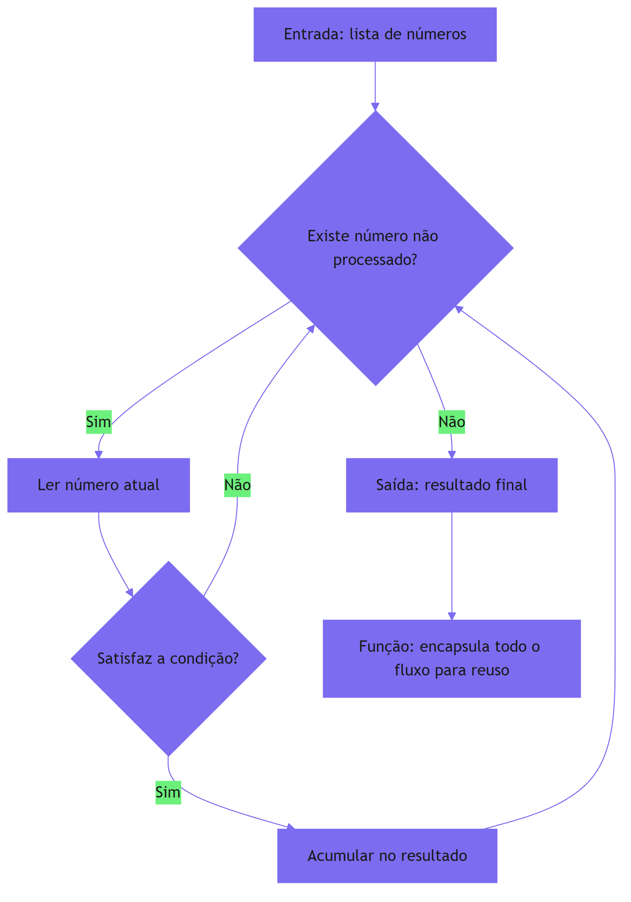

### 3.3 A Cozinha em Escala: da Receita Individual ao Cardápio Completo

A analogia da cozinha ganha uma dimensão nova quando pensamos em escala. O chef individual (você no início) prepara um prato por vez. O chef de cozinha industrial (o profissional que você está se tornando) gerencia um cardápio inteiro, com equipes, estoque e padrões de qualidade [2]. No desenvolvimento de software, a escala funciona igual: o iniciante escreve uma função; o profissional orquestra sistemas — e, em 2026, orquestra agentes que escrevem funções por ele [3]. A transição de chef individual para gestor de cozinha é exatamente a transição que a série completa descreve: da primeira linha de código à engenharia de sistemas autônomos de IA em produção [1]. O que sustenta essa transição não é conhecer mais receitas — é dominar as técnicas fundamentais e saber delegar com critério [4].

### 3.4 O que o Agente Vê Quando Programa

Quando você pede a um agente de IA para escrever código, o que ele vê é uma sequência de tokens — fragmentos de texto que o modelo processa através de um mecanismo de atenção [13]. Ele não "entende" o programa como você entende; ele calcula, a cada passo, qual é o próximo token mais provável dado todo o contexto anterior. Isso explica duas coisas: a velocidade impressionante e a necessidade absoluta de validação humana. O modelo acerta estatisticamente, mas não sabe o que é certo [14]. Os limites desse processo — e as alucinações que dele derivam — serão explorados em profundidade no Capítulo 8, quando estudarmos atenção, amostragem e alucinação.

### 3.5 A Diferença entre Executar e Compreender

A analogia da cozinha revela ainda uma distinção crucial: executar uma receita não é o mesmo que compreendê-la. O agente-chef executa receitas com perfeição estatística, mas não "compreende" por que o fermento faz o bolo crescer [2]. O chef humano que compreende pode adaptar a receita a um ingrediente faltante, pode diagnosticar por que o bolo murchou e pode ensinar o prato a outros. Na programação, a mesma distinção separa quem executa instruções de quem entende o sistema [1]. Um agente que recebe o código e o executa está operando no nível da receita; você, que entende a lógica, opera no nível da compreensão — e pode decidir quando a receita deve ser alterada [3]. Essa é a base filosófica de toda a série: a IA executa a pilha, o humano compreende a pilha [4].

### 3.6 Visualizando o Fluxo: Mapa do Raciocínio Lógico

O diagrama deste capítulo mostra o fluxo de decisão de um programa. Vale treinar a leitura dele como quem lê um mapa: o retângulo é uma ação, o losango é uma decisão, as setas indicam o fluxo [1]. Esse mesmo vocabulário visual — ações, decisões, fluxos — reaparece em toda a série: os agentes desenham planos de execução, os harnesses descrevem loops e os diagramas de arquitetura dos Capítulos 5 e 6 usam os mesmos elementos [3]. Aprender a ler diagramas de fluxo agora é aprender a ler a planta de qualquer sistema agêntico depois [2]. O agente-chef executa receitas com perfeição estatística, mas não "compreende" por que o fermento faz o bolo crescer [2]. O chef humano que compreende pode adaptar a receita a um ingrediente faltante, pode diagnosticar por que o bolo murchou e pode ensinar o prato a outros. Na programação, a mesma distinção separa quem executa instruções de quem entende o sistema [1]. Um agente que recebe o código e o executa está operando no nível da receita; você, que entende a lógica, opera no nível da compreensão — e pode decidir quando a receita deve ser alterada [3]. Essa é a base filosófica de toda a série: a IA executa a pilha, o humano compreende a pilha [4].

## 4. Técnica

### 4.1 Seu Primeiro Programa

Vamos colocar a mão na massa com Python — a linguagem mais usada no ecossistema de IA e a mais legível para iniciantes. O programa abaixo exercita exatamente os quatro pilares que acabamos de estudar: variáveis, condicionais, loops e funções [3].

```python
def calcular_media_ponderada(notas, pesos):
    """Calcula a média ponderada de uma lista de notas."""
    if len(notas) != len(pesos):
        raise ValueError("notas e pesos devem ter o mesmo tamanho")
    total = 0.0          # variável acumuladora (inicialização)
    soma_pesos = 0.0
    for nota, peso in zip(notas, pesos):   # loop sobre pares
        total += nota * peso               # acumula o produto
        soma_pesos += peso
    if soma_pesos == 0:                    # condicional de guarda
        return 0.0
    return total / soma_pesos              # saída da função


def classificar_media(media):
    """Classifica a média em conceitos de A a F (decisão encadeada)."""
    if media >= 9.0:
        return "A"
    elif media >= 7.5:
        return "B"
    elif media >= 6.0:
        return "C"
    elif media >= 5.0:
        return "D"
    else:
        return "F"


if __name__ == "__main__":
    notas = [8.5, 7.0, 9.2]
    pesos = [2.0, 3.0, 5.0]
    media = calcular_media_ponderada(notas, pesos)
    print(f"Media ponderada: {media:.2f} -> conceito {classificar_media(media)}")
```

### 4.2 Decompondo o Problema

Observe como o programa foi construído: primeiro, definimos o domínio (notas e pesos); depois, isolamos a lógica de cálculo em uma função pura; em seguida, isolamos a decisão de classificação em outra função; e, por fim, orquestramos tudo no bloco principal [1]. Essa decomposição — separar cálculo, decisão e orquestração — é a essência do pensamento algorítmico aplicado. É o mesmo padrão que os agentes de IA seguem quando estruturam uma solução em múltiplos arquivos [3]. E é o mesmo padrão que a especificação AGENTS.md recomenda para arquivos de instrução: um arquivo, uma responsabilidade, máximo de clareza [10].

### 4.3 Validando o Programa

Rode o programa acima em qualquer interpretador Python (inclusive no terminal de um agente de IA). O resultado esperado é: `Media ponderada: 8.29 -> conceito B`. Se o seu resultado for diferente, o fluxo de execução não é o que você imaginou — e esse diagnóstico é exatamente o treino de lógica que você precisa [6]. Esse hábito — prever o resultado antes de executar e comparar com o real — é o germe do que, nos Capítulos 4 e 8, vai se transformar em testes automatizados e em validação adversarial de agentes [15].

### 4.4 Casos de Borda: Onde a Lógica é Testada de Verdade

Um programa que funciona para a entrada óbvia não é um programa confiável — é um programa que ainda não foi desafiado [1]. Os casos de borda são as entradas no limite do domínio: listas vazias, valores zerados, números negativos, entradas máximas, entradas inesperadas. Cada caso de borda que você testa revela uma suposição escondida no seu raciocínio [5]. No programa da média ponderada, experimente: notas com pesos zerados, lista vazia, valores negativos, pesos negativos. O que acontece? O código atual trata pesos zerados com a guarda `if soma_pesos == 0`; mas pesos negativos passariam despercebidos [1]. Identificar esses buracos é a diferença entre um programa que funciona no seu computador e um que funciona para o mundo — e é exatamente o que os testes automatizados do Capítulo 4 vão formalizar [15].

### 4.5 O Papel do Código Legível

Há uma qualidade que atravessa todo código profissional e que os iniciantes subestimam: a legibilidade. Código legível é código que outro humano — ou outro agente — consegue entender sem esforço [3]. Nomes descritivos, funções pequenas, comentários que explicam o porquê e não o quê. Essa qualidade não é estética: é engenharia, porque código legível é código que se mantém, se revisa e se corrige com segurança [1]. Os arquivos de instrução dos agentes — AGENTS.md — seguem o mesmo princípio: regras claras e organizadas que outra máquina consegue seguir sem ambiguidade [10]. Ao escrever seus primeiros programas, cultive a legibilidade desde o início — ela é o alicerce do trabalho em equipe e do trabalho com agentes [3].

### 4.6 A Anatomia de uma Função Bem Projetada

Para fechar a parte técnica, vamos dissecar o que torna uma função bem projetada — porque esse é o padrão que você vai reconhecer (e exigir) em todo código, incluindo o que os agentes produzem [1]. Uma boa função tem: um nome que descreve o comportamento (verbo + objeto), uma entrada mínima e explícita, um retorno previsível e um corpo que faz uma única coisa [3]. A função `calcular_media_ponderada` exemplifica: o nome diz o que faz, os parâmetros `notas` e `pesos` são explícitos, o retorno é sempre um número e o corpo resolve um único problema [1].

### 4.7 Exercícios Guiados de Lógica

Para consolidar a técnica, resolva estes quatro exercícios — cada um mira um dos pilares do capítulo [1]. Primeiro, variáveis e tipos: escreva um programa que receba um texto e um número e imprima o texto repetido aquele número de vezes, tratando o caso de número negativo. Segundo, condicionais: escreva uma função que classifique uma idade em criança, adolescente, adulto ou idoso, definindo você mesmo as faixas. Terceiro, loops: escreva um programa que receba uma lista de números e devolva o maior, sem usar a função pronta de máximo — o exercício força você a pensar no acumulador [5]. Quarto, funções: refatore o programa da média ponderada para extrair a leitura dos dados em uma função separada da calculadora — exercitando a separação de responsabilidades que discutimos [1]. Rode cada solução, teste casos de borda e, se quiser, peça a um agente para comparar a sua abordagem [3].

### 4.8 Verificando a Própria Compreensão

Antes de avançar, faça uma autoavaliação honesta. Você consegue explicar, sem consultar o texto, o que é uma variável e para que serve um tipo? Consegue descrever em que situação se usa um loop em vez de uma condicional? Consegue dizer por que funções melhoram a legibilidade? Se a resposta for não a qualquer uma delas, volte às seções 2.2 a 2.5 e releia com o programa do capítulo aberto à frente [1]. A autoavaliação é parte do método da série: cada capítulo termina com a verificação do que foi construído — porque a pilha só sobe se cada camada estiver firme [3]. Uma boa função tem: um nome que descreve o comportamento (verbo + objeto), uma entrada mínima e explícita, um retorno previsível e um corpo que faz uma única coisa [3]. A função `calcular_media_ponderada` exemplifica: o nome diz o que faz, os parâmetros `notas` e `pesos` são explícitos, o retorno é sempre um número e o corpo resolve um único problema [1]. Quando você avalia código de agentes, use a mesma régua: se a função faz três coisas, se o nome não descreve o comportamento ou se o retorno depende de estado escondido, o código precisa de revisão [3]. Esse critério de qualidade — simples de enunciar, difícil de automatizar — é parte do que torna o humano insubstituível na orquestração de agentes [2].

## 5. Aplica

### 5.1 Onde Isso Vive no Mundo Real

Cada um desses conceitos tem correspondência direta no software que você usa todos os dias. O carrinho de compras de um e-commerce usa condicionais para aplicar descontos, loops para somar itens e funções para calcular frete [1]. Um sistema bancário usa funções para validar transferências e condicionais para verificar saldo. E, no mundo agêntico de 2026, os próprios agentes usam esses mesmos blocos: um agente que organiza seu repositório Git está executando loops sobre arquivos e condicionais sobre estados de mudança [16]. As estratégias de organização desse trabalho — Git Flow, GitHub Flow ou trunk-based — são, elas mesmas, decisões algorítmicas sobre como dividir o esforço [20]. Quando um agente de coding navega por um repositório e decide quais arquivos alterar, ele aplica a mesma estrutura de decisão que você acabou de ver no diagrama [12].

### 5.2 O Erro Comum do Iniciante na Era da IA

Você, leitor, está em uma posição única: vai aprender programação em um momento em que a maioria das pessoas pula direto para o "deixa o agente fazer". O erro comum é exatamente esse: delegar sem saber avaliar. A pessoa pede ao agente uma função, o agente entrega, a pessoa cola sem ler e descobre semanas depois que a função falha em um caso específico [2]. A correção — e aqui está o diferencial que separa o profissional do curioso — é inverter o fluxo: primeiro você entende o problema, depois avalia o que o agente produziu, testa com casos próprios e só então integra. Na prática: rode o código, introduza casos de borda (lista vazia, pesos zerados, notas negativas) e veja se o comportamento é o esperado [11]. Esse hábito de questionamento é o que transforma um consumidor de IA em um engenheiro dirigido por IA. A mesma disciplina vale para os dados que alimentam o agente: contexto mal curado produz código mal gerado [17].

### 5.3 O Papel do Desenvolvedor em 2026

Em agosto de 2026, cerca de 92% dos desenvolvedores nos Estados Unidos usam ferramentas de IA diariamente — mas a confiança na exatidão do código gerado caiu para 29% [19]. Isso significa que o mercado precisa, mais do que nunca, de pessoas que consigam ler e validar código. O desenvolvedor moderno é arquiteto, especificador e revisor: define as restrições, escreve a especificação e audita o que a máquina produziu [3]. Nenhuma dessas funções é possível sem a base que você está construindo agora. Estudos empíricos recentes confirmam a direção: arquivos de instrução bem estruturados reduzem o tempo de execução de agentes em quase 29% — mas apenas quando o humano sabe o que está pedindo [10].

### 5.4 A Rotina de Estudo do Desenvolvedor Dirigido por IA

Para transformar os conceitos deste capítulo em hábito, adote uma rotina de prática deliberada. Primeiro, o exercício de tradução: pegue um problema do seu cotidiano — calcular o troco de uma compra, ordenar uma lista de tarefas por prioridade — e escreva os passos em linguagem natural, sem código. Segundo, o exercício de leitura: abra um projeto de código aberto em qualquer linguagem e identifique, apenas pela leitura, as variáveis, as condicionais, os loops e as funções [5]. Terceiro, o exercício de comparação: peça a um agente de IA para resolver o mesmo problema e compare a solução dele com a sua — não para julgar, mas para entender abordagens diferentes [2]. Essa rotina de trinta minutos por dia constrói, em semanas, a fluência que a maioria dos profissionais levou anos para adquirir [1].

### 5.5 Quando a Lógica Falha: Debugando o Pensamento

O momento mais importante da prática é quando algo falha — e no início, algo sempre falha. A falha não é o fracasso do seu raciocínio; é a revelação de uma suposição incorreta [5]. O método de depuração do pensamento segue três perguntas: o que eu esperava que acontecesse? O que aconteceu de fato? Qual suposição minha está errada? [1] Esse método é o mesmo que os depuradores profissionais usam com código — e o mesmo que os agentes de IA aplicam quando um teste falha e eles reavaliam a hipótese [4]. Ao internalizar esse ciclo, você deixa de temer erros e passa a usá-los como combustível do aprendizado — a marca registrada dos profissionais que a série forma [3].

### 5.6 O Ecossistema Profissional em que Você Está Entrando

Para situar você no contexto profissional, vale descrever o ecossistema que encontrará ao dominar a pilha agêntica. Em 2026, o desenvolvimento de software acontece em três camadas de maturidade [19]. Na primeira, o profissional usa ferramentas de autocomplete e chat — o Copilot, o ChatGPT — para acelerar o trabalho manual. Na segunda, o profissional orquestra agentes que executam tarefas completas — criação de branches, implementação, testes — e revisa o resultado [13]. Na terceira, o profissional projeta os próprios sistemas agênticos: define as regras, os contextos, os harnesses e as avaliações que governam times inteiros de agentes [2]. Este livro e os dez que o seguem formam a trilha da segunda para a terceira camada — e a lógica que você aprende aqui é o primeiro degrau [1].

### 5.7 A Ética do Desenvolvimento Dirigido por IA

Um tema que a série trata desde o início é a responsabilidade de quem desenvolve com IA. A capacidade de gerar código em escala traz consigo a responsabilidade de governar a qualidade — e de entender o que está sendo gerado [2]. O profissional que não entende a lógica não consegue ser responsável pelo código que assina, mesmo que não o tenha escrito [1]. A validação, que você começou a praticar com casos de borda, é um dever profissional na era agêntica: o código gerado por IA não é isento de revisão — é justamente o que mais exige revisão [4]. Essa postura ética — autonomia com governança — é o fio condutor de toda a série, e você acaba de plantá-la [3].

### 5.8 Glossário Rápido do Capítulo

Para fechar a parte aplicada, um glossário rápido dos termos que você dominou: variável é um nome que aponta para um valor em memória; tipo define como a máquina interpreta um valor; condicional é a estrutura que decide entre caminhos; loop repete um bloco enquanto uma condição vale; função encapsula um comportamento reutilizável com entrada e saída definidas; algoritmo é a sequência finita de passos que resolve um problema; e pensamento algorítmico é a habilidade de decompor problemas em passos precisos [1]. Esse vocabulário — que parecerá básico daqui a alguns volumes — é exatamente o que permite conversar com precisão sobre código, com humanos e com agentes [3]. Guarde o glossário: ele será a base das definições formais dos próximos capítulos [1].

## 6. Conclusão

Neste capítulo, você construiu a fundação lógica da série: entendeu que um programa é uma sequência de instruções que traduz intenção em execução; dominou os quatro blocos essenciais — variáveis, condicionais, loops e funções; e descobriu que o pensamento algorítmico é a habilidade que separa quem usa IA de quem dirige IA [1]. Você também aprendeu que o erro é ferramenta de aprendizado, que a precisão na comunicação é parte da programação e que executar uma receita não é o mesmo que compreendê-la — a distinção que sustenta o papel do humano na era agêntica [3]. Cada seção deste capítulo teve um propósito: a lógica essencial te dá o vocabulário, a analogia da cozinha te dá a intuição, a técnica te dá as mãos e as aplicações te situam no mercado [1].

### O Caminho à Frente

A jornada que você inicia agora tem uma estrutura clara. O Livro 1 constrói o chão; os livros seguintes constroem as camadas sobre ele. No Livro 2, você vai dominar a engenharia de prompts; no Livro 3, a engenharia de contexto — a disciplina que aprendeu a valorizar neste capítulo ao descobrir que contexto mal curado produz código mal gerado [17]. No Livro 5, você vai estudar as regras persistentes (Rules Engineering) que organizam o comportamento dos agentes da mesma forma que as funções organizam o seu código [10]. E no Livro 7, os harnesses que automatizam a validação que você começou a praticar com os casos de borda [15]. Cada camada pressupõe o chão que você está construindo agora — por isso a série insiste: não pule a fundação [2].

### O Desafio Deste Capítulo

Para fixar o aprendizado, complete o desafio em três níveis. Nível um: explique, em linguagem natural, o algoritmo para preparar um café — sem mencionar código. Nível dois: identifique, em um programa de código aberto que você escolher, três variáveis, duas condicionais, um loop e duas funções, anotando o que cada um faz. Nível três: peça a um agente de IA para calcular a média ponderada das notas do seu último ano e compare a solução com a deste capítulo — aponte uma diferença de abordagem e decida qual é mais legível [1]. Os três níveis exercitam, respectivamente, o pensamento algorítmico, a leitura de código e a avaliação de agentes — as três habilidades que o restante da série vai refinar [3]. A conclusão mais importante, porém, é comportamental: na era dos agentes autônomos, a capacidade de ler e validar código tornou-se mais valiosa do que a capacidade de escrevê-lo [2]. O agente é um executante brilhante; o engenheiro é quem define o que vale a pena executar [11].

Resumindo o capítulo em três pontos: primeiro, programa é tradução de intenção em execução determinística [1]; segundo, os quatro blocos — variáveis, condicionais, loops e funções — cobrem a maior parte da lógica de qualquer sistema [3]; terceiro, o pensamento algorítmico e a leitura de código são as habilidades que a era agêntica mais valoriza [2]. Guarde esses três pontos: eles serão retomados, explicitamente, ao longo de toda a série [1].

No próximo capítulo, vamos aprofundar exatamente essa capacidade: como ler código com fluência, como reconhecer padrões estruturais em funções e módulos e como interpretar as mensagens de erro que — invariavelmente — aparecerão no seu caminho e no caminho dos agentes que você orquestrar [6]. A leitura de código, que já começamos a praticar com o programa da média ponderada, é a porta de entrada para avaliar com critério o que as máquinas produzem — e é dela que depende toda a sua autonomia nos próximos volumes [3].

## 7. Referências Bibliográficas

[1] KARPATHY, Andrej. Software 3.0: Software in the Age of AI. Disponível em: https://www.latent.space/p/s3. Acesso em: 5 ago. 2026.

[2] CODERABBIT. From Copilot to agents: The history of AI coding. Disponível em: https://www.coderabbit.ai/blog/a-very-brief-history-of-ai-coding-from-copilot-to-next-gen-agents. Acesso em: 5 ago. 2026.

[3] SITEPOINT. Vibe Coding 2026: The Complete Guide to AI-First Development. Disponível em: https://www.sitepoint.com/vibe-coding-2026-complete-guide/. Acesso em: 5 ago. 2026.

[4] WENG, Lilian. LLM-Powered Autonomous Agents. Disponível em: https://lilianweng.github.io/posts/2023-06-23-agent/. Acesso em: 5 ago. 2026.

[5] OPENAI / AGENTS.MD FOUNDATION. Open Standards for Agentic Configuration (AGENTS.md). Disponível em: https://agents.md/. Acesso em: 5 ago. 2026.

[6] CHACON, Scott; STRAUB, Ben. Pro Git. 2. ed. Apress/Git SCM, 2014. Disponível em: https://git-scm.com/book/en/v2. Acesso em: 5 ago. 2026.

[7] OPENAI. Function Calling Guide. Disponível em: https://developers.openai.com/api/docs/guides/function-calling. Acesso em: 5 ago. 2026.

[8] PROMPTING GUIDE. Function Calling in AI Agents. Disponível em: https://www.promptingguide.ai/agents/function-calling. Acesso em: 5 ago. 2026.

[9] ANTHROPIC. Effective Context Engineering for AI Agents. Disponível em: https://www.anthropic.com/engineering/effective-context-engineering-for-ai-agents. Acesso em: 5 ago. 2026.

[10] LULLA, Jai Lal; et al. On the Impact of AGENTS.md Files on the Efficiency of AI Coding Agents. Disponível em: https://arxiv.org/html/2601.20404v1. Acesso em: 5 ago. 2026.

[11] WENG, Lilian. LLM-Powered Autonomous Agents. Disponível em: https://lilianweng.github.io/posts/2023-06-23-agent/. Acesso em: 5 ago. 2026.

[12] MIGHTYBOT. Best AI Coding Agents in 2026, Ranked. Disponível em: https://mightybot.ai/blog/coding-ai-agents-for-accelerating-engineering-workflows/. Acesso em: 5 ago. 2026.

[13] OPENAI. Tokenizer (ferramenta interativa). Disponível em: https://platform.openai.com/tokenizer. Acesso em: 5 ago. 2026.

[14] WENG, Lilian. Extrinsic Hallucinations in LLMs. Disponível em: https://lilianweng.github.io/posts/2024-07-07-hallucination/. Acesso em: 5 ago. 2026.

[15] FOWLER, Martin. Continuous Integration. Disponível em: https://martinfowler.com/articles/continuousIntegration.html. Acesso em: 5 ago. 2026.

[16] GITHUB DOCS. About branches. Disponível em: https://docs.github.com/en/pull-requests/collaborating-with-pull-requests/proposing-changes-to-your-work-with-pull-requests/about-branches. Acesso em: 5 ago. 2026.

[17] TIAN PAN. CLAUDE.md and AGENTS.md: The Configuration Layer That Makes AI Coding Agents Actually Follow Your Rules. Disponível em: https://tianpan.co/blog/2026-02-25-claude-md-agents-md-ai-coding-agent-instruction-files. Acesso em: 5 ago. 2026.

[18] KARPATHY, Andrej. Sequoia Ascent 2026 Summary (Software 3.0 & Agentic Engineering). Disponível em: https://karpathy.bearblog.dev/sequoia-ascent-2026/. Acesso em: 5 ago. 2026.

[19] KEYHOLE SOFTWARE. Vibe Coding Trends 2026: Adoption, Productivity, and Code Quality Data. Disponível em: https://keyholesoftware.com/vibe-coding-trends-2026/. Acesso em: 5 ago. 2026.

[20] ATLASSIAN. Git branching strategies. Disponível em: https://www.atlassian.com/git/tutorials/comparing-workflows. Acesso em: 5 ago. 2026.

# Capítulo 2: Ler e Escrever Código: Funções, Módulos e Erros

## 1. Introdução

No Capítulo 1, você construiu a fundação lógica: variáveis, condicionais, loops, funções e o pensamento algorítmico. Agora vamos dar o próximo passo — e ele é mais importante do que parece. Na era do desenvolvimento dirigido por IA, a habilidade profissional mais valiosa não é escrever código do zero; é ler código com fluência, reconhecer padrões estruturais e interpretar erros com precisão [1]. Quando um agente entrega uma solução, quem decide se ela é boa é você. E você só consegue decidir se consegue ler [2].

Este capítulo desenvolve três capacidades: primeiro, você vai aprender a reconhecer os padrões estruturais que se repetem em funções e módulos — os "blocos" da arquitetura de software; segundo, vai aprender a interpretar mensagens de erro e stack traces, a linguagem que a máquina usa para dizer o que deu errado; e, terceiro, vai colocar tudo em prática lendo e modificando um programa real sem precisar dominar a linguagem por completo [3]. Ao final, a leitura de código deixa de ser intimidadora e passa a ser um hábito — o mesmo hábito que os agentes de IA usam para navegar repositórios e entender sistemas inteiros [4].

## 2. Explica

### 2.1 Funções: O Contrato Entre o que Entra e o que Sai

Uma função é um contrato: recebe entradas bem definidas, executa uma transformação e devolve uma saída. O que torna uma função bem projetada é a clareza desse contrato — nome que diz o que faz, parâmetros que descrevem o que espera, retorno que diz o que entrega [1]. Na engenharia de software, esse princípio é conhecido como design de módulos profundos: a interface é pequena e clara, mas o comportamento interno resolve um problema complexo [2]. É o mesmo princípio que rege as ferramentas que um agente de IA expõe: cada ferramenta tem um nome, uma descrição e um esquema de parâmetros — um contrato que o modelo aprende a usar [12].

### 2.2 Módulos: Organizando o Pensamento em Arquivos

Quando funções crescem em número, o próximo nível de organização são os módulos — arquivos que agrupam funções relacionadas. Um módulo bem nomeado comunica seu propósito antes mesmo de você abri-lo: `pagamento.py` deve conter lógica de pagamento, `autenticacao.py` deve conter lógica de login [2]. Essa organização é a mesma que os agentes de coding respeitam ao navegar um repositório: eles leem a estrutura de diretórios antes de abrir arquivos, porque a estrutura já é informação [4]. Arquivos de instrução como AGENTS.md funcionam da mesma forma: são o módulo que descreve as convenções do projeto para qualquer agente que chegar [16]. E cada função bem nomeada se comporta como uma ferramenta declarada: o modelo aprende a chamá-la pelo contrato — nome, parâmetros e descrição [15].

### 2.3 Erros: A Linguagem da Máquina

Erros não são fracassos — são comunicação. Quando um programa falha, a máquina emite uma mensagem estruturada que diz exatamente onde e por quê. A mensagem de erro é o contrato inverso: em vez de dizer o que o programa faz, diz o que ele não conseguiu fazer [1]. Aprender a ler erros é aprender o idioma mais importante da programação, porque é o idioma que você (e os agentes) encontra em todas as horas de trabalho. Um agente de IA que recebe uma mensagem de erro durante a execução a usa para corrigir o próprio código — e você precisa fazer o mesmo [14].

### 2.8 Tipos de Erro: Sintaxe, Execução e Lógica

Os erros se organizam em três famílias, e cada uma pede uma estratégia de leitura diferente [1]. O erro de sintaxe é o mais simples: o código não respeita as regras da linguagem — um parêntese faltando, dois pontos esquecidos — e o interpretador recusa antes de executar. O erro de execução (exceção) acontece durante o processamento: dividir por zero, acessar uma lista fora do índice, converter texto inválido em número. O erro de lógica é o mais traiçoeiro: o código roda sem reclamação, mas o resultado está errado — porque a intenção não foi traduzida corretamente [2]. As três famílias exigem reflexos diferentes: os dois primeiros são resolvidos lendo a mensagem; o terceiro, escrevendo testes que definam o comportamento esperado [6].

### 2.9 O Valor do Erro no Trabalho com Agentes

Na era agêntica, a leitura de erros ganha um papel estratégico: o erro é o sinal que o agente usa para iterar [14]. Quando um agente roda um teste, recebe uma falha, corrige e reexecuta, ele está executando um loop de depuração idêntico ao seu [3]. A qualidade do loop depende da qualidade da leitura: um erro mal interpretado produz uma correção errada, que produz outro erro — um ciclo vicioso [14]. O profissional que lê erros com método quebra o ciclo no primeiro passo: interpreta o erro corretamente, forma a hipótese certa e orienta o agente com precisão [2]. Essa é a competência que separa quem supervisiona agentes de quem é refém deles [4]. A mensagem de erro é o contrato inverso: em vez de dizer o que o programa faz, diz o que ele não conseguiu fazer [1]. Aprender a ler erros é aprender o idioma mais importante da programação, porque é o idioma que você (e os agentes) encontra em todas as horas de trabalho. Um agente de IA que recebe uma mensagem de erro durante a execução a usa para corrigir o próprio código — e você precisa fazer o mesmo [14].

### 2.4 Stack Traces: O Rastro da Execução

Quando um erro acontece dentro de várias chamadas aninhadas, a máquina mostra um stack trace: a pilha de chamadas que levou ao ponto da falha. Cada linha do trace é um passo do caminho percorrido — e o topo da pilha indica onde o erro ocorreu de fato [3]. A habilidade de ler um stack trace de baixo para cima, identificando primeiro o arquivo e a linha do erro e depois o caminho de chamadas que o produziu, é o que separa quem depura com método de quem adivinha [5]. Essa mesma habilidade é essencial para avaliar agentes: quando um agente reporta uma falha, o stack trace é a evidência primária do que aconteceu [2]. A mesma disciplina de separar o sinal do ruído aparece na leitura de contexto: quanto maior a janela alimentada, mais a atenção do modelo degrada no meio do caminho [18].

### 2.5 Padrões de Leitura: Reconhecer sem Decorar

Existe um conjunto pequeno de padrões que se repete em praticamente todo código: o padrão de filtro (percorrer e selecionar), o padrão de acumulação (percorrer e somar), o padrão de transformação (mapear cada item), o padrão de guarda (validar antes de prosseguir) [1]. Ao reconhecer esses padrões, você lê código novo como quem reconhece frases em um idioma que já conhece — sem precisar traduzir palavra por palavra. É a mesma fluência que os modelos de linguagem adquirem ao observar bilhões de exemplos: eles reconhecem padrões estatísticos de código [3].

### 2.6 O Nível de Abstração Correto

Um erro de leitura comum é tentar entender tudo ao mesmo tempo — cada variável, cada detalhe de cada função. O leitor fluente sabe alternar entre níveis de abstração: entende o fluxo geral do programa (macro) e desce ao detalhe apenas onde o comportamento é crítico ou duvidoso (micro) [1]. Essa alternância é a mesma que os agentes de IA praticam ao navegar repositórios: leem a estrutura primeiro e mergulham no detalhe sob demanda [4]. O profissional que domina a alternância de níveis lê em minutos o que o iniciante lê em horas — e é essa economia de atenção que a era agêntica recompensa [2].

### 2.7 Nomes como Documentação Viva

A maior parte da documentação de um sistema está nos próprios nomes: variáveis, funções e módulos bem nomeados contam a história do código [1]. Um módulo chamado `pagamento.py` comunica seu propósito antes de ser aberto; uma função chamada `aplicar_desconto` diz o que faz; uma variável chamada `total_do_carrinho` diz o que guarda [2]. Essa prática — nomear com intenção — é a mesma que os arquivos de instrução dos agentes exigem: AGENTS.md funciona porque cada regra é nomeada e organizada com clareza [17]. Ao ler código, pergunte-se: os nomes contam a história? Quando não contam, o código provavelmente precisa de refatoração — uma decisão que o Capítulo 4 vai te dar confiança para tomar com testes [6]. Ao reconhecer esses padrões, você lê código novo como quem reconhece frases em um idioma que já conhece — sem precisar traduzir palavra por palavra. É a mesma fluência que os modelos de linguagem adquirem ao observar bilhões de exemplos: eles reconhecem padrões estatísticos de código [3].

## 3. Ilustra

### 3.1 A Analogia do Chefe de Cozinha

Continuando a analogia da cozinha do Capítulo 1: ler código é como ler uma receita de outro chef. Você não precisa ter cozinhado aquele prato específico para entendê-lo — precisa conhecer as técnicas (funções), a organização da despensa (módulos) e saber interpretar quando algo queimou (erros). Um chef experiente olha uma receita e imediatamente identifica os passos críticos, as decisões de temperatura e os pontos onde o prato pode dar errado [2]. O mesmo acontece com código: o leitor fluente identifica os pontos de risco — onde há validação, onde há acesso a dados externos, onde há repetição que poderia ser uma função [1]. Quando um agente de IA propõe uma mudança, você aplica exatamente esse olhar: identifica os pontos de risco antes de aprovar [4].

### 3.2 O Diagrama de Leitura de um Programa

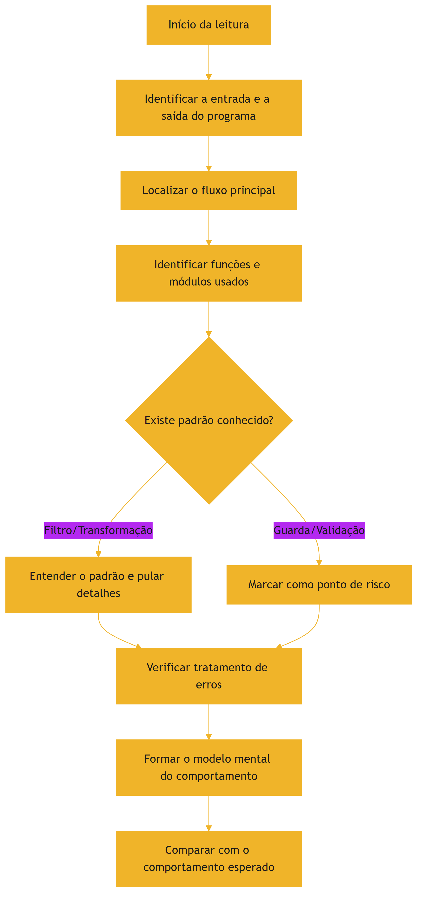

### 3.3 O Erro como Sinal, não como Obstáculo

Profissionais experientes dizem que boa parte do tempo de programação é passada lendo erros. Isso não é ineficiência — é o método. Cada mensagem de erro contém informação de diagnóstico que, quando lida com atenção, elimina tentativa e erro [5]. Quando um agente de IA roda um teste e recebe uma falha, ele repete exatamente esse ciclo: lê o erro, forma uma hipótese, corrige e reexecuta. O loop do agente — ação, observação, decisão — é a mesma disciplina de depuração que você vai dominar neste capítulo [11].

### 3.4 A Cozinha e o Livro de Receitas: Lendo Projetos Reais

Ampliando a metáfora da cozinha do Capítulo 1: um projeto de software real é como um livro de receitas profissional, com dezenas de pratos interdependentes. O chef que recebe um livro novo não lê da primeira à última página — ele examina o sumário (a estrutura de diretórios), identifica os pratos principais (os módulos centrais), e só então lê a receita específica que precisa (a função-alvo) [1]. Essa é exatamente a rotina de leitura de repositórios que os profissionais — e os agentes — usam [4]. O hábito de começar pela estrutura, e não pelo conteúdo, é o que transforma a leitura de um projeto grande de uma tarefa assustadora em um procedimento administrável [2]. Cada mensagem de erro contém informação de diagnóstico que, quando lida com atenção, elimina tentativa e erro [5]. Quando um agente de IA roda um teste e recebe uma falha, ele repete exatamente esse ciclo: lê o erro, forma uma hipótese, corrige e reexecuta. O loop do agente — ação, observação, decisão — é a mesma disciplina de depuração que você vai dominar neste capítulo [11].

### 3.5 O Leitor de Partituras

Uma analogia que atravessa o capítulo: ler código é como ler partitura [1]. O músico experiente não lê nota por nota — lê estruturas: a frase musical, a repetição, a variação [1]. O programador experiente idem: não lê token por token — lê estruturas: o contrato da função, o fluxo do loop, o estado da variável [1]. E o músico novato, que lê nota por nota, é lento e propenso a errar o ritmo — exatamente como o leitor de código que decifra caractere por caractere [1].

A partitura também tem a sua "stack trace": quando o músico erra uma nota, ele volta à frase, identifica onde o desvio começou e corrige a partir dali [2]. O leitor de código, diante de um bug, faz o mesmo: volta à cadeia de chamadas e encontra o ponto exato do desvio [2]. E o regente — que coordena vários músicos — é o arquiteto que coordena módulos: cada um toca a sua parte, e o todo só funciona se as partes estiverem afinadas entre si [1]. Quando um agente gera código, ele é um músico rápido que nunca perde o ritmo — mas que às vezes toca uma nota que não está na partitura [3]. Cabe ao regente — você — saber ler a partitura para ouvir a nota errada [3].

### 3.6 O Detetive e a Cena do Crime

A analogia de fechamento do capítulo: ler código é como investigar uma cena do crime [2]. O detetive não aceita a primeira versão dos fatos — coleta evidências, cruza relatos e reconstrói a sequência [2]. O leitor de código faz o mesmo: o relato é o comentário, as evidências são as linhas, e a reconstrução é a simulação mental da execução [2]. A stack trace é o boletim de ocorrência — a narrativa oficial da falha [2].

E há o detetive apressado — que conclui com a primeira evidência e se engana [2]. O desenvolvedor apressado conclui com a primeira leitura e corrige o sintoma errado [2]. A disciplina do detetive — coletar antes de concluir — é a disciplina do leitor de código [2]. Na era agêntica, o detetive tem um assistente veloz (o agente) que propõe conclusões em segundos [3]. O profissional não proíbe o assistente — exige evidências antes de assinar a conclusão [3]. A cena do crime não mudou; o método é que decide quem resolve o caso [2].

## 4. Técnica

### 4.1 Lendo um Programa Real

Vamos aplicar a estratégia de leitura a um programa concreto. O código abaixo processa uma lista de transações e gera um relatório. Não se preocupe em entender cada detalhe — use o método do diagrama: identifique a entrada, a saída, as funções e os pontos de risco [1].

```python
from dataclasses import dataclass


@dataclass
class Transacao:
    descricao: str
    valor: float
    categoria: str


def filtrar_por_categoria(transacoes, categoria):
    """Padrão FILTRO: retorna apenas transações da categoria informada."""
    return [t for t in transacoes if t.categoria == categoria]


def somar_valores(transacoes):
    """Padrão ACUMULAÇÃO: soma os valores da lista."""
    total = 0.0
    for t in transacoes:
        total += t.valor
    return total


def validar_transacao(t):
    """Padrão GUARDA: rejeita transações inconsistentes antes de processar."""
    if t.valor <= 0:
        raise ValueError(f"Valor inválido: {t.valor}")
    if not t.descricao.strip():
        raise ValueError("Descrição vazia")
    return True


def gerar_relatorio(transacoes):
    """Orquestra o pipeline: valida, filtra e acumula."""
    for t in transacoes:
        validar_transacao(t)
    categorias = {t.categoria for t in transacoes}
    linhas = []
    for cat in sorted(categorias):
        total = somar_valores(filtrar_por_categoria(transacoes, cat))
        linhas.append(f"{cat}: R$ {total:.2f}")
    return "\n".join(linhas)


if __name__ == "__main__":
    dados = [
        Transacao("Mercado", -150.00, "alimentacao"),
        Transacao("Salário", 4500.00, "renda"),
        Transacao("Farmácia", -89.90, "saude"),
    ]
    print(gerar_relatorio(dados))
```

### 4.2 Interpretando a Saída e os Erros

Ao executar, o programa imprime o relatório por categoria. A validação de `t.valor <= 0` é um padrão de guarda típico: testes que exercitam o comportamento pelo ponto de vista do usuário — como os da Testing Library — capturam justamente esses casos [8]. Agora, introduza deliberadamente um erro: remova o bloco `if t.valor <= 0:` e passe uma transação negativa. O programa passará a aceitar valores negativos — e você verá o comportamento errado aparecer silenciosamente. Esse é o erro mais perigoso: o que não gera mensagem, apenas resultado incorreto [2]. A defesa é o ciclo de testar primeiro: escrever o teste que falha, observar a falha, e então corrigir — o ritmo red-green-refactor que Kent Beck sistematizou [7]. Para erros que geram exceção, a mensagem aponta o arquivo e a linha:

```console
Traceback (most recent call last):
  File "relatorio.py", line 41, in <module>
    print(gerar_relatorio(dados))
  File "relatorio.py", line 32, in gerar_relatorio
    validar_transacao(t)
  File "relatorio.py", line 22, in validar_transacao
    raise ValueError(f"Valor inválido: {t.valor}")
ValueError: Valor inválido: -150.0
```

A leitura correta: o erro começa na linha 22 (o `raise`); as linhas abaixo dele mostram o caminho de chamadas — `gerar_relatorio` chamou `validar_transacao`, que falhou [3]. É de baixo para cima que se lê o stack trace: primeiro o local do erro, depois o caminho até ele [5].

### 4.3 Modificando Sem Conhecer a Linguagem Inteira

O exercício final é modificar o programa sem dominar Python por completo: adicione uma nova função que retorna apenas transações com valor negativo (despesas). Você consegue fazê-lo apenas reconhecendo o padrão `filtrar_por_categoria` e replicando sua estrutura [1].

### 4.4 Depurando com Método

A depuração com método segue um ciclo de quatro passos que você vai usar a vida inteira [5]. Primeiro, leia a mensagem de erro por inteiro — não apenas a primeira linha; o detalhe está no fim. Segundo, identifique o arquivo e a linha do erro, não o arquivo que chamou a função. Terceiro, forme uma hipótese sobre a causa — uma única hipótese, expressa em uma frase. Quarto, teste a hipótese com uma mudança mínima e observe o efeito [3]. Quando um agente de IA encontra um erro, ele executa exatamente esse ciclo — e o harness que você vai estudar nos próximos volumes valida se a correção realmente resolveu [14]. O diferencial do profissional é a disciplina: um teste por vez, uma hipótese por vez, observação do efeito antes de prosseguir [5].

### 4.5 O Valor dos Testes na Leitura

Os testes são a melhor documentação executável de um sistema: descrevem o comportamento esperado de forma verificável [6]. Ao ler um código desconhecido, os testes revelam o que as funções devem fazer — e os casos de borda revelam o que o autor considerou [8]. É por isso que os profissionais, ao abrir um repositório, leem os testes antes de ler a implementação [6]. Essa prática será formalizada no Capítulo 4 com a pirâmide de testes, mas já é útil agora: ao avaliar o código de um agente, escreva ou peça um teste para cada comportamento que você julgar crítico — e observe se o código passa [7]. Você consegue fazê-lo apenas reconhecendo o padrão `filtrar_por_categoria` e replicando sua estrutura [1]. Essa é a essência da fluência de leitura aplicada à escrita: modificar por analogia de padrões, validando o resultado a cada passo [2]. E não se surpreenda se, ao mostrar o resultado ao agente, ele sugerir a mesma refatoração que você faria: a estrutura de `Transacao` com dataclass segue o mesmo contrato claro que as ferramentas JSON Schema expõem aos modelos [15]. Note também como o modelo "enxerga" seu programa: a tokenização quebra o texto em pedaços — um visual que vale a pena conferir no tokenizer da OpenAI para entender por que comentários e nomes descritivos ajudam o agente a ler melhor [13].

### 4.6 O Script de Auditoria de Código

A leitura profissional pode ser parcialmente automatizada — e o script abaixo é o embrião de um auditor de código, o tipo de ferramenta que agentes de revisão usam em 2026 [3]:

```python
import re
from pathlib import Path


def auditar_arquivo(caminho):
    """Levanta métricas básicas de legibilidade de um arquivo Python."""
    texto = Path(caminho).read_text(encoding="utf-8")
    linhas = texto.splitlines()
    sem_comentario = [l for l in linhas if l.strip() and not l.strip().startswith("#")]
    print(f"Arquivo: {caminho}")
    print(f"  Linhas totais: {len(linhas)}")
    print(f"  Linhas de código: {len(sem_comentario)}")
    funcoes = re.findall(r"^def (\w+)", texto, re.MULTILINE)
    print(f"  Funções: {len(funcoes)} -> {', '.join(funcoes) or 'nenhuma'}")
    longas = [i + 1 for i, l in enumerate(sem_comentario) if len(l) > 79]
    print(f"  Linhas > 79 caracteres: {len(longas)}")
    if longas:
        print(f"    nas linhas: {longas[:10]}")
    return len(funcoes)


if __name__ == "__main__":
    for caminho in ["scripts/auditar-obra.py", "scripts/validar-codigo.py"]:
        if Path(caminho).exists():
            auditar_arquivo(caminho)
```

O script ilustra a relação entre leitura humana e automação [3]: a máquina conta linhas e detecta padrões; o humano interpreta o resultado e decide o que importa [1]. Essa divisão de trabalho — a máquina coleta, o humano julga — é a mesma que os agentes de revisão aplicam em escala [3]. Quando você estudar hooks e harnesses, verá exatamente esse padrão: ferramentas automáticas alimentando decisões humanas [19].

### 4.7 O Exercício da Dupla Implementação

Um dos exercícios mais eficazes para treinar leitura é a dupla implementação [1]. Escolha uma função pequena e implemente-a duas vezes: uma vez de forma direta e legível, outra vez de forma deliberadamente confusa — nomes curtos, lógica aninhada, ausência de comentários [1]. Agora troque: leia a versão confusa e reescreva-a na versão legível, explicando cada decisão [1]. O exercício coloca você nos dois papéis — autor e leitor — e ensina, pela experiência, por que as convenções existem [2].

Para agentes, o exercício tem um equivalente direto: peça a um agente para gerar duas implementações da mesma função — uma otimizada para velocidade, outra para clareza — e leia as duas criticamente [3]. A comparação revela o que a leitura humana acrescenta à geração automática: a capacidade de julgar qual versão se encaixa no contexto do projeto [3]. Esse julgamento — que nenhum teste automatizado captura por completo — é o valor do profissional que lê bem [2].

## 5. Aplica

### 5.1 Onde Isso Vive no Mundo Real

A leitura fluente de código é a porta de entrada para o code review — a prática de revisar mudanças de outras pessoas antes de integrá-las. Em 2026, com uma parcela crescente do código em pull requests sendo gerada por agentes, o code review humano deixou de ser uma etapa burocrática e virou a principal barreira de qualidade [19]. O revisor que reconhece padrões e lê erros com método é o guardião do repositório — e é exatamente esse papel que as empresas procuram preencher quando contratam profissionais de engenharia dirigida por IA [4]. E quando o revisor precisa entender a mudança completa, os pull requests são a unidade de trabalho: cada PR documenta o que mudou, por que mudou e como validar — a mesma unidade que os agentes de coding criam automaticamente [10].

### 5.2 O Erro Comum do Iniciante

O erro comum de quem começa na era da IA é pular a leitura: pedir ao agente para "consertar" um erro sem olhar a mensagem, colar a correção sem entender o que mudou e descobrir depois que o mesmo bug aparece em outro lugar. A correção é o hábito do diagnóstico: antes de pedir ajuda, leia a mensagem de erro em voz alta, identifique o arquivo e a linha, forme uma hipótese e só então — se precisar — peça ao agente para atuar sobre a sua hipótese [3]. Você, que está se formando profissional acima da média do mercado, vai perceber um diferencial: enquanto a maioria descreve o sintoma ao agente, você descreve a causa [1].

### 5.3 O Padrão Profissional

Profissionais de AIDD estruturam a leitura de código em rotinas: ao abrir um repositório desconhecido, primeiro a estrutura de diretórios e o arquivo de instruções (AGENTS.md ou CLAUDE.md), depois o fluxo principal, depois os testes [16][17]. A ordem importa e segue a mesma lógica da pirâmide de testes: começar pela base de testes unitários rápidos e só então escalar para integração [6].

### 5.4 O Ritual de Revisão de Código

A leitura fluente culmina no code review — o ritual de revisar mudanças antes de integrá-las [10]. Um review profissional segue uma ordem: entender o contexto da mudança (por que ela existe), ler o diff procurando padrões familiares, verificar se os testes cobrem os casos de borda e, por fim, avaliar a intenção — não apenas a sintaxe [2]. Em 2026, com grande parte do código de PRs gerada por agentes, o review humano é a principal barreira de qualidade [19]. Você, que está treinando a leitura de código com método, está exatamente no caminho de se tornar esse revisor [4].

### 5.5 A Autonomia de Quem Lê Bem

A consequência prática de tudo o que você aprendeu é a autonomia: quem lê código bem não depende de ninguém para saber se uma mudança é segura [1]. Pode avaliar o trabalho de outros humanos, pode avaliar o trabalho de agentes e pode tomar decisões de integração com confiança [3]. Essa autonomia é o bem mais valioso na era agêntica — e ela se constrói, um capítulo de código de cada vez [2]. A ordem importa e segue a mesma lógica da pirâmide de testes: começar pela base de testes unitários rápidos e só então escalar para integração [6]. Essa rotina é a mesma que os agentes bem configurados seguem — e é por isso que arquivos de instrução bem escritos reduzem o tempo de execução de agentes em quase 29%: eles padronizam o processo de leitura para humanos e máquinas [16].

### 5.6 O Método de Leitura em Cinco Passos

A leitura profissional de um trecho de código desconhecido segue um método que você pode praticar desde já [1]. Primeiro passo, isole o contrato: leia a assinatura da função — o que entra, o que sai, o que pode falhar — antes de ler o corpo [1]. Segundo passo, identifique os fluxos: encontre os caminhos principais do código — o caso feliz, os casos de erro e os casos-limite [2]. Terceiro passo, rastreie o estado: liste as variáveis que mudam, onde mudam e o que as faz mudar [1]. Quarto passo, reproduza mentalmente: simule uma execução com um exemplo concreto, anotando o valor de cada variável a cada passo — o exercício do Capítulo 1 aplicado a código alheio [4]. Quinto passo, questione as decisões: para cada escolha incomum, pergunte por que foi feita — e teste se a suposição ainda vale [2].

Esse método de cinco passos é exatamente o que os agentes bem configurados fazem ao abrir um repositório desconhecido: primeiro a estrutura e as instruções, depois os fluxos, depois os testes [16]. Quando você lê código com método, deixa de depender de memória e passa a depender de observação — e a observação é a base de toda a validação que vem nos próximos capítulos [1].

### 5.7 Lendo Código de Agentes

A habilidade do Capítulo 2 ganha uma aplicação nova e crítica na era agêntica: ler o código que um agente produziu [3]. A diferença não é o código — é o processo: o código de um agente pode chegar sem a narrativa que o acompanharia num PR humano [3]. O profissional aplica o mesmo método de cinco passos, com três perguntas extras [3]. A primeira: o código faz o que o prompt pediu? (trace a intenção original até o resultado). A segunda: o código faz algo que o prompt não pediu? (mudanças colaterais são o erro mais comum de agentes). A terceira: o código respeita as convenções do projeto? (estilo, nomes, estrutura — o que os testes e os arquivos de instrução definem) [16].

Com 92% dos desenvolvedores usando IA diariamente e a confiança na exatidão caindo para 29%, a leitura crítica de código gerado é a habilidade mais valorizada do mercado [19]. O que você treinou neste capítulo — ler com método, rastrear estado, questionar decisões — é exatamente a diferença entre quem cola código e quem audita código [2]. E essa auditoria, como você verá no Capítulo 4, transforma-se em portão determinístico: o teste que o agente não pode enganar [20].

### 5.8 O Roteiro de Prática Diária

A leitura de código é habilidade de treino — e o treino tem um roteiro que cabe em vinte minutos por dia [1]. Primeiro dia da semana: leia a assinatura de cinco funções de um projeto real e escreva, antes de ver o corpo, o que cada uma deveria fazer [1]. Segundo dia: leia o corpo de uma função e anote os fluxos — caso feliz, casos de erro, casos-limite [2]. Terceiro dia: rastreie o estado — liste as variáveis que mudam e onde [1]. Quarto dia: simule uma execução com um exemplo concreto, no papel [4]. Quinto dia: leia a stack trace de um erro real e explique, por escrito, o que aconteceu [2]. Seis semanas desse roteiro — vinte minutos por dia — produzem mais progresso que um curso inteiro de memorização de sintaxe [1].

O mesmo roteiro funciona para avaliar agentes [3]. Quando um agente propõe uma mudança, aplique os mesmos cinco passos à mudança: o contrato da função mudou? Os fluxos novos estão cobertos por testes? O estado novo é consistente? [3] Essa rotina transforma a auditoria de código gerado — a habilidade mais valorizada de 2026 — de exercício ocasional em hábito diário [19].

### 5.9 O Vocabulário Como Porta de Entrada

Este capítulo deu a você um vocabulário técnico que funciona como senha de acesso às conversas profissionais [1]. Função, contrato, módulo, stack trace, legibilidade, refatoração, estado — cada termo carrega uma definição precisa que permite conversar com desenvolvedores e com agentes sem ambiguidade [1]. Quando os próximos capítulos usarem esses termos, você não vai traduzir — vai entender [2].

O teste prático do vocabulário: leia uma issue de um projeto open source e tente identificar, nas discussões, cada termo deste capítulo em uso [1]. Depois, escreva a sua própria descrição de um bug — com contrato, fluxos e estado — e compare com a descrição que um desenvolvedor experiente escreveria [2]. Essa comparação mostra exatamente onde está a sua lacuna — e é essa lacuna que a prática diária da seção anterior fecha [1].

### 5.10 O Repertório de Leitura do Profissional

O profissional constrói, com o tempo, um repertório de leitura — um conjunto de padrões que reconhece à primeira vista [1]. O contrato antes do corpo, o guard no topo da função, a validação na borda do sistema, o loop com condição de saída clara, o estado que muda em poucos lugares [1]. Cada padrão reconhecido economiza leitura: o profissional não relê o padrão — confirma que ele está lá e passa adiante [1].

Esse repertório é o mesmo que os agentes bem instruídos adquirem [16]. Os arquivos de instrução descrevem os padrões do projeto — e o agente, ao lê-los, reconhece o repertório sem precisar inferir [16]. O humano e o agente chegam ao mesmo lugar por caminhos diferentes: o humano por experiência, o agente por instrução [16]. E o profissional que reconhece padrões é o que consegue avaliar, em segundos, se o código de um agente segue o repertório do projeto — ou o viola [3].

### 5.11 O Custo da Leitura Negligente

Fechar o capítulo com o custo da leitura negligente [1]. O desenvolvedor que não lê o contrato antes de alterar quebra a função sem saber [1]. O que não rastreia o estado introduz bugs invisíveis [1]. O que não questiona decisões copia erros de um lugar para outro [1]. O que não simula execução aceita código que parece certo e é errado [1]. Cada negligência é barata no momento — e cara quando o bug chega a produção [2].

Na era agêntica, o custo escala [3]. O código gerado por IA chega fluente e confiante — e a leitura negligente aceita exatamente o que a leitura cuidadosa rejeitaria [3]. O profissional que lê com método é o portão humano entre a geração e a produção [3]. Este capítulo não ensinou apenas a ler código — ensinou a ler com método, e o método é o que separa a adoção segura de IA da adoção cega [2].

## 6. Conclusão

Neste capítulo, você aprendeu que ler código é uma habilidade treinável e estruturada: reconhecer funções como contratos, módulos como organização, erros como comunicação e stack traces como rastro da execução [1]. Você dominou os padrões de leitura — filtro, acumulação, transformação, guarda — e aplicou o método de modificar por analogia sem precisar dominar a linguagem por completo [2]. Essa capacidade de leitura é o que o diferencia no mercado: enquanto a maioria usa a IA como oráculo, você a usa como instrumento que sabe auditar [4].

Resumindo em três pontos: primeiro, função é contrato e módulo é organização — ler começa por reconhecer esses blocos [1]; segundo, erro é comunicação — o stack trace é o rastro que leva à causa [5]; terceiro, padrões de leitura permitem entender código novo sem traduzir palavra por palavra [2]. Com esses três pontos, você está pronto para avaliar com critério o que os agentes produzem — a habilidade que o Capítulo 3 vai conectar ao fluxo de Git e pull requests [9].

### O Desafio Deste Capítulo

O desafio tem três níveis, como no Capítulo 1. Nível um: abra um projeto de código aberto pequeno no GitHub e liste, em um parágrafo, a entrada, a saída e o fluxo principal do programa. Nível dois: introduza um bug deliberado no programa de transações deste capítulo, leia o stack trace resultante e explique a causa sem consultar o código original. Nível três: peça a um agente para explicar o programa `gerar_relatorio` e compare a explicação dele com a sua — verificando se o agente identificou corretamente os padrões de filtro, acumulação e guarda [1]. Os três níveis exercitam leitura estrutural, leitura de erros e avaliação de agentes — as três competências deste capítulo [3]. Você dominou os padrões de leitura — filtro, acumulação, transformação, guarda — e aplicou o método de modificar por analogia sem precisar dominar a linguagem por completo [2]. Essa capacidade de leitura é o que o diferencia no mercado: enquanto a maioria usa a IA como oráculo, você a usa como instrumento que sabe auditar [4].

No próximo capítulo, vamos construir sobre esta fundação a ferramenta que sustenta todo fluxo de desenvolvimento moderno: o Git. Você vai aprender controle de versão, branches e pull requests — a base sem a qual nenhum fluxo agêntico funciona, porque é sobre o Git que os agentes criam branches, abrem pull requests e rodam testes antes de qualquer merge [9][10]. E quando agentes precisarem se conectar a essas ferramentas de forma padronizada, o Model Context Protocol entra em cena — tema do Capítulo 7 e dos volumes seguintes da série [20].

## 7. Referências Bibliográficas

[1] KARPATHY, Andrej. Software 3.0: Software in the Age of AI. Disponível em: https://www.latent.space/p/s3. Acesso em: 5 ago. 2026.

[2] SITEPOINT. Vibe Coding 2026: The Complete Guide to AI-First Development. Disponível em: https://www.sitepoint.com/vibe-coding-2026-complete-guide/. Acesso em: 5 ago. 2026.

[3] WENG, Lilian. Extrinsic Hallucinations in LLMs. Disponível em: https://lilianweng.github.io/posts/2024-07-07-hallucination/. Acesso em: 5 ago. 2026.

[4] CODERABBIT. From Copilot to agents: The history of AI coding. Disponível em: https://www.coderabbit.ai/blog/a-very-brief-history-of-ai-coding-from-copilot-to-next-gen-agents. Acesso em: 5 ago. 2026.

[5] FOWLER, Martin. Continuous Integration. Disponível em: https://martinfowler.com/articles/continuousIntegration.html. Acesso em: 5 ago. 2026.

[6] VOCKE, Ham; FOWLER, Martin. The Practical Test Pyramid. Disponível em: https://martinfowler.com/articles/practical-test-pyramid.html. Acesso em: 5 ago. 2026.

[7] BECK, Kent. Test-Driven Development: By Example. Boston: Addison-Wesley Professional, 2002.

[8] TESTING LIBRARY. Guiding Principles. Disponível em: https://testing-library.com/docs/guiding-principles/. Acesso em: 5 ago. 2026.

[9] CHACON, Scott; STRAUB, Ben. Pro Git. 2. ed. Apress/Git SCM, 2014. Disponível em: https://git-scm.com/book/en/v2. Acesso em: 5 ago. 2026.

[10] GITHUB DOCS. About pull requests. Disponível em: https://docs.github.com/en/pull-requests/collaborating-with-pull-requests/proposing-changes-to-your-work-with-pull-requests/about-pull-requests. Acesso em: 5 ago. 2026.

[11] WENG, Lilian. LLM-Powered Autonomous Agents. Disponível em: https://lilianweng.github.io/posts/2023-06-23-agent/. Acesso em: 5 ago. 2026.

[12] OPENAI. Function Calling Guide. Disponível em: https://developers.openai.com/api/docs/guides/function-calling. Acesso em: 5 ago. 2026.

[13] OPENAI. Tokenizer (ferramenta interativa). Disponível em: https://platform.openai.com/tokenizer. Acesso em: 5 ago. 2026.

[14] ANTHROPIC. Effective Context Engineering for AI Agents. Disponível em: https://www.anthropic.com/engineering/effective-context-engineering-for-ai-agents. Acesso em: 5 ago. 2026.

[15] PROMPTING GUIDE. Function Calling in AI Agents. Disponível em: https://www.promptingguide.ai/agents/function-calling. Acesso em: 5 ago. 2026.

[16] LULLA, Jai Lal; et al. On the Impact of AGENTS.md Files on the Efficiency of AI Coding Agents. Disponível em: https://arxiv.org/html/2601.20404v1. Acesso em: 5 ago. 2026.

[17] TIAN PAN. CLAUDE.md and AGENTS.md: The Configuration Layer That Makes AI Coding Agents Actually Follow Your Rules. Disponível em: https://tianpan.co/blog/2026-02-25-claude-md-agents-md-ai-coding-agent-instruction-files. Acesso em: 5 ago. 2026.

[18] CHROMA. Context Rot: How Increasing Input Tokens Impacts LLM Performance. Disponível em: https://www.trychroma.com/research/context-rot. Acesso em: 5 ago. 2026.

[19] KEYHOLE SOFTWARE. Vibe Coding Trends 2026: Adoption, Productivity, and Code Quality Data. Disponível em: https://keyholesoftware.com/vibe-coding-trends-2026/. Acesso em: 5 ago. 2026.

[20] ANTHROPIC. Introducing the Model Context Protocol. Disponível em: https://www.anthropic.com/news/model-context-protocol. Acesso em: 5 ago. 2026.

# PARTE II — O Oficio do Desenvolvedor

# Capítulo 3: Git, Branches e Pull Requests: a Base do Fluxo Agêntico

## 1. Introdução

Nos dois primeiros capítulos, você construiu a lógica de programação e a fluência de leitura de código. Agora vamos estudar a ferramenta que sustenta todo o fluxo de desenvolvimento moderno — e que se tornou, na era da IA, o sistema circulatório dos agentes: o Git [1]. Se você já se perguntou como um agente de coding consegue criar um branch, modificar arquivos, rodar testes e abrir um pull request sem supervisão, a resposta está neste capítulo: o Git é a infraestrutura que torna esse fluxo agêntico possível [2].

Este capítulo tem três objetivos. Primeiro, entender o modelo mental do Git — snapshots, commits e o histórico imutável que registra cada mudança. Segundo, dominar branches e pull requests como mecanismos de isolamento e revisão. Terceiro — e este é o diferencial da série — conectar tudo ao mundo agêntico: é sobre o Git que os agentes constroem seu trabalho, e é sobre os pull requests que os humanos revisam o que os agentes produziram [3]. Sem Git, nenhum fluxo agêntico funciona; com ele, você ganha a base para os Capítulos 4 a 10, que constroem testes, contextos e harnesses sobre essa fundação [4].

## 2. Explica

### 2.1 O Modelo de Snapshots

O Git não armazena "diferenças" entre versões; ele armazena snapshots — fotografias completas do estado do projeto a cada commit [1]. Quando você faz um commit, o Git registra o estado de todos os arquivos naquele momento, apontando para o snapshot anterior. Essa arquitetura dá ao Git três superpoderes: histórico imutável (ninguém apaga o passado), ramificação barata (criar um branch é só criar um ponteiro) e recuperação total (qualquer estado passado pode ser restaurado) [2]. O livro Pro Git, de Chacon e Straub, descreve esse modelo em detalhe — e é a referência definitiva da ferramenta [1].

### 2.2 Commits: A Unidade de História

Um commit é uma unidade de mudança com mensagem, autor e timestamp. A qualidade do histórico depende da qualidade das mensagens: um commit que diz "corrige bug" é quase inútil; um commit que diz "valida valor negativo no cálculo de média" documenta decisão [1]. Essa disciplina vale duplamente na era dos agentes: quando um agente faz dezenas de commits, o histórico precisa ser legível para que o humano consiga revisar o que aconteceu [12].

### 2.8 Boas Práticas de Commit para o Fluxo Agêntico

As boas práticas de commit ganham contornos específicos quando agentes participam do fluxo [8]. A primeira é a atomicidade: um commit deve conter uma única mudança lógica — correção de um bug, implementação de uma feature — para que o histórico conte uma história linear [1]. A segunda é a mensagem estruturada: prefixos de convenção (feat, fix, refactor, docs, test, build) indicam o tipo de mudança, e o corpo explica o porquê [1]. A terceira é a rastreabilidade: referências ao problema ou ao contexto (números de issue) permitem ligar o commit à origem [3]. Quando um agente trabalha em um repositório com AGENTS.md, essas convenções são instruções explícitas — o agente segue o padrão definido e o humano audita o histórico [8][10].

### 2.9 Repositórios Remotos e Colaboração Distribuída

O Git é distribuído: cada máquina tem uma cópia completa do histórico, e os repositórios remotos (GitHub, GitLab, Bitbucket) são pontos de sincronização e colaboração [1]. O fluxo push/pull transfere mudanças; o fork cria uma cópia independente para contribuições externas; e o pull request conecta forks e branches ao repositório principal [3]. Esse modelo distribuído é o que permite o trabalho paralelo em escala global — e é a infraestrutura sobre a qual os agentes de coding operam: o agente trabalha em um clone, faz push para o seu branch e abre o PR [13]. A compreensão de que não existe um "servidor central do Git" — apenas um acordo de colaboração — é o que permite entender por que o modelo funciona tão bem em projetos abertos [1]. A qualidade do histórico depende da qualidade das mensagens: um commit que diz "corrige bug" é quase inútil; um commit que diz "valida valor negativo no cálculo de média" documenta decisão [1]. Essa disciplina vale duplamente na era dos agentes: quando um agente faz dezenas de commits, o histórico precisa ser legível para que o humano consiga revisar o que aconteceu [12]. Ferramentas de revisão automatizada, como as descritas pelo CodeRabbit, leem exatamente esse histórico para avaliar mudanças [12].

### 2.3 Branches: O Isolamento do Trabalho

Branch é um ponteiro móvel para um commit — um "universo paralelo" onde o trabalho acontece isolado da linha principal [2]. O fluxo básico é sempre o mesmo: criar um branch a partir de um ponto estável, trabalhar, testar e, quando pronto, integrar de volta [4]. As estratégias de branching organizam esse fluxo em padrões: o Git Flow separa develop e master com releases; o GitHub Flow mantém uma main sempre deployável com branches curtos; o trunk-based development integra mudanças pequenas e frequentes diretamente na linha principal [4]. A escolha da estratégia é uma decisão de arquitetura do time — e os agentes de IA seguem a estratégia que o time define nos arquivos de instrução [10].

### 2.4 Pull Requests: A Porta da Revisão

Pull request é o mecanismo que une a mudança ao time: o autor propõe a integração do branch, e os revisores analisam, comentam e aprovam antes do merge [3]. O pull request carrega três funções: documentação (o diff conta a história da mudança), validação (os testes rodam antes de qualquer merge) e governança (ninguém integra sem aprovação) [3]. No fluxo agêntico, o pull request é o ponto de contato entre a máquina e o humano: o agente produz a mudança e abre o PR; o humano revisa e decide [2].

### 2.5 Por Que Agentes Dependem do Git

Em 2026, os agentes de coding — Claude Code, Codex, Cursor, OpenCode — operam sobre o Git de forma nativa: criam branches para cada tarefa, fazem commits incrementais, rodam a suíte de testes e abrem pull requests automaticamente [13]. O estudo empírico de Lulla e colaboradores sobre o impacto de AGENTS.md mostrou que a eficiência dos agentes melhora dramaticamente quando o repositório define regras claras — e o Git é o terreno onde essas regras se manifestam [8]. Sem um repositório versionado e organizado, o agente trabalha no escuro; com ele, o agente trabalha com contexto completo [17].

### 2.6 O Modelo de Objetos do Git

Por trás dos comandos, o Git opera com um modelo de objetos que vale a pena entender para usar a ferramenta com profundidade [1]. Os principais objetos são: o blob (conteúdo de um arquivo), a árvore (estrutura de diretórios que aponta para blobs e subárvores), o commit (snapshot com mensagem, autor e ponteiros) e o branch (ponteiro para um commit). Cada objeto é endereçado por um hash SHA-1 calculado sobre seu conteúdo — o que torna o histórico imutável e verificável [1]. Essa arquitetura explica propriedades que os profissionais usam: integridade (qualquer alteração no conteúdo muda o hash), histórico completo (todos os snapshots estão lá) e ramificação barata (criar um ponteiro custa nada) [1]. O Pro Git dedica um capítulo inteiro ao funcionamento interno — e a leitura vale quando o fluxo agêntico exige debug de histórico [1].

### 2.7 Conflitos: O Ponto de Fricção do Trabalho Paralelo

Quando dois ramos de trabalho mudam o mesmo trecho do mesmo arquivo, o merge produz um conflito — e o Git pede a decisão humana [1]. O conflito não é um defeito do Git: é a consequência natural do paralelismo, e o mecanismo que garante que nenhuma mudança se perca silenciosamente [2]. Resolver um conflito exige ler os dois lados, entender a intenção de cada mudança e decidir a versão final [3]. Na era agêntica, os conflitos se multiplicam: vários agentes trabalhando no mesmo repositório colidem com mais frequência [13]. O profissional — e o harness que ele projeta — precisa de uma política de resolução: dividir o trabalho por áreas de código, manter branches curtos e integrar com frequência para reduzir a probabilidade de colisão [4]. O estudo empírico de Lulla e colaboradores sobre o impacto de AGENTS.md mostrou que a eficiência dos agentes melhora dramaticamente quando o repositório define regras claras — e o Git é o terreno onde essas regras se manifestam [8]. Sem um repositório versionado e organizado, o agente trabalha no escuro; com ele, o agente trabalha com contexto completo [17]. A diferença entre um autocomplete que sugere linhas e um agente que abre pull requests inteiros é exatamente a camada de execução sobre o Git — o divisor de águas entre as eras que o ITECS analisa [20].

## 3. Ilustra

### 3.1 A Analogia do Livro Colaborativo

Imagine um livro sendo escrito por um time de autores, com um editor-chefe. Cada autor recebe uma cópia do manuscrito atual (branch). Eles trabalham em capítulos separados, em cópias paralelas, sem atropelar uns aos outros. Quando um autor termina um capítulo, entrega ao editor uma proposta de integração (pull request). O editor revisa o texto (code review), pede ajustes e, só quando aprova, publica no manuscrito oficial (merge). O Git é esse sistema de controle editorial — e o editor é o humano que governa o que entra na versão oficial [3]. Agora imagine que alguns autores sejam agentes de IA: eles trabalham mais rápido, mas precisam das mesmas regras de revisão — e é o editor que garante a qualidade [2].

### 3.5 A Linha do Tempo Visual do Git

Um dos conceitos que mais confundem iniciantes é a diferença entre a linha do tempo do Git e o estado do diretório de trabalho [1]. A linha do tempo é o histórico imutável de commits — a memória do projeto. O diretório de trabalho é o estado atual dos arquivos, que pode divergir do último commit (arquivos modificados, novos, deletados) [1]. O `git status` mostra exatamente essa divergência; o `git add` move mudanças para a área de preparação; o `git commit` congela o snapshot na linha do tempo [1]. Quando você lê diagramas de Git — como o do início da seção — está lendo a linha do tempo; quando executa comandos, está operando sobre o estado atual [1]. Essa separação mental é o que torna o Git intuitivo em vez de misterioso [2]. Cada autor recebe uma cópia do manuscrito atual (branch). Eles trabalham em capítulos separados, em cópias paralelas, sem atropelar uns aos outros. Quando um autor termina um capítulo, entrega ao editor uma proposta de integração (pull request). O editor revisa o texto (code review), pede ajustes e, só quando aprova, publica no manuscrito oficial (merge). O Git é esse sistema de controle editorial — e o editor é o humano que governa o que entra na versão oficial [3]. Agora imagine que alguns autores sejam agentes de IA: eles trabalham mais rápido, mas precisam das mesmas regras de revisão — e é o editor que garante a qualidade [2].

### 3.2 O Diagrama do Fluxo de Branch e Merge

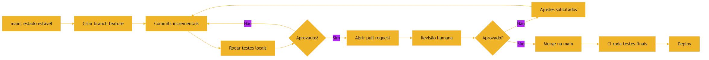

### 3.3 O Agente no Fluxo

O mesmo diagrama descreve o trabalho de um agente autônomo: ele cria o branch, faz commits, roda testes, abre o PR e aguarda revisão. A diferença está na velocidade e na escala — um agente pode abrir dezenas de PRs por dia [13]. É exatamente por isso que a governança humana não pode desaparecer: em 2026, entre 40% e 60% do código em PRs corporativos é gerado por IA, e a confiança na exatidão caiu para 29% [15]. O pull request virou o portão de qualidade — e você, leitor, está se preparando para ser quem opera esse portão [3].

### 3.4 A Ponte do Livro: Autores, Editor e Imprensa

Ampliando a analogia do Capítulo 2: um livro profissional passa por três estágios — os autores escrevem capítulos em rascunhos paralelos (branches), o editor revisa e aprova cada capítulo (pull request), e a imprensa publica a versão final (merge e deploy) [3]. Sem o controle editorial, o livro vira uma colcha de retalhos; com ele, cada capítulo chega ao leitor revisado e coerente [3]. Na era agêntica, a analogia se estende: os "autores" incluem agentes de IA que escrevem capítulos inteiros (branches de código) — e o editor humano precisa revisar com a mesma seriedade, porque a velocidade dos autores-autônomos multiplica o risco de erros [15]. O controle editorial é a governança que separa um repositório saudável de um caos [2]. A diferença está na velocidade e na escala — um agente pode abrir dezenas de PRs por dia [13]. É exatamente por isso que a governança humana não pode desaparecer: em 2026, entre 40% e 60% do código em PRs corporativos é gerado por IA, e a confiança na exatidão caiu para 29% [15]. O pull request virou o portão de qualidade — e você, leitor, está se preparando para ser quem opera esse portão [3]. O modelo de agente que atravessa esse portão é o mesmo que Lilian Weng formalizou: LLM, memória, planejamento e ferramentas — cada ferramenta uma chamada a um sistema como o Git [11].

### 3.6 O Diagrama do Fluxo de Merge

O fluxo completo de integração — o cenário mais comum do dia a dia — merece o seu diagrama [1]:

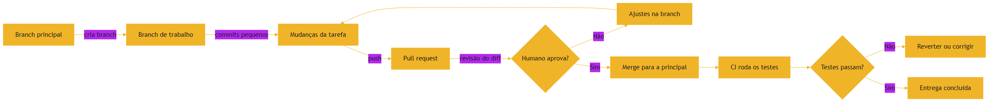

O diagrama condensa o ciclo que você executou na mão: branch, commits, PR, revisão, merge, validação [1]. Note que o portão de qualidade aparece após o merge — e no Capítulo 4 você verá por que os fluxos maduros rodam o CI antes do merge, não depois [6]. Esse mesmo diagrama, com um agente no lugar do autor, é o fluxo de trabalho agêntico padrão de 2026 [2].

## 4. Técnica

### 4.1 O Fluxo Básico do Git

Vamos executar o fluxo completo na prática. Os comandos abaixo seguem o GitHub Flow: branch curto, testes, PR e merge [4]. Cada comando tem um papel no ciclo:

```bash
# 1. Inicia o repositório e cria o primeiro commit
git init
git add .
git commit -m "feat: estrutura inicial do projeto"

# 2. Cria um branch de trabalho a partir da main
git checkout -b feature/valida-despesas

# 3. Trabalha e faz commits incrementais
git add app.py
git commit -m "feat: valida valores negativos na transacao"

# 4. Publica o branch no remoto e abre o pull request
git push -u origin feature/valida-despesas

# 5. Após a revisão e o merge, sincroniza a main
git checkout main
git pull
```

### 4.6 Trabalhando com Histórico e Diagnóstico

Além do fluxo básico, o profissional domina os comandos de diagnóstico e histórico — as ferramentas que transformam o Git de depósito de código em sistema de inteligência [1]. `git log --oneline --graph` visualiza o histórico em árvore, mostrando a relação entre branches e merges. `git blame` identifica quem mudou cada linha e quando — essencial para entender a origem de um comportamento. `git diff` mostra exatamente o que mudou entre estados; `git show <commit>` detalha um commit específico [1]. Essas ferramentas são o equivalente a um sistema de auditoria: permitem reconstruir o raciocínio de qualquer mudança, humana ou agêntica [8]. Quando um comportamento estranho aparece em produção, o `git log` e o `git blame` são os primeiros pontos de partida do diagnóstico — e o `git bisect` localiza o commit culpado em minutos [1].

### 4.7 Ignorando o Que Não Deve Ser Versionado

Um aspecto prático que separa iniciantes de profissionais é o arquivo `.gitignore` — a lista de arquivos e diretórios que o Git não deve rastrear [1]. Dependências instaladas, arquivos de ambiente com segredos, artefatos de build e caches não devem entrar no histórico: poluem o repositório, inflam os clones e expõem credenciais [1]. O profissional configura o `.gitignore` no início do projeto e o mantém atualizado — e o harness agêntico, por meio de AGENTS.md, instrui o agente a nunca commitar arquivos ignorados ou segredos [10]. A regra de ouro: se um arquivo pode ser regenerado, ele não precisa ser versionado; se contém segredo, jamais deve ser [1]. Essa disciplina de higiene do repositório é pré-requisito para o trabalho em equipe — e para o trabalho com agentes que, sem instrução, podem commitar qualquer coisa [8]. Cada comando tem um papel no ciclo:

```bash
# 1. Inicia o repositório e cria o primeiro commit
git init
git add .
git commit -m "feat: estrutura inicial do projeto"

# 2. Cria um branch de trabalho a partir da main
git checkout -b feature/valida-despesas

# 3. Trabalha e faz commits incrementais
git add app.py
git commit -m "feat: valida valores negativos na transacao"

# 4. Publica o branch no remoto e abre o pull request
git push -u origin feature/valida-despesas

# 5. Após a revisão e o merge, sincroniza a main
git checkout main
git pull
```

### 4.2 O Que Acontece por Trás de Cada Comando

Cada comando acima corresponde a um conceito do modelo de snapshots [1]. `git init` cria o repositório — o diretório `.git` que guarda todo o histórico. `git add` prepara arquivos (staging), selecionando o que entrará no próximo snapshot. `git commit` congela o snapshot com uma mensagem. `git checkout -b` cria e ativa um branch — um ponteiro que começa no commit atual. `git push` sincroniza com o remoto, habilitando o pull request [2]. O fluxo agêntico usa exatamente estes mesmos comandos — e é por isso que entendê-los é pré-requisito para orquestrar agentes [8].

### 4.3 O Pull Request como Contrato

Um pull request bem construído é um contrato: título que resume, descrição que explica o porquê, testes que validam e um diff que mostra o que mudou [3]. Quando um agente abre um PR, o humano revisa exatamente esses quatro elementos. A automação de revisão — linters, testes em CI — roda antes da revisão humana e reduz o ruído: o revisor foca no que a máquina não consegue avaliar, como design e intenção [5].

### 4.4 O Ciclo Completo: do Clone ao Merge

Vamos ampliar o fluxo para o ciclo completo de trabalho em equipe — o mesmo que os agentes percorrem [1]. O fluxo começa com `git clone`, que copia o repositório remoto para a máquina local com todo o histórico. Em seguida, `git status` mostra o estado dos arquivos; `git diff` mostra as mudanças não commitadas; `git log` mostra o histórico. O ciclo de trabalho é: `git pull` para sincronizar, criar o branch, trabalhar, `git add` + `git commit` com mensagens claras, `git push`, abrir o PR, revisar, e `git merge` após aprovação [1]. Cada comando responde a uma pergunta concreta — e o profissional os usa com fluência, sem consultar a documentação a cada passo [3]. Quando o agente executa esse fluxo por você, é esse conhecimento que permite auditar cada passo [8].

### 4.5 Git e o Estado do Repositório

Um conceito que merece destaque é o estado em que os arquivos podem estar: não rastreado (novo), modificado (mudado desde o último commit), preparado (staged, marcado para o próximo commit) e commitado (seguro no histórico) [1]. `git status` mostra esses estados, e entender a transição entre eles é o que permite usar o Git sem medo [1]. Quando um agente comete erros de staging — adicionando arquivos que não deveria — é o humano que percebe ao revisar o `git status` e o diff do PR [8]. Esse domínio do estado é também a base das regras que os harnesses definem: AGENTS.md pode instruir o agente a nunca commitar segredos ou arquivos gerados [10]. Quando um agente abre um PR, o humano revisa exatamente esses quatro elementos. A automação de revisão — linters, testes em CI — roda antes da revisão humana e reduz o ruído: o revisor foca no que a máquina não consegue avaliar, como design e intenção [5].

### 4.8 O Script de Estado do Repositório

A automação do Git não precisa de bibliotecas — a linha de comando é a API, e o Python pode orquestrá-la [3]. O script abaixo resume o estado de um repositório em um relatório — o mesmo tipo de verificação que um harness roda antes de permitir que um agente faça merge [6]:

```python
import subprocess


def git_estado():
    """Produz um relatório de saúde do repositório atual."""
    def rodar(*args):
        return subprocess.run(["git", *args], capture_output=True, text=True).stdout.strip()

    print("=== Saúde do repositório ===")
    branch = rodar("branch", "--show-current")
    print(f"Branch atual: {branch or '(detached HEAD)'}")
    sujos = rodar("status", "--porcelain")
    print(f"Arquivos alterados: {len([l for l in sujos.splitlines() if l])}")
    ultimos = rodar("log", "--oneline", "-5")
    print("Últimos commits:")
    print(ultimos)


if __name__ == "__main__":
    git_estado()
```

O princípio que o script ilustra é a interface de linha de comando como contrato: cada comando do Git tem entradas, saídas e códigos de saída — exatamente como as APIs que você verá no Capítulo 6 [3]. Um harness que verifica o estado do repositório antes de agir é a ponte entre o Git deste capítulo e os testes do Capítulo 4 [6].

### 4.9 O Treino do Conflito

O conflito de merge é o momento em que o modelo mental do Git é testado [3]. O treino mais eficaz: crie um conflito de propósito [3]. Crie uma branch, altere uma linha de um arquivo, volte à principal, altere a mesma linha, e faça o merge [3]. Agora resolva o conflito com método: leia as duas versões — a sua e a da branch — entenda a intenção de cada uma e escreva a versão que combina ambas [3]. Repita o treino com conflitos mais complexos: arquivos renomeados, alterações em estruturas de dados [3].

O treino vale para humanos e para o diagnóstico de agentes [1]. Quando um agente encontra um conflito, ele pode propor uma resolução que privilegia a versão dele — e o profissional precisa ler o conflito para decidir [1]. A resolução de conflito é, no fundo, leitura crítica de código (Capítulo 2) aplicada à colisão de intenções [2]. Quem treina conflitos não teme o aviso do Git — teme apenas o merge sem entender o que colidiu [3].

## 5. Aplica

### 5.1 Onde Isso Vive no Mundo Real

Todo repositório profissional usa o fluxo de branches e PRs — do projeto de código aberto ao sistema bancário mais regulado [3]. A integração contínua (CI) automatiza a validação: a cada push, o pipeline roda testes, linters e builds, e o GitHub Actions ou o GitLab CI reportam o resultado direto no PR [6][7]. É esse circuito — push, CI, PR, review, merge — que dá escala ao desenvolvimento de software moderno [5]. A automação só é confiável se o que ela valida for verdade: a ideia de que o software vira "o programa" e a janela de contexto vira "o interpretador" — a visão de Software 3.0 do Karpathy — depende de termos processos determinísticos como o Git e o CI segurando a execução [18].

### 5.2 O Erro Comum do Iniciante

O erro clássico de quem começa é commitar tudo na main, sem branches, e pedir revisão depois de tudo pronto. A correção é inverter a ordem: branch pequeno desde o início, commits incrementais com mensagens claras, e revisão antes de integrar [4]. Na era da IA, esse erro se amplifica: se você deixar o agente commitar direto na main sem revisão, o repositório vira um agregado de mudanças não auditadas [2]. A prática correta — e aqui está o diferencial que separa o profissional — é tratar o PR como unidade de qualidade: cada mudança, humana ou agêntica, passa pelo mesmo portão [3].

### 5.6 Quando o Fluxo Agêntico Encontra o Git

O cenário real que resume este capítulo: um time adota um agente de coding que recebe a tarefa de corrigir um bug. O agente segue o fluxo aprendido — cria o branch `fix/erro-login`, faz commits incrementais com mensagens claras, roda a suíte local e abre o PR. O CI roda no push e reporta verde. O humano revisa o diff, verifica a cobertura dos testes e aprova [13]. Esse cenário, que em 2026 é rotina em milhares de equipes, só funciona porque cada peça do fluxo que você estudou está presente: o Git dá a estrutura, o branch isola, o PR governa e o CI valida [2][5]. Quando uma dessas peças falha — um agente sem instruções commitando na main, um PR sem testes — a qualidade cai [15]. Por isso a série trata o Git não como ferramenta do passado, mas como a fundação do futuro agêntico [1]. A correção é inverter a ordem: branch pequeno desde o início, commits incrementais com mensagens claras, e revisão antes de integrar [4]. Na era da IA, esse erro se amplifica: se você deixar o agente commitar direto na main sem revisão, o repositório vira um agregado de mudanças não auditadas [2]. A prática correta — e aqui está o diferencial que separa o profissional — é tratar o PR como unidade de qualidade: cada mudança, humana ou agêntica, passa pelo mesmo portão [3]. A descrição do PR é um contrato escrito — e é o mesmo tipo de contrato que o function calling exige do modelo para invocar ferramentas: nome, propósito e parâmetros claros [19].

### 5.3 O Padrão Profissional em 2026

O fluxo profissional do AIDD combina Git com arquivos de instrução: o repositório define, em AGENTS.md ou CLAUDE.md, as convenções de branch, commit e revisão que os agentes devem seguir [8][9]. Estudos mostram que essa camada de configuração reduz o tempo de execução dos agentes em quase 29% e o consumo de tokens de saída em cerca de 17% [8].

### 5.4 O Review como Cerimônia de Qualidade

O code review, que você conheceu no Capítulo 2, ganha no Git a sua infraestrutura: o pull request é a cerimônia onde a qualidade acontece [3]. Um review eficaz combina automação e julgamento humano: a automação (testes, linters, análise estática) elimina as falhas mecânicas; o humano avalia a intenção, o design e os casos que a automação não cobre [5]. Em equipes que usam agentes, essa divisão de trabalho é ainda mais importante: a automação roda a cada push do agente, e o humano revisa o diff final com o contexto completo [3]. Estabelecer o ritual — quem revisa, o que se espera do review, quais são os critérios de aprovação — é decisão de arquitetura de processo, e os harnesses que você estudará nos próximos volumes automatizam parte dele [10].

### 5.5 Git como Ferramenta de Recuperação

Uma habilidade profissional subestimada é o uso do Git como ferramenta de recuperação de desastres [1]. O `git log` revela o estado anterior de qualquer arquivo; `git checkout` e `git revert` desfazem mudanças; `git stash` guarda trabalho em andamento; `git bisect` localiza o commit que introduziu um bug [1]. Em equipes agênticas, essa capacidade é essencial: quando um agente introduz uma mudança regressiva, o `git bisect` encontra o commit culpado em minutos, e o `git revert` o desfaz com segurança [8]. O Git não é apenas o sistema circulatório do trabalho — é também a rede de segurança que torna a experimentação agêntica segura [1].

### 5.7 Git e o Fluxo de Dados: Como o Histórico Conta a História

O histórico do Git é também um registro de decisões de dados e arquitetura [1]. Olhar o histórico de um arquivo revela por que ele evoluiu daquela forma: quais features foram adicionadas, quais bugs foram corrigidos e quais decisões foram revertidas [1]. Em times agênticos, esse registro é ainda mais valioso: o histórico documenta o que os agentes fizeram, permitindo auditar padrões de erro e acerto ao longo do tempo [8]. O `git log --follow <arquivo>` acompanha a história de um arquivo mesmo renomeado; o `git log -p` mostra os diffs de cada commit [1]. O profissional usa o histórico como fonte de verdade sobre a evolução do sistema — e o harness agêntico usa o mesmo histórico para alimentar o contexto dos agentes com as decisões passadas [10].

### 5.8 Glossário do Capítulo

Para fixar o vocabulário: snapshot é o estado completo do projeto em um commit; commit é a unidade de mudança com mensagem; branch é um ponteiro móvel para um commit; merge integra um branch em outro; conflito é a colisão de mudanças no mesmo trecho; pull request é a proposta de integração com revisão; e `.gitignore` é a lista de arquivos não rastreados [1]. Dominar esses termos com precisão — como você dominou os do Capítulo 1 — é o que permite conversar com clareza sobre o fluxo de trabalho, humano ou agêntico [3]. O Capítulo 4 vai usar vários deles ao descrever como o CI valida cada push [5]. Estudos mostram que essa camada de configuração reduz o tempo de execução dos agentes em quase 29% e o consumo de tokens de saída em cerca de 17% [8]. O resultado é um fluxo onde o agente opera com autonomia dentro de trilhos definidos pelo humano — autonomia com governança, que é o tema que atravessa toda a série [10]. É essa autonomia estruturada que o guia completo da SitePoint descreve como o novo padrão da indústria em 2026 [16].

### 5.9 O Fluxo Agêntico Sobre o Git

O Git que você dominou é a espinha dorsal de todo fluxo agêntico em 2026 [1]. O padrão profissional funciona assim: o agente recebe uma tarefa, cria uma branch a partir da branch principal, faz as mudanças em commits pequenos e abre um pull request [1]. O CI — que você estudará no Capítulo 4 — roda os testes no PR, e o humano revisa o diff antes do merge [6]. Esse fluxo dá ao agente autonomia de execução e ao humano controle de integração: a autonomia e a governança que atravessam a série [2].

A consequência prática para você: conhecer Git não é mais opcional — é o idioma em que a colaboração humano-agente acontece [1]. Quando um agente abre um PR no seu repositório, as perguntas que você faz são as mesmas do fluxo humano: a branch partiu do ponto certo? Os commits contam uma história clara? O diff está limitado à tarefa? [1] E quando o agente encontra um conflito de merge, o seu conhecimento de como conflitos funcionam — que você dominou na seção 4 — é o que permite resolver com método em vez de pânico [3].

### 5.10 O Histórico Como Documentação

A habilidade final do capítulo é ler o histórico do projeto como documentação viva [1]. O `git log` bem escrito conta a história do software: o que foi construído, em que ordem e por quê [1]. Mensagens de commit como "extrai validação de pagamento" documentam decisões de arquitetura que o código atual não conta [1]. Mensagens como "fixes bug" não documentam nada [1]. O profissional escreve mensagens que contam a decisão — e lê o histórico para entender decisões passadas antes de alterar o presente [1].

Na era agêntica, o histórico ganha um papel de auditoria [2]. Cada mudança feita por um agente deixa rastro: quem (a ferramenta), quando (o timestamp), o quê (o diff) [2]. Quando um problema aparece em produção, o histórico é a primeira pista — e um histórico bem escrito transforma a investigação em leitura, em vez de escavação [1]. Essa mesma disciplina de rastreamento será retomada na governança de harnesses, nos volumes da Parte III [10].

## 6. Conclusão

Neste capítulo, você dominou o modelo mental do Git: snapshots, commits, branches e pull requests como os quatro pilares do controle de versão [1]. Você entendeu que branches são isolamento de trabalho, que pull requests são a porta de revisão e que o fluxo de CI transforma cada push em uma validação automatizada [2][5]. E conectou tudo ao mundo agêntico: os agentes de coding operam sobre o Git, e é o pull request o ponto onde o humano governa o que a máquina produz [3].

Resumindo em três pontos: primeiro, o Git guarda snapshots completos — histórico imutável e recuperável [1]; segundo, branches isolam e pull requests governam — o fluxo que dá escala ao trabalho paralelo [2][3]; terceiro, o Git é a infraestrutura dos agentes — e a governança humana é o que mantém a qualidade no fluxo agêntico [8]. Com esses três pontos, você tem a base de colaboração sobre a qual o Capítulo 4 constrói as disciplinas de validação [5].

### O Desafio Deste Capítulo

O desafio em três níveis. Nível um: crie um repositório Git do zero, faça três commits com mensagens no padrão de convenção e publique em um remoto. Nível dois: crie um branch, modifique um arquivo e abra um pull request com descrição estruturada — sem consultar a documentação. Nível três: peça a um agente de IA para abrir um PR em um repositório de teste e audite cada passo — o branch criado, as mensagens de commit, o diff e os testes — verificando se o agente seguiu as convenções do repositório [1]. Os três níveis exercitam o domínio manual, o fluxo profissional e a supervisão agêntica [3]. Ainda assim, o histórico e o código gerados por máquina precisam de escrutínio extra: os limites do que um modelo "lembra" e os erros que ele inventa com fluência são o tema que vamos enfrentar de frente no Capítulo 8 [14].

No próximo capítulo, vamos construir a próxima camada da defesa: testes automatizados, CI/CD e observabilidade. Você vai entender por que essas disciplinas — que pareciam "velhas" — voltaram ao centro do palco na era da IA, e como elas transformam confiança em engenharia [5].

## 7. Referências Bibliográficas

[1] CHACON, Scott; STRAUB, Ben. Pro Git. 2. ed. Apress/Git SCM, 2014. Disponível em: https://git-scm.com/book/en/v2. Acesso em: 5 ago. 2026.

[2] GITHUB DOCS. About branches. Disponível em: https://docs.github.com/en/pull-requests/collaborating-with-pull-requests/proposing-changes-to-your-work-with-pull-requests/about-branches. Acesso em: 5 ago. 2026.

[3] GITHUB DOCS. About pull requests. Disponível em: https://docs.github.com/en/pull-requests/collaborating-with-pull-requests/proposing-changes-to-your-work-with-pull-requests/about-pull-requests. Acesso em: 5 ago. 2026.

[4] ATLASSIAN. Git branching strategies. Disponível em: https://www.atlassian.com/git/tutorials/comparing-workflows. Acesso em: 5 ago. 2026.

[5] FOWLER, Martin. Continuous Integration. Disponível em: https://martinfowler.com/articles/continuousIntegration.html. Acesso em: 5 ago. 2026.

[6] GITHUB ACTIONS DOCS. Understanding GitHub Actions. Disponível em: https://docs.github.com/en/actions/about-github-actions/understanding-github-actions. Acesso em: 5 ago. 2026.

[7] GITLAB. CI/CD pipeline architecture. Disponível em: https://docs.gitlab.com/ee/ci/. Acesso em: 5 ago. 2026.

[8] LULLA, Jai Lal; et al. On the Impact of AGENTS.md Files on the Efficiency of AI Coding Agents. Disponível em: https://arxiv.org/html/2601.20404v1. Acesso em: 5 ago. 2026.

[9] OPENAI / AGENTS.MD FOUNDATION. Open Standards for Agentic Configuration (AGENTS.md). Disponível em: https://agents.md/. Acesso em: 5 ago. 2026.

[10] TIAN PAN. CLAUDE.md and AGENTS.md: The Configuration Layer That Makes AI Coding Agents Actually Follow Your Rules. Disponível em: https://tianpan.co/blog/2026-02-25-claude-md-agents-md-ai-coding-agent-instruction-files. Acesso em: 5 ago. 2026.

[11] WENG, Lilian. LLM-Powered Autonomous Agents. Disponível em: https://lilianweng.github.io/posts/2023-06-23-agent/. Acesso em: 5 ago. 2026.

[12] CODERABBIT. From Copilot to agents: The history of AI coding. Disponível em: https://www.coderabbit.ai/blog/a-very-brief-history-of-ai-coding-from-copilot-to-next-gen-agents. Acesso em: 5 ago. 2026.

[13] MIGHTYBOT. Best AI Coding Agents in 2026, Ranked. Disponível em: https://mightybot.ai/blog/coding-ai-agents-for-accelerating-engineering-workflows/. Acesso em: 5 ago. 2026.

[14] WENG, Lilian. Extrinsic Hallucinations in LLMs. Disponível em: https://lilianweng.github.io/posts/2024-07-07-hallucination/. Acesso em: 5 ago. 2026.

[15] KEYHOLE SOFTWARE. Vibe Coding Trends 2026: Adoption, Productivity, and Code Quality Data. Disponível em: https://keyholesoftware.com/vibe-coding-trends-2026/. Acesso em: 5 ago. 2026.

[16] SITEPOINT. Vibe Coding 2026: The Complete Guide to AI-First Development. Disponível em: https://www.sitepoint.com/vibe-coding-2026-complete-guide/. Acesso em: 5 ago. 2026.

[17] ANTHROPIC. Effective Context Engineering for AI Agents. Disponível em: https://www.anthropic.com/engineering/effective-context-engineering-for-ai-agents. Acesso em: 5 ago. 2026.

[18] KARPATHY, Andrej. Sequoia Ascent 2026 Summary (Software 3.0 & Agentic Engineering). Disponível em: https://karpathy.bearblog.dev/sequoia-ascent-2026/. Acesso em: 5 ago. 2026.

[19] OPENAI. Function Calling Guide. Disponível em: https://developers.openai.com/api/docs/guides/function-calling. Acesso em: 5 ago. 2026.

[20] ITECS. Claude Code vs. GitHub Copilot: Agentic vs. Autocomplete. Disponível em: https://itecsonline.com/post/claude-code-vs-github-copilot-2026-agentic-vs-autocomplete-enterprise-guide. Acesso em: 5 ago. 2026.

# Capítulo 4: Testes Automatizados, CI/CD e Observabilidade

## 1. Introdução

No Capítulo 3, você aprendeu que o Git é o sistema circulatório do desenvolvimento e que o pull request é o portão de qualidade. Agora vamos estudar o que acontece do outro lado desse portão: os testes automatizados, a integração contínua e a observabilidade — as três disciplinas que transformam a confiança em engenharia [1]. Você vai ouvir com frequência que essas práticas "voltaram" a importar na era da IA. A verdade é mais precisa: elas nunca deixaram de importar, mas a escala do código gerado por máquina as tornou o principal mecanismo de defesa contra o erro silencioso [2].

Este capítulo tem três objetivos. Primeiro, entender a pirâmide de testes — unitários, integração e ponta a ponta — e o ciclo red-green-refactor do desenvolvimento orientado a testes [1]. Segundo, dominar o circuito de integração contínua: a cada push, o pipeline roda a suíte e reporta o resultado no pull request [4]. Terceiro, compreender a observabilidade — logs, métricas e traces — como a forma de saber o que o sistema está fazendo em produção [7]. Ao final, você terá o conjunto de ferramentas que separa um sistema frágil de um sistema confiável — e que os agentes de IA precisam para trabalhar com segurança [3].

## 2. Explica

### 2.1 A Pirâmide de Testes

A pirâmide de testes, popularizada por Vocke e Fowler, organiza a suíte em camadas: na base, muitos testes unitários — rápidos, isolados e focados em uma função; no meio, testes de integração — que verificam a colaboração entre componentes; no topo, poucos testes de ponta a ponta — que exercitam o sistema completo [1]. A lógica da pirâmide é econômica: testes baratos e rápidos são executados o tempo todo; testes caros e lentos são reservados para os momentos críticos. Quanto mais sua suíte respeita a pirâmide, mais rápido é o feedback e mais confiável é a validação [1].

### 2.8 Tipos de Teste na Prática

Além da pirâmide, vale conhecer os tipos de teste pelo que cada um protege [1]. O teste unitário protege uma função isolada — o contrato que definimos no Capítulo 2. O teste de integração protege a conversa entre componentes — a API do Capítulo 5 consultando o banco. O teste de contrato protege a compatibilidade entre serviços — que o formato da resposta não mudou. O teste de ponta a ponta protege a jornada do usuário — do clique ao resultado [1]. E o teste de regressão, que pode ser de qualquer tipo, protege contra a volta de bugs já corrigidos [1]. Na era agêntica, o teste de regressão é o mais valioso: quando um agente refatora código, a suíte de regressão é o que garante que o comportamento não mudou [20].

### 2.9 O Que Um Teste Bom Tem

Um teste bom tem quatro qualidades: determinístico (o mesmo código sempre produz o mesmo resultado), isolado (não depende de outros testes), específico (falha por um único motivo) e legível (comunica o comportamento esperado) [2]. Um teste ruim é o oposto: flutuante (passa às vezes), acoplado (quebra quando outro teste muda), vago (não se sabe por que falhou) e ilegível (exige decifração) [1]. A disciplina de escrever bons testes é a mesma de escrever bom código — e é ela que os profissionais avaliam quando revisam a suíte que um agente gerou [3]. A lógica da pirâmide é econômica: testes baratos e rápidos são executados o tempo todo; testes caros e lentos são reservados para os momentos críticos. Quanto mais sua suíte respeita a pirâmide, mais rápido é o feedback e mais confiável é a validação [1].

### 2.2 TDD: o Ciclo Red-Green-Refactor

O desenvolvimento orientado a testes, sistematizado por Kent Beck, inverte a ordem natural: primeiro escreve-se o teste que define o comportamento desejado; observa-se o teste falhar (red); escreve-se o código mínimo para fazê-lo passar (green); e então refatora-se o código para melhorar a qualidade sem mudar o comportamento [2]. O ciclo não é apenas uma técnica — é uma disciplina de design: escrever o teste primeiro força você a pensar no contrato da função antes de implementá-la [2]. Na era dos agentes, essa disciplina ganha um papel novo: o teste vira a especificação executável que o agente deve satisfazer [13].

### 2.3 Integração Contínua: o Circuito de Validação

Integração contínua é a prática de integrar mudanças com frequência e validar cada integração automaticamente [4]. O circuito é simples: a cada push, o pipeline de CI roda a suíte de testes, os linters e o build; o resultado aparece no pull request como um selo verde ou vermelho [5]. O GitHub Actions e o GitLab CI são as implementações mais difundidas desse circuito — workflows declarados em arquivos YAML que definem jobs e etapas [5][6]. A integração contínua é o que torna possível o desenvolvimento em velocidade agêntica: centenas de mudanças por dia só são seguras porque cada uma é validada no instante em que nasce [4]. O pull request, que estudamos no Capítulo 3, é a unidade que dispara esse circuito: cada proposta de mudança carrega o resultado do pipeline anexado [10].

### 2.4 Observabilidade: Logs, Métricas e Traces

Observabilidade é a capacidade de entender o estado interno de um sistema a partir de seus outputs externos [7]. Os três pilares são logs (registros textuais de eventos), métricas (contadores e medições ao longo do tempo) e traces (o caminho de uma requisição pelos serviços). O Google SRE Book consolida os Quatro Sinais de Ouro: latência, tráfego, erros e saturação — as quatro perguntas que todo sistema em produção deve responder [7]. O OpenTelemetry, padrão da CNCF, unifica a coleta desses três pilares em um framework agnóstico de fornecedor [8].

### 2.6 A Diferença entre Teste e Verificação

Uma distinção conceitual que evita muita confusão: teste é a execução de casos contra o comportamento esperado; verificação é a confirmação de que o sistema satisfaz os requisitos [1]. O teste responde "o código faz o que eu escrevi?" — a verificação responde "o código faz o que o negócio precisa?" [1]. Na prática, a pirâmide de testes cobre o primeiro; o code review e a validação de requisitos cobrem o segundo [1]. Na era agêntica, essa distinção é crítica: um agente pode passar todos os testes e ainda não satisfazer a intenção — porque os testes foram escritos junto com o código, ambos refletindo o mesmo mal-entendido [3]. O profissional verifica a intenção, não apenas o resultado dos testes [2].

### 2.7 A Economia do Feedback Rápido

A velocidade do feedback é a moeda da qualidade [4]. Um teste unitário que roda em milissegundos permite dezenas de iterações por minuto; um teste de ponta a ponta que roda em minutos limita o ritmo de iteração a poucos ciclos por hora [1]. Essa economia explica a forma da pirâmide: muitos testes baratos e rápidos na base, poucos caros e lentos no topo [1]. Em times agênticos, a economia de feedback define a produtividade: o agente que roda a suíte local em segundos corrige em minutos; o que depende de um pipeline lento fica parado [14]. O AGENTS.md de um projeto agêntico costuma instruir o agente a rodar primeiro a suíte rápida local, e só então o pipeline completo [18]. Os três pilares são logs (registros textuais de eventos), métricas (contadores e medições ao longo do tempo) e traces (o caminho de uma requisição pelos serviços). O Google SRE Book consolida os Quatro Sinais de Ouro: latência, tráfego, erros e saturação — as quatro perguntas que todo sistema em produção deve responder [7]. O OpenTelemetry, padrão da CNCF, unifica a coleta desses três pilares em um framework agnóstico de fornecedor [8].

### 2.5 Por Que Isso Tudo Voltou a Importar na Era da IA

A resposta é numérica: em 2026, entre 40% e 60% do código em pull requests corporativos é gerado por agentes, e a confiança dos desenvolvedores na exatidão do código gerado caiu para 29% [12]. Quando a máquina produz a maior parte do código, os testes deixam de ser uma cortesia e viram a evidência de que o código funciona [3]. O agente que roda a suíte local, lê a falha e corrige — o ciclo que descrevemos no Capítulo 3 — é exatamente o revisor determinístico que separa código bom de código aparentemente bom [14]. E a infraestrutura por trás disso, como o Git que versiona cada passo, é o chão comum sobre o qual o ciclo se apoia [9]. Testes, CI e observabilidade são a resposta de engenharia à pergunta que atravessa a série: como confiar no que uma máquina produziu [2]. E a resposta tem um componente de contexto: o próprio ato de rodar a suíte em uma janela de contexto cheia pode degradar o desempenho do agente — mais um motivo para manter o circuito determinístico e enxuto [20].

### 2.10 O Teste de Fronteira

Uma categoria de teste que vale destaque é o teste de fronteira — aquele que exercita exatamente os limites do contrato [20]. Se uma função aceita idades de 0 a 150, os casos de fronteira são 0, 150, -1 e 151 [20]. O padrão dos bugs: eles vivem nas fronteiras — no primeiro e no último valor válido, e em tudo que fica fora [20]. O teste de fronteira é barato de escrever, rápido de rodar e desproporcionalmente valioso [20].

Para agentes, o teste de fronteira ganha um uso novo [20]. Quando um agente gera código, os testes de fronteira definem o contrato que o código deve respeitar — e o agente, ao rodar os testes, aprende os limites sem precisar de explicação [20]. É a especificação executável em ação: em vez de descrever ao agente o que a função deve aceitar, você escreve os testes de fronteira e deixa que eles ensinem [11]. Essa técnica — testes como comunicação com o agente — é um dos pilares do fluxo agêntico que a série vai detalhar [20].

### 2.11 O CI Como Gatekeeper: o Circuito Completo

O circuito completo do CI merece ser visto por inteiro [11]. A mudança é enviada para a branch do PR; o servidor de CI detecta o push e clona o repositório; instala as dependências em ambiente limpo; roda o linter, os testes e o build; e reporta o resultado ao PR [11]. O ambiente limpo é o segredo: o CI não roda no computador de ninguém, com as dependências de ninguém — roda em uma máquina descartável, garantindo que o resultado não dependa de sorte [11].

A consequência para agentes: o CI é o juiz neutro [11]. Um agente pode afirmar que "os testes passam na minha máquina" — mas o CI decide se passam no ambiente limpo [11]. Por isso, os harnesses de 2026 são construídos em torno do CI: o agente trabalha, o CI julga e o humano governa [14]. Esse triângulo — autonomia, julgamento, governança — é a arquitetura social do AIDD que os próximos volumes constroem [10].

### 2.12 Observabilidade: os Quatro Sinais de Ouro

A observabilidade em produção se apoia em um vocabulário padrão: os Quatro Sinais de Ouro [7]. Latência — quanto tempo cada requisição leva; tráfego — quantas requisições por segundo; erros — a taxa de falhas; saturação — quão perto do limite o sistema está [7]. Juntos, os quatro sinais contam a história da saúde do sistema: um pico de erros com latência alta aponta para um gargalo; saturação alta com erros baixos aponta para capacidade [7].

Na era agêntica, os sinais se aplicam ao próprio agente [14]. A latência do loop — quanto tempo o agente leva para decidir; o tráfego de ferramentas — quantas chamadas por tarefa; os erros — quantas iterações falham; a saturação — quão perto da janela de contexto o agente opera [14]. Monitorar os quatro sinais do agente é o que permite melhorar o agente com dados, não com opinião [14]. A observabilidade que você começou aqui é a base da Eval Engineering do fim da série [10].

## 3. Ilustra

### 3.1 A Analogia da Ponte Suspensa

Imagine a construção de uma ponte. Antes de liberar a passagem, os engenheiros não apenas olham a ponte — eles carregam cada viga com peso acima do esperado (testes de estresse), medem a vibração durante ventos fortes (observabilidade) e repetem os testes a cada mudança de projeto (integração contínua) [1]. Um construtor que "acha" que a ponte aguenta não é um engenheiro. O mesmo vale para o software: quem confia no código apenas por tê-lo lido está apostando; quem roda a suíte e observa as métricas está engenhando [4]. Na era dos agentes, a ponte é construída por robôs rápidos — e a engenharia de validação humana é o que impede o colapso [3].

### 3.2 O Diagrama do Circuito CI/CD

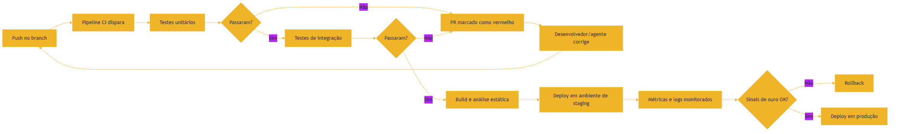

### 3.4 A Ponte como Metáfora do Circuito

Voltando à ponte suspensa: o circuito CI/CD é o processo de engenharia que garante a segurança da ponte a cada mudança de projeto [1]. Cada push é uma revisão de projeto; os testes unitários são os testes de material dos cabos; os testes de integração são os testes de conexão entre vigas; os testes de ponta a ponta são o teste de carga com o tráfego real; e a observabilidade é a instrumentação que mede a vibração depois da inauguração [1][7]. Nenhuma etapa sozinha garante a segurança — é o circuito completo que a garante [4]. Na era agêntica, a ponte é construída por robôs, e o circuito de validação é o que impede que um erro de projeto chegue ao tráfego [20].

### 3.3 O Agente como Desenvolvedor e o Teste como Juiz

A imagem mental que fecha o capítulo: o agente de IA é um desenvolvedor veloz que escreve código em segundos, mas a qualidade do que ele produz só é conhecida quando a suíte roda [13]. O teste automatizado é o juiz imparcial — não discute, não se impressiona com retórica, apenas passa ou falha [2]. Por isso os arquivos de instrução dos agentes enfatizam os comandos de teste: AGENTS.md diz ao agente como rodar a suíte, e o CI diz se ele acertou [18].

### 3.5 O Guarda na Porta do Show

Uma analogia de fechamento para o CI: o guarda na porta do show [11]. O show é a branch principal; a plateia é a produção [11]. O guarda — o pipeline — tem uma lista de regras: convite válido (linter), ingresso autêntico (testes), e a pessoa está na lista (build) [11]. Quem não cumpre as regras não entra — não importa quão famoso seja o artista (o desenvolvedor) ou quão confiante ele afirme que o show precisa dele [11].

A era agêntica adiciona um detalhe: os artistas agora chegam em bandos — dezenas de agentes propondo mudanças ao mesmo tempo [19]. O guarda não conhece nenhum deles — e não precisa: as regras são iguais para todos [20]. É essa imparcialidade que permite escalar: o guarda julga o trabalho, não o autor [20]. Quando um agente reclama "mas eu sou o Claude Code", o guarda responde com o único argumento que importa: "os testes passaram?" [20].

## 4. Técnica

### 4.1 Escrevendo Testes Unitários

Vamos escrever testes para a função do Capítulo 2 — `calcular_media_ponderada` — seguindo o ciclo red-green-refactor [2]. O framework `unittest` é nativo do Python e suficiente para o padrão:

```python
import unittest


def calcular_media_ponderada(notas, pesos):
    if len(notas) != len(pesos):
        raise ValueError("notas e pesos devem ter o mesmo tamanho")
    total = 0.0
    soma_pesos = 0.0
    for nota, peso in zip(notas, pesos):
        total += nota * peso
        soma_pesos += peso
    if soma_pesos == 0:
        return 0.0
    return total / soma_pesos


class TestMediaPonderada(unittest.TestCase):
    def test_media_simples(self):
        self.assertAlmostEqual(calcular_media_ponderada([8.0, 6.0], [1.0, 1.0]), 7.0)

    def test_pesos_diferentes(self):
        self.assertAlmostEqual(calcular_media_ponderada([10.0, 0.0], [1.0, 3.0]), 2.5)

    def test_pesos_zero(self):
        self.assertEqual(calcular_media_ponderada([8.0, 9.0], [0.0, 0.0]), 0.0)

    def test_listas_de_tamanhos_diferentes(self):
        with self.assertRaises(ValueError):
            calcular_media_ponderada([8.0], [1.0, 2.0])


if __name__ == "__main__":
    unittest.main()
```

### 4.2 O Ciclo na Prática

Observe o que cada caso testa: o caso feliz, o caso com pesos assimétricos, o caso de borda (pesos zerados) e o caso de contrato violado (tamanhos diferentes) [1]. São esses quatro tipos de caso — feliz, borda, erro e contrato — que definem uma boa suíte [2]. Rode o arquivo: todos os testes devem passar. Agora introduza um bug na função (troque `soma_pesos` por `len(notas)` na divisão) e rode de novo: o teste de pesos diferentes falha e aponta a linha — exatamente o feedback que o CI dará quando um agente quebrar algo [4].

### 4.3 O Pipeline de CI em YAML

Para fechar o circuito, o workflow de CI abaixo roda a suíte a cada push — o mesmo padrão do GitHub Actions [5]:

```yaml
name: test
on: [push, pull_request]
jobs:
  test:
    runs-on: ubuntu-latest
    steps:
      - uses: actions/checkout@v4
      - uses: actions/setup-python@v5
        with:
          python-version: "3.12"
      - run: pip install -r requirements.txt
      - run: python -m unittest discover -s tests -v
```

Esse arquivo, na raiz do repositório, transforma cada push em uma validação automática: se um agente quebrar um teste, o PR fica vermelho e o humano não precisa adivinhar [5]. É o mesmo padrão no GitLab CI, com sintaxe equivalente [6].

### 4.4 Criando um Ambiente de Testes Isolado

Uma boa suíte de testes exige um ambiente isolado e reproduzível [2]. O padrão profissional separa os testes do código de produção: a pasta `tests/` espelha a estrutura do código, e cada teste usa dados próprios — sem depender de bancos ou serviços externos [1]. No nosso exemplo, o teste da média ponderada não precisa de rede nem de banco: ele constrói os dados em memória e verifica a saída [2]. Essa independência é o que torna os testes unitários rápidos e confiáveis [1]. Quando um agente escreve testes, o profissional verifica exatamente essa propriedade: o teste é determinístico, isolado e exercita o comportamento — não apenas a implementação [3].

### 4.5 O Padrão de Cobertura que Importa

Cobertura de código é uma métrica útil e perigosa ao mesmo tempo [1]. Útil: mostra quais linhas foram executadas pelos testes. Perigosa: alta cobertura não implica alta qualidade — um teste que executa uma linha sem verificar o comportamento certo não protege nada [1]. O profissional mede cobertura para encontrar buracos, não para perseguir um número [1]. Na era agêntica, esse cuidado se multiplica: agentes otimizam a métrica que o harness mede — se o harness cobra cobertura, o agente gera testes que inflam a cobertura sem validar o comportamento [20]. O harness bem projetado mede o comportamento esperado, não a porcentagem de linhas [20].

```yaml
name: test
on: [push, pull_request]
jobs:
  test:
    runs-on: ubuntu-latest
    steps:
      - uses: actions/checkout@v4
      - uses: actions/setup-python@v5
        with:
          python-version: "3.12"
      - run: pip install -r requirements.txt
      - run: python -m unittest discover -s tests -v
```

Esse arquivo, na raiz do repositório, transforma cada push em uma validação automática: se um agente quebrar um teste, o PR fica vermelho e o humano não precisa adivinhar [5]. É o mesmo padrão no GitLab CI, com sintaxe equivalente [6].

### 4.6 O Script do Portão Local

Antes de existir o CI do servidor, existe o portão local — o script que você roda antes de cada push [11]. O script abaixo executa a sequência completa de validação e aborta no primeiro fracasso — o mesmo espírito do pipeline de CI, em uma máquina [20]:

```python
import subprocess
import sys


def portao_local():
    """Roda linter, testes e build; aborta no primeiro fracasso."""
    etapas = [
        ("Linter", ["python", "-m", "py_compile", "app.py"]),
        ("Testes unitários", ["python", "-m", "unittest", "discover", "-s", "tests"]),
    ]
    for nome, cmd in etapas:
        print(f"==> {nome}")
        resultado = subprocess.run(cmd, capture_output=True, text=True)
        if resultado.returncode != 0:
            print(resultado.stdout)
            print(resultado.stderr)
            print(f"FALHOU em: {nome}")
            sys.exit(1)
    print("Portão local: TUDO OK")


if __name__ == "__main__":
    portao_local()
```

A lição do script é a ordem e o aborto [20]: validação barata primeiro (sintaxe), validação cara depois (testes), e nenhuma etapa seguinte roda se a anterior falhou [20]. O mesmo princípio organiza os pipelines de CI em produção [11].

## 5. Aplica

### 5.1 Onde Isso Vive no Mundo Real

Em produção, a tríade se completa: os testes garantem que a mudança está certa antes do deploy; o CI garante que isso acontece a cada integração; a observabilidade garante que o sistema continua certo depois do deploy [7]. O OpenTelemetry instrumenta a aplicação para emitir traces, e os painéis monitoram latência, tráfego, erros e saturação — os Quatro Sinais de Ouro [7][8]. Quando um agente introduz uma regressão silenciosa — um caminho de código sem teste que passa a se comportar mal — é a observabilidade que acende o alarme [7]. O histórico de como chegamos até aqui ajuda a entender a urgência: da era do autocomplete à dos agentes que abrem PRs sozinhos, a validação automatizada foi o que permitiu o salto de velocidade [11].

### 5.2 O Erro Comum do Iniciante

O erro clássico é confiar no teste gerado pelo agente sem questionar: o agente escreve testes que passam porque foram escritos junto com o código que satisfaz aquele teste — um círculo que valida nada [3]. A correção — e aqui está o diferencial que separa o profissional — é escrever testes antes ou independentemente do código: os testes definem o comportamento esperado, e o código é a tentativa de satisfazê-los [2]. Se o agente propõe código e testes juntos, você avalia primeiro se os testes exercitam casos de borda e erro reais — não apenas o caminho feliz [1]. E cuidado com um segundo erro, mais sutil: confiar na fluência do código gerado. Modelos produzem texto convincente mesmo quando estão errados — o fenômeno das alucinações que vamos dissecar no Capítulo 8 [16].

### 5.3 O Padrão Profissional em 2026

O fluxo profissional combina as três disciplinas com governança agêntica: o repositório define no AGENTS.md os comandos exatos de teste que o agente deve rodar antes de abrir o PR [18]. O estudo empírico sobre o impacto de AGENTS.md mostra que essa padronização reduz o tempo de execução dos agentes em quase 29% [18]. E o resultado da validação é sempre o mesmo princípio: autonomia para o agente, portão determinístico para a qualidade [14].

### 5.4 O Pipeline como Contrato de Qualidade

O pipeline de CI é, na prática, um contrato executável de qualidade — a versão automatizada do que o pull request promete [4]. Ele define as condições que uma mudança deve satisfazer antes de integrar: testes passando, lint limpo, build ok [4][5]. Esse contrato é o que permite delegar trabalho a agentes com segurança: o agente pode cometer erros, mas o pipeline os detecta antes do merge [14]. E o contrato evolui com o projeto: quando um novo tipo de falha aparece em produção, o time adiciona um teste que a captura — transformando o incidente em proteção permanente [1]. O profissional trata o pipeline como um documento vivo, revisado tão seriamente quanto o código [4].

### 5.5 A Observabilidade como Extensão da Validação

Os testes validam antes do deploy; a observabilidade valida depois [7]. Um sistema em produção responde perguntas que os testes não cobrem: quantas requisições chegam por segundo, qual é a latência no pico, onde os erros se concentram [7]. Os Quatro Sinais de Ouro respondem essas perguntas — e o OpenTelemetry instrumenta a resposta [7][8]. Na era agêntica, a observabilidade ganha um papel duplo: além de monitorar o sistema, monitora o próprio agente — quantos tokens ele consome, quantas iterações do loop ele faz, onde ele erra [14]. Os harnesses que você estudará nos próximos volumes usam exatamente esses sinais para avaliar e melhorar agentes [10]. O estudo empírico sobre o impacto de AGENTS.md mostra que essa padronização reduz o tempo de execução dos agentes em quase 29% [18]. E o resultado da validação é sempre o mesmo princípio: autonomia para o agente, portão determinístico para a qualidade [14]. Por trás do portão está a arquitetura do agente — LLM, memória, planejamento e ferramentas — onde cada ferramenta expõe seu contrato ao modelo, como vimos no function calling [15][17]. E quando essa arquitetura escala para times inteiros de agentes, os melhores de 2026 — Claude Code, Codex, Cursor — rodam exatamente esse circuito de testes como parte do seu loop de trabalho [19].

### 5.6 O Portão de Qualidade Agêntico

O padrão profissional de 2026 trata o pipeline de CI como um portão que vale tanto para humanos quanto para agentes [20]. A ideia é simples: toda mudança — de uma pessoa ou de uma máquina — precisa cruzar o mesmo portão determinístico antes de entrar na branch principal [11]. O portão tem três estágios [20]. O primeiro é o estágio de linter e formato: mudanças que violam convenções são barradas antes de executar qualquer coisa — custo quase zero, feedback imediato [20]. O segundo é o estágio de testes: unitários, de integração e ponta a ponta, na ordem da pirâmide [20]. O terceiro é o estágio de build e deploy em ambiente de homologação: a prova final de que a mudança funciona montada [11].

A consequência agêntica é profunda: quando o portão existe, o agente pode trabalhar com autonomia — porque a qualidade não depende da sua disciplina, depende do pipeline [20]. É essa arquitetura que separa a produção séria da demo: na demo, o agente é bom; na produção, o portão é bom [14]. E é essa mesma arquitetura que os volumes de Harness Engineering vão construir: o harness que executa, testa e valida cada iteração do agente [10]. O princípio físico, porém, é o deste capítulo: autonomia para gerar, portão determinístico para aceitar [20].

### 5.7 Testando o Comportamento, Não a Implementação

A lição mais sutil do capítulo — e a mais importante para a era agêntica — é testar comportamento, não implementação [20]. Testes que verificam como a função foi escrita (quais métodos internos foram chamados, em que ordem) quebram a qualquer refatoração inocente [20]. Testes que verificam o que o usuário observa (entrada, saída, estado resultante) sobrevivem à refatoração e continuam validando o que importa [20]. A Testing Library resume o princípio: quanto mais seus testes se parecem com o uso real do software, mais confiança eles dão [20].

Para agentes, o princípio é decisivo [2]. Um agente que reescreve a implementação de uma função — mudando nomes internos, reorganizando módulos — deve ser validado pelo resultado, não pelos passos [2]. O teste de comportamento aceita qualquer implementação correta; o teste de implementação rejeita qualquer solução diferente da esperada [20]. Quando você projetar evals de agentes, nos próximos volumes, esta será a regra de ouro: avalie o que o agente entregou ao usuário, não o caminho que ele escolheu [20]. É essa distinção que permite aos agentes variar a implementação sem quebrar a confiança [2].

### 5.8 O Ciclo de Melhoria Contínua

O portão de qualidade não é estático — é um ciclo de melhoria contínua [11]. Toda falha que passa pelo portão é um sinal: algum teste está faltando, algum cenário não foi previsto [11]. O padrão profissional trata cada bug em produção como uma tarefa dupla: corrigir o comportamento e adicionar o teste que o teria pego [11]. Esse ciclo — falha, correção, teste novo — é o que transforma um pipeline em um ativo que melhora com o tempo [11].

Na era agêntica, o ciclo ganha um reforço: as falhas de agentes são registradas como casos de avaliação [20]. Quando um agente propõe uma mudança errada e o portão a barra, o caso entra no conjunto de evals — e o próximo agente será testado contra ele [20]. É assim que a Eval Engineering, tema do fim da série, constrói seu acervo: cada falha real vira um teste permanente [20]. O portão não só protege o presente — ele aprende com o passado [11].

### 5.9 Testes para Agentes: a Suíte como Portão

A aplicação mais direta do capítulo na era agêntica é a suíte de testes como portão para o trabalho dos agentes [20]. O padrão de 2026: o agente propõe uma mudança, e o portão — a mesma pirâmide que você dominou — decide se a mudança entra [20]. Testes unitários cobrem as funções alteradas; testes de integração cobrem a interação com o resto do sistema; testes ponta a ponta cobrem o fluxo do usuário [20]. O agente pode variar a implementação à vontade — o portão não [20].

A consequência cultural é importante [2]. Times maduros não discutem com o agente — discutem com o portão: se o teste falhou, a mudança não entra, e o agente recebe a falha como feedback para corrigir [2]. Essa disciplina transforma a relação com a IA: em vez de confiar ou desconfiar do agente, o time confia no portão [14]. E é essa confiança no portão — não no agente — que permite à indústria escalar agentes autônomos em produção [19]. Quando a série tratar de evals, você verá o mesmo princípio elevado à validação de comportamento completo [20].

### 5.10 O Erro de Confundir Cobertura com Qualidade

Um erro que separa iniciantes de profissionais: confundir cobertura com qualidade [20]. Cobertura mede quantas linhas os testes tocaram; qualidade mede quantos comportamentos foram validados [20]. Um projeto pode ter 95% de cobertura e ainda deixar escapar o bug mais importante — se os testes exercitam o caminho errado [20]. O profissional pergunta, para cada teste: o que este teste impede de acontecer? Se a resposta é "nada de importante", o teste é peso morto — ele passa sempre, mas não protege nada [20].

Para agentes, a distinção é crítica [2]. Uma suíte de cobertura alta pode validar que o agente tocou em todas as linhas — e não validar se o comportamento entregue é o que o usuário pediu [20]. A regra da Testing Library — testar como o usuário usa — aplicada a agentes significa: validar o resultado observável da tarefa, não os passos internos [20]. Essa é a ponte direta deste capítulo para a Eval Engineering do fim da série: medir comportamento, não atividade [20].

### 5.11 O Custo de Pular o Portão

A última lição aplicada do capítulo: o custo de pular o portão [11]. Cada vez que uma mudança entra sem o pipeline — "é rápido, é só um ajuste" — o sistema acumula uma dívida de confiança [11]. O ajuste que "não precisava de teste" vira a regressão que derruba produção [11]. A mudança que "é urgente" entra sem CI e quebra a integração [11]. O custo não aparece no momento do atalho — aparece na próxima terça-feira, em produção, às três da manhã [11].

Na era agêntica, o atalho é tentador demais [2]. O agente diz "os testes passam" — e o humano, sem conferir, dá o merge [2]. O portão existe exatamente para isso: para que a confiança não dependa da palavra de ninguém — humana ou máquina [20]. O time que respeita o portão pode escalar agentes com segurança; o que o ignora, escala o caos [19]. A disciplina do portão é a disciplina da confiança em escala [11].

### 5.12 O Círculo Virtuoso da Qualidade

O capítulo termina com o círculo virtuoso que o portão cria [11]. Testes bons reduzem bugs [20]. Menos bugs reduzem o medo de mudar [11]. Menos medo acelera a entrega [11]. Entrega rápida gera feedback rápido [11]. Feedback rápido melhora o produto [11]. E o produto melhor justifica mais testes [11]. O círculo é o mesmo para humanos e agentes: o agente que entrega com o portão verde ganha autonomia; a autonomia acelera o trabalho; e o trabalho acelerado exige portão melhor [20].

Quem entra no círculo virtuoso cresce [11]. Quem fica no círculo vicioso — sem testes, com medo, devagar — encolhe [11]. A escolha entre os dois círculos acontece em cada commit: o teste foi escrito? O pipeline rodou? O portão passou? [11] O profissional não decide a qualidade uma vez — decide a cada mudança, a cada dia [11]. E é esse hábito — decidir pela qualidade a cada passo — que a série inteira vai exigir nas camadas mais altas da pilha [2].

## 6. Conclusão

Neste capítulo, você dominou as três disciplinas que transformam confiança em engenharia: a pirâmide de testes com seus níveis de unidade, integração e ponta a ponta [1]; o ciclo red-green-refactor do TDD, que transforma o teste em especificação executável [2]; e o circuito de integração contínua que valida cada mudança no instante em que nasce [4]. Você também entendeu a observabilidade — logs, métricas e traces — como a linguagem de diagnóstico dos sistemas em produção [7].

Resumindo em três pontos: primeiro, testes são especificações executáveis — o contrato que define o comportamento esperado [2]; segundo, CI é o circuito que valida cada mudança automaticamente [4]; terceiro, observabilidade é a validação contínua em produção — os Quatro Sinais de Ouro respondem as perguntas que os testes não cobrem [7]. Com esses três pontos, você tem o arsenal de validação que o Capítulo 5 vai conectar à arquitetura de sistemas [1].

### O Desafio Deste Capítulo

O desafio em três níveis. Nível um: escreva testes para a função de média ponderada do Capítulo 1, cobrindo o caso feliz, os pesos zerados e o tamanho divergente das listas. Nível dois: crie um workflow de CI no GitHub Actions que rode a suíte a cada push — e verifique que um teste falhando marca o PR de vermelho. Nível três: peça a um agente de IA para corrigir um bug introduzido por você e avalie se o agente usou o ciclo de depuração — leu o erro, formou hipótese, corrigiu e revalidou — ou apenas tentou palpites [2]. Os três níveis exercitam escrita de testes, automação de CI e supervisão de agentes [4].

Essas disciplinas são a resposta da série à pergunta central da era agêntica: como confiar no código produzido por máquinas [3]. No próximo capítulo, vamos subir na pilha em direção à arquitetura: APIs, bancos de dados e servidores — os blocos sobre os quais os sistemas — e os agentes — constroem seus contratos de comunicação [1].

## 7. Referências Bibliográficas

[1] VOCKE, Ham; FOWLER, Martin. The Practical Test Pyramid. Disponível em: https://martinfowler.com/articles/practical-test-pyramid.html. Acesso em: 5 ago. 2026.

[2] BECK, Kent. Test-Driven Development: By Example. Boston: Addison-Wesley Professional, 2002.

[3] TESTING LIBRARY. Guiding Principles. Disponível em: https://testing-library.com/docs/guiding-principles/. Acesso em: 5 ago. 2026.

[4] FOWLER, Martin. Continuous Integration. Disponível em: https://martinfowler.com/articles/continuousIntegration.html. Acesso em: 5 ago. 2026.

[5] GITHUB ACTIONS DOCS. Understanding GitHub Actions. Disponível em: https://docs.github.com/en/actions/about-github-actions/understanding-github-actions. Acesso em: 5 ago. 2026.

[6] GITLAB. CI/CD pipeline architecture. Disponível em: https://docs.gitlab.com/ee/ci/. Acesso em: 5 ago. 2026.

[7] EWASCHUK, Rob; BEYER, Betsy (Ed.). Site Reliability Engineering: Monitoring Distributed Systems. Google SRE Book. Disponível em: https://sre.google/sre-book/monitoring-distributed-systems/. Acesso em: 5 ago. 2026.

[8] OPENTELEMETRY. What is OpenTelemetry?. Disponível em: https://opentelemetry.io/docs/what-is-opentelemetry/. Acesso em: 5 ago. 2026.

[9] CHACON, Scott; STRAUB, Ben. Pro Git. 2. ed. Apress/Git SCM, 2014. Disponível em: https://git-scm.com/book/en/v2. Acesso em: 5 ago. 2026.

[10] GITHUB DOCS. About pull requests. Disponível em: https://docs.github.com/en/pull-requests/collaborating-with-pull-requests/proposing-changes-to-your-work-with-pull-requests/about-pull-requests. Acesso em: 5 ago. 2026.

[11] CODERABBIT. From Copilot to agents: The history of AI coding. Disponível em: https://www.coderabbit.ai/blog/a-very-brief-history-of-ai-coding-from-copilot-to-next-gen-agents. Acesso em: 5 ago. 2026.

[12] KEYHOLE SOFTWARE. Vibe Coding Trends 2026: Adoption, Productivity, and Code Quality Data. Disponível em: https://keyholesoftware.com/vibe-coding-trends-2026/. Acesso em: 5 ago. 2026.

[13] SITEPOINT. Vibe Coding 2026: The Complete Guide to AI-First Development. Disponível em: https://www.sitepoint.com/vibe-coding-2026-complete-guide/. Acesso em: 5 ago. 2026.

[14] ANTHROPIC. Effective Context Engineering for AI Agents. Disponível em: https://www.anthropic.com/engineering/effective-context-engineering-for-ai-agents. Acesso em: 5 ago. 2026.

[15] WENG, Lilian. LLM-Powered Autonomous Agents. Disponível em: https://lilianweng.github.io/posts/2023-06-23-agent/. Acesso em: 5 ago. 2026.

[16] WENG, Lilian. Extrinsic Hallucinations in LLMs. Disponível em: https://lilianweng.github.io/posts/2024-07-07-hallucination/. Acesso em: 5 ago. 2026.

[17] OPENAI. Function Calling Guide. Disponível em: https://developers.openai.com/api/docs/guides/function-calling. Acesso em: 5 ago. 2026.

[18] LULLA, Jai Lal; et al. On the Impact of AGENTS.md Files on the Efficiency of AI Coding Agents. Disponível em: https://arxiv.org/html/2601.20404v1. Acesso em: 5 ago. 2026.

[19] MIGHTYBOT. Best AI Coding Agents in 2026, Ranked. Disponível em: https://mightybot.ai/blog/coding-ai-agents-for-accelerating-engineering-workflows/. Acesso em: 5 ago. 2026.

[20] CHROMA. Context Rot: How Increasing Input Tokens Impacts LLM Performance. Disponível em: https://www.trychroma.com/research/context-rot. Acesso em: 5 ago. 2026.

# PARTE III — Arquitetura de Software Essencial

# Capítulo 5: APIs, Bancos de Dados e Servidores

## 1. Introdução

Nos capítulos anteriores, você dominou a lógica de programação, a leitura de código, o Git e as disciplinas de validação. Agora vamos estudar os blocos fundamentais de qualquer sistema: APIs, bancos de dados e servidores — a anatomia do software que conversa com outro software [1]. Essa é a camada que os agentes de IA exploram o tempo todo: quando um agente consulta uma API para buscar dados ou chama uma ferramenta para executar uma ação, ele está atravessando exatamente esta arquitetura [2]. Os melhores agentes de coding de 2026 navegam repositórios, executam testes e interagem com serviços exatamente por essa anatomia [6].

Este capítulo tem três objetivos. Primeiro, entender o modelo cliente-servidor — a dança de requisição e resposta que sustenta a internet [1]. Segundo, compreender o que é uma API: um contrato entre sistemas, com regras claras de entrada e saída [3]. Terceiro, conhecer os bancos de dados — a memória persistente que sobrevive ao desligamento do servidor [4]. Ao final, você terá o mapa da infraestrutura sobre a qual os agentes constroem suas ferramentas — e estará pronto para o Capítulo 6, que aprofunda HTTP e contratos [1].

## 2. Explica

### 2.1 O Modelo Cliente-Servidor

Toda interação na web segue o mesmo padrão: um cliente faz um pedido; um servidor processa e responde. O navegador que você abre é o cliente; o computador remoto que hospeda o site é o servidor [1]. Esse modelo divide o mundo em dois papéis bem definidos — quem pede e quem atende — e é a base de tudo o que vem a seguir [3]. Quando um agente de IA consulta uma API, ele assume o papel de cliente: envia a requisição e processa a resposta [7].

### 2.2 O que é uma API

API — Application Programming Interface — é o contrato que define como dois sistemas conversam [3]. O contrato especifica o que você pode pedir (endpoints e parâmetros), como pedir (formato da requisição) e o que receber (formato da resposta). A boa API é como um balcão de atendimento bem organizado: o cliente não precisa saber o que acontece nos bastidores — só precisa conhecer o cardápio de operações disponíveis [1]. No mundo agêntico, as ferramentas que os agentes chamam são APIs com um contrato ainda mais explícito: o JSON Schema que define nome, descrição e parâmetros de cada função [7]. O framework de agentes de Weng organiza essas ferramentas como o terceiro pilar do agente, ao lado da memória e do planejamento [8].

### 2.6 REST: O Estilo Arquitetural Dominante

A maioria das APIs modernas segue o estilo REST — Representational State Transfer [3]. No REST, os recursos são os substantivos (transações, usuários, produtos) e os verbos HTTP — que você verá em detalhe no Capítulo 6 — são as ações sobre eles [1]. A API REST é stateless: cada requisição carrega toda a informação necessária, sem depender de estado do servidor entre chamadas [3]. Esse estilo simplifica a escalabilidade e a cache, e é o que a maioria dos serviços públicos expõe [3]. Para os agentes, as APIs REST são o formato mais comum de ferramenta externa — e a familiaridade com o estilo facilita entender qualquer contrato novo [7].

### 2.7 Modelagem de Dados: a Decisão do Esquema

Antes de criar um banco, o profissional modela os dados: define as entidades, seus atributos e os relacionamentos entre elas [4]. No modelo relacional, cada entidade vira uma tabela, cada atributo uma coluna, e os relacionamentos viram chaves estrangeiras [4]. A modelagem é uma decisão de arquitetura com consequências profundas: um esquema mal projetado gera consultas lentas e manutenção dolorosa; um bem projetado simplifica tudo [3]. Na era agêntica, a modelagem também define o que os agentes conseguem consultar: um esquema claro e documentado é um contrato que os agentes entendem; um esquema caótico é uma armadilha [2]. O contrato especifica o que você pode pedir (endpoints e parâmetros), como pedir (formato da requisição) e o que receber (formato da resposta). A boa API é como um balcão de atendimento bem organizado: o cliente não precisa saber o que acontece nos bastidores — só precisa conhecer o cardápio de operações disponíveis [1]. No mundo agêntico, as ferramentas que os agentes chamam são APIs com um contrato ainda mais explícito: o JSON Schema que define nome, descrição e parâmetros de cada função [7]. O framework de agentes de Weng organiza essas ferramentas como o terceiro pilar do agente, ao lado da memória e do planejamento [8].

### 2.3 Bancos de Dados: A Memória Persistente

Dados precisam sobreviver ao desligamento do servidor — para isso existem os bancos de dados [4]. Um banco de dados é um sistema especializado em armazenar, consultar e atualizar informações de forma confiável e concorrente. Os bancos relacionais, como o SQL, organizam os dados em tabelas com linhas e colunas — a forma mais antiga e ainda dominante de modelar dados estruturados [4]. A evolução dos modelos de linguagem trouxe ainda os bancos vetoriais, que armazenam representações numéricas do texto — tema que o Karpathy discute ao descrever o Software 3.0 [16] e que sustenta a recuperação de contexto em janelas de milhões de tokens [17][18]. Os bancos não relacionais (NoSQL) trocam a rigidez do esquema por flexibilidade e escala. A escolha entre eles é uma decisão de arquitetura: o formato dos dados e os padrões de acesso definem a ferramenta certa [3].

### 2.4 Servidores: Onde o Software Vive

Servidor é o computador que hospeda o software e atende requisições [1]. Na prática, "servidor" pode ser uma máquina física, uma máquina virtual ou um container isolado — a abstração mudou, o papel é o mesmo: receber pedidos, executar lógica, acessar dados e devolver respostas [3]. A infraestrutura moderna esconde essa complexidade: o desenvolvedor escreve o software e a plataforma decide onde ele roda [1].

### 2.8 Segurança: O Contrato Protegido

Uma dimensão que atravessa toda a arquitetura é a segurança — e ela é parte do contrato, não um extra [3]. A autenticação responde "quem é você?"; a autorização responde "o que você pode fazer?"; a validação de entrada impede que dados maliciosos entrem no sistema; e a criptografia protege dados em trânsito e em repouso [3]. Na era agêntica, a segurança ganha um vetor novo: o próprio agente é um atacante em potencial — não por malícia, mas por erro [2]. Um agente mal instruído pode expor dados em logs, chamar APIs com credenciais erradas ou vazar informação sensível no contexto [2]. Por isso os harnesses profissionais definem regras de segurança nos arquivos de instrução: nunca registrar segredos, nunca expor dados sensíveis no prompt [14]. A segurança do fluxo agêntico é, em grande parte, engenharia de contexto aplicada à proteção [10].

### 2.9 Deploy: Levando o Software para Produção

O deploy é o ato de levar o software do desenvolvimento para o ambiente de produção [1]. O fluxo profissional usa pipelines — como os do Capítulo 4 — para automatizar o caminho: build, teste, publicação [12]. Estratégias de deploy reduzem o risco de mudanças: o deploy blue-green mantém duas versões e alterna com um clique; o canary libera a mudança para uma fração dos usuários antes de todos [1]. Na era agêntica, o deploy também se refere a publicar agentes e ferramentas: expor uma tool nova ao agente é um deploy — e merece o mesmo rigor de testes e observabilidade [2]. O ciclo de vida que você está aprendendo aqui é o mesmo que os próximos volumes aplicam aos sistemas agênticos [10]. Na prática, "servidor" pode ser uma máquina física, uma máquina virtual ou um container isolado — a abstração mudou, o papel é o mesmo: receber pedidos, executar lógica, acessar dados e devolver respostas [3]. A infraestrutura moderna esconde essa complexidade: o desenvolvedor escreve o software e a plataforma decide onde ele roda [1].

### 2.5 A Conexão com o Mundo Agêntico

Os agentes de IA são clientes vorazes de APIs: cada ferramenta que eles chamam — um repositório Git, um serviço de busca, um banco — é acessada por um contrato de API [7]. O sucesso dessa comunicação depende de quanto contexto o agente consegue carregar sobre o serviço — a disciplina que a Anthropic chama de engenharia de contexto [9]. O function calling formaliza esse acesso: o modelo recebe a descrição das ferramentas disponíveis, decide qual chamar e monta a requisição estruturada [7]. Por isso, entender APIs é entender a língua que os agentes falam com o mundo — e a língua que você vai usar para construir os harnesses dos próximos volumes da série [2].

## 3. Ilustra

### 3.1 A Analogia do Restaurante

Um restaurante é a metáfora perfeita para o modelo cliente-servidor. O cliente (o navegador ou o agente) chega com um pedido. O garçom (a API) recebe o pedido e o traduz para a cozinha — o garçom é o contrato entre o cliente e o sistema interno. A cozinha (o servidor) prepara o prato, possivelmente buscando ingredientes no estoque (o banco de dados). O garçom volta com o prato pronto (a resposta) [1]. O cliente nunca entra na cozinha: ele conhece apenas o cardápio (o contrato da API) [3]. Agora imagine que o cliente seja um agente de IA: ele lê o cardápio (as definições de ferramentas), faz pedidos precisos (requisições estruturadas) e processa o que volta — exatamente o ciclo do function calling [7].

### 3.2 O Diagrama da Requisição

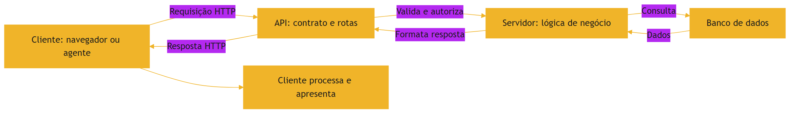

### 3.3 O Servidor como Restaurante

O mesmo diagrama descreve o que acontece quando você abre um aplicativo ou quando um agente chama uma ferramenta: a requisição atravessa o contrato da API, o servidor executa a lógica, consulta o banco e devolve a resposta [1]. A diferença é a velocidade e a escala: servidores modernos processam milhares de requisições por segundo, com bancos replicados e caches — mas a anatomia fundamental permanece a mesma [3]. Em escala, a engenharia de confiabilidade monitora esses serviços com os Quatro Sinais de Ouro do Google SRE [10] — e padroniza a telemetria com o OpenTelemetry [11].

### 3.4 O Restaurante com Delivery: Microsserviços

A arquitetura moderna frequentemente divide o restaurante em cozinhas especializadas: uma cozinha para salgados, outra para sobremesas, cada uma com seu estoque e sua equipe — os microsserviços [1]. Cada serviço é uma unidade independente com sua própria API e seu próprio banco, conversando com os demais via HTTP [3]. A vantagem é o isolamento: um serviço pode escalar, falhar e ser substituído sem derrubar o todo [1]. A desvantagem é a complexidade: mais serviços significam mais contratos, mais latência e mais superfícies de falha — e a observabilidade vira obrigatória [11]. Para os agentes, os microsserviços multiplicam as ferramentas disponíveis: cada serviço expõe sua API, e o agente decide qual chamar [7]. A diferença é a velocidade e a escala: servidores modernos processam milhares de requisições por segundo, com bancos replicados e caches — mas a anatomia fundamental permanece a mesma [3]. Em escala, a engenharia de confiabilidade monitora esses serviços com os Quatro Sinais de Ouro do Google SRE — latência, tráfego, erros e saturação [10] — e padroniza a telemetria com o OpenTelemetry [11].

### 3.5 O Restaurante e a Cozinha

Uma analogia que amarra os componentes do capítulo: o sistema é um restaurante [1]. O cliente é o usuário do app; o garçom é a API — a interface que recebe o pedido, traduz para a cozinha e traz o resultado [3]. A cozinha é o servidor — onde a lógica acontece [1]. A despensa é o banco de dados — onde os ingredientes (dados) são guardados [4]. O cardápio é a documentação do contrato: o que pode ser pedido e em que formato [3]. E o gerente — que olha o fluxo, resolve gargalos e garante que o restaurante atenda mais mesas — é a observabilidade [7].

A analogia se estende à era agêntica [2]. O agente é um cliente muito rápido, que pede dezenas de pratos por segundo — e que às vezes pede um prato que não está no cardápio [3]. O garçom (a API) precisa rejeitar o pedido com um código claro — o status HTTP — para que o agente aprenda a pedir direito [3]. A despensa (o banco) precisa estar organizada, senão o agente busca ingredientes onde não há [4]. Quando a série tratar de MCP, você verá o cardápio padronizado: a mesma forma de pedir para qualquer restaurante [5].

## 4. Técnica

### 4.1 Um Servidor Mínimo com API

Vamos construir a versão mais simples de um sistema completo: uma API com servidor e banco em memória. O framework `http.server` do Python é suficiente para demonstrar o modelo sem dependências externas [1]:

```python
import json
from http.server import BaseHTTPRequestHandler, HTTPServer

# "Banco de dados" em memória: lista de transações persistida no processo
banco = [
    {"id": 1, "descricao": "Mercado", "valor": -150.00},
    {"id": 2, "descricao": "Salário", "valor": 4500.00},
]


class Handler(BaseHTTPRequestHandler):
    def _resposta(self, codigo, dados):
        corpo = json.dumps(dados, ensure_ascii=False).encode("utf-8")
        self.send_response(codigo)
        self.send_header("Content-Type", "application/json; charset=utf-8")
        self.send_header("Content-Length", str(len(corpo)))
        self.end_headers()
        self.wfile.write(corpo)

    def do_GET(self):
        if self.path == "/transacoes":
            self._resposta(200, {"transacoes": banco})
        elif self.path.startswith("/transacoes/"):
            transacao_id = int(self.path.split("/")[-1])
            achada = next((t for t in banco if t["id"] == transacao_id), None)
            if achada:
                self._resposta(200, achada)
            else:
                self._resposta(404, {"erro": "transacao nao encontrada"})
        else:
            self._resposta(404, {"erro": "rota inexistente"})


if __name__ == "__main__":
    servidor = HTTPServer(("localhost", 8000), Handler)
    print("Servidor rodando em http://localhost:8000")
    servidor.serve_forever()
```

### 4.2 Testando a API

Rode o servidor e faça requisições — o `curl` é o cliente mais direto:

```bash
curl http://localhost:8000/transacoes
curl http://localhost:8000/transacoes/1
curl http://localhost:8000/transacoes/999
```

A primeira requisição devolve a lista completa; a segunda devolve a transação 1; a terceira devolve um 404 — o erro que o contrato da API define para o caso de recurso inexistente [3]. Observe como cada elemento do diagrama aparece na prática: o `do_GET` é a rota da API, o dicionário `banco` é o banco de dados, e o `HTTPServer` é o servidor que escuta requisições [1].

### 4.3 O Banco de Dados como Camada Separada

O exemplo acima usa memória — o que significa que os dados se perdem ao reiniciar o processo [4]. Em produção, o banco é uma camada separada, com persistência em disco e acesso concorrente seguro [4]. A separação de responsabilidades — API para o contrato, servidor para a lógica, banco para a persistência — é o padrão que torna os sistemas escaláveis e testáveis [3]. E a cada integração, o circuito de validação que você aprendeu no Capítulo 4 garante que a mudança não quebrou os contratos existentes [12].

### 4.4 Uma Consulta SQL na Prática

Para tornar o banco concreto, vejamos a linguagem que os bancos relacionais falam — o SQL [4]. A consulta abaixo reproduz, em SQL, o que o código Python fez em memória:

```sql
SELECT categoria, SUM(valor) AS total
FROM transacoes
WHERE valor < 0
GROUP BY categoria
ORDER BY total ASC;
```

A consulta seleciona as transações negativas, agrupa por categoria e soma os valores — o mesmo padrão de filtro e acumulação que você reconheceu no Capítulo 2, agora na linguagem de dados [1]. O SQL é declarativo: você descreve o resultado desejado, e o banco decide como executar [4]. Esse mesmo padrão de consulta é o que os agentes de análise geram ao interrogar bancos — e é por isso que reconhecer SQL faz parte da fluência de leitura do profissional [2]. Em produção, o banco é uma camada separada, com persistência em disco e acesso concorrente seguro [4]. A separação de responsabilidades — API para o contrato, servidor para a lógica, banco para a persistência — é o padrão que torna os sistemas escaláveis e testáveis [3]. E a cada integração, o circuito de validação que você aprendeu no Capítulo 4 garante que a mudança não quebrou os contratos existentes [12].

### 4.5 O Cliente HTTP em Python: a Chamada na Prática

A melhor forma de entender uma API é chamá-la — e o Python tem uma biblioteca padrão para isso [3]. O script abaixo busca dados de uma API pública e lê a resposta com os olhos do Capítulo 6 — status, cabeçalhos e corpo [3]:

```python
import json
import urllib.request


def chamar_api(url):
    """Executa uma chamada GET e reporta status e corpo."""
    requisicao = urllib.request.Request(url, headers={"User-Agent": "leitor-de-apis/1.0"})
    with urllib.request.urlopen(requisicao, timeout=10) as resposta:
        status = resposta.status
        corpo = resposta.read().decode("utf-8")
        print(f"Status HTTP: {status}")
        try:
            dados = json.loads(corpo)
            print(f"Tipo do corpo: JSON com {len(dados)} entradas")
            if isinstance(dados, list) and dados:
                print(f"Primeira entrada: {json.dumps(dados[0], ensure_ascii=False)[:120]}")
        except json.JSONDecodeError:
            print(f"Corpo não é JSON: {corpo[:120]}")
        return dados


if __name__ == "__main__":
    chamar_api("https://api.github.com/repos/git/git")
```

O script exercita exatamente o ciclo que o capítulo descreve: montar a requisição, ler o status, inspecionar o corpo [3]. Troque a URL por APIs do seu interesse — e repare que a anatomia da chamada não muda: o cliente pede, o servidor responde, o contrato decide [3].

### 4.6 Modelando Dados: o Schema Simples

A modelagem de dados é a metade de design de qualquer sistema [4]. O exercício abaixo projeta um schema simples em SQL puro — a mesma linguagem que os bancos relacionais entendem [4]:

```sql
CREATE TABLE usuarios (
    id INTEGER PRIMARY KEY,
    nome TEXT NOT NULL,
    email TEXT UNIQUE NOT NULL
);

CREATE TABLE pedidos (
    id INTEGER PRIMARY KEY,
    usuario_id INTEGER REFERENCES usuarios(id),
    valor REAL NOT NULL,
    status TEXT NOT NULL DEFAULT 'pendente'
);
```

Note as decisões que o schema registra: cada tabela tem uma chave primária (a identidade), campos com tipo (o formato), restrições (o que é obrigatório e único) e a relação entre tabelas (o vínculo) [4]. Essas decisões — identidade, formato, restrição, relação — são a gramática dos dados [4]. Quando um agente manipula dados, é essa gramática que define o que ele pode e não pode fazer [4].

### 4.7 O Simulador de Fila

A fila — peça da anatomia que o capítulo apresentou — merece um simulador para ficar concreta [1]:

```python
from collections import deque
import time


class Fila:
    def __init__(self, nome):
        self.nome = nome
        self.tarefas = deque()

    def enfileirar(self, tarefa):
        self.tarefas.append(tarefa)
        print(f"[{self.nome}] enfileirou: {tarefa} (total: {len(self.tarefas)})")

    def processar(self):
        if not self.tarefas:
            print(f"[{self.nome}] fila vazia")
            return None
        tarefa = self.tarefas.popleft()
        print(f"[{self.nome}] processou: {tarefa}")
        time.sleep(0.1)
        return tarefa


if __name__ == "__main__":
    fila = Fila("emails")
    for t in ["confirmar pedido 1", "recuperar senha", "relatório diário"]:
        fila.enfileirar(t)
    while fila.tarefas:
        fila.processar()
```

O simulador mostra a propriedade essencial da fila: a ordem — primeiro a entrar, primeiro a sair [1]. Em sistemas reais, a fila desacopla o momento em que a tarefa chega do momento em que ela é processada — o app responde ao cliente na hora e processa o e-mail depois [1]. É essa desacoplagem que sustenta a escala [1].

### 4.8 O Simulador de Cache

O segundo componente oculto da anatomia — o cache — também merece simulação [1]:

```python
class Cache:
    def __init__(self, capacidade=3):
        self.capacidade = capacidade
        self.dados = {}

    def obter(self, chave):
        if chave in self.dados:
            print(f"CACHE HIT: {chave}")
            return self.dados[chave]
        print(f"CACHE MISS: {chave}")
        return None

    def armazenar(self, chave, valor):
        if len(self.dados) >= self.capacidade:
            descartada = next(iter(self.dados))
            self.dados.pop(descartada)
            print(f"CACHE CHEIO: descartou {descartada}")
        self.dados[chave] = valor
        print(f"CACHE ARMAZENOU: {chave}")


if __name__ == "__main__":
    cache = Cache()
    cache.obter("perfil:1")
    cache.armazenar("perfil:1", {"nome": "Ana"})
    cache.obter("perfil:1")
```

O cache ensina a troca central do capítulo: velocidade versus frescor [1]. Dados em cache respondem rápido, mas podem estar velhos [1]. A política de invalidação — quando o cache é descartado ou atualizado — é a decisão de arquitetura que define se o cache ajuda ou engana [1]. O mesmo raciocínio vale para o contexto dos agentes: o que pode ser reutilizado sem reprocessar, e o que precisa ser recalculado [2].

## 5. Aplica

### 5.1 Onde Isso Vive no Mundo Real

Todo serviço moderno segue essa anatomia: o front-end (cliente), a API (contrato), o back-end (servidor) e o banco (persistência) [1]. O e-commerce do Capítulo 1 usa exatamente isso: o navegador consulta a API de produtos, o servidor busca no banco e devolve JSON [3]. O salto que levou dos autocompletes aos agentes que orquestram essas APIs é o mesmo arco histórico que o CodeRabbit documenta: cada geração de ferramenta adicionou uma camada de autonomia sobre a mesma infraestrutura [19]. E os agentes de IA consomem essas APIs como clientes: o ChatGPT buscando informações, o Claude Code consultando repositórios, o agente de análise chamando serviços externos — todos atravessam o mesmo modelo [2][7]. O tipo de "banco" mais novo dessa conversa é o banco vetorial, usado para guardar o contexto que alimenta os modelos — e quanto maior o contexto, maior o risco de degradação da atenção, o chamado context rot [15].

### 5.2 O Erro Comum do Iniciante

O erro clássico de quem começa é tratar a API como mágica: enviar requisições sem entender o contrato e culpar o servidor quando algo dá errado. A correção — e aqui está o diferencial que separa o profissional — é ler o contrato primeiro: quais rotas existem, quais parâmetros cada rota aceita, qual formato a resposta tem [3]. Com um agente de IA, esse erro se amplifica: se você não conhece o contrato, não consegue avaliar se a chamada que o agente montou está correta [7]. A prática correta é inspecionar a requisição e a resposta — o equivalente a testar o cardápio antes de criticar a cozinha [1]. Com a adoção de IA chegando a 92% dos desenvolvedores, quem domina contratos e inspeção — em vez de apenas colar chamadas geradas — é exatamente o perfil que o mercado procura [20].

### 5.3 O Padrão Profissional em 2026

O profissional de AIDD trata APIs como ativos de primeira classe: documentadas, versionadas e testadas [3]. Quando um agente precisa acessar dados, a API é a ferramenta exposta — e a qualidade do contrato determina a qualidade do resultado [7]. Por isso os repositórios modernos documentam, em AGENTS.md, quais serviços e comandos o agente deve usar [13][14].

### 5.4 O Ciclo de Vida de uma API

Uma API profissional tem um ciclo de vida que o integrador precisa conhecer [3]: o design (definir o contrato antes de implementar), a implementação (construir o servidor), a publicação (expor para consumidores), a versão (evoluir sem quebrar consumidores), a depreciação (avisar com antecedência) e a descontinuação [3]. Em cada fase, os testes de contrato protegem a compatibilidade [12]. Na era agêntica, o ciclo de vida ganha um público novo: os agentes que consomem a API. Uma mudança de contrato sem aviso quebra não apenas humanos — quebram agentes em produção [2]. Por isso a documentação e o versionamento são decisões de engenharia, não burocracia [3].

### 5.5 A Escalabilidade: Quando o Sistema Cresce

Um sistema que funciona para uma centena de usuários pode falhar para um milhão [1]. A escalabilidade é a capacidade de crescer sem reescrever: adicionar servidores (escala horizontal), otimizar consultas, usar caches e réplicas [1]. Os Quatro Sinais de Ouro — latência, tráfego, erros e saturação — medem exatamente os limites dessa capacidade [10]. Na era agêntica, a escalabilidade tem uma dimensão nova: os agentes geram tráfego de API em rajadas — dezenas de chamadas em segundos — e os sistemas precisam absorver esse padrão sem degradar [2]. O harness que você estudará nos próximos volumes projeta a arquitetura pensando nesse tráfego agêntico [10]. Quando um agente precisa acessar dados, a API é a ferramenta exposta — e a qualidade do contrato determina a qualidade do resultado [7]. Por isso os repositórios modernos documentam, em AGENTS.md, quais serviços e comandos o agente deve usar — a mesma configuração persistente que reduz o tempo de execução dos agentes em quase 29% [13][14]. O Model Context Protocol, que estudaremos nos volumes seguintes, padroniza exatamente essa exposição de ferramentas aos agentes, como o garçom padroniza o atendimento [5].

### 5.6 Bancos de Dados na Era dos Vetores

O banco relacional que você estudou neste capítulo tem um primo moderno que a era agêntica tornou central: o banco vetorial [3]. Enquanto o banco relacional guarda linhas e colunas, o banco vetorial guarda representações numéricas de texto — embeddings — e responde a perguntas de similaridade: "qual trecho de documentação é mais parecido com esta pergunta?" [3]. A aplicação mais conhecida é a geração aumentada por recuperação (RAG), que você verá em profundidade nos volumes de Context Engineering: em vez de enviar a base inteira ao modelo, o sistema recupera os trechos mais relevantes e envia apenas eles [4].

A decisão entre relacional e vetorial não é "ou-ou" — é arquitetura [3]. O banco relacional continua sendo o dono da verdade para dados estruturados: transações, usuários, pedidos [3]. O banco vetorial serve ao contexto: indexar documentação, código e conhecimento para recuperação rápida [3]. Sistemas maduros combinam os dois — e o profissional precisa saber qual pergunta cada um responde [3]. Essa distinção, que parece de nicho, é uma das que mais separa arquiteturas de produção de demos agênticas [2].

### 5.7 Caches, Filas e a Anatomia do Sistema Completo

Dois componentes completam a anatomia que o capítulo desenhou [1]. O cache guarda respostas já calculadas para evitar trabalho repetido: a página popular, o dado que não muda, o resultado da consulta cara [1]. A fila absorve trabalho que não precisa ser imediato: o e-mail de confirmação, a geração de relatório, o processamento em lote [1]. Juntos, cache e fila explicam como sistemas reais sustentam milhões de usuários — não resolvendo tudo a cada requisição, mas servindo o pronto e adiando o demorado [1].

Quando um agente entra no sistema, todos esses componentes aparecem no fluxo [2]. A chamada do agente passa pelo cache (resultados repetidos não recalculados), usa a API (o contrato que você estudou), consulta o banco (relacional para dados, vetorial para contexto) e pode enfileirar tarefas longas [2]. A anatomia que você domina neste capítulo é o vocabulário para desenhar essa arquitetura — e para avaliar quando um agente a está usando bem [1].

### 5.8 O Checklist do Arquiteto

O capítulo termina com um checklist que resume a anatomia dos sistemas — o mesmo que profissionais consultam ao desenhar ou revisar uma arquitetura [1]. O banco de dados tem um schema definido e backup? [4] A API tem contrato documentado e validação de entrada? [3] O servidor trata erros e registra logs? [1] O cache tem política de invalidação — ou serve dados velhos para sempre? [1] A fila tem tratamento de falha — ou tarefas somem silenciosamente? [1] A escalabilidade foi pensada — ou o sistema quebra no primeiro pico? [1]

Cada pergunta do checklist tem um equivalente agêntico [2]. O agente tem acesso limitado aos dados (o banco certo, na medida certa)? [2] A API que o agente chama valida o que ele envia? [3] Os logs capturam o que o agente fez, para auditoria? [2] O contexto do agente tem política de cache — ou ele reprocessa tudo a cada vez? [10] Esse paralelo — a anatomia do sistema e a anatomia do agente — é a chave para avaliar qualquer arquitetura de 2026 [2].

### 5.9 O Custo de Esquecer a Anatomia

Vale um momento para o que acontece quando a anatomia é ignorada [1]. Sem schema definido, os dados viram um pântano — cada integração nova reinterpreta os campos [4]. Sem contrato de API, cada cliente integra do seu jeito — e a manutenção vira permanente [3]. Sem testes, a mudança de uma função quebra outra em silêncio [11]. Sem observabilidade, o sistema falha sem aviso e ninguém sabe onde [7]. A lista de desastres é longa, e todos compartilham a mesma raiz: construir sem desenhar a anatomia [1].

A era agêntica multiplica o custo [2]. Um agente que integra com um sistema sem contrato pode repetir o mesmo erro mil vezes por dia — cada iteração reforçando o padrão errado [3]. Um agente que escreve em um banco sem schema pode corromper dados em minutos [4]. A anatomia que você desenhou neste capítulo não é burocracia — é a diferença entre um sistema que cresce e um sistema que colapsa sob o próprio peso [1].

### 5.10 O Exercício do Mapa de Arquitetura

O exercício final do capítulo é desenhar — literalmente — o mapa da arquitetura de um sistema que você usa todos os dias [1]. Escolha um aplicativo (um banco digital, um app de entregas, um site de compras) e tente identificar as peças da anatomia: onde está o cliente, onde está a API, onde está o servidor, onde está o banco [1]. Onde podem estar o cache e a fila? [1] Que dados o banco guarda e em que formato? [1] O exercício não precisa estar certo — precisa ser feito, porque é o treino de reconhecer a anatomia sob a superfície [1].

O mesmo exercício se estende aos fluxos agênticos [2]. Para cada agente de um sistema moderno, as mesmas perguntas: que API ele chama, que banco ele consulta, que dados ele precisa, que limites ele respeita [2]. O profissional que enxerga a anatomia em qualquer sistema — humano ou agêntico — é o que consegue avaliar, melhorar e corrigir qualquer arquitetura [1]. Este capítulo deu o vocabulário; o exercício constrói o olhar [1].

### 5.11 O Custo de Construir sem Mapa

Fechar com a lição mais cara do capítulo: construir sistema sem mapa é construir em terreno instável [1]. O banco sem schema vira pântano de dados [4]. A API sem contrato vira torre de Babel de integrações [3]. O servidor sem tratamento de erro vira caixa-preta [1]. O sistema sem observabilidade vira mistério em produção [7]. Cada peça negligenciada não é um detalhe — é uma dívida que o sistema paga com juros a cada mudança [1].

Na era agêntica, a dívida é cobrada mais rápido [2]. Um agente que integra com uma API sem contrato repete o erro em escala [3]. Um agente que escreve em banco sem schema corrompe dados em minutos [4]. O mapa da arquitetura não é documentação burocrática — é o instrumento que permite a humanos e máquinas trabalharem juntos sem colidir [1]. Quem constrói com mapa constrói para crescer; quem constrói sem mapa, reconstrói para sobreviver [1].

## 6. Conclusão

Neste capítulo, você mapeou a anatomia dos sistemas: o modelo cliente-servidor como a dança universal de pedido e resposta [1]; as APIs como contratos que definem como os sistemas conversam [3]; e os bancos de dados como a memória persistente que sustenta o estado [4]. Você construiu e testou um servidor mínimo com API e banco em memória — provando que a arquitetura mais sofisticada do mundo usa exatamente os mesmos blocos [1].

Resumindo em três pontos: primeiro, cliente pede e servidor atende — o modelo que sustenta a internet [1]; segundo, API é o contrato da conversa — e a qualidade do contrato determina a qualidade da integração [3]; terceiro, banco é a memória persistente — e a modelagem dos dados decide a evolução do sistema [4]. Com esses três pontos, você tem o mapa da infraestrutura sobre a qual o Capítulo 6 vai aprofundar a linguagem da comunicação [1].

### O Desafio Deste Capítulo

O desafio em três níveis. Nível um: implemente o `do_POST` no servidor do capítulo, faça a criação persistir no banco em memória e devolva 201 Created — como exercitado na seção técnica. Nível dois: escreva uma consulta SQL que agrupe as transações por categoria e compare com o resultado do código Python. Nível três: peça a um agente de IA para projetar a API de um sistema de biblioteca — rotas, contratos e modelo de dados — e avalie se o agente separou corretamente cliente, API, servidor e banco [1]. Os três níveis exercitam implementação, dados e arquitetura com agentes [3].

No próximo capítulo, vamos aprofundar a comunicação entre sistemas: HTTP, contratos e integração. Você vai entender os verbos, os códigos de status e o ciclo de vida de uma requisição — a camada que os agentes exploram ao chamar ferramentas e serviços externos [7].

## 7. Referências Bibliográficas

[1] KARPATHY, Andrej. Software 3.0: Software in the Age of AI. Disponível em: https://www.latent.space/p/s3. Acesso em: 5 ago. 2026.

[2] SITEPOINT. Vibe Coding 2026: The Complete Guide to AI-First Development. Disponível em: https://www.sitepoint.com/vibe-coding-2026-complete-guide/. Acesso em: 5 ago. 2026.

[3] PROMPTING GUIDE. Function Calling in AI Agents. Disponível em: https://www.promptingguide.ai/agents/function-calling. Acesso em: 5 ago. 2026.

[4] CHACON, Scott; STRAUB, Ben. Pro Git. 2. ed. Apress/Git SCM, 2014. Disponível em: https://git-scm.com/book/en/v2. Acesso em: 5 ago. 2026.

[5] ANTHROPIC. Introducing the Model Context Protocol. Disponível em: https://www.anthropic.com/news/model-context-protocol. Acesso em: 5 ago. 2026.

[6] MIGHTYBOT. Best AI Coding Agents in 2026, Ranked. Disponível em: https://mightybot.ai/blog/coding-ai-agents-for-accelerating-engineering-workflows/. Acesso em: 5 ago. 2026.

[7] OPENAI. Function Calling Guide. Disponível em: https://developers.openai.com/api/docs/guides/function-calling. Acesso em: 5 ago. 2026.

[8] WENG, Lilian. LLM-Powered Autonomous Agents. Disponível em: https://lilianweng.github.io/posts/2023-06-23-agent/. Acesso em: 5 ago. 2026.

[9] ANTHROPIC. Effective Context Engineering for AI Agents. Disponível em: https://www.anthropic.com/engineering/effective-context-engineering-for-ai-agents. Acesso em: 5 ago. 2026.

[10] EWASCHUK, Rob; BEYER, Betsy (Ed.). Site Reliability Engineering: Monitoring Distributed Systems. Google SRE Book. Disponível em: https://sre.google/sre-book/monitoring-distributed-systems/. Acesso em: 5 ago. 2026.

[11] OPENTELEMETRY. What is OpenTelemetry?. Disponível em: https://opentelemetry.io/docs/what-is-opentelemetry/. Acesso em: 5 ago. 2026.

[12] FOWLER, Martin. Continuous Integration. Disponível em: https://martinfowler.com/articles/continuousIntegration.html. Acesso em: 5 ago. 2026.

[13] LULLA, Jai Lal; et al. On the Impact of AGENTS.md Files on the Efficiency of AI Coding Agents. Disponível em: https://arxiv.org/html/2601.20404v1. Acesso em: 5 ago. 2026.

[14] OPENAI / AGENTS.MD FOUNDATION. Open Standards for Agentic Configuration (AGENTS.md). Disponível em: https://agents.md/. Acesso em: 5 ago. 2026.

[15] CHROMA. Context Rot: How Increasing Input Tokens Impacts LLM Performance. Disponível em: https://www.trychroma.com/research/context-rot. Acesso em: 5 ago. 2026.

[16] KARPATHY, Andrej. Sequoia Ascent 2026 Summary (Software 3.0 & Agentic Engineering). Disponível em: https://karpathy.bearblog.dev/sequoia-ascent-2026/. Acesso em: 5 ago. 2026.

[17] GARTENBERG, Chaim. What is a long context window?. Google DeepMind. Disponível em: https://blog.google/innovation-and-ai/products/long-context-window-ai-models/. Acesso em: 5 ago. 2026.

[18] GOOGLE AI DEVELOPERS. Long Context Guide (Gemini API). Disponível em: https://ai.google.dev/gemini-api/docs/long-context. Acesso em: 5 ago. 2026.

[19] CODERABBIT. From Copilot to agents: The history of AI coding. Disponível em: https://www.coderabbit.ai/blog/a-very-brief-history-of-ai-coding-from-copilot-to-next-gen-agents. Acesso em: 5 ago. 2026.

[20] KEYHOLE SOFTWARE. Vibe Coding Trends 2026: Adoption, Productivity, and Code Quality Data. Disponível em: https://keyholesoftware.com/vibe-coding-trends-2026/. Acesso em: 5 ago. 2026.

# Capítulo 6: Como os Sistemas se Comunicam: HTTP, Contratos e Integração

## 1. Introdução

No Capítulo 5, você mapeou a anatomia dos sistemas: cliente, API, servidor e banco. Agora vamos estudar a língua que essa anatomia fala — o protocolo HTTP e os contratos que definem cada conversa [1]. Entender HTTP é entender a própria mecânica da integração: por que uma requisição funciona, por que outra falha e como os sistemas — humanos e agentes — negociam trocas de informação [2]. É a mesma disciplina que rege o Git: versionar, rastrear e reverter mudanças em contratos é tão essencial quanto em código [4].

Este capítulo tem três objetivos. Primeiro, dominar os verbos HTTP — GET, POST, PUT, DELETE — e o que cada um significa no contrato da API [1]. Segundo, decodificar os códigos de status: o que diferencia um 200 de um 404, e por que o 500 é o mais temido [3]. Terceiro, entender o ciclo de vida de uma requisição — da construção do pedido à interpretação da resposta — e como os agentes de IA exploram exatamente esse ciclo ao chamar ferramentas [7]. Ao final, a integração entre sistemas deixará de ser um mistério e passará a ser um mapa que você lê com fluência [2].

## 2. Explica

### 2.1 HTTP: O Protocolo da Web

HTTP — Hypertext Transfer Protocol — é o protocolo que define como clientes e servidores trocam mensagens na web [1]. O protocolo é um conjunto de regras: como formatar o pedido, como formatar a resposta e como indicar sucesso ou falha. A simplicidade do HTTP é a chave da sua ubiquidade: qualquer sistema, em qualquer linguagem, pode conversar com qualquer outro, desde que siga as mesmas regras [3]. Para os agentes de IA, o HTTP é a língua franca: a maioria das ferramentas que eles chamam — de consultas a banco a serviços externos — é exposta como uma API HTTP [7]. E assim como o HTTP padroniza a fala entre sistemas, arquivos como AGENTS.md padronizam a fala entre humanos e agentes dentro do repositório [14].

### 2.2 Os Verbos HTTP: A Intenção da Requisição

Cada verbo HTTP carrega uma intenção [1]. O GET pede uma leitura: deve ser seguro e idempotente — chamá-lo não muda o estado do servidor. O POST cria um recurso novo: envia dados e espera a criação. O PUT substitui um recurso inteiro; o PATCH o modifica parcialmente; o DELETE o remove [3]. A escolha correta do verbo é parte do contrato: usar GET para algo que altera estado é uma violação de contrato que quebra caches e confunde consumidores [1].

### 2.3 Os Códigos de Status: A Resposta Padronizada

A resposta HTTP começa com um código de status de três dígitos, organizado em famílias [3]. Os 2xx indicam sucesso (200 OK, 201 Created). Os 3xx indicam redirecionamento. Os 4xx indicam erro do cliente: 400 é requisição malformada, 401 é não autenticado, 403 é proibido, 404 é recurso inexistente. Os 5xx indicam erro do servidor: 500 é erro interno, 503 é serviço indisponível [1]. Aprender a ler o código de status é aprender o primeiro veredito de qualquer requisição — e é o mesmo reflexo que um agente usa ao decidir se sua chamada de ferramenta foi bem-sucedida [7].

### 2.4 O Ciclo de Vida de uma Requisição

Uma requisição completa atravessa etapas bem definidas [1]: o cliente monta a mensagem com verbo, cabeçalhos e corpo; a mensagem viaja pela rede até o servidor; o servidor valida, executa a lógica e monta a resposta; a resposta viaja de volta; o cliente interpreta o status e o corpo. Cada etapa pode falhar — e o diagnóstico da falha é o trabalho do integrador [2]. Os agentes de IA percorrem esse ciclo inteiro a cada chamada de ferramenta: montam a requisição estruturada, recebem a resposta e a incorporam ao raciocínio [7].

### 2.6 Cabeçalhos e Corpo: O Envelope e a Carta

A requisição HTTP tem duas partes que vale separar mentalmente [1]: os cabeçalhos (headers) e o corpo (body). Os cabeçalhos são o envelope — metadados sobre a comunicação: tipo de conteúdo, autenticação, idioma, cache. O corpo é a carta — os dados enviados ou recebidos [1]. No POST, o corpo carrega os dados a criar; na resposta, o corpo carrega o resultado [3]. Para os agentes, os cabeçalhos têm um papel estratégico: é neles que trafegam credenciais de autenticação — e um agente mal instruído pode vazar um token em um log [2]. A engenharia de contexto ensina o agente a nunca expor cabeçalhos sensíveis — a mesma disciplina que o Capítulo 5 apresentou sobre segurança [10].

### 2.7 Autenticação e Autorização na Comunicação

A conversa HTTP frequentemente exige provar identidade [3]. A autenticação verifica quem você é: via chave de API, token Bearer, ou cookies de sessão. A autorização verifica o que você pode fazer: quais recursos e operações estão liberados [3]. O status 401 indica falha de autenticação; o 403 indica falha de autorização — uma distinção que todo integrador precisa ler com precisão [1]. Na era agêntica, essa distinção é ainda mais crítica: quando um agente recebe um 401, a causa pode estar no agente (token errado) ou no serviço (token expirado); quando recebe um 403, a causa é de permissão — e o harness precisa decidir se deve tentar de novo ou escalar [7]. Cada etapa pode falhar — e o diagnóstico da falha é o trabalho do integrador [2]. Os agentes de IA percorrem esse ciclo inteiro a cada chamada de ferramenta: montam a requisição estruturada, recebem a resposta e a incorporam ao raciocínio [7]. A capacidade de acompanhar esse ciclo sem se perder é uma questão de atenção — e a atenção se degrada quando o contexto cresce demais, o fenômeno conhecido como context rot [15].

### 2.5 Contratos: A Especificação da Conversa

O contrato da API é a especificação formal da conversa: quais rotas existem, quais verbos cada rota aceita, qual esquema de dados entra e sai [3]. Contratos explícitos — como o OpenAPI — permitem gerar documentação, testes e até clientes automaticamente. Para agentes, o contrato mais importante é o JSON Schema das ferramentas: nome, descrição e parâmetros — a especificação que o modelo usa para decidir como chamar [7]. A qualidade do contrato determina a qualidade da integração: contratos vagos produzem agentes que erram a chamada [2]. Estudos empíricos mostram que contratos e instruções bem estruturados reduzem o tempo de execução dos agentes em quase 29% [13].

### 2.8 Idempotência e Segurança da Requisição

Duas propriedades dos verbos HTTP que todo profissional conhece: a idempotência e a segurança [1]. Um método é seguro se não altera o estado do servidor — GET é seguro; um método é idempotente se chamá-lo várias vezes produz o mesmo resultado — GET, PUT e DELETE são idempotentes; POST não é [1]. Essas propriedades importam na prática: retransmitir um GET duplicado é inofensivo; retransmitir um POST duplicado pode criar recursos duplicados [3]. Na era agêntica, a idempotência vira uma exigência de design: agentes que fazem retry de chamadas (por timeouts ou erros de rede) precisam de APIs idempotentes — caso contrário, o mesmo POST executado duas vezes corrompe os dados [2]. O harness que você vai estudar trata esse problema com chaves de idempotência: o cliente envia um identificador único, e o servidor ignora requisições repetidas com a mesma chave [7]. Contratos explícitos — como o OpenAPI — permitem gerar documentação, testes e até clientes automaticamente. Para agentes, o contrato mais importante é o JSON Schema das ferramentas: nome, descrição e parâmetros — a especificação que o modelo usa para decidir como chamar [7]. A qualidade do contrato determina a qualidade da integração: contratos vagos produzem agentes que erram a chamada [2]. Estudos empíricos mostram que contratos e instruções bem estruturados — como os de AGENTS.md — reduzem o tempo de execução dos agentes em quase 29%, porque eliminam ambiguidade na comunicação [13]. A engenharia de contexto, que orienta como apresentar contratos e dados ao modelo, é a disciplina que a Anthropic formalizou em seu guia para agentes [9].

## 3. Ilustra

### 3.1 A Analogia do Correio

O HTTP é um sistema de correio com regras rígidas. Você (o cliente) escreve uma carta (a requisição) com um verbo no envelope: "CONSULTAR" (GET) para ler, "CADASTRAR" (POST) para criar [1]. O endereço é a URL; os dados extras vão no corpo. O destinatário (o servidor) responde com outra carta (a resposta) que começa com um veredito padronizado: "entregue" (200), "endereço inexistente" (404), "destinatário em manutenção" (503) [3]. O agente de IA é o cliente mais eficiente do correio: lê o cardápio de operações, escreve cartas precisas e interpreta os vereditos — repetindo o ciclo até obter o que precisa [7]. Essa arquitetura — LLM, memória, planejamento e ferramentas — é o framework que Lilian Weng formalizou como a base dos agentes autônomos [8].

### 3.2 O Diagrama do Ciclo de Vida da Requisição

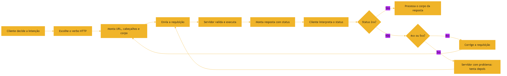

### 3.3 O Agente como Cliente do Protocolo

O mesmo ciclo descreve uma chamada de ferramenta de um agente: o modelo decide que precisa de dados externos, monta a requisição estruturada (o equivalente ao verbo e ao corpo), envia, recebe o status e incorpora a resposta ao raciocínio [7]. Quando a chamada falha com 4xx, o agente ajusta a requisição; quando falha com 5xx, ele reporta o problema do serviço [7]. Entender o protocolo é entender o que o agente está fazendo — e como avaliar se ele está fazendo certo [2].

### 3.4 O Correio em Escala: Filas e Retries

Quando o correio precisa processar milhões de cartas, entram em cena as filas e os retries [1]. Uma fila de mensagens desacopla o produtor do consumidor: o cliente publica a carta na fila, e o servidor a processa quando pode [3]. Se o processamento falha, a carta volta para a fila com uma política de retry — e o backoff exponencial evita sobrecarregar o serviço (a origem do 429) [7]. Na era agêntica, as filas são a infraestrutura das tarefas de longa duração: um agente que pede uma análise pesada não espera a resposta na mesma requisição — publica a tarefa, recebe um identificador e consulta o resultado depois [2]. Esse padrão de comunicação assíncrona é o que permite aos harnesses orquestrar dezenas de agentes sem travar [7]. Quando a chamada falha com 4xx, o agente ajusta a requisição; quando falha com 5xx, ele reporta o problema do serviço [7]. Entender o protocolo é entender o que o agente está fazendo — e como avaliar se ele está fazendo certo [2]. A configuração persistente que orienta o agente sobre como integrar é a mesma que o Tian Pan documenta para CLAUDE.md e AGENTS.md [17].

### 3.5 O Diagrama do Ciclo de Vida de uma Chamada

O ciclo completo da requisição — que a seção 2.9 descreveu — merece o seu diagrama [3]:

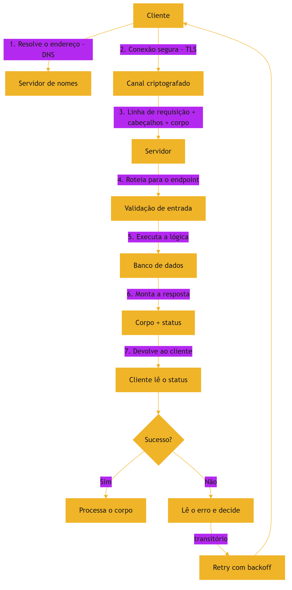

O diagrama deixa visível o que o texto descreve: cada etapa tem um nome e um ponto de falha [3]. Quando uma integração quebra, o profissional percorre o diagrama etapa por etapa — DNS? TLS? Roteamento? Validação? Banco? — até encontrar a etapa que falhou [3]. O diagrama é o mapa do diagnóstico [3].

### 3.6 O Garçom Que Atende Máquinas

A analogia do restaurante ganha o seu desdobramento agêntico: o garçom que atende máquinas [3]. No restaurante do Capítulo 5, o garçom atendia clientes humanos [3]. Na era agêntica, o mesmo cardápio é lido por agentes — que pedem com a precisão do protocolo e erram com a teimosia do loop [3]. O garçom — a API — trata os dois da mesma forma: pedido válido, serviço; pedido inválido, status de erro claro [3].

A lição da analogia é a consistência [3]. Um cardápio ambíguo confunde humanos e agentes na mesma medida [3]. Um status de erro vago — "erro de sistema" — não ensina nem humano nem máquina a corrigir [3]. A integração bem desenhada fala uma língua única para as duas audiências: o contrato [3]. E é essa língua única que os servidores MCP — o cardápio padronizado da era agêntica — formalizam [5]. Quando o garçom atende máquinas, o cardápio precisa ser perfeito — porque a máquina não improvisa [3].

### 3.7 O Telefone sem Fio

Uma analogia de fechamento para a integração: o telefone sem fio [3]. Cada salto da mensagem — de sistema a sistema — é um nó da cadeia [3]. O contrato é o que garante que a mensagem não se corrompa no salto: o formato exato, o verbo certo, o campo obrigatório [3]. O status é a confirmação de recebimento — ou o aviso de que a mensagem não chegou [3]. E o rastro é a gravação da conversa, para saber onde o mal-entendido aconteceu [3].

No telefone sem fio real, a mensagem se corrompe por ruído [3]. Na integração, o ruído é a ambiguidade — e o contrato é o que elimina a ambiguidade [3]. Uma integração sem contrato é um telefone sem fio: a mensagem chega, mas nunca se sabe se chegou inteira [3]. Com contrato, status e rastro, a integração vira uma ligação registrada: cada palavra, cada confirmação, cada desvio — documentado [3]. A era agêntica só amplifica a necessidade: a máquina não improvisa o que não entende — ela repete o mal-entendido [3].

## 4. Técnica

### 4.1 Consumindo uma API com Python

Vamos consumir a API do Capítulo 5 usando a biblioteca padrão do Python — `urllib` — para ver o ciclo completo da requisição na prática [1]:

```python
import json
from urllib import request, error


def buscar_transacoes():
    url = "http://localhost:8000/transacoes"
    requisicao = request.Request(url, method="GET")
    try:
        with request.urlopen(requisicao, timeout=5) as resposta:
            status = resposta.getcode()
            corpo = resposta.read().decode("utf-8")
            print(f"Status: {status}")
            dados = json.loads(corpo)
            for t in dados["transacoes"]:
                print(f"  {t['id']}: {t['descricao']} - R$ {t['valor']:.2f}")
            return dados
    except error.HTTPError as e:
        print(f"Erro HTTP {e.code}: {e.reason}")
        return None
    except error.URLError as e:
        print(f"Erro de conexão: {e.reason}")
        return None


if __name__ == "__main__":
    buscar_transacoes()
```

### 4.2 Criando um Recurso com POST

Agora vamos criar uma transação nova com POST — o verbo que envia dados e espera a criação [3]:

```python
import json
from urllib import request


def criar_transacao(descricao, valor):
    url = "http://localhost:8000/transacoes"
    corpo = json.dumps({"descricao": descricao, "valor": valor}).encode("utf-8")
    cabecalhos = {"Content-Type": "application/json"}
    requisicao = request.Request(url, data=corpo, headers=cabecalhos, method="POST")
    with request.urlopen(requisicao, timeout=5) as resposta:
        print(f"Status: {resposta.getcode()}")
        print(resposta.read().decode("utf-8"))


if __name__ == "__main__":
    criar_transacao("Farmácia", -89.90)
```

Para que o POST funcione, a API do Capítulo 5 precisa do método `do_POST` — que é o seu exercício: implemente o `do_POST` no servidor, faça a criação persistir no banco em memória e devolva o status 201 Created com o recurso criado [3]. Esse exercício consolida o ciclo inteiro: verbo, contrato, status e integração [1].

### 4.3 Validando o Contrato

A validação de contrato é o que transforma integração em engenharia [2]. Para cada requisição, verifique: o verbo correto para a intenção, o corpo no formato esperado pelo contrato, o status esperado e o formato da resposta [3]. Quando um agente de IA chama uma ferramenta, ele segue exatamente essa disciplina — e você vai usá-la no Capítulo 7 para entender como o modelo monta as chamadas [7].

### 4.4 Tabela de Referência dos Códigos de Status

Para fechar a técnica, consolide a tabela de referência dos códigos que você encontrará com mais frequência [3]: o 200 OK é o sucesso genérico; o 201 Created é o sucesso de criação (POST); o 204 No Content é sucesso sem corpo; o 301 e o 302 são redirecionamentos; o 400 Bad Request é requisição malformada; o 401 Unauthorized é autenticação ausente ou inválida; o 403 Forbidden é permissão negada; o 404 Not Found é recurso inexistente; o 409 Conflict é conflito de estado; o 429 Too Many Requests é limite de taxa atingido; e o 500 Internal Server Error, o 502 Bad Gateway e o 503 Service Unavailable são falhas do servidor [3]. Saber essa tabela de cor — como o profissional sabe os verbos — elimina a maior parte do mistério da integração [1]. O 429 merece atenção especial na era agêntica: agentes que chamam APIs em loop frequentemente estouram limites de taxa, e o harness precisa respeitar o retry com backoff [7]. Para cada requisição, verifique: o verbo correto para a intenção, o corpo no formato esperado pelo contrato, o status esperado e o formato da resposta [3]. Quando um agente de IA chama uma ferramenta, ele segue exatamente essa disciplina — e você vai usá-la no Capítulo 7 para entender como o modelo monta as chamadas [7]. O arco histórico que trouxe os agentes até aqui — do autocomplete à integração autônoma — é o mesmo que o CodeRabbit documenta em sua história do coding assistido por IA [19]. No Capítulo 7, a ferramenta interativa de tokenização da OpenAI vai tornar concreto o que o modelo vê em cada mensagem [18].

### 4.5 O Script de Teste de API

A integração pede verificação automática — e o script abaixo é um mini-testador de API, o embrião do que os harnesses de 2026 rodam contra cada contrato [3]:

```python
import json
import urllib.error
import urllib.request


def testar_endpoint(metodo, url, esperado):
    """Executa uma chamada e valida o status esperado."""
    req = urllib.request.Request(url, method=metodo, headers={"User-Agent": "tester/1.0"})
    try:
        with urllib.request.urlopen(req, timeout=10) as resp:
            corpo = resp.read().decode("utf-8")
            ok = resp.status == esperado
            print(f"{metodo} {url} -> {resp.status} (esperado {esperado}) {'OK' if ok else 'FALHA'}")
            if ok and corpo:
                dados = json.loads(corpo)
                print(f"  tipo do corpo: {type(dados).__name__}")
            return ok
    except urllib.error.HTTPError as e:
        ok = e.code == esperado
        print(f"{metodo} {url} -> {e.code} (esperado {esperado}) {'OK' if ok else 'FALHA'}")
        return ok


if __name__ == "__main__":
    testar_endpoint("GET", "https://api.github.com/repos/git/git", 200)
    testar_endpoint("GET", "https://api.github.com/repos/git/nao-existe-xyz", 404)
```

O script automatiza a inspeção que você fez à mão: chamar, ler o status, comparar com o esperado [3]. Note que o teste de erro (404) é tão importante quanto o teste de sucesso — a integração que só testa o caminho feliz é a integração que quebra em produção [20].

### 4.6 A Fábrica de Requisições com Retry

A integração profissional não desiste na primeira falha — ela repete com método [3]. O padrão retry com backoff: após um erro transitório, espera um tempo curto e tenta de novo, com o intervalo crescendo a cada tentativa [3]. O código abaixo implementa o padrão — a mesma política que os harnesses aplicam às chamadas de agentes [7]:

```python
import time
import urllib.error
import urllib.request


def chamar_com_retry(url, tentativas=3, base=1.0):
    """Chama uma URL com retry exponencial para erros transitórios."""
    for n in range(tentativas):
        try:
            with urllib.request.urlopen(url, timeout=10) as resp:
                print(f"Tentativa {n + 1}: OK ({resp.status})")
                return resp.read().decode("utf-8")
        except urllib.error.HTTPError as e:
            if e.code >= 500:
                espera = base * (2 ** n)
                print(f"Tentativa {n + 1}: erro {e.code}, aguardando {espera:.1f}s")
                time.sleep(espera)
            else:
                raise  # erro do cliente: repetir não resolve
    raise RuntimeError(f"Falha após {tentativas} tentativas")


if __name__ == "__main__":
    chamar_com_retry("https://api.github.com/repos/git/git")
```

A distinção mais importante do padrão é o que NÃO repetir: erros de cliente (4xx) não melhoram com retry — repetir só amplifica o problema [3]. Erros de servidor (5xx) e falhas de rede merecem retry [3]. Essa distinção — repetir o transitório, não o permanente — é uma das decisões que separam integrações amadoras de profissionais [3].

### 4.7 O Verificador de Status

Para fechar a parte técnica, um script que transforma a tabela de status em ferramenta — o mesmo que o profissional consulta ao interpretar uma resposta [3]:

```python
def interpretar_status(codigo):
    """Classifica um código HTTP e sugere o próximo passo."""
    faixas = [
        (100, 199, "Informativo", "Aguardar resposta definitiva"),
        (200, 299, "Sucesso", "Processar o corpo da resposta"),
        (300, 399, "Redirecionamento", "Seguir o cabeçalho Location"),
        (400, 499, "Erro do cliente", "Corrigir a requisição; repetir não resolve"),
        (500, 599, "Erro do servidor", "Erro transitório; retry com backoff"),
    ]
    for inicio, fim, nome, acao in faixas:
        if inicio <= codigo <= fim:
            print(f"{codigo}: {nome}")
            print(f"Próximo passo: {acao}")
            return nome
    print(f"{codigo}: código desconhecido")
    return "desconhecido"


if __name__ == "__main__":
    for codigo in [200, 301, 404, 429, 500, 503]:
        interpretar_status(codigo)
        print()
```

O script codifica a lição central do capítulo: o status não é um número — é uma instrução de próximo passo [3]. O 404 não é "deu errado" — é "o recurso não existe, verifique o contrato" [3]. O 500 não é "deu errado" — é "erro no servidor, pode repetir" [3]. O integrador que interpreta o status age com método; o que só vê "erro", adivinha [3]. E é essa interpretação — a mesma — que os harnesses ensinam aos agentes [7].

## 5. Aplica

### 5.1 Onde Isso Vive no Mundo Real

Toda integração moderna é uma conversa HTTP: o app que consulta o clima, o pagamento que valida o cartão, o agente que busca dados — todos seguem o mesmo ciclo de verbo, status e contrato [1]. A cada mudança nesses contratos, o circuito de integração contínua que você dominou no Capítulo 4 roda a suíte para garantir que nada quebrou [12]. As plataformas de API expõem documentação interativa onde você testa cada rota e vê o status em tempo real [3]. E a observabilidade que você estudou no Capítulo 4 instrumenta essas conversas: traces mostram o caminho da requisição pelos serviços, métricas medem latência e erros [10][11]. Em infraestruturas grandes, é essa telemetria que permite aos agentes de coding navegar e diagnosticar sistemas — o diferencial dos melhores agentes de 2026 [6]. Com a adoção de IA em 92% das equipes, dominar essa integração é o que separa quem consome ferramentas de quem as projeta [20].

### 5.2 O Erro Comum do Iniciante

O erro clássico de quem integra é ignorar o código de status: receber um 500 e assumir que "o servidor está com problema", sem olhar o 404 que veio antes — ou pior, ignorar o corpo da resposta, onde está o detalhe do erro [3]. A correção — e aqui está o diferencial que separa o profissional — é tratar cada resposta como evidência: leia o status, leia o corpo, forme a hipótese e só então aja [2]. Com agentes, o erro se multiplica: se você não ensina o agente a ler status e corpo, ele repete a mesma chamada errada indefinidamente [7].

### 5.3 O Padrão Profissional em 2026

O integrador profissional trata contrato como código: versiona a especificação, testa contra ela e exige que os agentes sigam o mesmo contrato [3]. Quando um agente precisa chamar uma API, a descrição da ferramenta — o JSON Schema — é o contrato que o modelo usa [7]. O Model Context Protocol padroniza essa exposição: servidores MCP descrevem ferramentas, e os agentes as chamam pelo mesmo ciclo HTTP que você dominou neste capítulo [5].

### 5.4 Testando Contratos com Mocks

A integração de contratos é testável — e a técnica central é o mock [12]. Em vez de chamar o serviço real nos testes (lento, frágil e dependente de rede), o profissional simula o contrato: um mock devolve respostas predefinidas para as rotas esperadas [1]. O teste de contrato então verifica: o cliente monta a requisição certa, e o mock devolve a resposta prevista [12]. Na era agêntica, os mocks têm um papel duplo: além de testar o código, servem para testar o agente — o harness simula a API e observa se o agente chama as ferramentas com os argumentos certos [2]. Essa técnica é a base da avaliação de agentes que você estudará nos volumes de Eval Engineering [20].

### 5.5 A Evolução do Contrato: Versionamento

Contratos evoluem — e a forma como evoluem define a confiabilidade da integração [3]. O versionamento de API permite mudanças sem quebrar consumidores: a URL com versão (`/v1/`, `/v2/`), cabeçalhos de versão ou contratos compatíveis com adições [3]. A regra de ouro: mudanças que quebram o contrato exigem versão nova; adições compatíveis podem conviver [3]. Na era agêntica, o versionamento protege os agentes: quando um serviço muda, os agentes que dependem dele precisam de aviso — e o harness, via AGENTS.md, instrui a atualização do contrato nos arquivos de instrução [14]. Quando um agente precisa chamar uma API, a descrição da ferramenta — o JSON Schema — é o contrato que o modelo usa [7]. O Model Context Protocol padroniza essa exposição: servidores MCP descrevem ferramentas, e os agentes as chamam pelo mesmo ciclo HTTP que você dominou neste capítulo [5]. E é essa mesma visão — o software falando com o software, e a IA orquestrando — que o Karpathy chama de Software 3.0 na sua palestra fundacional [1] e aprofunda na análise do Sequoia Ascent 2026 [16].

### 5.6 Integração e Segurança: o Contrato sob Ataque

Toda integração é uma superfície de ataque em potencial [3]. Um endpoint HTTP exposto recebe, além de tráfego legítimo, tentativas de exploração: injeção de dados, chamadas sem autenticação, payloads malformados [3]. O profissional trata a integração com três posturas [3]. A primeira é a validação rigorosa de entrada: nada que chega pela rede é confiável até ser validado [3]. A segunda é a autenticação e autorização em cada fronteira: a API sabe quem chama e o que esse quem pode fazer [3]. A terceira é o registro: cada chamada deixa rastro — quem, quando, o quê — para auditoria e diagnóstico [3].

Na era agêntica, a superfície de ataque ganha um vetor novo: o próprio agente [7]. Um agente com acesso a uma API pode, por engano ou por prompt malicioso, executar chamadas que um humano não executaria [7]. A defesa é a mesma disciplina de contrato que você dominou neste capítulo — escopo mínimo de ferramentas, validação em cada fronteira e rastro de cada chamada [7]. O function calling que você verá no Capítulo 9 é exatamente essa porta controlada: o agente só chama o que o contrato expõe [9].

### 5.7 O Fluxo de Integração Agêntica Completo

Vale consolidar o fluxo completo de uma integração agêntica — o mesmo cenário que os harnesses profissionais executam milhões de vezes por dia [2]. O agente recebe uma tarefa e precisa de um dado externo [2]. Ele monta a requisição segundo o contrato documentado — verbo, cabeçalhos, corpo no formato certo [3]. A requisição cruza a API, que valida, autentica e responde [3]. O agente lê o status e o corpo — a inspeção que você treinou neste capítulo — e decide o próximo passo [2]. Se algo falha, ele lê o erro, ajusta e tenta novamente, dentro dos limites que o harness define [2].

Cada passo desse fluxo é uma habilidade que este livro construiu [1]: HTTP (Capítulo 6), inspeção (Capítulo 2), validação (Capítulo 4) e, na frente, o vocabulário do agente (Capítulo 9) [1]. A integração agêntica não é mágica — é a mesma engenharia de contratos aplicada com rigor e disciplina [3]. Quando você projetar MCP servers, nos volumes seguintes, estará construindo exatamente esses fluxos em escala [5].

### 5.8 O Checklist do Integrador

A integração madura se apoia em um checklist que vale repetir antes de cada chamada em produção [3]. Primeiro: o contrato — você leu a documentação da API e sabe o verbo, os parâmetros e o formato da resposta [3]. Segundo: o status — você sabe qual código esperar em cada resultado e o que fazer com os erros [3]. Terceiro: o corpo — você sabe interpretar o conteúdo real da resposta, não só o que o exemplo mostrou [3]. Quarto: a idempotência — operações que podem se repetir têm chave de idempotência [3]. Quinto: o registro — a chamada deixa rastro para diagnóstico [3].

O mesmo checklist se aplica a agentes — com uma camada extra [7]. O agente que chama uma API precisa das mesmas respostas: o contrato documentado no contexto, a regra de status nas instruções, e a política de repetição no harness [7]. Quando um agente erra uma integração, o diagnóstico começa pelo mesmo lugar que para um humano: o contrato foi lido? O status foi interpretado? O rastro existe? [7] Essa simetria — o checklist é um só — é o que torna a integração agêntica uma extensão natural da integração humana [2].

### 5.9 O Custo do Contrato Quebrado

Vale medir o que custa um contrato quebrado [3]. Quando uma API muda o formato da resposta sem avisar, cada consumidor quebra — e, na era agêntica, cada agente consumidor quebra repetidamente, porque cada nova execução tenta de novo [3]. Quando o status de erro não é tratado, o consumidor interpreta o erro como sucesso — e a falha vira silenciosa, o tipo mais caro [2]. Quando o corpo não é validado, os dados errados entram no sistema e se propagam [3].

A defesa é exatamente o que o capítulo ensinou: contrato documentado, status interpretado, corpo inspecionado e versionamento que protege [3]. A soma dessas práticas é a confiabilidade — e a confiabilidade é o ativo que os sistemas agênticos mais precisam [2]. Um agente que opera sobre integrações confiáveis pode ser autônomo; sobre integrações quebradas, ele amplifica a confusão [2]. A integração não é um detalhe técnico — é a fundação sobre a qual a autonomia é construída [1].

### 5.10 O Checklist Agêntico de Integração

O checklist do integrador, aplicado a agentes, ganha três camadas que o profissional de 2026 conhece [7]. A camada do contrato: o agente só chama APIs cujo contrato está documentado no contexto — rotas, parâmetros, formatos, status [7]. A camada do erro: o agente interpreta o status antes de repetir — e repete apenas erros transitórios, com backoff [7]. A camada do rastro: cada chamada do agente fica registrada, com o quê, quando e qual foi a resposta [7].

O checklist é a ponte entre este capítulo e a governança de harnesses [2]. Quando um agente integra mal, o diagnóstico percorre as mesmas camadas do checklist humano: o contrato estava no contexto? O status foi lido? O rastro existe? [7] A integração agêntica não é uma disciplina nova — é a disciplina deste capítulo, executada por máquinas sob supervisão humana [2]. E é essa mesma disciplina que os volumes de MCP Engineering vão padronizar em escala [5].

### 5.11 O Custo da Integração Negligenciada

Vale um fechamento sobre o custo real de negligenciar a integração [3]. Uma API chamada sem ler o contrato gera integração quebrada [3]. Um status ignorado transforma erro em falha silenciosa [2]. Um corpo não inspecionado propaga dados errados pelo sistema [3]. Na era agêntica, cada um desses erros se multiplica: o agente repete o padrão errado a cada execução, e a escala da automação amplifica o dano [2].

O custo é evitável com o que o capítulo inteiro construiu: contrato, status, corpo, idempotência, registro e retry seletivo [3]. A integração bem feita é invisível — funciona, registra e se adapta [3]. A mal feita é visível em cada incidente [3]. O profissional que domina a língua HTTP — este capítulo — é o que mantém os sistemas de 2026 conversando, humanos e agentes incluídos [2].

### 5.12 O Glossário do Integrador

O capítulo termina com o vocabulário que você vai usar em toda conversa de integração [3]. Requisição: o pedido com verbo, cabeçalhos e corpo [3]. Resposta: o retorno com status e corpo [3]. Status: o veredito padronizado — 2xx sucesso, 3xx redirecionamento, 4xx erro do cliente, 5xx erro do servidor [3]. Contrato: a especificação do que pode ser pedido e devolvido [3]. Idempotência: a propriedade de repetir sem duplicar [3]. Retry: a repetição seletiva com backoff [3]. Versionamento: a evolução do contrato sem quebrar consumidores [3].

Esse vocabulário é a língua comum de toda a integração — humana, agêntica e de máquina a máquina [1]. Quando os volumes seguintes falarem de MCP servers, JSON Schema e function calling, você estará conversando na mesma língua da integração [5]. O glossário não é um resumo — é o instrumento de precisão do integrador [3].

### 5.13 O Custo de Integrar no Escuro

Fechar com o custo de integrar no escuro — sem contrato, sem status, sem rastro [3]. Integrar no escuro é ligar dois sistemas e torcer [3]. Quando algo falha — e falha — o diagnóstico começa do zero, sem pistas [3]. Quando o contrato muda, ninguém avisa e tudo quebra ao mesmo tempo [3]. Quando o erro é silencioso, a falha se propaga antes de ser notada [2].

A era agêntica multiplica o custo do escuro [2]. Agentes que integram no escuro repetem erros em escala, sem perceber [3]. O harness que integra no escuro não consegue nem diagnosticar — não há rastro [7]. A integração na luz — contrato, status, rastro — é o que permite a humanos e máquinas operarem com confiança [3]. Este capítulo acendeu a luz [1].

## 6. Conclusão

Neste capítulo, você aprendeu a língua da integração: os verbos HTTP como a intenção da requisição [1]; os códigos de status como o veredito padronizado da resposta [3]; e o ciclo de vida completo — da montagem do pedido à interpretação do resultado [1]. Você consumiu uma API com GET e criou recursos com POST, exercitando contrato, status e integração na prática [3].

Resumindo em três pontos: primeiro, os verbos HTTP carregam a intenção — GET lê, POST cria, PUT substitui, DELETE remove [1]; segundo, os códigos de status são o veredito padronizado — e ler a família do código é o primeiro reflexo do integrador [3]; terceiro, a integração é um ciclo completo — e o agente percorre o mesmo ciclo a cada chamada de ferramenta [7]. Com esses três pontos, você fala a língua dos sistemas — a mesma que os agentes falam [2].

### O Desafio Deste Capítulo

O desafio em três níveis. Nível um: implemente o `do_POST` no servidor do Capítulo 5 e devolva 201 Created com o recurso criado, validando o corpo recebido. Nível dois: crie um cliente que trate os quatro cenários de status — 200, 404, 400 e 500 — com mensagens de diagnóstico adequadas. Nível três: peça a um agente para integrar o cliente com a API e avalie se o agente leu corretamente os status — especialmente o 429 — e implementou retry com backoff [1]. Os três níveis exercitam a implementação do contrato, o tratamento de erros e a supervisão de integrações agênticas [3].

Essa é a camada que conecta tudo: os agentes falam HTTP, os harnesses expõem ferramentas e os contratos definem o que é possível [2]. No próximo capítulo, vamos mergulhar no lado mais fascinante da pilha: como um modelo de linguagem realmente processa o texto que recebe — tokens, janela de contexto e o que o modelo "vê" em cada conversa [7].

## 7. Referências Bibliográficas

[1] KARPATHY, Andrej. Software 3.0: Software in the Age of AI. Disponível em: https://www.latent.space/p/s3. Acesso em: 5 ago. 2026.

[2] SITEPOINT. Vibe Coding 2026: The Complete Guide to AI-First Development. Disponível em: https://www.sitepoint.com/vibe-coding-2026-complete-guide/. Acesso em: 5 ago. 2026.

[3] PROMPTING GUIDE. Function Calling in AI Agents. Disponível em: https://www.promptingguide.ai/agents/function-calling. Acesso em: 5 ago. 2026.

[4] CHACON, Scott; STRAUB, Ben. Pro Git. 2. ed. Apress/Git SCM, 2014. Disponível em: https://git-scm.com/book/en/v2. Acesso em: 5 ago. 2026.

[5] ANTHROPIC. Introducing the Model Context Protocol. Disponível em: https://www.anthropic.com/news/model-context-protocol. Acesso em: 5 ago. 2026.

[6] MIGHTYBOT. Best AI Coding Agents in 2026, Ranked. Disponível em: https://mightybot.ai/blog/coding-ai-agents-for-accelerating-engineering-workflows/. Acesso em: 5 ago. 2026.

[7] OPENAI. Function Calling Guide. Disponível em: https://developers.openai.com/api/docs/guides/function-calling. Acesso em: 5 ago. 2026.

[8] WENG, Lilian. LLM-Powered Autonomous Agents. Disponível em: https://lilianweng.github.io/posts/2023-06-23-agent/. Acesso em: 5 ago. 2026.

[9] ANTHROPIC. Effective Context Engineering for AI Agents. Disponível em: https://www.anthropic.com/engineering/effective-context-engineering-for-ai-agents. Acesso em: 5 ago. 2026.

[10] EWASCHUK, Rob; BEYER, Betsy (Ed.). Site Reliability Engineering: Monitoring Distributed Systems. Google SRE Book. Disponível em: https://sre.google/sre-book/monitoring-distributed-systems/. Acesso em: 5 ago. 2026.

[11] OPENTELEMETRY. What is OpenTelemetry?. Disponível em: https://opentelemetry.io/docs/what-is-opentelemetry/. Acesso em: 5 ago. 2026.

[12] FOWLER, Martin. Continuous Integration. Disponível em: https://martinfowler.com/articles/continuousIntegration.html. Acesso em: 5 ago. 2026.

[13] LULLA, Jai Lal; et al. On the Impact of AGENTS.md Files on the Efficiency of AI Coding Agents. Disponível em: https://arxiv.org/html/2601.20404v1. Acesso em: 5 ago. 2026.

[14] OPENAI / AGENTS.MD FOUNDATION. Open Standards for Agentic Configuration (AGENTS.md). Disponível em: https://agents.md/. Acesso em: 5 ago. 2026.

[15] CHROMA. Context Rot: How Increasing Input Tokens Impacts LLM Performance. Disponível em: https://www.trychroma.com/research/context-rot. Acesso em: 5 ago. 2026.

[16] KARPATHY, Andrej. Sequoia Ascent 2026 Summary (Software 3.0 & Agentic Engineering). Disponível em: https://karpathy.bearblog.dev/sequoia-ascent-2026/. Acesso em: 5 ago. 2026.

[17] TIAN PAN. CLAUDE.md and AGENTS.md: The Configuration Layer That Makes AI Coding Agents Actually Follow Your Rules. Disponível em: https://tianpan.co/blog/2026-02-25-claude-md-agents-md-ai-coding-agent-instruction-files. Acesso em: 5 ago. 2026.

[18] OPENAI. Tokenizer (ferramenta interativa). Disponível em: https://platform.openai.com/tokenizer. Acesso em: 5 ago. 2026.

[19] CODERABBIT. From Copilot to agents: The history of AI coding. Disponível em: https://www.coderabbit.ai/blog/a-very-brief-history-of-ai-coding-from-copilot-to-next-gen-agents. Acesso em: 5 ago. 2026.

[20] KEYHOLE SOFTWARE. Vibe Coding Trends 2026: Adoption, Productivity, and Code Quality Data. Disponível em: https://keyholesoftware.com/vibe-coding-trends-2026/. Acesso em: 5 ago. 2026.

# PARTE IV — Como um Modelo de Linguagem Funciona

# Capítulo 7: Tokens e Janela de Contexto: o que o Modelo Vê

## 1. Introdução

Chegamos ao coração técnico da série. Nos capítulos anteriores, você entendeu como os sistemas conversam entre si via HTTP e contratos. Agora vamos olhar para dentro da máquina que orquestra tudo: o modelo de linguagem. Entender o que um LLM realmente "vê" quando processa texto é o pré-requisito de todas as disciplinas que virão — Context Engineering, Prompt Engineering, Rules Engineering — porque todas elas manipulam exatamente a mesma coisa: os tokens dentro de uma janela [1].

Este capítulo tem três objetivos. Primeiro, entender o que é um token e como a tokenização converte texto em números [2]. Segundo, dominar o conceito de janela de contexto — o espaço finito de entrada e saída de uma inferência [3]. Terceiro, compreender a distinção crucial entre contexto longo e memória: uma janela de um milhão de tokens não é memória persistente [4]. Ao final, você saberá por que "orçamento de tokens" é dinheiro e atenção — e por que essa é a moeda de toda a série [1].

## 2. Explica

### 2.1 Tokens: os Átomos da Linguagem

Um token não é uma palavra — é um fragmento [2]. Modelos modernos usam tokenização por subpalavras: o texto é quebrado em pedaços que podem ser palavras inteiras, partes de palavras ou até caracteres isolados. O algoritmo mais comum é o Byte-Pair Encoding (BPE), que começa com o alfabeto e vai juntando os pares mais frequentes até formar um vocabulário fixo — tipicamente entre 32 mil e 256 mil tokens [2]. Em inglês, um token equivale em média a cerca de quatro caracteres ou 0,75 palavras; em português, com acentos e morfologia próprios, o custo por palavra costuma ser um pouco maior [2]. A ferramenta interativa de tokenização da OpenAI permite visualizar essa quebra em tempo real — um exercício que recomendamos fazer agora [5]. E é essa contagem que define o custo de cada chamada de API: você paga por token processado [13].

### 2.2 A Janela de Contexto: o Palco da Inferência

A janela de contexto é o limite máximo de tokens — entrada mais saída — que o modelo processa em uma única inferência [3]. Tudo o que você envia — instruções, histórico, dados, o código do repositório — compete pelo mesmo espaço finito [1]. É por isso que a frase "orçamento de tokens" não é metáfora: cada token da janela tem custo monetário e custo de atenção [1]. Modelos modernos alcançam janelas de 1 milhão ou 2 milhões de tokens — o Gemini 1.5 foi um marco nessa escala [6] — mas o custo quadrático da atenção torna cada token adicional progressivamente mais caro de processar [7].

### 2.6 O Custo Real de Cada Token

Para dimensionar a afirmação de que "token é dinheiro", vale quantificar [13]. As APIs de modelos cobram por token de entrada e por token de saída — e os preços variam por modelo [13]. Uma consulta de mil tokens é trivial; um contexto de cem mil tokens por chamada, repetido milhares de vezes por dia, vira uma conta significativa [13]. É por isso que a engenharia de contexto — decidir o que entra na janela — é também uma disciplina financeira [10]. O profissional que otimiza o contexto reduz custo e melhora qualidade ao mesmo tempo: menos tokens, menos distração, respostas melhores [1]. Os livros da série sobre Context Engineering vão detalhar as técnicas de orçamento, mas o princípio é este capítulo: medir antes de enviar [13].

### 2.7 Compactação e Subagentes: Administrando a Janela

Quando a janela enche, duas técnicas profissionais administram o espaço [10]. A compactação resume o histórico antigo em poucos tokens — preservando o essencial e liberando espaço [9]. Os subagentes dividem a tarefa: cada um trabalha com um contexto menor e devolve apenas o resultado ao orquestrador [10]. A Anthropic documenta ambas as técnicas em seu guia de engenharia de contexto: o orçamento de atenção (attention budget) e o descarte dinâmico de histórico [10]. Na prática, um harness agêntico combina as duas: o agente principal mantém o objetivo e o estado; os subagentes executam subtarefas com contexto próprio; e a compactação encerra as conversas longas [10]. Essas técnicas serão o coração dos volumes de Harness Engineering — e você acaba de ver por que existem [9]. Tudo o que você envia — instruções, histórico, dados, o código do repositório — compete pelo mesmo espaço finito [1]. É por isso que a frase "orçamento de tokens" não é metáfora: cada token da janela tem custo monetário e custo de atenção [1]. Modelos modernos alcançam janelas de 1 milhão ou 2 milhões de tokens — o Gemini 1.5 foi um marco nessa escala [6] — mas o custo quadrático da atenção torna cada token adicional progressivamente mais caro de processar [7]. A engenharia de contexto, disciplina central da série, existe exatamente para administrar esse custo [10].

### 2.3 Codificação Posicional: como o Modelo Sabe a Ordem

Como o Transformer processa todos os tokens em paralelo, ele perde a noção natural de ordem — e precisa de um mecanismo para recuperá-la: a codificação posicional [2]. Técnicas como RoPE (Rotary Position Embedding) rotacionam os vetores de representação para preservar as distâncias relativas entre tokens, permitindo estender modelos abertos como o Llama para milhões de tokens [8]. Sem posição, "o cão mordeu o homem" e "o homem mordeu o cão" seriam indistinguíveis — a posição é o que dá sentido à ordem [2].

### 2.4 Contexto Longo não é Memória

A distinção mais importante deste capítulo: contexto longo é o espaço bruto da janela em um dado momento; memória é o que sobrevive entre sessões [1]. Um modelo com janela de um milhão de tokens não "lembra" de você — ele reprocessa tudo o que você enviar a cada vez [4]. E há um limite físico na utilidade da janela grande: o fenômeno conhecido como context rot mostra que a atenção degrada conforme o contexto satura — o modelo perde o foco em informações no meio da janela, falhando até em testes simples de "agulha no palheiro" [9]. A pesquisa da Anthropic sobre engenharia de contexto documenta exatamente esse comportamento e as técnicas de mitigação [10].

### 2.8 Tokenização Multilíngue: o Custo do Português

A tokenização não é neutra em relação à língua [2]. Modelos treinados predominantemente em inglês tokenizam o português de forma menos eficiente: palavras comuns em inglês viram um token só, enquanto palavras portuguesas com acentuação e morfologia própria podem se desdobrar em vários tokens [2]. Na prática, o mesmo texto em português costuma custar mais tokens que sua tradução em inglês — um detalhe que vira decisão de custo em aplicações de produção [13].

Para o profissional, as implicações são concretas [1]. Primeiro, meça o seu caso real: o tokenizador da OpenAI mostra a quebra token por token, e a diferença entre idiomas fica visível imediatamente [5]. Segundo, ao projetar prompts e arquivos de instrução em português, prefira frases diretas — cada palavra redundante é token e dinheiro [13]. Terceiro, ao avaliar o custo de um fluxo multilíngue, não compare apenas caracteres — compare tokens [13]. A língua não muda o princípio do capítulo, apenas o multiplicador do orçamento [1].

### 2.9 A Janela de Saída e o Custo Oculto

A janela de contexto inclui a saída — e é aí que mora um dos custos mais subestimados [3]. Cada token gerado pelo modelo é token de saída, geralmente mais caro que o token de entrada, e ocupa espaço na janela [13]. Um agente que escreve respostas longas — relatórios, revisões de código, documentação — consome o orçamento da janela no próprio ato de responder [3].

A disciplina da saída segue a mesma lógica da entrada [13]. Peça respostas do tamanho certo para a tarefa: um resumo de três linhas quando a decisão precisa de três linhas [13]. Configure limites de saída quando a API permitir [13]. E lembre-se de que a resposta de um agente vira o contexto da próxima iteração — o ciclo inteiro cresce se a saída for verborrágica [1]. Medir o custo da saída é medir a metade do orçamento que a maioria esquece [13].

### 2.5 Por Que Isso Define a Engenharia de Contexto

Se a janela é finita e a atenção degrada com a saturação, então a curadoria do que entra é uma disciplina de engenharia — não um detalhe [1]. Context Engineering é o conjunto de técnicas para decidir o que entra na janela, em que ordem e em que formato [10]. É a diferença entre jogar o repositório inteiro no contexto e enviar apenas os arquivos relevantes para a tarefa — a diferença entre um agente confuso e um agente preciso [1]. Todos os capítulos seguintes da série constroem sobre essa ideia: Rules Engineering organiza as instruções, MCP Engineering padroniza as ferramentas e Harness Engineering automatiza a curadoria [10].

## 3. Ilustra

### 3.1 A Analogia do Palco Pequeno

Imagine um palco de teatro minúsculo. O diretor (você) decide o que entra no palco: os atores (instruções), o cenário (dados de contexto) e o roteiro (histórico da conversa). Tudo que você coloca no palco compete por espaço — e quanto mais coisas, menos atenção cada uma recebe [1]. Agora imagine que o palco possa ser gigante — um estádio — mas o diretor só tem um holofote (a atenção). O holofote se espalha: com milhares de atores, cada um fica mal iluminado. Esse é o context rot: o palco grande não resolve o problema da iluminação [9]. O diretor experiente não enche o palco — ele escolhe as cenas certas para cada momento [10].

### 3.2 O Diagrama da Janela de Contexto

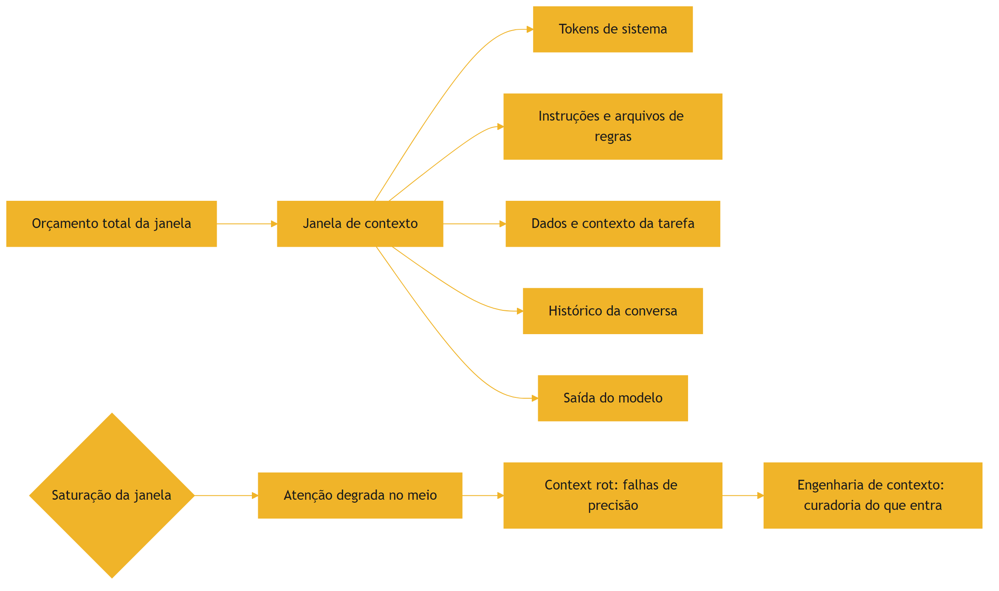

### 3.3 O Agente e a Janela

Um agente de coding vive dentro da janela: o sistema define o papel, os arquivos de regras definem as convenções, os arquivos relevantes fornecem o contexto e o histórico guarda o raciocínio [1]. Quando o agente "esquece" algo que você disse no início da sessão, não é um capricho — é a janela disputando espaço e a atenção degradando [9]. Por isso os agentes profissionais usam técnicas de compactação e subagentes: dividem o trabalho para não saturar a janela [10]. E é por isso que arquivos de regras enxutos — como AGENTS.md — são tão valorizados: menos tokens de instrução, mais espaço para o trabalho real [11].

### 3.4 O Diagrama do Orçamento de Janela

O orçamento que você calculou em código merece um diagrama — a anatomia de quem ocupa a janela [1]:

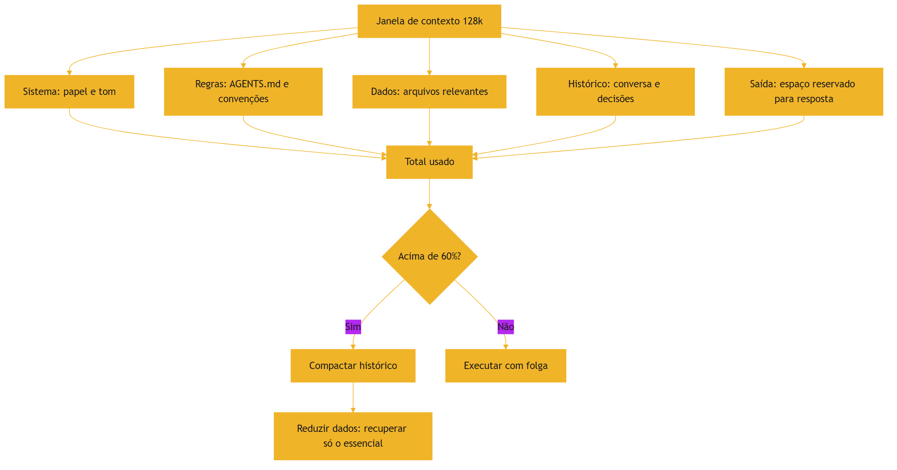

O diagrama mostra a decisão central do capítulo: o que entra e o que fica de fora é uma escolha de arquitetura [1]. A compactação e a recuperação seletiva (RAG) são as válvulas que mantêm o uso abaixo do limiar [9][10]. Quando você projetar um harness, nos volumes da Parte III, este diagrama é o esqueleto do design de contexto [10].

### 3.5 O Aeroporto e a Torre de Controle

Uma analogia de fechamento para a gestão da janela: o aeroporto e a torre de controle [1]. A janela de contexto é o espaço aéreo — finito, com capacidade máxima [1]. O sistema é o avião; as instruções e os dados são a carga e os passageiros [1]. A torre de controle — o engenheiro de contexto — decide o que decola, o que fica no solo e o que é despachado primeiro [1]. Um espaço aéreo cheio demais não comporta mais aviões — mesmo que sejam importantes [9].

Os subagentes são a solução da aviação para o problema: em vez de um avião gigante com tudo, vários voos menores, cada um com a sua carga, coordenados pela torre [10]. A compactação é o despacho: resumir o que já voou para liberar espaço para o que ainda vai decolar [9]. E a torre de controle — você — nunca deixa o espaço aéreo lotar sem redistribuir [10]. Quando um agente satura a janela e esquece instruções no meio, não é o avião que falhou — é a torre que deixou o espaço lotar [9].

### 3.6 O Palco Lotado

A analogia do palco pequeno tem um desfecho que vale fechar a seção: o palco lotado [1]. Imagine que o diretor ignore o aviso e encha o palco mesmo assim — atores, cenários, adereços, tudo [1]. O resultado é previsível: ninguém tem espaço para agir, o holofote se espalha e o público não entende a cena [9]. O palco lotado é o contexto saturado [9].

A diferença entre o diretor amador e o profissional não está no tamanho do palco — está na curadoria das cenas [10]. O profissional monta a cena da cena: só o que é necessário para o momento [10]. E quando a cena muda, o diretor troca o cenário — em vez de acumular [10]. O mesmo raciocínio rege o contexto dos agentes: cada tarefa é uma cena nova, e o contexto deve ser montado para a cena, não herdado por hábito [10]. O diretor de palco e o engenheiro de contexto fazem o mesmo trabalho: decidir o que o público — ou o modelo — precisa ver agora [1].

## 4. Técnica

### 4.1 Contando Tokens na Prática

Vamos colocar o conceito em números. Sem depender de bibliotecas externas, a estimativa mais simples é a proporção média — mas vamos usar o Tiktoken, a biblioteca oficial da OpenAI, se disponível, com fallback para a estimativa:

```python
try:
    import tiktoken
    def contar_tokens(texto):
        enc = tiktoken.get_encoding("cl100k_base")
        return len(enc.encode(texto))
except ImportError:
    def contar_tokens(texto):
        # Estimativa simples: ~4 caracteres por token em média
        return max(1, len(texto) // 4)


def resumo_da_janela(texto):
    total = contar_tokens(texto)
    janela = 128_000
    uso = total / janela * 100
    print(f"Texto: {len(texto)} caracteres")
    print(f"Tokens estimados: {total}")
    print(f"Janela de {janela:,} tokens: {uso:.1f}% ocupada".replace(",", "."))
    if uso > 60:
        print("Alerta: acima de 60%, risco de context rot")
    return total


if __name__ == "__main__":
    texto_demo = " ".join(f"tarefa numero {i}" for i in range(1000))
    resumo_da_janela(texto_demo)
```

### 4.2 Orçando a Janela de um Agente

A aplicação prática do conceito é o orçamento: antes de montar um prompt ou um contexto para um agente, estime o custo de cada bloco [1]. O exercício abaixo calcula quanto de uma janela de 128 mil tokens cada componente consome — o mesmo cálculo que os profissionais fazem ao projetar um harness [10]:

```python
def orcamento_janela(componentes, janela_total=128_000):
    """Recebe {nome: texto} e reporta o uso percentual de cada bloco."""
    custos = []
    for nome, texto in componentes.items():
        custos.append((nome, contar_tokens(texto)))
    soma = sum(c for _, c in custos)
    print(f"Total: {soma:,} tokens de {janela_total:,} ({soma / janela_total * 100:.1f}%)".replace(",", "."))
    for nome, custo in sorted(custos, key=lambda x: -x[1]):
        pct = custo / janela_total * 100
        print(f"  {nome:<30} {custo:>7,} tokens  {pct:5.1f}%".replace(",", "."))
    return soma


if __name__ == "__main__":
    orcamento_janela({
        "sistema": "Você é um assistente de engenharia de software.",
        "regras (AGENTS.md)": "Use testes antes de integrar. Siga o estilo do projeto.",
        "arquivo relevante": "def calcular_media(n): return sum(n) / len(n)",
        "histórico da conversa": "Usuário: conserte o bug. Assistente: vou olhar o código.",
    })
```

### 4.3 O Teste da Agulha no Palheiro

O experimento mais revelador sobre janela de contexto é o "needle in a haystack": colocar um fato único no meio de um contexto enorme e perguntar por ele [9]. Em janelas saturadas, o modelo frequentemente falha em encontrá-lo — mesmo sabendo que o fato está lá [9]. Esse experimento é a base empírica do context rot e o motivo pelo qual a curadoria importa [9]. Você pode repeti-lo com qualquer modelo: gere um contexto longo, insira um fato no meio e veja se o modelo o recupera [9].

### 4.5 Compactação na Prática: o Resumo Estrutural

A compactação que a seção 2.7 descreveu tem uma forma concreta que você pode aplicar hoje: o resumo estrutural [10]. Em vez de guardar o histórico integral da conversa, o harness mantém quatro blocos: o objetivo original (imutável), as decisões já tomadas (em bullets), os fatos descobertos (arquivos lidos, erros encontrados) e as tarefas pendentes [10]. Esse resumo de dezenas de tokens substitui um histórico de milhares — e preserva exatamente o que a próxima iteração precisa [9].

O exercício abaixo materializa a ideia: uma função que compacta um histórico de eventos em um resumo estrutural — o mesmo padrão que harnesses profissionais usam antes de saturar a janela [10]:

```python
def compactar_historico(objetivo, eventos, decisoes, pendentes):
    """Monta o resumo estrutural que substitui o histórico integral."""
    print("=== OBJETIVO (imutável) ===")
    print(objetivo)
    print("\n=== DECISÕES JÁ TOMADAS ===")
    for d in decisoes:
        print(f"  - {d}")
    print("\n=== FATOS DESCOBERTOS ===")
    for e in eventos[-5:]:
        print(f"  - {e}")
    print("\n=== TAREFAS PENDENTES ===")
    for p in pendentes:
        print(f"  - {p}")
    print(f"\nHistórico integral: {len(eventos)} eventos -> resumo: 4 blocos [9][10]")


if __name__ == "__main__":
    compactar_historico(
        "Corrigir o bug de login",
        ["Leu auth.py", "Reproduziu o erro 401", "Achou token expirado"],
        ["Usar refresh token", "Não alterar o fluxo de logout"],
        ["Implementar refresh", "Rodar testes de auth"],
    )
```

Aplicar esse padrão nas suas próprias conversas com agentes — manter o objetivo, resumir as decisões, anotar os fatos e listar o que falta — já é, na prática, fazer engenharia de contexto [10].

### 4.4 Experimentando o Orçamento na Prática

O exercício de orçamento que você fez na seção anterior pode ser levado ao extremo: pegue um projeto de código aberto que você conhece, estime o custo de enviar o repositório inteiro ao modelo e compare com o custo de enviar apenas os arquivos relevantes [1]. A diferença costuma ser de uma ordem de grandeza — e a qualidade da resposta também melhora, porque o modelo não se distrai [9]. Esse experimento é o mesmo que fundamenta a indústria de RAG e de grafos de código: a curadoria do que entra na janela é o problema central da engenharia de IA aplicada [1]. Quando você projetar harnesses, nos próximos volumes, vai aplicar exatamente essa análise de custo e relevância em cada decisão de contexto [10]. Em janelas saturadas, o modelo frequentemente falha em encontrá-lo — mesmo sabendo que o fato está lá [9]. Esse experimento é a base empírica do context rot e o motivo pelo qual a curadoria importa [9]. Você pode repeti-lo com qualquer modelo: gere um contexto longo, insira um fato no meio e veja se o modelo o recupera [9]. O guia prático da Google sobre contexto longo oferece um passo a passo para executar esse tipo de avaliação [12]. E ao calibrar seus testes, lembre-se de validar o comportamento pelo ponto de vista do usuário final — o princípio central da Testing Library aplicado a agentes [20].

### 4.6 O Plano de Contexto de um Agente

A aplicação mais valiosa do capítulo é o plano de contexto — o documento que define o que cada agente do sistema vê [10]. O plano tem cinco blocos [10]. Papel: quem o agente é, em uma linha [10]. Regras: o que é obrigatório, proibido e preferido — referenciando os arquivos de instrução [16]. Dados: quais arquivos entram na janela, em que ordem [10]. Ferramentas: quais tools estão disponíveis e seus contratos [14]. Limites: orçamento máximo de tokens, iterações máximas, quando pedir ajuda [10].

O exercício de escrita do plano é o melhor treino do capítulo [10]. Pegue uma tarefa real — revisar um PR, gerar um relatório, responder dúvidas — e escreva os cinco blocos em vinte linhas [10]. Depois, pergunte: cada bloco é necessário? Cada linha é necessária? O plano inteiro cabe em uma tela? [10] O plano de contexto bem escrito é a diferença entre um agente confuso e um agente preciso — e é o artefato central que os volumes de Harness Engineering vão formalizar [10].

### 4.7 O Experimento do Contexto Enxuto

O experimento mais convincente sobre curadoria é comparar dois contextos para a mesma tarefa [1]. Contexto A: o repositório inteiro, a documentação completa e todo o histórico [1]. Contexto B: o arquivo relevante, as regras do projeto e a tarefa em três linhas [1]. Execute a mesma tarefa nos dois e compare: tempo, custo e qualidade da resposta [1].

O resultado do experimento é quase sempre o mesmo [1]: o contexto enxuto é mais barato, mais rápido e mais preciso [9]. A surpresa — e a lição — é que "mais contexto" não é "mais qualidade": é mais custo e mais distração [9]. Repita o experimento com as suas próprias tarefas, anote os números e construa a sua regra de curadoria [1]. Esse experimento, mais do que qualquer teoria, é o que convence: contexto é recurso finito, e a curadoria é a engenharia [1].

### 4.8 O Calculador de Custo

O orçamento ganha a sua versão monetária — o calculador que transforma tokens em moeda [13]:

```python
def custo_de_execucao(tokens_entrada, tokens_saida, preco_entrada=2.5, preco_saida=10.0):
    """Calcula o custo em dólares de uma execução (preços por milhão de tokens)."""
    custo = (tokens_entrada / 1_000_000) * preco_entrada + \
            (tokens_saida / 1_000_000) * preco_saida
    print(f"Entrada: {tokens_entrada:,} tokens".replace(",", "."))
    print(f"Saída:   {tokens_saida:,} tokens".replace(",", "."))
    print(f"Custo:   USD {custo:.4f}")
    print(f"Custo por 1.000 execuções: USD {custo * 1000:.2f}")
    return custo


def custo_mensal(custo_por_execucao, execucoes_por_dia, dias=22):
    total = custo_por_execucao * execucoes_por_dia * dias
    print(f"Custo mensal estimado: USD {total:.2f}")
    return total


if __name__ == "__main__":
    c = custo_de_execucao(tokens_entrada=120_000, tokens_saida=8_000)
    custo_mensal(c, execucoes_por_dia=500)
```

O calculador torna a moeda tangível [13]. Uma execução de 120 mil tokens de entrada custa centavos — mil execuções por dia custam centenas de dólares por mês [13]. É essa aritmética que orienta as decisões de arquitetura: quando vale otimizar o contexto, quando vale trocar de modelo, quando vale compactar antes de enviar [13]. O engenheiro de contexto trabalha com essa calculadora na cabeça — porque contexto é dinheiro, e dinheiro se mede [13].

## 5. Aplica

### 5.1 Onde Isso Vive no Mundo Real

Toda decisão de engenharia de IA passa pela janela: escolher o modelo pelo tamanho da janela, decidir quantos arquivos enviar ao agente, definir quando compactar o histórico [1]. As APIs de modelos cobram por token — entrada e saída — o que torna o orçamento uma decisão financeira real [13]. Ferramentas de RAG (retrieval-augmented generation) existem exatamente para resolver isso: em vez de enviar tudo, recuperar apenas o que importa e encaixar na janela [4]. No mundo agêntico, cada chamada de ferramenta — cada função executada por um agente — também ocupa tokens: o contrato e a resposta entram na janela [14].

### 5.2 O Erro Comum do Iniciante

O erro clássico é "mais contexto é melhor": jogar o repositório inteiro, a documentação completa e todo o histórico na janela esperando respostas melhores. A correção — e aqui está o diferencial que separa o profissional — é o oposto: menos contexto, melhor curado [10]. O profissional mede antes de enviar (como no exercício do orçamento), ordena por relevância e compacta o que for antigo [1]. Com agentes, esse erro se amplifica: um agente com a janela saturada esquece instruções críticas no meio — e ninguém percebe até a falha aparecer em produção [9]. A história do campo mostra o mesmo padrão: cada geração de ferramenta aprendeu, na prática, que contexto mal administrado custa caro [15].

### 5.3 O Padrão Profissional em 2026

O padrão profissional trata a janela como recurso gerenciado: arquivos de instrução enxutos (menos de 300 linhas), recuperação seletiva via RAG e subagentes que dividem tarefas para não saturar o contexto [1][10]. Estudos mostram que AGENTS.md bem estruturados reduzem o tempo de execução dos agentes em quase 29% e o consumo de tokens de saída em cerca de 17% [16]. A engenharia de contexto, formalizada pela Anthropic, é hoje uma disciplina de arquitetura [10] — e os melhores agentes de 2026 são julgados, em grande parte, por como gerenciam o próprio contexto [17]. A visão de que o contexto é o novo programa — e o LLM o novo interpretador — é o que o Karpathy chamou de Software 3.0 [18].

### 5.4 O Painel de Custo de Contexto

O orçamento de contexto vira prática quando vira painel — um artefato que o time consulta antes de cada decisão de arquitetura [13]. O painel mais simples registra, para cada fluxo agêntico: quantos tokens o contexto consome por execução, quanto isso custa em moeda e qual a margem até a saturação da janela [13]. Esse painel responde as três perguntas que os profissionais fazem [1]: o contexto é caro? (custo por execução vezes volume), o contexto está perto de saturar? (margem até o limite), e o contexto está distraindo? (proporção de tokens irrelevantes) [1].

A manutenção do painel segue o mesmo ritmo da observabilidade que você aprendeu no Capítulo 4 [11]. Uma medição inicial no design do fluxo, medições periódicas após mudanças de prompt ou de arquivos, e alertas quando o uso médio cruza um limiar — por exemplo, 60% da janela [11]. O que não pode acontecer é o oposto: projetar o fluxo sem medir e descobrir a conta — ou a degradação — depois do fato [13]. A disciplina de medir antes de enviar, que este capítulo enfatiza, é a mesma disciplina que sustenta o painel [1].

### 5.5 Contexto para Humanos: a Outra Metade

A engenharia de contexto não se aplica apenas aos agentes — aplica-se também aos humanos que leem o trabalho [2]. Um repositório com arquivos de instrução enxutos e diretos economiza tokens do agente e atenção do desenvolvedor ao mesmo tempo [16]. Uma documentação que apresenta o essencial primeiro — antes do contexto completo — serve às duas audiências [1]. E um prompt bem estruturado, com papel, tarefa e restrições separadas, é mais fácil para o modelo seguir e para o humano auditar [10].

Essa simetria é a chave: a mesma curadoria que evita o context rot no modelo evita a sobrecarga cognitiva no humano [1]. Quando você projeta um arquivo de instruções, está fazendo duas engenharias ao mesmo tempo — e é isso que a série chama de governar o contexto [10]. Os volumes de Rules Engineering vão detalhar o formato; aqui fica o princípio: menos, porém essencial, é melhor para todos [1].

### 5.6 O Teste Final: o Contexto como Decisão de Arquitetura

O teste final deste capítulo é decidir, diante de um projeto real, o contexto de cada agente do sistema [1]. Quais arquivos entram na janela e quais ficam de fora? Que instruções são permanentes (arquivos de regras) e quais são da tarefa (o prompt)? Quando o histórico é compactado e quando é descartado? Quantos subagentes — e com que contexto — o orquestrador precisa? [10]

Cada resposta dessas é uma decisão de arquitetura, com custo, qualidade e manutenção [1]. E cada decisão documentada vira conhecimento do time — o mesmo tipo de decisão que os arquivos de instrução capturam e que a série trata nos volumes de Harness Engineering [10]. Este capítulo entregou as unidades de medida — tokens, janela, saturação — e as alavancas — curadoria, compactação, subagentes [9]. A aplicação, daqui para frente, é a sua prática diária [1].

### 5.7 O Dia a Dia do Gerenciamento de Contexto

O padrão profissional de 2026 trata o gerenciamento de contexto como rotina — não como evento [10]. A rotina tem três momentos [1]. Antes da tarefa: medir o orçamento — quantos tokens o contexto projetado consome, com a ferramenta do Capítulo 4.1 [13]. Durante a tarefa: observar o consumo — o agente está se aproximando da saturação? [9]. Depois da tarefa: revisar o custo — a execução gastou o previsto? O que pode ser cortado da próxima vez? [1]

Essa rotina vira cultura quando vira painel e registro [13]. O time que registra o custo de cada fluxo agêntico acumula dados que orientam decisões de arquitetura: qual modelo usar, quantos arquivos enviar, quando compactar [13]. O time que não mede decide por opinião — e a opinião, sem dados, é o caminho mais curto para contas altas e contextos saturados [1]. O gerenciamento de contexto é a primeira disciplina da pilha onde o profissional trabalha com números — e é essa base numérica que sustenta a Eval Engineering do fim da série [10].

### 5.8 O Erro de Tratar Janela como Memória

O erro mais caro do contexto — e vale fechar a parte aplicada com ele — é tratar a janela como memória [4]. O profissional que confia que o modelo "vai lembrar" do que foi dito no início da sessão descobre, da pior forma, que a janela é reprocessamento, não retenção [4]. Cada execução nova reconstrói o contexto do zero — o que sobrevive é o que você coloca na janela, não o que o modelo "guardou" [4].

Com agentes, o erro se amplifica [10]. Um harness que não persiste o estado entre execuções faz o agente começar do zero a cada tarefa — reprocessando, repetindo e esquecendo [10]. A memória real de um sistema agêntico é externa: arquivos, bancos, notas persistentes — não a janela [4]. O profissional projeta a memória no sistema, não no modelo [10]. Essa distinção — janela como palco, memória como arquivo — é das mais rentáveis da pilha inteira [1].

### 5.9 O Orçamento na Prática Diária

A disciplina do orçamento de contexto sobrevive ao dia a dia em três hábitos [13]. Hábito um: medir antes de enviar — antes de colar um bloco grande num prompt ou num contexto de agente, conte os tokens [13]. Hábito dois: nomear o orçamento — escreva o limite da janela e o uso estimado na própria requisição, como se fosse um cabeçalho de contexto [1]. Hábito três: revisar depois — o que custou caro hoje pode ser cortado amanhã, e a revisão semanal do custo é a observabilidade do contexto [13].

Os três hábitos formam o mesmo ciclo do Capítulo 4 — medir, agir, revisar — aplicado à moeda dos tokens [13]. O profissional que os mantém por semanas desenvolve intuição quantitativa: sabe, sem medir, que um repositório inteiro é caro, que um arquivo relevante é barato e que uma instrução vaga custa mais em idas e voltas do que em tokens [1]. Essa intuição — calibrada por medição, nunca por chute — é a base da engenharia de contexto que os próximos volumes constroem [10].

### 5.10 O Legado deste Capítulo para a Pilha

O capítulo deixa um legado que atravessa toda a série [1]. Cada disciplina da pilha manipula, no fundo, a mesma moeda: Context Engineering decide o que entra na janela; Prompt Engineering escreve dentro dela; MCP Engineering troca dados por ela; Rules e Skills Engineering organizam instruções para caber; Hook e Loop Engineering administram o fluxo de trabalho contra ela; e Eval Engineering mede o resultado do que foi gasto [10].

Por isso o vocabulário deste capítulo — tokens, janela, saturação, context rot, compactação, subagentes — é o denominador comum de todos os volumes seguintes [1]. Quando um volume posterior falar em "orçamento", "saturação" ou "compactação", você já sabe o que significa — e sabe medir [1]. A moeda da pilha foi cunhada aqui [2].

### 5.11 O Vocabulário do Contexto no Dia a Dia

O capítulo termina com um glossário operacional — as palavras que você vai usar todos os dias [1]. Token: a unidade de custo e atenção [2]. Janela: o espaço finito da inferência [3]. Orçamento: o limite que você define antes de enviar [13]. Saturação: o ponto em que a atenção degrada [9]. Context rot: o fenômeno da degradação [9]. Compactação: o resumo que libera espaço [9]. Subagente: o trabalhador com contexto próprio [10]. Memória: o que sobrevive entre sessões — fora da janela [4].

Esse glossário é a moeda de troca de toda a série [1]. Quando os volumes seguintes falarem de attention budget, descarte dinâmico de histórico, recuperação seletiva e janela de saída, você já estará conversando na mesma língua [10]. O vocabulário não é decoração — é o instrumento de precisão do engenheiro de contexto [1].

### 5.12 O Custo de Ignorar a Moeda

Fechar com o custo de ignorar a moeda dos tokens [13]. Ignorar o orçamento: contas altas que ninguém previu [13]. Ignorar a saturação: agentes que esquecem instruções no meio e ninguém sabe por quê [9]. Ignorar a compactação: conversas que crescem sem limite e degrades na qualidade [9]. Ignorar a distinção entre janela e memória: sistemas que reprocessam tudo a cada execução — lentos e caros [4]. Cada ignorância tem preço em moeda, em tempo e em qualidade [13].

O profissional que mede evita os três preços ao mesmo tempo [1]. A medição — o hábito do Capítulo 5.9 — transforma a moeda de ameaça em instrumento [13]. É esse domínio da moeda que a Parte II da série vai transformar na disciplina de Context Engineering [10]. E é o legado prático mais rentável deste capítulo: quem conta tokens, governa a conversa [1].

## 6. Conclusão

Neste capítulo, você aprendeu a moeda da era agêntica: os tokens — fragmentos de texto que o modelo processa [2]; a janela de contexto — o palco finito onde toda a conversa acontece [3]; e a distinção crucial entre contexto longo e memória — o palco gigante não resolve o problema da iluminação [4]. Você entendeu o context rot e por que a curadoria é uma disciplina de engenharia, não um detalhe [9].

Resumindo em três pontos: primeiro, token é a unidade da moeda — e o BPE decide como o texto é quebrado [2]; segundo, a janela é o palco finito — tudo o que entra compete por atenção e custo [3]; terceiro, contexto longo não é memória — e a curadoria, a compactação e os subagentes administram o espaço [9][10]. Com esses três pontos, você tem a base da engenharia de contexto que os próximos volumes vão dominar [10].

### O Desafio Deste Capítulo

O desafio em três níveis. Nível um: use o tokenizer da OpenAI para medir o custo de três prompts seus — curto, médio e longo — e anote a diferença [5]. Nível dois: execute o teste da agulha no palheiro com um modelo de sua escolha, variando o tamanho do contexto, e documente em que ponto a recuperação falha [9]. Nível três: projete um orçamento de janela para uma tarefa real — sistema, instruções, dados e saída — e justifique cada bloco [1]. Os três níveis exercitam medição, experimentação e arquitetura de contexto [10].

Esse conhecimento é o alicerce de tudo o que vem: Context Engineering, Prompt Engineering e Rules Engineering manipulam exatamente esses tokens dentro dessa janela [10]. No próximo capítulo, vamos aprofundar o mecanismo por trás de tudo: a atenção — como o modelo decide o que é importante, por que a amostragem gera variação e por que os modelos alucinam [19].

## 7. Referências Bibliográficas

[1] KARPATHY, Andrej. Software 3.0: Software in the Age of AI. Disponível em: https://www.latent.space/p/s3. Acesso em: 5 ago. 2026.

[2] OPENAI. Tokenizer (ferramenta interativa). Disponível em: https://platform.openai.com/tokenizer. Acesso em: 5 ago. 2026.

[3] GARTENBERG, Chaim. What is a long context window?. Google DeepMind. Disponível em: https://blog.google/innovation-and-ai/products/long-context-window-ai-models/. Acesso em: 5 ago. 2026.

[4] WENG, Lilian. LLM-Powered Autonomous Agents. Disponível em: https://lilianweng.github.io/posts/2023-06-23-agent/. Acesso em: 5 ago. 2026.

[5] ANTHROPIC. Introducing the Model Context Protocol. Disponível em: https://www.anthropic.com/news/model-context-protocol. Acesso em: 5 ago. 2026.

[6] SITEPOINT. Vibe Coding 2026: The Complete Guide to AI-First Development. Disponível em: https://www.sitepoint.com/vibe-coding-2026-complete-guide/. Acesso em: 5 ago. 2026.

[7] GOOGLE AI DEVELOPERS. Long Context Guide (Gemini API). Disponível em: https://ai.google.dev/gemini-api/docs/long-context. Acesso em: 5 ago. 2026.

[8] LATENT SPACE. How to train a Million Context LLM — with Mark Huang of Gradient.ai. Disponível em: https://www.latent.space/p/gradient. Acesso em: 5 ago. 2026.

[9] CHROMA. Context Rot: How Increasing Input Tokens Impacts LLM Performance. Disponível em: https://www.trychroma.com/research/context-rot. Acesso em: 5 ago. 2026.

[10] ANTHROPIC. Effective Context Engineering for AI Agents. Disponível em: https://www.anthropic.com/engineering/effective-context-engineering-for-ai-agents. Acesso em: 5 ago. 2026.

[11] OPENAI / AGENTS.MD FOUNDATION. Open Standards for Agentic Configuration (AGENTS.md). Disponível em: https://agents.md/. Acesso em: 5 ago. 2026.

[12] GOOGLE AI DEVELOPERS. Long Context Guide (Gemini API). Disponível em: https://ai.google.dev/gemini-api/docs/long-context. Acesso em: 5 ago. 2026.

[13] OPENAI. Function Calling Guide. Disponível em: https://developers.openai.com/api/docs/guides/function-calling. Acesso em: 5 ago. 2026.

[14] PROMPTING GUIDE. Function Calling in AI Agents. Disponível em: https://www.promptingguide.ai/agents/function-calling. Acesso em: 5 ago. 2026.

[15] CODERABBIT. From Copilot to agents: The history of AI coding. Disponível em: https://www.coderabbit.ai/blog/a-very-brief-history-of-ai-coding-from-copilot-to-next-gen-agents. Acesso em: 5 ago. 2026.

[16] LULLA, Jai Lal; et al. On the Impact of AGENTS.md Files on the Efficiency of AI Coding Agents. Disponível em: https://arxiv.org/html/2601.20404v1. Acesso em: 5 ago. 2026.

[17] MIGHTYBOT. Best AI Coding Agents in 2026, Ranked. Disponível em: https://mightybot.ai/blog/coding-ai-agents-for-accelerating-engineering-workflows/. Acesso em: 5 ago. 2026.

[18] KARPATHY, Andrej. Sequoia Ascent 2026 Summary (Software 3.0 & Agentic Engineering). Disponível em: https://karpathy.bearblog.dev/sequoia-ascent-2026/. Acesso em: 5 ago. 2026.

[19] WENG, Lilian. Extrinsic Hallucinations in LLMs. Disponível em: https://lilianweng.github.io/posts/2024-07-07-hallucination/. Acesso em: 5 ago. 2026.

[20] TESTING LIBRARY. Guiding Principles. Disponível em: https://testing-library.com/docs/guiding-principles/. Acesso em: 5 ago. 2026.

# Capítulo 8: Atenção, Amostragem e Alucinação

## 1. Introdução

No Capítulo 7, você aprendeu o que o modelo "vê" — tokens dentro de uma janela. Agora vamos estudar como ele "pensa": o mecanismo de atenção que decide o que é importante, o processo de amostragem que produz variação e o fenômeno mais temido do campo — a alucinação [1]. Este capítulo é a ponte entre entender a máquina e saber orquestrá-la: é aqui que você vai entender por que um agente pode ser brilhante em uma tarefa e desastrosamente errado em outra [2].

Este capítulo tem três objetivos. Primeiro, entender o mecanismo de atenção — queries, keys e values — e por que ele explica tanto a qualidade quanto as falhas dos LLMs [1]. Segundo, dominar os parâmetros de amostragem — temperatura, top-k, top-p — e por que o mesmo prompt pode dar respostas diferentes [3]. Terceiro, compreender a alucinação em profundidade: por que acontece, como se manifesta e como mitigá-la [4]. Ao final, você terá o modelo mental necessário para avaliar — e validar — qualquer saída de IA, humana ou agêntica [2].

## 2. Explica

### 2.1 O Mecanismo de Atenção: Queries, Keys e Values

O coração do Transformer é o mecanismo de auto-atenção [1]. Para cada token, o modelo gera três vetores: a Query (o que estou procurando?), a Key (o que eu ofereço para ser encontrado?) e o Value (a informação que passo adiante se for selecionado) [1]. O modelo compara cada Query com todas as Keys e calcula pesos de relevância — o produto escalar entre Query e Key determina em quais partes do texto o modelo deve "focar" ao prever o próximo token [1]. A atenção explica o superpoder dos LLMs — a capacidade de usar informação de qualquer ponto do contexto — e também sua limitação central: o custo quadrático O(n²), que torna contextos gigantes caríssimos de processar [7].

### 2.2 O Custo da Atenção: por que Contexto Custa

A atenção tem complexidade quadrática em relação ao número de tokens: dobrar o contexto quadruplica o custo de processamento [7]. É por isso que modelos de contexto longo usam otimizações de hardware e algoritmos distribuídos como o Ring Attention [8]. E é por isso que "jogar tudo na janela" é tão caro: não é apenas o custo de entrada — é o custo quadrático de relacionar cada token com todos os outros [7]. A administração desse custo é uma decisão de arquitetura — o tema central da engenharia de contexto [10].

### 2.3 Amostragem: Por Que o Mesmo Prompt Dá Respostas Diferentes

Os LLMs não são determinísticos por padrão [3]. Ao prever o próximo token, o modelo calcula uma distribuição de probabilidade sobre todo o vocabulário — e a amostragem decide qual token escolher [3]. A temperatura controla o achatamento da distribuição: temperatura próxima de zero torna o modelo determinístico (sempre o token mais provável); temperaturas altas achatam a curva e permitem tokens menos óbvios [3]. Filtros como top-k (restringir aos k tokens mais prováveis) e top-p (nucleus sampling — acumular probabilidade até um limite) podam a cauda de tokens absurdos antes da escolha [3]. Para testes de agentes, essa variação importa: o mesmo teste pode passar e depois falhar só por amostragem [2].

### 2.6 O Dilema da Temperatura por Tarefa

A escolha da temperatura é uma decisão de engenharia por tarefa, não um valor universal [3]. Tarefas de fato — extração de dados, classificação, geração de código determinística — pedem temperatura baixa, próxima de zero, para reduzir variação e erro [3]. Tarefas criativas — roteiros, nomes, variações de conteúdo — pedem temperatura mais alta, para explorar o espaço [3]. Na era agêntica, o dilema se torna explícito: um agente que escreve código com temperatura alta produz variações que quebram a reprodutibilidade dos testes [2]. Os harnesses profissionais configuram a temperatura por etapa do fluxo: baixa para implementação, mais alta para exploração de design [2]. Essa configuração, documentada nos arquivos de instrução, é parte da engenharia de agentes que a série detalha [10]. Ao prever o próximo token, o modelo calcula uma distribuição de probabilidade sobre todo o vocabulário — e a amostragem decide qual token escolher [3]. A temperatura controla o achatamento da distribuição: temperatura próxima de zero torna o modelo determinístico (sempre o token mais provável); temperaturas altas achatam a curva e permitem tokens menos óbvios [3]. Filtros como top-k (restringir aos k tokens mais prováveis) e top-p (nucleus sampling — acumular probabilidade até um limite) podam a cauda de tokens absurdos antes da escolha [3]. Para testes de agentes, essa variação importa: o mesmo teste pode passar e depois falhar só por amostragem [2].

### 2.4 Alucinação: Quando o Modelo Inventa com Fluência

Alucinação é a geração de informação falsa ou sem embasamento factual, apresentada com linguagem fluente e confiante [4]. A taxonomia de Lilian Weng distingue dois tipos: alucinações intrínsecas (o conteúdo contradiz a fonte) e extrínsecas (o conteúdo não pode ser verificado na fonte) [4]. As causas são estruturais: os dados de pré-treinamento contêm erros e preconceitos, e o modelo apenas minimiza o erro de predição do próximo token — não a verdade factual [4]. Estudos empíricos mostram que tentar ensinar fatos novos via fine-tuning pode até aumentar as alucinações [5]. E o framework de agentes autônomos que Lilian Weng formalizou — LLM, memória, planejamento e ferramentas — torna o problema mais agudo: cada componente do agente pode alucinar, e a validação precisa cobrir todos [15].

### 2.7 Atenção em Longo Contexto: Padrões e Otimizações

A atenção quadrática impõe um dilema prático: janelas maiores ajudam o usuário, mas custam caro em processamento [7]. A indústria respondeu com duas famílias de otimização [8]. A primeira é a aproximação: mecanismos como atenção esparsa e flash attention reduzem o custo efetivo mantendo a qualidade percebida — o modelo processa as relações mais relevantes e economiza nas demais [8]. A segunda é a distribuição: técnicas como o Ring Attention dividem o contexto entre múltiplos dispositivos, permitindo treinar e servir modelos de milhões de tokens [8].

Para quem usa modelos — e não os treina — a consequência prática é dupla [7]. Primeiro, o custo de "jogar tudo na janela" é real e cresce mais que linearmente com o tamanho: dobrar o contexto pode mais que dobrar o custo [7]. Segundo, a qualidade não acompanha o tamanho linearmente: a pesquisa de context rot mostra que, além de certo ponto de saturação, a precisão da recuperação cai — o modelo esquece o meio da janela [9]. A conclusão de engenharia é a mesma do Capítulo 7: contexto é recurso, não acúmulo [10].

### 2.8 Amostragem e Reproducibilidade em CI

A variação da amostragem é o pesadelo silencioso da integração contínua agêntica [2]. Um agente que escreve código para ser testado pode, na segunda execução, gerar uma solução igualmente válida mas estruturalmente diferente — e o teste que passou ontem falha hoje sem que nada no repositório tenha mudado [3]. Profissionais tratam esse problema com três técnicas [2]. A primeira é fixar a temperatura e a semente quando a reprodutibilidade importa — muitos provedores permitem fixar parâmetros de amostragem na chamada [3]. A segunda é separar o que é testado do que é explorado: a exploração de design acontece fora do CI; o que entra no CI é a implementação com parâmetros determinísticos [20]. A terceira é aceitar a variação e torná-la visível: rodar o agente mais de uma vez nos testes de avaliação e registrar a distribuição de resultados — a base da Eval Engineering [20].

### 2.5 Mitigação: Como Reduzir a Alucinação

As principais mitigações são arquiteturais, não cosméticas [4]. A geração aumentada por recuperação (RAG) ancora as respostas em documentos recuperados, reduzindo a invenção [4]. A avaliação por agentes — como o framework SAFE — verifica as afirmações contra fontes externas [4]. E a engenharia de contexto, estudada no Capítulo 7, reduz a alucinação ao dar ao modelo apenas contexto relevante e bem formatado [10]. No mundo agêntico, a validação determinística — testes, CI, verificação — é a mitigação definitiva: o modelo pode alucinar, mas o teste não [20]. É a mesma lógica que reduz o tempo de execução de agentes em quase 29% quando o repositório define regras claras de validação [16].

## 3. Ilustra

### 3.1 A Analogia do Pesquisador em uma Biblioteca

Imagine um pesquisador em uma biblioteca gigante. A atenção é o processo de varrer as estantes (os tokens do contexto) e decidir quais livros consultar (os weights de relevância). A Query é a pergunta do pesquisador; as Keys são os títulos das estantes; os Values são os conteúdos dos livros [1]. Agora imagine que o pesquisador seja muito rápido — mas que, às vezes, ao ser pressionado, preencha as lacunas com informações inventadas com total confiança. Isso é a alucinação: fluência sem fundamento [4]. O pesquisador experiente (o engenheiro) reduz o problema de duas formas: limitando a biblioteca ao que importa (engenharia de contexto) e exigindo citações verificáveis (RAG e avaliação) [4].

### 3.2 O Diagrama do Processo de Geração

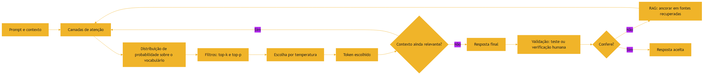

### 3.4 A Fábrica de Afirmações

Uma imagem útil para o dia a dia: imagine uma fábrica que produz afirmações em alta velocidade [4]. A matéria-prima são os dados de treinamento — com todos os seus erros e lacunas [4]. O processo é a predição do próximo token — que não distingue fato de ficção [1]. E a saída é um fluxo constante de sentenças fluentes [4]. A fábrica tem um único controle de qualidade confiável do lado de fora: a verificação — humana, RAG ou teste determinístico [20]. O engenheiro não tenta desligar a fábrica (impossível — ela é o modelo); ele instala o controle de qualidade na saída [20]. Essa imagem explica por que a mitigação é sempre arquitetural: você não corrige a alucinação no prompt, você a filtra no processo [4].

### 3.3 O Agente entre a Atenção e a Alucinação

Um agente de coding vive exatamente nesse ciclo: usa atenção para localizar o arquivo certo, amostra para escolher a próxima ação e — às vezes — alucina ao "lembrar" de uma API que não existe [1]. É por isso que os harnesses de agentes executam o código e rodam testes: a validação determinística é o antídoto para a fluência sem fundamento [20]. E os melhores agentes de 2026 são avaliados, em grande parte, por quão bem seus harnesses controlam exatamente esse risco [17]. Quando você vê um agente inventar uma função inexistente, não é maldade — é a mesma mecânica de predição do próximo token operando sem âncora [4]. O arco histórico do campo mostra o mesmo padrão: cada geração de ferramenta precisou aprender a ancorar o modelo em fontes verificáveis [6].

### 3.5 O Controle de Qualidade na Linha de Produção

A analogia da fábrica de afirmações merece a sua extensão: o controle de qualidade [4]. Imagine uma linha de produção de peças — o modelo produz afirmações como a linha produz peças [4]. O controle de qualidade não inspeciona cada peça por intuição — tem instrumentos, critérios e amostragem [4]. Na linha da fábrica, o critério é a tolerância dimensional; na linha do modelo, é a verificabilidade [4]. Peças fora de tolerância são descartadas; afirmações sem fonte são rejeitadas [4].

A lição da analogia é a separação de responsabilidades [20]. A linha de produção não fica mais lenta porque o controle de qualidade existe — ela fica mais confiável [20]. O modelo não precisa "alucinar menos" para a produção funcionar — precisa ser filtrado na saída [20]. É essa separação — geração fluente, filtro rigoroso — que permite à indústria usar modelos imperfeitos em produção com confiança [20]. O profissional não espera um modelo perfeito; constrói um processo que tolera a imperfeição [4].

### 3.6 O Juiz que Confere a Testemunha

A analogia de fechamento: o juiz que confere a testemunha [4]. O modelo é uma testemunha loquaz — fala com fluência, convicção e detalhes vívidos [4]. O problema: testemunhas loquazes também são as que mais confabulam [4]. O juiz experiente não pergunta apenas "o que aconteceu?" — pergunta "como você sabe?" [4]. E cruza a resposta com evidências: registros, documentos, outras testemunhas [4].

No sistema, a evidência é o contexto; o cruzamento é o RAG; e a sentença é a decisão do harness [4]. O juiz (o profissional) não pode evitar que a testemunha (o modelo) confabule — mas pode exigir que toda afirmação seja sustentada por evidência antes de virar decisão [20]. Essa separação — o testemunho é livre, a sentença é verificada — é a arquitetura de confiança da era agêntica [4]. E é a mesma separação que o painel de confiança da seção 5.9 transforma em número [4].

## 4. Técnica

### 4.1 Controlando a Amostragem na Prática

Vamos tornar o conceito de amostragem concreto. O código abaixo simula a escolha do próximo token com e sem temperatura — o mesmo princípio que as APIs de modelos expõem [3]:

```python
import random


def amostrar_token(probabilidades, temperatura=1.0, top_k=None, top_p=None):
    """Escolhe um token a partir de uma distribuição com controle de criatividade."""
    itens = sorted(probabilidades.items(), key=lambda x: -x[1])
    if top_k:
        itens = itens[:top_k]
    if top_p is not None:
        acumulado = 0.0
        filtrados = []
        for token, prob in itens:
            acumulado += prob
            filtrados.append((token, prob))
            if acumulado >= top_p:
                break
        itens = filtrados
    if temperatura == 0:
        return itens[0][0]
    # Ajusta as probabilidades pela temperatura (softmax com escala)
    pesos = [p ** (1.0 / temperatura) for _, p in itens]
    total = sum(pesos)
    r = random.random() * total
    acumulado = 0.0
    for (token, _), peso in zip(itens, pesos):
        acumulado += peso
        if r <= acumulado:
            return token
    return itens[-1][0]


if __name__ == "__main__":
    distribuicao = {"escrever": 0.5, "testar": 0.3, "refatorar": 0.15, "deletar": 0.05}
    print("Temperatura 0 (determinístico):", amostrar_token(distribuicao, temperatura=0))
    for _ in range(5):
        print("Temperatura 1.5 (criativo):   ", amostrar_token(distribuicao, temperatura=1.5))
    print("top_k=2 restringe:", amostrar_token(distribuicao, temperatura=1.5, top_k=2))
```

### 4.2 Observando a Alucinação

O experimento mais direto com alucinação é pedir ao modelo fatos verificáveis sem contexto — por exemplo, uma referência bibliográfica que você sabe que existe mas não está na janela [4]. Sem RAG, o modelo pode completar com uma fonte plausível e inexistente. A mitigação prática é a mesma que a indústria adota: ancorar a geração em documentos recuperados e exigir citações [4]. Em um harness de agente, isso se traduz em: o agente só cita o que leu no contexto — e o sistema valida que a citação existe [20]. A documentação de function calling da OpenAI reforça o mesmo princípio do lado das ferramentas: o contrato define exatamente o que o modelo pode chamar [9].

### 4.3 O Padrão de Validação Determinística

A combinação mais robusta de mitigação é a validação determinística: o modelo gera, o teste verifica [20]. Quando um agente propõe código, o harness roda a suíte — a mesma disciplina do Capítulo 4 [11]. Quando um agente afirma um fato, o harness exige a fonte. Essa arquitetura — geração com fluência, validação com rigor — é o coração do AIDD [20].

### 4.5 As Cinco Perguntas da Validação

Antes de confiar em qualquer saída de modelo — sua ou de um agente — o profissional faz cinco perguntas [4]. A primeira: a resposta tem uma fonte? Se não tem, o status é "não verificada" [4]. A segunda: a fonte foi fornecida no contexto, ou o modelo a inventou? A distinção é a mesma entre intrínseca e extrínseca [4]. A terceira: a resposta contradiz o contexto? Se o modelo ignora um fato que você forneceu, algo grave aconteceu na atenção ou na amostragem [1]. A quarta: a resposta é falsificável? Afirmações vagas são mais perigosas que as precisas, porque não podem ser testadas [4]. A quinta: qual é o custo do erro? Se a resposta errada custa caro — um merge, uma compra, uma decisão clínica — a validação é obrigatória [20].

Essas cinco perguntas formam um checklist de bolso que funciona em qualquer ferramenta e qualquer contexto [4]. Elas são a versão operacional da teoria deste capítulo: atenção decide o que importa, amostragem decide a variação, e a validação decide o que sobrevive [2]. Quando os próximos volumes tratarem de evals e harnesses, você verá exatamente essas perguntas formalizadas em código [20].

### 4.4 Medindo a Confiabilidade de um Modelo

Para além dos experimentos qualitativos, a confiabilidade se mede com métricas [1]. A precisão mede quantas respostas geradas estão corretas; a taxa de alucinação mede quantas respostas apresentam informação não verificável; e o desempenho por domínio varia — um modelo pode ser excelente em código e fraco em fatos jurídicos [4]. A indústria usa benchmarks padronizados e avaliação por agentes para medir essas métricas em escala [4]. Na era agêntica, a medição é contínua: o harness avalia cada resposta do agente, acumula estatísticas e detecta degradação ao longo do tempo [2]. Essa é a base da Eval Engineering, que a série aprofunda — e o princípio já está aqui: o que não é medido não pode ser melhorado [1]. Quando um agente propõe código, o harness roda a suíte — a mesma disciplina do Capítulo 4 [11]. Quando um agente afirma um fato, o harness exige a fonte. Essa arquitetura — geração com fluência, validação com rigor — é o coração do AIDD [20]. E é a mesma razão pela qual o arquivo de instruções do agente — AGENTS.md — precisa listar os comandos exatos de teste: o agente não pode decidir como validar por conta própria [12].

### 4.6 O Simulador de Confiança

A combinação de tudo o que o capítulo ensinou pode ser exercitada em um simulador — um script que decide se uma resposta merece confiança com base nas cinco perguntas [4]:

```python
def avaliar_confianca(resposta):
    """Aplica as cinco perguntas da validação e devolve um veredito."""
    verificacoes = []
    verificacoes.append(("Tem fonte?", bool(resposta.get("fonte"))))
    verificacoes.append(("Fonte está no contexto?", resposta.get("fonte_no_contexto", False)))
    verificacoes.append(("Contradiz o contexto?", not resposta.get("contradiz", False)))
    verificacoes.append(("É falsificável?", bool(resposta.get("falsificavel"))))
    custo = resposta.get("custo_do_erro", 0)
    verificacoes.append(("Custo do erro exige validação?", custo >= 5))

    print("=== Veredito de confiança ===")
    for nome, ok in verificacoes:
        print(f"  {'PASS' if ok else 'FAIL'} {nome}")
    reprovou = any(not ok for _, ok in verificacoes)
    if reprovou:
        print("Veredito: NÃO confiar sem validação adicional")
        return False
    print("Veredito: confiança razoável")
    return True


if __name__ == "__main__":
    avaliar_confianca({"fonte": True, "fonte_no_contexto": True,
                       "contradiz": False, "falsificavel": True, "custo_do_erro": 3})
    avaliar_confianca({"fonte": True, "fonte_no_contexto": False,
                       "contradiz": False, "falsificavel": True, "custo_do_erro": 8})
```

O simulador transforma as cinco perguntas em uma política executável — e a política, documentada, é o que os harnesses profissionais aplicam em escala [4]. A mecânica é a mesma para humano e máquina: coletar evidência, aplicar o critério, decidir [20].

### 4.7 O Benchmark Pessoal de Alucinação

O experimento mais informativo que você pode fazer é o benchmark pessoal de alucinação [4]. Monte uma lista de dez afirmações verificáveis sobre o seu domínio — cinco verdadeiras, cinco falsas [4]. Pergunte a um modelo sem contexto e registre quantas ele acerta [4]. Depois, repita com as afirmações ancoradas em um texto-fonte no contexto — e registre a diferença [4].

O resultado tem duas leituras [4]. A primeira: a taxa de acerto sem âncora é o risco-base do modelo no seu domínio [4]. A segunda: a melhora com âncora é o valor da engenharia de contexto [4]. Repita o benchmark ao longo do tempo — trocando as afirmações — e você terá um dado objetivo sobre os modelos que usa, muito mais confiável que impressões [4]. Esse é o germe da Eval Engineering: medir antes de confiar [20].

### 4.8 O Registro de Decisões de Confiança

Para fechar a parte técnica, o instrumento de governança — o registro que documenta cada decisão de confiança [4]:

```python
import json
from datetime import date


def registrar_decisao(fluxo, decisao, razao, evidencias):
    """Registra uma decisão de confiança para auditoria futura."""
    registro = {
        "data": date.today().isoformat(),
        "fluxo": fluxo,
        "decisao": decisao,
        "razao": razao,
        "evidencias": evidencias,
    }
    print(json.dumps(registro, ensure_ascii=False, indent=2))
    return registro


if __name__ == "__main__":
    registrar_decisao(
        fluxo="gerar-relatorio",
        decisao="aumentar autonomia",
        razao="portão rejeitou menos de 5% em 30 dias",
        evidencias=["painel-confianca.json", "log-portao.csv"],
    )
```

O registro transforma decisões em rastro auditável [4]. Aumentar a autonomia de um agente não é uma decisão do momento — é uma decisão documentada, com razão e evidência [4]. Quando algo der errado, o registro diz por que a autonomia foi concedida — e o que mudou desde então [4]. Essa disciplina de registro é a mesma que a governança de harnesses exige na Parte III [10].

## 5. Aplica

### 5.1 Onde Isso Vive no Mundo Real

Toda aplicação de IA em produção enfrenta a tríade atenção-amostragem-alucinação [1]. Chatbots de suporte precisam de temperatura baixa e contexto ancorado para não inventar políticas. A ferramenta de tokenização da OpenAI ajuda a medir o custo dessa âncora em cada conversa [19]. Sistemas de geração de código precisam de validação determinística antes do merge [20]. Sistemas de análise precisam de RAG para citar fontes reais [4]. Em cada caso, a engenharia é a mesma: controlar a amostragem, ancorar o contexto, validar o resultado [2]. O mesmo raciocínio vale para o contexto persistente: o padrão AGENTS.md, adotado por mais de 60 ferramentas, existe para ancorar o comportamento do agente em instruções verificáveis [13].

### 5.2 O Erro Comum do Iniciante

O erro clássico é tratar a saída do modelo como fato: colar uma resposta de um agente sem verificação — especialmente quando a resposta é fluente e confiante [4]. A correção — e aqui está o diferencial que separa o profissional — é assumir que a saída pode estar errada e projetar a validação antes de confiar [2]. Com agentes, o erro se amplifica: um agente que "confia" na própria memória alucina APIs, nomes de arquivos e referências — e o harness que não valida deixa o erro chegar a produção [20]. A confiança dos desenvolvedores na exatidão do código gerado caiu para 29% em 2026 — exatamente porque a fluência sem validação engana [14].

### 5.3 O Padrão Profissional em 2026

O profissional trata a alucinação como um risco de engenharia a ser gerenciado, não como um defeito a ser eliminado [4]. O padrão combina: temperatura controlada por tipo de tarefa (baixa para fatos, alta para criatividade), contexto ancorado via RAG, e validação determinística via testes [20]. É essa combinação que separa as ferramentas sérias das demos [2]. E é essa mesma combinação que você vai aprofundar nos próximos volumes da série, quando estudarmos Eval Engineering e Harness Engineering [10]. O contexto é o novo programa — e o LLM, o novo interpretador — na visão de Software 3.0 que o Karpathy consolida [18]. Por enquanto, a base está pronta: você entende a mecânica e os antídotos [1].

### 5.4 Auditando a Alucinação em Produção

A auditoria de alucinação em produção segue o mesmo ciclo das outras disciplinas: medir, ancorar, validar [4]. O primeiro passo é registrar: cada resposta de um agente em produção deve deixar um rastro — o prompt enviado, o contexto fornecido, a resposta gerada e a fonte citada [2]. O segundo passo é classificar: separar as respostas que citam fontes verificáveis das que afirmam sem fonte — a mesma distinção entre alucinações intrínsecas e extrínsecas da taxonomia de Weng [4]. O terceiro passo é intervir: quando a taxa de respostas sem fonte sobe, o harness reduz o escopo (menos ferramentas, menos contexto solto), aumenta a âncora (mais RAG) e aciona revisão humana [20].

O artefato dessa auditoria é um relatório simples, porém disciplinado: para cada resposta, o status de verificação — verificada, não verificada, contradita — e a evidência usada [4]. Esse relatório é o equivalente, no mundo agêntico, do log de erros que você estudou no Capítulo 2: sem ele, o comportamento errado acontece silenciosamente [2]. Times maduros mantêm esses relatórios como parte da revisão semanal — e é essa prática contínua, não a perfeição, que separa a operação séria da demo [1].

### 5.5 O Padrão de Temperatura por Fase do Fluxo

A configuração de temperatura por fase é uma das práticas mais concretas do AIDD [2]. Em um fluxo típico de agente, as fases são: planejamento, implementação e verificação [2]. No planejamento, uma temperatura moderada permite que o agente explore alternativas de design sem ficar preso à primeira ideia [3]. Na implementação, temperatura baixa — próxima de zero — reduz a variação e mantém o código dentro das convenções [3]. Na verificação, temperatura zero: o agente que executa testes e lê resultados não precisa de criatividade, precisa de fidelidade [2].

A mesma lógica vale para o que você pede ao modelo [3]. Quando a tarefa admite múltiplas respostas válidas (gerar exemplos, sugerir nomes, variar texto), a temperatura alta é uma ferramenta de exploração [3]. Quando a tarefa tem uma resposta certa (extrair um dado, traduzir um termo, validar um fato), a temperatura baixa é uma ferramenta de precisão [3]. Documentar essa configuração nos arquivos de instrução — "implementação com temperatura 0, planejamento com 0.7" — é o que transforma uma preferência pessoal em uma política de engenharia auditável [12].

### 5.6 Integrando os Três Antídotos na Prática

O padrão profissional integra os três antídotos — controle de amostragem, ancoragem de contexto e validação determinística — em um único fluxo [20]. Um exemplo concreto: um agente que gera relatórios de segurança. O contexto entra ancorado por RAG, com os documentos oficiais recuperados [4]. A temperatura fica baixa, para que o relatório não invente estatísticas [3]. E antes da publicação, o harness valida cada número contra a fonte — o teste determinístico do Capítulo 4 aplicado a fatos [20]. Se qualquer âncora falha, o relatório não sai [20].

É essa integração — não nenhum antídoto isolado — que reduz a alucinação a um risco gerenciável [4]. E é exatamente essa arquitetura de três camadas que os próximos volumes da série formalizam: a engenharia de contexto (Parte II) constrói a âncora, e a engenharia de harness e evals (Partes III e IV) constrói a validação [10]. O que você tem neste capítulo é o princípio físico — a mecânica do problema e a direção dos antídotos [1].

### 5.7 O Portão de Verificação para Agentes

O padrão profissional aplica as cinco perguntas da seção 4.5 de forma automatizada, no harness [20]. Cada resposta do agente passa por um portão de verificação antes de ser aceita [20]. Afirmações de fato: exigem fonte presente no contexto — e o harness confere se a fonte existe [4]. Código: exige testes — o harness roda a suíte antes de aceitar [11]. Números: exigem a origem calculável — o harness recalcula ou rejeita [4]. Decisões de alto custo: exigem confirmação humana [2].

O portão não elimina a alucinação — elimina o seu trânsito [20]. O modelo pode inventar, mas a invenção não chega a lugar nenhum sem passar pelo portão [20]. Essa é a diferença estrutural entre uma demo — onde a saída do modelo é o resultado — e a produção — onde a saída do modelo é apenas uma proposta [20]. Quando a série tratar de harnesses e evals, o portão da verificação será a peça central [10]. Aqui fica o princípio físico: a fluência gera, o portão julga [20].

### 5.8 O Custo de Ignorar a Mecânica

Fechar a parte aplicada com o custo de ignorar o que este capítulo ensinou [4]. Ignorar a amostragem: o mesmo prompt dá respostas diferentes, o teste falha sem motivo e a equipe perde horas perseguindo um bug que não existe [3]. Ignorar a atenção: o modelo "esquece" uma instrução crítica no meio do contexto, e a falha aparece em produção [7]. Ignorar a alucinação: o relatório cita uma fonte que não existe, a decisão é tomada sobre dado falso e o custo é o do erro multiplicado pela escala da automação [4].

Cada custo tem o mesmo antídoto — o que o capítulo inteiro construiu: controlar a amostragem por tarefa, curar o contexto, validar determinísticamente [20]. O profissional que entende a mecânica não elimina os riscos — ele os administra com instrumentos [2]. E é exatamente essa administração que os próximos volumes elevam a disciplina: Context Engineering constrói a âncora, Harness Engineering constrói o portão e Eval Engineering mede o resultado [10].

### 5.9 O Painel de Confiança do Time

A aplicação de governança mais concreta deste capítulo é o painel de confiança — o artefato que o time consulta para decidir quando confiar no modelo [4]. O painel registra, por fluxo agêntico: a taxa de respostas aceitas sem correção, a taxa de respostas rejeitadas pelo portão, a taxa de alucinação detectada e o custo médio por correção [4]. Quatro números contam a história de confiança do fluxo [4].

O painel transforma a confiança de sentimento em métrica [20]. "Sinto que o agente está melhor" vira "a taxa de rejeição caiu de 30% para 12% em dois meses" [20]. E a métrica orienta a decisão: aumentar a autonomia quando o portão rejeita pouco; reduzir quando rejeita muito [20]. O mesmo ciclo do Capítulo 4 — medir, agir, revisar — aplicado à confiança no modelo [20]. Quando a série tratar de Eval Engineering, o painel de confiança será formalizado em evals [10].

### 5.10 O Limite da Autonomia Responsável

O último tema do capítulo aplicado é o limite da autonomia [4]. Um agente pode operar com autonomia plena quando a validação é completa e barata [20]. Autonomia parcial — com checkpoints humanos — quando a validação é cara ou imperfeita [4]. E nenhuma autonomia quando o erro é irreversível ou a validação impossível [4]. A escala de autonomia é uma decisão de arquitetura, não de coragem [20].

O profissional não pergunta "o agente pode ser autônomo?" — pergunta "o portão consegue julgar o que ele faz?" [20]. Se o portão julga bem, a autonomia é segura; se não, o humano fica no loop [20]. Essa é a ponte direta entre a mecânica deste capítulo — atenção, amostragem, alucinação — e a governança dos harnesses da Parte III [10]. A autonomia responsável não é um valor — é uma engenharia [4].

### 5.11 O Glossário do Capítulo

O capítulo termina com o vocabulário operacional [1]. Atenção: o mecanismo que decide o que importa [1]. Query, Key, Value: os vetores que o mecanismo usa [1]. Temperatura: o controle de variação da amostragem [3]. Top-k, top-p: os filtros que podam a cauda de tokens [3]. Alucinação: a fluência sem âncora [4]. RAG: a ancoragem em documentos recuperados [4]. Validação determinística: o teste que o modelo não pode enganar [20]. Portão: o ponto onde a saída é julgada [20].

Esse glossário é a língua da confiança [1]. Quando os volumes seguintes falarem de evals, harnesses e verificação adversarial, você já conversa na mesma língua [20]. O vocabulário não é decoração — é o instrumento de precisão de quem decide o que merece confiança [4].

### 5.12 O Custo de Confiar sem Verificar

Fechar com o custo de confiar sem verificar — a lição mais cara do capítulo [4]. Confiar na fluência sem âncora: o relatório cita fonte inexistente e a decisão errada é tomada [4]. Confiar na saída sem portão: o código quebrado chega à produção e a regressão é descoberta pelo usuário [20]. Confiar no modelo sem medir: a degradação avança silenciosamente e ninguém percebe [20]. Cada confiança sem verificação tem preço — e o preço cresce com a escala da automação [4].

O profissional não confia menos — verifica mais [20]. A confiança verificada é o ativo mais valioso da era agêntica [2]. Quem verifica pode escalar agentes com segurança; quem confia, escala o risco [4]. A mecânica deste capítulo — atenção, amostragem, alucinação — existe para informar a verificação: saber onde o modelo falha é saber onde verificar [20]. E é essa verificação informada que a Parte IV da série transforma em Eval Engineering [10].

## 6. Conclusão

Neste capítulo, você entrou na mecânica do pensamento dos modelos: a atenção, que decide o que importa com queries, keys e values [1]; a amostragem, que produz variação através de temperatura, top-k e top-p [3]; e a alucinação, que inventa com fluência quando falta âncora [4]. Você aprendeu que a mitigação é arquitetural — RAG, contexto curado e validação determinística — e que a validação é o antídoto definitivo para a fluência sem fundamento [20].

Resumindo em três pontos: primeiro, a atenção decide o que importa — e seu custo quadrático explica o preço do contexto [1][7]; segundo, a amostragem produz variação — e a temperatura é uma decisão de engenharia por tarefa [3]; terceiro, a alucinação é fluência sem âncora — e o antídoto é arquitetural: RAG, contexto e validação [4][20]. Com esses três pontos, você entende os limites da máquina — e sabe onde o humano é insubstituível [2].

### O Desafio Deste Capítulo

O desafio em três níveis. Nível um: execute o simulador de amostragem do capítulo com temperaturas 0, 0.5, 1.0 e 1.5 e observe a variação das escolhas [3]. Nível dois: repita o experimento de alucinação com três modelos diferentes e compare a taxa de fontes inventadas [4]. Nível três: projete a validação determinística de um agente de geração de código — quais testes o harness roda antes de aceitar uma mudança [20]. Os três níveis exercitam amostragem, alucinação e validação [2].

Com o Capítulo 7, você agora domina o par completo: o que o modelo vê e como ele pensa. No próximo capítulo, vamos subir da máquina para o campo: o vocabulário do mundo agêntico — modelo, tool, tool calling e agente — conectando toda a mecânica que você estudou ao ecossistema de agentes autônomos [2].

## 7. Referências Bibliográficas

[1] WENG, Lilian. Extrinsic Hallucinations in LLMs. Disponível em: https://lilianweng.github.io/posts/2024-07-07-hallucination/. Acesso em: 5 ago. 2026.

[2] SITEPOINT. Vibe Coding 2026: The Complete Guide to AI-First Development. Disponível em: https://www.sitepoint.com/vibe-coding-2026-complete-guide/. Acesso em: 5 ago. 2026.

[3] PROMPTING GUIDE. Function Calling in AI Agents. Disponível em: https://www.promptingguide.ai/agents/function-calling. Acesso em: 5 ago. 2026.

[4] WENG, Lilian. Extrinsic Hallucinations in LLMs. Disponível em: https://lilianweng.github.io/posts/2024-07-07-hallucination/. Acesso em: 5 ago. 2026.

[5] GEKHMAN, Zorik; et al. Does Fine-Tuning LLMs on New Knowledge Encourage Hallucinations?. 2024. Disponível em: https://arxiv.org/abs/2405.05904. Acesso em: 5 ago. 2026.

[6] CODERABBIT. From Copilot to agents: The history of AI coding. Disponível em: https://www.coderabbit.ai/blog/a-very-brief-history-of-ai-coding-from-copilot-to-next-gen-agents. Acesso em: 5 ago. 2026.

[7] GOOGLE AI DEVELOPERS. Long Context Guide (Gemini API). Disponível em: https://ai.google.dev/gemini-api/docs/long-context. Acesso em: 5 ago. 2026.

[8] LATENT SPACE. How to train a Million Context LLM — with Mark Huang of Gradient.ai. Disponível em: https://www.latent.space/p/gradient. Acesso em: 5 ago. 2026.

[9] OPENAI. Function Calling Guide. Disponível em: https://developers.openai.com/api/docs/guides/function-calling. Acesso em: 5 ago. 2026.

[10] ANTHROPIC. Effective Context Engineering for AI Agents. Disponível em: https://www.anthropic.com/engineering/effective-context-engineering-for-ai-agents. Acesso em: 5 ago. 2026.

[11] FOWLER, Martin. Continuous Integration. Disponível em: https://martinfowler.com/articles/continuousIntegration.html. Acesso em: 5 ago. 2026.

[12] TIAN PAN. CLAUDE.md and AGENTS.md: The Configuration Layer That Makes AI Coding Agents Actually Follow Your Rules. Disponível em: https://tianpan.co/blog/2026-02-25-claude-md-agents-md-ai-coding-agent-instruction-files. Acesso em: 5 ago. 2026.

[13] OPENAI / AGENTS.MD FOUNDATION. Open Standards for Agentic Configuration (AGENTS.md). Disponível em: https://agents.md/. Acesso em: 5 ago. 2026.

[14] KEYHOLE SOFTWARE. Vibe Coding Trends 2026: Adoption, Productivity, and Code Quality Data. Disponível em: https://keyholesoftware.com/vibe-coding-trends-2026/. Acesso em: 5 ago. 2026.

[15] WENG, Lilian. LLM-Powered Autonomous Agents. Disponível em: https://lilianweng.github.io/posts/2023-06-23-agent/. Acesso em: 5 ago. 2026.

[16] LULLA, Jai Lal; et al. On the Impact of AGENTS.md Files on the Efficiency of AI Coding Agents. Disponível em: https://arxiv.org/html/2601.20404v1. Acesso em: 5 ago. 2026.

[17] MIGHTYBOT. Best AI Coding Agents in 2026, Ranked. Disponível em: https://mightybot.ai/blog/coding-ai-agents-for-accelerating-engineering-workflows/. Acesso em: 5 ago. 2026.

[18] KARPATHY, Andrej. Sequoia Ascent 2026 Summary (Software 3.0 & Agentic Engineering). Disponível em: https://karpathy.bearblog.dev/sequoia-ascent-2026/. Acesso em: 5 ago. 2026.

[19] OPENAI. Tokenizer (ferramenta interativa). Disponível em: https://platform.openai.com/tokenizer. Acesso em: 5 ago. 2026.

[20] TESTING LIBRARY. Guiding Principles. Disponível em: https://testing-library.com/docs/guiding-principles/. Acesso em: 5 ago. 2026.

# PARTE V — O Mundo Agêntico

# Capítulo 9: Vocabulário do Campo: Modelo, Tool, Tool Calling e Agente

## 1. Introdução

Nos dois capítulos anteriores, você dominou a mecânica dos modelos: o que eles veem (tokens e janela) e como pensam (atenção, amostragem, alucinação). Agora vamos dar nome às coisas. O mundo agêntico tem um vocabulário próprio — modelo, tool, tool calling, agente, agent loop — e dominar esse vocabulário é mais do que decoro: é a ferramenta que permite pensar com precisão sobre sistemas complexos [1]. Como no Capítulo 6, onde o HTTP deu nome à conversa entre sistemas, este capítulo dá nome à conversa entre humanos, modelos e ferramentas [2].

Este capítulo tem três objetivos. Primeiro, delimitar com precisão as três camadas fundamentais — modelo, ferramenta e agente — e o que cada uma faz [1]. Segundo, entender o mecanismo de tool calling: como o modelo decide chamar uma ferramenta, como a chamada é estruturada e como a resposta retorna [3]. Terceiro, compreender o agent loop — o ciclo ação, observação, decisão — que transforma um modelo isolado em um agente autônomo [4]. Ao final, você falará a língua do campo com precisão — e estará pronto para o Capítulo 10, que mapeia a história de autocomplete a agentes autônomos [2].

## 2. Explica

### 2.1 Modelo: o Motor Cognitivo

O modelo — LLM, Large Language Model — é o motor cognitivo: processa linguagem, raciocina e gera tokens [1]. Por si só, um modelo puro é estático: limitado ao conhecimento do treinamento e incapaz de agir no mundo [1]. É importante separar o modelo do produto: o ChatGPT, o Claude e o Gemini são produtos que combinam modelos com camadas de orquestração — mas o modelo em si é apenas o motor [2]. Essa distinção é a primeira peça do vocabulário: quando alguém diz "o modelo alucinou", está falando do motor; quando diz "o agente abriu um PR", está falando de um sistema maior [1].

### 2.2 Tool: a Interface com o Mundo

Uma ferramenta — tool — é uma interface entre o modelo e o mundo externo [3]. Pode ser uma API, uma consulta a banco, um interpretador de código, um script ou um servidor MCP [5]. A ferramenta resolve a limitação central do modelo puro: a incapacidade de acessar dados novos ou executar ações [3]. Cada ferramenta expõe um contrato — nome, descrição e parâmetros em JSON Schema — que o modelo aprende a usar [7]. O padrão AGENTS.md, adotado por mais de 60 ferramentas, organiza a camada de instruções que define como e quando essas tools devem ser usadas [14]. A qualidade das ferramentas define a qualidade do agente: ferramentas bem descritas produzem chamadas precisas; ferramentas vagas produzem erros [3].

### 2.3 Tool Calling: o Mecanismo da Chamada

Tool calling — ou function calling — é o mecanismo pelo qual o modelo invoca uma ferramenta [3]. O fluxo é estruturado: o desenvolvedor injeta as definições de ferramentas no contexto; o modelo analisa o pedido do usuário e decide se precisa de dados externos; se precisar, interrompe a geração de texto e retorna uma chamada estruturada com o nome da função e os argumentos em JSON; a aplicação executa a função; e o resultado é devolvido ao modelo como observação, rotulado com um ID de chamada [3]. O modelo então lê a observação e sintetiza a resposta final — ou decide invocar outra ferramenta [7]. Esse ciclo de quatro passos — definir, decidir, executar, observar — é o coração do desenvolvimento dirigido por IA [2], e é o mesmo arco que o CodeRabbit documenta na evolução do coding assistido: cada geração adicionou autonomia a esse ciclo [6].

### 2.4 Agente: o Sistema Autônomo

Um agente é um sistema autônomo construído sobre um LLM que combina raciocínio, planejamento, memória e tool calling em um loop dinâmico [4]. O framework clássico, formalizado por Lilian Weng, define o agente como a combinação de LLM, memória, planejamento e ferramentas [4]. A diferença entre um modelo e um agente é a autonomia: o modelo responde; o agente age — decide, executa, observa e repete até concluir a tarefa [1]. No mundo do desenvolvimento de software, os agentes de coding — Claude Code, Codex, Cursor — navegam repositórios, rodam testes e abrem pull requests dentro desse loop [17]. A diferença entre o autocomplete que sugere linhas e o agente que conclui tarefas é exatamente essa camada de autonomia que o ITECS analisa [16].

### 2.6 Memória: o Quarto Componente do Agente

Dos quatro componentes do agente — LLM, memória, planejamento e ferramentas — a memória é o menos intuitivo [4]. O LLM tem a memória de trabalho: a janela de contexto, que você estudou no Capítulo 7 — finita e volátil [4]. A memória de longo prazo é externa: arquivos, bancos, notas — o que sobrevive entre sessões [1]. Os harnesses modernos organizam a memória externa em arquivos estruturados — como os diretórios de notas e os registros persistentes — que o agente lê e atualiza a cada execução [10]. A memória é o que transforma um agente estateless em um assistente que acumula aprendizado: sem ela, cada sessão recomeça do zero; com ela, o agente evolui [1]. Essa distinção — memória de trabalho versus memória persistente — é central para os volumes de Instruction e Memory Engineering da série [10].

### 2.7 Planejamento: A Camada de Estratégia

O planejamento é o componente que decide a sequência de ações — a decomposição algorítmica do Capítulo 1 aplicada a agentes [4]. O agente planeja de forma reativa (decide o próximo passo olhando o estado atual) ou deliberativa (constrói um plano completo antes de agir) [4]. Os agentes modernos combinam os dois: planejam a estrutura geral, executam passo a passo e replanejiam quando a observação contradiz a expectativa [4]. O planejamento é onde a qualidade do raciocínio do modelo aparece — e onde a alucinação pode corromper o plano: um plano baseado em um fato inventado produz uma execução errada [14]. Por isso a validação de cada etapa — que você estudou no Capítulo 8 — é parte do planejamento robusto [20]. O framework clássico, formalizado por Lilian Weng, define o agente como a combinação de LLM, memória, planejamento e ferramentas [4]. A diferença entre um modelo e um agente é a autonomia: o modelo responde; o agente age — decide, executa, observa e repete até concluir a tarefa [1]. No mundo do desenvolvimento de software, os agentes de coding — Claude Code, Codex, Cursor — navegam repositórios, rodam testes e abrem pull requests dentro desse loop [17]. A diferença entre o autocomplete que sugere linhas e o agente que conclui tarefas é exatamente essa camada de autonomia que o ITECS analisa [16].

### 2.5 O Agent Loop: Ação, Observação, Decisão

O agent loop é o ciclo que dá vida ao agente [4]: o agente decide a próxima ação (baseada no estado atual e no objetivo), executa a ação (frequentemente chamando uma ferramenta), observa o resultado (a resposta da ferramenta) e decide o próximo passo [4]. O loop repete até o objetivo ser alcançado ou o limite de iterações ser atingido [1]. Cada iteração consome tokens da janela — por isso a eficiência do loop é uma decisão de engenharia, não um detalhe [10]. O custo de cada iteração também cresce com o histórico acumulado: quanto mais longo o loop, maior o risco de context rot degradar a atenção do modelo [15]. O loop também explica os erros dos agentes: uma observação mal interpretada gera uma decisão errada — e o harness precisa capturar isso [20].

## 3. Ilustra

### 3.1 A Analogia do Escritório de Atendimento

Imagine um escritório de atendimento completo. O modelo é o atendente inteligente: raciocina rápido, fala bem, mas não pode sair da mesa (não acessa o mundo). As ferramentas são os departamentos — arquivo, telefone, computador — cada um com um formulário de pedido (o contrato da tool). O tool calling é o formulário preenchido: o atendente decide que precisa do arquivo, preenche o formulário com o número do processo e o departamento devolve a pasta (a observação). O agente é o sistema completo: atendente + departamentos + o protocolo de trabalho que decide quando pedir o quê [1]. Sem o formulário, o atendente não consegue pedir; sem os departamentos, ele não faz nada além de falar [3].

### 3.2 O Diagrama do Tool Calling e do Agent Loop

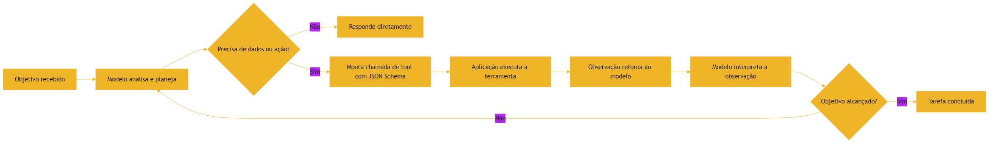

### 3.3 As Camadas na Prática

O mesmo diagrama descreve um agente de coding: ele recebe a tarefa "corrija o bug do login", analisa, decide que precisa ler o código (chama a tool de leitura), observa o resultado, decide chamar a tool de escrita, roda os testes (outra tool) e repete até os testes passarem [17]. Cada camada tem responsabilidade clara: o modelo decide, a tool executa, o agente orquestra [1]. E quando algo falha, o diagnóstico identifica a camada: o modelo decidiu errado? A tool falhou? A observação foi mal interpretada? [20]. Estudos empíricos mostram que agentes bem configurados — com instruções claras sobre o uso de tools — reduzem o tempo de execução em quase 29% [13].

### 3.4 O Diagrama do Ecossistema Agêntico

O vocabulário ganha um mapa quando desenhado como ecossistema [4]:

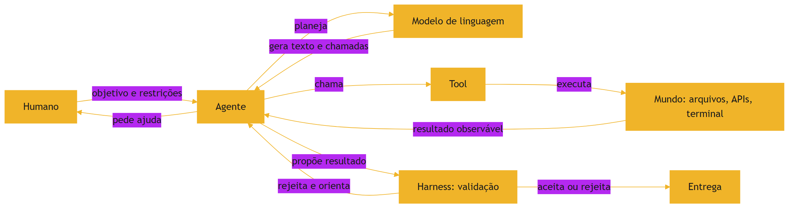

O diagrama mostra as quatro peças do framework — modelo, memória, planejamento e ferramentas — operando dentro do ciclo que o harness governa [6]. Cada seta do diagrama é um contrato que o vocabulário nomeia [4]. Quando algo falha no ecossistema, o diagnóstico começa identificando qual seta quebrou — e o vocabulário é o que torna essa identificação possível [4].

### 3.4 O Diagrama do Loop do Agente

O loop — o coração da arquitetura agêntica — merece o seu diagrama completo [6]:

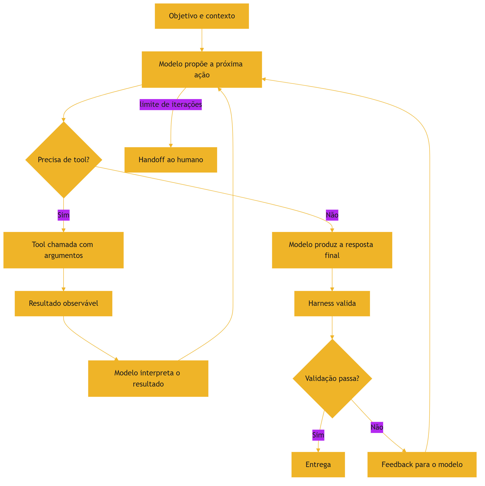

O diagrama mostra as quatro peças do framework de Lilian Weng em ação — o modelo raciocina, a memória carrega o contexto, o planejamento decide e as ferramentas executam [6]. E mostra a quinta peça que o capítulo acrescentou: o harness que valida e o humano que recebe o handoff [4]. Quando os volumes de Harness Engineering detalharem o loop, este é o esqueleto que eles constroem [10].

## 4. Técnica

### 4.1 Definindo uma Tool com Contrato

Vamos implementar o ciclo completo de tool calling na prática. Primeiro, definimos a tool com seu contrato — o JSON Schema que descreve nome, descrição e parâmetros [3]:

```python
import json

CONTRATO_DADOS = {
    "nome": "buscar_transacoes",
    "descricao": "Busca transações financeiras no banco de dados por categoria.",
    "parametros": {
        "type": "object",
        "properties": {
            "categoria": {
                "type": "string",
                "enum": ["alimentacao", "renda", "saude"],
                "description": "Categoria das transações a buscar"
            },
            "limite": {
                "type": "integer",
                "minimum": 1,
                "maximum": 100,
                "default": 10
            }
        },
        "required": ["categoria"]
    }
}


def buscar_transacoes(categoria, limite=10):
    """A implementação real da ferramenta."""
    banco = [
        {"id": 1, "categoria": "alimentacao", "valor": -150.00},
        {"id": 2, "categoria": "renda", "valor": 4500.00},
        {"id": 3, "categoria": "saude", "valor": -89.90},
    ]
    resultado = [t for t in banco if t["categoria"] == categoria][:limite]
    return {"transacoes": resultado}


def executar_chamada_de_tool(chamada):
    """Simula a execução: valida o contrato e despacha para a implementação."""
    if chamada["nome"] == "buscar_transacoes":
        return buscar_transacoes(**chamada["argumentos"])
    raise ValueError(f"Tool desconhecida: {chamada['nome']}")
```

### 4.2 O Ciclo Completo de uma Chamada

O ciclo de tool calling completo — o modelo monta a chamada, a aplicação executa e devolve a observação — pode ser simulado e testado:

```python
def processar_pedido_do_agente(pedido):
    """Simula o ciclo: decide chamar a tool, executa e retorna a observação."""
    # Passo 1: o modelo decide que precisa da tool e monta a chamada
    chamada = {
        "nome": "buscar_transacoes",
        "argumentos": {"categoria": "saude", "limite": 5},
    }
    print(f"[MODELO] Decidiu chamar: {chamada['nome']}")
    print(f"[MODELO] Argumentos: {json.dumps(chamada['argumentos'], ensure_ascii=False)}")

    # Passo 2: a aplicação executa a ferramenta real
    observacao = executar_chamada_de_tool(chamada)
    print(f"[APLICACAO] Observacao: {json.dumps(observacao, ensure_ascii=False)}")

    # Passo 3: a observação volta ao modelo, que responde ao usuário
    resposta = (f"Encontrei {len(observacao['transacoes'])} transações de saúde. "
                f"Total: R$ {sum(t['valor'] for t in observacao['transacoes']):.2f}")
    print(f"[MODELO] Resposta final: {resposta}")
    return resposta


if __name__ == "__main__":
    processar_pedido_do_agente("quais são minhas transações de saúde?")
```

### 4.3 Validando o Contrato

A validação é a parte que separa um harness sério de uma demo [20]. Antes de executar a chamada, valide os argumentos contra o contrato: categoria dentro do enum, limite dentro do intervalo [3]. No código acima, o dicionário `CONTRATO_DADOS` é a especificação — e um harness real a valida programaticamente antes de despachar [20]. Esse mesmo padrão é o que os servidores MCP usam para expor ferramentas aos agentes de forma padronizada [5].

### 4.4 Implementando um Mini-Agent Loop

Para consolidar o conceito do agent loop, vamos implementar uma versão mínima — o ciclo decisão, execução, observação, repetição [4]:

```python
class MiniAgente:
    """Agente mínimo: decide, executa tools e itera até concluir."""
    def __init__(self, objetivo):
        self.objetivo = objetivo
        self.passos = 0

    def decidir(self, observacao):
        """Decisão simulada: retorna a próxima tool a chamar."""
        if observacao == "" :
            return "buscar_transacoes", {"categoria": "saude"}
        if "transacoes" in observacao:
            return "concluir", {}
        return "reportar_erro", {}

    def executar(self, tool, argumentos):
        """Executa a tool e devolve a observação."""
        if tool == "buscar_transacoes":
            return executar_chamada_de_tool({
                "nome": tool, "argumentos": argumentos
            })
        if tool == "concluir":
            return {"status": "objetivo_alcancado"}
        return {"status": "erro"}

    def rodar(self, max_passos=5):
        observacao = ""
        while self.passos < max_passos:
            self.passos += 1
            tool, args = self.decidir(observacao)
            print(f"[{self.passos}] {tool} {args}")
            observacao = self.executar(tool, args)
            if observacao.get("status") == "objetivo_alcancado":
                print("Objetivo concluído.")
                return True
        print("Limite de passos atingido.")
        return False


if __name__ == "__main__":
    MiniAgente("listar despesas de saúde").rodar()
```

O `MiniAgente` captura a anatomia do loop: a decisão escolhe a próxima ação, a execução produz a observação e a observação alimenta a próxima decisão [4]. Os harnesses reais substituem a decisão simulada pelo LLM e a execução pelas tools reais — mas o ciclo é este [4]. Antes de executar a chamada, valide os argumentos contra o contrato: categoria dentro do enum, limite dentro do intervalo [3]. No código acima, o dicionário `CONTRATO_DADOS` é a especificação — e um harness real a valida programaticamente antes de despachar [20]. Esse mesmo padrão é o que os servidores MCP usam para expor ferramentas aos agentes de forma padronizada [5].

### 4.5 O Simulador de Agente

Para consolidar o vocabulário, o exercício final de código é um simulador do loop de agente — modelo, tool e validação operando juntos [4]:

```python
class Tool:
    def __init__(self, nome, fn):
        self.nome = nome
        self.fn = fn

    def chamar(self, *args):
        print(f"  tool.chamar({self.nome}, {args})")
        return self.fn(*args)


def loop_de_agente(objetivo, tools, passos_maximos=3):
    """Simula o loop: observar, decidir, chamar tool, validar."""
    print(f"Objetivo: {objetivo}")
    for passo in range(1, passos_maximos + 1):
        print(f"\n-- Passo {passo}")
        # Decisão simulada: procura a primeira tool cujo nome está no objetivo
        tool = next((t for t in tools if t.nome in objetivo), None)
        if not tool:
            print("Nenhuma tool aplicável -> pedir ajuda ao humano")
            return "handoff"
        resultado = tool.chamar(*([objetivo] if tool.nome == "buscar" else []))
        if resultado == "ok":
            print("Validação: resultado aceito")
            return "concluido"
        print("Validação: resultado rejeitado, nova iteração")
    print("Limite de passos atingido -> reportar ao humano")
    return "limite"


if __name__ == "__main__":
    buscar = Tool("buscar", lambda q: "ok")
    loop_de_agente("buscar o relatório mensal", [buscar])
    loop_de_agente("apagar o banco de produção", [buscar])
```

O simulador mostra a anatomia que o capítulo descreveu: o agente observa, decide qual tool chamar, executa, valida e repete até o limite [4]. E o segundo caso de teste revela o ponto de governança: quando nenhuma tool cobre a intenção, o loop termina em handoff — o humano — em vez de improvisar [4].

### 4.6 O Contrato de Tool em JSON Schema

O contrato que o modelo usa para chamar uma tool tem um formato padrão — JSON Schema [9]. O exercício abaixo escreve um contrato e valida uma chamada contra ele, sem bibliotecas externas [9]:

```python
import json


def contrato_tool():
    """Define o contrato da tool 'buscar_relatorio'."""
    return {
        "name": "buscar_relatorio",
        "description": "Busca um relatório pelo mês. Mês no formato AAAA-MM.",
        "parameters": {
            "type": "object",
            "properties": {
                "mes": {"type": "string", "pattern": "^\\d{4}-\\d{2}$"}
            },
            "required": ["mes"],
        },
    }


def validar_chamada(contrato, chamada):
    props = contrato["parameters"]["properties"]
    for campo, regra in props.items():
        valor = chamada.get(campo)
        if valor is None:
            if campo in contrato["parameters"]["required"]:
                print(f"FALHA: campo obrigatório ausente: {campo}")
                return False
            continue
        if regra.get("type") == "string" and not isinstance(valor, str):
            print(f"FALHA: {campo} deveria ser string")
            return False
    print("Chamada válida contra o contrato")
    return True


if __name__ == "__main__":
    contrato = contrato_tool()
    print(json.dumps(contrato, ensure_ascii=False, indent=2))
    validar_chamada(contrato, {"mes": "2026-08"})
    validar_chamada(contrato, {"mes": 202608})
```

O contrato é a especificação executável da tool: descreve ao modelo o que chamar, e ao harness o que validar [9]. É essa mesma estrutura que os servidores MCP usam para expor ferramentas aos agentes — a ponte direta deste capítulo para os volumes de MCP Engineering [5].

### 4.7 O Inventário de Contratos de um Projeto

O exercício final de código consolida o capítulo: levantar, do próprio projeto, o inventário de contratos disponíveis aos agentes [4]:

```python
import json
from pathlib import Path


def inventariar_contratos(diretorio):
    """Lista scripts executáveis e documenta um contrato mínimo para cada um."""
    print("=== Inventário de contratos do projeto ===")
    inventario = []
    for caminho in sorted(Path(diretorio).glob("*.py")):
        linhas = caminho.read_text(encoding="utf-8").splitlines()
        docstring = ""
        for l in linhas[1:4]:
            if '"' in l and docstring == "":
                docstring = l.strip().strip('"').strip()
                break
        entrada = {"script": caminho.name,
                   "contrato": docstring or "sem descrição",
                   "tamanho": len(linhas)}
        inventario.append(entrada)
        print(f"  {entrada['script']:<35} {entrada['tamanho']:>5} linhas")
    with open("inventario_contratos.json", "w", encoding="utf-8") as f:
        json.dump(inventario, f, ensure_ascii=False, indent=2)
    print(f"\nInventário salvo: inventario_contratos.json ({len(inventario)} contratos)")


if __name__ == "__main__":
    inventariar_contratos("scripts")
```

O exercício conecta o vocabulário ao seu próprio ambiente [4]: cada script do projeto é uma tool em potencial, e o inventário é o primeiro passo para decidir quais expor a um agente [4]. O mesmo levantamento — com a mesma estrutura — é o que as equipes fazem antes de adotar MCP [5].

## 5. Aplica

### 5.1 Onde Isso Vive no Mundo Real

Todo produto de IA moderno é uma combinação de modelo, tools e orquestração [1]. O ChatGPT com navegação web usa tools de busca. O assistente de código usa tools de leitura e escrita de arquivos. O agente de análise usa tools de consulta a banco [2]. Os Quatro Sinais de Ouro do Google SRE — latência, tráfego, erros e saturação — monitoram essas tools em produção, garantindo que o ciclo continue confiável [11]. A arquitetura do function calling da OpenAI e o Model Context Protocol da Anthropic padronizam exatamente essa camada — e a indústria converge para esses contratos [3][5]. No seu projeto, a mesma arquitetura se aplica: defina as tools, descreva os contratos e deixe o agente decidir quando chamá-las [7]. A configuração persistente que orienta esse comportamento é tema do guia prático do Tian Pan [12]. No seu projeto, a mesma arquitetura se aplica: defina as tools, descreva os contratos e deixe o agente decidir quando chamá-las [7].

### 5.2 O Erro Comum do Iniciante

O erro clássico é confundir as camadas: chamar o produto de "modelo", acreditar que o modelo "sabe" o que as tools fazem ou que o agente "entende" a tarefa como um humano [1]. A correção — e aqui está o diferencial que separa o profissional — é ser preciso: o modelo decide com base no contrato que você escreveu; se o contrato é vago, a chamada erra [3]. Na prática: descreva cada tool com o máximo de clareza, teste as chamadas com casos reais e monitore as observações que voltam [20]. Com agentes, esse erro se amplifica: uma tool mal descrita gera chamadas erradas em cascata — e o agente "confia" na observação errada e segue [2]. A disciplina de especificar o comportamento esperado — no AGENTS.md ou em testes — é o que o estudo da SMU mediu empiricamente [13]. E a base histórica dessa disciplina está no Git: versionar contratos e ferramentas é tão essencial quanto versionar código [9].

### 5.3 O Padrão Profissional em 2026

O profissional trata o vocabulário como ferramenta de design: modela o sistema em camadas explícitas — modelo, tools, agente — e documenta os contratos [2]. Os melhores agentes de 2026 seguem exatamente essa arquitetura: o modelo orquestra, as tools executam e o harness valida [17]. Essa arquitetura exige contexto bem curado — o tema da engenharia de contexto [10] — e custa tokens mensuráveis em cada iteração, que a ferramenta de tokenização da OpenAI ajuda a visualizar [8]. E é essa mesma arquitetura que os próximos volumes da série aprofundam: MCP Engineering padroniza as tools, Harness Engineering automatiza o loop e Eval Engineering valida o conjunto [5][10]. Com a adoção de IA em 92% das equipes em 2026, dominar essas camadas é o que separa quem consome agentes de quem os projeta [19].

### 5.4 Projetando um Agente com o Vocabulário

O teste final de vocabulário é projetar — no papel — um agente para uma tarefa real [2]. Escolha uma tarefa: gerar relatórios semanais, revisar pull requests, responder dúvidas de um produto [2]. Agora defina as quatro peças [4]. O modelo: qual modelo e com que janela de contexto [4]. As tools: quais ferramentas o agente pode chamar — e, mais importante, quais ele não pode [4]. O loop: quantas iterações máximas, o que o agente observa a cada passo, quando ele para e pede ajuda [2]. O harness: quais validações rodam antes de o resultado ser aceito [2].

O exercício revela o valor do vocabulário: cada peça tem um nome e um contrato, e o projeto inteiro vira uma conversa precisa [2]. "O agente alucina a API" é uma frase que só faz sentido com o Capítulo 8; "a tool não expõe o contrato" só com este capítulo; "o harness valida a saída" só com o Capítulo 4 [4]. O vocabulário é o que transforma intuição em engenharia — e é o que permite a um time discutir agentes com a mesma precisão com que discute software [2].

### 5.5 O Vocabulário como Porta de Entrada da Carreira

O vocabulário do Capítulo 9 é também a porta de entrada do mercado [19]. As vagas de 2026 pedem, em linguagem variada, exatamente as peças que você aprendeu: "projetar agentes com tools e function calling", "definir contratos de ferramentas", "governar loops de agente", "avaliar saídas de modelo" [19]. Quem domina os termos lê os anúncios com precisão e consegue avaliar se a vaga é real ou jargão [19]. Quem não domina fica à mercê da retórica — o mesmo risco que você viu no Capítulo 10, com a confiança na exatidão caindo para 29% [19].

A recomendação prática: crie o seu glossário pessoal — uma página com os termos do Capítulo 9 e uma definição escrita por você, com um exemplo [1]. A cada volume da série, adicione os termos novos [2]. Ao final da pilha, você terá um dicionário agêntico próprio — o instrumento de trabalho de quem fala com precisão sobre o campo [1].

### 5.6 O Portão de Ferramentas do Agente

O vocabulário deste capítulo tem uma aplicação direta de governança: o portão de ferramentas [4]. Antes de um agente ganhar acesso a uma tool, o profissional responde cinco perguntas [4]. Qual tarefa esta tool resolve que nenhuma outra resolve? [3] Qual é o pior dano possível se o agente a chamar errado? [4] O contrato dela está documentado para o modelo? [3] O uso dela é auditável — deixa rastro? [4] E o acesso é o mínimo necessário — ou o agente pode fazer mais do que precisa? [4]

O portão de ferramentas é a ponte entre o vocabulário e a segurança [4]. Um agente com uma tool a mais é um risco; com a tool certa e o contrato documentado, é uma capacidade [3]. O function calling, como você viu, expõe exatamente o que o contrato descreve — nada além [9]. E o escopo mínimo, documentado nos arquivos de instrução, é o que a auditoria vai verificar quando algo der errado [14]. Quando a série tratar de Harness Engineering, este portão será a primeira camada de governança [10].

### 5.7 O Vocabulário Como Ferramenta de Diagnóstico

O vocabulário também é ferramenta de diagnóstico — a língua que permite nomear o problema antes de resolvê-lo [1]. Quando um sistema agêntico falha, o profissional pergunta com precisão [4]: o modelo errou a predição (Capítulo 8)? A tool não expôs o contrato certo (Capítulo 9)? O harness não validou a saída (Capítulo 4)? O contexto não trouxe o dado necessário (Capítulo 7)? Cada pergunta aponta para uma camada da pilha — e nomear a camada é meio caminho para a correção [4].

Essa precisão de diagnóstico é o que separa o profissional do improvisador [1]. O improvisador diz "a IA errou"; o profissional diz "a tool devolveu o status que o contrato não previa" [4]. A segunda frase — precisa, camada nomeada — é a que permite corrigir com método [1]. E é exatamente essa língua que os próximos volumes vão refinar: cada disciplina da pilha adiciona o seu vocabulário de diagnóstico [10].

### 5.6 O Catálogo de Ferramentas do Time

A aplicação de governança mais concreta do vocabulário é o catálogo de ferramentas — o inventário que todo time agêntico mantém [4]. O catálogo lista, para cada tool que um agente pode usar: o nome, o contrato (o que a tool espera e devolve), o dono (quem mantém e aprova mudanças), o risco (o que pode dar errado) e o acesso (quais agentes podem chamar) [4].

O catálogo transforma o vocabulário em operação [4]. Sem catálogo, cada agente descobre tools ao seu jeito — contratos informais, acesso aberto, risco invisível [4]. Com catálogo, a auditoria tem o que consultar: o agente usou uma tool fora do escopo? O contrato mudou sem aviso? [4] Quando a série tratar de MCP Engineering, o catálogo vira a ponte: servidores MCP publicam exatamente esse inventário em formato padrão [5]. Aqui fica o princípio: ferramenta sem contrato documentado é um risco sem nome [4].

### 5.7 A Conversa de Diagnóstico com o Agente

A última habilidade do capítulo é prática e cotidiana: a conversa de diagnóstico com o agente [2]. Quando um agente erra, o profissional não pergunta "o que aconteceu?" — pergunta com o vocabulário [4]. "Qual tool você chamou e com quais argumentos?" [4]. "O contrato devolveu o que você esperava?" [4]. "Qual foi a observação que te levou a essa decisão?" [4]. "O que o harness validou antes de você entregar?" [4].

Cada pergunta localiza a falha em uma camada — e a resposta do agente, se o harness registra o loop, é verificável [4]. Essa conversa é o raciocínio de depuração do Capítulo 2 aplicado ao ecossistema agêntico [1]. E é a habilidade que transforma o uso de agentes em engenharia: o profissional não aceita a resposta do agente como oráculo — a trata como hipótese a ser verificada [4].

## 6. Conclusão

Neste capítulo, você dominou o vocabulário do campo: o modelo como motor cognitivo [1]; a tool como interface com o mundo [3]; o tool calling como o mecanismo estruturado da chamada [3]; e o agente como o sistema autônomo que combina tudo no agent loop [4]. Você implementou uma tool com contrato e simulou o ciclo completo de chamada — provando que a arquitetura mais sofisticada do mundo usa exatamente esses blocos [3].

Resumindo em três pontos: primeiro, modelo, tool e agente são camadas distintas — e confundi-las produz erros de diagnóstico [1]; segundo, tool calling é o mecanismo de quatro passos — definir, decidir, executar, observar [3]; terceiro, o agent loop é o ciclo que dá autonomia — e cada iteração consome tokens e pode alucinar [4]. Com esses três pontos, você fala a língua do campo — e o Capítulo 10 vai mostrar de onde ela veio [2].

### O Desafio Deste Capítulo

O desafio em três níveis. Nível um: defina o contrato de uma tool nova — buscar usuários por nome — com JSON Schema completo, e implemente a função [3]. Nível dois: estenda o `MiniAgente` com uma segunda tool e um fluxo de decisão que combine as duas [4]. Nível três: peça a um agente de IA para descrever a diferença entre modelo e agente e avalie se a resposta distingue as camadas com precisão — ou se as confunde [1]. Os três níveis exercitam contratos, loops e vocabulário [2].

Esse vocabulário é a língua franca de toda a série — e você agora a fala com precisão. No próximo capítulo, vamos fechar o Livro 1 com o panorama histórico: como o campo chegou de autocomplete a agentes autônomos em cinco anos — e onde você se encaixa nessa história [2]. A visão de que o contexto é o novo programa — e o LLM, o novo interpretador — é o eixo conceitual que o Karpathy consolidou e que os próximos volumes exploram [18].

## 7. Referências Bibliográficas

[1] KARPATHY, Andrej. Software 3.0: Software in the Age of AI. Disponível em: https://www.latent.space/p/s3. Acesso em: 5 ago. 2026.

[2] SITEPOINT. Vibe Coding 2026: The Complete Guide to AI-First Development. Disponível em: https://www.sitepoint.com/vibe-coding-2026-complete-guide/. Acesso em: 5 ago. 2026.

[3] PROMPTING GUIDE. Function Calling in AI Agents. Disponível em: https://www.promptingguide.ai/agents/function-calling. Acesso em: 5 ago. 2026.

[4] WENG, Lilian. LLM-Powered Autonomous Agents. Disponível em: https://lilianweng.github.io/posts/2023-06-23-agent/. Acesso em: 5 ago. 2026.

[5] ANTHROPIC. Introducing the Model Context Protocol. Disponível em: https://www.anthropic.com/news/model-context-protocol. Acesso em: 5 ago. 2026.

[6] CODERABBIT. From Copilot to agents: The history of AI coding. Disponível em: https://www.coderabbit.ai/blog/a-very-brief-history-of-ai-coding-from-copilot-to-next-gen-agents. Acesso em: 5 ago. 2026.

[7] OPENAI. Function Calling Guide. Disponível em: https://developers.openai.com/api/docs/guides/function-calling. Acesso em: 5 ago. 2026.

[8] OPENAI. Tokenizer (ferramenta interativa). Disponível em: https://platform.openai.com/tokenizer. Acesso em: 5 ago. 2026.

[9] CHACON, Scott; STRAUB, Ben. Pro Git. 2. ed. Apress/Git SCM, 2014. Disponível em: https://git-scm.com/book/en/v2. Acesso em: 5 ago. 2026.

[10] ANTHROPIC. Effective Context Engineering for AI Agents. Disponível em: https://www.anthropic.com/engineering/effective-context-engineering-for-ai-agents. Acesso em: 5 ago. 2026.

[11] EWASCHUK, Rob; BEYER, Betsy (Ed.). Site Reliability Engineering: Monitoring Distributed Systems. Google SRE Book. Disponível em: https://sre.google/sre-book/monitoring-distributed-systems/. Acesso em: 5 ago. 2026.

[12] TIAN PAN. CLAUDE.md and AGENTS.md: The Configuration Layer That Makes AI Coding Agents Actually Follow Your Rules. Disponível em: https://tianpan.co/blog/2026-02-25-claude-md-agents-md-ai-coding-agent-instruction-files. Acesso em: 5 ago. 2026.

[13] LULLA, Jai Lal; et al. On the Impact of AGENTS.md Files on the Efficiency of AI Coding Agents. Disponível em: https://arxiv.org/html/2601.20404v1. Acesso em: 5 ago. 2026.

[14] OPENAI / AGENTS.MD FOUNDATION. Open Standards for Agentic Configuration (AGENTS.md). Disponível em: https://agents.md/. Acesso em: 5 ago. 2026.

[15] CHROMA. Context Rot: How Increasing Input Tokens Impacts LLM Performance. Disponível em: https://www.trychroma.com/research/context-rot. Acesso em: 5 ago. 2026.

[16] ITECS. Claude Code vs. GitHub Copilot: Agentic vs. Autocomplete. Disponível em: https://itecsonline.com/post/claude-code-vs-github-copilot-2026-agentic-vs-autocomplete-enterprise-guide. Acesso em: 5 ago. 2026.

[17] MIGHTYBOT. Best AI Coding Agents in 2026, Ranked. Disponível em: https://mightybot.ai/blog/coding-ai-agents-for-accelerating-engineering-workflows/. Acesso em: 5 ago. 2026.

[18] KARPATHY, Andrej. Sequoia Ascent 2026 Summary (Software 3.0 & Agentic Engineering). Disponível em: https://karpathy.bearblog.dev/sequoia-ascent-2026/. Acesso em: 5 ago. 2026.

[19] KEYHOLE SOFTWARE. Vibe Coding Trends 2026: Adoption, Productivity, and Code Quality Data. Disponível em: https://keyholesoftware.com/vibe-coding-trends-2026/. Acesso em: 5 ago. 2026.

[20] TESTING LIBRARY. Guiding Principles. Disponível em: https://testing-library.com/docs/guiding-principles/. Acesso em: 5 ago. 2026.

# Capítulo 10: De Autocomplete a Agentes Autônomos: Panorama 2022-2026

## 1. Introdução

Você chegou ao último capítulo do Livro 1 — e ele fecha o arco que começou na primeira página: como o campo passou de autocomplete a agentes autônomos em apenas cinco anos [1]. Este capítulo é a ponte entre o que você aprendeu (lógica, Git, testes, HTTP, tokens, atenção, vocabulário agêntico) e o mundo profissional que o aguarda [2]. Entender a história não é curiosidade: é o mapa que mostra para onde o campo está indo — e onde você pode se posicionar [1].

Este capítulo tem três objetivos. Primeiro, percorrer a linha do tempo 2022-2026: autocomplete, conversacional, protocolos, agentes de terminal e o AIDD maduro [3]. Segundo, entender as forças que impulsionaram cada salto — arquitetura, interface e governança [1]. Terceiro, mapear o estado da arte de agosto de 2026 e o papel do desenvolvedor nesse cenário [4]. Ao final, você terá o contexto histórico para toda a série — e saberá exatamente onde o seu aprendizado se encaixa na indústria [2].

## 2. Explica

### 2.1 2021-2022: A Era do Autocomplete

O ponto de partida é o GitHub Copilot, lançado em meados de 2021 sobre a base do Codex, integrado ao editor de código [3]. O paradigma era o autocomplete: o modelo previa linhas e funções inteiras baseado no contexto imediato do cursor [3]. A mudança foi profunda — programar deixou de ser digitar e passou a ser dirigir — mas o escopo era local: o modelo via apenas o arquivo aberto [1]. O ITECS descreve essa era como a da assistência passiva: o humano escrevia, a máquina completava [16].

### 2.2 2023: A Era Conversacional e o Contexto de Repositório

Em 2023, o ChatGPT popularizou a interface conversacional, e o Copilot Chat trouxe a conversa para o código [3]. O salto técnico foi o contexto de repositório: os assistentes passaram a indexar o projeto inteiro na nuvem e responder perguntas sobre a base de código [3]. Pela primeira vez, o modelo "lia" o sistema — e o desenvolvedor passou a conversar com o código em vez de apenas receber sugestões [1].

### 2.3 2024: Os Protocolos que Padronizaram as Ferramentas

O marco de 2024 foi o Model Context Protocol (MCP), da Anthropic — um padrão aberto para conectar modelos a dados e ferramentas [5]. O MCP resolveu um problema estrutural: antes, cada integração era um trabalho manual específico; com o protocolo, uma única interface padroniza a conexão entre modelos e ferramentas [5]. Foi o ano em que o campo parou de reinventar a integração e começou a padronizá-la [1].

### 2.6 As Forças por Trás de Cada Salto

Cada salto da linha do tempo foi impulsionado por três forças combinadas [1]. A primeira é a arquitetura: melhores modelos (mais capacidade, mais contexto) e melhores protocolos (MCP, function calling) habilitaram novas formas de uso [5]. A segunda é a interface: o terminal e o editor viraram pontos de orquestração, em vez de meros pontos de edição [17]. A terceira é a governança: com a autonomia crescendo, a indústria criou camadas de instrução (AGENTS.md, CLAUDE.md) e de validação (testes, CI) para manter o controle humano [12][14]. Entender essas três forças — capacidade, interface e governança — é entender o motor da evolução do campo, e é a chave para prever o próximo salto [1].

### 2.7 O Estado da Arte em Agosto de 2026

O panorama de agosto de 2026 é o resultado dessa evolução [4]. O mercado convive com três arquiteturas de agente: os agentes de terminal (Claude Code, Codex), os agentes de IDE (Cursor, Windsurf) e os agentes de CI (Copilot Coding Agent, Google Jules) [17]. O OpenCode popularizou a arquitetura dual-agent — um agente planeja, outro executa — com suporte a mais de 75 provedores [17]. Os padrões de instrução consolidaram-se: o AGENTS.md, sob a égide da fundação aberta, e o CLAUDE.md, nativo do ecossistema Anthropic [14][12]. E o desenvolvedor profissional migrou para o papel de arquiteto de sistemas agênticos: define a arquitetura, escreve as especificações e governa os harnesses [2]. É exatamente esse profissional que esta série forma [1]. O MCP resolveu um problema estrutural: antes, cada integração era um trabalho manual específico; com o protocolo, uma única interface padroniza a conexão entre modelos e ferramentas [5]. Foi o ano em que o campo parou de reinventar a integração e começou a padronizá-la [1].

### 2.8 Comunidades, Open Source e o Efeito Rede

Nenhum salto dessa linha do tempo aconteceu isolado — todos foram acelerados por comunidades e padrões abertos [1]. O MCP nasceu na Anthropic, mas foi aberto para a indústria — e hoje é mantido sob governança compartilhada, o que permitiu sua adoção em larga escala [5]. O AGENTS.md segue o mesmo caminho: depois de nascer nos repositórios de ferramentas proprietárias, consolidou-se sob uma fundação aberta com o apoio de dezenas de ferramentas concorrentes [14]. O OpenCode demonstrou o valor do open source na prática: ao publicar em Go uma arquitetura dual-agent com suporte a mais de 75 provedores, criou um campo de experimentação onde qualquer equipe pode estudar e modificar o harness [17].

O efeito rede é a chave para entender essa dinâmica [1]. Um protocolo aberto vale mais quanto mais ferramentas o implementam — cada nova integração aumenta o valor de todas as outras [5]. Uma especificação de instrução vale mais quanto mais agentes a leem — e é por isso que AGENTS.md padronizou o vocabulário de configuração [14]. Para você, profissional, o efeito prático é duplo: primeiro, aprender os padrões abertos é um investimento que não fica preso a um fornecedor [2]; segundo, contribuir com padrões e ferramentas abertas é a forma mais rápida de construir reputação no campo [1]. A história do autocomplete ao agente é, no fundo, a história de uma comunidade que aprendeu a padronizar o que antes era artefato [3].

### 2.9 O Que Vem Depois de 2026: Rumos da Agenda

A linha do tempo não termina em agosto de 2026 — e o profissional de AIDD precisa olhar adiante [4]. Quatro rumos concentram a agenda de pesquisa e de produto [1]. O primeiro é o contexto cada vez maior: janelas de milhões de tokens viraram commodity, e o problema deixou de ser capacidade para ser administração — exatamente o tema do Capítulo 7 [18]. O segundo é a avaliação em escala: com mais agentes em produção, a Eval Engineering — medir e validar o comportamento — torna-se o gargalo, e as empresas passam a tratar evals como tratam testes [20]. O terceiro é a especialização do harness: arquiteturas dual-agent, agentes de terminal, de IDE e de CI vão se diferenciar por nicho, e a habilidade de escolher e configurar o harness certo vira a competência central [17]. O quarto é a governança regulatória: à medida que a autonomia cresce, cresce a pressão por auditoria e responsabilidade — e os arquivos de instrução e os logs de execução serão a base da conformidade [12][14].

Para o estudante da pilha, a implicação é direta: as habilidades que mais valorizam nos próximos anos não são as de operar uma ferramenta específica, mas as transversais — administrar contexto, validar comportamento, governar escopo [2]. São exatamente as habilidades que esta série organiza em camadas — e que você começou a construir neste Livro 1 [1].

### 2.4 2025: Os Agentes de Terminal e as IDEs Nativas de IA

Em 2025, o campo saltou da assistência para a autonomia [3]. Cada salto trouxe também novos riscos: a fluência com que os modelos geram código convincente — e às vezes errado — é o fenômeno da alucinação que você estudou no Capítulo 8 [7]. O Claude Code popularizou o agente nativo de terminal, com modelos avançados e contextos gigantes. O OpenAI Codex foi reimaginado para engenharia. O Cursor e o Windsurf transformaram o editor em camada de orquestração com seus agentes Composer e Cascade, capazes de modificar múltiplos arquivos de forma autônoma [17]. O GitHub Copilot Coding Agent e o Google Jules operavam em segundo plano, abrindo pull requests sem supervisão [3].

### 2.5 2026: O AIDD Maduro e o Papel do Desenvolvedor

Em agosto de 2026, o campo está maduro [4]. Cerca de 92% dos desenvolvedores nos EUA usam IA diariamente — mas a confiança na exatidão do código gerado caiu para 29% [19]. Entre 40% e 60% do código em PRs corporativos é gerado por IA [19]. A escala das janelas de contexto — de 1 milhão a 2 milhões de tokens — tornou viáveis agentes com memória de trabalho gigantesca [18]. O OpenCode, solução open-source em Go, popularizou a arquitetura dual-agent com suporte a mais de 75 provedores [17]. O function calling — o mecanismo que você implementou no Capítulo 9 — é o motor que permite a esses agentes operar de forma autônoma [15]. E o desenvolvedor virou arquiteto, especificador e revisor: define restrições, escreve especificações e audita diffs [2]. A camada de instrução persistente — AGENTS.md e CLAUDE.md — tornou-se o padrão para governar agentes [12][13][14]. A atenção do gestor de frota também tem limites: quanto maior a janela de contexto de cada agente, maior o risco de context rot degradar a precisão [8]. A validação dessa frota segue a mesma pirâmide de testes que você aprendeu no Capítulo 4 [19].

## 3. Ilustra

### 3.1 A Analogia da Evolução do Automóvel

A história do coding assistido por IA é a história do automóvel. Em 2021, tínhamos o "piloto automático de estrada": o carro mantinha a faixa e a distância, mas você dirigia (autocomplete). Em 2023, o "navegador inteligente": o carro conversava com você sobre a rota (chat com contexto) [3]. Em 2024, os "padrões de estrada": placas e sinalizações universais que qualquer carro entende (MCP) [5]. Em 2026, o gestor de frota precisa de dados para decidir: os Quatro Sinais de Ouro do Google SRE — latência, tráfego, erros e saturação — monitoram a frota inteira [11]. Em 2025, o "piloto automático de cidade": o carro dirige sozinho em cenários comuns, mas você supervisiona (agentes de terminal). Em 2026, o "frota gerenciada": uma empresa inteira de carros autônomos, com centrais de controle (AIDD e harnesses) [1]. O motorista virou gestor de frota — e é esse gestor que você está se tornando [2].

### 3.2 O Diagrama da Evolução Temporal

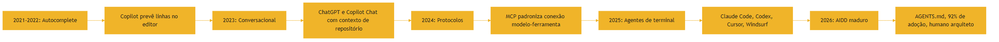

### 3.3 O Desenvolvedor como Gestor de Frota

O mesmo diagrama descreve a evolução do seu papel: em 2021, você digitava; em 2026, você governa [2]. O gestor de frota não dirige cada carro — ele define rotas, monitora a frota e intervém quando algo sai do esperado [1]. No AIDD, isso significa: definir especificações (rotas), monitorar agentes (observabilidade) e intervir nas falhas (revisão e validação) [4]. É exatamente o conjunto de habilidades que este livro construiu — e que os próximos volumes vão aprofundar [2]. O framework clássico do agente — LLM, memória, planejamento e ferramentas — é o modelo que orienta essa gestão [6].

### 3.4 O Diagrama do Papel do Desenvolvedor

A mudança de papel — de digitador a gestor de frota — merece um diagrama [2]:

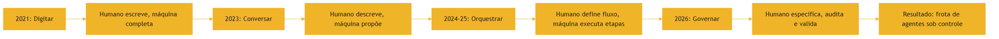

O diagrama condensa a tese do capítulo: o valor do humano não diminuiu — subiu de camada [2]. Em 2021, o humano era a mão; em 2026, o humano é o cérebro que especifica, o juiz que audita e o gestor que governa [2]. Cada subida de camada exigiu novas habilidades — e esta série mapeia exatamente quais [1]. O papel de gestor de frota não é menos técnico — é mais [4].

### 3.5 A Estrada e o Mapa do Campo

Fechar as analogias com a que abre o capítulo: a estrada [3]. A linha do tempo 2022-2026 é uma estrada com cinco postos [3]. Cada posto — autocomplete, conversacional, protocolos, agentes, AIDD — tem uma placa que indica o que mudou [3]. Quem viaja olhando só para o retrovisor (o passado) não vê as placas à frente [1]. Quem viaja olhando só para o horizonte (o futuro) atropela os postos [1]. O profissional viaja com o mapa — o passado como contexto, o presente como posição e o futuro como direção [1].

O mapa não prevê o futuro — organiza a viagem [2]. As três forças (arquitetura, interface, governança) são as coordenadas do mapa: qualquer novidade pode ser situada nelas [1]. E o próximo posto da estrada — os volumes seguintes da série — tem coordenadas conhecidas: a engenharia das camadas que o mapa desenha [10]. Você tem o mapa; a estrada continua [1].

## 4. Técnica

### 4.1 Instrumentando o Panorama com Dados

Vamos consolidar o panorama em números — o mesmo exercício de análise que um profissional de AIDD faz ao avaliar ferramentas [4]:

```python
import json


def relatorio_adocao_2026(dados):
    """Transforma dados brutos de adoção em um relatório executável de decisão."""
    total = sum(d["pct"] for d in dados)
    media = total / len(dados)
    print("=== Panorama de adoção de IA em 2026 ===")
    for d in sorted(dados, key=lambda x: -x["pct"]):
        barra = "#" * round(d["pct"] / 5)
        print(f"  {d['nome']:<35} {d['pct']:5.1f}% {barra}")
    print(f"\nMédia geral: {media:.1f}%")
    print("Conclusão: a IA é ubíqua, mas a confiança na exatidão é baixa —")
    print("o papel humano de arquiteto/revisor nunca foi tão crítico.")
    return media


if __name__ == "__main__":
    dados = [
        {"nome": "Devs que usam IA diariamente", "pct": 92.0},
        {"nome": "Confiança na exatidão do código gerado", "pct": 29.0},
        {"nome": "Código em PRs gerado por IA (faixa alta)", "pct": 60.0},
        {"nome": "Código em PRs gerado por IA (faixa baixa)", "pct": 40.0},
        {"nome": "Usuários de vibe coding que são não-dev", "pct": 63.0},
    ]
    relatorio_adocao_2026(dados)
```

### 4.2 O Panorama como Decisão de Ferramenta

A aplicação prática do panorama é a seleção de ferramentas [17]. O exercício abaixo estrutura a comparação de agentes pelos critérios que o profissional avalia — autonomia, governança e custo — a mesma matriz que os rankings de 2026 usam [17]:

```python
def comparar_agentes(agentes, criterios):
    """Pontua agentes por critérios e aponta o mais adequado ao seu caso."""
    print("=== Comparação de agentes (1 a 5) ===")
    resultados = []
    for nome, notas in agentes.items():
        total = sum(notas[c] for c in criterios)
        resultados.append((nome, total))
        print(f"  {nome:<25} {total:>4} pontos")
    melhor = max(resultados, key=lambda x: x[1])
    print(f"\nMelhor pontuação geral: {melhor[0]}")
    print("Mas a decisão final depende do seu contexto: custo, privacidade e")
    print("integração com o fluxo existente pesam mais que a pontuação bruta.")
    return melhor


if __name__ == "__main__":
    agentes = {
        "Claude Code": {"autonomia": 5, "governanca": 4, "custo": 3},
        "OpenAI Codex": {"autonomia": 4, "governanca": 4, "custo": 3},
        "Cursor": {"autonomia": 4, "governanca": 3, "custo": 4},
        "OpenCode (open source)": {"autonomia": 4, "governanca": 5, "custo": 5},
    }
    comparar_agentes(agentes, ["autonomia", "governanca", "custo"])
```

### 4.3 O Exercício de Posicionamento

O último exercício é pessoal: escreva o seu plano de posicionamento. Liste as disciplinas da série — Context Engineering, Prompt Engineering, MCP Engineering, Rules Engineering, Skills Engineering, Hook Engineering, Spec Engineering, Loop Engineering, Harness Engineering, Eval Engineering — e classifique seu nível atual em cada uma [2]. Esse mapa é o seu plano de estudos para os próximos volumes — e é a resposta à pergunta "onde eu me encaixo nessa história" [1].

### 4.5 O Painel de Decisão de Adoção

A seleção de ferramenta do Capítulo 4.2 pode virar um painel de decisão automatizado — o mesmo tipo de artefato que times de AIDD mantêm em seus repositórios para registrar por que escolheram cada ferramenta [17]:

```python
import json
from datetime import date


def painel_de_adocao(avaliacoes, pesos=None):
    """Gera um painel de decisão persistente, com data e justificativa."""
    pesos = pesos or {"autonomia": 1, "governanca": 1, "custo": 1}
    decisao = {"data": date.today().isoformat(), "avaliacoes": []}
    for nome, notas, justificativa in avaliacoes:
        score = sum(notas[k] * pesos.get(k, 1) for k in notas)
        decisao["avaliacoes"].append(
            {"ferramenta": nome, "score": score,
             "justificativa": justificativa}
        )
    decisao["avaliacoes"].sort(key=lambda x: -x["score"])
    print(json.dumps(decisao, ensure_ascii=False, indent=2))
    print(f"\nRevisar em 90 dias — o panorama muda rápido desde 2024 [3].")
    return decisao


if __name__ == "__main__":
    painel_de_adocao([
        ("Claude Code", {"autonomia": 5, "governanca": 4, "custo": 3},
         "Governança madura com AGENTS.md e hooks."),
        ("OpenCode", {"autonomia": 4, "governanca": 5, "custo": 5},
         "Open source; arquitetura dual-agent auditável [17]."),
        ("Cursor", {"autonomia": 4, "governanca": 3, "custo": 4},
         "Forte em refatoração no editor."),
    ])
```

O valor do painel não está no script — está na disciplina de registrar a decisão, a data e a justificativa, para que ela possa ser revisitada e contestada [4]. A mesma disciplina de documentar decisões de arquitetura que os profissionais aplicam a sistemas de software se aplica, com mais força ainda, a ferramentas que executam código por você [2].

### 4.4 Construindo a Linha do Tempo dos Próximos Cinco Anos

A habilidade de projetar o futuro se treina com o passado [1]. O exercício final de análise: estenda a linha do tempo deste capítulo para 2027-2030, anotando três previsões fundamentadas — uma sobre arquitetura (como os agentes vão evoluir), uma sobre interface (onde o trabalho vai acontecer) e uma sobre governança (como o controle humano vai se organizar) [1]. As previsões não precisam ser exatas — precisam ser fundamentadas nas três forças do Capítulo 2.6 [1]. Esse exercício não é acadêmico: as empresas que contratam profissionais de AIDD em 2026 procuram exatamente quem consegue projetar cenários e posicionar a arquitetura do time para os próximos anos [4]. Esse mapa é o seu plano de estudos para os próximos volumes — e é a resposta à pergunta "onde eu me encaixo nessa história" [1].

### 4.6 O Radar das Três Forças

O exercício final de análise do capítulo é o radar das três forças — uma forma de avaliar qualquer ferramenta nova que apareça no mercado [1]:

```python
def radar_da_ferramenta(nome, arquitetura, interface, governanca):
    """Avalia uma ferramenta nova pelas três forças da evolução."""
    print(f"=== Radar: {nome} ===")
    notas = {"Arquitetura": arquitetura, "Interface": interface, "Governança": governanca}
    for forca, nota in notas.items():
        print(f"  {forca:<12} {'#' * nota}{'.' * (5 - nota)} ({nota}/5)")
    media = sum(notas.values()) / len(notas)
    if media >= 4:
        print("Avaliação: ferramenta madura; avaliar integração no fluxo.")
    elif media >= 2.5:
        print("Avaliação: promissora; acompanhar por 90 dias.")
    else:
        print("Avaliação: imatura; não adotar ainda.")
    return media


if __name__ == "__main__":
    radar_da_ferramenta("Ferramenta X", arquitetura=4, interface=3, governanca=4)
    radar_da_ferramenta("Ferramenta Y", arquitetura=2, interface=2, governanca=1)
```

O radar força a pergunta que o mercado raramente faz: além de "funciona?", a ferramenta tem arquitetura sustentável, interface produtiva e governança auditável? [1] As três forças do Capítulo 2.6 — capacidade, interface e controle — são o filtro que separa modas de evolução [1]. Ferramentas que pontuam alto nas três são as que sobrevivem aos ciclos — e saber avaliá-las é a habilidade mais rentável do panorama [2].

### 4.7 O Estudo de Caso do Próprio Livro

O estudo de caso final — e mais direto — é o próprio livro que você está lendo [1]. Esta série foi produzida com o fluxo agêntico que ela descreve: especificações, arquivos de instrução, agentes de escrita e revisão, validação determinística e capas padronizadas [2]. A infraestrutura — comandos de compilação, scripts de auditoria, pools de capítulos e relatórios de revisão — é um exemplo real de harness editorial [2].

O exercício: identifique, na produção deste livro, as peças do vocabulário que você aprendeu [2]. Onde está a spec? Onde está o loop? Onde está a validação? Onde está a governança? [2] Essa leitura — reconhecer o sistema sob o produto — é a habilidade que encerra o Livro 1 e abre todos os próximos: olhar para qualquer produto e ver a pilha por trás dele [1].

### 4.8 O Script de Classificação de Ferramenta

O exercício final de técnica consolida o radar das três forças em um script reutilizável [1]:

```python
def classificar_tipo(tool, arquitetura, interface, governanca):
    """Classifica uma ferramenta em um dos quatro estágios da linha do tempo."""
    score = (arquitetura + interface + governanca) / 3
    if score < 2:
        estagio = "Autocomplete: assistência passiva"
    elif score < 3:
        estagio = "Conversacional: assistência sob demanda"
    elif score < 4:
        estagio = "Orquestração: execução com supervisão"
    else:
        estagio = "Governança: autonomia com controle"
    print(f"{tool}: score {score:.1f} -> {estagio}")
    return estagio


if __name__ == "__main__":
    classificar_tipo("Copilot 2021", 1, 2, 1)
    classificar_tipo("Chat 2023", 2, 3, 2)
    classificar_tipo("Agente de terminal 2025", 4, 4, 3)
    classificar_tipo("AIDD maduro 2026", 5, 5, 5)
```

O script ilustra a tese do capítulo em números: cada estágio da linha do tempo é, no fundo, uma combinação das três forças — capacidade, interface e governança [1]. Uma ferramenta que pontua alto em arquitetura mas baixo em governança é poderosa e perigosa ao mesmo tempo [2]. O classificador é o mapa que permite situar qualquer ferramenta — nova ou antiga — na evolução do campo [1].

## 5. Aplica

### 5.1 Onde Isso Vive no Mundo Real

O panorama de 2026 define o mercado de trabalho [19]. As empresas buscam profissionais que não apenas usam IA, mas que a governam: definem AGENTS.md, projetam harnesses e revisam diffs com método [4]. Os relatórios de mercado apontam a mesma direção: produtividade alta com confiança baixa — e o profissional que domina validação é o elo que falta [19]. O seu diferencial, construído ao longo deste livro, é exatamente esse: você entende a máquina, o processo e o vocabulário — e pode operar o portão de qualidade [2]. No centro dessa governança está o function calling: o contrato que define exatamente o que o agente pode chamar [9].

### 5.2 O Erro Comum do Iniciante

O erro clássico é acreditar na linearidade: "uso IA, logo estou à frente". A correção — e aqui está o diferencial que separa o profissional — é a profundidade: usar IA é comum (92%); governar IA é raro [19]. O profissional não coleciona ferramentas — escolhe com método, configura com precisão e valida com rigor [2]. A história mostra o mesmo padrão em cada salto: os que dominaram a camada nova — do autocomplete ao agente — foram os que não pararam na superfície [1].

### 5.3 O Padrão Profissional em 2026

O padrão profissional combina tudo o que você aprendeu: lógica e leitura de código (Capítulos 1-2), Git e PRs (Capítulo 3), testes e CI (Capítulo 4), arquitetura (Capítulos 5-6), contexto (Capítulo 7), mecânica do modelo (Capítulo 8) e vocabulário agêntico (Capítulo 9) [1][2]. O resultado é um profissional que opera a pilha inteira — e é exatamente essa pilha que a série "A Pilha Agêntica" constrói a partir daqui [2]. Os próximos volumes sobem a pilha: contexto, prompts, MCP, regras, skills, hooks, specs, loops, harnesses e evals [10]. Cada camada exige uma forma própria de validação — a mesma que você dominou nos testes determinísticos [20].

### 5.4 O Roteiro de Estudos da Pilha

A série "A Pilha Agêntica" é organizada em quatro partes progressivas, e cada parte corresponde a um patamar de carreira [2]. A Parte I — Fundação, que este livro encerra — cobre os Livros 1 e 2: o chão técnico que você acabou de construir. A Parte II — Camada de Contexto, dos Livros 3 a 5, sobe para Context Engineering, Prompt Engineering e MCP Engineering: o que o modelo vê, como você o instrui e como ele se conecta às ferramentas [10]. A Parte III — Camada de Harness, dos Livros 6 a 9, entra em Rules Engineering, Skills Engineering, Hook Engineering, Spec Engineering, Loop Engineering e Harness Engineering: autonomia, execução e governança [2]. A Parte IV — Mestria e Carreira, dos Livros 10 e 11, fecha com Eval Engineering e o posicionamento profissional [2].

Cada patamar tem um portão de saída — uma habilidade verificável que você precisa demonstrar antes de subir [4]. Ao terminar a Parte I, o portão é: ler e validar código, versionar com Git, testar com disciplina e entender a mecânica do modelo [1]. Ao terminar a Parte II, o portão é: projetar o contexto de um agente do zero — escolhendo o que entra na janela, em que ordem e em que formato — e conectar ferramentas via MCP [10]. Ao terminar a Parte III, o portão é: construir um harness completo, com regras, skills, hooks, specs e loops, e operá-lo com governança [2]. Ao terminar a Parte IV, o portão é: avaliar agentes com método e desenhar o futuro do seu time [4].

O erro de percurso mais comum é tentar pular portões: estudar Harness Engineering sem dominar Context Engineering produz harnesses que orquestram contexto mal projetado — o agente executa com eficiência exatamente o que não deveria [10]. A disciplina da pilha é a mesma do software: cada camada só é tão boa quanto a camada imediatamente abaixo [1]. Se você sentiu dificuldade em qualquer capítulo deste livro, esse é o lugar para revisitar antes de subir — porque os próximos volumes assumem este chão como pré-requisito [2].

### 5.5 Riscos e Ética da Autonomia

O último patamar profissional — governar agentes autônomos — traz consigo uma camada de responsabilidade que o mercado de 2026 ainda está aprendendo a nomear [4]. O primeiro risco é o da confiança excedente: quando o código gerado por IA representa entre 40% e 60% dos PRs corporativos, e a confiança na exatidão caiu para 29%, cada merge sem validação é uma aposta [19]. O segundo risco é o do viés amplificado: agentes treinados em dados históricos reproduzem e escalam preconceitos — e a escala dos agentes torna o impacto maior que o de um erro humano isolado [1]. O terceiro risco é o da segurança: agentes com acesso a repositórios, credenciais e CI podem executar ações destrutivas — e o harness que não limita o escopo de ferramentas é uma porta aberta [9].

A resposta profissional tem três camadas, todas derivadas do que você aprendeu [2]. A camada de contrato: o function calling define exatamente o que o agente pode chamar — nada além [9]. A camada de validação: testes determinísticos e CI verificam cada mudança antes do merge, exatamente como no Capítulo 4 [20]. E a camada de governança: arquivos de instrução como AGENTS.md e CLAUDE.md documentam as restrições e o escopo, tornando o comportamento do agente auditável [12][14]. A pergunta ética central — quem responde pelo que o agente fez? — tem uma resposta de engenharia: aquele que define o contrato, o escopo e a validação [2]. É por isso que o papel de arquiteto, especificador e revisor não é um luxo do AIDD — é a própria definição de responsabilidade na era dos agentes [1].

### 5.6 O Que Este Livro Deixou Pronto

Antes de fechar, vale consolidar o inventário do que o Livro 1 entrega [1]. Lógica de programação e leitura de código (Capítulos 1-2), controle de versão com Git, branches e PRs (Capítulo 3), testes, CI/CD e observabilidade (Capítulo 4), arquitetura de software — funções, módulos, APIs, bancos, servidores (Capítulos 5-6), tokens e janela de contexto (Capítulo 7), atenção, amostragem e alucinação (Capítulo 8), vocabulário do campo — modelo, tool, tool calling, agente (Capítulo 9) e o panorama histórico e de mercado (Capítulo 10) [1][2].

Esse inventário é o "chão" da pilha: o vocabulário e as habilidades mínimas para qualquer conversa técnica séria sobre agentes [2]. Com ele, você consegue ler a documentação de qualquer ferramenta, avaliar a proposta de qualquer fornecedor e começar a projetar seus primeiros fluxos agênticos [4]. A partir do Livro 2, a série sobe a pilha — mas este é o capítulo que garante que você está em terreno firme [1].

### 5.7 O Plano de Carreira na Pilha

Fechar o capítulo aplicado é fechar o livro — e o plano de carreira é o portão de saída [2]. O plano em três horizontes [2]. No horizonte imediato (este mês): revisitar os capítulos onde você teve mais dificuldade e refazer os exercícios [1]. No horizonte médio (três meses): construir um projeto pessoal de AIDD — um fluxo agêntico real, com contexto, tools e validação — documentado nos padrões que o livro ensinou [2]. No horizonte longo (um ano): dominar as camadas da Parte II e III da série, com o mapa de estudo do Capítulo 5.4 [10].

O plano só funciona se for escrito e revisado [2]. Escreva-o em um arquivo — como um AGENTS.md pessoal, com regras, metas e métricas — e revise a cada mês [14]. O mesmo instrumento que governa agentes governa a sua carreira: instruções explícitas, medição e revisão [2]. O mercado de 2026 premia exatamente quem opera com essa disciplina — porque é ela que a indústria inteira está aprendendo a contratar [19].

### 5.8 O Inventário do Profissional de 2026

O profissional formado por este livro carrega um inventário verificável de habilidades [1]. Da Parte I: lógica e leitura de código; Git e fluxo de PRs; testes, CI e observabilidade; arquitetura de software — funções, módulos, APIs, bancos e servidores; a língua HTTP; tokens e janela de contexto; atenção, amostragem e alucinação; o vocabulário — modelo, tool, tool calling e agente; e o panorama histórico do campo [1][2].

Cada item do inventário tem um teste de verificação — o portão de saída do Capítulo 5.4 [4]. Para cada habilidade, a pergunta é a mesma: você consegue fazer, de cabeça, com um exemplo próprio? [1] Se sim, o item está no inventário [1]. Se não, o item volta para a lista de revisão [1]. Esse inventário — honesto, verificado e escrito — é o seu cartão de visita na entrevista, no portfólio e na conversa técnica [4]. E é a base sólida sobre a qual a pilha inteira será construída [2].

### 5.9 O Teste de Saída do Livro

Antes de encerrar, o teste de saída — o mesmo que o profissional aplica ao final de uma formação [1]. Dez perguntas, uma por capítulo [1]. Capítulo 1: você consegue prever o resultado de um programa antes de executá-lo? [1] Capítulo 2: você lê uma função desconhecida pelo contrato, fluxos e estado? [1] Capítulo 3: você explica o que um commit, uma branch e um merge fazem? [1] Capítulo 4: você descreve a pirâmide de testes e o papel do CI? [1] Capítulo 5: você identifica cliente, API, servidor e banco em um sistema? [1] Capítulo 6: você interpreta um status HTTP e o corpo de uma resposta? [1] Capítulo 7: você estima o custo em tokens de um contexto? [1] Capítulo 8: você explica por que o mesmo prompt dá respostas diferentes? [1] Capítulo 9: você distingue modelo, tool, tool calling e agente? [1] Capítulo 10: você situa o campo na linha do tempo 2022-2026 e identifica as três forças da evolução? [1]

Se você respondeu sim a pelo menos oito, o Livro 1 cumpriu o seu papel — e você está pronto para a Parte II [2]. Se respondeu sim a menos, volte aos capítulos que falharam: o teste de saída não é uma barreira, é um mapa [1]. Cada resposta sim é um alicerce; cada resposta não é uma tarefa de reforço [1].

### 5.10 O Convite para a Próxima Camada

O Livro 1 termina com um convite — e uma promessa [2]. O convite: aplicar, ainda esta semana, pelo menos três exercícios deste livro em um projeto real — de preferência um projeto que você já usa [1]. O promessa: a partir do Livro 2, a série sobe a pilha, e cada volume constrói sobre este chão [2]. A Parte II — Context Engineering, Prompt Engineering e MCP Engineering — vai transformar o que você aprendeu sobre tokens, atenção e vocabulário nas disciplinas que governam o que os agentes veem, pensam e alcançam [10].

A história do campo que você percorreu neste capítulo é também a sua história: você começou no autocomplete e está saindo como gestor de frota [1]. O mercado de 2026 precisa exatamente desse profissional — o que entende a máquina, o processo e a governança [4]. O chão está pronto, o mapa está claro e a pilha está à sua frente [2].

## 6. Conclusão

Neste capítulo, você percorreu a história do campo: do autocomplete de 2021 ao AIDD maduro de 2026 [1][3]; dos protocolos que padronizaram as ferramentas [5] aos agentes de terminal que automatizaram o trabalho [17]; e ao papel do desenvolvedor como arquiteto, especificador e revisor [2]. Você instrumentou o panorama em dados e comparou ferramentas com método — os mesmos exercícios dos profissionais [4].

Com isso, o Livro 1 se completa: você construiu o chão da pilha — lógica, Git, testes, arquitetura, contexto, atenção e vocabulário [1][2]. Nos próximos volumes, subimos a pilha: Context Engineering, Prompt Engineering, MCP Engineering, Rules Engineering, Skills Engineering, Hook Engineering, Spec Engineering, Loop Engineering, Harness Engineering e Eval Engineering [10]. O chão está pronto — e o céu é o limite [2].

## 7. Referências Bibliográficas

[1] KARPATHY, Andrej. Software 3.0: Software in the Age of AI. Disponível em: https://www.latent.space/p/s3. Acesso em: 5 ago. 2026.

[2] SITEPOINT. Vibe Coding 2026: The Complete Guide to AI-First Development. Disponível em: https://www.sitepoint.com/vibe-coding-2026-complete-guide/. Acesso em: 5 ago. 2026.

[3] CODERABBIT. From Copilot to agents: The history of AI coding. Disponível em: https://www.coderabbit.ai/blog/a-very-brief-history-of-ai-coding-from-copilot-to-next-gen-agents. Acesso em: 5 ago. 2026.

[4] KEYHOLE SOFTWARE. Vibe Coding Trends 2026: Adoption, Productivity, and Code Quality Data. Disponível em: https://keyholesoftware.com/vibe-coding-trends-2026/. Acesso em: 5 ago. 2026.

[5] ANTHROPIC. Introducing the Model Context Protocol. Disponível em: https://www.anthropic.com/news/model-context-protocol. Acesso em: 5 ago. 2026.

[6] WENG, Lilian. LLM-Powered Autonomous Agents. Disponível em: https://lilianweng.github.io/posts/2023-06-23-agent/. Acesso em: 5 ago. 2026.

[7] WENG, Lilian. Extrinsic Hallucinations in LLMs. Disponível em: https://lilianweng.github.io/posts/2024-07-07-hallucination/. Acesso em: 5 ago. 2026.

[8] CHROMA. Context Rot: How Increasing Input Tokens Impacts LLM Performance. Disponível em: https://www.trychroma.com/research/context-rot. Acesso em: 5 ago. 2026.

[9] OPENAI. Function Calling Guide. Disponível em: https://developers.openai.com/api/docs/guides/function-calling. Acesso em: 5 ago. 2026.

[10] ANTHROPIC. Effective Context Engineering for AI Agents. Disponível em: https://www.anthropic.com/engineering/effective-context-engineering-for-ai-agents. Acesso em: 5 ago. 2026.

[11] EWASCHUK, Rob; BEYER, Betsy (Ed.). Site Reliability Engineering: Monitoring Distributed Systems. Google SRE Book. Disponível em: https://sre.google/sre-book/monitoring-distributed-systems/. Acesso em: 5 ago. 2026.

[12] TIAN PAN. CLAUDE.md and AGENTS.md: The Configuration Layer That Makes AI Coding Agents Actually Follow Your Rules. Disponível em: https://tianpan.co/blog/2026-02-25-claude-md-agents-md-ai-coding-agent-instruction-files. Acesso em: 5 ago. 2026.

[13] LULLA, Jai Lal; et al. On the Impact of AGENTS.md Files on the Efficiency of AI Coding Agents. Disponível em: https://arxiv.org/html/2601.20404v1. Acesso em: 5 ago. 2026.

[14] OPENAI / AGENTS.MD FOUNDATION. Open Standards for Agentic Configuration (AGENTS.md). Disponível em: https://agents.md/. Acesso em: 5 ago. 2026.

[15] PROMPTING GUIDE. Function Calling in AI Agents. Disponível em: https://www.promptingguide.ai/agents/function-calling. Acesso em: 5 ago. 2026.

[16] ITECS. Claude Code vs. GitHub Copilot: Agentic vs. Autocomplete. Disponível em: https://itecsonline.com/post/claude-code-vs-github-copilot-2026-agentic-vs-autocomplete-enterprise-guide. Acesso em: 5 ago. 2026.

[17] MIGHTYBOT. Best AI Coding Agents in 2026, Ranked. Disponível em: https://mightybot.ai/blog/coding-ai-agents-for-accelerating-engineering-workflows/. Acesso em: 5 ago. 2026.

[18] GARTENBERG, Chaim. What is a long context window?. Google DeepMind. Disponível em: https://blog.google/innovation-and-ai/products/long-context-window-ai-models/. Acesso em: 5 ago. 2026.

[19] VOCKE, Ham; FOWLER, Martin. The Practical Test Pyramid. Disponível em: https://martinfowler.com/articles/practical-test-pyramid.html. Acesso em: 5 ago. 2026.

[20] TESTING LIBRARY. Guiding Principles. Disponível em: https://testing-library.com/docs/guiding-principles/. Acesso em: 5 ago. 2026.

# Capítulo 11: Testes e CI/CD: a rede de segurança que a IA exige

## 1. Introdução

No capítulo anterior, você percorreu o panorama 2022-2026 e viu o campo migrar do autocomplete para agentes autônomos [14]. Agora chegou a hora de entender a ferramenta que torna toda essa autonomia segura: a rede de testes, integração contínua e observabilidade. Sem ela, um sistema que funciona no seu computador é apenas uma demonstração; com ela, vira um produto no qual você — e os agentes que você delega — podem confiar [4].

Este capítulo tem três objetivos. Primeiro, entender por que testes automatizados voltaram a ser a disciplina mais importante da era da IA [3]. Segundo, dominar o fluxo de integração contínua e seus três aliados: Git, branches e pull requests [7]. Terceiro, aprender a observar sistemas em produção para detectar falhas antes que o usuário as encontre [11]. Ao final, você terá o esqueleto de confiabilidade que sustenta toda a série [1].

## 2. Explica

### 2.1 A pirâmide de testes como prioridade de investimento

A pirâmide de testes organiza a suíte em camadas: muitos testes unitários na base, menos testes de integração no meio e poucos testes ponta a ponta no topo [1]. A lógica é econômica: testes unitários são rápidos, baratos e apontam o arquivo exato onde algo quebrou; testes ponta a ponta são lentos, frágeis e demorados [1]. Quando você inverte a pirâmide, cada mudança custa caro e o feedback chega tarde — o pior cenário para um fluxo agêntico, que precisa de ciclos curtos para se auto-corrigir [4].

### 2.2 TDD: escrever o teste antes do código

O Test-Driven Development inverte o fluxo natural: primeiro escreve-se um teste que falha, depois o código mínimo para fazê-lo passar e então se refatora [2]. Esse ciclo de três passos cria uma malha de segurança que torna o código automaticamente testável [2]. Para quem trabalha com IA, o TDD tem um bônus adicional: o teste vira a especificação executável que você pode entregar ao agente — em vez de descrever o comportamento desejado em prosa, você o descreve em código que falha se o agente errar [3].

### 2.3 Testes como especificação executável

A biblioteca de testes moderna carrega uma filosofia: o teste deve ser escrito na linguagem do comportamento, não na linguagem da implementação [3]. Quando um teste falha, a mensagem precisa dizer o que o sistema deveria fazer, não como ele faz por dentro [3]. É exatamente esse contrato que os agentes de código entendem melhor: uma suíte com nomes claros de comportamento é uma especificação viva que o agente lê antes de tocar no código [14].

### 2.4 Integração contínua: o batimento cardíaco do repositório

A integração contínua é a prática de integrar mudanças pequenas e frequentes, cada uma validada automaticamente [4]. O servidor de CI executa a suíte completa a cada push e avisa em minutos se algo quebrou [4]. Ferramentas como o GitHub Actions e o GitLab CI padronizaram esse fluxo: um arquivo de configuração no repositório define os passos — instalar dependências, rodar testes, validar lint e publicar artefatos [5][6]. Para o desenvolvedor AIDD, o CI é o juiz imparcial que decide se uma mudança proposta por um agente pode entrar [4].

### 2.5 Git, branches e pull requests: o trilho da colaboração

Nenhum fluxo agêntico funciona sem o controle de versão [7]. O Git registra cada mudança, e o modelo mental de branches permite isolar experimentos sem quebrar a linha principal [8]. A estratégia de branching escolhida — trunk-based, feature branches ou git flow — define a cadência da equipe e o ritmo com que o agente pode integrar trabalho [9]. O pull request é a porta de entrada da revisão humana: o código do agente só entra na main depois que um par — ou um agente revisor — confere e aprova [10].

### 2.6 Observabilidade: medir antes de confiar

Testes dizem que o sistema funcionava no momento do deploy; a observabilidade diz que ele continua funcionando sob carga real [11]. A disciplina de engenharia de confiabilidade de sites (SRE) definiu as quatro métricas douradas: latência, tráfego, erros e saturação [11]. A instrumentação moderna usa padrões abertos como o OpenTelemetry para coletar logs, métricas e rastreios com uma API única, independente do fornecedor [12]. Para sistemas agênticos, o rastreio distribuído ganha um uso novo: registrar qual ferramenta o agente chamou, com que entrada e com que saída — a trilha que permite auditar decisões autônomas [11].

### 2.7 O fluxo do agente sob a rede de segurança

Com tudo no lugar, o fluxo de trabalho do desenvolvedor AIDD ganha forma: o agente trabalha em uma branch curta, submete um pull request, o CI roda a suíte e a revisão acontece — humana ou agêntica — antes do merge [10]. Quando um teste falha, a causa pode estar no código novo, mas também no próprio agente: contexto mal curado, alucinação ou regressão de ferramenta [17]. É por isso que a suíte precisa cobrir também os artefatos gerados por IA: validação de sintaxe, testes de contrato e verificação de que o código gerado respeita o comportamento especificado [3].

## 3. Ilustra

### 3.1 A analogia da rede de segurança do equilibrista

Pense em um equilibrista ensaiando sem rede: qualquer erro exige recomeçar do zero, e o erro só é descoberto quando ele cai. A rede de testes é o contrário: ela transforma cada queda em uma lição barata, registrada e imediatamente visível [4]. O equilibrista não tem medo de tentar passos novos porque sabe que a rede está lá embaixo — e é exatamente essa confiança que a IA precisa para receber autonomia crescente sem que a equipe perca o sono [11].

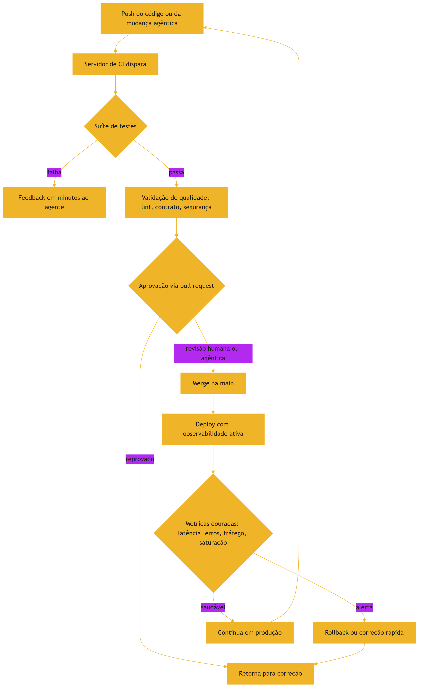

### 3.2 A rede como guardiã da confiança

A beleza do desenho é que a rede protege nos dois sentidos: ela protege o produto dos erros do agente, e protege o agente de ser julgado por erros que nenhuma suíte teria capturado [3]. Uma organização que mede seus testes sabe exatamente onde está a cobertura e onde o risco mora — e pode decidir conscientemente onde a autonomia agêntica pode avançar [2].

## 4. Técnica

### 4.1 Uma suíte de teste com comportamento legível

O exemplo abaixo define um teste que descreve comportamento, não implementação — o padrão da biblioteca de testes moderna [3]:

```python
# tests/test_carrinho.py
def test_carrinho_aplica_desconto_para_cliente_vip(carrinho, cliente_vip):
    carrinho.adicionar("item_pro_1", quantidade=2)
    carrinho.aplicar_politica(cliente_vip)
    assert carrinho.total() == 90.0  # 10% de desconto sobre 100.0
```

```python
# tests/test_carrinho.py (continuação)
def test_carrinho_rejeita_item_inexistente(carrinho):
    resultado = carrinho.adicionar("sku_inexistente")
    assert resultado.foi_rejeitado
    assert "sku_inexistente" in resultado.motivo
```

O primeiro teste falha se o desconto sumir; o segundo protege o contrato de validação. Nomes em forma de frase transformam a suíte em documentação executável que o agente consulta antes de refatorar [3].

### 4.2 Pipeline de CI declarativo

A integração contínua em si é declarada no repositório, como neste pipeline mínimo de dois estágios [5]:

```yaml
# .github/workflows/ci.yml
name: ci
on: [push, pull_request]
jobs:
  validar:
    runs-on: ubuntu-latest
    steps:
      - uses: actions/checkout@v4
      - uses: actions/setup-python@v5
        with:
          python-version: "3.12"
      - run: pip install -e ".[dev]"
      - run: pytest --cov=src --cov-fail-under=80
      - run: python scripts/validar-codigo.py
```

Cada passo do pipeline é uma guarda: se a cobertura cair abaixo de 80%, o merge é bloqueado — um critério objetivo que não depende da opinião de quem revisa [4].

### 4.3 Instrumentação com rastreio

A observabilidade começa com a instrumentação. O exemplo abaixo cria um rastreio por requisição e registra o tempo de cada etapa do fluxo agêntico [12]:

```python
from opentelemetry import trace

tracer = trace.get_tracer("fabrica")

def chamada_do_agente(pergunta: str) -> str:
    with tracer.start_as_current_span("agente.chamada") as span:
        span.set_attribute("agente.pergunta", pergunta)
        span.set_attribute("agente.ferramenta", "pesquisa")
        resposta = invocar_modelo(pergunta)
        span.set_attribute("agente.resposta_len", len(resposta))
        return resposta
```

Com esses atributos, o painel de observabilidade responde perguntas que os testes não respondem: quanto tempo o agente gasta por ferramenta, onde a latência explode e qual turno produziu a saída errada [11].

## 5. Aplica

### 5.1 Onde isso vive no mundo real

Na prática, a rede de segurança aparece em todos os projetos sérios: o GitHub Actions e o GitLab CI rodam a suíte a cada merge request; o Git protege a história e permite voltar atrás; os pull requests organizam a revisão; e o OpenTelemetry conecta logs e métricas do ambiente de produção [5][6]. No mercado de 2026, os agentes de código de maior qualidade são justamente os que operam dentro de repositórios com CI forte — a diferença entre uma ferramenta que sugere código e um sistema que entrega código verificado [13][15].

### 5.2 O erro comum do iniciante

O erro clássico é escrever testes que só confirmam o que o código já faz — testes que passam mesmo quando o comportamento está errado [3]. O segundo erro é tratar CI como formalidade: um pipeline quebrado que ninguém conserta vira o pior dos mundos, porque destrói a confiança no sinal [4]. Comece pequeno: uma suíte unitária honesta, um pipeline de dois passos e um painel com as quatro métricas douradas valem mais do que cem alertas ignorados [11].

## 6. Conclusão

A rede de testes, CI e observabilidade é o que separa o protótipo do sistema em produção — e é a condição de possibilidade de toda autonomia agêntica [4]. Você aprendeu a priorizar a pirâmide, a escrever testes como especificação executável, a declarar pipelines de integração e a observar sistemas em produção [1][11]. Quando os capítulos seguintes mostrarem agentes executando tarefas, lembre-se: cada tarefa delegada precisa de uma rede de segurança equivalente, sob pena de transformar velocidade em caos [17].


## 7. Referências

[1] VOCKE, Ham; FOWLER, Martin. The Practical Test Pyramid. Disponível em: https://martinfowler.com/articles/practical-test-pyramid.html. Acesso em: 5 ago. 2026.
[2] BECK, Kent. Test-Driven Development: By Example. Boston: Addison-Wesley Professional, 2002.
[3] TESTING LIBRARY. Guiding Principles. Disponível em: https://testing-library.com/docs/guiding-principles/. Acesso em: 5 ago. 2026.
[4] FOWLER, Martin. Continuous Integration. Disponível em: https://martinfowler.com/articles/continuousIntegration.html. Acesso em: 5 ago. 2026.
[5] GITHUB ACTIONS DOCS. Understanding GitHub Actions. Disponível em: https://docs.github.com/en/actions/about-github-actions/understanding-github-actions. Acesso em: 5 ago. 2026.
[6] GITLAB. CI/CD pipeline architecture. Disponível em: https://docs.gitlab.com/ee/ci/. Acesso em: 5 ago. 2026.
[7] CHACON, Scott; STRAUB, Ben. Pro Git. 2. ed. Apress/Git SCM, 2014. Disponível em: https://git-scm.com/book/en/v2. Acesso em: 5 ago. 2026.
[8] GITHUB DOCS. About branches. Disponível em: https://docs.github.com/en/pull-requests/collaborating-with-pull-requests/proposing-changes-to-your-work-with-pull-requests/about-branches. Acesso em: 5 ago. 2026.
[9] ATLASSIAN. Git branching strategies. Disponível em: https://www.atlassian.com/git/tutorials/comparing-workflows. Acesso em: 5 ago. 2026.
[10] GITHUB DOCS. About pull requests. Disponível em: https://docs.github.com/en/pull-requests/collaborating-with-pull-requests/proposing-changes-to-your-work-with-pull-requests/about-pull-requests. Acesso em: 5 ago. 2026.
[11] EWASCHUK, Rob; BEYER, Betsy (Ed.). Site Reliability Engineering: Monitoring Distributed Systems. Google SRE Book. Disponível em: https://sre.google/sre-book/monitoring-distributed-systems/. Acesso em: 5 ago. 2026.
[12] OPENTELEMETRY. What is OpenTelemetry?. Disponível em: https://opentelemetry.io/docs/what-is-opentelemetry/. Acesso em: 5 ago. 2026.
[13] ITECS. Claude Code vs. GitHub Copilot: Agentic vs. Autocomplete. Disponível em: https://itecsonline.com/post/claude-code-vs-github-copilot-2026-agentic-vs-autocomplete-enterprise-guide. Acesso em: 5 ago. 2026.
[14] CODERABBIT. From Copilot to agents: The history of AI coding. Disponível em: https://www.coderabbit.ai/blog/a-very-brief-history-of-ai-coding-from-copilot-to-next-gen-agents. Acesso em: 5 ago. 2026.
[15] MIGHTYBOT. Best AI Coding Agents in 2026, Ranked. Disponível em: https://mightybot.ai/blog/coding-ai-agents-for-accelerating-engineering-workflows/. Acesso em: 5 ago. 2026.
[16] OPENAI. Tokenizer (ferramenta interativa). Disponível em: https://platform.openai.com/tokenizer. Acesso em: 5 ago. 2026.
[17] WENG, Lilian. Extrinsic Hallucinations in LLMs. Disponível em: https://lilianweng.github.io/posts/2024-07-07-hallucination/. Acesso em: 5 ago. 2026.
[18] CHROMA. Context Rot: How Increasing Input Tokens Impacts LLM Performance. Disponível em: https://www.trychroma.com/research/context-rot. Acesso em: 5 ago. 2026.
[19] OPENAI. Function Calling Guide. Disponível em: https://developers.openai.com/api/docs/guides/function-calling. Acesso em: 5 ago. 2026.
[20] PROMPTING GUIDE. Function Calling in AI Agents. Disponível em: https://www.promptingguide.ai/agents/function-calling. Acesso em: 5 ago. 2026.

# Capítulo 12: Bancos de dados, APIs e servidores: o chão sobre o qual os agentes caminham

## 1. Introdução

No capítulo anterior, você montou a rede de segurança que valida o código — testes, CI e observabilidade [5]. Mas testes validam o comportamento de uma aplicação que precisa de algo para existir: dados armazenados, serviços expostos e máquinas rodando. Este capítulo desce ao chão sobre o qual os agentes caminham: bancos de dados, APIs e servidores [1].

Este capítulo tem três objetivos. Primeiro, entender o que é um banco de dados e por que o estado importa [1]. Segundo, dominar o vocabulário de APIs e servidores — o ponto de contato entre o agente e o mundo real [4]. Terceiro, conectar esse chão técnico ao que você já aprendeu sobre modelos: tokens, janelas de contexto e as limitações que explicam por que o modelo não é o sistema [17]. Ao final, você saberá desenhar o caminho completo de um dado: do banco à API, da API ao agente e do agente de volta ao usuário [7].

## 2. Explica

### 2.1 O banco de dados como memória externa do sistema

Todo sistema que precisa lembrar de algo entre requisições usa um banco de dados — a memória externa que sobrevive ao ciclo de vida de cada processo [1]. A modelagem decide a forma dos dados: entidades, relacionamentos e índices [1]. A regra de ouro para quem constrói com agentes é simples: o banco é a fonte da verdade; o agente é apenas um cliente com mais contexto e melhores maneiras [7].

### 2.2 APIs: a fronteira entre o mundo e o agente

Uma API é um contrato: métodos, rotas, parâmetros e formatos de resposta que definem como um cliente conversa com um serviço [4]. Para agentes, a API é a superfície de ação — é por ela que o modelo obtém dados, executa comandos e consulta o mundo [4]. O protocolo Model Context Protocol (MCP) padronizou essa conversa: um servidor MCP expõe ferramentas e recursos com um schema claro, e o cliente — o harness — gerencia o ciclo de vida [4].

### 2.3 Function calling: a ponte entre o texto e a ação

O function calling transforma a resposta do modelo em uma chamada estruturada: o modelo devolve um nome de função e argumentos em JSON, e o harness executa a função real [5][6]. Essa camada é o que separa um chat de um agente: o texto vira intenção, e a intenção vira efeito no mundo [5]. O vocabulário é pequeno e essencial: tool, tool calling e function calling — os mesmos termos que você viu no panorama histórico e que agora ganham corpo aqui [3].

### 2.4 Servidores: onde o código vive

Um servidor é um processo que escuta uma porta e responde requisições — e é o habitat natural de APIs e bancos [1]. A infraestrutura moderna separa responsabilidades: o servidor de aplicação executa a lógica, o banco persiste o estado e o proxy gerencia o tráfego [1]. Para o desenvolvedor AIDD, entender servidores é entender limites: onde o agente pode chegar, que portas estão abertas e que dados atravessam cada fronteira [7].

### 2.5 O que o modelo vê: tokens e contexto

Antes de um agente conversar com sua API, o texto precisa virar números: a tokenização divide o texto em unidades que o modelo processa [17]. A janela de contexto é a memória de trabalho do modelo — tudo o que entra nela compete por atenção [13]. Os modelos modernos oferecem janelas enormes, mas o tamanho não elimina o problema: quanto mais contexto, maior o risco de degradação de desempenho, o fenômeno conhecido como context rot [19]. A boa notícia é que a engenharia de contexto resolve: selecionar, comprimir e isolar o que entra na janela é uma disciplina própria [7].

### 2.6 O modelo não é o sistema

A distinção mais importante deste livro: o modelo é uma peça, o sistema é o conjunto [2]. Alucinações — respostas plausíveis porém erradas — são um risco inerente ao modelo, não um bug que se corrige com mais código [18]. A arquitetura protege o sistema desses riscos: o banco valida o estado, a API valida o contrato e o harness decide o que o modelo pode ou não fazer [2][7]. Por isso o papel do desenvolvedor mudou: ele não escreve mais cada linha, ele projeta o sistema em que as linhas geradas podem errar sem causar dano [2].

## 3. Ilustra

### 3.1 A analogia do garçom e da cozinha

Imagine um restaurante: o cliente conversa com o garçom, mas a comida sai da cozinha. O garçom (o agente) traduz o pedido do cliente em comandos; a cozinha (a API e o banco) executa e entrega; e o caderno de pedidos (o banco de dados) registra o que cada mesa pediu, para que nenhuma informação se perca entre turnos [1]. Se o garçom inventar um prato que não existe, a cozinha recusa — é assim que a validação de contrato protege o sistema [6].

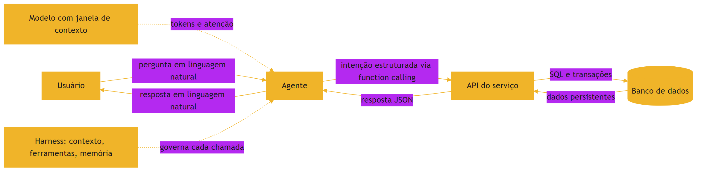

### 3.2 A cozinha não funciona sem o caderno

O diagrama mostra o fluxo completo: o modelo fornece a inteligência, o harness governa, a API executa e o banco lembra [1]. Troque qualquer peça por uma improvisada e o sistema quebra — o mesmo princípio da pilha que você vem construindo desde o Livro 1 [2].

## 4. Técnica

### 4.1 Um modelo de dados mínimo

O exemplo abaixo define o modelo de um pedido com um relacionamento simples — o tipo de código que um agente consegue gerar com alta qualidade quando o contrato está claro [1]:

```python
from dataclasses import dataclass, field


@dataclass
class Pedido:
    id: int
    cliente: str
    itens: list[str] = field(default_factory=list)

    def total(self) -> float:
        return sum(item["preco"] * item["quantidade"] for item in self.itens)
```

O contrato é explícito: um pedido tem cliente, itens e um total calculado. Com essa definição, o agente sabe exatamente o que produzir — e a suíte de testes do capítulo anterior valida o resultado [5].

### 4.2 Uma API mínima com validação de contrato

Aqui, um serviço HTTP mínimo que expõe o pedido e valida a entrada antes de persistir [4]:

```python
from flask import Flask, jsonify, request

app = Flask(__name__)
pedidos: dict[int, dict] = {}


@app.post("/pedidos")
def criar_pedido():
    dados = request.get_json(force=True)
    if "cliente" not in dados or not isinstance(dados["cliente"], str):
        return jsonify({"erro": "campo cliente obrigatorio e textual"}), 422
    numero = len(pedidos) + 1
    pedidos[numero] = {"cliente": dados["cliente"], "itens": dados.get("itens", [])}
    return jsonify({"id": numero}), 201
```

A validação de contrato na borda — antes de qualquer lógica — é o padrão que separa uma API confiável de uma porta aberta para dados inválidos [4].

### 4.3 Convertendo o mundo em tokens

Para fechar o ciclo, veja como a tokenização funciona na prática [17]:

```python
import tiktoken

def contar_tokens(texto: str, modelo: str = "gpt-4o") -> int:
    enc = tiktoken.encoding_for_model(modelo)
    return len(enc.encode(texto))

def orcamento_de_contexto(texto: str, limite: int = 4000) -> bool:
    return contar_tokens(texto) <= limite
```

Saber contar tokens é o primeiro passo da engenharia de contexto: antes de decidir o que entra na janela, você precisa medir o custo de cada pedaço [17][19].

## 5. Aplica

### 5.1 O caminho completo do dado

No mundo real, o caminho completo do dado aparece em cada integração: o usuário pergunta ao agente, o agente chama a função certa, a API valida e persiste no banco, e a resposta volta traduzida [1]. A indústria já padronizou boa parte desse caminho — MCP para a conexão, schemas para o contrato e modelos com janelas cada vez maiores para o raciocínio [4][13]. O que diferencia equipes maduras é o cuidado com o meio do caminho: a curadoria do contexto que o modelo realmente recebe [7][8].

### 5.2 O erro comum do iniciante

O erro clássico é tratar o modelo como o sistema: assumir que uma resposta plausível é um dado confiável e persistir sem validação [18]. O segundo erro é ignorar o custo do contexto: empilhar documentos na janela até o desempenho degradar, sem medir o efeito [19]. O caminho certo é o oposto: validar na borda, persistir com contrato e selecionar contexto com intenção — as três lições deste capítulo em uma frase [7].

## 6. Conclusão

Bancos de dados, APIs e servidores formam o chão técnico sobre o qual os agentes caminham — e a engenharia de contexto decide o que o modelo vê desse chão [1][7]. Você aprendeu que o modelo é uma peça de um sistema maior, que o function calling é a ponte entre texto e ação e que a tokenização é a unidade de medida do contexto [5][17]. Com esse alicerce, os próximos livros da série podem construir em cima: o contexto, as regras, os hooks e o harness que governam a autonomia [2].


## 7. Referências

[1] KARPATHY, Andrej. Software 3.0: Software in the Age of AI. Disponível em: https://www.latent.space/p/s3. Acesso em: 5 ago. 2026.
[2] SITEPOINT. Vibe Coding 2026: The Complete Guide to AI-First Development. Disponível em: https://www.sitepoint.com/vibe-coding-2026-complete-guide/. Acesso em: 5 ago. 2026.
[3] WENG, Lilian. LLM-Powered Autonomous Agents. Disponível em: https://lilianweng.github.io/posts/2023-06-23-agent/. Acesso em: 5 ago. 2026.
[4] ANTHROPIC. Introducing the Model Context Protocol. Disponível em: https://www.anthropic.com/news/model-context-protocol. Acesso em: 5 ago. 2026.
[5] OPENAI. Function Calling Guide. Disponível em: https://developers.openai.com/api/docs/guides/function-calling. Acesso em: 5 ago. 2026.
[6] PROMPTING GUIDE. Function Calling in AI Agents. Disponível em: https://www.promptingguide.ai/agents/function-calling. Acesso em: 5 ago. 2026.
[7] ANTHROPIC. Effective Context Engineering for AI Agents. Disponível em: https://www.anthropic.com/engineering/effective-context-engineering-for-ai-agents. Acesso em: 5 ago. 2026.
[8] TIAN PAN. CLAUDE.md and AGENTS.md: The Configuration Layer That Makes AI Coding Agents Actually Follow Your Rules. Disponível em: https://tianpan.co/blog/2026-02-25-claude-md-agents-md-ai-coding-agent-instruction-files. Acesso em: 5 ago. 2026.
[9] OPENAI / AGENTS.MD FOUNDATION. Open Standards for Agentic Configuration (AGENTS.md). Disponível em: https://agents.md/. Acesso em: 5 ago. 2026.
[10] LULLA, Jai Lal; et al. On the Impact of AGENTS.md Files on the Efficiency of AI Coding Agents. Disponível em: https://arxiv.org/html/2601.20404v1. Acesso em: 5 ago. 2026.
[11] KARPATHY, Andrej. Sequoia Ascent 2026 Summary (Software 3.0 & Agentic Engineering). Disponível em: https://karpathy.bearblog.dev/sequoia-ascent-2026/. Acesso em: 5 ago. 2026.
[12] KEYHOLE SOFTWARE. Vibe Coding Trends 2026: Adoption, Productivity, and Code Quality Data. Disponível em: https://keyholesoftware.com/vibe-coding-trends-2026/. Acesso em: 5 ago. 2026.
[13] GARTENBERG, Chaim. What is a long context window?. Google DeepMind. Disponível em: https://blog.google/innovation-and-ai/products/long-context-window-ai-models/. Acesso em: 5 ago. 2026.
[14] GOOGLE AI DEVELOPERS. Long Context Guide (Gemini API). Disponível em: https://ai.google.dev/gemini-api/docs/long-context. Acesso em: 5 ago. 2026.
[15] LATENT SPACE. How to train a Million Context LLM — with Mark Huang of Gradient.ai. Disponível em: https://www.latent.space/p/gradient. Acesso em: 5 ago. 2026.
[16] GEKHMAN, Zorik; et al. Does Fine-Tuning LLMs on New Knowledge Encourage Hallucinations?. 2024. Disponível em: https://arxiv.org/abs/2405.05904. Acesso em: 5 ago. 2026.
[17] OPENAI. Tokenizer (ferramenta interativa). Disponível em: https://platform.openai.com/tokenizer. Acesso em: 5 ago. 2026.
[18] WENG, Lilian. Extrinsic Hallucinations in LLMs. Disponível em: https://lilianweng.github.io/posts/2024-07-07-hallucination/. Acesso em: 5 ago. 2026.
[19] CHROMA. Context Rot: How Increasing Input Tokens Impacts LLM Performance. Disponível em: https://www.trychroma.com/research/context-rot. Acesso em: 5 ago. 2026.
[20] MIGHTYBOT. Best AI Coding Agents in 2026, Ranked. Disponível em: https://mightybot.ai/blog/coding-ai-agents-for-accelerating-engineering-workflows/. Acesso em: 5 ago. 2026.

## Conclusão geral

Ao final deste livro, o leitor domina o chão técnico sobre o qual toda a série 'A Pilha Agêntica' é construída: sabe programar e ler código, versionar com Git, proteger mudanças com testes e CI/CD, entende o que um modelo de linguagem realmente vê e lembra — e por que ele alucina —, e fala a língua do campo: modelo, tool, tool calling, agente, agent loop. Com esse chão, está pronto para subir a pilha: Context Engineering, MCP Engineering, Rules Engineering, Skills Engineering, Hook Engineering, Spec Engineering, Loop Engineering, Harness Engineering e Eval Engineering.
