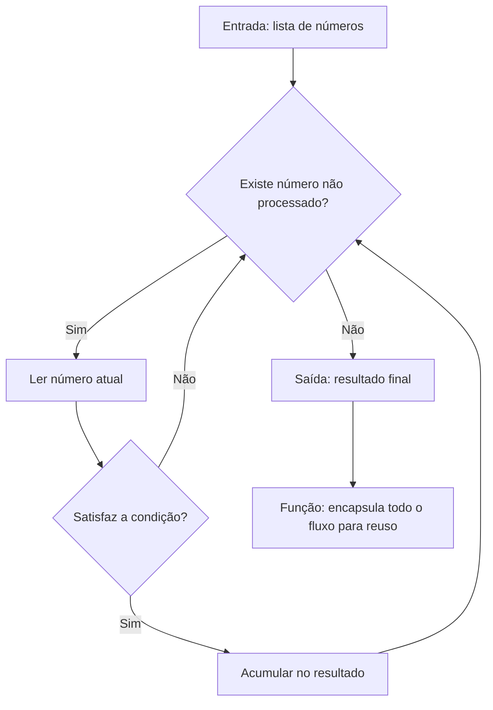

# Capítulo 1: O que é Programar: Lógica Essencial

## 1. Introdução

Você chegou até aqui por um motivo: quer dominar a disciplina que mais transformou a indústria de software desde 2022 — o desenvolvimento dirigido por IA. E a primeira verdade que precisa ouvir é desconfortável: nenhuma ferramenta agêntica do mercado substitui a capacidade humana de pensar algoritmicamente [1]. Os agentes escrevem código em velocidade impressionante, mas quem não sabe o que é uma variável, uma condição ou um loop não consegue nem mesmo avaliar se o que o agente produziu está correto [2]. Este capítulo constrói exatamente essa fundação: a lógica essencial de programação, ensinada sem a exigência de dominar uma linguagem específica, porque o objetivo da série é formar um profissional fluente em AI-Driven Development — e fluência começa na leitura, não na escrita [3].

Ao final deste capítulo, você será capaz de ler um programa simples e dizer o que ele faz, decompor um problema do dia a dia em passos executáveis por uma máquina e, sobretudo, entender por que os agentes de IA conseguem programar — e por que o humano da equação precisa continuar no centro das decisões [4]. Essa é a base sobre a qual todo o restante da série se apoia: sem lógica, não há contexto; sem contexto, não há harness. O domínio do controle de versão, por exemplo, será um pré-requisito direto do Capítulo 3, e o entendimento do que o modelo vê será ampliado no Capítulo 7 [5].

## 2. Explica

### 2.1 O que é um Programa, Afinal

Um programa é uma sequência de instruções que uma máquina executa para transformar uma entrada em uma saída. A definição parece simples, mas carrega uma consequência profunda: programar é, essencialmente, o ato de traduzir intenção humana para um formato que uma máquina consiga executar de forma determinística [1]. Quando você pede a um agente de IA para "criar uma função que calcule a média de uma lista", o agente está fazendo exatamente essa tradução — e o modelo que ele usa aprendeu a fazê-la observando bilhões de exemplos de código durante o treinamento [2]. Esse processo de tradução é o mesmo que o Karpathy descreve ao falar de Software 3.0: o programa passa a nascer em linguagem natural e a ser interpretado por modelos, mas a lógica subjacente permanece a mesma [18].

### 2.2 Variáveis e Tipos: a Memória do Programa

Toda linguagem de programação trabalha com o mesmo conceito fundamental: a variável. Uma variável é um nome que aponta para um valor armazenado em memória. Pense em uma gaveta etiquetada: o rótulo é o nome da variável, e o conteúdo da gaveta é o valor [6]. Os valores podem ser de tipos diferentes — números inteiros, números decimais, textos, valores lógicos (verdadeiro ou falso) e estruturas mais complexas. A distinção entre tipos importa porque a máquina trata cada um de forma diferente: somar dois números inteiros é uma operação aritmética; "somar" dois textos é uma concatenação [3]. No contexto agêntico, essa distinção aparece toda vez que um modelo decide o formato de um argumento ao chamar uma ferramenta [7].

### 2.3 Condicionais: a Lógica de Decisão

Se programar fosse apenas armazenar valores, seria trivial. O que dá poder ao software é a capacidade de decidir. As estruturas condicionais — o famoso "se... então... senão..." — permitem que o programa tome caminhos diferentes dependendo do estado dos dados [1]. É exatamente essa capacidade que os agentes de IA usam o tempo todo: quando um modelo decide se deve chamar uma ferramenta ou responder diretamente, ele está, em última instância, executando uma lógica condicional sobre o conteúdo da conversa [7]. A documentação de function calling da OpenAI descreve precisamente esse ciclo: o modelo analisa o pedido, decide que precisa de dados externos e retorna uma chamada estruturada em vez de texto livre [7]. O guia de function calling da Prompting Guide detalha o mesmo mecanismo em termos de ferramentas definidas por JSON Schema [8].

### 2.4 Loops: a Repetição Controlada

A terceira peça fundamental é a repetição. Loops permitem executar o mesmo bloco de instruções múltiplas vezes, seja um número fixo de vezes (loop com contador) ou enquanto uma condição for verdadeira (loop condicional) [3]. A capacidade de repetir é o que permite processar listas, percorrer arquivos e iterar sobre dados — tarefas que constituem a maior parte do trabalho real de um sistema de software. No mundo agêntico, loops aparecem no chamado "agent loop": o ciclo ação → observação → decisão que um agente repete até concluir a tarefa [4]. Cada iteração consome tokens da janela de contexto, o que torna a eficiência dos loops uma preocupação de engenharia — e não apenas de lógica [9].

### 2.5 Funções: o Bloco de Construção Reutilizável

Funções são blocos de código nomeados que recebem entradas (parâmetros), executam um conjunto de instruções e produzem uma saída. Elas existem por um motivo simples: evitar repetição e organizar o pensamento [1]. Quando você nomeia uma operação e a encapsula, passa a poder reutilizá-la em qualquer ponto do programa — e, mais importante, passa a poder pensar sobre ela em um nível mais alto de abstração. Essa é a mesma razão pela qual os agentes de IA organizam seu trabalho em módulos e arquivos: abstração é a ferramenta que torna o software compreensível [3]. E é também a razão pela qual o ecossistema de instruções persistentes como AGENTS.md ganhou força: arquivos de diretrizes funcionam como "funções" de comportamento que os agentes reutilizam em cada execução [10].

### 2.6 O Pensamento Algorítmico

Algoritmo é o nome técnico para a receita: uma sequência finita de passos bem definidos que resolve um problema. O pensamento algorítmico é a habilidade de transformar um problema vago — "organizar minha lista de contatos" — em passos precisos — "comparar dois a dois e trocar de posição se estiverem fora de ordem" [1]. Essa habilidade não é inata; é treinada. E é a habilidade mais valiosa na era da IA, porque os agentes executam algoritmos com perfeição, mas não decidem qual algoritmo é o certo para o seu problema [2]. O framework clássico de agentes autônomos proposto por Lilian Weng formaliza isso: o agente é a combinação de LLM, memória, planejamento e ferramentas — e o planejamento depende exatamente da mesma decomposição algorítmica que você está aprendendo aqui [11].

### 2.7 Erros como Ferramenta de Aprendizado

Um aspecto que os iniciantes subestimam é o papel do erro no aprendizado de lógica. Cada erro de sintaxe, cada resultado inesperado e cada exceção é um sinal de que o modelo mental do programa não corresponde à realidade [5]. O desenvolvedor experiente não evita erros — ele os sistematiza: anota o que previu, o que aconteceu e por que divergiu. Esse hábito de hipótese e verificação é o mesmo método científico que os agentes de IA usam quando rodam testes e corrigem código em loop [4]. Na era do desenvolvimento dirigido por IA, quem domina esse ciclo — formular, testar, corrigir — supera quem apenas aceita a primeira resposta [2].

### 2.8 A Importância da Precisão na Comunicação

Programar é, no fundo, um exercício de comunicação precisa. A máquina não infere intenção: ela executa exatamente o que está escrito [1]. Um sinal de pontuação a mais, um tipo incorreto, uma condição invertida — e o comportamento muda por completo. Essa exigência de precisão é a mesma que os prompts e os arquivos de instrução dos agentes exigem: AGENTS.md funciona porque elimina a ambiguidade que a linguagem natural naturalmente carrega [10]. Quando você aprende a pensar algoritmicamente, aprende também a se comunicar de forma inequívoca — a habilidade mais transferível de toda a série [3].

### 2.9 Como a Lógica se Manifesta nas Diferentes Linguagens

Uma dúvida comum de quem começa é: "qual linguagem devo aprender?" A resposta da série é: nenhuma em específico — porque a lógica transcende a sintaxe [1]. O `if` em Python, o `if` em JavaScript e o `if` em Java fazem a mesma coisa com grafias diferentes. A variável, a condição e o loop existem em praticamente todas as linguagens imperativas; o que muda é a forma de escrever, não a estrutura do pensamento [3]. Por isso este capítulo foi construído com Python sem exigir que você o domine: o objetivo é que você reconheça os padrões, não que decore a sintaxe [2]. Quando um agente de IA escreve código em uma linguagem que você nunca usou, você consegue avaliá-lo porque a lógica é a mesma — e é essa capacidade que os profissionais da era agêntica mais valorizam [3].

### 2.10 A Relação entre Lógica e Dados

Há ainda uma dimensão da lógica que merece atenção desde o início: os dados. Todo programa manipula dados — e a qualidade da lógica não compensa a má qualidade dos dados [1]. Um programa com lógica perfeita que recebe dados errados produz resultados errados; o ditado do mundo de dados "garbage in, garbage out" é a outra face do pensamento algorítmico [3]. Essa relação será central nos livros seguintes: na engenharia de contexto, a curadoria dos dados que entram na janela do modelo é decisão de arquitetura [9]; na engenharia de harnesses, a validação de dados é parte do loop de qualidade [15]. Desde já, cultive o hábito de questionar a entrada antes de confiar na saída — o mesmo reflexo que você aplicará ao avaliar o que um agente produz [2].

### 2.11 Síntese: O Mapa Mental do Capítulo

Antes de passar para as ilustrações, vale consolidar o mapa mental deste capítulo. A lógica de programação se organiza em quatro níveis: os elementos (variáveis e tipos), as estruturas de controle (condicionais e loops), os blocos reutilizáveis (funções e módulos) e a habilidade transversal (o pensamento algorítmico) [1]. Cada nível se apoia no anterior — e todos se apoiam na ideia central de que programar é traduzir intenção em instrução determinística [3]. Esse mapa reaparece, ampliado, nos capítulos seguintes: o Capítulo 2 expande os blocos reutilizáveis com leitura de código; o Capítulo 4 transforma as estruturas de controle em testes; e os Capítulos 7 e 8 mostram como os modelos de linguagem implementam — estatisticamente — os mesmos níveis [2]. Ter o mapa claro desde o início torna cada capítulo seguinte mais rápido de absorver [1]. O pensamento algorítmico é a habilidade de transformar um problema vago — "organizar minha lista de contatos" — em passos precisos — "comparar dois a dois e trocar de posição se estiverem fora de ordem" [1]. Essa habilidade não é inata; é treinada. E é a habilidade mais valiosa na era da IA, porque os agentes executam algoritmos com perfeição, mas não decidem qual algoritmo é o certo para o seu problema [2]. O framework clássico de agentes autônomos proposto por Lilian Weng formaliza isso: o agente é a combinação de LLM, memória, planejamento e ferramentas — e o planejamento depende exatamente da mesma decomposição algorítmica que você está aprendendo aqui [11].

## 3. Ilustra

### 3.1 A Analogia da Cozinha

Imagine uma cozinha profissional. O chefe (o programador) recebe um pedido (o problema). Os ingredientes na despensa são as variáveis. A receita escrita é o algoritmo. Os utensílios são as funções — cada um especializado em uma tarefa e reutilizável em centenas de pratos diferentes. Agora imagine que, em 2026, um "agente-chef" assistido por IA consiga ler milhares de receitas e sugerir pratos completos em segundos [12]. O chef humano não é substituído: é ele quem decide se o prato sugerido faz sentido, se os ingredientes combinam e se a receita respeita as restrições do restaurante. Na cozinha, como no software, o valor está na curadoria e na decisão — não na execução mecânica [11]. Assim como um chef experiente não precisa decorar cada receita — ele domina as técnicas fundamentais e as combina —, você não precisa memorizar sintaxe de todas as linguagens: precisa dominar a lógica e ler o que a máquina produz [3].

### 3.2 O Diagrama do Fluxo de Decisão



### 3.3 A Cozinha em Escala: da Receita Individual ao Cardápio Completo

A analogia da cozinha ganha uma dimensão nova quando pensamos em escala. O chef individual (você no início) prepara um prato por vez. O chef de cozinha industrial (o profissional que você está se tornando) gerencia um cardápio inteiro, com equipes, estoque e padrões de qualidade [2]. No desenvolvimento de software, a escala funciona igual: o iniciante escreve uma função; o profissional orquestra sistemas — e, em 2026, orquestra agentes que escrevem funções por ele [3]. A transição de chef individual para gestor de cozinha é exatamente a transição que a série completa descreve: da primeira linha de código à engenharia de sistemas autônomos de IA em produção [1]. O que sustenta essa transição não é conhecer mais receitas — é dominar as técnicas fundamentais e saber delegar com critério [4].

### 3.4 O que o Agente Vê Quando Programa

Quando você pede a um agente de IA para escrever código, o que ele vê é uma sequência de tokens — fragmentos de texto que o modelo processa através de um mecanismo de atenção [13]. Ele não "entende" o programa como você entende; ele calcula, a cada passo, qual é o próximo token mais provável dado todo o contexto anterior. Isso explica duas coisas: a velocidade impressionante e a necessidade absoluta de validação humana. O modelo acerta estatisticamente, mas não sabe o que é certo [14]. Os limites desse processo — e as alucinações que dele derivam — serão explorados em profundidade no Capítulo 8, quando estudarmos atenção, amostragem e alucinação.

### 3.5 A Diferença entre Executar e Compreender

A analogia da cozinha revela ainda uma distinção crucial: executar uma receita não é o mesmo que compreendê-la. O agente-chef executa receitas com perfeição estatística, mas não "compreende" por que o fermento faz o bolo crescer [2]. O chef humano que compreende pode adaptar a receita a um ingrediente faltante, pode diagnosticar por que o bolo murchou e pode ensinar o prato a outros. Na programação, a mesma distinção separa quem executa instruções de quem entende o sistema [1]. Um agente que recebe o código e o executa está operando no nível da receita; você, que entende a lógica, opera no nível da compreensão — e pode decidir quando a receita deve ser alterada [3]. Essa é a base filosófica de toda a série: a IA executa a pilha, o humano compreende a pilha [4].

### 3.6 Visualizando o Fluxo: Mapa do Raciocínio Lógico

O diagrama deste capítulo mostra o fluxo de decisão de um programa. Vale treinar a leitura dele como quem lê um mapa: o retângulo é uma ação, o losango é uma decisão, as setas indicam o fluxo [1]. Esse mesmo vocabulário visual — ações, decisões, fluxos — reaparece em toda a série: os agentes desenham planos de execução, os harnesses descrevem loops e os diagramas de arquitetura dos Capítulos 5 e 6 usam os mesmos elementos [3]. Aprender a ler diagramas de fluxo agora é aprender a ler a planta de qualquer sistema agêntico depois [2]. O agente-chef executa receitas com perfeição estatística, mas não "compreende" por que o fermento faz o bolo crescer [2]. O chef humano que compreende pode adaptar a receita a um ingrediente faltante, pode diagnosticar por que o bolo murchou e pode ensinar o prato a outros. Na programação, a mesma distinção separa quem executa instruções de quem entende o sistema [1]. Um agente que recebe o código e o executa está operando no nível da receita; você, que entende a lógica, opera no nível da compreensão — e pode decidir quando a receita deve ser alterada [3]. Essa é a base filosófica de toda a série: a IA executa a pilha, o humano compreende a pilha [4].

## 4. Técnica

### 4.1 Seu Primeiro Programa

Vamos colocar a mão na massa com Python — a linguagem mais usada no ecossistema de IA e a mais legível para iniciantes. O programa abaixo exercita exatamente os quatro pilares que acabamos de estudar: variáveis, condicionais, loops e funções [3].

```python
def calcular_media_ponderada(notas, pesos):
    """Calcula a média ponderada de uma lista de notas."""
    if len(notas) != len(pesos):
        raise ValueError("notas e pesos devem ter o mesmo tamanho")
    total = 0.0          # variável acumuladora (inicialização)
    soma_pesos = 0.0
    for nota, peso in zip(notas, pesos):   # loop sobre pares
        total += nota * peso               # acumula o produto
        soma_pesos += peso
    if soma_pesos == 0:                    # condicional de guarda
        return 0.0
    return total / soma_pesos              # saída da função


def classificar_media(media):
    """Classifica a média em conceitos de A a F (decisão encadeada)."""
    if media >= 9.0:
        return "A"
    elif media >= 7.5:
        return "B"
    elif media >= 6.0:
        return "C"
    elif media >= 5.0:
        return "D"
    else:
        return "F"


if __name__ == "__main__":
    notas = [8.5, 7.0, 9.2]
    pesos = [2.0, 3.0, 5.0]
    media = calcular_media_ponderada(notas, pesos)
    print(f"Media ponderada: {media:.2f} -> conceito {classificar_media(media)}")
```

### 4.2 Decompondo o Problema

Observe como o programa foi construído: primeiro, definimos o domínio (notas e pesos); depois, isolamos a lógica de cálculo em uma função pura; em seguida, isolamos a decisão de classificação em outra função; e, por fim, orquestramos tudo no bloco principal [1]. Essa decomposição — separar cálculo, decisão e orquestração — é a essência do pensamento algorítmico aplicado. É o mesmo padrão que os agentes de IA seguem quando estruturam uma solução em múltiplos arquivos [3]. E é o mesmo padrão que a especificação AGENTS.md recomenda para arquivos de instrução: um arquivo, uma responsabilidade, máximo de clareza [10].

### 4.3 Validando o Programa

Rode o programa acima em qualquer interpretador Python (inclusive no terminal de um agente de IA). O resultado esperado é: `Media ponderada: 8.29 -> conceito B`. Se o seu resultado for diferente, o fluxo de execução não é o que você imaginou — e esse diagnóstico é exatamente o treino de lógica que você precisa [6]. Esse hábito — prever o resultado antes de executar e comparar com o real — é o germe do que, nos Capítulos 4 e 8, vai se transformar em testes automatizados e em validação adversarial de agentes [15].

### 4.4 Casos de Borda: Onde a Lógica é Testada de Verdade

Um programa que funciona para a entrada óbvia não é um programa confiável — é um programa que ainda não foi desafiado [1]. Os casos de borda são as entradas no limite do domínio: listas vazias, valores zerados, números negativos, entradas máximas, entradas inesperadas. Cada caso de borda que você testa revela uma suposição escondida no seu raciocínio [5]. No programa da média ponderada, experimente: notas com pesos zerados, lista vazia, valores negativos, pesos negativos. O que acontece? O código atual trata pesos zerados com a guarda `if soma_pesos == 0`; mas pesos negativos passariam despercebidos [1]. Identificar esses buracos é a diferença entre um programa que funciona no seu computador e um que funciona para o mundo — e é exatamente o que os testes automatizados do Capítulo 4 vão formalizar [15].

### 4.5 O Papel do Código Legível

Há uma qualidade que atravessa todo código profissional e que os iniciantes subestimam: a legibilidade. Código legível é código que outro humano — ou outro agente — consegue entender sem esforço [3]. Nomes descritivos, funções pequenas, comentários que explicam o porquê e não o quê. Essa qualidade não é estética: é engenharia, porque código legível é código que se mantém, se revisa e se corrige com segurança [1]. Os arquivos de instrução dos agentes — AGENTS.md — seguem o mesmo princípio: regras claras e organizadas que outra máquina consegue seguir sem ambiguidade [10]. Ao escrever seus primeiros programas, cultive a legibilidade desde o início — ela é o alicerce do trabalho em equipe e do trabalho com agentes [3].

### 4.6 A Anatomia de uma Função Bem Projetada

Para fechar a parte técnica, vamos dissecar o que torna uma função bem projetada — porque esse é o padrão que você vai reconhecer (e exigir) em todo código, incluindo o que os agentes produzem [1]. Uma boa função tem: um nome que descreve o comportamento (verbo + objeto), uma entrada mínima e explícita, um retorno previsível e um corpo que faz uma única coisa [3]. A função `calcular_media_ponderada` exemplifica: o nome diz o que faz, os parâmetros `notas` e `pesos` são explícitos, o retorno é sempre um número e o corpo resolve um único problema [1].

### 4.7 Exercícios Guiados de Lógica

Para consolidar a técnica, resolva estes quatro exercícios — cada um mira um dos pilares do capítulo [1]. Primeiro, variáveis e tipos: escreva um programa que receba um texto e um número e imprima o texto repetido aquele número de vezes, tratando o caso de número negativo. Segundo, condicionais: escreva uma função que classifique uma idade em criança, adolescente, adulto ou idoso, definindo você mesmo as faixas. Terceiro, loops: escreva um programa que receba uma lista de números e devolva o maior, sem usar a função pronta de máximo — o exercício força você a pensar no acumulador [5]. Quarto, funções: refatore o programa da média ponderada para extrair a leitura dos dados em uma função separada da calculadora — exercitando a separação de responsabilidades que discutimos [1]. Rode cada solução, teste casos de borda e, se quiser, peça a um agente para comparar a sua abordagem [3].

### 4.8 Verificando a Própria Compreensão

Antes de avançar, faça uma autoavaliação honesta. Você consegue explicar, sem consultar o texto, o que é uma variável e para que serve um tipo? Consegue descrever em que situação se usa um loop em vez de uma condicional? Consegue dizer por que funções melhoram a legibilidade? Se a resposta for não a qualquer uma delas, volte às seções 2.2 a 2.5 e releia com o programa do capítulo aberto à frente [1]. A autoavaliação é parte do método da série: cada capítulo termina com a verificação do que foi construído — porque a pilha só sobe se cada camada estiver firme [3]. Uma boa função tem: um nome que descreve o comportamento (verbo + objeto), uma entrada mínima e explícita, um retorno previsível e um corpo que faz uma única coisa [3]. A função `calcular_media_ponderada` exemplifica: o nome diz o que faz, os parâmetros `notas` e `pesos` são explícitos, o retorno é sempre um número e o corpo resolve um único problema [1]. Quando você avalia código de agentes, use a mesma régua: se a função faz três coisas, se o nome não descreve o comportamento ou se o retorno depende de estado escondido, o código precisa de revisão [3]. Esse critério de qualidade — simples de enunciar, difícil de automatizar — é parte do que torna o humano insubstituível na orquestração de agentes [2].

## 5. Aplica

### 5.1 Onde Isso Vive no Mundo Real

Cada um desses conceitos tem correspondência direta no software que você usa todos os dias. O carrinho de compras de um e-commerce usa condicionais para aplicar descontos, loops para somar itens e funções para calcular frete [1]. Um sistema bancário usa funções para validar transferências e condicionais para verificar saldo. E, no mundo agêntico de 2026, os próprios agentes usam esses mesmos blocos: um agente que organiza seu repositório Git está executando loops sobre arquivos e condicionais sobre estados de mudança [16]. As estratégias de organização desse trabalho — Git Flow, GitHub Flow ou trunk-based — são, elas mesmas, decisões algorítmicas sobre como dividir o esforço [20]. Quando um agente de coding navega por um repositório e decide quais arquivos alterar, ele aplica a mesma estrutura de decisão que você acabou de ver no diagrama [12].

### 5.2 O Erro Comum do Iniciante na Era da IA

Você, leitor, está em uma posição única: vai aprender programação em um momento em que a maioria das pessoas pula direto para o "deixa o agente fazer". O erro comum é exatamente esse: delegar sem saber avaliar. A pessoa pede ao agente uma função, o agente entrega, a pessoa cola sem ler e descobre semanas depois que a função falha em um caso específico [2]. A correção — e aqui está o diferencial que separa o profissional do curioso — é inverter o fluxo: primeiro você entende o problema, depois avalia o que o agente produziu, testa com casos próprios e só então integra. Na prática: rode o código, introduza casos de borda (lista vazia, pesos zerados, notas negativas) e veja se o comportamento é o esperado [11]. Esse hábito de questionamento é o que transforma um consumidor de IA em um engenheiro dirigido por IA. A mesma disciplina vale para os dados que alimentam o agente: contexto mal curado produz código mal gerado [17].

### 5.3 O Papel do Desenvolvedor em 2026

Em agosto de 2026, cerca de 92% dos desenvolvedores nos Estados Unidos usam ferramentas de IA diariamente — mas a confiança na exatidão do código gerado caiu para 29% [19]. Isso significa que o mercado precisa, mais do que nunca, de pessoas que consigam ler e validar código. O desenvolvedor moderno é arquiteto, especificador e revisor: define as restrições, escreve a especificação e audita o que a máquina produziu [3]. Nenhuma dessas funções é possível sem a base que você está construindo agora. Estudos empíricos recentes confirmam a direção: arquivos de instrução bem estruturados reduzem o tempo de execução de agentes em quase 29% — mas apenas quando o humano sabe o que está pedindo [10].

### 5.4 A Rotina de Estudo do Desenvolvedor Dirigido por IA

Para transformar os conceitos deste capítulo em hábito, adote uma rotina de prática deliberada. Primeiro, o exercício de tradução: pegue um problema do seu cotidiano — calcular o troco de uma compra, ordenar uma lista de tarefas por prioridade — e escreva os passos em linguagem natural, sem código. Segundo, o exercício de leitura: abra um projeto de código aberto em qualquer linguagem e identifique, apenas pela leitura, as variáveis, as condicionais, os loops e as funções [5]. Terceiro, o exercício de comparação: peça a um agente de IA para resolver o mesmo problema e compare a solução dele com a sua — não para julgar, mas para entender abordagens diferentes [2]. Essa rotina de trinta minutos por dia constrói, em semanas, a fluência que a maioria dos profissionais levou anos para adquirir [1].

### 5.5 Quando a Lógica Falha: Debugando o Pensamento

O momento mais importante da prática é quando algo falha — e no início, algo sempre falha. A falha não é o fracasso do seu raciocínio; é a revelação de uma suposição incorreta [5]. O método de depuração do pensamento segue três perguntas: o que eu esperava que acontecesse? O que aconteceu de fato? Qual suposição minha está errada? [1] Esse método é o mesmo que os depuradores profissionais usam com código — e o mesmo que os agentes de IA aplicam quando um teste falha e eles reavaliam a hipótese [4]. Ao internalizar esse ciclo, você deixa de temer erros e passa a usá-los como combustível do aprendizado — a marca registrada dos profissionais que a série forma [3].

### 5.6 O Ecossistema Profissional em que Você Está Entrando

Para situar você no contexto profissional, vale descrever o ecossistema que encontrará ao dominar a pilha agêntica. Em 2026, o desenvolvimento de software acontece em três camadas de maturidade [19]. Na primeira, o profissional usa ferramentas de autocomplete e chat — o Copilot, o ChatGPT — para acelerar o trabalho manual. Na segunda, o profissional orquestra agentes que executam tarefas completas — criação de branches, implementação, testes — e revisa o resultado [13]. Na terceira, o profissional projeta os próprios sistemas agênticos: define as regras, os contextos, os harnesses e as avaliações que governam times inteiros de agentes [2]. Este livro e os dez que o seguem formam a trilha da segunda para a terceira camada — e a lógica que você aprende aqui é o primeiro degrau [1].

### 5.7 A Ética do Desenvolvimento Dirigido por IA

Um tema que a série trata desde o início é a responsabilidade de quem desenvolve com IA. A capacidade de gerar código em escala traz consigo a responsabilidade de governar a qualidade — e de entender o que está sendo gerado [2]. O profissional que não entende a lógica não consegue ser responsável pelo código que assina, mesmo que não o tenha escrito [1]. A validação, que você começou a praticar com casos de borda, é um dever profissional na era agêntica: o código gerado por IA não é isento de revisão — é justamente o que mais exige revisão [4]. Essa postura ética — autonomia com governança — é o fio condutor de toda a série, e você acaba de plantá-la [3].

### 5.8 Glossário Rápido do Capítulo

Para fechar a parte aplicada, um glossário rápido dos termos que você dominou: variável é um nome que aponta para um valor em memória; tipo define como a máquina interpreta um valor; condicional é a estrutura que decide entre caminhos; loop repete um bloco enquanto uma condição vale; função encapsula um comportamento reutilizável com entrada e saída definidas; algoritmo é a sequência finita de passos que resolve um problema; e pensamento algorítmico é a habilidade de decompor problemas em passos precisos [1]. Esse vocabulário — que parecerá básico daqui a alguns volumes — é exatamente o que permite conversar com precisão sobre código, com humanos e com agentes [3]. Guarde o glossário: ele será a base das definições formais dos próximos capítulos [1].

## 6. Conclusão

Neste capítulo, você construiu a fundação lógica da série: entendeu que um programa é uma sequência de instruções que traduz intenção em execução; dominou os quatro blocos essenciais — variáveis, condicionais, loops e funções; e descobriu que o pensamento algorítmico é a habilidade que separa quem usa IA de quem dirige IA [1]. Você também aprendeu que o erro é ferramenta de aprendizado, que a precisão na comunicação é parte da programação e que executar uma receita não é o mesmo que compreendê-la — a distinção que sustenta o papel do humano na era agêntica [3]. Cada seção deste capítulo teve um propósito: a lógica essencial te dá o vocabulário, a analogia da cozinha te dá a intuição, a técnica te dá as mãos e as aplicações te situam no mercado [1].

### O Caminho à Frente

A jornada que você inicia agora tem uma estrutura clara. O Livro 1 constrói o chão; os livros seguintes constroem as camadas sobre ele. No Livro 2, você vai dominar a engenharia de prompts; no Livro 3, a engenharia de contexto — a disciplina que aprendeu a valorizar neste capítulo ao descobrir que contexto mal curado produz código mal gerado [17]. No Livro 5, você vai estudar as regras persistentes (Rules Engineering) que organizam o comportamento dos agentes da mesma forma que as funções organizam o seu código [10]. E no Livro 7, os harnesses que automatizam a validação que você começou a praticar com os casos de borda [15]. Cada camada pressupõe o chão que você está construindo agora — por isso a série insiste: não pule a fundação [2].

### O Desafio Deste Capítulo

Para fixar o aprendizado, complete o desafio em três níveis. Nível um: explique, em linguagem natural, o algoritmo para preparar um café — sem mencionar código. Nível dois: identifique, em um programa de código aberto que você escolher, três variáveis, duas condicionais, um loop e duas funções, anotando o que cada um faz. Nível três: peça a um agente de IA para calcular a média ponderada das notas do seu último ano e compare a solução com a deste capítulo — aponte uma diferença de abordagem e decida qual é mais legível [1]. Os três níveis exercitam, respectivamente, o pensamento algorítmico, a leitura de código e a avaliação de agentes — as três habilidades que o restante da série vai refinar [3]. A conclusão mais importante, porém, é comportamental: na era dos agentes autônomos, a capacidade de ler e validar código tornou-se mais valiosa do que a capacidade de escrevê-lo [2]. O agente é um executante brilhante; o engenheiro é quem define o que vale a pena executar [11].

Resumindo o capítulo em três pontos: primeiro, programa é tradução de intenção em execução determinística [1]; segundo, os quatro blocos — variáveis, condicionais, loops e funções — cobrem a maior parte da lógica de qualquer sistema [3]; terceiro, o pensamento algorítmico e a leitura de código são as habilidades que a era agêntica mais valoriza [2]. Guarde esses três pontos: eles serão retomados, explicitamente, ao longo de toda a série [1].

No próximo capítulo, vamos aprofundar exatamente essa capacidade: como ler código com fluência, como reconhecer padrões estruturais em funções e módulos e como interpretar as mensagens de erro que — invariavelmente — aparecerão no seu caminho e no caminho dos agentes que você orquestrar [6]. A leitura de código, que já começamos a praticar com o programa da média ponderada, é a porta de entrada para avaliar com critério o que as máquinas produzem — e é dela que depende toda a sua autonomia nos próximos volumes [3].

## 7. Referências Bibliográficas

[1] KARPATHY, Andrej. Software 3.0: Software in the Age of AI. Disponível em: https://www.latent.space/p/s3. Acesso em: 5 ago. 2026.

[2] CODERABBIT. From Copilot to agents: The history of AI coding. Disponível em: https://www.coderabbit.ai/blog/a-very-brief-history-of-ai-coding-from-copilot-to-next-gen-agents. Acesso em: 5 ago. 2026.

[3] SITEPOINT. Vibe Coding 2026: The Complete Guide to AI-First Development. Disponível em: https://www.sitepoint.com/vibe-coding-2026-complete-guide/. Acesso em: 5 ago. 2026.

[4] WENG, Lilian. LLM-Powered Autonomous Agents. Disponível em: https://lilianweng.github.io/posts/2023-06-23-agent/. Acesso em: 5 ago. 2026.

[5] OPENAI / AGENTS.MD FOUNDATION. Open Standards for Agentic Configuration (AGENTS.md). Disponível em: https://agents.md/. Acesso em: 5 ago. 2026.

[6] CHACON, Scott; STRAUB, Ben. Pro Git. 2. ed. Apress/Git SCM, 2014. Disponível em: https://git-scm.com/book/en/v2. Acesso em: 5 ago. 2026.

[7] OPENAI. Function Calling Guide. Disponível em: https://developers.openai.com/api/docs/guides/function-calling. Acesso em: 5 ago. 2026.

[8] PROMPTING GUIDE. Function Calling in AI Agents. Disponível em: https://www.promptingguide.ai/agents/function-calling. Acesso em: 5 ago. 2026.

[9] ANTHROPIC. Effective Context Engineering for AI Agents. Disponível em: https://www.anthropic.com/engineering/effective-context-engineering-for-ai-agents. Acesso em: 5 ago. 2026.

[10] LULLA, Jai Lal; et al. On the Impact of AGENTS.md Files on the Efficiency of AI Coding Agents. Disponível em: https://arxiv.org/html/2601.20404v1. Acesso em: 5 ago. 2026.

[11] WENG, Lilian. LLM-Powered Autonomous Agents. Disponível em: https://lilianweng.github.io/posts/2023-06-23-agent/. Acesso em: 5 ago. 2026.

[12] MIGHTYBOT. Best AI Coding Agents in 2026, Ranked. Disponível em: https://mightybot.ai/blog/coding-ai-agents-for-accelerating-engineering-workflows/. Acesso em: 5 ago. 2026.

[13] OPENAI. Tokenizer (ferramenta interativa). Disponível em: https://platform.openai.com/tokenizer. Acesso em: 5 ago. 2026.

[14] WENG, Lilian. Extrinsic Hallucinations in LLMs. Disponível em: https://lilianweng.github.io/posts/2024-07-07-hallucination/. Acesso em: 5 ago. 2026.

[15] FOWLER, Martin. Continuous Integration. Disponível em: https://martinfowler.com/articles/continuousIntegration.html. Acesso em: 5 ago. 2026.

[16] GITHUB DOCS. About branches. Disponível em: https://docs.github.com/en/pull-requests/collaborating-with-pull-requests/proposing-changes-to-your-work-with-pull-requests/about-branches. Acesso em: 5 ago. 2026.

[17] TIAN PAN. CLAUDE.md and AGENTS.md: The Configuration Layer That Makes AI Coding Agents Actually Follow Your Rules. Disponível em: https://tianpan.co/blog/2026-02-25-claude-md-agents-md-ai-coding-agent-instruction-files. Acesso em: 5 ago. 2026.

[18] KARPATHY, Andrej. Sequoia Ascent 2026 Summary (Software 3.0 & Agentic Engineering). Disponível em: https://karpathy.bearblog.dev/sequoia-ascent-2026/. Acesso em: 5 ago. 2026.

[19] KEYHOLE SOFTWARE. Vibe Coding Trends 2026: Adoption, Productivity, and Code Quality Data. Disponível em: https://keyholesoftware.com/vibe-coding-trends-2026/. Acesso em: 5 ago. 2026.

[20] ATLASSIAN. Git branching strategies. Disponível em: https://www.atlassian.com/git/tutorials/comparing-workflows. Acesso em: 5 ago. 2026.
