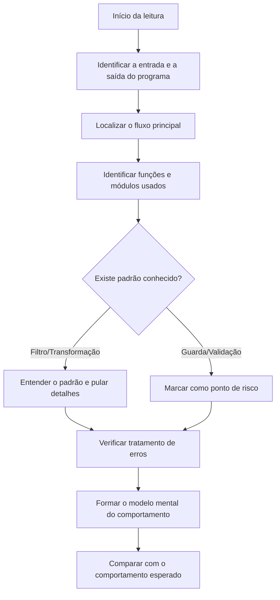

# Capítulo 2: Ler e Escrever Código: Funções, Módulos e Erros

## 1. Introdução

No Capítulo 1, você construiu a fundação lógica: variáveis, condicionais, loops, funções e o pensamento algorítmico. Agora vamos dar o próximo passo — e ele é mais importante do que parece. Na era do desenvolvimento dirigido por IA, a habilidade profissional mais valiosa não é escrever código do zero; é ler código com fluência, reconhecer padrões estruturais e interpretar erros com precisão [1]. Quando um agente entrega uma solução, quem decide se ela é boa é você. E você só consegue decidir se consegue ler [2].

Este capítulo desenvolve três capacidades: primeiro, você vai aprender a reconhecer os padrões estruturais que se repetem em funções e módulos — os "blocos" da arquitetura de software; segundo, vai aprender a interpretar mensagens de erro e stack traces, a linguagem que a máquina usa para dizer o que deu errado; e, terceiro, vai colocar tudo em prática lendo e modificando um programa real sem precisar dominar a linguagem por completo [3]. Ao final, a leitura de código deixa de ser intimidadora e passa a ser um hábito — o mesmo hábito que os agentes de IA usam para navegar repositórios e entender sistemas inteiros [4].

## 2. Explica

### 2.1 Funções: O Contrato Entre o que Entra e o que Sai

Uma função é um contrato: recebe entradas bem definidas, executa uma transformação e devolve uma saída. O que torna uma função bem projetada é a clareza desse contrato — nome que diz o que faz, parâmetros que descrevem o que espera, retorno que diz o que entrega [1]. Na engenharia de software, esse princípio é conhecido como design de módulos profundos: a interface é pequena e clara, mas o comportamento interno resolve um problema complexo [2]. É o mesmo princípio que rege as ferramentas que um agente de IA expõe: cada ferramenta tem um nome, uma descrição e um esquema de parâmetros — um contrato que o modelo aprende a usar [12].

### 2.2 Módulos: Organizando o Pensamento em Arquivos

Quando funções crescem em número, o próximo nível de organização são os módulos — arquivos que agrupam funções relacionadas. Um módulo bem nomeado comunica seu propósito antes mesmo de você abri-lo: `pagamento.py` deve conter lógica de pagamento, `autenticacao.py` deve conter lógica de login [2]. Essa organização é a mesma que os agentes de coding respeitam ao navegar um repositório: eles leem a estrutura de diretórios antes de abrir arquivos, porque a estrutura já é informação [4]. Arquivos de instrução como AGENTS.md funcionam da mesma forma: são o módulo que descreve as convenções do projeto para qualquer agente que chegar [16]. E cada função bem nomeada se comporta como uma ferramenta declarada: o modelo aprende a chamá-la pelo contrato — nome, parâmetros e descrição [15].

### 2.3 Erros: A Linguagem da Máquina

Erros não são fracassos — são comunicação. Quando um programa falha, a máquina emite uma mensagem estruturada que diz exatamente onde e por quê. A mensagem de erro é o contrato inverso: em vez de dizer o que o programa faz, diz o que ele não conseguiu fazer [1]. Aprender a ler erros é aprender o idioma mais importante da programação, porque é o idioma que você (e os agentes) encontra em todas as horas de trabalho. Um agente de IA que recebe uma mensagem de erro durante a execução a usa para corrigir o próprio código — e você precisa fazer o mesmo [14].

### 2.8 Tipos de Erro: Sintaxe, Execução e Lógica

Os erros se organizam em três famílias, e cada uma pede uma estratégia de leitura diferente [1]. O erro de sintaxe é o mais simples: o código não respeita as regras da linguagem — um parêntese faltando, dois pontos esquecidos — e o interpretador recusa antes de executar. O erro de execução (exceção) acontece durante o processamento: dividir por zero, acessar uma lista fora do índice, converter texto inválido em número. O erro de lógica é o mais traiçoeiro: o código roda sem reclamação, mas o resultado está errado — porque a intenção não foi traduzida corretamente [2]. As três famílias exigem reflexos diferentes: os dois primeiros são resolvidos lendo a mensagem; o terceiro, escrevendo testes que definam o comportamento esperado [6].

### 2.9 O Valor do Erro no Trabalho com Agentes

Na era agêntica, a leitura de erros ganha um papel estratégico: o erro é o sinal que o agente usa para iterar [14]. Quando um agente roda um teste, recebe uma falha, corrige e reexecuta, ele está executando um loop de depuração idêntico ao seu [3]. A qualidade do loop depende da qualidade da leitura: um erro mal interpretado produz uma correção errada, que produz outro erro — um ciclo vicioso [14]. O profissional que lê erros com método quebra o ciclo no primeiro passo: interpreta o erro corretamente, forma a hipótese certa e orienta o agente com precisão [2]. Essa é a competência que separa quem supervisiona agentes de quem é refém deles [4]. A mensagem de erro é o contrato inverso: em vez de dizer o que o programa faz, diz o que ele não conseguiu fazer [1]. Aprender a ler erros é aprender o idioma mais importante da programação, porque é o idioma que você (e os agentes) encontra em todas as horas de trabalho. Um agente de IA que recebe uma mensagem de erro durante a execução a usa para corrigir o próprio código — e você precisa fazer o mesmo [14].

### 2.4 Stack Traces: O Rastro da Execução

Quando um erro acontece dentro de várias chamadas aninhadas, a máquina mostra um stack trace: a pilha de chamadas que levou ao ponto da falha. Cada linha do trace é um passo do caminho percorrido — e o topo da pilha indica onde o erro ocorreu de fato [3]. A habilidade de ler um stack trace de baixo para cima, identificando primeiro o arquivo e a linha do erro e depois o caminho de chamadas que o produziu, é o que separa quem depura com método de quem adivinha [5]. Essa mesma habilidade é essencial para avaliar agentes: quando um agente reporta uma falha, o stack trace é a evidência primária do que aconteceu [2]. A mesma disciplina de separar o sinal do ruído aparece na leitura de contexto: quanto maior a janela alimentada, mais a atenção do modelo degrada no meio do caminho [18].

### 2.5 Padrões de Leitura: Reconhecer sem Decorar

Existe um conjunto pequeno de padrões que se repete em praticamente todo código: o padrão de filtro (percorrer e selecionar), o padrão de acumulação (percorrer e somar), o padrão de transformação (mapear cada item), o padrão de guarda (validar antes de prosseguir) [1]. Ao reconhecer esses padrões, você lê código novo como quem reconhece frases em um idioma que já conhece — sem precisar traduzir palavra por palavra. É a mesma fluência que os modelos de linguagem adquirem ao observar bilhões de exemplos: eles reconhecem padrões estatísticos de código [3].

### 2.6 O Nível de Abstração Correto

Um erro de leitura comum é tentar entender tudo ao mesmo tempo — cada variável, cada detalhe de cada função. O leitor fluente sabe alternar entre níveis de abstração: entende o fluxo geral do programa (macro) e desce ao detalhe apenas onde o comportamento é crítico ou duvidoso (micro) [1]. Essa alternância é a mesma que os agentes de IA praticam ao navegar repositórios: leem a estrutura primeiro e mergulham no detalhe sob demanda [4]. O profissional que domina a alternância de níveis lê em minutos o que o iniciante lê em horas — e é essa economia de atenção que a era agêntica recompensa [2].

### 2.7 Nomes como Documentação Viva

A maior parte da documentação de um sistema está nos próprios nomes: variáveis, funções e módulos bem nomeados contam a história do código [1]. Um módulo chamado `pagamento.py` comunica seu propósito antes de ser aberto; uma função chamada `aplicar_desconto` diz o que faz; uma variável chamada `total_do_carrinho` diz o que guarda [2]. Essa prática — nomear com intenção — é a mesma que os arquivos de instrução dos agentes exigem: AGENTS.md funciona porque cada regra é nomeada e organizada com clareza [17]. Ao ler código, pergunte-se: os nomes contam a história? Quando não contam, o código provavelmente precisa de refatoração — uma decisão que o Capítulo 4 vai te dar confiança para tomar com testes [6]. Ao reconhecer esses padrões, você lê código novo como quem reconhece frases em um idioma que já conhece — sem precisar traduzir palavra por palavra. É a mesma fluência que os modelos de linguagem adquirem ao observar bilhões de exemplos: eles reconhecem padrões estatísticos de código [3].

## 3. Ilustra

### 3.1 A Analogia do Chefe de Cozinha

Continuando a analogia da cozinha do Capítulo 1: ler código é como ler uma receita de outro chef. Você não precisa ter cozinhado aquele prato específico para entendê-lo — precisa conhecer as técnicas (funções), a organização da despensa (módulos) e saber interpretar quando algo queimou (erros). Um chef experiente olha uma receita e imediatamente identifica os passos críticos, as decisões de temperatura e os pontos onde o prato pode dar errado [2]. O mesmo acontece com código: o leitor fluente identifica os pontos de risco — onde há validação, onde há acesso a dados externos, onde há repetição que poderia ser uma função [1]. Quando um agente de IA propõe uma mudança, você aplica exatamente esse olhar: identifica os pontos de risco antes de aprovar [4].

### 3.2 O Diagrama de Leitura de um Programa



### 3.3 O Erro como Sinal, não como Obstáculo

Profissionais experientes dizem que boa parte do tempo de programação é passada lendo erros. Isso não é ineficiência — é o método. Cada mensagem de erro contém informação de diagnóstico que, quando lida com atenção, elimina tentativa e erro [5]. Quando um agente de IA roda um teste e recebe uma falha, ele repete exatamente esse ciclo: lê o erro, forma uma hipótese, corrige e reexecuta. O loop do agente — ação, observação, decisão — é a mesma disciplina de depuração que você vai dominar neste capítulo [11].

### 3.4 A Cozinha e o Livro de Receitas: Lendo Projetos Reais

Ampliando a metáfora da cozinha do Capítulo 1: um projeto de software real é como um livro de receitas profissional, com dezenas de pratos interdependentes. O chef que recebe um livro novo não lê da primeira à última página — ele examina o sumário (a estrutura de diretórios), identifica os pratos principais (os módulos centrais), e só então lê a receita específica que precisa (a função-alvo) [1]. Essa é exatamente a rotina de leitura de repositórios que os profissionais — e os agentes — usam [4]. O hábito de começar pela estrutura, e não pelo conteúdo, é o que transforma a leitura de um projeto grande de uma tarefa assustadora em um procedimento administrável [2]. Cada mensagem de erro contém informação de diagnóstico que, quando lida com atenção, elimina tentativa e erro [5]. Quando um agente de IA roda um teste e recebe uma falha, ele repete exatamente esse ciclo: lê o erro, forma uma hipótese, corrige e reexecuta. O loop do agente — ação, observação, decisão — é a mesma disciplina de depuração que você vai dominar neste capítulo [11].

### 3.5 O Leitor de Partituras

Uma analogia que atravessa o capítulo: ler código é como ler partitura [1]. O músico experiente não lê nota por nota — lê estruturas: a frase musical, a repetição, a variação [1]. O programador experiente idem: não lê token por token — lê estruturas: o contrato da função, o fluxo do loop, o estado da variável [1]. E o músico novato, que lê nota por nota, é lento e propenso a errar o ritmo — exatamente como o leitor de código que decifra caractere por caractere [1].

A partitura também tem a sua "stack trace": quando o músico erra uma nota, ele volta à frase, identifica onde o desvio começou e corrige a partir dali [2]. O leitor de código, diante de um bug, faz o mesmo: volta à cadeia de chamadas e encontra o ponto exato do desvio [2]. E o regente — que coordena vários músicos — é o arquiteto que coordena módulos: cada um toca a sua parte, e o todo só funciona se as partes estiverem afinadas entre si [1]. Quando um agente gera código, ele é um músico rápido que nunca perde o ritmo — mas que às vezes toca uma nota que não está na partitura [3]. Cabe ao regente — você — saber ler a partitura para ouvir a nota errada [3].

### 3.6 O Detetive e a Cena do Crime

A analogia de fechamento do capítulo: ler código é como investigar uma cena do crime [2]. O detetive não aceita a primeira versão dos fatos — coleta evidências, cruza relatos e reconstrói a sequência [2]. O leitor de código faz o mesmo: o relato é o comentário, as evidências são as linhas, e a reconstrução é a simulação mental da execução [2]. A stack trace é o boletim de ocorrência — a narrativa oficial da falha [2].

E há o detetive apressado — que conclui com a primeira evidência e se engana [2]. O desenvolvedor apressado conclui com a primeira leitura e corrige o sintoma errado [2]. A disciplina do detetive — coletar antes de concluir — é a disciplina do leitor de código [2]. Na era agêntica, o detetive tem um assistente veloz (o agente) que propõe conclusões em segundos [3]. O profissional não proíbe o assistente — exige evidências antes de assinar a conclusão [3]. A cena do crime não mudou; o método é que decide quem resolve o caso [2].

## 4. Técnica

### 4.1 Lendo um Programa Real

Vamos aplicar a estratégia de leitura a um programa concreto. O código abaixo processa uma lista de transações e gera um relatório. Não se preocupe em entender cada detalhe — use o método do diagrama: identifique a entrada, a saída, as funções e os pontos de risco [1].

```python
from dataclasses import dataclass


@dataclass
class Transacao:
    descricao: str
    valor: float
    categoria: str


def filtrar_por_categoria(transacoes, categoria):
    """Padrão FILTRO: retorna apenas transações da categoria informada."""
    return [t for t in transacoes if t.categoria == categoria]


def somar_valores(transacoes):
    """Padrão ACUMULAÇÃO: soma os valores da lista."""
    total = 0.0
    for t in transacoes:
        total += t.valor
    return total


def validar_transacao(t):
    """Padrão GUARDA: rejeita transações inconsistentes antes de processar."""
    if t.valor <= 0:
        raise ValueError(f"Valor inválido: {t.valor}")
    if not t.descricao.strip():
        raise ValueError("Descrição vazia")
    return True


def gerar_relatorio(transacoes):
    """Orquestra o pipeline: valida, filtra e acumula."""
    for t in transacoes:
        validar_transacao(t)
    categorias = {t.categoria for t in transacoes}
    linhas = []
    for cat in sorted(categorias):
        total = somar_valores(filtrar_por_categoria(transacoes, cat))
        linhas.append(f"{cat}: R$ {total:.2f}")
    return "\n".join(linhas)


if __name__ == "__main__":
    dados = [
        Transacao("Mercado", -150.00, "alimentacao"),
        Transacao("Salário", 4500.00, "renda"),
        Transacao("Farmácia", -89.90, "saude"),
    ]
    print(gerar_relatorio(dados))
```

### 4.2 Interpretando a Saída e os Erros

Ao executar, o programa imprime o relatório por categoria. A validação de `t.valor <= 0` é um padrão de guarda típico: testes que exercitam o comportamento pelo ponto de vista do usuário — como os da Testing Library — capturam justamente esses casos [8]. Agora, introduza deliberadamente um erro: remova o bloco `if t.valor <= 0:` e passe uma transação negativa. O programa passará a aceitar valores negativos — e você verá o comportamento errado aparecer silenciosamente. Esse é o erro mais perigoso: o que não gera mensagem, apenas resultado incorreto [2]. A defesa é o ciclo de testar primeiro: escrever o teste que falha, observar a falha, e então corrigir — o ritmo red-green-refactor que Kent Beck sistematizou [7]. Para erros que geram exceção, a mensagem aponta o arquivo e a linha:

```console
Traceback (most recent call last):
  File "relatorio.py", line 41, in <module>
    print(gerar_relatorio(dados))
  File "relatorio.py", line 32, in gerar_relatorio
    validar_transacao(t)
  File "relatorio.py", line 22, in validar_transacao
    raise ValueError(f"Valor inválido: {t.valor}")
ValueError: Valor inválido: -150.0
```

A leitura correta: o erro começa na linha 22 (o `raise`); as linhas abaixo dele mostram o caminho de chamadas — `gerar_relatorio` chamou `validar_transacao`, que falhou [3]. É de baixo para cima que se lê o stack trace: primeiro o local do erro, depois o caminho até ele [5].

### 4.3 Modificando Sem Conhecer a Linguagem Inteira

O exercício final é modificar o programa sem dominar Python por completo: adicione uma nova função que retorna apenas transações com valor negativo (despesas). Você consegue fazê-lo apenas reconhecendo o padrão `filtrar_por_categoria` e replicando sua estrutura [1].

### 4.4 Depurando com Método

A depuração com método segue um ciclo de quatro passos que você vai usar a vida inteira [5]. Primeiro, leia a mensagem de erro por inteiro — não apenas a primeira linha; o detalhe está no fim. Segundo, identifique o arquivo e a linha do erro, não o arquivo que chamou a função. Terceiro, forme uma hipótese sobre a causa — uma única hipótese, expressa em uma frase. Quarto, teste a hipótese com uma mudança mínima e observe o efeito [3]. Quando um agente de IA encontra um erro, ele executa exatamente esse ciclo — e o harness que você vai estudar nos próximos volumes valida se a correção realmente resolveu [14]. O diferencial do profissional é a disciplina: um teste por vez, uma hipótese por vez, observação do efeito antes de prosseguir [5].

### 4.5 O Valor dos Testes na Leitura

Os testes são a melhor documentação executável de um sistema: descrevem o comportamento esperado de forma verificável [6]. Ao ler um código desconhecido, os testes revelam o que as funções devem fazer — e os casos de borda revelam o que o autor considerou [8]. É por isso que os profissionais, ao abrir um repositório, leem os testes antes de ler a implementação [6]. Essa prática será formalizada no Capítulo 4 com a pirâmide de testes, mas já é útil agora: ao avaliar o código de um agente, escreva ou peça um teste para cada comportamento que você julgar crítico — e observe se o código passa [7]. Você consegue fazê-lo apenas reconhecendo o padrão `filtrar_por_categoria` e replicando sua estrutura [1]. Essa é a essência da fluência de leitura aplicada à escrita: modificar por analogia de padrões, validando o resultado a cada passo [2]. E não se surpreenda se, ao mostrar o resultado ao agente, ele sugerir a mesma refatoração que você faria: a estrutura de `Transacao` com dataclass segue o mesmo contrato claro que as ferramentas JSON Schema expõem aos modelos [15]. Note também como o modelo "enxerga" seu programa: a tokenização quebra o texto em pedaços — um visual que vale a pena conferir no tokenizer da OpenAI para entender por que comentários e nomes descritivos ajudam o agente a ler melhor [13].

### 4.6 O Script de Auditoria de Código

A leitura profissional pode ser parcialmente automatizada — e o script abaixo é o embrião de um auditor de código, o tipo de ferramenta que agentes de revisão usam em 2026 [3]:

```python
import re
from pathlib import Path


def auditar_arquivo(caminho):
    """Levanta métricas básicas de legibilidade de um arquivo Python."""
    texto = Path(caminho).read_text(encoding="utf-8")
    linhas = texto.splitlines()
    sem_comentario = [l for l in linhas if l.strip() and not l.strip().startswith("#")]
    print(f"Arquivo: {caminho}")
    print(f"  Linhas totais: {len(linhas)}")
    print(f"  Linhas de código: {len(sem_comentario)}")
    funcoes = re.findall(r"^def (\w+)", texto, re.MULTILINE)
    print(f"  Funções: {len(funcoes)} -> {', '.join(funcoes) or 'nenhuma'}")
    longas = [i + 1 for i, l in enumerate(sem_comentario) if len(l) > 79]
    print(f"  Linhas > 79 caracteres: {len(longas)}")
    if longas:
        print(f"    nas linhas: {longas[:10]}")
    return len(funcoes)


if __name__ == "__main__":
    for caminho in ["scripts/auditar-obra.py", "scripts/validar-codigo.py"]:
        if Path(caminho).exists():
            auditar_arquivo(caminho)
```

O script ilustra a relação entre leitura humana e automação [3]: a máquina conta linhas e detecta padrões; o humano interpreta o resultado e decide o que importa [1]. Essa divisão de trabalho — a máquina coleta, o humano julga — é a mesma que os agentes de revisão aplicam em escala [3]. Quando você estudar hooks e harnesses, verá exatamente esse padrão: ferramentas automáticas alimentando decisões humanas [19].

### 4.7 O Exercício da Dupla Implementação

Um dos exercícios mais eficazes para treinar leitura é a dupla implementação [1]. Escolha uma função pequena e implemente-a duas vezes: uma vez de forma direta e legível, outra vez de forma deliberadamente confusa — nomes curtos, lógica aninhada, ausência de comentários [1]. Agora troque: leia a versão confusa e reescreva-a na versão legível, explicando cada decisão [1]. O exercício coloca você nos dois papéis — autor e leitor — e ensina, pela experiência, por que as convenções existem [2].

Para agentes, o exercício tem um equivalente direto: peça a um agente para gerar duas implementações da mesma função — uma otimizada para velocidade, outra para clareza — e leia as duas criticamente [3]. A comparação revela o que a leitura humana acrescenta à geração automática: a capacidade de julgar qual versão se encaixa no contexto do projeto [3]. Esse julgamento — que nenhum teste automatizado captura por completo — é o valor do profissional que lê bem [2].

## 5. Aplica

### 5.1 Onde Isso Vive no Mundo Real

A leitura fluente de código é a porta de entrada para o code review — a prática de revisar mudanças de outras pessoas antes de integrá-las. Em 2026, com uma parcela crescente do código em pull requests sendo gerada por agentes, o code review humano deixou de ser uma etapa burocrática e virou a principal barreira de qualidade [19]. O revisor que reconhece padrões e lê erros com método é o guardião do repositório — e é exatamente esse papel que as empresas procuram preencher quando contratam profissionais de engenharia dirigida por IA [4]. E quando o revisor precisa entender a mudança completa, os pull requests são a unidade de trabalho: cada PR documenta o que mudou, por que mudou e como validar — a mesma unidade que os agentes de coding criam automaticamente [10].

### 5.2 O Erro Comum do Iniciante

O erro comum de quem começa na era da IA é pular a leitura: pedir ao agente para "consertar" um erro sem olhar a mensagem, colar a correção sem entender o que mudou e descobrir depois que o mesmo bug aparece em outro lugar. A correção é o hábito do diagnóstico: antes de pedir ajuda, leia a mensagem de erro em voz alta, identifique o arquivo e a linha, forme uma hipótese e só então — se precisar — peça ao agente para atuar sobre a sua hipótese [3]. Você, que está se formando profissional acima da média do mercado, vai perceber um diferencial: enquanto a maioria descreve o sintoma ao agente, você descreve a causa [1].

### 5.3 O Padrão Profissional

Profissionais de AIDD estruturam a leitura de código em rotinas: ao abrir um repositório desconhecido, primeiro a estrutura de diretórios e o arquivo de instruções (AGENTS.md ou CLAUDE.md), depois o fluxo principal, depois os testes [16][17]. A ordem importa e segue a mesma lógica da pirâmide de testes: começar pela base de testes unitários rápidos e só então escalar para integração [6].

### 5.4 O Ritual de Revisão de Código

A leitura fluente culmina no code review — o ritual de revisar mudanças antes de integrá-las [10]. Um review profissional segue uma ordem: entender o contexto da mudança (por que ela existe), ler o diff procurando padrões familiares, verificar se os testes cobrem os casos de borda e, por fim, avaliar a intenção — não apenas a sintaxe [2]. Em 2026, com grande parte do código de PRs gerada por agentes, o review humano é a principal barreira de qualidade [19]. Você, que está treinando a leitura de código com método, está exatamente no caminho de se tornar esse revisor [4].

### 5.5 A Autonomia de Quem Lê Bem

A consequência prática de tudo o que você aprendeu é a autonomia: quem lê código bem não depende de ninguém para saber se uma mudança é segura [1]. Pode avaliar o trabalho de outros humanos, pode avaliar o trabalho de agentes e pode tomar decisões de integração com confiança [3]. Essa autonomia é o bem mais valioso na era agêntica — e ela se constrói, um capítulo de código de cada vez [2]. A ordem importa e segue a mesma lógica da pirâmide de testes: começar pela base de testes unitários rápidos e só então escalar para integração [6]. Essa rotina é a mesma que os agentes bem configurados seguem — e é por isso que arquivos de instrução bem escritos reduzem o tempo de execução de agentes em quase 29%: eles padronizam o processo de leitura para humanos e máquinas [16].

### 5.6 O Método de Leitura em Cinco Passos

A leitura profissional de um trecho de código desconhecido segue um método que você pode praticar desde já [1]. Primeiro passo, isole o contrato: leia a assinatura da função — o que entra, o que sai, o que pode falhar — antes de ler o corpo [1]. Segundo passo, identifique os fluxos: encontre os caminhos principais do código — o caso feliz, os casos de erro e os casos-limite [2]. Terceiro passo, rastreie o estado: liste as variáveis que mudam, onde mudam e o que as faz mudar [1]. Quarto passo, reproduza mentalmente: simule uma execução com um exemplo concreto, anotando o valor de cada variável a cada passo — o exercício do Capítulo 1 aplicado a código alheio [4]. Quinto passo, questione as decisões: para cada escolha incomum, pergunte por que foi feita — e teste se a suposição ainda vale [2].

Esse método de cinco passos é exatamente o que os agentes bem configurados fazem ao abrir um repositório desconhecido: primeiro a estrutura e as instruções, depois os fluxos, depois os testes [16]. Quando você lê código com método, deixa de depender de memória e passa a depender de observação — e a observação é a base de toda a validação que vem nos próximos capítulos [1].

### 5.7 Lendo Código de Agentes

A habilidade do Capítulo 2 ganha uma aplicação nova e crítica na era agêntica: ler o código que um agente produziu [3]. A diferença não é o código — é o processo: o código de um agente pode chegar sem a narrativa que o acompanharia num PR humano [3]. O profissional aplica o mesmo método de cinco passos, com três perguntas extras [3]. A primeira: o código faz o que o prompt pediu? (trace a intenção original até o resultado). A segunda: o código faz algo que o prompt não pediu? (mudanças colaterais são o erro mais comum de agentes). A terceira: o código respeita as convenções do projeto? (estilo, nomes, estrutura — o que os testes e os arquivos de instrução definem) [16].

Com 92% dos desenvolvedores usando IA diariamente e a confiança na exatidão caindo para 29%, a leitura crítica de código gerado é a habilidade mais valorizada do mercado [19]. O que você treinou neste capítulo — ler com método, rastrear estado, questionar decisões — é exatamente a diferença entre quem cola código e quem audita código [2]. E essa auditoria, como você verá no Capítulo 4, transforma-se em portão determinístico: o teste que o agente não pode enganar [20].

### 5.8 O Roteiro de Prática Diária

A leitura de código é habilidade de treino — e o treino tem um roteiro que cabe em vinte minutos por dia [1]. Primeiro dia da semana: leia a assinatura de cinco funções de um projeto real e escreva, antes de ver o corpo, o que cada uma deveria fazer [1]. Segundo dia: leia o corpo de uma função e anote os fluxos — caso feliz, casos de erro, casos-limite [2]. Terceiro dia: rastreie o estado — liste as variáveis que mudam e onde [1]. Quarto dia: simule uma execução com um exemplo concreto, no papel [4]. Quinto dia: leia a stack trace de um erro real e explique, por escrito, o que aconteceu [2]. Seis semanas desse roteiro — vinte minutos por dia — produzem mais progresso que um curso inteiro de memorização de sintaxe [1].

O mesmo roteiro funciona para avaliar agentes [3]. Quando um agente propõe uma mudança, aplique os mesmos cinco passos à mudança: o contrato da função mudou? Os fluxos novos estão cobertos por testes? O estado novo é consistente? [3] Essa rotina transforma a auditoria de código gerado — a habilidade mais valorizada de 2026 — de exercício ocasional em hábito diário [19].

### 5.9 O Vocabulário Como Porta de Entrada

Este capítulo deu a você um vocabulário técnico que funciona como senha de acesso às conversas profissionais [1]. Função, contrato, módulo, stack trace, legibilidade, refatoração, estado — cada termo carrega uma definição precisa que permite conversar com desenvolvedores e com agentes sem ambiguidade [1]. Quando os próximos capítulos usarem esses termos, você não vai traduzir — vai entender [2].

O teste prático do vocabulário: leia uma issue de um projeto open source e tente identificar, nas discussões, cada termo deste capítulo em uso [1]. Depois, escreva a sua própria descrição de um bug — com contrato, fluxos e estado — e compare com a descrição que um desenvolvedor experiente escreveria [2]. Essa comparação mostra exatamente onde está a sua lacuna — e é essa lacuna que a prática diária da seção anterior fecha [1].

### 5.10 O Repertório de Leitura do Profissional

O profissional constrói, com o tempo, um repertório de leitura — um conjunto de padrões que reconhece à primeira vista [1]. O contrato antes do corpo, o guard no topo da função, a validação na borda do sistema, o loop com condição de saída clara, o estado que muda em poucos lugares [1]. Cada padrão reconhecido economiza leitura: o profissional não relê o padrão — confirma que ele está lá e passa adiante [1].

Esse repertório é o mesmo que os agentes bem instruídos adquirem [16]. Os arquivos de instrução descrevem os padrões do projeto — e o agente, ao lê-los, reconhece o repertório sem precisar inferir [16]. O humano e o agente chegam ao mesmo lugar por caminhos diferentes: o humano por experiência, o agente por instrução [16]. E o profissional que reconhece padrões é o que consegue avaliar, em segundos, se o código de um agente segue o repertório do projeto — ou o viola [3].

### 5.11 O Custo da Leitura Negligente

Fechar o capítulo com o custo da leitura negligente [1]. O desenvolvedor que não lê o contrato antes de alterar quebra a função sem saber [1]. O que não rastreia o estado introduz bugs invisíveis [1]. O que não questiona decisões copia erros de um lugar para outro [1]. O que não simula execução aceita código que parece certo e é errado [1]. Cada negligência é barata no momento — e cara quando o bug chega a produção [2].

Na era agêntica, o custo escala [3]. O código gerado por IA chega fluente e confiante — e a leitura negligente aceita exatamente o que a leitura cuidadosa rejeitaria [3]. O profissional que lê com método é o portão humano entre a geração e a produção [3]. Este capítulo não ensinou apenas a ler código — ensinou a ler com método, e o método é o que separa a adoção segura de IA da adoção cega [2].

## 6. Conclusão

Neste capítulo, você aprendeu que ler código é uma habilidade treinável e estruturada: reconhecer funções como contratos, módulos como organização, erros como comunicação e stack traces como rastro da execução [1]. Você dominou os padrões de leitura — filtro, acumulação, transformação, guarda — e aplicou o método de modificar por analogia sem precisar dominar a linguagem por completo [2]. Essa capacidade de leitura é o que o diferencia no mercado: enquanto a maioria usa a IA como oráculo, você a usa como instrumento que sabe auditar [4].

Resumindo em três pontos: primeiro, função é contrato e módulo é organização — ler começa por reconhecer esses blocos [1]; segundo, erro é comunicação — o stack trace é o rastro que leva à causa [5]; terceiro, padrões de leitura permitem entender código novo sem traduzir palavra por palavra [2]. Com esses três pontos, você está pronto para avaliar com critério o que os agentes produzem — a habilidade que o Capítulo 3 vai conectar ao fluxo de Git e pull requests [9].

### O Desafio Deste Capítulo

O desafio tem três níveis, como no Capítulo 1. Nível um: abra um projeto de código aberto pequeno no GitHub e liste, em um parágrafo, a entrada, a saída e o fluxo principal do programa. Nível dois: introduza um bug deliberado no programa de transações deste capítulo, leia o stack trace resultante e explique a causa sem consultar o código original. Nível três: peça a um agente para explicar o programa `gerar_relatorio` e compare a explicação dele com a sua — verificando se o agente identificou corretamente os padrões de filtro, acumulação e guarda [1]. Os três níveis exercitam leitura estrutural, leitura de erros e avaliação de agentes — as três competências deste capítulo [3]. Você dominou os padrões de leitura — filtro, acumulação, transformação, guarda — e aplicou o método de modificar por analogia sem precisar dominar a linguagem por completo [2]. Essa capacidade de leitura é o que o diferencia no mercado: enquanto a maioria usa a IA como oráculo, você a usa como instrumento que sabe auditar [4].

No próximo capítulo, vamos construir sobre esta fundação a ferramenta que sustenta todo fluxo de desenvolvimento moderno: o Git. Você vai aprender controle de versão, branches e pull requests — a base sem a qual nenhum fluxo agêntico funciona, porque é sobre o Git que os agentes criam branches, abrem pull requests e rodam testes antes de qualquer merge [9][10]. E quando agentes precisarem se conectar a essas ferramentas de forma padronizada, o Model Context Protocol entra em cena — tema do Capítulo 7 e dos volumes seguintes da série [20].

## 7. Referências Bibliográficas

[1] KARPATHY, Andrej. Software 3.0: Software in the Age of AI. Disponível em: https://www.latent.space/p/s3. Acesso em: 5 ago. 2026.

[2] SITEPOINT. Vibe Coding 2026: The Complete Guide to AI-First Development. Disponível em: https://www.sitepoint.com/vibe-coding-2026-complete-guide/. Acesso em: 5 ago. 2026.

[3] WENG, Lilian. Extrinsic Hallucinations in LLMs. Disponível em: https://lilianweng.github.io/posts/2024-07-07-hallucination/. Acesso em: 5 ago. 2026.

[4] CODERABBIT. From Copilot to agents: The history of AI coding. Disponível em: https://www.coderabbit.ai/blog/a-very-brief-history-of-ai-coding-from-copilot-to-next-gen-agents. Acesso em: 5 ago. 2026.

[5] FOWLER, Martin. Continuous Integration. Disponível em: https://martinfowler.com/articles/continuousIntegration.html. Acesso em: 5 ago. 2026.

[6] VOCKE, Ham; FOWLER, Martin. The Practical Test Pyramid. Disponível em: https://martinfowler.com/articles/practical-test-pyramid.html. Acesso em: 5 ago. 2026.

[7] BECK, Kent. Test-Driven Development: By Example. Boston: Addison-Wesley Professional, 2002.

[8] TESTING LIBRARY. Guiding Principles. Disponível em: https://testing-library.com/docs/guiding-principles/. Acesso em: 5 ago. 2026.

[9] CHACON, Scott; STRAUB, Ben. Pro Git. 2. ed. Apress/Git SCM, 2014. Disponível em: https://git-scm.com/book/en/v2. Acesso em: 5 ago. 2026.

[10] GITHUB DOCS. About pull requests. Disponível em: https://docs.github.com/en/pull-requests/collaborating-with-pull-requests/proposing-changes-to-your-work-with-pull-requests/about-pull-requests. Acesso em: 5 ago. 2026.

[11] WENG, Lilian. LLM-Powered Autonomous Agents. Disponível em: https://lilianweng.github.io/posts/2023-06-23-agent/. Acesso em: 5 ago. 2026.

[12] OPENAI. Function Calling Guide. Disponível em: https://developers.openai.com/api/docs/guides/function-calling. Acesso em: 5 ago. 2026.

[13] OPENAI. Tokenizer (ferramenta interativa). Disponível em: https://platform.openai.com/tokenizer. Acesso em: 5 ago. 2026.

[14] ANTHROPIC. Effective Context Engineering for AI Agents. Disponível em: https://www.anthropic.com/engineering/effective-context-engineering-for-ai-agents. Acesso em: 5 ago. 2026.

[15] PROMPTING GUIDE. Function Calling in AI Agents. Disponível em: https://www.promptingguide.ai/agents/function-calling. Acesso em: 5 ago. 2026.

[16] LULLA, Jai Lal; et al. On the Impact of AGENTS.md Files on the Efficiency of AI Coding Agents. Disponível em: https://arxiv.org/html/2601.20404v1. Acesso em: 5 ago. 2026.

[17] TIAN PAN. CLAUDE.md and AGENTS.md: The Configuration Layer That Makes AI Coding Agents Actually Follow Your Rules. Disponível em: https://tianpan.co/blog/2026-02-25-claude-md-agents-md-ai-coding-agent-instruction-files. Acesso em: 5 ago. 2026.

[18] CHROMA. Context Rot: How Increasing Input Tokens Impacts LLM Performance. Disponível em: https://www.trychroma.com/research/context-rot. Acesso em: 5 ago. 2026.

[19] KEYHOLE SOFTWARE. Vibe Coding Trends 2026: Adoption, Productivity, and Code Quality Data. Disponível em: https://keyholesoftware.com/vibe-coding-trends-2026/. Acesso em: 5 ago. 2026.

[20] ANTHROPIC. Introducing the Model Context Protocol. Disponível em: https://www.anthropic.com/news/model-context-protocol. Acesso em: 5 ago. 2026.
