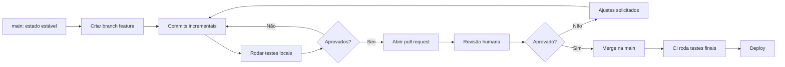
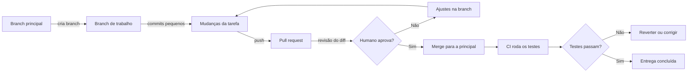

# Capítulo 3: Git, Branches e Pull Requests: a Base do Fluxo Agêntico

## 1. Introdução

Nos dois primeiros capítulos, você construiu a lógica de programação e a fluência de leitura de código. Agora vamos estudar a ferramenta que sustenta todo o fluxo de desenvolvimento moderno — e que se tornou, na era da IA, o sistema circulatório dos agentes: o Git [1]. Se você já se perguntou como um agente de coding consegue criar um branch, modificar arquivos, rodar testes e abrir um pull request sem supervisão, a resposta está neste capítulo: o Git é a infraestrutura que torna esse fluxo agêntico possível [2].

Este capítulo tem três objetivos. Primeiro, entender o modelo mental do Git — snapshots, commits e o histórico imutável que registra cada mudança. Segundo, dominar branches e pull requests como mecanismos de isolamento e revisão. Terceiro — e este é o diferencial da série — conectar tudo ao mundo agêntico: é sobre o Git que os agentes constroem seu trabalho, e é sobre os pull requests que os humanos revisam o que os agentes produziram [3]. Sem Git, nenhum fluxo agêntico funciona; com ele, você ganha a base para os Capítulos 4 a 10, que constroem testes, contextos e harnesses sobre essa fundação [4].

## 2. Explica

### 2.1 O Modelo de Snapshots

O Git não armazena "diferenças" entre versões; ele armazena snapshots — fotografias completas do estado do projeto a cada commit [1]. Quando você faz um commit, o Git registra o estado de todos os arquivos naquele momento, apontando para o snapshot anterior. Essa arquitetura dá ao Git três superpoderes: histórico imutável (ninguém apaga o passado), ramificação barata (criar um branch é só criar um ponteiro) e recuperação total (qualquer estado passado pode ser restaurado) [2]. O livro Pro Git, de Chacon e Straub, descreve esse modelo em detalhe — e é a referência definitiva da ferramenta [1].

### 2.2 Commits: A Unidade de História

Um commit é uma unidade de mudança com mensagem, autor e timestamp. A qualidade do histórico depende da qualidade das mensagens: um commit que diz "corrige bug" é quase inútil; um commit que diz "valida valor negativo no cálculo de média" documenta decisão [1]. Essa disciplina vale duplamente na era dos agentes: quando um agente faz dezenas de commits, o histórico precisa ser legível para que o humano consiga revisar o que aconteceu [12].

### 2.8 Boas Práticas de Commit para o Fluxo Agêntico

As boas práticas de commit ganham contornos específicos quando agentes participam do fluxo [8]. A primeira é a atomicidade: um commit deve conter uma única mudança lógica — correção de um bug, implementação de uma feature — para que o histórico conte uma história linear [1]. A segunda é a mensagem estruturada: prefixos de convenção (feat, fix, refactor, docs, test, build) indicam o tipo de mudança, e o corpo explica o porquê [1]. A terceira é a rastreabilidade: referências ao problema ou ao contexto (números de issue) permitem ligar o commit à origem [3]. Quando um agente trabalha em um repositório com AGENTS.md, essas convenções são instruções explícitas — o agente segue o padrão definido e o humano audita o histórico [8][10].

### 2.9 Repositórios Remotos e Colaboração Distribuída

O Git é distribuído: cada máquina tem uma cópia completa do histórico, e os repositórios remotos (GitHub, GitLab, Bitbucket) são pontos de sincronização e colaboração [1]. O fluxo push/pull transfere mudanças; o fork cria uma cópia independente para contribuições externas; e o pull request conecta forks e branches ao repositório principal [3]. Esse modelo distribuído é o que permite o trabalho paralelo em escala global — e é a infraestrutura sobre a qual os agentes de coding operam: o agente trabalha em um clone, faz push para o seu branch e abre o PR [13]. A compreensão de que não existe um "servidor central do Git" — apenas um acordo de colaboração — é o que permite entender por que o modelo funciona tão bem em projetos abertos [1]. A qualidade do histórico depende da qualidade das mensagens: um commit que diz "corrige bug" é quase inútil; um commit que diz "valida valor negativo no cálculo de média" documenta decisão [1]. Essa disciplina vale duplamente na era dos agentes: quando um agente faz dezenas de commits, o histórico precisa ser legível para que o humano consiga revisar o que aconteceu [12]. Ferramentas de revisão automatizada, como as descritas pelo CodeRabbit, leem exatamente esse histórico para avaliar mudanças [12].

### 2.3 Branches: O Isolamento do Trabalho

Branch é um ponteiro móvel para um commit — um "universo paralelo" onde o trabalho acontece isolado da linha principal [2]. O fluxo básico é sempre o mesmo: criar um branch a partir de um ponto estável, trabalhar, testar e, quando pronto, integrar de volta [4]. As estratégias de branching organizam esse fluxo em padrões: o Git Flow separa develop e master com releases; o GitHub Flow mantém uma main sempre deployável com branches curtos; o trunk-based development integra mudanças pequenas e frequentes diretamente na linha principal [4]. A escolha da estratégia é uma decisão de arquitetura do time — e os agentes de IA seguem a estratégia que o time define nos arquivos de instrução [10].

### 2.4 Pull Requests: A Porta da Revisão

Pull request é o mecanismo que une a mudança ao time: o autor propõe a integração do branch, e os revisores analisam, comentam e aprovam antes do merge [3]. O pull request carrega três funções: documentação (o diff conta a história da mudança), validação (os testes rodam antes de qualquer merge) e governança (ninguém integra sem aprovação) [3]. No fluxo agêntico, o pull request é o ponto de contato entre a máquina e o humano: o agente produz a mudança e abre o PR; o humano revisa e decide [2].

### 2.5 Por Que Agentes Dependem do Git

Em 2026, os agentes de coding — Claude Code, Codex, Cursor, OpenCode — operam sobre o Git de forma nativa: criam branches para cada tarefa, fazem commits incrementais, rodam a suíte de testes e abrem pull requests automaticamente [13]. O estudo empírico de Lulla e colaboradores sobre o impacto de AGENTS.md mostrou que a eficiência dos agentes melhora dramaticamente quando o repositório define regras claras — e o Git é o terreno onde essas regras se manifestam [8]. Sem um repositório versionado e organizado, o agente trabalha no escuro; com ele, o agente trabalha com contexto completo [17].

### 2.6 O Modelo de Objetos do Git

Por trás dos comandos, o Git opera com um modelo de objetos que vale a pena entender para usar a ferramenta com profundidade [1]. Os principais objetos são: o blob (conteúdo de um arquivo), a árvore (estrutura de diretórios que aponta para blobs e subárvores), o commit (snapshot com mensagem, autor e ponteiros) e o branch (ponteiro para um commit). Cada objeto é endereçado por um hash SHA-1 calculado sobre seu conteúdo — o que torna o histórico imutável e verificável [1]. Essa arquitetura explica propriedades que os profissionais usam: integridade (qualquer alteração no conteúdo muda o hash), histórico completo (todos os snapshots estão lá) e ramificação barata (criar um ponteiro custa nada) [1]. O Pro Git dedica um capítulo inteiro ao funcionamento interno — e a leitura vale quando o fluxo agêntico exige debug de histórico [1].

### 2.7 Conflitos: O Ponto de Fricção do Trabalho Paralelo

Quando dois ramos de trabalho mudam o mesmo trecho do mesmo arquivo, o merge produz um conflito — e o Git pede a decisão humana [1]. O conflito não é um defeito do Git: é a consequência natural do paralelismo, e o mecanismo que garante que nenhuma mudança se perca silenciosamente [2]. Resolver um conflito exige ler os dois lados, entender a intenção de cada mudança e decidir a versão final [3]. Na era agêntica, os conflitos se multiplicam: vários agentes trabalhando no mesmo repositório colidem com mais frequência [13]. O profissional — e o harness que ele projeta — precisa de uma política de resolução: dividir o trabalho por áreas de código, manter branches curtos e integrar com frequência para reduzir a probabilidade de colisão [4]. O estudo empírico de Lulla e colaboradores sobre o impacto de AGENTS.md mostrou que a eficiência dos agentes melhora dramaticamente quando o repositório define regras claras — e o Git é o terreno onde essas regras se manifestam [8]. Sem um repositório versionado e organizado, o agente trabalha no escuro; com ele, o agente trabalha com contexto completo [17]. A diferença entre um autocomplete que sugere linhas e um agente que abre pull requests inteiros é exatamente a camada de execução sobre o Git — o divisor de águas entre as eras que o ITECS analisa [20].

## 3. Ilustra

### 3.1 A Analogia do Livro Colaborativo

Imagine um livro sendo escrito por um time de autores, com um editor-chefe. Cada autor recebe uma cópia do manuscrito atual (branch). Eles trabalham em capítulos separados, em cópias paralelas, sem atropelar uns aos outros. Quando um autor termina um capítulo, entrega ao editor uma proposta de integração (pull request). O editor revisa o texto (code review), pede ajustes e, só quando aprova, publica no manuscrito oficial (merge). O Git é esse sistema de controle editorial — e o editor é o humano que governa o que entra na versão oficial [3]. Agora imagine que alguns autores sejam agentes de IA: eles trabalham mais rápido, mas precisam das mesmas regras de revisão — e é o editor que garante a qualidade [2].

### 3.5 A Linha do Tempo Visual do Git

Um dos conceitos que mais confundem iniciantes é a diferença entre a linha do tempo do Git e o estado do diretório de trabalho [1]. A linha do tempo é o histórico imutável de commits — a memória do projeto. O diretório de trabalho é o estado atual dos arquivos, que pode divergir do último commit (arquivos modificados, novos, deletados) [1]. O `git status` mostra exatamente essa divergência; o `git add` move mudanças para a área de preparação; o `git commit` congela o snapshot na linha do tempo [1]. Quando você lê diagramas de Git — como o do início da seção — está lendo a linha do tempo; quando executa comandos, está operando sobre o estado atual [1]. Essa separação mental é o que torna o Git intuitivo em vez de misterioso [2]. Cada autor recebe uma cópia do manuscrito atual (branch). Eles trabalham em capítulos separados, em cópias paralelas, sem atropelar uns aos outros. Quando um autor termina um capítulo, entrega ao editor uma proposta de integração (pull request). O editor revisa o texto (code review), pede ajustes e, só quando aprova, publica no manuscrito oficial (merge). O Git é esse sistema de controle editorial — e o editor é o humano que governa o que entra na versão oficial [3]. Agora imagine que alguns autores sejam agentes de IA: eles trabalham mais rápido, mas precisam das mesmas regras de revisão — e é o editor que garante a qualidade [2].

### 3.2 O Diagrama do Fluxo de Branch e Merge



### 3.3 O Agente no Fluxo

O mesmo diagrama descreve o trabalho de um agente autônomo: ele cria o branch, faz commits, roda testes, abre o PR e aguarda revisão. A diferença está na velocidade e na escala — um agente pode abrir dezenas de PRs por dia [13]. É exatamente por isso que a governança humana não pode desaparecer: em 2026, entre 40% e 60% do código em PRs corporativos é gerado por IA, e a confiança na exatidão caiu para 29% [15]. O pull request virou o portão de qualidade — e você, leitor, está se preparando para ser quem opera esse portão [3].

### 3.4 A Ponte do Livro: Autores, Editor e Imprensa

Ampliando a analogia do Capítulo 2: um livro profissional passa por três estágios — os autores escrevem capítulos em rascunhos paralelos (branches), o editor revisa e aprova cada capítulo (pull request), e a imprensa publica a versão final (merge e deploy) [3]. Sem o controle editorial, o livro vira uma colcha de retalhos; com ele, cada capítulo chega ao leitor revisado e coerente [3]. Na era agêntica, a analogia se estende: os "autores" incluem agentes de IA que escrevem capítulos inteiros (branches de código) — e o editor humano precisa revisar com a mesma seriedade, porque a velocidade dos autores-autônomos multiplica o risco de erros [15]. O controle editorial é a governança que separa um repositório saudável de um caos [2]. A diferença está na velocidade e na escala — um agente pode abrir dezenas de PRs por dia [13]. É exatamente por isso que a governança humana não pode desaparecer: em 2026, entre 40% e 60% do código em PRs corporativos é gerado por IA, e a confiança na exatidão caiu para 29% [15]. O pull request virou o portão de qualidade — e você, leitor, está se preparando para ser quem opera esse portão [3]. O modelo de agente que atravessa esse portão é o mesmo que Lilian Weng formalizou: LLM, memória, planejamento e ferramentas — cada ferramenta uma chamada a um sistema como o Git [11].

### 3.6 O Diagrama do Fluxo de Merge

O fluxo completo de integração — o cenário mais comum do dia a dia — merece o seu diagrama [1]:



O diagrama condensa o ciclo que você executou na mão: branch, commits, PR, revisão, merge, validação [1]. Note que o portão de qualidade aparece após o merge — e no Capítulo 4 você verá por que os fluxos maduros rodam o CI antes do merge, não depois [6]. Esse mesmo diagrama, com um agente no lugar do autor, é o fluxo de trabalho agêntico padrão de 2026 [2].

## 4. Técnica

### 4.1 O Fluxo Básico do Git

Vamos executar o fluxo completo na prática. Os comandos abaixo seguem o GitHub Flow: branch curto, testes, PR e merge [4]. Cada comando tem um papel no ciclo:

```bash
# 1. Inicia o repositório e cria o primeiro commit
git init
git add .
git commit -m "feat: estrutura inicial do projeto"

# 2. Cria um branch de trabalho a partir da main
git checkout -b feature/valida-despesas

# 3. Trabalha e faz commits incrementais
git add app.py
git commit -m "feat: valida valores negativos na transacao"

# 4. Publica o branch no remoto e abre o pull request
git push -u origin feature/valida-despesas

# 5. Após a revisão e o merge, sincroniza a main
git checkout main
git pull
```

### 4.6 Trabalhando com Histórico e Diagnóstico

Além do fluxo básico, o profissional domina os comandos de diagnóstico e histórico — as ferramentas que transformam o Git de depósito de código em sistema de inteligência [1]. `git log --oneline --graph` visualiza o histórico em árvore, mostrando a relação entre branches e merges. `git blame` identifica quem mudou cada linha e quando — essencial para entender a origem de um comportamento. `git diff` mostra exatamente o que mudou entre estados; `git show <commit>` detalha um commit específico [1]. Essas ferramentas são o equivalente a um sistema de auditoria: permitem reconstruir o raciocínio de qualquer mudança, humana ou agêntica [8]. Quando um comportamento estranho aparece em produção, o `git log` e o `git blame` são os primeiros pontos de partida do diagnóstico — e o `git bisect` localiza o commit culpado em minutos [1].

### 4.7 Ignorando o Que Não Deve Ser Versionado

Um aspecto prático que separa iniciantes de profissionais é o arquivo `.gitignore` — a lista de arquivos e diretórios que o Git não deve rastrear [1]. Dependências instaladas, arquivos de ambiente com segredos, artefatos de build e caches não devem entrar no histórico: poluem o repositório, inflam os clones e expõem credenciais [1]. O profissional configura o `.gitignore` no início do projeto e o mantém atualizado — e o harness agêntico, por meio de AGENTS.md, instrui o agente a nunca commitar arquivos ignorados ou segredos [10]. A regra de ouro: se um arquivo pode ser regenerado, ele não precisa ser versionado; se contém segredo, jamais deve ser [1]. Essa disciplina de higiene do repositório é pré-requisito para o trabalho em equipe — e para o trabalho com agentes que, sem instrução, podem commitar qualquer coisa [8]. Cada comando tem um papel no ciclo:

```bash
# 1. Inicia o repositório e cria o primeiro commit
git init
git add .
git commit -m "feat: estrutura inicial do projeto"

# 2. Cria um branch de trabalho a partir da main
git checkout -b feature/valida-despesas

# 3. Trabalha e faz commits incrementais
git add app.py
git commit -m "feat: valida valores negativos na transacao"

# 4. Publica o branch no remoto e abre o pull request
git push -u origin feature/valida-despesas

# 5. Após a revisão e o merge, sincroniza a main
git checkout main
git pull
```

### 4.2 O Que Acontece por Trás de Cada Comando

Cada comando acima corresponde a um conceito do modelo de snapshots [1]. `git init` cria o repositório — o diretório `.git` que guarda todo o histórico. `git add` prepara arquivos (staging), selecionando o que entrará no próximo snapshot. `git commit` congela o snapshot com uma mensagem. `git checkout -b` cria e ativa um branch — um ponteiro que começa no commit atual. `git push` sincroniza com o remoto, habilitando o pull request [2]. O fluxo agêntico usa exatamente estes mesmos comandos — e é por isso que entendê-los é pré-requisito para orquestrar agentes [8].

### 4.3 O Pull Request como Contrato

Um pull request bem construído é um contrato: título que resume, descrição que explica o porquê, testes que validam e um diff que mostra o que mudou [3]. Quando um agente abre um PR, o humano revisa exatamente esses quatro elementos. A automação de revisão — linters, testes em CI — roda antes da revisão humana e reduz o ruído: o revisor foca no que a máquina não consegue avaliar, como design e intenção [5].

### 4.4 O Ciclo Completo: do Clone ao Merge

Vamos ampliar o fluxo para o ciclo completo de trabalho em equipe — o mesmo que os agentes percorrem [1]. O fluxo começa com `git clone`, que copia o repositório remoto para a máquina local com todo o histórico. Em seguida, `git status` mostra o estado dos arquivos; `git diff` mostra as mudanças não commitadas; `git log` mostra o histórico. O ciclo de trabalho é: `git pull` para sincronizar, criar o branch, trabalhar, `git add` + `git commit` com mensagens claras, `git push`, abrir o PR, revisar, e `git merge` após aprovação [1]. Cada comando responde a uma pergunta concreta — e o profissional os usa com fluência, sem consultar a documentação a cada passo [3]. Quando o agente executa esse fluxo por você, é esse conhecimento que permite auditar cada passo [8].

### 4.5 Git e o Estado do Repositório

Um conceito que merece destaque é o estado em que os arquivos podem estar: não rastreado (novo), modificado (mudado desde o último commit), preparado (staged, marcado para o próximo commit) e commitado (seguro no histórico) [1]. `git status` mostra esses estados, e entender a transição entre eles é o que permite usar o Git sem medo [1]. Quando um agente comete erros de staging — adicionando arquivos que não deveria — é o humano que percebe ao revisar o `git status` e o diff do PR [8]. Esse domínio do estado é também a base das regras que os harnesses definem: AGENTS.md pode instruir o agente a nunca commitar segredos ou arquivos gerados [10]. Quando um agente abre um PR, o humano revisa exatamente esses quatro elementos. A automação de revisão — linters, testes em CI — roda antes da revisão humana e reduz o ruído: o revisor foca no que a máquina não consegue avaliar, como design e intenção [5].

### 4.8 O Script de Estado do Repositório

A automação do Git não precisa de bibliotecas — a linha de comando é a API, e o Python pode orquestrá-la [3]. O script abaixo resume o estado de um repositório em um relatório — o mesmo tipo de verificação que um harness roda antes de permitir que um agente faça merge [6]:

```python
import subprocess


def git_estado():
    """Produz um relatório de saúde do repositório atual."""
    def rodar(*args):
        return subprocess.run(["git", *args], capture_output=True, text=True).stdout.strip()

    print("=== Saúde do repositório ===")
    branch = rodar("branch", "--show-current")
    print(f"Branch atual: {branch or '(detached HEAD)'}")
    sujos = rodar("status", "--porcelain")
    print(f"Arquivos alterados: {len([l for l in sujos.splitlines() if l])}")
    ultimos = rodar("log", "--oneline", "-5")
    print("Últimos commits:")
    print(ultimos)


if __name__ == "__main__":
    git_estado()
```

O princípio que o script ilustra é a interface de linha de comando como contrato: cada comando do Git tem entradas, saídas e códigos de saída — exatamente como as APIs que você verá no Capítulo 6 [3]. Um harness que verifica o estado do repositório antes de agir é a ponte entre o Git deste capítulo e os testes do Capítulo 4 [6].

### 4.9 O Treino do Conflito

O conflito de merge é o momento em que o modelo mental do Git é testado [3]. O treino mais eficaz: crie um conflito de propósito [3]. Crie uma branch, altere uma linha de um arquivo, volte à principal, altere a mesma linha, e faça o merge [3]. Agora resolva o conflito com método: leia as duas versões — a sua e a da branch — entenda a intenção de cada uma e escreva a versão que combina ambas [3]. Repita o treino com conflitos mais complexos: arquivos renomeados, alterações em estruturas de dados [3].

O treino vale para humanos e para o diagnóstico de agentes [1]. Quando um agente encontra um conflito, ele pode propor uma resolução que privilegia a versão dele — e o profissional precisa ler o conflito para decidir [1]. A resolução de conflito é, no fundo, leitura crítica de código (Capítulo 2) aplicada à colisão de intenções [2]. Quem treina conflitos não teme o aviso do Git — teme apenas o merge sem entender o que colidiu [3].

## 5. Aplica

### 5.1 Onde Isso Vive no Mundo Real

Todo repositório profissional usa o fluxo de branches e PRs — do projeto de código aberto ao sistema bancário mais regulado [3]. A integração contínua (CI) automatiza a validação: a cada push, o pipeline roda testes, linters e builds, e o GitHub Actions ou o GitLab CI reportam o resultado direto no PR [6][7]. É esse circuito — push, CI, PR, review, merge — que dá escala ao desenvolvimento de software moderno [5]. A automação só é confiável se o que ela valida for verdade: a ideia de que o software vira "o programa" e a janela de contexto vira "o interpretador" — a visão de Software 3.0 do Karpathy — depende de termos processos determinísticos como o Git e o CI segurando a execução [18].

### 5.2 O Erro Comum do Iniciante

O erro clássico de quem começa é commitar tudo na main, sem branches, e pedir revisão depois de tudo pronto. A correção é inverter a ordem: branch pequeno desde o início, commits incrementais com mensagens claras, e revisão antes de integrar [4]. Na era da IA, esse erro se amplifica: se você deixar o agente commitar direto na main sem revisão, o repositório vira um agregado de mudanças não auditadas [2]. A prática correta — e aqui está o diferencial que separa o profissional — é tratar o PR como unidade de qualidade: cada mudança, humana ou agêntica, passa pelo mesmo portão [3].

### 5.6 Quando o Fluxo Agêntico Encontra o Git

O cenário real que resume este capítulo: um time adota um agente de coding que recebe a tarefa de corrigir um bug. O agente segue o fluxo aprendido — cria o branch `fix/erro-login`, faz commits incrementais com mensagens claras, roda a suíte local e abre o PR. O CI roda no push e reporta verde. O humano revisa o diff, verifica a cobertura dos testes e aprova [13]. Esse cenário, que em 2026 é rotina em milhares de equipes, só funciona porque cada peça do fluxo que você estudou está presente: o Git dá a estrutura, o branch isola, o PR governa e o CI valida [2][5]. Quando uma dessas peças falha — um agente sem instruções commitando na main, um PR sem testes — a qualidade cai [15]. Por isso a série trata o Git não como ferramenta do passado, mas como a fundação do futuro agêntico [1]. A correção é inverter a ordem: branch pequeno desde o início, commits incrementais com mensagens claras, e revisão antes de integrar [4]. Na era da IA, esse erro se amplifica: se você deixar o agente commitar direto na main sem revisão, o repositório vira um agregado de mudanças não auditadas [2]. A prática correta — e aqui está o diferencial que separa o profissional — é tratar o PR como unidade de qualidade: cada mudança, humana ou agêntica, passa pelo mesmo portão [3]. A descrição do PR é um contrato escrito — e é o mesmo tipo de contrato que o function calling exige do modelo para invocar ferramentas: nome, propósito e parâmetros claros [19].

### 5.3 O Padrão Profissional em 2026

O fluxo profissional do AIDD combina Git com arquivos de instrução: o repositório define, em AGENTS.md ou CLAUDE.md, as convenções de branch, commit e revisão que os agentes devem seguir [8][9]. Estudos mostram que essa camada de configuração reduz o tempo de execução dos agentes em quase 29% e o consumo de tokens de saída em cerca de 17% [8].

### 5.4 O Review como Cerimônia de Qualidade

O code review, que você conheceu no Capítulo 2, ganha no Git a sua infraestrutura: o pull request é a cerimônia onde a qualidade acontece [3]. Um review eficaz combina automação e julgamento humano: a automação (testes, linters, análise estática) elimina as falhas mecânicas; o humano avalia a intenção, o design e os casos que a automação não cobre [5]. Em equipes que usam agentes, essa divisão de trabalho é ainda mais importante: a automação roda a cada push do agente, e o humano revisa o diff final com o contexto completo [3]. Estabelecer o ritual — quem revisa, o que se espera do review, quais são os critérios de aprovação — é decisão de arquitetura de processo, e os harnesses que você estudará nos próximos volumes automatizam parte dele [10].

### 5.5 Git como Ferramenta de Recuperação

Uma habilidade profissional subestimada é o uso do Git como ferramenta de recuperação de desastres [1]. O `git log` revela o estado anterior de qualquer arquivo; `git checkout` e `git revert` desfazem mudanças; `git stash` guarda trabalho em andamento; `git bisect` localiza o commit que introduziu um bug [1]. Em equipes agênticas, essa capacidade é essencial: quando um agente introduz uma mudança regressiva, o `git bisect` encontra o commit culpado em minutos, e o `git revert` o desfaz com segurança [8]. O Git não é apenas o sistema circulatório do trabalho — é também a rede de segurança que torna a experimentação agêntica segura [1].

### 5.7 Git e o Fluxo de Dados: Como o Histórico Conta a História

O histórico do Git é também um registro de decisões de dados e arquitetura [1]. Olhar o histórico de um arquivo revela por que ele evoluiu daquela forma: quais features foram adicionadas, quais bugs foram corrigidos e quais decisões foram revertidas [1]. Em times agênticos, esse registro é ainda mais valioso: o histórico documenta o que os agentes fizeram, permitindo auditar padrões de erro e acerto ao longo do tempo [8]. O `git log --follow <arquivo>` acompanha a história de um arquivo mesmo renomeado; o `git log -p` mostra os diffs de cada commit [1]. O profissional usa o histórico como fonte de verdade sobre a evolução do sistema — e o harness agêntico usa o mesmo histórico para alimentar o contexto dos agentes com as decisões passadas [10].

### 5.8 Glossário do Capítulo

Para fixar o vocabulário: snapshot é o estado completo do projeto em um commit; commit é a unidade de mudança com mensagem; branch é um ponteiro móvel para um commit; merge integra um branch em outro; conflito é a colisão de mudanças no mesmo trecho; pull request é a proposta de integração com revisão; e `.gitignore` é a lista de arquivos não rastreados [1]. Dominar esses termos com precisão — como você dominou os do Capítulo 1 — é o que permite conversar com clareza sobre o fluxo de trabalho, humano ou agêntico [3]. O Capítulo 4 vai usar vários deles ao descrever como o CI valida cada push [5]. Estudos mostram que essa camada de configuração reduz o tempo de execução dos agentes em quase 29% e o consumo de tokens de saída em cerca de 17% [8]. O resultado é um fluxo onde o agente opera com autonomia dentro de trilhos definidos pelo humano — autonomia com governança, que é o tema que atravessa toda a série [10]. É essa autonomia estruturada que o guia completo da SitePoint descreve como o novo padrão da indústria em 2026 [16].

### 5.9 O Fluxo Agêntico Sobre o Git

O Git que você dominou é a espinha dorsal de todo fluxo agêntico em 2026 [1]. O padrão profissional funciona assim: o agente recebe uma tarefa, cria uma branch a partir da branch principal, faz as mudanças em commits pequenos e abre um pull request [1]. O CI — que você estudará no Capítulo 4 — roda os testes no PR, e o humano revisa o diff antes do merge [6]. Esse fluxo dá ao agente autonomia de execução e ao humano controle de integração: a autonomia e a governança que atravessam a série [2].

A consequência prática para você: conhecer Git não é mais opcional — é o idioma em que a colaboração humano-agente acontece [1]. Quando um agente abre um PR no seu repositório, as perguntas que você faz são as mesmas do fluxo humano: a branch partiu do ponto certo? Os commits contam uma história clara? O diff está limitado à tarefa? [1] E quando o agente encontra um conflito de merge, o seu conhecimento de como conflitos funcionam — que você dominou na seção 4 — é o que permite resolver com método em vez de pânico [3].

### 5.10 O Histórico Como Documentação

A habilidade final do capítulo é ler o histórico do projeto como documentação viva [1]. O `git log` bem escrito conta a história do software: o que foi construído, em que ordem e por quê [1]. Mensagens de commit como "extrai validação de pagamento" documentam decisões de arquitetura que o código atual não conta [1]. Mensagens como "fixes bug" não documentam nada [1]. O profissional escreve mensagens que contam a decisão — e lê o histórico para entender decisões passadas antes de alterar o presente [1].

Na era agêntica, o histórico ganha um papel de auditoria [2]. Cada mudança feita por um agente deixa rastro: quem (a ferramenta), quando (o timestamp), o quê (o diff) [2]. Quando um problema aparece em produção, o histórico é a primeira pista — e um histórico bem escrito transforma a investigação em leitura, em vez de escavação [1]. Essa mesma disciplina de rastreamento será retomada na governança de harnesses, nos volumes da Parte III [10].

## 6. Conclusão

Neste capítulo, você dominou o modelo mental do Git: snapshots, commits, branches e pull requests como os quatro pilares do controle de versão [1]. Você entendeu que branches são isolamento de trabalho, que pull requests são a porta de revisão e que o fluxo de CI transforma cada push em uma validação automatizada [2][5]. E conectou tudo ao mundo agêntico: os agentes de coding operam sobre o Git, e é o pull request o ponto onde o humano governa o que a máquina produz [3].

Resumindo em três pontos: primeiro, o Git guarda snapshots completos — histórico imutável e recuperável [1]; segundo, branches isolam e pull requests governam — o fluxo que dá escala ao trabalho paralelo [2][3]; terceiro, o Git é a infraestrutura dos agentes — e a governança humana é o que mantém a qualidade no fluxo agêntico [8]. Com esses três pontos, você tem a base de colaboração sobre a qual o Capítulo 4 constrói as disciplinas de validação [5].

### O Desafio Deste Capítulo

O desafio em três níveis. Nível um: crie um repositório Git do zero, faça três commits com mensagens no padrão de convenção e publique em um remoto. Nível dois: crie um branch, modifique um arquivo e abra um pull request com descrição estruturada — sem consultar a documentação. Nível três: peça a um agente de IA para abrir um PR em um repositório de teste e audite cada passo — o branch criado, as mensagens de commit, o diff e os testes — verificando se o agente seguiu as convenções do repositório [1]. Os três níveis exercitam o domínio manual, o fluxo profissional e a supervisão agêntica [3]. Ainda assim, o histórico e o código gerados por máquina precisam de escrutínio extra: os limites do que um modelo "lembra" e os erros que ele inventa com fluência são o tema que vamos enfrentar de frente no Capítulo 8 [14].

No próximo capítulo, vamos construir a próxima camada da defesa: testes automatizados, CI/CD e observabilidade. Você vai entender por que essas disciplinas — que pareciam "velhas" — voltaram ao centro do palco na era da IA, e como elas transformam confiança em engenharia [5].

## 7. Referências Bibliográficas

[1] CHACON, Scott; STRAUB, Ben. Pro Git. 2. ed. Apress/Git SCM, 2014. Disponível em: https://git-scm.com/book/en/v2. Acesso em: 5 ago. 2026.

[2] GITHUB DOCS. About branches. Disponível em: https://docs.github.com/en/pull-requests/collaborating-with-pull-requests/proposing-changes-to-your-work-with-pull-requests/about-branches. Acesso em: 5 ago. 2026.

[3] GITHUB DOCS. About pull requests. Disponível em: https://docs.github.com/en/pull-requests/collaborating-with-pull-requests/proposing-changes-to-your-work-with-pull-requests/about-pull-requests. Acesso em: 5 ago. 2026.

[4] ATLASSIAN. Git branching strategies. Disponível em: https://www.atlassian.com/git/tutorials/comparing-workflows. Acesso em: 5 ago. 2026.

[5] FOWLER, Martin. Continuous Integration. Disponível em: https://martinfowler.com/articles/continuousIntegration.html. Acesso em: 5 ago. 2026.

[6] GITHUB ACTIONS DOCS. Understanding GitHub Actions. Disponível em: https://docs.github.com/en/actions/about-github-actions/understanding-github-actions. Acesso em: 5 ago. 2026.

[7] GITLAB. CI/CD pipeline architecture. Disponível em: https://docs.gitlab.com/ee/ci/. Acesso em: 5 ago. 2026.

[8] LULLA, Jai Lal; et al. On the Impact of AGENTS.md Files on the Efficiency of AI Coding Agents. Disponível em: https://arxiv.org/html/2601.20404v1. Acesso em: 5 ago. 2026.

[9] OPENAI / AGENTS.MD FOUNDATION. Open Standards for Agentic Configuration (AGENTS.md). Disponível em: https://agents.md/. Acesso em: 5 ago. 2026.

[10] TIAN PAN. CLAUDE.md and AGENTS.md: The Configuration Layer That Makes AI Coding Agents Actually Follow Your Rules. Disponível em: https://tianpan.co/blog/2026-02-25-claude-md-agents-md-ai-coding-agent-instruction-files. Acesso em: 5 ago. 2026.

[11] WENG, Lilian. LLM-Powered Autonomous Agents. Disponível em: https://lilianweng.github.io/posts/2023-06-23-agent/. Acesso em: 5 ago. 2026.

[12] CODERABBIT. From Copilot to agents: The history of AI coding. Disponível em: https://www.coderabbit.ai/blog/a-very-brief-history-of-ai-coding-from-copilot-to-next-gen-agents. Acesso em: 5 ago. 2026.

[13] MIGHTYBOT. Best AI Coding Agents in 2026, Ranked. Disponível em: https://mightybot.ai/blog/coding-ai-agents-for-accelerating-engineering-workflows/. Acesso em: 5 ago. 2026.

[14] WENG, Lilian. Extrinsic Hallucinations in LLMs. Disponível em: https://lilianweng.github.io/posts/2024-07-07-hallucination/. Acesso em: 5 ago. 2026.

[15] KEYHOLE SOFTWARE. Vibe Coding Trends 2026: Adoption, Productivity, and Code Quality Data. Disponível em: https://keyholesoftware.com/vibe-coding-trends-2026/. Acesso em: 5 ago. 2026.

[16] SITEPOINT. Vibe Coding 2026: The Complete Guide to AI-First Development. Disponível em: https://www.sitepoint.com/vibe-coding-2026-complete-guide/. Acesso em: 5 ago. 2026.

[17] ANTHROPIC. Effective Context Engineering for AI Agents. Disponível em: https://www.anthropic.com/engineering/effective-context-engineering-for-ai-agents. Acesso em: 5 ago. 2026.

[18] KARPATHY, Andrej. Sequoia Ascent 2026 Summary (Software 3.0 & Agentic Engineering). Disponível em: https://karpathy.bearblog.dev/sequoia-ascent-2026/. Acesso em: 5 ago. 2026.

[19] OPENAI. Function Calling Guide. Disponível em: https://developers.openai.com/api/docs/guides/function-calling. Acesso em: 5 ago. 2026.

[20] ITECS. Claude Code vs. GitHub Copilot: Agentic vs. Autocomplete. Disponível em: https://itecsonline.com/post/claude-code-vs-github-copilot-2026-agentic-vs-autocomplete-enterprise-guide. Acesso em: 5 ago. 2026.
