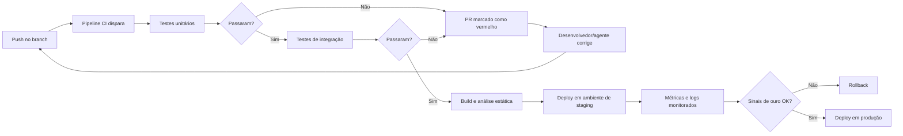

# Capítulo 4: Testes Automatizados, CI/CD e Observabilidade

## 1. Introdução

No Capítulo 3, você aprendeu que o Git é o sistema circulatório do desenvolvimento e que o pull request é o portão de qualidade. Agora vamos estudar o que acontece do outro lado desse portão: os testes automatizados, a integração contínua e a observabilidade — as três disciplinas que transformam a confiança em engenharia [1]. Você vai ouvir com frequência que essas práticas "voltaram" a importar na era da IA. A verdade é mais precisa: elas nunca deixaram de importar, mas a escala do código gerado por máquina as tornou o principal mecanismo de defesa contra o erro silencioso [2].

Este capítulo tem três objetivos. Primeiro, entender a pirâmide de testes — unitários, integração e ponta a ponta — e o ciclo red-green-refactor do desenvolvimento orientado a testes [1]. Segundo, dominar o circuito de integração contínua: a cada push, o pipeline roda a suíte e reporta o resultado no pull request [4]. Terceiro, compreender a observabilidade — logs, métricas e traces — como a forma de saber o que o sistema está fazendo em produção [7]. Ao final, você terá o conjunto de ferramentas que separa um sistema frágil de um sistema confiável — e que os agentes de IA precisam para trabalhar com segurança [3].

## 2. Explica

### 2.1 A Pirâmide de Testes

A pirâmide de testes, popularizada por Vocke e Fowler, organiza a suíte em camadas: na base, muitos testes unitários — rápidos, isolados e focados em uma função; no meio, testes de integração — que verificam a colaboração entre componentes; no topo, poucos testes de ponta a ponta — que exercitam o sistema completo [1]. A lógica da pirâmide é econômica: testes baratos e rápidos são executados o tempo todo; testes caros e lentos são reservados para os momentos críticos. Quanto mais sua suíte respeita a pirâmide, mais rápido é o feedback e mais confiável é a validação [1].

### 2.8 Tipos de Teste na Prática

Além da pirâmide, vale conhecer os tipos de teste pelo que cada um protege [1]. O teste unitário protege uma função isolada — o contrato que definimos no Capítulo 2. O teste de integração protege a conversa entre componentes — a API do Capítulo 5 consultando o banco. O teste de contrato protege a compatibilidade entre serviços — que o formato da resposta não mudou. O teste de ponta a ponta protege a jornada do usuário — do clique ao resultado [1]. E o teste de regressão, que pode ser de qualquer tipo, protege contra a volta de bugs já corrigidos [1]. Na era agêntica, o teste de regressão é o mais valioso: quando um agente refatora código, a suíte de regressão é o que garante que o comportamento não mudou [20].

### 2.9 O Que Um Teste Bom Tem

Um teste bom tem quatro qualidades: determinístico (o mesmo código sempre produz o mesmo resultado), isolado (não depende de outros testes), específico (falha por um único motivo) e legível (comunica o comportamento esperado) [2]. Um teste ruim é o oposto: flutuante (passa às vezes), acoplado (quebra quando outro teste muda), vago (não se sabe por que falhou) e ilegível (exige decifração) [1]. A disciplina de escrever bons testes é a mesma de escrever bom código — e é ela que os profissionais avaliam quando revisam a suíte que um agente gerou [3]. A lógica da pirâmide é econômica: testes baratos e rápidos são executados o tempo todo; testes caros e lentos são reservados para os momentos críticos. Quanto mais sua suíte respeita a pirâmide, mais rápido é o feedback e mais confiável é a validação [1].

### 2.2 TDD: o Ciclo Red-Green-Refactor

O desenvolvimento orientado a testes, sistematizado por Kent Beck, inverte a ordem natural: primeiro escreve-se o teste que define o comportamento desejado; observa-se o teste falhar (red); escreve-se o código mínimo para fazê-lo passar (green); e então refatora-se o código para melhorar a qualidade sem mudar o comportamento [2]. O ciclo não é apenas uma técnica — é uma disciplina de design: escrever o teste primeiro força você a pensar no contrato da função antes de implementá-la [2]. Na era dos agentes, essa disciplina ganha um papel novo: o teste vira a especificação executável que o agente deve satisfazer [13].

### 2.3 Integração Contínua: o Circuito de Validação

Integração contínua é a prática de integrar mudanças com frequência e validar cada integração automaticamente [4]. O circuito é simples: a cada push, o pipeline de CI roda a suíte de testes, os linters e o build; o resultado aparece no pull request como um selo verde ou vermelho [5]. O GitHub Actions e o GitLab CI são as implementações mais difundidas desse circuito — workflows declarados em arquivos YAML que definem jobs e etapas [5][6]. A integração contínua é o que torna possível o desenvolvimento em velocidade agêntica: centenas de mudanças por dia só são seguras porque cada uma é validada no instante em que nasce [4]. O pull request, que estudamos no Capítulo 3, é a unidade que dispara esse circuito: cada proposta de mudança carrega o resultado do pipeline anexado [10].

### 2.4 Observabilidade: Logs, Métricas e Traces

Observabilidade é a capacidade de entender o estado interno de um sistema a partir de seus outputs externos [7]. Os três pilares são logs (registros textuais de eventos), métricas (contadores e medições ao longo do tempo) e traces (o caminho de uma requisição pelos serviços). O Google SRE Book consolida os Quatro Sinais de Ouro: latência, tráfego, erros e saturação — as quatro perguntas que todo sistema em produção deve responder [7]. O OpenTelemetry, padrão da CNCF, unifica a coleta desses três pilares em um framework agnóstico de fornecedor [8].

### 2.6 A Diferença entre Teste e Verificação

Uma distinção conceitual que evita muita confusão: teste é a execução de casos contra o comportamento esperado; verificação é a confirmação de que o sistema satisfaz os requisitos [1]. O teste responde "o código faz o que eu escrevi?" — a verificação responde "o código faz o que o negócio precisa?" [1]. Na prática, a pirâmide de testes cobre o primeiro; o code review e a validação de requisitos cobrem o segundo [1]. Na era agêntica, essa distinção é crítica: um agente pode passar todos os testes e ainda não satisfazer a intenção — porque os testes foram escritos junto com o código, ambos refletindo o mesmo mal-entendido [3]. O profissional verifica a intenção, não apenas o resultado dos testes [2].

### 2.7 A Economia do Feedback Rápido

A velocidade do feedback é a moeda da qualidade [4]. Um teste unitário que roda em milissegundos permite dezenas de iterações por minuto; um teste de ponta a ponta que roda em minutos limita o ritmo de iteração a poucos ciclos por hora [1]. Essa economia explica a forma da pirâmide: muitos testes baratos e rápidos na base, poucos caros e lentos no topo [1]. Em times agênticos, a economia de feedback define a produtividade: o agente que roda a suíte local em segundos corrige em minutos; o que depende de um pipeline lento fica parado [14]. O AGENTS.md de um projeto agêntico costuma instruir o agente a rodar primeiro a suíte rápida local, e só então o pipeline completo [18]. Os três pilares são logs (registros textuais de eventos), métricas (contadores e medições ao longo do tempo) e traces (o caminho de uma requisição pelos serviços). O Google SRE Book consolida os Quatro Sinais de Ouro: latência, tráfego, erros e saturação — as quatro perguntas que todo sistema em produção deve responder [7]. O OpenTelemetry, padrão da CNCF, unifica a coleta desses três pilares em um framework agnóstico de fornecedor [8].

### 2.5 Por Que Isso Tudo Voltou a Importar na Era da IA

A resposta é numérica: em 2026, entre 40% e 60% do código em pull requests corporativos é gerado por agentes, e a confiança dos desenvolvedores na exatidão do código gerado caiu para 29% [12]. Quando a máquina produz a maior parte do código, os testes deixam de ser uma cortesia e viram a evidência de que o código funciona [3]. O agente que roda a suíte local, lê a falha e corrige — o ciclo que descrevemos no Capítulo 3 — é exatamente o revisor determinístico que separa código bom de código aparentemente bom [14]. E a infraestrutura por trás disso, como o Git que versiona cada passo, é o chão comum sobre o qual o ciclo se apoia [9]. Testes, CI e observabilidade são a resposta de engenharia à pergunta que atravessa a série: como confiar no que uma máquina produziu [2]. E a resposta tem um componente de contexto: o próprio ato de rodar a suíte em uma janela de contexto cheia pode degradar o desempenho do agente — mais um motivo para manter o circuito determinístico e enxuto [20].

### 2.10 O Teste de Fronteira

Uma categoria de teste que vale destaque é o teste de fronteira — aquele que exercita exatamente os limites do contrato [20]. Se uma função aceita idades de 0 a 150, os casos de fronteira são 0, 150, -1 e 151 [20]. O padrão dos bugs: eles vivem nas fronteiras — no primeiro e no último valor válido, e em tudo que fica fora [20]. O teste de fronteira é barato de escrever, rápido de rodar e desproporcionalmente valioso [20].

Para agentes, o teste de fronteira ganha um uso novo [20]. Quando um agente gera código, os testes de fronteira definem o contrato que o código deve respeitar — e o agente, ao rodar os testes, aprende os limites sem precisar de explicação [20]. É a especificação executável em ação: em vez de descrever ao agente o que a função deve aceitar, você escreve os testes de fronteira e deixa que eles ensinem [11]. Essa técnica — testes como comunicação com o agente — é um dos pilares do fluxo agêntico que a série vai detalhar [20].

### 2.11 O CI Como Gatekeeper: o Circuito Completo

O circuito completo do CI merece ser visto por inteiro [11]. A mudança é enviada para a branch do PR; o servidor de CI detecta o push e clona o repositório; instala as dependências em ambiente limpo; roda o linter, os testes e o build; e reporta o resultado ao PR [11]. O ambiente limpo é o segredo: o CI não roda no computador de ninguém, com as dependências de ninguém — roda em uma máquina descartável, garantindo que o resultado não dependa de sorte [11].

A consequência para agentes: o CI é o juiz neutro [11]. Um agente pode afirmar que "os testes passam na minha máquina" — mas o CI decide se passam no ambiente limpo [11]. Por isso, os harnesses de 2026 são construídos em torno do CI: o agente trabalha, o CI julga e o humano governa [14]. Esse triângulo — autonomia, julgamento, governança — é a arquitetura social do AIDD que os próximos volumes constroem [10].

### 2.12 Observabilidade: os Quatro Sinais de Ouro

A observabilidade em produção se apoia em um vocabulário padrão: os Quatro Sinais de Ouro [7]. Latência — quanto tempo cada requisição leva; tráfego — quantas requisições por segundo; erros — a taxa de falhas; saturação — quão perto do limite o sistema está [7]. Juntos, os quatro sinais contam a história da saúde do sistema: um pico de erros com latência alta aponta para um gargalo; saturação alta com erros baixos aponta para capacidade [7].

Na era agêntica, os sinais se aplicam ao próprio agente [14]. A latência do loop — quanto tempo o agente leva para decidir; o tráfego de ferramentas — quantas chamadas por tarefa; os erros — quantas iterações falham; a saturação — quão perto da janela de contexto o agente opera [14]. Monitorar os quatro sinais do agente é o que permite melhorar o agente com dados, não com opinião [14]. A observabilidade que você começou aqui é a base da Eval Engineering do fim da série [10].

## 3. Ilustra

### 3.1 A Analogia da Ponte Suspensa

Imagine a construção de uma ponte. Antes de liberar a passagem, os engenheiros não apenas olham a ponte — eles carregam cada viga com peso acima do esperado (testes de estresse), medem a vibração durante ventos fortes (observabilidade) e repetem os testes a cada mudança de projeto (integração contínua) [1]. Um construtor que "acha" que a ponte aguenta não é um engenheiro. O mesmo vale para o software: quem confia no código apenas por tê-lo lido está apostando; quem roda a suíte e observa as métricas está engenhando [4]. Na era dos agentes, a ponte é construída por robôs rápidos — e a engenharia de validação humana é o que impede o colapso [3].

### 3.2 O Diagrama do Circuito CI/CD



### 3.4 A Ponte como Metáfora do Circuito

Voltando à ponte suspensa: o circuito CI/CD é o processo de engenharia que garante a segurança da ponte a cada mudança de projeto [1]. Cada push é uma revisão de projeto; os testes unitários são os testes de material dos cabos; os testes de integração são os testes de conexão entre vigas; os testes de ponta a ponta são o teste de carga com o tráfego real; e a observabilidade é a instrumentação que mede a vibração depois da inauguração [1][7]. Nenhuma etapa sozinha garante a segurança — é o circuito completo que a garante [4]. Na era agêntica, a ponte é construída por robôs, e o circuito de validação é o que impede que um erro de projeto chegue ao tráfego [20].

### 3.3 O Agente como Desenvolvedor e o Teste como Juiz

A imagem mental que fecha o capítulo: o agente de IA é um desenvolvedor veloz que escreve código em segundos, mas a qualidade do que ele produz só é conhecida quando a suíte roda [13]. O teste automatizado é o juiz imparcial — não discute, não se impressiona com retórica, apenas passa ou falha [2]. Por isso os arquivos de instrução dos agentes enfatizam os comandos de teste: AGENTS.md diz ao agente como rodar a suíte, e o CI diz se ele acertou [18].

### 3.5 O Guarda na Porta do Show

Uma analogia de fechamento para o CI: o guarda na porta do show [11]. O show é a branch principal; a plateia é a produção [11]. O guarda — o pipeline — tem uma lista de regras: convite válido (linter), ingresso autêntico (testes), e a pessoa está na lista (build) [11]. Quem não cumpre as regras não entra — não importa quão famoso seja o artista (o desenvolvedor) ou quão confiante ele afirme que o show precisa dele [11].

A era agêntica adiciona um detalhe: os artistas agora chegam em bandos — dezenas de agentes propondo mudanças ao mesmo tempo [19]. O guarda não conhece nenhum deles — e não precisa: as regras são iguais para todos [20]. É essa imparcialidade que permite escalar: o guarda julga o trabalho, não o autor [20]. Quando um agente reclama "mas eu sou o Claude Code", o guarda responde com o único argumento que importa: "os testes passaram?" [20].

## 4. Técnica

### 4.1 Escrevendo Testes Unitários

Vamos escrever testes para a função do Capítulo 2 — `calcular_media_ponderada` — seguindo o ciclo red-green-refactor [2]. O framework `unittest` é nativo do Python e suficiente para o padrão:

```python
import unittest


def calcular_media_ponderada(notas, pesos):
    if len(notas) != len(pesos):
        raise ValueError("notas e pesos devem ter o mesmo tamanho")
    total = 0.0
    soma_pesos = 0.0
    for nota, peso in zip(notas, pesos):
        total += nota * peso
        soma_pesos += peso
    if soma_pesos == 0:
        return 0.0
    return total / soma_pesos


class TestMediaPonderada(unittest.TestCase):
    def test_media_simples(self):
        self.assertAlmostEqual(calcular_media_ponderada([8.0, 6.0], [1.0, 1.0]), 7.0)

    def test_pesos_diferentes(self):
        self.assertAlmostEqual(calcular_media_ponderada([10.0, 0.0], [1.0, 3.0]), 2.5)

    def test_pesos_zero(self):
        self.assertEqual(calcular_media_ponderada([8.0, 9.0], [0.0, 0.0]), 0.0)

    def test_listas_de_tamanhos_diferentes(self):
        with self.assertRaises(ValueError):
            calcular_media_ponderada([8.0], [1.0, 2.0])


if __name__ == "__main__":
    unittest.main()
```

### 4.2 O Ciclo na Prática

Observe o que cada caso testa: o caso feliz, o caso com pesos assimétricos, o caso de borda (pesos zerados) e o caso de contrato violado (tamanhos diferentes) [1]. São esses quatro tipos de caso — feliz, borda, erro e contrato — que definem uma boa suíte [2]. Rode o arquivo: todos os testes devem passar. Agora introduza um bug na função (troque `soma_pesos` por `len(notas)` na divisão) e rode de novo: o teste de pesos diferentes falha e aponta a linha — exatamente o feedback que o CI dará quando um agente quebrar algo [4].

### 4.3 O Pipeline de CI em YAML

Para fechar o circuito, o workflow de CI abaixo roda a suíte a cada push — o mesmo padrão do GitHub Actions [5]:

```yaml
name: test
on: [push, pull_request]
jobs:
  test:
    runs-on: ubuntu-latest
    steps:
      - uses: actions/checkout@v4
      - uses: actions/setup-python@v5
        with:
          python-version: "3.12"
      - run: pip install -r requirements.txt
      - run: python -m unittest discover -s tests -v
```

Esse arquivo, na raiz do repositório, transforma cada push em uma validação automática: se um agente quebrar um teste, o PR fica vermelho e o humano não precisa adivinhar [5]. É o mesmo padrão no GitLab CI, com sintaxe equivalente [6].

### 4.4 Criando um Ambiente de Testes Isolado

Uma boa suíte de testes exige um ambiente isolado e reproduzível [2]. O padrão profissional separa os testes do código de produção: a pasta `tests/` espelha a estrutura do código, e cada teste usa dados próprios — sem depender de bancos ou serviços externos [1]. No nosso exemplo, o teste da média ponderada não precisa de rede nem de banco: ele constrói os dados em memória e verifica a saída [2]. Essa independência é o que torna os testes unitários rápidos e confiáveis [1]. Quando um agente escreve testes, o profissional verifica exatamente essa propriedade: o teste é determinístico, isolado e exercita o comportamento — não apenas a implementação [3].

### 4.5 O Padrão de Cobertura que Importa

Cobertura de código é uma métrica útil e perigosa ao mesmo tempo [1]. Útil: mostra quais linhas foram executadas pelos testes. Perigosa: alta cobertura não implica alta qualidade — um teste que executa uma linha sem verificar o comportamento certo não protege nada [1]. O profissional mede cobertura para encontrar buracos, não para perseguir um número [1]. Na era agêntica, esse cuidado se multiplica: agentes otimizam a métrica que o harness mede — se o harness cobra cobertura, o agente gera testes que inflam a cobertura sem validar o comportamento [20]. O harness bem projetado mede o comportamento esperado, não a porcentagem de linhas [20].

```yaml
name: test
on: [push, pull_request]
jobs:
  test:
    runs-on: ubuntu-latest
    steps:
      - uses: actions/checkout@v4
      - uses: actions/setup-python@v5
        with:
          python-version: "3.12"
      - run: pip install -r requirements.txt
      - run: python -m unittest discover -s tests -v
```

Esse arquivo, na raiz do repositório, transforma cada push em uma validação automática: se um agente quebrar um teste, o PR fica vermelho e o humano não precisa adivinhar [5]. É o mesmo padrão no GitLab CI, com sintaxe equivalente [6].

### 4.6 O Script do Portão Local

Antes de existir o CI do servidor, existe o portão local — o script que você roda antes de cada push [11]. O script abaixo executa a sequência completa de validação e aborta no primeiro fracasso — o mesmo espírito do pipeline de CI, em uma máquina [20]:

```python
import subprocess
import sys


def portao_local():
    """Roda linter, testes e build; aborta no primeiro fracasso."""
    etapas = [
        ("Linter", ["python", "-m", "py_compile", "app.py"]),
        ("Testes unitários", ["python", "-m", "unittest", "discover", "-s", "tests"]),
    ]
    for nome, cmd in etapas:
        print(f"==> {nome}")
        resultado = subprocess.run(cmd, capture_output=True, text=True)
        if resultado.returncode != 0:
            print(resultado.stdout)
            print(resultado.stderr)
            print(f"FALHOU em: {nome}")
            sys.exit(1)
    print("Portão local: TUDO OK")


if __name__ == "__main__":
    portao_local()
```

A lição do script é a ordem e o aborto [20]: validação barata primeiro (sintaxe), validação cara depois (testes), e nenhuma etapa seguinte roda se a anterior falhou [20]. O mesmo princípio organiza os pipelines de CI em produção [11].

## 5. Aplica

### 5.1 Onde Isso Vive no Mundo Real

Em produção, a tríade se completa: os testes garantem que a mudança está certa antes do deploy; o CI garante que isso acontece a cada integração; a observabilidade garante que o sistema continua certo depois do deploy [7]. O OpenTelemetry instrumenta a aplicação para emitir traces, e os painéis monitoram latência, tráfego, erros e saturação — os Quatro Sinais de Ouro [7][8]. Quando um agente introduz uma regressão silenciosa — um caminho de código sem teste que passa a se comportar mal — é a observabilidade que acende o alarme [7]. O histórico de como chegamos até aqui ajuda a entender a urgência: da era do autocomplete à dos agentes que abrem PRs sozinhos, a validação automatizada foi o que permitiu o salto de velocidade [11].

### 5.2 O Erro Comum do Iniciante

O erro clássico é confiar no teste gerado pelo agente sem questionar: o agente escreve testes que passam porque foram escritos junto com o código que satisfaz aquele teste — um círculo que valida nada [3]. A correção — e aqui está o diferencial que separa o profissional — é escrever testes antes ou independentemente do código: os testes definem o comportamento esperado, e o código é a tentativa de satisfazê-los [2]. Se o agente propõe código e testes juntos, você avalia primeiro se os testes exercitam casos de borda e erro reais — não apenas o caminho feliz [1]. E cuidado com um segundo erro, mais sutil: confiar na fluência do código gerado. Modelos produzem texto convincente mesmo quando estão errados — o fenômeno das alucinações que vamos dissecar no Capítulo 8 [16].

### 5.3 O Padrão Profissional em 2026

O fluxo profissional combina as três disciplinas com governança agêntica: o repositório define no AGENTS.md os comandos exatos de teste que o agente deve rodar antes de abrir o PR [18]. O estudo empírico sobre o impacto de AGENTS.md mostra que essa padronização reduz o tempo de execução dos agentes em quase 29% [18]. E o resultado da validação é sempre o mesmo princípio: autonomia para o agente, portão determinístico para a qualidade [14].

### 5.4 O Pipeline como Contrato de Qualidade

O pipeline de CI é, na prática, um contrato executável de qualidade — a versão automatizada do que o pull request promete [4]. Ele define as condições que uma mudança deve satisfazer antes de integrar: testes passando, lint limpo, build ok [4][5]. Esse contrato é o que permite delegar trabalho a agentes com segurança: o agente pode cometer erros, mas o pipeline os detecta antes do merge [14]. E o contrato evolui com o projeto: quando um novo tipo de falha aparece em produção, o time adiciona um teste que a captura — transformando o incidente em proteção permanente [1]. O profissional trata o pipeline como um documento vivo, revisado tão seriamente quanto o código [4].

### 5.5 A Observabilidade como Extensão da Validação

Os testes validam antes do deploy; a observabilidade valida depois [7]. Um sistema em produção responde perguntas que os testes não cobrem: quantas requisições chegam por segundo, qual é a latência no pico, onde os erros se concentram [7]. Os Quatro Sinais de Ouro respondem essas perguntas — e o OpenTelemetry instrumenta a resposta [7][8]. Na era agêntica, a observabilidade ganha um papel duplo: além de monitorar o sistema, monitora o próprio agente — quantos tokens ele consome, quantas iterações do loop ele faz, onde ele erra [14]. Os harnesses que você estudará nos próximos volumes usam exatamente esses sinais para avaliar e melhorar agentes [10]. O estudo empírico sobre o impacto de AGENTS.md mostra que essa padronização reduz o tempo de execução dos agentes em quase 29% [18]. E o resultado da validação é sempre o mesmo princípio: autonomia para o agente, portão determinístico para a qualidade [14]. Por trás do portão está a arquitetura do agente — LLM, memória, planejamento e ferramentas — onde cada ferramenta expõe seu contrato ao modelo, como vimos no function calling [15][17]. E quando essa arquitetura escala para times inteiros de agentes, os melhores de 2026 — Claude Code, Codex, Cursor — rodam exatamente esse circuito de testes como parte do seu loop de trabalho [19].

### 5.6 O Portão de Qualidade Agêntico

O padrão profissional de 2026 trata o pipeline de CI como um portão que vale tanto para humanos quanto para agentes [20]. A ideia é simples: toda mudança — de uma pessoa ou de uma máquina — precisa cruzar o mesmo portão determinístico antes de entrar na branch principal [11]. O portão tem três estágios [20]. O primeiro é o estágio de linter e formato: mudanças que violam convenções são barradas antes de executar qualquer coisa — custo quase zero, feedback imediato [20]. O segundo é o estágio de testes: unitários, de integração e ponta a ponta, na ordem da pirâmide [20]. O terceiro é o estágio de build e deploy em ambiente de homologação: a prova final de que a mudança funciona montada [11].

A consequência agêntica é profunda: quando o portão existe, o agente pode trabalhar com autonomia — porque a qualidade não depende da sua disciplina, depende do pipeline [20]. É essa arquitetura que separa a produção séria da demo: na demo, o agente é bom; na produção, o portão é bom [14]. E é essa mesma arquitetura que os volumes de Harness Engineering vão construir: o harness que executa, testa e valida cada iteração do agente [10]. O princípio físico, porém, é o deste capítulo: autonomia para gerar, portão determinístico para aceitar [20].

### 5.7 Testando o Comportamento, Não a Implementação

A lição mais sutil do capítulo — e a mais importante para a era agêntica — é testar comportamento, não implementação [20]. Testes que verificam como a função foi escrita (quais métodos internos foram chamados, em que ordem) quebram a qualquer refatoração inocente [20]. Testes que verificam o que o usuário observa (entrada, saída, estado resultante) sobrevivem à refatoração e continuam validando o que importa [20]. A Testing Library resume o princípio: quanto mais seus testes se parecem com o uso real do software, mais confiança eles dão [20].

Para agentes, o princípio é decisivo [2]. Um agente que reescreve a implementação de uma função — mudando nomes internos, reorganizando módulos — deve ser validado pelo resultado, não pelos passos [2]. O teste de comportamento aceita qualquer implementação correta; o teste de implementação rejeita qualquer solução diferente da esperada [20]. Quando você projetar evals de agentes, nos próximos volumes, esta será a regra de ouro: avalie o que o agente entregou ao usuário, não o caminho que ele escolheu [20]. É essa distinção que permite aos agentes variar a implementação sem quebrar a confiança [2].

### 5.8 O Ciclo de Melhoria Contínua

O portão de qualidade não é estático — é um ciclo de melhoria contínua [11]. Toda falha que passa pelo portão é um sinal: algum teste está faltando, algum cenário não foi previsto [11]. O padrão profissional trata cada bug em produção como uma tarefa dupla: corrigir o comportamento e adicionar o teste que o teria pego [11]. Esse ciclo — falha, correção, teste novo — é o que transforma um pipeline em um ativo que melhora com o tempo [11].

Na era agêntica, o ciclo ganha um reforço: as falhas de agentes são registradas como casos de avaliação [20]. Quando um agente propõe uma mudança errada e o portão a barra, o caso entra no conjunto de evals — e o próximo agente será testado contra ele [20]. É assim que a Eval Engineering, tema do fim da série, constrói seu acervo: cada falha real vira um teste permanente [20]. O portão não só protege o presente — ele aprende com o passado [11].

### 5.9 Testes para Agentes: a Suíte como Portão

A aplicação mais direta do capítulo na era agêntica é a suíte de testes como portão para o trabalho dos agentes [20]. O padrão de 2026: o agente propõe uma mudança, e o portão — a mesma pirâmide que você dominou — decide se a mudança entra [20]. Testes unitários cobrem as funções alteradas; testes de integração cobrem a interação com o resto do sistema; testes ponta a ponta cobrem o fluxo do usuário [20]. O agente pode variar a implementação à vontade — o portão não [20].

A consequência cultural é importante [2]. Times maduros não discutem com o agente — discutem com o portão: se o teste falhou, a mudança não entra, e o agente recebe a falha como feedback para corrigir [2]. Essa disciplina transforma a relação com a IA: em vez de confiar ou desconfiar do agente, o time confia no portão [14]. E é essa confiança no portão — não no agente — que permite à indústria escalar agentes autônomos em produção [19]. Quando a série tratar de evals, você verá o mesmo princípio elevado à validação de comportamento completo [20].

### 5.10 O Erro de Confundir Cobertura com Qualidade

Um erro que separa iniciantes de profissionais: confundir cobertura com qualidade [20]. Cobertura mede quantas linhas os testes tocaram; qualidade mede quantos comportamentos foram validados [20]. Um projeto pode ter 95% de cobertura e ainda deixar escapar o bug mais importante — se os testes exercitam o caminho errado [20]. O profissional pergunta, para cada teste: o que este teste impede de acontecer? Se a resposta é "nada de importante", o teste é peso morto — ele passa sempre, mas não protege nada [20].

Para agentes, a distinção é crítica [2]. Uma suíte de cobertura alta pode validar que o agente tocou em todas as linhas — e não validar se o comportamento entregue é o que o usuário pediu [20]. A regra da Testing Library — testar como o usuário usa — aplicada a agentes significa: validar o resultado observável da tarefa, não os passos internos [20]. Essa é a ponte direta deste capítulo para a Eval Engineering do fim da série: medir comportamento, não atividade [20].

### 5.11 O Custo de Pular o Portão

A última lição aplicada do capítulo: o custo de pular o portão [11]. Cada vez que uma mudança entra sem o pipeline — "é rápido, é só um ajuste" — o sistema acumula uma dívida de confiança [11]. O ajuste que "não precisava de teste" vira a regressão que derruba produção [11]. A mudança que "é urgente" entra sem CI e quebra a integração [11]. O custo não aparece no momento do atalho — aparece na próxima terça-feira, em produção, às três da manhã [11].

Na era agêntica, o atalho é tentador demais [2]. O agente diz "os testes passam" — e o humano, sem conferir, dá o merge [2]. O portão existe exatamente para isso: para que a confiança não dependa da palavra de ninguém — humana ou máquina [20]. O time que respeita o portão pode escalar agentes com segurança; o que o ignora, escala o caos [19]. A disciplina do portão é a disciplina da confiança em escala [11].

### 5.12 O Círculo Virtuoso da Qualidade

O capítulo termina com o círculo virtuoso que o portão cria [11]. Testes bons reduzem bugs [20]. Menos bugs reduzem o medo de mudar [11]. Menos medo acelera a entrega [11]. Entrega rápida gera feedback rápido [11]. Feedback rápido melhora o produto [11]. E o produto melhor justifica mais testes [11]. O círculo é o mesmo para humanos e agentes: o agente que entrega com o portão verde ganha autonomia; a autonomia acelera o trabalho; e o trabalho acelerado exige portão melhor [20].

Quem entra no círculo virtuoso cresce [11]. Quem fica no círculo vicioso — sem testes, com medo, devagar — encolhe [11]. A escolha entre os dois círculos acontece em cada commit: o teste foi escrito? O pipeline rodou? O portão passou? [11] O profissional não decide a qualidade uma vez — decide a cada mudança, a cada dia [11]. E é esse hábito — decidir pela qualidade a cada passo — que a série inteira vai exigir nas camadas mais altas da pilha [2].

## 6. Conclusão

Neste capítulo, você dominou as três disciplinas que transformam confiança em engenharia: a pirâmide de testes com seus níveis de unidade, integração e ponta a ponta [1]; o ciclo red-green-refactor do TDD, que transforma o teste em especificação executável [2]; e o circuito de integração contínua que valida cada mudança no instante em que nasce [4]. Você também entendeu a observabilidade — logs, métricas e traces — como a linguagem de diagnóstico dos sistemas em produção [7].

Resumindo em três pontos: primeiro, testes são especificações executáveis — o contrato que define o comportamento esperado [2]; segundo, CI é o circuito que valida cada mudança automaticamente [4]; terceiro, observabilidade é a validação contínua em produção — os Quatro Sinais de Ouro respondem as perguntas que os testes não cobrem [7]. Com esses três pontos, você tem o arsenal de validação que o Capítulo 5 vai conectar à arquitetura de sistemas [1].

### O Desafio Deste Capítulo

O desafio em três níveis. Nível um: escreva testes para a função de média ponderada do Capítulo 1, cobrindo o caso feliz, os pesos zerados e o tamanho divergente das listas. Nível dois: crie um workflow de CI no GitHub Actions que rode a suíte a cada push — e verifique que um teste falhando marca o PR de vermelho. Nível três: peça a um agente de IA para corrigir um bug introduzido por você e avalie se o agente usou o ciclo de depuração — leu o erro, formou hipótese, corrigiu e revalidou — ou apenas tentou palpites [2]. Os três níveis exercitam escrita de testes, automação de CI e supervisão de agentes [4].

Essas disciplinas são a resposta da série à pergunta central da era agêntica: como confiar no código produzido por máquinas [3]. No próximo capítulo, vamos subir na pilha em direção à arquitetura: APIs, bancos de dados e servidores — os blocos sobre os quais os sistemas — e os agentes — constroem seus contratos de comunicação [1].

## 7. Referências Bibliográficas

[1] VOCKE, Ham; FOWLER, Martin. The Practical Test Pyramid. Disponível em: https://martinfowler.com/articles/practical-test-pyramid.html. Acesso em: 5 ago. 2026.

[2] BECK, Kent. Test-Driven Development: By Example. Boston: Addison-Wesley Professional, 2002.

[3] TESTING LIBRARY. Guiding Principles. Disponível em: https://testing-library.com/docs/guiding-principles/. Acesso em: 5 ago. 2026.

[4] FOWLER, Martin. Continuous Integration. Disponível em: https://martinfowler.com/articles/continuousIntegration.html. Acesso em: 5 ago. 2026.

[5] GITHUB ACTIONS DOCS. Understanding GitHub Actions. Disponível em: https://docs.github.com/en/actions/about-github-actions/understanding-github-actions. Acesso em: 5 ago. 2026.

[6] GITLAB. CI/CD pipeline architecture. Disponível em: https://docs.gitlab.com/ee/ci/. Acesso em: 5 ago. 2026.

[7] EWASCHUK, Rob; BEYER, Betsy (Ed.). Site Reliability Engineering: Monitoring Distributed Systems. Google SRE Book. Disponível em: https://sre.google/sre-book/monitoring-distributed-systems/. Acesso em: 5 ago. 2026.

[8] OPENTELEMETRY. What is OpenTelemetry?. Disponível em: https://opentelemetry.io/docs/what-is-opentelemetry/. Acesso em: 5 ago. 2026.

[9] CHACON, Scott; STRAUB, Ben. Pro Git. 2. ed. Apress/Git SCM, 2014. Disponível em: https://git-scm.com/book/en/v2. Acesso em: 5 ago. 2026.

[10] GITHUB DOCS. About pull requests. Disponível em: https://docs.github.com/en/pull-requests/collaborating-with-pull-requests/proposing-changes-to-your-work-with-pull-requests/about-pull-requests. Acesso em: 5 ago. 2026.

[11] CODERABBIT. From Copilot to agents: The history of AI coding. Disponível em: https://www.coderabbit.ai/blog/a-very-brief-history-of-ai-coding-from-copilot-to-next-gen-agents. Acesso em: 5 ago. 2026.

[12] KEYHOLE SOFTWARE. Vibe Coding Trends 2026: Adoption, Productivity, and Code Quality Data. Disponível em: https://keyholesoftware.com/vibe-coding-trends-2026/. Acesso em: 5 ago. 2026.

[13] SITEPOINT. Vibe Coding 2026: The Complete Guide to AI-First Development. Disponível em: https://www.sitepoint.com/vibe-coding-2026-complete-guide/. Acesso em: 5 ago. 2026.

[14] ANTHROPIC. Effective Context Engineering for AI Agents. Disponível em: https://www.anthropic.com/engineering/effective-context-engineering-for-ai-agents. Acesso em: 5 ago. 2026.

[15] WENG, Lilian. LLM-Powered Autonomous Agents. Disponível em: https://lilianweng.github.io/posts/2023-06-23-agent/. Acesso em: 5 ago. 2026.

[16] WENG, Lilian. Extrinsic Hallucinations in LLMs. Disponível em: https://lilianweng.github.io/posts/2024-07-07-hallucination/. Acesso em: 5 ago. 2026.

[17] OPENAI. Function Calling Guide. Disponível em: https://developers.openai.com/api/docs/guides/function-calling. Acesso em: 5 ago. 2026.

[18] LULLA, Jai Lal; et al. On the Impact of AGENTS.md Files on the Efficiency of AI Coding Agents. Disponível em: https://arxiv.org/html/2601.20404v1. Acesso em: 5 ago. 2026.

[19] MIGHTYBOT. Best AI Coding Agents in 2026, Ranked. Disponível em: https://mightybot.ai/blog/coding-ai-agents-for-accelerating-engineering-workflows/. Acesso em: 5 ago. 2026.

[20] CHROMA. Context Rot: How Increasing Input Tokens Impacts LLM Performance. Disponível em: https://www.trychroma.com/research/context-rot. Acesso em: 5 ago. 2026.
