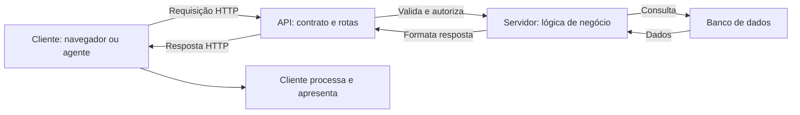

# Capítulo 5: APIs, Bancos de Dados e Servidores

## 1. Introdução

Nos capítulos anteriores, você dominou a lógica de programação, a leitura de código, o Git e as disciplinas de validação. Agora vamos estudar os blocos fundamentais de qualquer sistema: APIs, bancos de dados e servidores — a anatomia do software que conversa com outro software [1]. Essa é a camada que os agentes de IA exploram o tempo todo: quando um agente consulta uma API para buscar dados ou chama uma ferramenta para executar uma ação, ele está atravessando exatamente esta arquitetura [2]. Os melhores agentes de coding de 2026 navegam repositórios, executam testes e interagem com serviços exatamente por essa anatomia [6].

Este capítulo tem três objetivos. Primeiro, entender o modelo cliente-servidor — a dança de requisição e resposta que sustenta a internet [1]. Segundo, compreender o que é uma API: um contrato entre sistemas, com regras claras de entrada e saída [3]. Terceiro, conhecer os bancos de dados — a memória persistente que sobrevive ao desligamento do servidor [4]. Ao final, você terá o mapa da infraestrutura sobre a qual os agentes constroem suas ferramentas — e estará pronto para o Capítulo 6, que aprofunda HTTP e contratos [1].

## 2. Explica

### 2.1 O Modelo Cliente-Servidor

Toda interação na web segue o mesmo padrão: um cliente faz um pedido; um servidor processa e responde. O navegador que você abre é o cliente; o computador remoto que hospeda o site é o servidor [1]. Esse modelo divide o mundo em dois papéis bem definidos — quem pede e quem atende — e é a base de tudo o que vem a seguir [3]. Quando um agente de IA consulta uma API, ele assume o papel de cliente: envia a requisição e processa a resposta [7].

### 2.2 O que é uma API

API — Application Programming Interface — é o contrato que define como dois sistemas conversam [3]. O contrato especifica o que você pode pedir (endpoints e parâmetros), como pedir (formato da requisição) e o que receber (formato da resposta). A boa API é como um balcão de atendimento bem organizado: o cliente não precisa saber o que acontece nos bastidores — só precisa conhecer o cardápio de operações disponíveis [1]. No mundo agêntico, as ferramentas que os agentes chamam são APIs com um contrato ainda mais explícito: o JSON Schema que define nome, descrição e parâmetros de cada função [7]. O framework de agentes de Weng organiza essas ferramentas como o terceiro pilar do agente, ao lado da memória e do planejamento [8].

### 2.6 REST: O Estilo Arquitetural Dominante

A maioria das APIs modernas segue o estilo REST — Representational State Transfer [3]. No REST, os recursos são os substantivos (transações, usuários, produtos) e os verbos HTTP — que você verá em detalhe no Capítulo 6 — são as ações sobre eles [1]. A API REST é stateless: cada requisição carrega toda a informação necessária, sem depender de estado do servidor entre chamadas [3]. Esse estilo simplifica a escalabilidade e a cache, e é o que a maioria dos serviços públicos expõe [3]. Para os agentes, as APIs REST são o formato mais comum de ferramenta externa — e a familiaridade com o estilo facilita entender qualquer contrato novo [7].

### 2.7 Modelagem de Dados: a Decisão do Esquema

Antes de criar um banco, o profissional modela os dados: define as entidades, seus atributos e os relacionamentos entre elas [4]. No modelo relacional, cada entidade vira uma tabela, cada atributo uma coluna, e os relacionamentos viram chaves estrangeiras [4]. A modelagem é uma decisão de arquitetura com consequências profundas: um esquema mal projetado gera consultas lentas e manutenção dolorosa; um bem projetado simplifica tudo [3]. Na era agêntica, a modelagem também define o que os agentes conseguem consultar: um esquema claro e documentado é um contrato que os agentes entendem; um esquema caótico é uma armadilha [2]. O contrato especifica o que você pode pedir (endpoints e parâmetros), como pedir (formato da requisição) e o que receber (formato da resposta). A boa API é como um balcão de atendimento bem organizado: o cliente não precisa saber o que acontece nos bastidores — só precisa conhecer o cardápio de operações disponíveis [1]. No mundo agêntico, as ferramentas que os agentes chamam são APIs com um contrato ainda mais explícito: o JSON Schema que define nome, descrição e parâmetros de cada função [7]. O framework de agentes de Weng organiza essas ferramentas como o terceiro pilar do agente, ao lado da memória e do planejamento [8].

### 2.3 Bancos de Dados: A Memória Persistente

Dados precisam sobreviver ao desligamento do servidor — para isso existem os bancos de dados [4]. Um banco de dados é um sistema especializado em armazenar, consultar e atualizar informações de forma confiável e concorrente. Os bancos relacionais, como o SQL, organizam os dados em tabelas com linhas e colunas — a forma mais antiga e ainda dominante de modelar dados estruturados [4]. A evolução dos modelos de linguagem trouxe ainda os bancos vetoriais, que armazenam representações numéricas do texto — tema que o Karpathy discute ao descrever o Software 3.0 [16] e que sustenta a recuperação de contexto em janelas de milhões de tokens [17][18]. Os bancos não relacionais (NoSQL) trocam a rigidez do esquema por flexibilidade e escala. A escolha entre eles é uma decisão de arquitetura: o formato dos dados e os padrões de acesso definem a ferramenta certa [3].

### 2.4 Servidores: Onde o Software Vive

Servidor é o computador que hospeda o software e atende requisições [1]. Na prática, "servidor" pode ser uma máquina física, uma máquina virtual ou um container isolado — a abstração mudou, o papel é o mesmo: receber pedidos, executar lógica, acessar dados e devolver respostas [3]. A infraestrutura moderna esconde essa complexidade: o desenvolvedor escreve o software e a plataforma decide onde ele roda [1].

### 2.8 Segurança: O Contrato Protegido

Uma dimensão que atravessa toda a arquitetura é a segurança — e ela é parte do contrato, não um extra [3]. A autenticação responde "quem é você?"; a autorização responde "o que você pode fazer?"; a validação de entrada impede que dados maliciosos entrem no sistema; e a criptografia protege dados em trânsito e em repouso [3]. Na era agêntica, a segurança ganha um vetor novo: o próprio agente é um atacante em potencial — não por malícia, mas por erro [2]. Um agente mal instruído pode expor dados em logs, chamar APIs com credenciais erradas ou vazar informação sensível no contexto [2]. Por isso os harnesses profissionais definem regras de segurança nos arquivos de instrução: nunca registrar segredos, nunca expor dados sensíveis no prompt [14]. A segurança do fluxo agêntico é, em grande parte, engenharia de contexto aplicada à proteção [10].

### 2.9 Deploy: Levando o Software para Produção

O deploy é o ato de levar o software do desenvolvimento para o ambiente de produção [1]. O fluxo profissional usa pipelines — como os do Capítulo 4 — para automatizar o caminho: build, teste, publicação [12]. Estratégias de deploy reduzem o risco de mudanças: o deploy blue-green mantém duas versões e alterna com um clique; o canary libera a mudança para uma fração dos usuários antes de todos [1]. Na era agêntica, o deploy também se refere a publicar agentes e ferramentas: expor uma tool nova ao agente é um deploy — e merece o mesmo rigor de testes e observabilidade [2]. O ciclo de vida que você está aprendendo aqui é o mesmo que os próximos volumes aplicam aos sistemas agênticos [10]. Na prática, "servidor" pode ser uma máquina física, uma máquina virtual ou um container isolado — a abstração mudou, o papel é o mesmo: receber pedidos, executar lógica, acessar dados e devolver respostas [3]. A infraestrutura moderna esconde essa complexidade: o desenvolvedor escreve o software e a plataforma decide onde ele roda [1].

### 2.5 A Conexão com o Mundo Agêntico

Os agentes de IA são clientes vorazes de APIs: cada ferramenta que eles chamam — um repositório Git, um serviço de busca, um banco — é acessada por um contrato de API [7]. O sucesso dessa comunicação depende de quanto contexto o agente consegue carregar sobre o serviço — a disciplina que a Anthropic chama de engenharia de contexto [9]. O function calling formaliza esse acesso: o modelo recebe a descrição das ferramentas disponíveis, decide qual chamar e monta a requisição estruturada [7]. Por isso, entender APIs é entender a língua que os agentes falam com o mundo — e a língua que você vai usar para construir os harnesses dos próximos volumes da série [2].

## 3. Ilustra

### 3.1 A Analogia do Restaurante

Um restaurante é a metáfora perfeita para o modelo cliente-servidor. O cliente (o navegador ou o agente) chega com um pedido. O garçom (a API) recebe o pedido e o traduz para a cozinha — o garçom é o contrato entre o cliente e o sistema interno. A cozinha (o servidor) prepara o prato, possivelmente buscando ingredientes no estoque (o banco de dados). O garçom volta com o prato pronto (a resposta) [1]. O cliente nunca entra na cozinha: ele conhece apenas o cardápio (o contrato da API) [3]. Agora imagine que o cliente seja um agente de IA: ele lê o cardápio (as definições de ferramentas), faz pedidos precisos (requisições estruturadas) e processa o que volta — exatamente o ciclo do function calling [7].

### 3.2 O Diagrama da Requisição



### 3.3 O Servidor como Restaurante

O mesmo diagrama descreve o que acontece quando você abre um aplicativo ou quando um agente chama uma ferramenta: a requisição atravessa o contrato da API, o servidor executa a lógica, consulta o banco e devolve a resposta [1]. A diferença é a velocidade e a escala: servidores modernos processam milhares de requisições por segundo, com bancos replicados e caches — mas a anatomia fundamental permanece a mesma [3]. Em escala, a engenharia de confiabilidade monitora esses serviços com os Quatro Sinais de Ouro do Google SRE [10] — e padroniza a telemetria com o OpenTelemetry [11].

### 3.4 O Restaurante com Delivery: Microsserviços

A arquitetura moderna frequentemente divide o restaurante em cozinhas especializadas: uma cozinha para salgados, outra para sobremesas, cada uma com seu estoque e sua equipe — os microsserviços [1]. Cada serviço é uma unidade independente com sua própria API e seu próprio banco, conversando com os demais via HTTP [3]. A vantagem é o isolamento: um serviço pode escalar, falhar e ser substituído sem derrubar o todo [1]. A desvantagem é a complexidade: mais serviços significam mais contratos, mais latência e mais superfícies de falha — e a observabilidade vira obrigatória [11]. Para os agentes, os microsserviços multiplicam as ferramentas disponíveis: cada serviço expõe sua API, e o agente decide qual chamar [7]. A diferença é a velocidade e a escala: servidores modernos processam milhares de requisições por segundo, com bancos replicados e caches — mas a anatomia fundamental permanece a mesma [3]. Em escala, a engenharia de confiabilidade monitora esses serviços com os Quatro Sinais de Ouro do Google SRE — latência, tráfego, erros e saturação [10] — e padroniza a telemetria com o OpenTelemetry [11].

### 3.5 O Restaurante e a Cozinha

Uma analogia que amarra os componentes do capítulo: o sistema é um restaurante [1]. O cliente é o usuário do app; o garçom é a API — a interface que recebe o pedido, traduz para a cozinha e traz o resultado [3]. A cozinha é o servidor — onde a lógica acontece [1]. A despensa é o banco de dados — onde os ingredientes (dados) são guardados [4]. O cardápio é a documentação do contrato: o que pode ser pedido e em que formato [3]. E o gerente — que olha o fluxo, resolve gargalos e garante que o restaurante atenda mais mesas — é a observabilidade [7].

A analogia se estende à era agêntica [2]. O agente é um cliente muito rápido, que pede dezenas de pratos por segundo — e que às vezes pede um prato que não está no cardápio [3]. O garçom (a API) precisa rejeitar o pedido com um código claro — o status HTTP — para que o agente aprenda a pedir direito [3]. A despensa (o banco) precisa estar organizada, senão o agente busca ingredientes onde não há [4]. Quando a série tratar de MCP, você verá o cardápio padronizado: a mesma forma de pedir para qualquer restaurante [5].

## 4. Técnica

### 4.1 Um Servidor Mínimo com API

Vamos construir a versão mais simples de um sistema completo: uma API com servidor e banco em memória. O framework `http.server` do Python é suficiente para demonstrar o modelo sem dependências externas [1]:

```python
import json
from http.server import BaseHTTPRequestHandler, HTTPServer

# "Banco de dados" em memória: lista de transações persistida no processo
banco = [
    {"id": 1, "descricao": "Mercado", "valor": -150.00},
    {"id": 2, "descricao": "Salário", "valor": 4500.00},
]


class Handler(BaseHTTPRequestHandler):
    def _resposta(self, codigo, dados):
        corpo = json.dumps(dados, ensure_ascii=False).encode("utf-8")
        self.send_response(codigo)
        self.send_header("Content-Type", "application/json; charset=utf-8")
        self.send_header("Content-Length", str(len(corpo)))
        self.end_headers()
        self.wfile.write(corpo)

    def do_GET(self):
        if self.path == "/transacoes":
            self._resposta(200, {"transacoes": banco})
        elif self.path.startswith("/transacoes/"):
            transacao_id = int(self.path.split("/")[-1])
            achada = next((t for t in banco if t["id"] == transacao_id), None)
            if achada:
                self._resposta(200, achada)
            else:
                self._resposta(404, {"erro": "transacao nao encontrada"})
        else:
            self._resposta(404, {"erro": "rota inexistente"})


if __name__ == "__main__":
    servidor = HTTPServer(("localhost", 8000), Handler)
    print("Servidor rodando em http://localhost:8000")
    servidor.serve_forever()
```

### 4.2 Testando a API

Rode o servidor e faça requisições — o `curl` é o cliente mais direto:

```bash
curl http://localhost:8000/transacoes
curl http://localhost:8000/transacoes/1
curl http://localhost:8000/transacoes/999
```

A primeira requisição devolve a lista completa; a segunda devolve a transação 1; a terceira devolve um 404 — o erro que o contrato da API define para o caso de recurso inexistente [3]. Observe como cada elemento do diagrama aparece na prática: o `do_GET` é a rota da API, o dicionário `banco` é o banco de dados, e o `HTTPServer` é o servidor que escuta requisições [1].

### 4.3 O Banco de Dados como Camada Separada

O exemplo acima usa memória — o que significa que os dados se perdem ao reiniciar o processo [4]. Em produção, o banco é uma camada separada, com persistência em disco e acesso concorrente seguro [4]. A separação de responsabilidades — API para o contrato, servidor para a lógica, banco para a persistência — é o padrão que torna os sistemas escaláveis e testáveis [3]. E a cada integração, o circuito de validação que você aprendeu no Capítulo 4 garante que a mudança não quebrou os contratos existentes [12].

### 4.4 Uma Consulta SQL na Prática

Para tornar o banco concreto, vejamos a linguagem que os bancos relacionais falam — o SQL [4]. A consulta abaixo reproduz, em SQL, o que o código Python fez em memória:

```sql
SELECT categoria, SUM(valor) AS total
FROM transacoes
WHERE valor < 0
GROUP BY categoria
ORDER BY total ASC;
```

A consulta seleciona as transações negativas, agrupa por categoria e soma os valores — o mesmo padrão de filtro e acumulação que você reconheceu no Capítulo 2, agora na linguagem de dados [1]. O SQL é declarativo: você descreve o resultado desejado, e o banco decide como executar [4]. Esse mesmo padrão de consulta é o que os agentes de análise geram ao interrogar bancos — e é por isso que reconhecer SQL faz parte da fluência de leitura do profissional [2]. Em produção, o banco é uma camada separada, com persistência em disco e acesso concorrente seguro [4]. A separação de responsabilidades — API para o contrato, servidor para a lógica, banco para a persistência — é o padrão que torna os sistemas escaláveis e testáveis [3]. E a cada integração, o circuito de validação que você aprendeu no Capítulo 4 garante que a mudança não quebrou os contratos existentes [12].

### 4.5 O Cliente HTTP em Python: a Chamada na Prática

A melhor forma de entender uma API é chamá-la — e o Python tem uma biblioteca padrão para isso [3]. O script abaixo busca dados de uma API pública e lê a resposta com os olhos do Capítulo 6 — status, cabeçalhos e corpo [3]:

```python
import json
import urllib.request


def chamar_api(url):
    """Executa uma chamada GET e reporta status e corpo."""
    requisicao = urllib.request.Request(url, headers={"User-Agent": "leitor-de-apis/1.0"})
    with urllib.request.urlopen(requisicao, timeout=10) as resposta:
        status = resposta.status
        corpo = resposta.read().decode("utf-8")
        print(f"Status HTTP: {status}")
        try:
            dados = json.loads(corpo)
            print(f"Tipo do corpo: JSON com {len(dados)} entradas")
            if isinstance(dados, list) and dados:
                print(f"Primeira entrada: {json.dumps(dados[0], ensure_ascii=False)[:120]}")
        except json.JSONDecodeError:
            print(f"Corpo não é JSON: {corpo[:120]}")
        return dados


if __name__ == "__main__":
    chamar_api("https://api.github.com/repos/git/git")
```

O script exercita exatamente o ciclo que o capítulo descreve: montar a requisição, ler o status, inspecionar o corpo [3]. Troque a URL por APIs do seu interesse — e repare que a anatomia da chamada não muda: o cliente pede, o servidor responde, o contrato decide [3].

### 4.6 Modelando Dados: o Schema Simples

A modelagem de dados é a metade de design de qualquer sistema [4]. O exercício abaixo projeta um schema simples em SQL puro — a mesma linguagem que os bancos relacionais entendem [4]:

```sql
CREATE TABLE usuarios (
    id INTEGER PRIMARY KEY,
    nome TEXT NOT NULL,
    email TEXT UNIQUE NOT NULL
);

CREATE TABLE pedidos (
    id INTEGER PRIMARY KEY,
    usuario_id INTEGER REFERENCES usuarios(id),
    valor REAL NOT NULL,
    status TEXT NOT NULL DEFAULT 'pendente'
);
```

Note as decisões que o schema registra: cada tabela tem uma chave primária (a identidade), campos com tipo (o formato), restrições (o que é obrigatório e único) e a relação entre tabelas (o vínculo) [4]. Essas decisões — identidade, formato, restrição, relação — são a gramática dos dados [4]. Quando um agente manipula dados, é essa gramática que define o que ele pode e não pode fazer [4].

### 4.7 O Simulador de Fila

A fila — peça da anatomia que o capítulo apresentou — merece um simulador para ficar concreta [1]:

```python
from collections import deque
import time


class Fila:
    def __init__(self, nome):
        self.nome = nome
        self.tarefas = deque()

    def enfileirar(self, tarefa):
        self.tarefas.append(tarefa)
        print(f"[{self.nome}] enfileirou: {tarefa} (total: {len(self.tarefas)})")

    def processar(self):
        if not self.tarefas:
            print(f"[{self.nome}] fila vazia")
            return None
        tarefa = self.tarefas.popleft()
        print(f"[{self.nome}] processou: {tarefa}")
        time.sleep(0.1)
        return tarefa


if __name__ == "__main__":
    fila = Fila("emails")
    for t in ["confirmar pedido 1", "recuperar senha", "relatório diário"]:
        fila.enfileirar(t)
    while fila.tarefas:
        fila.processar()
```

O simulador mostra a propriedade essencial da fila: a ordem — primeiro a entrar, primeiro a sair [1]. Em sistemas reais, a fila desacopla o momento em que a tarefa chega do momento em que ela é processada — o app responde ao cliente na hora e processa o e-mail depois [1]. É essa desacoplagem que sustenta a escala [1].

### 4.8 O Simulador de Cache

O segundo componente oculto da anatomia — o cache — também merece simulação [1]:

```python
class Cache:
    def __init__(self, capacidade=3):
        self.capacidade = capacidade
        self.dados = {}

    def obter(self, chave):
        if chave in self.dados:
            print(f"CACHE HIT: {chave}")
            return self.dados[chave]
        print(f"CACHE MISS: {chave}")
        return None

    def armazenar(self, chave, valor):
        if len(self.dados) >= self.capacidade:
            descartada = next(iter(self.dados))
            self.dados.pop(descartada)
            print(f"CACHE CHEIO: descartou {descartada}")
        self.dados[chave] = valor
        print(f"CACHE ARMAZENOU: {chave}")


if __name__ == "__main__":
    cache = Cache()
    cache.obter("perfil:1")
    cache.armazenar("perfil:1", {"nome": "Ana"})
    cache.obter("perfil:1")
```

O cache ensina a troca central do capítulo: velocidade versus frescor [1]. Dados em cache respondem rápido, mas podem estar velhos [1]. A política de invalidação — quando o cache é descartado ou atualizado — é a decisão de arquitetura que define se o cache ajuda ou engana [1]. O mesmo raciocínio vale para o contexto dos agentes: o que pode ser reutilizado sem reprocessar, e o que precisa ser recalculado [2].

## 5. Aplica

### 5.1 Onde Isso Vive no Mundo Real

Todo serviço moderno segue essa anatomia: o front-end (cliente), a API (contrato), o back-end (servidor) e o banco (persistência) [1]. O e-commerce do Capítulo 1 usa exatamente isso: o navegador consulta a API de produtos, o servidor busca no banco e devolve JSON [3]. O salto que levou dos autocompletes aos agentes que orquestram essas APIs é o mesmo arco histórico que o CodeRabbit documenta: cada geração de ferramenta adicionou uma camada de autonomia sobre a mesma infraestrutura [19]. E os agentes de IA consomem essas APIs como clientes: o ChatGPT buscando informações, o Claude Code consultando repositórios, o agente de análise chamando serviços externos — todos atravessam o mesmo modelo [2][7]. O tipo de "banco" mais novo dessa conversa é o banco vetorial, usado para guardar o contexto que alimenta os modelos — e quanto maior o contexto, maior o risco de degradação da atenção, o chamado context rot [15].

### 5.2 O Erro Comum do Iniciante

O erro clássico de quem começa é tratar a API como mágica: enviar requisições sem entender o contrato e culpar o servidor quando algo dá errado. A correção — e aqui está o diferencial que separa o profissional — é ler o contrato primeiro: quais rotas existem, quais parâmetros cada rota aceita, qual formato a resposta tem [3]. Com um agente de IA, esse erro se amplifica: se você não conhece o contrato, não consegue avaliar se a chamada que o agente montou está correta [7]. A prática correta é inspecionar a requisição e a resposta — o equivalente a testar o cardápio antes de criticar a cozinha [1]. Com a adoção de IA chegando a 92% dos desenvolvedores, quem domina contratos e inspeção — em vez de apenas colar chamadas geradas — é exatamente o perfil que o mercado procura [20].

### 5.3 O Padrão Profissional em 2026

O profissional de AIDD trata APIs como ativos de primeira classe: documentadas, versionadas e testadas [3]. Quando um agente precisa acessar dados, a API é a ferramenta exposta — e a qualidade do contrato determina a qualidade do resultado [7]. Por isso os repositórios modernos documentam, em AGENTS.md, quais serviços e comandos o agente deve usar [13][14].

### 5.4 O Ciclo de Vida de uma API

Uma API profissional tem um ciclo de vida que o integrador precisa conhecer [3]: o design (definir o contrato antes de implementar), a implementação (construir o servidor), a publicação (expor para consumidores), a versão (evoluir sem quebrar consumidores), a depreciação (avisar com antecedência) e a descontinuação [3]. Em cada fase, os testes de contrato protegem a compatibilidade [12]. Na era agêntica, o ciclo de vida ganha um público novo: os agentes que consomem a API. Uma mudança de contrato sem aviso quebra não apenas humanos — quebram agentes em produção [2]. Por isso a documentação e o versionamento são decisões de engenharia, não burocracia [3].

### 5.5 A Escalabilidade: Quando o Sistema Cresce

Um sistema que funciona para uma centena de usuários pode falhar para um milhão [1]. A escalabilidade é a capacidade de crescer sem reescrever: adicionar servidores (escala horizontal), otimizar consultas, usar caches e réplicas [1]. Os Quatro Sinais de Ouro — latência, tráfego, erros e saturação — medem exatamente os limites dessa capacidade [10]. Na era agêntica, a escalabilidade tem uma dimensão nova: os agentes geram tráfego de API em rajadas — dezenas de chamadas em segundos — e os sistemas precisam absorver esse padrão sem degradar [2]. O harness que você estudará nos próximos volumes projeta a arquitetura pensando nesse tráfego agêntico [10]. Quando um agente precisa acessar dados, a API é a ferramenta exposta — e a qualidade do contrato determina a qualidade do resultado [7]. Por isso os repositórios modernos documentam, em AGENTS.md, quais serviços e comandos o agente deve usar — a mesma configuração persistente que reduz o tempo de execução dos agentes em quase 29% [13][14]. O Model Context Protocol, que estudaremos nos volumes seguintes, padroniza exatamente essa exposição de ferramentas aos agentes, como o garçom padroniza o atendimento [5].

### 5.6 Bancos de Dados na Era dos Vetores

O banco relacional que você estudou neste capítulo tem um primo moderno que a era agêntica tornou central: o banco vetorial [3]. Enquanto o banco relacional guarda linhas e colunas, o banco vetorial guarda representações numéricas de texto — embeddings — e responde a perguntas de similaridade: "qual trecho de documentação é mais parecido com esta pergunta?" [3]. A aplicação mais conhecida é a geração aumentada por recuperação (RAG), que você verá em profundidade nos volumes de Context Engineering: em vez de enviar a base inteira ao modelo, o sistema recupera os trechos mais relevantes e envia apenas eles [4].

A decisão entre relacional e vetorial não é "ou-ou" — é arquitetura [3]. O banco relacional continua sendo o dono da verdade para dados estruturados: transações, usuários, pedidos [3]. O banco vetorial serve ao contexto: indexar documentação, código e conhecimento para recuperação rápida [3]. Sistemas maduros combinam os dois — e o profissional precisa saber qual pergunta cada um responde [3]. Essa distinção, que parece de nicho, é uma das que mais separa arquiteturas de produção de demos agênticas [2].

### 5.7 Caches, Filas e a Anatomia do Sistema Completo

Dois componentes completam a anatomia que o capítulo desenhou [1]. O cache guarda respostas já calculadas para evitar trabalho repetido: a página popular, o dado que não muda, o resultado da consulta cara [1]. A fila absorve trabalho que não precisa ser imediato: o e-mail de confirmação, a geração de relatório, o processamento em lote [1]. Juntos, cache e fila explicam como sistemas reais sustentam milhões de usuários — não resolvendo tudo a cada requisição, mas servindo o pronto e adiando o demorado [1].

Quando um agente entra no sistema, todos esses componentes aparecem no fluxo [2]. A chamada do agente passa pelo cache (resultados repetidos não recalculados), usa a API (o contrato que você estudou), consulta o banco (relacional para dados, vetorial para contexto) e pode enfileirar tarefas longas [2]. A anatomia que você domina neste capítulo é o vocabulário para desenhar essa arquitetura — e para avaliar quando um agente a está usando bem [1].

### 5.8 O Checklist do Arquiteto

O capítulo termina com um checklist que resume a anatomia dos sistemas — o mesmo que profissionais consultam ao desenhar ou revisar uma arquitetura [1]. O banco de dados tem um schema definido e backup? [4] A API tem contrato documentado e validação de entrada? [3] O servidor trata erros e registra logs? [1] O cache tem política de invalidação — ou serve dados velhos para sempre? [1] A fila tem tratamento de falha — ou tarefas somem silenciosamente? [1] A escalabilidade foi pensada — ou o sistema quebra no primeiro pico? [1]

Cada pergunta do checklist tem um equivalente agêntico [2]. O agente tem acesso limitado aos dados (o banco certo, na medida certa)? [2] A API que o agente chama valida o que ele envia? [3] Os logs capturam o que o agente fez, para auditoria? [2] O contexto do agente tem política de cache — ou ele reprocessa tudo a cada vez? [10] Esse paralelo — a anatomia do sistema e a anatomia do agente — é a chave para avaliar qualquer arquitetura de 2026 [2].

### 5.9 O Custo de Esquecer a Anatomia

Vale um momento para o que acontece quando a anatomia é ignorada [1]. Sem schema definido, os dados viram um pântano — cada integração nova reinterpreta os campos [4]. Sem contrato de API, cada cliente integra do seu jeito — e a manutenção vira permanente [3]. Sem testes, a mudança de uma função quebra outra em silêncio [11]. Sem observabilidade, o sistema falha sem aviso e ninguém sabe onde [7]. A lista de desastres é longa, e todos compartilham a mesma raiz: construir sem desenhar a anatomia [1].

A era agêntica multiplica o custo [2]. Um agente que integra com um sistema sem contrato pode repetir o mesmo erro mil vezes por dia — cada iteração reforçando o padrão errado [3]. Um agente que escreve em um banco sem schema pode corromper dados em minutos [4]. A anatomia que você desenhou neste capítulo não é burocracia — é a diferença entre um sistema que cresce e um sistema que colapsa sob o próprio peso [1].

### 5.10 O Exercício do Mapa de Arquitetura

O exercício final do capítulo é desenhar — literalmente — o mapa da arquitetura de um sistema que você usa todos os dias [1]. Escolha um aplicativo (um banco digital, um app de entregas, um site de compras) e tente identificar as peças da anatomia: onde está o cliente, onde está a API, onde está o servidor, onde está o banco [1]. Onde podem estar o cache e a fila? [1] Que dados o banco guarda e em que formato? [1] O exercício não precisa estar certo — precisa ser feito, porque é o treino de reconhecer a anatomia sob a superfície [1].

O mesmo exercício se estende aos fluxos agênticos [2]. Para cada agente de um sistema moderno, as mesmas perguntas: que API ele chama, que banco ele consulta, que dados ele precisa, que limites ele respeita [2]. O profissional que enxerga a anatomia em qualquer sistema — humano ou agêntico — é o que consegue avaliar, melhorar e corrigir qualquer arquitetura [1]. Este capítulo deu o vocabulário; o exercício constrói o olhar [1].

### 5.11 O Custo de Construir sem Mapa

Fechar com a lição mais cara do capítulo: construir sistema sem mapa é construir em terreno instável [1]. O banco sem schema vira pântano de dados [4]. A API sem contrato vira torre de Babel de integrações [3]. O servidor sem tratamento de erro vira caixa-preta [1]. O sistema sem observabilidade vira mistério em produção [7]. Cada peça negligenciada não é um detalhe — é uma dívida que o sistema paga com juros a cada mudança [1].

Na era agêntica, a dívida é cobrada mais rápido [2]. Um agente que integra com uma API sem contrato repete o erro em escala [3]. Um agente que escreve em banco sem schema corrompe dados em minutos [4]. O mapa da arquitetura não é documentação burocrática — é o instrumento que permite a humanos e máquinas trabalharem juntos sem colidir [1]. Quem constrói com mapa constrói para crescer; quem constrói sem mapa, reconstrói para sobreviver [1].

## 6. Conclusão

Neste capítulo, você mapeou a anatomia dos sistemas: o modelo cliente-servidor como a dança universal de pedido e resposta [1]; as APIs como contratos que definem como os sistemas conversam [3]; e os bancos de dados como a memória persistente que sustenta o estado [4]. Você construiu e testou um servidor mínimo com API e banco em memória — provando que a arquitetura mais sofisticada do mundo usa exatamente os mesmos blocos [1].

Resumindo em três pontos: primeiro, cliente pede e servidor atende — o modelo que sustenta a internet [1]; segundo, API é o contrato da conversa — e a qualidade do contrato determina a qualidade da integração [3]; terceiro, banco é a memória persistente — e a modelagem dos dados decide a evolução do sistema [4]. Com esses três pontos, você tem o mapa da infraestrutura sobre a qual o Capítulo 6 vai aprofundar a linguagem da comunicação [1].

### O Desafio Deste Capítulo

O desafio em três níveis. Nível um: implemente o `do_POST` no servidor do capítulo, faça a criação persistir no banco em memória e devolva 201 Created — como exercitado na seção técnica. Nível dois: escreva uma consulta SQL que agrupe as transações por categoria e compare com o resultado do código Python. Nível três: peça a um agente de IA para projetar a API de um sistema de biblioteca — rotas, contratos e modelo de dados — e avalie se o agente separou corretamente cliente, API, servidor e banco [1]. Os três níveis exercitam implementação, dados e arquitetura com agentes [3].

No próximo capítulo, vamos aprofundar a comunicação entre sistemas: HTTP, contratos e integração. Você vai entender os verbos, os códigos de status e o ciclo de vida de uma requisição — a camada que os agentes exploram ao chamar ferramentas e serviços externos [7].

## 7. Referências Bibliográficas

[1] KARPATHY, Andrej. Software 3.0: Software in the Age of AI. Disponível em: https://www.latent.space/p/s3. Acesso em: 5 ago. 2026.

[2] SITEPOINT. Vibe Coding 2026: The Complete Guide to AI-First Development. Disponível em: https://www.sitepoint.com/vibe-coding-2026-complete-guide/. Acesso em: 5 ago. 2026.

[3] PROMPTING GUIDE. Function Calling in AI Agents. Disponível em: https://www.promptingguide.ai/agents/function-calling. Acesso em: 5 ago. 2026.

[4] CHACON, Scott; STRAUB, Ben. Pro Git. 2. ed. Apress/Git SCM, 2014. Disponível em: https://git-scm.com/book/en/v2. Acesso em: 5 ago. 2026.

[5] ANTHROPIC. Introducing the Model Context Protocol. Disponível em: https://www.anthropic.com/news/model-context-protocol. Acesso em: 5 ago. 2026.

[6] MIGHTYBOT. Best AI Coding Agents in 2026, Ranked. Disponível em: https://mightybot.ai/blog/coding-ai-agents-for-accelerating-engineering-workflows/. Acesso em: 5 ago. 2026.

[7] OPENAI. Function Calling Guide. Disponível em: https://developers.openai.com/api/docs/guides/function-calling. Acesso em: 5 ago. 2026.

[8] WENG, Lilian. LLM-Powered Autonomous Agents. Disponível em: https://lilianweng.github.io/posts/2023-06-23-agent/. Acesso em: 5 ago. 2026.

[9] ANTHROPIC. Effective Context Engineering for AI Agents. Disponível em: https://www.anthropic.com/engineering/effective-context-engineering-for-ai-agents. Acesso em: 5 ago. 2026.

[10] EWASCHUK, Rob; BEYER, Betsy (Ed.). Site Reliability Engineering: Monitoring Distributed Systems. Google SRE Book. Disponível em: https://sre.google/sre-book/monitoring-distributed-systems/. Acesso em: 5 ago. 2026.

[11] OPENTELEMETRY. What is OpenTelemetry?. Disponível em: https://opentelemetry.io/docs/what-is-opentelemetry/. Acesso em: 5 ago. 2026.

[12] FOWLER, Martin. Continuous Integration. Disponível em: https://martinfowler.com/articles/continuousIntegration.html. Acesso em: 5 ago. 2026.

[13] LULLA, Jai Lal; et al. On the Impact of AGENTS.md Files on the Efficiency of AI Coding Agents. Disponível em: https://arxiv.org/html/2601.20404v1. Acesso em: 5 ago. 2026.

[14] OPENAI / AGENTS.MD FOUNDATION. Open Standards for Agentic Configuration (AGENTS.md). Disponível em: https://agents.md/. Acesso em: 5 ago. 2026.

[15] CHROMA. Context Rot: How Increasing Input Tokens Impacts LLM Performance. Disponível em: https://www.trychroma.com/research/context-rot. Acesso em: 5 ago. 2026.

[16] KARPATHY, Andrej. Sequoia Ascent 2026 Summary (Software 3.0 & Agentic Engineering). Disponível em: https://karpathy.bearblog.dev/sequoia-ascent-2026/. Acesso em: 5 ago. 2026.

[17] GARTENBERG, Chaim. What is a long context window?. Google DeepMind. Disponível em: https://blog.google/innovation-and-ai/products/long-context-window-ai-models/. Acesso em: 5 ago. 2026.

[18] GOOGLE AI DEVELOPERS. Long Context Guide (Gemini API). Disponível em: https://ai.google.dev/gemini-api/docs/long-context. Acesso em: 5 ago. 2026.

[19] CODERABBIT. From Copilot to agents: The history of AI coding. Disponível em: https://www.coderabbit.ai/blog/a-very-brief-history-of-ai-coding-from-copilot-to-next-gen-agents. Acesso em: 5 ago. 2026.

[20] KEYHOLE SOFTWARE. Vibe Coding Trends 2026: Adoption, Productivity, and Code Quality Data. Disponível em: https://keyholesoftware.com/vibe-coding-trends-2026/. Acesso em: 5 ago. 2026.
