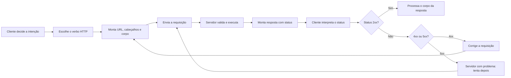
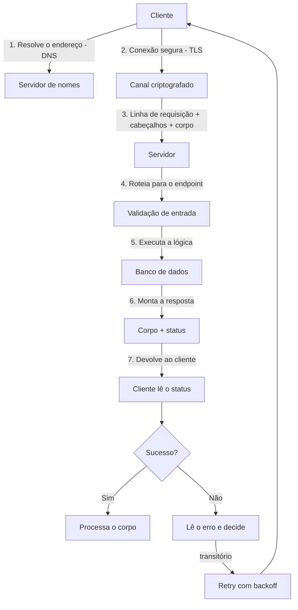

# Capítulo 6: Como os Sistemas se Comunicam: HTTP, Contratos e Integração

## 1. Introdução

No Capítulo 5, você mapeou a anatomia dos sistemas: cliente, API, servidor e banco. Agora vamos estudar a língua que essa anatomia fala — o protocolo HTTP e os contratos que definem cada conversa [1]. Entender HTTP é entender a própria mecânica da integração: por que uma requisição funciona, por que outra falha e como os sistemas — humanos e agentes — negociam trocas de informação [2]. É a mesma disciplina que rege o Git: versionar, rastrear e reverter mudanças em contratos é tão essencial quanto em código [4].

Este capítulo tem três objetivos. Primeiro, dominar os verbos HTTP — GET, POST, PUT, DELETE — e o que cada um significa no contrato da API [1]. Segundo, decodificar os códigos de status: o que diferencia um 200 de um 404, e por que o 500 é o mais temido [3]. Terceiro, entender o ciclo de vida de uma requisição — da construção do pedido à interpretação da resposta — e como os agentes de IA exploram exatamente esse ciclo ao chamar ferramentas [7]. Ao final, a integração entre sistemas deixará de ser um mistério e passará a ser um mapa que você lê com fluência [2].

## 2. Explica

### 2.1 HTTP: O Protocolo da Web

HTTP — Hypertext Transfer Protocol — é o protocolo que define como clientes e servidores trocam mensagens na web [1]. O protocolo é um conjunto de regras: como formatar o pedido, como formatar a resposta e como indicar sucesso ou falha. A simplicidade do HTTP é a chave da sua ubiquidade: qualquer sistema, em qualquer linguagem, pode conversar com qualquer outro, desde que siga as mesmas regras [3]. Para os agentes de IA, o HTTP é a língua franca: a maioria das ferramentas que eles chamam — de consultas a banco a serviços externos — é exposta como uma API HTTP [7]. E assim como o HTTP padroniza a fala entre sistemas, arquivos como AGENTS.md padronizam a fala entre humanos e agentes dentro do repositório [14].

### 2.2 Os Verbos HTTP: A Intenção da Requisição

Cada verbo HTTP carrega uma intenção [1]. O GET pede uma leitura: deve ser seguro e idempotente — chamá-lo não muda o estado do servidor. O POST cria um recurso novo: envia dados e espera a criação. O PUT substitui um recurso inteiro; o PATCH o modifica parcialmente; o DELETE o remove [3]. A escolha correta do verbo é parte do contrato: usar GET para algo que altera estado é uma violação de contrato que quebra caches e confunde consumidores [1].

### 2.3 Os Códigos de Status: A Resposta Padronizada

A resposta HTTP começa com um código de status de três dígitos, organizado em famílias [3]. Os 2xx indicam sucesso (200 OK, 201 Created). Os 3xx indicam redirecionamento. Os 4xx indicam erro do cliente: 400 é requisição malformada, 401 é não autenticado, 403 é proibido, 404 é recurso inexistente. Os 5xx indicam erro do servidor: 500 é erro interno, 503 é serviço indisponível [1]. Aprender a ler o código de status é aprender o primeiro veredito de qualquer requisição — e é o mesmo reflexo que um agente usa ao decidir se sua chamada de ferramenta foi bem-sucedida [7].

### 2.4 O Ciclo de Vida de uma Requisição

Uma requisição completa atravessa etapas bem definidas [1]: o cliente monta a mensagem com verbo, cabeçalhos e corpo; a mensagem viaja pela rede até o servidor; o servidor valida, executa a lógica e monta a resposta; a resposta viaja de volta; o cliente interpreta o status e o corpo. Cada etapa pode falhar — e o diagnóstico da falha é o trabalho do integrador [2]. Os agentes de IA percorrem esse ciclo inteiro a cada chamada de ferramenta: montam a requisição estruturada, recebem a resposta e a incorporam ao raciocínio [7].

### 2.6 Cabeçalhos e Corpo: O Envelope e a Carta

A requisição HTTP tem duas partes que vale separar mentalmente [1]: os cabeçalhos (headers) e o corpo (body). Os cabeçalhos são o envelope — metadados sobre a comunicação: tipo de conteúdo, autenticação, idioma, cache. O corpo é a carta — os dados enviados ou recebidos [1]. No POST, o corpo carrega os dados a criar; na resposta, o corpo carrega o resultado [3]. Para os agentes, os cabeçalhos têm um papel estratégico: é neles que trafegam credenciais de autenticação — e um agente mal instruído pode vazar um token em um log [2]. A engenharia de contexto ensina o agente a nunca expor cabeçalhos sensíveis — a mesma disciplina que o Capítulo 5 apresentou sobre segurança [10].

### 2.7 Autenticação e Autorização na Comunicação

A conversa HTTP frequentemente exige provar identidade [3]. A autenticação verifica quem você é: via chave de API, token Bearer, ou cookies de sessão. A autorização verifica o que você pode fazer: quais recursos e operações estão liberados [3]. O status 401 indica falha de autenticação; o 403 indica falha de autorização — uma distinção que todo integrador precisa ler com precisão [1]. Na era agêntica, essa distinção é ainda mais crítica: quando um agente recebe um 401, a causa pode estar no agente (token errado) ou no serviço (token expirado); quando recebe um 403, a causa é de permissão — e o harness precisa decidir se deve tentar de novo ou escalar [7]. Cada etapa pode falhar — e o diagnóstico da falha é o trabalho do integrador [2]. Os agentes de IA percorrem esse ciclo inteiro a cada chamada de ferramenta: montam a requisição estruturada, recebem a resposta e a incorporam ao raciocínio [7]. A capacidade de acompanhar esse ciclo sem se perder é uma questão de atenção — e a atenção se degrada quando o contexto cresce demais, o fenômeno conhecido como context rot [15].

### 2.5 Contratos: A Especificação da Conversa

O contrato da API é a especificação formal da conversa: quais rotas existem, quais verbos cada rota aceita, qual esquema de dados entra e sai [3]. Contratos explícitos — como o OpenAPI — permitem gerar documentação, testes e até clientes automaticamente. Para agentes, o contrato mais importante é o JSON Schema das ferramentas: nome, descrição e parâmetros — a especificação que o modelo usa para decidir como chamar [7]. A qualidade do contrato determina a qualidade da integração: contratos vagos produzem agentes que erram a chamada [2]. Estudos empíricos mostram que contratos e instruções bem estruturados reduzem o tempo de execução dos agentes em quase 29% [13].

### 2.8 Idempotência e Segurança da Requisição

Duas propriedades dos verbos HTTP que todo profissional conhece: a idempotência e a segurança [1]. Um método é seguro se não altera o estado do servidor — GET é seguro; um método é idempotente se chamá-lo várias vezes produz o mesmo resultado — GET, PUT e DELETE são idempotentes; POST não é [1]. Essas propriedades importam na prática: retransmitir um GET duplicado é inofensivo; retransmitir um POST duplicado pode criar recursos duplicados [3]. Na era agêntica, a idempotência vira uma exigência de design: agentes que fazem retry de chamadas (por timeouts ou erros de rede) precisam de APIs idempotentes — caso contrário, o mesmo POST executado duas vezes corrompe os dados [2]. O harness que você vai estudar trata esse problema com chaves de idempotência: o cliente envia um identificador único, e o servidor ignora requisições repetidas com a mesma chave [7]. Contratos explícitos — como o OpenAPI — permitem gerar documentação, testes e até clientes automaticamente. Para agentes, o contrato mais importante é o JSON Schema das ferramentas: nome, descrição e parâmetros — a especificação que o modelo usa para decidir como chamar [7]. A qualidade do contrato determina a qualidade da integração: contratos vagos produzem agentes que erram a chamada [2]. Estudos empíricos mostram que contratos e instruções bem estruturados — como os de AGENTS.md — reduzem o tempo de execução dos agentes em quase 29%, porque eliminam ambiguidade na comunicação [13]. A engenharia de contexto, que orienta como apresentar contratos e dados ao modelo, é a disciplina que a Anthropic formalizou em seu guia para agentes [9].

## 3. Ilustra

### 3.1 A Analogia do Correio

O HTTP é um sistema de correio com regras rígidas. Você (o cliente) escreve uma carta (a requisição) com um verbo no envelope: "CONSULTAR" (GET) para ler, "CADASTRAR" (POST) para criar [1]. O endereço é a URL; os dados extras vão no corpo. O destinatário (o servidor) responde com outra carta (a resposta) que começa com um veredito padronizado: "entregue" (200), "endereço inexistente" (404), "destinatário em manutenção" (503) [3]. O agente de IA é o cliente mais eficiente do correio: lê o cardápio de operações, escreve cartas precisas e interpreta os vereditos — repetindo o ciclo até obter o que precisa [7]. Essa arquitetura — LLM, memória, planejamento e ferramentas — é o framework que Lilian Weng formalizou como a base dos agentes autônomos [8].

### 3.2 O Diagrama do Ciclo de Vida da Requisição



### 3.3 O Agente como Cliente do Protocolo

O mesmo ciclo descreve uma chamada de ferramenta de um agente: o modelo decide que precisa de dados externos, monta a requisição estruturada (o equivalente ao verbo e ao corpo), envia, recebe o status e incorpora a resposta ao raciocínio [7]. Quando a chamada falha com 4xx, o agente ajusta a requisição; quando falha com 5xx, ele reporta o problema do serviço [7]. Entender o protocolo é entender o que o agente está fazendo — e como avaliar se ele está fazendo certo [2].

### 3.4 O Correio em Escala: Filas e Retries

Quando o correio precisa processar milhões de cartas, entram em cena as filas e os retries [1]. Uma fila de mensagens desacopla o produtor do consumidor: o cliente publica a carta na fila, e o servidor a processa quando pode [3]. Se o processamento falha, a carta volta para a fila com uma política de retry — e o backoff exponencial evita sobrecarregar o serviço (a origem do 429) [7]. Na era agêntica, as filas são a infraestrutura das tarefas de longa duração: um agente que pede uma análise pesada não espera a resposta na mesma requisição — publica a tarefa, recebe um identificador e consulta o resultado depois [2]. Esse padrão de comunicação assíncrona é o que permite aos harnesses orquestrar dezenas de agentes sem travar [7]. Quando a chamada falha com 4xx, o agente ajusta a requisição; quando falha com 5xx, ele reporta o problema do serviço [7]. Entender o protocolo é entender o que o agente está fazendo — e como avaliar se ele está fazendo certo [2]. A configuração persistente que orienta o agente sobre como integrar é a mesma que o Tian Pan documenta para CLAUDE.md e AGENTS.md [17].

### 3.5 O Diagrama do Ciclo de Vida de uma Chamada

O ciclo completo da requisição — que a seção 2.9 descreveu — merece o seu diagrama [3]:



O diagrama deixa visível o que o texto descreve: cada etapa tem um nome e um ponto de falha [3]. Quando uma integração quebra, o profissional percorre o diagrama etapa por etapa — DNS? TLS? Roteamento? Validação? Banco? — até encontrar a etapa que falhou [3]. O diagrama é o mapa do diagnóstico [3].

### 3.6 O Garçom Que Atende Máquinas

A analogia do restaurante ganha o seu desdobramento agêntico: o garçom que atende máquinas [3]. No restaurante do Capítulo 5, o garçom atendia clientes humanos [3]. Na era agêntica, o mesmo cardápio é lido por agentes — que pedem com a precisão do protocolo e erram com a teimosia do loop [3]. O garçom — a API — trata os dois da mesma forma: pedido válido, serviço; pedido inválido, status de erro claro [3].

A lição da analogia é a consistência [3]. Um cardápio ambíguo confunde humanos e agentes na mesma medida [3]. Um status de erro vago — "erro de sistema" — não ensina nem humano nem máquina a corrigir [3]. A integração bem desenhada fala uma língua única para as duas audiências: o contrato [3]. E é essa língua única que os servidores MCP — o cardápio padronizado da era agêntica — formalizam [5]. Quando o garçom atende máquinas, o cardápio precisa ser perfeito — porque a máquina não improvisa [3].

### 3.7 O Telefone sem Fio

Uma analogia de fechamento para a integração: o telefone sem fio [3]. Cada salto da mensagem — de sistema a sistema — é um nó da cadeia [3]. O contrato é o que garante que a mensagem não se corrompa no salto: o formato exato, o verbo certo, o campo obrigatório [3]. O status é a confirmação de recebimento — ou o aviso de que a mensagem não chegou [3]. E o rastro é a gravação da conversa, para saber onde o mal-entendido aconteceu [3].

No telefone sem fio real, a mensagem se corrompe por ruído [3]. Na integração, o ruído é a ambiguidade — e o contrato é o que elimina a ambiguidade [3]. Uma integração sem contrato é um telefone sem fio: a mensagem chega, mas nunca se sabe se chegou inteira [3]. Com contrato, status e rastro, a integração vira uma ligação registrada: cada palavra, cada confirmação, cada desvio — documentado [3]. A era agêntica só amplifica a necessidade: a máquina não improvisa o que não entende — ela repete o mal-entendido [3].

## 4. Técnica

### 4.1 Consumindo uma API com Python

Vamos consumir a API do Capítulo 5 usando a biblioteca padrão do Python — `urllib` — para ver o ciclo completo da requisição na prática [1]:

```python
import json
from urllib import request, error


def buscar_transacoes():
    url = "http://localhost:8000/transacoes"
    requisicao = request.Request(url, method="GET")
    try:
        with request.urlopen(requisicao, timeout=5) as resposta:
            status = resposta.getcode()
            corpo = resposta.read().decode("utf-8")
            print(f"Status: {status}")
            dados = json.loads(corpo)
            for t in dados["transacoes"]:
                print(f"  {t['id']}: {t['descricao']} - R$ {t['valor']:.2f}")
            return dados
    except error.HTTPError as e:
        print(f"Erro HTTP {e.code}: {e.reason}")
        return None
    except error.URLError as e:
        print(f"Erro de conexão: {e.reason}")
        return None


if __name__ == "__main__":
    buscar_transacoes()
```

### 4.2 Criando um Recurso com POST

Agora vamos criar uma transação nova com POST — o verbo que envia dados e espera a criação [3]:

```python
import json
from urllib import request


def criar_transacao(descricao, valor):
    url = "http://localhost:8000/transacoes"
    corpo = json.dumps({"descricao": descricao, "valor": valor}).encode("utf-8")
    cabecalhos = {"Content-Type": "application/json"}
    requisicao = request.Request(url, data=corpo, headers=cabecalhos, method="POST")
    with request.urlopen(requisicao, timeout=5) as resposta:
        print(f"Status: {resposta.getcode()}")
        print(resposta.read().decode("utf-8"))


if __name__ == "__main__":
    criar_transacao("Farmácia", -89.90)
```

Para que o POST funcione, a API do Capítulo 5 precisa do método `do_POST` — que é o seu exercício: implemente o `do_POST` no servidor, faça a criação persistir no banco em memória e devolva o status 201 Created com o recurso criado [3]. Esse exercício consolida o ciclo inteiro: verbo, contrato, status e integração [1].

### 4.3 Validando o Contrato

A validação de contrato é o que transforma integração em engenharia [2]. Para cada requisição, verifique: o verbo correto para a intenção, o corpo no formato esperado pelo contrato, o status esperado e o formato da resposta [3]. Quando um agente de IA chama uma ferramenta, ele segue exatamente essa disciplina — e você vai usá-la no Capítulo 7 para entender como o modelo monta as chamadas [7].

### 4.4 Tabela de Referência dos Códigos de Status

Para fechar a técnica, consolide a tabela de referência dos códigos que você encontrará com mais frequência [3]: o 200 OK é o sucesso genérico; o 201 Created é o sucesso de criação (POST); o 204 No Content é sucesso sem corpo; o 301 e o 302 são redirecionamentos; o 400 Bad Request é requisição malformada; o 401 Unauthorized é autenticação ausente ou inválida; o 403 Forbidden é permissão negada; o 404 Not Found é recurso inexistente; o 409 Conflict é conflito de estado; o 429 Too Many Requests é limite de taxa atingido; e o 500 Internal Server Error, o 502 Bad Gateway e o 503 Service Unavailable são falhas do servidor [3]. Saber essa tabela de cor — como o profissional sabe os verbos — elimina a maior parte do mistério da integração [1]. O 429 merece atenção especial na era agêntica: agentes que chamam APIs em loop frequentemente estouram limites de taxa, e o harness precisa respeitar o retry com backoff [7]. Para cada requisição, verifique: o verbo correto para a intenção, o corpo no formato esperado pelo contrato, o status esperado e o formato da resposta [3]. Quando um agente de IA chama uma ferramenta, ele segue exatamente essa disciplina — e você vai usá-la no Capítulo 7 para entender como o modelo monta as chamadas [7]. O arco histórico que trouxe os agentes até aqui — do autocomplete à integração autônoma — é o mesmo que o CodeRabbit documenta em sua história do coding assistido por IA [19]. No Capítulo 7, a ferramenta interativa de tokenização da OpenAI vai tornar concreto o que o modelo vê em cada mensagem [18].

### 4.5 O Script de Teste de API

A integração pede verificação automática — e o script abaixo é um mini-testador de API, o embrião do que os harnesses de 2026 rodam contra cada contrato [3]:

```python
import json
import urllib.error
import urllib.request


def testar_endpoint(metodo, url, esperado):
    """Executa uma chamada e valida o status esperado."""
    req = urllib.request.Request(url, method=metodo, headers={"User-Agent": "tester/1.0"})
    try:
        with urllib.request.urlopen(req, timeout=10) as resp:
            corpo = resp.read().decode("utf-8")
            ok = resp.status == esperado
            print(f"{metodo} {url} -> {resp.status} (esperado {esperado}) {'OK' if ok else 'FALHA'}")
            if ok and corpo:
                dados = json.loads(corpo)
                print(f"  tipo do corpo: {type(dados).__name__}")
            return ok
    except urllib.error.HTTPError as e:
        ok = e.code == esperado
        print(f"{metodo} {url} -> {e.code} (esperado {esperado}) {'OK' if ok else 'FALHA'}")
        return ok


if __name__ == "__main__":
    testar_endpoint("GET", "https://api.github.com/repos/git/git", 200)
    testar_endpoint("GET", "https://api.github.com/repos/git/nao-existe-xyz", 404)
```

O script automatiza a inspeção que você fez à mão: chamar, ler o status, comparar com o esperado [3]. Note que o teste de erro (404) é tão importante quanto o teste de sucesso — a integração que só testa o caminho feliz é a integração que quebra em produção [20].

### 4.6 A Fábrica de Requisições com Retry

A integração profissional não desiste na primeira falha — ela repete com método [3]. O padrão retry com backoff: após um erro transitório, espera um tempo curto e tenta de novo, com o intervalo crescendo a cada tentativa [3]. O código abaixo implementa o padrão — a mesma política que os harnesses aplicam às chamadas de agentes [7]:

```python
import time
import urllib.error
import urllib.request


def chamar_com_retry(url, tentativas=3, base=1.0):
    """Chama uma URL com retry exponencial para erros transitórios."""
    for n in range(tentativas):
        try:
            with urllib.request.urlopen(url, timeout=10) as resp:
                print(f"Tentativa {n + 1}: OK ({resp.status})")
                return resp.read().decode("utf-8")
        except urllib.error.HTTPError as e:
            if e.code >= 500:
                espera = base * (2 ** n)
                print(f"Tentativa {n + 1}: erro {e.code}, aguardando {espera:.1f}s")
                time.sleep(espera)
            else:
                raise  # erro do cliente: repetir não resolve
    raise RuntimeError(f"Falha após {tentativas} tentativas")


if __name__ == "__main__":
    chamar_com_retry("https://api.github.com/repos/git/git")
```

A distinção mais importante do padrão é o que NÃO repetir: erros de cliente (4xx) não melhoram com retry — repetir só amplifica o problema [3]. Erros de servidor (5xx) e falhas de rede merecem retry [3]. Essa distinção — repetir o transitório, não o permanente — é uma das decisões que separam integrações amadoras de profissionais [3].

### 4.7 O Verificador de Status

Para fechar a parte técnica, um script que transforma a tabela de status em ferramenta — o mesmo que o profissional consulta ao interpretar uma resposta [3]:

```python
def interpretar_status(codigo):
    """Classifica um código HTTP e sugere o próximo passo."""
    faixas = [
        (100, 199, "Informativo", "Aguardar resposta definitiva"),
        (200, 299, "Sucesso", "Processar o corpo da resposta"),
        (300, 399, "Redirecionamento", "Seguir o cabeçalho Location"),
        (400, 499, "Erro do cliente", "Corrigir a requisição; repetir não resolve"),
        (500, 599, "Erro do servidor", "Erro transitório; retry com backoff"),
    ]
    for inicio, fim, nome, acao in faixas:
        if inicio <= codigo <= fim:
            print(f"{codigo}: {nome}")
            print(f"Próximo passo: {acao}")
            return nome
    print(f"{codigo}: código desconhecido")
    return "desconhecido"


if __name__ == "__main__":
    for codigo in [200, 301, 404, 429, 500, 503]:
        interpretar_status(codigo)
        print()
```

O script codifica a lição central do capítulo: o status não é um número — é uma instrução de próximo passo [3]. O 404 não é "deu errado" — é "o recurso não existe, verifique o contrato" [3]. O 500 não é "deu errado" — é "erro no servidor, pode repetir" [3]. O integrador que interpreta o status age com método; o que só vê "erro", adivinha [3]. E é essa interpretação — a mesma — que os harnesses ensinam aos agentes [7].

## 5. Aplica

### 5.1 Onde Isso Vive no Mundo Real

Toda integração moderna é uma conversa HTTP: o app que consulta o clima, o pagamento que valida o cartão, o agente que busca dados — todos seguem o mesmo ciclo de verbo, status e contrato [1]. A cada mudança nesses contratos, o circuito de integração contínua que você dominou no Capítulo 4 roda a suíte para garantir que nada quebrou [12]. As plataformas de API expõem documentação interativa onde você testa cada rota e vê o status em tempo real [3]. E a observabilidade que você estudou no Capítulo 4 instrumenta essas conversas: traces mostram o caminho da requisição pelos serviços, métricas medem latência e erros [10][11]. Em infraestruturas grandes, é essa telemetria que permite aos agentes de coding navegar e diagnosticar sistemas — o diferencial dos melhores agentes de 2026 [6]. Com a adoção de IA em 92% das equipes, dominar essa integração é o que separa quem consome ferramentas de quem as projeta [20].

### 5.2 O Erro Comum do Iniciante

O erro clássico de quem integra é ignorar o código de status: receber um 500 e assumir que "o servidor está com problema", sem olhar o 404 que veio antes — ou pior, ignorar o corpo da resposta, onde está o detalhe do erro [3]. A correção — e aqui está o diferencial que separa o profissional — é tratar cada resposta como evidência: leia o status, leia o corpo, forme a hipótese e só então aja [2]. Com agentes, o erro se multiplica: se você não ensina o agente a ler status e corpo, ele repete a mesma chamada errada indefinidamente [7].

### 5.3 O Padrão Profissional em 2026

O integrador profissional trata contrato como código: versiona a especificação, testa contra ela e exige que os agentes sigam o mesmo contrato [3]. Quando um agente precisa chamar uma API, a descrição da ferramenta — o JSON Schema — é o contrato que o modelo usa [7]. O Model Context Protocol padroniza essa exposição: servidores MCP descrevem ferramentas, e os agentes as chamam pelo mesmo ciclo HTTP que você dominou neste capítulo [5].

### 5.4 Testando Contratos com Mocks

A integração de contratos é testável — e a técnica central é o mock [12]. Em vez de chamar o serviço real nos testes (lento, frágil e dependente de rede), o profissional simula o contrato: um mock devolve respostas predefinidas para as rotas esperadas [1]. O teste de contrato então verifica: o cliente monta a requisição certa, e o mock devolve a resposta prevista [12]. Na era agêntica, os mocks têm um papel duplo: além de testar o código, servem para testar o agente — o harness simula a API e observa se o agente chama as ferramentas com os argumentos certos [2]. Essa técnica é a base da avaliação de agentes que você estudará nos volumes de Eval Engineering [20].

### 5.5 A Evolução do Contrato: Versionamento

Contratos evoluem — e a forma como evoluem define a confiabilidade da integração [3]. O versionamento de API permite mudanças sem quebrar consumidores: a URL com versão (`/v1/`, `/v2/`), cabeçalhos de versão ou contratos compatíveis com adições [3]. A regra de ouro: mudanças que quebram o contrato exigem versão nova; adições compatíveis podem conviver [3]. Na era agêntica, o versionamento protege os agentes: quando um serviço muda, os agentes que dependem dele precisam de aviso — e o harness, via AGENTS.md, instrui a atualização do contrato nos arquivos de instrução [14]. Quando um agente precisa chamar uma API, a descrição da ferramenta — o JSON Schema — é o contrato que o modelo usa [7]. O Model Context Protocol padroniza essa exposição: servidores MCP descrevem ferramentas, e os agentes as chamam pelo mesmo ciclo HTTP que você dominou neste capítulo [5]. E é essa mesma visão — o software falando com o software, e a IA orquestrando — que o Karpathy chama de Software 3.0 na sua palestra fundacional [1] e aprofunda na análise do Sequoia Ascent 2026 [16].

### 5.6 Integração e Segurança: o Contrato sob Ataque

Toda integração é uma superfície de ataque em potencial [3]. Um endpoint HTTP exposto recebe, além de tráfego legítimo, tentativas de exploração: injeção de dados, chamadas sem autenticação, payloads malformados [3]. O profissional trata a integração com três posturas [3]. A primeira é a validação rigorosa de entrada: nada que chega pela rede é confiável até ser validado [3]. A segunda é a autenticação e autorização em cada fronteira: a API sabe quem chama e o que esse quem pode fazer [3]. A terceira é o registro: cada chamada deixa rastro — quem, quando, o quê — para auditoria e diagnóstico [3].

Na era agêntica, a superfície de ataque ganha um vetor novo: o próprio agente [7]. Um agente com acesso a uma API pode, por engano ou por prompt malicioso, executar chamadas que um humano não executaria [7]. A defesa é a mesma disciplina de contrato que você dominou neste capítulo — escopo mínimo de ferramentas, validação em cada fronteira e rastro de cada chamada [7]. O function calling que você verá no Capítulo 9 é exatamente essa porta controlada: o agente só chama o que o contrato expõe [9].

### 5.7 O Fluxo de Integração Agêntica Completo

Vale consolidar o fluxo completo de uma integração agêntica — o mesmo cenário que os harnesses profissionais executam milhões de vezes por dia [2]. O agente recebe uma tarefa e precisa de um dado externo [2]. Ele monta a requisição segundo o contrato documentado — verbo, cabeçalhos, corpo no formato certo [3]. A requisição cruza a API, que valida, autentica e responde [3]. O agente lê o status e o corpo — a inspeção que você treinou neste capítulo — e decide o próximo passo [2]. Se algo falha, ele lê o erro, ajusta e tenta novamente, dentro dos limites que o harness define [2].

Cada passo desse fluxo é uma habilidade que este livro construiu [1]: HTTP (Capítulo 6), inspeção (Capítulo 2), validação (Capítulo 4) e, na frente, o vocabulário do agente (Capítulo 9) [1]. A integração agêntica não é mágica — é a mesma engenharia de contratos aplicada com rigor e disciplina [3]. Quando você projetar MCP servers, nos volumes seguintes, estará construindo exatamente esses fluxos em escala [5].

### 5.8 O Checklist do Integrador

A integração madura se apoia em um checklist que vale repetir antes de cada chamada em produção [3]. Primeiro: o contrato — você leu a documentação da API e sabe o verbo, os parâmetros e o formato da resposta [3]. Segundo: o status — você sabe qual código esperar em cada resultado e o que fazer com os erros [3]. Terceiro: o corpo — você sabe interpretar o conteúdo real da resposta, não só o que o exemplo mostrou [3]. Quarto: a idempotência — operações que podem se repetir têm chave de idempotência [3]. Quinto: o registro — a chamada deixa rastro para diagnóstico [3].

O mesmo checklist se aplica a agentes — com uma camada extra [7]. O agente que chama uma API precisa das mesmas respostas: o contrato documentado no contexto, a regra de status nas instruções, e a política de repetição no harness [7]. Quando um agente erra uma integração, o diagnóstico começa pelo mesmo lugar que para um humano: o contrato foi lido? O status foi interpretado? O rastro existe? [7] Essa simetria — o checklist é um só — é o que torna a integração agêntica uma extensão natural da integração humana [2].

### 5.9 O Custo do Contrato Quebrado

Vale medir o que custa um contrato quebrado [3]. Quando uma API muda o formato da resposta sem avisar, cada consumidor quebra — e, na era agêntica, cada agente consumidor quebra repetidamente, porque cada nova execução tenta de novo [3]. Quando o status de erro não é tratado, o consumidor interpreta o erro como sucesso — e a falha vira silenciosa, o tipo mais caro [2]. Quando o corpo não é validado, os dados errados entram no sistema e se propagam [3].

A defesa é exatamente o que o capítulo ensinou: contrato documentado, status interpretado, corpo inspecionado e versionamento que protege [3]. A soma dessas práticas é a confiabilidade — e a confiabilidade é o ativo que os sistemas agênticos mais precisam [2]. Um agente que opera sobre integrações confiáveis pode ser autônomo; sobre integrações quebradas, ele amplifica a confusão [2]. A integração não é um detalhe técnico — é a fundação sobre a qual a autonomia é construída [1].

### 5.10 O Checklist Agêntico de Integração

O checklist do integrador, aplicado a agentes, ganha três camadas que o profissional de 2026 conhece [7]. A camada do contrato: o agente só chama APIs cujo contrato está documentado no contexto — rotas, parâmetros, formatos, status [7]. A camada do erro: o agente interpreta o status antes de repetir — e repete apenas erros transitórios, com backoff [7]. A camada do rastro: cada chamada do agente fica registrada, com o quê, quando e qual foi a resposta [7].

O checklist é a ponte entre este capítulo e a governança de harnesses [2]. Quando um agente integra mal, o diagnóstico percorre as mesmas camadas do checklist humano: o contrato estava no contexto? O status foi lido? O rastro existe? [7] A integração agêntica não é uma disciplina nova — é a disciplina deste capítulo, executada por máquinas sob supervisão humana [2]. E é essa mesma disciplina que os volumes de MCP Engineering vão padronizar em escala [5].

### 5.11 O Custo da Integração Negligenciada

Vale um fechamento sobre o custo real de negligenciar a integração [3]. Uma API chamada sem ler o contrato gera integração quebrada [3]. Um status ignorado transforma erro em falha silenciosa [2]. Um corpo não inspecionado propaga dados errados pelo sistema [3]. Na era agêntica, cada um desses erros se multiplica: o agente repete o padrão errado a cada execução, e a escala da automação amplifica o dano [2].

O custo é evitável com o que o capítulo inteiro construiu: contrato, status, corpo, idempotência, registro e retry seletivo [3]. A integração bem feita é invisível — funciona, registra e se adapta [3]. A mal feita é visível em cada incidente [3]. O profissional que domina a língua HTTP — este capítulo — é o que mantém os sistemas de 2026 conversando, humanos e agentes incluídos [2].

### 5.12 O Glossário do Integrador

O capítulo termina com o vocabulário que você vai usar em toda conversa de integração [3]. Requisição: o pedido com verbo, cabeçalhos e corpo [3]. Resposta: o retorno com status e corpo [3]. Status: o veredito padronizado — 2xx sucesso, 3xx redirecionamento, 4xx erro do cliente, 5xx erro do servidor [3]. Contrato: a especificação do que pode ser pedido e devolvido [3]. Idempotência: a propriedade de repetir sem duplicar [3]. Retry: a repetição seletiva com backoff [3]. Versionamento: a evolução do contrato sem quebrar consumidores [3].

Esse vocabulário é a língua comum de toda a integração — humana, agêntica e de máquina a máquina [1]. Quando os volumes seguintes falarem de MCP servers, JSON Schema e function calling, você estará conversando na mesma língua da integração [5]. O glossário não é um resumo — é o instrumento de precisão do integrador [3].

### 5.13 O Custo de Integrar no Escuro

Fechar com o custo de integrar no escuro — sem contrato, sem status, sem rastro [3]. Integrar no escuro é ligar dois sistemas e torcer [3]. Quando algo falha — e falha — o diagnóstico começa do zero, sem pistas [3]. Quando o contrato muda, ninguém avisa e tudo quebra ao mesmo tempo [3]. Quando o erro é silencioso, a falha se propaga antes de ser notada [2].

A era agêntica multiplica o custo do escuro [2]. Agentes que integram no escuro repetem erros em escala, sem perceber [3]. O harness que integra no escuro não consegue nem diagnosticar — não há rastro [7]. A integração na luz — contrato, status, rastro — é o que permite a humanos e máquinas operarem com confiança [3]. Este capítulo acendeu a luz [1].

## 6. Conclusão

Neste capítulo, você aprendeu a língua da integração: os verbos HTTP como a intenção da requisição [1]; os códigos de status como o veredito padronizado da resposta [3]; e o ciclo de vida completo — da montagem do pedido à interpretação do resultado [1]. Você consumiu uma API com GET e criou recursos com POST, exercitando contrato, status e integração na prática [3].

Resumindo em três pontos: primeiro, os verbos HTTP carregam a intenção — GET lê, POST cria, PUT substitui, DELETE remove [1]; segundo, os códigos de status são o veredito padronizado — e ler a família do código é o primeiro reflexo do integrador [3]; terceiro, a integração é um ciclo completo — e o agente percorre o mesmo ciclo a cada chamada de ferramenta [7]. Com esses três pontos, você fala a língua dos sistemas — a mesma que os agentes falam [2].

### O Desafio Deste Capítulo

O desafio em três níveis. Nível um: implemente o `do_POST` no servidor do Capítulo 5 e devolva 201 Created com o recurso criado, validando o corpo recebido. Nível dois: crie um cliente que trate os quatro cenários de status — 200, 404, 400 e 500 — com mensagens de diagnóstico adequadas. Nível três: peça a um agente para integrar o cliente com a API e avalie se o agente leu corretamente os status — especialmente o 429 — e implementou retry com backoff [1]. Os três níveis exercitam a implementação do contrato, o tratamento de erros e a supervisão de integrações agênticas [3].

Essa é a camada que conecta tudo: os agentes falam HTTP, os harnesses expõem ferramentas e os contratos definem o que é possível [2]. No próximo capítulo, vamos mergulhar no lado mais fascinante da pilha: como um modelo de linguagem realmente processa o texto que recebe — tokens, janela de contexto e o que o modelo "vê" em cada conversa [7].

## 7. Referências Bibliográficas

[1] KARPATHY, Andrej. Software 3.0: Software in the Age of AI. Disponível em: https://www.latent.space/p/s3. Acesso em: 5 ago. 2026.

[2] SITEPOINT. Vibe Coding 2026: The Complete Guide to AI-First Development. Disponível em: https://www.sitepoint.com/vibe-coding-2026-complete-guide/. Acesso em: 5 ago. 2026.

[3] PROMPTING GUIDE. Function Calling in AI Agents. Disponível em: https://www.promptingguide.ai/agents/function-calling. Acesso em: 5 ago. 2026.

[4] CHACON, Scott; STRAUB, Ben. Pro Git. 2. ed. Apress/Git SCM, 2014. Disponível em: https://git-scm.com/book/en/v2. Acesso em: 5 ago. 2026.

[5] ANTHROPIC. Introducing the Model Context Protocol. Disponível em: https://www.anthropic.com/news/model-context-protocol. Acesso em: 5 ago. 2026.

[6] MIGHTYBOT. Best AI Coding Agents in 2026, Ranked. Disponível em: https://mightybot.ai/blog/coding-ai-agents-for-accelerating-engineering-workflows/. Acesso em: 5 ago. 2026.

[7] OPENAI. Function Calling Guide. Disponível em: https://developers.openai.com/api/docs/guides/function-calling. Acesso em: 5 ago. 2026.

[8] WENG, Lilian. LLM-Powered Autonomous Agents. Disponível em: https://lilianweng.github.io/posts/2023-06-23-agent/. Acesso em: 5 ago. 2026.

[9] ANTHROPIC. Effective Context Engineering for AI Agents. Disponível em: https://www.anthropic.com/engineering/effective-context-engineering-for-ai-agents. Acesso em: 5 ago. 2026.

[10] EWASCHUK, Rob; BEYER, Betsy (Ed.). Site Reliability Engineering: Monitoring Distributed Systems. Google SRE Book. Disponível em: https://sre.google/sre-book/monitoring-distributed-systems/. Acesso em: 5 ago. 2026.

[11] OPENTELEMETRY. What is OpenTelemetry?. Disponível em: https://opentelemetry.io/docs/what-is-opentelemetry/. Acesso em: 5 ago. 2026.

[12] FOWLER, Martin. Continuous Integration. Disponível em: https://martinfowler.com/articles/continuousIntegration.html. Acesso em: 5 ago. 2026.

[13] LULLA, Jai Lal; et al. On the Impact of AGENTS.md Files on the Efficiency of AI Coding Agents. Disponível em: https://arxiv.org/html/2601.20404v1. Acesso em: 5 ago. 2026.

[14] OPENAI / AGENTS.MD FOUNDATION. Open Standards for Agentic Configuration (AGENTS.md). Disponível em: https://agents.md/. Acesso em: 5 ago. 2026.

[15] CHROMA. Context Rot: How Increasing Input Tokens Impacts LLM Performance. Disponível em: https://www.trychroma.com/research/context-rot. Acesso em: 5 ago. 2026.

[16] KARPATHY, Andrej. Sequoia Ascent 2026 Summary (Software 3.0 & Agentic Engineering). Disponível em: https://karpathy.bearblog.dev/sequoia-ascent-2026/. Acesso em: 5 ago. 2026.

[17] TIAN PAN. CLAUDE.md and AGENTS.md: The Configuration Layer That Makes AI Coding Agents Actually Follow Your Rules. Disponível em: https://tianpan.co/blog/2026-02-25-claude-md-agents-md-ai-coding-agent-instruction-files. Acesso em: 5 ago. 2026.

[18] OPENAI. Tokenizer (ferramenta interativa). Disponível em: https://platform.openai.com/tokenizer. Acesso em: 5 ago. 2026.

[19] CODERABBIT. From Copilot to agents: The history of AI coding. Disponível em: https://www.coderabbit.ai/blog/a-very-brief-history-of-ai-coding-from-copilot-to-next-gen-agents. Acesso em: 5 ago. 2026.

[20] KEYHOLE SOFTWARE. Vibe Coding Trends 2026: Adoption, Productivity, and Code Quality Data. Disponível em: https://keyholesoftware.com/vibe-coding-trends-2026/. Acesso em: 5 ago. 2026.
