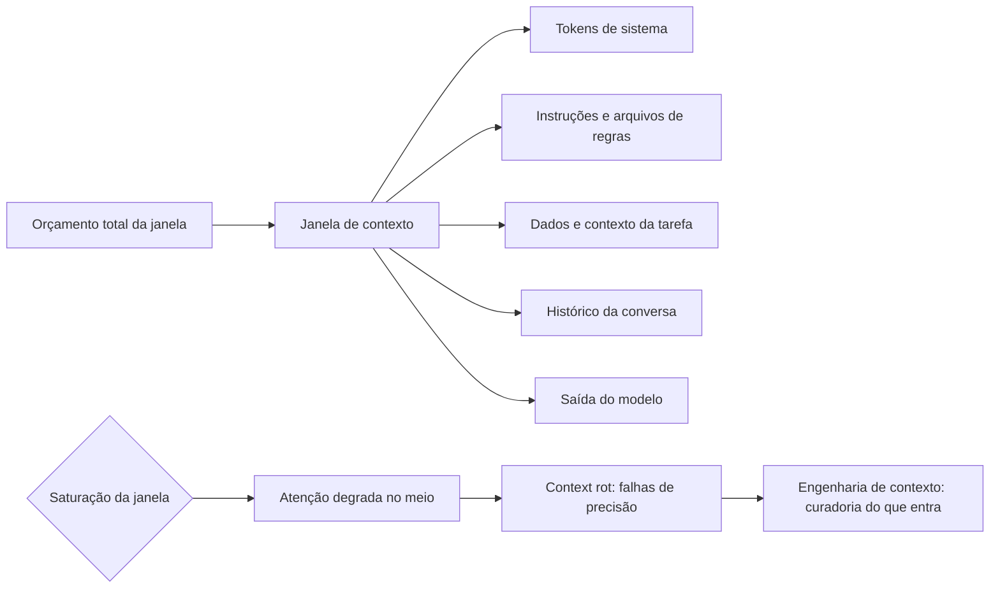
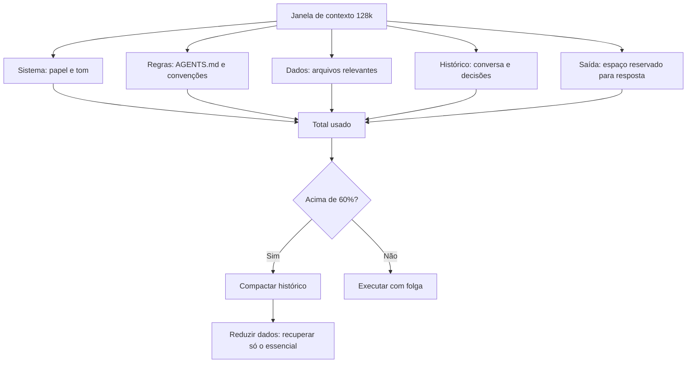

# Capítulo 7: Tokens e Janela de Contexto: o que o Modelo Vê

## 1. Introdução

Chegamos ao coração técnico da série. Nos capítulos anteriores, você entendeu como os sistemas conversam entre si via HTTP e contratos. Agora vamos olhar para dentro da máquina que orquestra tudo: o modelo de linguagem. Entender o que um LLM realmente "vê" quando processa texto é o pré-requisito de todas as disciplinas que virão — Context Engineering, Prompt Engineering, Rules Engineering — porque todas elas manipulam exatamente a mesma coisa: os tokens dentro de uma janela [1].

Este capítulo tem três objetivos. Primeiro, entender o que é um token e como a tokenização converte texto em números [2]. Segundo, dominar o conceito de janela de contexto — o espaço finito de entrada e saída de uma inferência [3]. Terceiro, compreender a distinção crucial entre contexto longo e memória: uma janela de um milhão de tokens não é memória persistente [4]. Ao final, você saberá por que "orçamento de tokens" é dinheiro e atenção — e por que essa é a moeda de toda a série [1].

## 2. Explica

### 2.1 Tokens: os Átomos da Linguagem

Um token não é uma palavra — é um fragmento [2]. Modelos modernos usam tokenização por subpalavras: o texto é quebrado em pedaços que podem ser palavras inteiras, partes de palavras ou até caracteres isolados. O algoritmo mais comum é o Byte-Pair Encoding (BPE), que começa com o alfabeto e vai juntando os pares mais frequentes até formar um vocabulário fixo — tipicamente entre 32 mil e 256 mil tokens [2]. Em inglês, um token equivale em média a cerca de quatro caracteres ou 0,75 palavras; em português, com acentos e morfologia próprios, o custo por palavra costuma ser um pouco maior [2]. A ferramenta interativa de tokenização da OpenAI permite visualizar essa quebra em tempo real — um exercício que recomendamos fazer agora [5]. E é essa contagem que define o custo de cada chamada de API: você paga por token processado [13].

### 2.2 A Janela de Contexto: o Palco da Inferência

A janela de contexto é o limite máximo de tokens — entrada mais saída — que o modelo processa em uma única inferência [3]. Tudo o que você envia — instruções, histórico, dados, o código do repositório — compete pelo mesmo espaço finito [1]. É por isso que a frase "orçamento de tokens" não é metáfora: cada token da janela tem custo monetário e custo de atenção [1]. Modelos modernos alcançam janelas de 1 milhão ou 2 milhões de tokens — o Gemini 1.5 foi um marco nessa escala [6] — mas o custo quadrático da atenção torna cada token adicional progressivamente mais caro de processar [7].

### 2.6 O Custo Real de Cada Token

Para dimensionar a afirmação de que "token é dinheiro", vale quantificar [13]. As APIs de modelos cobram por token de entrada e por token de saída — e os preços variam por modelo [13]. Uma consulta de mil tokens é trivial; um contexto de cem mil tokens por chamada, repetido milhares de vezes por dia, vira uma conta significativa [13]. É por isso que a engenharia de contexto — decidir o que entra na janela — é também uma disciplina financeira [10]. O profissional que otimiza o contexto reduz custo e melhora qualidade ao mesmo tempo: menos tokens, menos distração, respostas melhores [1]. Os livros da série sobre Context Engineering vão detalhar as técnicas de orçamento, mas o princípio é este capítulo: medir antes de enviar [13].

### 2.7 Compactação e Subagentes: Administrando a Janela

Quando a janela enche, duas técnicas profissionais administram o espaço [10]. A compactação resume o histórico antigo em poucos tokens — preservando o essencial e liberando espaço [9]. Os subagentes dividem a tarefa: cada um trabalha com um contexto menor e devolve apenas o resultado ao orquestrador [10]. A Anthropic documenta ambas as técnicas em seu guia de engenharia de contexto: o orçamento de atenção (attention budget) e o descarte dinâmico de histórico [10]. Na prática, um harness agêntico combina as duas: o agente principal mantém o objetivo e o estado; os subagentes executam subtarefas com contexto próprio; e a compactação encerra as conversas longas [10]. Essas técnicas serão o coração dos volumes de Harness Engineering — e você acaba de ver por que existem [9]. Tudo o que você envia — instruções, histórico, dados, o código do repositório — compete pelo mesmo espaço finito [1]. É por isso que a frase "orçamento de tokens" não é metáfora: cada token da janela tem custo monetário e custo de atenção [1]. Modelos modernos alcançam janelas de 1 milhão ou 2 milhões de tokens — o Gemini 1.5 foi um marco nessa escala [6] — mas o custo quadrático da atenção torna cada token adicional progressivamente mais caro de processar [7]. A engenharia de contexto, disciplina central da série, existe exatamente para administrar esse custo [10].

### 2.3 Codificação Posicional: como o Modelo Sabe a Ordem

Como o Transformer processa todos os tokens em paralelo, ele perde a noção natural de ordem — e precisa de um mecanismo para recuperá-la: a codificação posicional [2]. Técnicas como RoPE (Rotary Position Embedding) rotacionam os vetores de representação para preservar as distâncias relativas entre tokens, permitindo estender modelos abertos como o Llama para milhões de tokens [8]. Sem posição, "o cão mordeu o homem" e "o homem mordeu o cão" seriam indistinguíveis — a posição é o que dá sentido à ordem [2].

### 2.4 Contexto Longo não é Memória

A distinção mais importante deste capítulo: contexto longo é o espaço bruto da janela em um dado momento; memória é o que sobrevive entre sessões [1]. Um modelo com janela de um milhão de tokens não "lembra" de você — ele reprocessa tudo o que você enviar a cada vez [4]. E há um limite físico na utilidade da janela grande: o fenômeno conhecido como context rot mostra que a atenção degrada conforme o contexto satura — o modelo perde o foco em informações no meio da janela, falhando até em testes simples de "agulha no palheiro" [9]. A pesquisa da Anthropic sobre engenharia de contexto documenta exatamente esse comportamento e as técnicas de mitigação [10].

### 2.8 Tokenização Multilíngue: o Custo do Português

A tokenização não é neutra em relação à língua [2]. Modelos treinados predominantemente em inglês tokenizam o português de forma menos eficiente: palavras comuns em inglês viram um token só, enquanto palavras portuguesas com acentuação e morfologia própria podem se desdobrar em vários tokens [2]. Na prática, o mesmo texto em português costuma custar mais tokens que sua tradução em inglês — um detalhe que vira decisão de custo em aplicações de produção [13].

Para o profissional, as implicações são concretas [1]. Primeiro, meça o seu caso real: o tokenizador da OpenAI mostra a quebra token por token, e a diferença entre idiomas fica visível imediatamente [5]. Segundo, ao projetar prompts e arquivos de instrução em português, prefira frases diretas — cada palavra redundante é token e dinheiro [13]. Terceiro, ao avaliar o custo de um fluxo multilíngue, não compare apenas caracteres — compare tokens [13]. A língua não muda o princípio do capítulo, apenas o multiplicador do orçamento [1].

### 2.9 A Janela de Saída e o Custo Oculto

A janela de contexto inclui a saída — e é aí que mora um dos custos mais subestimados [3]. Cada token gerado pelo modelo é token de saída, geralmente mais caro que o token de entrada, e ocupa espaço na janela [13]. Um agente que escreve respostas longas — relatórios, revisões de código, documentação — consome o orçamento da janela no próprio ato de responder [3].

A disciplina da saída segue a mesma lógica da entrada [13]. Peça respostas do tamanho certo para a tarefa: um resumo de três linhas quando a decisão precisa de três linhas [13]. Configure limites de saída quando a API permitir [13]. E lembre-se de que a resposta de um agente vira o contexto da próxima iteração — o ciclo inteiro cresce se a saída for verborrágica [1]. Medir o custo da saída é medir a metade do orçamento que a maioria esquece [13].

### 2.5 Por Que Isso Define a Engenharia de Contexto

Se a janela é finita e a atenção degrada com a saturação, então a curadoria do que entra é uma disciplina de engenharia — não um detalhe [1]. Context Engineering é o conjunto de técnicas para decidir o que entra na janela, em que ordem e em que formato [10]. É a diferença entre jogar o repositório inteiro no contexto e enviar apenas os arquivos relevantes para a tarefa — a diferença entre um agente confuso e um agente preciso [1]. Todos os capítulos seguintes da série constroem sobre essa ideia: Rules Engineering organiza as instruções, MCP Engineering padroniza as ferramentas e Harness Engineering automatiza a curadoria [10].

## 3. Ilustra

### 3.1 A Analogia do Palco Pequeno

Imagine um palco de teatro minúsculo. O diretor (você) decide o que entra no palco: os atores (instruções), o cenário (dados de contexto) e o roteiro (histórico da conversa). Tudo que você coloca no palco compete por espaço — e quanto mais coisas, menos atenção cada uma recebe [1]. Agora imagine que o palco possa ser gigante — um estádio — mas o diretor só tem um holofote (a atenção). O holofote se espalha: com milhares de atores, cada um fica mal iluminado. Esse é o context rot: o palco grande não resolve o problema da iluminação [9]. O diretor experiente não enche o palco — ele escolhe as cenas certas para cada momento [10].

### 3.2 O Diagrama da Janela de Contexto



### 3.3 O Agente e a Janela

Um agente de coding vive dentro da janela: o sistema define o papel, os arquivos de regras definem as convenções, os arquivos relevantes fornecem o contexto e o histórico guarda o raciocínio [1]. Quando o agente "esquece" algo que você disse no início da sessão, não é um capricho — é a janela disputando espaço e a atenção degradando [9]. Por isso os agentes profissionais usam técnicas de compactação e subagentes: dividem o trabalho para não saturar a janela [10]. E é por isso que arquivos de regras enxutos — como AGENTS.md — são tão valorizados: menos tokens de instrução, mais espaço para o trabalho real [11].

### 3.4 O Diagrama do Orçamento de Janela

O orçamento que você calculou em código merece um diagrama — a anatomia de quem ocupa a janela [1]:



O diagrama mostra a decisão central do capítulo: o que entra e o que fica de fora é uma escolha de arquitetura [1]. A compactação e a recuperação seletiva (RAG) são as válvulas que mantêm o uso abaixo do limiar [9][10]. Quando você projetar um harness, nos volumes da Parte III, este diagrama é o esqueleto do design de contexto [10].

### 3.5 O Aeroporto e a Torre de Controle

Uma analogia de fechamento para a gestão da janela: o aeroporto e a torre de controle [1]. A janela de contexto é o espaço aéreo — finito, com capacidade máxima [1]. O sistema é o avião; as instruções e os dados são a carga e os passageiros [1]. A torre de controle — o engenheiro de contexto — decide o que decola, o que fica no solo e o que é despachado primeiro [1]. Um espaço aéreo cheio demais não comporta mais aviões — mesmo que sejam importantes [9].

Os subagentes são a solução da aviação para o problema: em vez de um avião gigante com tudo, vários voos menores, cada um com a sua carga, coordenados pela torre [10]. A compactação é o despacho: resumir o que já voou para liberar espaço para o que ainda vai decolar [9]. E a torre de controle — você — nunca deixa o espaço aéreo lotar sem redistribuir [10]. Quando um agente satura a janela e esquece instruções no meio, não é o avião que falhou — é a torre que deixou o espaço lotar [9].

### 3.6 O Palco Lotado

A analogia do palco pequeno tem um desfecho que vale fechar a seção: o palco lotado [1]. Imagine que o diretor ignore o aviso e encha o palco mesmo assim — atores, cenários, adereços, tudo [1]. O resultado é previsível: ninguém tem espaço para agir, o holofote se espalha e o público não entende a cena [9]. O palco lotado é o contexto saturado [9].

A diferença entre o diretor amador e o profissional não está no tamanho do palco — está na curadoria das cenas [10]. O profissional monta a cena da cena: só o que é necessário para o momento [10]. E quando a cena muda, o diretor troca o cenário — em vez de acumular [10]. O mesmo raciocínio rege o contexto dos agentes: cada tarefa é uma cena nova, e o contexto deve ser montado para a cena, não herdado por hábito [10]. O diretor de palco e o engenheiro de contexto fazem o mesmo trabalho: decidir o que o público — ou o modelo — precisa ver agora [1].

## 4. Técnica

### 4.1 Contando Tokens na Prática

Vamos colocar o conceito em números. Sem depender de bibliotecas externas, a estimativa mais simples é a proporção média — mas vamos usar o Tiktoken, a biblioteca oficial da OpenAI, se disponível, com fallback para a estimativa:

```python
try:
    import tiktoken
    def contar_tokens(texto):
        enc = tiktoken.get_encoding("cl100k_base")
        return len(enc.encode(texto))
except ImportError:
    def contar_tokens(texto):
        # Estimativa simples: ~4 caracteres por token em média
        return max(1, len(texto) // 4)


def resumo_da_janela(texto):
    total = contar_tokens(texto)
    janela = 128_000
    uso = total / janela * 100
    print(f"Texto: {len(texto)} caracteres")
    print(f"Tokens estimados: {total}")
    print(f"Janela de {janela:,} tokens: {uso:.1f}% ocupada".replace(",", "."))
    if uso > 60:
        print("Alerta: acima de 60%, risco de context rot")
    return total


if __name__ == "__main__":
    texto_demo = " ".join(f"tarefa numero {i}" for i in range(1000))
    resumo_da_janela(texto_demo)
```

### 4.2 Orçando a Janela de um Agente

A aplicação prática do conceito é o orçamento: antes de montar um prompt ou um contexto para um agente, estime o custo de cada bloco [1]. O exercício abaixo calcula quanto de uma janela de 128 mil tokens cada componente consome — o mesmo cálculo que os profissionais fazem ao projetar um harness [10]:

```python
def orcamento_janela(componentes, janela_total=128_000):
    """Recebe {nome: texto} e reporta o uso percentual de cada bloco."""
    custos = []
    for nome, texto in componentes.items():
        custos.append((nome, contar_tokens(texto)))
    soma = sum(c for _, c in custos)
    print(f"Total: {soma:,} tokens de {janela_total:,} ({soma / janela_total * 100:.1f}%)".replace(",", "."))
    for nome, custo in sorted(custos, key=lambda x: -x[1]):
        pct = custo / janela_total * 100
        print(f"  {nome:<30} {custo:>7,} tokens  {pct:5.1f}%".replace(",", "."))
    return soma


if __name__ == "__main__":
    orcamento_janela({
        "sistema": "Você é um assistente de engenharia de software.",
        "regras (AGENTS.md)": "Use testes antes de integrar. Siga o estilo do projeto.",
        "arquivo relevante": "def calcular_media(n): return sum(n) / len(n)",
        "histórico da conversa": "Usuário: conserte o bug. Assistente: vou olhar o código.",
    })
```

### 4.3 O Teste da Agulha no Palheiro

O experimento mais revelador sobre janela de contexto é o "needle in a haystack": colocar um fato único no meio de um contexto enorme e perguntar por ele [9]. Em janelas saturadas, o modelo frequentemente falha em encontrá-lo — mesmo sabendo que o fato está lá [9]. Esse experimento é a base empírica do context rot e o motivo pelo qual a curadoria importa [9]. Você pode repeti-lo com qualquer modelo: gere um contexto longo, insira um fato no meio e veja se o modelo o recupera [9].

### 4.5 Compactação na Prática: o Resumo Estrutural

A compactação que a seção 2.7 descreveu tem uma forma concreta que você pode aplicar hoje: o resumo estrutural [10]. Em vez de guardar o histórico integral da conversa, o harness mantém quatro blocos: o objetivo original (imutável), as decisões já tomadas (em bullets), os fatos descobertos (arquivos lidos, erros encontrados) e as tarefas pendentes [10]. Esse resumo de dezenas de tokens substitui um histórico de milhares — e preserva exatamente o que a próxima iteração precisa [9].

O exercício abaixo materializa a ideia: uma função que compacta um histórico de eventos em um resumo estrutural — o mesmo padrão que harnesses profissionais usam antes de saturar a janela [10]:

```python
def compactar_historico(objetivo, eventos, decisoes, pendentes):
    """Monta o resumo estrutural que substitui o histórico integral."""
    print("=== OBJETIVO (imutável) ===")
    print(objetivo)
    print("\n=== DECISÕES JÁ TOMADAS ===")
    for d in decisoes:
        print(f"  - {d}")
    print("\n=== FATOS DESCOBERTOS ===")
    for e in eventos[-5:]:
        print(f"  - {e}")
    print("\n=== TAREFAS PENDENTES ===")
    for p in pendentes:
        print(f"  - {p}")
    print(f"\nHistórico integral: {len(eventos)} eventos -> resumo: 4 blocos [9][10]")


if __name__ == "__main__":
    compactar_historico(
        "Corrigir o bug de login",
        ["Leu auth.py", "Reproduziu o erro 401", "Achou token expirado"],
        ["Usar refresh token", "Não alterar o fluxo de logout"],
        ["Implementar refresh", "Rodar testes de auth"],
    )
```

Aplicar esse padrão nas suas próprias conversas com agentes — manter o objetivo, resumir as decisões, anotar os fatos e listar o que falta — já é, na prática, fazer engenharia de contexto [10].

### 4.4 Experimentando o Orçamento na Prática

O exercício de orçamento que você fez na seção anterior pode ser levado ao extremo: pegue um projeto de código aberto que você conhece, estime o custo de enviar o repositório inteiro ao modelo e compare com o custo de enviar apenas os arquivos relevantes [1]. A diferença costuma ser de uma ordem de grandeza — e a qualidade da resposta também melhora, porque o modelo não se distrai [9]. Esse experimento é o mesmo que fundamenta a indústria de RAG e de grafos de código: a curadoria do que entra na janela é o problema central da engenharia de IA aplicada [1]. Quando você projetar harnesses, nos próximos volumes, vai aplicar exatamente essa análise de custo e relevância em cada decisão de contexto [10]. Em janelas saturadas, o modelo frequentemente falha em encontrá-lo — mesmo sabendo que o fato está lá [9]. Esse experimento é a base empírica do context rot e o motivo pelo qual a curadoria importa [9]. Você pode repeti-lo com qualquer modelo: gere um contexto longo, insira um fato no meio e veja se o modelo o recupera [9]. O guia prático da Google sobre contexto longo oferece um passo a passo para executar esse tipo de avaliação [12]. E ao calibrar seus testes, lembre-se de validar o comportamento pelo ponto de vista do usuário final — o princípio central da Testing Library aplicado a agentes [20].

### 4.6 O Plano de Contexto de um Agente

A aplicação mais valiosa do capítulo é o plano de contexto — o documento que define o que cada agente do sistema vê [10]. O plano tem cinco blocos [10]. Papel: quem o agente é, em uma linha [10]. Regras: o que é obrigatório, proibido e preferido — referenciando os arquivos de instrução [16]. Dados: quais arquivos entram na janela, em que ordem [10]. Ferramentas: quais tools estão disponíveis e seus contratos [14]. Limites: orçamento máximo de tokens, iterações máximas, quando pedir ajuda [10].

O exercício de escrita do plano é o melhor treino do capítulo [10]. Pegue uma tarefa real — revisar um PR, gerar um relatório, responder dúvidas — e escreva os cinco blocos em vinte linhas [10]. Depois, pergunte: cada bloco é necessário? Cada linha é necessária? O plano inteiro cabe em uma tela? [10] O plano de contexto bem escrito é a diferença entre um agente confuso e um agente preciso — e é o artefato central que os volumes de Harness Engineering vão formalizar [10].

### 4.7 O Experimento do Contexto Enxuto

O experimento mais convincente sobre curadoria é comparar dois contextos para a mesma tarefa [1]. Contexto A: o repositório inteiro, a documentação completa e todo o histórico [1]. Contexto B: o arquivo relevante, as regras do projeto e a tarefa em três linhas [1]. Execute a mesma tarefa nos dois e compare: tempo, custo e qualidade da resposta [1].

O resultado do experimento é quase sempre o mesmo [1]: o contexto enxuto é mais barato, mais rápido e mais preciso [9]. A surpresa — e a lição — é que "mais contexto" não é "mais qualidade": é mais custo e mais distração [9]. Repita o experimento com as suas próprias tarefas, anote os números e construa a sua regra de curadoria [1]. Esse experimento, mais do que qualquer teoria, é o que convence: contexto é recurso finito, e a curadoria é a engenharia [1].

### 4.8 O Calculador de Custo

O orçamento ganha a sua versão monetária — o calculador que transforma tokens em moeda [13]:

```python
def custo_de_execucao(tokens_entrada, tokens_saida, preco_entrada=2.5, preco_saida=10.0):
    """Calcula o custo em dólares de uma execução (preços por milhão de tokens)."""
    custo = (tokens_entrada / 1_000_000) * preco_entrada + \
            (tokens_saida / 1_000_000) * preco_saida
    print(f"Entrada: {tokens_entrada:,} tokens".replace(",", "."))
    print(f"Saída:   {tokens_saida:,} tokens".replace(",", "."))
    print(f"Custo:   USD {custo:.4f}")
    print(f"Custo por 1.000 execuções: USD {custo * 1000:.2f}")
    return custo


def custo_mensal(custo_por_execucao, execucoes_por_dia, dias=22):
    total = custo_por_execucao * execucoes_por_dia * dias
    print(f"Custo mensal estimado: USD {total:.2f}")
    return total


if __name__ == "__main__":
    c = custo_de_execucao(tokens_entrada=120_000, tokens_saida=8_000)
    custo_mensal(c, execucoes_por_dia=500)
```

O calculador torna a moeda tangível [13]. Uma execução de 120 mil tokens de entrada custa centavos — mil execuções por dia custam centenas de dólares por mês [13]. É essa aritmética que orienta as decisões de arquitetura: quando vale otimizar o contexto, quando vale trocar de modelo, quando vale compactar antes de enviar [13]. O engenheiro de contexto trabalha com essa calculadora na cabeça — porque contexto é dinheiro, e dinheiro se mede [13].

## 5. Aplica

### 5.1 Onde Isso Vive no Mundo Real

Toda decisão de engenharia de IA passa pela janela: escolher o modelo pelo tamanho da janela, decidir quantos arquivos enviar ao agente, definir quando compactar o histórico [1]. As APIs de modelos cobram por token — entrada e saída — o que torna o orçamento uma decisão financeira real [13]. Ferramentas de RAG (retrieval-augmented generation) existem exatamente para resolver isso: em vez de enviar tudo, recuperar apenas o que importa e encaixar na janela [4]. No mundo agêntico, cada chamada de ferramenta — cada função executada por um agente — também ocupa tokens: o contrato e a resposta entram na janela [14].

### 5.2 O Erro Comum do Iniciante

O erro clássico é "mais contexto é melhor": jogar o repositório inteiro, a documentação completa e todo o histórico na janela esperando respostas melhores. A correção — e aqui está o diferencial que separa o profissional — é o oposto: menos contexto, melhor curado [10]. O profissional mede antes de enviar (como no exercício do orçamento), ordena por relevância e compacta o que for antigo [1]. Com agentes, esse erro se amplifica: um agente com a janela saturada esquece instruções críticas no meio — e ninguém percebe até a falha aparecer em produção [9]. A história do campo mostra o mesmo padrão: cada geração de ferramenta aprendeu, na prática, que contexto mal administrado custa caro [15].

### 5.3 O Padrão Profissional em 2026

O padrão profissional trata a janela como recurso gerenciado: arquivos de instrução enxutos (menos de 300 linhas), recuperação seletiva via RAG e subagentes que dividem tarefas para não saturar o contexto [1][10]. Estudos mostram que AGENTS.md bem estruturados reduzem o tempo de execução dos agentes em quase 29% e o consumo de tokens de saída em cerca de 17% [16]. A engenharia de contexto, formalizada pela Anthropic, é hoje uma disciplina de arquitetura [10] — e os melhores agentes de 2026 são julgados, em grande parte, por como gerenciam o próprio contexto [17]. A visão de que o contexto é o novo programa — e o LLM o novo interpretador — é o que o Karpathy chamou de Software 3.0 [18].

### 5.4 O Painel de Custo de Contexto

O orçamento de contexto vira prática quando vira painel — um artefato que o time consulta antes de cada decisão de arquitetura [13]. O painel mais simples registra, para cada fluxo agêntico: quantos tokens o contexto consome por execução, quanto isso custa em moeda e qual a margem até a saturação da janela [13]. Esse painel responde as três perguntas que os profissionais fazem [1]: o contexto é caro? (custo por execução vezes volume), o contexto está perto de saturar? (margem até o limite), e o contexto está distraindo? (proporção de tokens irrelevantes) [1].

A manutenção do painel segue o mesmo ritmo da observabilidade que você aprendeu no Capítulo 4 [11]. Uma medição inicial no design do fluxo, medições periódicas após mudanças de prompt ou de arquivos, e alertas quando o uso médio cruza um limiar — por exemplo, 60% da janela [11]. O que não pode acontecer é o oposto: projetar o fluxo sem medir e descobrir a conta — ou a degradação — depois do fato [13]. A disciplina de medir antes de enviar, que este capítulo enfatiza, é a mesma disciplina que sustenta o painel [1].

### 5.5 Contexto para Humanos: a Outra Metade

A engenharia de contexto não se aplica apenas aos agentes — aplica-se também aos humanos que leem o trabalho [2]. Um repositório com arquivos de instrução enxutos e diretos economiza tokens do agente e atenção do desenvolvedor ao mesmo tempo [16]. Uma documentação que apresenta o essencial primeiro — antes do contexto completo — serve às duas audiências [1]. E um prompt bem estruturado, com papel, tarefa e restrições separadas, é mais fácil para o modelo seguir e para o humano auditar [10].

Essa simetria é a chave: a mesma curadoria que evita o context rot no modelo evita a sobrecarga cognitiva no humano [1]. Quando você projeta um arquivo de instruções, está fazendo duas engenharias ao mesmo tempo — e é isso que a série chama de governar o contexto [10]. Os volumes de Rules Engineering vão detalhar o formato; aqui fica o princípio: menos, porém essencial, é melhor para todos [1].

### 5.6 O Teste Final: o Contexto como Decisão de Arquitetura

O teste final deste capítulo é decidir, diante de um projeto real, o contexto de cada agente do sistema [1]. Quais arquivos entram na janela e quais ficam de fora? Que instruções são permanentes (arquivos de regras) e quais são da tarefa (o prompt)? Quando o histórico é compactado e quando é descartado? Quantos subagentes — e com que contexto — o orquestrador precisa? [10]

Cada resposta dessas é uma decisão de arquitetura, com custo, qualidade e manutenção [1]. E cada decisão documentada vira conhecimento do time — o mesmo tipo de decisão que os arquivos de instrução capturam e que a série trata nos volumes de Harness Engineering [10]. Este capítulo entregou as unidades de medida — tokens, janela, saturação — e as alavancas — curadoria, compactação, subagentes [9]. A aplicação, daqui para frente, é a sua prática diária [1].

### 5.7 O Dia a Dia do Gerenciamento de Contexto

O padrão profissional de 2026 trata o gerenciamento de contexto como rotina — não como evento [10]. A rotina tem três momentos [1]. Antes da tarefa: medir o orçamento — quantos tokens o contexto projetado consome, com a ferramenta do Capítulo 4.1 [13]. Durante a tarefa: observar o consumo — o agente está se aproximando da saturação? [9]. Depois da tarefa: revisar o custo — a execução gastou o previsto? O que pode ser cortado da próxima vez? [1]

Essa rotina vira cultura quando vira painel e registro [13]. O time que registra o custo de cada fluxo agêntico acumula dados que orientam decisões de arquitetura: qual modelo usar, quantos arquivos enviar, quando compactar [13]. O time que não mede decide por opinião — e a opinião, sem dados, é o caminho mais curto para contas altas e contextos saturados [1]. O gerenciamento de contexto é a primeira disciplina da pilha onde o profissional trabalha com números — e é essa base numérica que sustenta a Eval Engineering do fim da série [10].

### 5.8 O Erro de Tratar Janela como Memória

O erro mais caro do contexto — e vale fechar a parte aplicada com ele — é tratar a janela como memória [4]. O profissional que confia que o modelo "vai lembrar" do que foi dito no início da sessão descobre, da pior forma, que a janela é reprocessamento, não retenção [4]. Cada execução nova reconstrói o contexto do zero — o que sobrevive é o que você coloca na janela, não o que o modelo "guardou" [4].

Com agentes, o erro se amplifica [10]. Um harness que não persiste o estado entre execuções faz o agente começar do zero a cada tarefa — reprocessando, repetindo e esquecendo [10]. A memória real de um sistema agêntico é externa: arquivos, bancos, notas persistentes — não a janela [4]. O profissional projeta a memória no sistema, não no modelo [10]. Essa distinção — janela como palco, memória como arquivo — é das mais rentáveis da pilha inteira [1].

### 5.9 O Orçamento na Prática Diária

A disciplina do orçamento de contexto sobrevive ao dia a dia em três hábitos [13]. Hábito um: medir antes de enviar — antes de colar um bloco grande num prompt ou num contexto de agente, conte os tokens [13]. Hábito dois: nomear o orçamento — escreva o limite da janela e o uso estimado na própria requisição, como se fosse um cabeçalho de contexto [1]. Hábito três: revisar depois — o que custou caro hoje pode ser cortado amanhã, e a revisão semanal do custo é a observabilidade do contexto [13].

Os três hábitos formam o mesmo ciclo do Capítulo 4 — medir, agir, revisar — aplicado à moeda dos tokens [13]. O profissional que os mantém por semanas desenvolve intuição quantitativa: sabe, sem medir, que um repositório inteiro é caro, que um arquivo relevante é barato e que uma instrução vaga custa mais em idas e voltas do que em tokens [1]. Essa intuição — calibrada por medição, nunca por chute — é a base da engenharia de contexto que os próximos volumes constroem [10].

### 5.10 O Legado deste Capítulo para a Pilha

O capítulo deixa um legado que atravessa toda a série [1]. Cada disciplina da pilha manipula, no fundo, a mesma moeda: Context Engineering decide o que entra na janela; Prompt Engineering escreve dentro dela; MCP Engineering troca dados por ela; Rules e Skills Engineering organizam instruções para caber; Hook e Loop Engineering administram o fluxo de trabalho contra ela; e Eval Engineering mede o resultado do que foi gasto [10].

Por isso o vocabulário deste capítulo — tokens, janela, saturação, context rot, compactação, subagentes — é o denominador comum de todos os volumes seguintes [1]. Quando um volume posterior falar em "orçamento", "saturação" ou "compactação", você já sabe o que significa — e sabe medir [1]. A moeda da pilha foi cunhada aqui [2].

### 5.11 O Vocabulário do Contexto no Dia a Dia

O capítulo termina com um glossário operacional — as palavras que você vai usar todos os dias [1]. Token: a unidade de custo e atenção [2]. Janela: o espaço finito da inferência [3]. Orçamento: o limite que você define antes de enviar [13]. Saturação: o ponto em que a atenção degrada [9]. Context rot: o fenômeno da degradação [9]. Compactação: o resumo que libera espaço [9]. Subagente: o trabalhador com contexto próprio [10]. Memória: o que sobrevive entre sessões — fora da janela [4].

Esse glossário é a moeda de troca de toda a série [1]. Quando os volumes seguintes falarem de attention budget, descarte dinâmico de histórico, recuperação seletiva e janela de saída, você já estará conversando na mesma língua [10]. O vocabulário não é decoração — é o instrumento de precisão do engenheiro de contexto [1].

### 5.12 O Custo de Ignorar a Moeda

Fechar com o custo de ignorar a moeda dos tokens [13]. Ignorar o orçamento: contas altas que ninguém previu [13]. Ignorar a saturação: agentes que esquecem instruções no meio e ninguém sabe por quê [9]. Ignorar a compactação: conversas que crescem sem limite e degrades na qualidade [9]. Ignorar a distinção entre janela e memória: sistemas que reprocessam tudo a cada execução — lentos e caros [4]. Cada ignorância tem preço em moeda, em tempo e em qualidade [13].

O profissional que mede evita os três preços ao mesmo tempo [1]. A medição — o hábito do Capítulo 5.9 — transforma a moeda de ameaça em instrumento [13]. É esse domínio da moeda que a Parte II da série vai transformar na disciplina de Context Engineering [10]. E é o legado prático mais rentável deste capítulo: quem conta tokens, governa a conversa [1].

## 6. Conclusão

Neste capítulo, você aprendeu a moeda da era agêntica: os tokens — fragmentos de texto que o modelo processa [2]; a janela de contexto — o palco finito onde toda a conversa acontece [3]; e a distinção crucial entre contexto longo e memória — o palco gigante não resolve o problema da iluminação [4]. Você entendeu o context rot e por que a curadoria é uma disciplina de engenharia, não um detalhe [9].

Resumindo em três pontos: primeiro, token é a unidade da moeda — e o BPE decide como o texto é quebrado [2]; segundo, a janela é o palco finito — tudo o que entra compete por atenção e custo [3]; terceiro, contexto longo não é memória — e a curadoria, a compactação e os subagentes administram o espaço [9][10]. Com esses três pontos, você tem a base da engenharia de contexto que os próximos volumes vão dominar [10].

### O Desafio Deste Capítulo

O desafio em três níveis. Nível um: use o tokenizer da OpenAI para medir o custo de três prompts seus — curto, médio e longo — e anote a diferença [5]. Nível dois: execute o teste da agulha no palheiro com um modelo de sua escolha, variando o tamanho do contexto, e documente em que ponto a recuperação falha [9]. Nível três: projete um orçamento de janela para uma tarefa real — sistema, instruções, dados e saída — e justifique cada bloco [1]. Os três níveis exercitam medição, experimentação e arquitetura de contexto [10].

Esse conhecimento é o alicerce de tudo o que vem: Context Engineering, Prompt Engineering e Rules Engineering manipulam exatamente esses tokens dentro dessa janela [10]. No próximo capítulo, vamos aprofundar o mecanismo por trás de tudo: a atenção — como o modelo decide o que é importante, por que a amostragem gera variação e por que os modelos alucinam [19].

## 7. Referências Bibliográficas

[1] KARPATHY, Andrej. Software 3.0: Software in the Age of AI. Disponível em: https://www.latent.space/p/s3. Acesso em: 5 ago. 2026.

[2] OPENAI. Tokenizer (ferramenta interativa). Disponível em: https://platform.openai.com/tokenizer. Acesso em: 5 ago. 2026.

[3] GARTENBERG, Chaim. What is a long context window?. Google DeepMind. Disponível em: https://blog.google/innovation-and-ai/products/long-context-window-ai-models/. Acesso em: 5 ago. 2026.

[4] WENG, Lilian. LLM-Powered Autonomous Agents. Disponível em: https://lilianweng.github.io/posts/2023-06-23-agent/. Acesso em: 5 ago. 2026.

[5] ANTHROPIC. Introducing the Model Context Protocol. Disponível em: https://www.anthropic.com/news/model-context-protocol. Acesso em: 5 ago. 2026.

[6] SITEPOINT. Vibe Coding 2026: The Complete Guide to AI-First Development. Disponível em: https://www.sitepoint.com/vibe-coding-2026-complete-guide/. Acesso em: 5 ago. 2026.

[7] GOOGLE AI DEVELOPERS. Long Context Guide (Gemini API). Disponível em: https://ai.google.dev/gemini-api/docs/long-context. Acesso em: 5 ago. 2026.

[8] LATENT SPACE. How to train a Million Context LLM — with Mark Huang of Gradient.ai. Disponível em: https://www.latent.space/p/gradient. Acesso em: 5 ago. 2026.

[9] CHROMA. Context Rot: How Increasing Input Tokens Impacts LLM Performance. Disponível em: https://www.trychroma.com/research/context-rot. Acesso em: 5 ago. 2026.

[10] ANTHROPIC. Effective Context Engineering for AI Agents. Disponível em: https://www.anthropic.com/engineering/effective-context-engineering-for-ai-agents. Acesso em: 5 ago. 2026.

[11] OPENAI / AGENTS.MD FOUNDATION. Open Standards for Agentic Configuration (AGENTS.md). Disponível em: https://agents.md/. Acesso em: 5 ago. 2026.

[12] GOOGLE AI DEVELOPERS. Long Context Guide (Gemini API). Disponível em: https://ai.google.dev/gemini-api/docs/long-context. Acesso em: 5 ago. 2026.

[13] OPENAI. Function Calling Guide. Disponível em: https://developers.openai.com/api/docs/guides/function-calling. Acesso em: 5 ago. 2026.

[14] PROMPTING GUIDE. Function Calling in AI Agents. Disponível em: https://www.promptingguide.ai/agents/function-calling. Acesso em: 5 ago. 2026.

[15] CODERABBIT. From Copilot to agents: The history of AI coding. Disponível em: https://www.coderabbit.ai/blog/a-very-brief-history-of-ai-coding-from-copilot-to-next-gen-agents. Acesso em: 5 ago. 2026.

[16] LULLA, Jai Lal; et al. On the Impact of AGENTS.md Files on the Efficiency of AI Coding Agents. Disponível em: https://arxiv.org/html/2601.20404v1. Acesso em: 5 ago. 2026.

[17] MIGHTYBOT. Best AI Coding Agents in 2026, Ranked. Disponível em: https://mightybot.ai/blog/coding-ai-agents-for-accelerating-engineering-workflows/. Acesso em: 5 ago. 2026.

[18] KARPATHY, Andrej. Sequoia Ascent 2026 Summary (Software 3.0 & Agentic Engineering). Disponível em: https://karpathy.bearblog.dev/sequoia-ascent-2026/. Acesso em: 5 ago. 2026.

[19] WENG, Lilian. Extrinsic Hallucinations in LLMs. Disponível em: https://lilianweng.github.io/posts/2024-07-07-hallucination/. Acesso em: 5 ago. 2026.

[20] TESTING LIBRARY. Guiding Principles. Disponível em: https://testing-library.com/docs/guiding-principles/. Acesso em: 5 ago. 2026.
