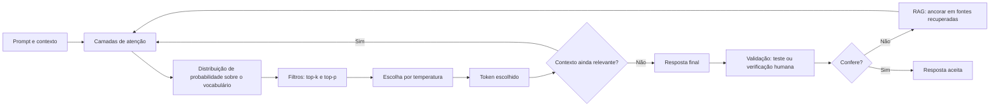

# Capítulo 8: Atenção, Amostragem e Alucinação

## 1. Introdução

No Capítulo 7, você aprendeu o que o modelo "vê" — tokens dentro de uma janela. Agora vamos estudar como ele "pensa": o mecanismo de atenção que decide o que é importante, o processo de amostragem que produz variação e o fenômeno mais temido do campo — a alucinação [1]. Este capítulo é a ponte entre entender a máquina e saber orquestrá-la: é aqui que você vai entender por que um agente pode ser brilhante em uma tarefa e desastrosamente errado em outra [2].

Este capítulo tem três objetivos. Primeiro, entender o mecanismo de atenção — queries, keys e values — e por que ele explica tanto a qualidade quanto as falhas dos LLMs [1]. Segundo, dominar os parâmetros de amostragem — temperatura, top-k, top-p — e por que o mesmo prompt pode dar respostas diferentes [3]. Terceiro, compreender a alucinação em profundidade: por que acontece, como se manifesta e como mitigá-la [4]. Ao final, você terá o modelo mental necessário para avaliar — e validar — qualquer saída de IA, humana ou agêntica [2].

## 2. Explica

### 2.1 O Mecanismo de Atenção: Queries, Keys e Values

O coração do Transformer é o mecanismo de auto-atenção [1]. Para cada token, o modelo gera três vetores: a Query (o que estou procurando?), a Key (o que eu ofereço para ser encontrado?) e o Value (a informação que passo adiante se for selecionado) [1]. O modelo compara cada Query com todas as Keys e calcula pesos de relevância — o produto escalar entre Query e Key determina em quais partes do texto o modelo deve "focar" ao prever o próximo token [1]. A atenção explica o superpoder dos LLMs — a capacidade de usar informação de qualquer ponto do contexto — e também sua limitação central: o custo quadrático O(n²), que torna contextos gigantes caríssimos de processar [7].

### 2.2 O Custo da Atenção: por que Contexto Custa

A atenção tem complexidade quadrática em relação ao número de tokens: dobrar o contexto quadruplica o custo de processamento [7]. É por isso que modelos de contexto longo usam otimizações de hardware e algoritmos distribuídos como o Ring Attention [8]. E é por isso que "jogar tudo na janela" é tão caro: não é apenas o custo de entrada — é o custo quadrático de relacionar cada token com todos os outros [7]. A administração desse custo é uma decisão de arquitetura — o tema central da engenharia de contexto [10].

### 2.3 Amostragem: Por Que o Mesmo Prompt Dá Respostas Diferentes

Os LLMs não são determinísticos por padrão [3]. Ao prever o próximo token, o modelo calcula uma distribuição de probabilidade sobre todo o vocabulário — e a amostragem decide qual token escolher [3]. A temperatura controla o achatamento da distribuição: temperatura próxima de zero torna o modelo determinístico (sempre o token mais provável); temperaturas altas achatam a curva e permitem tokens menos óbvios [3]. Filtros como top-k (restringir aos k tokens mais prováveis) e top-p (nucleus sampling — acumular probabilidade até um limite) podam a cauda de tokens absurdos antes da escolha [3]. Para testes de agentes, essa variação importa: o mesmo teste pode passar e depois falhar só por amostragem [2].

### 2.6 O Dilema da Temperatura por Tarefa

A escolha da temperatura é uma decisão de engenharia por tarefa, não um valor universal [3]. Tarefas de fato — extração de dados, classificação, geração de código determinística — pedem temperatura baixa, próxima de zero, para reduzir variação e erro [3]. Tarefas criativas — roteiros, nomes, variações de conteúdo — pedem temperatura mais alta, para explorar o espaço [3]. Na era agêntica, o dilema se torna explícito: um agente que escreve código com temperatura alta produz variações que quebram a reprodutibilidade dos testes [2]. Os harnesses profissionais configuram a temperatura por etapa do fluxo: baixa para implementação, mais alta para exploração de design [2]. Essa configuração, documentada nos arquivos de instrução, é parte da engenharia de agentes que a série detalha [10]. Ao prever o próximo token, o modelo calcula uma distribuição de probabilidade sobre todo o vocabulário — e a amostragem decide qual token escolher [3]. A temperatura controla o achatamento da distribuição: temperatura próxima de zero torna o modelo determinístico (sempre o token mais provável); temperaturas altas achatam a curva e permitem tokens menos óbvios [3]. Filtros como top-k (restringir aos k tokens mais prováveis) e top-p (nucleus sampling — acumular probabilidade até um limite) podam a cauda de tokens absurdos antes da escolha [3]. Para testes de agentes, essa variação importa: o mesmo teste pode passar e depois falhar só por amostragem [2].

### 2.4 Alucinação: Quando o Modelo Inventa com Fluência

Alucinação é a geração de informação falsa ou sem embasamento factual, apresentada com linguagem fluente e confiante [4]. A taxonomia de Lilian Weng distingue dois tipos: alucinações intrínsecas (o conteúdo contradiz a fonte) e extrínsecas (o conteúdo não pode ser verificado na fonte) [4]. As causas são estruturais: os dados de pré-treinamento contêm erros e preconceitos, e o modelo apenas minimiza o erro de predição do próximo token — não a verdade factual [4]. Estudos empíricos mostram que tentar ensinar fatos novos via fine-tuning pode até aumentar as alucinações [5]. E o framework de agentes autônomos que Lilian Weng formalizou — LLM, memória, planejamento e ferramentas — torna o problema mais agudo: cada componente do agente pode alucinar, e a validação precisa cobrir todos [15].

### 2.7 Atenção em Longo Contexto: Padrões e Otimizações

A atenção quadrática impõe um dilema prático: janelas maiores ajudam o usuário, mas custam caro em processamento [7]. A indústria respondeu com duas famílias de otimização [8]. A primeira é a aproximação: mecanismos como atenção esparsa e flash attention reduzem o custo efetivo mantendo a qualidade percebida — o modelo processa as relações mais relevantes e economiza nas demais [8]. A segunda é a distribuição: técnicas como o Ring Attention dividem o contexto entre múltiplos dispositivos, permitindo treinar e servir modelos de milhões de tokens [8].

Para quem usa modelos — e não os treina — a consequência prática é dupla [7]. Primeiro, o custo de "jogar tudo na janela" é real e cresce mais que linearmente com o tamanho: dobrar o contexto pode mais que dobrar o custo [7]. Segundo, a qualidade não acompanha o tamanho linearmente: a pesquisa de context rot mostra que, além de certo ponto de saturação, a precisão da recuperação cai — o modelo esquece o meio da janela [9]. A conclusão de engenharia é a mesma do Capítulo 7: contexto é recurso, não acúmulo [10].

### 2.8 Amostragem e Reproducibilidade em CI

A variação da amostragem é o pesadelo silencioso da integração contínua agêntica [2]. Um agente que escreve código para ser testado pode, na segunda execução, gerar uma solução igualmente válida mas estruturalmente diferente — e o teste que passou ontem falha hoje sem que nada no repositório tenha mudado [3]. Profissionais tratam esse problema com três técnicas [2]. A primeira é fixar a temperatura e a semente quando a reprodutibilidade importa — muitos provedores permitem fixar parâmetros de amostragem na chamada [3]. A segunda é separar o que é testado do que é explorado: a exploração de design acontece fora do CI; o que entra no CI é a implementação com parâmetros determinísticos [20]. A terceira é aceitar a variação e torná-la visível: rodar o agente mais de uma vez nos testes de avaliação e registrar a distribuição de resultados — a base da Eval Engineering [20].

### 2.5 Mitigação: Como Reduzir a Alucinação

As principais mitigações são arquiteturais, não cosméticas [4]. A geração aumentada por recuperação (RAG) ancora as respostas em documentos recuperados, reduzindo a invenção [4]. A avaliação por agentes — como o framework SAFE — verifica as afirmações contra fontes externas [4]. E a engenharia de contexto, estudada no Capítulo 7, reduz a alucinação ao dar ao modelo apenas contexto relevante e bem formatado [10]. No mundo agêntico, a validação determinística — testes, CI, verificação — é a mitigação definitiva: o modelo pode alucinar, mas o teste não [20]. É a mesma lógica que reduz o tempo de execução de agentes em quase 29% quando o repositório define regras claras de validação [16].

## 3. Ilustra

### 3.1 A Analogia do Pesquisador em uma Biblioteca

Imagine um pesquisador em uma biblioteca gigante. A atenção é o processo de varrer as estantes (os tokens do contexto) e decidir quais livros consultar (os weights de relevância). A Query é a pergunta do pesquisador; as Keys são os títulos das estantes; os Values são os conteúdos dos livros [1]. Agora imagine que o pesquisador seja muito rápido — mas que, às vezes, ao ser pressionado, preencha as lacunas com informações inventadas com total confiança. Isso é a alucinação: fluência sem fundamento [4]. O pesquisador experiente (o engenheiro) reduz o problema de duas formas: limitando a biblioteca ao que importa (engenharia de contexto) e exigindo citações verificáveis (RAG e avaliação) [4].

### 3.2 O Diagrama do Processo de Geração



### 3.4 A Fábrica de Afirmações

Uma imagem útil para o dia a dia: imagine uma fábrica que produz afirmações em alta velocidade [4]. A matéria-prima são os dados de treinamento — com todos os seus erros e lacunas [4]. O processo é a predição do próximo token — que não distingue fato de ficção [1]. E a saída é um fluxo constante de sentenças fluentes [4]. A fábrica tem um único controle de qualidade confiável do lado de fora: a verificação — humana, RAG ou teste determinístico [20]. O engenheiro não tenta desligar a fábrica (impossível — ela é o modelo); ele instala o controle de qualidade na saída [20]. Essa imagem explica por que a mitigação é sempre arquitetural: você não corrige a alucinação no prompt, você a filtra no processo [4].

### 3.3 O Agente entre a Atenção e a Alucinação

Um agente de coding vive exatamente nesse ciclo: usa atenção para localizar o arquivo certo, amostra para escolher a próxima ação e — às vezes — alucina ao "lembrar" de uma API que não existe [1]. É por isso que os harnesses de agentes executam o código e rodam testes: a validação determinística é o antídoto para a fluência sem fundamento [20]. E os melhores agentes de 2026 são avaliados, em grande parte, por quão bem seus harnesses controlam exatamente esse risco [17]. Quando você vê um agente inventar uma função inexistente, não é maldade — é a mesma mecânica de predição do próximo token operando sem âncora [4]. O arco histórico do campo mostra o mesmo padrão: cada geração de ferramenta precisou aprender a ancorar o modelo em fontes verificáveis [6].

### 3.5 O Controle de Qualidade na Linha de Produção

A analogia da fábrica de afirmações merece a sua extensão: o controle de qualidade [4]. Imagine uma linha de produção de peças — o modelo produz afirmações como a linha produz peças [4]. O controle de qualidade não inspeciona cada peça por intuição — tem instrumentos, critérios e amostragem [4]. Na linha da fábrica, o critério é a tolerância dimensional; na linha do modelo, é a verificabilidade [4]. Peças fora de tolerância são descartadas; afirmações sem fonte são rejeitadas [4].

A lição da analogia é a separação de responsabilidades [20]. A linha de produção não fica mais lenta porque o controle de qualidade existe — ela fica mais confiável [20]. O modelo não precisa "alucinar menos" para a produção funcionar — precisa ser filtrado na saída [20]. É essa separação — geração fluente, filtro rigoroso — que permite à indústria usar modelos imperfeitos em produção com confiança [20]. O profissional não espera um modelo perfeito; constrói um processo que tolera a imperfeição [4].

### 3.6 O Juiz que Confere a Testemunha

A analogia de fechamento: o juiz que confere a testemunha [4]. O modelo é uma testemunha loquaz — fala com fluência, convicção e detalhes vívidos [4]. O problema: testemunhas loquazes também são as que mais confabulam [4]. O juiz experiente não pergunta apenas "o que aconteceu?" — pergunta "como você sabe?" [4]. E cruza a resposta com evidências: registros, documentos, outras testemunhas [4].

No sistema, a evidência é o contexto; o cruzamento é o RAG; e a sentença é a decisão do harness [4]. O juiz (o profissional) não pode evitar que a testemunha (o modelo) confabule — mas pode exigir que toda afirmação seja sustentada por evidência antes de virar decisão [20]. Essa separação — o testemunho é livre, a sentença é verificada — é a arquitetura de confiança da era agêntica [4]. E é a mesma separação que o painel de confiança da seção 5.9 transforma em número [4].

## 4. Técnica

### 4.1 Controlando a Amostragem na Prática

Vamos tornar o conceito de amostragem concreto. O código abaixo simula a escolha do próximo token com e sem temperatura — o mesmo princípio que as APIs de modelos expõem [3]:

```python
import random


def amostrar_token(probabilidades, temperatura=1.0, top_k=None, top_p=None):
    """Escolhe um token a partir de uma distribuição com controle de criatividade."""
    itens = sorted(probabilidades.items(), key=lambda x: -x[1])
    if top_k:
        itens = itens[:top_k]
    if top_p is not None:
        acumulado = 0.0
        filtrados = []
        for token, prob in itens:
            acumulado += prob
            filtrados.append((token, prob))
            if acumulado >= top_p:
                break
        itens = filtrados
    if temperatura == 0:
        return itens[0][0]
    # Ajusta as probabilidades pela temperatura (softmax com escala)
    pesos = [p ** (1.0 / temperatura) for _, p in itens]
    total = sum(pesos)
    r = random.random() * total
    acumulado = 0.0
    for (token, _), peso in zip(itens, pesos):
        acumulado += peso
        if r <= acumulado:
            return token
    return itens[-1][0]


if __name__ == "__main__":
    distribuicao = {"escrever": 0.5, "testar": 0.3, "refatorar": 0.15, "deletar": 0.05}
    print("Temperatura 0 (determinístico):", amostrar_token(distribuicao, temperatura=0))
    for _ in range(5):
        print("Temperatura 1.5 (criativo):   ", amostrar_token(distribuicao, temperatura=1.5))
    print("top_k=2 restringe:", amostrar_token(distribuicao, temperatura=1.5, top_k=2))
```

### 4.2 Observando a Alucinação

O experimento mais direto com alucinação é pedir ao modelo fatos verificáveis sem contexto — por exemplo, uma referência bibliográfica que você sabe que existe mas não está na janela [4]. Sem RAG, o modelo pode completar com uma fonte plausível e inexistente. A mitigação prática é a mesma que a indústria adota: ancorar a geração em documentos recuperados e exigir citações [4]. Em um harness de agente, isso se traduz em: o agente só cita o que leu no contexto — e o sistema valida que a citação existe [20]. A documentação de function calling da OpenAI reforça o mesmo princípio do lado das ferramentas: o contrato define exatamente o que o modelo pode chamar [9].

### 4.3 O Padrão de Validação Determinística

A combinação mais robusta de mitigação é a validação determinística: o modelo gera, o teste verifica [20]. Quando um agente propõe código, o harness roda a suíte — a mesma disciplina do Capítulo 4 [11]. Quando um agente afirma um fato, o harness exige a fonte. Essa arquitetura — geração com fluência, validação com rigor — é o coração do AIDD [20].

### 4.5 As Cinco Perguntas da Validação

Antes de confiar em qualquer saída de modelo — sua ou de um agente — o profissional faz cinco perguntas [4]. A primeira: a resposta tem uma fonte? Se não tem, o status é "não verificada" [4]. A segunda: a fonte foi fornecida no contexto, ou o modelo a inventou? A distinção é a mesma entre intrínseca e extrínseca [4]. A terceira: a resposta contradiz o contexto? Se o modelo ignora um fato que você forneceu, algo grave aconteceu na atenção ou na amostragem [1]. A quarta: a resposta é falsificável? Afirmações vagas são mais perigosas que as precisas, porque não podem ser testadas [4]. A quinta: qual é o custo do erro? Se a resposta errada custa caro — um merge, uma compra, uma decisão clínica — a validação é obrigatória [20].

Essas cinco perguntas formam um checklist de bolso que funciona em qualquer ferramenta e qualquer contexto [4]. Elas são a versão operacional da teoria deste capítulo: atenção decide o que importa, amostragem decide a variação, e a validação decide o que sobrevive [2]. Quando os próximos volumes tratarem de evals e harnesses, você verá exatamente essas perguntas formalizadas em código [20].

### 4.4 Medindo a Confiabilidade de um Modelo

Para além dos experimentos qualitativos, a confiabilidade se mede com métricas [1]. A precisão mede quantas respostas geradas estão corretas; a taxa de alucinação mede quantas respostas apresentam informação não verificável; e o desempenho por domínio varia — um modelo pode ser excelente em código e fraco em fatos jurídicos [4]. A indústria usa benchmarks padronizados e avaliação por agentes para medir essas métricas em escala [4]. Na era agêntica, a medição é contínua: o harness avalia cada resposta do agente, acumula estatísticas e detecta degradação ao longo do tempo [2]. Essa é a base da Eval Engineering, que a série aprofunda — e o princípio já está aqui: o que não é medido não pode ser melhorado [1]. Quando um agente propõe código, o harness roda a suíte — a mesma disciplina do Capítulo 4 [11]. Quando um agente afirma um fato, o harness exige a fonte. Essa arquitetura — geração com fluência, validação com rigor — é o coração do AIDD [20]. E é a mesma razão pela qual o arquivo de instruções do agente — AGENTS.md — precisa listar os comandos exatos de teste: o agente não pode decidir como validar por conta própria [12].

### 4.6 O Simulador de Confiança

A combinação de tudo o que o capítulo ensinou pode ser exercitada em um simulador — um script que decide se uma resposta merece confiança com base nas cinco perguntas [4]:

```python
def avaliar_confianca(resposta):
    """Aplica as cinco perguntas da validação e devolve um veredito."""
    verificacoes = []
    verificacoes.append(("Tem fonte?", bool(resposta.get("fonte"))))
    verificacoes.append(("Fonte está no contexto?", resposta.get("fonte_no_contexto", False)))
    verificacoes.append(("Contradiz o contexto?", not resposta.get("contradiz", False)))
    verificacoes.append(("É falsificável?", bool(resposta.get("falsificavel"))))
    custo = resposta.get("custo_do_erro", 0)
    verificacoes.append(("Custo do erro exige validação?", custo >= 5))

    print("=== Veredito de confiança ===")
    for nome, ok in verificacoes:
        print(f"  {'PASS' if ok else 'FAIL'} {nome}")
    reprovou = any(not ok for _, ok in verificacoes)
    if reprovou:
        print("Veredito: NÃO confiar sem validação adicional")
        return False
    print("Veredito: confiança razoável")
    return True


if __name__ == "__main__":
    avaliar_confianca({"fonte": True, "fonte_no_contexto": True,
                       "contradiz": False, "falsificavel": True, "custo_do_erro": 3})
    avaliar_confianca({"fonte": True, "fonte_no_contexto": False,
                       "contradiz": False, "falsificavel": True, "custo_do_erro": 8})
```

O simulador transforma as cinco perguntas em uma política executável — e a política, documentada, é o que os harnesses profissionais aplicam em escala [4]. A mecânica é a mesma para humano e máquina: coletar evidência, aplicar o critério, decidir [20].

### 4.7 O Benchmark Pessoal de Alucinação

O experimento mais informativo que você pode fazer é o benchmark pessoal de alucinação [4]. Monte uma lista de dez afirmações verificáveis sobre o seu domínio — cinco verdadeiras, cinco falsas [4]. Pergunte a um modelo sem contexto e registre quantas ele acerta [4]. Depois, repita com as afirmações ancoradas em um texto-fonte no contexto — e registre a diferença [4].

O resultado tem duas leituras [4]. A primeira: a taxa de acerto sem âncora é o risco-base do modelo no seu domínio [4]. A segunda: a melhora com âncora é o valor da engenharia de contexto [4]. Repita o benchmark ao longo do tempo — trocando as afirmações — e você terá um dado objetivo sobre os modelos que usa, muito mais confiável que impressões [4]. Esse é o germe da Eval Engineering: medir antes de confiar [20].

### 4.8 O Registro de Decisões de Confiança

Para fechar a parte técnica, o instrumento de governança — o registro que documenta cada decisão de confiança [4]:

```python
import json
from datetime import date


def registrar_decisao(fluxo, decisao, razao, evidencias):
    """Registra uma decisão de confiança para auditoria futura."""
    registro = {
        "data": date.today().isoformat(),
        "fluxo": fluxo,
        "decisao": decisao,
        "razao": razao,
        "evidencias": evidencias,
    }
    print(json.dumps(registro, ensure_ascii=False, indent=2))
    return registro


if __name__ == "__main__":
    registrar_decisao(
        fluxo="gerar-relatorio",
        decisao="aumentar autonomia",
        razao="portão rejeitou menos de 5% em 30 dias",
        evidencias=["painel-confianca.json", "log-portao.csv"],
    )
```

O registro transforma decisões em rastro auditável [4]. Aumentar a autonomia de um agente não é uma decisão do momento — é uma decisão documentada, com razão e evidência [4]. Quando algo der errado, o registro diz por que a autonomia foi concedida — e o que mudou desde então [4]. Essa disciplina de registro é a mesma que a governança de harnesses exige na Parte III [10].

## 5. Aplica

### 5.1 Onde Isso Vive no Mundo Real

Toda aplicação de IA em produção enfrenta a tríade atenção-amostragem-alucinação [1]. Chatbots de suporte precisam de temperatura baixa e contexto ancorado para não inventar políticas. A ferramenta de tokenização da OpenAI ajuda a medir o custo dessa âncora em cada conversa [19]. Sistemas de geração de código precisam de validação determinística antes do merge [20]. Sistemas de análise precisam de RAG para citar fontes reais [4]. Em cada caso, a engenharia é a mesma: controlar a amostragem, ancorar o contexto, validar o resultado [2]. O mesmo raciocínio vale para o contexto persistente: o padrão AGENTS.md, adotado por mais de 60 ferramentas, existe para ancorar o comportamento do agente em instruções verificáveis [13].

### 5.2 O Erro Comum do Iniciante

O erro clássico é tratar a saída do modelo como fato: colar uma resposta de um agente sem verificação — especialmente quando a resposta é fluente e confiante [4]. A correção — e aqui está o diferencial que separa o profissional — é assumir que a saída pode estar errada e projetar a validação antes de confiar [2]. Com agentes, o erro se amplifica: um agente que "confia" na própria memória alucina APIs, nomes de arquivos e referências — e o harness que não valida deixa o erro chegar a produção [20]. A confiança dos desenvolvedores na exatidão do código gerado caiu para 29% em 2026 — exatamente porque a fluência sem validação engana [14].

### 5.3 O Padrão Profissional em 2026

O profissional trata a alucinação como um risco de engenharia a ser gerenciado, não como um defeito a ser eliminado [4]. O padrão combina: temperatura controlada por tipo de tarefa (baixa para fatos, alta para criatividade), contexto ancorado via RAG, e validação determinística via testes [20]. É essa combinação que separa as ferramentas sérias das demos [2]. E é essa mesma combinação que você vai aprofundar nos próximos volumes da série, quando estudarmos Eval Engineering e Harness Engineering [10]. O contexto é o novo programa — e o LLM, o novo interpretador — na visão de Software 3.0 que o Karpathy consolida [18]. Por enquanto, a base está pronta: você entende a mecânica e os antídotos [1].

### 5.4 Auditando a Alucinação em Produção

A auditoria de alucinação em produção segue o mesmo ciclo das outras disciplinas: medir, ancorar, validar [4]. O primeiro passo é registrar: cada resposta de um agente em produção deve deixar um rastro — o prompt enviado, o contexto fornecido, a resposta gerada e a fonte citada [2]. O segundo passo é classificar: separar as respostas que citam fontes verificáveis das que afirmam sem fonte — a mesma distinção entre alucinações intrínsecas e extrínsecas da taxonomia de Weng [4]. O terceiro passo é intervir: quando a taxa de respostas sem fonte sobe, o harness reduz o escopo (menos ferramentas, menos contexto solto), aumenta a âncora (mais RAG) e aciona revisão humana [20].

O artefato dessa auditoria é um relatório simples, porém disciplinado: para cada resposta, o status de verificação — verificada, não verificada, contradita — e a evidência usada [4]. Esse relatório é o equivalente, no mundo agêntico, do log de erros que você estudou no Capítulo 2: sem ele, o comportamento errado acontece silenciosamente [2]. Times maduros mantêm esses relatórios como parte da revisão semanal — e é essa prática contínua, não a perfeição, que separa a operação séria da demo [1].

### 5.5 O Padrão de Temperatura por Fase do Fluxo

A configuração de temperatura por fase é uma das práticas mais concretas do AIDD [2]. Em um fluxo típico de agente, as fases são: planejamento, implementação e verificação [2]. No planejamento, uma temperatura moderada permite que o agente explore alternativas de design sem ficar preso à primeira ideia [3]. Na implementação, temperatura baixa — próxima de zero — reduz a variação e mantém o código dentro das convenções [3]. Na verificação, temperatura zero: o agente que executa testes e lê resultados não precisa de criatividade, precisa de fidelidade [2].

A mesma lógica vale para o que você pede ao modelo [3]. Quando a tarefa admite múltiplas respostas válidas (gerar exemplos, sugerir nomes, variar texto), a temperatura alta é uma ferramenta de exploração [3]. Quando a tarefa tem uma resposta certa (extrair um dado, traduzir um termo, validar um fato), a temperatura baixa é uma ferramenta de precisão [3]. Documentar essa configuração nos arquivos de instrução — "implementação com temperatura 0, planejamento com 0.7" — é o que transforma uma preferência pessoal em uma política de engenharia auditável [12].

### 5.6 Integrando os Três Antídotos na Prática

O padrão profissional integra os três antídotos — controle de amostragem, ancoragem de contexto e validação determinística — em um único fluxo [20]. Um exemplo concreto: um agente que gera relatórios de segurança. O contexto entra ancorado por RAG, com os documentos oficiais recuperados [4]. A temperatura fica baixa, para que o relatório não invente estatísticas [3]. E antes da publicação, o harness valida cada número contra a fonte — o teste determinístico do Capítulo 4 aplicado a fatos [20]. Se qualquer âncora falha, o relatório não sai [20].

É essa integração — não nenhum antídoto isolado — que reduz a alucinação a um risco gerenciável [4]. E é exatamente essa arquitetura de três camadas que os próximos volumes da série formalizam: a engenharia de contexto (Parte II) constrói a âncora, e a engenharia de harness e evals (Partes III e IV) constrói a validação [10]. O que você tem neste capítulo é o princípio físico — a mecânica do problema e a direção dos antídotos [1].

### 5.7 O Portão de Verificação para Agentes

O padrão profissional aplica as cinco perguntas da seção 4.5 de forma automatizada, no harness [20]. Cada resposta do agente passa por um portão de verificação antes de ser aceita [20]. Afirmações de fato: exigem fonte presente no contexto — e o harness confere se a fonte existe [4]. Código: exige testes — o harness roda a suíte antes de aceitar [11]. Números: exigem a origem calculável — o harness recalcula ou rejeita [4]. Decisões de alto custo: exigem confirmação humana [2].

O portão não elimina a alucinação — elimina o seu trânsito [20]. O modelo pode inventar, mas a invenção não chega a lugar nenhum sem passar pelo portão [20]. Essa é a diferença estrutural entre uma demo — onde a saída do modelo é o resultado — e a produção — onde a saída do modelo é apenas uma proposta [20]. Quando a série tratar de harnesses e evals, o portão da verificação será a peça central [10]. Aqui fica o princípio físico: a fluência gera, o portão julga [20].

### 5.8 O Custo de Ignorar a Mecânica

Fechar a parte aplicada com o custo de ignorar o que este capítulo ensinou [4]. Ignorar a amostragem: o mesmo prompt dá respostas diferentes, o teste falha sem motivo e a equipe perde horas perseguindo um bug que não existe [3]. Ignorar a atenção: o modelo "esquece" uma instrução crítica no meio do contexto, e a falha aparece em produção [7]. Ignorar a alucinação: o relatório cita uma fonte que não existe, a decisão é tomada sobre dado falso e o custo é o do erro multiplicado pela escala da automação [4].

Cada custo tem o mesmo antídoto — o que o capítulo inteiro construiu: controlar a amostragem por tarefa, curar o contexto, validar determinísticamente [20]. O profissional que entende a mecânica não elimina os riscos — ele os administra com instrumentos [2]. E é exatamente essa administração que os próximos volumes elevam a disciplina: Context Engineering constrói a âncora, Harness Engineering constrói o portão e Eval Engineering mede o resultado [10].

### 5.9 O Painel de Confiança do Time

A aplicação de governança mais concreta deste capítulo é o painel de confiança — o artefato que o time consulta para decidir quando confiar no modelo [4]. O painel registra, por fluxo agêntico: a taxa de respostas aceitas sem correção, a taxa de respostas rejeitadas pelo portão, a taxa de alucinação detectada e o custo médio por correção [4]. Quatro números contam a história de confiança do fluxo [4].

O painel transforma a confiança de sentimento em métrica [20]. "Sinto que o agente está melhor" vira "a taxa de rejeição caiu de 30% para 12% em dois meses" [20]. E a métrica orienta a decisão: aumentar a autonomia quando o portão rejeita pouco; reduzir quando rejeita muito [20]. O mesmo ciclo do Capítulo 4 — medir, agir, revisar — aplicado à confiança no modelo [20]. Quando a série tratar de Eval Engineering, o painel de confiança será formalizado em evals [10].

### 5.10 O Limite da Autonomia Responsável

O último tema do capítulo aplicado é o limite da autonomia [4]. Um agente pode operar com autonomia plena quando a validação é completa e barata [20]. Autonomia parcial — com checkpoints humanos — quando a validação é cara ou imperfeita [4]. E nenhuma autonomia quando o erro é irreversível ou a validação impossível [4]. A escala de autonomia é uma decisão de arquitetura, não de coragem [20].

O profissional não pergunta "o agente pode ser autônomo?" — pergunta "o portão consegue julgar o que ele faz?" [20]. Se o portão julga bem, a autonomia é segura; se não, o humano fica no loop [20]. Essa é a ponte direta entre a mecânica deste capítulo — atenção, amostragem, alucinação — e a governança dos harnesses da Parte III [10]. A autonomia responsável não é um valor — é uma engenharia [4].

### 5.11 O Glossário do Capítulo

O capítulo termina com o vocabulário operacional [1]. Atenção: o mecanismo que decide o que importa [1]. Query, Key, Value: os vetores que o mecanismo usa [1]. Temperatura: o controle de variação da amostragem [3]. Top-k, top-p: os filtros que podam a cauda de tokens [3]. Alucinação: a fluência sem âncora [4]. RAG: a ancoragem em documentos recuperados [4]. Validação determinística: o teste que o modelo não pode enganar [20]. Portão: o ponto onde a saída é julgada [20].

Esse glossário é a língua da confiança [1]. Quando os volumes seguintes falarem de evals, harnesses e verificação adversarial, você já conversa na mesma língua [20]. O vocabulário não é decoração — é o instrumento de precisão de quem decide o que merece confiança [4].

### 5.12 O Custo de Confiar sem Verificar

Fechar com o custo de confiar sem verificar — a lição mais cara do capítulo [4]. Confiar na fluência sem âncora: o relatório cita fonte inexistente e a decisão errada é tomada [4]. Confiar na saída sem portão: o código quebrado chega à produção e a regressão é descoberta pelo usuário [20]. Confiar no modelo sem medir: a degradação avança silenciosamente e ninguém percebe [20]. Cada confiança sem verificação tem preço — e o preço cresce com a escala da automação [4].

O profissional não confia menos — verifica mais [20]. A confiança verificada é o ativo mais valioso da era agêntica [2]. Quem verifica pode escalar agentes com segurança; quem confia, escala o risco [4]. A mecânica deste capítulo — atenção, amostragem, alucinação — existe para informar a verificação: saber onde o modelo falha é saber onde verificar [20]. E é essa verificação informada que a Parte IV da série transforma em Eval Engineering [10].

## 6. Conclusão

Neste capítulo, você entrou na mecânica do pensamento dos modelos: a atenção, que decide o que importa com queries, keys e values [1]; a amostragem, que produz variação através de temperatura, top-k e top-p [3]; e a alucinação, que inventa com fluência quando falta âncora [4]. Você aprendeu que a mitigação é arquitetural — RAG, contexto curado e validação determinística — e que a validação é o antídoto definitivo para a fluência sem fundamento [20].

Resumindo em três pontos: primeiro, a atenção decide o que importa — e seu custo quadrático explica o preço do contexto [1][7]; segundo, a amostragem produz variação — e a temperatura é uma decisão de engenharia por tarefa [3]; terceiro, a alucinação é fluência sem âncora — e o antídoto é arquitetural: RAG, contexto e validação [4][20]. Com esses três pontos, você entende os limites da máquina — e sabe onde o humano é insubstituível [2].

### O Desafio Deste Capítulo

O desafio em três níveis. Nível um: execute o simulador de amostragem do capítulo com temperaturas 0, 0.5, 1.0 e 1.5 e observe a variação das escolhas [3]. Nível dois: repita o experimento de alucinação com três modelos diferentes e compare a taxa de fontes inventadas [4]. Nível três: projete a validação determinística de um agente de geração de código — quais testes o harness roda antes de aceitar uma mudança [20]. Os três níveis exercitam amostragem, alucinação e validação [2].

Com o Capítulo 7, você agora domina o par completo: o que o modelo vê e como ele pensa. No próximo capítulo, vamos subir da máquina para o campo: o vocabulário do mundo agêntico — modelo, tool, tool calling e agente — conectando toda a mecânica que você estudou ao ecossistema de agentes autônomos [2].

## 7. Referências Bibliográficas

[1] WENG, Lilian. Extrinsic Hallucinations in LLMs. Disponível em: https://lilianweng.github.io/posts/2024-07-07-hallucination/. Acesso em: 5 ago. 2026.

[2] SITEPOINT. Vibe Coding 2026: The Complete Guide to AI-First Development. Disponível em: https://www.sitepoint.com/vibe-coding-2026-complete-guide/. Acesso em: 5 ago. 2026.

[3] PROMPTING GUIDE. Function Calling in AI Agents. Disponível em: https://www.promptingguide.ai/agents/function-calling. Acesso em: 5 ago. 2026.

[4] WENG, Lilian. Extrinsic Hallucinations in LLMs. Disponível em: https://lilianweng.github.io/posts/2024-07-07-hallucination/. Acesso em: 5 ago. 2026.

[5] GEKHMAN, Zorik; et al. Does Fine-Tuning LLMs on New Knowledge Encourage Hallucinations?. 2024. Disponível em: https://arxiv.org/abs/2405.05904. Acesso em: 5 ago. 2026.

[6] CODERABBIT. From Copilot to agents: The history of AI coding. Disponível em: https://www.coderabbit.ai/blog/a-very-brief-history-of-ai-coding-from-copilot-to-next-gen-agents. Acesso em: 5 ago. 2026.

[7] GOOGLE AI DEVELOPERS. Long Context Guide (Gemini API). Disponível em: https://ai.google.dev/gemini-api/docs/long-context. Acesso em: 5 ago. 2026.

[8] LATENT SPACE. How to train a Million Context LLM — with Mark Huang of Gradient.ai. Disponível em: https://www.latent.space/p/gradient. Acesso em: 5 ago. 2026.

[9] OPENAI. Function Calling Guide. Disponível em: https://developers.openai.com/api/docs/guides/function-calling. Acesso em: 5 ago. 2026.

[10] ANTHROPIC. Effective Context Engineering for AI Agents. Disponível em: https://www.anthropic.com/engineering/effective-context-engineering-for-ai-agents. Acesso em: 5 ago. 2026.

[11] FOWLER, Martin. Continuous Integration. Disponível em: https://martinfowler.com/articles/continuousIntegration.html. Acesso em: 5 ago. 2026.

[12] TIAN PAN. CLAUDE.md and AGENTS.md: The Configuration Layer That Makes AI Coding Agents Actually Follow Your Rules. Disponível em: https://tianpan.co/blog/2026-02-25-claude-md-agents-md-ai-coding-agent-instruction-files. Acesso em: 5 ago. 2026.

[13] OPENAI / AGENTS.MD FOUNDATION. Open Standards for Agentic Configuration (AGENTS.md). Disponível em: https://agents.md/. Acesso em: 5 ago. 2026.

[14] KEYHOLE SOFTWARE. Vibe Coding Trends 2026: Adoption, Productivity, and Code Quality Data. Disponível em: https://keyholesoftware.com/vibe-coding-trends-2026/. Acesso em: 5 ago. 2026.

[15] WENG, Lilian. LLM-Powered Autonomous Agents. Disponível em: https://lilianweng.github.io/posts/2023-06-23-agent/. Acesso em: 5 ago. 2026.

[16] LULLA, Jai Lal; et al. On the Impact of AGENTS.md Files on the Efficiency of AI Coding Agents. Disponível em: https://arxiv.org/html/2601.20404v1. Acesso em: 5 ago. 2026.

[17] MIGHTYBOT. Best AI Coding Agents in 2026, Ranked. Disponível em: https://mightybot.ai/blog/coding-ai-agents-for-accelerating-engineering-workflows/. Acesso em: 5 ago. 2026.

[18] KARPATHY, Andrej. Sequoia Ascent 2026 Summary (Software 3.0 & Agentic Engineering). Disponível em: https://karpathy.bearblog.dev/sequoia-ascent-2026/. Acesso em: 5 ago. 2026.

[19] OPENAI. Tokenizer (ferramenta interativa). Disponível em: https://platform.openai.com/tokenizer. Acesso em: 5 ago. 2026.

[20] TESTING LIBRARY. Guiding Principles. Disponível em: https://testing-library.com/docs/guiding-principles/. Acesso em: 5 ago. 2026.
