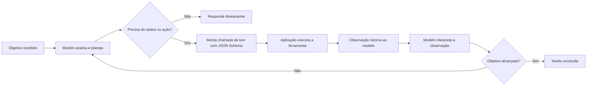
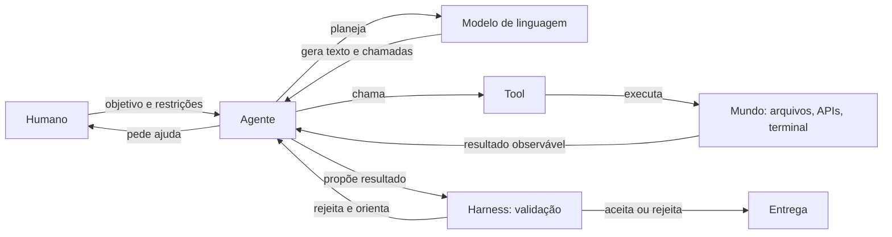
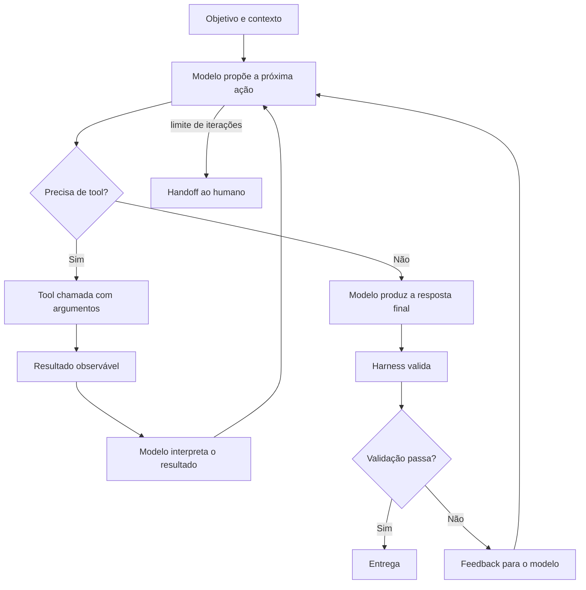

# Capítulo 9: Vocabulário do Campo: Modelo, Tool, Tool Calling e Agente

## 1. Introdução

Nos dois capítulos anteriores, você dominou a mecânica dos modelos: o que eles veem (tokens e janela) e como pensam (atenção, amostragem, alucinação). Agora vamos dar nome às coisas. O mundo agêntico tem um vocabulário próprio — modelo, tool, tool calling, agente, agent loop — e dominar esse vocabulário é mais do que decoro: é a ferramenta que permite pensar com precisão sobre sistemas complexos [1]. Como no Capítulo 6, onde o HTTP deu nome à conversa entre sistemas, este capítulo dá nome à conversa entre humanos, modelos e ferramentas [2].

Este capítulo tem três objetivos. Primeiro, delimitar com precisão as três camadas fundamentais — modelo, ferramenta e agente — e o que cada uma faz [1]. Segundo, entender o mecanismo de tool calling: como o modelo decide chamar uma ferramenta, como a chamada é estruturada e como a resposta retorna [3]. Terceiro, compreender o agent loop — o ciclo ação, observação, decisão — que transforma um modelo isolado em um agente autônomo [4]. Ao final, você falará a língua do campo com precisão — e estará pronto para o Capítulo 10, que mapeia a história de autocomplete a agentes autônomos [2].

## 2. Explica

### 2.1 Modelo: o Motor Cognitivo

O modelo — LLM, Large Language Model — é o motor cognitivo: processa linguagem, raciocina e gera tokens [1]. Por si só, um modelo puro é estático: limitado ao conhecimento do treinamento e incapaz de agir no mundo [1]. É importante separar o modelo do produto: o ChatGPT, o Claude e o Gemini são produtos que combinam modelos com camadas de orquestração — mas o modelo em si é apenas o motor [2]. Essa distinção é a primeira peça do vocabulário: quando alguém diz "o modelo alucinou", está falando do motor; quando diz "o agente abriu um PR", está falando de um sistema maior [1].

### 2.2 Tool: a Interface com o Mundo

Uma ferramenta — tool — é uma interface entre o modelo e o mundo externo [3]. Pode ser uma API, uma consulta a banco, um interpretador de código, um script ou um servidor MCP [5]. A ferramenta resolve a limitação central do modelo puro: a incapacidade de acessar dados novos ou executar ações [3]. Cada ferramenta expõe um contrato — nome, descrição e parâmetros em JSON Schema — que o modelo aprende a usar [7]. O padrão AGENTS.md, adotado por mais de 60 ferramentas, organiza a camada de instruções que define como e quando essas tools devem ser usadas [14]. A qualidade das ferramentas define a qualidade do agente: ferramentas bem descritas produzem chamadas precisas; ferramentas vagas produzem erros [3].

### 2.3 Tool Calling: o Mecanismo da Chamada

Tool calling — ou function calling — é o mecanismo pelo qual o modelo invoca uma ferramenta [3]. O fluxo é estruturado: o desenvolvedor injeta as definições de ferramentas no contexto; o modelo analisa o pedido do usuário e decide se precisa de dados externos; se precisar, interrompe a geração de texto e retorna uma chamada estruturada com o nome da função e os argumentos em JSON; a aplicação executa a função; e o resultado é devolvido ao modelo como observação, rotulado com um ID de chamada [3]. O modelo então lê a observação e sintetiza a resposta final — ou decide invocar outra ferramenta [7]. Esse ciclo de quatro passos — definir, decidir, executar, observar — é o coração do desenvolvimento dirigido por IA [2], e é o mesmo arco que o CodeRabbit documenta na evolução do coding assistido: cada geração adicionou autonomia a esse ciclo [6].

### 2.4 Agente: o Sistema Autônomo

Um agente é um sistema autônomo construído sobre um LLM que combina raciocínio, planejamento, memória e tool calling em um loop dinâmico [4]. O framework clássico, formalizado por Lilian Weng, define o agente como a combinação de LLM, memória, planejamento e ferramentas [4]. A diferença entre um modelo e um agente é a autonomia: o modelo responde; o agente age — decide, executa, observa e repete até concluir a tarefa [1]. No mundo do desenvolvimento de software, os agentes de coding — Claude Code, Codex, Cursor — navegam repositórios, rodam testes e abrem pull requests dentro desse loop [17]. A diferença entre o autocomplete que sugere linhas e o agente que conclui tarefas é exatamente essa camada de autonomia que o ITECS analisa [16].

### 2.6 Memória: o Quarto Componente do Agente

Dos quatro componentes do agente — LLM, memória, planejamento e ferramentas — a memória é o menos intuitivo [4]. O LLM tem a memória de trabalho: a janela de contexto, que você estudou no Capítulo 7 — finita e volátil [4]. A memória de longo prazo é externa: arquivos, bancos, notas — o que sobrevive entre sessões [1]. Os harnesses modernos organizam a memória externa em arquivos estruturados — como os diretórios de notas e os registros persistentes — que o agente lê e atualiza a cada execução [10]. A memória é o que transforma um agente estateless em um assistente que acumula aprendizado: sem ela, cada sessão recomeça do zero; com ela, o agente evolui [1]. Essa distinção — memória de trabalho versus memória persistente — é central para os volumes de Instruction e Memory Engineering da série [10].

### 2.7 Planejamento: A Camada de Estratégia

O planejamento é o componente que decide a sequência de ações — a decomposição algorítmica do Capítulo 1 aplicada a agentes [4]. O agente planeja de forma reativa (decide o próximo passo olhando o estado atual) ou deliberativa (constrói um plano completo antes de agir) [4]. Os agentes modernos combinam os dois: planejam a estrutura geral, executam passo a passo e replanejiam quando a observação contradiz a expectativa [4]. O planejamento é onde a qualidade do raciocínio do modelo aparece — e onde a alucinação pode corromper o plano: um plano baseado em um fato inventado produz uma execução errada [14]. Por isso a validação de cada etapa — que você estudou no Capítulo 8 — é parte do planejamento robusto [20]. O framework clássico, formalizado por Lilian Weng, define o agente como a combinação de LLM, memória, planejamento e ferramentas [4]. A diferença entre um modelo e um agente é a autonomia: o modelo responde; o agente age — decide, executa, observa e repete até concluir a tarefa [1]. No mundo do desenvolvimento de software, os agentes de coding — Claude Code, Codex, Cursor — navegam repositórios, rodam testes e abrem pull requests dentro desse loop [17]. A diferença entre o autocomplete que sugere linhas e o agente que conclui tarefas é exatamente essa camada de autonomia que o ITECS analisa [16].

### 2.5 O Agent Loop: Ação, Observação, Decisão

O agent loop é o ciclo que dá vida ao agente [4]: o agente decide a próxima ação (baseada no estado atual e no objetivo), executa a ação (frequentemente chamando uma ferramenta), observa o resultado (a resposta da ferramenta) e decide o próximo passo [4]. O loop repete até o objetivo ser alcançado ou o limite de iterações ser atingido [1]. Cada iteração consome tokens da janela — por isso a eficiência do loop é uma decisão de engenharia, não um detalhe [10]. O custo de cada iteração também cresce com o histórico acumulado: quanto mais longo o loop, maior o risco de context rot degradar a atenção do modelo [15]. O loop também explica os erros dos agentes: uma observação mal interpretada gera uma decisão errada — e o harness precisa capturar isso [20].

## 3. Ilustra

### 3.1 A Analogia do Escritório de Atendimento

Imagine um escritório de atendimento completo. O modelo é o atendente inteligente: raciocina rápido, fala bem, mas não pode sair da mesa (não acessa o mundo). As ferramentas são os departamentos — arquivo, telefone, computador — cada um com um formulário de pedido (o contrato da tool). O tool calling é o formulário preenchido: o atendente decide que precisa do arquivo, preenche o formulário com o número do processo e o departamento devolve a pasta (a observação). O agente é o sistema completo: atendente + departamentos + o protocolo de trabalho que decide quando pedir o quê [1]. Sem o formulário, o atendente não consegue pedir; sem os departamentos, ele não faz nada além de falar [3].

### 3.2 O Diagrama do Tool Calling e do Agent Loop



### 3.3 As Camadas na Prática

O mesmo diagrama descreve um agente de coding: ele recebe a tarefa "corrija o bug do login", analisa, decide que precisa ler o código (chama a tool de leitura), observa o resultado, decide chamar a tool de escrita, roda os testes (outra tool) e repete até os testes passarem [17]. Cada camada tem responsabilidade clara: o modelo decide, a tool executa, o agente orquestra [1]. E quando algo falha, o diagnóstico identifica a camada: o modelo decidiu errado? A tool falhou? A observação foi mal interpretada? [20]. Estudos empíricos mostram que agentes bem configurados — com instruções claras sobre o uso de tools — reduzem o tempo de execução em quase 29% [13].

### 3.4 O Diagrama do Ecossistema Agêntico

O vocabulário ganha um mapa quando desenhado como ecossistema [4]:



O diagrama mostra as quatro peças do framework — modelo, memória, planejamento e ferramentas — operando dentro do ciclo que o harness governa [6]. Cada seta do diagrama é um contrato que o vocabulário nomeia [4]. Quando algo falha no ecossistema, o diagnóstico começa identificando qual seta quebrou — e o vocabulário é o que torna essa identificação possível [4].

### 3.4 O Diagrama do Loop do Agente

O loop — o coração da arquitetura agêntica — merece o seu diagrama completo [6]:



O diagrama mostra as quatro peças do framework de Lilian Weng em ação — o modelo raciocina, a memória carrega o contexto, o planejamento decide e as ferramentas executam [6]. E mostra a quinta peça que o capítulo acrescentou: o harness que valida e o humano que recebe o handoff [4]. Quando os volumes de Harness Engineering detalharem o loop, este é o esqueleto que eles constroem [10].

## 4. Técnica

### 4.1 Definindo uma Tool com Contrato

Vamos implementar o ciclo completo de tool calling na prática. Primeiro, definimos a tool com seu contrato — o JSON Schema que descreve nome, descrição e parâmetros [3]:

```python
import json

CONTRATO_DADOS = {
    "nome": "buscar_transacoes",
    "descricao": "Busca transações financeiras no banco de dados por categoria.",
    "parametros": {
        "type": "object",
        "properties": {
            "categoria": {
                "type": "string",
                "enum": ["alimentacao", "renda", "saude"],
                "description": "Categoria das transações a buscar"
            },
            "limite": {
                "type": "integer",
                "minimum": 1,
                "maximum": 100,
                "default": 10
            }
        },
        "required": ["categoria"]
    }
}


def buscar_transacoes(categoria, limite=10):
    """A implementação real da ferramenta."""
    banco = [
        {"id": 1, "categoria": "alimentacao", "valor": -150.00},
        {"id": 2, "categoria": "renda", "valor": 4500.00},
        {"id": 3, "categoria": "saude", "valor": -89.90},
    ]
    resultado = [t for t in banco if t["categoria"] == categoria][:limite]
    return {"transacoes": resultado}


def executar_chamada_de_tool(chamada):
    """Simula a execução: valida o contrato e despacha para a implementação."""
    if chamada["nome"] == "buscar_transacoes":
        return buscar_transacoes(**chamada["argumentos"])
    raise ValueError(f"Tool desconhecida: {chamada['nome']}")
```

### 4.2 O Ciclo Completo de uma Chamada

O ciclo de tool calling completo — o modelo monta a chamada, a aplicação executa e devolve a observação — pode ser simulado e testado:

```python
def processar_pedido_do_agente(pedido):
    """Simula o ciclo: decide chamar a tool, executa e retorna a observação."""
    # Passo 1: o modelo decide que precisa da tool e monta a chamada
    chamada = {
        "nome": "buscar_transacoes",
        "argumentos": {"categoria": "saude", "limite": 5},
    }
    print(f"[MODELO] Decidiu chamar: {chamada['nome']}")
    print(f"[MODELO] Argumentos: {json.dumps(chamada['argumentos'], ensure_ascii=False)}")

    # Passo 2: a aplicação executa a ferramenta real
    observacao = executar_chamada_de_tool(chamada)
    print(f"[APLICACAO] Observacao: {json.dumps(observacao, ensure_ascii=False)}")

    # Passo 3: a observação volta ao modelo, que responde ao usuário
    resposta = (f"Encontrei {len(observacao['transacoes'])} transações de saúde. "
                f"Total: R$ {sum(t['valor'] for t in observacao['transacoes']):.2f}")
    print(f"[MODELO] Resposta final: {resposta}")
    return resposta


if __name__ == "__main__":
    processar_pedido_do_agente("quais são minhas transações de saúde?")
```

### 4.3 Validando o Contrato

A validação é a parte que separa um harness sério de uma demo [20]. Antes de executar a chamada, valide os argumentos contra o contrato: categoria dentro do enum, limite dentro do intervalo [3]. No código acima, o dicionário `CONTRATO_DADOS` é a especificação — e um harness real a valida programaticamente antes de despachar [20]. Esse mesmo padrão é o que os servidores MCP usam para expor ferramentas aos agentes de forma padronizada [5].

### 4.4 Implementando um Mini-Agent Loop

Para consolidar o conceito do agent loop, vamos implementar uma versão mínima — o ciclo decisão, execução, observação, repetição [4]:

```python
class MiniAgente:
    """Agente mínimo: decide, executa tools e itera até concluir."""
    def __init__(self, objetivo):
        self.objetivo = objetivo
        self.passos = 0

    def decidir(self, observacao):
        """Decisão simulada: retorna a próxima tool a chamar."""
        if observacao == "" :
            return "buscar_transacoes", {"categoria": "saude"}
        if "transacoes" in observacao:
            return "concluir", {}
        return "reportar_erro", {}

    def executar(self, tool, argumentos):
        """Executa a tool e devolve a observação."""
        if tool == "buscar_transacoes":
            return executar_chamada_de_tool({
                "nome": tool, "argumentos": argumentos
            })
        if tool == "concluir":
            return {"status": "objetivo_alcancado"}
        return {"status": "erro"}

    def rodar(self, max_passos=5):
        observacao = ""
        while self.passos < max_passos:
            self.passos += 1
            tool, args = self.decidir(observacao)
            print(f"[{self.passos}] {tool} {args}")
            observacao = self.executar(tool, args)
            if observacao.get("status") == "objetivo_alcancado":
                print("Objetivo concluído.")
                return True
        print("Limite de passos atingido.")
        return False


if __name__ == "__main__":
    MiniAgente("listar despesas de saúde").rodar()
```

O `MiniAgente` captura a anatomia do loop: a decisão escolhe a próxima ação, a execução produz a observação e a observação alimenta a próxima decisão [4]. Os harnesses reais substituem a decisão simulada pelo LLM e a execução pelas tools reais — mas o ciclo é este [4]. Antes de executar a chamada, valide os argumentos contra o contrato: categoria dentro do enum, limite dentro do intervalo [3]. No código acima, o dicionário `CONTRATO_DADOS` é a especificação — e um harness real a valida programaticamente antes de despachar [20]. Esse mesmo padrão é o que os servidores MCP usam para expor ferramentas aos agentes de forma padronizada [5].

### 4.5 O Simulador de Agente

Para consolidar o vocabulário, o exercício final de código é um simulador do loop de agente — modelo, tool e validação operando juntos [4]:

```python
class Tool:
    def __init__(self, nome, fn):
        self.nome = nome
        self.fn = fn

    def chamar(self, *args):
        print(f"  tool.chamar({self.nome}, {args})")
        return self.fn(*args)


def loop_de_agente(objetivo, tools, passos_maximos=3):
    """Simula o loop: observar, decidir, chamar tool, validar."""
    print(f"Objetivo: {objetivo}")
    for passo in range(1, passos_maximos + 1):
        print(f"\n-- Passo {passo}")
        # Decisão simulada: procura a primeira tool cujo nome está no objetivo
        tool = next((t for t in tools if t.nome in objetivo), None)
        if not tool:
            print("Nenhuma tool aplicável -> pedir ajuda ao humano")
            return "handoff"
        resultado = tool.chamar(*([objetivo] if tool.nome == "buscar" else []))
        if resultado == "ok":
            print("Validação: resultado aceito")
            return "concluido"
        print("Validação: resultado rejeitado, nova iteração")
    print("Limite de passos atingido -> reportar ao humano")
    return "limite"


if __name__ == "__main__":
    buscar = Tool("buscar", lambda q: "ok")
    loop_de_agente("buscar o relatório mensal", [buscar])
    loop_de_agente("apagar o banco de produção", [buscar])
```

O simulador mostra a anatomia que o capítulo descreveu: o agente observa, decide qual tool chamar, executa, valida e repete até o limite [4]. E o segundo caso de teste revela o ponto de governança: quando nenhuma tool cobre a intenção, o loop termina em handoff — o humano — em vez de improvisar [4].

### 4.6 O Contrato de Tool em JSON Schema

O contrato que o modelo usa para chamar uma tool tem um formato padrão — JSON Schema [9]. O exercício abaixo escreve um contrato e valida uma chamada contra ele, sem bibliotecas externas [9]:

```python
import json


def contrato_tool():
    """Define o contrato da tool 'buscar_relatorio'."""
    return {
        "name": "buscar_relatorio",
        "description": "Busca um relatório pelo mês. Mês no formato AAAA-MM.",
        "parameters": {
            "type": "object",
            "properties": {
                "mes": {"type": "string", "pattern": "^\\d{4}-\\d{2}$"}
            },
            "required": ["mes"],
        },
    }


def validar_chamada(contrato, chamada):
    props = contrato["parameters"]["properties"]
    for campo, regra in props.items():
        valor = chamada.get(campo)
        if valor is None:
            if campo in contrato["parameters"]["required"]:
                print(f"FALHA: campo obrigatório ausente: {campo}")
                return False
            continue
        if regra.get("type") == "string" and not isinstance(valor, str):
            print(f"FALHA: {campo} deveria ser string")
            return False
    print("Chamada válida contra o contrato")
    return True


if __name__ == "__main__":
    contrato = contrato_tool()
    print(json.dumps(contrato, ensure_ascii=False, indent=2))
    validar_chamada(contrato, {"mes": "2026-08"})
    validar_chamada(contrato, {"mes": 202608})
```

O contrato é a especificação executável da tool: descreve ao modelo o que chamar, e ao harness o que validar [9]. É essa mesma estrutura que os servidores MCP usam para expor ferramentas aos agentes — a ponte direta deste capítulo para os volumes de MCP Engineering [5].

### 4.7 O Inventário de Contratos de um Projeto

O exercício final de código consolida o capítulo: levantar, do próprio projeto, o inventário de contratos disponíveis aos agentes [4]:

```python
import json
from pathlib import Path


def inventariar_contratos(diretorio):
    """Lista scripts executáveis e documenta um contrato mínimo para cada um."""
    print("=== Inventário de contratos do projeto ===")
    inventario = []
    for caminho in sorted(Path(diretorio).glob("*.py")):
        linhas = caminho.read_text(encoding="utf-8").splitlines()
        docstring = ""
        for l in linhas[1:4]:
            if '"' in l and docstring == "":
                docstring = l.strip().strip('"').strip()
                break
        entrada = {"script": caminho.name,
                   "contrato": docstring or "sem descrição",
                   "tamanho": len(linhas)}
        inventario.append(entrada)
        print(f"  {entrada['script']:<35} {entrada['tamanho']:>5} linhas")
    with open("inventario_contratos.json", "w", encoding="utf-8") as f:
        json.dump(inventario, f, ensure_ascii=False, indent=2)
    print(f"\nInventário salvo: inventario_contratos.json ({len(inventario)} contratos)")


if __name__ == "__main__":
    inventariar_contratos("scripts")
```

O exercício conecta o vocabulário ao seu próprio ambiente [4]: cada script do projeto é uma tool em potencial, e o inventário é o primeiro passo para decidir quais expor a um agente [4]. O mesmo levantamento — com a mesma estrutura — é o que as equipes fazem antes de adotar MCP [5].

## 5. Aplica

### 5.1 Onde Isso Vive no Mundo Real

Todo produto de IA moderno é uma combinação de modelo, tools e orquestração [1]. O ChatGPT com navegação web usa tools de busca. O assistente de código usa tools de leitura e escrita de arquivos. O agente de análise usa tools de consulta a banco [2]. Os Quatro Sinais de Ouro do Google SRE — latência, tráfego, erros e saturação — monitoram essas tools em produção, garantindo que o ciclo continue confiável [11]. A arquitetura do function calling da OpenAI e o Model Context Protocol da Anthropic padronizam exatamente essa camada — e a indústria converge para esses contratos [3][5]. No seu projeto, a mesma arquitetura se aplica: defina as tools, descreva os contratos e deixe o agente decidir quando chamá-las [7]. A configuração persistente que orienta esse comportamento é tema do guia prático do Tian Pan [12]. No seu projeto, a mesma arquitetura se aplica: defina as tools, descreva os contratos e deixe o agente decidir quando chamá-las [7].

### 5.2 O Erro Comum do Iniciante

O erro clássico é confundir as camadas: chamar o produto de "modelo", acreditar que o modelo "sabe" o que as tools fazem ou que o agente "entende" a tarefa como um humano [1]. A correção — e aqui está o diferencial que separa o profissional — é ser preciso: o modelo decide com base no contrato que você escreveu; se o contrato é vago, a chamada erra [3]. Na prática: descreva cada tool com o máximo de clareza, teste as chamadas com casos reais e monitore as observações que voltam [20]. Com agentes, esse erro se amplifica: uma tool mal descrita gera chamadas erradas em cascata — e o agente "confia" na observação errada e segue [2]. A disciplina de especificar o comportamento esperado — no AGENTS.md ou em testes — é o que o estudo da SMU mediu empiricamente [13]. E a base histórica dessa disciplina está no Git: versionar contratos e ferramentas é tão essencial quanto versionar código [9].

### 5.3 O Padrão Profissional em 2026

O profissional trata o vocabulário como ferramenta de design: modela o sistema em camadas explícitas — modelo, tools, agente — e documenta os contratos [2]. Os melhores agentes de 2026 seguem exatamente essa arquitetura: o modelo orquestra, as tools executam e o harness valida [17]. Essa arquitetura exige contexto bem curado — o tema da engenharia de contexto [10] — e custa tokens mensuráveis em cada iteração, que a ferramenta de tokenização da OpenAI ajuda a visualizar [8]. E é essa mesma arquitetura que os próximos volumes da série aprofundam: MCP Engineering padroniza as tools, Harness Engineering automatiza o loop e Eval Engineering valida o conjunto [5][10]. Com a adoção de IA em 92% das equipes em 2026, dominar essas camadas é o que separa quem consome agentes de quem os projeta [19].

### 5.4 Projetando um Agente com o Vocabulário

O teste final de vocabulário é projetar — no papel — um agente para uma tarefa real [2]. Escolha uma tarefa: gerar relatórios semanais, revisar pull requests, responder dúvidas de um produto [2]. Agora defina as quatro peças [4]. O modelo: qual modelo e com que janela de contexto [4]. As tools: quais ferramentas o agente pode chamar — e, mais importante, quais ele não pode [4]. O loop: quantas iterações máximas, o que o agente observa a cada passo, quando ele para e pede ajuda [2]. O harness: quais validações rodam antes de o resultado ser aceito [2].

O exercício revela o valor do vocabulário: cada peça tem um nome e um contrato, e o projeto inteiro vira uma conversa precisa [2]. "O agente alucina a API" é uma frase que só faz sentido com o Capítulo 8; "a tool não expõe o contrato" só com este capítulo; "o harness valida a saída" só com o Capítulo 4 [4]. O vocabulário é o que transforma intuição em engenharia — e é o que permite a um time discutir agentes com a mesma precisão com que discute software [2].

### 5.5 O Vocabulário como Porta de Entrada da Carreira

O vocabulário do Capítulo 9 é também a porta de entrada do mercado [19]. As vagas de 2026 pedem, em linguagem variada, exatamente as peças que você aprendeu: "projetar agentes com tools e function calling", "definir contratos de ferramentas", "governar loops de agente", "avaliar saídas de modelo" [19]. Quem domina os termos lê os anúncios com precisão e consegue avaliar se a vaga é real ou jargão [19]. Quem não domina fica à mercê da retórica — o mesmo risco que você viu no Capítulo 10, com a confiança na exatidão caindo para 29% [19].

A recomendação prática: crie o seu glossário pessoal — uma página com os termos do Capítulo 9 e uma definição escrita por você, com um exemplo [1]. A cada volume da série, adicione os termos novos [2]. Ao final da pilha, você terá um dicionário agêntico próprio — o instrumento de trabalho de quem fala com precisão sobre o campo [1].

### 5.6 O Portão de Ferramentas do Agente

O vocabulário deste capítulo tem uma aplicação direta de governança: o portão de ferramentas [4]. Antes de um agente ganhar acesso a uma tool, o profissional responde cinco perguntas [4]. Qual tarefa esta tool resolve que nenhuma outra resolve? [3] Qual é o pior dano possível se o agente a chamar errado? [4] O contrato dela está documentado para o modelo? [3] O uso dela é auditável — deixa rastro? [4] E o acesso é o mínimo necessário — ou o agente pode fazer mais do que precisa? [4]

O portão de ferramentas é a ponte entre o vocabulário e a segurança [4]. Um agente com uma tool a mais é um risco; com a tool certa e o contrato documentado, é uma capacidade [3]. O function calling, como você viu, expõe exatamente o que o contrato descreve — nada além [9]. E o escopo mínimo, documentado nos arquivos de instrução, é o que a auditoria vai verificar quando algo der errado [14]. Quando a série tratar de Harness Engineering, este portão será a primeira camada de governança [10].

### 5.7 O Vocabulário Como Ferramenta de Diagnóstico

O vocabulário também é ferramenta de diagnóstico — a língua que permite nomear o problema antes de resolvê-lo [1]. Quando um sistema agêntico falha, o profissional pergunta com precisão [4]: o modelo errou a predição (Capítulo 8)? A tool não expôs o contrato certo (Capítulo 9)? O harness não validou a saída (Capítulo 4)? O contexto não trouxe o dado necessário (Capítulo 7)? Cada pergunta aponta para uma camada da pilha — e nomear a camada é meio caminho para a correção [4].

Essa precisão de diagnóstico é o que separa o profissional do improvisador [1]. O improvisador diz "a IA errou"; o profissional diz "a tool devolveu o status que o contrato não previa" [4]. A segunda frase — precisa, camada nomeada — é a que permite corrigir com método [1]. E é exatamente essa língua que os próximos volumes vão refinar: cada disciplina da pilha adiciona o seu vocabulário de diagnóstico [10].

### 5.6 O Catálogo de Ferramentas do Time

A aplicação de governança mais concreta do vocabulário é o catálogo de ferramentas — o inventário que todo time agêntico mantém [4]. O catálogo lista, para cada tool que um agente pode usar: o nome, o contrato (o que a tool espera e devolve), o dono (quem mantém e aprova mudanças), o risco (o que pode dar errado) e o acesso (quais agentes podem chamar) [4].

O catálogo transforma o vocabulário em operação [4]. Sem catálogo, cada agente descobre tools ao seu jeito — contratos informais, acesso aberto, risco invisível [4]. Com catálogo, a auditoria tem o que consultar: o agente usou uma tool fora do escopo? O contrato mudou sem aviso? [4] Quando a série tratar de MCP Engineering, o catálogo vira a ponte: servidores MCP publicam exatamente esse inventário em formato padrão [5]. Aqui fica o princípio: ferramenta sem contrato documentado é um risco sem nome [4].

### 5.7 A Conversa de Diagnóstico com o Agente

A última habilidade do capítulo é prática e cotidiana: a conversa de diagnóstico com o agente [2]. Quando um agente erra, o profissional não pergunta "o que aconteceu?" — pergunta com o vocabulário [4]. "Qual tool você chamou e com quais argumentos?" [4]. "O contrato devolveu o que você esperava?" [4]. "Qual foi a observação que te levou a essa decisão?" [4]. "O que o harness validou antes de você entregar?" [4].

Cada pergunta localiza a falha em uma camada — e a resposta do agente, se o harness registra o loop, é verificável [4]. Essa conversa é o raciocínio de depuração do Capítulo 2 aplicado ao ecossistema agêntico [1]. E é a habilidade que transforma o uso de agentes em engenharia: o profissional não aceita a resposta do agente como oráculo — a trata como hipótese a ser verificada [4].

## 6. Conclusão

Neste capítulo, você dominou o vocabulário do campo: o modelo como motor cognitivo [1]; a tool como interface com o mundo [3]; o tool calling como o mecanismo estruturado da chamada [3]; e o agente como o sistema autônomo que combina tudo no agent loop [4]. Você implementou uma tool com contrato e simulou o ciclo completo de chamada — provando que a arquitetura mais sofisticada do mundo usa exatamente esses blocos [3].

Resumindo em três pontos: primeiro, modelo, tool e agente são camadas distintas — e confundi-las produz erros de diagnóstico [1]; segundo, tool calling é o mecanismo de quatro passos — definir, decidir, executar, observar [3]; terceiro, o agent loop é o ciclo que dá autonomia — e cada iteração consome tokens e pode alucinar [4]. Com esses três pontos, você fala a língua do campo — e o Capítulo 10 vai mostrar de onde ela veio [2].

### O Desafio Deste Capítulo

O desafio em três níveis. Nível um: defina o contrato de uma tool nova — buscar usuários por nome — com JSON Schema completo, e implemente a função [3]. Nível dois: estenda o `MiniAgente` com uma segunda tool e um fluxo de decisão que combine as duas [4]. Nível três: peça a um agente de IA para descrever a diferença entre modelo e agente e avalie se a resposta distingue as camadas com precisão — ou se as confunde [1]. Os três níveis exercitam contratos, loops e vocabulário [2].

Esse vocabulário é a língua franca de toda a série — e você agora a fala com precisão. No próximo capítulo, vamos fechar o Livro 1 com o panorama histórico: como o campo chegou de autocomplete a agentes autônomos em cinco anos — e onde você se encaixa nessa história [2]. A visão de que o contexto é o novo programa — e o LLM, o novo interpretador — é o eixo conceitual que o Karpathy consolidou e que os próximos volumes exploram [18].

## 7. Referências Bibliográficas

[1] KARPATHY, Andrej. Software 3.0: Software in the Age of AI. Disponível em: https://www.latent.space/p/s3. Acesso em: 5 ago. 2026.

[2] SITEPOINT. Vibe Coding 2026: The Complete Guide to AI-First Development. Disponível em: https://www.sitepoint.com/vibe-coding-2026-complete-guide/. Acesso em: 5 ago. 2026.

[3] PROMPTING GUIDE. Function Calling in AI Agents. Disponível em: https://www.promptingguide.ai/agents/function-calling. Acesso em: 5 ago. 2026.

[4] WENG, Lilian. LLM-Powered Autonomous Agents. Disponível em: https://lilianweng.github.io/posts/2023-06-23-agent/. Acesso em: 5 ago. 2026.

[5] ANTHROPIC. Introducing the Model Context Protocol. Disponível em: https://www.anthropic.com/news/model-context-protocol. Acesso em: 5 ago. 2026.

[6] CODERABBIT. From Copilot to agents: The history of AI coding. Disponível em: https://www.coderabbit.ai/blog/a-very-brief-history-of-ai-coding-from-copilot-to-next-gen-agents. Acesso em: 5 ago. 2026.

[7] OPENAI. Function Calling Guide. Disponível em: https://developers.openai.com/api/docs/guides/function-calling. Acesso em: 5 ago. 2026.

[8] OPENAI. Tokenizer (ferramenta interativa). Disponível em: https://platform.openai.com/tokenizer. Acesso em: 5 ago. 2026.

[9] CHACON, Scott; STRAUB, Ben. Pro Git. 2. ed. Apress/Git SCM, 2014. Disponível em: https://git-scm.com/book/en/v2. Acesso em: 5 ago. 2026.

[10] ANTHROPIC. Effective Context Engineering for AI Agents. Disponível em: https://www.anthropic.com/engineering/effective-context-engineering-for-ai-agents. Acesso em: 5 ago. 2026.

[11] EWASCHUK, Rob; BEYER, Betsy (Ed.). Site Reliability Engineering: Monitoring Distributed Systems. Google SRE Book. Disponível em: https://sre.google/sre-book/monitoring-distributed-systems/. Acesso em: 5 ago. 2026.

[12] TIAN PAN. CLAUDE.md and AGENTS.md: The Configuration Layer That Makes AI Coding Agents Actually Follow Your Rules. Disponível em: https://tianpan.co/blog/2026-02-25-claude-md-agents-md-ai-coding-agent-instruction-files. Acesso em: 5 ago. 2026.

[13] LULLA, Jai Lal; et al. On the Impact of AGENTS.md Files on the Efficiency of AI Coding Agents. Disponível em: https://arxiv.org/html/2601.20404v1. Acesso em: 5 ago. 2026.

[14] OPENAI / AGENTS.MD FOUNDATION. Open Standards for Agentic Configuration (AGENTS.md). Disponível em: https://agents.md/. Acesso em: 5 ago. 2026.

[15] CHROMA. Context Rot: How Increasing Input Tokens Impacts LLM Performance. Disponível em: https://www.trychroma.com/research/context-rot. Acesso em: 5 ago. 2026.

[16] ITECS. Claude Code vs. GitHub Copilot: Agentic vs. Autocomplete. Disponível em: https://itecsonline.com/post/claude-code-vs-github-copilot-2026-agentic-vs-autocomplete-enterprise-guide. Acesso em: 5 ago. 2026.

[17] MIGHTYBOT. Best AI Coding Agents in 2026, Ranked. Disponível em: https://mightybot.ai/blog/coding-ai-agents-for-accelerating-engineering-workflows/. Acesso em: 5 ago. 2026.

[18] KARPATHY, Andrej. Sequoia Ascent 2026 Summary (Software 3.0 & Agentic Engineering). Disponível em: https://karpathy.bearblog.dev/sequoia-ascent-2026/. Acesso em: 5 ago. 2026.

[19] KEYHOLE SOFTWARE. Vibe Coding Trends 2026: Adoption, Productivity, and Code Quality Data. Disponível em: https://keyholesoftware.com/vibe-coding-trends-2026/. Acesso em: 5 ago. 2026.

[20] TESTING LIBRARY. Guiding Principles. Disponível em: https://testing-library.com/docs/guiding-principles/. Acesso em: 5 ago. 2026.
