# Capítulo 10: De Autocomplete a Agentes Autônomos: Panorama 2022-2026

## 1. Introdução

Você chegou ao último capítulo do Livro 1 — e ele fecha o arco que começou na primeira página: como o campo passou de autocomplete a agentes autônomos em apenas cinco anos [1]. Este capítulo é a ponte entre o que você aprendeu (lógica, Git, testes, HTTP, tokens, atenção, vocabulário agêntico) e o mundo profissional que o aguarda [2]. Entender a história não é curiosidade: é o mapa que mostra para onde o campo está indo — e onde você pode se posicionar [1].

Este capítulo tem três objetivos. Primeiro, percorrer a linha do tempo 2022-2026: autocomplete, conversacional, protocolos, agentes de terminal e o AIDD maduro [3]. Segundo, entender as forças que impulsionaram cada salto — arquitetura, interface e governança [1]. Terceiro, mapear o estado da arte de agosto de 2026 e o papel do desenvolvedor nesse cenário [4]. Ao final, você terá o contexto histórico para toda a série — e saberá exatamente onde o seu aprendizado se encaixa na indústria [2].

## 2. Explica

### 2.1 2021-2022: A Era do Autocomplete

O ponto de partida é o GitHub Copilot, lançado em meados de 2021 sobre a base do Codex, integrado ao editor de código [3]. O paradigma era o autocomplete: o modelo previa linhas e funções inteiras baseado no contexto imediato do cursor [3]. A mudança foi profunda — programar deixou de ser digitar e passou a ser dirigir — mas o escopo era local: o modelo via apenas o arquivo aberto [1]. O ITECS descreve essa era como a da assistência passiva: o humano escrevia, a máquina completava [16].

### 2.2 2023: A Era Conversacional e o Contexto de Repositório

Em 2023, o ChatGPT popularizou a interface conversacional, e o Copilot Chat trouxe a conversa para o código [3]. O salto técnico foi o contexto de repositório: os assistentes passaram a indexar o projeto inteiro na nuvem e responder perguntas sobre a base de código [3]. Pela primeira vez, o modelo "lia" o sistema — e o desenvolvedor passou a conversar com o código em vez de apenas receber sugestões [1].

### 2.3 2024: Os Protocolos que Padronizaram as Ferramentas

O marco de 2024 foi o Model Context Protocol (MCP), da Anthropic — um padrão aberto para conectar modelos a dados e ferramentas [5]. O MCP resolveu um problema estrutural: antes, cada integração era um trabalho manual específico; com o protocolo, uma única interface padroniza a conexão entre modelos e ferramentas [5]. Foi o ano em que o campo parou de reinventar a integração e começou a padronizá-la [1].

### 2.6 As Forças por Trás de Cada Salto

Cada salto da linha do tempo foi impulsionado por três forças combinadas [1]. A primeira é a arquitetura: melhores modelos (mais capacidade, mais contexto) e melhores protocolos (MCP, function calling) habilitaram novas formas de uso [5]. A segunda é a interface: o terminal e o editor viraram pontos de orquestração, em vez de meros pontos de edição [17]. A terceira é a governança: com a autonomia crescendo, a indústria criou camadas de instrução (AGENTS.md, CLAUDE.md) e de validação (testes, CI) para manter o controle humano [12][14]. Entender essas três forças — capacidade, interface e governança — é entender o motor da evolução do campo, e é a chave para prever o próximo salto [1].

### 2.7 O Estado da Arte em Agosto de 2026

O panorama de agosto de 2026 é o resultado dessa evolução [4]. O mercado convive com três arquiteturas de agente: os agentes de terminal (Claude Code, Codex), os agentes de IDE (Cursor, Windsurf) e os agentes de CI (Copilot Coding Agent, Google Jules) [17]. O OpenCode popularizou a arquitetura dual-agent — um agente planeja, outro executa — com suporte a mais de 75 provedores [17]. Os padrões de instrução consolidaram-se: o AGENTS.md, sob a égide da fundação aberta, e o CLAUDE.md, nativo do ecossistema Anthropic [14][12]. E o desenvolvedor profissional migrou para o papel de arquiteto de sistemas agênticos: define a arquitetura, escreve as especificações e governa os harnesses [2]. É exatamente esse profissional que esta série forma [1]. O MCP resolveu um problema estrutural: antes, cada integração era um trabalho manual específico; com o protocolo, uma única interface padroniza a conexão entre modelos e ferramentas [5]. Foi o ano em que o campo parou de reinventar a integração e começou a padronizá-la [1].

### 2.8 Comunidades, Open Source e o Efeito Rede

Nenhum salto dessa linha do tempo aconteceu isolado — todos foram acelerados por comunidades e padrões abertos [1]. O MCP nasceu na Anthropic, mas foi aberto para a indústria — e hoje é mantido sob governança compartilhada, o que permitiu sua adoção em larga escala [5]. O AGENTS.md segue o mesmo caminho: depois de nascer nos repositórios de ferramentas proprietárias, consolidou-se sob uma fundação aberta com o apoio de dezenas de ferramentas concorrentes [14]. O OpenCode demonstrou o valor do open source na prática: ao publicar em Go uma arquitetura dual-agent com suporte a mais de 75 provedores, criou um campo de experimentação onde qualquer equipe pode estudar e modificar o harness [17].

O efeito rede é a chave para entender essa dinâmica [1]. Um protocolo aberto vale mais quanto mais ferramentas o implementam — cada nova integração aumenta o valor de todas as outras [5]. Uma especificação de instrução vale mais quanto mais agentes a leem — e é por isso que AGENTS.md padronizou o vocabulário de configuração [14]. Para você, profissional, o efeito prático é duplo: primeiro, aprender os padrões abertos é um investimento que não fica preso a um fornecedor [2]; segundo, contribuir com padrões e ferramentas abertas é a forma mais rápida de construir reputação no campo [1]. A história do autocomplete ao agente é, no fundo, a história de uma comunidade que aprendeu a padronizar o que antes era artefato [3].

### 2.9 O Que Vem Depois de 2026: Rumos da Agenda

A linha do tempo não termina em agosto de 2026 — e o profissional de AIDD precisa olhar adiante [4]. Quatro rumos concentram a agenda de pesquisa e de produto [1]. O primeiro é o contexto cada vez maior: janelas de milhões de tokens viraram commodity, e o problema deixou de ser capacidade para ser administração — exatamente o tema do Capítulo 7 [18]. O segundo é a avaliação em escala: com mais agentes em produção, a Eval Engineering — medir e validar o comportamento — torna-se o gargalo, e as empresas passam a tratar evals como tratam testes [20]. O terceiro é a especialização do harness: arquiteturas dual-agent, agentes de terminal, de IDE e de CI vão se diferenciar por nicho, e a habilidade de escolher e configurar o harness certo vira a competência central [17]. O quarto é a governança regulatória: à medida que a autonomia cresce, cresce a pressão por auditoria e responsabilidade — e os arquivos de instrução e os logs de execução serão a base da conformidade [12][14].

Para o estudante da pilha, a implicação é direta: as habilidades que mais valorizam nos próximos anos não são as de operar uma ferramenta específica, mas as transversais — administrar contexto, validar comportamento, governar escopo [2]. São exatamente as habilidades que esta série organiza em camadas — e que você começou a construir neste Livro 1 [1].

### 2.4 2025: Os Agentes de Terminal e as IDEs Nativas de IA

Em 2025, o campo saltou da assistência para a autonomia [3]. Cada salto trouxe também novos riscos: a fluência com que os modelos geram código convincente — e às vezes errado — é o fenômeno da alucinação que você estudou no Capítulo 8 [7]. O Claude Code popularizou o agente nativo de terminal, com modelos avançados e contextos gigantes. O OpenAI Codex foi reimaginado para engenharia. O Cursor e o Windsurf transformaram o editor em camada de orquestração com seus agentes Composer e Cascade, capazes de modificar múltiplos arquivos de forma autônoma [17]. O GitHub Copilot Coding Agent e o Google Jules operavam em segundo plano, abrindo pull requests sem supervisão [3].

### 2.5 2026: O AIDD Maduro e o Papel do Desenvolvedor

Em agosto de 2026, o campo está maduro [4]. Cerca de 92% dos desenvolvedores nos EUA usam IA diariamente — mas a confiança na exatidão do código gerado caiu para 29% [19]. Entre 40% e 60% do código em PRs corporativos é gerado por IA [19]. A escala das janelas de contexto — de 1 milhão a 2 milhões de tokens — tornou viáveis agentes com memória de trabalho gigantesca [18]. O OpenCode, solução open-source em Go, popularizou a arquitetura dual-agent com suporte a mais de 75 provedores [17]. O function calling — o mecanismo que você implementou no Capítulo 9 — é o motor que permite a esses agentes operar de forma autônoma [15]. E o desenvolvedor virou arquiteto, especificador e revisor: define restrições, escreve especificações e audita diffs [2]. A camada de instrução persistente — AGENTS.md e CLAUDE.md — tornou-se o padrão para governar agentes [12][13][14]. A atenção do gestor de frota também tem limites: quanto maior a janela de contexto de cada agente, maior o risco de context rot degradar a precisão [8]. A validação dessa frota segue a mesma pirâmide de testes que você aprendeu no Capítulo 4 [19].

## 3. Ilustra

### 3.1 A Analogia da Evolução do Automóvel

A história do coding assistido por IA é a história do automóvel. Em 2021, tínhamos o "piloto automático de estrada": o carro mantinha a faixa e a distância, mas você dirigia (autocomplete). Em 2023, o "navegador inteligente": o carro conversava com você sobre a rota (chat com contexto) [3]. Em 2024, os "padrões de estrada": placas e sinalizações universais que qualquer carro entende (MCP) [5]. Em 2026, o gestor de frota precisa de dados para decidir: os Quatro Sinais de Ouro do Google SRE — latência, tráfego, erros e saturação — monitoram a frota inteira [11]. Em 2025, o "piloto automático de cidade": o carro dirige sozinho em cenários comuns, mas você supervisiona (agentes de terminal). Em 2026, o "frota gerenciada": uma empresa inteira de carros autônomos, com centrais de controle (AIDD e harnesses) [1]. O motorista virou gestor de frota — e é esse gestor que você está se tornando [2].

### 3.2 O Diagrama da Evolução Temporal

```mermaid
%% legenda: Linha do tempo da evolução de autocomplete a agentes autônomos
flowchart LR
    A[2021-2022: Autocomplete] --> B[Copilot prevê linhas no editor]
    B --> C[2023: Conversacional]
    C --> D[ChatGPT e Copilot Chat com contexto de repositório]
    D --> E[2024: Protocolos]
    E --> F[MCP padroniza conexão modelo-ferramenta]
    F --> G[2025: Agentes de terminal]
    G --> H[Claude Code, Codex, Cursor, Windsurf]
    H --> I[2026: AIDD maduro]
    I --> J[AGENTS.md, 92% de adoção, humano arquiteto]
```



### 3.3 O Desenvolvedor como Gestor de Frota

O mesmo diagrama descreve a evolução do seu papel: em 2021, você digitava; em 2026, você governa [2]. O gestor de frota não dirige cada carro — ele define rotas, monitora a frota e intervém quando algo sai do esperado [1]. No AIDD, isso significa: definir especificações (rotas), monitorar agentes (observabilidade) e intervir nas falhas (revisão e validação) [4]. É exatamente o conjunto de habilidades que este livro construiu — e que os próximos volumes vão aprofundar [2]. O framework clássico do agente — LLM, memória, planejamento e ferramentas — é o modelo que orienta essa gestão [6].

### 3.4 O Diagrama do Papel do Desenvolvedor

A mudança de papel — de digitador a gestor de frota — merece um diagrama [2]:

```mermaid
%% legenda: A evolução do papel do desenvolvedor na era dos agentes
flowchart LR
    A[2021: Digitar] --> B[Humano escreve, máquina completa]
    B --> C[2023: Conversar]
    C --> D[Humano descreve, máquina propõe]
    D --> E[2024-25: Orquestrar]
    E --> F[Humano define fluxo, máquina executa etapas]
    F --> G[2026: Governar]
    G --> H[Humano especifica, audita e valida]
    H --> I[Resultado: frota de agentes sob controle]
```



O diagrama condensa a tese do capítulo: o valor do humano não diminuiu — subiu de camada [2]. Em 2021, o humano era a mão; em 2026, o humano é o cérebro que especifica, o juiz que audita e o gestor que governa [2]. Cada subida de camada exigiu novas habilidades — e esta série mapeia exatamente quais [1]. O papel de gestor de frota não é menos técnico — é mais [4].

### 3.5 A Estrada e o Mapa do Campo

Fechar as analogias com a que abre o capítulo: a estrada [3]. A linha do tempo 2022-2026 é uma estrada com cinco postos [3]. Cada posto — autocomplete, conversacional, protocolos, agentes, AIDD — tem uma placa que indica o que mudou [3]. Quem viaja olhando só para o retrovisor (o passado) não vê as placas à frente [1]. Quem viaja olhando só para o horizonte (o futuro) atropela os postos [1]. O profissional viaja com o mapa — o passado como contexto, o presente como posição e o futuro como direção [1].

O mapa não prevê o futuro — organiza a viagem [2]. As três forças (arquitetura, interface, governança) são as coordenadas do mapa: qualquer novidade pode ser situada nelas [1]. E o próximo posto da estrada — os volumes seguintes da série — tem coordenadas conhecidas: a engenharia das camadas que o mapa desenha [10]. Você tem o mapa; a estrada continua [1].

## 4. Técnica

### 4.1 Instrumentando o Panorama com Dados

Vamos consolidar o panorama em números — o mesmo exercício de análise que um profissional de AIDD faz ao avaliar ferramentas [4]:

```python
import json


def relatorio_adocao_2026(dados):
    """Transforma dados brutos de adoção em um relatório executável de decisão."""
    total = sum(d["pct"] for d in dados)
    media = total / len(dados)
    print("=== Panorama de adoção de IA em 2026 ===")
    for d in sorted(dados, key=lambda x: -x["pct"]):
        barra = "#" * round(d["pct"] / 5)
        print(f"  {d['nome']:<35} {d['pct']:5.1f}% {barra}")
    print(f"\nMédia geral: {media:.1f}%")
    print("Conclusão: a IA é ubíqua, mas a confiança na exatidão é baixa —")
    print("o papel humano de arquiteto/revisor nunca foi tão crítico.")
    return media


if __name__ == "__main__":
    dados = [
        {"nome": "Devs que usam IA diariamente", "pct": 92.0},
        {"nome": "Confiança na exatidão do código gerado", "pct": 29.0},
        {"nome": "Código em PRs gerado por IA (faixa alta)", "pct": 60.0},
        {"nome": "Código em PRs gerado por IA (faixa baixa)", "pct": 40.0},
        {"nome": "Usuários de vibe coding que são não-dev", "pct": 63.0},
    ]
    relatorio_adocao_2026(dados)
```

### 4.2 O Panorama como Decisão de Ferramenta

A aplicação prática do panorama é a seleção de ferramentas [17]. O exercício abaixo estrutura a comparação de agentes pelos critérios que o profissional avalia — autonomia, governança e custo — a mesma matriz que os rankings de 2026 usam [17]:

```python
def comparar_agentes(agentes, criterios):
    """Pontua agentes por critérios e aponta o mais adequado ao seu caso."""
    print("=== Comparação de agentes (1 a 5) ===")
    resultados = []
    for nome, notas in agentes.items():
        total = sum(notas[c] for c in criterios)
        resultados.append((nome, total))
        print(f"  {nome:<25} {total:>4} pontos")
    melhor = max(resultados, key=lambda x: x[1])
    print(f"\nMelhor pontuação geral: {melhor[0]}")
    print("Mas a decisão final depende do seu contexto: custo, privacidade e")
    print("integração com o fluxo existente pesam mais que a pontuação bruta.")
    return melhor


if __name__ == "__main__":
    agentes = {
        "Claude Code": {"autonomia": 5, "governanca": 4, "custo": 3},
        "OpenAI Codex": {"autonomia": 4, "governanca": 4, "custo": 3},
        "Cursor": {"autonomia": 4, "governanca": 3, "custo": 4},
        "OpenCode (open source)": {"autonomia": 4, "governanca": 5, "custo": 5},
    }
    comparar_agentes(agentes, ["autonomia", "governanca", "custo"])
```

### 4.3 O Exercício de Posicionamento

O último exercício é pessoal: escreva o seu plano de posicionamento. Liste as disciplinas da série — Context Engineering, Prompt Engineering, MCP Engineering, Rules Engineering, Skills Engineering, Hook Engineering, Spec Engineering, Loop Engineering, Harness Engineering, Eval Engineering — e classifique seu nível atual em cada uma [2]. Esse mapa é o seu plano de estudos para os próximos volumes — e é a resposta à pergunta "onde eu me encaixo nessa história" [1].

### 4.5 O Painel de Decisão de Adoção

A seleção de ferramenta do Capítulo 4.2 pode virar um painel de decisão automatizado — o mesmo tipo de artefato que times de AIDD mantêm em seus repositórios para registrar por que escolheram cada ferramenta [17]:

```python
import json
from datetime import date


def painel_de_adocao(avaliacoes, pesos=None):
    """Gera um painel de decisão persistente, com data e justificativa."""
    pesos = pesos or {"autonomia": 1, "governanca": 1, "custo": 1}
    decisao = {"data": date.today().isoformat(), "avaliacoes": []}
    for nome, notas, justificativa in avaliacoes:
        score = sum(notas[k] * pesos.get(k, 1) for k in notas)
        decisao["avaliacoes"].append(
            {"ferramenta": nome, "score": score,
             "justificativa": justificativa}
        )
    decisao["avaliacoes"].sort(key=lambda x: -x["score"])
    print(json.dumps(decisao, ensure_ascii=False, indent=2))
    print(f"\nRevisar em 90 dias — o panorama muda rápido desde 2024 [3].")
    return decisao


if __name__ == "__main__":
    painel_de_adocao([
        ("Claude Code", {"autonomia": 5, "governanca": 4, "custo": 3},
         "Governança madura com AGENTS.md e hooks."),
        ("OpenCode", {"autonomia": 4, "governanca": 5, "custo": 5},
         "Open source; arquitetura dual-agent auditável [17]."),
        ("Cursor", {"autonomia": 4, "governanca": 3, "custo": 4},
         "Forte em refatoração no editor."),
    ])
```

O valor do painel não está no script — está na disciplina de registrar a decisão, a data e a justificativa, para que ela possa ser revisitada e contestada [4]. A mesma disciplina de documentar decisões de arquitetura que os profissionais aplicam a sistemas de software se aplica, com mais força ainda, a ferramentas que executam código por você [2].

### 4.4 Construindo a Linha do Tempo dos Próximos Cinco Anos

A habilidade de projetar o futuro se treina com o passado [1]. O exercício final de análise: estenda a linha do tempo deste capítulo para 2027-2030, anotando três previsões fundamentadas — uma sobre arquitetura (como os agentes vão evoluir), uma sobre interface (onde o trabalho vai acontecer) e uma sobre governança (como o controle humano vai se organizar) [1]. As previsões não precisam ser exatas — precisam ser fundamentadas nas três forças do Capítulo 2.6 [1]. Esse exercício não é acadêmico: as empresas que contratam profissionais de AIDD em 2026 procuram exatamente quem consegue projetar cenários e posicionar a arquitetura do time para os próximos anos [4]. Esse mapa é o seu plano de estudos para os próximos volumes — e é a resposta à pergunta "onde eu me encaixo nessa história" [1].

### 4.6 O Radar das Três Forças

O exercício final de análise do capítulo é o radar das três forças — uma forma de avaliar qualquer ferramenta nova que apareça no mercado [1]:

```python
def radar_da_ferramenta(nome, arquitetura, interface, governanca):
    """Avalia uma ferramenta nova pelas três forças da evolução."""
    print(f"=== Radar: {nome} ===")
    notas = {"Arquitetura": arquitetura, "Interface": interface, "Governança": governanca}
    for forca, nota in notas.items():
        print(f"  {forca:<12} {'#' * nota}{'.' * (5 - nota)} ({nota}/5)")
    media = sum(notas.values()) / len(notas)
    if media >= 4:
        print("Avaliação: ferramenta madura; avaliar integração no fluxo.")
    elif media >= 2.5:
        print("Avaliação: promissora; acompanhar por 90 dias.")
    else:
        print("Avaliação: imatura; não adotar ainda.")
    return media


if __name__ == "__main__":
    radar_da_ferramenta("Ferramenta X", arquitetura=4, interface=3, governanca=4)
    radar_da_ferramenta("Ferramenta Y", arquitetura=2, interface=2, governanca=1)
```

O radar força a pergunta que o mercado raramente faz: além de "funciona?", a ferramenta tem arquitetura sustentável, interface produtiva e governança auditável? [1] As três forças do Capítulo 2.6 — capacidade, interface e controle — são o filtro que separa modas de evolução [1]. Ferramentas que pontuam alto nas três são as que sobrevivem aos ciclos — e saber avaliá-las é a habilidade mais rentável do panorama [2].

### 4.7 O Estudo de Caso do Próprio Livro

O estudo de caso final — e mais direto — é o próprio livro que você está lendo [1]. Esta série foi produzida com o fluxo agêntico que ela descreve: especificações, arquivos de instrução, agentes de escrita e revisão, validação determinística e capas padronizadas [2]. A infraestrutura — comandos de compilação, scripts de auditoria, pools de capítulos e relatórios de revisão — é um exemplo real de harness editorial [2].

O exercício: identifique, na produção deste livro, as peças do vocabulário que você aprendeu [2]. Onde está a spec? Onde está o loop? Onde está a validação? Onde está a governança? [2] Essa leitura — reconhecer o sistema sob o produto — é a habilidade que encerra o Livro 1 e abre todos os próximos: olhar para qualquer produto e ver a pilha por trás dele [1].

### 4.8 O Script de Classificação de Ferramenta

O exercício final de técnica consolida o radar das três forças em um script reutilizável [1]:

```python
def classificar_tipo(tool, arquitetura, interface, governanca):
    """Classifica uma ferramenta em um dos quatro estágios da linha do tempo."""
    score = (arquitetura + interface + governanca) / 3
    if score < 2:
        estagio = "Autocomplete: assistência passiva"
    elif score < 3:
        estagio = "Conversacional: assistência sob demanda"
    elif score < 4:
        estagio = "Orquestração: execução com supervisão"
    else:
        estagio = "Governança: autonomia com controle"
    print(f"{tool}: score {score:.1f} -> {estagio}")
    return estagio


if __name__ == "__main__":
    classificar_tipo("Copilot 2021", 1, 2, 1)
    classificar_tipo("Chat 2023", 2, 3, 2)
    classificar_tipo("Agente de terminal 2025", 4, 4, 3)
    classificar_tipo("AIDD maduro 2026", 5, 5, 5)
```

O script ilustra a tese do capítulo em números: cada estágio da linha do tempo é, no fundo, uma combinação das três forças — capacidade, interface e governança [1]. Uma ferramenta que pontua alto em arquitetura mas baixo em governança é poderosa e perigosa ao mesmo tempo [2]. O classificador é o mapa que permite situar qualquer ferramenta — nova ou antiga — na evolução do campo [1].

## 5. Aplica

### 5.1 Onde Isso Vive no Mundo Real

O panorama de 2026 define o mercado de trabalho [19]. As empresas buscam profissionais que não apenas usam IA, mas que a governam: definem AGENTS.md, projetam harnesses e revisam diffs com método [4]. Os relatórios de mercado apontam a mesma direção: produtividade alta com confiança baixa — e o profissional que domina validação é o elo que falta [19]. O seu diferencial, construído ao longo deste livro, é exatamente esse: você entende a máquina, o processo e o vocabulário — e pode operar o portão de qualidade [2]. No centro dessa governança está o function calling: o contrato que define exatamente o que o agente pode chamar [9].

### 5.2 O Erro Comum do Iniciante

O erro clássico é acreditar na linearidade: "uso IA, logo estou à frente". A correção — e aqui está o diferencial que separa o profissional — é a profundidade: usar IA é comum (92%); governar IA é raro [19]. O profissional não coleciona ferramentas — escolhe com método, configura com precisão e valida com rigor [2]. A história mostra o mesmo padrão em cada salto: os que dominaram a camada nova — do autocomplete ao agente — foram os que não pararam na superfície [1].

### 5.3 O Padrão Profissional em 2026

O padrão profissional combina tudo o que você aprendeu: lógica e leitura de código (Capítulos 1-2), Git e PRs (Capítulo 3), testes e CI (Capítulo 4), arquitetura (Capítulos 5-6), contexto (Capítulo 7), mecânica do modelo (Capítulo 8) e vocabulário agêntico (Capítulo 9) [1][2]. O resultado é um profissional que opera a pilha inteira — e é exatamente essa pilha que a série "A Pilha Agêntica" constrói a partir daqui [2]. Os próximos volumes sobem a pilha: contexto, prompts, MCP, regras, skills, hooks, specs, loops, harnesses e evals [10]. Cada camada exige uma forma própria de validação — a mesma que você dominou nos testes determinísticos [20].

### 5.4 O Roteiro de Estudos da Pilha

A série "A Pilha Agêntica" é organizada em quatro partes progressivas, e cada parte corresponde a um patamar de carreira [2]. A Parte I — Fundação, que este livro encerra — cobre os Livros 1 e 2: o chão técnico que você acabou de construir. A Parte II — Camada de Contexto, dos Livros 3 a 5, sobe para Context Engineering, Prompt Engineering e MCP Engineering: o que o modelo vê, como você o instrui e como ele se conecta às ferramentas [10]. A Parte III — Camada de Harness, dos Livros 6 a 9, entra em Rules Engineering, Skills Engineering, Hook Engineering, Spec Engineering, Loop Engineering e Harness Engineering: autonomia, execução e governança [2]. A Parte IV — Mestria e Carreira, dos Livros 10 e 11, fecha com Eval Engineering e o posicionamento profissional [2].

Cada patamar tem um portão de saída — uma habilidade verificável que você precisa demonstrar antes de subir [4]. Ao terminar a Parte I, o portão é: ler e validar código, versionar com Git, testar com disciplina e entender a mecânica do modelo [1]. Ao terminar a Parte II, o portão é: projetar o contexto de um agente do zero — escolhendo o que entra na janela, em que ordem e em que formato — e conectar ferramentas via MCP [10]. Ao terminar a Parte III, o portão é: construir um harness completo, com regras, skills, hooks, specs e loops, e operá-lo com governança [2]. Ao terminar a Parte IV, o portão é: avaliar agentes com método e desenhar o futuro do seu time [4].

O erro de percurso mais comum é tentar pular portões: estudar Harness Engineering sem dominar Context Engineering produz harnesses que orquestram contexto mal projetado — o agente executa com eficiência exatamente o que não deveria [10]. A disciplina da pilha é a mesma do software: cada camada só é tão boa quanto a camada imediatamente abaixo [1]. Se você sentiu dificuldade em qualquer capítulo deste livro, esse é o lugar para revisitar antes de subir — porque os próximos volumes assumem este chão como pré-requisito [2].

### 5.5 Riscos e Ética da Autonomia

O último patamar profissional — governar agentes autônomos — traz consigo uma camada de responsabilidade que o mercado de 2026 ainda está aprendendo a nomear [4]. O primeiro risco é o da confiança excedente: quando o código gerado por IA representa entre 40% e 60% dos PRs corporativos, e a confiança na exatidão caiu para 29%, cada merge sem validação é uma aposta [19]. O segundo risco é o do viés amplificado: agentes treinados em dados históricos reproduzem e escalam preconceitos — e a escala dos agentes torna o impacto maior que o de um erro humano isolado [1]. O terceiro risco é o da segurança: agentes com acesso a repositórios, credenciais e CI podem executar ações destrutivas — e o harness que não limita o escopo de ferramentas é uma porta aberta [9].

A resposta profissional tem três camadas, todas derivadas do que você aprendeu [2]. A camada de contrato: o function calling define exatamente o que o agente pode chamar — nada além [9]. A camada de validação: testes determinísticos e CI verificam cada mudança antes do merge, exatamente como no Capítulo 4 [20]. E a camada de governança: arquivos de instrução como AGENTS.md e CLAUDE.md documentam as restrições e o escopo, tornando o comportamento do agente auditável [12][14]. A pergunta ética central — quem responde pelo que o agente fez? — tem uma resposta de engenharia: aquele que define o contrato, o escopo e a validação [2]. É por isso que o papel de arquiteto, especificador e revisor não é um luxo do AIDD — é a própria definição de responsabilidade na era dos agentes [1].

### 5.6 O Que Este Livro Deixou Pronto

Antes de fechar, vale consolidar o inventário do que o Livro 1 entrega [1]. Lógica de programação e leitura de código (Capítulos 1-2), controle de versão com Git, branches e PRs (Capítulo 3), testes, CI/CD e observabilidade (Capítulo 4), arquitetura de software — funções, módulos, APIs, bancos, servidores (Capítulos 5-6), tokens e janela de contexto (Capítulo 7), atenção, amostragem e alucinação (Capítulo 8), vocabulário do campo — modelo, tool, tool calling, agente (Capítulo 9) e o panorama histórico e de mercado (Capítulo 10) [1][2].

Esse inventário é o "chão" da pilha: o vocabulário e as habilidades mínimas para qualquer conversa técnica séria sobre agentes [2]. Com ele, você consegue ler a documentação de qualquer ferramenta, avaliar a proposta de qualquer fornecedor e começar a projetar seus primeiros fluxos agênticos [4]. A partir do Livro 2, a série sobe a pilha — mas este é o capítulo que garante que você está em terreno firme [1].

### 5.7 O Plano de Carreira na Pilha

Fechar o capítulo aplicado é fechar o livro — e o plano de carreira é o portão de saída [2]. O plano em três horizontes [2]. No horizonte imediato (este mês): revisitar os capítulos onde você teve mais dificuldade e refazer os exercícios [1]. No horizonte médio (três meses): construir um projeto pessoal de AIDD — um fluxo agêntico real, com contexto, tools e validação — documentado nos padrões que o livro ensinou [2]. No horizonte longo (um ano): dominar as camadas da Parte II e III da série, com o mapa de estudo do Capítulo 5.4 [10].

O plano só funciona se for escrito e revisado [2]. Escreva-o em um arquivo — como um AGENTS.md pessoal, com regras, metas e métricas — e revise a cada mês [14]. O mesmo instrumento que governa agentes governa a sua carreira: instruções explícitas, medição e revisão [2]. O mercado de 2026 premia exatamente quem opera com essa disciplina — porque é ela que a indústria inteira está aprendendo a contratar [19].

### 5.8 O Inventário do Profissional de 2026

O profissional formado por este livro carrega um inventário verificável de habilidades [1]. Da Parte I: lógica e leitura de código; Git e fluxo de PRs; testes, CI e observabilidade; arquitetura de software — funções, módulos, APIs, bancos e servidores; a língua HTTP; tokens e janela de contexto; atenção, amostragem e alucinação; o vocabulário — modelo, tool, tool calling e agente; e o panorama histórico do campo [1][2].

Cada item do inventário tem um teste de verificação — o portão de saída do Capítulo 5.4 [4]. Para cada habilidade, a pergunta é a mesma: você consegue fazer, de cabeça, com um exemplo próprio? [1] Se sim, o item está no inventário [1]. Se não, o item volta para a lista de revisão [1]. Esse inventário — honesto, verificado e escrito — é o seu cartão de visita na entrevista, no portfólio e na conversa técnica [4]. E é a base sólida sobre a qual a pilha inteira será construída [2].

### 5.9 O Teste de Saída do Livro

Antes de encerrar, o teste de saída — o mesmo que o profissional aplica ao final de uma formação [1]. Dez perguntas, uma por capítulo [1]. Capítulo 1: você consegue prever o resultado de um programa antes de executá-lo? [1] Capítulo 2: você lê uma função desconhecida pelo contrato, fluxos e estado? [1] Capítulo 3: você explica o que um commit, uma branch e um merge fazem? [1] Capítulo 4: você descreve a pirâmide de testes e o papel do CI? [1] Capítulo 5: você identifica cliente, API, servidor e banco em um sistema? [1] Capítulo 6: você interpreta um status HTTP e o corpo de uma resposta? [1] Capítulo 7: você estima o custo em tokens de um contexto? [1] Capítulo 8: você explica por que o mesmo prompt dá respostas diferentes? [1] Capítulo 9: você distingue modelo, tool, tool calling e agente? [1] Capítulo 10: você situa o campo na linha do tempo 2022-2026 e identifica as três forças da evolução? [1]

Se você respondeu sim a pelo menos oito, o Livro 1 cumpriu o seu papel — e você está pronto para a Parte II [2]. Se respondeu sim a menos, volte aos capítulos que falharam: o teste de saída não é uma barreira, é um mapa [1]. Cada resposta sim é um alicerce; cada resposta não é uma tarefa de reforço [1].

### 5.10 O Convite para a Próxima Camada

O Livro 1 termina com um convite — e uma promessa [2]. O convite: aplicar, ainda esta semana, pelo menos três exercícios deste livro em um projeto real — de preferência um projeto que você já usa [1]. O promessa: a partir do Livro 2, a série sobe a pilha, e cada volume constrói sobre este chão [2]. A Parte II — Context Engineering, Prompt Engineering e MCP Engineering — vai transformar o que você aprendeu sobre tokens, atenção e vocabulário nas disciplinas que governam o que os agentes veem, pensam e alcançam [10].

A história do campo que você percorreu neste capítulo é também a sua história: você começou no autocomplete e está saindo como gestor de frota [1]. O mercado de 2026 precisa exatamente desse profissional — o que entende a máquina, o processo e a governança [4]. O chão está pronto, o mapa está claro e a pilha está à sua frente [2].

## 6. Conclusão

Neste capítulo, você percorreu a história do campo: do autocomplete de 2021 ao AIDD maduro de 2026 [1][3]; dos protocolos que padronizaram as ferramentas [5] aos agentes de terminal que automatizaram o trabalho [17]; e ao papel do desenvolvedor como arquiteto, especificador e revisor [2]. Você instrumentou o panorama em dados e comparou ferramentas com método — os mesmos exercícios dos profissionais [4].

Com isso, o Livro 1 se completa: você construiu o chão da pilha — lógica, Git, testes, arquitetura, contexto, atenção e vocabulário [1][2]. Nos próximos volumes, subimos a pilha: Context Engineering, Prompt Engineering, MCP Engineering, Rules Engineering, Skills Engineering, Hook Engineering, Spec Engineering, Loop Engineering, Harness Engineering e Eval Engineering [10]. O chão está pronto — e o céu é o limite [2].

## 7. Referências Bibliográficas

[1] KARPATHY, Andrej. Software 3.0: Software in the Age of AI. Disponível em: https://www.latent.space/p/s3. Acesso em: 5 ago. 2026.

[2] SITEPOINT. Vibe Coding 2026: The Complete Guide to AI-First Development. Disponível em: https://www.sitepoint.com/vibe-coding-2026-complete-guide/. Acesso em: 5 ago. 2026.

[3] CODERABBIT. From Copilot to agents: The history of AI coding. Disponível em: https://www.coderabbit.ai/blog/a-very-brief-history-of-ai-coding-from-copilot-to-next-gen-agents. Acesso em: 5 ago. 2026.

[4] KEYHOLE SOFTWARE. Vibe Coding Trends 2026: Adoption, Productivity, and Code Quality Data. Disponível em: https://keyholesoftware.com/vibe-coding-trends-2026/. Acesso em: 5 ago. 2026.

[5] ANTHROPIC. Introducing the Model Context Protocol. Disponível em: https://www.anthropic.com/news/model-context-protocol. Acesso em: 5 ago. 2026.

[6] WENG, Lilian. LLM-Powered Autonomous Agents. Disponível em: https://lilianweng.github.io/posts/2023-06-23-agent/. Acesso em: 5 ago. 2026.

[7] WENG, Lilian. Extrinsic Hallucinations in LLMs. Disponível em: https://lilianweng.github.io/posts/2024-07-07-hallucination/. Acesso em: 5 ago. 2026.

[8] CHROMA. Context Rot: How Increasing Input Tokens Impacts LLM Performance. Disponível em: https://www.trychroma.com/research/context-rot. Acesso em: 5 ago. 2026.

[9] OPENAI. Function Calling Guide. Disponível em: https://developers.openai.com/api/docs/guides/function-calling. Acesso em: 5 ago. 2026.

[10] ANTHROPIC. Effective Context Engineering for AI Agents. Disponível em: https://www.anthropic.com/engineering/effective-context-engineering-for-ai-agents. Acesso em: 5 ago. 2026.

[11] EWASCHUK, Rob; BEYER, Betsy (Ed.). Site Reliability Engineering: Monitoring Distributed Systems. Google SRE Book. Disponível em: https://sre.google/sre-book/monitoring-distributed-systems/. Acesso em: 5 ago. 2026.

[12] TIAN PAN. CLAUDE.md and AGENTS.md: The Configuration Layer That Makes AI Coding Agents Actually Follow Your Rules. Disponível em: https://tianpan.co/blog/2026-02-25-claude-md-agents-md-ai-coding-agent-instruction-files. Acesso em: 5 ago. 2026.

[13] LULLA, Jai Lal; et al. On the Impact of AGENTS.md Files on the Efficiency of AI Coding Agents. Disponível em: https://arxiv.org/html/2601.20404v1. Acesso em: 5 ago. 2026.

[14] OPENAI / AGENTS.MD FOUNDATION. Open Standards for Agentic Configuration (AGENTS.md). Disponível em: https://agents.md/. Acesso em: 5 ago. 2026.

[15] PROMPTING GUIDE. Function Calling in AI Agents. Disponível em: https://www.promptingguide.ai/agents/function-calling. Acesso em: 5 ago. 2026.

[16] ITECS. Claude Code vs. GitHub Copilot: Agentic vs. Autocomplete. Disponível em: https://itecsonline.com/post/claude-code-vs-github-copilot-2026-agentic-vs-autocomplete-enterprise-guide. Acesso em: 5 ago. 2026.

[17] MIGHTYBOT. Best AI Coding Agents in 2026, Ranked. Disponível em: https://mightybot.ai/blog/coding-ai-agents-for-accelerating-engineering-workflows/. Acesso em: 5 ago. 2026.

[18] GARTENBERG, Chaim. What is a long context window?. Google DeepMind. Disponível em: https://blog.google/innovation-and-ai/products/long-context-window-ai-models/. Acesso em: 5 ago. 2026.

[19] VOCKE, Ham; FOWLER, Martin. The Practical Test Pyramid. Disponível em: https://martinfowler.com/articles/practical-test-pyramid.html. Acesso em: 5 ago. 2026.

[20] TESTING LIBRARY. Guiding Principles. Disponível em: https://testing-library.com/docs/guiding-principles/. Acesso em: 5 ago. 2026.
