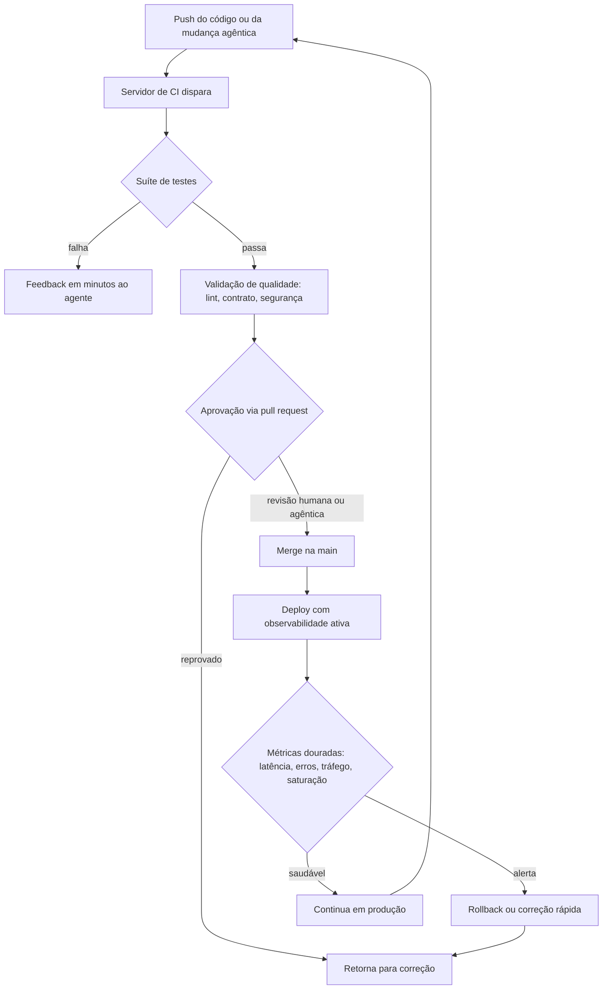

# Capítulo 11: Testes e CI/CD: a rede de segurança que a IA exige

## 1. Introdução

No capítulo anterior, você percorreu o panorama 2022-2026 e viu o campo migrar do autocomplete para agentes autônomos [14]. Agora chegou a hora de entender a ferramenta que torna toda essa autonomia segura: a rede de testes, integração contínua e observabilidade. Sem ela, um sistema que funciona no seu computador é apenas uma demonstração; com ela, vira um produto no qual você — e os agentes que você delega — podem confiar [4].

Este capítulo tem três objetivos. Primeiro, entender por que testes automatizados voltaram a ser a disciplina mais importante da era da IA [3]. Segundo, dominar o fluxo de integração contínua e seus três aliados: Git, branches e pull requests [7]. Terceiro, aprender a observar sistemas em produção para detectar falhas antes que o usuário as encontre [11]. Ao final, você terá o esqueleto de confiabilidade que sustenta toda a série [1].

## 2. Explica

### 2.1 A pirâmide de testes como prioridade de investimento

A pirâmide de testes organiza a suíte em camadas: muitos testes unitários na base, menos testes de integração no meio e poucos testes ponta a ponta no topo [1]. A lógica é econômica: testes unitários são rápidos, baratos e apontam o arquivo exato onde algo quebrou; testes ponta a ponta são lentos, frágeis e demorados [1]. Quando você inverte a pirâmide, cada mudança custa caro e o feedback chega tarde — o pior cenário para um fluxo agêntico, que precisa de ciclos curtos para se auto-corrigir [4].

### 2.2 TDD: escrever o teste antes do código

O Test-Driven Development inverte o fluxo natural: primeiro escreve-se um teste que falha, depois o código mínimo para fazê-lo passar e então se refatora [2]. Esse ciclo de três passos cria uma malha de segurança que torna o código automaticamente testável [2]. Para quem trabalha com IA, o TDD tem um bônus adicional: o teste vira a especificação executável que você pode entregar ao agente — em vez de descrever o comportamento desejado em prosa, você o descreve em código que falha se o agente errar [3].

### 2.3 Testes como especificação executável

A biblioteca de testes moderna carrega uma filosofia: o teste deve ser escrito na linguagem do comportamento, não na linguagem da implementação [3]. Quando um teste falha, a mensagem precisa dizer o que o sistema deveria fazer, não como ele faz por dentro [3]. É exatamente esse contrato que os agentes de código entendem melhor: uma suíte com nomes claros de comportamento é uma especificação viva que o agente lê antes de tocar no código [14].

### 2.4 Integração contínua: o batimento cardíaco do repositório

A integração contínua é a prática de integrar mudanças pequenas e frequentes, cada uma validada automaticamente [4]. O servidor de CI executa a suíte completa a cada push e avisa em minutos se algo quebrou [4]. Ferramentas como o GitHub Actions e o GitLab CI padronizaram esse fluxo: um arquivo de configuração no repositório define os passos — instalar dependências, rodar testes, validar lint e publicar artefatos [5][6]. Para o desenvolvedor AIDD, o CI é o juiz imparcial que decide se uma mudança proposta por um agente pode entrar [4].

### 2.5 Git, branches e pull requests: o trilho da colaboração

Nenhum fluxo agêntico funciona sem o controle de versão [7]. O Git registra cada mudança, e o modelo mental de branches permite isolar experimentos sem quebrar a linha principal [8]. A estratégia de branching escolhida — trunk-based, feature branches ou git flow — define a cadência da equipe e o ritmo com que o agente pode integrar trabalho [9]. O pull request é a porta de entrada da revisão humana: o código do agente só entra na main depois que um par — ou um agente revisor — confere e aprova [10].

### 2.6 Observabilidade: medir antes de confiar

Testes dizem que o sistema funcionava no momento do deploy; a observabilidade diz que ele continua funcionando sob carga real [11]. A disciplina de engenharia de confiabilidade de sites (SRE) definiu as quatro métricas douradas: latência, tráfego, erros e saturação [11]. A instrumentação moderna usa padrões abertos como o OpenTelemetry para coletar logs, métricas e rastreios com uma API única, independente do fornecedor [12]. Para sistemas agênticos, o rastreio distribuído ganha um uso novo: registrar qual ferramenta o agente chamou, com que entrada e com que saída — a trilha que permite auditar decisões autônomas [11].

### 2.7 O fluxo do agente sob a rede de segurança

Com tudo no lugar, o fluxo de trabalho do desenvolvedor AIDD ganha forma: o agente trabalha em uma branch curta, submete um pull request, o CI roda a suíte e a revisão acontece — humana ou agêntica — antes do merge [10]. Quando um teste falha, a causa pode estar no código novo, mas também no próprio agente: contexto mal curado, alucinação ou regressão de ferramenta [17]. É por isso que a suíte precisa cobrir também os artefatos gerados por IA: validação de sintaxe, testes de contrato e verificação de que o código gerado respeita o comportamento especificado [3].

## 3. Ilustra

### 3.1 A analogia da rede de segurança do equilibrista

Pense em um equilibrista ensaiando sem rede: qualquer erro exige recomeçar do zero, e o erro só é descoberto quando ele cai. A rede de testes é o contrário: ela transforma cada queda em uma lição barata, registrada e imediatamente visível [4]. O equilibrista não tem medo de tentar passos novos porque sabe que a rede está lá embaixo — e é exatamente essa confiança que a IA precisa para receber autonomia crescente sem que a equipe perca o sono [11].



### 3.2 A rede como guardiã da confiança

A beleza do desenho é que a rede protege nos dois sentidos: ela protege o produto dos erros do agente, e protege o agente de ser julgado por erros que nenhuma suíte teria capturado [3]. Uma organização que mede seus testes sabe exatamente onde está a cobertura e onde o risco mora — e pode decidir conscientemente onde a autonomia agêntica pode avançar [2].

## 4. Técnica

### 4.1 Uma suíte de teste com comportamento legível

O exemplo abaixo define um teste que descreve comportamento, não implementação — o padrão da biblioteca de testes moderna [3]:

```python
# tests/test_carrinho.py
def test_carrinho_aplica_desconto_para_cliente_vip(carrinho, cliente_vip):
    carrinho.adicionar("item_pro_1", quantidade=2)
    carrinho.aplicar_politica(cliente_vip)
    assert carrinho.total() == 90.0  # 10% de desconto sobre 100.0
```

```python
# tests/test_carrinho.py (continuação)
def test_carrinho_rejeita_item_inexistente(carrinho):
    resultado = carrinho.adicionar("sku_inexistente")
    assert resultado.foi_rejeitado
    assert "sku_inexistente" in resultado.motivo
```

O primeiro teste falha se o desconto sumir; o segundo protege o contrato de validação. Nomes em forma de frase transformam a suíte em documentação executável que o agente consulta antes de refatorar [3].

### 4.2 Pipeline de CI declarativo

A integração contínua em si é declarada no repositório, como neste pipeline mínimo de dois estágios [5]:

```yaml
# .github/workflows/ci.yml
name: ci
on: [push, pull_request]
jobs:
  validar:
    runs-on: ubuntu-latest
    steps:
      - uses: actions/checkout@v4
      - uses: actions/setup-python@v5
        with:
          python-version: "3.12"
      - run: pip install -e ".[dev]"
      - run: pytest --cov=src --cov-fail-under=80
      - run: python scripts/validar-codigo.py
```

Cada passo do pipeline é uma guarda: se a cobertura cair abaixo de 80%, o merge é bloqueado — um critério objetivo que não depende da opinião de quem revisa [4].

### 4.3 Instrumentação com rastreio

A observabilidade começa com a instrumentação. O exemplo abaixo cria um rastreio por requisição e registra o tempo de cada etapa do fluxo agêntico [12]:

```python
from opentelemetry import trace

tracer = trace.get_tracer("fabrica")

def chamada_do_agente(pergunta: str) -> str:
    with tracer.start_as_current_span("agente.chamada") as span:
        span.set_attribute("agente.pergunta", pergunta)
        span.set_attribute("agente.ferramenta", "pesquisa")
        resposta = invocar_modelo(pergunta)
        span.set_attribute("agente.resposta_len", len(resposta))
        return resposta
```

Com esses atributos, o painel de observabilidade responde perguntas que os testes não respondem: quanto tempo o agente gasta por ferramenta, onde a latência explode e qual turno produziu a saída errada [11].

## 5. Aplica

### 5.1 Onde isso vive no mundo real

Na prática, a rede de segurança aparece em todos os projetos sérios: o GitHub Actions e o GitLab CI rodam a suíte a cada merge request; o Git protege a história e permite voltar atrás; os pull requests organizam a revisão; e o OpenTelemetry conecta logs e métricas do ambiente de produção [5][6]. No mercado de 2026, os agentes de código de maior qualidade são justamente os que operam dentro de repositórios com CI forte — a diferença entre uma ferramenta que sugere código e um sistema que entrega código verificado [13][15].

### 5.2 O erro comum do iniciante

O erro clássico é escrever testes que só confirmam o que o código já faz — testes que passam mesmo quando o comportamento está errado [3]. O segundo erro é tratar CI como formalidade: um pipeline quebrado que ninguém conserta vira o pior dos mundos, porque destrói a confiança no sinal [4]. Comece pequeno: uma suíte unitária honesta, um pipeline de dois passos e um painel com as quatro métricas douradas valem mais do que cem alertas ignorados [11].

## 6. Conclusão

A rede de testes, CI e observabilidade é o que separa o protótipo do sistema em produção — e é a condição de possibilidade de toda autonomia agêntica [4]. Você aprendeu a priorizar a pirâmide, a escrever testes como especificação executável, a declarar pipelines de integração e a observar sistemas em produção [1][11]. Quando os capítulos seguintes mostrarem agentes executando tarefas, lembre-se: cada tarefa delegada precisa de uma rede de segurança equivalente, sob pena de transformar velocidade em caos [17].


## 7. Referências

[1] VOCKE, Ham; FOWLER, Martin. The Practical Test Pyramid. Disponível em: https://martinfowler.com/articles/practical-test-pyramid.html. Acesso em: 5 ago. 2026.
[2] BECK, Kent. Test-Driven Development: By Example. Boston: Addison-Wesley Professional, 2002.
[3] TESTING LIBRARY. Guiding Principles. Disponível em: https://testing-library.com/docs/guiding-principles/. Acesso em: 5 ago. 2026.
[4] FOWLER, Martin. Continuous Integration. Disponível em: https://martinfowler.com/articles/continuousIntegration.html. Acesso em: 5 ago. 2026.
[5] GITHUB ACTIONS DOCS. Understanding GitHub Actions. Disponível em: https://docs.github.com/en/actions/about-github-actions/understanding-github-actions. Acesso em: 5 ago. 2026.
[6] GITLAB. CI/CD pipeline architecture. Disponível em: https://docs.gitlab.com/ee/ci/. Acesso em: 5 ago. 2026.
[7] CHACON, Scott; STRAUB, Ben. Pro Git. 2. ed. Apress/Git SCM, 2014. Disponível em: https://git-scm.com/book/en/v2. Acesso em: 5 ago. 2026.
[8] GITHUB DOCS. About branches. Disponível em: https://docs.github.com/en/pull-requests/collaborating-with-pull-requests/proposing-changes-to-your-work-with-pull-requests/about-branches. Acesso em: 5 ago. 2026.
[9] ATLASSIAN. Git branching strategies. Disponível em: https://www.atlassian.com/git/tutorials/comparing-workflows. Acesso em: 5 ago. 2026.
[10] GITHUB DOCS. About pull requests. Disponível em: https://docs.github.com/en/pull-requests/collaborating-with-pull-requests/proposing-changes-to-your-work-with-pull-requests/about-pull-requests. Acesso em: 5 ago. 2026.
[11] EWASCHUK, Rob; BEYER, Betsy (Ed.). Site Reliability Engineering: Monitoring Distributed Systems. Google SRE Book. Disponível em: https://sre.google/sre-book/monitoring-distributed-systems/. Acesso em: 5 ago. 2026.
[12] OPENTELEMETRY. What is OpenTelemetry?. Disponível em: https://opentelemetry.io/docs/what-is-opentelemetry/. Acesso em: 5 ago. 2026.
[13] ITECS. Claude Code vs. GitHub Copilot: Agentic vs. Autocomplete. Disponível em: https://itecsonline.com/post/claude-code-vs-github-copilot-2026-agentic-vs-autocomplete-enterprise-guide. Acesso em: 5 ago. 2026.
[14] CODERABBIT. From Copilot to agents: The history of AI coding. Disponível em: https://www.coderabbit.ai/blog/a-very-brief-history-of-ai-coding-from-copilot-to-next-gen-agents. Acesso em: 5 ago. 2026.
[15] MIGHTYBOT. Best AI Coding Agents in 2026, Ranked. Disponível em: https://mightybot.ai/blog/coding-ai-agents-for-accelerating-engineering-workflows/. Acesso em: 5 ago. 2026.
[16] OPENAI. Tokenizer (ferramenta interativa). Disponível em: https://platform.openai.com/tokenizer. Acesso em: 5 ago. 2026.
[17] WENG, Lilian. Extrinsic Hallucinations in LLMs. Disponível em: https://lilianweng.github.io/posts/2024-07-07-hallucination/. Acesso em: 5 ago. 2026.
[18] CHROMA. Context Rot: How Increasing Input Tokens Impacts LLM Performance. Disponível em: https://www.trychroma.com/research/context-rot. Acesso em: 5 ago. 2026.
[19] OPENAI. Function Calling Guide. Disponível em: https://developers.openai.com/api/docs/guides/function-calling. Acesso em: 5 ago. 2026.
[20] PROMPTING GUIDE. Function Calling in AI Agents. Disponível em: https://www.promptingguide.ai/agents/function-calling. Acesso em: 5 ago. 2026.
