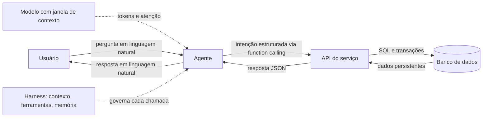

# Capítulo 12: Bancos de dados, APIs e servidores: o chão sobre o qual os agentes caminham

## 1. Introdução

No capítulo anterior, você montou a rede de segurança que valida o código — testes, CI e observabilidade [5]. Mas testes validam o comportamento de uma aplicação que precisa de algo para existir: dados armazenados, serviços expostos e máquinas rodando. Este capítulo desce ao chão sobre o qual os agentes caminham: bancos de dados, APIs e servidores [1].

Este capítulo tem três objetivos. Primeiro, entender o que é um banco de dados e por que o estado importa [1]. Segundo, dominar o vocabulário de APIs e servidores — o ponto de contato entre o agente e o mundo real [4]. Terceiro, conectar esse chão técnico ao que você já aprendeu sobre modelos: tokens, janelas de contexto e as limitações que explicam por que o modelo não é o sistema [17]. Ao final, você saberá desenhar o caminho completo de um dado: do banco à API, da API ao agente e do agente de volta ao usuário [7].

## 2. Explica

### 2.1 O banco de dados como memória externa do sistema

Todo sistema que precisa lembrar de algo entre requisições usa um banco de dados — a memória externa que sobrevive ao ciclo de vida de cada processo [1]. A modelagem decide a forma dos dados: entidades, relacionamentos e índices [1]. A regra de ouro para quem constrói com agentes é simples: o banco é a fonte da verdade; o agente é apenas um cliente com mais contexto e melhores maneiras [7].

### 2.2 APIs: a fronteira entre o mundo e o agente

Uma API é um contrato: métodos, rotas, parâmetros e formatos de resposta que definem como um cliente conversa com um serviço [4]. Para agentes, a API é a superfície de ação — é por ela que o modelo obtém dados, executa comandos e consulta o mundo [4]. O protocolo Model Context Protocol (MCP) padronizou essa conversa: um servidor MCP expõe ferramentas e recursos com um schema claro, e o cliente — o harness — gerencia o ciclo de vida [4].

### 2.3 Function calling: a ponte entre o texto e a ação

O function calling transforma a resposta do modelo em uma chamada estruturada: o modelo devolve um nome de função e argumentos em JSON, e o harness executa a função real [5][6]. Essa camada é o que separa um chat de um agente: o texto vira intenção, e a intenção vira efeito no mundo [5]. O vocabulário é pequeno e essencial: tool, tool calling e function calling — os mesmos termos que você viu no panorama histórico e que agora ganham corpo aqui [3].

### 2.4 Servidores: onde o código vive

Um servidor é um processo que escuta uma porta e responde requisições — e é o habitat natural de APIs e bancos [1]. A infraestrutura moderna separa responsabilidades: o servidor de aplicação executa a lógica, o banco persiste o estado e o proxy gerencia o tráfego [1]. Para o desenvolvedor AIDD, entender servidores é entender limites: onde o agente pode chegar, que portas estão abertas e que dados atravessam cada fronteira [7].

### 2.5 O que o modelo vê: tokens e contexto

Antes de um agente conversar com sua API, o texto precisa virar números: a tokenização divide o texto em unidades que o modelo processa [17]. A janela de contexto é a memória de trabalho do modelo — tudo o que entra nela compete por atenção [13]. Os modelos modernos oferecem janelas enormes, mas o tamanho não elimina o problema: quanto mais contexto, maior o risco de degradação de desempenho, o fenômeno conhecido como context rot [19]. A boa notícia é que a engenharia de contexto resolve: selecionar, comprimir e isolar o que entra na janela é uma disciplina própria [7].

### 2.6 O modelo não é o sistema

A distinção mais importante deste livro: o modelo é uma peça, o sistema é o conjunto [2]. Alucinações — respostas plausíveis porém erradas — são um risco inerente ao modelo, não um bug que se corrige com mais código [18]. A arquitetura protege o sistema desses riscos: o banco valida o estado, a API valida o contrato e o harness decide o que o modelo pode ou não fazer [2][7]. Por isso o papel do desenvolvedor mudou: ele não escreve mais cada linha, ele projeta o sistema em que as linhas geradas podem errar sem causar dano [2].

## 3. Ilustra

### 3.1 A analogia do garçom e da cozinha

Imagine um restaurante: o cliente conversa com o garçom, mas a comida sai da cozinha. O garçom (o agente) traduz o pedido do cliente em comandos; a cozinha (a API e o banco) executa e entrega; e o caderno de pedidos (o banco de dados) registra o que cada mesa pediu, para que nenhuma informação se perca entre turnos [1]. Se o garçom inventar um prato que não existe, a cozinha recusa — é assim que a validação de contrato protege o sistema [6].



### 3.2 A cozinha não funciona sem o caderno

O diagrama mostra o fluxo completo: o modelo fornece a inteligência, o harness governa, a API executa e o banco lembra [1]. Troque qualquer peça por uma improvisada e o sistema quebra — o mesmo princípio da pilha que você vem construindo desde o Livro 1 [2].

## 4. Técnica

### 4.1 Um modelo de dados mínimo

O exemplo abaixo define o modelo de um pedido com um relacionamento simples — o tipo de código que um agente consegue gerar com alta qualidade quando o contrato está claro [1]:

```python
from dataclasses import dataclass, field


@dataclass
class Pedido:
    id: int
    cliente: str
    itens: list[str] = field(default_factory=list)

    def total(self) -> float:
        return sum(item["preco"] * item["quantidade"] for item in self.itens)
```

O contrato é explícito: um pedido tem cliente, itens e um total calculado. Com essa definição, o agente sabe exatamente o que produzir — e a suíte de testes do capítulo anterior valida o resultado [5].

### 4.2 Uma API mínima com validação de contrato

Aqui, um serviço HTTP mínimo que expõe o pedido e valida a entrada antes de persistir [4]:

```python
from flask import Flask, jsonify, request

app = Flask(__name__)
pedidos: dict[int, dict] = {}


@app.post("/pedidos")
def criar_pedido():
    dados = request.get_json(force=True)
    if "cliente" not in dados or not isinstance(dados["cliente"], str):
        return jsonify({"erro": "campo cliente obrigatorio e textual"}), 422
    numero = len(pedidos) + 1
    pedidos[numero] = {"cliente": dados["cliente"], "itens": dados.get("itens", [])}
    return jsonify({"id": numero}), 201
```

A validação de contrato na borda — antes de qualquer lógica — é o padrão que separa uma API confiável de uma porta aberta para dados inválidos [4].

### 4.3 Convertendo o mundo em tokens

Para fechar o ciclo, veja como a tokenização funciona na prática [17]:

```python
import tiktoken

def contar_tokens(texto: str, modelo: str = "gpt-4o") -> int:
    enc = tiktoken.encoding_for_model(modelo)
    return len(enc.encode(texto))

def orcamento_de_contexto(texto: str, limite: int = 4000) -> bool:
    return contar_tokens(texto) <= limite
```

Saber contar tokens é o primeiro passo da engenharia de contexto: antes de decidir o que entra na janela, você precisa medir o custo de cada pedaço [17][19].

## 5. Aplica

### 5.1 O caminho completo do dado

No mundo real, o caminho completo do dado aparece em cada integração: o usuário pergunta ao agente, o agente chama a função certa, a API valida e persiste no banco, e a resposta volta traduzida [1]. A indústria já padronizou boa parte desse caminho — MCP para a conexão, schemas para o contrato e modelos com janelas cada vez maiores para o raciocínio [4][13]. O que diferencia equipes maduras é o cuidado com o meio do caminho: a curadoria do contexto que o modelo realmente recebe [7][8].

### 5.2 O erro comum do iniciante

O erro clássico é tratar o modelo como o sistema: assumir que uma resposta plausível é um dado confiável e persistir sem validação [18]. O segundo erro é ignorar o custo do contexto: empilhar documentos na janela até o desempenho degradar, sem medir o efeito [19]. O caminho certo é o oposto: validar na borda, persistir com contrato e selecionar contexto com intenção — as três lições deste capítulo em uma frase [7].

## 6. Conclusão

Bancos de dados, APIs e servidores formam o chão técnico sobre o qual os agentes caminham — e a engenharia de contexto decide o que o modelo vê desse chão [1][7]. Você aprendeu que o modelo é uma peça de um sistema maior, que o function calling é a ponte entre texto e ação e que a tokenização é a unidade de medida do contexto [5][17]. Com esse alicerce, os próximos livros da série podem construir em cima: o contexto, as regras, os hooks e o harness que governam a autonomia [2].


## 7. Referências

[1] KARPATHY, Andrej. Software 3.0: Software in the Age of AI. Disponível em: https://www.latent.space/p/s3. Acesso em: 5 ago. 2026.
[2] SITEPOINT. Vibe Coding 2026: The Complete Guide to AI-First Development. Disponível em: https://www.sitepoint.com/vibe-coding-2026-complete-guide/. Acesso em: 5 ago. 2026.
[3] WENG, Lilian. LLM-Powered Autonomous Agents. Disponível em: https://lilianweng.github.io/posts/2023-06-23-agent/. Acesso em: 5 ago. 2026.
[4] ANTHROPIC. Introducing the Model Context Protocol. Disponível em: https://www.anthropic.com/news/model-context-protocol. Acesso em: 5 ago. 2026.
[5] OPENAI. Function Calling Guide. Disponível em: https://developers.openai.com/api/docs/guides/function-calling. Acesso em: 5 ago. 2026.
[6] PROMPTING GUIDE. Function Calling in AI Agents. Disponível em: https://www.promptingguide.ai/agents/function-calling. Acesso em: 5 ago. 2026.
[7] ANTHROPIC. Effective Context Engineering for AI Agents. Disponível em: https://www.anthropic.com/engineering/effective-context-engineering-for-ai-agents. Acesso em: 5 ago. 2026.
[8] TIAN PAN. CLAUDE.md and AGENTS.md: The Configuration Layer That Makes AI Coding Agents Actually Follow Your Rules. Disponível em: https://tianpan.co/blog/2026-02-25-claude-md-agents-md-ai-coding-agent-instruction-files. Acesso em: 5 ago. 2026.
[9] OPENAI / AGENTS.MD FOUNDATION. Open Standards for Agentic Configuration (AGENTS.md). Disponível em: https://agents.md/. Acesso em: 5 ago. 2026.
[10] LULLA, Jai Lal; et al. On the Impact of AGENTS.md Files on the Efficiency of AI Coding Agents. Disponível em: https://arxiv.org/html/2601.20404v1. Acesso em: 5 ago. 2026.
[11] KARPATHY, Andrej. Sequoia Ascent 2026 Summary (Software 3.0 & Agentic Engineering). Disponível em: https://karpathy.bearblog.dev/sequoia-ascent-2026/. Acesso em: 5 ago. 2026.
[12] KEYHOLE SOFTWARE. Vibe Coding Trends 2026: Adoption, Productivity, and Code Quality Data. Disponível em: https://keyholesoftware.com/vibe-coding-trends-2026/. Acesso em: 5 ago. 2026.
[13] GARTENBERG, Chaim. What is a long context window?. Google DeepMind. Disponível em: https://blog.google/innovation-and-ai/products/long-context-window-ai-models/. Acesso em: 5 ago. 2026.
[14] GOOGLE AI DEVELOPERS. Long Context Guide (Gemini API). Disponível em: https://ai.google.dev/gemini-api/docs/long-context. Acesso em: 5 ago. 2026.
[15] LATENT SPACE. How to train a Million Context LLM — with Mark Huang of Gradient.ai. Disponível em: https://www.latent.space/p/gradient. Acesso em: 5 ago. 2026.
[16] GEKHMAN, Zorik; et al. Does Fine-Tuning LLMs on New Knowledge Encourage Hallucinations?. 2024. Disponível em: https://arxiv.org/abs/2405.05904. Acesso em: 5 ago. 2026.
[17] OPENAI. Tokenizer (ferramenta interativa). Disponível em: https://platform.openai.com/tokenizer. Acesso em: 5 ago. 2026.
[18] WENG, Lilian. Extrinsic Hallucinations in LLMs. Disponível em: https://lilianweng.github.io/posts/2024-07-07-hallucination/. Acesso em: 5 ago. 2026.
[19] CHROMA. Context Rot: How Increasing Input Tokens Impacts LLM Performance. Disponível em: https://www.trychroma.com/research/context-rot. Acesso em: 5 ago. 2026.
[20] MIGHTYBOT. Best AI Coding Agents in 2026, Ranked. Disponível em: https://mightybot.ai/blog/coding-ai-agents-for-accelerating-engineering-workflows/. Acesso em: 5 ago. 2026.
