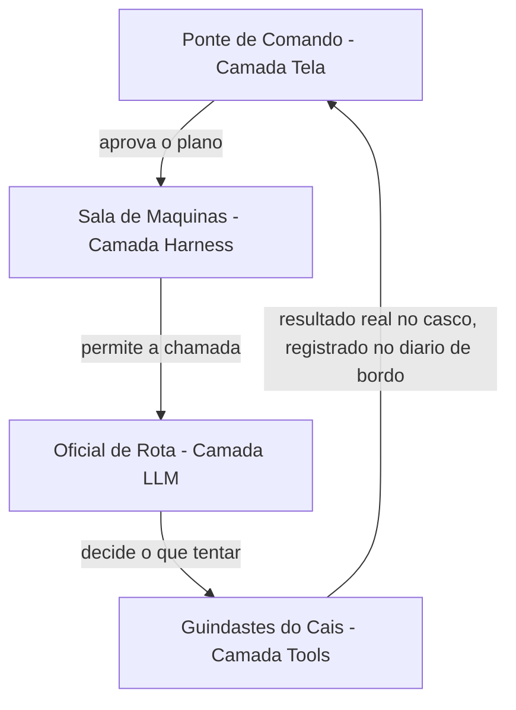
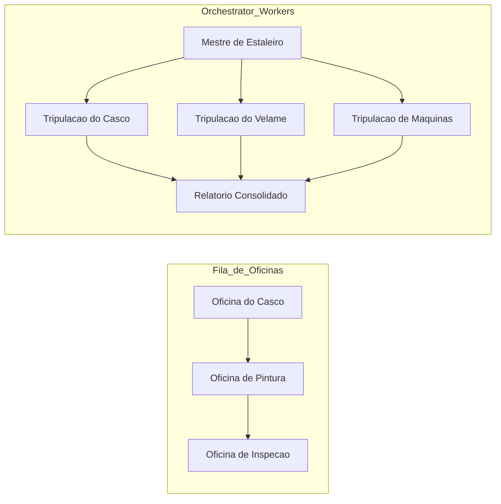

# Capítulo 2: A Arquitetura de Quatro Camadas: Tela, Harness, LLM e Tools

## 1. Introdução

No Capítulo 1, você atravessou a virada estrutural de vibe coding para agentic coding e viu o TDD/TDAD funcionar como guardrail contra a alucinação de código plausível [21]. Mas um guardrail sozinho não diz muito se você não souber **onde**, dentro do agente, ele realmente atua. Este capítulo abre o casco do agente de codificação e mostra que, por trás de qualquer ferramenta do mercado, existe a mesma arquitetura de quatro camadas — Tela, Harness, LLM e Tools —, cada uma com um contrato de responsabilidade distinto e intransferível.

Ao final deste capítulo, você deixa de ver um agente como uma caixa mágica e passa a enxergá-lo como uma composição de decisões: o que aprovar, o que é permitido, o que tentar e o que de fato executa. Esse mapa é o que separa quem apenas usa um agente de quem sabe auditar, depurar e projetar um — e é a base sobre a qual toda a Parte II da sua embarcação vai ser erguida, peça por peça, até a botadura.

## 2. Explica

A literatura técnica recente converge para um modelo de quatro camadas com contratos distintos entre a interface, o ambiente de execução, o modelo de linguagem e as ferramentas que ele aciona — essa é a arquitetura que explica por que ferramentas tão diferentes quanto Claude Code, Cursor e GitHub Copilot conseguem operar sob os mesmos princípios de segurança, mesmo com implementações completamente distintas por baixo do capô [22]. Antes de nomear cada camada, vale fixar a regra que atravessa todas elas: cada uma decide sobre um tipo diferente de risco, e nenhuma pode assumir a responsabilidade da outra sem quebrar a auditabilidade do sistema inteiro.

A camada **Harness** é o runtime do agente propriamente dito: é ela quem decide o que é **permitido**, verificando cada chamada de ferramenta contra um pipeline de regras de permissão antes de qualquer execução real acontecer [11]. Um harness bem projetado isola essa decisão de permissão da decisão de conteúdo — o que é exatamente o que garante que o mesmo runtime funcione de forma equivalente com modelos diferentes rodando por trás dele [7].

A camada **LLM** é onde o raciocínio acontece — e é também onde termina a autoridade do modelo: ele decide o que **tentar**, nunca o que de fato ocorre no mundo real. Saídas estruturadas e schemas tipados reduzem drasticamente a chance de o modelo tentar uma ação com argumentos inválidos, o que é a diferença entre uma ferramenta confiável em produção e uma fonte silenciosa de erros [17]. Esse contrato de tipos é o que permite ao modelo "conversar" com precisão sobre qual ferramenta chamar e com quais parâmetros, sem depender de o texto ser interpretado de forma ambígua por quem está do outro lado [13].

A camada **Tools** é o único ponto do sistema em que um efeito real acontece no mundo — um arquivo é escrito, um comando roda, uma API é chamada. No padrão de tool use da Claude API, quando o modelo decide usar uma ferramenta ele retorna um bloco de `tool_use`, e é a aplicação — nunca o modelo — quem efetivamente dispara a operação e devolve o resultado [19]. Essa separação entre "decidir" e "executar" é o motivo pelo qual boas práticas de function calling insistem em validar argumentos antes de despachar qualquer chamada real contra um sistema de produção [4].

A camada **Tela**, por fim, é onde a decisão humana entra: nos últimos anos ela migrou do paradigma "ajude-me a escrever código" para "revise o que eu fiz", incorporando padrões como *intent preview*, *approval gates* e estimativa explícita de raio de impacto antes de qualquer aprovação — um retrato que aparece de forma consistente quando se compara os principais harnesses do mercado lado a lado [20].

Essas quatro camadas, por si só, não implicam arquitetura complexa — elas apenas descrevem contratos. A composição de múltiplas chamadas dentro da camada LLM segue padrões documentados: *prompt chaining* encadeia uma chamada após a outra, *routing* classifica a entrada e direciona para um caminho especializado, *parallelization* dispara chamadas simultâneas, *orchestrator-workers* usa uma chamada central para decompor e delegar, e *evaluator-optimizer* usa uma chamada para gerar e outra para avaliar em ciclo [5]. Nenhum desses padrões exige um framework dedicado — eles podem, e frequentemente devem, ser implementados como funções simples dentro da própria camada LLM.

A recomendação central dessa literatura é buscar a solução mais simples possível e só escalar complexidade quando o ganho de desempenho compensa o custo adicional de latência, tokens e superfície de falha [15]. Essa não é uma regra estética — é uma decisão de engenharia, e é o tema que fecha este capítulo.

## 3. Ilustra

Como Engenheiro Agêntico, você já vem projetando sistemas — agora vai aprender a enxergá-los como um estaleiro inteiro, não como uma caixa fechada. Pense na sua embarcação agêntica: a **Ponte de Comando** é a camada Tela — é lá que o capitão (você, ou o operador humano) aprova ou barra uma manobra antes dela acontecer. A **Sala de Máquinas** é a camada Harness — é lá que se decide se há combustível, potência e segurança para tentar a manobra, mas não se decide o destino da viagem. O **Oficial de Rota** é a camada LLM — ele traça o rumo e propõe a manobra, mas não move um centímetro do casco sozinho. E os **Guindastes do Cais** são a camada Tools — são eles que efetivamente erguem a carga, soldam a chapa, giram o leme: o único ponto onde algo realmente muda no casco.



Esse mapa resolve o pilar do "quem faz o quê" — mas o padrão de orquestração é um ponto mais escorregadio, e merece uma segunda lente. Pense agora não num único reparo, mas numa ordem de serviço inteira no estaleiro. Se o Mestre de Estaleiro manda a ordem passar de oficina em oficina — casco, depois pintura, depois inspeção —, isso é *prompt chaining*: uma fila única, cada etapa dependendo do resultado da anterior. Mas se o Mestre olha a ordem de serviço, a decompõe em partes independentes e despacha simultaneamente para a tripulação do casco, a tripulação do velame e a tripulação de máquinas — cada uma trabalhando em paralelo e reportando de volta um relatório consolidado —, isso é *orchestrator-workers*. É a mesma ordem de serviço, mas duas arquiteturas de trabalho completamente diferentes, com custos e riscos diferentes.



## 4. Técnica

Tudo que você viu até aqui na Ilustra foi metáfora — necessária para fixar a intuição, mas ainda incapaz de rodar num terminal. Esta seção converte o mapa das quatro camadas, os padrões de orquestração e o portão de simplicidade em código que você pode copiar, executar e quebrar de propósito. A ordem de apresentação não é acidental: primeiro o contrato entre camadas (a peça mais fundamental, porque tudo o resto depende dela), depois os padrões de orquestração (como compor múltiplas chamadas dentro da camada LLM sem perder o contrato), e por fim o portão de simplicidade (o critério que decide quando vale a pena usar cada padrão). Ao final, um único exemplo integrado mostra as três peças trabalhando juntas, e uma última subseção aponta exatamente onde cada trecho de código simulado vira configuração real de harness nos capítulos seguintes.

### O Contrato entre as Quatro Camadas

O código a seguir simula, de forma didática, um "envelope de intenção" atravessando as quatro camadas do agente. Não há chamada real a uma API de LLM aqui — o objetivo é tornar tangível o contrato de fronteira entre cada camada, o mesmo contrato que sustenta harnesses reais como o do Claude Code [6]. Repare que cada função só enxerga o campo que lhe compete: a Tela só aprova ou rejeita, o Harness só verifica permissão, o LLM só propõe uma ação, e a Tool só executa o que já foi aprovado e permitido.

```python
from dataclasses import dataclass
from typing import Optional


@dataclass
class IntentEnvelope:
    """Envelope que atravessa as quatro camadas do agente."""
    tarefa: str
    acao_proposta: Optional[str] = None
    aprovado_pela_tela: bool = False
    permitido_pelo_harness: bool = False
    resultado_da_tool: Optional[str] = None
    raio_de_impacto: str = "baixo"  # baixo, medio, alto


def tela_aprovar(envelope: IntentEnvelope) -> IntentEnvelope:
    """Camada Tela: decide o que aprovar, a partir do raio de impacto."""
    if envelope.raio_de_impacto == "alto":
        envelope.aprovado_pela_tela = False
        return envelope
    envelope.aprovado_pela_tela = True
    return envelope


def harness_permitir(envelope: IntentEnvelope, ferramentas_liberadas: set) -> IntentEnvelope:
    """Camada Harness: decide o que e permitido, independente de aprovacao."""
    if not envelope.aprovado_pela_tela:
        envelope.permitido_pelo_harness = False
        return envelope
    envelope.permitido_pelo_harness = "editar_arquivo" in ferramentas_liberadas
    return envelope


def llm_decidir(envelope: IntentEnvelope) -> IntentEnvelope:
    """Camada LLM: decide o que tentar, nunca o que executa de fato."""
    if envelope.permitido_pelo_harness:
        envelope.acao_proposta = "editar_arquivo(config.yaml)"
    return envelope


def tool_executar(envelope: IntentEnvelope) -> IntentEnvelope:
    """Camada Tools: unico ponto com efeito real no mundo."""
    if envelope.acao_proposta:
        envelope.resultado_da_tool = f"executado: {envelope.acao_proposta}"
    return envelope


def atravessar_camadas(tarefa: str, raio_de_impacto: str, ferramentas_liberadas: set) -> IntentEnvelope:
    envelope = IntentEnvelope(tarefa=tarefa, raio_de_impacto=raio_de_impacto)
    envelope = tela_aprovar(envelope)
    envelope = harness_permitir(envelope, ferramentas_liberadas)
    envelope = llm_decidir(envelope)
    envelope = tool_executar(envelope)
    return envelope


if __name__ == "__main__":
    resultado = atravessar_camadas(
        tarefa="ajustar timeout de conexao",
        raio_de_impacto="baixo",
        ferramentas_liberadas={"editar_arquivo"},
    )
    print(resultado.resultado_da_tool)
```

Percorra o fluxo com atenção, porque é nele que mora o contrato inteiro. `tela_aprovar` só examina `raio_de_impacto` — ela nunca olha para `ferramentas_liberadas`, porque decidir sobre ferramentas não é trabalho da Tela. `harness_permitir` faz o inverso: ignora completamente o conteúdo da tarefa e só verifica se o nome da ferramenta está no conjunto liberado, e mesmo assim só depois de confirmar que a Tela já aprovou. `llm_decidir` só é chamada depois que as duas primeiras portas abriram, e ainda assim ela apenas propõe uma string de ação — não existe, até este ponto do código, nenhum efeito real no sistema de arquivos ou em qualquer API externa. Só `tool_executar` toca o mundo real. Essa ordem não é arbitrária: inverter qualquer uma dessas etapas — por exemplo, deixar o LLM decidir antes de o Harness permitir — é o erro estrutural mais comum em harnesses caseiros mal projetados, porque abre uma janela em que uma ação pode ser proposta e executada antes de qualquer verificação de permissão rodar.

Um contrato que não é testado é apenas uma esperança. Os dois testes abaixo travam, em código, exatamente as garantias que a Ponte de Comando e a Sala de Máquinas prometem: nenhuma tarefa de alto raio de impacto atravessa a Tela, e nenhuma ferramenta fora da lista liberada atravessa o Harness — mesmo que a Tela já tenha aprovado.

```python
def test_raio_de_impacto_alto_bloqueia_execucao():
    resultado = atravessar_camadas(
        tarefa="dropar tabela de producao",
        raio_de_impacto="alto",
        ferramentas_liberadas={"editar_arquivo"},
    )
    assert resultado.aprovado_pela_tela is False
    assert resultado.permitido_pelo_harness is False
    assert resultado.resultado_da_tool is None


def test_ferramenta_nao_liberada_bloqueia_harness():
    resultado = atravessar_camadas(
        tarefa="deploy em producao",
        raio_de_impacto="baixo",
        ferramentas_liberadas=set(),
    )
    assert resultado.aprovado_pela_tela is True
    assert resultado.permitido_pelo_harness is False
    assert resultado.resultado_da_tool is None
```

O paralelo com um harness real não é força de expressão. No Claude Code, o arquivo `settings.json` guarda exatamente esse tipo de lista de ferramentas liberadas por padrão de permissão, e é essa lista — não o modelo — quem decide se uma chamada de ferramenta chega a ser tentada [7]. Uma versão simplificada dessa configuração, no mesmo espírito do conjunto `ferramentas_liberadas` do código acima, se pareceria com isto:

```json
{
  "permissions": {
    "allow": [
      "Edit(config.yaml)",
      "Bash(pytest:*)"
    ],
    "ask": [
      "Bash(git push:*)"
    ],
    "deny": [
      "Bash(rm -rf *)"
    ]
  }
}
```

Repare que a estrutura real tem três níveis, não dois: `allow` (equivalente ao nosso `ferramentas_liberadas`), `ask` (a fronteira em que o Harness devolve a decisão para a Tela, mesmo já tendo verificado a regra) e `deny` (o bloqueio incondicional, que nenhuma aprovação humana reverte). É esse terceiro estado — nem liberado, nem proibido, mas escalado de volta para a Ponte de Comando — que o breakdown de arquitetura do Claude Code documenta como o mecanismo central de segurança em camadas [6], e que você vai configurar de verdade no Capítulo 7.

Note ainda que schemas tipados de entrada e saída — o mesmo princípio que sustenta chamadas de ferramenta programáticas em produção [16] — são o que torna esse contrato auditável: você pode inspecionar `IntentEnvelope` em qualquer ponto da cadeia e saber exatamente qual camada decidiu o quê, sem precisar reconstruir a lógica a partir de logs soltos. É esse mesmo princípio de contexto isolado por camada que, mais adiante na obra, sustenta a economia severa de tokens: cada camada só carrega o que precisa para decidir [10].

Repare também numa escolha de design deliberada: cada camada acima é uma função pura, recebendo o `IntentEnvelope` e devolvendo uma versão atualizada dele — nenhuma função grava estado global, nenhuma função chama a próxima diretamente. É `atravessar_camadas` quem orquestra a sequência, e é só ali que a ordem das quatro chamadas fica explícita. Essa escolha não é estilo de código: é o que permite substituir qualquer camada isoladamente por uma implementação real (a Tela vira uma interface de terminal, o Harness vira um verificador de `settings.json`, o LLM vira uma chamada de API de verdade) sem reescrever as outras três. Levantamentos recentes sobre arquitetura de agentes tratam justamente essa composição em funções isoláveis como um dos fatores que determinam se um harness escala além de um protótipo de fim de semana [12].

### Padrões de Orquestração na Prática

Quando uma tarefa é grande o suficiente para não caber numa única chamada de LLM, você precisa escolher **deliberadamente** um padrão de orquestração — não empilhar chamadas ao acaso. Antes do código, vale fixar quando cada padrão se paga, na mesma moeda do estaleiro: tempo de doca, tripulação envolvida e risco de a manobra sair errada.

| Padrão | Quando usar no estaleiro | Custo relativo | Risco principal |
|---|---|---|---|
| Prompt chaining | Ordem de serviço linear, cada etapa depende do resultado da anterior | Baixo | Falha em cadeia se uma etapa quebrar |
| Routing | Tarefas de tipos claramente diferentes chegando ao mesmo cais | Baixo-médio | Classificação errada manda a tarefa para a tripulação errada |
| Parallelization | Subtarefas independentes que não se bloqueiam entre si | Médio | Resultados conflitantes exigem reconciliação manual |
| Orchestrator-workers | Ordem de serviço grande, decomposta dinamicamente | Médio-alto | O Mestre de Estaleiro vira gargalo se mal dimensionado |
| Evaluator-optimizer | Resultado precisa de revisão antes da aprovação final | Alto | Ciclo de revisão sem critério de parada vira loop infinito |

O código abaixo implementa, em miniatura, o padrão *orchestrator-workers* com um passo de *routing* embutido: uma função central decompõe a tarefa e decide, por tipo, qual "trabalhador" especializado deve tratá-la. Esse é o mesmo princípio que sustenta o Dynamic Workflows do Claude Code, em que um script orquestra subagentes em escala com avaliação automática do resultado [14], e que frameworks como LangGraph, CrewAI e AutoGen empacotam como abstração de mais alto nível [8].

```python
from typing import Callable, Dict, List


def worker_revisar_seguranca(subtarefa: str) -> str:
    return f"[seguranca] revisado: {subtarefa}"


def worker_revisar_estilo(subtarefa: str) -> str:
    return f"[estilo] revisado: {subtarefa}"


def worker_revisar_testes(subtarefa: str) -> str:
    return f"[testes] revisado: {subtarefa}"


ROTAS: Dict[str, Callable[[str], str]] = {
    "seguranca": worker_revisar_seguranca,
    "estilo": worker_revisar_estilo,
    "testes": worker_revisar_testes,
}


def decompor_ordem_de_servico(pull_request: str) -> List[str]:
    """Simula o Mestre de Estaleiro decompondo uma ordem de servico."""
    return [f"seguranca:{pull_request}", f"estilo:{pull_request}", f"testes:{pull_request}"]


def rotear(subtarefa: str) -> str:
    categoria, _, corpo = subtarefa.partition(":")
    worker = ROTAS.get(categoria)
    if worker is None:
        return f"[sem rota] {subtarefa}"
    return worker(corpo)


def orchestrator_workers(pull_request: str) -> List[str]:
    subtarefas = decompor_ordem_de_servico(pull_request)
    return [rotear(subtarefa) for subtarefa in subtarefas]


def evaluator_optimizer(relatorios: List[str], minimo_aceitavel: int = 3) -> str:
    """Camada extra de avaliacao: so aprova se todas as tripulacoes reportaram."""
    if len(relatorios) < minimo_aceitavel:
        return "reprovado: relatorio incompleto"
    return "aprovado: " + " | ".join(relatorios)


if __name__ == "__main__":
    relatorios = orchestrator_workers("PR-482: ajuste no coletor de telemetria")
    veredito = evaluator_optimizer(relatorios)
    print(veredito)
```

O `evaluator_optimizer` acima é uma versão de threshold único — ele aprova ou reprova de uma vez, sem chance de correção. O padrão completo, descrito na literatura sobre composição de chamadas de LLM, prevê um **ciclo**: uma chamada gera, outra avalia, e se a avaliação reprovar, uma nova rodada é disparada até um limite de tentativas [5]. É essa diferença — threshold único versus ciclo — que costuma separar um evaluator-optimizer de brinquedo de um que sobrevive em produção.

```python
def revisar_com_ciclo(pull_request: str, tentativas_maximas: int = 2) -> str:
    """Ciclo evaluator-optimizer: gera, avalia, e tenta novamente se reprovado."""
    tentativa = 0
    while tentativa < tentativas_maximas:
        relatorios = orchestrator_workers(pull_request)
        veredito = evaluator_optimizer(relatorios)
        if veredito.startswith("aprovado"):
            return veredito
        tentativa += 1
    return f"reprovado apos {tentativas_maximas} tentativas: {pull_request}"
```

Repare que `revisar_com_ciclo` tem um critério de parada explícito (`tentativas_maximas`) — sem ele, um evaluator-optimizer mal projetado pode entrar em loop indefinido, gerando e reprovando a mesma tarefa sem nunca convergir, consumindo tokens a cada volta. É exatamente esse tipo de ciclo sem trava que o Dynamic Workflows do Claude Code resolve nativamente, associando cada rodada a uma métrica de *Performance Outcomes* que decide quando parar de tentar [14].

Ferramentas de mercado que empacotam subagentes — do Claude Code a guias de orquestração publicados pela comunidade — resolvem exatamente esse problema de despacho e consolidação, só que em escala e com estado persistente entre chamadas [18]. Times que já rodam esse tipo de orquestração em produção real relatam o mesmo ganho: menos código de cola escrito à mão, mais previsibilidade sobre qual worker tratou qual pedaço da tarefa [9]. O ponto pedagógico não muda: antes de adotar um framework, saiba nomear qual dos cinco padrões você está implementando manualmente.

### O Portão da Simplicidade

Nem toda tarefa justifica orquestração. A função abaixo formaliza o "portão de simplicidade": um filtro que avalia o raio de impacto e a reversibilidade da tarefa antes de decidir se vale a pena escalar de uma chamada única para um pipeline multi-camada completo.

```python
def precisa_orquestrar(raio_de_impacto: str, reversivel: bool, numero_de_subtarefas: int) -> bool:
    """Portao de simplicidade: so escala para orquestracao quando o custo compensa."""
    if raio_de_impacto == "baixo" and reversivel:
        return False
    if numero_de_subtarefas <= 1:
        return False
    return raio_de_impacto in ("medio", "alto") or numero_de_subtarefas >= 3


def escolher_estrategia(raio_de_impacto: str, reversivel: bool, numero_de_subtarefas: int) -> str:
    if precisa_orquestrar(raio_de_impacto, reversivel, numero_de_subtarefas):
        return "orquestracao multi-camada (doca seca)"
    return "chamada unica (reparo rapido no cais)"


if __name__ == "__main__":
    print(escolher_estrategia("baixo", True, 1))
    print(escolher_estrategia("alto", False, 4))
```

A versão com `if`/`return` acima é didática, mas um portão de simplicidade em produção costuma virar dado, não lógica embutida — assim ele pode ser auditado, versionado e ajustado sem tocar em código. A mesma decisão, expressa como matriz:

```python
MATRIZ_DE_DECISAO = {
    ("baixo", True): "chamada unica (reparo rapido no cais)",
    ("baixo", False): "chamada unica com checkpoint (reparo assistido)",
    ("medio", True): "prompt chaining (fila curta de oficinas)",
    ("medio", False): "orchestrator-workers (doca seca parcial)",
    ("alto", True): "orchestrator-workers com evaluator-optimizer (doca seca completa)",
    ("alto", False): "orchestrator-workers com aprovacao humana obrigatoria (doca seca com capitao a bordo)",
}


def escolher_estrategia_por_matriz(raio_de_impacto: str, reversivel: bool) -> str:
    chave = (raio_de_impacto, reversivel)
    return MATRIZ_DE_DECISAO.get(chave, "revisar manualmente: combinacao nao mapeada")
```

Note a granularidade: a versão anterior só distinguia dois destinos ("orquestração" ou "chamada única"), mas a matriz reconhece seis estratégias intermediárias, cada uma combinando um padrão de orquestração da seção anterior com um nível de supervisão humana compatível com o raio de impacto real da tarefa — a mesma lógica de escalonamento por risco que a literatura sobre sistemas agênticos práticos recomenda como prática madura de engenharia [15], e que também aparece descrita como o núcleo do que separa um harness ingênuo de um harness confiável para tarefas longas [22].

### Juntando as Três Peças num Único Fluxo

Até aqui, cada pilar foi demonstrado isoladamente: o contrato entre camadas, o padrão de orquestração, o portão de simplicidade. Mas no estaleiro real, uma fila inteira de ordens de serviço chega ao mesmo tempo, e é preciso decidir — ordem a ordem — qual caminho cada uma percorre antes de sequer começar a execução. O código abaixo junta as três peças: para cada ordem de serviço, primeiro consulta a `MATRIZ_DE_DECISAO` para saber a estratégia, e só então decide se o fluxo passa pelo contrato de quatro camadas (`atravessar_camadas`) ou pelo padrão de orquestração (`orchestrator_workers` mais `evaluator_optimizer`).

```python
from dataclasses import dataclass
from typing import List


@dataclass
class OrdemDeServico:
    identificador: str
    raio_de_impacto: str
    reversivel: bool
    numero_de_subtarefas: int


def processar_ordem_de_servico(ordem: OrdemDeServico) -> str:
    """Combina o portao de simplicidade com o fluxo de quatro camadas ou orquestracao."""
    estrategia = escolher_estrategia_por_matriz(ordem.raio_de_impacto, ordem.reversivel)
    if "chamada unica" in estrategia:
        envelope = atravessar_camadas(
            tarefa=ordem.identificador,
            raio_de_impacto=ordem.raio_de_impacto,
            ferramentas_liberadas={"editar_arquivo"},
        )
        return f"{ordem.identificador}: {estrategia} -> {envelope.resultado_da_tool}"
    relatorios = orchestrator_workers(ordem.identificador)
    veredito = evaluator_optimizer(relatorios, minimo_aceitavel=ordem.numero_de_subtarefas)
    return f"{ordem.identificador}: {estrategia} -> {veredito}"


def processar_fila_do_estaleiro(ordens: List[OrdemDeServico]) -> List[str]:
    return [processar_ordem_de_servico(ordem) for ordem in ordens]


if __name__ == "__main__":
    fila = [
        OrdemDeServico("ajustar timeout de conexao", "baixo", True, 1),
        OrdemDeServico("revisar PR-482", "medio", False, 3),
        OrdemDeServico("migrar schema de producao", "alto", False, 3),
    ]
    for linha in processar_fila_do_estaleiro(fila):
        print(linha)
```

Rode mentalmente a fila do exemplo e note como cada ordem recebe um tratamento diferente sem que você precise escrever um `if` especial para cada caso: "ajustar timeout de conexão" tem raio de impacto baixo e é reversível, então cai direto na chamada única e atravessa o contrato de quatro camadas sozinha. "Revisar PR-482" tem raio de impacto médio e não é trivialmente reversível, então a matriz já escolhe `orchestrator-workers` — e é o mesmo pipeline de despacho e consolidação que você viu na subseção anterior, com um `evaluator_optimizer` decidindo se os relatórios das tripulações são suficientes. "Migrar schema de produção" tem o raio de impacto mais alto de todos e não é reversível — a matriz escolhe a rota mais cara e mais supervisionada, exatamente a lógica de trade-off deliberado entre latência, custo e segurança que a literatura sobre composição de agentes recomenda como prática madura, em vez de aplicar o mesmo nível de rigor a toda tarefa indiscriminadamente [5]. É esse desacoplamento — a decisão de "como executar" nunca fica hard-coded junto com "o que executar" — que permite adicionar uma quarta ou quinta estratégia à matriz sem reescrever nenhuma das funções de camada ou de orquestração já testadas.

### Da Simulação ao Harness Real

Nenhum dos blocos de código acima chama uma API de LLM de verdade — e essa é uma escolha deliberada, não uma limitação. O objetivo desta seção não foi te ensinar a chamar `client.messages.create`, mas te dar um modelo mental executável do contrato entre as quatro camadas, algo que você pode rodar, testar e quebrar de propósito antes de gastar um único token real. A distância entre a simulação e o real, porém, é menor do que parece: o mesmo papel que `llm_decidir` cumpre acima — propor uma ação sem executá-la — é literalmente como o tool use da Claude API funciona. O modelo nunca chama `tool_executar` diretamente; ele apenas retorna um bloco `tool_use` descrevendo a intenção, e cabe à sua aplicação decidir se despacha essa chamada [19]:

```python
FERRAMENTA_EDITAR_ARQUIVO = {
    "name": "editar_arquivo",
    "description": "Aplica uma edicao pontual em um arquivo de configuracao do projeto.",
    "input_schema": {
        "type": "object",
        "properties": {
            "caminho": {"type": "string"},
            "conteudo_novo": {"type": "string"},
        },
        "required": ["caminho", "conteudo_novo"],
    },
}


def executar_tool_use(nome_da_ferramenta: str, entrada: dict) -> str:
    """Camada Tools real: so chega aqui depois que o Harness ja permitiu a chamada."""
    if nome_da_ferramenta != "editar_arquivo":
        raise ValueError(f"ferramenta desconhecida: {nome_da_ferramenta}")
    caminho = entrada["caminho"]
    conteudo_novo = entrada["conteudo_novo"]
    return f"arquivo {caminho} atualizado com {len(conteudo_novo)} caracteres novos"
```

Repare que `FERRAMENTA_EDITAR_ARQUIVO` é só dado — um `input_schema` em JSON Schema, o mesmo formato tipado que a Claude API espera para reduzir a chance de o modelo propor uma chamada com argumentos inválidos ou incompletos [17]. `executar_tool_use` é quem materializa, de verdade, o papel de `tool_executar` do primeiro exemplo: ela só roda depois que o restante do pipeline (Tela aprovando, Harness permitindo, LLM decidindo) já validou a intenção, e mesmo assim ela ainda revalida o nome da ferramenta antes de agir — nunca confie cegamente numa camada anterior, mesmo dentro do seu próprio código. Esse mesmo padrão de contrato tipado é o que sustenta chamadas de ferramenta programáticas em produção, permitindo que o Harness encadeie múltiplas chamadas de tool sem reenviar todo o histórico de raciocínio de volta ao modelo a cada etapa [16].

Quando você chegar ao Capítulo 3, vai substituir `tela_aprovar` por um fluxo real de *intent preview* e *approval gates*; no Capítulo 4, aprofunda exatamente esse par `FERRAMENTA_EDITAR_ARQUIVO`/`executar_tool_use` com schemas mais ricos e validação de erros; e no Capítulo 7, o dicionário `ferramentas_liberadas` vira o `settings.json` completo, com hooks determinísticos rodando em cada transição de camada [11]. A engenharia de contexto que acompanha esse runtime — decidir o que cada camada carrega para tomar sua decisão, sem inundar a janela de contexto do LLM com informação que não é dela — é ela mesma tratada como disciplina própria na literatura recente [10], e vai ganhar um capítulo inteiro mais adiante na obra.

Some as quatro peças de código desta seção e você tem, em miniatura, todo o argumento do capítulo executável: `IntentEnvelope` prova o contrato entre camadas; `orchestrator_workers` mais `revisar_com_ciclo` provam os padrões de orquestração compostos com intenção; `MATRIZ_DE_DECISAO` prova o portão de simplicidade decidindo entre eles como dado, não como lógica espalhada; e `FERRAMENTA_EDITAR_ARQUIVO`/`executar_tool_use` provam que nada disso é analogia solta. É o mesmo contrato tipado que roda, hoje, em harnesses de produção reais, verificando permissão antes de qualquer chamada real acontecer [7], numa arquitetura documentada em detalhe por quem já fez esse breakdown ponta a ponta [6]. Se você entendeu por que cada peça está isolada das outras, você já está pronto para o próximo passo: parar de simular a Ponte de Comando e a Sala de Máquinas, e começar a configurá-las de verdade. Guarde os quatro nomes de função — `tela_aprovar`, `harness_permitir`, `llm_decidir`, `tool_executar` — porque eles vão reaparecer, com implementação real em vez de simulação, exatamente nessa ordem ao longo da Parte II inteira. E guarde também a ordem em que a fila do estaleiro foi resolvida: primeiro o contrato, depois a composição, por fim o critério de quando vale a pena compor — essa é a sequência de raciocínio que separa quem projeta arquitetura agêntica com intenção de quem só copia o framework mais recente do mercado.

## 5. Aplica

Imagine a cena: você acabou de herdar o pipeline de revisão automática de pull requests de um squad de dez pessoas. O prazo é curto e a ambição é grande, então você monta, de saída, uma arquitetura *orchestrator-workers* com cinco agentes especializados — segurança, estilo, testes, performance e documentação —, cada um com seu próprio prompt de sistema e sua própria chamada de LLM. Duas semanas depois, o time reclama que revisar um PR de três linhas leva quatro minutos e consome um orçamento de tokens que ninguém previu. Você foi seduzido pelo erro mais comum da engenharia agêntica: tratar "mais orquestração" como sinônimo de "mais qualidade" [2].

O diagnóstico é exatamente o princípio que fechou a seção Explica: a solução mais simples possível deveria ter sido testada primeiro, e só escalada quando o ganho de desempenho comprovadamente compensasse o custo adicional de latência e tokens [15]. Um PR de três linhas de configuração tem raio de impacto baixo e é trivialmente reversível — ele nunca precisou de cinco tripulações despachadas em paralelo; precisava, no máximo, de um *prompt chaining* simples com duas etapas. A correção prática é reintroduzir o portão de simplicidade da seção Técnica antes de qualquer PR entrar no pipeline: medir raio de impacto e reversibilidade primeiro, escolher a arquitetura depois — nunca o contrário.

Esse tipo de disciplina é o que separa squads que relatam ganhos reais de produtividade agêntica dos que relatam custo descontrolado sem retorno proporcional — um contraste que aparece com frequência em levantamentos recentes de adoção corporativa, nos quais a transição de assistentes de código para agentes orquestrados no SDLC completo é tratada como tendência dominante do mercado [3]. Playbooks de produção que documentam esse tipo de squad reforçam a mesma lição: subagentes bem delimitados escalam produtividade, mas só quando a decisão de orquestrar já passou pelo portão de simplicidade [9]. Armadilhas comuns a evitar, como síntese rápida do que a cena acima já mostrou na prática:

- Escalar para orquestrador-workers antes de medir se um prompt chaining simples resolveria.
- Deixar a camada Tela aprovar automaticamente tarefas de raio de impacto alto só porque "está funcionando em staging".
- Confundir "mais agentes especializados" com "mais precisão" — cada agente adicional é mais uma fonte de custo e de falha, não menos.

## 6. Conclusão

Você fechou este capítulo com três peças sólidas do casco: o mapa das quatro camadas (Tela aprova, Harness permite, LLM decide o que tentar, Tools executam), os cinco padrões de orquestração que compõem chamadas de LLM com intenção (chaining, routing, parallelization, orchestrator-workers, evaluator-optimizer), e o critério de simplicidade deliberada que decide quando vale a pena usar cada um. Como desafio, pegue um fluxo de trabalho agêntico que você já usa hoje — mesmo que seja uma automação simples — e classifique cada etapa dele em uma das quatro camadas: se você não conseguir, é sinal de que a fronteira entre "decidir" e "executar" ainda está confusa no seu sistema. No Capítulo 3, você desce um nível de abstração e entra na Sala de Máquinas propriamente dita, para ver como a Camada Tela negocia risco com o humano e como o Harness aplica permissões antes de qualquer execução.

## 7. Referências Bibliográficas

[1] ANTHROPIC. *Agent Skills — Claude Platform Docs*. Disponível em: https://platform.claude.com/docs/en/agents-and-tools/agent-skills/overview. Acesso em: 02 ago. 2026.

[2] ARXIV.ORG. *Agentic AI in the Software Development Lifecycle*. Disponível em: https://arxiv.org/pdf/2604.26275. Acesso em: 02 ago. 2026.

[3] FORRESTER. *Agentic Software Development Takes The Lead: From Code Assistants To Orchestrated SDLC Agents*. Disponível em: https://www.forrester.com/blogs/agentic-software-development-takes-the-lead-from-code-assistants-to-orchestrated-sdlc-agents/. Acesso em: 02 ago. 2026.

[4] HARTENFELLER. *Best Practices for LLM Tools or Function Calling for Oracle Developers*. Disponível em: https://hartenfeller.dev/blog/ai-tools-best-practice-oracle. Acesso em: 02 ago. 2026.

[5] ANTHROPIC. *Building Effective AI Agents*. Disponível em: https://www.anthropic.com/research/building-effective-agents. Acesso em: 02 ago. 2026.

[6] WAVESPEED AI. *Claude Code Agent Harness: Architecture Breakdown*. Disponível em: https://wavespeed.ai/blog/posts/claude-code-agent-harness-architecture/. Acesso em: 02 ago. 2026.

[7] PILLITTERI, Pasquale. *Claude Code Harness: The Runtime Architecture That Turns an LLM into an Autonomous Agent (2026 Guide)*. Disponível em: https://pasqualepillitteri.it/en/news/1892/claude-code-harness-runtime-architecture-2026-guide. Acesso em: 02 ago. 2026.

[8] KONISHI, Hidekazu. *Claude Code Subagents and Multi-Agent Orchestration Guide*. Disponível em: https://hidekazu-konishi.com/entry/claude_code_subagents_and_orchestration_guide.html. Acesso em: 02 ago. 2026.

[9] TOTALUM. *Claude Code subagents: the 2026 production playbook*. Disponível em: https://www.totalum.app/blog/claude-code-subagents-totalum. Acesso em: 02 ago. 2026.

[10] ANTHROPIC. *Effective context engineering for AI agents*. Disponível em: https://www.anthropic.com/engineering/effective-context-engineering-for-ai-agents. Acesso em: 02 ago. 2026.

[11] ANTHROPIC. *Effective harnesses for long-running agents*. Disponível em: https://www.anthropic.com/engineering/effective-harnesses-for-long-running-agents. Acesso em: 02 ago. 2026.

[12] ARXIV.ORG. *From Question Answering to Task Completion: A Survey on Agent System and Harness Design*. Disponível em: https://arxiv.org/pdf/2606.20683. Acesso em: 02 ago. 2026.

[13] PROMPTLAYER. *How JSON Schema Works for LLM Tools & Structured Outputs*. Disponível em: https://blog.promptlayer.com/how-json-schema-works-for-structured-outputs-and-tool-integration/. Acesso em: 02 ago. 2026.

[14] ANTHROPIC. *Orchestrate subagents at scale with dynamic workflows — Claude Code Docs*. Disponível em: https://code.claude.com/docs/en/workflows. Acesso em: 02 ago. 2026.

[15] ARXIV.ORG. *Practical Considerations for Agentic LLM Systems*. Disponível em: https://arxiv.org/pdf/2412.04093. Acesso em: 02 ago. 2026.

[16] ANTHROPIC. *Programmatic tool calling — Claude Platform Docs*. Disponível em: https://platform.claude.com/docs/en/agents-and-tools/tool-use/programmatic-tool-calling. Acesso em: 02 ago. 2026.

[17] TOWARDS DATA SCIENCE. *Structured Outputs with LLMs: JSON Mode, Function Calling, and When to Use Each*. Disponível em: https://towardsdatascience.com/structured-outputs-with-llms-json-mode-function-calling-and-when-to-use-each/. Acesso em: 02 ago. 2026.

[18] MCP MARKET. *Subagent Orchestration Guide — Claude Code Skill*. Disponível em: https://mcpmarket.com/tools/skills/subagent-orchestration-guide-1. Acesso em: 02 ago. 2026.

[19] ANTHROPIC. *Tool use with Claude — Claude Platform Docs*. Disponível em: https://platform.claude.com/docs/en/agents-and-tools/tool-use/overview. Acesso em: 02 ago. 2026.

[20] AIMULTIPLE. *Top Agent Harnesses: Claude Code vs Codex*. Disponível em: https://aimultiple.com/agent-harness. Acesso em: 02 ago. 2026.

[21] ARXIV.ORG. *Vibe Coding vs. Agentic Coding: Fundamentals and Practical Implications of Agentic AI*. Disponível em: https://arxiv.org/pdf/2505.19443. Acesso em: 02 ago. 2026.

[22] MINDSTUDIO. *What Is an Agent Harness? The Architecture Behind Claude Code, Codex, and Cursor*. Disponível em: https://www.mindstudio.ai/blog/what-is-agent-harness-architecture-explained. Acesso em: 02 ago. 2026.
