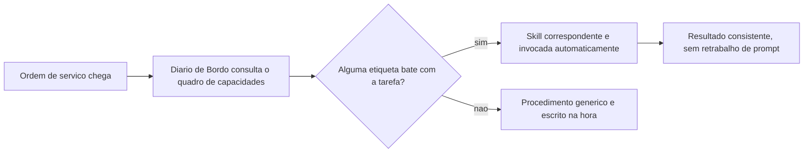
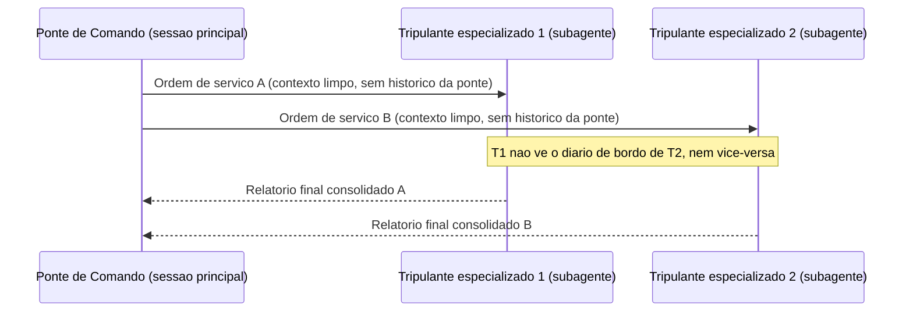
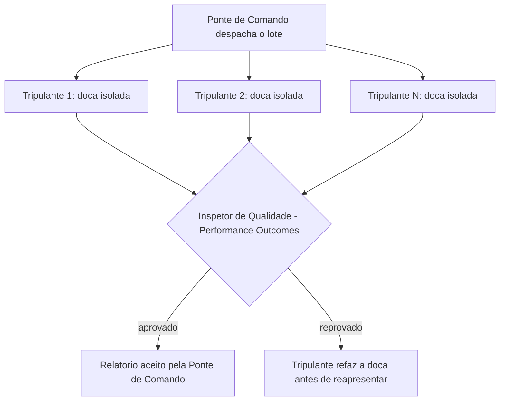
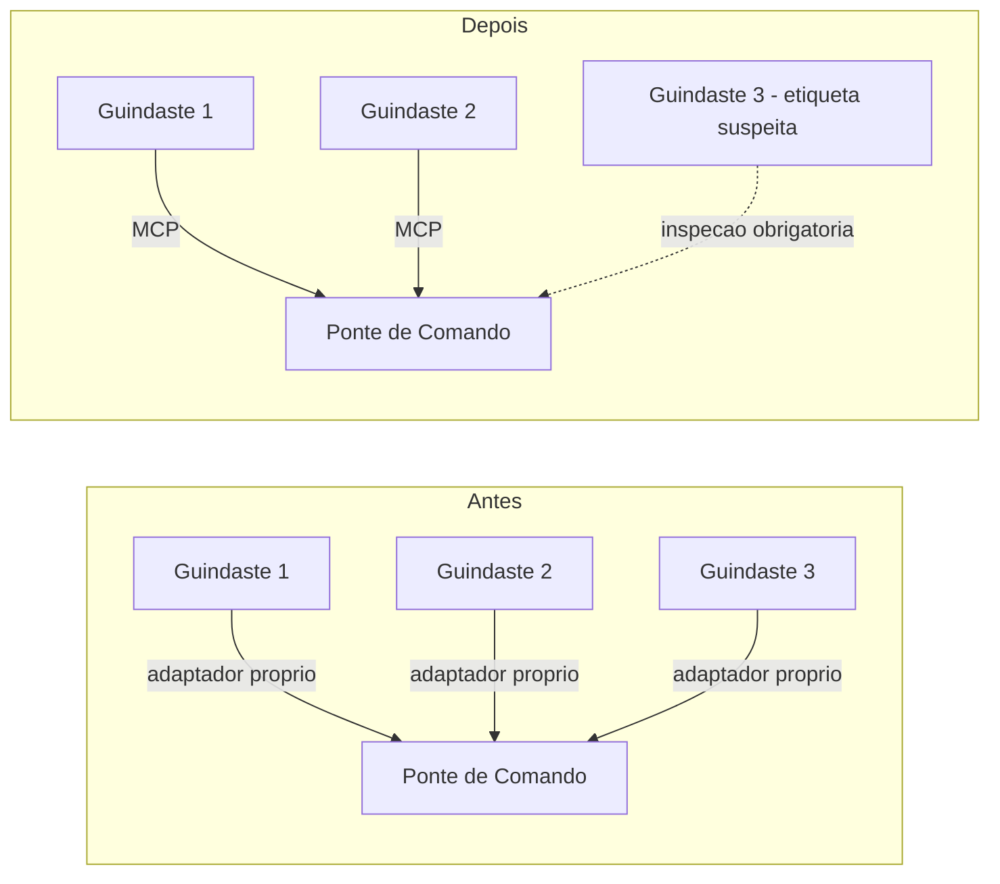

# Capítulo 5: Skills, Subagentes e MCP: Orquestrando a Tripulação Agêntica

## 1. Introdução

No Capítulo 4 você fechou o mapa das quatro camadas: o par LLM+Tools convertendo raciocínio em ação auditável, com o modelo decidindo o que tentar e a Tool sendo o único ponto onde essa tentativa vira efeito real. Esse par funciona muito bem para uma tarefa, um contexto, uma tripulação. Mas o que acontece quando o trabalho cresce — quando você precisa de dez tarefas rodando ao mesmo tempo, cada uma com seu próprio raciocínio e suas próprias ferramentas, sem que uma pise na memória da outra?

Este capítulo sobe da sala de máquinas até a ponte de comando e recruta o resto da tripulação do seu estaleiro: as Skills, que empacotam capacidade; os Subagentes, que despacham essa capacidade em paralelo com contexto isolado; e o MCP, o protocolo que conecta qualquer guindaste do cais sem exigir um adaptador proprietário para cada um. Ao final, você não vai mais pensar em "um agente fazendo tudo" — vai pensar em uma tripulação inteira, orquestrada, cada tripulante trabalhando isolado na própria doca e reportando de volta apenas o que importa.

Repare que os três tripulantes resolvem três problemas diferentes, e é fácil confundi-los se você não tiver clareza sobre qual pergunta cada um responde. Skills respondem "como faço a mesma coisa de novo sem reexplicar tudo?". Subagentes respondem "como faço várias coisas ao mesmo tempo sem que uma atrapalhe a outra?". MCP responde "como conecto uma ferramenta nova sem reconstruir a integração do zero a cada vez?". As três respostas se combinam — um subagente pode invocar uma skill, e uma skill pode chamar uma ferramenta MCP —, mas cada uma resolve uma dimensão distinta da escala, e tratar as três como sinônimos de "automação" é o primeiro passo para configurá-las errado.

## 2. Explica

Uma Agent Skill é uma capacidade modular empacotada: instruções, metadados e, opcionalmente, scripts e templates auxiliares, guardados em uma pasta com um frontmatter que descreve o nome da capacidade e quando ela deve ser usada [1]. A diferença estrutural em relação a um prompt avulso é sutil, mas decisiva — você não precisa reexplicar o procedimento a cada conversa. O harness lê a descrição de cada skill disponível e decide sozinho, a partir da tarefa em mãos, qual capacidade invocar automaticamente.

Isso resolve um problema real de escala: o mesmo procedimento (revisar código, redigir um capítulo, validar uma migração) deixa de viver espalhado em prompts copiados e recolados, e passa a viver em um único pacote versionado, reutilizável por qualquer sessão que o harness tenha acesso [1]. É a diferença entre treinar um tripulante do zero toda vez e ter um manual de procedimento já escrito, esperando na prateleira certa do estaleiro.

Essa economia, porém, não é gratuita — e vale marcar a nuance antes de seguir adiante. Cada skill disponível soma a própria descrição ao que o harness precisa varrer antes de decidir qual capacidade invocar; uma prateleira lotada de manuais mal escritos custa quase tanto quanto a ausência de manual nenhum, porque o Diário de Bordo ainda precisa ler etiqueta por etiqueta antes de descartar as que não servem. O framework acadêmico *SkillReducer* endereça exatamente esse ajuste fino: propõe otimizar a descrição de cada skill para o menor número de tokens que ainda preserva a precisão da decisão de invocação, tratando a prateleira do estaleiro como recurso finito, não infinito [24]. Na prática de quem escreve skills — e isso vale tanto para uma skill de revisão de migração SQL quanto para as skills que compõem esta própria fábrica editorial — redigir o campo `description` não é exercício de exaustividade, é exercício de precisão: dizer o suficiente para o harness reconhecer o gatilho certo, sem inflar cada consulta ao quadro de capacidades com parágrafos que ninguém vai ler antes de decidir.

Subagentes resolvem um segundo problema, mais estrutural: **isolamento**. A propriedade que define um subagente no Claude Code não é ele "fazer uma coisa específica" — é ele começar com contexto limpo. Um subagente não vê o histórico de conversa da sessão principal, nem os arquivos já lidos, nem as skills já invocadas na thread-mãe; ele recebe apenas o prompt de despacho e trabalha com sua própria janela de contexto, suas próprias permissões de ferramentas e, quando bem projetado, o mesmo modelo herdado da sessão que o despachou [2]. Guias de produção descrevem esse isolamento como o que viabiliza paralelismo real: dez subagentes rodando ao mesmo tempo não competem pela mesma janela de contexto, porque cada um tem a sua [3].

Em junho de 2026, esse mecanismo ganhou um nome e uma escala formal: *Dynamic Workflows*. Nele, o agente líder planeja e dispara dezenas a centenas de subagentes paralelos dentro de uma única sessão, com um avaliador separado — *Performance Outcomes* — decidindo quais resultados retornam aprovados e quais voltam para retrabalho antes de serem aceitos [4]. Documentação de mercado sobre orquestração de subagentes converge no mesmo ponto: a escala só é sustentável porque cada subagente carrega sua própria carga de contexto, e o custo de processar cem tarefas em paralelo não é cem vezes o custo de estourar uma única janela de contexto compartilhada [5].

Vale a pena enxergar esse despacho em lote como extensão de um padrão que você já conhece: é o *orchestrator-workers*, em que uma chamada central decompõe uma tarefa e delega partes independentes a chamadas especializadas [11], só que aplicado agora a subagentes inteiros em vez de chamadas isoladas de LLM. E análises de harnesses de longa duração já apontam esse isolamento de contexto como pré-requisito estrutural para sessões que precisam durar horas sem degradar de coerência [12].

Vale entender também o que sustenta esse isolamento por baixo do capô, porque não é mágica — é gerenciamento disciplinado de janela de contexto. Catálogos de técnicas de otimização de contexto em LLMs descrevem o mesmo repertório que um subagente aplica implicitamente a cada despacho: truncamento seletivo do que não é relevante para a tarefa corrente, sumarização progressiva de histórico longo, e o descarte deliberado de qualquer coisa que não sirva mais à ordem de serviço em mãos [25]. O ganho de isolar um subagente não vem de ele ter acesso a "mais contexto" do que a sessão principal; vem exatamente do oposto — de ele receber só o contexto mínimo necessário, como princípio de design deliberado, e não como limitação acidental de infraestrutura. É a mesma lógica de economia severa de tokens que rege as skills `lean-ctx` e `headroom` desta própria fábrica: contexto estranho à tarefa é custo, não benefício, mesmo quando está disponível de graça.

Nem todo harness resolve esse problema da mesma forma, e o contraponto merece registro. O *Agent Mode* do GitHub Copilot, por exemplo, opta por determinar o contexto relevante automaticamente a cada iteração — decidindo sozinho quais arquivos abrir e quanto histórico reter — em vez de expor ao operador o contrato explícito de isolamento que caracteriza um subagente do Claude Code [26]. Isso não é necessariamente pior: é uma escolha arquitetural diferente, que troca previsibilidade de isolamento por conveniência automática. Como Engenheiro Agêntico, a lição não é "isolamento explícito sempre vence" — é saber, para o harness específico que você tem em mãos, qual dessas duas garantias você está de fato recebendo antes de apostar a arquitetura da sua tripulação nela.

O terceiro tripulante do capítulo resolve um problema diferente: integração. Antes de novembro de 2024, cada ferramenta externa — um banco de dados, uma API de busca, um sistema de arquivos remoto — exigia uma implementação sob medida para cada combinação de modelo e aplicação. O Model Context Protocol (MCP) foi introduzido pela Anthropic exatamente para resolver essa fragmentação: um protocolo aberto, cliente-servidor, que padroniza como sistemas de IA integram e compartilham dados com ferramentas e fontes externas [6]. Em dezembro de 2025 a Anthropic doou o MCP para a Agentic AI Foundation, um fundo dirigido sob a Linux Foundation — um sinal explícito de que o protocolo deixou de ser propriedade de um único fornecedor e passou a ser infraestrutura de indústria [7].

Vale notar que o MCP não nasceu de um comitê abstrato: a especificação tem autoria identificável — David Soria Parra e Justin Spahr-Summers — e já conta com kits de construção maduros nos dois ecossistemas mais usados por quem precisa registrar um guindaste novo no cais: FastMCP, em Python, e o MCP SDK, em Node/TypeScript, ambos cobertos pela mesma documentação oficial que define a especificação [6]. Isso muda a decisão prática de "construir uma integração proprietária do zero" para "escolher um SDK MCP maduro e herdar de graça a conformidade com o protocolo" — o mesmo raciocínio de reaproveitamento que você já viu operar dentro do próprio estaleiro, com Skills empacotando procedimento e Subagentes empacotando isolamento.

Vale registrar, já aqui, o outro lado dessa integração universal: como qualquer canal que traz dado e código de fora para dentro do contexto do modelo, o MCP também é superfície de ataque. Descrições de ferramenta MCP comprometidas já foram catalogadas como vetor de *tool poisoning* — texto malicioso escondido na própria documentação da ferramenta, capaz de manipular o comportamento do modelo sem que o usuário perceba [13]. Análises de segurança específicas do protocolo descrevem ainda a injeção indireta como uma variante do mesmo problema, em que o conteúdo malicioso não vem da descrição da ferramenta, mas de um dado externo que ela retorna [16] — e um catálogo mais recente de práticas em produção trata o dimensionamento do *blast radius* de cada ferramenta conectada como parte inseparável do design de segurança, não como camada opcional [17]. Uma sistematização recente do tema chega à mesma conclusão de forma mais ampla: os riscos do ecossistema MCP crescem junto com sua própria adoção, e não existe versão do protocolo imune a isso por padrão [18]. Retomaremos essa blindagem em profundidade no Capítulo 8; por ora, o ponto é: conectar um guindaste novo ao cais não dispensa a inspeção do guindaste.

Vale a pena aproximar esse dimensionamento de *blast radius* do que você já viu no pilar dos Subagentes, porque é o mesmo raciocínio aplicado em duas camadas diferentes da tripulação. Um servidor MCP registrado com autonomia total — leitura, escrita e execução de comando, tudo liberado por padrão — tem um raio de impacto proporcional a essa liberdade: se a ferramenta for comprometida, o dano possível é do tamanho da permissão concedida a ela. Um servidor MCP registrado com escopo mínimo — só o que a tarefa exige, nada além — sofre o mesmo tipo de comprometimento, mas o dano possível é pequeno o suficiente para ser contido. É o mesmo princípio de "menor privilégio necessário" que rege o campo `tools` de um subagente, e que você verá formalizado de novo, com mais profundidade, quando o Capítulo 8 tratar de blindagem de ponta a ponta.

## 3. Ilustra

### O Quadro de Capacidades da Tripulação

Como Engenheiro Agêntico, pense na sua tripulação não como um grupo de generalistas que reaprende tudo a cada ordem de serviço, mas como um estaleiro com um quadro de capacidades afixado na Ponte de Comando: cada capacidade tem uma etiqueta clara de "quando usar", e o Diário de Bordo (o próprio harness) consulta esse quadro antes de reexplicar qualquer procedimento do zero. Uma Skill é exatamente essa etiqueta — nome, descrição do gatilho, e o procedimento empacotado atrás dela.



### Duas Docas Isoladas, Nenhuma Vendo o Diário da Outra

O segundo pilar é o núcleo técnico mais denso deste capítulo, e merece duas lentes complementares. A primeira lente explica o isolamento de contexto propriamente dito: imagine que, em vez de toda a tripulação trabalhar amontoada na mesma ponte de comando, você despacha dois tripulantes especializados para duas docas isoladas do estaleiro. Cada um recebe apenas a ordem de serviço específica da sua doca — não o diário de bordo completo da ponte, não o que o outro tripulante está fazendo na doca ao lado. Quando termina, cada um devolve só o relatório final. Ninguém na ponte de comando precisa adivinhar o que aconteceu dentro da doca; e nenhum tripulante isolado precisa (nem consegue) carregar o histórico inteiro da sessão principal.



A segunda lente explica por que isso importa em escala. Um estaleiro que só despacha dois tripulantes por vez ainda é artesanal. O que os Dynamic Workflows describem é um estaleiro despachando um lote inteiro de tripulantes especializados simultaneamente — dezenas, às vezes centenas — cada um em sua própria doca isolada, com um inspetor de qualidade dedicado (o *Performance Outcomes*) caminhando entre as docas, aprovando relatórios prontos e devolvendo para retrabalho os que não fecham o padrão antes de qualquer coisa subir para a ponte de comando [4].



Um detalhe separa um estaleiro amador de um estaleiro maduro: o que cada tripulante devolve à ponte de comando não é o diário de bordo inteiro da sua doca — é um relatório final, comprimido ao que realmente importa para quem vai decidir o próximo passo. Um tripulante que devolve cem páginas de anotação bruta não economizou trabalho nenhum para a ponte; só transferiu a bagunça de lugar, e agora é a ponte de comando quem paga o custo de garimpar o que interessa dentro do excesso. O contrato de despacho maduro já nasce sabendo qual formato de relatório a ponte espera receber de volta — telegráfico, com veredito objetivo e evidência mínima anexada — e é esse contrato, não o volume de trabalho feito na doca, que determina se o paralelismo de fato economiza tempo ou apenas desloca a sobrecarga de contexto para depois, quando ela já é mais cara de resolver.

E há uma segunda falha, menos óbvia, que só aparece quando o estaleiro escala de duas docas para um lote inteiro: se o inspetor de qualidade aprova qualquer relatório que chegue formatado corretamente, sem checar se o conteúdo do relatório de fato corresponde ao que foi entregue na doca, o *Performance Outcomes* vira teatro de aprovação — um carimbo que não filtra nada. A inspeção séria não lê só a forma do relatório; confere a evidência objetiva por trás dele, exatamente como este capítulo já defende para qualquer ferramenta MCP conectada ao cais: confiança não é o padrão, é o que se conquista depois da verificação.

### O Cais Antes e Depois do Protocolo Universal

O terceiro pilar fecha com uma imagem de antes e depois. Antes do MCP, cada guindaste do cais de lançamento — cada ferramenta ou fonte de dados externa — precisava do seu próprio conjunto de cabos e adaptadores proprietários até a ponte de comando. Trocar de fornecedor de guindaste significava reconstruir a fiação inteira. Depois do MCP, todos os guindastes falam o mesmo protocolo, e a ponte de comando conversa com qualquer um deles sem adaptador sob medida [8].

Pense no guindaste 3, marcado com etiqueta suspeita no diagrama abaixo, como o equivalente exato de um servidor MCP de terceiro cuja documentação você nunca leu com atenção. Ele fala o mesmo protocolo que os outros dois — nenhuma barreira técnica o impede de se conectar —, mas isso não significa que ele mereça o mesmo grau de confiança automática. A inspeção obrigatória, marcada como linha tracejada no diagrama, não é burocracia: é o mesmo raciocínio de "confiança não é o padrão" que a ponte de comando já aplica a qualquer relatório de subagente antes de aceitá-lo. Um cais que conecta guindastes novos sem esse portão de inspeção resolveu o problema da fragmentação de adaptadores só para reabrir, na mesma porta, o problema da confiança cega.



## 4. Técnica

Esta seção transforma cada pilar em um artefato que você pode adaptar diretamente no seu próprio estaleiro — seja ele Claude Code, Claude Agent SDK ou outro harness compatível com o mesmo padrão.

### Empacotando uma Capacidade como Skill

O primeiro artefato mostra a estrutura mínima de uma Agent Skill: um frontmatter com nome e descrição de gatilho, seguido do procedimento empacotado. A descrição é o que o harness lê para decidir a invocação automática — ela precisa dizer, sem ambiguidade, quando essa capacidade se aplica.

```markdown
---
name: revisor-de-migracao-sql
description: >
  Use esta skill sempre que o usuario pedir revisao de uma migracao de banco
  de dados (SQL) antes de aplicar em producao. Verifica reversibilidade,
  bloqueio de tabela e presenca de indice em colunas de filtro.
---

# Skill: Revisor de Migração SQL

## Procedimento
1. Leia o arquivo de migração indicado e identifique o tipo de operação
   (ALTER TABLE, CREATE INDEX, DROP COLUMN, etc.).
2. Verifique se a operação tem um caminho de rollback documentado.
3. Sinalize qualquer ALTER TABLE em tabela grande sem estratégia de lock
   incremental.
4. Devolva um relatório curto: aprovado, aprovado com ressalva, ou reprovado.
```

Note que o corpo da skill não é um prompt genérico — é um procedimento fechado, com passos numerados e critério de saída explícito. Isso é o que permite que a mesma capacidade produza resultado consistente independentemente de quem (ou qual sessão) a invoca [1].

Repare também no que o `description` acima não faz: não lista todas as variações possíveis de pedido, não tenta cobrir casos extremos improváveis, não se estende em advertências genéricas. Ele diz, em uma frase, quando usar a skill, e delega ao corpo do procedimento o detalhamento que só importa depois que a decisão de invocar já foi tomada. É esse mesmo princípio de economia que o SkillReducer formaliza: a descrição é o que compete por espaço no quadro de capacidades a cada nova consulta, então cada token gasto ali precisa justificar sua presença [24].

### Um Subagente que Nunca Assume o Contexto da Ponte

O segundo artefato é o frontmatter de um subagente Claude Code, com a propriedade que mais importa neste capítulo destacada em comentário: `model: inherit` evita fixar uma tripulação específica, e a ausência de qualquer referência ao histórico da sessão-mãe evidencia que o subagente só recebe o que está explicitamente escrito no prompt de despacho.

```yaml
name: subagente-redator-capitulo
description: >
  Manufatura autonoma de 1 capitulo em paralelo (estrategia + redacao EITA +
  diagrama Mermaid + CI de codigo + auto-validacao). Nao recebe o historico
  da sessao principal - apenas as coordenadas do capitulo e o indice RAG do
  dossie.
model: inherit
tools:
  - Read
  - Write
  - Edit
  - Bash
```

Repare no que falta de propósito: não há campo algum que injete "tudo o que a ponte de comando conversou até agora". O subagente é despachado com um pacote de instruções autocontido — coordenadas do capítulo, caminho do dossiê indexado — e é só isso que ele enxerga [2]. Guias de orquestração de subagentes chamam esse desenho de "prompt autocontido" como pré-requisito para qualquer despacho paralelo funcionar sem contaminação cruzada de contexto [5]. Note também que `model: inherit` não é um truque de configuração — o próprio SDK de agentes documenta oficialmente como estender o prompt de sistema padrão sem reescrever a lógica do harness a cada troca de modelo, o que é exatamente o que permite ao subagente herdar a tripulação da sessão-mãe sem gambiarra [20].

Note ainda o campo `tools`, listando explicitamente `Read`, `Write`, `Edit` e `Bash`: essa lista não é decorativa, é o portão de permissão do subagente. A mesma lógica de arrays `allow`/`deny`/`ask` que controla o que a sessão principal pode executar via `.claude/settings.json` se aplica, de forma independente, a cada subagente despachado — um tripulante de doca isolada não herda automaticamente as permissões da ponte de comando, ele recebe as suas próprias, tão restritas quanto a tarefa exigir. Isso fecha o círculo de isolamento: contexto isolado sem permissão isolada ainda seria um guindaste destravado demais para a doca em que está.

### Retentativa com Backoff: Quando uma Doca Falha

Isolamento e permissão bem projetados não eliminam a falha — apenas a contêm. Um subagente pode falhar por limite de taxa do provedor de modelo, timeout de rede ou saída malformada, e o quarto artefato mostra o padrão de produção para lidar com isso sem parar a esteira inteira por causa de uma única doca instável: tentativa limitada, com espera exponencialmente crescente entre cada nova tentativa.

```python
import time

MAX_TENTATIVAS = 3

def despachar_subagente_com_backoff(tarefa, executar_subagente):
    """Despacha um subagente e retenta com backoff exponencial em caso
    de falha, escalando para decisao humana apos MAX_TENTATIVAS."""
    for tentativa in range(1, MAX_TENTATIVAS + 1):
        try:
            resultado = executar_subagente(tarefa)
            if resultado.get("status") == "sucesso":
                return resultado
        except Exception as erro:
            if tentativa == MAX_TENTATIVAS:
                return {
                    "status": "falha",
                    "motivo": str(erro),
                    "tentativas": tentativa,
                }
            time.sleep(2 ** tentativa)  # 2s, 4s, 8s...
    return {"status": "falha", "motivo": "esgotou tentativas"}
```

O limite superior `MAX_TENTATIVAS` não é arbitrário: é o ponto exato em que o sistema para de tentar sozinho e escala a falha para decisão humana, em vez de insistir indefinidamente contra a mesma causa raiz. Guias de produção para subagentes de Claude Code descrevem esse mesmo padrão de tentativa-limitada-com-espera-crescente como pré-requisito para qualquer despacho em lote que não trave a fábrica inteira por causa de um único capítulo teimoso [3] — é literalmente o mecanismo que o script `pool-capitulos.py` desta fábrica implementa a cada lote de subagentes despachado.

### Registrando um Guindaste no Protocolo Universal

O terceiro artefato é a configuração de um servidor MCP em formato `mcpServers`, o mesmo padrão usado pelo `.mcp.json` deste próprio projeto. Registrar um servidor aqui é o que torna a ferramenta visível para qualquer harness compatível, sem escrever uma integração proprietária. A própria documentação de referência para construção de servidores MCP recomenda tratar a descrição de cada ferramenta exposta com o mesmo rigor editorial dedicado ao prompt do sistema — porque é esse texto, e não o código por trás dele, que o modelo lê para decidir se e como chamar a ferramenta [10].

```json
{
  "mcpServers": {
    "banco_de_dados_estaleiro": {
      "command": "npx",
      "args": ["-y", "mcp-server-sqlite-npx", "data/estado_fabrica.db"],
      "env": {
        "MCP_LOG_LEVEL": "info"
      }
    }
  }
}
```

Do ponto de vista do modelo, esse servidor aparece como um conjunto de ferramentas com `input_schema` — o mesmo contrato tipado que você já viu no Capítulo 4 protegendo contra argumentos alucinados [19]. A diferença é que, em vez de código escrito à mão para cada integração, o protocolo padroniza a descoberta e a chamada dessas ferramentas [9]. E, como qualquer entrada externa que chega ao contexto do modelo, o conteúdo devolvido por um servidor MCP precisa ser tratado com a mesma desconfiança estrutural que você aplicaria a um resultado de busca na web — validação de saída, não confiança automática, é o que separa uma integração madura de uma porta aberta [15].

Vale um último detalhe de projeto sobre quantas ferramentas registrar num servidor MCP como esse: a orientação oficial para construção de servidores recomenda equilibrar cobertura abrangente dos endpoints disponíveis com um conjunto menor de ferramentas de fluxo de trabalho especializadas, desenhadas para as tarefas que o agente realmente executa com frequência [10]. Um servidor MCP que expõe uma ferramenta para cada endpoint bruto da API subjacente empurra para o modelo o trabalho de compor múltiplas chamadas manualmente a cada tarefa; um servidor bem projetado já embute esse fluxo de trabalho na própria ferramenta exposta, do mesmo jeito que uma Skill embute um procedimento em vez de deixá-lo implícito no prompt.

## 5. Aplica

Você acabou de projetar seu primeiro lote de subagentes: um para pesquisar, um para redigir, um para validar código. Na pressa de colocar tudo para rodar em paralelo, você escreve o prompt de despacho do subagente redator assim: "continue de onde paramos e escreva o capítulo 6". Funciona na sua cabeça, porque você lembra perfeitamente do que "paramos" significa — você acabou de discutir isso na sessão principal.

O subagente recebe a ordem, mas não tem a menor ideia do que "onde paramos" quer dizer. Ele não viu a conversa anterior, não sabe qual sumário macro está em uso, não sabe se o capítulo 5 já foi validado. Ele faz o melhor raciocínio possível com o pouco que recebeu — e entrega um capítulo genérico, desconectado do fio narrativo real da obra, tecnicamente correto mas inútil para o seu livro.

O diagnóstico está exatamente na seção Explica: um subagente começa com contexto limpo por definição [2]. Não é um bug do despacho — é a propriedade que viabiliza o isolamento e o paralelismo em primeiro lugar. O erro não foi confiar no subagente; foi tratá-lo como se ele fosse uma continuação da mesma conversa. A correção é reescrever o prompt de despacho como um pacote autocontido: coordenadas explícitas (parte, capítulo, slug), caminho do arquivo de sumário, e o resultado esperado — sem depender de nenhuma memória implícita da sessão principal. Como Engenheiro Agêntico, o ponto de controle que você projeta nunca é "o subagente vai lembrar" — é "o subagente recebe tudo que precisa saber, escrito, na primeira mensagem".

Vale notar por que esse erro é tão fácil de cometer mesmo depois de entender a teoria: quando você mesmo despacha o subagente, na mesma sessão em que acabou de discutir o capítulo 6, a lembrança do que "paramos" significa está tão fresca na sua própria cabeça que fica difícil perceber o quanto ela é invisível para quem recebe só o texto do prompt. É um viés de proximidade — você confunde "eu me lembro" com "está escrito". A prática que evita essa armadilha de forma sistemática é reler o prompt de despacho fingindo ser um tripulante novo, contratado ontem, que nunca participou de nenhuma conversa anterior: se alguma coordenada ainda depende de "você já sabe do que estou falando", o prompt não está pronto para ser despachado.

Armadilhas recorrentes na orquestração de tripulação agêntica, na prática de mercado:

- Escrever prompts de despacho que pressupõem contexto implícito da sessão-mãe, ignorando que o isolamento é a propriedade central do subagente, não um detalhe de implementação [2].
- Fixar um modelo específico no frontmatter do subagente em vez de `model: inherit`, criando dívida de portabilidade sempre que a tripulação muda de versão [3].
- Disparar dezenas de subagentes em paralelo sem um avaliador de qualidade equivalente ao *Performance Outcomes*, aceitando qualquer relatório de volta sem checagem estrutural [4].
- Conectar um servidor MCP de terceiros e confiar cegamente na descrição das suas ferramentas, sem tratá-la como entrada potencialmente hostil — o mesmo raciocínio de *tool poisoning* que abre espaço para injeção indireta [14].
- Tratar o relatório final de um subagente como o lugar certo para despejar toda a saída bruta da doca, em vez de projetá-lo como contrato comprimido — o mesmo problema, em escala menor, que o SkillReducer documenta para descrições de skill infladas além do necessário [24]. Um subagente que devolve tudo o que fez, sem filtrar o que a ponte de comando precisa decidir, transfere para a sessão principal exatamente o custo de contexto que o isolamento deveria ter evitado.
- Registrar um avaliador de qualidade que só confere formato (o relatório chegou? está no schema certo?) e não o conteúdo por trás dele — um *Performance Outcomes* de fachada que aprova qualquer coisa bem-formatada é pior do que não ter avaliador nenhum, porque cria falsa sensação de que o lote foi checado [4].

## 6. Conclusão

Três pontos fecham a recomposição da tripulação neste capítulo. Primeiro: Agent Skills empacotam procedimento como capacidade reutilizável, eliminando o retrabalho de reexplicar o mesmo prompt a cada tarefa recorrente — mas a economia só se sustenta se a própria descrição da skill for escrita com a mesma disciplina de token que se espera do restante do sistema [24]. Segundo: um subagente só entrega paralelismo real porque começa com contexto limpo e isolado — tratá-lo como extensão da memória da sessão principal é o erro mais comum de quem começa a orquestrar em escala, e o isolamento de entrada precisa ser espelhado por um contrato de saída igualmente disciplinado, sob pena de apenas deslocar o custo de contexto para depois [25]. Terceiro: o MCP substitui integrações proprietárias fragmentadas por um protocolo único e neutro de fornecedor, mas herda também a responsabilidade de tratar qualquer ferramenta externa como entrada não confiável até prova em contrário, com o raio de impacto de cada conexão dimensionado ao mínimo necessário — o mesmo princípio de menor privilégio que rege as permissões de um subagente.

Levantamentos comparativos entre os principais harnesses do mercado — Claude Code, Codex, Cursor — convergem na mesma separação de papéis entre runtime e modelo que sustenta tudo o que você viu neste capítulo [21]. Isolar contexto, delegar com permissão própria e tratar ferramenta externa como superfície de risco não são peculiaridades de um único produto: são o padrão que se repete quando você compara lado a lado os principais agentes de codificação do mercado [22]. Não é coincidência que princípios consolidados de engenharia de agentes confiáveis tratem "possuir o próprio controle de fluxo" — em vez de depender de peculiaridades de um único fornecedor — como regra estrutural também para como você orquestra a tripulação inteira, não apenas uma chamada isolada de ferramenta [23].

Com a Ponte de Comando agora tripulada — Skills, Subagentes e MCP trabalhando juntos —, falta fechar o contrato que rege como você, humano, fala com essa tripulação inteira. O desafio que fica: revise o último subagente que você despachou e pergunte se o prompt de despacho realmente seria compreensível para alguém que nunca participou da conversa anterior. No Capítulo 6, você escreve o próprio diário de bordo do estaleiro — CLAUDE.md, AGENTS.md e as técnicas de engenharia de prompt que tornam esse contrato confiável.

## 7. Referências Bibliográficas

[1] ANTHROPIC. *Agent Skills — Claude Platform Docs*. Disponível em: https://platform.claude.com/docs/en/agents-and-tools/agent-skills/overview. Acesso em: 02 ago. 2026.

[2] KONISHI, Hidekazu. *Claude Code Subagents and Multi-Agent Orchestration Guide*. Disponível em: https://hidekazu-konishi.com/entry/claude_code_subagents_and_orchestration_guide.html. Acesso em: 02 ago. 2026.

[3] TOTALUM. *Claude Code subagents: the 2026 production playbook*. Disponível em: https://www.totalum.app/blog/claude-code-subagents-totalum. Acesso em: 02 ago. 2026.

[4] ANTHROPIC. *Orchestrate subagents at scale with dynamic workflows — Claude Code Docs*. Disponível em: https://code.claude.com/docs/en/workflows. Acesso em: 02 ago. 2026.

[5] MCP MARKET. *Subagent Orchestration Guide — Claude Code Skill*. Disponível em: https://mcpmarket.com/tools/skills/subagent-orchestration-guide-1. Acesso em: 02 ago. 2026.

[6] MODEL CONTEXT PROTOCOL. *Specification and documentation for the Model Context Protocol*. Disponível em: https://github.com/modelcontextprotocol/modelcontextprotocol. Acesso em: 02 ago. 2026.

[7] WIKIPEDIA. *Model Context Protocol*. Disponível em: https://en.wikipedia.org/wiki/Model_Context_Protocol. Acesso em: 02 ago. 2026.

[8] ANTHROPIC. *Introducing the Model Context Protocol*. Disponível em: https://www.anthropic.com/news/model-context-protocol. Acesso em: 02 ago. 2026.

[9] WEBFUSE. *MCP Cheat Sheet (2026) — Model Context Protocol Quick Reference*. Disponível em: https://www.webfuse.com/mcp-cheat-sheet. Acesso em: 02 ago. 2026.

[10] ANTHROPIC. *MCP Builder — Skill Documentation*. Disponível em: https://github.com/anthropics/skills/blob/main/skills/mcp-builder/SKILL.md. Acesso em: 02 ago. 2026.

[11] ANTHROPIC. *Building Effective AI Agents*. Disponível em: https://www.anthropic.com/research/building-effective-agents. Acesso em: 02 ago. 2026.

[12] ANTHROPIC. *Effective harnesses for long-running agents*. Disponível em: https://www.anthropic.com/engineering/effective-harnesses-for-long-running-agents. Acesso em: 02 ago. 2026.

[13] OWASP FOUNDATION. *MCP Tool Poisoning*. Disponível em: https://owasp.org/www-community/attacks/MCP_Tool_Poisoning. Acesso em: 02 ago. 2026.

[14] WILLISON, Simon. *Model Context Protocol has prompt injection security problems*. Disponível em: https://simonwillison.net/2025/Apr/9/mcp-prompt-injection/. Acesso em: 02 ago. 2026.

[15] CLOUD SECURITY ALLIANCE. *Agentic MCP Security Best Practices Guide*. Disponível em: https://labs.cloudsecurityalliance.org/agentic/agentic-mcp-security-best-practices-v1/. Acesso em: 02 ago. 2026.

[16] MICROSOFT. *Protecting against indirect prompt injection attacks in MCP*. Disponível em: https://developer.microsoft.com/blog/protecting-against-indirect-injection-attacks-mcp/. Acesso em: 02 ago. 2026.

[17] APTIBLE. *Prompt Injection in MCP: Tool Poisoning and Blast Radius*. Disponível em: https://www.aptible.com/mcp-security/mcp-prompt-injection. Acesso em: 02 ago. 2026.

[18] ARXIV.ORG. *Systematization of Knowledge: Security and Safety in the Model Context Protocol Ecosystem*. Disponível em: https://arxiv.org/pdf/2512.08290. Acesso em: 02 ago. 2026.

[19] ANTHROPIC. *Tool use with Claude — Claude Platform Docs*. Disponível em: https://platform.claude.com/docs/en/agents-and-tools/tool-use/overview. Acesso em: 02 ago. 2026.

[20] ANTHROPIC. *Modifying system prompts — Claude API Docs*. Disponível em: https://platform.claude.com/docs/en/agent-sdk/modifying-system-prompts. Acesso em: 02 ago. 2026.

[21] MINDSTUDIO. *What Is an Agent Harness? The Architecture Behind Claude Code, Codex, and Cursor*. Disponível em: https://www.mindstudio.ai/blog/what-is-agent-harness-architecture-explained. Acesso em: 02 ago. 2026.

[22] AIMULTIPLE. *Top Agent Harnesses: Claude Code vs Codex*. Disponível em: https://aimultiple.com/agent-harness. Acesso em: 02 ago. 2026.

[23] HUMANLAYER. *12-Factor Agents — Principles for Building Reliable LLM Applications*. Disponível em: https://www.humanlayer.dev/12-factor-agents. Acesso em: 02 ago. 2026.

[24] ARXIV.ORG. *SkillReducer: Optimizing LLM Agent Skills for Token Efficiency*. Disponível em: https://arxiv.org/pdf/2603.29919. Acesso em: 02 ago. 2026.

[25] AGENTA. *Top techniques to Manage Context Lengths in LLMs*. Disponível em: https://agenta.ai/blog/top-6-techniques-to-manage-context-length-in-llms. Acesso em: 02 ago. 2026.

[26] GITHUB. *Agent mode 101: All about GitHub Copilot's powerful mode*. Disponível em: https://github.blog/ai-and-ml/github-copilot/agent-mode-101-all-about-github-copilots-powerful-mode/. Acesso em: 02 ago. 2026.
