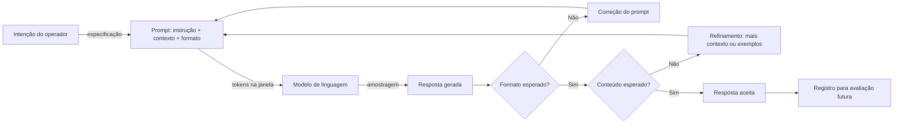

# Capítulo 1: O Que É um Prompt, Afinal?

## 1. Introdução

Você chegou ao Livro 2 da série "A Pilha Agêntica". No Livro 1, construímos o chão da pilha: lógica de programação, Git, testes, arquitetura de software, tokens, janela de contexto, atenção, alucinação e o vocabulário do campo — modelo, tool, tool calling e agente [1]. Agora subimos um degrau e enfrentamos a camada mais antiga da pilha — e, surpreendentemente, a mais mal compreendida: a comunicação direta com o modelo, que chamamos de prompt [2].

Este capítulo tem três objetivos. Primeiro, definir com precisão o que é um prompt — e o que ele não é [1]. Segundo, entender por que a redação do prompt importa tanto na era dos agentes autônomos, quando o prompt vira código de um programa de outra espécie [5]. Terceiro, estabelecer o modelo mental do prompt como instrumento deliberado — o mesmo instrumento que você vai dominar nos nove capítulos seguintes [2]. Ao final, você saberá distinguir um prompt de um pedido casual, e entenderá por que a engenharia de prompt é a porta de entrada de toda a pilha [3].

## 2. Explica

### 2.1 A Definição Técnica de Prompt

Um prompt é a sequência de tokens — o texto — que um modelo de linguagem recebe como entrada em uma inferência [1]. Tecnicamente, é isso: o que entra na janela de contexto que você estudou no Capítulo 7 do Livro 1 [8]. Mas reduzir o prompt a "o que entra" seria como reduzir um programa a "o que digita": tecnicamente verdadeiro, praticamente inútil [1].

A definição operacional é mais rica: o prompt é a especificação da tarefa que você quer que o modelo execute, expressa na linguagem que o modelo foi treinado a interpretar [1]. Ele contém três tipos de informação: o que o modelo deve fazer (a instrução), o que o modelo deve considerar (o contexto) e como o modelo deve responder (o formato de saída) [2]. Essa tríade — instrução, contexto, formato — é a anatomia que o Capítulo 2 detalha [3].

### 2.2 O Prompt como Programa: a Visão do Software 3.0

O conceito de Software 3.0, popularizado por Andrej Karpathy, muda a forma de pensar sobre prompts [5]. No Software 1.0, o programador escreve as regras em código. No Software 2.0, as regras são aprendidas por redes neurais a partir de dados. No Software 3.0, o "programa" é uma especificação em linguagem natural — e o modelo é o interpretador que a executa [5]. Nessa visão, o prompt não é uma mensagem: é um programa que você escreve para uma máquina que interpreta linguagem [5].

A consequência é profunda: se o prompt é um programa, então escrever prompts é programar — e programar exige especificação, teste e versionamento [5]. É exatamente essa a tese do Livro 2: o prompt é um instrumento deliberado, não uma mensagem casual [2]. O profissional de AIDD trata prompts como trata código: com método, com testes e com controle de versão [13].

### 2.3 O Que o Prompt Não É

Para definir o que é um prompt, é igualmente útil definir o que ele não é [1]. Primeiro, o prompt não é uma ordem mágica: não existe uma fórmula secreta que faça qualquer modelo obedecer [1]. Segundo, o prompt não é conversa casual: escrever "me ajuda aí" não é engenharia de prompt [2]. Terceiro, o prompt não é garantia de resultado: modelos são probabilísticos, e o mesmo prompt pode produzir respostas diferentes — o fenômeno da amostragem que você estudou no Capítulo 8 do Livro 1 [7].

A distinção mais importante: o prompt não é a instrução que você quer dar — é a instrução que o modelo efetivamente recebe e interpreta [1]. A diferença entre intenção e recepção é onde moram a maioria dos erros de prompting [1]. O profissional não pergunta "o que eu quero dizer?" — pergunta "como o modelo vai entender o que eu escrevi?" [3]. Essa inversão de perspectiva é o primeiro passo da engenharia de prompt [2].

### 2.4 O Prompt na Era dos Agentes

Na era dos agentes autônomos, o prompt ganhou uma importância renovada [4]. No autocomplete de 2021, o prompt era o arquivo aberto e o cursor. No chat de 2023, o prompt era a mensagem. Nos agentes de 2025-2026, o prompt é o sistema inteiro: o papel do agente, as regras do projeto, o contexto da tarefa e as ferramentas disponíveis [4]. O framework de Lilian Weng descreve o agente como LLM, memória, planejamento e ferramentas — e o prompt é a interface entre todos [6].

Mais do que isso: nos harnesses modernos, o prompt é parcialmente gerado por outros componentes [4]. Arquivos de instrução como AGENTS.md e CLAUDE.md tornam-se parte do prompt de sistema a cada execução [11]. Isso significa que a engenharia de prompt não morreu — ela se fundiu com a engenharia de contexto e a engenharia de regras [3]. Quem domina o prompt domina a base de todas as outras camadas [2].

### 2.5 Por Que Isso Define a Disciplina

Se o prompt é um programa, uma especificação e uma interface, então a disciplina de escrevê-lo bem é uma disciplina de engenharia — com princípios, técnicas e testes [2]. Os princípios vêm dos guias oficiais: ser específico, fornecer contexto, usar exemplos, definir formato [1][2]. As técnicas vêm da pesquisa: few-shot, chain-of-thought, decomposição [18][19]. E os testes vêm da engenharia de software: avaliação, versionamento, CI para LLMs [12][14].

A disciplina de prompt é o ponto de partida da pilha porque toda camada superior depende dela [3]. A engenharia de contexto decide o que entra no prompt; a engenharia de regras organiza o prompt de sistema; a engenharia de harness automatiza a construção do prompt [3]. Sem dominar a camada base — o prompt em si — as camadas superiores constroem sobre areia [2]. É exatamente o que este livro corrige [1].

### 2.6 A História Curta: do Comando ao Programa

A evolução do prompt em cinco anos explica o estado da arte [2]. Em 2021, o prompt era o comando de autocomplete — três palavras e uma previsão [2]. Em 2022, o prompt era a pergunta ao chat — uma frase e uma resposta [2]. Em 2023, o prompt era o contexto — o repositório inteiro e uma pergunta [2]. Em 2024, o prompt era o protocolo — a especificação de ferramentas e o contrato [4]. Em 2025-2026, o prompt é o programa — o sistema completo de instruções que governa um agente [4]. Em cada estágio, o prompt cresceu em estrutura e em importância [2].

Essa história tem uma lição central: o que era simples virou complexo porque o escopo cresceu [2]. E o que era complexo virou disciplina porque a escala exigiu [12]. O autocomplete de 2021 não precisava de engenharia de prompt; o agente de 2026 não sobrevive sem ela [4]. Você está aprendendo a disciplina na época em que ela se tornou indispensável [2].

### 2.7 A Estocasticidade como Ponto de Partida

Um conceito do Livro 1 precisa ser retomado como pano de fundo de todo o Livro 2: a estocasticidade [7]. Modelos de linguagem não são determinísticos — a amostragem introduz variação [7]. O mesmo prompt, com temperatura diferente, produz respostas diferentes [7]. A consequência para a engenharia de prompt é dupla [7].

Primeiro, a reprodutibilidade exige controle: quando a saída precisa ser estável, a temperatura baixa e a avaliação automatizada são obrigatórias [7]. Segundo, a variação é um sinal a ser gerenciado: respostas diferentes para o mesmo prompt podem indicar ambiguidade na instrução — e a engenharia de prompt é, em grande parte, a arte de reduzir essa ambiguidade [1]. Um prompt bem projetado produz variação pequena em conteúdo e variação nula em estrutura [2]. A estocasticidade não é inimiga da engenharia — é o motivo pelo qual ela existe [7].

### 2.9 O Prompt e a Linguagem: Por Que as Palavras Importam

A escolha de palavras no prompt não é cosmética — é engenharia [1]. O modelo interpreta literalmente: cada palavra é um sinal com peso [1]. Palavras vagas — "bom", "rápido", "adequado" — abrem espaço para a interpretação do modelo, que pode não ser a sua [2]. Palavras precisas — "em até 5 frases", "com fonte", "sem opinião" — fecham o espaço [2]. A precisão lexical é a vacina contra a ambiguidade [2].

A precisão tem um limite: o exagero [3]. Um prompt que especifica cada palavra vira um contrato rígido — e o modelo perde a flexibilidade para casos que você não previu [3]. O equilíbrio é a curadoria: especificar o que importa, deixar flexível o que não importa [3]. O profissional conhece a diferença entre o critério essencial e o detalhe decorativo — e especifica só o essencial [2]. A linguagem do prompt é um instrumento de precisão — e a precisão se calibra por tarefa [1].

### 2.10 O Prompt no Fluxo do Agente

O prompt não existe isolado — vive no fluxo do agente [4]. O agente observa, decide, age e valida — e em cada passo, um prompt é montado [4]. O prompt de observação: "analise o resultado e extraia os fatos" [4]. O prompt de decisão: "com base nos fatos, escolha a próxima ação" [4]. O prompt de ação: "execute a ferramenta com estes argumentos" [4]. E o prompt de validação: "a resposta atingiu o objetivo?" [4]

Essa visão conecta o capítulo à série [4]. O prompt não é uma mensagem isolada — é uma família de prompts que o harness orquestra [4]. E a habilidade de escrever cada membro da família — com o propósito certo, no momento certo — é a base da engenharia de agentes [4]. O que o Livro 2 ensina sobre o prompt individual é o que a Parte III aplica ao fluxo inteiro [4].

### 2.11 O Custo de Cada Prompt

O prompt tem um custo que o profissional calcula — o orçamento de tokens [8]. Cada palavra do prompt é um token de entrada — e cada token custa dinheiro e atenção [8]. O prompt inchado — contexto desnecessário, instruções redundantes, exemplos demais — custa caro em escala [8]. O prompt enxuto — o essencial, bem organizado — custa pouco [8]. E o custo não é só monetário: cada token irrelevante distrai a atenção do modelo [8].

O cálculo do custo é o hábito que o Livro 3 formaliza como orçamento de contexto [3]. Aqui fica o princípio: antes de enviar um prompt, meça — quantos tokens, quanto custa, quanto distrai [8]. E a medição orienta a curadoria: o que pode ser cortado sem perder qualidade [3]. O prompt enxuto não é preguiça — é engenharia [8].

### 2.8 A Avaliação como Metade da Disciplina

Escrever prompts é metade da disciplina; avaliar as respostas é a outra metade [9]. A avaliação manual — que o Capítulo 8 detalha — é o primeiro instrumento: você lê a resposta, compara com a esperada e decide [9]. A avaliação automatizada — golden datasets e LLM-as-a-judge — é o instrumento de escala [14][15]. E a avaliação contínua — em produção — é o instrumento de manutenção [17].

A tese central: o prompt não é avaliado por como soa, mas por como se comporta [9]. Um prompt bonito que produz respostas erradas é um prompt ruim; um prompt feio que produz respostas corretas é um bom prompt [9]. Essa inversão — da estética para o comportamento — é o que separa o amador do profissional [2]. A partir do Capítulo 2, todos os capítulos do livro aplicam essa lente [1].

## 3. Ilustra

### 3.1 A Analogia do Cardápio

A melhor analogia para o prompt é o cardápio de um restaurante [1]. O cliente (você) quer um prato específico; o cozinheiro (o modelo) sabe cozinhar, mas não lê mentes [1]. O cardápio (o prompt) é o meio pelo qual o pedido vira resultado: quanto mais específico o pedido, mais próximo do desejado o prato [1].

Um pedido vago — "faça uma comida boa" — produz resultados imprevisíveis, porque cada cozinheiro interpreta "boa" do seu jeito [1]. Um pedido específico — "um prato vegetariano, sem glúten, com berinjela e molho de tomate, servido em temperatura ambiente" — produz um resultado próximo do esperado [1]. O cardápio ideal não é o mais bonito: é o que transmite a intenção com o mínimo de ambiguidade [2].

A analogia se estende à avaliação: o cliente não avalia o cardápio — avalia o prato [9]. Do mesmo modo, o engenheiro não avalia o prompt pela leitura — avalia pela resposta [9]. E a analogia revela o limite da disciplina: nenhum cardápio resolve o problema de um cozinheiro que só sabe fazer arroz [4]. Quando o modelo não tem capacidade para a tarefa, nenhum prompt resolve — o fenômeno das habilidades emergentes, que aparecem em escala e não sob demanda [10], é o limite que o Capítulo 9 explora.

### 3.2 O Diagrama do Fluxo do Prompt



O diagrama condensa o ciclo do prompt: a intenção vira especificação, a especificação vira entrada, a entrada vira resposta, e a resposta é avaliada contra o esperado [1]. O ciclo de correção — voltar ao prompt com mais contexto ou exemplos — é o trabalho diário do engenheiro de prompt [2]. E o registro final — guardar o par prompt-resposta — é a matéria-prima da avaliação e do versionamento [12].

### 3.3 O Instrumento e o Músico

Uma segunda analogia ilumina a relação entre técnica e criatividade [1]. O prompt é um instrumento musical; o engenheiro é o músico [1]. Um violino nas mãos de um iniciante produz ruído; nas mãos de um virtuoso, música [1]. O instrumento não mudou — mudou o músico [1]. Do mesmo modo, o modelo não muda entre um amador e um profissional — muda o uso que cada um faz do prompt [2].

A analogia tem um corolário importante: o virtuoso não culpa o violino [1]. O engenheiro experiente não culpa o modelo quando a resposta erra — examina o prompt [1]. A maioria dos erros de prompting está no instrumento em uso, não na máquina [2]. Essa postura — assumir o prompt como variável de ajuste — é o que transforma a engenharia de prompt em prática deliberada [2].

## 4. Técnica

### 4.1 O Prompt como Contrato: Escrevendo uma Especificação

A aplicação mais imediata da teoria é escrever um prompt como quem escreve uma especificação [1]. O script abaixo estrutura um prompt em três blocos — instrução, contexto e formato — e mostra como a separação melhora a clareza [2]:

```python
def montar_prompt(instrucao, contexto, formato, exemplos=None):
    """Monta um prompt estruturado a partir de seus componentes."""
    blocos = []
    blocos.append("## INSTRUÇÃO")
    blocos.append(instrucao)
    blocos.append("")
    blocos.append("## CONTEXTO")
    blocos.append(contexto)
    if exemplos:
        blocos.append("")
        blocos.append("## EXEMPLOS")
        for i, (entrada, saida) in enumerate(exemplos, 1):
            blocos.append(f"Exemplo {i}:")
            blocos.append(f"  Entrada: {entrada}")
            blocos.append(f"  Saída esperada: {saida}")
    blocos.append("")
    blocos.append("## FORMATO DE SAÍDA")
    blocos.append(formato)
    return "\n".join(blocos)


if __name__ == "__main__":
    prompt = montar_prompt(
        instrucao="Classifique o sentimento da avaliação como positivo, neutro ou negativo.",
        contexto="Avaliação recebida: 'O produto chegou antes do prazo, mas a embalagem veio amassada.'",
        formato="Responda com uma única palavra: POSITIVO, NEUTRO ou NEGATIVO.",
        exemplos=[("Entrega rápida, tudo perfeito", "POSITIVO"),
                  ("Demorou 10 dias para chegar", "NEGATIVO")],
    )
    print(prompt)
```

O script ilustra o princípio central do capítulo: separar instrução, contexto e formato reduz a ambiguidade [2]. O modelo recebe a tarefa isolada, o dado isolado e o formato isolado — em vez de um bloco de texto misturado [1]. Essa estrutura é a base de todas as técnicas dos próximos capítulos [3].

### 4.2 O Analisador de Ambiguidade

A segunda ferramenta técnica do capítulo é o analisador de ambiguidade — um script que detecta palavras vagas em um prompt [1]. O objetivo é tornar o conceito "ambiguidade" mensurável [2]:

```python
PALAVRAS_AMBIGUAS = [
    "bom", "ruim", "melhor", "pior", "rápido", "lento", "grande", "pequeno",
    "bonito", "feio", "fácil", "difícil", "legal", "interessante", "mais ou menos",
    "um pouco", "bastante", "muito", "pouco", "adequado", "correto", "ajuda",
]


def analisar_ambiguidade(prompt):
    """Conta palavras vagas em um prompt e sugere especificação."""
    palavras = prompt.lower().replace(",", " ").replace(".", " ").split()
    encontradas = [p for p in palavras if p in PALAVRAS_AMBIGUAS]
    print(f"Palavras analisadas: {len(palavras)}")
    print(f"Palavras potencialmente ambíguas: {len(encontradas)}")
    if encontradas:
        print("Encontradas: " + ", ".join(sorted(set(encontradas))))
        print("Sugestão: substitua termos vagos por critérios mensuráveis.")
    else:
        print("Nenhum termo vago detectado. Bom trabalho.")
    return len(encontradas)


if __name__ == "__main__":
    prompt_vago = "Faça um bom resumo do texto, destaque o que é mais importante."
    analisar_ambiguidade(prompt_vago)
    print()
    prompt_especifico = (
        "Resuma o texto em exatamente 5 frases. Destaque os 3 fatos "
        "com suporte numérico e cite o número de cada um."
    )
    analisar_ambiguidade(prompt_especifico)
```

O analisador transforma a intuição em métrica: "este prompt tem 4 termos vagos" é mais acionável que "este prompt parece confuso" [1]. E a métrica orienta a correção: trocar "bom" por critérios mensuráveis, "importante" por "com suporte numérico" [2]. A especificidade é a vacina contra a ambiguidade — e a ambiguidade é a fonte da maioria das respostas erradas [1].

### 4.3 O Registro de Prompts como Contratos

A terceira técnica fecha o capítulo: registrar prompts como contratos — com versão, data e caso de teste [12]. O script abaixo modela o registro que os times de produção usam [13]:

```python
import json
from datetime import date


class RegistroDePrompts:
    def __init__(self):
        self.prompts = []

    def adicionar(self, nome, prompt, caso_teste, versao="1.0"):
        registro = {
            "nome": nome,
            "versao": versao,
            "data": date.today().isoformat(),
            "prompt": prompt,
            "caso_teste": caso_teste,
        }
        self.prompts.append(registro)
        print(f"[OK] Prompt '{nome}' registrado (v{versao})")

    def exportar(self, caminho):
        with open(caminho, "w", encoding="utf-8") as f:
            json.dump(self.prompts, f, ensure_ascii=False, indent=2)
        print(f"Registro exportado: {caminho} ({len(self.prompts)} prompts)")


if __name__ == "__main__":
    registro = RegistroDePrompts()
    registro.adicionar(
        "classificar-sentimento",
        montar_prompt(
            instrucao="Classifique o sentimento da avaliação.",
            contexto="Avaliação: {texto}",
            formato="Uma palavra: POSITIVO, NEUTRO ou NEGATIVO.",
        ),
        caso_teste={"texto": "Produto excelente!", "esperado": "POSITIVO"},
    )
    registro.exportar("registro_prompts.json")
```

O registro transforma o prompt de texto solto em ativo de engenharia [12]. Cada prompt tem um caso de teste — a resposta esperada para uma entrada conhecida — que é a base da avaliação do Capítulo 8 e do versionamento do Capítulo 7 [14]. O profissional não escreve prompts e esquece: registra, testa e evolui [13].

## 5. Aplica

### 5.1 Onde Isso Vive no Mundo Real

Todo sistema de IA em produção é, no fundo, uma fábrica de prompts [2]. O chatbot de suporte monta um prompt com o histórico e a política; o assistente de código monta um prompt com o arquivo aberto; o agente autônomo monta um prompt com o objetivo, as regras e as ferramentas [4]. Em cada caso, a qualidade do resultado depende da qualidade do prompt [2]. As empresas que tratam prompts como ativos — registrados, testados e versionados — superam as que os tratam como textos descartáveis [12].

Os dados de 2026 reforçam a tese: com a adoção de IA chegando a 92% dos desenvolvedores e a confiança na exatidão caindo para 29%, a diferenciação está exatamente onde este livro aponta — na especificação deliberada, não no uso casual [11]. O profissional que escreve prompts com método produz resultados mais confiáveis — e é essa confiabilidade que o mercado busca [2].

### 5.2 O Erro Comum do Iniciante

O erro clássico de quem começa é tratar o prompt como uma conversa com um ser humano [1]. "Escreva um texto bom sobre IA" funciona com um estagiário, que inferirá contexto e padrão — e falha com um modelo, que interpreta literalmente [1]. O segundo erro é culpar o modelo: "a IA errou" — quando o prompt não especificou o que significava "certo" [1].

A correção — e aqui está o diferencial que separa o profissional — é a inversão de perspectiva da seção 2.3: em vez de "o que eu quero dizer?", perguntar "como o modelo vai entender?" [2]. E a segunda correção é a especificação: transformar cada termo vago em critério mensurável, cada intenção implícita em instrução explícita [2]. O analisador de ambiguidade da seção 4.2 é a ferramenta desse hábito [2].

### 5.3 O Padrão Profissional em 2026

O padrão profissional combina tudo o que o capítulo apresentou [2]. Primeiro, a estrutura: instrução, contexto, formato — sempre separados [1]. Segundo, a especificidade: critérios mensuráveis em vez de adjetivos [2]. Terceiro, os exemplos: casos concretos quando o padrão importa [18]. Quarto, o registro: cada prompt com versão e caso de teste [12]. E quinto, a avaliação: a resposta é medida contra o esperado, não admirada [9].

Esse padrão é o vocabulário comum que os próximos capítulos vão refinar [2]. O Capítulo 2 detalha a anatomia; os Capítulos 3-5, as técnicas; os Capítulos 6-7, a produção; os Capítulos 8-9, a avaliação e os limites; o Capítulo 10, a transição para o contexto [3]. O fundamento — o prompt como instrumento deliberado — está lançado neste capítulo [1].

### 5.4 O Inventário do Capítulo

Vale consolidar o que este capítulo entrega em um inventário verificável [1]. Primeiro, a definição: o prompt é a especificação da tarefa que o modelo recebe — instrução, contexto e formato [1]. Segundo, a distinção: o prompt não é ordem mágica, não é conversa casual e não é garantia [1]. Terceiro, o enquadramento: na visão do Software 3.0, o prompt é um programa [5]. Quarto, a estocasticidade: o mesmo prompt varia — e a engenharia administra a variação [7].

Cada item do inventário tem um teste de verificação [9]. Para a definição: você consegue decompor um prompt em instrução, contexto e formato? [1] Para o enquadramento: você explica por que o prompt é um programa na visão do Software 3.0? [5] Para a estocasticidade: você explica por que uma execução não julga um prompt? [9] O inventário honesto — com testes — é a base para os próximos capítulos [2].

### 5.5 O Prompt como Ativo de Engenharia

O fechamento aplicado do capítulo é a mudança de postura: o prompt é um ativo de engenharia — não uma preferência [12]. O ativo é registrado, testado e versionado [12]. O ativo tem dono, caso de teste e histórico [13]. E o ativo é avaliado pelo comportamento — não pela estética [9]. Essa postura é o que separa o redator do engenheiro [2].

A postura tem consequências práticas imediatas [12]. O prompt vira um arquivo — não uma conversa no chat [12]. O prompt ganha um caso de teste — a entrada e a resposta esperada [12]. O prompt entra no versionamento — com data, autor e diff [13]. E cada um desses hábitos — registro, teste e versão — é um dos temas dos próximos capítulos [12]. Este capítulo plantou a postura; os próximos constroem o método [1].

### 5.6 O Mapa do Livro

O último exercício do capítulo é situar-se no mapa do livro [3]. O Capítulo 2 abre a anatomia — os blocos do prompt [1]. Os Capítulos 3 a 5 dominam as técnicas — few-shot, CoT e arquitetura [18][19]. Os Capítulos 6 e 7 constroem a produção — a esteira [12]. O Capítulo 8 afia a avaliação [14]. O Capítulo 9 mapeia os limites [10]. E o Capítulo 10 abre a transição para o contexto [3].

O mapa revela a progressão [1]. Primeiro, você aprende o instrumento [1]. Depois, as técnicas [18]. Depois, a produção [12]. Depois, a avaliação [14]. Depois, os limites [10]. E, por fim, a próxima camada [3]. Cada capítulo constrói sobre o anterior — a mesma lógica de pilha da série [2]. Você está no primeiro degrau — e o mapa mostra a escada inteira [3].

### 5.7 O Prompt como Contrato: Expectativas Explícitas e Implícitas

Existe uma distinção sutil, mas decisiva, entre o que o prompt *diz* e o que ele *promete*. Todo prompt carrega expectativas explícitas — aquilo que está escrito — e expectativas implícitas — aquilo que o leitor humano inferiria do contexto, mas que nunca foi formalizado [1][2]. Quando um gerente escreve um e-mail pedindo um relatório, ele não precisa dizer "não invente os números": o contexto social de um e-mail profissional carrega essa expectativa implicitamente [16]. Com um modelo de linguagem, porém, o contrato é literal: se a expectativa não estiver codificada no prompt, ela não existe para o modelo [3]. Essa é a origem de uma família inteira de falhas que o mercado chama de "prompt correto, resultado errado": o texto estava gramaticalmente impecável, mas a expectativa implícita — formato, tom, público, nível de detalhe, o que fazer com informação faltante — simplesmente não estava lá [2][9].

A metáfora do contrato ajuda a diagnosticar erros. Um contrato bem redigido especifica partes, escopo, entregáveis, prazos e o que acontece em caso de descumprimento; um prompt bem redigido faz o análogo: define o papel do modelo, a tarefa, o formato de saída, as restrições e o comportamento diante de ambiguidade [1][2]. Quando um contrato é vago, advogados litigam; quando um prompt é vago, o modelo preenche os buracos com a sua distribuição de probabilidades — o que, estatisticamente, é a resposta *mais comum*, não a *mais correta* [7][20]. O estudo de Kojima demonstra que modelos sem instrução adicional tendem a responder de forma direta e superficial, seguindo o caminho de menor resistência estatística [20]; é exatamente isso que a explicitação do contrato desloca.

Há três cláusulas contratuais que aparecem em praticamente todo prompt profissional bem-sucedido [1][2]. A primeira é a **cláusula de papel**: quem o modelo deve ser ("você é um revisor técnico"), que ancora o estilo e o critério de julgamento [3]. A segunda é a **cláusula de formato**: como a saída deve ser estruturada (lista, tabela, JSON, parágrafos), que converte ambiguidade em especificação [2][16]. A terceira é a **cláusula de restrição**: o que o modelo não deve fazer (não inventar, não resumir, não opinar), que delimita o espaço de resposta [9]. Quando as três estão presentes, o contrato está minimamente completo; quando falta qualquer uma delas, o resultado fica ao sabor da probabilidade [2][7].

Vale notar que o contrato não é unilateral. O engenheiro também assume obrigações: fornecer o contexto necessário, não esconder informação relevante e especificar o que fazer com dados ausentes [3][8]. Um contrato que pede ao modelo "responda se souber, diga que não sabe caso contrário" é diferente de um que exige resposta para tudo [1]. A pesquisa sobre alucinações extrínsecas mostra que modelos tendem a preencher lacunas de informação com conteúdo plausível quando pressionados a responder [7]; a cláusula de restrição que autoriza o "não sei" é a contrapartida contratual dessa descoberta [7]. Em produção, essa cláusula é muitas vezes a diferença entre um assistente confiável e um gerador de desinformação elegante [3][4].

Por fim, o contrato evolui. O mesmo prompt que funciona para uma versão do modelo pode degradar em outra — os próprios provedores documentam mudanças de comportamento entre versões [1][2]. Isso significa que a especificação do contrato não é um artefato estático: ela deve ser versionada, testada e revisada como qualquer outro contrato de software [12][13]. O profissional que trata prompt como conversa casual está escrevendo contratos verbais; o profissional que trata prompt como especificação está escrevendo contratos auditáveis [3][13]. Este capítulo estabeleceu a diferença entre um e outro — e os capítulos seguintes mostram como redigir cada cláusula com precisão.

### 5.8 Como Estudar o Tema na Prática: Um Protocolo de Experimentação

A leitura deste capítulo entrega vocabulário, mas o domínio da disciplina exige prática deliberada [1][2]. A boa notícia é que prompt engineering é uma das poucas disciplinas de engenharia em que o laboratório custa centavos: cada experimento consome alguns tokens, e a iteração pode ser medida em minutos [2][16]. O que separa um praticante casual de um engenheiro de prompts é exatamente o método — a existência de um protocolo de experimentação que transforma intuição em dado [13][15].

Um protocolo mínimo de experimentação tem cinco passos [13][15]. Primeiro, **escreva a hipótese**: o que você espera que mude no comportamento do modelo quando você alterar uma variável específica do prompt? Segundo, **isole a variável**: altere apenas um elemento por vez — nunca o tom, o formato e os exemplos simultaneamente, porque aí você não sabe o que causou o efeito [2][16]. Terceiro, **fixe a semente e a configuração**: temperatura, modelo e versão devem ser constantes para que a comparação seja válida [1]. Quarto, **registre os resultados**: a saída completa, com data, modelo e variável alterada — um caderno de laboratório em formato de tabela ou repositório [13]. Quinto, **decida com dados**: se a alteração não produziu diferença mensurável em uma amostra razoável, ela não é uma melhoria — é ruído [14][15].

A amostra importa tanto quanto a hipótese. Avaliar um prompt com uma única resposta é estatisticamente cego: modelos são estocásticos, e a mesma entrada pode produzir respostas diferentes em execuções diferentes [1][7]. A literatura de avaliação de LLMs recomenda amostras de pelo menos dez a vinte execuções para detectar diferenças de comportamento entre duas versões de prompt [14][15]. Isso vale duplamente para alterações sutis de redação, cujo efeito médio pode ser pequeno mesmo quando real [15]. O GrowthBook documenta exatamente essa armadilha em testes de produção: sem amostra suficiente, equipes aprovam mudanças que são ruído e descartam mudanças que são sinal [17].

O protocolo também define o que registrar. Um registro de experimento profissional contém: o prompt completo (não um resumo), a configuração exata do modelo, a data, a tarefa avaliada, as respostas e o critério de julgamento [12][13]. O BrainTrust recomenda tratar esse registro como parte do repositório de código, com histórico versionado — é o que permite responder, meses depois, à pergunta "por que essa mudança foi feita?" [12]. A prática de versionamento de prompts nasce exatamente dessa necessidade de rastreabilidade [12][13].

Há ainda uma habilidade de estudo que o capítulo não pode entregar por você: a **leitura crítica de documentação**. Os guias oficiais de OpenAI e Google mudam com frequência, incorporando novas descobertas e novas capacidades dos modelos [1][2][16]. O profissional atualizado não memoriza o guia; ele o relê periodicamente e compara com seus próprios experimentos [1]. A documentação é a teoria consolidada; os seus experimentos são a teoria testada no seu domínio [13]. Quando as duas divergem, o experimento vence — desde que o protocolo tenha sido seguido [15].

Para o leitor que quer começar hoje, o caminho prático é curto: escolha uma tarefa real do seu trabalho, escreva o pior prompt possível que ainda resolva a tarefa, e aplique o protocolo para melhorá-lo iterativamente [2][16]. Registre cada versão no controle de versão [13]. Em poucas sessões, o vocabulário deste capítulo — tokens, contexto, contrato, cláusulas, amostragem — deixa de ser abstração e vira ferramenta de diagnóstico [1][3]. É essa transição, de vocabulário para método, que o restante do livro constrói: a Parte II transforma o contrato em técnica (few-shot, chain-of-thought), e a Parte III transforma a técnica em processo de engenharia [3][4].

## 6. Conclusão

Neste capítulo, você definiu o prompt com precisão: a especificação da tarefa que o modelo recebe, expressa em linguagem interpretável [1]. Você entendeu que o prompt é um programa na visão do Software 3.0 [5], que ele não é uma ordem mágica nem uma conversa casual [1], e que a era dos agentes o transformou em interface de sistema [4]. Você aprendeu que a disciplina tem duas metades — escrever e avaliar — e que a estocasticidade é o motivo pelo qual a engenharia existe [7][9].

Resumindo em três pontos: primeiro, o prompt é uma especificação — instrução, contexto e formato [1]; segundo, o prompt é avaliado pelo comportamento, não pela estética [9]; terceiro, o prompt é um ativo — registrado, testado e versionado [12]. Com esses três pontos, você tem o modelo mental do instrumento [2].

### O Desafio Deste Capítulo

O desafio em três níveis. Nível um: escreva um prompt vago — e use o analisador de ambiguidade para encontrar os termos problemáticos [2]. Nível dois: reescreva o prompt com instrução, contexto e formato separados, e compare as respostas dos dois [1]. Nível três: registre três prompts seus no modelo de registro da seção 4.3, cada um com um caso de teste — e avalie se as respostas passam no teste [12]. Os três níveis exercitam especificação, estrutura e registro [2].

No próximo capítulo, vamos abrir a caixa da anatomia: instrução, contexto, exemplos e formato de saída — os quatro blocos de um bom prompt, e como cada um reduz um tipo de ambiguidade [3]. O instrumento está definido; agora vamos aprender a afiá-lo [1].

## 7. Referências Bibliográficas

[1] OPENAI. Prompt engineering. Disponível em: https://developers.openai.com/api/docs/guides/prompt-engineering. Acesso em: 5 ago. 2026.

[2] OPENAI. Best practices for prompt engineering with the OpenAI API. Disponível em: https://help.openai.com/en/articles/6654000-best-practices-for-prompt-engineering-with-openai-api. Acesso em: 5 ago. 2026.

[3] ANTHROPIC. Effective context engineering for AI agents. Disponível em: https://www.anthropic.com/engineering/effective-context-engineering-for-ai-agents. Acesso em: 5 ago. 2026.

[4] ANTHROPIC. Building Effective AI Agents. Disponível em: https://www.anthropic.com/engineering/building-effective-agents. Acesso em: 5 ago. 2026.

[5] KARPATHY, Andrej. Software 3.0: Software in the Age of AI. Disponível em: https://www.latent.space/p/s3. Acesso em: 5 ago. 2026.

[6] WENG, Lilian. LLM-Powered Autonomous Agents. Disponível em: https://lilianweng.github.io/posts/2023-06-23-agent/. Acesso em: 5 ago. 2026.

[7] WENG, Lilian. Extrinsic Hallucinations in LLMs. Disponível em: https://lilianweng.github.io/posts/2024-07-07-hallucination/. Acesso em: 5 ago. 2026.

[8] CHROMA. Context Rot: How Increasing Input Tokens Impacts LLM Performance. Disponível em: https://www.trychroma.com/research/context-rot. Acesso em: 5 ago. 2026.

[9] TESTING LIBRARY. Guiding Principles. Disponível em: https://testing-library.com/docs/guiding-principles/. Acesso em: 5 ago. 2026.

[10] WEI, Jason; et al. Emergent Abilities of Large Language Models. 2022. Disponível em: https://arxiv.org/abs/2206.07682. Acesso em: 5 ago. 2026.

[11] SITEPOINT. Vibe Coding 2026: The Complete Guide to AI-First Development. Disponível em: https://www.sitepoint.com/vibe-coding-2026-complete-guide/. Acesso em: 5 ago. 2026.

[12] BRAINTRUST. What is prompt versioning? Best practices for iteration without breaking production. Disponível em: https://www.braintrust.dev/articles/what-is-prompt-versioning. Acesso em: 5 ago. 2026.

[13] PAN, Tian. Prompt Versioning in Production: The Engineering Discipline Teams Learn the Hard Way. Disponível em: https://tianpan.co/blog/2026-04-09-prompt-versioning-production-llm. Acesso em: 5 ago. 2026.

[14] LANGCHAIN. Evaluating LLM Systems: Metrics and Best Practices. Disponível em: https://blog.langchain.dev/evaluating-llm-platforms/. Acesso em: 5 ago. 2026.

[15] CHANG, Yupeng; et al. A Survey on Evaluation of Large Language Models. 2023. Disponível em: https://arxiv.org/abs/2307.03109. Acesso em: 5 ago. 2026.

[16] GOOGLE CLOUD. Generative AI Prompt Design Guide. Disponível em: https://cloud.google.com/vertex-ai/generative-ai/docs/learn/prompts/prompt-design. Acesso em: 5 ago. 2026.

[17] GROWTHBOOK. How to test multiple prompts in production (without chaos). Disponível em: https://www.growthbook.io/insights/how-test-multiple-prompts-production-without-chaos. Acesso em: 5 ago. 2026.

[18] BROWN, Tom B.; et al. Language Models are Few-Shot Learners. 2020. Disponível em: https://arxiv.org/abs/2005.14165. Acesso em: 5 ago. 2026.

[19] WEI, Jason; et al. Chain-of-Thought Prompting Elicits Reasoning in Large Language Models. 2022. Disponível em: https://arxiv.org/abs/2201.11903. Acesso em: 5 ago. 2026.

[20] KOJIMA, Takeshi; et al. Large Language Models are Zero-Shot Reasoners. 2022. Disponível em: https://arxiv.org/abs/2205.11916. Acesso em: 5 ago. 2026.
