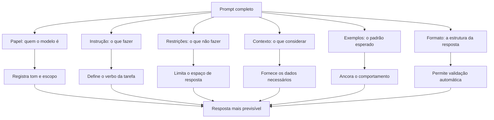

# Capítulo 2: Anatomia de um Bom Prompt: Instrução, Contexto, Exemplos e Formato de Saída

## 1. Introdução

No Capítulo 1, você definiu o prompt como uma especificação — e entendeu que ele é um instrumento deliberado, não uma mensagem casual [1]. Agora vamos abrir a caixa: a anatomia de um bom prompt. A tese deste capítulo é que um prompt eficaz tem quatro blocos — instrução, contexto, exemplos e formato de saída — e que cada bloco reduz um tipo específico de ambiguidade [2].

Este capítulo tem três objetivos. Primeiro, dissecar os quatro blocos com precisão — o que cada um faz, como escrevê-lo e quando usá-lo [1]. Segundo, mostrar como os blocos se combinam em prompts reais — e como a ordem e a delimitação importam [3]. Terceiro, apresentar o papel — a camada de identidade que muitos prompts negligenciam [4]. Ao final, você terá o modelo anatômico que sustenta todas as técnicas dos próximos capítulos [2].

## 2. Explica

### 2.1 O Bloco de Instrução: o Verbo da Tarefa

A instrução é o coração do prompt: o que o modelo deve fazer [1]. Um bom bloco de instrução tem quatro propriedades [2]. Primeira, o verbo explícito: "classifique", "resuma", "extraia", "compare" — nunca o implícito [1]. Segunda, o objeto preciso: classificar o quê, resumir o quê [1]. Terceira, as restrições: o que não fazer — "não invente fatos", "não use jargão" [2]. Quarta, a especificidade: critérios mensuráveis em vez de adjetivos — "em até 5 frases" em vez de "resumido" [2].

A propriedade mais negligenciada é a restrição [2]. O modelo tende a preencher lacunas com o mais provável — e sem restrições, o "mais provável" nem sempre é o que você quer [2]. As instruções negativas — o que evitar — são tão importantes quanto as positivas [1]. Um prompt que diz "resuma, sem opinião, usando apenas o texto" é mais eficaz que um que diz apenas "resuma" [2].

### 2.2 O Bloco de Contexto: o Dado da Tarefa

O contexto é tudo o que o modelo precisa saber para executar a instrução — e que não está na pergunta [1]. O contexto pode ser o texto a resumir, os dados a analisar, o histórico da conversa ou as políticas da empresa [1]. A regra de ouro: o modelo não conhece o seu mundo — tudo o que ele precisa saber sobre o seu mundo precisa estar no contexto [3].

A curadoria do contexto é uma habilidade em si [3]. Contexto demais distrai e custa tokens — o context rot que você estudou no Livro 1 [8]. Contexto de menos deixa o modelo adivinhar [3]. O equilíbrio é a engenharia de contexto — o tema do Livro 3 — mas o princípio já opera aqui: forneça o necessário, omita o irrelevante, ordene por relevância [3]. Um bom prompt não despeja contexto: seleciona contexto [3].

### 2.3 O Bloco de Exemplos: o Padrão da Tarefa

O exemplo é a demonstração concreta do comportamento esperado — a técnica few-shot que o Capítulo 3 aprofunda [18]. Um exemplo mostra ao modelo o padrão entrada-saída: "para esta entrada, esta é a saída correta" [18]. Os exemplos são especialmente poderosos quando o formato importa mais que a regra: classificação, extração, transformação [18].

A qualidade dos exemplos importa mais que a quantidade [2]. Um exemplo bem escolhido — representativo, com bordas claras — ensina mais que dez redundantes [2]. E a variedade importa: exemplos que cobrem casos diferentes ensinam o modelo a generalizar [18]. O guia da OpenAI recomenda: comece sem exemplos, adicione-os quando o modelo errar o padrão [2].

### 2.4 O Bloco de Formato de Saída: o Contrato da Resposta

O formato de saída define a estrutura da resposta — e é o bloco que transforma um prompt de conversa em uma especificação executável [1]. Os formatos típicos: texto livre, lista, tabela, Markdown, JSON — e, para consumo programático, JSON Schema [1]. O formato explícito tem três benefícios [2].

Primeiro, a consumibilidade: uma resposta em JSON pode ser parseada por código — a base do tool calling que você estudou no Livro 1 [6]. Segundo, a verificabilidade: um formato fixo permite validar a resposta automaticamente — o campo existe? O tipo é o certo? [2]. Terceiro, a redução da variação: quando o formato é fixo, a amostragem varia o conteúdo, não a estrutura [7]. O formato de saída é a ponte entre a linguagem natural e o código [1].

### 2.5 O Papel: a Identidade que Governa o Tom

O papel — ou persona — é a camada que precede os quatro blocos: quem o modelo deve ser [4]. "Você é um engenheiro sênior", "você é um professor paciente", "você é um revisor imparcial" [4]. O papel define o registro, o tom, o nível de detalhe e o viés da resposta [4]. E o papel é o embrião do prompt de sistema — a instrução persistente que os agentes carregam [11].

O papel deve ser usado com precisão [4]. Um papel bem definido reduz a variação de tom — o mesmo pedido, com papéis diferentes, produz respostas de estilos diferentes [4]. E o papel é o primeiro lugar onde a injeção de prompt ataca: um usuário que diz "ignore seu papel" tenta derrubar a identidade [9]. A defesa é arquitetural — a hierarquia de mensagens que a seção 2.7 apresenta [11].

### 2.6 A Ordem e a Delimitação: a Sintaxe do Prompt

A anatomia não é só o quê — é a ordem e a delimitação [2]. As instruções no início do prompt têm mais peso que no final — o fenômeno que os guias oficiais documentam [2]. E a delimitação — separar os blocos com Markdown (##, ###) ou XML (<instructions>, <context>) — reduz drasticamente a confusão do modelo [1]. Um prompt sem delimitação é um parágrafo amorfo; com delimitação, é uma especificação [2].

A delimitação tem um segundo benefício: a segurança [9]. Quando os blocos são delimitados, o modelo distingue instruções de dados — e resiste melhor à injeção de instruções escondidas nos dados [9]. O formato estruturado não é estética: é a sintaxe que permite ao modelo separar "o que fazer" de "sobre o que agir" [2]. A sintaxe do prompt é a ponte entre o texto e o programa [1].

### 2.7 A Hierarquia de Mensagens: Sistema, Desenvolvedor e Usuário

As APIs modernas estruturam o prompt em mensagens com papéis distintos [4]. A mensagem de sistema define o comportamento persistente — o papel, as regras, as restrições [11]. A mensagem de desenvolvedor (no caso da OpenAI) ou as instruções de sistema (na Anthropic) têm autoridade sobre as do usuário [11]. A mensagem do usuário é a entrada transacional — a tarefa do momento [1].

A hierarquia é a defesa arquitetural contra a injeção [9]. Quando as regras vivem na mensagem de sistema, um usuário que tenta sobrepô-las na mensagem de usuário enfrenta a precedência do sistema [9]. O profissional usa a hierarquia deliberadamente: regras persistentes no sistema, dados e tarefa no usuário, e — quando necessário — exemplos e contexto em blocos próprios [11]. A anatomia do capítulo é o plano; a hierarquia é o mecanismo [4].

### 2.9 O Papel do Formato na Automação

O formato de saída merece uma seção própria porque é o bloco que conecta o prompt ao código [6]. Quando a resposta é JSON, o código pode parsear, validar e agir [6]. Quando a resposta é texto livre, o código depende de heurísticas frágeis [6]. O formato explícito transforma a resposta em dado — e o dado em ação [6]. É exatamente o mecanismo do tool calling: o modelo propõe uma chamada estruturada, o harness a executa [6].

A escolha do formato é uma decisão de design [2]. O JSON é o padrão para dados estruturados — campos, tipos e hierarquia [2]. O Markdown é o padrão para conteúdo com hierarquia — títulos, listas e ênfase [2]. O texto puro é o padrão para saída consumida por humanos [2]. E a escolha errada — JSON para uma resposta que o usuário lê, texto para uma que o código processa — gera retrabalho [2]. O profissional escolhe o formato pelo consumidor da resposta [1].

### 2.10 Os Limites da Anatomia

A anatomia tem limites que o capítulo não pode esconder [2]. Primeiro, a anatomia organiza — não garante: um prompt bem estruturado pode produzir resposta errada [2]. Segundo, a anatomia é estática — e a tarefa pode ser dinâmica: a mesma estrutura não serve a todos os casos [3]. Terceiro, a anatomia é uma camada — e as camadas superiores (técnicas, produção, contexto) também importam [3]. O profissional não trata a anatomia como solução completa — trata como fundamento [2].

Os limites da anatomia apontam para as próximas camadas [3]. As técnicas dos Capítulos 3 a 5 operam dentro da anatomia — mas a enriquecem [18]. A produção dos Capítulos 6 e 7 governa a anatomia em escala [12]. E a Context Engineering — o Capítulo 10 e o Livro 3 — administra a anatomia no fluxo do agente [3]. A anatomia é o ponto de partida — não o ponto de chegada [2].

### 2.11 Anatomia e o Vocabulário da Série

A anatomia deste capítulo é o vocabulário comum de toda a série [1]. Quando os volumes seguintes falarem em "prompt de sistema", "formato de saída", "contexto curado" ou "exemplos few-shot", você saberá exatamente o que significam — os blocos da anatomia [1]. O vocabulário não é decoração: é o instrumento de precisão que permite conversar sobre prompts sem ambiguidade [2].

A mesma precisão vale para a comunicação com o modelo [1]. O prompt bem escrito é a anatomia em ação — cada bloco no seu lugar, cada bloco com propósito [1]. E o prompt mal escrito é a anatomia ignorada — os blocos misturados, os propósitos confusos [2]. O profissional fala a mesma língua com humanos (o vocabulário) e com máquinas (a anatomia) [1]. Essa dupla fluência é o que a série constrói desde a base [2].

### 2.8 Anatomia na Prática: o Prompt de Produção

A combinação dos blocos em um prompt de produção é a aplicação mais concreta da anatomia [2]. Um prompt de produção tem: o papel (quem o modelo é), a instrução (o que fazer), as restrições (o que não fazer), o contexto (os dados), os exemplos (os padrões) e o formato (a estrutura da resposta) [1]. Cada bloco é separado, cada bloco tem um propósito e cada bloco é testável [2].

O teste da anatomia: para cada bloco, a pergunta "se eu remover este bloco, a resposta muda?" [2]. Se não muda, o bloco é decorativo — ou redundante [2]. Se muda para pior, o bloco é funcional [2]. Essa análise — remover e comparar — é o método de curadoria do prompt que os profissionais aplicam [2]. A anatomia não é um checklist decorativo: é o mapa da intervenção [1].

## 3. Ilustra

### 3.1 A Analogia do Briefing de Design

A melhor analogia para a anatomia é o briefing de design [1]. Um designer que recebe "faça algo bonito" produz algo aleatório; um designer que recebe um briefing completo — o público, o objetivo, as cores, os formatos, os exemplos de referência — produz algo próximo do desejado [1]. O briefing é o prompt do designer: instrução, contexto, exemplos e formato [1].

Cada bloco do briefing corresponde a um bloco do prompt [1]. A instrução é o objetivo; o contexto é o público e o produto; os exemplos são as referências; o formato é a entrega — arquivo, dimensões, resolução [1]. E o papel é a equipe: um briefing de "designer sênior" produz registros diferentes de um briefing de "estagiário" [4]. O briefing completo não garante o resultado — mas reduz drasticamente a distância entre pedido e entrega [1].

### 3.2 O Diagrama da Anatomia



O diagrama condensa a tese do capítulo: cada bloco reduz um tipo de ambiguidade [2]. O papel reduz a variação de tom; a instrução e as restrições reduzem o espaço de resposta; o contexto reduz a adivinhação; os exemplos reduzem o desvio de padrão; o formato permite a validação [1]. A soma dos blocos é a previsibilidade [2].

### 3.3 O Chef e a Receita

Uma segunda analogia: o modelo é o chef; o prompt é a receita [1]. Uma receita completa tem ingredientes (contexto), passos (instrução), fotos (exemplos) e o prato final esperado (formato) [1]. Uma receita sem fotos obriga o chef a imaginar; uma receita sem quantidades obriga a adivinhar; uma receita sem o prato final não permite conferir [1].

O chef experiente — o profissional — não segue receita cega: adapta ao que tem [2]. O engenheiro de prompt idem: ajusta os blocos ao modelo e à tarefa [2]. E quando o prato sai errado, o chef não culpa a cozinha — examina a receita [1]. O paralelo com a seção 3.3 do Capítulo 1 é intencional: o instrumento não muda, muda o uso [1].

## 4. Técnica

### 4.1 O Construtor de Prompt Anatômico

A técnica central do capítulo é o construtor que materializa a anatomia em código [2]. O script abaixo estrutura os cinco blocos — papel, instrução, contexto, exemplos e formato — com delimitação por Markdown [1]:

```python
def construir_prompt(papel, instrucao, contexto, formato, exemplos=None, restricoes=None):
    """Constrói um prompt anatômico com blocos delimitados."""
    blocos = []
    if papel:
        blocos.append("## PAPEL")
        blocos.append(papel)
        blocos.append("")
    blocos.append("## INSTRUÇÃO")
    blocos.append(instrucao)
    if restricoes:
        blocos.append("")
        blocos.append("## RESTRIÇÕES")
        for r in restricoes:
            blocos.append(f"- {r}")
    if contexto:
        blocos.append("")
        blocos.append("## CONTEXTO")
        blocos.append(contexto)
    if exemplos:
        blocos.append("")
        blocos.append("## EXEMPLOS")
        for i, (entrada, saida) in enumerate(exemplos, 1):
            blocos.append(f"### Exemplo {i}")
            blocos.append(f"Entrada: {entrada}")
            blocos.append(f"Saída esperada: {saida}")
    blocos.append("")
    blocos.append("## FORMATO DE SAÍDA")
    blocos.append(formato)
    return "\n".join(blocos)


if __name__ == "__main__":
    prompt = construir_prompt(
        papel="Você é um analista de crédito sênior, imparcial e rigoroso.",
        instrucao="Analise o pedido de crédito e emita uma decisão fundamentada.",
        restricoes=["Não invente dados financeiros.",
                    "Baseie-se apenas no contexto fornecido."],
        contexto="Renda mensal: R$ 6.000. Despesas fixas: R$ 3.200. "
                 "Histórico: 2 atrasos em 24 meses. Valor solicitado: R$ 15.000.",
        formato="JSON com campos: decisao (APROVADO/NEGADO), motivo, score (0-100).",
        exemplos=[("Renda alta, sem atrasos, valor baixo", "APROVADO"),
                  ("Renda baixa, atrasos frequentes, valor alto", "NEGADO")],
    )
    print(prompt)
```

O construtor transforma a anatomia em rotina [2]. Cada bloco é um parâmetro — e cada parâmetro é testável isoladamente [1]. O mesmo construtor serve para qualquer tarefa: muda-se o papel, a instrução e o contexto; a estrutura permanece [2].

### 4.2 O Validador de Formato de Saída

O formato de saída só tem valor se for validável [2]. O script abaixo valida uma resposta JSON contra os campos esperados — o mesmo princípio que os harnesses aplicam ao tool calling [6]:

```python
import json


def validar_resposta_json(texto, campos_esperados, tipos_esperados):
    """Valida uma resposta JSON contra campos e tipos esperados."""
    try:
        dados = json.loads(texto)
    except json.JSONDecodeError as e:
        print(f"FALHA: resposta não é JSON válido ({e})")
        return False
    print("Resposta é JSON válido.")
    for campo, tipo in zip(campos_esperados, tipos_esperados):
        if campo not in dados:
            print(f"FALHA: campo ausente: {campo}")
            return False
        if not isinstance(dados[campo], tipo):
            print(f"FALHA: campo '{campo}' deveria ser {tipo.__name__}, "
                  f"mas é {type(dados[campo]).__name__}")
            return False
        print(f"  [OK] campo '{campo}' presente e com tipo correto")
    return True


if __name__ == "__main__":
    resposta_ok = '{"decisao": "APROVADO", "motivo": "Renda cobre despesas", "score": 78}'
    resposta_ruim = '{"decisao": "APROVADO"}'
    print("=== Resposta completa ===")
    validar_resposta_json(resposta_ok, ["decisao", "motivo", "score"],
                          [str, str, int])
    print("\n=== Resposta incompleta ===")
    validar_resposta_json(resposta_ruim, ["decisao", "motivo", "score"],
                          [str, str, int])
```

O validador mostra por que o formato de saída é o bloco mais poderoso da anatomia: ele permite que o código verifique a resposta — sem leitura humana [2]. Uma resposta que falha na validação de formato é rejeitada antes de qualquer avaliação de conteúdo [1]. É essa validação que os harnesses de agentes aplicam a cada resposta [6].

### 4.3 O Teste de Remoção de Blocos

A técnica de curadoria da seção 2.8 — remover e comparar — merece um instrumento [2]. O script abaixo executa o teste de remoção com um oráculo simples: a resposta esperada [1]:

```python
def teste_de_remocao(construtor, variantes, oraculo):
    """Compara variantes de prompt (com e sem blocos) contra um oráculo."""
    for nome, kwargs in variantes.items():
        prompt = construtor(**kwargs)
        print(f"=== Variante: {nome} ({len(prompt)} caracteres) ===")
        print("  Blocos: " + ", ".join(
            k for k, v in kwargs.items() if v))
        print("  Pergunta de teste: o oráculo {oraculo} responde de forma "
              "estável a esta variante? (resposta dependeria do modelo)")
    print("\nMétodo: execute cada variante N vezes e meça a taxa de acerto "
          "contra o oráculo. O bloco que, removido, derruba a taxa, é funcional.")


if __name__ == "__main__":
    teste_de_remocao(
        construir_prompt,
        {
            "completo": dict(papel="Você é um analista.", instrucao="Classifique.",
                             contexto="Texto: {t}", formato="Uma palavra."),
            "sem_papel": dict(papel=None, instrucao="Classifique.",
                              contexto="Texto: {t}", formato="Uma palavra."),
            "sem_formato": dict(papel="Você é um analista.", instrucao="Classifique.",
                                contexto="Texto: {t}", formato=None),
        },
        oraculo="rótulo correto para cada texto de teste",
    )
```

O teste de remoção é o método científico do prompting [2]. Cada variante é uma hipótese — "o papel importa?" — e a medição da taxa de acerto é o experimento [2]. Os profissionais mantêm essas variantes registradas — o germe do versionamento do Capítulo 7 [13].

### 4.4 O Prompt com Campos Variáveis de Produção

A última técnica do capítulo é o template com campos variáveis — a base de todos os prompts de produção [2]:

```python
class TemplateDePrompt:
    def __init__(self, template):
        self.template = template

    def preencher(self, **valores):
        return self.template.format(**valores)


TEMPLATE_ANALISE = """
## PAPEL
Você é um analista de crédito sênior.

## INSTRUÇÃO
Analise o pedido de crédito e emita uma decisão fundamentada.

## CONTEXTO
Renda mensal: {renda}
Despesas fixas: {despesas}
Histórico: {historico}
Valor solicitado: {valor}

## FORMATO DE SAÍDA
JSON com campos: decisao, motivo, score.
"""


if __name__ == "__main__":
    template = TemplateDePrompt(TEMPLATE_ANALISE)
    for caso in [
        {"renda": "R$ 6.000", "despesas": "R$ 3.200",
         "historico": "sem atrasos", "valor": "R$ 15.000"},
        {"renda": "R$ 2.500", "despesas": "R$ 2.400",
         "historico": "3 atrasos", "valor": "R$ 40.000"},
    ]:
        print(template.preencher(**caso))
        print("=" * 40)
```

O template com campos variáveis separa a estrutura do dado [2]. A estrutura — a anatomia — é fixa e testada; o dado — o contexto — varia a cada chamada [1]. Essa separação é o fundamento da engenharia de prompt em produção: o mesmo template, milhares de preenchimentos, a mesma qualidade [13].

## 5. Aplica

### 5.1 Onde Isso Vive no Mundo Real

A anatomia do prompt é o vocabulário comum de todos os sistemas de IA em produção [2]. O suporte ao cliente usa papel + instrução + contexto + formato para classificar tickets [1]. A extração de dados usa contexto + exemplos + JSON para transformar texto em estrutura [1]. O agente autônomo usa papel + instrução + contexto + ferramentas para governar o loop [4]. Em cada caso, os blocos são os mesmos — o que muda é a proporção [2].

A prática de 2026 reforça a tese: os melhores sistemas não têm prompts "mágicos" — têm prompts bem anatômicos [4]. O guia da Anthropic sobre agentes efetivos recomenda exatamente essa estruturação: papel claro, instruções específicas, contexto curado e formato definido [4]. A anatomia não é teoria: é o padrão observado nos sistemas que funcionam [3].

### 5.2 O Erro Comum do Iniciante

O erro clássico é o prompt de parágrafo único: tudo misturado — instrução, contexto e formato num bloco só [2]. O modelo até responde — mas a resposta varia com a ordem das palavras, e a manutenção é impossível [2]. O segundo erro é ignorar o formato de saída: "me diga se está aprovado" produz respostas semiestruturadas — "Sim, acho que está aprovado, mas depende..." — inutilizáveis por código [1].

A correção — e aqui está o diferencial que separa o profissional — é a anatomia deliberada [2]. Cada bloco em seu lugar, cada bloco delimitado, cada bloco testável [1]. O construtor da seção 4.1 é a ferramenta do hábito: em vez de escrever o prompt como texto livre, o profissional o compõe como estrutura [2]. A diferença entre o parágrafo e a anatomia é a diferença entre pedir e especificar [1].

### 5.3 O Padrão Profissional em 2026

O padrão profissional combina a anatomia com a hierarquia de mensagens [4]. O papel e as regras vivem no prompt de sistema — persistentes e de alta autoridade [11]. A tarefa e os dados vivem na mensagem do usuário — transacionais [1]. Os exemplos e o formato são explícitos [18]. E tudo é registrado, versionado e testado — o tema dos Capítulos 6 e 7 [12].

O resultado é um prompt que se comporta como especificação: previsível na estrutura, curável no conteúdo e testável no comportamento [2]. É esse padrão que os próximos capítulos refinam — as técnicas de few-shot e CoT operam dentro da anatomia, e a produção exige a mesma disciplina [18][19]. A anatomia é a base de tudo [1].

### 5.4 O Checklist Anatômico do Revisor

O capítulo termina com um instrumento de revisão: o checklist anatômico [2]. Ao revisar um prompt — o seu ou o de outro — o profissional percorre os blocos [2]. O papel está definido? [4] A instrução tem verbo explícito e restrições? [1] O contexto contém os dados necessários e nenhum desnecessário? [3] Os exemplos são consistentes e representativos? [18] O formato de saída é explícito e validável? [1] E os blocos estão delimitados — Markdown ou XML? [2]

O checklist é o instrumento da disciplina [2]. O revisor que usa o checklist encontra os pontos de falha com método — não por intuição [2]. O revisor que não usa o checklist depende do olhar — e o olhar cansa [2]. A diferença entre revisar com checklist e revisar por intuição é a diferença entre engenharia e sorte [1]. O checklist anatômico é a ferramenta do hábito — e a base da avaliação do Capítulo 8 [14].

### 5.5 A Anatomia na Era dos Agentes

A anatomia não envelheceu na era dos agentes — ela se expandiu [4]. O prompt de sistema de um agente usa os mesmos blocos: papel, instrução, restrições, contexto, exemplos e formato [11]. O que mudou é a origem dos blocos [4]. O papel e as regras vêm dos arquivos de instrução — AGENTS.md e CLAUDE.md [11]. O contexto vem da tarefa e da recuperação [3]. Os exemplos vêm dos registros do time [12]. E o formato vem do contrato da ferramenta [6].

A anatomia é a gramática comum de todos os prompts — manuais e gerados [1]. O profissional que domina a anatomia consegue auditar um prompt de sistema gerado por um harness [4]. O que não domina a anatomia vê um bloco de texto [1]. A habilidade do capítulo — reconhecer os blocos — é a habilidade de avaliar qualquer prompt, de qualquer origem [2].

### 5.6 O Exercício da Reconstrução

O exercício final do capítulo é a reconstrução reversa [1]. Pegue um prompt que você usa — de um sistema, de um agente, de um exemplo — e decomponha-o nos blocos da anatomia [1]. Onde está o papel? A instrução? O contexto? Os exemplos? O formato? [1] Se algum bloco está ausente, o que a ausência causa? [2] Se os blocos estão misturados, o que a mistura confunde? [2]

O exercício treina o reconhecimento — a habilidade de ver a estrutura sob o texto [1]. E o reconhecimento é a base da melhoria: você só melhora o que reconhece [2]. A reconstrução de dez prompts — um por dia — constrói o olhar anatômico [1]. E o olhar anatômico é o que os próximos capítulos vão usar para aplicar as técnicas [18]. A anatomia não é um capítulo — é uma lente [2].

### 5.7 A Hierarquia de Prioridade: Instrução, Contexto, Exemplos e Formato

Quando um prompt tem dezenas de elementos — papel, instrução, contexto, exemplos, restrições e formato — surge uma pergunta prática: qual deles o modelo leva mais a sério? A resposta da prática profissional, consolidada nos guias oficiais e na literatura, é que existe uma hierarquia de prioridade que o redator deve conhecer para evitar conflitos internos no prompt [1][2][16]. No topo da hierarquia estão as instruções diretas e incondicionais: "resuma em três parágrafos". Logo abaixo, as definições de papel e tom. Depois, os exemplos — que funcionam como demonstrações de comportamento — e, por fim, as instruções condicionais e os pedidos de formato [2][16]. Entender essa hierarquia explica fenômenos aparentemente misteriosos, como o prompt que pedia um formato e recebia outro: provavelmente uma instrução de prioridade superior — o papel ou o tom — entrou em conflito com o formato pedido [2].

A hierarquia não é apenas teórica: ela orienta o diagnóstico. Quando um modelo ignora uma instrução, a primeira pergunta não é "o modelo é burro?", mas "qual instrução de prioridade superior entrou em conflito?" [2][9]. Um exemplo clássico: um prompt que define o papel "você é um poeta criativo" e depois pede "responda somente com dados objetivos". O papel, em posição superior, empurra o modelo para a linguagem figurativa, e a instrução de objetividade perde [2]. A solução não é gritar mais alto, mas reordenar a hierarquia: redefinir o papel como "você é um analista de dados que escreve com precisão" e então pedir os dados [2][16]. O redator experiente trata o prompt como uma peça jurídica: cláusulas em conflito são resolvidas pela precedência, e a precedência é declarada explicitamente [1][2].

Os exemplos ocupam um lugar especial nessa hierarquia porque atuam por demonstração, não por descrição [18]. Quando o redator mostra dois ou três pares entrada-saída, ele não está explicando o formato — está ensinando por imitação, e modelos aprendem padrões de exemplos com extraordinária eficiência, como demonstrado no estudo seminal de few-shot learning [18]. Isso significa que um exemplo contraditório pode derrubar uma instrução perfeitamente redigida: o modelo imita o exemplo [18][19]. A recomendação prática é tratar cada exemplo como uma instrução em si, auditando-os com o mesmo rigor com que se audita a instrução principal [1][2]. Um exemplo com erro de formatação ensina o erro de formatação [18].

O formato de saída, por sua vez, é frequentemente a cláusula mais barata de especificar e a mais ignorada pelos iniciantes [2][16]. Pedir "uma tabela" é vago; pedir "três colunas — métrica, definição, exemplo — com cinco linhas" é uma especificação [16]. O guia do Google Cloud é explícito: especificações concretas de formato reduzem drasticamente a variação entre execuções [16]. Em aplicações de produção, onde a saída alimenta outro sistema, o formato deixa de ser estética e vira contrato de integração — e aí a especificação precisa ser ainda mais rígida, idealmente JSON validável [6][10]. A hierarquia, nesses casos, é invertida pela demanda técnica: o formato deixa de ser o último item de prioridade e se torna a âncora estrutural do prompt [6].

Conhecer a hierarquia também ajuda a dimensionar o esforço de redação. O profissional iniciante tende a gastar 90% do tempo na instrução e ignorar exemplos e formato; o profissional maduro distribui o esforço de forma mais equilibrada, porque sabe que exemplos bem escolhidos valem mais que adjetivos na instrução [2][18]. O custo de um exemplo é pequeno — algumas dezenas de tokens — e o retorno, medido em consistência de saída, é desproporcional [18][20]. O mesmo raciocínio se aplica ao contexto: em vez de descrever o público-alvo em parágrafos, um exemplo do estilo desejado comunica o público com precisão cirúrgica [2][16]. Esta subseção entrega a ferramenta de diagnóstico central do capítulo: quando o resultado não corresponde ao pedido, não reescreva o prompt inteiro — audite a hierarquia e encontre o conflito [2][9].

### 5.8 A Iteração Estruturada: Do Prompt Ruim ao Prompt Bom em Passos Mensuráveis

Nenhum prompt profissional nasce pronto; todos nascem ruins e são melhorados por iteração [2][13]. A diferença entre o amador e o engenheiro não está na primeira versão — está na velocidade e na sistemática das iterações seguintes [13]. Esta subseção apresenta um método de iteração estruturada, baseado nas práticas consolidadas de versionamento e avaliação de prompts [12][13][14]: um ciclo de quatro passos que transforma qualquer prompt inicial em um artefato auditável e testado.

O primeiro passo é **medir a linha de base**. Antes de qualquer melhoria, execute o prompt inicial em uma amostra de entradas representativas e registre os resultados [14][15]. A linha de base responde a três perguntas: o prompt funciona? Funciona sempre ou às vezes? Onde falha? [14]. Sem essa medição, a iteração é anedótica — você melhora o prompt com base no último erro que viu, não no padrão de erros [13]. O LangChain recomenda formalizar essa medição com um pequeno conjunto de casos de teste, mesmo que manual, antes de escrever qualquer segunda versão [14].

O segundo passo é **diagnosticar por categoria, não por instância**. Em vez de consertar a resposta errada que apareceu na tela, agrupe os erros da amostra em categorias: erros de formato, erros de conteúdo, erros de tom, erros de fidelidade [14][15]. Cada categoria aponta para uma cláusula específica do prompt: erros de formato apontam para a especificação de saída; erros de fidelidade apontam para a falta de contexto ou para restrições ausentes; erros de tom apontam para o papel [1][2]. O diagnóstico por categoria transforma o processo em engenharia: cada correção é uma hipótese sobre qual cláusula está falhando [13].

O terceiro passo é **alterar uma variável por vez** e medir novamente na mesma amostra [13][15]. A tentação de reescrever o prompt inteiro é grande, mas ela destrói a capacidade de atribuir causalidade: se você mudou cinco coisas e o resultado melhorou, você não sabe qual delas importa [15]. O protocolo correto é o da ciência experimental: hipótese, alteração única, medição, registro [15]. O GrowthBook documenta o mesmo princípio em testes de produção — mudanças isoladas permitem atribuir o efeito à causa [17].

O quarto passo é **registrar e versionar**. Cada versão do prompt — com a alteração feita, a data, o modelo e os resultados da amostra — entra no repositório [12][13]. O registro cumpre duas funções: documenta o racional da mudança para o futuro e cria um histórico que permite reverter quando uma "melhoria" se mostra pior em produção [12][13]. O BrainTrust observa que o versionamento de prompts só é útil quando o registro contém o *porquê*, não apenas o *quê* [12]. Uma tabela simples — versão, alteração, motivo, resultado — é o embrião do sistema de governança que o Capítulo 7 formaliza [12][13].

O ciclo se repete até que a linha de base atinja o critério de aceite definido para a tarefa [14][15]. Na prática, prompts de produção passam por dezenas de iterações antes de estabilizar [13]. A boa notícia é que o custo de cada iteração é baixo — o que torna a disciplina acessível a qualquer profissional [2][16]. A má notícia é que, sem o método, a iteração é um passeio aleatório: o profissional altera coisas, observa resultados e conclui errado sobre o que funcionou [13][15]. Este capítulo entregou a anatomia — as cláusulas do prompt — e esta subseção entrega o método para aperfeiçoá-las. Os próximos capítulos acrescentam as técnicas de alto impacto — few-shot e chain-of-thought — que, combinadas à anatomia e ao método, constituem o núcleo operacional da disciplina [18][19].

## 6. Conclusão

Neste capítulo, você dissecou a anatomia do prompt: o papel, que define quem o modelo é [4]; a instrução, que define o que fazer [1]; o contexto, que fornece os dados [3]; os exemplos, que ancoram o padrão [18]; e o formato, que define a estrutura da resposta [1]. Você entendeu que cada bloco reduz um tipo de ambiguidade — e que a delimitação e a hierarquia são a sintaxe que os organiza [2][11].

Resumindo em três pontos: primeiro, instrução, contexto, exemplos e formato são os quatro blocos funcionais — e o papel é a identidade que os governa [1]; segundo, a ordem e a delimitação importam tanto quanto o conteúdo [2]; terceiro, o formato de saída é o bloco que transforma o prompt em especificação executável [1]. Com esses três pontos, você sabe construir um prompt anatômico [2].

### O Desafio Deste Capítulo

O desafio em três níveis. Nível um: reconstrua um prompt seu com o construtor anatômico — papel, instrução, contexto, formato — e compare as respostas antes e depois [2]. Nível dois: adicione exemplos ao prompt e meça a mudança na consistência do formato [18]. Nível três: escreva um validador de formato para uma tarefa sua e registre o template com campos variáveis [1]. Os três níveis exercitam anatomia, exemplos e produção [2].

No próximo capítulo, vamos dominar a técnica que os exemplos anunciaram: o few-shot e o zero-shot — como o modelo aprende em contexto, e como escolher exemplos que ensinam de verdade [18]. A anatomia está pronta; agora vamos enchê-la de técnica [1].

## 7. Referências Bibliográficas

[1] OPENAI. Prompt engineering. Disponível em: https://developers.openai.com/api/docs/guides/prompt-engineering. Acesso em: 5 ago. 2026.

[2] OPENAI. Best practices for prompt engineering with the OpenAI API. Disponível em: https://help.openai.com/en/articles/6654000-best-practices-for-prompt-engineering-with-openai-api. Acesso em: 5 ago. 2026.

[3] ANTHROPIC. Effective context engineering for AI agents. Disponível em: https://www.anthropic.com/engineering/effective-context-engineering-for-ai-agents. Acesso em: 5 ago. 2026.

[4] ANTHROPIC. Building Effective AI Agents. Disponível em: https://www.anthropic.com/engineering/building-effective-agents. Acesso em: 5 ago. 2026.

[5] KARPATHY, Andrej. Software 3.0: Software in the Age of AI. Disponível em: https://www.latent.space/p/s3. Acesso em: 5 ago. 2026.

[6] OPENAI. Function Calling Guide. Disponível em: https://developers.openai.com/api/docs/guides/function-calling. Acesso em: 5 ago. 2026.

[7] WENG, Lilian. Extrinsic Hallucinations in LLMs. Disponível em: https://lilianweng.github.io/posts/2024-07-07-hallucination/. Acesso em: 5 ago. 2026.

[8] CHROMA. Context Rot: How Increasing Input Tokens Impacts LLM Performance. Disponível em: https://www.trychroma.com/research/context-rot. Acesso em: 5 ago. 2026.

[9] OWASP. Prompt Injection: OWASP Top 10 for LLM Applications. Disponível em: https://owasp.org/www-project-top-10-for-large-language-model-applications/. Acesso em: 5 ago. 2026.

[10] ANTHROPIC. Claude Cookbook: Tool Use. Disponível em: https://platform.claude.com/cookbook/tool-use. Acesso em: 5 ago. 2026.

[11] ANTHROPIC. System prompts (documentação Claude). Disponível em: https://docs.anthropic.com/claude/docs/system-prompts. Acesso em: 5 ago. 2026.

[12] BRAINTRUST. What is prompt versioning? Best practices for iteration without breaking production. Disponível em: https://www.braintrust.dev/articles/what-is-prompt-versioning. Acesso em: 5 ago. 2026.

[13] PAN, Tian. Prompt Versioning in Production: The Engineering Discipline Teams Learn the Hard Way. Disponível em: https://tianpan.co/blog/2026-04-09-prompt-versioning-production-llm. Acesso em: 5 ago. 2026.

[14] LANGCHAIN. Evaluating LLM Systems: Metrics and Best Practices. Disponível em: https://blog.langchain.dev/evaluating-llm-platforms/. Acesso em: 5 ago. 2026.

[15] CHANG, Yupeng; et al. A Survey on Evaluation of Large Language Models. 2023. Disponível em: https://arxiv.org/abs/2307.03109. Acesso em: 5 ago. 2026.

[16] GOOGLE CLOUD. Generative AI Prompt Design Guide. Disponível em: https://cloud.google.com/vertex-ai/generative-ai/docs/learn/prompts/prompt-design. Acesso em: 5 ago. 2026.

[17] GROWTHBOOK. How to test multiple prompts in production (without chaos). Disponível em: https://www.growthbook.io/insights/how-test-multiple-prompts-production-without-chaos. Acesso em: 5 ago. 2026.

[18] BROWN, Tom B.; et al. Language Models are Few-Shot Learners. 2020. Disponível em: https://arxiv.org/abs/2005.14165. Acesso em: 5 ago. 2026.

[19] WEI, Jason; et al. Chain-of-Thought Prompting Elicits Reasoning in Large Language Models. 2022. Disponível em: https://arxiv.org/abs/2201.11903. Acesso em: 5 ago. 2026.

[20] KOJIMA, Takeshi; et al. Large Language Models are Zero-Shot Reasoners. 2022. Disponível em: https://arxiv.org/abs/2205.11916. Acesso em: 5 ago. 2026.
