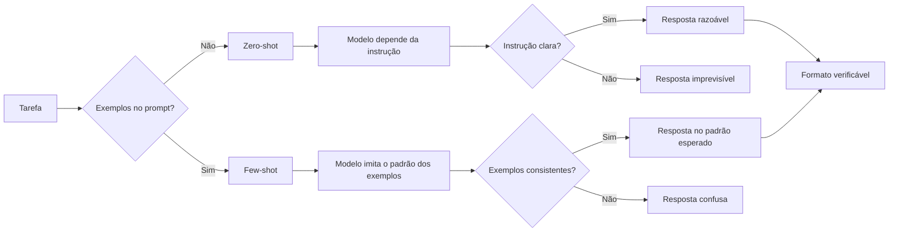

# Capítulo 3: Few-Shot e Zero-Shot: Aprendendo em Contexto

## 1. Introdução

Nos Capítulos 1 e 2, você definiu o prompt como instrumento e dissecou sua anatomia — papel, instrução, contexto, exemplos e formato [1]. Agora vamos dominar a técnica que os exemplos anunciaram: o aprendizado em contexto [18]. A tese deste capítulo é que modelos de linguagem aprendem a executar tarefas diretamente dos exemplos fornecidos no prompt — sem ajustar nenhum peso — e que essa capacidade, chamada in-context learning, é a base das técnicas de few-shot e zero-shot [18].

Este capítulo tem três objetivos. Primeiro, entender o mecanismo: como o modelo aprende de exemplos no prompt, e por que isso funciona [18]. Segundo, dominar a distinção zero-shot vs. few-shot: quando cada um basta e quando os exemplos são indispensáveis [2]. Terceiro, aprender a escolher e escrever exemplos eficazes — a arte que separa um few-shot que ensina de um que confunde [2]. Ao final, você aplicará few-shot e zero-shot com método — e saberá diagnosticar quando a técnica falha [9].

## 2. Explica

### 2.1 In-Context Learning: o Mecanismo

O conceito central do capítulo é o in-context learning — a capacidade de aprender a partir dos exemplos presentes no contexto [18]. O artigo seminal de Brown et al. demonstrou que modelos de grande escala podem executar tarefas novas sem fine-tuning: basta fornecer alguns exemplos no prompt [18]. O modelo "aprende" o padrão entrada-saída durante a inferência — uma forma de aprendizado sem mudança de pesos [18].

O mecanismo exato ainda é objeto de pesquisa, mas o comportamento é bem documentado [18]. Com zero exemplos, o modelo depende da instrução; com um ou mais exemplos, o modelo imita o padrão [18]. E a qualidade do aprendizado depende de fatores mensuráveis: a representatividade dos exemplos, a clareza do padrão e a consistência do formato [2]. O in-context learning é o fundamento sobre o qual todas as técnicas deste livro se apoiam [1].

### 2.2 Zero-Shot: a Capacidade Básica

O zero-shot é o caso mais simples: o modelo executa a tarefa sem nenhum exemplo — apenas com a instrução [2]. "Classifique o sentimento desta frase" é um prompt zero-shot [2]. A capacidade zero-shot é notável — modelos modernos executam muitas tarefas sem exemplo algum — mas tem limites claros [2]. Quando o formato é incomum, o domínio é específico ou o padrão é sutil, o zero-shot produz respostas variáveis [2].

O profissional sabe quando o zero-shot basta [2]. Para tarefas comuns, com formato padrão e expectativa clara, o zero-shot é eficiente — menos tokens, resposta direta [2]. O guia da OpenAI recomenda começar zero-shot e adicionar exemplos apenas quando necessário [2]. O zero-shot não é uma falha — é a configuração base, e a adição de exemplos é uma alavanca [1].

### 2.3 One-Shot e Few-Shot: a Alavanca dos Exemplos

Quando o zero-shot falha — ou quando a consistência importa — o few-shot entra em cena [2]. O one-shot fornece um único exemplo; o few-shot, alguns [18]. Cada exemplo é um par entrada-saída que demonstra o padrão esperado [18]. A diferença prática: o zero-shot descreve a regra; o few-shot mostra a regra em ação [2].

O few-shot é especialmente eficaz em três situações [2]. Primeira, formatação: quando a saída precisa seguir um formato específico — JSON, tabela, lista — os exemplos ensinam o formato melhor que a descrição [2]. Segunda, estilo: quando o tom ou a estrutura importam — um resumo executivo, uma resposta formal [2]. Terceira, classificação: quando as categorias são específicas do domínio — os exemplos definem as fronteiras [18]. Em cada caso, o exemplo vale mais que mil palavras de instrução [2].

### 2.4 A Escolha dos Exemplos: Representatividade e Diversidade

A qualidade do few-shot depende da escolha dos exemplos — não apenas da quantidade [2]. Três princípios orientam a escolha [2]. Primeiro, a representatividade: cada exemplo deve representar um caso típico da tarefa — não casos extremos isolados [2]. Segundo, a diversidade: os exemplos devem cobrir variações — entradas diferentes, formatos diferentes, dificuldades diferentes [2]. Terceiro, a borda: incluir um exemplo de caso-limite ensina o modelo onde traçar a fronteira [2].

O princípio da diversidade merece destaque [2]. Exemplos redundantes — todos do mesmo tipo — ensinam o modelo a generalizar pouco [2]. Exemplos diversos — cobrindo o espaço de variação — ensinam a generalizar bem [2]. O custo é o mesmo (tokens), mas o aprendizado é diferente [2]. O profissional curatoriamente seleciona exemplos como quem monta um conjunto de teste: cobre os casos, não repete [1].

### 2.5 O Formato Consistente: a Regra de Ouro do Few-Shot

A regra de ouro do few-shot é a consistência de formato [2]. Cada exemplo deve seguir exatamente a mesma estrutura — a mesma separação entre entrada e saída, o mesmo estilo [2]. Inconsistências de formato — às vezes "Entrada:", às vezes "input:", às vezes sem rótulo — confundem o modelo e degradam a transferência [2]. O modelo aprende o padrão que vê; se o padrão é bagunçado, o aprendizado é bagunçado [2].

A consistência também se estende ao prompt completo [2]. O formato dos exemplos deve espelhar o formato pedido na instrução e o formato esperado na saída [2]. Um few-shot onde os exemplos usam um formato e a tarefa final usa outro ensina o modelo a produzir no formato dos exemplos — e a resposta final sai no formato errado [2]. O alinhamento total — instrução, exemplos e tarefa final no mesmo formato — é a técnica que os guias oficiais enfatizam [2].

### 2.6 O Custo e o Limite do Few-Shot

O few-shot tem custos e limites que o profissional conhece [8]. O custo direto é o tokens: cada exemplo adiciona entrada à janela — e em escala, isso vira dinheiro e latência [8]. O custo indireto é o contexto: exemplos demais saturam a janela e degradam a atenção — o context rot que você estudou no Livro 1 [8]. O limite prático: poucos exemplos bem escolhidos valem mais que muitos redundantes [2].

O limite conceitual é mais profundo [18]. O in-context learning aprende padrões, não fatos novos [18]. Um exemplo não ensina ao modelo um fato que ele não conhece — ensina um padrão de comportamento [18]. Quando a tarefa exige conhecimento específico — uma política interna, uma base de dados proprietária — o few-shot não resolve sozinho: o contexto precisa trazer o conhecimento [3]. Esse é o limite que conecta este capítulo ao Capítulo 10 e à Context Engineering [3].

### 2.8 O Custo dos Exemplos e o Orçamento

O few-shot tem um custo que o profissional calcula — o orçamento de tokens [8]. Cada exemplo adiciona entrada à janela [8]. Exemplos demais saturam o contexto e degradam a atenção — o context rot [8]. E em escala — milhares de chamadas por dia — o custo dos exemplos é real [8]. O profissional dimensiona: quantos exemplos o padrão exige, e quanto isso custa? [8]

O dimensionamento é uma decisão de engenharia [2]. Três exemplos bem escolhidos valem mais que dez redundantes [2]. E o excesso — o few-shot que repete o mesmo padrão — é custo sem ganho [2]. A medição da seção 4.1 decide: se a taxa de acerto não melhora entre cinco e dez exemplos, cinco bastam [9]. O orçamento de exemplos é a mesma disciplina do orçamento de contexto do Livro 3 — aplicada aqui em escala menor [3].

### 2.9 Few-Shot e o Domínio Específico

O few-shot brilha nos domínios específicos — onde o modelo conhece pouco o padrão [2]. A classificação de tickets de suporte com categorias próprias da empresa: os exemplos definem as fronteiras [2]. A extração de campos de um formulário proprietário: os exemplos mostram o formato [2]. A normalização de texto com variações do domínio: os exemplos ensinam as regras [2]. Em cada caso, o few-shot transfere o conhecimento tácito do time para o prompt [2].

A transferência tem um cuidado [2]. Os exemplos do domínio específico carregam o viés do time [2]. Se os exemplos classificam um caso como X e outro como Y, o modelo aprende a fronteira — incluindo os erros da fronteira [2]. O profissional audita os exemplos com o mesmo cuidado que audita o código: os exemplos estão certos? As fronteiras são as desejadas? [9] O few-shot transfere o padrão — certo ou errado [2].

### 2.10 Few-Shot, Zero-Shot e o Modelo

A eficácia do few-shot varia com o modelo [18]. Modelos maiores têm mais in-context learning — aproveitam melhor os exemplos [18]. Modelos menores podem imitar superficialmente — a forma do exemplo, não o padrão [18]. E a diferença é empírica: o mesmo few-shot, em modelos diferentes, produz taxas diferentes [9]. O profissional testa a técnica por modelo — não assume que funciona igual [9].

A variação entre modelos é mais um motivo para a medição [9]. A linha de base zero-shot, o few-shot e a diferença — medidos no modelo do momento [9]. E a decisão — usar few-shot ou não — é por evidência, não por moda [9]. O in-context learning é uma propriedade do modelo — e o profissional conhece a propriedade do modelo que usa [18].

### 2.7 O Zero-Shot CoT: a Frase Que Desbloqueia o Raciocínio

Uma descoberta importante conecta o zero-shot ao raciocínio: a simples frase "Vamos pensar passo a passo" elicia cadeias de raciocínio — mesmo sem exemplos [20]. O estudo de Kojima et al. mostrou que modelos zero-shot melhoram drasticamente em tarefas de raciocínio quando a instrução pede a cadeia de pensamento explicitamente [20]. O mecanismo: a frase ativa um padrão de resposta que o modelo conhece do treinamento [20].

O zero-shot CoT é o caso mais impressionante de prompting barato com ganho alto [20]. Custo: uma frase. Ganho: raciocínio estruturado [20]. E ele é a ponte para o Capítulo 4, que detalha o chain-of-thought completo [19]. Por ora, registre o princípio: às vezes, a instrução certa — não os exemplos — é a chave [20].

## 3. Ilustra

### 3.1 A Analogia do Estagiário

A melhor analogia para o in-context learning é o estagiário novo [1]. O estagiário chega sem conhecer os processos da empresa — mas aprende rápido quando você mostra [1]. O zero-shot é pedir ao estagiário: "preencha este relatório" — ele tenta, mas sem saber o padrão, inventa o formato [1]. O few-shot é mostrar três relatórios preenchidos: "preencha o quarto assim" — e o estagiário imita o padrão [18].

A analogia ensina duas lições [1]. Primeira: o estagiário não aprende com um exemplo mal feito — imita o erro [1]. Segunda: o estagiário aprende o padrão, não a regra — se os exemplos forem tendenciosos, a imitação é tendenciosa [1]. O profissional de few-shot é o supervisor que escolhe os exemplos como escolhe as demonstrações ao estagiário: representativas, diversas e formatadas [2].

### 3.2 O Diagrama do In-Context Learning



O diagrama condensa o capítulo: o few-shot desloca a fonte do comportamento — da instrução (zero-shot) para o padrão dos exemplos [18]. E a qualidade do resultado depende do mesmo fator nos dois casos: a clareza do padrão [2]. O profissional diagnostica a falha pelo diagrama: resposta imprevisível? Verifique a instrução. Resposta no formato errado? Verifique a consistência dos exemplos [2].

### 3.3 O Mestre e o Aprendiz

Uma segunda analogia: o mestre artesão e o aprendiz [18]. O mestre não explica a regra — mostra o trabalho e diz "faça assim" [18]. O aprendiz observa, imita e, com exemplos diversos, generaliza [18]. O few-shot é exatamente essa pedagogia: mostrar, não explicar [18]. E o zero-shot é a pedagogia da regra: "faça X" sem demonstração — que funciona quando o aprendiz já conhece o padrão [2].

A analogia revela o que torna um bom mestre: a curadoria das demonstrações [2]. O mestre não mostra qualquer trabalho — mostra os representativos, os diversos e os de borda [2]. O profissional de prompt idem: não joga exemplos aleatórios no prompt — seleciona os que ensinam [2]. O few-shot é pedagogia aplicada a modelos [18].

## 4. Técnica

### 4.1 O Avaliador de Zero-Shot vs. Few-Shot

A técnica central do capítulo é medir — não adivinhar — quando o few-shot ajuda [9]. O script abaixo compara zero-shot e few-shot contra um oráculo, em N execuções, e reporta a taxa de acerto [2]:

```python
def avaliar_prompts(executar, casos, variantes, repeticoes=3):
    """Compara variantes de prompt (zero-shot vs few-shot) contra o oráculo.

    `executar` é uma função que recebe (prompt, entrada) e devolve a resposta.
    Cada caso tem: entrada, esperado.
    """
    for nome, montar in variantes.items():
        acertos = 0
        total = 0
        for caso in casos:
            prompt = montar(caso["entrada"])
            for _ in range(repeticoes):
                resposta = executar(prompt, caso["entrada"])
                total += 1
                if normalizar(resposta) == normalizar(caso["esperado"]):
                    acertos += 1
        taxa = acertos / total * 100
        print(f"{nome:<20} taxa de acerto: {taxa:.0f}% ({acertos}/{total})")


def normalizar(texto):
    return texto.strip().lower().replace(".", "")


def montar_zero_shot(entrada):
    return f"Classifique o sentimento como POSITIVO ou NEGATIVO: {entrada}"


def montar_few_shot(entrada):
    exemplos = [
        "Produto excelente, recomendo! -> POSITIVO",
        "Péssimo atendimento, não compro mais. -> NEGATIVO",
        "Chegou antes do prazo. -> POSITIVO",
    ]
    corpo = "\n".join(exemplos)
    return (f"Classifique o sentimento como POSITIVO ou NEGATIVO.\n"
            f"{corpo}\n{entrada} ->")


if __name__ == "__main__":
    casos = [
        {"entrada": "A entrega atrasou dois dias.", "esperado": "NEGATIVO"},
        {"entrada": "Ótimo custo-benefício.", "esperado": "POSITIVO"},
        {"entrada": "O produto quebrou na primeira semana.", "esperado": "NEGATIVO"},
    ]
    # Substitua por uma chamada real de API na prática
    avaliar_prompts(lambda p, e: "POSITIVO" if "excelente" in e or "ótimo" in e
                    else "NEGATIVO",
                    casos,
                    {"zero-shot": montar_zero_shot, "few-shot": montar_few_shot})
```

O script materializa o método do capítulo: hipótese (o few-shot melhora?), experimento (N execuções contra o oráculo) e veredito (taxa de acerto) [9]. A versão com API real substitui o lambda pelo provedor — e o esqueleto continua [2]. Medir antes de decidir é o hábito que o Capítulo 8 aprofunda [14].

### 4.2 O Selecionador de Exemplos Representativos

A segunda técnica é o selecionador — um script que escolhe exemplos representativos de um conjunto maior [2]:

```python
def selecionar_exemplos(dataset, alvo, max_exemplos=3):
    """Seleciona exemplos representativos por similaridade com o alvo."""
    def similaridade(a, b):
        set_a, set_b = set(a.lower().split()), set(b.lower().split())
        if not set_a or not set_b:
            return 0.0
        return len(set_a & set_b) / len(set_a | set_b)

    pontuados = sorted(dataset, key=lambda ex: -similaridade(ex["entrada"], alvo))
    print("Exemplos selecionados (por similaridade com a entrada-alvo):")
    for i, ex in enumerate(pontuados[:max_exemplos], 1):
        print(f"  {i}. {ex['entrada']} -> {ex['saida']}")
    return pontuados[:max_exemplos]


if __name__ == "__main__":
    dataset = [
        {"entrada": "O app trava ao abrir", "saida": "BUG"},
        {"entrada": "Como faço para resetar a senha?", "saida": "DUVIDA"},
        {"entrada": "Quero cancelar minha assinatura", "saida": "CANCELAMENTO"},
        {"entrada": "O app fecha sozinho no login", "saida": "BUG"},
        {"entrada": "Qual o prazo de entrega?", "saida": "DUVIDA"},
    ]
    selecionar_exemplos(dataset, "O aplicativo não abre e fecha sozinho")
```

O selecionador mostra a curadoria em ação: em vez de exemplos arbitrários, os mais parecidos com a entrada-alvo [2]. A similaridade por palavras é uma heurística simples — na prática, embeddings fazem o mesmo com mais precisão [3]. O princípio permanece: exemplos relevantes ao caso em questão ensinam mais que exemplos genéricos [2].

### 4.3 O Validador de Consistência de Formato

A regra de ouro — consistência de formato — merece um verificador automático [2]:

```python
import re


def validar_consistencia(exemplos):
    """Verifica se todos os exemplos seguem o mesmo padrão de formato."""
    padroes = []
    for ex in exemplos:
        m = re.match(r"^(.*?)\s*->\s*(.*)$", ex)
        if m:
            padroes.append("entrada->saida")
        elif re.match(r"^Entrada:\s*.*\nSaída:\s*.*$", ex):
            padroes.append("Entrada:/Saída:")
        else:
            padroes.append("desconhecido")
    unicos = set(padroes)
    print(f"Exemplos analisados: {len(exemplos)}")
    print(f"Padrões detectados: {unicos}")
    if len(unicos) == 1 and "desconhecido" not in unicos:
        print("[OK] Formato consistente — regra de ouro respeitada.")
        return True
    print("[FALHA] Formatos misturados — padronize antes de usar o few-shot.")
    return False


if __name__ == "__main__":
    bons = ["bom -> POSITIVO", "ruim -> NEGATIVO", "ótimo -> POSITIVO"]
    ruins = ["bom -> POSITIVO", "Entrada: ruim\nSaída: NEGATIVO", "ótimo: POSITIVO"]
    print("=== Exemplos consistentes ===")
    validar_consistencia(bons)
    print("\n=== Exemplos inconsistentes ===")
    validar_consistencia(ruins)
```

O validador transforma a regra de ouro em check executável [2]. Antes de usar um few-shot em produção, o script confere: todos os exemplos no mesmo formato? [2] A verificação automática é a diferença entre confiar na disciplina e garantir a disciplina [1].

### 4.4 O Gerador de Prompt Few-Shot com Template

A aplicação de produção do capítulo: um gerador de few-shot com seleção de exemplos e formato padronizado [2]:

```python
class GeradorFewShot:
    def __init__(self, instrucao, separador="->"):
        self.instrucao = instrucao
        self.separador = separador

    def gerar(self, exemplos, entrada):
        linhas = [self.instrucao, ""]
        for ex_entrada, ex_saida in exemplos:
            linhas.append(f"{ex_entrada} {self.separador} {ex_saida}")
        linhas.append("")
        linhas.append(f"{entrada} {self.separador}")
        return "\n".join(linhas)


if __name__ == "__main__":
    gerador = GeradorFewShot("Classifique a solicitação de suporte:")
    prompt = gerador.gerar(
        [("O app trava", "BUG"), ("Como reseto a senha?", "DUVIDA")],
        "Não consigo efetuar login",
    )
    print(prompt)
    print("---")
    print("O modelo completa a última linha com a categoria — e o formato "
          "dos exemplos garante a consistência da resposta [2].")
```

O gerador encapsula a disciplina: a instrução fixa, os exemplos selecionados, o formato padronizado [2]. Em produção, os exemplos vêm de um registro versionado — o tema do Capítulo 7 — e a seleção usa a técnica da seção 4.2 [13]. O few-shot vira componente de engenharia, não improviso [1].

## 5. Aplica

### 5.1 Onde Isso Vive no Mundo Real

O few-shot é onipresente nos sistemas de IA em produção [2]. O roteamento de tickets usa few-shot com exemplos de cada categoria [2]. A extração de dados usa few-shot com exemplos do formato JSON [1]. A normalização de texto usa few-shot com exemplos das variações [2]. E os agentes modernos usam few-shot nos arquivos de instrução — exemplos de comandos esperados, exemplos de respostas corretas [4].

O padrão de 2026 mostra a evolução: o few-shot estático — exemplos fixos no prompt — deu lugar ao few-shot dinâmico — exemplos selecionados por similaridade com a entrada [3]. A engenharia de contexto, tema do Capítulo 10, automatiza essa seleção [3]. O princípio permanece o mesmo: mostrar o padrão ensina mais que descrevê-lo [18].

### 5.2 O Erro Comum do Iniciante

O erro clássico é o few-shot de exemplos aleatórios: pegar qualquer par entrada-saída e colar no prompt [2]. O resultado: o modelo imita exemplos irrelevantes e a resposta sai no padrão errado [2]. O segundo erro é a inconsistência de formato: exemplos com estruturas diferentes confundem o modelo — o validador da seção 4.3 pega exatamente isso [2]. O terceiro erro é o excesso: vinte exemplos redundantes saturam a janela sem ensinar nada novo [8].

A correção — e aqui está o diferencial que separa o profissional — é a curadoria [2]. Poucos exemplos, representativos, diversos, de borda e no mesmo formato [2]. E a medição: a taxa de acerto contra o oráculo decide — não a intuição [9]. O profissional não pergunta "quantos exemplos?" — pergunta "estes exemplos ensinam o padrão?" [2].

### 5.3 O Padrão Profissional em 2026

O padrão profissional combina as técnicas do capítulo [2]. Primeiro, começar zero-shot e medir a linha de base [2]. Segundo, adicionar few-shot apenas onde a medição mostra ganho — formatação, estilo, classificação [2]. Terceiro, selecionar exemplos por representatividade e relevância — estáticos ou dinâmicos [2]. Quarto, validar a consistência de formato automaticamente [2]. E quinto, registrar os exemplos como ativos versionados — o tema do Capítulo 7 [13].

O resultado é um few-shot que se comporta como componente de engenharia: selecionado, formatado, medido e versionado [2]. E a base — o in-context learning — é a mesma que sustenta o chain-of-thought do próximo capítulo [19]. O aprendizado em contexto é a moeda; as técnicas são as transações [18].

### 5.4 O Inventário do Capítulo

Vale consolidar o capítulo em um inventário verificável [1]. Primeiro, o mecanismo: o in-context learning — o modelo aprende dos exemplos no prompt, sem ajustar pesos [18]. Segundo, a distinção: zero-shot é a linha de base; few-shot é a alavanca [2]. Terceiro, a curadoria: representatividade, diversidade e borda [2]. Quarto, a regra de ouro: a consistência de formato [2]. Quinto, o limite: o in-context learning aprende padrões, não fatos [18].

Cada item tem um teste [9]. Para o mecanismo: você explica por que o modelo "aprende" sem mudar pesos? [18] Para a distinção: você decide quando o zero-shot basta? [2] Para a curadoria: você seleciona exemplos com método? [2] Para a consistência: você valida o formato automaticamente? [2] O inventário com testes é a base para aplicar a técnica com confiança [1].

### 5.5 O Few-Shot Dinâmico

O padrão avançado do few-shot é a seleção dinâmica de exemplos [3]. Em vez de exemplos fixos no prompt, o sistema seleciona os exemplos mais relevantes à entrada do momento [3]. A técnica: a entrada é comparada com o catálogo de exemplos — por similaridade — e os mais próximos entram no prompt [3]. O few-shot dinâmico é a ponte entre a técnica deste capítulo e a recuperação da Context Engineering [3].

O ganho é mensurável [3]. Exemplos relevantes ensinam o padrão certo para o caso certo [3]. Exemplos genéricos ensinam um padrão médio [3]. E a medição do Capítulo 3 — a taxa de acerto — mostra a diferença [9]. Na prática, o few-shot dinâmico usa embeddings para a similaridade — o mesmo mecanismo das bases vetoriais do Livro 3 [3]. O princípio permanece: mostrar o padrão certo para o caso certo [2].

### 5.6 O Erro de Confundir Exemplo com Fato

Um erro conceitual que separa iniciantes de profissionais: confundir exemplo com fato [18]. O exemplo ensina um padrão de comportamento — não um fato novo [18]. Se o modelo não conhece a política da empresa, vinte exemplos não a ensinam — apenas imitam o padrão [18]. O profissional não usa exemplos para transmitir conhecimento — usa o contexto para isso [3]. E essa distinção — exemplo como padrão, contexto como conhecimento — é a fronteira com a Context Engineering [3].

A confusão tem um sintoma [3]. O sistema que depende de exemplos para "lembrar" fatos produz falhas quando o exemplo muda [3]. O sistema que usa contexto para fatos e exemplos para padrões é estável [3]. O profissional diagnostica o sintoma: se a saída erra ao variar o exemplo, o padrão não foi aprendido [9]. A correção é a arquitetura: o fato no contexto, o padrão nos exemplos [3].

### 5.7 A Escolha dos Exemplos: Seleção, Ordenação e Diversidade

A técnica few-shot transfere o peso da instrução para os exemplos — e isso torna a escolha dos exemplos uma decisão de engenharia, não de conveniência [18]. O estudo seminal de Brown mostrou que modelos de poucos bilhões de parâmetros, sem treinamento adicional, aprendem tarefas novas apenas com exemplos no prompt [18]; mas a qualidade desse aprendizado depende criticamente de *quais* exemplos são apresentados e *como* são ordenados [18][2]. Um conjunto de exemplos mal selecionado pode ensinar a tarefa errada; uma ordem mal escolhida pode confundir o padrão [18]. Esta subseção sistematiza a seleção de exemplos em três dimensões: seleção, ordenação e diversidade.

A **seleção** define quais casos entram no prompt. O critério central é a representatividade: os exemplos devem cobrir os casos típicos da tarefa — não os casos extremos — porque é o padrão típico que o modelo generaliza [2][18]. Um modelo que recebe três exemplos de casos raros e exóticos aprende que a tarefa é rara e exótica [18]. A segunda regra de seleção é a clareza do contraste: cada exemplo deve ilustrar uma variação distinta da tarefa, de modo que o conjunto, em conjunto, delimite o espaço de respostas desejadas [2][16]. O guia do Google Cloud recomenda selecionar exemplos que cubram os tipos de entrada mais comuns no uso real, não os mais fáceis de escrever [16].

A **ordenação** importa porque modelos são sensíveis à posição dos exemplos no contexto [18][8]. A pesquisa sobre Context Rot mostrou que a influência de conteúdo decai com a distância no contexto — informação no meio do contexto exerce menos influência que informação no início ou no fim [8]. Na prática few-shot, isso significa: coloque os exemplos mais representativos primeiro, os que definem o formato exato por último (perto da entrada do usuário), e evite enterrar exemplos críticos no meio [8][16]. A ordem também pode ser usada deliberadamente para ensinar progressão: do caso simples ao complexo, ou do exemplo canônico aos casos de borda [2][18].

A **diversidade** protege contra o overfitting do modelo ao conjunto de exemplos. Se todos os exemplos têm a mesma estrutura sintática e o mesmo domínio vocabular, o modelo aprende um padrão estreito e falha fora dele [18][2]. O contraste desejado é o da variação controlada: exemplos com estruturas diferentes para a mesma regra, vocabulários diferentes para o mesmo domínio, e níveis de dificuldade diferentes para a mesma tarefa [2][16]. A literatura de avaliação reforça o ponto por outro ângulo: um conjunto de exemplos diverso também serve como conjunto de teste — se o prompt few-shot falha em uma variação dentro da própria amostra, ele falhará fora dela [14][15].

Há ainda a questão prática do **custo de tokens**. Cada exemplo consome contexto; vinte exemplos bons podem custar mais que o benefício que trazem [1][3]. A compensação entre quantidade e qualidade de exemplos é uma decisão econômica explícita: dois exemplos excelentes e representativos superam oito exemplos medíocres [1][2]. A abordagem profissional é iterar: comece com poucos exemplos, meça, e adicione exemplos apenas onde a amostra mostra falha sistemática [13][14]. Essa disciplina de seleção é o que distingue o few-shot como técnica de engenharia do few-shot como truque de demonstração [13][18].

Finalmente, a seleção de exemplos interage com a hierarquia do Capítulo 2: os exemplos são cláusulas de demonstração e, como toda cláusula, precisam ser auditados quanto a conflitos com a instrução principal [2]. Um exemplo cujo tom contradiz o papel declarado ensina a contradição [2][18]. A prática recomendada é tratar o conjunto de exemplos como um minissuite de testes da tarefa: cada exemplo deve passar pelo prompt final e produzir a saída esperada — se um exemplo "ensina" algo que o prompt não produz, o exemplo ou o prompt está errado, e ambos precisam ser corrigidos juntos [13][14]. Com seleção, ordenação e diversidade controladas, o few-shot se torna a técnica mais previsível da caixa de ferramentas do engenheiro de prompts [18][2].

### 5.8 Zero-Shot e o Limiar de Capacidade: Quando a Técnica Não Precisa de Exemplos

O estudo de Kojima demonstrou um fato que mudou a prática da disciplina: modelos grandes conseguem raciocinar em tarefas novas sem nenhum exemplo, desde que instruídos a pensar passo a passo — a técnica que ficou conhecida como zero-shot chain-of-thought [20]. Essa descoberta reordenou o mapa da disciplina: para muitas tarefas, o few-shot não é necessário; uma instrução bem redigida — e às vezes uma única frase como "pense passo a passo" — basta [20][19]. Mas "não é necessário" não significa "é sempre suficiente": o zero-shot tem um limiar de capacidade, e o engenheiro precisa saber onde ele está [20][3].

A primeira lição do zero-shot é econômica: prompts sem exemplos custam menos tokens e são mais baratos de manter [1][20]. Em tarefas simples e bem definidas — extração de campos, classificação, formatação — o zero-shot atinge a qualidade do few-shot com uma fração do custo [20][16]. O guia da OpenAI é explícito: comece com o prompt mais simples possível e só adicione complexidade quando a medição mostrar necessidade [1][2]. Muitos profissionais pulam direto para o few-shot por hábito, carregando o contexto com exemplos que não mudam o resultado [1]. O zero-shot é a linha de base correta de qualquer projeto: só se justifica adicionar exemplos quando o zero-shot medido falha [1][14].

A segunda lição é o **limiar de capacidade**. O zero-shot funciona quando a tarefa está dentro da capacidade do modelo; falha quando a tarefa exige conhecimento, padrão ou passo intermediário que o modelo não possui de fábrica [20][3]. O estudo de Kojima observa que o zero-shot CoT brilha em tarefas de raciocínio aritmético e lógico, mas o ganho varia com o modelo e com a tarefa [20]. Para tarefas que exigem conhecimento de domínio específico — leis locais, jargão de uma empresa, formato proprietário — o few-shot é superior porque os exemplos carregam exatamente o conhecimento que falta [18][2]. O diagnóstico prático é: quando o zero-shot erra de forma consistente e compreensível, o problema é de conhecimento (falta contexto ou exemplos); quando erra de forma aleatória, o problema é de instrução [2][20].

A terceira lição é a **interação entre zero-shot e contexto**. O zero-shot não significa contexto vazio: um prompt zero-shot pode e deve conter contexto rico, restrições e definições de formato [2][3]. O que o zero-shot dispensa são os exemplos — não o contexto. A distinção é crucial porque muitos profissionais confundem "sem exemplos" com "sem especificação" e escrevem prompts de uma linha que o modelo preenche com suposições [2][3]. O contexto engineering, que a Parte II do livro desenvolve, mostra que o modelo responde melhor a contexto estruturado do que a exemplos redundantes quando a tarefa já está dentro da capacidade [3][4].

A quarta lição é o **reconhecimento do limiar como limite profissional**. O engenheiro maduro não pergunta "qual técnica usar?" de forma abstrata — ele pergunta "esta tarefa está dentro do limiar do modelo?" [3][20]. Se está, zero-shot resolve com economia; se está no limite, poucos exemplos bem escolhidos empurram o desempenho para cima; se está claramente além, nenhuma técnica de prompt resolve — é hora de mudar a arquitetura, o modelo ou a tarefa [3][18]. Esse reconhecimento — saber onde a camada de prompt termina — é a ponte exata para o argumento central da série: prompt engineering é a primeira camada da pilha, e seu limite é o ponto onde as camadas superiores começam [3][4].

## 6. Conclusão

Neste capítulo, você dominou o in-context learning: a capacidade do modelo de aprender dos exemplos no prompt, sem ajustar pesos [18]. Você aprendeu a distinção zero-shot vs. few-shot — quando a instrução basta e quando os exemplos são indispensáveis [2]. E você dominou a arte da escolha de exemplos — representatividade, diversidade, borda e consistência de formato [2].

Resumindo em três pontos: primeiro, o zero-shot é a configuração base — e a adição de exemplos é uma alavanca, não uma obrigação [2]; segundo, a qualidade do few-shot vem da curadoria, não da quantidade [2]; terceiro, o in-context learning aprende padrões, não fatos — e é esse limite que conecta o capítulo à Context Engineering [18][3]. Com esses três pontos, você aplica few-shot com método [2].

### O Desafio Deste Capítulo

O desafio em três níveis. Nível um: execute o avaliador da seção 4.1 com uma API real e meça o ganho do few-shot sobre o zero-shot na sua tarefa [9]. Nível dois: monte um dataset de exemplos e aplique o selecionador da seção 4.2 — compare o few-shot selecionado com o aleatório [2]. Nível três: registre seus exemplos no padrão da seção 4.4 e valide a consistência com o script da seção 4.3 [2]. Os três níveis exercitam medição, curadoria e produção [1].

No próximo capítulo, vamos subir um degrau de complexidade: o chain-of-thought — como induzir o modelo a raciocinar passo a passo, e por que a cadeia de pensamento desbloqueia habilidades que a resposta direta não alcança [19]. O aprendizado em contexto está dominado; agora vamos ao raciocínio [1].

## 7. Referências Bibliográficas

[1] OPENAI. Prompt engineering. Disponível em: https://developers.openai.com/api/docs/guides/prompt-engineering. Acesso em: 5 ago. 2026.

[2] OPENAI. Best practices for prompt engineering with the OpenAI API. Disponível em: https://help.openai.com/en/articles/6654000-best-practices-for-prompt-engineering-with-openai-api. Acesso em: 5 ago. 2026.

[3] ANTHROPIC. Effective context engineering for AI agents. Disponível em: https://www.anthropic.com/engineering/effective-context-engineering-for-ai-agents. Acesso em: 5 ago. 2026.

[4] ANTHROPIC. Building Effective AI Agents. Disponível em: https://www.anthropic.com/engineering/building-effective-agents. Acesso em: 5 ago. 2026.

[5] KARPATHY, Andrej. Software 3.0: Software in the Age of AI. Disponível em: https://www.latent.space/p/s3. Acesso em: 5 ago. 2026.

[6] OPENAI. Function Calling Guide. Disponível em: https://developers.openai.com/api/docs/guides/function-calling. Acesso em: 5 ago. 2026.

[7] WENG, Lilian. Extrinsic Hallucinations in LLMs. Disponível em: https://lilianweng.github.io/posts/2024-07-07-hallucination/. Acesso em: 5 ago. 2026.

[8] CHROMA. Context Rot: How Increasing Input Tokens Impacts LLM Performance. Disponível em: https://www.trychroma.com/research/context-rot. Acesso em: 5 ago. 2026.

[9] TESTING LIBRARY. Guiding Principles. Disponível em: https://testing-library.com/docs/guiding-principles/. Acesso em: 5 ago. 2026.

[10] WEI, Jason; et al. Emergent Abilities of Large Language Models. 2022. Disponível em: https://arxiv.org/abs/2206.07682. Acesso em: 5 ago. 2026.

[11] SITEPOINT. Vibe Coding 2026: The Complete Guide to AI-First Development. Disponível em: https://www.sitepoint.com/vibe-coding-2026-complete-guide/. Acesso em: 5 ago. 2026.

[12] BRAINTRUST. What is prompt versioning? Best practices for iteration without breaking production. Disponível em: https://www.braintrust.dev/articles/what-is-prompt-versioning. Acesso em: 5 ago. 2026.

[13] PAN, Tian. Prompt Versioning in Production: The Engineering Discipline Teams Learn the Hard Way. Disponível em: https://tianpan.co/blog/2026-04-09-prompt-versioning-production-llm. Acesso em: 5 ago. 2026.

[14] LANGCHAIN. Evaluating LLM Systems: Metrics and Best Practices. Disponível em: https://blog.langchain.dev/evaluating-llm-platforms/. Acesso em: 5 ago. 2026.

[15] CHANG, Yupeng; et al. A Survey on Evaluation of Large Language Models. 2023. Disponível em: https://arxiv.org/abs/2307.03109. Acesso em: 5 ago. 2026.

[16] GOOGLE CLOUD. Generative AI Prompt Design Guide. Disponível em: https://cloud.google.com/vertex-ai/generative-ai/docs/learn/prompts/prompt-design. Acesso em: 5 ago. 2026.

[17] GROWTHBOOK. How to test multiple prompts in production (without chaos). Disponível em: https://www.growthbook.io/insights/how-test-multiple-prompts-production-without-chaos. Acesso em: 5 ago. 2026.

[18] BROWN, Tom B.; et al. Language Models are Few-Shot Learners. 2020. Disponível em: https://arxiv.org/abs/2005.14165. Acesso em: 5 ago. 2026.

[19] WEI, Jason; et al. Chain-of-Thought Prompting Elicits Reasoning in Large Language Models. 2022. Disponível em: https://arxiv.org/abs/2201.11903. Acesso em: 5 ago. 2026.

[20] KOJIMA, Takeshi; et al. Large Language Models are Zero-Shot Reasoners. 2022. Disponível em: https://arxiv.org/abs/2205.11916. Acesso em: 5 ago. 2026.
