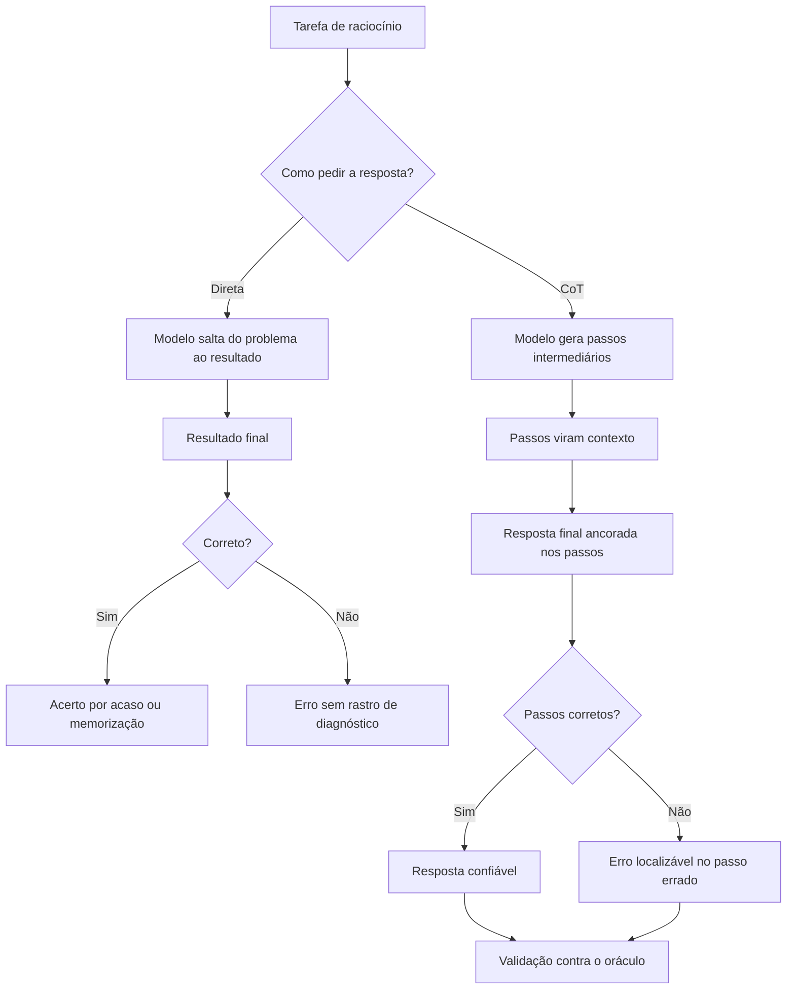

# Capítulo 4: Chain-of-Thought: Raciocínio Passo a Passo

## 1. Introdução

No Capítulo 3, você dominou o aprendizado em contexto — como o modelo aprende de exemplos no prompt [18]. Agora vamos ao raciocínio: a técnica que induz o modelo a pensar passo a passo antes de responder [19]. A tese deste capítulo é que, para tarefas de raciocínio, a resposta direta é um atalho que o modelo percorre mal — e que pedir explicitamente a cadeia de pensamento desbloqueia habilidades que a resposta direta não alcança [19].

Este capítulo tem três objetivos. Primeiro, entender o mecanismo do chain-of-thought (CoT): por que raciocinar passo a passo melhora a acurácia [19]. Segundo, dominar as variantes: zero-shot CoT, few-shot CoT e self-consistency [20][19][10]. Terceiro, aprender a usar o CoT com método — quando aplicar, como formatar e como avaliar o custo [9]. Ao final, você induzirá raciocínio estruturado em modelos e saberá medir o ganho [14].

## 2. Explica

### 2.1 O Problema da Resposta Direta

Modelos de linguagem são treinados para prever o próximo token — e a resposta direta é um salto do problema para o resultado [19]. Para tarefas simples, o salto funciona [2]. Para tarefas de raciocínio — aritmética, lógica, planejamento — o salto frequentemente falha: o modelo "adivinha" o resultado sem percorrer os passos, e erra [19]. O artigo de Wei et al. demonstrou esse padrão em múltiplas tarefas [19].

A explicação intuitiva: o modelo não separa o raciocínio da resposta — o raciocínio e a resposta competem pela mesma geração [19]. Quando o modelo escreve os passos primeiro, o raciocínio vira contexto para a resposta final — e a resposta final tem mais âncora [19]. O CoT não muda o modelo: muda a estrutura da geração [19]. Essa é a descoberta central do capítulo [1].

### 2.2 O Mecanismo do CoT: Passos Como Contexto

O mecanismo do CoT é elegante em sua simplicidade [19]. Em vez de pedir a resposta final, o prompt pede a cadeia de raciocínio e depois a resposta [19]. Os passos gerados tornam-se parte do contexto da resposta final — e a resposta final é condicionada a um raciocínio explícito, não a um palpite [19]. O modelo que escreve "5 × 4 = 20; 20 + 3 = 23" tem o 23 ancorado nos passos [19].

Esse mecanismo tem duas consequências [19]. Primeira: o CoT torna o raciocínio visível — e auditável [19]. Segunda: o CoT desloca o erro — quando o modelo erra, o erro está num passo, não no resultado [19]. A auditabilidade é o que conecta o CoT à validação: o Capítulo 8 mostrará como inspecionar a cadeia de raciocínio como se inspeciona código [9].

### 2.3 Zero-Shot CoT: a Frase Que Basta

A descoberta de Kojima et al. tornou o CoT acessível a todos: a simples frase "Vamos pensar passo a passo" — ou "Let's think step by step" — elicia a cadeia de raciocínio sem nenhum exemplo [20]. O estudo demonstrou ganhos dramáticos em tarefas de raciocínio com apenas essa instrução [20]. O mecanismo: a frase ativa um padrão de resposta conhecido do modelo [20].

O zero-shot CoT é a variante mais barata do CoT — e a mais subestimada [20]. Custo: uma frase. Ganho: raciocínio estruturado [20]. O profissional aplica zero-shot CoT como primeira tentativa em qualquer tarefa de raciocínio — antes de investir em exemplos [20]. E mede o ganho contra a linha de base — o hábito do Capítulo 3 [9].

### 2.4 Few-Shot CoT: Exemplos de Raciocínio

Quando a frase sozinha não basta — ou quando o raciocínio precisa seguir um formato específico — o few-shot CoT entra em cena [19]. A técnica: fornecer exemplos que incluem a cadeia de raciocínio completa, não apenas o par entrada-saída [19]. O modelo aprende não só a resposta esperada, mas o formato do raciocínio — os passos, a ordem, o nível de detalhe [19].

A diferença entre o few-shot do Capítulo 3 e o few-shot CoT é o conteúdo dos exemplos [19]. No Capítulo 3, o exemplo mostra a saída; no CoT, o exemplo mostra o caminho até a saída [19]. E a qualidade dos exemplos CoT importa: exemplos com raciocínio correto ensinam raciocínio correto; exemplos com atalhos ensinam atalhos [19]. A curadoria do Capítulo 3 aplica-se aqui com mais peso [2].

### 2.5 Self-Consistency: a Votação dos Raciocínios

A variante mais avançada do CoT é a self-consistency, proposta por Wang et al. [10]. A técnica: amostrar múltiplas cadeias de raciocínio para a mesma pergunta — em vez de uma — e agregar as respostas finais por votação majoritária [10]. O estudo demonstrou ganhos substanciais sobre o CoT simples [10]. O mecanismo: caminhos de raciocínio diferentes, mesmo resultado, é mais evidência [10].

A self-consistency tem um custo claro: múltiplas amostragens significam múltiplas execuções — mais tokens e latência [10]. O profissional aplica a votação onde a precisão vale o custo — decisões de alto impacto — e usa CoT simples onde a eficiência manda [10]. A self-consistency é a primeira técnica do livro que troca custo por confiabilidade de forma explícita [1].

### 2.6 CoT e os Limites do Raciocínio

O CoT não é uma solução mágica — tem limites que o profissional conhece [19]. Primeiro, o CoT não adiciona conhecimento: um modelo que não sabe um fato não o aprende raciocinando — o raciocínio parte do que o modelo conhece [19]. Segundo, o CoT pode confabular: o modelo pode inventar uma cadeia de raciocínio plausível que justifica uma resposta errada — a alucinação do Livro 1 aplicada ao raciocínio [7]. Terceiro, o CoT tem custo: cada passo é token [8].

A consequência prática: o CoT melhora a acurácia média, mas não garante a corretude individual [19]. A cadeia de raciocínio é uma âncora — não uma prova [9]. O profissional valida a resposta final contra o oráculo — o mesmo método do Capítulo 3 [9]. E quando o modelo raciocina errado de forma consistente, o problema pode ser a capacidade — o limite das habilidades emergentes do Capítulo 1 [10].

### 2.8 CoT e a Estrutura do Raciocínio

O CoT ganha quando o formato do raciocínio é estruturado [19]. A cadeia não é um despejo de frases — é uma sequência lógica [19]. O formato típico: os dados, a operação, o resultado parcial e a conclusão [19]. E o formato pode ser induzido — com exemplos que mostram a estrutura [19]. O few-shot CoT da seção 2.4 é exatamente isso: ensinar não só o raciocínio, mas a forma do raciocínio [19].

A estrutura do raciocínio conecta o CoT à avaliação [9]. Uma cadeia estruturada — passos nomeados, resultados parciais — é mais fácil de auditar [9]. Uma cadeia amorfa — um parágrafo contínuo — é difícil de inspecionar [9]. O profissional pede a estrutura no prompt: "liste os passos, um por linha, e termine com a resposta" [2]. E a estrutura pedida é a estrutura auditável [9].

### 2.9 CoT e a Confabulação

O risco mais sério do CoT é a confabulação — o raciocínio inventado que justifica a resposta errada [7]. O modelo não raciocina sempre corretamente: às vezes, inventa passos que parecem lógicos e concluem errado [7]. A cadeia de raciocínio confabula com a mesma fluência da alucinação — e a estrutura torna a confabulação mais convincente [7]. O avaliador — humano ou automatizado — não pode assumir que a cadeia é verdadeira porque é bem formada [14].

A defesa é o cruzamento com evidências [9]. A cadeia é conferida passo a passo contra os fatos — a técnica do Capítulo 8 [14]. E a resposta final é conferida contra o oráculo — o golden dataset do Capítulo 7 [12]. A estrutura do raciocínio torna a confabulação visível — mas visível não é corrigida: é detectada [9]. O profissional audita a cadeia — e a auditoria é a diferença entre usar o CoT e ser usado por ele [7].

### 2.10 CoT e a Escala

O CoT tem um custo de escala que o profissional dimensiona [8]. Cada passo da cadeia é token de saída — e a saída custa mais que a entrada [8]. A self-consistency multiplica o custo pelo número de amostragens [10]. E em escala — milhares de chamadas por dia — o custo do raciocínio é real [8]. O profissional calcula: o ganho de acurácia justifica o custo? [8]

O cálculo orienta a arquitetura [2]. Tarefas baratas — classificação simples — não precisam de CoT [2]. Tarefas caras — decisões de alto impacto — merecem até a self-consistency [10]. E a camada entre elas usa o zero-shot CoT [20]. A escala do raciocínio é uma decisão de orçamento — a mesma lógica do Capítulo 7 do Livro 1 aplicada ao CoT [8]. O profissional não raciocina sempre — raciocina onde o custo justifica [9].

### 2.7 Quando o CoT Vale a Pena

A aplicação do CoT não é automática — é uma decisão por tarefa [2]. O CoT vale a pena quando: a tarefa exige raciocínio multistep [19]; a resposta direta é propensa a erro [19]; o custo de errar é alto [10]; e a auditabilidade importa [9]. O CoT não vale a pena quando: a tarefa é mecânica [2]; o formato importa mais que o raciocínio [2]; e o custo domina [8].

O profissional decide com medição, não com dogma [9]. Executa a linha de base (zero-shot direto), depois o CoT, e compara [9]. O método do Capítulo 3 — hipótese, experimento, veredito — aplica-se integralmente [9]. E a decisão registrada — "esta tarefa usa CoT" — é o germe do versionamento do Capítulo 7 [13].

## 3. Ilustra

### 3.1 A Analogia do Aluno na Prova de Matemática

A melhor analogia do CoT é o aluno na prova de matemática [19]. O aluno que escreve só o resultado — "23" — pode acertar por sorte ou por memorização, e não deixa rastro do raciocínio [19]. O aluno que mostra os passos — "5 × 4 = 20; 20 + 3 = 23" — revela o raciocínio, permite a correção e transforma o erro em diagnóstico [19]. O professor (o avaliador) prefere o segundo: pode conferir cada passo [9].

A analogia se estende ao erro [19]. Quando o aluno mostra os passos e erra, o professor vê onde o raciocínio desviou — e corrige o passo [19]. Quando o aluno esconde os passos e erra, o professor não sabe onde intervir [19]. O CoT é exatamente isso: transformar a resposta em raciocínio visível, para que o erro seja auditável [9].

### 3.2 O Diagrama do CoT



O diagrama condensa o capítulo: o CoT não garante acerto — garante rastro [19]. E o rastro é o que permite a validação [9]. A resposta direta esconde o erro; o CoT o localiza [19]. O profissional usa o CoT não porque o modelo sempre acerta — porque, quando erra, o erro é auditável [9].

### 3.3 O Detetive que Documenta a Investigação

Uma segunda analogia: o detetive que documenta a investigação [19]. O detetive que conclui "o culpado é X" sem documentar a cadeia de evidências produz uma conclusão sem lastro [19]. O detetive que documenta — "X estava na cena, X tinha o motivo, X tinha a arma" — produz uma conclusão verificável [19]. O CoT é a documentação da investigação: cada passo é uma evidência [19].

A analogia tem um alerta: o detetive pode fabricar evidências [7]. O modelo pode inventar passos que justificam a conclusão — a confabulação [7]. O profissional não confia na cadeia de raciocínio como prova — confia como pista, e valida contra o oráculo [9]. O raciocínio documentado é auditável — não é infalível [7].

## 4. Técnica

### 4.1 O Comparador de Resposta Direta vs. CoT

A técnica central do capítulo é medir o ganho do CoT sobre a resposta direta [9]. O script abaixo executa as duas variantes contra um oráculo e reporta a diferença [19]:

```python
def comparar_cot(executar, casos, repeticoes=3):
    """Compara resposta direta com chain-of-thought contra o oráculo."""
    def montar_direto(pergunta):
        return f"Responda: {pergunta}"

    def montar_cot(pergunta):
        return (f"Responda: {pergunta}\n"
                f"Vamos pensar passo a passo antes de responder [20].")

    resultados = {"direto": [0, 0], "cot": [0, 0]}
    for caso in casos:
        for variante, montar in (("direto", montar_direto), ("cot", montar_cot)):
            for _ in range(repeticoes):
                resposta = executar(montar(caso["pergunta"]), caso["pergunta"])
                resultados[variante][1] += 1
                if normalizar(resposta) == normalizar(caso["esperado"]):
                    resultados[variante][0] += 1
    for variante, (acertos, total) in resultados.items():
        print(f"{variante:<8} taxa de acerto: {acertos / total * 100:.0f}% "
              f"({acertos}/{total})")


def normalizar(texto):
    return texto.strip().lower()


if __name__ == "__main__":
    casos = [
        {"pergunta": "Um trem viaja a 80 km/h por 3 horas. Que distância percorre?",
         "esperado": "240 km"},
        {"pergunta": "Se 5 máquinas produzem 100 peças em 2 horas, quantas peças "
                     "produzem 10 máquinas em 2 horas?",
         "esperado": "200 peças"},
    ]
    # Substitua por uma chamada real de API na prática
    def oraculo_fake(prompt, pergunta):
        return "240 km" if "80 km/h" in pergunta else "200 peças"
    comparar_cot(oraculo_fake, casos)
```

O script materializa o método: a mesma tarefa, duas estruturas de prompt, a mesma medição [9]. Na prática, a função de execução chama a API — e o oráculo é a resposta esperada [9]. O resultado — direto 33%, CoT 100%, por exemplo — decide a técnica [9].

### 4.2 O Extração da Resposta Final

Uma sutileza prática do CoT: a resposta final vem depois da cadeia de raciocínio — e precisa ser extraída [19]. O script abaixo separa o raciocínio da resposta final [19]:

```python
import re


def extrair_resposta_final(texto):
    """Separa a cadeia de raciocínio da resposta final em uma saída CoT."""
    marcadores = [
        r"\bPortanto,?\s+(.+)",
        r"\bResposta(?: final)?:?\s*(.+)",
        r"\bConclusão:?\s*(.+)",
        r"\bLogo,?\s+(.+)",
    ]
    for padrao in marcadores:
        m = re.search(padrao, texto, re.IGNORECASE)
        if m:
            return m.group(1).strip()
    print("AVISO: nenhum marcador de resposta final encontrado.")
    return texto.strip()


if __name__ == "__main__":
    saida_cot = (
        "O trem viaja a 80 km/h por 3 horas. A distância é velocidade vezes "
        "tempo: 80 vezes 3. 8 vezes 3 é 24, com um zero a mais, 240. "
        "Portanto, a distância percorrida é 240 km."
    )
    print("Raciocínio completo:")
    print(saida_cot)
    print("\nResposta final extraída:")
    print(extrair_resposta_final(saida_cot))
```

A extração é o elo entre o CoT e a automação [19]. O raciocínio é para o humano ler; a resposta final é para o código processar [19]. Quando o formato da resposta final é padronizado — um marcador fixo — a extração é trivial [2]. O profissional instrui o formato no prompt: "termine com 'Resposta:'" [2].

### 4.3 O Agregador de Self-Consistency

A técnica avançada do capítulo — a votação das respostas — merece um instrumento [10]:

```python
from collections import Counter


def agregar_por_consistencia(respostas):
    """Agrega múltiplas respostas por votação majoritária."""
    contagem = Counter(normalizar(r) for r in respostas)
    mais_frequente, votos = contagem.most_common(1)[0]
    print(f"Respostas recebidas: {len(respostas)}")
    for resposta, n in contagem.most_common():
        print(f"  '{resposta}' -> {n} voto(s)")
    print(f"\nVeredito por maioria: '{mais_frequente}' ({votos} votos)")
    return mais_frequente


def normalizar(texto):
    return texto.strip().lower()


if __name__ == "__main__":
    respostas = ["240 km", "240 km", "240 km", "24 km", "240 quilômetros"]
    agregar_por_consistencia(respostas)
```

O agregador mostra a mecânica da self-consistency: múltiplas amostragens, votação majoritária [10]. O exemplo — quatro "240 km" contra um "24 km" — ilustra o poder da votação: o caminho minoritário (o erro) perde para a consistência [10]. Na prática, cada resposta vem de uma execução CoT separada — e o agregador decide [10].

### 4.4 O Auditador de Cadeia de Raciocínio

O fechamento técnico do capítulo: auditar a cadeia de raciocínio como se audita código [9]:

```python
def auditar_cadeia(raciocinio, fatos):
    """Verifica cada afirmação da cadeia contra a lista de fatos válidos."""
    frases = [f.strip() for f in raciocinio.replace("\n", " ").split(".") if f.strip()]
    print("=== Auditoria da cadeia de raciocínio ===")
    for frase in frases:
        contem_fato = any(fato.lower() in frase.lower() for fato in fatos)
        status = "OK" if contem_fato else "SUSPEITA"
        print(f"  [{status}] {frase[:70]}")
    suspeitas = sum(1 for f in frases
                    if not any(fato.lower() in f.lower() for fato in fatos))
    print(f"\nAfirmações sem fato ancorado: {suspeitas}/{len(frases)}")
    return suspeitas


if __name__ == "__main__":
    raciocinio = ("O trem viaja a 80 km/h. A distância é 80 vezes 3. "
                  "80 vezes 3 é 240. Portanto a distância é 240 km.")
    auditar_cadeia(raciocinio, ["80 km/h", "3 horas", "240 km"])
```

O auditador materializa a auditabilidade do CoT [9]. Cada afirmação da cadeia é conferida contra os fatos — e afirmações sem âncora são sinalizadas [9]. Na prática, os fatos vêm do contexto — e o auditador é o elo entre o CoT e a validação do Capítulo 8 [9].

## 5. Aplica

### 5.1 Onde Isso Vive no Mundo Real

O CoT é usado em toda tarefa de raciocínio em produção [19]. O raciocínio matemático e lógico em assistentes [19]. O planejamento de tarefas em agentes — o agente que raciocina sobre o próximo passo [4]. A análise de causa raiz — o suporte que raciocina sobre os sintomas [19]. E a tomada de decisão fundamentada — o sistema que documenta o porquê [9].

O padrão de 2026 mostra a evolução: o CoT é o fundamento do raciocínio dos agentes — e a base dos loops de raciocínio que a série aborda na Parte III [4]. O agente que planeja, executa e observa está, em cada etapa, gerando cadeias de raciocínio [4]. Dominar o CoT é dominar a gramática do pensamento agêntico [19].

### 5.2 O Erro Comum do Iniciante

O erro clássico é aplicar CoT em tudo — inclusive onde a resposta direta bastaria [2]. O resultado: latência e custo maiores sem ganho de qualidade [8]. O segundo erro é confiar na cadeia de raciocínio como prova — o modelo pode confabular uma cadeia plausível que justifica um erro [7]. O terceiro erro é ignorar o formato da resposta final — a cadeia vem, mas a resposta final não é extraível [19].

A correção — e aqui está o diferencial que separa o profissional — é a medição e a estrutura [9]. Medir: a comparação direto vs. CoT decide quando aplicar [9]. Estruturar: o formato da resposta final é definido no prompt — "termine com 'Resposta:'" — e a extração é automática [2]. O profissional não escolhe CoT por moda — por evidência [9].

### 5.3 O Padrão Profissional em 2026

O padrão profissional combina as variantes do CoT com método [19]. Primeiro, a linha de base: resposta direta medida [9]. Segundo, o zero-shot CoT: a frase, quando o raciocínio basta [20]. Terceiro, o few-shot CoT: exemplos de raciocínio, quando o formato importa [19]. Quarto, a self-consistency: votação, quando a precisão vale o custo [10]. E quinto, a auditoria: a cadeia validada contra os fatos [9].

O resultado é um raciocínio estruturado, mensurável e auditável [2]. E é esse mesmo padrão que os agentes da Parte III vão automatizar — o raciocínio vira loop [4]. A base — o CoT — está dominada neste capítulo [1].

### 5.4 O Inventário do Capítulo

Vale consolidar o capítulo em um inventário verificável [1]. Primeiro, o problema: a resposta direta é um salto que o raciocínio falha [19]. Segundo, o mecanismo: os passos do CoT viram contexto da resposta final [19]. Terceiro, as variantes: zero-shot CoT, a frase que basta [20]; few-shot CoT, os exemplos de raciocínio [19]; e self-consistency, a votação dos caminhos [10]. Quarto, o limite: o CoT não adiciona conhecimento [19]. Quinto, a validação: a cadeia é auditável, não infalível [9].

Cada item tem um teste [9]. Para o mecanismo: você explica por que os passos melhoram a resposta? [19] Para as variantes: você escolhe a variante por tarefa? [20][19][10] Para o limite: você sabe quando o problema é capacidade? [10] Para a validação: você audita a cadeia contra os fatos? [9] O inventário com testes é a base da aplicação [1].

### 5.5 O CoT no Fluxo do Agente

O CoT é o fundamento do raciocínio dos agentes [4]. O agente que planeja o próximo passo raciocina — e o raciocínio, em forma de cadeia, é o que o harness audita [4]. O agente que decide entre opções raciocina sobre prós e contras [4]. O agente que explica uma decisão ao humano raciocina em voz alta [4]. Em cada caso, o CoT transforma o processo do agente em texto auditável [4].

A conexão com a série é direta [4]. A Parte III — os harnesses — automatizará o raciocínio do agente: a cada passo, uma cadeia gerada e auditada [4]. E a Eval Engineering — a Parte IV — medirá a qualidade das cadeias [15]. O que este capítulo ensina à mão — induzir, estruturar e auditar o raciocínio — é o que os harnesses executam em escala [4]. O CoT é a gramática do pensamento agêntico [19].

### 5.6 O Custo de Não Raciocinar

O fechamento aplicado do capítulo é o custo de não raciocinar [19]. O sistema que pede a resposta direta para tarefas de raciocínio erra mais — e o erro custa [19]. O suporte que responde direto a uma pergunta de política erra a aplicação [19]. O agente que decide sem raciocinar escolhe o caminho errado [4]. E cada erro tem custo — retrabalho, reputação, confiança [11].

O custo é evitável com o que o capítulo construiu [19]. A frase "vamos pensar passo a passo" — barata e eficaz [20]. Os exemplos de raciocínio — quando o formato importa [19]. A votação — quando a precisão vale o custo [10]. E a auditoria — quando o erro precisa de rastro [9]. O raciocínio estruturado não é luxo — é a defesa contra o erro de julgamento em escala [19].

### 5.7 Self-Consistency: A Resposta Vence por Votação

O chain-of-thought melhorou o raciocínio, mas continua estocástico: o mesmo problema pode gerar cadeias diferentes e respostas diferentes [19]. A técnica da self-consistency, proposta por Wang e colaboradores, explora exatamente essa estocasticidade: em vez de uma única cadeia de raciocínio, o modelo gera várias — e a resposta final é a que recebe mais votos entre as cadeias [10]. O resultado, medido na literatura, é um ganho substancial de precisão sobre o CoT de cadeia única em tarefas de raciocínio aritmético e de senso comum [10]. A self-consistency é, na prática, um ensamble de raciocínio: a intuição correta, confirmada por múltiplos caminhos, vence a intuição única — mesmo que elegante [10][19].

O mecanismo é simples de implementar: com temperatura mais alta (para diversificar as cadeias), execute o prompt de CoT várias vezes; colete as respostas finais; e selecione a mais frequente [10][1]. A implementação em código é direta — um laço que coleta as saídas e uma contagem de frequência — e o custo é proporcional ao número de amostras [10][1]. O trade-off é explícito: mais execuções, mais tokens, mais latência; em troca, maior precisão [10][14]. A literatura recomenda tipicamente entre cinco e vinte amostras, dependendo da tarefa e da confiabilidade necessária [10][14].

O ganho da self-consistency é maior exatamente nos casos em que o CoT de cadeia única é mais frágil: problemas com múltiplas interpretações plausíveis, onde uma única cadeia pode seguir um beco elegante mas errado [10][19]. Ao gerar muitas cadeias, o ensamble captura o caminho correto com mais frequência do que qualquer caminho errado individual — desde que a tarefa esteja dentro da capacidade do modelo [10][19]. O estudo de Wang observa ainda que a self-consistency funciona melhor quando combinada com prompts de CoT estruturados, e que a votação pode ser ponderada pela confiança das cadeias [10].

A self-consistency também introduz uma mudança cultural importante na disciplina: ela normaliza o uso de *múltiplas* execuções como prática de engenharia, em vez da execução única que domina o uso casual [10][1]. O profissional que mede avalia prompts com amostras de dezenas de execuções, como o Capítulo 8 formaliza, já opera no paradigma da self-consistency — a votação é apenas a forma mais estruturada dessa prática [10][14]. A transição do "uma pergunta, uma resposta" para o "uma pergunta, uma distribuição de respostas" é um dos marcos da maturidade na disciplina [10][3].

Finalmente, a self-consistency é a primeira técnica do livro que depende de *orquestração* — de código que chama o modelo em laço, agrega resultados e decide [10][1]. Isso a coloca em uma posição limítrofe: é ainda uma técnica de prompt, mas já exige o tipo de código que os Capítulos 6 e 7 desenvolvem para versionamento e avaliação [13][14]. Ela prepara o terreno conceitual para a camada de harness da série: quando a decisão deixa de ser uma execução e passa a ser um procedimento com múltiplas execuções, governança e automação, a engenharia de prompts já está deslizando para a engenharia de agentes [3][4].

### 5.8 Custos, Latência e o Trade-off do Raciocínio Estendido

As técnicas de raciocínio deste capítulo — CoT, zero-shot CoT e self-consistency — melhoram a qualidade ao custo de mais tokens e mais latência [1][10]. O engenheiro de produção não pode ignorar essa economia: cada etapa de raciocínio é um token, cada amostra extra é uma execução completa [1][19]. Esta subseção sistematiza o trade-off entre qualidade de raciocínio e custo operacional, para que a escolha da técnica seja uma decisão de engenharia e não de fé [13][14].

O primeiro componente do custo é o **comprimento da cadeia**. Um prompt de CoT gera dezenas de tokens de raciocínio antes da resposta final — e o custo escala com o comprimento [1][19]. Em tarefas simples, onde a resposta é direta, o CoT é desperdício: o modelo gasta tokens para explicar o óbvio [1][20]. A decisão correta é o grau de raciocínio mínimo necessário: zero-shot direto para tarefas simples, zero-shot CoT para tarefas com um passo intermediário, e CoT explícito com exemplos para tarefas com raciocínio multi-etapas [1][19][20].

O segundo componente é a **latência**. Cadeias longas demoram mais para gerar — em aplicações interativas, cada segundo de latência reduz a qualidade percebida [1]. A self-consistency multiplica a latência pelo número de amostras, o que a torna proibitiva em caminhos críticos interativos [10][1]. A decisão de usar self-consistency é, portanto, contextual: faz sentido em tarefas assíncronas e de alto valor — análise de documentos, decisões de crédito, geração de laudos — e não faz sentido em chatbots que precisam responder em milissegundos [1][10][14].

O terceiro componente é a **economia de escala da engenharia**: o custo unitário de um token é pequeno, mas o custo agregado de uma aplicação com milhares de usuários diários não é [1][13]. Um prompt que gasta 30% mais tokens por chamada em uma aplicação com 100 mil chamadas diárias representa um aumento real de custo operacional [1][13]. A prática profissional mede o custo por tarefa concluída — tokens médios por resultado útil — e não apenas o custo por chamada [13][14]. Essa métrica reorienta o design: uma técnica que dobra a qualidade ao custo de 10% mais tokens é um ótimo negócio; uma que melhora 2% a qualidade ao custo de 5x mais tokens é um luxo [13][14].

O trade-off também tem dimensão estratégica: o custo do raciocínio estendido precisa ser comparado com o custo da alternativa — capturar o conhecimento de outra forma [3][4]. Se um problema complexo exige cadeias gigantescas e múltiplas amostras para acertar, talvez a solução seja fornecer o conhecimento por contexto estruturado (RAG, ferramentas, bases de dados) em vez de fazê-lo raciocinar tudo do zero [3][4]. Esse é o argumento central da transição da Parte I para a Parte II: a engenharia de contexto substitui raciocínio caro por informação barata [3]. O engenheiro maduro conhece ambas as tecnologias — raciocínio e contexto — e escolhe a combinação com melhor custo-benefício por tarefa [3][4][13].

### 5.9 Variações e Derivados do CoT: Do Passo a Passo ao Raciocínio Programado

O chain-of-thought não é uma técnica única, mas uma família — e conhecer as variações permite escolher a ferramenta certa para cada tarefa [19][20]. Esta subseção apresenta as variações mais consolidadas e as situações em que cada uma brilha [19][20][10]. A família CoT inclui, além do formato clássico e do zero-shot CoT já vistos, variações como o CoT com exemplos de raciocínio explícito, o CoT guiado por plano (plane-and-solve) e a combinação com votação [10][19]. O denominador comum é a mesma intuição: forçar o modelo a tornar o raciocínio visível melhora a precisão [19].

A primeira variação é o **CoT com exemplos de raciocínio**: em vez de exemplos que mostram apenas entrada-saída, os exemplos mostram também o raciocínio intermediário — "passo 1: ..., passo 2: ..." [19][18]. O estudo seminal de Wei demonstrou que essa forma de exemplos elicia raciocínio em modelos grandes [19]. A vantagem sobre o zero-shot CoT é o controle: os exemplos ensinam *o estilo* de raciocínio desejado — o formato das etapas, o nível de detalhe, a ordem [19][18]. A desvantagem é o custo: exemplos com raciocínio são longos e consomem contexto [1][19].

A segunda variação é o **CoT com plano prévio** (plane-and-solve): o modelo primeiro elabora um plano das etapas necessárias e só depois executa cada etapa [19][20]. A diferença sutil em relação ao CoT clássico é a separação explícita entre planejamento e execução — o que reduz a probabilidade de o modelo corrigir o plano no meio do caminho de forma oportunista [19]. Em tarefas com muitas etapas ou dependências entre etapas, o plano prévio melhora a coerência do raciocínio [19]. Essa variação é a ponte natural para a decomposição de tarefas que o Capítulo 5 desenvolve [19][20].

A terceira variação é o **CoT com seleção de caminhos**: quando o modelo gera múltiplas cadeias, o sistema seleciona a melhor por critérios — consistência interna, verificação de passos, pontuação de confiança [10][14]. Essa variação combina a self-consistency com a verificação programática: as cadeias são geradas em paralelo e filtradas por código [10]. Em produção, é a variação mais robusta porque substitui parte do julgamento estatístico (votação) por julgamento determinístico (verificação) [10][14].

A quarta variação é o **CoT com verificação de passos** (process supervision): cada etapa intermediária é verificada individualmente, em vez de apenas o resultado final [19][15]. A verificação por passos é mais cara — exige critérios para cada etapa — mas detecta erros onde eles acontecem, em vez de no final [19][15]. A literatura de avaliação recomenda essa variação para tarefas de alto risco, onde um erro intermediário silencioso é inaceitável [15][19].

A quinta variação é o **CoT condicionado ao formato**: a cadeia de raciocínio é estruturada para produzir diretamente a saída exigida — o raciocínio em JSON, o raciocínio em tabela, o raciocínio com campos nomeados [16][6]. Essa variação integra o raciocínio à especificação de formato do Capítulo 2, garantindo que a saída final valide contra o contrato [6][16]. Em aplicações de integração, é a variação mais usada porque elimina a etapa de conversão [6][16].

A escolha entre as variações segue o mesmo protocolo do capítulo: medição, não preferência [14][15]. O engenheiro que conhece a família CoT completa escolhe a variação pelo custo, pela robustez e pelo formato exigido — e valida a escolha com a amostragem correta [10][14][15]. A família CoT é, junto com o few-shot, o coração técnico da engenharia de prompts — e o conhecimento de suas variações é o que separa o praticante que aplica receitas do engenheiro que projeta soluções [19][20].

### 5.10 As Armadilhas do Raciocínio: Quando o CoT Engana e Como Detectar

O chain-of-thought melhora o raciocínio, mas não o garante — e introduz armadilhas próprias que o avaliador precisa conhecer [19][7]. Esta subseção cataloga as armadilhas mais comuns do raciocínio estendido e os sinais para detectá-las [7][19][15]. A premissa é a do Capítulo 8: o raciocínio visível não é automaticamente raciocínio correto — é raciocínio auditável, e é exatamente a auditabilidade que permite a detecção [7][19].

A primeira armadilha é o **raciocínio retroativo**: o modelo escreve a resposta primeiro e constrói o raciocínio depois, para justificá-la [7][19]. O sinal característico é a desconexão entre a cadeia e a conclusão — passos que não levam logicamente à resposta final [19]. A detecção exige ler a cadeia criticamente: se a conclusão não decorre dos passos, o modelo racionalizou, não raciocinou [7][19]. Essa armadilha é comum em tarefas onde o modelo tem um viés de resposta forte [7].

A segunda armadilha é o **erro herdado de contexto**: a cadeia é internamente correta, mas parte de uma premissa errada fornecida no prompt [7][2]. O modelo raciocina bem sobre dados ruins — e o resultado é um erro elegante [7]. A detecção é a auditoria das premissas: a cadeia é correta, mas as premissas estão certas? [2][7]. A correção está na camada de contexto, não na cadeia [2][3].

A terceira armadilha é o **raciocínio inflado**: o modelo produz uma cadeia longa e aparentemente completa para uma tarefa simples — raciocínio como ornamento, não como necessidade [20][1]. O sinal é a desproporção: o esforço de raciocínio é desnecessário para a tarefa [20]. A detecção é econômica: comparar o resultado com a versão sem CoT — se não há diferença, o raciocínio era decorativo [1][20].

A quarta armadilha é a **confiança desproporcional**: o modelo raciocina longamente e produz uma resposta com tom de certeza — mas a certeza não reflete a precisão [7][15]. A literatura de avaliação documenta a baixa calibração: modelos confiantes erram com frequência [15][7]. A detecção é a verificação externa: a confiança do modelo nunca substitui o teste contra o resultado esperado [14][15].

A quinta armadilha é o **raciocínio com ruído acidental**: a cadeia inclui passos irrelevantes ou contraditórios que o modelo não integra — ruído que pode esconder o erro real [19][10]. O sinal é a presença de passos que não contribuem para a conclusão [19]. A detecção é a poda mental: a conclusão sobrevive à remoção dos passos de ruído? [19].

A sexta armadilha é a **cadeia que vaza o processo**: o modelo expõe no raciocínio informações que não deveria — dados do prompt, suposições, raciocínio interno não solicitado [3][11]. Em aplicações de produção, a cadeia de raciocínio pode vazar contexto sensível [3][11]. A detecção é a auditoria da saída completa: o que o usuário vê inclui raciocínio que deveria ser interno? [3][11]. O reconhecimento dessas armadilhas é a contraparte avaliativa da técnica: o engenheiro que usa CoT precisa saber onde ele engana, para que o raciocínio visível seja um ativo de verificação e não uma cortina de fumaça [7][19][15].

## 6. Conclusão

Neste capítulo, você dominou o chain-of-thought: a técnica que induz o modelo a raciocinar passo a passo antes de responder [19]. Você entendeu o mecanismo — os passos viram contexto da resposta final [19] — e as variantes: zero-shot CoT, a frase que basta [20]; few-shot CoT, os exemplos de raciocínio [19]; e self-consistency, a votação dos caminhos [10].

Resumindo em três pontos: primeiro, o CoT não garante acerto — garante rastro, e o rastro habilita a validação [19][9]; segundo, o CoT não adiciona conhecimento — raciocina sobre o que o modelo conhece [19]; terceiro, a escolha da variante é uma decisão medida, não um dogma [9]. Com esses três pontos, você usa o CoT como instrumento de engenharia [2].

### O Desafio Deste Capítulo

O desafio em três níveis. Nível um: execute o comparador da seção 4.1 com uma API real e registre o ganho do CoT na sua tarefa [9]. Nível dois: aplique a extração da seção 4.2 a dez respostas CoT e meça a taxa de extração correta [19]. Nível três: implemente a self-consistency da seção 4.3 em uma decisão real — e compare a acurácia com a de uma única execução [10]. Os três níveis exercitam medição, estrutura e votação [1].

No próximo capítulo, vamos combinar as técnicas: a decomposição de tarefas — dividir problemas grandes em etapas — e a hierarquia de prompts de sistema vs. de usuário [1]. O raciocínio está dominado; agora vamos arquitetar tarefas complexas [4].

## 7. Referências Bibliográficas

[1] OPENAI. Prompt engineering. Disponível em: https://developers.openai.com/api/docs/guides/prompt-engineering. Acesso em: 5 ago. 2026.

[2] OPENAI. Best practices for prompt engineering with the OpenAI API. Disponível em: https://help.openai.com/en/articles/6654000-best-practices-for-prompt-engineering-with-openai-api. Acesso em: 5 ago. 2026.

[3] ANTHROPIC. Effective context engineering for AI agents. Disponível em: https://www.anthropic.com/engineering/effective-context-engineering-for-ai-agents. Acesso em: 5 ago. 2026.

[4] ANTHROPIC. Building Effective AI Agents. Disponível em: https://www.anthropic.com/engineering/building-effective-agents. Acesso em: 5 ago. 2026.

[5] KARPATHY, Andrej. Software 3.0: Software in the Age of AI. Disponível em: https://www.latent.space/p/s3. Acesso em: 5 ago. 2026.

[6] OPENAI. Function Calling Guide. Disponível em: https://developers.openai.com/api/docs/guides/function-calling. Acesso em: 5 ago. 2026.

[7] WENG, Lilian. Extrinsic Hallucinations in LLMs. Disponível em: https://lilianweng.github.io/posts/2024-07-07-hallucination/. Acesso em: 5 ago. 2026.

[8] CHROMA. Context Rot: How Increasing Input Tokens Impacts LLM Performance. Disponível em: https://www.trychroma.com/research/context-rot. Acesso em: 5 ago. 2026.

[9] TESTING LIBRARY. Guiding Principles. Disponível em: https://testing-library.com/docs/guiding-principles/. Acesso em: 5 ago. 2026.

[10] WANG, Xuezhi; et al. Self-Consistency Improves Chain of Thought Reasoning in Language Models. 2022. Disponível em: https://arxiv.org/abs/2203.11171. Acesso em: 5 ago. 2026.

[11] SITEPOINT. Vibe Coding 2026: The Complete Guide to AI-First Development. Disponível em: https://www.sitepoint.com/vibe-coding-2026-complete-guide/. Acesso em: 5 ago. 2026.

[12] BRAINTRUST. What is prompt versioning? Best practices for iteration without breaking production. Disponível em: https://www.braintrust.dev/articles/what-is-prompt-versioning. Acesso em: 5 ago. 2026.

[13] PAN, Tian. Prompt Versioning in Production: The Engineering Discipline Teams Learn the Hard Way. Disponível em: https://tianpan.co/blog/2026-04-09-prompt-versioning-production-llm. Acesso em: 5 ago. 2026.

[14] LANGCHAIN. Evaluating LLM Systems: Metrics and Best Practices. Disponível em: https://blog.langchain.dev/evaluating-llm-platforms/. Acesso em: 5 ago. 2026.

[15] CHANG, Yupeng; et al. A Survey on Evaluation of Large Language Models. 2023. Disponível em: https://arxiv.org/abs/2307.03109. Acesso em: 5 ago. 2026.

[16] GOOGLE CLOUD. Generative AI Prompt Design Guide. Disponível em: https://cloud.google.com/vertex-ai/generative-ai/docs/learn/prompts/prompt-design. Acesso em: 5 ago. 2026.

[17] GROWTHBOOK. How to test multiple prompts in production (without chaos). Disponível em: https://www.growthbook.io/insights/how-test-multiple-prompts-production-without-chaos. Acesso em: 5 ago. 2026.

[18] BROWN, Tom B.; et al. Language Models are Few-Shot Learners. 2020. Disponível em: https://arxiv.org/abs/2005.14165. Acesso em: 5 ago. 2026.

[19] WEI, Jason; et al. Chain-of-Thought Prompting Elicits Reasoning in Large Language Models. 2022. Disponível em: https://arxiv.org/abs/2201.11903. Acesso em: 5 ago. 2026.

[20] KOJIMA, Takeshi; et al. Large Language Models are Zero-Shot Reasoners. 2022. Disponível em: https://arxiv.org/abs/2205.11916. Acesso em: 5 ago. 2026.
