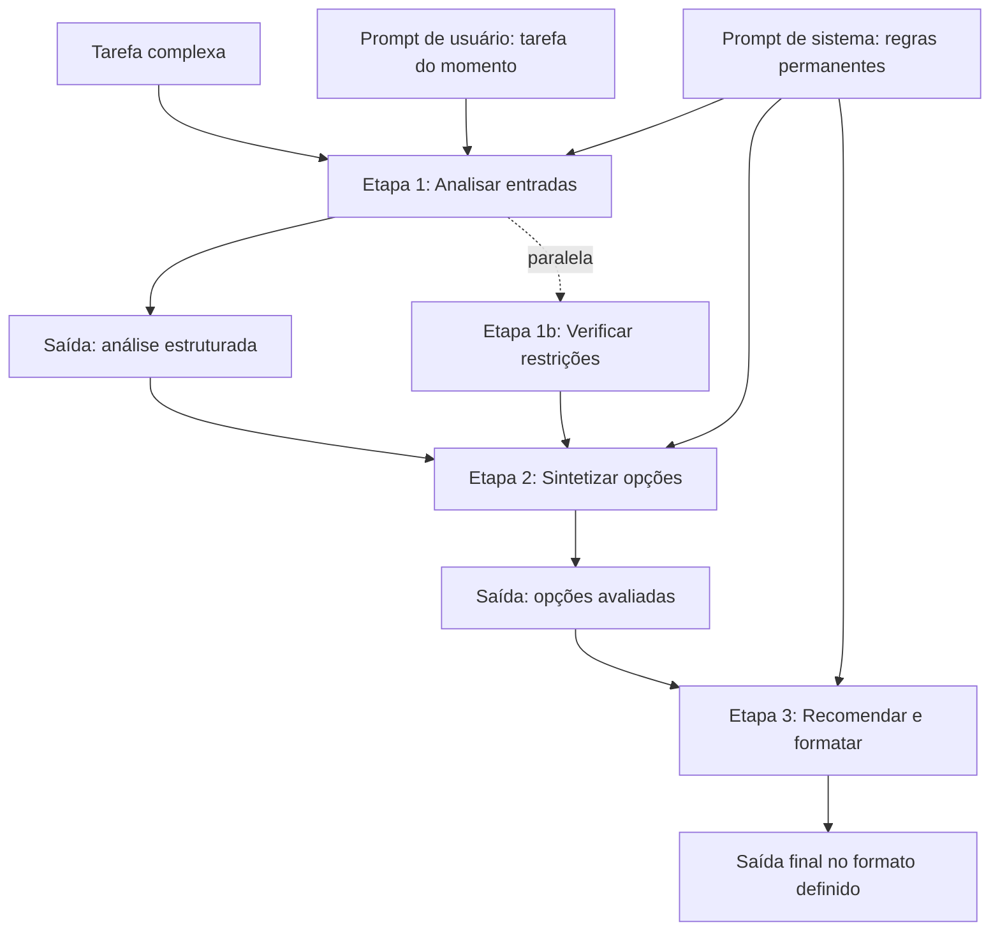

# Capítulo 5: Decomposição de Tarefas e Prompts de Sistema vs. de Usuário

## 1. Introdução

Nos Capítulos 3 e 4, você dominou as técnicas de aprendizado em contexto e de raciocínio passo a passo [19]. Agora vamos combinar e arquitetar: a decomposição de tarefas — dividir problemas grandes em etapas — e a hierarquia de prompts de sistema vs. de usuário [4]. A tese deste capítulo é que tarefas complexas não cabem em um único prompt — e que a arquitetura do prompt é a arquitetura da tarefa [1].

Este capítulo tem três objetivos. Primeiro, dominar a decomposição de tarefas: quando dividir, como dividir e como orquestrar as partes [2]. Segundo, entender a hierarquia de mensagens: o que vive no prompt de sistema e o que vive no de usuário [11]. Terceiro, combinar as duas: um sistema de prompts que escala de tarefas simples a fluxos completos [4]. Ao final, você arquitetará prompts como quem arquiteta software — por camadas [1].

## 2. Explica

### 2.1 Por Que Tarefas Complexas Não Cabem em Um Prompt

Um único prompt tem limites práticos e conceituais [2]. Praticamente: contexto finito, atenção que degrada, resposta limitada — o context rot do Livro 1 [8]. Conceitualmente: um prompt que pede uma tarefa complexa — "analise este projeto e proponha melhorias e implemente e teste" — produz uma resposta difusa, porque o modelo não sabe onde priorizar [2]. A tarefa complexa não é uma instrução — é um programa [5].

A solução é a decomposição: dividir a tarefa grande em etapas pequenas, cada uma com seu prompt [2]. O modelo executa cada etapa com foco — e o resultado das etapas se combina [2]. Essa é a mesma lógica dos módulos do Livro 1: dividir para dominar [5]. O prompt de uma etapa é mais preciso, mais testável e mais barato que o prompt monólito [2].

### 2.2 O Método da Decomposição

A decomposição segue um método de três passos [2]. Primeiro, mapear: listar as sub-tarefas da tarefa grande — em ordem de dependência [2]. Segundo, especificar: para cada sub-tarefa, definir entrada, processamento e saída — o contrato da etapa [2]. Terceiro, orquestrar: conectar as etapas — a saída de uma vira entrada da outra [2]. O resultado é um pipeline de prompts, não um prompt [2].

O método tem duas decisões críticas [2]. A primeira é o tamanho da etapa: pequena demais, o overhead de chamadas explode; grande demais, a etapa vira um prompt monólito [2]. A segunda é a interface entre etapas: o formato da saída de uma etapa precisa ser consumível pela próxima — o elo que o formato de saída do Capítulo 2 garante [1]. A decomposição bem feita é um pipeline com contratos [1].

### 2.3 A Orquestração: Sequencial, Paralela e em Árvore

As etapas decompostas se combinam em padrões de orquestração [4]. O padrão sequencial: cada etapa depende da anterior — análise, depois síntese, depois formatação [4]. O padrão paralelo: etapas independentes executam juntas — análise de três dimensões, uma por etapa [4]. O padrão em árvore: uma etapa de síntese combina várias sub-análises [4]. A escolha do padrão segue a dependência entre etapas [4].

A orquestração é o germe dos agentes da Parte III [4]. Um agente que planeja, executa e observa é, estruturalmente, uma orquestração de etapas [4]. O que este capítulo faz à mão — dividir e conectar prompts — os harnesses automatizam [4]. A habilidade de orquestrar é a ponte entre a engenharia de prompt e a engenharia de agentes [1].

### 2.4 A Hierarquia de Mensagens: Sistema, Desenvolvedor e Usuário

A segunda metade do capítulo é a hierarquia de mensagens [11]. As APIs modernas estruturam a conversa em mensagens com papéis [11]. A mensagem de sistema define o comportamento persistente — o papel, as regras, as restrições [11]. A mensagem do usuário é a entrada transacional — a tarefa do momento [1]. Entre elas, a API da OpenAI oferece a mensagem de desenvolvedor — uma camada de autoridade intermediária [11].

A hierarquia é o mecanismo de precedência: o sistema tem autoridade sobre o usuário [11]. Quando o usuário tenta sobrepor uma regra do sistema, a precedência do sistema resiste — a defesa arquitetural contra a injeção [9]. O profissional usa a hierarquia deliberadamente: o que é permanente no sistema, o que é da tarefa no usuário [11].

### 2.5 O Prompt de Sistema: a Constituição do Comportamento

O prompt de sistema é a constituição do comportamento do modelo — e merece o mesmo cuidado que a anatomia do Capítulo 2 [11]. Um bom prompt de sistema contém: o papel (quem o modelo é), as regras (o que sempre fazer e nunca fazer), o formato (o padrão de resposta) e o escopo (o que o modelo pode e não pode fazer) [11]. E um mau prompt de sistema é vago — "seja útil" — ou rígido demais — regras que travam o modelo [3].

A Anthropic recomenda zonas de altitude no prompt de sistema [3]. A alta altitude: os princípios — o que o modelo é e valoriza [3]. A média: as políticas — as regras de comportamento [3]. A baixa: os detalhes — os exemplos e formatos [3]. A organização em zonas evita o prompt de sistema como bloco amorfo — e facilita a manutenção [3].

### 2.6 O Prompt de Usuário: a Transação do Momento

O prompt de usuário é a transação — a tarefa específica que o modelo executa agora [1]. O prompt de usuário bem projetado segue a anatomia do Capítulo 2: instrução clara, contexto necessário, formato definido [1]. E o prompt de usuário mal projetado tenta fazer o trabalho do sistema — repetir regras, impor o papel — o que desperdiça tokens e cria inconsistência [1].

A divisão de trabalho entre sistema e usuário é a regra de ouro da hierarquia [11]. O sistema: o que vale para toda a conversa [11]. O usuário: o que vale para esta tarefa [1]. Quando a mesma regra aparece nos dois, a redundância cria risco de conflito [11]. O profissional pergunta a cada regra: é permanente? Vai para o sistema. É da tarefa? Vai para o usuário [11].

### 2.7 A Decomposição no Contexto dos Agentes

A decomposição e a hierarquia se encontram no contexto dos agentes [4]. O agente moderno tem: um prompt de sistema — o papel, as regras e as ferramentas; e uma sequência de tarefas — cada uma um prompt de usuário orquestrado [4]. O harness do agente decompõe o objetivo em etapas, monta o prompt de cada etapa e valida o resultado [4]. A arquitetura que este capítulo ensina à mão é a arquitetura que os harnesses automatizam [4].

A consequência prática: dominar a decomposição manual é o pré-requisito para dominar os harnesses [4]. Quem nunca dividiu uma tarefa em etapas não consegue avaliar se um agente dividiu bem [4]. Quem não entende a hierarquia de mensagens não consegue auditar um prompt de sistema [11]. O Capítulo 10 conectará essas habilidades à Context Engineering [3].

### 2.9 O Contrato entre Etapas

O contrato entre etapas é a peça que sustenta o pipeline [1]. Cada etapa produz uma saída — e a saída precisa ser consumível pela próxima [1]. O contrato define: o formato da saída, os campos esperados e o que a próxima etapa assume [1]. Sem contrato, a saída de uma etapa vira a bagunça de entrada da outra [1]. Com contrato, o pipeline flui [1].

O contrato tem dois níveis [2]. O nível do formato: JSON com campos definidos — a saída parseável [2]. O nível do conteúdo: o significado dos campos — o que cada campo representa [2]. O primeiro é verificável por código; o segundo, por interpretação [9]. O profissional define os dois — e valida os dois nos elos [2]. O contrato entre etapas é a aplicação do formato de saída do Capítulo 2 ao pipeline inteiro [1].

### 2.10 A Orquestração e o Erro

A orquestração introduz uma dimensão nova: o tratamento de erro [2]. No prompt único, o erro é uma resposta errada [2]. No pipeline, o erro pode estar em qualquer etapa — e se propagar [2]. O profissional projeta a orquestração com tratamento de erro [2]. A validação nos elos — a técnica do Capítulo 7 [12]. O retry da etapa falha — com limite [2]. E o fallback — a etapa alternativa ou a entrega parcial [2].

A orquestração com erro é o esqueleto dos harnesses [4]. O harness de um agente não executa etapas cegas — valida, tenta de novo e decide [4]. E o que o Capítulo 7 formaliza — a validação nos elos — é a disciplina da orquestração [12]. O arquiteto de prompts projeta o caminho feliz e o caminho de erro [2]. O pipeline sem tratamento de erro é um pipeline que quebra em produção [2].

### 2.11 A Hierarquia e a Injeção

A hierarquia de mensagens é também a primeira defesa contra a injeção de prompt [9]. Quando as regras vivem no sistema, o usuário que tenta sobrepô-las enfrenta a precedência [11]. A injeção direta — "ignore suas instruções" — na mensagem do usuário não derruba a autoridade do sistema [9]. E a injeção indireta — instruções escondidas em dados — é mitigada pela delimitação [9]. A hierarquia não é só organização — é segurança [9].

O Capítulo 9 aprofundará a injeção [9]. Aqui fica o princípio: a arquitetura da hierarquia é a arquitetura da defesa [11]. O profissional que estrutura o sistema com autoridade clara reduz a superfície de ataque [9]. E o profissional que ignora a hierarquia — todas as regras no usuário — expõe o sistema [9]. A arquitetura correta é a segurança por construção [9].

### 2.8 Os Padrões de Erro da Arquitetura de Prompts

A arquitetura de prompts tem padrões de erro recorrentes que o profissional reconhece [2]. O primeiro é o prompt monólito: tudo em uma mensagem, sem sistema [2]. O segundo é o sistema inchado: todas as regras possíveis no sistema, inclusive as da tarefa [3]. O terceiro é a etapa sem contrato: a decomposição produz etapas cujas saídas não se conectam [1]. O quarto é a redundância: a mesma regra no sistema e no usuário, em versões diferentes [11].

Cada padrão de erro tem um sintoma e uma correção [2]. O monólito produz respostas difusas — decomponha [2]. O sistema inchado produz rigidez — mova o transacional para o usuário [3]. A etapa sem contrato quebra o pipeline — defina o formato de saída [1]. A redundância produz conflito — escolha a camada dona da regra [11].

## 3. Ilustra

### 3.1 A Analogia da Obra de Construção

A melhor analogia da decomposição é a obra de construção [1]. Ninguém constrói um prédio com um pedido: "construa um prédio" [1]. A obra é decomposta em etapas — fundação, estrutura, instalações, acabamento — cada uma com seu contrato [1]. A fundação não depende do acabamento; o acabamento depende da estrutura [1]. A orquestração da obra é a sequência das etapas com suas dependências [2].

A analogia se estende à hierarquia [11]. O código de obras é o prompt de sistema — as regras permanentes que valem para todas as etapas [11]. A ordem de serviço de cada etapa é o prompt de usuário — a tarefa do momento [11]. A obra funciona quando o código de obras é estável e as ordens de serviço são específicas [11]. E a obra quebra quando o código de obras muda a cada etapa — ou quando a ordem de serviço tenta reescrever o código [9].

### 3.2 O Diagrama da Decomposição



O diagrama condensa o capítulo: a tarefa complexa vira um pipeline de etapas, cada uma com entrada, processamento e saída [2]. O prompt de sistema governa todas as etapas — as regras permanentes [11]. O prompt de usuário carrega a tarefa específica [1]. E as saídas estruturadas — o formato do Capítulo 2 — conectam as etapas [1].

### 3.3 O Regente e os Músicos

Uma segunda analogia: o regente e os músicos [4]. O regente não toca todos os instrumentos — orquestra [4]. A partitura é a decomposição: cada instrumento tem a sua parte [4]. O regente — o orquestrador — coordena os tempos e as entradas [4]. E os músicos — as etapas — executam suas partes com foco [4].

A analogia tem uma lição sobre a hierarquia [11]. O regente define a interpretação — o sistema; os músicos executam — as etapas [11]. Quando o regente muda a interpretação a cada compasso, a orquestra se confunde [11]. Quando a partitura é a mesma para todos, a coordenação funciona [11]. O arquiteto de prompts é o regente: define o sistema estável e orquestra as etapas [4].

## 4. Técnica

### 4.1 O Decompositor de Tarefas

A técnica central do capítulo é o decompositor — um script que transforma uma tarefa complexa em etapas com contratos [2]:

```python
class Etapa:
    def __init__(self, nome, instrucao, formato_saida):
        self.nome = nome
        self.instrucao = instrucao
        self.formato_saida = formato_saida

    def montar_prompt(self, entrada):
        return (f"## INSTRUÇÃO\n{self.instrucao}\n\n"
                f"## ENTRADA\n{entrada}\n\n"
                f"## FORMATO DE SAÍDA\n{self.formato_saida}")


def decompor_tarefa(tarefa):
    """Decompõe uma tarefa complexa em etapas com contratos explícitos."""
    print(f"=== Decomposição da tarefa ===\n{tarefa}\n")
    etapas = [
        Etapa("análise",
              "Analise a entrada e extraia os fatos relevantes.",
              "Lista numerada de fatos, um por linha."),
        Etapa("síntese",
              "Sintetize as opções a partir dos fatos, avaliando cada uma.",
              "JSON com campos: opcao, prós, contras, viabilidade (1-5)."),
        Etapa("recomendação",
              "Recomende a melhor opção com justificativa, no formato pedido.",
              "JSON com campos: recomendacao, motivo, risco."),
    ]
    for i, etapa in enumerate(etapas, 1):
        print(f"Etapa {i}: {etapa.nome}")
        print(f"  Instrução: {etapa.instrucao}")
        print(f"  Formato de saída: {etapa.formato_saida}")
    print("\nOrquestração: análise -> síntese -> recomendação (sequencial)")
    return etapas


if __name__ == "__main__":
    decompor_tarefa("Decidir se devemos mudar para um provedor de nuvem novo, "
                    "considerando custo, desempenho e risco de migração.")
```

O decompositor materializa o método: mapear, especificar e orquestrar [2]. Cada etapa tem contrato — instrução, entrada e formato de saída [1]. E a orquestração conecta as saídas [2]. Na prática, cada etapa é uma chamada separada — e a saída de uma alimenta a entrada da próxima [2].

### 4.2 O Montador de Sistema e Usuário

A técnica da hierarquia: montar a conversa com sistema e usuário separados [11]:

```python
def montar_conversa(sistema, usuario, regras_adicionais=None):
    """Monta uma conversa estruturada com prompt de sistema e usuário."""
    print("=== MENSAGEM DE SISTEMA (persistente) ===")
    print(sistema)
    if regras_adicionais:
        print("\n--- REGRAS ADICIONAIS ---")
        for regra in regras_adicionais:
            print(f"- {regra}")
    print("\n=== MENSAGEM DE USUÁRIO (transacional) ===")
    print(usuario)
    print("\n---")
    print("Precedência: as regras do sistema têm autoridade sobre o usuário [11].")


if __name__ == "__main__":
    sistema = (
        "Você é um analista de crédito sênior. Regras: baseie-se apenas "
        "nos dados fornecidos; não invente histórico; emita decisão com "
        "justificativa; responda em JSON com campos decisao, motivo, score."
    )
    usuario = (
        "Renda mensal: R$ 6.000. Despesas fixas: R$ 3.200. "
        "Histórico: 2 atrasos em 24 meses. Valor solicitado: R$ 15.000."
    )
    montar_conversa(sistema, usuario)
```

O montador mostra a divisão de trabalho [11]. O sistema carrega o permanente — papel, regras, formato [11]. O usuário carrega o transacional — os dados da tarefa [1]. A mesma estrutura serve para qualquer tarefa: muda-se o usuário, o sistema permanece [11].

### 4.3 O Pipeline de Etapas com Validação

A aplicação de produção da decomposição: um pipeline que executa etapas e valida as saídas no elo [2]:

```python
class PipelineDeEtapas:
    def __init__(self):
        self.etapas = []

    def adicionar(self, nome, processar, validar=None):
        self.etapas.append({"nome": nome, "processar": processar,
                            "validar": validar})

    def executar(self, entrada):
        dado_atual = entrada
        print("=== Execução do pipeline ===")
        for i, etapa in enumerate(self.etapas, 1):
            print(f"\n-- Etapa {i}: {etapa['nome']}")
            dado_atual = etapa["processar"](dado_atual)
            print(f"   Saída: {str(dado_atual)[:80]}")
            if etapa["validar"] and not etapa["validar"](dado_atual):
                print("   FALHA NA VALIDAÇÃO — pipeline interrompido")
                return None
        print("\nPipeline concluído com sucesso.")
        return dado_atual


def validar_lista(saida):
    return isinstance(saida, list) and len(saida) > 0


def validar_json(saida):
    return isinstance(saida, dict) and "opcao" in saida


if __name__ == "__main__":
    pipeline = PipelineDeEtapas()
    pipeline.adicionar("extrair_fatos", lambda t: t.split("; "), validar_lista)
    pipeline.adicionar("escolher_opcao",
                       lambda fatos: {"opcao": fatos[0], "viabilidade": 4},
                       validar_json)
    pipeline.executar("custo alto; desempenho bom; risco médio")
```

O pipeline mostra a decomposição com validação nos elos [2]. Cada etapa processa e valida — e a falha de validação interrompe o fluxo [2]. Esse padrão — etapas com contratos e portões — é a estrutura dos harnesses de agentes que a série aborda na Parte III [4]. O que aqui é manual, lá é automatizado [4].

### 4.4 O Verificador de Redundância Sistema/Usuário

O fechamento técnico do capítulo: detectar a redundância entre sistema e usuário — o padrão de erro da seção 2.8 [11]:

```python
def verificar_redundancia(sistema, usuario):
    """Detecta regras repetidas entre sistema e usuário."""
    def extrair_regras(texto):
        return set(r.strip().lower() for r in texto.split(";")
                   if r.strip() and len(r.strip()) > 5)

    regras_sistema = extrair_regras(sistema)
    regras_usuario = extrair_regras(usuario)
    sobreposicao = regras_sistema & regras_usuario
    print("=== Verificação de redundância ===")
    print(f"Regras no sistema: {len(regras_sistema)}")
    print(f"Regras no usuário: {len(regras_usuario)}")
    if sobreposicao:
        print(f"SOBREPOSIÇÃO ({len(sobreposicao)}):")
        for regra in sobreposicao:
            print(f"  - {regra[:60]}")
        print("Recomendação: deixe a regra em uma única camada.")
    else:
        print("Nenhuma sobreposição detectada. Divisão de trabalho limpa.")
    return sobreposicao


if __name__ == "__main__":
    sistema = "responda em JSON; não invente dados; baseie-se no contexto"
    usuario = "responda em JSON com os dados fornecidos; o contexto segue abaixo"
    verificar_redundancia(sistema, usuario)
```

O verificador materializa a regra de ouro da hierarquia: uma regra, uma camada [11]. A sobreposição detectada aponta o conflito potencial [11]. E a correção — escolher a camada dona da regra — mantém o sistema estável e o usuário enxuto [11].

## 5. Aplica

### 5.1 Onde Isso Vive no Mundo Real

A decomposição e a hierarquia são a arquitetura de todo sistema de IA em produção [4]. O assistente de suporte decompõe: entender o problema, buscar a política, montar a resposta [4]. O agente de código decompõe: ler o repositório, planejar a mudança, implementar, testar [4]. E todos usam a hierarquia: o sistema com as regras permanentes, o usuário com a tarefa [11].

O padrão de 2026 mostra a evolução: os harnesses de agentes são, estruturalmente, orquestradores de etapas com prompt de sistema estável [4]. O que os desenvolvedores faziam à mão — dividir tarefas e montar prompts — virou engenharia de harness [4]. Dominar a decomposição manual é o pré-requisito para projetar harnesses — e é essa a trajetória da série [1].

### 5.2 O Erro Comum do Iniciante

O erro clássico é o prompt monólito: despejar a tarefa complexa inteira em uma mensagem [2]. O resultado: respostas difusas, difíceis de validar e caras de corrigir [2]. O segundo erro é a hierarquia ignorada: todas as regras no usuário, repetidas a cada tarefa — tokens desperdiçados e inconsistência [11]. O terceiro erro é a etapa sem contrato: decompor, mas sem definir o formato da saída de cada etapa — o pipeline quebra no elo [1].

A correção — e aqui está o diferencial que separa o profissional — é a arquitetura deliberada [2]. Decompor com contratos, separar sistema de usuário e validar nos elos [2]. O decompositor e o montador das seções 4.1 e 4.2 são as ferramentas do hábito [2]. A tarefa complexa não é um prompt grande — é um pipeline de prompts pequenos [1].

### 5.3 O Padrão Profissional em 2026

O padrão profissional combina a decomposição e a hierarquia em uma arquitetura de camadas [4]. A camada de sistema: as regras permanentes, organizadas em zonas [3]. A camada de tarefa: o usuário transacional com a anatomia do Capítulo 2 [1]. A camada de etapas: a decomposição com contratos e validação nos elos [2]. E a camada de orquestração: a sequência de execução [4].

O resultado é um sistema de prompts que escala — tarefas simples com um prompt, tarefas complexas com um pipeline [2]. E é essa mesma arquitetura que os Capítulos 6 e 7 vão levar à produção: versionar, testar e governar o sistema [12]. A decomposição está dominada; agora vamos produzir [1].

### 5.4 O Inventário do Capítulo

Vale consolidar o capítulo em um inventário verificável [1]. Primeiro, a decomposição: dividir a tarefa complexa em etapas com contratos [2]. Segundo, os padrões de orquestração: sequencial, paralelo e em árvore [4]. Terceiro, a hierarquia: sistema para o permanente, usuário para o transacional [11]. Quarto, os padrões de erro: monólito, sistema inchado, etapa sem contrato e redundância [2]. Quinto, a arquitetura: o prompt como sistema de camadas [1].

Cada item tem um teste [2]. Para a decomposição: você divide uma tarefa real em etapas com contratos? [2] Para a orquestração: você escolhe o padrão pela dependência? [4] Para a hierarquia: você separa o permanente do transacional? [11] Para os padrões de erro: você os reconhece num sistema real? [2] O inventário com testes é a base da arquitetura [1].

### 5.5 A Decomposição como Método de Diagnóstico

A decomposição não é só para construir — é para diagnosticar [2]. Quando um sistema de prompts falha, o profissional decompõe a falha [2]. Qual etapa produziu a saída errada? [2] O contrato da etapa falhou? [1] A orquestração conectou errado? [2] O sistema contradisse o usuário? [11] A decomposição transforma a falha opaca em falha localizada [2].

O diagnóstico por decomposição é a mesma disciplina do Capítulo 2 do Livro 1 — a leitura de código aplicada a sistemas de prompts [5]. O profissional não pergunta "por que o sistema errou?" — pergunta "qual etapa errou, e por quê?" [2]. E a localização da falha orienta a correção: a etapa, o contrato ou a orquestração [2]. A decomposição é a lente de diagnóstico do arquiteto de prompts [1].

### 5.6 A Arquitetura como Vocabulário da Série

A arquitetura deste capítulo é o vocabulário da orquestração que a série usa [4]. Quando os volumes seguintes falarem em "harness", "loop", "subagente" ou "orquestrador", você verá a decomposição e a hierarquia por trás [4]. O harness orquestra etapas [4]. O loop repete a decomposição até o objetivo [4]. O subagente é uma etapa com contexto próprio [4]. E o orquestrador é o arquiteto de prompts automatizado [4].

A conexão é o valor do capítulo [4]. Quem dominou a decomposição manual entende o harness [4]. Quem dominou a hierarquia entende o prompt de sistema do agente [11]. E quem dominou os padrões de erro audita os sistemas agênticos [2]. A Parte III da série constrói sobre exatamente esta arquitetura [4]. O que aqui é feito à mão, lá é automatizado [4].

### 5.7 A Governança da Escrita: Quem Pode Alterar o Prompt de Sistema

Uma vez que o prompt de sistema se torna o documento de maior precedência da aplicação, surge uma questão organizacional inevitável: quem tem permissão para alterá-lo [11][12]. O prompt de sistema é, na prática, o código-fonte do comportamento da aplicação — e alterá-lo sem processo é como alterar código de produção sem code review [11][12]. Esta subseção sistematiza a governança da escrita de prompts de sistema, uma disciplina que separa equipes maduras de equipes que acumulam comportamento imprevisível [12][13].

O primeiro princípio é a **unificação do documento**. Organizações maduras tratam o prompt de sistema como um artefato único e versionado — um arquivo em um repositório, revisado como código — em vez de uma coleção de instruções espalhadas por configs e códigos [11][12]. O BrainTrust observa que a fragmentação do prompt de sistema é a causa mais comum de comportamento inconsistente: cada desenvolvedor adiciona uma linha aqui, uma cláusula ali, e ninguém sabe o que o documento inteiro diz [12]. O documento único, com histórico e dono, é o pré-requisito de toda governança [12][13].

O segundo princípio é o **controle de alterações**. Toda alteração no prompt de sistema deve passar por um processo análogo ao de código: proposta, revisão, teste e registro [12][13]. O Pan documenta a prática de versionamento em produção como disciplina contínua: cada versão tem um motivo registrado, um escopo definido e um responsável [13]. A revisão é particularmente importante para o prompt de sistema porque seus efeitos são globais — uma frase mal redigida degrada todas as conversas da aplicação, não apenas uma sessão [11][13].

O terceiro princípio é a **separação de escopos**. O prompt de sistema deve conter o que é global e estável; o que é específico da sessão — dados do usuário, contexto da conversa — deve vir do prompt de usuário ou da composição de contexto [3][11]. Misturar os dois escopos é um erro de arquitetura: a sessão polui o sistema com ruído que degrada o comportamento em todas as conversas [3][11]. A documentação da Anthropic sobre system prompts é explícita: o sistema define regras estáveis; o usuário fornece a instância [11]. Essa separação também tem implicação de segurança — conteúdo do usuário nunca deve reescrever regras do sistema, ponto que o Capítulo 9 desenvolve com a injeção de prompt [9][11].

O quarto princípio é a **medição de impacto**. Toda alteração no prompt de sistema deve ser medida antes e depois, com a amostragem e o protocolo do Capítulo 8 [13][14][15]. A tentação de ajustar o prompt de sistema na sexta-feira à noite "porque ficou melhor" é exatamente o comportamento que a governança impede [12][13]. A prática profissional é: alteração registrada, amostra medida, resultado comparado com a linha de base, e só então a alteração entra em produção [13][15]. O GrowthBook documenta o mesmo protocolo para experimentos de produção: sem medição, a alteração é uma aposta [17].

O quinto princípio é a **documentação de intenção**. Um prompt de sistema sem comentários explicando por que cada cláusula existe é dívida técnica na forma mais pura [12][13]. A prática recomendada é comentar o prompt como se comenta código: cada bloco de instruções carrega seu racional e a referência ao experimento ou incidente que o justificou [12][13]. Quando um novo membro da equipe herda o prompt de sistema, é a documentação de intenção que permite entender, manter e melhorar sem quebrar [12][13]. A governança da escrita transforma o prompt de sistema de segredo tribal em ativo de engenharia auditável [12][13].

### 5.8 Padrões de Composição: Prompt de Sistema, Template e Código Juntos

A separação entre prompt de sistema e prompt de usuário é o início da arquitetura — não o fim. Aplicações profissionais compõem o contexto de cada chamada a partir de três fontes: o prompt de sistema (estável), templates de usuário (estrutura da tarefa) e dados do código (instância concreta) [3][6][11]. Esta subseção apresenta os padrões de composição que consolidaram na prática profissional, preparando a transição para a engenharia de contexto da Parte II [3][4].

O primeiro padrão é o **template parametrizado**. Em vez de construir o prompt de usuário por concatenação de strings no código — frágil e impossível de versionar —, o profissional usa templates com campos: `{{tarefa}}`, `{{contexto}}`, `{{restrições}}` [6][11]. O template é o documento; o código preenche os campos; o resultado é a chamada [6]. Esse padrão separa o conteúdo (o template, que pode ser revisado e versionado) da mecânica (o código, que preenche dados) [6][12]. O template parametrizado é o embrião do que a Parte II formaliza como composição de contexto [3].

O segundo padrão é a **seção ancorada**. O prompt composto é dividido em seções nomeadas — PAPEL, CONTEXTO, TAREFA, EXEMPLOS, FORMATO — cada uma com função definida [11][16]. A ancoragem por seções torna o prompt legível, auditável e extensível: o revisor sabe onde procurar a regra de formato, o novo desenvolvedor sabe onde adicionar contexto, e o modelo recebe estrutura em vez de um bloco amorfo [11][16]. O guia do Google Cloud recomenda exatamente esse tipo de estruturação para reduzir ambiguidade [16].

O terceiro padrão é a **camada de dados**. O contexto da chamada não vem apenas do template — vem de dados recuperados: o histórico da conversa, o perfil do usuário, o resultado de uma busca na base de conhecimento [3][4]. A composição profissional combina o template com uma camada de dados que injeta o contexto específico da sessão [3]. Esse é o ponto exato em que a engenharia de prompts encontra a engenharia de contexto: o template define a estrutura, a camada de dados define o conteúdo, e o modelo recebe uma instância rica e estruturada [3][4].

O quarto padrão é o **contrato de saída**. Quando o código consome a resposta, a saída precisa de contrato — JSON com esquema validado, campos obrigatórios, tratamento de erro [6][10]. O padrão é: o prompt especifica o formato; o código valida contra o esquema; a falha de validação aciona re-execução ou tratamento explícito [6][10]. O contrato de saída transforma a chamada ao modelo em uma operação de software confiável — e é o que permite integrar prompts a sistemas de produção sem surpresas [6][10].

O quinto padrão é o **pipeline de composição testável**. A composição — template + dados + sistema + saída — é testada como unidade: os testes do Capítulo 4 (ou o equivalente desta obra) cobrem o template, o preenchimento de dados e a validação de saída [9][14]. A Testing Library formaliza o princípio: o que se testa é o comportamento observável, não a implementação [9]. No contexto de prompts, isso significa testar o que o usuário vê — a resposta — contra casos representativos [9][14]. A composição testável fecha o ciclo: governança (quem altera), arquitetura (como compõe) e verificação (como valida) — os três pilares que a Parte III converte em disciplina de produção [3][13].

### 5.9 A Orquestração como Hábito: Quando a Técnica Vira Sistema

A decomposição de tarefas, os prompts de sistema e a composição deste capítulo têm um ponto de convergência: todos empurram o trabalho para fora do texto do prompt e para dentro de um sistema que orquestra [3][4]. Esta subseção consolida a orquestração como o hábito profissional que transforma a técnica em sistema — e prepara a Parte III da série, dedicada ao harness [3][4]. O princípio é simples: cada vez que o engenheiro percebe que o prompt está fazendo o trabalho que o código poderia fazer, ele move a responsabilidade para o código [3][6].

O primeiro hábito é **identificar a mecânica repetível**: quando o mesmo trecho de lógica aparece dentro do prompt — formatação, validação, seleção, iteração —, ele deve sair do prompt e virar código [6][14]. A mecânica repetível em prompt é débito técnico disfarçado de inteligência [6][13]. O hábito é o reflexo: texto para o que o modelo faz bem; código para o que o código faz bem [6][3].

O segundo hábito é **externalizar o conhecimento**: quando o prompt carrega conhecimento — políticas, dados, formatos —, o conhecimento deve vir de fontes externas: arquivos, bases, APIs [3][4]. O hábito é o reflexo de não escrever conhecimento no prompt, mas referenciá-lo [3]. A recuperação sob demanda substitui o texto estático [3][4].

O terceiro hábito é **programar a validação**: quando a resposta precisa ser conferida, a conferência é programada — schema, testes, critérios — e não confiada à leitura humana [6][14]. O hábito é o reflexo de tratar a saída do modelo como dado de um sistema, que deve ser validado antes de ser usado [6][14].

O quarto hábito é **instrumentar a decisão**: quando o sistema escolhe entre caminhos — qual ferramenta usar, qual trecho recuperar, qual ação executar —, a decisão é registrada e medida [14][15]. O hábito é o reflexo de tratar cada decisão do sistema como um evento observável [14][15].

O quinto hábito é **revisar a fronteira periodicamente**: a cada revisão, o engenheiro pergunta onde está a fronteira entre prompt e código — e se ela está no lugar certo [3][13]. O hábito é o reflexo de manter a fronteira explícita e deliberada [3][13]. A orquestração como hábito é a prática diária da tese central da série: o texto do prompt é a superfície; o sistema que o envolve é a substância [3][4]. O engenheiro que desenvolve esses hábitos não apenas escreve melhores prompts — ele constrói sistemas onde os prompts são apenas uma das peças, auditável e substituível [3][13].

## 6. Conclusão

Neste capítulo, você dominou a arquitetura de prompts: a decomposição, que divide tarefas complexas em etapas com contratos [2]; e a hierarquia, que separa o permanente (sistema) do transacional (usuário) [11]. Você aprendeu os padrões de orquestração — sequencial, paralelo e em árvore — e os padrões de erro — monólito, sistema inchado, etapa sem contrato e redundância [4][2].

Resumindo em três pontos: primeiro, tarefa complexa não cabe em um prompt — ela vira um pipeline de etapas [2]; segundo, o sistema é a constituição — estável e de alta autoridade — e o usuário é a transação [11]; terceiro, os contratos entre etapas são o que mantém o pipeline inteiro funcionando [1]. Com esses três pontos, você arquiteta prompts como quem arquiteta software [1].

### O Desafio Deste Capítulo

O desafio em três níveis. Nível um: decomponha uma tarefa real sua com o decompositor da seção 4.1 e escreva o contrato de cada etapa [2]. Nível dois: execute o pipeline da seção 4.3 com uma API real e valide as saídas nos elos [2]. Nível três: audite um prompt de sistema real com o verificador de redundância da seção 4.4 — e elimine a sobreposição [11]. Os três níveis exercitam decomposição, orquestração e hierarquia [1].

No próximo capítulo, vamos enfrentar o problema da escala: por que a engenharia de prompt sozinha não escala em produção — a estocasticidade, o versionamento, o teste e a consistência entre equipes [12]. A arquitetura está dominada; agora vamos produzi-la com disciplina [1].

## 7. Referências Bibliográficas

[1] OPENAI. Prompt engineering. Disponível em: https://developers.openai.com/api/docs/guides/prompt-engineering. Acesso em: 5 ago. 2026.

[2] OPENAI. Best practices for prompt engineering with the OpenAI API. Disponível em: https://help.openai.com/en/articles/6654000-best-practices-for-prompt-engineering-with-openai-api. Acesso em: 5 ago. 2026.

[3] ANTHROPIC. Effective context engineering for AI agents. Disponível em: https://www.anthropic.com/engineering/effective-context-engineering-for-ai-agents. Acesso em: 5 ago. 2026.

[4] ANTHROPIC. Building Effective AI Agents. Disponível em: https://www.anthropic.com/engineering/building-effective-agents. Acesso em: 5 ago. 2026.

[5] KARPATHY, Andrej. Software 3.0: Software in the Age of AI. Disponível em: https://www.latent.space/p/s3. Acesso em: 5 ago. 2026.

[6] OPENAI. Function Calling Guide. Disponível em: https://developers.openai.com/api/docs/guides/function-calling. Acesso em: 5 ago. 2026.

[7] WENG, Lilian. Extrinsic Hallucinations in LLMs. Disponível em: https://lilianweng.github.io/posts/2024-07-07-hallucination/. Acesso em: 5 ago. 2026.

[8] CHROMA. Context Rot: How Increasing Input Tokens Impacts LLM Performance. Disponível em: https://www.trychroma.com/research/context-rot. Acesso em: 5 ago. 2026.

[9] OWASP. Prompt Injection: OWASP Top 10 for LLM Applications. Disponível em: https://owasp.org/www-project-top-10-for-large-language-model-applications/. Acesso em: 5 ago. 2026.

[10] WANG, Xuezhi; et al. Self-Consistency Improves Chain of Thought Reasoning in Language Models. 2022. Disponível em: https://arxiv.org/abs/2203.11171. Acesso em: 5 ago. 2026.

[11] ANTHROPIC. System prompts (documentação Claude). Disponível em: https://docs.anthropic.com/claude/docs/system-prompts. Acesso em: 5 ago. 2026.

[12] BRAINTRUST. What is prompt versioning? Best practices for iteration without breaking production. Disponível em: https://www.braintrust.dev/articles/what-is-prompt-versioning. Acesso em: 5 ago. 2026.

[13] PAN, Tian. Prompt Versioning in Production: The Engineering Discipline Teams Learn the Hard Way. Disponível em: https://tianpan.co/blog/2026-04-09-prompt-versioning-production-llm. Acesso em: 5 ago. 2026.

[14] LANGCHAIN. Evaluating LLM Systems: Metrics and Best Practices. Disponível em: https://blog.langchain.dev/evaluating-llm-platforms/. Acesso em: 5 ago. 2026.

[15] CHANG, Yupeng; et al. A Survey on Evaluation of Large Language Models. 2023. Disponível em: https://arxiv.org/abs/2307.03109. Acesso em: 5 ago. 2026.

[16] GOOGLE CLOUD. Generative AI Prompt Design Guide. Disponível em: https://cloud.google.com/vertex-ai/generative-ai/docs/learn/prompts/prompt-design. Acesso em: 5 ago. 2026.

[17] GROWTHBOOK. How to test multiple prompts in production (without chaos). Disponível em: https://www.growthbook.io/insights/how-test-multiple-prompts-production-without-chaos. Acesso em: 5 ago. 2026.

[18] BROWN, Tom B.; et al. Language Models are Few-Shot Learners. 2020. Disponível em: https://arxiv.org/abs/2005.14165. Acesso em: 5 ago. 2026.

[19] WEI, Jason; et al. Chain-of-Thought Prompting Elicits Reasoning in Large Language Models. 2022. Disponível em: https://arxiv.org/abs/2201.11903. Acesso em: 5 ago. 2026.

[20] KOJIMA, Takeshi; et al. Large Language Models are Zero-Shot Reasoners. 2022. Disponível em: https://arxiv.org/abs/2205.11916. Acesso em: 5 ago. 2026.
