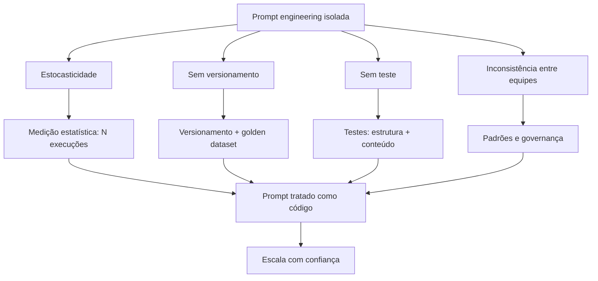

# Capítulo 6: Por Que Prompt Engineering Sozinha Não Escala

## 1. Introdução

Nos primeiros cinco capítulos, você dominou a arte e a ciência do prompt: a anatomia, o few-shot, o chain-of-thought e a arquitetura de prompts [1][19]. Agora vamos enfrentar a pergunta que define a transição de amador para profissional: por que a engenharia de prompt sozinha não escala em produção [12]. A tese deste capítulo é que o prompt é necessário, mas não suficiente — e que a escala exige disciplina de engenharia de software [12].

Este capítulo tem três objetivos. Primeiro, entender os quatro limites da prompt engineering isolada: estocasticidade, versionamento, teste e consistência entre equipes [12]. Segundo, ver cada limite em ação — com exemplos de falhas reais [13]. Terceiro, estabelecer a mentalidade: o prompt como código — que precisa de CI, versionamento e governança [12]. Ao final, você saberá diagnosticar por que um sistema de prompts quebrou — e por que a disciplina de produção é o próximo degrau [13].

## 2. Explica

### 2.1 O Limite da Estocasticidade

O primeiro limite é a estocasticidade — a variação inerente da amostragem que você estudou no Livro 1 [7]. O mesmo prompt, com a mesma entrada, pode produzir respostas diferentes [7]. Em um teste manual, a variação passa despercebida: você olha a resposta, parece boa, segue [7]. Em produção, a variação é um bug intermitente: o sistema funciona hoje e falha amanhã — sem nenhuma mudança no código [7].

A estocasticidade transforma a avaliação em um problema estatístico, não lógico [9]. "O prompt funciona?" não tem resposta binária — tem uma distribuição de resultados [9]. O profissional mede a distribuição — taxa de acerto sobre N execuções — em vez de julgar uma execução [9]. E é essa medição que o Capítulo 8 formaliza [14]. A estocasticidade não é um defeito a eliminar — é uma propriedade a administrar [7].

### 2.2 O Limite do Versionamento

O segundo limite é o versionamento [12]. Um prompt é um artefato que muda — e muda frequentemente [12]. "Melhorei o prompt" é uma mudança como outra qualquer — que pode melhorar uma coisa e quebrar outra [12]. Sem versionamento, a mudança é invisível e irreversível: ninguém sabe qual prompt estava em produção quando o bug aconteceu [12].

O versionamento de prompts segue os mesmos princípios do versionamento de código do Livro 1 [13]. Cada versão tem um identificador, uma data, um autor e um diff [13]. As mudanças são revisadas antes de entrar [13]. E há um golden dataset — um conjunto fixo de casos com respostas esperadas — contra o qual cada versão é avaliada [12]. O prompt versionado é um ativo; o prompt solto é um acidente esperando para acontecer [13].

### 2.3 O Limite do Teste

O terceiro limite é o teste [12]. Um prompt sem teste é um código sem teste: funciona por acaso, quebra sem aviso [12]. O teste de prompt tem três camadas [12]. A primeira é o golden dataset: casos fixos com respostas esperadas — a linha de base de regressão [12]. A segunda é o teste de estrutura: a saída tem o formato esperado — JSON válido, campos presentes [12]. A terceira é o teste de conteúdo: a saída contém o esperado — o fato, a categoria, o valor [12].

A disciplina de teste enfrenta uma dificuldade específica: a estocasticidade [9]. Um teste de prompt não pode exigir a resposta exata — pode exigir a resposta esperada com tolerância [9]. O teste de estrutura é determinístico; o teste de conteúdo é estatístico [9]. O profissional projeta os dois: o teste que falha quando o formato quebra (determinístico) e o teste que mede a taxa de acerto (estatístico) [9].

### 2.4 O Limite da Consistência entre Equipes

O quarto limite é a consistência entre equipes [12]. Em uma empresa, múltiplos times escrevem prompts — e cada time tem o seu estilo, as suas regras e o seu conhecimento [12]. O resultado: o mesmo problema tratado de formas diferentes, com qualidades diferentes [12]. E quando um time muda o modelo ou o formato, os outros quebram sem saber por quê [12].

A consistência exige padrões e governança [12]. Padrões: um template comum, uma anatomia obrigatória, um formato de saída padrão [12]. Governança: quem aprova mudanças de prompt, como são registradas, como são promovidas entre ambientes [13]. A ferramenta de governança: a esteira de promoção — dev, staging, prod — que o Capítulo 7 detalha [13]. Sem padrões, a escala multiplica a desordem [12].

### 2.5 O Prompt como Código: a Mudança de Mentalidade

A resposta aos quatro limites é uma mudança de mentalidade: tratar o prompt como código [12]. O código tem versionamento, testes, CI e revisão — e o prompt, como artefato de produção, merece o mesmo tratamento [12]. A tese é simples: se o prompt é um programa — a visão do Software 3.0 do Capítulo 1 — então ele obedece às mesmas leis da engenharia de software [5].

A mudança de mentalidade tem consequências concretas [12]. O prompt vira um arquivo versionado, não uma conversa [12]. O prompt vira um componente testado, não um texto solto [12]. O prompt vira um ativo governado, não uma preferência pessoal [13]. E o profissional vira um engenheiro de prompts — com CI, testes e revisão — em vez de um redator de prompts [12].

### 2.6 A Escala Multiplica os Limites

Os quatro limites não são independentes — a escala os multiplica [12]. Um sistema com um prompt e um usuário tolera tudo: a variação é invisível, a mudança é rara, o teste é manual [12]. Um sistema com cem prompts e mil usuários amplifica cada limite: a variação vira incidente, a mudança vira regressão, o teste manual vira gargalo [12]. A escala não cria os problemas — os expõe [12].

O profissional entende a multiplicação [12]. A disciplina de produção não é para sistemas pequenos — é a condição para sistemas grandes [12]. E a transição — do prompt manual ao prompt governado — é o tema dos Capítulos 6 e 7 [12]. Este capítulo diagnostica; o Capítulo 7 prescreve [13].

### 2.8 A Estocasticidade na Prática

A estocasticidade merece uma seção prática porque é o limite que mais surpreende [7]. O desenvolvedor testa o prompt uma vez — a resposta é boa — e assume que funciona [7]. Em produção, a resposta varia — e o bug intermitente é o mais difícil de diagnosticar [7]. O profissional antecipa a estocasticidade no design: a avaliação é estatística desde o início [9]. E a tolerância é parte do contrato: a resposta aceitável é a resposta dentro da faixa [9].

A prática da estocasticidade tem três hábitos [9]. Medir: a distribuição sobre N execuções — o instrumento da seção 4.1 [9]. Estruturar: o formato fixo reduz a variação de forma [2]. E tolerar: o teste de conteúdo aceita a variação de redação — rejeita a variação de fato [12]. Os três hábitos transformam a estocasticidade de surpresa em parâmetro [7].

### 2.9 O Golden Dataset na Prática

O golden dataset merece uma seção própria porque é o coração do teste [12]. A construção do golden é um exercício de engenharia [12]. Os casos típicos — os mais frequentes [12]. Os casos de borda — os limites do domínio [12]. Os casos de erro — os que historicamente falharam [12]. E os casos sensíveis — os de alto impacto [12]. Cada caso é um compromisso: esta é a resposta correta para esta entrada [12].

O golden evolui [12]. O caso novo entra quando o sistema aprende com a falha [12]. O caso desatualizado sai quando o domínio muda [12]. E a revisão do golden é periódica — como a revisão de código [12]. O golden não é um artefato estático — é um acervo vivo [12]. E o acervo é o que torna a escala segura: cada mudança de prompt é medida contra a memória do que já foi validado [12].

### 2.10 A Governança e a Organização

A consistência entre equipes é, no fundo, um problema de organização [12]. A governança de prompts não é só técnica — é social [12]. Quem define os padrões? [13] Quem aprova as mudanças? [13] Quem promove entre ambientes? [13] E quem arbitra os conflitos? [13] As respostas definem a governança da empresa [12].

O padrão maduro de organização: o time de plataforma define os padrões; os times de produto propõem as mudanças; e a esteira decide a promoção [13]. O padrão imaturo: cada time decide tudo — e a inconsistência é o resultado [12]. A governança não elimina a autonomia — canaliza [13]. E a canalização é o que permite à empresa escalar sem colapsar [12]. A disciplina de prompts é, em última instância, uma disciplina de organização [12].

### 2.7 O Custo de Ignorar os Limites

O custo de ignorar os limites é mensurável — e o mercado de 2026 o documenta [11]. A confiança na exatidão do código gerado por IA caiu para 29% — em parte porque os prompts que geram esse código não são versionados nem testados [11]. Os incidentes de produção causados por prompts não governados custam caro em retrabalho, em reputação e em confiança [12]. E o custo é evitável — com a disciplina dos próximos capítulos [13].

O custo tem uma dimensão de oportunidade [12]. Times que tratam prompts como código escalam com confiança; times que os tratam como texto escalam com medo [12]. E o medo limita: sem testes, sem versionamento, cada mudança é uma aposta [12]. A disciplina não é burocracia — é a condição da velocidade [13].

## 3. Ilustra

### 3.1 A Analogia da Receita do Restaurante

A melhor analogia para a escala é a receita do restaurante [1]. Uma receita na cozinha de casa não precisa de versionamento: o cozinheiro ajusta, improvisa e lembra [1]. Uma receita numa rede de restaurantes precisa de tudo: versão fixa, medidas exatas, teste de qualidade e consistência entre filiais [12]. A mesma receita — o mesmo prompt — em escalas diferentes, exige disciplinas diferentes [12].

A analogia tem um detalhe importante: o chef da filial (o desenvolvedor) não pode improvisar a receita a cada pedido [12]. Ele segue a versão aprovada — e qualquer melhoria passa pela revisão central [12]. O sistema de prompts de uma empresa é a rede de restaurantes: a receita é aprovada, versionada e testada — e a filial executa [13].

### 3.2 O Diagrama dos Quatro Limites



O diagrama condensa o capítulo: cada limite tem uma defesa, e todas convergem na mesma mentalidade — o prompt como código [12]. A estocasticidade se defende com medição [9]. O versionamento, com golden datasets [12]. O teste, com estrutura e conteúdo [12]. A consistência, com padrões e governança [13].

### 3.3 O Condomínio sem Regras

Uma segunda analogia: o condomínio sem regras [12]. Cada morador (equipe) decora o seu andar (prompt) como quer [12]. O resultado: prédios bonitos por dentro, caóticos por fora — e qualquer reforma de um andar (mudança de prompt) pode afetar a estrutura do prédio inteiro [12]. O condomínio funciona quando há convenção: o que é padrão, o que é permitido, quem aprova [12].

A convenção do condomínio é a governança de prompts [13]. O síndico (o time de plataforma) define os padrões [13]. As reformas (mudanças de prompt) passam por aprovação [13]. E o prédio (o sistema) cresce sem colapsar [13]. A analogia fecha o capítulo: a escala não é um problema técnico isolado — é um problema de organização [12].

## 4. Técnica

### 4.1 O Avaliador Estatístico de Prompts

A técnica central do capítulo é a medição estatística — o antídoto para a estocasticidade [9]. O script abaixo executa um prompt N vezes sobre o mesmo caso e reporta a distribuição [9]:

```python
from collections import Counter


def medir_distribuicao(executar, prompt, entrada, repeticoes=10):
    """Executa o mesmo prompt N vezes e reporta a distribuição das respostas."""
    respostas = []
    for _ in range(repeticoes):
        respostas.append(executar(prompt, entrada))
    contagem = Counter(respostas)
    print(f"Execuções: {repeticoes}")
    print("Distribuição das respostas:")
    for resposta, n in contagem.most_common():
        pct = n / repeticoes * 100
        print(f"  {pct:5.1f}%  {str(resposta)[:60]}")
    determinismo = len(contagem) == 1
    veredito = "SIM — resposta estável" if determinismo else "NÃO — variação presente"
    print(f"\nDeterminismo: {veredito}")
    return contagem


if __name__ == "__main__":
    # Substitua por uma chamada real de API na prática
    def oraculo_fake(prompt, entrada):
        return "APROVADO" if "alta" in entrada else "ANALISAR"

    medir_distribuicao(oraculo_fake,
                       "Classifique o risco do cliente: {entrada}",
                       "cliente com renda alta e histórico limpo")
```

O avaliador mostra a diferença entre julgar e medir [9]. Uma execução diz "a resposta foi X" — a distribuição diz "a resposta é X em 70%, Y em 30%" [9]. A distribuição é o dado que a produção precisa: para decidir se o prompt está pronto, não se olha uma resposta — se olha a taxa [9].

### 4.2 O Registro de Versões de Prompt

A técnica do versionamento: um registro imutável de versões com diffs [12]:

```python
import json
from datetime import date


class RegistroDeVersoes:
    def __init__(self):
        self.versoes = []

    def registrar(self, nome, conteudo, autor, caso_teste):
        versao = len(self.versoes) + 1
        registro = {
            "nome": nome,
            "versao": versao,
            "data": date.today().isoformat(),
            "autor": autor,
            "conteudo": conteudo,
            "caso_teste": caso_teste,
            "dif_anterior": self._dif(nome, conteudo),
        }
        self.versoes.append(registro)
        print(f"[OK] '{nome}' v{versao} registrada por {autor}")

    def _dif(self, nome, conteudo):
        for v in reversed(self.versoes):
            if v["nome"] == nome:
                anterior = v["conteudo"]
                return "tamanho {} -> {} caracteres".format(
                    len(anterior), len(conteudo))
        return "primeira versão"

    def exportar(self, caminho):
        with open(caminho, "w", encoding="utf-8") as f:
            json.dump(self.versoes, f, ensure_ascii=False, indent=2)
        print(f"Registro exportado: {caminho} ({len(self.versoes)} versões)")


if __name__ == "__main__":
    registro = RegistroDeVersoes()
    registro.registrar("classificar-risco",
                       "Classifique o risco: {entrada}",
                       "ana", "renda alta -> APROVADO")
    registro.registrar("classificar-risco",
                       "Classifique o risco em APROVADO/NEGADO: {entrada}",
                       "bruno", "renda alta -> APROVADO")
    registro.exportar("versoes_prompts.json")
```

O registro materializa o versionamento [12]. Cada versão tem data, autor e diff — e a cadeia conta a história do prompt [12]. Na prática, o registro usa o sistema de versionamento real — o Git do Livro 1 — mas o princípio é o mesmo: toda mudança é rastreável [12].

### 4.3 O Validador de Estrutura de Resposta

A técnica do teste determinístico: validar a estrutura da resposta — o teste que falha quando o formato quebra [12]:

```python
import json


def validar_estrutura(resposta, schema):
    """Valida a estrutura de uma resposta contra um schema mínimo."""
    try:
        dados = json.loads(resposta)
    except json.JSONDecodeError:
        print("FALHA: resposta não é JSON válido")
        return False
    for campo, tipo in schema.items():
        if campo not in dados:
            print(f"FALHA: campo ausente: {campo}")
            return False
        if not isinstance(dados[campo], tipo):
            print(f"FALHA: campo '{campo}' deveria ser {tipo.__name__}")
            return False
    print("ESTRUTURA OK: todos os campos presentes e com o tipo correto")
    return True


if __name__ == "__main__":
    schema = {"decisao": str, "motivo": str, "score": int}
    print("=== Resposta válida ===")
    validar_estrutura('{"decisao": "APROVADO", "motivo": "ok", "score": 80}',
                      schema)
    print("\n=== Resposta com campo errado ===")
    validar_estrutura('{"decisao": "APROVADO", "motivo": "ok", "score": "80"}',
                      schema)
```

O validador é o teste determinístico da tríade [12]. A estrutura — ao contrário do conteúdo — é verificável com certeza: ou os campos existem com os tipos certos, ou não [12]. Em produção, o validador roda a cada resposta — e a falha aciona o alerta [12]. O teste de estrutura é a primeira linha de defesa da produção [13].

### 4.4 O Comparador de Regressão com Golden Dataset

O fechamento técnico do capítulo: a regressão contra o golden dataset — o teste que impede que uma melhoria quebre o que funcionava [12]:

```python
def regressao_golden(executar, golden, novo_prompt, limite=80.0):
    """Avalia um prompt contra o golden dataset e reporta a taxa de acerto."""
    acertos = 0
    print(f"=== Regressão: {len(golden)} casos do golden dataset ===")
    for caso in golden:
        resposta = executar(novo_prompt, caso["entrada"])
        ok = normalizar(resposta) == normalizar(caso["esperado"])
        acertos += int(ok)
        print(f"  {'PASS' if ok else 'FAIL'} entrada: {caso['entrada'][:40]}")
    taxa = acertos / len(golden) * 100
    print(f"\nTaxa de acerto: {taxa:.0f}% (mínimo exigido: {limite:.0f}%)")
    if taxa >= limite:
        print("APROVADO: a nova versão mantém a linha de base.")
    else:
        print("REPROVADO: a nova versão regride — investigue antes de promover.")
    return taxa


def normalizar(texto):
    return texto.strip().lower()


if __name__ == "__main__":
    golden = [
        {"entrada": "renda alta, histórico limpo", "esperado": "APROVADO"},
        {"entrada": "renda baixa, atrasos", "esperado": "NEGADO"},
        {"entrada": "renda média, um atraso", "esperado": "ANALISAR"},
    ]
    def oraculo_fake(prompt, entrada):
        if "alta" in entrada:
            return "APROVADO"
        if "baixa" in entrada:
            return "NEGADO"
        return "ANALISAR"
    regressao_golden(oraculo_fake, golden, "prompt novo")
```

A regressão é o portão de qualidade do prompt [12]. Antes de promover uma versão, o golden dataset decide: a versão mantém a linha de base? [12] O teste é a ponte entre este capítulo e o Capítulo 7 — a esteira de promoção [13].

## 5. Aplica

### 5.1 Onde Isso Vive no Mundo Real

Os quatro limites são visíveis em todo sistema de IA em produção [12]. O suporte ao cliente com prompts não versionados: a melhoria de ontem quebrou a formatação de hoje [12]. O assistente com estocasticidade: a mesma pergunta, respostas diferentes — e o usuário perde a confiança [7]. A empresa com times divergentes: cada área com o seu estilo — e a qualidade desigual [12].

O mercado de 2026 responde com ferramentas e práticas [12]. Plataformas de gestão de prompts com versionamento e avaliação [12]. Esteiras de CI para LLMs [13]. Golden datasets como padrão [12]. E a mentalidade do prompt como código — adotada pelos times que escalam com confiança [13]. A disciplina não é mais opcional para quem produz [12].

### 5.2 O Erro Comum do Iniciante

O erro clássico é "funciona no meu terminal": testar o prompt uma vez, ver uma resposta boa e considerar pronto [9]. O resultado: a estocasticidade, invisível numa execução, vira incidente em produção [9]. O segundo erro é editar o prompt no ar: "deixa eu melhorar isso aqui" — sem registro, sem teste, sem revisão [12]. O terceiro erro é a ausência de golden dataset: sem linha de base, não há como saber se a mudança melhorou ou piorou [12].

A correção — e aqui está o diferencial que separa o profissional — é a disciplina de produção [12]. Medir a distribuição, versionar as mudanças, testar contra o golden e revisar antes de promover [12]. O avaliador, o registro e a regressão das seções 4.1, 4.2 e 4.4 são as ferramentas do hábito [12]. O prompt não é pronto quando "funciona" — é pronto quando mede, versiona e testa [13].

### 5.3 O Padrão Profissional em 2026

O padrão profissional combina as defesas dos quatro limites [12]. Contra a estocasticidade: medição estatística [9]. Contra a ausência de versionamento: registro com diffs e golden datasets [12]. Contra a ausência de teste: estrutura e conteúdo [12]. Contra a inconsistência: padrões e governança [13]. E a síntese: o prompt tratado como código — com a esteira de promoção que o Capítulo 7 detalha [13].

O resultado é um sistema de prompts que escala com confiança [12]. E é essa mesma disciplina que sustenta a avaliação manual do Capítulo 8 — reconhecer o plausível-porém-errado — e a governança do Capítulo 7 [14]. Os limites estão diagnosticados; agora vamos construir a esteira [13].

### 5.4 O Inventário do Capítulo

Vale consolidar o capítulo em um inventário verificável [1]. Primeiro, os quatro limites: estocasticidade, versionamento, teste e consistência entre equipes [12]. Segundo, a natureza dos limites: a escala os multiplica [12]. Terceiro, a resposta: o prompt como código [12]. Quarto, as defesas: medição, golden dataset, estrutura e governança [9][12]. Quinto, o ciclo: a falha em produção vira caso do golden [17].

Cada item tem um teste [12]. Para os limites: você identifica qual limite está ativo numa falha real? [12] Para a natureza: você explica por que a escala multiplica? [12] Para a resposta: você trata prompts como arquivos versionados? [13] Para as defesas: você mede antes de julgar? [9] O inventário com testes é a base da produção [1].

### 5.5 O Prompt como Código na Prática

A mentalidade do prompt como código tem consequências práticas que o profissional aplica no dia a dia [12]. O prompt mora no repositório — junto com o código que o usa [12]. O prompt muda por pull request — com revisão [13]. O prompt é testado por CI — a regressão automática [13]. E o prompt é auditado — quem mudou, quando e por quê [13]. Cada prática é a tradução de uma prática de código para o domínio do prompt [12].

A tradução tem um atalho valioso: a infraestrutura de código já existe [12]. O Git, o CI e a revisão — construídos para código — servem aos prompts sem invenção [12]. O time não precisa de ferramentas novas: precisa de disciplina nova [12]. O prompt entra no fluxo existente — e o fluxo existente governa o prompt [12]. A mentalidade é a porta; a infraestrutura é o caminho [13].

### 5.6 O Diagnóstico de Incidentes de Prompt

O fechamento aplicado do capítulo é o diagnóstico de incidentes [12]. Quando um sistema de prompts falha em produção, o profissional pergunta com método [12]. Qual versão estava ativa? (O versionamento responde) [13]. O golden passou? (O teste responde) [12]. A estocasticidade? (A medição responde) [9]. Ou a mudança do modelo? (A observação responde) [17]. Cada pergunta aponta para um limite — e o instrumento do limite dá a resposta [12].

O diagnóstico é o ciclo completo do capítulo em ação [12]. O incidente não é tratado como mistério — é tratado como caso [12]. E o caso alimenta o sistema: a falha vira caso do golden, o golden refina o teste, o teste protege o futuro [17]. O profissional não apenas resolve o incidente — aprende com ele [12]. O diagnóstico é a prática da disciplina — e a disciplina é o que o Capítulo 7 formaliza [13].

### 5.7 A Inconsistência Entre Equipes: O Custo Escondido do Conhecimento Tribal

Há uma dimensão do não-escalonamento da prompt engineering que raramente aparece em métricas de custo, mas corrói a operação por dentro: a inconsistência entre pessoas e equipes [12][13]. Em uma equipe pequena, o conhecimento de como o prompt funciona vive na cabeça de quem o escreveu — e isso até funciona [13]. Em uma organização média, a mesma tarefa é resolvida por três equipes com três prompts diferentes, três qualidades de resposta e três entendimentos do que é "bom" [12]. O BrainTrust documenta esse fenômeno: sem versionamento e governança centralizados, o prompt vira conhecimento tribal — valioso para quem o detém, invisível para todos os outros [12].

O primeiro custo da inconsistência é a **duplicação de esforço**. Cada equipe reescreve o mesmo prompt do zero, cometendo os mesmos erros que a outra equipe já cometeu e corrigiu — porque a correção nunca foi compartilhada [12][13]. O segundo custo é a **impossibilidade de comparação**: se a equipe A e a equipe B resolvem a mesma tarefa com prompts diferentes, não existe uma métrica única de qualidade que permita saber qual abordagem é melhor [14][15]. O terceiro custo é o **vazamento de qualidade**: o usuário final percebe a inconsistência como falha do produto, mesmo quando cada resposta individual é aceitável [3][13]. Um assistente que responde de forma diferente dependendo de quem configurou a chamada é, para o usuário, um produto quebrado [3].

A raiz da inconsistência é arquitetural: o prompt é tratado como configuração individual, não como ativo de engenharia compartilhado [12][13]. A correção não é um novo prompt — é um processo. Organizações que resolveram o problema adotam três práticas [12][13][14]: um repositório central de prompts com propriedade definida; um processo de revisão que exige aprovação para mudanças em prompts compartilhados; e uma definição operacional de qualidade — um conjunto de casos de teste que todo prompt deve passar antes de ser promovido a produção [13][14]. O Pan é enfático ao descrever o versionamento como disciplina contínua: sem ela, o prompt deixa de ser engenharia e vira arte pessoal [13].

Há ainda a dimensão do **ônboarding**. O novo desenvolvedor que precisa entender por que o prompt funciona é obrigado a decifrar o conhecimento tribal — conversando com quem o escreveu, lendo o histórico de deploys, tentando e errando [12][13]. O custo desse ônboarding é real e recorrente: cada pessoa que entra na equipe paga o mesmo tributo de aprendizado, porque o conhecimento não está registrado em lugar nenhum [13]. O versionamento com documentação de intenção — o "porquê" de cada cláusula — reduz esse custo a quase zero [12][13]. É a mesma lógica do código bem comentado, aplicada ao prompt [12].

O custo escondido da inconsistência é, na verdade, a justificativa econômica mais forte para a disciplina de governança que o Capítulo 7 constrói [12][13][14]. O profissional que duvida de que prompts precisam de versionamento, teste e propriedade deveria perguntar não "quanto custa governar?", mas "quanto custa não governar?" — a resposta inclui duplicação, divergência, ônboarding lento e qualidade imprevisível [12][13]. Quando a organização conta esse custo, a migração da prompt engineering como prática individual para a engenharia de prompts como disciplina coletiva deixa de ser questão de gosto e vira questão de sobrevivência operacional [13][3].

### 5.8 O Limite do Racional: Quando a Intervenção Humana em Cada Chamada Quebra

O uso de prompts em pequena escala é frequentemente supervisionado: um humano lê a resposta, julga e intervém quando necessário [3][4]. Esse modelo de supervisão por chamada funciona até um limite — e esse limite é outra fronteira onde a prompt engineering pura para de escalar [3]. Quando o volume de chamadas cresce, a supervisão humana de cada resposta se torna fisicamente impossível [3][4]. A literatura de agentes é explícita: sistemas úteis e confiáveis precisam de avaliação automatizada, porque o humano não está disponível para julgar cada passo [3][4]. A Anthropic documenta essa transição em Building Effective AI Agents: o agente só faz sentido quando a verificação pode ser automatizada [4].

O problema da supervisão por chamada não é apenas volume — é **assimetria de atenção**. O humano que supervisiona vinte respostas por dia lê cada uma com atenção; o que supervisiona duas mil respostas por dia lê nenhuma de verdade [3]. A literatura sobre avaliação de LLMs documenta o fenômeno: o julgamento humano é uma fonte de dados cara, lenta e — quando em escala — pouco confiável [15]. O Chang Survey observa que a avaliação humana tem limites de custo e de consistência que a tornam insustentável como mecanismo de controle em produção [15]. A conclusão prática é contraintuitiva para o iniciante: em produção, o julgamento automatizado, mesmo imperfeito, é preferível ao julgamento humano esporádico, porque é consistente e auditável [14][15].

O segundo limite do racional é o **custo da decisão humana**. Cada intervenção manual — ler, julgar, corrigir, re-enviar — consome tempo de um profissional que custa mais que os tokens economizados [3][13]. Em escala, o custo da supervisão supera o custo da automação [3][4]. A prática profissional mede esse trade-off explicitamente: o custo de construir e manter uma validação automatizada versus o custo humano de supervisionar manualmente [13][14]. Para tarefas de baixo volume e alto julgamento, a supervisão humana continua certa; para tarefas de alto volume, a automação vence a conta [3][13].

O terceiro limite é a **latência da intervenção**. O humano que revisa respostas introduz atraso no fluxo — e para muitas aplicações, o atraso é inaceitável [1][3]. Um agente que precisa responder em segundos não pode esperar a aprovação humana de cada passo [3][4]. A solução arquitetural é o ponto de verificação seletivo: a automação decide quando o humano é necessário (casos de alto risco, baixa confiança) e executa o resto sozinha [3][4]. Esse padrão — automação com pontos de verificação humanos — é um dos padrões centrais da engenharia de agentes, e aparece na Parte III da série [3][4].

O limite do racional define, portanto, o perímetro da disciplina: a prompt engineering pura — o texto do prompt — escalava enquanto o humano supervisionava; a partir do momento em que o volume exige automação, o problema deixa de ser o texto e passa a ser o sistema que o envolve [3][4][13]. É essa transição exata que o Capítulo 7 formaliza: versionamento, teste e governança são as primeiras peças da infraestrutura que substitui a supervisão por chamada [13][14]. E é também a ponte para a Parte II: quando o sistema precisa de contexto dinâmico para funcionar em escala, a engenharia de prompts cede o protagonismo à engenharia de contexto [3].

### 5.9 O Custo do Trabalho Descartado: Retrabalho, Re-execução e Ruína

Há um custo do não-escalonamento que quase nunca aparece nas planilhas: o trabalho descartado [3][13]. Quando a aplicação de prompts cresce sem processo, uma fração crescente do esforço — humano e computacional — é jogada fora [13][14]. Esta subseção dimensiona o custo do retrabalho, da re-execução e do ruído, para que a disciplina do Capítulo 7 tenha justificativa econômica completa [13][14].

O primeiro componente é o **retrabalho humano**: a resposta errada que o usuário descarta, a correção manual que o especialista faz, a segunda chamada que o desenvolvedor dispara [3][13]. Em escala, o retrabalho é invisível — nenhum sistema registra o tempo de leitura e descarte —, mas é real e cresce com o volume [3][13]. O retrabalho humano é a forma mais cara de falha, porque consome o recurso mais caro: a atenção de um profissional [3][13].

O segundo componente é a **re-execução computacional**: a chamada repetida ao modelo porque a primeira resposta não serviu [1][14]. A re-execução multiplica o custo de tokens sem multiplicar o valor entregue [1][13]. Em aplicações sem avaliação estruturada, a taxa de re-execução é alta e invisível — cada tentativa individual parece barata [13][14]. A medição da taxa de re-execução por tarefa concluída é o primeiro sinal da saúde do sistema [13][14].

O terceiro componente é o **ruído de comparação**: quando o sistema não registra versões de prompt, não é possível saber se uma alteração melhorou ou piorou [12][13]. Cada iteração sem registro é um experimento perdido — e o custo dos experimentos perdidos se acumula em conhecimento não produzido [12][13]. O BrainTrust observa que o versionamento não é apenas rastreio: é a máquina que transforma iteração em aprendizado [12].

O quarto componente é o **custo de oportunidade da depuração**: o tempo que a equipe gasta investigando por que o prompt se comporta mal — quando o problema é arquitetural [3][13]. O engenheiro que depura o prompt quando o limite é de contexto, de integridade ou de escala gasta o recurso mais escasso no diagnóstico errado [3][13]. A disciplina do Capítulo 7 — e o mapa de limites do Capítulo 9 — reduzem exatamente esse desperdício [3][13].

O quinto componente é a **perda de confiança**: o usuário que recebe respostas inconsistentes perde a confiança no sistema, e a confiança perdida não é recuperada por mais prompts [3][13]. A perda de confiança tem custo direto — abandono, tickets, retrabalho do suporte — e custo indireto — a organização desiste da tecnologia por experiência ruim [3]. A soma dos componentes — retrabalho, re-execução, ruído, depuração e confiança — é o verdadeiro custo de não escalar [13]. Quando a organização conta essa soma, o investimento em versionamento, teste e governança do Capítulo 7 deixa de parecer burocracia e passa a parecer o que é: a compra de previsibilidade [13][14].

## 6. Conclusão

Neste capítulo, você entendeu por que a prompt engineering sozinha não escala: os quatro limites — estocasticidade, versionamento, teste e consistência entre equipes [12]. Você viu cada limite em ação e aprendeu as defesas: medição estatística, registro de versões, teste de estrutura e golden dataset [9][12].

Resumindo em três pontos: primeiro, a estocasticidade torna a avaliação estatística — uma execução não julga um prompt [9]; segundo, o prompt sem versionamento e teste é um acidente esperando para acontecer [12]; terceiro, a resposta aos quatro limites é uma mentalidade — tratar o prompt como código [12]. Com esses três pontos, você diagnosticou o problema da escala [13].

### O Desafio Deste Capítulo

O desafio em três níveis. Nível um: execute o avaliador da seção 4.1 com uma API real e registre a distribuição de dez execuções do mesmo prompt [9]. Nível dois: monte um golden dataset de dez casos e aplique a regressão da seção 4.4 [12]. Nível três: audite um sistema de prompts real — encontre os quatro limites em ação e documente-os [12]. Os três níveis exercitam medição, teste e diagnóstico [1].

No próximo capítulo, vamos construir a esteira: versionar, testar e governar prompts como se constrói um pipeline de software [13]. O problema está diagnosticado; agora vem a solução [12].

## 7. Referências Bibliográficas

[1] OPENAI. Prompt engineering. Disponível em: https://developers.openai.com/api/docs/guides/prompt-engineering. Acesso em: 5 ago. 2026.

[2] OPENAI. Best practices for prompt engineering with the OpenAI API. Disponível em: https://help.openai.com/en/articles/6654000-best-practices-for-prompt-engineering-with-openai-api. Acesso em: 5 ago. 2026.

[3] ANTHROPIC. Effective context engineering for AI agents. Disponível em: https://www.anthropic.com/engineering/effective-context-engineering-for-ai-agents. Acesso em: 5 ago. 2026.

[4] ANTHROPIC. Building Effective AI Agents. Disponível em: https://www.anthropic.com/engineering/building-effective-agents. Acesso em: 5 ago. 2026.

[5] KARPATHY, Andrej. Software 3.0: Software in the Age of AI. Disponível em: https://www.latent.space/p/s3. Acesso em: 5 ago. 2026.

[6] OPENAI. Function Calling Guide. Disponível em: https://developers.openai.com/api/docs/guides/function-calling. Acesso em: 5 ago. 2026.

[7] WENG, Lilian. Extrinsic Hallucinations in LLMs. Disponível em: https://lilianweng.github.io/posts/2024-07-07-hallucination/. Acesso em: 5 ago. 2026.

[8] CHROMA. Context Rot: How Increasing Input Tokens Impacts LLM Performance. Disponível em: https://www.trychroma.com/research/context-rot. Acesso em: 5 ago. 2026.

[9] TESTING LIBRARY. Guiding Principles. Disponível em: https://testing-library.com/docs/guiding-principles/. Acesso em: 5 ago. 2026.

[10] WANG, Xuezhi; et al. Self-Consistency Improves Chain of Thought Reasoning in Language Models. 2022. Disponível em: https://arxiv.org/abs/2203.11171. Acesso em: 5 ago. 2026.

[11] SITEPOINT. Vibe Coding 2026: The Complete Guide to AI-First Development. Disponível em: https://www.sitepoint.com/vibe-coding-2026-complete-guide/. Acesso em: 5 ago. 2026.

[12] BRAINTRUST. What is prompt versioning? Best practices for iteration without breaking production. Disponível em: https://www.braintrust.dev/articles/what-is-prompt-versioning. Acesso em: 5 ago. 2026.

[13] PAN, Tian. Prompt Versioning in Production: The Engineering Discipline Teams Learn the Hard Way. Disponível em: https://tianpan.co/blog/2026-04-09-prompt-versioning-production-llm. Acesso em: 5 ago. 2026.

[14] LANGCHAIN. Evaluating LLM Systems: Metrics and Best Practices. Disponível em: https://blog.langchain.dev/evaluating-llm-platforms/. Acesso em: 5 ago. 2026.

[15] CHANG, Yupeng; et al. A Survey on Evaluation of Large Language Models. 2023. Disponível em: https://arxiv.org/abs/2307.03109. Acesso em: 5 ago. 2026.

[16] GOOGLE CLOUD. Generative AI Prompt Design Guide. Disponível em: https://cloud.google.com/vertex-ai/generative-ai/docs/learn/prompts/prompt-design. Acesso em: 5 ago. 2026.

[17] GROWTHBOOK. How to test multiple prompts in production (without chaos). Disponível em: https://www.growthbook.io/insights/how-test-multiple-prompts-production-without-chaos. Acesso em: 5 ago. 2026.

[18] BROWN, Tom B.; et al. Language Models are Few-Shot Learners. 2020. Disponível em: https://arxiv.org/abs/2005.14165. Acesso em: 5 ago. 2026.

[19] WEI, Jason; et al. Chain-of-Thought Prompting Elicits Reasoning in Large Language Models. 2022. Disponível em: https://arxiv.org/abs/2201.11903. Acesso em: 5 ago. 2026.

[20] KOJIMA, Takeshi; et al. Large Language Models are Zero-Shot Reasoners. 2022. Disponível em: https://arxiv.org/abs/2205.11916. Acesso em: 5 ago. 2026.
