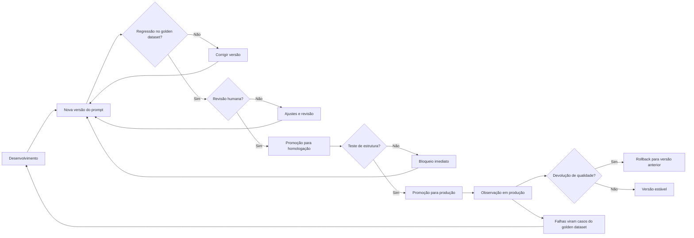

# Capítulo 7: Versionando, Testando e Governando Prompts

## 1. Introdução

No Capítulo 6, você diagnosticou por que a prompt engineering sozinha não escala: estocasticidade, versionamento, teste e consistência entre equipes [12]. Agora vamos construir a solução: a esteira de produção de prompts — versionar, testar e governar como se constrói um pipeline de software [13]. A tese deste capítulo é que o prompt, tratado como código, ganha a mesma disciplina que o código ganha na engenharia de software [12].

Este capítulo tem três objetivos. Primeiro, dominar o versionamento de prompts: o registro de versões, o diff e o golden dataset [12]. Segundo, construir a camada de teste: a regressão, o teste de estrutura e o teste de conteúdo [12]. Terceiro, estabelecer a governança: a esteira de promoção entre ambientes e a revisão humana [13]. Ao final, você terá um pipeline completo de produção de prompts — o mesmo que os times maduros de 2026 operam [13].

## 2. Explica

### 2.1 O Prompt como Arquivo Versionado

O primeiro passo da produção é tratar o prompt como um arquivo versionado — não como uma conversa [12]. Na prática: cada prompt vive em um arquivo, com um identificador, uma versão e um histórico [12]. A mudança de prompt é uma mudança de arquivo — com diff, autor e revisão [12]. E a história do prompt — o que mudou, quando e por quê — é rastreável [13].

A ferramenta natural é o Git, que você dominou no Livro 1 [13]. O prompt vira um arquivo no repositório; a mudança vira um commit; a melhoria vira um pull request [13]. A vantagem é dupla: a disciplina do Git — revisão, rastreabilidade e reversão — e o golden dataset que o acompanha [12]. O prompt versionado é um ativo de engenharia [13].

### 2.2 O Golden Dataset: a Linha de Base

O golden dataset é o coração do teste de prompts: um conjunto fixo de casos com respostas esperadas — a linha de base de regressão [12]. Cada caso tem: uma entrada, a resposta esperada e — opcionalmente — a tolerância aceitável [12]. O golden dataset responde a pergunta central: a nova versão do prompt mantém a qualidade da versão anterior? [12]

A construção do golden dataset é uma arte [12]. Os casos devem cobrir: os típicos — os casos frequentes do dia a dia [12]; os de borda — os limites do domínio [12]; e os de erro — os casos que historicamente falharam [12]. Cada caso é um compromisso do time: "esta resposta é a correta para esta entrada" [12]. E o golden dataset evolui — casos novos entram quando o sistema aprende com as falhas [12].

### 2.3 A Camada de Teste: Estrutura e Conteúdo

O teste de prompts tem duas camadas — estrutura e conteúdo [12]. O teste de estrutura é determinístico: a resposta tem o formato esperado — JSON válido, campos presentes, tipos corretos [12]. O teste de conteúdo é estatístico: a resposta contém o esperado — o fato, a categoria, o valor — com tolerância para a estocasticidade [9]. As duas camadas juntas formam a malha de validação [12].

A distinção é crítica [12]. O teste de estrutura falha com certeza — quando o formato quebra [12]. O teste de conteúdo falha com probabilidade — quando a taxa de acerto cai [12]. O pipeline trata os dois de formas diferentes: a falha de estrutura bloqueia imediatamente; a queda de conteúdo dispara alerta e análise [12]. O profissional projeta as duas — e sabe qual está atuando quando o pipeline sinaliza [13].

### 2.4 A Esteira de Promoção: Dev, Staging, Prod

A governança de prompts se materializa na esteira de promoção — o caminho que uma versão percorre antes de chegar a produção [13]. O ambiente de desenvolvimento: as experimentações — sem impacto no usuário [13]. O ambiente de homologação: as validações com golden dataset — a porta de entrada [13]. O ambiente de produção: a versão aprovada — sob observação [13]. Cada ambiente tem um portão [13].

A esteira é a ponte entre a engenharia e a operação [13]. Sem esteira, cada time promove prompt direto para produção — o caos do Capítulo 6 [13]. Com esteira, a promoção é um processo com evidências: a regressão passou? A revisão aprovou? [13] E a promoção é reversível: se a versão nova degrada, a anterior volta — o rollback do prompt [13].

### 2.5 A Revisão Humana: o Portão de Julgamento

A automação não substitui o julgamento humano — complementa [9]. O golden dataset mede o que é mensurável; a revisão humana julga o que não é [9]. O revisor pergunta: a resposta é correta, completa e adequada ao contexto? [9] E o revisor olha os casos que a automação não cobre — a resposta plausível-porém-errada do Capítulo 8 [9].

A revisão humana é o portão entre a homologação e a produção [13]. A regressão aprovou — mas o revisor confere os casos sensíveis [13]. E a revisão é registrada — parte do rastro da versão [13]. O profissional desenha o processo para que a automação faça o repetível e o humano faça o sutil [9]. A divisão é a mesma do portão de qualidade do Livro 1 [20].

### 2.6 A Observação em Produção

A governança não termina na promoção — continua na observação [17]. O prompt em produção é monitorado: a taxa de erro, a taxa de resposta no formato esperado, a latência [17]. O monitoramento detecta a degradação antes que o usuário a perceba [17]. E o monitoramento alimenta o ciclo: a falha em produção vira caso do golden dataset — e o golden cresce [17].

O ciclo completo da governança: versão, teste, promove, observa e aprende [17]. A versão nova entra com golden; a observação coleta sinais; os sinais viram casos novos; os casos novos refinam o golden [17]. É o mesmo ciclo de melhoria contínua do CI do Livro 1 — aplicado a prompts [11]. A governança não é um portão estático — é um ciclo vivo [17].

### 2.8 O Caso de Teste como Contrato

O caso de teste do golden dataset é, na prática, um contrato [12]. Cada caso declara: para esta entrada, esta é a resposta aceitável [12]. E o contrato é o que permite a colaboração [12]. O desenvolvedor de prompt escreve a versão nova; o caso de teste diz se a versão mantém a promessa [12]. Sem contrato, a melhoria é opinião [12]. Com contrato, a melhoria é evidência [12].

O contrato tem níveis de rigor [12]. O caso estrito: a resposta exata esperada — para formatos determinísticos [12]. O caso tolerante: a resposta dentro de uma faixa — para conteúdo com variação [9]. E o caso de estrutura: os campos e tipos — para JSON [12]. O profissional escreve o contrato com o rigor que a tarefa permite [12]. E o rigor é calibrado: estrito demais, o teste falha por variação; tolerante demais, o teste não protege [9].

### 2.9 O Rollback como Segurança

O rollback — a reversão para a versão anterior — é a rede de segurança da esteira [13]. A versão nova degrada em produção? A anterior volta [13]. O rollback tem um pré-requisito: a versão anterior está íntegra e acessível [13]. E tem uma disciplina: a reversão é registrada — o incidente vira análise [13]. O rollback não é admissão de fracasso — é parte do design [13].

A segurança do rollback habilita a velocidade [13]. O time que pode reverter promove com confiança — a mudança não é uma aposta de uma via [13]. O time que não pode reverter hesita — e a hesitação trava a inovação [13]. O rollback é a diferença entre experimentar com segurança e experimentar com medo [13]. E a esteira madura trata a reversão como evento normal — não como exceção [13].

### 2.10 O Custo da Governança

A governança tem um custo que o profissional dimensiona [12]. O versionamento custa disciplina [12]. O golden dataset custa construção e manutenção [12]. A revisão custa tempo humano [13]. E a observação custa instrumentação [17]. O custo é real — e a pergunta é se o valor supera [12].

A resposta depende da escala [12]. O sistema pequeno — um prompt, um usuário — não justifica a esteira completa [12]. O sistema em produção — centenas de prompts — não sobrevive sem ela [12]. O profissional calibra a governança ao risco: o essencial sempre, o completo quando a escala exige [12]. E o custo é comparado com o custo do caos — os incidentes, o retrabalho, a confiança perdida [12]. A governança é um investimento — e o retorno é a velocidade segura [13].

### 2.7 A Cultura da Governança de Prompts

A governança técnica exige cultura [12]. Sem cultura, as ferramentas viram burocracia: o time versiona por medo, não por método [12]. Com cultura, as ferramentas viram hábito: o time versiona porque sabe que a disciplina permite velocidade [13]. A cultura se constrói com: exemplos — mostrar os incidentes que a governança evitou; padrões — o template comum; e confiança — a esteira que protege o time [12].

O padrão de 2026 mostra a cultura madura [12]. Times que tratam prompts como código têm: repositório de prompts, golden datasets e esteira de promoção [12]. Times imaturos têm: prompts no chat, mudanças no ar e incidentes recorrentes [12]. A diferença não é técnica — é cultural [12]. E a cultura começa com a decisão individual de tratar o prompt como ativo [13].

## 3. Ilustra

### 3.1 A Analogia do Pipeline de Software

A melhor analogia da governança de prompts é o pipeline de software do Livro 1 [11]. O código não vai direto do editor para a produção: passa por versionamento, testes, CI e revisão [11]. O prompt não deveria ir direto do chat para a produção [13]. O mesmo pipeline — com as mesmas portas — governa os dois [13].

A analogia tem uma extensão reveladora [12]. No código, o teste unitário valida a função; no prompt, o golden dataset valida o comportamento [12]. No código, o CI roda a cada commit; no prompt, a regressão roda a cada versão [12]. No código, a revisão é o PR; no prompt, a revisão humana é o portão [13]. O pipeline é o mesmo — o artefato é que muda [12].

### 3.2 O Diagrama da Esteira de Promoção



O diagrama condensa a esteira: cada portão é uma decisão com evidência [13]. A regressão decide com o golden [12]. A revisão decide com julgamento [9]. A observação decide com dados [17]. E o ciclo — falhas viram casos, casos refinam o golden — é o motor da melhoria contínua [17].

### 3.3 O Hospital e o Protocolo

Uma segunda analogia: o hospital e o protocolo clínico [13]. O médico não improvisa cada procedimento: segue protocolos — versões aprovadas de prática [13]. O protocolo muda quando a evidência muda — revisado, testado e promovido [13]. E o desvio do protocolo é registrado — para aprendizado [13]. O prompt de produção é o protocolo: versionado, testado e governado [13].

A analogia tem uma lição sobre o erro [9]. O médico segue o protocolo, mas usa o julgamento quando o caso é atípico [9]. O engenheiro de prompt idem: a automação governa o típico; o humano julga o atípico [9]. O protocolo não elimina o julgamento — concentra-o onde importa [13].

## 4. Técnica

### 4.1 O Pipeline de Regressão com Golden Dataset

A técnica central do capítulo é o pipeline de regressão — a porta de entrada da esteira [12]:

```python
class PipelineDePrompts:
    def __init__(self, golden):
        self.golden = golden
        self.limite = 80.0

    def executar(self, prompt, executar):
        """Roda a regressão do prompt contra o golden dataset."""
        acertos = 0
        falhas_estrutura = 0
        print(f"=== Regressão do prompt ({len(self.golden)} casos) ===")
        for caso in self.golden:
            resposta = executar(prompt, caso["entrada"])
            estrutura_ok = self._validar_estrutura(resposta, caso)
            if not estrutura_ok:
                falhas_estrutura += 1
                print(f"  FALHA ESTRUTURA: {caso['entrada'][:40]}")
                continue
            if normalizar(resposta) == normalizar(caso["esperado"]):
                acertos += 1
                print(f"  PASS: {caso['entrada'][:40]}")
            else:
                print(f"  FAIL: {caso['entrada'][:40]}")
        taxa = acertos / len(self.golden) * 100
        print(f"\nTaxa de acerto: {taxa:.0f}% | Falhas de estrutura: {falhas_estrutura}")
        if falhas_estrutura:
            print("REPROVADO: falhas de estrutura bloqueiam a promoção.")
            return False
        if taxa >= self.limite:
            print("APROVADO: linha de base mantida. Pronto para revisão humana.")
            return True
        print("REPROVADO: taxa abaixo do limite. Corrija antes de promover.")
        return False

    def _validar_estrutura(self, resposta, caso):
        return isinstance(resposta, str) and bool(resposta.strip())


def normalizar(texto):
    return texto.strip().lower()


if __name__ == "__main__":
    golden = [
        {"entrada": "renda alta, histórico limpo", "esperado": "APROVADO"},
        {"entrada": "renda baixa, atrasos", "esperado": "NEGADO"},
        {"entrada": "renda média, um atraso", "esperado": "ANALISAR"},
    ]
    def oraculo_fake(prompt, entrada):
        if "alta" in entrada:
            return "APROVADO"
        if "baixa" in entrada:
            return "NEGADO"
        return "ANALISAR"
    pipeline = PipelineDePrompts(golden)
    pipeline.executar("prompt v2.1", oraculo_fake)
```

O pipeline materializa a porta de entrada da esteira [12]. A regressão roda o golden, mede a taxa e decide [12]. As falhas de estrutura bloqueiam imediatamente — a camada determinística [12]. E a taxa abaixo do limite reprova a versão — a camada estatística [12].

### 4.2 O Gerenciador de Versões com Rollback

A técnica do versionamento com reversão — o rollback do prompt [13]:

```python
import json
from datetime import date


class GerenciadorDeVersoes:
    def __init__(self):
        self.historico = {}
        self.ativas = {}

    def publicar(self, nome, conteudo, autor, nota=None):
        if nome not in self.historico:
            self.historico[nome] = []
        versao = len(self.historico[nome]) + 1
        self.historico[nome].append({
            "versao": versao, "conteudo": conteudo,
            "autor": autor, "data": date.today().isoformat(), "nota": nota,
        })
        self.ativas[nome] = conteudo
        print(f"[OK] '{nome}' v{versao} publicada por {autor}")

    def rollback(self, nome, versao):
        """Reverte para uma versão anterior e registra a reversão."""
        if nome not in self.historico or versao < 1:
            print("[ERRO] versão inválida para rollback")
            return
        alvo = self.historico[nome][versao - 1]
        self.ativas[nome] = alvo["conteudo"]
        print(f"[ROLLBACK] '{nome}' revertida para v{versao} ({alvo['autor']})")

    def exportar(self, caminho):
        with open(caminho, "w", encoding="utf-8") as f:
            json.dump({"historico": self.historico, "ativas": self.ativas},
                      f, ensure_ascii=False, indent=2)
        print(f"Estado exportado: {caminho}")


if __name__ == "__main__":
    gerente = GerenciadorDeVersoes()
    gerente.publicar("classificar", "Instrução v1", "ana")
    gerente.publicar("classificar", "Instrução v2 com novo formato", "bruno")
    gerente.rollback("classificar", 1)
    gerente.exportar("estado_prompts.json")
```

O gerenciador mostra a segurança do versionamento: cada versão registrada, a reversão disponível [13]. Em produção, a reversão é a resposta ao incidente: a versão nova degradou, a anterior volta [13]. E o histórico preserva o aprendizado: a versão revertida não desaparece — fica registrada para análise [13].

### 4.3 O Verificador de Observação em Produção

A técnica da observação: um monitor que detecta a degradação do prompt em produção [17]:

```python
import json


class ObservadorDePrompts:
    def __init__(self, limite_erro=10.0, janela=100):
        self.limite_erro = limite_erro
        self.janela = janela
        self.ocorrencias = []

    def registrar(self, entrada, resposta, esperado):
        """Registra uma execução e avalia contra o esperado."""
        ok = normalizar(resposta) == normalizar(esperado)
        self.ocorrencias.append(ok)
        if len(self.ocorrencias) > self.janela:
            self.ocorrencias.pop(0)
        self._avaliar()

    def _avaliar(self):
        if len(self.ocorrencias) < 20:
            return
        taxa_erro = (1 - sum(self.ocorrencias) / len(self.ocorrencias)) * 100
        print(f"Janela atual: {len(self.ocorrencias)} | Taxa de erro: {taxa_erro:.1f}%")
        if taxa_erro > self.limite_erro:
            print(f"ALERTA: taxa de erro acima do limite ({self.limite_erro}%). "
                  f"Considere rollback.")

    def exportar(self, caminho):
        with open(caminho, "w", encoding="utf-8") as f:
            json.dump({"janela": len(self.ocorrencias),
                       "taxa_erro_estimada": (1 - sum(self.ocorrencias) /
                                              max(1, len(self.ocorrencias))) * 100},
                      f, ensure_ascii=False, indent=2)


def normalizar(texto):
    return texto.strip().lower()


if __name__ == "__main__":
    observador = ObservadorDePrompts()
    for i in range(30):
        ok = i % 10 != 0  # 10% de erros simulados
        observador.registrar(f"entrada-{i}", "OK" if ok else "ERR",
                             "OK" if ok else "OK")
    observador.exportar("observacao_prompts.json")
```

O observador materializa a camada pós-promoção [17]. Cada execução é registrada e avaliada; a taxa de erro na janela decide o alerta [17]. O alerta é o gatilho do ciclo: a degradação vira caso do golden — e o golden aprende [17].

### 4.4 O Quadro de Governança

O fechamento técnico do capítulo: o quadro de governança — o painel que resume o estado de todos os prompts [13]:

```python
def quadro_de_governanca(prompts):
    """Resume o estado de governança de um conjunto de prompts."""
    print("=== Quadro de governança de prompts ===")
    print(f"{'Prompt':<25} {'Versão':<8} {'Golden':<8} {'Produção':<10}")
    for p in prompts:
        print(f"{p['nome']:<25} v{p['versao']:<7} "
              f"{'sim' if p['golden'] else 'não':<8} "
              f"{'estável' if p['produção'] else 'observando':<10}")
    com_golden = sum(1 for p in prompts if p["golden"])
    print(f"\nResumo: {len(prompts)} prompts, {com_golden} com golden dataset, "
          f"{len(prompts) - com_golden} sem cobertura de teste")


if __name__ == "__main__":
    prompts = [
        {"nome": "classificar-risco", "versao": 3, "golden": True, "produção": True},
        {"nome": "resumir-conversa", "versao": 1, "golden": False, "produção": False},
        {"nome": "extrair-dados", "versao": 2, "golden": True, "produção": True},
    ]
    quadro_de_governanca(prompts)
```

O quadro é o instrumento de gestão [13]. O gestor olha o quadro e sabe: quais prompts estão cobertos, quais estão em observação, quais estão sem teste [13]. E o quadro orienta o investimento: o prompt sem golden é um risco — e o risco é prioridade [13]. A governança visível é a governança praticada [12].

## 5. Aplica

### 5.1 Onde Isso Vive no Mundo Real

A esteira de prompts é operada pelos times maduros de 2026 [12]. O repositório de prompts com Git [13]. O golden dataset mantido no repositório [12]. A esteira de CI que roda a regressão a cada mudança [13]. A revisão humana no PR [12]. E a observação em produção com alertas [17]. O conjunto forma a fábrica de prompts — a infraestrutura da escala [13].

O padrão de 2026 mostra a maturidade crescente [12]. As plataformas de gestão de prompts oferecem versionamento e avaliação [12]. Os pipelines de CI para LLMs automatizam a regressão [13]. E os times que adotaram a disciplina escalam com confiança — enquanto os que improvisam acumulam incidentes [12]. A esteira não é opcional para quem produz em escala [13].

### 5.2 O Erro Comum do Iniciante

O erro clássico é o versionamento no nome do arquivo: "prompt_final_v2_real_final.md" [12]. O resultado: a confusão do Capítulo 6 — ninguém sabe qual é a versão em produção [12]. O segundo erro é o golden dataset ausente: testar "na mão", sem linha de base — e não saber se a mudança melhorou [12]. O terceiro erro é promover direto para produção: sem homologação, sem revisão, sem rollback [13].

A correção — e aqui está o diferencial que separa o profissional — é a esteira deliberada [13]. Versionar no Git, manter o golden, rodar a regressão e promover com revisão [13]. O pipeline da seção 4.1 e o gerenciador da seção 4.2 são as ferramentas do hábito [13]. O prompt não é produzido quando "funciona" — é produzido quando passa pela esteira [13].

### 5.3 O Padrão Profissional em 2026

O padrão profissional combina as camadas do capítulo [13]. O versionamento: Git e registro de versões [13]. O teste: golden dataset com regressão e estrutura [12]. A promoção: dev, homologação e produção com portões [13]. A revisão: humana, no portão entre homologação e produção [9]. E a observação: monitoramento com alerta e rollback [17].

O resultado é um ciclo completo de governança — e a base da avaliação do Capítulo 8 e da disciplina da produção [14]. O prompt governado é o prompt que escala [13]. E é esse mesmo modelo — versionar, testar, governar — que a série levará aos harnesses na Parte III [4]. A esteira está construída; agora vamos afiar o julgamento [9].

### 5.4 O Inventário do Capítulo

Vale consolidar o capítulo em um inventário verificável [1]. Primeiro, o versionamento: o prompt como arquivo no Git [13]. Segundo, o golden dataset: a linha de base de regressão [12]. Terceiro, o teste: estrutura e conteúdo [12]. Quarto, a promoção: dev, homologação e produção [13]. Quinto, a observação: monitoramento com rollback [17].

Cada item tem um teste [12]. Para o versionamento: você rastreia qual versão está em produção? [13] Para o golden: você constrói casos típicos, de borda e de erro? [12] Para o teste: você separa a falha de estrutura da queda de conteúdo? [12] Para a promoção: você promove com evidência? [13] O inventário com testes é a base da operação [1].

### 5.5 A Esteira como Ciclo de Aprendizado

A esteira não é um portão estático — é um ciclo de aprendizado [17]. A falha em produção vira caso do golden [17]. O caso novo refina o teste [17]. O teste refinado protege a próxima versão [17]. E a proteção permite velocidade — porque a mudança é medida [12]. O ciclo transforma o incidente em investimento [17].

A mentalidade do ciclo é a diferença entre operação e improvisação [12]. O operador da esteira vê a falha como dado — e o dado como melhoria [12]. O improvisador vê a falha como incômodo — e o incômodo como interrupção [12]. O ciclo do golden é a memória do sistema: cada incidente resolvido deixa um caso [17]. E a memória é o que torna o sistema progressivamente mais seguro [12].

### 5.6 O Portão Humano na Prática

O portão humano — a revisão entre homologação e produção — merece um fechamento prático [9]. O revisor não confere o que a automação conferiu — confere o que ela não alcança [9]. A adequação da resposta ao usuário [9]. A completude diante do pedido [9]. E o plausível-porém-errado — o tema do Capítulo 8 [14]. A divisão de trabalho é a do portão de qualidade do Livro 1 [20].

O portão humano tem um custo que o profissional gerencia [13]. A revisão manual é lenta e cara [13]. O profissional concentra a revisão onde o custo do erro é alto — os casos sensíveis [13]. E usa a amostragem para o resto — a revisão estatística [13]. O portão humano não revisa tudo — revisa o que importa [9]. E a decisão do portão é registrada — parte do rastro da versão [13].

### 5.7 O Pipeline de CI para Prompts: Integração, Teste e Deploy Contínuos

Se o prompt é código, ele merece o mesmo pipeline de integração contínua que o código [11][13]. Esta subseção descreve o pipeline de CI para prompts — a espinha dorsal da disciplina de versionamento em produção — cobrindo integração, teste e deploy [11][13][14]. O princípio é o mesmo da engenharia de software consolidada por Fowler e outros: integrar cedo e com frequência, testar automaticamente e promover artefatos por ambientes controlados [11][13].

O primeiro estágio do pipeline é a **validação estática**: o prompt é verificado como artefato — estrutura de template válida, campos parametrizados presentes, formatação consistente, tamanho dentro do limite de contexto [13][3]. A validação estática é barata e pega a classe de erros mais comum: o prompt quebrado que falha em produção na primeira chamada [13]. Um linter de prompts verifica o que um compilador verifica em código: a forma, antes do comportamento [13].

O segundo estágio é o **teste com casos fixos**: um conjunto curado de casos de teste — entradas representativas com respostas esperadas ou critérios de aceite — que executa automaticamente a cada alteração [14][15]. O LangChain formaliza esse estágio: métricas definidas, casos fixos, execução repetível [14]. A diferença em relação ao teste de código é sutil e importante: a resposta do modelo é probabilística, então o teste não compara strings — valida critérios (formato correto, fatos presentes, sem proibidos) [14][15]. O conjunto de casos fixos é o coração do pipeline: é ele que torna a alteração de prompt uma operação segura [14][15].

O terceiro estágio é o **teste de regressão por amostragem**: além dos casos fixos, o pipeline executa o prompt em uma amostra de entradas reais (ou simuladas) e compara as distribuições de métricas com a linha de base [14][15][17]. Esse estágio captura o que os casos fixos não capturam: degradação estatística — a mudança que melhora os casos conhecidos mas piora o geral [15][17]. O GrowthBook documenta esse princípio em experimentos de produção: sem amostragem e comparação com linha de base, a alteração é uma aposta [17].

O quarto estágio é a **promoção por ambientes**: o prompt é promovido de desenvolvimento para staging e de staging para produção, com aprovação e registro em cada salto [11][13]. A promoção por ambientes protege produção: a alteração que quebra em staging nunca chega ao usuário [11]. O Pan descreve esse fluxo como parte da disciplina contínua de versionamento [13]. O registro de cada promoção — versão, autor, motivo, resultado dos testes — é o histórico auditável que a governança exige [12][13].

O quinto estágio é o **monitoramento pós-deploy**: depois de promovido, o prompt é monitorado em produção — métricas de qualidade, taxas de erro, sinais de degradação [3][14][15]. O monitoramento fecha o ciclo: o pipeline detecta problemas antes, e o monitoramento detecta o que o pipeline não previu [14][15]. A literatura de avaliação de LLMs recomenda monitoramento contínuo porque o comportamento dos modelos muda entre versões e ao longo do tempo — o prompt que passou em todos os testes hoje pode degradar amanhã [14][15]. O pipeline de CI para prompts é, portanto, um sistema vivo, e não um processo pontual [13][14].

### 5.8 Segurança, Rastreabilidade e Auditoria do Prompt como Ativo

O prompt versionado e testado é também um ativo que precisa de segurança, rastreabilidade e auditoria [12][13]. Esta subseção cobre as práticas de proteção do ativo-prompt, preparando a discussão de segurança do Capítulo 9 [9][12][13]. A premissa é simples: se o prompt é código, ele merece a segurança de código — controle de acesso, trilha de auditoria e resposta a incidentes [12][13].

O primeiro pilar é o **controle de acesso**. O prompt de sistema de uma aplicação é informação sensível: contém as regras de comportamento e, frequentemente, detalhes do negócio [9][11]. O acesso à edição deve ser limitado às pessoas autorizadas, e o acesso de leitura, às pessoas que precisam [11][12]. A prática inclui permissões no repositório, revisão obrigatória para merges e rastreio de quem alterou o quê [12][13]. A OWASP inclui a exposição indevida de prompts na lista de riscos de aplicações LLM — vazamento de prompt é um incidente de segurança real [9].

O segundo pilar é a **rastreabilidade**. Toda versão de prompt deve ser associável a uma origem: o requisito que a motivou, o incidente que a corrigiu, o experimento que a validou [12][13]. A rastreabilidade é o que torna o histórico utilizável — sem ela, o histórico é uma pilha de versões sem contexto [12]. O BrainTrust recomenda que cada alteração carregue uma referência ao motivo, no formato de commit message de código [12]. O Pan descreve a mesma exigência: o registro do porquê é parte da disciplina [13].

O terceiro pilar é a **auditoria periódica**. O prompt não é auditado apenas quando muda — ele é auditado regularmente para verificar se ainda corresponde à intenção, se as cláusulas continuam necessárias e se não acumulou contradições [12][13]. A auditoria periódica é análoga à revisão de dívida técnica: o prompt que ninguém revisa acumula regras mortas e conflitos latentes [12]. A prática recomendada é uma revisão agendada — trimestral, semestral — em que o documento inteiro é relido contra a intenção documentada [12][13].

O quarto pilar é a **resposta a incidentes**. Quando um prompt causa dano — resposta incorreta, vazamento, comportamento indevido —, a organização precisa de um procedimento: conter (reverter para a versão anterior), diagnosticar (entender o gatilho), corrigir (alterar com teste) e registrar (documentar para o futuro) [9][12][13]. A resposta a incidentes é a prova de fogo da governança: é no incidente que se vê se o versionamento funciona [13]. A organização com histórico completo reverte em minutos; a organização sem histórico reconstrói o prompt de memória [12][13].

O quinto pilar é a **gestão do ciclo de vida**. O prompt, como todo artefato de software, tem ciclo de vida: criado, versionado, testado, promovido, monitorado, depreciado e eventualmente removido [12][13]. A gestão explícita do ciclo impede a acumulação de prompts órfãos — versões que ninguém usa mais, mas que continuam no repositório confundindo auditorias [12][13]. A prática profissional trata a remoção como parte do trabalho: o prompt depreciado é arquivado com motivo, não simplesmente apagado [12][13]. Com segurança, rastreabilidade e auditoria, o prompt deixa de ser um arquivo de texto e vira um ativo de engenharia plenamente governado — o padrão que a Parte III estende para toda a pilha de agentes [3][13].

### 5.9 A Cultura da Promoção: De Arte Individual a Disciplina Coletiva

O versionamento, o pipeline e a governança deste capítulo só funcionam se houver cultura — a adesão coletiva à disciplina [12][13]. Esta subseção trata da mudança cultural que acompanha a mudança técnica: a promoção do prompt de arte individual a disciplina coletiva [12][13]. O instrumento técnico sem cultura vira burocracia; a cultura sem instrumento vira improviso [12][13]. A promoção bem-sucedida combina os dois [13].

O primeiro pilar da cultura é o **exemplo da liderança técnica**: a equipe adota a disciplina quando os líderes técnicos a praticam — versionando, registrando e medindo os próprios prompts [12][13]. A cultura não se decreta; demonstra-se [12]. O engenheiro sênior que trata o prompt como código ensina mais que qualquer política [12].

O segundo pilar é o **vocabulário compartilhado**: a equipe usa as mesmas palavras para os mesmos conceitos — versão, linha de base, regressão, aceite, promoção [13][14]. O vocabulário compartilhado é o que permite discussão técnica precisa: "a alteração passou na regressão?" é uma pergunta possível só quando todos entendem regressão [14]. A criação do vocabulário é parte da formação da equipe [13][14].

O terceiro pilar é a **celebração da medição**: a equipe valoriza os dados — a métrica que subiu, a regressão que foi evitada — tanto quanto valoriza a solução criativa [14][15]. A cultura de medição substitui a cultura do palpite: decisões sobre prompts passam a ser discutidas com evidência [14][15].

O quarto pilar é o **rito da revisão**: a revisão de alterações de prompt é um evento regular e respeitado, como o code review [11][12]. O rito da revisão transforma a alteração individual em decisão coletiva — e distribui o conhecimento pela equipe [11][12]. O desenvolvedor que revisa prompts dos colegas aprende mais que o que escreve os próprios [12].

O quinto pilar é a **tolerância ao processo com baixo atrito**: a disciplina sobrevive quando o custo de segui-la é pequeno [12][13]. O registro de uma linha no commit, o template pronto, o pipeline automático — cada redução de atrito aumenta a adesão [13]. A cultura madura desenha processos que as pessoas seguem porque são fáceis, não porque são obrigatórias [12][13].

O sexto pilar é a **memória institucional**: a disciplina produz história — e a história é consultada [12][13]. A equipe nova aprende com o histórico de versões, erros e acertos [12]. A memória institucional é o que impede a organização de repetir erros já pagos [12][13]. A promoção cultural é a dimensão humana da governança: o mesmo prompt versionado que é instrumento técnico é também veículo de aprendizado coletivo [12][13]. A equipe que internaliza a cultura da promoção não depende de heróis individuais que sabem tudo — ela depende de um sistema que sabe [12][13].

## 6. Conclusão

Neste capítulo, você construiu a esteira de produção de prompts: o versionamento com Git e registro [13]; o teste com golden dataset, regressão e estrutura [12]; e a governança com promoção, revisão e observação [13][17]. Você entendeu que o prompt tratado como código ganha a disciplina do código [12].

Resumindo em três pontos: primeiro, o golden dataset é a linha de base que decide — sem ele, nenhuma mudança é mensurável [12]; segundo, a esteira de promoção é o caminho da versão — com portões e reversão [13]; terceiro, a governança é um ciclo — a falha em produção vira caso do golden [17]. Com esses três pontos, você opera um pipeline de prompts [13].

### O Desafio Deste Capítulo

O desafio em três níveis. Nível um: coloque um prompt seu no Git e crie um golden dataset de dez casos [12]. Nível dois: implemente o pipeline da seção 4.1 com uma API real e promova apenas as versões aprovadas [12]. Nível três: monte o observador da seção 4.3 em produção e configure o alerta de rollback [17]. Os três níveis exercitam versionamento, teste e observação [1].

No próximo capítulo, vamos afiar o instrumento de avaliação: a avaliação manual de respostas — como reconhecer uma resposta plausível-porém-errada, o fenômeno mais perigoso da era da IA [14]. A esteira está pronta; agora vamos treinar o julgamento [9].

## 7. Referências Bibliográficas

[1] OPENAI. Prompt engineering. Disponível em: https://developers.openai.com/api/docs/guides/prompt-engineering. Acesso em: 5 ago. 2026.

[2] OPENAI. Best practices for prompt engineering with the OpenAI API. Disponível em: https://help.openai.com/en/articles/6654000-best-practices-for-prompt-engineering-with-openai-api. Acesso em: 5 ago. 2026.

[3] ANTHROPIC. Effective context engineering for AI agents. Disponível em: https://www.anthropic.com/engineering/effective-context-engineering-for-ai-agents. Acesso em: 5 ago. 2026.

[4] ANTHROPIC. Building Effective AI Agents. Disponível em: https://www.anthropic.com/engineering/building-effective-agents. Acesso em: 5 ago. 2026.

[5] KARPATHY, Andrej. Software 3.0: Software in the Age of AI. Disponível em: https://www.latent.space/p/s3. Acesso em: 5 ago. 2026.

[6] OPENAI. Function Calling Guide. Disponível em: https://developers.openai.com/api/docs/guides/function-calling. Acesso em: 5 ago. 2026.

[7] WENG, Lilian. Extrinsic Hallucinations in LLMs. Disponível em: https://lilianweng.github.io/posts/2024-07-07-hallucination/. Acesso em: 5 ago. 2026.

[8] CHROMA. Context Rot: How Increasing Input Tokens Impacts LLM Performance. Disponível em: https://www.trychroma.com/research/context-rot. Acesso em: 5 ago. 2026.

[9] TESTING LIBRARY. Guiding Principles. Disponível em: https://testing-library.com/docs/guiding-principles/. Acesso em: 5 ago. 2026.

[10] WANG, Xuezhi; et al. Self-Consistency Improves Chain of Thought Reasoning in Language Models. 2022. Disponível em: https://arxiv.org/abs/2203.11171. Acesso em: 5 ago. 2026.

[11] FOWLER, Martin. Continuous Integration. Disponível em: https://martinfowler.com/articles/continuousIntegration.html. Acesso em: 5 ago. 2026.

[12] BRAINTRUST. What is prompt versioning? Best practices for iteration without breaking production. Disponível em: https://www.braintrust.dev/articles/what-is-prompt-versioning. Acesso em: 5 ago. 2026.

[13] PAN, Tian. Prompt Versioning in Production: The Engineering Discipline Teams Learn the Hard Way. Disponível em: https://tianpan.co/blog/2026-04-09-prompt-versioning-production-llm. Acesso em: 5 ago. 2026.

[14] LANGCHAIN. Evaluating LLM Systems: Metrics and Best Practices. Disponível em: https://blog.langchain.dev/evaluating-llm-platforms/. Acesso em: 5 ago. 2026.

[15] CHANG, Yupeng; et al. A Survey on Evaluation of Large Language Models. 2023. Disponível em: https://arxiv.org/abs/2307.03109. Acesso em: 5 ago. 2026.

[16] GOOGLE CLOUD. Generative AI Prompt Design Guide. Disponível em: https://cloud.google.com/vertex-ai/generative-ai/docs/learn/prompts/prompt-design. Acesso em: 5 ago. 2026.

[17] GROWTHBOOK. How to test multiple prompts in production (without chaos). Disponível em: https://www.growthbook.io/insights/how-test-multiple-prompts-production-without-chaos. Acesso em: 5 ago. 2026.

[18] BROWN, Tom B.; et al. Language Models are Few-Shot Learners. 2020. Disponível em: https://arxiv.org/abs/2005.14165. Acesso em: 5 ago. 2026.

[19] WEI, Jason; et al. Chain-of-Thought Prompting Elicits Reasoning in Large Language Models. 2022. Disponível em: https://arxiv.org/abs/2201.11903. Acesso em: 5 ago. 2026.

[20] KOJIMA, Takeshi; et al. Large Language Models are Zero-Shot Reasoners. 2022. Disponível em: https://arxiv.org/abs/2205.11916. Acesso em: 5 ago. 2026.
