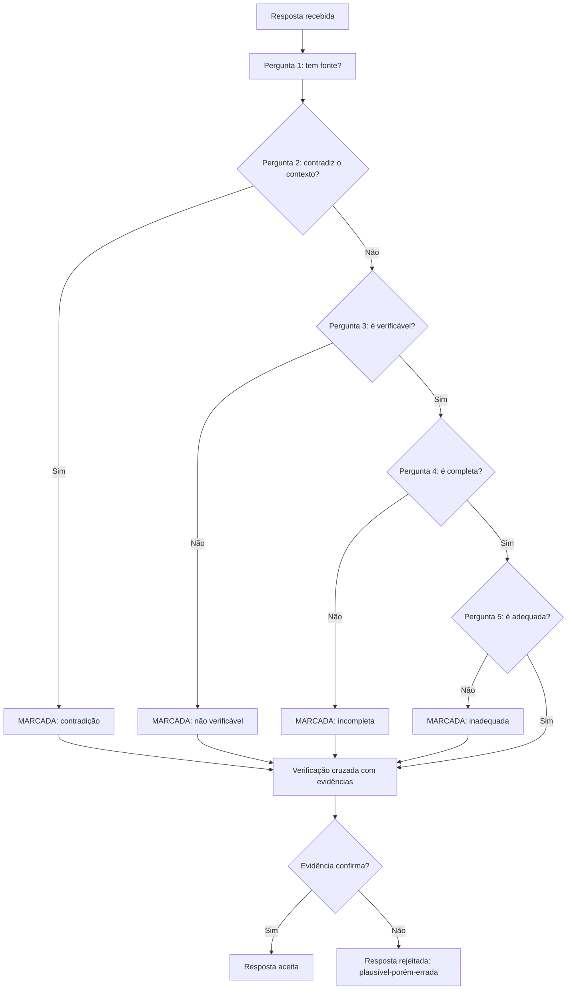

# Capítulo 8: Avaliação Manual de Respostas: Reconhecendo o Plausível-porém-Errado

## 1. Introdução

Nos Capítulos 6 e 7, você construiu a esteira de produção de prompts — versionamento, teste e governança [12][13]. Agora vamos afiar o instrumento mais humano da disciplina: a avaliação manual de respostas [14]. A tese deste capítulo é que a resposta mais perigosa da era da IA não é a obviamente errada — é a plausível-porém-errada: fluente, confiante e enganosa [7]. E que reconhecer essa resposta é uma habilidade treinável [14].

Este capítulo tem três objetivos. Primeiro, entender o fenômeno: por que modelos produzem respostas plausíveis-porém-erradas, e por que elas são mais perigosas que os erros óbvios [7]. Segundo, dominar o método de avaliação manual: as perguntas que o avaliador faz, as evidências que exige e os vieses que evita [14]. Terceiro, conectar a avaliação manual à esteira do Capítulo 7: o humano como portão entre a homologação e a produção [9]. Ao final, você reconhecerá o plausível-porém-errado com método — e saberá treinar essa habilidade em outros [14].

## 2. Explica

### 2.1 O Fenômeno do Plausível-porém-Errado

O plausível-porém-errado é a resposta que parece correta — fluente, estruturada, confiante — mas contém erro factual, lógico ou contextual [7]. O modelo de linguagem, treinado para prever o próximo token, produz texto que parece o texto correto [7]. E a fluência é o problema: o erro não é marcado — é apresentado com a mesma confiança que o acerto [7]. O leitor humano, condicionado a associar fluência a competência, tende a aceitar [7].

A pesquisa sobre alucinações — que você estudou no Livro 1 — nomeia o fenômeno [7]. As alucinações extrínsecas: o conteúdo não pode ser verificado na fonte [7]. As intrínsecas: o conteúdo contradiz a fonte [7]. O plausível-porém-errado é a alucinação na sua forma mais perigosa: apresentada com estrutura e detalhes que imitam a verdade [7]. Reconhecê-lo é reconhecer a diferença entre a forma da verdade e o conteúdo da verdade [14].

### 2.2 Por Que a Fluência Engana

A fluência engana por três mecanismos [7]. Primeiro, o viés da fluência: o cérebro humano trata texto fácil de processar como mais verdadeiro [7]. Segundo, o viés da confiança: a apresentação assertiva — "sem dúvida", "claramente" — suprime a checagem [7]. Terceiro, o viés da estrutura: respostas bem formatadas — listas, tabelas, seções — parecem mais confiáveis [7]. Os três vieses são humanos — e o modelo, sem saber, os explora [7].

O profissional não elimina os vieses — os administra com método [14]. O método começa pela suspeita sistemática: a resposta bem formatada é examinada com o mesmo rigor que a mal formatada [14]. A fluência deixa de ser um sinal de verdade — e vira um sinal de atenção [14]. O avaliador profissional desconfia da resposta fácil de ler — porque a fácil de ler é a fácil de aceitar [7].

### 2.3 O Método de Avaliação: as Cinco Perguntas

A avaliação manual segue um método — cinco perguntas que o avaliador faz a cada resposta [14]. Primeira: a resposta tem fonte? A fonte foi fornecida no contexto — ou o modelo a inventou? [14] Segunda: a resposta contradiz o contexto fornecido? [14] Terceira: a resposta é verificável — os fatos podem ser conferidos? [14] Quarta: a resposta é completa — cobre a pergunta inteira, ou só uma parte? [14] Quinta: a resposta é adequada — o formato, o tom e o nível de detalhe pedidos? [14]

As cinco perguntas formam um checklist de bolso [14]. E o checklist funciona em qualquer contexto — da resposta de um chatbot à saída de um agente [14]. O avaliador não precisa saber a resposta certa para aplicar o método: precisa saber como verificar [14]. A pergunta central não é "a resposta está certa?" — é "como posso saber se a resposta está certa?" [14].

### 2.4 A Verificação: Cruzar com Evidências

O método exige evidências — e a verificação é o cruzamento [14]. A resposta que cita um dado é verificada contra a fonte do dado [14]. A resposta que afirma um fato é verificada contra o conhecimento verificável [14]. A resposta que propõe um código é verificada pela execução [20]. O avaliador não aceita a afirmação — aceita a afirmação com a evidência correspondente [14].

A verificação tem três níveis [14]. O nível da fonte: a afirmação está ancorada no contexto fornecido? [14] O nível da lógica: o raciocínio é válido — os passos se seguem? [14] O nível da realidade: o fato é verdadeiro no mundo — conferível externamente? [14] O avaliador profissional usa os três níveis — e sabe qual está disponível em cada resposta [14].

### 2.5 Os Vieses do Avaliador

O avaliador humano tem vieses próprios — e o profissional os conhece [14]. O viés de confirmação: aceitar respostas que confirmam o que já se acredita [14]. O viés de ancoragem: a primeira resposta influencia a avaliação das seguintes [14]. O viés de fadiga: no fim de uma sessão longa, a avaliação relaxa [14]. E o viés do especialista: quem sabe demais do domínio assume que o modelo também sabe [14].

Os vieses do avaliador são combatidos com estrutura [14]. As rubricas — critérios explícitos de avaliação — reduzem a subjetividade [14]. A verificação sistemática — a checagem obrigatória de cada resposta — reduz a pressa [14]. E o descanso — sessões curtas, avaliação distribuída — reduz a fadiga [14]. O avaliador profissional não é o que não tem vieses — é o que os administra com instrumentos [14].

### 2.6 O Humano como Portão na Esteira

A avaliação manual não compete com a automação — a complementa [9]. Na esteira do Capítulo 7, a automação mede o mensurável: a estrutura, a taxa de acerto no golden [12]. O humano julga o sutil: a adequação, a completude, o plausível-porém-errado que o golden não cobre [9]. O portão humano fica entre a homologação e a produção — onde a automação aprovou e o julgamento decide [13].

A divisão de trabalho é a mesma do portão de qualidade do Livro 1 [20]. A máquina coleta evidências; o humano decide [20]. E a decisão humana é registrada — a revisão vira parte do rastro da versão [13]. O portão humano é o que permite à automação escalar com segurança: a máquina valida o repetível, o humano o sutil [9].

### 2.8 A Resposta como Hipótese

A mudança mental mais importante da avaliação é tratar a resposta como hipótese — não como fato [14]. O modelo propõe; o avaliador verifica [14]. A resposta bem formatada é uma hipótese bem apresentada — não uma verdade [14]. E a postura da hipótese transforma a avaliação: em vez de "está certo?" — "como posso saber se está certo?" [14]. A pergunta abre a verificação [14].

A postura da hipótese tem consequências no fluxo [9]. A resposta que não pode ser verificada é marcada — independentemente da fluência [14]. A resposta verificável é conferida — com a evidência correspondente [14]. E a resposta que falha na verificação é rejeitada — com o erro localizado [14]. O avaliador profissional não acredita nem desacredita — verifica [14]. E a verificação é o que separa a confiança informada da fé [9].

### 2.9 A Avaliação de Código Gerado

A avaliação manual tem uma aplicação crítica: o código gerado [20]. O código plausível-porém-errado — que compila e funciona errado — é o pesadelo da era agêntica [20]. A fluência do código é a aparência de correção: nomes bons, estrutura limpa — e a lógica errada [20]. O avaliador de código não confia na aparência — executa [20]. E a execução é a verificação: o teste passa? O comportamento é o esperado? [20]

A avaliação de código conecta este capítulo ao Livro 1 [20]. A pirâmide de testes do Livro 1 é a automação da verificação [11]. E a avaliação manual deste capítulo é o julgamento do que os testes não cobrem [14]. O profissional combina: o teste automatizado valida o comportamento; o avaliador humano julga o desenho [20]. A avaliação de código gerado é a fronteira entre a fluência da máquina e o julgamento humano [20].

### 2.10 A Avaliação em Escala

A avaliação manual em escala enfrenta um limite: o volume [14]. Mil respostas por dia não cabem na revisão humana completa [14]. O profissional projeta a avaliação em camadas [14]. A automação filtra o óbvio — a estrutura, o formato [12]. O humano avalia a amostra — a revisão estatística [14]. E o caso sensível — o alto impacto — é sempre revisado [14]. A avaliação em escala é a combinação de automação e julgamento [14].

A combinação é o padrão maduro [14]. A automação faz o repetível — a triagem [12]. O humano faz o sutil — o julgamento [14]. E o registo de cada decisão alimenta o golden — o ciclo do Capítulo 7 [12]. A avaliação em escala não elimina o humano — o concentra [14]. E a concentração é onde o valor está: o julgamento aplicado onde o erro custa mais [14].

### 2.7 O Treino do Julgamento

A avaliação manual é uma habilidade treinável — e o treino tem método [14]. O treino clássico: pares de respostas — uma correta, uma plausível-porém-errada — e o avaliador identifica qual é qual [14]. O treino avança: respostas com erros sutis — um dado trocado, uma premissa invertida [14]. E o treino conclui: respostas do próprio domínio — com a verificação real [14].

O treino do julgamento é o investimento que separa o time [14]. O time que treina avaliação manual produz revisões confiáveis — e promove versões com confiança [14]. O time que não treina avalia por intuição — e a intuição é exatamente o que a fluência explora [7]. A habilidade de avaliar é a habilidade de não ser enganado — e ela se constrói com prática deliberada [14].

## 3. Ilustra

### 3.1 A Analogia do Detector de Metais

A melhor analogia da avaliação manual é o detector de metais [14]. O detector não sabe o que é o metal — sabe que algo está ali e sinaliza [14]. O avaliador não precisa saber a resposta certa — precisa sinalizar quando algo merece verificação [14]. O detector não decide sozinho: a escavação confirma [14]. O avaliador não decide sozinho: a verificação confirma [14].

A analogia tem uma lição sobre os falsos positivos [14]. O detector que sinaliza demais — tudo merece escavação — é lento [14]. O detector que sinaliza de menos — quase nada é verificado — é perigoso [14]. O bom detector calibra: sinaliza o suspeito, deixa o óbvio passar [14]. O bom avaliador idem: verifica o plausível-porém-errado, confia no verificado [14].

### 3.2 O Diagrama da Avaliação Manual



O diagrama condensa o método: cada pergunta é um filtro, e a verificação final decide [14]. A resposta que passa pelos filtros mas falha na verificação é exatamente o plausível-porém-errado [14]. E o registro — a resposta marcada e rejeitada — alimenta o golden dataset do Capítulo 7 [12].

### 3.3 O Editor e o Cético

Uma segunda analogia: o editor de uma publicação científica [14]. O editor não escreve os artigos — julga [14]. E o bom editor é cético por profissão: exige evidências, cruza referências, desconfia do fluente [14]. O editor que aceita o artigo pela forma — bem escrito, bem formatado — publica erros [14]. O editor que avalia pelo conteúdo — a evidência, a lógica, a verificabilidade — mantém a qualidade [14].

A analogia conecta ao Capítulo 7 [13]. O revisor de prompts é o editor da fábrica: a automação é o revisor assistente, o humano é o editor-chefe [13]. E o treino do julgamento da seção 2.7 é a escola do editor [14]. O plausível-porém-errado é o artigo que parece publicável — e o editor treinado é o que não publica [14].

## 4. Técnica

### 4.1 O Checklist de Avaliação Manual

A técnica central do capítulo é o checklist operacional — a materialização das cinco perguntas [14]:

```python
class ChecklistDeAvaliacao:
    def __init__(self, resposta, contexto=None):
        self.resposta = resposta
        self.contexto = contexto or ""
        self.verificacoes = []

    def avaliar(self):
        """Aplica as cinco perguntas e devolve o veredito."""
        self.verificacoes.append(("Tem fonte?", bool(self._extrair_fontes())))
        self.verificacoes.append(("Não contradiz o contexto?",
                                  not self._contradiz_contexto()))
        self.verificacoes.append(("É verificável?", self._eh_verificavel()))
        self.verificacoes.append(("É completa?", len(self.resposta) > 20))
        self.verificacoes.append(("É adequada?", self._eh_adequada()))
        print("=== Checklist de avaliação manual ===")
        for nome, ok in self.verificacoes:
            print(f"  {'PASS' if ok else 'FALHA'} {nome}")
        reprovou = any(not ok for _, ok in self.verificacoes)
        veredito = "AVALIAR COM CUIDADO — possível erro" if reprovou \
            else "SINAL VERDE — verificação recomendada"
        print(f"\nVeredito: {veredito}")
        return reprovou

    def _extrair_fontes(self):
        import re
        return re.findall(r"(?:segundo|conforme|fonte|estudo de)\s+\S+",
                          self.resposta, re.IGNORECASE)

    def _contradiz_contexto(self):
        return "contradição" in self.resposta.lower() and self.contexto

    def _eh_verificavel(self):
        return any(c.isdigit() for c in self.resposta)

    def _eh_adequada(self):
        return len(self.resposta) < 2000


if __name__ == "__main__":
    resposta_suspeita = (
        "Segundo o estudo de 2019, a taxa de adoção é de 75%. Este dado "
        "é amplamente citado na literatura."
    )
    contexto = "Contexto fornecido: dados de adoção de 2026, sem menção a 2019."
    ChecklistDeAvaliacao(resposta_suspeita, contexto).avaliar()
```

O checklist materializa o método: cinco perguntas, cinco verificações, um veredito [14]. A resposta suspeita — citação sem fonte no contexto, dado não verificável — é marcada [14]. Na prática, o checklist é o esqueleto da revisão — e a verificação real exige o cruzamento humano [14].

### 4.2 O Simulador de Treino do Julgamento

A técnica do treino: o simulador que apresenta pares e pede a decisão [14]:

```python
import random


class TreinoDeJulgamento:
    def __init__(self, casos):
        self.casos = casos
        self.acertos = 0
        self.total = 0

    def rodada(self):
        """Apresenta um caso e registra a decisão do avaliador."""
        caso = random.choice(self.casos)
        print("=== Avalie a resposta ===")
        print(caso["resposta"])
        print("\nQual é o veredito?")
        decisao = input("  [C]orreta  [S]uspeita: ").strip().lower()
        correto = decisao.startswith("c") == caso["correta"]
        self.acertos += int(correto)
        self.total += 1
        if not caso["correta"]:
            print("  → Esta resposta é SUSPEITA. O erro: " + caso["erro"])
        else:
            print("  → Esta resposta é CORRETA.")
        print(f"Placar: {self.acertos}/{self.total}\n")
        return correto


if __name__ == "__main__":
    casos = [
        {"resposta": "A capital do Brasil é Brasília, cidade planejada "
                     "inaugurada em 1960.",
         "correta": True, "erro": ""},
        {"resposta": "A capital do Brasil é Brasília, cidade planejada "
                     "inaugurada em 1970, segundo fontes históricas.",
         "correta": False, "erro": "ano incorreto (1960, não 1970)"},
        {"resposta": "O Python foi criado por Guido van Rossum em 1991, "
                     "na Holanda.",
         "correta": True, "erro": ""},
        {"resposta": "O Python foi criado por Guido van Rossum em 1991, "
                     "nos Estados Unidos, conforme amplamente documentado.",
         "correta": False, "erro": "local incorreto (Holanda, não EUA)"},
    ]
    treino = TreinoDeJulgamento(casos)
    for _ in range(2):
        treino.rodada()
```

O simulador mostra o treino em ação: o avaliador decide — e a resposta revela o erro [14]. Os erros dos casos — o ano trocado, o lugar invertido — são exatamente os do plausível-porém-errado: um detalhe errado num texto fluente [14]. Na prática, o treino usa casos do domínio do time — e a dificuldade aumenta [14].

### 4.3 O Registro de Revisão Humana

A técnica da integração com a esteira: o registro da revisão — o rastro do portão humano [13]:

```python
import json
from datetime import date


def registrar_revisao(versao, resposta, veredito, justificativa, revisor):
    """Registra a decisão do portão humano na esteira de prompts."""
    registro = {
        "versao": versao,
        "data": date.today().isoformat(),
        "revisor": revisor,
        "resposta_avaliada": resposta[:120],
        "veredito": veredito,
        "justificativa": justificativa,
    }
    print(json.dumps(registro, ensure_ascii=False, indent=2))
    with open(f"revisao_{versao}.json", "w", encoding="utf-8") as f:
        json.dump(registro, f, ensure_ascii=False, indent=2)
    print(f"\nRevisão registrada: revisao_{versao}.json")
    return registro


if __name__ == "__main__":
    registrar_revisao(
        versao="v2.1",
        resposta="O custo do serviço é de R$ 99 mensais, conforme a tabela.",
        veredito="reprovada",
        justificativa="custo correto é R$ 79; dado plausível mas incorreto "
                      "no valor",
        revisor="ana",
    )
```

O registro mostra o portão humano em operação [13]. A resposta plausível-porém-errada é rejeitada com justificativa — e o rastro vira aprendizado [13]. Na prática, o registro alimenta o golden dataset do Capítulo 7: o caso que o humano pegou vira caso de teste [12]. O portão humano não só protege — ensina [13].

### 4.4 O Analisador de Marcadores de Fluência

O fechamento técnico do capítulo: o analisador de marcadores de fluência — os sinais de texto que parece confiante sem ser verificado [7]:

```python
import re


def analisar_marcadores(texto):
    """Detecta marcadores de fluência que merecem verificação extra."""
    marcadores = [
        (r"\bsem dúvida\b", "afirmação absoluta"),
        (r"\bclaramente\b", "afirmação absoluta"),
        (r"\bobviamente\b", "afirmação absoluta"),
        (r"\bconforme (?:estudos?|fontes|pesquisas?)\b", "citação vaga"),
        (r"\bamplamente (?:documentado|citado|conhecido)\b", "citação vaga"),
        (r"\bsegundo (?:dados|relatórios|especialistas)\b", "citação vaga"),
        (r"\b\d{2,4}\b", "dado numérico verificável"),
    ]
    print("=== Marcadores de fluência detectados ===")
    encontrados = 0
    for padrao, tipo in marcadores:
        hits = re.findall(padrao, texto, re.IGNORECASE)
        if hits:
            encontrados += len(hits)
            print(f"  {tipo:<28} {len(hits)}x  (ex.: '{hits[0]}')")
    if encontrados == 0:
        print("  Nenhum marcador detectado.")
    print(f"\nTotal de marcadores: {encontrados} — cada um merece verificação.")
    return encontrados


if __name__ == "__main__":
    resposta = (
        "Sem dúvida, conforme estudos recentes, o mercado cresceu 35% em "
        "2024, amplamente documentado na literatura."
    )
    analisar_marcadores(resposta)
```

O analisador transforma a suspeita em sinal [7]. As afirmações absolutas e as citações vagas são os marcadores do texto plausível [7]. E os dados numéricos são os pontos de verificação [7]. O analisador não julga — sinaliza [7]. E a sinalização é o convite ao cruzamento com evidências [14].

## 5. Aplica

### 5.1 Onde Isso Vive no Mundo Real

A avaliação manual é o portão humano de todo sistema de IA em produção [14]. O time de suporte avalia as respostas do chatbot antes da promoção [14]. O time de produto avalia as saídas do assistente — e pega o plausível-porém-errado antes do lançamento [14]. O time de agentes avalia as respostas dos harnesses — o mesmo método, aplicado ao loop [4]. Em cada caso, o humano é o editor-chefe da seção 3.3 [14].

O padrão de 2026 reforça a tese [14]. A confiança na exatidão do código gerado caiu para 29% — porque a fluência sem verificação engana [11]. E as empresas que treinam a avaliação manual produzem revisões confiáveis — a vantagem competitiva da atenção ao detalhe [14]. O método de avaliação não é burocracia — é a defesa contra o engano [7].

### 5.2 O Erro Comum do Iniciante

O erro clássico é avaliar pela fluência: a resposta parece boa — bem escrita, bem formatada — e é aceita sem verificação [7]. O resultado: o plausível-porém-errado passa — e o erro chega ao usuário [7]. O segundo erro é avaliar sem contexto: julgar a resposta sem saber o que foi fornecido ao modelo — e não perceber que o modelo contradisse o contexto [14]. O terceiro erro é avaliar sozinho: sem rubrica, sem checklist, sem segunda opinião [14].

A correção — e aqui está o diferencial que separa o profissional — é o método da seção 2.3 [14]. As cinco perguntas, o cruzamento com evidências e o registro [14]. O checklist da seção 4.1 é a ferramenta do hábito [14]. O avaliador profissional não confia na resposta — verifica a resposta [14].

### 5.3 O Padrão Profissional em 2026

O padrão profissional combina a avaliação manual com a esteira do Capítulo 7 [13]. A automação mede o mensurável — estrutura e golden [12]. O humano julga o sutil — adequação, completude e plausível-porém-errado [9]. E o registro da revisão alimenta o golden — o ciclo de aprendizado [13]. O portão humano é a peça que a automação não substitui [9].

O resultado é um sistema de prompts que combina escala e julgamento [13]. E é essa mesma combinação que sustenta a avaliação de agentes — o tema dos volumes de Eval Engineering da Parte IV [15]. A avaliação manual está dominada; agora vamos mapear os limites da disciplina [10].

### 5.4 O Inventário do Capítulo

Vale consolidar o capítulo em um inventário verificável [1]. Primeiro, o fenômeno: o plausível-porém-errado — fluente, confiante e enganoso [7]. Segundo, os mecanismos: a fluência, a confiança e a estrutura enganam [7]. Terceiro, o método: as cinco perguntas [14]. Quarto, a verificação: o cruzamento com evidências [14]. Quinto, os vieses: do avaliador — e os instrumentos que os administram [14].

Cada item tem um teste [14]. Para o fenômeno: você reconhece o plausível-porém-errado numa resposta real? [7] Para o método: você aplica as cinco perguntas sem pular? [14] Para a verificação: você cruza com evidências em vez de confiar? [14] Para os vieses: você usa rubricas contra a subjetividade? [14] O inventário com testes é a base do julgamento [1].

### 5.5 A Avaliação em Equipe

A avaliação manual em equipe tem dinâmicas próprias que o profissional conhece [14]. A concordância entre avaliadores — a mesma resposta, vereditos diferentes — é um sinal [14]. A rubrica reduz a divergência [14]. O calibração — avaliadores avaliam os mesmos casos e comparam — alinha o padrão [14]. E o caso difícil — a divergência persistente — é discutido e registrado [14]. A avaliação em equipe é uma disciplina coletiva [14].

A consistência entre avaliadores é o que torna a avaliação confiável [14]. Sem consistência, a aprovação de um prompt depende de quem revisou [14]. Com consistência, a aprovação depende do critério [14]. E o critério calibrado é o que alimenta o portão humano do Capítulo 7 [13]. O profissional investe na calibração da equipe — o treino da seção 2.7 elevado a prática coletiva [14].

### 5.6 O Julgamento como Vantagem

O fechamento aplicado do capítulo é o valor do julgamento no mercado [14]. A confiança na exatidão caiu para 29% — e o mercado busca quem sabe avaliar [11]. O time que avalia com método produz respostas confiáveis — a vantagem competitiva da verificação [14]. E o profissional que treina o julgamento é o que não é enganado pela fluência [7]. O julgamento é a habilidade que a automação não substitui [9].

O valor do julgamento cresce com a escala [14]. Mais agentes, mais respostas, mais fluência — e mais necessidade de quem distingue [4]. O avaliador profissional é o portão da confiança do sistema [9]. E o portão — treinado, calibrado e registrado — é o que permite escalar com segurança [13]. A avaliação manual não é um gargalo — é a garantia de qualidade da escala [14].

### 5.7 Os Padrões da Resposta Plausível-porém-Errada

O Capítulo 1 introduziu a noção de resposta plausível-porém-errada; este capítulo já mostrou como avaliar. Esta subseção aprofunda a taxonomia dos padrões de erro mais comuns, para que o avaliador reconheça a família do erro antes de julgá-lo [7][15]. Reconhecer o padrão é a metade do trabalho: cada família aponta para uma causa provável e uma correção provável [2][7].

O primeiro padrão é a **confabulação com autoridade**: o modelo inventa um fato, uma estatística ou uma referência com a mesma fluência com que diz a verdade [7]. O leitor leigo não distingue pela forma — a frase é gramatical e confiante [7]. O avaliador experiente distingue pelo conteúdo: busca a fonte, verifica o número, procura a referência [7][15]. A Weng documenta esse padrão como alucinação extrínseca — conteúdo gerado sem suporte nos dados [7]. O teste prático é o cruzamento: todo fato verificável citado pelo modelo deve sobreviver a uma verificação independente [7][15].

O segundo padrão é o **raciocínio que ignora premissas**: o modelo produz uma cadeia de raciocínio internamente coerente que parte de uma premissa errada ou ignora uma restrição dada [19][7]. O exemplo clássico é o problema de lógica com resposta óbvia que o modelo "resolve" elegantemente com a resposta errada, porque escolheu uma interpretação conveniente [19]. O avaliador identifica esse padrão relendo o enunciado: a resposta é internamente consistente, mas não responde à pergunta feita [2][19]. A correção frequente é reforçar as premissas no prompt — tornar explícito o que o modelo ignorou [2][19].

O terceiro padrão é a **generalização excessiva**: o modelo aplica uma regra que aprendeu a casos que a regra não cobre [18][15]. É o mesmo fenômeno do overfitting, transferido ao prompt: o modelo imitou os exemplos com tanta fidelidade que perdeu a capacidade de extrapolar [18]. O avaliador identifica o padrão variando os casos: se o modelo funciona nos exemplos e falha sistematicamente em variações, é generalização excessiva [14][15]. A correção é ampliar a diversidade dos exemplos ou adicionar restrições de escopo [2][18].

O quarto padrão é o **erro de formato silencioso**: a resposta está correta no conteúdo e errada na forma — o JSON que não valida, a tabela quebrada, o campo que falta [6][16]. Esse padrão é o mais traiçoeiro porque o olho humano tende a ler o conteúdo e ignorar a forma [6]. O avaliador experiente valida a forma com ferramentas — parse, schema, linter — antes de ler o conteúdo [6][14]. A correção é reforçar a especificação de formato no prompt e validar programaticamente a saída [6][16].

O quinto padrão é a **resposta evasiva de alta qualidade**: o modelo não erra, mas também não cumpre — responde de forma genérica, segura e inútil [1][7]. É o "bom o suficiente" que passa na avaliação rápida e falha no uso real [1]. O avaliador identifica o padrão perguntando: a resposta executa a tarefa ou apenas a descreve? [2]. A correção é apertar o critério de aceite — exigir a entrega, não a descrição [1][2]. A taxonomia completa dá ao avaliador o mesmo poder que a taxonomia de bugs dá ao testador: nomear o erro é o primeiro passo para corrigi-lo [15].

### 5.8 A Construção de um Conjunto de Avaliação Reutilizável

A avaliação manual, para ser eficaz e econômica, não é feita do zero a cada vez: o profissional constrói um **conjunto de avaliação** reutilizável — um corpus de casos que representa a tarefa e os padrões de erro conhecidos [14][15]. Esta subseção descreve como construir e manter esse ativo, que é o coração da disciplina de avaliação [14][15]. O conjunto de avaliação é, na prática, o mesmo conceito do conjunto de teste de software, adaptado à natureza probabilística das respostas [9][14].

O primeiro passo é **coletar casos reais**: entradas representativas do uso real da aplicação, incluindo os casos raros e de borda que aparecem em produção [15][14]. O Chang Survey recomenda que o conjunto reflita a distribuição real de entradas — não a distribuição idealizada [15]. Casos reais têm prioridade sobre casos inventados, porque capturam as ambiguidades que o mundo real produz [15].

O segundo passo é **rotular com o resultado esperado**: para cada caso, o resultado esperado (ou o critério de aceite) é definido e registrado [14][15]. A rotulação é feita por especialistas da tarefa — não por quem escreveu o prompt — para evitar viés [15]. O rótulo registra também o padrão de erro que o caso visa proteger, quando aplicável [15]. Um caso sem rótulo é um caso sem valor: ele executa, mas não permite julgamento [14].

O terceiro passo é **estruturar por categoria**: o conjunto é organizado por padrão de erro, por tipo de tarefa e por nível de dificuldade [14][15]. A estrutura por categoria permite responder perguntas precisas: o novo prompt melhorou os erros de confabulação? Degradou os casos fáceis? [14]. O LangChain documenta a prática de organizar avaliações por categoria para que a regressão seja diagnosticável [14].

O quarto passo é **manter o conjunto vivo**: novos casos entram a cada incidente, cada padrão de erro descoberto e cada mudança na distribuição de entradas [14][15]. O conjunto que não cresce perde valor — os padrões de erro mudam com o uso real [15]. A manutenção inclui a revisão periódica dos rótulos, porque o entendimento da tarefa evolui [15].

O quinto passo é **medir com métricas definidas**: o conjunto é executado com métricas explícitas — precisão, aderência ao formato, ausência de proibidos — registradas e comparadas entre versões [14][15]. A métrica é o que torna o conjunto um instrumento de decisão e não um ritual [14][15]. Com um conjunto de avaliação bem construído, a avaliação manual deixa de ser improviso e vira a infraestrutura de controle de qualidade da aplicação — a mesma função que o teste automatizado cumpre no software tradicional [9][14].

### 5.9 A Matriz de Rastreabilidade da Avaliação: Do Caso ao Critério ao Padrão

A avaliação profissional não é uma lista de casos soltos — é uma matriz rastreável que conecta cada caso ao critério que ele testa e ao padrão de erro que ele protege [14][15]. Esta subseção apresenta a matriz de rastreabilidade da avaliação, o instrumento que torna o conjunto de avaliação auditável e evolutivo [14][15]. A matriz tem três colunas — caso, critério, padrão — e é a versão avaliativa da matriz de rastreabilidade de requisitos da engenharia de software [15].

A primeira coluna é o **caso**: a entrada representativa, com o resultado esperado ou o critério de aceite [14][15]. O caso é o que se executa — a instância concreta da tarefa [14]. Cada caso entra na matriz com sua origem: real (coletado de produção), sintético (construído para cobrir um padrão) ou derivado (variante de outro caso) [15].

A segunda coluna é o **critério**: a propriedade mensurável que a resposta deve satisfazer — formato correto, fato presente, proibido ausente, tom adequado [14][15]. O critério é o que se julga — e cada critério é operacional: descrito de forma que dois avaliadores concordem [15]. O critério vago é a fonte mais comum de divergência entre avaliadores [15].

A terceira coluna é o **padrão**: a família de erro que o caso protege — confabulação, premissa ignorada, generalização excessiva, formato silencioso, evasiva [7][15]. O padrão conecta o caso à taxonomia do capítulo e permite responder: o novo prompt melhorou os casos do padrão X? [7][15].

A matriz cumpre quatro funções práticas [14][15]. A primeira é a **cobertura auditável**: a auditoria verifica se cada padrão conhecido tem pelo menos um caso — e a matriz mostra as lacunas [15]. A segunda é a **regressão diagnóstica**: quando uma alteração degrada, a matriz indica exatamente qual padrão regrediu [14]. A terceira é a **evolução orientada**: novos casos entram na matriz pelo padrão que a produção revelou — o incidente vira caso, o caso protege o padrão [15]. A quarta é a **comunicação objetiva**: "a cobertura de confabulação subiu de 3 para 5 casos" é uma frase de engenharia; "o prompt melhorou" não é [14][15].

A construção da matriz segue o fluxo do capítulo: coletar casos reais, rotular com critérios, classificar por padrão, manter viva [14][15]. O esforço inicial é pequeno — dezenas de casos cobrem os padrões conhecidos —, e o retorno é permanente: cada avaliação subsequente reutiliza a matriz e a enriquece [14][15]. A matriz de rastreabilidade é a materialização do princípio que atravessa a Parte I: avaliação não é opinião — é engenharia [14][15]. O conjunto de avaliação, com sua matriz, é o ativo que a Parte III da série transforma em infraestrutura de verificação contínua [14][15][3].

## 6. Conclusão

Neste capítulo, você dominou a avaliação manual de respostas: o fenômeno do plausível-porém-errado — fluente, confiante e enganoso [7]; o método das cinco perguntas — fonte, contradição, verificabilidade, completude e adequação [14]; e a verificação por evidências — o cruzamento que decide [14].

Resumindo em três pontos: primeiro, a fluência é um sinal de atenção, não de verdade [7]; segundo, o método de avaliação substitui a intuição pela verificação [14]; terceiro, o humano é o portão que a automação não substitui — e o treino do julgamento é um investimento [9][14]. Com esses três pontos, você reconhece o plausível-porém-errado [14].

### O Desafio Deste Capítulo

O desafio em três níveis. Nível um: aplique o checklist da seção 4.1 a dez respostas de um modelo e registre os vereditos [14]. Nível dois: execute o treino da seção 4.2 com casos do seu domínio — e meça a sua taxa de acerto [14]. Nível três: integre o registro da seção 4.3 à sua esteira — cada resposta reprovada vira caso do golden [13]. Os três níveis exercitam método, treino e integração [1].

No próximo capítulo, vamos mapear os limites da disciplina: o que a engenharia de prompt não resolve — e a injeção de prompt, a ameaça que a hierarquia de mensagens contém [10]. O julgamento está afiado; agora vamos conhecer as fronteiras [1].

## 7. Referências Bibliográficas

[1] OPENAI. Prompt engineering. Disponível em: https://developers.openai.com/api/docs/guides/prompt-engineering. Acesso em: 5 ago. 2026.

[2] OPENAI. Best practices for prompt engineering with the OpenAI API. Disponível em: https://help.openai.com/en/articles/6654000-best-practices-for-prompt-engineering-with-openai-api. Acesso em: 5 ago. 2026.

[3] ANTHROPIC. Effective context engineering for AI agents. Disponível em: https://www.anthropic.com/engineering/effective-context-engineering-for-ai-agents. Acesso em: 5 ago. 2026.

[4] ANTHROPIC. Building Effective AI Agents. Disponível em: https://www.anthropic.com/engineering/building-effective-agents. Acesso em: 5 ago. 2026.

[5] KARPATHY, Andrej. Software 3.0: Software in the Age of AI. Disponível em: https://www.latent.space/p/s3. Acesso em: 5 ago. 2026.

[6] OPENAI. Function Calling Guide. Disponível em: https://developers.openai.com/api/docs/guides/function-calling. Acesso em: 5 ago. 2026.

[7] WENG, Lilian. Extrinsic Hallucinations in LLMs. Disponível em: https://lilianweng.github.io/posts/2024-07-07-hallucination/. Acesso em: 5 ago. 2026.

[8] CHROMA. Context Rot: How Increasing Input Tokens Impacts LLM Performance. Disponível em: https://www.trychroma.com/research/context-rot. Acesso em: 5 ago. 2026.

[9] TESTING LIBRARY. Guiding Principles. Disponível em: https://testing-library.com/docs/guiding-principles/. Acesso em: 5 ago. 2026.

[10] WEI, Jason; et al. Emergent Abilities of Large Language Models. 2022. Disponível em: https://arxiv.org/abs/2206.07682. Acesso em: 5 ago. 2026.

[11] SITEPOINT. Vibe Coding 2026: The Complete Guide to AI-First Development. Disponível em: https://www.sitepoint.com/vibe-coding-2026-complete-guide/. Acesso em: 5 ago. 2026.

[12] BRAINTRUST. What is prompt versioning? Best practices for iteration without breaking production. Disponível em: https://www.braintrust.dev/articles/what-is-prompt-versioning. Acesso em: 5 ago. 2026.

[13] PAN, Tian. Prompt Versioning in Production: The Engineering Discipline Teams Learn the Hard Way. Disponível em: https://tianpan.co/blog/2026-04-09-prompt-versioning-production-llm. Acesso em: 5 ago. 2026.

[14] LANGCHAIN. Evaluating LLM Systems: Metrics and Best Practices. Disponível em: https://blog.langchain.dev/evaluating-llm-platforms/. Acesso em: 5 ago. 2026.

[15] CHANG, Yupeng; et al. A Survey on Evaluation of Large Language Models. 2023. Disponível em: https://arxiv.org/abs/2307.03109. Acesso em: 5 ago. 2026.

[16] GOOGLE CLOUD. Generative AI Prompt Design Guide. Disponível em: https://cloud.google.com/vertex-ai/generative-ai/docs/learn/prompts/prompt-design. Acesso em: 5 ago. 2026.

[17] GROWTHBOOK. How to test multiple prompts in production (without chaos). Disponível em: https://www.growthbook.io/insights/how-test-multiple-prompts-production-without-chaos. Acesso em: 5 ago. 2026.

[18] BROWN, Tom B.; et al. Language Models are Few-Shot Learners. 2020. Disponível em: https://arxiv.org/abs/2005.14165. Acesso em: 5 ago. 2026.

[19] WEI, Jason; et al. Chain-of-Thought Prompting Elicits Reasoning in Large Language Models. 2022. Disponível em: https://arxiv.org/abs/2201.11903. Acesso em: 5 ago. 2026.

[20] KOJIMA, Takeshi; et al. Large Language Models are Zero-Shot Reasoners. 2022. Disponível em: https://arxiv.org/abs/2205.11916. Acesso em: 5 ago. 2026.
