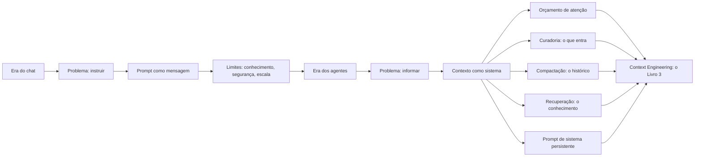

# Capítulo 10: Do Prompt ao Contexto: a Transição para a Context Engineering

## 1. Introdução

No Capítulo 9, você mapeou os limites da engenharia de prompt — e viu que eles apontam todos na mesma direção [3]. Agora vamos atravessar a fronteira: a transição que a indústria fez do prompt para o contexto — a Context Engineering, o tema que abre a Parte II da série [3]. A tese deste capítulo é que o gargalo dos agentes modernos deixou de ser a redação do prompt e passou a ser a gestão do contexto — e que essa transição define a próxima década da disciplina [3].

Este capítulo tem três objetivos. Primeiro, entender a transição: por que a indústria migrou do prompt para o contexto [3]. Segundo, dominar os conceitos da Context Engineering: curadoria, compactação, recuperação e orçamento de atenção [3]. Terceiro, preparar o terreno: o que o Livro 3 da série vai construir — e como este livro entrega o trampolim [3]. Ao final, você fechará o Livro 2 com a visão da pilha inteira [1].

## 2. Explica

### 2.1 A Transição: do Prompt ao Contexto

A transição começou com um deslocamento de problema [3]. Na era do chat, o problema era instruir: como dizer ao modelo o que fazer [1]. Na era dos agentes, o problema é informar: como dar ao modelo o que ele precisa, na hora certa, sem saturar [3]. O agente não recebe um prompt — recebe um sistema: o papel, as regras, os dados, o histórico e as ferramentas [4]. E o desempenho do agente depende mais da curadoria desse contexto do que da redação do prompt [3].

A Anthropic formalizou a transição no artigo de referência: a engenharia de contexto é o conjunto de técnicas para decidir o que entra na janela, em que ordem e em que formato [3]. O prompt é uma parte do contexto — importante, mas uma parte [3]. E a habilidade central do engenheiro de contexto é a curadoria: selecionar, ordenar e compactar [3]. O Livro 2 terminou de instruir; o Livro 3 começa a informar [3].

### 2.2 O Orçamento de Atenção: o Contexto como Recurso

O conceito central da Context Engineering é o orçamento de atenção [3]. A janela de contexto é finita — e cada token compete pela atenção do modelo [3]. O orçamento é a alocação deliberada: quanto espaço para o sistema, quanto para os dados, quanto para o histórico, quanto para a saída [3]. O orçamento mal feito — tudo de uma vez — produz o context rot do Livro 1: a atenção degrada e o meio da janela é esquecido [8].

O orçamento de atenção tem um custo duplo — o que você estudou no Capítulo 7 do Livro 1 [8]. O custo monetário: cada token de entrada é pago [8]. O custo cognitivo: cada token distrai a atenção [8]. O engenheiro de contexto otimiza os dois: menos tokens irrelevantes, menos distração [3]. E o instrumento do orçamento é a medição — a mesma do Capítulo 6 deste livro [9].

### 2.3 A Curadoria: o Que Entra na Janela

A curadoria é a arte de decidir o que entra na janela [3]. O princípio: o contexto é selecionado por relevância à tarefa — não acumulado por hábito [3]. O engenheiro pergunta, para cada bloco candidato: este bloco ajuda esta tarefa? [3] E a resposta orienta: incluir, excluir, resumir ou recuperar sob demanda [3]. A curadoria é a diferença entre um agente confuso e um agente preciso [3].

A curadoria tem técnicas [3]. A seleção: os arquivos relevantes, não o repositório inteiro [3]. A ordenação: o mais importante primeiro — porque a atenção do início é a melhor [2]. A prioridade: o essencial sempre presente, o útil quando necessário [3]. E a exclusão: o que não ajuda, fica fora [3]. A curadoria é o elo entre a engenharia de prompt deste livro e a engenharia de contexto do próximo [3].

### 2.4 A Compactação: o Histórico que Não Satura

A compactação é a técnica de resumir o histórico sem perder o essencial [3]. O agente de longa duração acumula contexto — e a janela enche [3]. A compactação substitui o histórico integral pelo resumo estrutural: o objetivo, as decisões, os fatos e as pendências [3]. O essencial sobrevive; o ruído desaparece [3]. E o agente continua trabalhando sem saturar [3].

A compactação tem um custo a gerir: a perda de detalhe [3]. O resumo preserva a essência — mas pode perder a nuance [3]. O engenheiro decide o que merece preservação integral e o que pode ser resumido [3]. E a decisão é documentada — o rastro da compactação [13]. A compactação é a técnica que permite ao agente trabalhar por horas dentro de uma janela finita [3].

### 2.5 A Recuperação: o Conhecimento Sob Demanda

A recuperação é a técnica de trazer o conhecimento na hora certa [3]. Em vez de carregar tudo na janela, o sistema recupera o que a tarefa exige [3]. A forma mais conhecida é a RAG — retrieval-augmented generation: a pergunta gera uma busca; a busca traz os documentos; os documentos entram no contexto [3]. E a recuperação se combina com a curadoria: o recuperado é selecionado antes de entrar [3].

A recuperação é a resposta ao limite do conhecimento do Capítulo 9 [3]. O prompt não adiciona conhecimento; a recuperação o traz [3]. E a qualidade da recuperação — a relevância dos documentos — define a qualidade da resposta [3]. O Livro 3 detalhará a RAG e as bases vetoriais; aqui fica o princípio: o conhecimento não mora no prompt — mora no contexto recuperado [3].

### 2.6 O Prompt de Sistema como Contexto Persistente

A transição não elimina o prompt — redefine seu papel [3]. O prompt de sistema — que você dominou no Capítulo 5 — torna-se a camada persistente do contexto [11]. As regras, o papel e o formato vivem no sistema; os dados e a tarefa, na camada recuperada [11]. O prompt de sistema é a constituição; o contexto dinâmico é a sessão [11]. E a estabilidade do sistema é o que permite a variação segura do contexto [3].

A divisão é a mesma do Capítulo 5, elevada a princípio de arquitetura [11]. O persistente no sistema — estável, versionado e governado [13]. O transacional no contexto — dinâmico, curado e recuperado [3]. E a combinação — sistema estável + contexto curado — é a arquitetura dos agentes maduros [4]. O Livro 2 entregou a constituição; o Livro 3 construirá a sessão [3].

### 2.7 O Que o Livro 2 Entrega ao Livro 3

O fechamento conceitual do Livro 2 é o inventário do que a Parte II vai construir [3]. O Livro 3 — Context Engineering — detalhará: o orçamento de atenção, a curadoria, a compactação, a recuperação e a memória [3]. O Livro 4 — Prompt Engineering avançado — refinará as técnicas deste livro no contexto dos agentes [1]. O Livro 5 — MCP Engineering — padronizará o acesso às ferramentas que alimentam o contexto [4].

Cada volume da Parte II constrói sobre o que este livro entregou [3]. A anatomia, as técnicas, a produção, a avaliação e os limites — são o vocabulário que a Parte II usa [1]. E o motivo condutor da série — o prompt como instrumento deliberado — permanece [2]. O instrumento está dominado; agora vamos construir o palco onde ele toca [3].

## 3. Ilustra

### 3.1 A Analogia do Maestro e a Orquestra

A melhor analogia da transição é o maestro e a orquestra [3]. O maestro não toca todos os instrumentos — orquestra [3]. E a orquestra não funciona com uma única partitura gigante: cada músico tem a sua parte — a partitura certa para o instrumento certo, no tempo certo [3]. O prompt é a partitura do maestro; o contexto é a distribuição das partes aos músicos [3].

A analogia tem a lição da transição [3]. O maestro do chat escrevia uma partitura para todos [1]. O maestro dos agentes distribui partes — cada músico (etapa, ferramenta, subagente) com o contexto da sua parte [3]. E o ensaio (a avaliação) confere: cada parte está certa, no tempo certo [14]. O maestro evoluiu de redator de partituras a orquestrador de contextos [3].

### 3.2 O Diagrama da Transição



O diagrama condensa o capítulo: a transição não é o fim do prompt — é a expansão do escopo [3]. O prompt vira uma camada do contexto [3]. E as técnicas da Context Engineering — orçamento, curadoria, compactação e recuperação — são as respostas aos limites do Capítulo 9 [3]. O diagrama é o mapa da Parte II da série [3].

### 3.3 A Biblioteca Pessoal do Pesquisador

Uma segunda analogia: a biblioteca pessoal do pesquisador [3]. O pesquisador não lê a biblioteca inteira para cada artigo — consulta as seções relevantes [3]. O catálogo (a recuperação) encontra; a leitura seletiva (a curadoria) seleciona; as anotações (a compactação) resumem [3]. E o caderno de regras (o prompt de sistema) define como o pesquisador trabalha [11].

A analogia fecha o Livro 2 [3]. O pesquisador não abandona a habilidade de ler (o prompt) — a complementa com a biblioteca (o contexto) [3]. E o Livro 3 constrói a biblioteca: o catálogo, a seleção e as anotações — a Context Engineering [3]. O instrumento está dominado; agora vamos construir a biblioteca [3].

## 4. Técnica

### 4.1 O Planejador de Orçamento de Contexto

A técnica central do capítulo é o planejador de orçamento — a alocação deliberada da janela [3]:

```python
class PlanejadorDeOrcamento:
    def __init__(self, janela_total=128_000):
        self.janela_total = janela_total
        self.blocos = []

    def alocar(self, nome, tokens, essencial=False):
        """Aloca um bloco de contexto e registra o orçamento."""
        self.blocos.append({"nome": nome, "tokens": tokens,
                            "essencial": essencial})
        return self

    def resumo(self):
        """Reporta o uso do orçamento e o risco de saturação."""
        total = sum(b["tokens"] for b in self.blocos)
        print(f"=== Orçamento de contexto ({self.janela_total:,} tokens) ===")
        for b in sorted(self.blocos, key=lambda x: -x["tokens"]):
            pct = b["tokens"] / self.janela_total * 100
            tag = " [ESSENCIAL]" if b["essencial"] else ""
            print(f"  {b['nome']:<25} {b['tokens']:>8,} tokens  {pct:5.1f}%{tag}")
        pct_total = total / self.janela_total * 100
        print(f"\nTotal alocado: {total:,} tokens ({pct_total:.0f}% da janela)")
        if pct_total > 60:
            print("ALERTA: acima de 60% — risco de context rot. Compacte ou "
                  "recupere sob demanda [8][3].")
        else:
            print("Folga saudável: espaço para saída e imprevistos.")
        return total


if __name__ == "__main__":
    PlanejadorDeOrcamento().alocar("sistema (papel + regras)", 2_500, True) \
        .alocar("dados da tarefa", 12_000, True) \
        .alocar("histórico compactado", 8_000) \
        .alocar("documentos recuperados (RAG)", 30_000) \
        .alocar("espaço de saída", 4_000, True) \
        .resumo()
```

O planejador materializa o orçamento de atenção [3]. Cada bloco é alocado, marcado como essencial ou não, e o total é comparado com a janela [3]. O alerta de saturação conecta ao context rot do Livro 1 [8]. E o planejamento — antes de montar o contexto — é o hábito que o Livro 3 formaliza [3].

### 4.2 O Compactador de Histórico

A técnica da compactação: transformar o histórico integral no resumo estrutural [3]:

```python
def compactar_historico(objetivo, eventos, decisoes, pendentes):
    """Monta o resumo estrutural que substitui o histórico integral."""
    print("=== Resumo estrutural do histórico ===")
    print(f"OBJETIVO (imutável): {objetivo}")
    print("\nDECISÕES JÁ TOMADAS:")
    for d in decisoes:
        print(f"  - {d}")
    print("\nFATOS DESCOBERTOS (últimos):")
    for e in eventos[-5:]:
        print(f"  - {e}")
    print("\nTAREFAS PENDENTES:")
    for p in pendentes:
        print(f"  - {p}")
    print(f"\nHistórico integral: {len(eventos)} eventos -> resumo: 4 blocos")
    print("O resumo preserva o essencial e libera a janela [3].")


if __name__ == "__main__":
    compactar_historico(
        objetivo="Corrigir o bug de autenticação",
        eventos=["Leu auth.py", "Reproduziu o erro 401", "Achou token expirado",
                 "Verificou refresh token", "Localizou o fluxo de logout"],
        decisoes=["Usar refresh token", "Não alterar o fluxo de logout"],
        pendentes=["Implementar refresh", "Rodar testes de auth"],
    )
```

O compactador mostra a técnica em ação [3]. O histórico integral — dezenas de eventos — vira quatro blocos [3]. O objetivo é imutável; as decisões, os fatos e as pendências são resumidos [3]. E o resumo preserva exatamente o que a próxima iteração precisa [3]. A compactação é a técnica que mantém o agente vivo dentro da janela [3].

### 4.3 O Simulador de Recuperação por Relevância

A técnica da recuperação: um simulador de RAG que seleciona os trechos relevantes [3]:

```python
def recuperar_relevantes(base, consulta, topo=3):
    """Simula a recuperação por relevância: seleciona os trechos mais parecidos."""
    def similaridade(texto, consulta):
        set_t, set_c = set(texto.lower().split()), set(consulta.lower().split())
        if not set_t or not set_c:
            return 0.0
        return len(set_t & set_c) / len(set_t | set_c)

    pontuados = sorted(base, key=lambda t: -similaridade(t, consulta))
    print(f"=== Recuperação para: '{consulta}' ===")
    print(f"Base: {len(base)} trechos | Topo: {topo}")
    for i, trecho in enumerate(pontuados[:topo], 1):
        score = similaridade(trecho, consulta)
        print(f"  {i}. (relevância {score:.2f}) {trecho[:70]}...")
    print("\nOs trechos selecionados entram no contexto — o resto fica fora [3].")
    return pontuados[:topo]


if __name__ == "__main__":
    base = [
        "A política de reembolso cobre 30 dias após a compra.",
        "O horário de atendimento é das 9h às 18h em dias úteis.",
        "O produto tem garantia de 12 meses contra defeitos de fabricação.",
        "A troca por tamanho é gratuita nos primeiros 15 dias.",
        "O frete é grátis para compras acima de R$ 199.",
    ]
    recuperar_relevantes(base, "preciso trocar o tamanho da camiseta")
```

O simulador mostra a recuperação em ação [3]. A consulta seleciona os trechos relevantes — e só eles entram no contexto [3]. A similaridade por palavras é a heurística simples; na prática, embeddings fazem o mesmo com precisão [3]. E o princípio é o da RAG: o conhecimento é recuperado, não acumulado [3].

### 4.4 O Sistema Completo: Prompt + Contexto

O fechamento técnico do Livro 2: o sistema completo que combina prompt de sistema, contexto curado e validação [11][3][20]:

```python
class SistemaAgenteMinimo:
    def __init__(self, sistema, base_conhecimento):
        self.sistema = sistema
        self.base = base_conhecimento

    def montar_contexto(self, tarefa, historico=None):
        """Monta o contexto: sistema + recuperação + tarefa + histórico."""
        blocos = [self.sistema]
        if historico:
            blocos.append("## HISTÓRICO COMPACTADO")
            blocos.append(compactar_resumo(historico))
        trechos = recuperar_trechos(self.base, tarefa, topo=2)
        if trechos:
            blocos.append("## DOCUMENTOS RELEVANTES")
            blocos.extend(trechos)
        blocos.append("## TAREFA")
        blocos.append(tarefa)
        blocos.append("## FORMATO DE SAÍDA")
        blocos.append("Responda com clareza e, se citar dado, cite a fonte.")
        return "\n\n".join(blocos)


def compactar_resumo(historico):
    return (f"Objetivo: {historico['objetivo']} | Decisões: "
            f"{'; '.join(historico['decisoes'])} | Pendentes: "
            f"{'; '.join(historico['pendentes'])}")


def recuperar_trechos(base, consulta, topo=2):
    def similaridade(texto, consulta):
        set_t, set_c = set(texto.lower().split()), set(consulta.lower().split())
        return len(set_t & set_c) / max(1, len(set_t | set_c))
    return sorted(base, key=lambda t: -similaridade(t, consulta))[:topo]


if __name__ == "__main__":
    sistema = ("Você é um assistente de suporte. Regras: responda com base "
               "apenas no contexto fornecido; não invente políticas; cite a "
               "fonte dos dados [11].")
    base = ["Reembolso: 30 dias após a compra.",
            "Atendimento: 9h às 18h em dias úteis."]
    agente = SistemaAgenteMinimo(sistema, base)
    contexto = agente.montar_contexto(
        tarefa="Qual o prazo de reembolso?",
        historico={"objetivo": "ajudar o cliente", "decisoes": [],
                   "pendentes": ["responder o prazo"]},
    )
    print(contexto)
```

O sistema materializa a arquitetura do fim do Livro 2 [3]. O prompt de sistema é a constituição [11]. A recuperação traz o conhecimento [3]. A compactação resume o histórico [3]. E a tarefa fecha o contexto [1]. Essa arquitetura — sistema + recuperação + compactação + tarefa — é o esqueleto dos agentes que a Parte II constrói [3].

## 5. Aplica

### 5.1 Onde Isso Vive no Mundo Real

A transição para a Context Engineering é o padrão dos sistemas maduros de 2026 [3]. O suporte ao cliente: o prompt de sistema + a recuperação da base de políticas [3]. O assistente de código: o prompt de sistema + os arquivos relevantes + o histórico compactado [3]. O agente autônomo: o sistema + a curadoria dinâmica + a memória [4]. Em cada caso, a arquitetura é a do fim do capítulo [3].

O padrão de 2026 confirma a tese [3]. A Anthropic documenta a engenharia de contexto como disciplina central [3]. As ferramentas de recuperação e memória são as mais adotadas [3]. E os agentes que escalam são os que gerenciam o contexto — não os que escrevem prompts melhores [4]. A transição não é teórica — é o estado da arte [3].

### 5.2 O Erro Comum do Iniciante

O erro clássico é parar no prompt: acreditar que a engenharia de prompt resolve tudo — e culpar o modelo quando não resolve [3]. O resultado: os limites do Capítulo 9 batem à porta — conhecimento ausente, contexto saturado, agente confuso [3]. O segundo erro é o contexto acumulado: jogar tudo na janela — o repositório, o histórico, a documentação — e colher o context rot [8]. O terceiro erro é o sistema sem curadoria: o prompt de sistema frágil, o contexto desorganizado, a recuperação ausente [3].

A correção — e aqui está o diferencial que separa o profissional — é a arquitetura do fim do capítulo [3]. O sistema estável, a recuperação por relevância, a compactação do histórico e o orçamento de atenção [3]. O planejador, o compactador e o simulador das seções 4.1, 4.2 e 4.3 são as ferramentas do hábito [3]. O profissional não escreve o melhor prompt — constrói o melhor contexto [3].

### 5.3 O Padrão Profissional em 2026

O padrão profissional combina tudo o que o Livro 2 construiu [3]. A anatomia do prompt — do Capítulo 2 [1]. As técnicas — few-shot, CoT e decomposição — dos Capítulos 3-5 [18][19]. A esteira de produção — dos Capítulos 6-7 [12][13]. A avaliação manual — do Capítulo 8 [14]. Os limites — do Capítulo 9 [10]. E a transição para o contexto — deste capítulo [3].

O resultado é um profissional que escreve prompts com método e arquiteta contextos com curadoria [3]. É o perfil que o mercado de 2026 procura: a confiança na exatidão caiu para 29%, e a diferenciação está na engenharia — do prompt e do contexto [11]. O Livro 2 termina com a porta aberta para a Parte II: a Camada de Contexto — o que o modelo vê e lembra [3].

### 5.4 O Contexto como Ativo: Versionar, Testar e Governar o Contexto

A transição da engenharia de prompts para a engenharia de contexto muda o objeto de governança: o ativo central deixa de ser o texto do prompt e passa a ser o contexto que o modelo recebe [3][12]. Esta subseção descreve o que muda na disciplina de engenharia quando o contexto se torna o ativo — e por que a governança de contexto é a extensão natural da governança de prompts do Capítulo 7 [3][12][13].

O primeiro insight é que **o contexto é composicional**: ele é montado a partir de peças — instruções, dados recuperados, histórico, políticas — e cada peça tem origem, dono e ciclo de vida próprios [3][4]. A gestão de contexto é, portanto, a gestão de um pipeline de composição, não de um documento [3]. A Anthropic descreve o contexto como camada de engenharia que se constrói e se mantém como software [3].

O segundo insight é que **o contexto é versionável por peça**: cada bloco de contexto — a política da empresa, o formato dos dados, o fragmento de base de conhecimento — pode e deve ser versionado independentemente [12][13]. O versionamento por peça permite rastrear qual versão de contexto produziu qual resposta — a rastreabilidade que a auditoria exige [12][13]. O Pan descreve a mesma disciplina para prompts; a engenharia de contexto a estende ao material que os alimenta [13].

O terceiro insight é que **o contexto é testável por amostra**: as técnicas de avaliação do Capítulo 8 aplicam-se integralmente — conjunto de casos, métricas, regressão [14][15]. A novidade é a origem da variação: o mesmo prompt com contextos diferentes produz respostas diferentes, e o teste precisa cobrir a variação de contexto, não apenas a variação de prompt [3][14]. O conjunto de avaliação da aplicação passa a incluir variações de contexto — documentos diferentes, consultas diferentes, estados de conversa diferentes [14][15].

O quarto insight é que **o contexto é um risco de segurança**: conteúdo injetado no contexto pode desviar o comportamento — é a superfície de ataque expandida [9][3]. A governança de contexto inclui a sanitização das fontes, o controle de acesso aos blocos e o monitoramento do que entra no contexto [9][3]. A OWASP já mapeia os riscos de aplicações LLM em termos de contexto — vazamento, contaminação, manipulação [9].

O quinto insight é que **o contexto é o diferencial competitivo**: dois sistemas com o mesmo modelo e prompts parecidos produzem resultados muito diferentes quando seus contextos diferem [3][4]. A qualidade do contexto — sua organização, frescor, relevância e precisão — é o que separa sistemas medianos de sistemas superiores na prática [3]. A governança de contexto, portanto, não é burocracia: é a gestão do ativo que decide o desempenho [3][13]. Este capítulo fecha a ponte da Parte I para a Parte II: a disciplina de engenharia — versionar, testar, governar, avaliar — permanece intacta; apenas o objeto muda, do texto do prompt para o universo de informação que o cerca [3][13].

### 5.5 O Roteiro da Parte II: O Que Vem Depois da Ponte

O leitor chega ao fim da Parte I com um mapa completo: a prompt engineering como primeira camada da pilha, seus limites e a direção da próxima camada [1][3]. Esta subseção apresenta o roteiro da Parte II — a camada de contexto — para que a transição seja deliberada e não acidental [3][4]. O roteiro antecipa os temas, a ordem e o motivo de cada etapa [3].

A primeira etapa da Parte II é a **janela de contexto como recurso finito**: entender como o contexto é processado, seu custo em tokens e sua degradação com o comprimento — o fenômeno documentado como context rot [8][3]. Essa etapa dá a base econômica e cognitiva: o contexto não é um balde infinito onde se despeja informação [8][3].

A segunda etapa é a **organização do contexto**: a estruturação do material em blocos — instruções, conhecimento, dados de sessão, políticas — com hierarquia e precedência claras [3][11]. Essa etapa é a extensão direta da hierarquia de prioridade do Capítulo 2, agora aplicada a todo o universo de informação [2][3].

A terceira etapa é a **recuperação de conhecimento**: quando o contexto relevante não cabe na janela, o sistema precisa buscá-lo — as técnicas de recuperação, embeddings e RAG [3][4]. Essa etapa resolve o território inacessível do Capítulo 9: o conhecimento privado passa a entrar no contexto sob demanda [3].

A quarta etapa é a **memória**: a distinção entre memória de curto e longo prazo, o histórico de conversa e a persistência do que importa [3][4]. Essa etapa transforma o sistema de sem-estado em com-estado — a base da continuidade que os agentes exigem [3][4].

A quinta etapa é a **instrumentação e medição do contexto**: medir o que entra, o que é usado, o que degrada — para otimizar continuamente [3][14][15]. Essa etapa fecha o ciclo de engenharia: a medição do contexto é a extensão natural da avaliação de prompts [14][15]. O roteiro completo da Parte II é a demonstração da tese central da série: a pilha se constrói camada sobre camada, e cada camada nasce dos limites da anterior [3][4]. O leitor que dominou a Parte I — a arte e a ciência do prompt — está pronto para a subida [1][3].

### 5.6 Estudos de Caso da Transição: Da Engenharia de Prompts à Engenharia de Contexto

A transição da Parte I para a Parte II não é abstrata — ela acontece em projetos reais, e reconhecer o momento da transição é uma habilidade profissional [3][13]. Esta subseção apresenta estudos de caso sintéticos que ilustram os padrões de transição mais comuns, para que o leitor identifique o mesmo movimento nos seus próprios projetos [3][4]. Cada caso mostra o sintoma, o diagnóstico e a mudança de camada [3].

O primeiro caso é o **assistente de suporte ao cliente**. O protótipo respondia bem a perguntas frequentes com prompts cuidadosos [1]. Em produção, o assistente passou a errar em perguntas sobre políticas específicas da empresa — conhecimento que o modelo não tinha [7][3]. O diagnóstico: limite de conhecimento, não de prompt [7]. A transição: a equipe passou a recuperar as políticas de uma base de conhecimento e injetá-las no contexto — o primeiro passo da engenharia de contexto [3]. O prompt continuou importante; o contexto passou a decidir [3].

O segundo caso é o **analisador de documentos jurídicos**. O prompt pedia resumos com citações exatas; as respostas eram fluentes e, com frequência, citavam cláusulas que não existiam [7][19]. O diagnóstico: limite de integridade — o modelo não garante fidelidade a um documento [7]. A transição: a aplicação passou a recuperar os trechos relevantes do documento, citá-los literalmente no contexto e instruir o modelo a responder apenas com base nos trechos [3][14]. A fidelidade subiu porque a fonte passou a estar no contexto, verificável [3][14].

O terceiro caso é o **agente de triagem de tarefas**. O prompt com exemplos classificava tarefas razoavelmente; a equipe queria 100% de precisão e iterava exemplos há semanas com ganhos marginais [2][18]. O diagnóstico: a tarefa dependia de conhecimento da organização que os exemplos carregavam mal [3][18]. A transição: em vez de mais exemplos, a equipe estruturou as políticas de triagem em um documento de contexto versionado e passou a injetá-lo na chamada [3][13]. O ganho de precisão veio do contexto estruturado, não de mais texto no prompt [3][13].

O quarto caso é o **chat de programação interna**. O prompt de sistema com instruções sobre estilo de código cresceu para centenas de linhas, e as respostas degradaram — o contexto estava poluído e longo demais [8][11]. O diagnóstico: limite de janela e de organização — o context rot [8]. A transição: as instruções estáveis foram separadas dos dados dinâmicos; o prompt de sistema foi enxugado, e o conhecimento do repositório passou a ser recuperado sob demanda [3][8]. O desempenho voltou porque o contexto passou a ser enxuto e relevante [8][3].

O quinto caso é o **analista de mercado com relatórios diários**. O prompt pedia análise; as respostas eram genéricas porque o modelo não tinha os dados do dia [7][3]. O diagnóstico: limite de frescor do conhecimento [3][7]. A transição: a aplicação passou a recuperar os dados diários de fontes confiáveis e a estruturá-los no contexto antes de pedir a análise [3][4]. A análise passou a ser específica e verificável [3]. Os casos compartilham o mesmo padrão: o sintoma aparecia como "prompt insuficiente", e a solução estava na camada de contexto [3]. O profissional que domina o diagnóstico economiza semanas de iteração inútil de prompts [3][13].

### 5.7 O Vocabulário da Subida: Termos da Parte II que o Leitor Já Usa

A transição de camada também é uma transição de vocabulário — e boa parte do vocabulário da engenharia de contexto já foi apresentada nesta primeira parte do livro [3][4]. Esta subseção consolida os termos que o leitor já domina e os conecta aos conceitos da Parte II, para que a subida não comece com estranhamento [3]. Cada termo da lista abaixo já apareceu no livro com significado operacional [1][3].

O primeiro termo é **janela de contexto**: a capacidade finita de informação que o modelo processa [3][8]. O leitor já sabe que prompts têm custo de tokens e que contexto longo degrada (Capítulo 1 e Capítulo 8) [1][8]. Na Parte II, a janela deixa de ser pano de fundo e vira o recurso central a ser gerido [3][8].

O segundo termo é **contexto**: tudo o que entra na janela além da instrução — dados, exemplos, histórico, políticas [3][2]. O leitor já manipula contexto em todo prompt bem redigido (Capítulo 2) [2]. Na Parte II, o contexto deixa de ser conteúdo incidental e vira objeto de engenharia — recuperado, organizado, versionado [3].

O terceiro termo é **composição**: a montagem do contexto a partir de peças (Capítulo 5) [3][6]. O leitor já conhece o template parametrizado e a camada de dados [6]. Na Parte II, a composição é formalizada como disciplina: fontes, precedência, frescor e medição [3].

O quarto termo é **recuperação**: a busca de informação relevante para entrar no contexto — mencionada no Capítulo 9 como solução para o limite de conhecimento [3][4]. Na Parte II, a recuperação ganha técnicas próprias: embeddings, indexação e RAG [3][4].

O quinto termo é **memória**: a distinção entre o contexto da sessão e o conhecimento persistente (Capítulo 5 e Capítulo 10) [3][4]. Na Parte II, a memória de curto e longo prazo é tratada como infraestrutura [3][4].

O sexto termo é **avaliação**: a medição de qualidade que o leitor já aplica a prompts (Capítulo 8) [14][15]. Na Parte II, a avaliação se estende ao contexto: medir o que entra, o que é usado e o que degrada [14][15].

O sétimo termo é **governança**: o versionamento, o teste e a propriedade dos ativos (Capítulo 7) [12][13]. Na Parte II, a governança migra do prompt para o contexto como ativo [12][13][3]. A consolidação do vocabulário tem função prática: o leitor que chega à Parte II com esses termos operacionais não está aprendendo uma língua nova — está estendendo uma língua que já fala [3]. A subida da pilha, como a série insiste, é incremental: cada camada herda o vocabulário e a disciplina da anterior [3][4].

## 6. Conclusão

Neste capítulo — e no Livro 2 — você atravessou a fronteira [3]. Você entendeu a transição: o problema deixou de ser instruir e passou a ser informar [3]. Você dominou os conceitos da Context Engineering: o orçamento de atenção, a curadoria, a compactação e a recuperação [3]. E você viu o prompt de sistema como a camada persistente do contexto — a constituição que governa a sessão [11].

O Livro 2 inteiro fechou o arco [1]. Você começou definindo o prompt como instrumento deliberado [1]. Dominou a anatomia, o few-shot, o CoT e a arquitetura [1][18][19]. Construiu a esteira de produção [12]. Afiou a avaliação manual [14]. Mapeou os limites [10]. E abriu a porta para o contexto [3]. O instrumento está dominado — e o palco, pronto [3].

### O Desafio Deste Capítulo

O desafio em três níveis — e o desafio final do Livro 2. Nível um: aplique o planejador da seção 4.1 a um fluxo real seu — e aloque o orçamento de cada bloco [3]. Nível dois: monte o sistema da seção 4.4 com a sua base de conhecimento — e compare a qualidade com o prompt solto [3]. Nível três: o desafio de integração — refaça um fluxo seu inteiro com a arquitetura sistema + recuperação + compactação + tarefa, e registre a melhoria [3]. Os três níveis exercitam orçamento, sistema e integração [1].

O Livro 3 — Context Engineering — sobe a pilha: o que o modelo vê, em que ordem e com que orçamento [3]. O chão do prompt está firme; agora vamos construir a camada do contexto [3]. Até o próximo volume da série "A Pilha Agêntica" [2].

## 7. Referências Bibliográficas

[1] OPENAI. Prompt engineering. Disponível em: https://developers.openai.com/api/docs/guides/prompt-engineering. Acesso em: 5 ago. 2026.

[2] OPENAI. Best practices for prompt engineering with the OpenAI API. Disponível em: https://help.openai.com/en/articles/6654000-best-practices-for-prompt-engineering-with-openai-api. Acesso em: 5 ago. 2026.

[3] ANTHROPIC. Effective context engineering for AI agents. Disponível em: https://www.anthropic.com/engineering/effective-context-engineering-for-ai-agents. Acesso em: 5 ago. 2026.

[4] ANTHROPIC. Building Effective AI Agents. Disponível em: https://www.anthropic.com/engineering/building-effective-agents. Acesso em: 5 ago. 2026.

[5] KARPATHY, Andrej. Software 3.0: Software in the Age of AI. Disponível em: https://www.latent.space/p/s3. Acesso em: 5 ago. 2026.

[6] OPENAI. Function Calling Guide. Disponível em: https://developers.openai.com/api/docs/guides/function-calling. Acesso em: 5 ago. 2026.

[7] WENG, Lilian. Extrinsic Hallucinations in LLMs. Disponível em: https://lilianweng.github.io/posts/2024-07-07-hallucination/. Acesso em: 5 ago. 2026.

[8] CHROMA. Context Rot: How Increasing Input Tokens Impacts LLM Performance. Disponível em: https://www.trychroma.com/research/context-rot. Acesso em: 5 ago. 2026.

[9] TESTING LIBRARY. Guiding Principles. Disponível em: https://testing-library.com/docs/guiding-principles/. Acesso em: 5 ago. 2026.

[10] WEI, Jason; et al. Emergent Abilities of Large Language Models. 2022. Disponível em: https://arxiv.org/abs/2206.07682. Acesso em: 5 ago. 2026.

[11] ANTHROPIC. System prompts (documentação Claude). Disponível em: https://docs.anthropic.com/claude/docs/system-prompts. Acesso em: 5 ago. 2026.

[12] BRAINTRUST. What is prompt versioning? Best practices for iteration without breaking production. Disponível em: https://www.braintrust.dev/articles/what-is-prompt-versioning. Acesso em: 5 ago. 2026.

[13] PAN, Tian. Prompt Versioning in Production: The Engineering Discipline Teams Learn the Hard Way. Disponível em: https://tianpan.co/blog/2026-04-09-prompt-versioning-production-llm. Acesso em: 5 ago. 2026.

[14] LANGCHAIN. Evaluating LLM Systems: Metrics and Best Practices. Disponível em: https://blog.langchain.dev/evaluating-llm-platforms/. Acesso em: 5 ago. 2026.

[15] CHANG, Yupeng; et al. A Survey on Evaluation of Large Language Models. 2023. Disponível em: https://arxiv.org/abs/2307.03109. Acesso em: 5 ago. 2026.

[16] GOOGLE CLOUD. Generative AI Prompt Design Guide. Disponível em: https://cloud.google.com/vertex-ai/generative-ai/docs/learn/prompts/prompt-design. Acesso em: 5 ago. 2026.

[17] GROWTHBOOK. How to test multiple prompts in production (without chaos). Disponível em: https://www.growthbook.io/insights/how-test-multiple-prompts-production-without-chaos. Acesso em: 5 ago. 2026.

[18] BROWN, Tom B.; et al. Language Models are Few-Shot Learners. 2020. Disponível em: https://arxiv.org/abs/2005.14165. Acesso em: 5 ago. 2026.

[19] WEI, Jason; et al. Chain-of-Thought Prompting Elicits Reasoning in Large Language Models. 2022. Disponível em: https://arxiv.org/abs/2201.11903. Acesso em: 5 ago. 2026.

[20] KOJIMA, Takeshi; et al. Large Language Models are Zero-Shot Reasoners. 2022. Disponível em: https://arxiv.org/abs/2205.11916. Acesso em: 5 ago. 2026.
